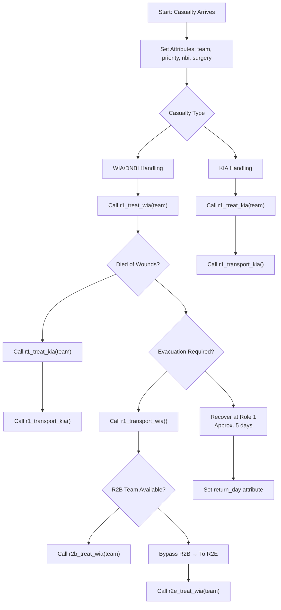
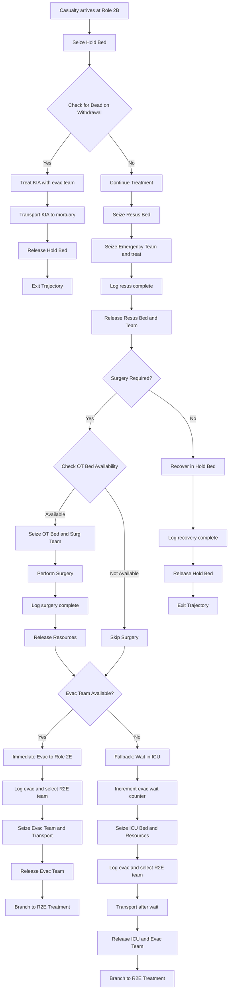
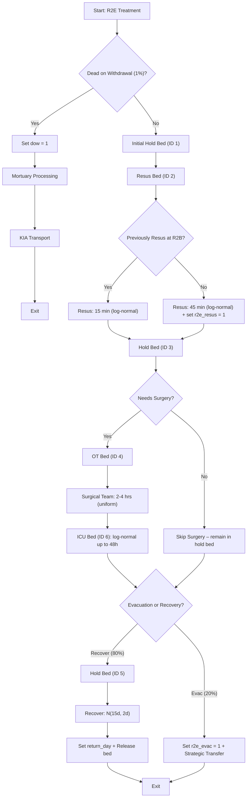

# Battlefield Casualty Handling Simulation

## Contents

<small>[Return to Top](#contents)</small>

<!-- TOC START -->
- [Contents](#contents)
- [📘 Introduction](#-introduction)
- [🌍 Context](#-context)
- [🧰 Resource Descriptions](#-resource-descriptions)
  - [🏥Health Teams](#health-teams)
    - [Role 1 (R1) Treatment Team](#role-1-r1-treatment-team)
    - [Role 2 Basic (R2B)](#role-2-basic-r2b)
    - [Role 2 Enhanced Heavy (R2E Heavy)](#role-2-enhanced-heavy-r2e-heavy)
  - [🛏️ Bed Types](#-bed-types)
    - [Operating Theatre (OT)](#operating-theatre-ot)
    - [Resuscitation (Resus) (alternatively Emergency)](#resuscitation-resus-alternatively-emergency)
    - [Intensive Care Unit (ICU)](#intensive-care-unit-icu)
    - [Holding (Hold)](#holding-hold)
  - [🚑 Transport Assets](#-transport-assets)
    - [Protected Mobility Vehicle Ambulance (PMV Ambulance)](#protected-mobility-vehicle-ambulance-pmv-ambulance)
    - [HX2 40M](#hx2-40m)
- [📊 Environment Data Summary](#-environment-data-summary)
  - [👥 Population Groups](#-population-groups)
  - [🚑 Transport Resources](#-transport-resources)
  - [🏥 Medical Resources](#-medical-resources)
- [🤕 Casualties](#-casualties)
  - [Casualty Generation](#casualty-generation)
    - [1. Lognormal Parameterisation](#1-lognormal-parameterisation)
    - [2. Per-Minute Rate Sampling and Scaling](#2-perminute-rate-sampling-and-scaling)
    - [3. Arrival Detection via Cumulative Sum](#3-arrival-detection-via-cumulative-sum)
    - [4. Temporal Randomisation](#4-temporal-randomisation)
  - [Wounded In Action (WIA)](#wounded-in-action-wia)
    - [Combat Casualties](#combat-casualties)
    - [Support Casualties](#support-casualties)
  - [Killed In Action (KIA)](#killed-in-action-kia)
    - [Combat Casualties](#combat-casualties)
    - [Support Casualties](#support-casualties)
  - [Disease and Non-Battle Injury (DNBI)](#disease-and-nonbattle-injury-dnbi)
    - [Combat Casualties](#combat-casualties)
    - [Support Casualties](#support-casualties)
    - [DNBI Sub-Categorisation](#dnbi-subcategorisation)
- [Casualty Priorities](#casualty-priorities)
- [Return to Duty](#return-to-duty)
- [Died of Wounds](#died-of-wounds)
- [Simulation Design](#simulation-design)
  - [🔧Simulation Environment Setup](#simulation-environment-setup)
  - [Core Trajectory](#core-trajectory)
  - [R2B Trajectory](#r2b-trajectory)
  - [R2E Heavy Trajectory](#r2e-heavy-trajectory)
- [Single Run Analysis](#single-run-analysis)
- [Further Development](#further-development)
- [References](#references)
- [Resources](#resources)
  <!-- TOC END -->

---

## 📘 Introduction

<small>[Return to Top](#contents)</small>

This is a Discrete Event Simulation (DES) written in R that uses the simmer package. The code is designed to simulate the flow of battlefield casualties in Large Scale Combat Operations (LSCO) scenarios. The purpose of the simulation is to support decision making on deployed health system design with a focus on capacity planning.

DES has been used as a proven way to simulate healthcare systems and support healthcare decision-making (as shown in [[9]](#References)).

## 🌍 Context

<small>[Return to Top](#contents)</small>

The code simulates a deployed combat brigade based on the Australian combat and health brigade capabilities.

**Organisation**. The simulation is built around the following design:

1. The combat brigade has formed `3` battlegroups headquartered by the resident `2` infantry battalions and `1` cavalry regiment. a commander's reserve has been established by the brigade commander formed around a combat team. The cavalry regiment based battlegroup is performing a screen forward of the two infantry battlegroups. Each battlegroup has been force assigned `2` treatment teams to provide close health support.

2. Artillery support is assigned with battery's assigned Direct Support (DS) to the infantry battlegroups and are placed with the capacity to provide support to their supported call-signs. The Brigade Headquarters (HQ) has established a HQ-Forward and HQ-Main. The HQ-Forward is placed one tactical bound behind the forward battlegroups. `1` additional treatment team has been establsihed to provide close health support to the artillery unit and HQ-Forward. `1` Role 2 - Basic (R2B) has been established in vicinity of the HQ-Forward to support damage control (DAMCON) and stabilise casualties prior to evacuation to higher level care.

3. The Combat Service Support Battalion (CSSB) has established the Brigade Maintenance Area (BMA). One further treatment team has been established to provide close health support within the BMA. To provide surgical capability to the brigade `1` Role 2 - Enhanced Heavy (R2E Heavy) hospital has been established within the BMA.

---

## 🧰 Resource Descriptions

<small>[Return to Top](#contents)</small>

### 🏥Health Teams

#### Role 1 (R1) Treatment Team

A role 1 treatment team provides the first line of medical care. It is designed to deliver immediate lifesaving measures, perform triage and stabilization, and manage minor injuries and illnesses close to the point of injury or unit location. These teams also prepare casualties for evacuation to higher levels of care if needed.

#### Role 2 Basic (R2B)

A Role 2 Basic (R2B) medical treatment facility provides forward surgical and resuscitative care close to the battlefield. Its purpose is to deliver damage-control surgery, critical care, and short-term patient holding in austere environments where rapid intervention can save lives.

It’s designed to be mobile, logistically lean, and capable of stabilizing casualties before evacuation to higher-level care. With ICU beds, low-dependency holding, and a surgical team, R2B bridges the gap between frontline treatment and more comprehensive facilities like Role 2 Enhanced or Role 3.

#### Role 2 Enhanced Heavy (R2E Heavy)

A R2E Heavy facility delivers advanced surgical and critical care capabilities in forward-deployed military operations. Its purpose is to provide damage-control surgery, intensive care, inpatient services, and scalable resuscitation for casualties who require more than basic stabilization but are not yet ready for strategic evacuation.

The R2E Heavy is a static field hospital with designed to handle complex trauma, prolonged care, and high casualty volumes—bridging the gap between battlefield stabilization and full hospital-level treatment.

### 🛏️ Bed Types

#### Operating Theatre (OT)

OT beds are specialized surgical stations designed to support damage-control surgery and life-saving interventions. These beds are part of a sterile operating suite and are equipped to handle:

- Emergency trauma procedures.
- Advanced surgical care including orthopedic, abdominal, and thoracic operations.
- Integrated anesthesia and monitoring systems for patient stability.
- Rapid turnover and sterilization protocols to manage high casualty volumes.

#### Resuscitation (Resus) (alternatively Emergency)

Emergency beds are designed for rapid stabilization and life-saving interventions immediately after casualty arrival. These beds support:

- Advanced trauma management including airway control, hemorrhage control, and shock treatment.
- Critical monitoring and resuscitation equipment such as defibrillators, oxygen delivery systems, and IV access.
- Quick turnover and accessibility to facilitate high casualty throughput during mass casualty events.
- Integration with surgical and evacuation pathways, ensuring seamless transition to operating theatres or higher echelons of care.

These beds serve as the first stop for severely injured personnel.

#### Intensive Care Unit (ICU)

Intensive Care Unit (ICU) beds are designed to deliver advanced life-support and continuous monitoring for critically injured or ill personnel. These beds serve as the backbone of forward-deployed critical care, enabling:

- Resuscitation and stabilization of casualties with multi-system trauma.
- Mechanical ventilation, invasive monitoring, and medication infusions.
- Postoperative care following damage-control surgery.
- Support for prolonged field care when evacuation is delayed.

ICU beds are equipped with portable monitors, ventilators, infusion pumps, and access to diagnostics like labs and imaging.

#### Holding (Hold)

Holding beds are designated for short-term patient care and observation, typically for those who are awaiting evacuation, recovering from minor procedures, or expected to return to duty soon. These beds serve as a transitional space between acute treatment zones (like ICU or OT) and final disposition—whether that’s evacuation to higher care or reintegration into the force.

They’re often used for:

- Postoperative recovery after damage-control surgery.
- Monitoring stable patients who don’t require intensive care.
- Staging casualties for medical evacuation.
- Low-dependency care such as hydration, pain management, or wound dressing.

Holding beds help to maintain patient flow and prevent bottlenecks in critical care areas.

### 🚑 Transport Assets

#### Protected Mobility Vehicle Ambulance (PMV Ambulance)

The PMV Ambulance (Protected Mobility Vehicle – Ambulance) is a blast-resistant, armored medical transport designed to safely evacuate casualties from combat zones. Based on the Bushmaster, it combines mobility, protection, and medical capability, allowing medics to deliver care en route while shielding patients from small arms fire, IEDs, and mines.

Its key features typically include:

- V-shaped hull for blast deflection
- Internal stretcher mounts and medical equipment
- Air conditioning and fire suppression systems
- Optional mounted weapon systems for self-defense

#### HX2 40M

The HX2 40M is a 4×4 tactical military truck developed by Rheinmetall MAN Military Vehicles (RMMV) as part of the HX2 series. Designed for high mobility and rugged performance, it serves as a versatile logistics platform for transporting troops, equipment, and supplies in demanding operational environments. In this simulation the HX2 40M is used for the transport of KIA and casualties that have DOW.

---

## 📊 Environment Data Summary

<small>[Return to Top](#contents)</small>

<!-- ENV SUMMARY START -->
<!-- This section is auto-generated. Do not edit manually. -->

### 👥 Population Groups

The following population groups are defined in the simulation environment:

| Population | Count |
|------------|-------|
| Combat | 2500 |
| Support | 1250 |

### 🚑 Transport Resources

These are the available transport platforms and their characteristics:

| Platform | Quantity | Capacity |
|----------|----------|----------|
| PMVAMB | 3 | 4 |
| HX240M | 4 | 50 |

### 🏥 Medical Resources

The following table summarises the medical elements configured in `env_data.json`, including team types, personnel, and beds:

| Element | Quantity | Beds | Base | Surg | Emerg | Icu | Evac |
| --- | --- | --- | --- | --- | --- | --- | --- |
| R1 | 3 | NA | Medic (3), Nurse (1), Doctor (1) | NA | NA | NA | NA |
| R2B | 1 | OT (1); Resus (2); ICU (2); Hold (5) | NA | Anesthetist (1), Surgeon (2), Medic (1) | Facem (1), Nurse (3), Medic (1) | Nurse (2), Medic (2) | Medic (2) |
| R2EHEAVY | 1 | OT (2); Resus (4); ICU (4); Hold (30) | NA | Anesthetist (1), Surgeon (2), Nurse (4) | Facem (1), Nurse (3), Medic (1) | Intensivist (1), Nurse (4) | Medic (2) |

<!-- ENV SUMMARY END -->

---

## 🤕 Casualties

<small>[Return to Top](#contents)</small>

Casualties are generated based on rates outlined in [[1]](#References) and refined with analysis provided in [[5]](#References) and supported by [[4]](#References), with the implementation outlined below.

Initially, WIA and KIA rates from US historical analysis of the Battle of Okinawa were used [[1]](#References), producing approximately 30 casualties per day for a force size of 3,750—yielding a casualty rate of ~0.8%. By comparison, Russia’s estimated 700–1,100 daily casualties from a committed force of 450,000–600,000 in Ukraine imply a lower casualty rate of ~0.2% [[7]](#References).

Given this discrepancy, a planning baseline was re-evaluated using historical data from the Falklands War, which suggests a casualty rate of ~0.37% [[1]](#References). This adjustment accounts for both the likely under-reporting in Russian casualty estimates—particularly of non-critical wounded personnel—and over three years of varied combat intensity in Ukraine, with seasonal fluctuations in operational tempo (source TBD).

Based on this reasoning, a daily casualty rate of ~0.37% is considered a suitable estimate for operational planning.

### Casualty Generation

For simulation efficiency, arrival times for cases were pre-computed and then introduced deterministically to the simulation environment for processing. The function simulates the timing of casualty arrivals using a lognormal distribution to reflect daily variability, transformed into randomized, minute-level arrival times. Rather than sampling explicit arrival times, the function models continuous per-minute intensity and converts this to discrete arrival events using cumulative thresholds. The general process is outlined below.

#### 1. Lognormal Parameterisation

Converts daily mean and standard deviation into log-space parameters, preserving the shape of the empirical distribution.

Mean (log-space):

$$
\mu_{\log} = \ln\left(\frac{\mu^2}{\sqrt{\sigma^2 + \mu^2}}\right)
$$

Standard deviation (log-space):

$$
\sigma_{\log} = \sqrt{\ln\left(1 + \frac{\sigma^2}{\mu^2}\right)}
$$

Where:

- \mu = expected number of DNBI casualties per day
- \sigma = daily standard deviation

#### 2. Per-Minute Rate Sampling and Scaling

Draws lognormally distributed samples representing per-minute DNBI rates, capped at a specified threshold to prevent extreme outliers. The sample is scaled according to population size and temporal resolution (per minute per 1000 personnel).

For each simulation minute $i \in \{1, 2, \dots, n_{\text{minutes}}\}$, the per-minute DNBI rate is computed as:

$$
r_i = \min\left(x_i, \text{cap}\right) \times \frac{P}{1000 \times 1440}
$$

Where:

- $x_i \sim \text{LogNormal}(\mu_{\log}, \sigma_{\log}^2)$
- $\mu_{\log} = \ln\left(\frac{\mu^2}{\sqrt{\sigma^2 + \mu^2}}\right)$
- $\sigma_{\log} = \sqrt{\ln\left(1 + \frac{\sigma^2}{\mu^2}\right)}$
- $\mu, \sigma$ = daily mean and standard deviation
- $\text{cap}$ = upper bound (e.g., 5) to prevent extreme values
- $P$ = population size (support or combat)
- $r_i$ = scaled and capped casualty rate for minute i

#### 3. Arrival Detection via Cumulative Sum

Accumulates per-minute rates and detects new arrivals based on when the cumulative total crosses each whole casualty threshold.

Let R = \{r_1, r_2, \dots, r_N\} be the per-minute rates. Then the cumulative sum is:

$$
C_i = \sum_{j=1}^{i} r_j
$$

An arrival is triggered at time i if:

$$
\lfloor C_i \rfloor > \lfloor C_{i-1} \rfloor
$$

This captures each increment in the expected arrival count.

#### 4. Temporal Randomisation

Introduces sub-minute jitter to avoid clustering arrivals on discrete time ticks and returns a sorted list of event timestamps.

### Wounded In Action (WIA)

#### Combat Casualties

Combat WIA casualty generation has been based on Falklands combat troop WIA rates ([[1]](#References), table A.8 p32).

$$
\mu = 1.77, \quad \sigma = 3.56
$$

#### Support Casualties

Support casualties employ the same casualty generation outlined above (except using the support population estimate of 1250 instead of the combatt population of 2250). This is on the basis that most historical modelling of force casualties include support elements at or below division in division and below casualty estimation due to their integral nature to combat operations and close proximity to the Forward Edge of the Battle Area (FEBA) (see [[4]](#References) and [[5]](#References) p 2-4).

### Killed In Action (KIA)

#### Combat Casualties

Combat WIA casualty generation has been based on Falklands combat troop WIA rates ([[1]](#References), table A.8 p32).

$$
\mu = 0.68, \quad \sigma = 1.39
$$

#### Support Casualties

Similar to WIA, support casualty KIA employ the same casualty generation outlined above (except using the support population estimate of 1250 instead of the combatt population of 2250) (see [[4]](#References) and [[5]](#References) p 2-4).

### Disease and Non-Battle Injury (DNBI)

#### Combat Casualties

Combat DNBI casualty generation has been based on Vietnam combat troop DNBI rates ([[1]](#References), table A.5 p31).

$$
\mu = 2.04, \quad \sigma = 1.89
$$

#### Support Casualties

Support DNBI casualty generation has been based on Okinawa support troop DNBI rates ([[1]](#References), table A.2 p29).

$$
\mu = 0.94, \sigma = 0.56
$$

#### DNBI Sub-Categorisation

DNBI cases were further sub-categorised as either NBI or disease/battle fatigue with 17% of DNBI cases being allocated as NBI and the remainder disease or battle fatigue (per [[1]](#References), pp 22-23).

## Casualty Priorities

<small>[Return to Top](#contents)</small>

The following casualty priority rates were used with the rates requiring surgery (informed by [[2]](#References)):

- **Priority 1**. 65% of casualties with 90% requiring surgery.

- **Priority 2**. 20% of casualties with 80% requiring surgery.

- **Priority 3**. 15% of casualties with:
  
  - 40% of DNBI requiring surgery.
  
  - 60% of other priority 3 casualties requiring surgery. 

## Return to Duty

<small>[Return to Top](#contents)</small>

- Priority 3 are returned to duty from R1. Priority 1 and 2 that do not require surgery are RTF post recovery from emergency treatment at r2b.

- Per [[3]](#References), of those admitted to MTFs, the distribution for return to duty was 42.1 percent in Republic of Vietnam, 7.6 percent in the U.S. Indo-Pacific Command, and 33.4 percent in the CONUS.

## Died of Wounds

<small>[Return to Top](#contents)</small>

5% of Priority 1 and 2.5% of P2 at R1, 1% of arrivals at R2B, 1% of arrivals ar R2E Heavy

---

## Simulation Design

<small>[Return to Top](#contents)</small>

### 🔧Simulation Environment Setup

The simulation models casualty handling across echelons of care in a battlefield environment, structured around modular trajectories and dynamic resource availability. It operates within a discrete-event simulation framework using `simmer`, and is driven by probabilistic rates, conditional branching, and resource interactions across Role 1 (R1), Role 2 Basic (R2B), and Role 2 Enhanced Heavy (R2E) facilities.

The simulation was designed around the general functions of each role of health element as outlined in the diagram below. Where roles overlap they are able to provide the same functions to varying degree.

```mermaid
block-beta
  columns 13

  a["Casualty Care"]:13
  b["R1"]:3
  c["R2B"]:4 space:9
  e["R2E"]:7 space:6
  f["R4"]:10

  g["Triage"]
  h["POI Care"]
  i["MEDIVAC"]
  j["Resus/Emergency"]
  k["Abbreviated Surgery"]
  l["ICU Stabilisation"]
  m["MEDIVAC"]
  n["Definitive Surgery"]
  o["Recovery"]
  p["MEDIVAC"]
  q["Reconstructive Surgery"]
  r["Rehabilitation"]
  s["Long Term Recovery"]

  %% Role 1 Care (forward emergency)
  style b fill:#cce5ff,stroke:#3399ff,stroke-width:2px
  style g fill:#cce5ff,stroke:#3399ff
  style h fill:#cce5ff,stroke:#3399ff
  style i fill:#cce5ff,stroke:#3399ff

  %% Role 2 Care (damage control surgery and ICU)
  style c fill:#d5f5e3,stroke:#2ecc71,stroke-width:2px
  style e fill:#e9f78f,stroke:#a9d70b,stroke-width:3px
  style j fill:#d5f5e3,stroke:#2ecc71
  style k fill:#d5f5e3,stroke:#2ecc71
  style l fill:#d5f5e3,stroke:#2ecc71
  style m fill:#d5f5e3,stroke:#2ecc71

  %% Role 4 Care (definitive treatment + recovery)
  style f fill:#f9e79f,stroke:#f1c40f,stroke-width:2px
  style n fill:#e9f78f,stroke:#a9d70b
  style o fill:#e9f78f,stroke:#a9d70b
  style p fill:#e9f78f,stroke:#a9d70b
  style q fill:#f9e79f,stroke:#f1c40f
  style r fill:#f9e79f,stroke:#f1c40f
  style s fill:#f9e79f,stroke:#f1c40f

```

---

### Core Trajectory

This trajectory defines how a battlefield casualty is processed at Role 1 care and routed onward to either Role 2B, Role 2E, or recovery. It applies distinct treatment logic based on casualty type—WIA (wounded in action), DNBI (disease/non-battle injury), or KIA (killed in action)—and dynamically evaluates surgery requirements, priority, and disposition pathways.

🔢 Step 1: Attribute Initialization

Before treatment begins, each casualty is assigned key attributes:

- `team`: randomly selects one of the available Role 1 teams
- `priority`: for WIA/DNBI, a triage urgency level (1–3) using weighted probabilities; KIA receives `NA`
- `nbi`: flags DNBI casualties with a 17% chance
- `surgery`: determines surgical need based on priority and casualty type, with probabilities adjusted for severity

🔀 Step 2: Casualty Type Branching

**Path A: WIA/DNBI Casualties**

Casualties enter Role 1 treatment with team-specific logic:

1. **Role 1 Team Treatment**  
   Routed to the selected team’s treatment function (`r1_treat_wia`), enabling modular handling across Role 1 units.

2. **Died of Wounds (DOW) Evaluation**  
   Priority 1 and 2 casualties are checked for DOW risk:
- 5% chance for P1

- 2.5% chance for P2  
  If triggered:

- Casualty is flagged with `dow = 1`

- Routed to Role 1 KIA processing (`r1_treat_kia` + `r1_transport_kia`)
4. **Post-Treatment Disposition**
- Casualties that survive Role 1 care undergo further routing:

- **Evacuation Decision**  
  For high-priority (P1/P2) cases:

- ~95% of P1 and ~90% of P2 proceed to evacuation

- Role 2B team selection attempted via `select_available_r2b_team(env)`

- If successful → proceed to `r2b_treat_wia`

- If unavailable → bypass to `r2e_treat_wia`; flag `r2b_bypassed = 1`

- **Recovery Decision**  
  Lower-priority or DNBI casualties who don’t meet evac thresholds recover locally at Role 1:

- Recovery duration follows a beta distribution scaled to ~5 days

- `return_day` timestamp is logged on completion

**Path B: KIA Casualties**

Casualties identified as KIA follow a simplified treatment path:

- Assigned to Role 1 mortuary care via their `team` index
- Routed through `r1_treat_kia` followed by mortuary transport using `r1_transport_kia`

### R2B Trajectory

Casualties entering R2B undergo the following phases:

1. **Hold Bed Assignment**
   
   - Initial stabilization; DOW identified and subsequently transported to mortuary (~1%)

2. **Resuscitation Phase**
   
   - Emergency team support; logs `r2b_resus = 1`

3. **Surgical Decision**
   
   - OT bed capacity assessed
   - If available, surgery duration modeled with `rtruncnorm()`
   - If skipped, recovery in hold bed with beta-distributed duration

4. **Evacuation Assessment**
   
   - If evac team is free, casualty is routed to R2E
   - If not, joins ICU wait loop via `wait_for_evac` until capacity frees

5. **Mortuary Handling (if DOW)**
   
   - Executes `r2b_treat_kia()` and `r2b_transport_kia()`

Key attributes:

- `r2b_treated`, `r2b_surgery`, `evac_wait_count`, `return_day`, `r2b_to_r2e`

### R2E Heavy Trajectory

Role 2E offers advanced medical intervention and strategic routing:

1. **DOW Check (~1%)**
   
   - Routes casualty to `r2e_treat_kia()` + `r2e_transport_kia()`

2. **Initial Hold Bed & Resuscitation**
   
   - Duration varies based on prior R2B treatment
   - `r2e_resus = 1` logged for primary interventions
   
   There were no clear durations that could be identified in literature for the duration to be used for the resuscitation/emergency phase of treatment in the R2E Heavy. Instead, the likely/anticipated tasks required to be undertaken in this phase were collated with task duration estimates collated to produce estimates for use in the simulation. The durations were developed recognising the need for all activities to be completed within 90 min as indicated by [[10]](#References).
   
   | Long Resuscitation       |           |            |           |
   | ------------------------ | --------- | ---------- | --------- |
   | Step                     | Min (min) | Mode (min) | Max (min) |
   | Hemorrhage Control       | 2         | 5          | 10        |
   | IV/IO Access             | 2         | 5          | 10        |
   | TXA Administration       | 10        | 10         | 15        |
   | Fluid Resuscitation      | 5         | 10         | 20        |
   | Airway/Breathing Support | 3         | 5          | 10        |
   | TBI Monitoring & Warming | 2         | 5          | 10        |
   | Documentation/Prep       | 2         | 3          | 5         |
   | **TOTAL**                | 25        | 45         | 70        |
   
   | Short Reuscitation       |           |            |           |
   | ------------------------ | --------- | ---------- | --------- |
   | Step                     | Min (min) | Mode (min) | Max (min) |
   | Hemorrhage Control       | 2         | 5          | 10        |
   | IV/IO Access             | 2         | 5          | 10        |
   | Fluid Resuscitation      | 5         | 10         | 20        |
   | TBI Monitoring & Warming | 2         | 5          | 10        |
   | Documentation/Prep       | 2         | 3          | 5         |
   | **TOTAL**                | 13        | 28         | 55        |
   
   Resus:
   
   

3. **Surgery Branch**
   
   - If `surgery = 1`, OT bed and surgical team are seized
   - A triangular distributions was employed as they are generally used when the underlying distribution is unknown, but a minimal value, some maximal value, and a most likely value are available [[8]](#References). This approach is similar to other applications of DES in clinical settings, as shown in [[9]](#References). 
   - Due to the variability of potential requirements for surgery it is difficult to establish specific durations for surgery time, however some meta studies for particular DCS-III surgery types ([[11]](#References), [[12]](#References) and [[13]](#References)) provide some indication for surgery times that were used for the definition for this simulation:
   - min: 41 min
   - max: 210 min 
   - mode: 95 min   
   
   
   
   - COULD ENHANCE: https://academic.oup.com/milmed/article/188/11-12/e3368/6961509?login=false provides timings for mild, moderate, severe and critical cases.
   - If skipped, casualty remains in hold bed
4. **Post Surgery ICU**. Following surgery casualties are admitted to the ICU for moonitoring. Times for this ICU period are derived from [[14]](#References), [[15]](#References) and [[16]](#References).
   
   min: 12 h (770 min)
   
   max: 36 h (2160 min)
   
   mode: 24 h (1440 min)
   
   **Final Disposition**
   - 20% recover locally (6–10 days); `return_day` logged
   - 80% routed for strategic evacuation; `r2e_evac = 1` assigned

Attributes tracked:

- `r2e_treated`, `r2e_handling`, `r2e_resus`, `r2e_evac`, `return_day`, `mortuary_treated`, `dow`

---

DOW: 5% of total [[6]](#References). 

- Role 1: 5% P1, 2.5% P2 on arrival

- Role 2B: 1% on arrival

- Role 2E: 1% on arrival

---

## Single Run Analysis

1. Seems that there is insufficient OT bed / surgical capability availability compared to other resource types in the architecture.

2. the holding bed volume assumes ready access to strategic medical evacuation which may not be valid in LSCO.

[Sankey flow diagram](%5Bplotly-logomark%5D(https://natosys.github.io/Battlefield-Casualty-Handling/sankey.html)), gives a visual diagram of the flow of casualties between echelons of health care.

---

## Further Development

1. Add usage of transport resources for return journey

2. Pulse strategic medical evacuation to simuate temporal availability of the resource

3. 

---

## References

<small>[Return to Top](#contents)</small>

<!-- REFERENCES START -->

[1] Blood, CG; Zouris, JM; Rotblatt, D; (1998) *Using the Ground Forces Casualty System (FORECAS) to Project Casualty Sustainment*. Accessed: 20 Jul 25. (Available at: https://ia803103.us.archive.org/18/items/DTIC_ADA339487/DTIC_ADA339487_text.pdf)

[2] Australian Army (2018) *Land Warfare Publication 0-5-2 Staff Officers Aide-Memoir*. Accessed 20 Jul 25.

[3] Izaguirre, MK; Cox, D; Lodi, PC; Giraud, RS; Murray, CK; Teyhen, DS; Capaldi, VF; Kelly, KM;  Taylor, JF; Holland, JC; Laragione, VJ. (March 2025) *To Conserve Fighting Strength in Large Scale Combat Operations*. Military Review Online. Accessed: 20 Jul 25. (Available at: https://www.armyupress.army.mil/Journals/Military-Review/Online-Exclusive/2025-OLE/Conserve-Fighting-Strength-in-LSCO/)

[4] Kemple, W. G., & Lacy, L. W. (1995). *Modeling command and control: The design and implementation of the C2 model*. Defense Technical Information Center. [https://apps.dtic.mil/sti/html/tr/ADA304910/](https://apps.dtic.mil/sti/html/tr/ADA304910/)

[5] Gibson, D (2003). *Casualty estimation in modern warfare*. The Free Library. https://www.thefreelibrary.com/Casualty%2Bestimation%2Bin%2Bmodern%2Bwarfare.-a0110459243

[6] Holcomb, J. B., Stansbury, L. G., Champion, H. R., Wade, C., & Bellamy, R. F. (2006). *Understanding combat casualty care statistics*. U.S. Army Institute of Surgical Research. [https://apps.dtic.mil/sti/pdfs/ADA480496.pdf](https://apps.dtic.mil/sti/pdfs/ADA480496.pdf)

[7] The Economist. (2025, July 9). *Russia’s summer Ukraine offensive looks like its deadliest yet*. [https://www.economist.com/interactive/graphic-detail/2025/07/09/russias-summer-ukraine-offensive-looks-like-its-deadliest-so-far](https://www.economist.com/interactive/graphic-detail/2025/07/09/russias-summer-ukraine-offensive-looks-like-its-deadliest-so-far)

[8] Wang, Y., & Pinsky, E. (2023). Geometry of deviation measures for triangular distributions. *Frontiers in Applied Mathematics and Statistics*, *9*, 1274787. Accessed: 26 Jul 25. (Available at: https://doi.org/10.3389/fams.2023.1274787)

[9] Maddeh, M., Ayouni, S., Al-Otaibi, S., Alazzam, M. B., Alturki, N. M., & Hajjej, F. (2023). Discrete-Event Simulation Model for Monitoring Elderly and Patient’s Smart Beds. *Journal of Disability Research*, *2*(3), 1-9. DOI: 10.57197/JDR-2023-0026. Accessed: 26 Jul 25. (Available at: https://www.scienceopen.com/hosted-document?doi=10.57197/JDR-2023-0026)

[10] Abri, M. A., Snani, S. A., Almayahi, J., Sharqi, A. A., & Qadhi, H. A. The Outcome of Damage Control Surgery at Sultan Qaboos University Hospital. *World J Surg Surgical Res. 2022; 5*, *1428*. Accessed: 26 Jul 25. (Available at: https://www.surgeryresearchjournal.com/open-access/the-outcome-of-damage-control-surgery-at-sultan-qaboos-university-9532.pdf?utm_source=chatgpt.com)

[11] Zizzo, M., Ruiz, C. C., Zanelli, M., Bassi, M. C., Sanguedolce, F., Ascani, S., & Annessi, V. (2020). Damage control surgery for the treatment of perforated acute colonic diverticulitis: a systematic review. *Medicine*, *99*(48), e23323. Accessed 26 Jul 25. (Available at: https://journals.lww.com/md-journal/fulltext/2020/11250/damage_control_surgery_for_the_treatment_of.43.aspx)

[12] Krige, J. E., Navsaria, P. H., & Nicol, A. J. (2016). Damage control laparotomy and delayed pancreatoduodenectomy for complex combined pancreatoduodenal and venous injuries. *European Journal of Trauma and Emergency Surgery*, *42*(2), 225-230. Accessed: 26 Jul 25. (Available at: https://pubmed.ncbi.nlm.nih.gov/26038043/)

[13] Hall, A., Graham, B., Hanson, M., & Stern, C. (2023). Surgical capability utilization time for military casualties at Role 2 and Role 3 facilities. *Military medicine*, *188*(11-12), e3368-e3370. Accessed: 26 Jul 25. (Available at: https://doi.org/10.1093/milmed/usac414)

[14] Lamb, C. M., MacGoey, P., Navarro, A. P., & Brooks, A. J. (2014). Damage control surgery in the era of damage control resuscitation. *British Journal of Anaesthesia*, *113*(2), 242-249. Accessed: 27 Jul 25. (Available at: https://doi.org/10.1093/bja/aeu233)

[15] Allen, S. R., Brooks, A. J., Reilly, P. M., & Cotton, B. A. (2011). Damage Control Part III: Definitive Reconstruction. In *Ryan's Ballistic Trauma* (pp. 453-460). Springer, London. (Available at: https://link.springer.com/chapter/10.1007/978-1-84882-124-8_31)

[16] Nickson, C. (2020, November 3). *Damage Control Resuscitation*. Life in the Fastlane. Retrieved July 27, 2025, from https://litfl.com/damage-control-resuscitation/

<!-- REFERENCES END -->

## Resources

Possible information on casualty flow and handling considerations for inclusion in simulations:

https://pure.southwales.ac.uk/ws/portalfiles/portal/987130/1_3_Bricknell_Paper_3_Casualty_Estimation_final_PhD.pdfResources

Possible information on casualty flow and handling considerations for inclusion in simulations:

https://pure.southwales.ac.uk/ws/portalfiles/portal/987130/1_3_Bricknell_Paper_3_Casualty_Estimation_final_PhD.pdf
