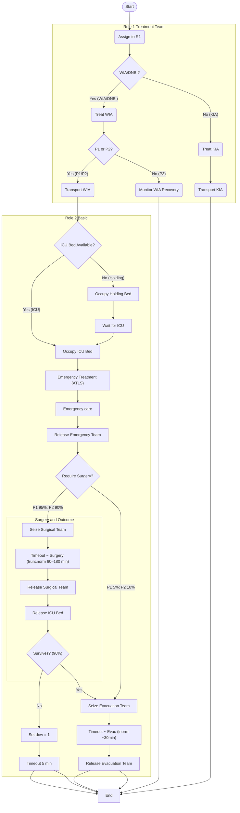

# Battlefield Casualty Handling Simulation

## 📘 Introduction

This is a Discrete Event Simulation (DES) written in R that uses the simmer package. The code is designed to simulate the flow of battlefield casualties in Large Scale Combat Operations (LSCO) scenarios. The purpose of the simulation is to support decision making on deployed health system design with a focus on capacity planning.

## 🌍 Context

The code simulates a deployed combat brigade based on the Australian combat and health brigade capabilities.

**Organisation**. The simulation is built around the following design:

1. The combat brigade has formed `3` battlegroups headquartered by the resident `2` infantry battalions and `1` cavalry regiment. a commander's reserve has been established by the brigade commander formed around a combat team. The cavalry regiment based battlegroup is performing a screen forward of the two infantry battlegroups. Each battlegroup has been force assigned `2` treatment teams to provide close health support.

2. Artillery support is assigned with battery's assigned Direct Support (DS) to the infantry battlegroups and are placed with the capacity to provide support to their supported call-signs. The Brigade Headquarters (HQ) has established a HQ-Forward and HQ-Main. The HQ-Forward is placed one tactical bound behind the forward battlegroups. `1` additional treatment team has been establsihed to provide close health support to the artillery unit and HQ-Forward. `1` Role 2 - Basic (R2B) has been established in vicinity of the HQ-Forward to support damage control (DAMCON) and stabilise casualties prior to evacuation to higher level care.

3. The Combat Service Support Battalion (CSSB) has established the Brigade Maintenance Area (BMA). One further treatment team has been established to provide close health support within the BMA. To provide surgical capability to the brigade a Role 2 - Enhanced Heavy (R2E Heavy) hospital has been established within the BMA.

---

## 🤕 Casualties

Casualties are generated based on rates outlined in [[1]](#References) and refined with analysis provided in [[5]](#References) and supported by [[4]](#References), with the implementation outlined below.

### Wounded In Action (WIA)

Casualty generation has been based on Okinawa combat troop WIA rates ([[1]](#References), table A.7, p 32). The $\lambda_{day}=6.86$ WIA rate was converted from a per day to $\lambda_{min}$ (a per minute rate) adjusted for the combat troop population:

$$
\lambda_{\text{min}} = \left(\frac{\alpha_\text{pop}}{1000}\right)\times\left(\frac{\lambda_{\text{daily}}}{T_{min}}\right)
$$

Where:

- $\lambda_{min}$ = the rate per minute.

- $\alpha_{pop}$ = the population of combat forces.

- $\lambda_{\text{daily}}=6.86$ is the WIA rate per day per 1000 population.

- $T_{min}=1440$ is the number of minutes in a day.

- $\alpha_{pop}=2250$ is the population of combat forces.

$$
\lambda_{\text{min}} = \left(\frac{2250}{1000}\right)\times\left(\frac{6.86}{1440}\right) \approx 0.01071875
$$

The $\lambda_{min}$ was then used in an exponential rate generator for the simulation.

$$
f(x; \lambda_{min}) = \lambda e^{-\lambda x}, \quad x \geq 0
$$

Support casualties employ the same casualty generation outlined above (except using the support population estimate of 1250 instead of the combatt population of 2250). This is on the basis that most historical modelling of force casualties include support elements at or below division in division and below casualty estimation due to their integral nature to combat operations and close proximity to the Forward Edge of the Battle Area (FEBA) (see [[4]](#References) and [[5]](#References) p 2-4).  

### Killed In Action (KIA)

KIA casualty generation has been based on Okinawa combat troop KIA rates ([[1]](#References), table A.9, p 33). The $\lambda_{day}=1.63$ KIA rate was converted from a per day to $\lambda_{min}$ using the same process outlined above providing:

$$
\lambda_{min}=0.002546875
$$

As in the case for WIA, KIA support casualties employ the same casualty generation outlined above (except using the support population estimate of 1250 instead of the combatt population of 2250). This is on the basis that most historical modelling of force casualties include support elements at or below division in division and below casualty estimation due to their integral nature to combat operations and close proximity to the Forward Edge of the Battle Area (FEBA) (see [[4]](#References) and [[5]](#References) p 2-4).

### Disease and Non-Battle Injury (DNBI)

For simulation efficiency arrival times for DNBI cases were pre-computed and then introduced deterministically to the simulation environment for processing. The function simulates the timing of DNBI casualty arrivals using a lognormal distribution to reflect daily variability, then transforms that data into randomized, minute-level arrival times. Rather than sampling explicit arrival times, the function models continuous per-minute intensity and converts this to discrete arrival events using cumulative thresholds. The general process is outlined below.

#### 1. Lognormal Parameterisation

Converts daily mean and standard deviation into log-space parameters, preserving the shape of the empirical distribution.

Mean (log-space):

$$
\mu_{\log} = \ln\left(\frac{\mu^2}{\sqrt{\sigma^2 + \mu^2}}\right)
$$

Standard deviation (log-space):

$$
\sigma_{\log} = \sqrt{\ln\left(1 + \frac{\sigma^2}{\mu^2}\right)}
$$

Where:

- $\mu$ = expected number of DNBI casualties per day
- $\sigma$ = daily standard deviation

#### 2. Per-Minute Rate Sampling and Scaling

Draws  lognormally distributed samples representing per-minute DNBI rates, capped at a specified threshold to prevent extreme outliers. The sample is scaled according to population size and temporal resolution (per minute per 1000 personnel).

For each simulation minute $i \in \{1, 2, \dots, n_{\text{minutes}}\}$, the per-minute DNBI rate is computed as:

$$
r_i = \min\left(x_i, \text{cap}\right) \times \frac{P}{1000 \times 1440}
$$

Where:

- $x_i \sim \text{LogNormal}(\mu_{\log}, \sigma_{\log}^2)$
- $\mu_{\log} = \ln\left(\frac{\mu^2}{\sqrt{\sigma^2 + \mu^2}}\right)$
- $\sigma_{\log} = \sqrt{\ln\left(1 + \frac{\sigma^2}{\mu^2}\right)}$
- $\mu, \sigma$ = daily mean and standard deviation
- $\text{cap}$ = upper bound (e.g., 5) to prevent extreme values
- $P$ = population size (support or combat)
- $r_i$ = scaled and capped casualty rate for minute i

#### 3. Arrival Detection via Cumulative Sum

Accumulates per-minute rates and detects new arrivals based on when the cumulative total crosses each whole casualty threshold.

Let $R = \{r_1, r_2, \dots, r_N\}$ be the per-minute rates. Then the cumulative sum is:

$$
C_i = \sum_{j=1}^{i} r_j
$$

An arrival is triggered at time i if:

$$
\lfloor C_i \rfloor > \lfloor C_{i-1} \rfloor
$$

This captures each increment in the expected arrival count.

#### 4. Temporal Randomisation

Introduces sub-minute jitter to avoid clustering arrivals on discrete time ticks and returns a sorted list of event timestamps.

#### Combat Casualties

Combat DNBI casualty generation has been based on Vietnam combat troop DNBI rates ([[1]](#References), table A.5 p31).

$$
\mu = 2.04, \quad \sigma = 1.89
$$

#### Support Casualties

Support DNBI casualty generation has been based on Okinawa support troop DNBI rates ([[1]](#References), table A.2 p29).

$$
\mu = 0.94, \sigma = 0.56
$$

#### DNBI Sub-Categorisation

DNBI cases were further sub-categorised as either NBI or disease/battle fatigue with 17% of DNBI cases being allocated as NBI and the remainder disease or battle fatigue (per [[1]](#References), pp 22-23).

## Casualty Priorities

The following casualty priority rates were used with the rates requiring surgery (informed by [[2]](#References)):

- **Priority 1**. 65% of casualties with 90% requiring surgery.

- **Priority 2**. 20% of casualties with 80% requiring surgery.

- **Priority 3**. 15% of casualties with:
  
  - 40% of DNBI requiring surgery.
  
  - 60% of other priority 3 casualties requiring surgery. 

## Return to Duty

- Priority 3 are returned to duty from R1. Priority 1 and 2 that do not require surgery are RTF post recovery from emergency treatment at r2b.

- Per [[3]](#References), of those admitted to MTFs, the distribution for return to duty was 42.1 percent in Republic of Vietnam, 7.6 percent in the U.S. Indo-Pacific Command, and 33.4 percent in the CONUS.

- ddd

---

## 👨‍⚕️Resources

**Health Teams**. The health architecture is made up of the following health teams:

- **Treatment Team**. The `8` treatment teams are made up of the following personnel resources:
  
  - `3` Medics
  
  - `1` Nurse
  
  - `1` Doctor

- **R2B**. The R2B is a forward-deployed, damage control surgical facility designed to stabilize and prepare casualties for evacuation. It includes medical, surgical, nursing, and bed management capabilities.

- The R2B is made up of the following personnel resources:
  
  - Surgical Team
    
    - `2` Surgeons
    - `1` Anesthetist
    - `1` Medic
  
  - Emergency Team
    
    - `1` FACEM (Emergency Physician)
    - `1` Medic
    - `3` Nurses
  
  - Evacuation Team
    
    - `2` Medics

- **R2E Heavy**. The R2E Heavy is a large field hospital, capable only of static deployments. It is capable of limited major surgery, stabilisation and recovery of casualties. It includes medical, surgical, nursing and bed management capabilities.

- The R2E Heavy is made up of the following personnel resources:
  
  - `3` Surgical Teams
  
  - `3` Emergency Teams
    
    - `1` FACEM
    - `1` Medic
    - `3` Nurses
  
  - `3` ICU Teams
  
  - `3` Evacuation Teams

**Transport Resources**. Transport resources are typically drawn from the supported call-sign or a CSS element. the following transport resources are available by echelon:

- **Treatment Team**. Treatment teams have access to battlegroup vehicle assets to effect casualty evacuations. The treatment teams have access to:
  
  - `2` PMV Ambulances per treatment team (for a total of `16`), used for the transport of Wounded In Action (WIA) and Disease and Non-Battle Injury (DNBI) to the R2B (where required)
  
  - `1` HX2 40 M per treatment team (for a total of `8`), used for the transport of Killed In Action (KIA) to the mortuary (at R2E)

Transport resources are shared across all treatment teams.

- **R2B**. The R2B has `1` dedicated evacuation team operating a PMV Ambulance. In addition to the dedicated resource of the R2B, the R2B has access to the following resources:
  
  - ...

**Bed Resources**. Beds are finite resources and are seized by patients during treatment and recovery phases, influencing throughput and capacity under casualty load. Not all health elements have dedicated bed resources.

- **Treatment Team**. No dedicated bed resources.

- **R2B**. R2B includes limited inpatient capacity to stabilize casualties prior to evacuation or return to duty. The R2B has the following bed capacity:
  
  - `1` Operating Theatre (OT) bed
  
  - `2` Resus beds
  
  - `2` ICU beds
  
  - `5` Holding beds

- **R2E Heavy**. The R2E Heavy holds the following bed capacity:
  
  - `2` OT beds
  
  - `4` Resus beds
  
  - `4` ICU beds
  
  - `30` Holding beds

---

# Simulation Design

## 🔧Simulation Environment Setup

- **Framework:** `simmer` (discrete-event simulation)

- **Context:** Battlefield casualty handling with Role 1 treatment and evacuation logic

---

### 🧬 **Casualty Trajectory Logic**

- Each casualty is assigned:
  
  - A team (random)
  
  - A priority (if WIA or DNBI, not KIA)

- Then:
  
  - **Branch 1:** WIA/DNBI
    
    - Treatment by assigned team
    
    - Conditional transport if Priority 1 or 2
  
  - **Branch 2:** KIA
    
    - Treatment by assigned team
    
    - Then transport to mortuary

[Online FlowChart &amp; Diagrams Editor - Mermaid Live Editor](https://mermaid.live/edit#pako:eNqVVP9vojAU_1ealyyRhCkFYUiMxpuXnDEuZLfcVy6mQqdk0JoCu3nG__0KBZWZy278QN-3vn4-7712DyGPKHjwmPDf4YaIHD1MA4bk9zmXWudnAJUQwC8NXV-P0AMl6STL4jXrBDBcjZSMcl55hr3VCA1XQv6ylCTJCJeeXHqWIS9YPuwpcwCaOuWUrsr-dTa53dDwaS-F3vTuw2x8UHGNQ0ah7zRDnSZAofJFzEWc747I6pyNvYUJ-dhz7Cvkm55pyMXysH11gaydUnEXlOTyYMW80kpgF6TvacYLEdLMQxZ6QSmN4lBHrBAZ1VHEw5wLVGQxWyOsnIiwSMphErM4jAlDnSq4p2K1Kve0ECSPOfNK-CJhXKQdbBo6MrrYtDW9pFObncqqjFZjVKG2dtmCmlWrkKoLAfgYSbC-OQ7g0K5Lux0-7vlmPSGCsGzLxXmlastb1cKOLJe_-LKcpCv0inVNw_oXjQtcd1zCshSmBWexrOQRUa2XeNA9DfkzFTsJbHzMdj5vZaL5bKKdZmDenoH5f89Au-vvZNgc3a7y_LLKb-BxJZ5P35Z9Y_F-BKfWVig-sqh8IuRSPhAq6FTrJuTV5vm5J2Cgw1rEEXi5KKgOKRUpKVXYl_sCyDc0pQF4UoyIeAogYAe5Z0vYD87TZpvgxXoD3iNJ5CWDYhuRnE5jshYkPVoFZREVt-VDBJ7pYrPKAt4eXqRuuvIiOXgwuLFdu29YNzrsQD4UXYwtx7b6huGatoMPOvypzjW6LrYMyzXdgd13Bo7jHP4CLfKgpA)

---

### 💀 **KIA (Killed in Action) Handling**

- **Treatment (`treat_kia()`):**
  
  - Selects medics using shortest-queue policy
  
  - Brief timeout (avg 15 min), simulating confirmation and prep for evacuation

- **Transport (`transport_kia()`):**
  
  - Uses HX2_40M vehicles (selected by shortest queue)
  
  - Simulates transport to mortuary near Role 2 (avg ~30 min, log-normal)

---

### 🤕 **WIA (Wounded in Action) / DNBI (Disease/Non-Battle Injury) Handling**

- **Treatment (`treat_wia()`):**
  
  - Seizes medics and clinicians (shortest-queue per group)
  
  - Treatment duration depends on assigned `priority` (1–3), drawn probabilistically
    
    - Priority 1: ~120 min
    
    - Priority 2: ~60 min
    
    - Priority 3: ~20 min

- **Evacuation Decision:**
  
  - Only Priority 1 & 2 trigger **transport to Role 2** via PMV_Amb
  
  - Priority 3 enters a recovery trajectory taking between 0 and 5 days to recover with an average of 2 days to recover and return to the force.

---

# References

[1] Blood, C., Zouris, J.M. and Rotblatt, D. (1997) Using the Ground Forces Casualty Forecasting System (FORECAS) to Project Casualty Sustainment. Accessed 23 Mar 2025 (Available at: [https://ia803103.us.archive.org/18/items/DTIC_ADA339487/DTIC_ADA339487_text.pdf](https://ia803103.us.archive.org/18/items/DTIC_ADA339487/DTIC_ADA339487_text.pdf)).

[2] Land Warfare Publication 0-5-2 Staff Officers Aide-Memoir 2018.

[3] https://www.armyupress.army.mil/Journals/Military-Review/Online-Exclusive/2025-OLE/Conserve-Fighting-Strength-in-LSCO/

[4] Kuhn, Ground Forces Battle Casualty Rate Patterns https://apps.dtic.mil/sti/html/tr/ADA304910/

[5] https://www.thefreelibrary.com/Casualty%2Bestimation%2Bin%2Bmodern%2Bwarfare.-a0110459243

Resources

Possible information on casualty flow and handling considerations for inclusion in simulations:

https://pure.southwales.ac.uk/ws/portalfiles/portal/987130/1_3_Bricknell_Paper_3_Casualty_Estimation_final_PhD.pdf
