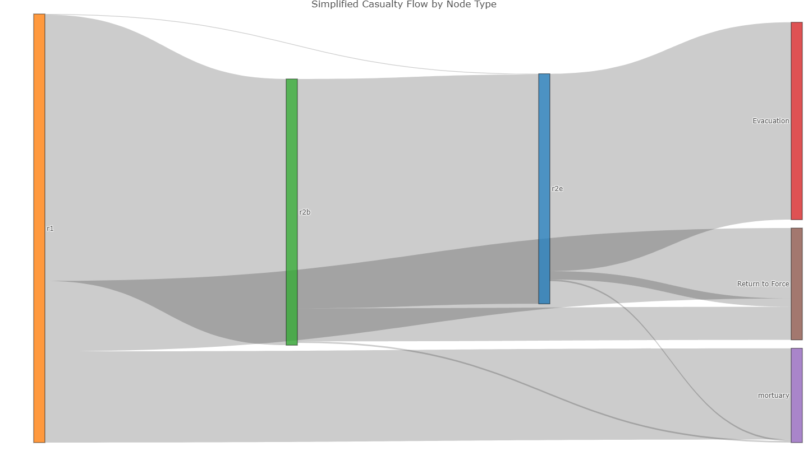

# Battlefield Casualty Handling Simulation

- [Battlefield Casualty Handling Simulation](#battlefield-casualty-handling-simulation)
  - [📘 Introduction](#-introduction)
  - [🌍 Context](#-context)
  - [🧰 Resource Descriptions](#-resource-descriptions)
    - [🏥Health Teams](#health-teams)
      - [Role 1 (R1) Treatment Team](#role-1-r1-treatment-team)
      - [Role 2 Basic (R2B)](#role-2-basic-r2b)
      - [Role 2 Enhanced Heavy (R2E Heavy)](#role-2-enhanced-heavy-r2e-heavy)
    - [🛏️ Bed Types](#-bed-types)
      - [Operating Theatre (OT)](#operating-theatre-ot)
      - [Resuscitation (Resus) (alternatively Emergency)](#resuscitation-resus-alternatively-emergency)
      - [Intensive Care Unit (ICU)](#intensive-care-unit-icu)
      - [Holding (Hold)](#holding-hold)
    - [🚑 Transport Assets](#-transport-assets)
      - [Protected Mobility Vehicle Ambulance (PMV Ambulance)](#protected-mobility-vehicle-ambulance-pmv-ambulance)
      - [HX2 40M](#hx2-40m)
  - [📊 Environment Data Summary](#-environment-data-summary)
    - [👥 Population Groups](#-population-groups)
    - [🚑 Transport Resources](#-transport-resources)
    - [🏥 Medical Resources](#-medical-resources)
  - [🤕 Casualties](#-casualties)
    - [Casualty Generation](#casualty-generation)
      - [1. Lognormal Parameterisation](#1-lognormal-parameterisation)
      - [2. Per-Minute Rate Sampling and Scaling](#2-perminute-rate-sampling-and-scaling)
      - [3. Arrival Detection via Cumulative Sum](#3-arrival-detection-via-cumulative-sum)
      - [4. Temporal Randomisation](#4-temporal-randomisation)
    - [Wounded In Action (WIA)](#wounded-in-action-wia)
      - [Combat Casualties](#combat-casualties)
      - [Support Casualties](#support-casualties)
    - [Killed In Action (KIA)](#killed-in-action-kia)
      - [Combat Casualties](#combat-casualties)
      - [Support Casualties](#support-casualties)
    - [Disease and Non-Battle Injury (DNBI)](#disease-and-nonbattle-injury-dnbi)
      - [Combat Casualties](#combat-casualties)
      - [Support Casualties](#support-casualties)
      - [DNBI Sub-Categorisation](#dnbi-subcategorisation)
  - [Casualty Priorities](#casualty-priorities)
  - [Return to Duty](#return-to-duty)
  - [Died of Wounds](#died-of-wounds)
- [Simulation Design](#simulation-design)
  - [🔧Simulation Environment Setup](#simulation-environment-setup)
    - [🧬 **Casualty Trajectory Logic**](#-casualty-trajectory-logic)
    - [💀 **KIA (Killed in Action) Handling**](#-kia-killed-in-action-handling)
    - [🤕 **WIA (Wounded in Action) / DNBI (Disease/Non-Battle Injury) Handling**](#-wia-wounded-in-action-dnbi-diseasenonbattle-injury-handling)
- [References](#references)

## 📘 Introduction

This is a Discrete Event Simulation (DES) written in R that uses the simmer package. The code is designed to simulate the flow of battlefield casualties in Large Scale Combat Operations (LSCO) scenarios. The purpose of the simulation is to support decision making on deployed health system design with a focus on capacity planning.

## 🌍 Context

The code simulates a deployed combat brigade based on the Australian combat and health brigade capabilities.

**Organisation**. The simulation is built around the following design:

1. The combat brigade has formed `3` battlegroups headquartered by the resident `2` infantry battalions and `1` cavalry regiment. a commander's reserve has been established by the brigade commander formed around a combat team. The cavalry regiment based battlegroup is performing a screen forward of the two infantry battlegroups. Each battlegroup has been force assigned `2` treatment teams to provide close health support.

2. Artillery support is assigned with battery's assigned Direct Support (DS) to the infantry battlegroups and are placed with the capacity to provide support to their supported call-signs. The Brigade Headquarters (HQ) has established a HQ-Forward and HQ-Main. The HQ-Forward is placed one tactical bound behind the forward battlegroups. `1` additional treatment team has been establsihed to provide close health support to the artillery unit and HQ-Forward. `1` Role 2 - Basic (R2B) has been established in vicinity of the HQ-Forward to support damage control (DAMCON) and stabilise casualties prior to evacuation to higher level care.

3. The Combat Service Support Battalion (CSSB) has established the Brigade Maintenance Area (BMA). One further treatment team has been established to provide close health support within the BMA. To provide surgical capability to the brigade `1` Role 2 - Enhanced Heavy (R2E Heavy) hospital has been established within the BMA.

---

## 🧰 Resource Descriptions

### 🏥Health Teams

#### Role 1 (R1) Treatment Team

A role 1 treatment team provides the first line of medical care. It is designed to deliver immediate lifesaving measures, perform triage and stabilization, and manage minor injuries and illnesses close to the point of injury or unit location. These teams also prepare casualties for evacuation to higher levels of care if needed.

#### Role 2 Basic (R2B)

A Role 2 Basic (R2B) medical treatment facility provides forward surgical and resuscitative care close to the battlefield. Its purpose is to deliver damage-control surgery, critical care, and short-term patient holding in austere environments where rapid intervention can save lives.

It’s designed to be mobile, logistically lean, and capable of stabilizing casualties before evacuation to higher-level care. With ICU beds, low-dependency holding, and a surgical team, R2B bridges the gap between frontline treatment and more comprehensive facilities like Role 2 Enhanced or Role 3.

#### Role 2 Enhanced Heavy (R2E Heavy)

A R2E Heavy facility delivers advanced surgical and critical care capabilities in forward-deployed military operations. Its purpose is to provide damage-control surgery, intensive care, inpatient services, and scalable resuscitation for casualties who require more than basic stabilization but are not yet ready for strategic evacuation.

The R2E Heavy is a static field hospital with designed to handle complex trauma, prolonged care, and high casualty volumes—bridging the gap between battlefield stabilization and full hospital-level treatment.

### 🛏️ Bed Types

#### Operating Theatre (OT)

OT beds are specialized surgical stations designed to support damage-control surgery and life-saving interventions. These beds are part of a sterile operating suite and are equipped to handle:

- Emergency trauma procedures.
- Advanced surgical care including orthopedic, abdominal, and thoracic operations.
- Integrated anesthesia and monitoring systems for patient stability.
- Rapid turnover and sterilization protocols to manage high casualty volumes.

#### Resuscitation (Resus) (alternatively Emergency)

Emergency beds are designed for rapid stabilization and life-saving interventions immediately after casualty arrival. These beds support:

- Advanced trauma management including airway control, hemorrhage control, and shock treatment.
- Critical monitoring and resuscitation equipment such as defibrillators, oxygen delivery systems, and IV access.
- Quick turnover and accessibility to facilitate high casualty throughput during mass casualty events.
- Integration with surgical and evacuation pathways, ensuring seamless transition to operating theatres or higher echelons of care.

These beds serve as the first stop for severely injured personnel.

#### Intensive Care Unit (ICU)

Intensive Care Unit (ICU) beds are designed to deliver advanced life-support and continuous monitoring for critically injured or ill personnel. These beds serve as the backbone of forward-deployed critical care, enabling:

- Resuscitation and stabilization of casualties with multi-system trauma.
- Mechanical ventilation, invasive monitoring, and medication infusions.
- Postoperative care following damage-control surgery.
- Support for prolonged field care when evacuation is delayed.

ICU beds are equipped with portable monitors, ventilators, infusion pumps, and access to diagnostics like labs and imaging.

#### Holding (Hold)

Holding beds are designated for short-term patient care and observation, typically for those who are awaiting evacuation, recovering from minor procedures, or expected to return to duty soon. These beds serve as a transitional space between acute treatment zones (like ICU or OT) and final disposition—whether that’s evacuation to higher care or reintegration into the force.

They’re often used for:

- Postoperative recovery after damage-control surgery.
- Monitoring stable patients who don’t require intensive care.
- Staging casualties for medical evacuation.
- Low-dependency care such as hydration, pain management, or wound dressing.

Holding beds help to maintain patient flow and prevent bottlenecks in critical care areas.

### 🚑 Transport Assets

#### Protected Mobility Vehicle Ambulance (PMV Ambulance)

The PMV Ambulance (Protected Mobility Vehicle – Ambulance) is a blast-resistant, armored medical transport designed to safely evacuate casualties from combat zones. Based on the Bushmaster, it combines mobility, protection, and medical capability, allowing medics to deliver care en route while shielding patients from small arms fire, IEDs, and mines.

Its key features typically include:

- V-shaped hull for blast deflection
- Internal stretcher mounts and medical equipment
- Air conditioning and fire suppression systems
- Optional mounted weapon systems for self-defense

#### HX2 40M

The HX2 40M is a 4×4 tactical military truck developed by Rheinmetall MAN Military Vehicles (RMMV) as part of the HX2 series. Designed for high mobility and rugged performance, it serves as a versatile logistics platform for transporting troops, equipment, and supplies in demanding operational environments. In this simulation the HX2 40M is used for the transport of KIA and casualties that have DOW.

---

## 📊 Environment Data Summary

### 👥 Population Groups

The following population groups are defined in the simulation environment:

| Population | Count |
| ---------- | ----- |
| Combat     | 2500  |
| Support    | 1250  |

### 🚑 Transport Resources

These are the available transport platforms and their characteristics:

| Platform | Quantity | Capacity |
| -------- | -------- | -------- |
| PMVAMB   | 3        | 4        |
| HX240M   | 4        | 50       |

### 🏥 Medical Resources

The following table summarises the medical elements configured in `env_data.json`, including team types, personnel, and beds:

| Element  | Quantity | Beds                                  | Base                             | Surg                                    | Emerg                           | Icu                        | Evac      |
| -------- | -------- | ------------------------------------- | -------------------------------- | --------------------------------------- | ------------------------------- | -------------------------- | --------- |
| R1       | 6        | NA                                    | Medic (3), Nurse (1), Doctor (1) | NA                                      | NA                              | NA                         | NA        |
| R2B      | 2        | OT (1); Resus (2); ICU (2); Hold (5)  | NA                               | Anesthetist (1), Surgeon (2), Medic (1) | Facem (1), Nurse (3), Medic (1) | Nurse (2), Medic (2)       | Medic (2) |
| R2EHEAVY | 2        | OT (2); Resus (4); ICU (4); Hold (30) | NA                               | Anesthetist (1), Surgeon (2), Nurse (4) | Facem (1), Nurse (3), Medic (1) | Intensivist (1), Nurse (4) | Medic (2) |

---

## 🤕 Casualties

Casualties are generated based on rates outlined in [[1]](#References) and refined with analysis provided in [[5]](#References) and supported by [[4]](#References), with the implementation outlined below.

Initially, WIA and KIA rates from US historical analysis of the Battle of Okinawa were used [[1]](#References), producing approximately 30 casualties per day for a force size of 3,750—yielding a casualty rate of ~0.8%. By comparison, Russia’s estimated 700–1,100 daily casualties from a committed force of 450,000–600,000 in Ukraine imply a lower casualty rate of ~0.2% [[7]](#References).

Given this discrepancy, a planning baseline was re-evaluated using historical data from the Falklands War, which suggests a casualty rate of ~0.37% [[1]](#References). This adjustment accounts for both the likely under-reporting in Russian casualty estimates—particularly of non-critical wounded personnel—and over three years of varied combat intensity in Ukraine, with seasonal fluctuations in operational tempo (source TBD).

Based on this reasoning, a daily casualty rate of ~0.37% is considered a suitable estimate for operational planning.

### Casualty Generation

For simulation efficiency, arrival times for cases were pre-computed and then introduced deterministically to the simulation environment for processing. The function simulates the timing of casualty arrivals using a lognormal distribution to reflect daily variability, transformed into randomized, minute-level arrival times. Rather than sampling explicit arrival times, the function models continuous per-minute intensity and converts this to discrete arrival events using cumulative thresholds. The general process is outlined below.

#### 1. Lognormal Parameterisation

Converts daily mean and standard deviation into log-space parameters, preserving the shape of the empirical distribution.

Mean (log-space):

$$
\mu_{\log} = \ln\left(\frac{\mu^2}{\sqrt{\sigma^2 + \mu^2}}\right)
$$

Standard deviation (log-space):

$$
\sigma_{\log} = \sqrt{\ln\left(1 + \frac{\sigma^2}{\mu^2}\right)}
$$

Where:

- \mu = expected number of DNBI casualties per day
- \sigma = daily standard deviation

#### 2. Per-Minute Rate Sampling and Scaling

Draws lognormally distributed samples representing per-minute DNBI rates, capped at a specified threshold to prevent extreme outliers. The sample is scaled according to population size and temporal resolution (per minute per 1000 personnel).

For each simulation minute $i \in \{1, 2, \dots, n_{\text{minutes}}\}$, the per-minute DNBI rate is computed as:

$$
r_i = \min\left(x_i, \text{cap}\right) \times \frac{P}{1000 \times 1440}
$$

Where:

- $x_i \sim \text{LogNormal}(\mu_{\log}, \sigma_{\log}^2)$
- $\mu_{\log} = \ln\left(\frac{\mu^2}{\sqrt{\sigma^2 + \mu^2}}\right)$
- $\sigma_{\log} = \sqrt{\ln\left(1 + \frac{\sigma^2}{\mu^2}\right)}$
- $\mu, \sigma$ = daily mean and standard deviation
- $\text{cap}$ = upper bound (e.g., 5) to prevent extreme values
- $P$ = population size (support or combat)
- $r_i$ = scaled and capped casualty rate for minute i

#### 3. Arrival Detection via Cumulative Sum

Accumulates per-minute rates and detects new arrivals based on when the cumulative total crosses each whole casualty threshold.

Let R = \{r_1, r_2, \dots, r_N\} be the per-minute rates. Then the cumulative sum is:

$$
C_i = \sum_{j=1}^{i} r_j
$$

An arrival is triggered at time i if:

$$
\lfloor C_i \rfloor > \lfloor C_{i-1} \rfloor
$$

This captures each increment in the expected arrival count.

#### 4. Temporal Randomisation

Introduces sub-minute jitter to avoid clustering arrivals on discrete time ticks and returns a sorted list of event timestamps.

### Wounded In Action (WIA)

#### Combat Casualties

Combat WIA casualty generation has been based on Falklands combat troop WIA rates ([[1]](#References), table A.8 p32).

$$
\mu = 1.77, \quad \sigma = 3.56
$$

#### Support Casualties

Support casualties employ the same casualty generation outlined above (except using the support population estimate of 1250 instead of the combatt population of 2250). This is on the basis that most historical modelling of force casualties include support elements at or below division in division and below casualty estimation due to their integral nature to combat operations and close proximity to the Forward Edge of the Battle Area (FEBA) (see [[4]](#References) and [[5]](#References) p 2-4).

### Killed In Action (KIA)

#### Combat Casualties

Combat WIA casualty generation has been based on Falklands combat troop WIA rates ([[1]](#References), table A.8 p32).

$$
\mu = 0.68, \quad \sigma = 1.39
$$

#### Support Casualties

Similar to WIA, support casualty KIA employ the same casualty generation outlined above (except using the support population estimate of 1250 instead of the combatt population of 2250) (see [[4]](#References) and [[5]](#References) p 2-4).

### Disease and Non-Battle Injury (DNBI)

#### Combat Casualties

Combat DNBI casualty generation has been based on Vietnam combat troop DNBI rates ([[1]](#References), table A.5 p31).

$$
\mu = 2.04, \quad \sigma = 1.89
$$

#### Support Casualties

Support DNBI casualty generation has been based on Okinawa support troop DNBI rates ([[1]](#References), table A.2 p29).

$$
\mu = 0.94, \sigma = 0.56
$$

#### DNBI Sub-Categorisation

DNBI cases were further sub-categorised as either NBI or disease/battle fatigue with 17% of DNBI cases being allocated as NBI and the remainder disease or battle fatigue (per [[1]](#References), pp 22-23).

## Casualty Priorities

The following casualty priority rates were used with the rates requiring surgery (informed by [[2]](#References)):

- **Priority 1**. 65% of casualties with 90% requiring surgery.

- **Priority 2**. 20% of casualties with 80% requiring surgery.

- **Priority 3**. 15% of casualties with:
  
  - 40% of DNBI requiring surgery.
  
  - 60% of other priority 3 casualties requiring surgery. 

## Return to Duty

- Priority 3 are returned to duty from R1. Priority 1 and 2 that do not require surgery are RTF post recovery from emergency treatment at r2b.

- Per [[3]](#References), of those admitted to MTFs, the distribution for return to duty was 42.1 percent in Republic of Vietnam, 7.6 percent in the U.S. Indo-Pacific Command, and 33.4 percent in the CONUS.

- ddd

## Died of Wounds

...

---

# Simulation Design

## 🔧Simulation Environment Setup

- **Framework:** `simmer` (discrete-event simulation)

- **Context:** Battlefield casualty handling with Role 1 treatment and evacuation logic

---

### 🧬 **Casualty Trajectory Logic**

- Each casualty is assigned:
  
  - A team (random)
  
  - A priority (if WIA or DNBI, not KIA)

- Then:
  
  - **Branch 1:** WIA/DNBI
    
    - Treatment by assigned team
    
    - Conditional transport if Priority 1 or 2
  
  - **Branch 2:** KIA
    
    - Treatment by assigned team
    
    - Then transport to mortuary

[Online FlowChart &amp; Diagrams Editor - Mermaid Live Editor](https://mermaid.live/edit#pako:eNqVVP9vojAU_1ealyyRhCkFYUiMxpuXnDEuZLfcVy6mQqdk0JoCu3nG__0KBZWZy278QN-3vn4-7712DyGPKHjwmPDf4YaIHD1MA4bk9zmXWudnAJUQwC8NXV-P0AMl6STL4jXrBDBcjZSMcl55hr3VCA1XQv6ylCTJCJeeXHqWIS9YPuwpcwCaOuWUrsr-dTa53dDwaS-F3vTuw2x8UHGNQ0ah7zRDnSZAofJFzEWc747I6pyNvYUJ-dhz7Cvkm55pyMXysH11gaydUnEXlOTyYMW80kpgF6TvacYLEdLMQxZ6QSmN4lBHrBAZ1VHEw5wLVGQxWyOsnIiwSMphErM4jAlDnSq4p2K1Kve0ECSPOfNK-CJhXKQdbBo6MrrYtDW9pFObncqqjFZjVKG2dtmCmlWrkKoLAfgYSbC-OQ7g0K5Lux0-7vlmPSGCsGzLxXmlastb1cKOLJe_-LKcpCv0inVNw_oXjQtcd1zCshSmBWexrOQRUa2XeNA9DfkzFTsJbHzMdj5vZaL5bKKdZmDenoH5f89Au-vvZNgc3a7y_LLKb-BxJZ5P35Z9Y_F-BKfWVig-sqh8IuRSPhAq6FTrJuTV5vm5J2Cgw1rEEXi5KKgOKRUpKVXYl_sCyDc0pQF4UoyIeAogYAe5Z0vYD87TZpvgxXoD3iNJ5CWDYhuRnE5jshYkPVoFZREVt-VDBJ7pYrPKAt4eXqRuuvIiOXgwuLFdu29YNzrsQD4UXYwtx7b6huGatoMPOvypzjW6LrYMyzXdgd13Bo7jHP4CLfKgpA)

---

### 💀 **KIA (Killed in Action) Handling**

- **Treatment (`treat_kia()`):**
  
  - Selects medics using shortest-queue policy
  
  - Brief timeout (avg 15 min), simulating confirmation and prep for evacuation

- **Transport (`transport_kia()`):**
  
  - Uses HX2_40M vehicles (selected by shortest queue)
  
  - Simulates transport to mortuary near Role 2 (avg ~30 min, log-normal)

---

### 🤕 **WIA (Wounded in Action) / DNBI (Disease/Non-Battle Injury) Handling**

- **Treatment (`treat_wia()`):**
  
  - Seizes medics and clinicians (shortest-queue per group)
  
  - Treatment duration depends on assigned `priority` (1–3), drawn probabilistically
    
    - Priority 1: ~120 min
    
    - Priority 2: ~60 min
    
    - Priority 3: ~20 min

- **Evacuation Decision:**
  
  - Only Priority 1 & 2 trigger **transport to Role 2** via PMV_Amb
  
  - Priority 3 enters a recovery trajectory taking between 0 and 5 days to recover with an average of 2 days to recover and return to the force.

---

DOW: 5% of total [6]

---

[Sankey flow diagram]([plotly-logomark](https://natosys.github.io/Battlefield-Casualty-Handling/sankey.html)), gives a visual diagram of the flow of casualties between echelons of health care.

---

# References

[1] Blood, C., Zouris, J.M. and Rotblatt, D. (1997) Using the Ground Forces Casualty Forecasting System (FORECAS) to Project Casualty Sustainment. Accessed 23 Mar 2025 (Available at: [https://ia803103.us.archive.org/18/items/DTIC_ADA339487/DTIC_ADA339487_text.pdf](https://ia803103.us.archive.org/18/items/DTIC_ADA339487/DTIC_ADA339487_text.pdf)).

[2] Land Warfare Publication 0-5-2 Staff Officers Aide-Memoir 2018.

[3] https://www.armyupress.army.mil/Journals/Military-Review/Online-Exclusive/2025-OLE/Conserve-Fighting-Strength-in-LSCO/

[4] Kuhn, Ground Forces Battle Casualty Rate Patterns https://apps.dtic.mil/sti/html/tr/ADA304910/

[5] https://www.thefreelibrary.com/Casualty%2Bestimation%2Bin%2Bmodern%2Bwarfare.-a0110459243

[6] https://apps.dtic.mil/sti/pdfs/ADA480496.pdf

[7] https://www.economist.com/interactive/graphic-detail/2025/07/09/russias-summer-ukraine-offensive-looks-like-its-deadliest-so-far

Resources

Possible information on casualty flow and handling considerations for inclusion in simulations:

https://pure.southwales.ac.uk/ws/portalfiles/portal/987130/1_3_Bricknell_Paper_3_Casualty_Estimation_final_PhD.pdf
