# Battlefield Casualty Handling

## Abstract

This study presents a Discrete Event Simulation (DES) framework developed to evaluate resource utilization and casualty processing within a deployed battlefield medical system under Large Scale Combat Operations (LSCO). Leveraging parameterized inputs published in open-access literature, the simulation models per-minute casualty arrivals, triage, and surgical throughput across Role 1 (R1), Role 2 Basic (R2B), and Role 2 Enhanced – Heavy (R2E Heavy) treatment nodes.

The model enables extended-duration analysis at varying scales, capturing key metrics such as queue lengths, wait times, and resource saturation to identify temporal bottlenecks and assess system suitability. A three-stage damage control surgery model is embedded within the simulation to reflect treatment pathways and operational constraints.

Findings demonstrate that the current system design is capable of managing moderate casualty volumes, historically represented by the Falklands conflict. Following correction of DNBI sub-categorisation, OT-bypass routing, and OT bed scheduling, two system constraints are identified. At R2B, holding bed capacity saturates progressively over a 30-day operation, driven by disease DNBI evacuees occupying hold beds for extended durations; stream decomposition confirms a structural 55% overload (expected 15.5 concurrent hold beds against 10-bed capacity); a two-tier routing policy is implemented — an upstream occupancy threshold (default 80%) routes overflow to R2E before transport begins, and an at-R2B three-stage policy handles race conditions — with hold bed expansion or an evacuation threshold as the indicated structural remedies. At R2E Heavy, the ICU is the primary binding constraint, operating at 65–89% utilisation per bed with queues present for up to 59% of the run; OT capacity (47% and 24% for the two theatres) is not saturated. The study identifies areas of risk, recommends targeted system refinements, and proposes enhancements to the simulation architecture—including a time-dependent DOW survival function (implemented in Issue #5), pulsed strategic evacuation, and stochastic mass-casualty events.

This tool supports iterative refinement and stakeholder engagement, offering a transparent, modular platform for testing health system resilience. With further development and testing against high-intensity casualty models, the simulation can inform doctrinal updates and guide medical planning for future operational environments.

## Contents

<small>[Return to Top](#contents)</small>

<!-- TOC START -->
- [Abstract](#abstract)
- [Contents](#contents)
- [üìò Introduction](#üìò-introduction)
- [üìö Literature Review](#üìö-literature-review)
  - [Methodology](#methodology)
  - [Findings](#findings)
    - [Battlefield Casualty Rates and Estimation Models](#battlefield-casualty-rates-and-estimation-models)
    - [Casualty Simulation and DES](#casualty-simulation-and-des)
    - [Statistical Distributions and Modelling Algorithms](#statistical-distributions-and-modelling-algorithms)
    - [Military Doctrine and Operational Health Support Policy](#military-doctrine-and-operational-health-support-policy)
- [üåç Scenario Context](#üåç-scenario-context)
- [üß∞ Resource Descriptions](#üß-resource-descriptions)
  - [üè•Health Teams](#üè•health-teams)
    - [Role 1 (R1) Treatment Team](#role-1-r1-treatment-team)
    - [Role 2 Basic (R2B)](#role-2-basic-r2b)
    - [Role 2 Enhanced Heavy (R2E Heavy)](#role-2-enhanced-heavy-r2e-heavy)
  - [🛏️ Bed Types](#🛏️-bed-types)
    - [Operating Theatre (OT)](#operating-theatre-ot)
    - [Resuscitation (Resus) (alternatively Emergency)](#resuscitation-resus-alternatively-emergency)
    - [Intensive Care Unit (ICU)](#intensive-care-unit-icu)
    - [Holding (Hold)](#holding-hold)
  - [üöë Transport Assets](#üöë-transport-assets)
    - [Protected Mobility Vehicle Ambulance (PMV Ambulance)](#protected-mobility-vehicle-ambulance-pmv-ambulance)
    - [HX2 40M](#hx2-40m)
    - [Dead-Heading Return Legs](#deadheading-return-legs)
- [üìä Environment Data Summary](#üìä-environment-data-summary)
  - [üë• Population Groups](#üë•-population-groups)
  - [üöë Transport Resources](#üöë-transport-resources)
  - [üè• Medical Resources](#üè•-medical-resources)
  - [Schedules and Rosters](#schedules-and-rosters)
- [🤕 Casualties](#🤕-casualties)
  - [Casualty Generation](#casualty-generation)
    - [1. Distribution Parameterisation](#1-distribution-parameterisation)
    - [2. Per-Minute Rate Sampling and Scaling](#2-perminute-rate-sampling-and-scaling)
    - [3. Arrival Detection via Cumulative Sum](#3-arrival-detection-via-cumulative-sum)
    - [4. Temporal Randomisation](#4-temporal-randomisation)
  - [Wounded In Action (WIA)](#wounded-in-action-wia)
    - [Combat Casualties](#combat-casualties)
    - [Support Casualties](#support-casualties)
  - [Killed In Action (KIA)](#killed-in-action-kia)
    - [Combat Casualties](#combat-casualties)
    - [Support Casualties](#support-casualties)
  - [Disease and Non-Battle Injury (DNBI)](#disease-and-nonbattle-injury-dnbi)
    - [Combat Casualties](#combat-casualties)
    - [Support Casualties](#support-casualties)
    - [DNBI Sub-Categorisation](#dnbi-subcategorisation)
- [Casualty Priorities](#casualty-priorities)
- [Return to Duty](#return-to-duty)
- [Died of Wounds](#died-of-wounds)
  - [Survival Function](#survival-function)
  - [Parameter Calibration](#parameter-calibration)
  - [Multi-Echelon Check and Conditional Increment](#multiechelon-check-and-conditional-increment)
  - [Treatment Efficacy Modifiers](#treatment-efficacy-modifiers)
  - [Post-Operative Checkpoint (Issue #43)](#postoperative-checkpoint-issue-43)
- [Scenario Profiles](#scenario-profiles)
  - [Mechanism](#mechanism)
  - [Parameter classification](#parameter-classification)
  - [Moderate Intensity profile (Falklands 1982 exemplar)](#moderate-intensity-profile-falklands-1982-exemplar)
  - [High Intensity profile (Okinawa exemplar, demonstration skeleton)](#high-intensity-profile-okinawa-exemplar-demonstration-skeleton)
  - [Parameter editor integration](#parameter-editor-integration)
- [Development Environment](#development-environment)
  - [Prerequisites](#prerequisites)
  - [First-time setup](#firsttime-setup)
  - [RStudio Server configuration](#rstudio-server-configuration)
  - [Running the simulation with full parallelism](#running-the-simulation-with-full-parallelism)
  - [Git workflow](#git-workflow)
- [Simulation Design](#simulation-design)
  - [Codebase Structure](#codebase-structure)
    - [Running the simulation](#running-the-simulation)
    - [Multi-run Replication Framework](#multirun-replication-framework)
    - [Warm-up Period Analysis](#warmup-period-analysis)
    - [Sensitivity Analysis](#sensitivity-analysis)
    - [Comparative Scenario Runner](#comparative-scenario-runner)
  - [üîßSimulation Environment Setup](#üîßsimulation-environment-setup)
  - [Core Trajectory](#core-trajectory)
  - [R2B Trajectory](#r2b-trajectory)
  - [R2E Heavy Trajectory](#r2e-heavy-trajectory)
- [Model Outputs](#model-outputs)
  - [Domain 1 — Mortality and Preventable Death](#domain-1-—-mortality-and-preventable-death)
  - [Domain 2 — Time-to-Care from R1 Arrival](#domain-2-—-timetocare-from-r1-arrival)
  - [Domain 3 — Surgical Throughput](#domain-3-—-surgical-throughput)
  - [Domain 4 — Echelon Load and Capacity](#domain-4-—-echelon-load-and-capacity)
  - [Domain 5 — Flow and Disposition](#domain-5-—-flow-and-disposition)
  - [Domain 6 — Combat Power](#domain-6-—-combat-power)
  - [Output Variable Register cross-reference](#output-variable-register-crossreference)
- [Simulation Analysis](#simulation-analysis)
  - [Simulation Casualty Generation](#simulation-casualty-generation)
  - [R1 Handling](#r1-handling)
  - [R2B Handling](#r2b-handling)
    - [R2B Hold Bed Saturation — Stream Decomposition and Intervention Analysis](#r2b-hold-bed-saturation-—-stream-decomposition-and-intervention-analysis)
  - [R2E Heavy Handling](#r2e-heavy-handling)
  - [Casualty Waiting Time](#casualty-waiting-time)
  - [Transport Fleet Capacity Margin](#transport-fleet-capacity-margin)
  - [Return to Duty](#return-to-duty)
  - [Comparative Scenario Analysis](#comparative-scenario-analysis)
  - [Conclusion](#conclusion)
- [Limitations](#limitations)
  - [High Impact](#high-impact)
  - [Medium Impact](#medium-impact)
  - [Low Impact](#low-impact)
- [Further Development](#further-development)
- [Conclusion](#conclusion)
- [References](#references)
  <!-- TOC END -->

---

## üìò Introduction

<small>[Return to Top](#contents)</small>

Large‑scale combat operations (LSCO) represent the most demanding form of conventional warfare, characterised by high‑tempo, multi‑domain action against peer or near‑peer adversaries. Defined in contemporary doctrine such as extensive joint combat operations conducted at division (and above) scale to achieve strategic objectives, LSCO require the orchestration of manoeuvre, fires, logistics, intelligence, and command across vast, often nonlinear battlespaces [[1]](#References), [[2]](#References). Unlike the western experience in Middle-East conflicts, forces in LSCO will not have guaranteed air superiority, uncontested lines of communication, and predictable casualty flows. LSCO is expected to unfold in contested, degraded, and dynamic operational conditions [[1]](#References), [[2]](#References), [[3]](#References). Historical and contemporary case studies - from the industrial battlefields of the Second World War to recent fighting in Ukraine - demonstrate that such operations generate high casualty densities, impose unprecedented logistical demands, and challenge even the most sophisticated forces’ ability to sustain tempo over time [[2]](#References), [[4]](#References).

The medical implications of LSCO are profound. Estimates consistently project casualty volumes in the order of 50,000 to 60,000 per 100,000 personnel over a matter of weeks, with thousands of those potentially able to return to duty if treated effectively and without delay [[5]](#References). The deployed health system — encompassing point‑of‑injury care, medical evacuation, forward surgical capabilities, hospitalisation, force health protection, and medical command and control — is therefore not a peripheral service but a critical combat enabler. Its capacity to preserve fighting strength underpins the force’s ability to seize, retain, and exploit the initiative. In LSCO, battlefield clearance must be achieved despite contested airspace and disrupted communications, injury patterns will reflect the lethality of modern munitions, and medical logistics must adapt to disrupted supply chains and fluid front lines.

Yet, existing medical doctrine and force design have evolved largely from counterinsurgency campaigns where operational conditions were comparatively permissive [[5]](#References). In a peer‚Äëconflict LSCO scenario, planners must expect prolonged field care, delays in evacuation, and the need for smaller, more mobile surgical teams positioned closer to the fight [[3]](#References), [[5]](#References). A resilient and agile, deployed health system serves not only to save lives, but to sustain operational momentum and, ultimately, to enable the successful prosecution of the campaign.

This thesis looks to explore the performance of the deployed health system within the through simulation with an eye to understanding its implications for participation in LSCO. By modelling casualty flows, evacuation timelines, treatment capacities, and return‚Äëto‚Äëduty rates, the study seeks to identify key vulnerabilities, and resource requirements. The simulation approach allows for the exploration of scenarios that are difficult to replicate in live exercises, offering evidence‚Äëbased insights to refine doctrine, optimise medical force posture, and ensure that health support is adequate for LSCO. In doing so, it contributes to the broader imperative of preparing the force for the realities of high‚Äëintensity warfare in an era of renewed great‚Äëpower competition [[6]](#References), [[7]](#References).

## üìö Literature Review

### Methodology

To inform the design and implementation of the battlefield casualty simulation, a structured literature review was conducted using a multi-pronged methodology. The initial phase involved surveying open-access academic literature and publicly available internet-based resources related to battlefield casualty modelling, discrete event simulation (DES), and casualty rate estimation. This was complemented by a snowballing technique, where references cited within key papers were recursively explored to identify additional relevant sources.

To further expand the scope and ensure coverage of emerging and less-indexed materials, large language models (LLMs) were engaged iteratively to identify supplementary resources. These included algorithmic approaches to casualty distribution modelling, comparative analyses of simulation paradigms, and operational insights into trauma system design under combat conditions. The use of LLMs enabled the discovery of niche publications, technical reports, and grey literature that may not have surfaced through conventional search techniques.

This academic and technical review was supplemented by a survey of publicly available military publications, including field manuals, operational health service support doctrine, and policy documents from allied defence organisations. These sources provided critical context for force structure, casualty flow assumptions, and the operational constraints that shape real-world medical planning.

### Findings

In total, 26 resources were reviewed to develop the simulation framework. These spanned peer-reviewed journals, technical reports, doctrinal publications, and internet publications. The review focused on four thematic domains:

#### Battlefield Casualty Rates and Estimation Models

Historical and predictive models of casualty rates were central to the review. The FORECAS system [[8]](#References) provided a statistically grounded approach to projecting wounded-in-action (WIA), killed-in-action (KIA), and disease/non-battle injury (DNBI) rates using empirical data from past conflicts. Complementary studies [[9]](#References), [[10]](#References), [[11]](#References) and [[12]](#References) highlighted the operational implications of casualty rates in LSCO, emphasizing the disproportionate impact of DNBI on lost duty days and the need for robust force health protection (FHP) strategies.

#### Casualty Simulation and DES

Simulation methodologies were explored through both military-specific and general DES literature. The simmer package for R [[13]](#References) was identified as a suitable framework for implementing modular, auditable, and event-driven logic. Studies such as [[14]](#References) demonstrated DES applications in healthcare contexts, while [[15]](#References) and [[4]](#References) provided high-level casualty rate numbers that allowed the evaluation of the performance of DES models and [[2]](#References) provided insights into trauma system design under combat conditions.
These sources informed the architectural decisions for the simulation engine, including event scheduling, resource constraints, and patient flow logic.

#### Statistical Distributions and Modelling Algorithms

The review examined statistical distributions suitable for modelling casualty arrival rates and treatment durations. FORECAS [[8]](#References) employed lognormal and exponential distributions based on battle intensity and troop type, validated through historical data. Additional studies [[16]](#References), [[11]](#References) and [[14]](#References) provided statistics, explored distribution models measures, and described other approaches using DES in medical care contexts.
These findings guided the selection of distribution functions for stochastic modelling, ensuring that simulated outputs reflect doctrinally plausible variability and temporal clustering.

#### Military Doctrine and Operational Health Support Policy

Doctrinal and policy publications such as [[1]](#References), [[3]](#References), [[6]](#References) and [[7]](#References) established the current geostrategic context and outlined the imperitive for militaries to be able to provide force options for LSCO. 
Recent doctrinal analyses [[9]](#References), [[2]](#References) and [[5]](#References) emphasized the shift toward prolonged casualty care, contested evacuation, and the need for distributed medical assets. These insights were incorporated into the simulation design to ensure alignment with contemporary operational realities.

This literature review enabled the design of a model suitable to support the assessment of the deployed health system capacity within LSCO.

## üåç Scenario Context

<small>[Return to Top](#contents)</small>

The simulation scenario models a deployed combat brigade's assigned health support capabilities. The design reflects the doctrinal organisation of deployed elements adapted to the operational requirements of LSCO. The simulated brigade is composed of three battlegroups, each commanded by one of the resident combat manoeuvre units. To ensure close health support at the point of need, each battlegroup is allocated `1` R1 treatment teams tasked with providing immediate clinical intervention and stabilisation in proximity to combat operations (for a total of `3` R1 treatment teams). These forward elements represent the first echelon of the deployed health system, capable of delivering life‚Äësaving care under combat conditions.

In the second medical echelon, `2` Role‚ÄØ2‚ÄØ-‚ÄØBasic (R2B) facilities are established. Their function is to conduct damage control resuscitation and surgery, stabilising casualties before onward evacuation to higher‚Äëlevel medical treatment facilities. Positioned to balance proximity to the fight with survivability, the R2B facilities serve as critical nodes in the casualty evacuation chain, extending the reach of forward treatment teams.

To provide robust surgical capability and greater depth of care, `1` Role 2 – Enhanced Heavy (R2E Heavy) hospital is sited to the rear. This facility is equipped to conduct complex surgical procedures, extended post‑operative care, and advanced diagnostic support. Its location optimises both the survivability of the asset and its accessibility to casualties moved from forward positions, thereby anchoring the brigade’s deployed medical architecture.

The organisational structure described above underpins the simulation’s logic for casualty generation, treatment timelines, and evacuation flows. A representative diagram illustrates the spatial and functional relationships between the brigade’s manoeuvre elements and its health support system, serving as the baseline model for subsequent scenario analysis.


An [Interactive Diagram](https://www.map.army/?ShareID=1041883&UserType=RO-xOMjf7j6) allows further exploration of the model being simulated.

---

## üß∞ Resource Descriptions

<small>[Return to Top](#contents)</small>

### üè•Health Teams

#### Role 1 (R1) Treatment Team

A role 1 treatment team provides the first line of medical care. It is designed to deliver immediate lifesaving measures, perform triage and stabilization, and manage minor injuries and illnesses close to the point of injury or unit location. These teams also prepare casualties for evacuation to higher levels of care if needed.

#### Role 2 Basic (R2B)

A Role 2 Basic (R2B) medical treatment facility provides forward surgical and resuscitative care close to the battlefield. Its purpose is to deliver damage-control surgery, critical care, and short-term patient holding in austere environments where rapid intervention can save lives.

It’s designed to be mobile, logistically lean, and capable of stabilizing casualties before evacuation to higher-level care. With ICU beds, low-dependency holding, and a surgical team, R2B bridges the gap between frontline treatment and more comprehensive facilities like Role 2 Enhanced or Role 3.

#### Role 2 Enhanced Heavy (R2E Heavy)

A R2E Heavy facility delivers advanced surgical and critical care capabilities in forward-deployed military operations. Its purpose is to provide damage-control surgery, intensive care, inpatient services, and scalable resuscitation for casualties who require more than basic stabilization but are not yet ready for strategic evacuation.

The R2E Heavy is a static field hospital with designed to handle complex trauma, prolonged care, and high casualty volumes—bridging the gap between battlefield stabilization and full hospital-level treatment.

### 🛏️ Bed Types

#### Operating Theatre (OT)

OT beds are specialized surgical stations designed to support damage-control surgery and life-saving interventions. These beds are part of a sterile operating suite and are equipped to handle:

- Emergency trauma procedures.
- Advanced surgical care including orthopedic, abdominal, and thoracic operations.
- Integrated anesthesia and monitoring systems for patient stability.
- Rapid turnover and sterilization protocols to manage high casualty volumes.

#### Resuscitation (Resus) (alternatively Emergency)

Emergency beds are designed for rapid stabilization and life-saving interventions immediately after casualty arrival. These beds support:

- Advanced trauma management including airway control, hemorrhage control, and shock treatment.
- Critical monitoring and resuscitation equipment such as defibrillators, oxygen delivery systems, and IV access.
- Quick turnover and accessibility to facilitate high casualty throughput during mass casualty events.
- Integration with surgical and evacuation pathways, ensuring seamless transition to operating theatres or higher echelons of care.

These beds serve as the first stop for severely injured personnel.

#### Intensive Care Unit (ICU)

Intensive Care Unit (ICU) beds are designed to deliver advanced life-support and continuous monitoring for critically injured or ill personnel. These beds serve as the backbone of forward-deployed critical care, enabling:

- Resuscitation and stabilization of casualties with multi-system trauma.
- Mechanical ventilation, invasive monitoring, and medication infusions.
- Postoperative care following damage-control surgery.
- Support for prolonged field care when evacuation is delayed.

ICU beds are equipped with portable monitors, ventilators, infusion pumps, and access to diagnostics like labs and imaging.

#### Holding (Hold)

Holding beds are designated for short-term patient care and observation, typically for those who are awaiting evacuation, recovering from minor procedures, or expected to return to duty soon. These beds serve as a transitional space between acute treatment zones (like ICU or OT) and final disposition—whether that’s evacuation to higher care or reintegration into the force.

They’re often used for:

- Postoperative recovery after damage-control surgery.
- Monitoring stable patients who don’t require intensive care.
- Staging casualties for medical evacuation.
- Low-dependency care such as hydration, pain management, or wound dressing.

Holding beds help to maintain patient flow and prevent bottlenecks in critical care areas.

### üöë Transport Assets

#### Protected Mobility Vehicle Ambulance (PMV Ambulance)

The PMV Ambulance (Protected Mobility Vehicle – Ambulance) is a blast-resistant, armored medical transport designed to safely evacuate casualties from combat zones. Based on the Bushmaster, it combines mobility, protection, and medical capability, allowing medics to deliver care en route while shielding patients from small arms fire, IEDs, and mines.

#### HX2 40M

The HX2 40M is a 4√ó4 tactical military truck developed by Rheinmetall MAN Military Vehicles (RMMV) as part of the HX2 series. Designed for high mobility and rugged performance, it serves as a versatile logistics platform for transporting troops, equipment, and supplies in demanding operational environments. In this simulation the HX2 40M is used for the transport of KIA and casualties that have DOW.

#### Dead-Heading Return Legs

PMV Ambulance and HX2 40M transport assets are held for a return leg after casualty drop-off, rather than becoming available for the next pickup immediately. This reflects the real-world requirement for a vehicle to travel back to the originating echelon before it can be tasked again — a vehicle that has just delivered a casualty to R2B is not present at R1 for the next casualty. Modelling only the outbound leg systematically overestimates evacuation asset availability throughout the run (see Issue #6, [[44]](#References)).

Dead-heading is implemented for the three legs served by pooled transport assets — R1→R2B (PMV Ambulance), R2B→R2E (PMV Ambulance), and R1→mortuary (HX2 40M, KIA/DOW) — using simmer's `clone()`/`synchronize()` activities. After the outbound timeout, the entity is cloned into two parallel branches: a vehicle branch that runs an unladen return-leg timeout before releasing the asset, and a casualty branch with no further activity. `synchronize(wait = FALSE)` then lets the casualty branch continue immediately into the rest of the trajectory (it is always the first of the two clones to reach that point), while the vehicle branch is discarded once it later arrives there having completed the return leg and released the resource. The resource therefore remains occupied — and unavailable to other casualties — for the full round trip, while the casualty's own care pathway is unaffected by the vehicle's return travel time. Mortuary transfers at R2B and R2E (`r2b_transport_kia()`, `r2e_transport_kia()`) use collocated evacuation team personnel rather than a pooled vehicle asset and are unaffected.

Return leg duration is modelled as a fresh triangular draw from the same outbound distribution, scaled by a configurable `return_leg_multiplier` (`vars.<echelon>.<leg>.return_leg_multiplier` in `env_data.json`). The default is 1.0 (a symmetric round trip): tactical vehicle rate-of-march planning for these vehicle classes over these distances is governed by terrain, threat, and route conditions rather than payload, so laden and unladen legs are not doctrinally differentiated by travel time. The multiplier is retained as a configurable parameter — and included in the Morris sensitivity screen — so that a faster or slower return (e.g. an unobstructed empty-vehicle route, or a return leg exposed to different threat conditions) can be tested as a scenario variation rather than assumed by default.

**Seed-42 baseline (30 days, single run):** Under the current Falklands-derived casualty rate, the three-vehicle PMV Ambulance pool has sufficient spare capacity that dead-heading does not produce a persistent evacuation queue (max queue = 0, both with and without dead-heading). The effect is visible in asset utilisation instead: total PMV Ambulance busy-time rises from 6,816 to 14,376 minutes (+111%, consistent with an approximately symmetric round trip) across the 30-day run once the return leg is modelled, and a third vehicle is drawn into service that was never required under the outbound-only model. Setting `return_leg_multiplier = 0` reproduces the outbound-only busy-time (7,277 minutes, within RNG-stream tolerance of the pre-Issue-6 value) and confirms max queue remains 0 — the regression check specified in Issue #6's test plan.

> **Baseline note:** Modelling the return leg consumes additional random draws (one `rtriangle()` call per outbound leg previously had no counterpart; it now has one), which shifts the seed-42 RNG stream from this point onward. Total casualty count and KIA count are unaffected (400 and 70 respectively, matching the pre-Issue-6 baseline), but downstream stochastic outcomes that depend on the shifted stream — DOW count, RTD counts by echelon, and the R1 pre-bypass count reported elsewhere in this README — will differ from the figures quoted in sections describing Issues #5, #39, and #44 until those are refreshed. This is the same class of effect documented for Issue #24 (antithetic variates), which shifted the seed-42 total casualty count by one. The `CLAUDE.md` Key Parameters baseline table is updated separately as part of the standard post-merge checklist.

> **MODEL ASSUMPTION — Dead-Head Return Leg Multiplier:** The return leg duration for each transport asset is modelled by default as 1.0× the outbound triangular distribution (a fresh draw from the same min/max/mode, i.e. a symmetric round trip), configurable via `return_leg_multiplier`.
> **Basis:** Tactical vehicle rate-of-march estimation does not generally differentiate laden and unladen movement time for these vehicle classes over these distances — travel time is governed by terrain, route, and threat conditions rather than payload, so the outbound and return legs are assumed to draw from the same distribution by default (Fischer et al., 2025 [[44]](#References)). No open-access source provides an empirically measured laden-vs-unladen speed differential for tactical ambulance movement that would justify departing from this convention as the default.
> **Uncertainty:** Medium — the qualitative effect (reduced asset availability from dead-heading) is not sensitive to the exact multiplier value, but the magnitude of the resulting queue increase is. The multiplier remains configurable and is included in the Morris sensitivity screen (bounds 0.7–1.3) to test scenarios where the return leg is genuinely faster (e.g. unobstructed egress) or slower (e.g. contested terrain, blackout driving) than the outbound leg.
> **Consequence if wrong:** A multiplier below 1.0 (faster return) understates queue formation at R1 and R2B; a multiplier above 1.0 (slower return) overstates it. Return route conditions are assumed symmetric with the outbound route; asymmetric terrain, threat, or traffic conditions on the return leg are not separately modelled.

---

## üìä Environment Data Summary

<small>[Return to Top](#contents)</small>

<!-- ENV SUMMARY START -->
<!-- This section is auto-generated. Do not edit manually. -->

### üë• Population Groups

The following population groups are defined in the simulation environment:

| Population | Count |
|------------|-------|
| Combat | 2500 |
| Support | 1250 |

### üöë Transport Resources

These are the available transport platforms and their characteristics:

| Platform | Quantity | Capacity |
|----------|----------|----------|
| PMVAMB | 3 | 4 |
| HX240M | 4 | 50 |

### üè• Medical Resources

The following table summarises the medical elements configured in `env_data.json`, including team types, personnel, and beds:

| Element | Quantity | Beds | 1 | Surg | Emerg | Icu | Evac |
| --- | --- | --- | --- | --- | --- | --- | --- |
| R1 | 3 | NA | Medic (3), Nurse (1), Doctor (1) | NA | NA | NA | NA |
| R2B | 2 | OT (1); Resus (2); ICU (2); Hold (5) | NA | Anesthetist (1), Surgeon (2), Medic (1) | Facem (1), Nurse (3), Medic (1) | Nurse (2), Medic (2) | Medic (2) |
| R2EHEAVY | 1 | OT (2); Resus (4); ICU (4); Hold (30) | NA | Anesthetist (1), Surgeon (2), Nurse (4) | Facem (1), Nurse (3), Medic (1) | Intensivist (1), Nurse (4) | Medic (2) |

<!-- ENV SUMMARY END -->

### Schedules and Rosters

Some resource teams have rosters/schedules. Due to the limited size and structure, surgical teams are rostered as available for12 hour shifts. This results in there being 12 hours of time available for surgery at the R2B in every 24 hours and 36 hours of surgery time available in every 24 hours across two OT in the R2E Heavy. 

---

## 🤕 Casualties

<small>[Return to Top](#contents)</small>

Casualties are generated based on rates outlined in [[8]](#References) and refined with analysis provided in [[10]](#References) and supported by [[15]](#References), with the implementation outlined below.

Initially, WIA and KIA rates from US historical analysis of the Battle of Okinawa were used [[8]](#References), producing approximately 30 casualties per day for a force size of 3,750, yielding a casualty rate of ~0.8%. By comparison, Russia’s estimated 700-1,100 daily casualties from a committed force of 450,000–600,000 in Ukraine imply a lower casualty rate of ~0.2% [[4]](#References).

Given this discrepancy, a planning baseline was re-evaluated using historical data from the Falklands War, which suggests a casualty rate of ~0.37% [[8]](#References). This adjustment accounts for both the likely under-reporting in Russian casualty estimates, particularly of non-critical wounded personnel and over three years of varied combat intensity in Ukraine, with seasonal fluctuations in operational tempo (source TBD).

Based on this reasoning, a daily casualty rate of ~0.37% is considered a suitable estimate for operational planning.

### Casualty Generation

For simulation efficiency, arrival times for cases were pre-computed and then introduced deterministically to the simulation environment for processing. Rather than sampling explicit arrival times, the function models continuous per-minute intensity and converts this to discrete arrival events using cumulative thresholds. The general process is outlined below.

FORECAS [[8]](#References) fits casualty incidence to one of **two** distribution families, selected by battle intensity and troop type rather than a single distribution applying universally: a **lognormal** model (two parameters, mean and standard deviation) for moderate/light-intensity combat troops and for support troops at all intensities, and a single-parameter **exponential** model for combat troops in high-intensity battles. `generate_casualty_arrivals()` (`R/environment.R`) dispatches each casualty stream to `generate_ln_arrivals()` or `generate_exp_arrivals()` based on an explicit `distribution` field read from `env_data$vars$generators`; which family applies to which stream is a scenario-level choice — see [Scenario Profiles](#scenario-profiles) for how `moderate_intensity` (lognormal, all streams) and `high_intensity` (exponential, all streams) select between them. Both models share the same per-minute sampling, cumulative-sum arrival detection, and jitter mechanics (steps 2–4 below); they differ only in how the per-minute rate itself is drawn (step 1).

#### 1. Distribution Parameterisation

**Lognormal** (`generate_ln_arrivals()`) converts the daily mean and standard deviation into log-space parameters, preserving the shape of the empirical distribution:

Mean (log-space):

$$
\mu_{\log} = \ln\left(\frac{\mu^2}{\sqrt{\sigma^2 + \mu^2}}\right)
$$

Standard deviation (log-space):

$$
\sigma_{\log} = \sqrt{\ln\left(1 + \frac{\sigma^2}{\mu^2}\right)}
$$

Where:

- \mu = expected number of casualties per day
- \sigma = daily standard deviation

**Exponential** (`generate_exp_arrivals()`) is single-parameter — the rate is fully determined by the mean, with no separate shape parameter, following FORECAS's own formula $W \sim \text{exponential}(\mu)$:

$$
\lambda = \frac{1}{\mu}
$$

Where:

- \mu = expected number of casualties per day
- \lambda = exponential rate parameter passed to the per-minute draw (no \sigma term — a reported standard deviation for an exponential-fitted stream is retained in `env_data.json` for citation only and plays no role in generation)

#### 2. Per-Minute Rate Sampling and Scaling

Draws samples from the stream's selected distribution representing per-minute casualty rates, capped at a threshold to prevent extreme outliers, then scaled according to population size and temporal resolution (per minute per 1000 personnel).

For each simulation minute $i \in \{1, 2, \dots, n_{\text{minutes}}\}$, the per-minute casualty rate is computed as:

$$
r_i = \min\left(x_i, \text{cap}\right) \times \frac{P}{1000 \times 1440}
$$

Where:

- $x_i \sim \text{LogNormal}(\mu_{\log}, \sigma_{\log}^2)$ (lognormal streams) or $x_i \sim \text{Exponential}(\lambda)$ (exponential streams)
- $P$ = population size (support or combat)
- $r_i$ = scaled and capped casualty rate for minute i

The cap itself is **not** the same fixed value for both distribution families. `generate_ln_arrivals()` retains a fixed absolute default (`cap = 5`) for backward compatibility with the validated `default`/`moderate_intensity` baseline (`R/environment.R`; there is no citation for this specific value — see the assumption block below). `generate_exp_arrivals()` instead computes `cap = cap_multiplier × mean_daily` (default `cap_multiplier = 3`), because $P(\text{Exponential}(\mu) > k\mu) = e^{-k}$ is *independent of the mean* — a fixed multiple of the mean truncates the same tail probability (~5% at $k=3$) regardless of how intense the scenario is, whereas a fixed absolute value does not.

> **MODEL ASSUMPTION — RATE CAP DERIVATION AND SCOPE:** `cap = 5` (the fixed absolute value used by `generate_ln_arrivals()`, and formerly also by `generate_exp_arrivals()`) has no cited derivation; it has been a hardcoded engineering safeguard against extreme per-minute draws since the casualty generator's earliest implementation, and FORECAS [[8]](#References) does not describe any equivalent truncation mechanism. Applying that same fixed value to `generate_exp_arrivals()` (as originally implemented for Issue #54) was found to truncate a highly uneven, mean-dependent share of each stream's draws: ~1.4% for `moderate_intensity` KIA (mean 0.68), ~7.3% for `moderate_intensity` WIA (mean 1.77), ~4.7% for `high_intensity` KIA (mean 1.63) — but ~48% for `high_intensity` WIA (mean 6.86, *above* the fixed cap), silently compressing the realised high-intensity WIA rate toward ~5/day regardless of the FORECAS-sourced 6.86 mean. `generate_exp_arrivals()` was corrected to use `cap = 3 × mean_daily`, which truncates a constant ~5% of draws for every exponential stream regardless of intensity (matching the same order of magnitude as the pre-existing, accepted lognormal truncation rates above), rather than a share that grows unboundedly as mean_daily approaches a fixed ceiling.
> **Basis:** $P(\text{Exponential}(\mu) > k\mu) = e^{-k}$ is an exact, mean-invariant property of the exponential distribution (not an estimate); the choice of $k=3$ (≈5% truncation) is an informed judgement matched to the order of magnitude already accepted for the lognormal `moderate_intensity` baseline, not a literature-derived value.
> **Uncertainty:** Low for the mean-invariance property itself; Medium for the specific choice of `cap_multiplier = 3` and for the un-derived `cap = 5` absolute value retained by `generate_ln_arrivals()`.
> **Consequence if wrong:** A smaller `cap_multiplier` would re-introduce under-scaling at high intensity; a larger one would rarely bind at all and stop serving as a safeguard against pathological single-minute draws. The lognormal absolute `cap = 5` is untouched by this issue and continues to reproduce the documented `default`/`moderate_intensity` baseline exactly; revisiting it (e.g. to the same mean-relative form) is a candidate refinement for a future issue, since it was not shown to be materially distorting any currently validated scenario.

#### 3. Arrival Detection via Cumulative Sum

Accumulates per-minute rates and detects new arrivals based on when the cumulative total crosses each whole casualty threshold.

Let R = \{r_1, r_2, \dots, r_N\} be the per-minute rates. Then the cumulative sum is:

$$
C_i = \sum_{j=1}^{i} r_j
$$

An arrival is triggered at time i if:

$$
\lfloor C_i \rfloor > \lfloor C_{i-1} \rfloor
$$

This captures each increment in the expected arrival count.

#### 4. Temporal Randomisation

Introduces sub-minute jitter to avoid clustering arrivals on discrete time ticks and returns a sorted list of event timestamps.

### Wounded In Action (WIA)

#### Combat Casualties

Combat WIA casualty generation has been based on Falklands combat troop WIA rates ([[a8]](#References), table A.8 p32).

$$
\mu = 1.77, \quad \sigma = 3.56
$$

#### Support Casualties

Support casualties employ the same casualty generation outlined above (except using the support population estimate of 1250 instead of the combatt population of 2250). This is on the basis that most historical modelling of force casualties include support elements at or below division in division and below casualty estimation due to their integral nature to combat operations and close proximity to the Forward Edge of the Battle Area (FEBA) (see [[15]](#References) and [[10]](#References) p 2-4).

### Killed In Action (KIA)

#### Combat Casualties

Combat WIA casualty generation has been based on Falklands combat troop WIA rates ([[8]](#References), table A.8 p32).

$$
\mu = 0.68, \quad \sigma = 1.39
$$

#### Support Casualties

Similar to WIA, support casualty KIA employ the same casualty generation outlined above (except using the support population estimate of 1250 instead of the combatt population of 2250) (see [[15]](#References) and [[10]](#References) p 2-4).

### Disease and Non-Battle Injury (DNBI)

#### Combat Casualties

Combat DNBI casualty generation has been based on Vietnam combat troop DNBI rates ([[8]](#References), table A.5 p31).

$$
\mu = 2.04, \quad \sigma = 1.89
$$

#### Support Casualties

Support DNBI casualty generation has been based on Okinawa support troop DNBI rates ([[8]](#References), table A.2 p29).

$$
\mu = 0.94, \sigma = 0.56
$$

#### DNBI Sub-Categorisation

DNBI casualties are sub-categorised at generation time into three distinct clinical groups, each assigned a differentiated treatment pathway that reflects the substantially different resource demands of each sub-type.

| Sub-category | Proportion | Pathway |
|---|---|---|
| Battle fatigue / psychiatric | 25% | R1 hold ‚Üí RTD. No R2 routing, no surgery candidacy, no DOW check. |
| Disease (febrile, GI, respiratory) | 58% | R1 treatment ‚Üí R2B holding if evacuation threshold met. 6% surgical candidacy for emergency conditions (appendicitis, cholecystitis, perforated ulcer). No DOW check. |
| Non-battle injury (musculoskeletal, accidental) | 17% | Standard WIA-equivalent routing, including DOW check and surgical candidacy. |

The 17% NBI proportion is drawn from FORECAS empirical data ([[8]](#References), pp 22–23). The remaining split between battle fatigue and disease is derived from historical LSCO data: Izaguirre et al. (2025) document that psychiatric and battle fatigue cases constitute approximately 25–30% of total DNBI evacuations across conflict periods ([[35]](#References)). With NBI fixed at 17% from [[8]](#References), disease is the residual category, representing approximately 53–58% of total DNBI — rounded to 58% as the central estimate for the model.

In the simulation, each DNBI casualty is assigned a `dnbi_type` attribute (1 = battle fatigue, 2 = disease, 3 = NBI) on arrival. Battle fatigue cases are held at R1 and returned to duty after a recovery period equivalent to minor injury convalescence, with no surgical candidacy. Disease cases proceed through the standard evacuation decision at R1 with a 6% surgical candidacy applied unconditionally across priorities, reflecting emergency conditions such as appendicitis, cholecystitis, and perforated peptic ulcer that occur in deployed disease DNBI populations [[36]](#References)[[37]](#References); if evacuated to R2B without surgical candidacy, they enter the holding bed pathway only. NBI cases follow the full WIA-equivalent trajectory, including DOW branch and surgical candidacy at all echelons.

This sub-categorisation removes approximately 83% of DNBI from the routine surgical pathway, providing a more accurate representation of the true WIA surgical bottleneck, while retaining a small emergency surgical demand from disease cases. Across 100 replications (30 days, seed 42), the mean number of surgical candidates per replication was 158.6 (SD 6.8; range 143–177). Of DNBI sub-types, NBI cases generated surgical candidacy at a rate of 79.6% (consistent with the WIA-equivalent trajectory), disease cases at 5.7% (reflecting the 6% emergency surgical rate assumption), and battle fatigue cases at 0.0% (by design). This confirms that OT demand is now driven primarily by WIA and NBI casualties, with DNBI disease adding a minor but clinically plausible surgical load.

> **MODEL ASSUMPTION — DNBI Battle Fatigue Proportion:** Battle fatigue / psychiatric cases are assumed to constitute 25% of DNBI casualties.
> **Basis:** Historical data from Iraq and Afghanistan conflicts documents psychiatric and adjustment disorder rates consistent with this proportion (Izaguirre et al., 2025 [[35]](#References)). No open-access ADF-specific figure is available.
> **Uncertainty:** Medium
> **Consequence if wrong:** Over-estimating battle fatigue proportion reduces R2B and R2E load artificially; under-estimating it over-loads the surgical pathway with non-surgical cases.

> **MODEL ASSUMPTION — DNBI Disease Proportion:** Disease (febrile, gastrointestinal, respiratory) cases are assumed to constitute 58% of DNBI casualties, with the remaining 17% classified as NBI.
> **Basis:** Informed estimation derived by subtraction. NBI proportion (17%) is drawn from FORECAS empirical data ([[8]](#References), pp 22–23). Battle fatigue proportion (~25%) is drawn from Izaguirre et al. (2025) ([[35]](#References)). Disease is the residual: 100% − 17% − 25% = 58%. No open-access source providing a direct empirical measurement for the deployed disease DNBI proportion has been identified.
> **Uncertainty:** High
> **Consequence if wrong:** Disease proportion directly determines the fraction of DNBI routed to R2B holding. A higher disease proportion increases holding bed demand without affecting OT throughput.

> **MODEL ASSUMPTION — Disease DNBI Surgical Rate:** 6% of disease DNBI casualties are assumed to require emergency surgery.
> **Basis:** Informed estimate derived from population-level surgical incidence in military-age males. Appendicitis alone occurs at approximately 35–50 per 10,000 per year in this demographic ([[36]](#References)); acute cholecystitis, perforated peptic ulcer, and complicated soft tissue infections add further surgical demand. Against ~100 disease DNBI presentations per month in the modelled force, these conditions yield approximately 3–6 surgical cases (3–6%). Emergency surgical care for disease conditions has been documented as a significant component of deployed hospital workload ([[37]](#References)). A rate of 6% is used as a central estimate.
> **Uncertainty:** High
> **Consequence if wrong:** The absolute number of surgical cases from disease DNBI is small (typically fewer than 10 per 30-day run). Halving or doubling this rate produces a minor shift in OT utilisation relative to the dominant WIA surgical demand.

## Casualty Priorities

<small>[Return to Top](#contents)</small>

The following casualty priority rates were used with the rates requiring surgery:

- **Priority 1**. 65% of casualties with 90% requiring surgery.

- **Priority 2**. 20% of casualties with 80% requiring surgery.

- **Priority 3**. 15% of casualties with:
  
  - 40% of DNBI requiring surgery.
  
  - 60% of other priority 3 casualties requiring surgery. 

> **MODEL ASSUMPTION — Casualty Priority Distribution:** The priority distribution (65% Priority 1, 20% Priority 2, 15% Priority 3) and associated surgical requirement rates (90%, 80%, and 40–60% respectively) are derived from ADF operational planning guidance that is not publicly accessible. NATO doctrine (AJP-4.10 [[21]](#References)) establishes the triage framework and echelon functions but does not prescribe specific priority distribution percentages for simulation planning.
> **Basis:** ADF internal operational planning norms; no open-access source of equivalent specificity exists. The values reflect planning assumptions for a brigade-level ADF deployment rather than empirical data from a named conflict.
> **Uncertainty:** High
> **Consequence if wrong:** If the true priority distribution differs materially from that assumed, surgical resource utilisation at R2B and R2E shifts correspondingly. Over-representation of P1 increases OT and ICU demand; over-representation of P3 increases R1 holding time and reduces forward surgical load.

## Return to Duty

<small>[Return to Top](#contents)</small>

Return to duty (RTD) is modelled at three echelons and decomposed into two operationally distinct sub-types:

- **Battle fatigue RTD (R1 only):** Battle fatigue casualties (DNBI sub-type 1, 25% of DNBI) are held at R1 and returned to duty without R2 routing or clinical treatment. An entity receives a `return_day` attribute when it completes the R1 hold timeout. Because the 30-day simulation may end before all battle fatigue entities complete their hold, `bf_rtd` is bounded by simulation end and will be less than the total number of battle fatigue casualties generated.

- **Clinical RTD (R1, R2B, R2E):** All other casualties assigned `return_day` constitute clinical RTDs — Priority 3 WIA and NBI cases completing R1 recovery, disease cases discharged from R2B holding beds, and post-surgical cases discharged from R2E holding beds. `clinical_rtd` is assigned at the echelon where the hold-bed discharge occurs.

`total_rtd = bf_rtd + clinical_rtd`. The decomposition preserves the operational distinction between forward behavioural health management (which conserves R2 capacity) and clinical treatment efficacy at each Role 2 echelon.

Per [[9]](#References), historical in-theatre return-to-duty rates for those admitted to MTFs ranged from 7.6% (U.S. Indo-Pacific Command) to 42.1% (Republic of Vietnam) and 33.4% (CONUS). These figures are used as external validity comparators, not as model inputs.

## Died of Wounds

<small>[Return to Top](#contents)</small>

The simulation implements a time-dependent Died of Wounds (DOW) probability model calibrated from combat casualty survival literature. The model replaces the flat rates previously used (5% P1 at R1, 2.5% P2 at R1; 1% flat at R2B and R2E), which produced DOW counts independent of queue saturation and evacuation delay.

The clinical motivation is the well-documented relationship between time from injury and preventable death. Eastridge et al. (2012) [[38]](#References) analysed 4,596 battlefield deaths during Operations Enduring Freedom and Iraqi Freedom and found that 87.3% resulted from haemorrhage — predominantly junctional and truncal wounds inaccessible to tourniquet — with the majority occurring within 30–90 minutes of injury. Kotwal et al. (2011) [[39]](#References) demonstrated that enforcing a "golden hour" policy mandating surgical capability within 60 minutes of injury reduced preventable prehospital death rates from 32% to 3.5% in a Special Operations context, establishing a direct empirical link between time-to-care and survivability.

### Survival Function

DOW probability for each priority cohort is modelled as a shifted logistic function of elapsed time since injury:

```
F(t) = p_base + (p_max ‚àí p_base) / (1 + exp(‚àík √ó (t ‚àí t_mid)))
```

where *t* is elapsed minutes since injury, *p_base* is the irreducible DOW probability at *t* = 0 (representing immediately non-survivable injury independent of care speed), *p_max* is the asymptotic ceiling (representing the fraction of casualties that will die without timely definitive care), *k* controls the steepness of the rise, and *t_mid* is the inflection point in minutes.

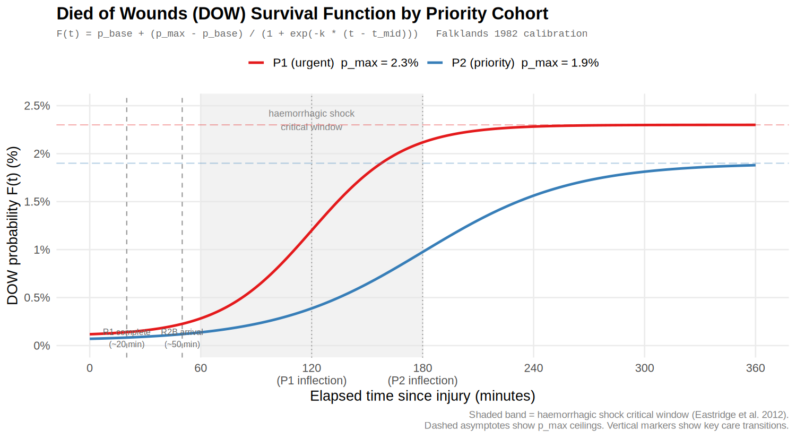

*Figure: DOW probability F(t) for P1 (urgent, red) and P2 (priority, blue) cohorts. Both curves are near-flat before 60 minutes — the window in which most simulated casualties reach R1 treatment. The sigmoid rise through the haemorrhagic shock critical window (shaded, 60–180 min) represents the period of greatest time-sensitivity. Dashed horizontal lines show the p_max asymptotes; the curves approach but never exceed these ceilings.*

### Parameter Calibration

| Priority | p_base | p_max | k (min⁻¹) | t_mid (min) |
|---|---|---|---|---|
| P1 (urgent) | 0.001 | 0.023 | 0.04 | 120 |
| P2 (priority) | 0.0005 | 0.019 | 0.025 | 180 |
| P3 (non-urgent) | — | — | flat | 0.001 |

The logistic shape parameters (*k*, *t_mid*) are anchored to the haemorrhagic shock critical window. Eastridge et al. (2012) [[38]](#References) describe the majority of potentially survivable haemorrhagic deaths as occurring within 60–180 minutes post-injury. The inflection point *t_mid* = 120 minutes centres the logistic rise within this window; the P2 inflection is set to 180 minutes, reflecting the lower urgency of the Priority 2 cohort.

The ceiling *p_max* and floor *p_base* values are calibrated to the Falklands War 1982 (Operation CORPORATE) historical DOW outcome. Payne (1983) [[42]](#References) reports that four British Army Field Surgical Teams operated on 233 casualties across the Ajax Bay Advanced Surgical Centre and two forward stations (Teal Inlet, Fitzroy), with three post-operative deaths recorded. Accounts of the Ajax Bay medical system confirm that only three of the 580 British soldiers and marines wounded in action died of wounds — a DOW/WIA rate of 0.52% [[43]](#References). The simulation, run at a baseline of 154 WIA per 30-day period, targets 0.80 DOW/run (= 0.52% × 154); calibrated parameters produce a mean of approximately 0.70 DOW/run (0.45%) with a 95% confidence interval that spans the historical target (50-replication estimate: [0.41, 0.95] per run).

The low Falklands DOW rate reflects the compact geography of the islands (short evacuation windows), the innovative field surgical care established at Ajax Bay, and the predominantly young, fit demographic of land-force casualties. The parameters above are the base `env_data.json` values used by the `default` scenario; they remain paired with OIF/OEF-era treatment efficacy factors (Table below) for the reasons discussed under [Treatment Efficacy Modifiers](#treatment-efficacy-modifiers). A discrete `moderate_intensity` profile (Falklands 1982 exemplar) with era-appropriate treatment efficacy factors and a re-calibrated ceiling — implemented in [Scenario Profiles](#scenario-profiles) (Issue #54) — is available for scenario-explicit analysis; see that section for the disentangled calibration.

The P3 flat rate of 0.1% applies only at R2B and R2E echelons. P3 casualties recover at R1 and are not evacuated; this parameter is therefore practically inactive in the current routing logic and is retained for structural completeness.

### Multi-Echelon Check and Conditional Increment

DOW checks are performed at four points in the trajectory: on completion of R1 treatment, on arrival at R2B (after hold bed seizure), on arrival at R2E, and — since Issue #43 — at completion of post-operative recovery at R2E (ICU or holding bed). To avoid double-counting mortality across echelons, the probability applied at each check after the first is a conditional increment — the additional mortality risk accumulated since the previous check — rather than the cumulative probability:

```
p_conditional = max(0, (F(t_now) ‚àí F(t_prev)) / (1 ‚àí F(t_prev)))
```

where *t_prev* is the elapsed time at the previous DOW check and *t_now* is the elapsed time at the current check. A `last_dow_t` attribute records the absolute simulation time of the most recent check for each entity. A casualty who survives the R1 DOW check (at t ≈ 20 minutes) and arrives at R2B after a 30-minute transport (t ≈ 50 minutes) has the conditional increment F(50) − F(20) / (1 − F(20)) applied, not the full F(50). This ensures that system-wide mortality integrates correctly across echelons.

Disease DNBI and battle fatigue DNBI are exempt from DOW checks at all echelons, consistent with their non-traumatic injury mechanisms. NBI and WIA follow the full time-dependent DOW pathway.

### Treatment Efficacy Modifiers

The logistic function F(t) characterises the mortality trajectory of a casualty receiving *no further care* — the probability of death given indefinite delay from the current state. Without modification, this ceiling (*p_max*) applies equally at each subsequent DOW check regardless of care received: a P1 casualty who has undergone R2B damage control resuscitation and surgery faces the same asymptotic mortality ceiling (0.60) on arrival at R2E as a casualty who received no treatment. This overstates residual mortality risk for the treated population and removes the incentive structure by which the model should reward timely definitive care.

To address this, the model introduces a per-entity `dow_ceiling` attribute, initialised to the priority-appropriate *p_max* at casualty entry. After each care phase completes, `dow_ceiling` is multiplied by a treatment efficacy factor, reducing the effective ceiling applied at the next DOW check:

```
dow_ceiling ‚Üê dow_ceiling √ó treatment_efficacy_factor
```

The *p_base* term is held fixed throughout: it represents non-survivable injuries (non-compressible truncal and junctional haemorrhage, unsurvivable CNS trauma) for which no care can alter the outcome. Only the treatable fraction of the ceiling is reduced.

| Care phase | Factor | Rationale |
|---|---|---|
| R1 TCCC | 0.83 | Eastridge et al. (2012) [[38]](#References) identify non-compressible haemorrhage (truncal, junctional) as the mechanism in 90% of potentially preventable battlefield deaths — injuries beyond the scope of TCCC intervention. TCCC skills (tourniquet, wound packing, airway management) address the remaining 10%, yielding a modest 17% ceiling reduction. |
| R2B DCR (resus) | 0.56 | Braverman et al. (2021) [[40]](#References) report that damage control resuscitation with balanced haemostatic products reduces laparotomy mortality from 22% to 13% — a 41% relative reduction — reflecting the haemostatic benefit of early plasma and platelet administration. |
| R2B DCS (surgery) | 0.32 | Holcomb et al. (2013) PROMMTT [[41]](#References) reported a 40% overall mortality rate in massively transfused surgical patients, with exsanguination accounting for 33.3% of deaths — approximately 13% haemorrhage-specific post-DCS mortality. This implies a 68% relative reduction from the pre-DCS ceiling, applied as a factor of 0.32. |
| R2E DCR (resus) | 0.56 | Same factor as R2B DCR [[40]](#References); applied only when full resuscitation occurs at R2E (i.e., the casualty bypassed R2B). Casualties pre-resuscitated at R2B receive a short resus at R2E; this factor is not re-applied, avoiding double-counting the DCR effect. |
| R2E DCS 1st op | 0.25 | Post-operative mortality in optimally resuscitated DCS patients is approximately 3–5% at 30 days — a 75% relative reduction from the pre-first-DCS ceiling [[40]](#References). |
| R2E DCS 2nd op | 0.57 | Informed estimate. The second definitive procedure addresses residual injury load after initial damage control; mortality reduction is smaller than the first operation. Applied only to casualties without prior R2B DCS. |
| R2E post-op hold (penalty) | 3.0 | Informed estimate (Issue #43). Applied instead of a reduction when post-operative recovery occurs in a holding bed rather than ICU, partially reversing the R2E DCS 1st op reduction to reflect the absence of continuous critical-care monitoring. See Post-Operative Checkpoint below. |

The cumulative effect on a P1 casualty (initial ceiling = 0.023) who receives the full care pathway (TCCC ‚Üí R2B DCR ‚Üí R2B DCS ‚Üí R2E DCS first op) is:

```
0.023 √ó 0.83 √ó 0.56 √ó 0.32 √ó 0.25 = 0.00085
```

This residual ceiling of 0.085% represents the fraction of optimally treated P1 casualties expected to die of wounds despite receiving definitive care at every echelon — consistent with the Falklands 1982 historical outcome of effectively zero post-operative deaths in patients who survived to definitive surgical care at Ajax Bay.

> **MODEL ASSUMPTION — DOW LOGISTIC PARAMETERS:** The parameters *p_base*, *p_max*, *k*, and *t_mid* are calibrated to the Falklands War 1982 (Operation CORPORATE) historical outcome rather than empirically fitted to per-minute individual-level survival curves, which no published dataset provides. Payne (1983) [[42]](#References) reports three post-operative deaths among 233 casualties treated at the Ajax Bay Advanced Surgical Centre and forward stations. Jolly (2018) [[43]](#References) confirms that of 580 British soldiers and marines wounded in action, only three died of wounds — a DOW/WIA rate of 0.52%. The ceiling values (p1_p_max = 0.023, p2_p_max = 0.019) were iteratively calibrated until 50-replication Monte Carlo output produced a mean DOW/run of approximately 0.70 (0.45% of 154 baseline WIA), with a 95% CI spanning the 0.52% historical target. The shape parameters (k, t_mid) are anchored to aggregate mortality time-window analysis in Eastridge et al. (2012) [[38]](#References) and Kotwal et al. (2011) [[39]](#References); the logistic form is a standard S-shaped approximation for time-dependent failure processes (Law, 2020 [[26]](#References)).
> **Basis:** Payne (1983) [[42]](#References); Jolly (2018) [[43]](#References); Eastridge et al. (2012) [[38]](#References); Kotwal et al. (2011) [[39]](#References).
> **Uncertainty:** Medium — the calibration target (3 events / 580 WIA) is derived from a single conflict and may not generalise to other operational contexts. The treatment efficacy factors (Table above) retain OIF/OEF-era values and are not Falklands-specific; this base configuration is what the `default` scenario runs. A Falklands-specific disentanglement of *p_max* and the treatment efficacy factors is implemented as the `moderate_intensity` scenario profile — see [Scenario Profiles](#scenario-profiles) (Issue #54).
> **Consequence if wrong:** If the Falklands DOW rate is unrepresentative of the baseline scenario, DOW counts will be systematically biased. Sensitivity analysis (Issue #3) will quantify the influence of p_max uncertainty on total DOW output. Narrowing p_max reduces sensitivity of DOW count to queue saturation; shifting t_mid later makes the model less responsive to R1-level delays.
> **Co-dependence of p_max and treatment efficacy factors:** The value p_max = 0.023 was not derived independently of the efficacy factors; the simulation was calibrated iteratively with the OIF/OEF efficacy multipliers (0.83, 0.56, 0.32, 0.25) already in place. These two components are therefore entangled: p_max is the ceiling that, *when combined with those specific multipliers*, reproduces the 0.52% historical rate. This entanglement is exactly what the `moderate_intensity` scenario profile (Issue #54, see [Scenario Profiles](#scenario-profiles)) resolves: era-appropriate (weaker) treatment efficacy factors are paired with an independently re-calibrated, lower ceiling, reproducing the same historical DOW/WIA target through a mechanistically consistent route.

### Post-Operative Checkpoint (Issue #43)

Prior to Issue #43, the R2E surgical trajectory admitted every casualty flagged for surgery to an operating theatre as soon as an OT bed was free, irrespective of whether a post-operative ICU bed would be available on completion. A casualty finishing surgery with no ICU bed free simply queued for one — in `simmer` terms this blocks no further progress in the model, but clinically represents a patient receiving inadequate post-operative monitoring in a recovery area not equipped for it. Damage control surgery is established doctrine specifically because post-operative critical care is expected to follow [[45]](#References), and post-operative ICU or high-dependency care is the guideline-recommended standard after major trauma surgery [[46]](#References); bed capacity is an explicitly named constraint at deployed damage-control facilities in LSCO [[2]](#References).

The R2E surgical branch now performs a pre-OT ICU availability check before seizing an OT bed:

1. **ICU available** — surgery proceeds unchanged; post-operative recovery is in ICU (short or full duration, as before).
2. **ICU full, Priority 1** — surgery still proceeds (withholding it would expose an unsurgicated Priority 1 casualty to near-certain DOW), but post-operative recovery is in a holding bed instead of ICU. `dow_ceiling` is multiplied by the post-op hold penalty (3.0 — Treatment Efficacy Modifiers table above) rather than a further reduction, reflecting reduced monitoring.
3. **ICU full, Priority 2+** — OT entry is deferred. The candidate polls ICU availability every `icu_gating.defer_check_interval` minutes (30, by default) without holding any resource while waiting, and proceeds as path 1 once a bed frees.

Both the ICU and post-op-hold recovery paths converge on a shared post-operative DOW check — the same conditional-increment logistic mechanism used at the three arrival-time checkpoints, evaluated against each pathway's `dow_ceiling` — so the two pathways' realised mortality is directly comparable in output (`outputs/post_op_pathway_summary.csv`; `post_op_pathway` attribute: 1 = ICU, 2 = post-op hold). The same pre-OT ICU gate is mirrored at R2B for structural consistency, though R2B surgery does not seize ICU beds for recovery, so only the Priority 2+ deferral behaviour is materially active there, and only when R2B's own two-bed ICU (used otherwise for the `wait_for_evac` fallback) is saturated — a condition the existing analysis found effectively never occurs under baseline load.

> **MODEL ASSUMPTION — P1 SURGERY WITHOUT ICU:** A surgeon operates on a Priority 1 candidate even when no post-operative ICU bed is available, accepting elevated post-operative mortality risk in preference to withholding surgery (which would leave an unsurgicated Priority 1 casualty facing near-certain DOW). The priority threshold for this override (`icu_gating.p1_bypass_priority_max = 1`) and the post-op hold penalty multiplier (3.0) are both configured in `env_data.json`.
> **Basis:** The clinical trade-off is described in Turner & Wilson (2024) [[45]](#References) and Remondelli et al. (2023) [[2]](#References); the standard of post-operative ICU/HDU care against which the "hold" pathway is a departure is set out in Hardcastle et al. (2025) [[46]](#References). The specific 3.0× penalty multiplier is an informed estimate — no open-access source quantifies a ward-vs-ICU mortality ratio for post-DCS trauma patients specifically — chosen to produce a materially higher, but not overwhelming, realised DOW rate for the hold pathway relative to ICU.
> **Uncertainty:** High. Both the priority threshold and the penalty multiplier are structural placeholders pending clinical expert consultation or a literature-derived ward-vs-ICU post-DCS mortality ratio.
> **Consequence if wrong:** An overstated penalty inflates post-op hold DOW beyond what forward surgical teams would actually accept operating under; an understated penalty removes the intended incentive structure that should make ICU capacity a visible driver of R2E mortality outcomes. The qualitative direction (hold pathway DOW rate exceeds ICU pathway DOW rate) is not sensitive to the exact multiplier value chosen.

> **MODEL ASSUMPTION — TREATMENT EFFICACY FACTORS:** The multiplicative reduction factors are derived from aggregate post-care survival rates in open-access literature; they are not fitted to individual-level combat casualty data and have not been validated against a specifically comparable conflict dataset.
> **Basis:** DCR factor (0.56) anchored to Braverman et al. (2021) [[40]](#References); DCS factor (0.32) anchored to Holcomb et al. (2013) PROMMTT [[41]](#References); TCCC factor (0.83) derived from Eastridge et al. (2012) [[38]](#References) non-compressible haemorrhage analysis. The R2E DCS second-operation factor (0.57) is an informed estimate with no direct literature anchor.
> **Uncertainty:** Low–Medium for DCR and DCS factors; High for R2E second-operation factor.
> **Consequence if wrong:** Overestimating efficacy factors reduces modelled DOW sensitivity to system overload for treated casualties; underestimating inflates DOW for patients who received definitive care. The relative ordering (DCS reduces ceiling more than DCR; DCR more than TCCC) reflects clinical consensus and is unlikely to reverse under parameter uncertainty.

---

## Scenario Profiles

<small>[Return to Top](#contents)</small>

The base `env_data.json` configuration conflates two historical contexts. Casualty generation rates ([Casualty Generation](#casualty-generation)) and the DOW ceiling ([Parameter Calibration](#parameter-calibration)) are calibrated to the Falklands War 1982 (Operation CORPORATE), while the treatment efficacy factors that modify that ceiling ([Treatment Efficacy Modifiers](#treatment-efficacy-modifiers)) — TCCC, damage control resuscitation, damage control surgery — describe techniques documented in 21st-century combat casualty care literature [[38]](#References), [[40]](#References), [[41]](#References) with no equivalent doctrine recorded in the available Falklands-specific sources [[42]](#References), [[43]](#References). Running a Falklands scenario through modern treatment efficacy factors risks misattributing the historically low Falklands DOW rate to treatment technique that was not available in 1982, rather than to the combination of casualty demographic, injury pattern, and evacuation geography that the historical sources actually describe.

This section introduces a **named scenario profile** mechanism that overlays a discrete, internally consistent parameter set onto the base configuration, so a given simulation run is scenario-explicit rather than an implicit hybrid. Profiles are named for FORECAS's own battle-intensity framing (`moderate_intensity`, `high_intensity`) rather than for a specific historical engagement, since FORECAS [[8]](#References) itself selects a casualty-rate distribution family by battle intensity and troop type, not by named conflict — a specific historical battle is retained as the calibration exemplar for each intensity tier, not the identity of the scenario.

### Mechanism

Scenario profiles are defined under a top-level `scenarios` key in `env_data.json`. Each profile is a partial `vars` override in the same shape as the base `vars` block — a list of element (`elm`) blocks, each containing activity (`acty`) blocks, each containing `var`/`val` pairs. `merge_scenario_vars()` (`R/scenario.R`) overlays a profile's `vars` onto the base `vars` at the individual variable level: only the variables named in the profile are replaced, every other variable retains its base value, and variables present in a profile but absent from the base are appended. `resolve_scenario()` (`R/scenario.R`) selects a named profile from `env_data.json` (or validates that the requested name exists, raising an explicit error listing available profiles otherwise), and `load_scenario(path, scenario)` (`R/environment.R`) composes this with the existing JSON parsing and environment-building pipeline (`build_environment()`).

```r
env_data <- load_scenario("env_data.json", "moderate_intensity")   # scenario-explicit
env_data <- load_scenario("env_data.json", "default")              # base configuration (unchanged)
env_data <- load_elms("env_data.json")                              # equivalent to the line above
```

`scenario = "default"` (or omitting the argument to `load_elms()`, as all existing call sites do) is a strict no-op: `resolve_scenario()` returns the parsed JSON unmodified, so every existing entry point (`run.R`, `scripts/run_warmup.R`, `scripts/run_sensitivity.R`) is unaffected. This was confirmed by comparing `load_elms("env_data.json")` against `load_scenario("env_data.json", "default")` for structural identity, and by re-running the documented seed-42 baseline (30 days): 400 total casualties (154 WIA, 70 KIA, 176 DNBI), matching the `CLAUDE.md` Key Parameters baseline exactly.

A distribution family is itself a scenario-specific choice, not just a distribution's parameters: FORECAS fits casualty incidence to either a lognormal or an exponential distribution depending on battle intensity, so `generators.*` entries carry an explicit `distribution` field (`"lognormal"` or `"exponential"`) alongside `mean_daily`/`sd_daily`. `generate_casualty_arrivals()` (`R/environment.R`) dispatches to `generate_ln_arrivals()` or the new `generate_exp_arrivals()` based on this field (defaulting to lognormal if the field is absent, for backward compatibility). `generate_exp_arrivals()` draws the per-minute rate via `qexp(u, rate = 1 / mean_daily)` — a single-parameter distribution, so `sd_daily` plays no role in generation for exponential streams (it is retained in the JSON purely as the published empirical value, for citation).

### Parameter classification

Only variables that genuinely differ by battle intensity/historical context are scenario-eligible. Structural configuration — element/bed/team counts (`elms`), transport fleet sizes (`transports`), and population sizes (`pops`) — is never overridden by a scenario profile; these describe the deployed force structure being tested against a scenario, not the scenario itself.

| Parameter group | Scenario-specific? | `moderate_intensity` profile |
|---|---|---|
| Casualty generation rates and distribution family (`generators.*`) | Yes | Inherited from base — already Falklands-sourced (FORECAS Table A.8 [[8]](#References), lognormal) |
| DOW ceiling and shape (`dow.params`) | Yes | **Overridden** — re-calibrated (see below) |
| DOW treatment efficacy (`dow.treatment_efficacy`) | Yes | **Overridden** — era-appropriate factors (see below) |
| Priority distribution (`r1.priority`) | Yes | Inherited from base — no Falklands-specific triage data identified |
| DNBI composition, surgery/evacuation probabilities (`r1.other`) | Yes | Inherited from base — already Falklands/FORECAS-sourced where cited |
| Transport time distributions (`*.wia_transport`, `*.kia_transport`) | Yes | Inherited from base — no Falklands-specific transport-time source identified |
| Element/bed/team counts, transport fleet sizes, population sizes | No (structural) | Not scenario-eligible |

"Inherited from base" is a deliberate choice, not an oversight: restating identical values under the scenario key would duplicate a second source of truth with no behavioural effect. Where the base value is not actually Falklands-specific (transport time distributions, priority distribution), this is recorded as a limitation below rather than silently assumed correct.

### Moderate Intensity profile (Falklands 1982 exemplar)

The `moderate_intensity` profile overrides `dow.params` and `dow.treatment_efficacy` to disentangle the co-dependence flagged in the [Parameter Calibration](#parameter-calibration) MODEL ASSUMPTION block.

| Factor | Base (OIF/OEF-era) | `moderate_intensity` | Rationale |
|---|---|---|---|
| R1 TCCC | 0.83 | 1.0 | TCCC is a post-1990s doctrine [[38]](#References); no equivalent tourniquet-forward/haemostatic-dressing prehospital doctrine is documented for 1982 British forces in the available sources. No additional ceiling reduction is attributed to this checkpoint. |
| R2B / R2E resuscitation | 0.56 | 0.90 | Braverman et al.'s (2021) [[40]](#References) 0.56 factor is specific to balanced-component damage control resuscitation. A modest benefit from whole-blood/crystalloid resuscitation (available in 1982) is retained; the specific balanced-ratio benefit is not. |
| R2B DCS / R2E DCS 1st op | 0.32 / 0.25 | 0.55 | Payne (1983) [[42]](#References) records near-zero post-operative mortality among casualties who reached the Ajax Bay Advanced Surgical Centre, so definitive surgical intervention itself is retained as materially protective; the more aggressive modern factors reflect additional staged damage-control/haemostatic-adjunct technique not available in 1982. |
| R2E DCS 2nd op | 0.57 | 0.80 | Era-appropriate weakening of the (already informed-estimate) second-operation factor, consistent with the same reasoning as the first operation. |
| R2E post-op hold penalty | 3.0 | 3.0 (unchanged) | A within-era relative degradation factor (ICU vs. non-ICU recovery), not a period-specific treatment technology; not scenario-eligible. |

> **MODEL ASSUMPTION — FALKLANDS-ERA TREATMENT EFFICACY:** The `moderate_intensity` treatment efficacy factors are informed estimates, not literature-derived values — no open-access source quantifies 1982 British field-surgical efficacy in the same multiplicative-ceiling terms used by this model. They were constructed by reasoning from the absence of specific modern techniques (TCCC, balanced DCR, staged DCS) documented in [[38]](#References), [[40]](#References), [[41]](#References), while preserving Payne's (1983) [[42]](#References) and Jolly's (2018) [[43]](#References) evidence that 1982 field surgery itself was highly effective for casualties who reached it.
> **Basis:** Payne (1983) [[42]](#References); Jolly (2018) [[43]](#References); absence of a documented equivalent to [[38]](#References), [[40]](#References), [[41]](#References) for the 1982 conflict.
> **Uncertainty:** High for all five factors — these are the least literature-anchored parameters in the model.
> **Consequence if wrong:** The qualitative direction (era-appropriate factors are weaker than modern factors, i.e. closer to 1.0) is required by the underlying clinical history and is not sensitive to the exact values chosen. The paired *p_max* re-calibration (below) absorbs the exact magnitude of this estimate, so the aggregate DOW rate remains close to the historical target regardless of the precise factor values; what would change under different factor values is the *distribution* of mortality risk across care phases, not the aggregate rate.

With these weaker factors, `dow.params` was re-calibrated (the same iterative Monte Carlo procedure used for the base configuration in Issue #5) to reproduce the same 0.52% DOW/WIA historical target: `p1_p_max` = 0.0089, `p2_p_max` = 0.0074 (down from the base 0.023 / 0.019 — a lower ceiling is required to compensate for the weaker treatment efficacy factors' smaller ceiling reduction). A 30-replication run (30 days, `seed = NULL`) of `moderate_intensity` produced:

| Metric | `moderate_intensity` (30-rep) | Historical target |
|---|---|---|
| Mean DOW/run | 0.767 (95% CI [0.431, 1.102]) | 0.80 (= 0.52% √ó 154 baseline WIA) |
| DOW/WIA rate | 0.498% (95% CI [0.280%, 0.715%]) | 0.52% [[42]](#References), [[43]](#References) |
| KIA:WIA ratio | 0.452 | 0.328 (255 KIA : 777 WIA [[43]](#References)) |

The DOW/WIA rate is within the ±2 percentage point acceptance tolerance (well within it — the 95% CI spans the historical target). The KIA:WIA ratio is a pre-existing characteristic of the base casualty generator calibration (Issue #1), not something this issue's DOW/treatment-efficacy disentanglement changes — the FORECAS-derived `kia_cbt`/`wia_cbt` generation rates that both `default` and `moderate_intensity` inherit already produce this ratio under the current lognormal-cap generation mechanism, before any scenario override is applied. See Limitations (L12).

### High Intensity profile (Okinawa exemplar, demonstration skeleton)

The `high_intensity` profile demonstrates that the mechanism generalises beyond `moderate_intensity`, and that the underlying **distribution family** — not just its parameters — is itself scenario-specific per FORECAS's own methodology. It is **not** a fully validated second scenario, only a skeleton per Issue #54's acceptance criteria; Issue #10 (comparative scenario runner) owns extending it to a fully parameterised scenario.

FORECAS reports that INFANTRY (direct combat) troop WIA and KIA incidence in high-intensity battles is best approximated by a single-parameter exponential distribution, `W ~ exponential(mean)`, rather than the lognormal distribution used at moderate/light intensity. Table A.7 gives `Expon(6.86)` as the fitted combat-troop WIA distribution for Okinawa (historical data mean 6.86, SD 6.65); Table A.9 gives `Expon(1.63)` for combat-troop KIA (historical mean 1.63, SD 1.73) [[8]](#References). `generators.wia_cbt`/`kia_cbt` are overridden with `distribution = "exponential"` using these means.

FORECAS itself further distinguishes three troop categories with different casualty-rate treatments: INFANTRY (exponential at high intensity), SUPPORT (intra-divisional combat support — tank, artillery, light-armoured infantry, combat engineer; lognormal at all intensities), and SERVICE SUPPORT (extra-divisional sustainment — Force Service Support Group, Surveillance Reconnaissance Intelligence Group; lognormal, no autocorrelation, at all intensities) [[8]](#References). This simulation models a single brigade (division and below); it has no extra-divisional "service support" population, and the `support` population group represents an organic brigade element exposed to the same battle risk as the `combat` population — not FORECAS's rear-area service support troops. Both `generators.wia_cbt`/`kia_cbt` **and** `generators.wia_spt`/`kia_spt` are therefore overridden with `distribution = "exponential"` using the same Table A.7/A.9 means.

> **MODEL ASSUMPTION — SUPPORT POPULATION TREATED AS COMBAT-EXPOSED:** FORECAS's own "SUPPORT" troop category is kept lognormal at all intensities, distinct from its exponential-eligible "INFANTRY" category. This project instead applies the exponential (high-intensity) distribution to both of its own population groups (`combat`, `support`) under `high_intensity`, on the basis that a division-and-below brigade model has no genuine extra-divisional "service support" population, and that this project's `support` population is an organic, battle-exposed brigade element rather than FORECAS's rear-area category.
> **Basis:** FORECAS's own troop-category definitions (INFANTRY: ground combat troops; SUPPORT: intra-divisional combat support; SERVICE SUPPORT: extra-divisional sustainment) [[8]](#References); this project's brigade-level (division and below) scope.
> **Uncertainty:** Medium — this is a considered reclassification rather than a literature-derived value, but it follows directly from FORECAS's own category definitions and this project's documented force structure ([Scenario Context](#scenario-context)).
> **Consequence if wrong:** If the project's `support` population should instead be treated as FORECAS's lognormal-always "SUPPORT" category, `generators.wia_spt`/`kia_spt` should revert to `distribution = "lognormal"` for `high_intensity`, which would somewhat reduce realised support-troop casualty counts under this profile without affecting `combat` population output.

DOW ceiling, treatment efficacy factors, priority distribution, DNBI composition, and transport time distributions are **not** sourced for Okinawa in this issue and are inherited unchanged from the Falklands-calibrated base — an internally consistent Okinawa-era DOW/treatment model, analogous to the `moderate_intensity` disentanglement above, is out of scope for Issue #54 and would need its own issue.

A 30-replication run (30 days) of each produced:

| Metric | `moderate_intensity` (30-rep) | `high_intensity` (30-rep) |
|---|---|---|
| Mean WIA/run | 154.0 | 733.0 |
| Mean KIA/run | 69.6 | 173.4 |
| WIA+KIA ratio vs. `moderate_intensity` | 1.00√ó | 4.05√ó |

These figures use `generate_exp_arrivals()`'s mean-relative rate cap (`cap = 3 √ó mean_daily`, see [Casualty Generation](#casualty-generation)); an earlier version of this profile used the same fixed absolute cap as the lognormal streams, which truncated ~48% of `high_intensity` WIA draws and understated the WIA count by nearly half.

A companion Vietnam-calibrated profile was considered and dropped: FORECAS's Appendix A has no standalone Vietnam combat-troop WIA/KIA distribution table (Table A.5 is Vietnam combat-troop DNBI only), so no genuinely FORECAS-sourced Vietnam WIA/KIA parameters exist in the source document. Adding a Vietnam-named profile would have required either fabricating a citation or silently estimating a value without a source, neither of which meets this project's citation standards; a Vietnam-calibrated scenario should wait for a source that actually tabulates it.

### Parameter editor integration

`controller.R` (the Shiny `env_data.json` editor) exposes a top-level scenario selector. Selecting a profile re-renders the editable form and JSON preview with that profile's parameters overlaid on the base — a read-only preview of the effective configuration, not a second copy of the data. Saving is only enabled while previewing `default`, so the override mechanism cannot be accidentally flattened into the base file through the generic editor; a scenario's own override values are edited directly in the auto-generated `scenarios` panel, which the existing recursive form renders without any scenario-specific UI code.

---

## Development Environment

<small>[Return to Top](#contents)</small>

The simulation uses `parallel::mclapply` for multi-replication parallelism, which relies on `fork()` — a POSIX primitive unavailable on Windows. On a Windows RStudio installation, `mclapply` silently falls back to sequential execution, meaning the full Morris sensitivity screening (r = 20, reps = 5, n_sobol = 200, ~8 000 simulation runs) takes an estimated 10–15 hours rather than 1–2 hours on equivalent hardware.

A Dev Container specification in `.devcontainer/` defines a reproducible Linux R environment (R 4.4.2, all project packages) that can be launched from VS Code with a single command. It provides a Linux `fork()` context, RStudio Server on `http://localhost:8787`, and automatic core-count configuration — so contributors on any host OS get full parallelism and a consistent package environment without manual dependency resolution.

### Prerequisites

| Requirement | Notes |
|---|---|
| [Docker Desktop](https://www.docker.com/products/docker-desktop/) | Provides the container runtime. Enable "Use the WSL 2 based engine" on Windows. |
| [VS Code](https://code.visualstudio.com/) | Host IDE used to manage the container lifecycle. |
| [Dev Containers extension](https://marketplace.visualstudio.com/items?itemName=ms-vscode-remote.remote-containers) | VS Code extension (`ms-vscode-remote.remote-containers`) that adds the "Reopen in Container" command. |

### First-time setup

1. Clone the repository to the local machine:
   ```sh
   git clone https://github.com/natosys/Battlefield-Casualty-Handling.git
   cd Battlefield-Casualty-Handling
   ```
2. Open the repository folder in VS Code: **File ‚Üí Open Folder**.
3. VS Code will detect `.devcontainer/devcontainer.json` and display a notification: *"Folder contains a Dev Container configuration file. Reopen folder to develop in a container."* Click **Reopen in Container**. Alternatively, open the Command Palette (`Ctrl+Shift+P` / `Cmd+Shift+P`) and select **Dev Containers: Reopen in Container**.
4. VS Code builds the Docker image and starts the container. The initial build downloads the base image and installs all R packages; this typically takes 5–10 minutes. Subsequent starts use the cached image and complete in seconds.
5. Once the container starts, open a browser and navigate to `http://localhost:8787` to access RStudio Server. No login credentials are required (`DISABLE_AUTH=true`).

### RStudio Server configuration

After connecting to RStudio Server at `http://localhost:8787`:

1. Set the working directory to the workspace mount point:
   ```r
   setwd("/home/rstudio/workspace")
   ```
   This can be made permanent via **Tools ‚Üí Global Options ‚Üí General ‚Üí Default working directory**.
2. Verify the parallel core configuration:
   ```r
   parallel::detectCores(logical = FALSE)  # should return > 2 on a multi-core host
   getOption("mc.cores")                   # should match the above
   ```
   Both values are set automatically by `Rprofile.site` during the image build; no per-session configuration is required.

### Running the simulation with full parallelism

From the RStudio Server terminal or console, all `Rscript` invocations work identically to the host workflow:

```sh
# Standard single run (seed 42, 30 days, 1 iteration)
Rscript run.R --seed 42 --days 30 --iterations 1

# Multi-run replication (100 iterations, parallel via mclapply)
Rscript run.R --seed NULL --days 30 --iterations 100

# Quick smoke test (5 days, 5 iterations)
Rscript run.R --quick
```

`mclapply` will use all physical cores reported by `parallel::detectCores(logical = FALSE)`, providing linear scaling up to the host core count.

### Git workflow

All files are bind-mounted from the host filesystem into `/home/rstudio/workspace` inside the container. Git commits and pushes can be made from either location — changes are immediately visible on both sides. SSH keys placed in the host `~/.ssh/` directory are available inside the container via the default Docker bind mount for SSH agent forwarding.

---

## Simulation Design

<small>[Return to Top](#contents)</small>

The simulation is built as a Discrete Event Simulation (DES), it is written in R  using the simmer package [[13]](#References). DES has been used as a proven way to simulate healthcare systems and support healthcare decision-making (as shown in [[14]](#References)).

### Codebase Structure

The codebase is organised into a modular layout under an `R/` directory, with a single CLI entry point (`run.R`). The split allows each module to be tested and extended independently, and provides a clear separation between data loading, simulation logic, execution, and analysis.

| File / Directory | Purpose |
|---|---|
| `run.R` | CLI entry point — parses arguments, orchestrates modules, and writes outputs |
| `R/environment.R` | Data import (`load_elms`, `build_environment`), arrival generation (`generate_ln_arrivals`), and simmer environment construction (`build_env`) |
| `R/trajectories.R` | All simmer `trajectory()` definitions — R1, R2B, R2E, and core casualty flow |
| `R/replication.R` | Multi-run replication framework — `run_once` (single replication with `wrap()`), `run_replications` (parallel `mclapply` over *n* replications), `summarise_replications` (time-weighted KPI summary with 95% CI), and `run_single` backwards-compat shim |
| `R/analysis.R` | Analysis and visualisation pipeline (`analyse_run`) — accepts monitoring data objects rather than reading from hardcoded CSV paths |
| `R/sensitivity.R` | Morris EE screening (`run_morris`) and Sobol variance decomposition (`run_sobol`) — parameter bounds table, `apply_params` for env_data override, `eval_params` for single design-point evaluation |
| `R/warmup.R` | Welch warm-up analysis — `compute_welch_cma`, `plot_welch`, `run_welch_analysis`; `WARM_UP_DAYS` constant |
| `scripts/run_sensitivity.R` | CLI entry point for sensitivity analysis — `--quick`, `--sobol`, `--r`, `--reps`, `--days`, `--n-sobol` flags |
| `scripts/run_warmup.R` | CLI entry point for Welch warm-up analysis |
| `data_import.R` | Compatibility shim — sources `R/environment.R` so existing code continues to work |
| `outputs/` | Generated outputs directory — CSVs and markdown tables are written here; tracked via `.gitkeep` |
| `data/` | Read-only input data — arrival schedules and environment data |
| `docs/` | Project documentation — action plans and role allocation tables |

#### Running the simulation

```sh
# Standard single run (seed 42, 30 days, 1 iteration)
Rscript run.R --seed 42 --days 30 --iterations 1

# Custom run
Rscript run.R --seed 99 --days 14 --iterations 10

# Quick smoke test (5 days, 5 iterations, seed 42)
Rscript run.R --quick
```

Single-run outputs (monitoring CSVs and markdown tables) are written to `outputs/`. Simulation logs are written to `logs/logs.txt`. Multi-run mode additionally writes `outputs/replication_summary.csv` containing the KPI table (see [Multi-run Replication Framework](#multi-run-replication-framework) below).

> **Note — dependency pinning:** `renv` lockfile initialisation is planned but not yet implemented. Package versions are therefore not pinned. This is a known limitation that will be addressed in a future issue.

#### Multi-run Replication Framework

The simulation supports independent Monte Carlo replication via `run_replications(n_iterations, n_days)` in `R/replication.R`. When `--iterations` is greater than 1, each replication:

1. Builds a fresh `simmer` environment from `env_data.json` with independent arrival streams drawn from the lognormal generator (`seed = NULL` per worker).
2. Runs to completion and snapshots monitoring state with `wrap(env)`, which captures arrivals, attributes, and resource utilisation without holding the live environment in memory.
3. Returns all replication data aggregated by `get_mon_arrivals(envs)` / `get_mon_resources(envs)` / `get_mon_attributes(envs)`, which append a `replication` index column (1…*n*) to each row.

On POSIX systems (Linux, macOS), replications are dispatched via `mclapply` with `mc.set.seed = TRUE` and `RNGkind("L'Ecuyer-CMRG")` set before the call. This assigns each worker a provably non-overlapping substream of the underlying MRG32k3a generator, with overall period ρ ≈ 2¹⁹¹ and substream spacing ρ₂ = 2⁷⁶ — stream overlap is impossible within any realistic simulation workload. Karl et al. (2014) [[32]](#References) demonstrate the practical application of this mechanism in R via the `parallel` and `rstream` packages. The physical core count is used via `mc.cores = parallel::detectCores()`. On Windows, the framework falls back to sequential `lapply`.

**Antithetic variate variance reduction** is applied to arrival generation. Replication pairs (2*k*−1, 2*k*) share a seed: both workers call `run_once()` with the same `seed` value, so their RNG streams start from an identical state. The primary replication (odd index) draws U ~ Uniform(0,1) and computes X = qlnorm(U); the antithetic replication (even index) substitutes U′ = 1 − U, computing X′ = qlnorm(1 − U). Because both use the *same* initial uniform sequence, the reflection is exact: Cor(X, X′) < 0 and the estimator variance Var[Ȳ] is reduced without increasing replication count (Rossetti, 2023 [[33]](#References)). Independence *across* pairs is ensured by distinct pair seeds drawn from the parent RNG. The within-minute arrival jitter is also antithetised. Antithetic application is limited to arrival times; service times and routing probabilities generated internally by simmer cannot be antithetised without deep trajectory instrumentation (see L9, Limitations).

A key-performance-indicator summary is computed by `summarise_replications(mon)` using the time-weighted mean queue per replication as the unit of analysis. The across-replication summary reports mean, p10, p90, max queue, and a 95% confidence interval (t-distribution, *df* = *n* ‚àí 1) for each resource, sorted descending by mean queue. Results are written to `outputs/replication_summary.csv`.

> **MODEL ASSUMPTION — L'Ecuyer-CMRG Non-overlapping RNG Streams:** Non-overlapping parallel RNG streams are guaranteed via `RNGkind("L'Ecuyer-CMRG")` with `mc.set.seed = TRUE` in `mclapply`. Each worker is assigned a distinct MRG32k3a substream with a period of 2⁷⁶ draws, making overlap negligible for any simulation budget used in this study. The R `parallel` package documentation confirms this assignment: "use a separate stream for each of the parallel computations (which ensures that the random numbers generated never get into sync)" [[41]](#References).
> **Basis:** Karl et al. (2014) [[32]](#References) demonstrates practical use of L'Ecuyer-CMRG via R's `parallel` package; R Core Team (2024) [[34]](#References) documents the `mc.set.seed = TRUE` mechanism and stream period properties.
> **Uncertainty:** Low (the non-overlap property is mathematically proven given the substream period).
> **Consequence if wrong:** Correlated replications would understate variance and produce CI bounds that are overly narrow; this risk is negligible given the substream design [[34]](#References).

#### Warm-up Period Analysis

Discrete event simulations are classified as either **terminating** or **steady-state** based on the nature of the system being modelled [[26]](#References). A terminating simulation has a natural, finite end state (e.g., an operational campaign concluding after a defined horizon); the run begins under well-defined initial conditions, and behaviour across the entire horizon — including the start-up period — is of direct interest. A steady-state simulation models a perpetual system in which the long-run equilibrium is the quantity of interest; here, the initialisation transient is an artefact that must be discarded before meaningful statistics can be collected. The choice of classification governs whether warm-up exclusion is appropriate.

Welch's graphical method [[27]](#References) was applied to characterise the simulation's time-varying behaviour and determine which classification applies. The method involves: (1) running ‚â•10 independent replications of an extended simulation (90 days); (2) computing the cross-replication cumulative moving average (CMA) of a sensitive KPI at each time point; and (3) determining whether the CMA converges to a stable level. The R2E ICU queue was selected as the KPI, being the most congestion-sensitive resource in the model.

The analysis is implemented in `R/warmup.R` and can be executed from the repository root:

```bash
# Full analysis: 10 reps √ó 90 days
Rscript scripts/run_warmup.R

# Reduced run for testing
Rscript scripts/run_warmup.R --reps 5 --days 60
```

The resulting Welch plot shows the cross-replication CMA of the R2E ICU queue across 90 days.

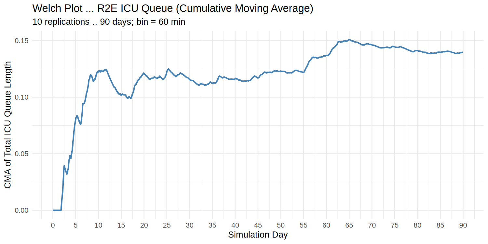 Rather than converging to a stable plateau, the CMA displays episodic, non-stationary behaviour: a rise to a local peak near Day 13 (the first wave of R2E ICU admissions propagating from early combat), a decline to a trough near Day 25, then a second rise to a higher peak near Day 38 as cumulative casualty load continues to build. No convergence to a steady state is observed within the 90-day horizon. This pattern is consistent with the lognormal arrival process generating episodic surges; the ICU queue is driven by campaign dynamics rather than a stationary queue process, and the CMA continues to shift across the full run length.

This non-convergent CMA confirms that the battlefield casualty handling simulation is a **terminating simulation** per Law (2020) [[26]](#References). The campaign has a defined finite horizon; the ICU queue trajectory represents the operational reality of that campaign, including the initial build-up of casualties from Day 1. The empty-start initial condition — no casualties in care on Day 0 — is the correct operational initial condition for a force beginning operations. It is not a modelling artefact to be excluded. Gafarian, Ancker and Morisaku (1978) [[28]](#References) establish that warm-up detection methods, including graphical approaches, presuppose the existence of a steady state; they are not applicable to terminating simulations.

Warm-up exclusion is therefore **not applied** as the default. The `WARM_UP_DAYS` constant in `R/warmup.R` is set to `0L`. All KPI summaries and analysis outputs use the full observation window.

The `--warm-up` CLI flag remains available for **parametric comparison runs** — sensitivity screening and scenario analysis — where a researcher wishes to study mid-campaign behaviour net of start-up effects, or where two scenarios differ in their initialisation characteristics and the comparison requires a common time base:

```bash
# Optional: exclude first 10 days for parametric comparison runs only
Rscript run.R --iterations 50 --days 60 --warm-up 10
```

> **MODEL ASSUMPTION — TERMINATING SIMULATION (NO WARM-UP EXCLUSION BY DEFAULT):** The simulation is classified as a terminating simulation. The empty-start initial condition is the correct operational initial condition; no warm-up exclusion is applied by default (`WARM_UP_DAYS = 0L`).
> **Basis:** Law (2020) [[26]](#References) distinguishes terminating simulations (finite-horizon, natural end state) from steady-state simulations (infinite-horizon, seeking long-run equilibrium). The battlefield casualty handling simulation models a finite operational campaign; the full run — including the initial build-up — represents the campaign truth. Welch's graphical method [[27]](#References) was applied across 10 × 90-day replications; the CMA of the R2E ICU queue exhibited episodic non-stationary behaviour (peaks at Days 13 and 38) with no convergence, confirming the absence of a steady state. Gafarian, Ancker and Morisaku (1978) [[28]](#References) establish that graphical warm-up detection methods presuppose a steady state; they are not applicable to terminating simulations.
> **Uncertainty:** Low — the terminating classification is an inherent property of the finite campaign model structure, not a parameter subject to calibration.
> **Consequence if wrong:** If the simulation were treated as steady-state and early data discarded, KPIs would represent mid-campaign equilibrium rather than the campaign-wide casualty burden from Day 1. For operational planning — which must account for casualty load from the onset of operations — this would understate total system demand and the severity of early-period queues.

#### Sensitivity Analysis

The triangular distribution parameters governing surgery duration, resuscitation time, transport delay, DOW probability, ICU length of stay, and OT availability carry significant epistemic uncertainty. The conclusion that R2B holding bed saturation is the primary system constraint may shift under plausible parameter perturbations — in particular, changes to DNBI evacuation thresholds or holding durations directly affect holding bed demand. Without sensitivity analysis, no parameter can be identified as rate-limiting versus incidental to the result, and findings cannot be used to prioritise capability investments.

**Morris Elementary Effects (EE) screening** [[30]](#References) was applied using R's `sensitivity` package [[31]](#References). Morris EE is a global, one-at-a-time (OAT) method that identifies the few influential parameters from a larger set at low computational cost — r × (p + 1) model evaluations, where r is the trajectory count and p is the number of parameters. It produces two statistics per parameter: µ\* (the mean absolute Elementary Effect, indicating overall influence) and σ (the standard deviation of Elementary Effects, indicating nonlinearity and interaction). Parameters with large µ\* and small σ have large, approximately linear effects; large µ\* and large σ indicate nonlinear or interaction-dominated effects.

Ten parameters were selected for screening, spanning the main uncertain inputs across all three echelons:

| Parameter | Variable | Baseline | Lower | Upper |
|-----------|----------|----------|-------|-------|
| Surgery duration (R2B and R2E) | `surg_mode` | 120 min | 90 | 150 |
| Long resuscitation duration | `long_resus_mode` | 45 min | 25 | 70 |
| P1 DOW max probability | `p1_p_max` | 60% | 25% | 75% |
| R1‚ÜíR2B transport time | `r1_transport` | 30 min | 15 | 45 |
| R2B‚ÜíR2E transport time | `r2b_transport` | 30 min | 15 | 45 |
| Long ICU duration | `long_icu_mode` | 1440 min | 770 | 2160 |
| P1 surgery probability | `pri1_surg_prob` | 90% | 70% | 98% |
| In-theatre recovery rate | `in_theatre_rate` | 10% | 5% | 20% |
| OT shift duration | `ot_hours` | 12 hr | 8 | 16 |
| Dead-head return leg multiplier | `return_leg_multiplier` | 1.0 | 0.7 | 1.3 |

Three primary KPI outputs were monitored across all replications at each design point: mean R2B OT queue, mean R2E OT queue (combined as system OT queue), and mean R2E ICU queue. Total DOW count is tracked as a secondary output. Two further KPIs cover the transport layer directly (Issue #6): mean transport queue and mean transport utilisation, pooled across the PMV Ambulance and HX240M resources. The utilisation KPI is necessary alongside the queue KPI because, under the current baseline casualty rate, transport assets rarely queue — their availability is affected well before a queue forms — so a queue-only KPI would under-detect the influence of transport-related parameters such as `return_leg_multiplier`. Parameters ranked by µ\* on the system OT queue identify the inputs most responsible for surgical bottleneck severity.

> **Note — sensitivity screening conducted pre-Issue-7, pre-Issue-5, and pre-Issue-6:** The Morris screening above was run before DNBI sub-categorisation (Issue #7), time-dependent DOW (Issue #5), and dead-heading transport (Issue #6) were merged. The parameter set does not include `disease_surgery_pct` (the disease DNBI emergency surgical rate — rated High uncertainty), and the DOW parameter has been updated from the flat `pri1_dow` (5%) to the logistic ceiling `p1_p_max` (60%) following Issue #5. Absolute µ\* values reflect a model in which all DNBI were surgical candidates and transport assets were seized for the outbound leg only, producing higher OT queues and lower transport-driven queueing than the current model. The relative ranking of the original nine parameters is expected to be qualitatively stable, since WIA still dominates surgical demand (~84% of surgical candidates). A re-run that adds `disease_surgery_pct` to the parameter set, incorporates dead-heading, and updates the quantitative µ\* values is tracked as a follow-up task (see Further Development).

> **MODEL ASSUMPTION — SENSITIVITY PARAMETER BOUNDS:** The bounds in the Morris screening table are set to cover clinically plausible variation around the current baseline values, derived from expert judgement and the literature reviewed in the Simulation Design section.
> **Basis:** Lower and upper bounds were set to span approximately ±25–50% of the baseline value for duration parameters (surgery, resuscitation, transport, ICU) and the full clinically plausible range for probability parameters (DOW, surgery probability, in-theatre recovery). OT shift availability (8–16 hours) reflects the range from a single extended session to full 16-hour dual-shift coverage.
> **Uncertainty:** Medium — bounds represent informed clinical judgement rather than empirically derived uncertainty intervals. Wider bounds would increase µ\* values without changing parameter ranking if the model is monotone.
> **Consequence if wrong:** Narrow bounds will understate the influence of parameters whose true range is wider; wide bounds will conflate plausible and implausible parameter regions. Parameter ranking is sensitive to bound specification in nonlinear models.

The sensitivity analysis is implemented in `R/sensitivity.R` and executed via:

```bash
# Full Morris screening: r=20 trajectories √ó 10 (p+1) = 200 evaluations, 5 reps each
Rscript scripts/run_sensitivity.R

# Smoke test: r=3, reps=3, days=5 (completes in <5 minutes)
Rscript scripts/run_sensitivity.R --quick

# Morris then Sobol variance decomposition on top 5 parameters
Rscript scripts/run_sensitivity.R --sobol
```

Outputs are written to `outputs/morris_ranking.csv` (parameter ranking by µ\* for system OT queue) and per-KPI scatter plots to `images/morris_<kpi>.png`. When `--sobol` is specified, first-order (S1) and total-order (ST) indices for the top-ranked parameters are written to `outputs/sobol_<kpi>.csv`.

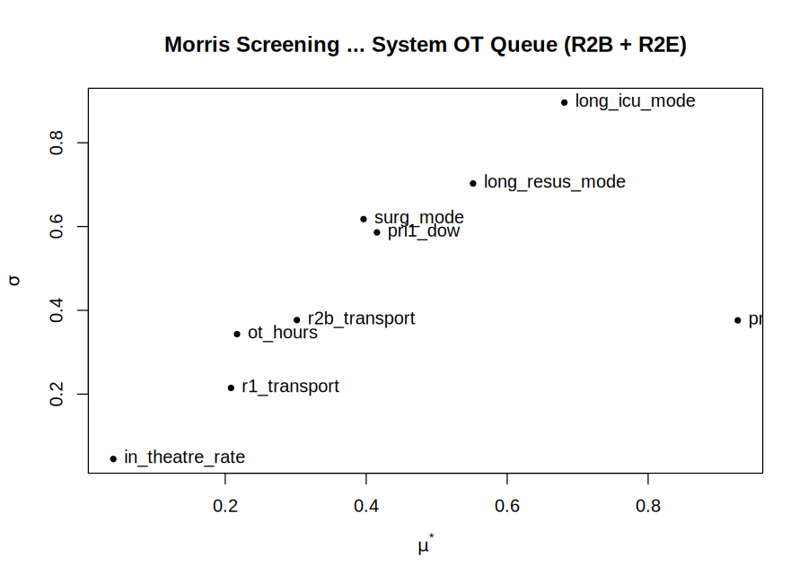

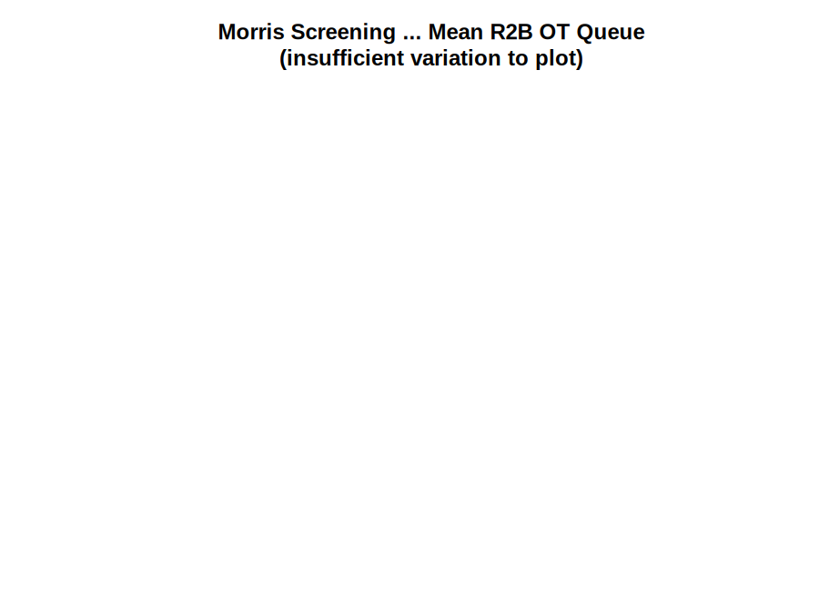

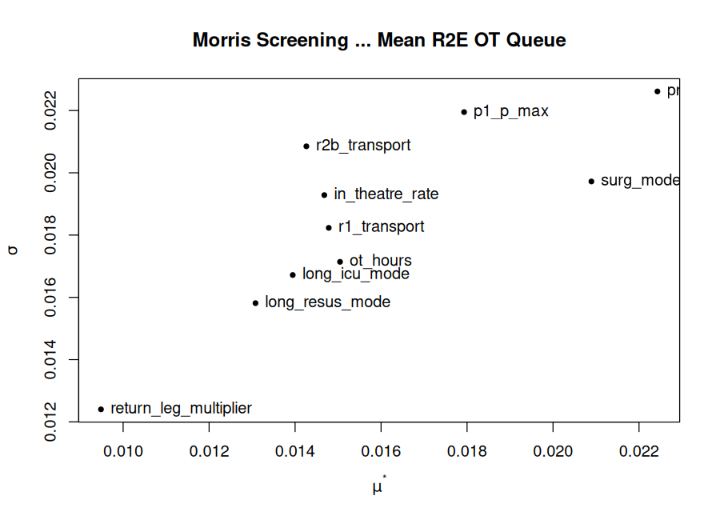

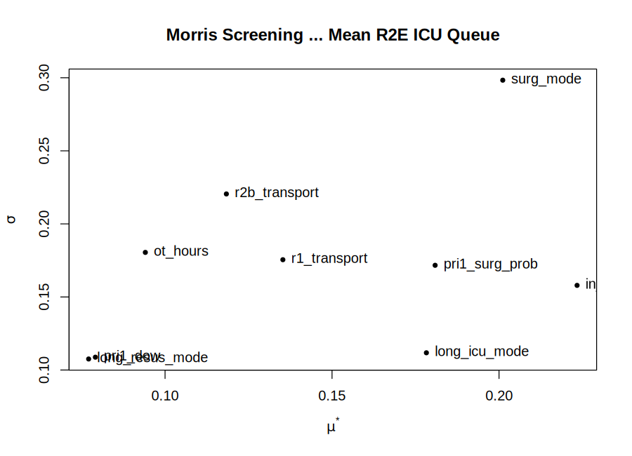

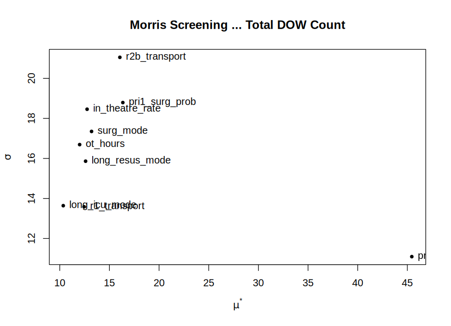

#### Comparative Scenario Runner

The comparative scenario runner (`R/scenario_runner.R`) executes the multi-run replication framework (above) under a named scenario profile ([Scenario Profiles](#scenario-profiles)) rather than the base configuration, and aggregates queue and mortality KPIs across replications for cross-scenario comparison.

`run_scenario(scenario, n_iterations, n_days)` resolves the named profile via `resolve_scenario()`/`build_environment()` (`R/scenario.R`, `R/environment.R`), sets the resulting `env_data` globally, and runs `run_replications()` exactly as the single-scenario path does. It returns the raw monitoring data plus two summary tables in the project's standard mean (p10–p90), 95% CI format: `queue_kpi` (per-resource queue KPIs, via `summarise_replications()`) and `totals` (`total_casualties`, `wia_count`, `dow_count`, and `dow_rate` — DOW as a proportion of WIA, matching the "DOW/WIA rate" convention used elsewhere in this project). An unrecognised scenario name raises an explicit error listing the profiles available in `env_data.json`.

`compare_scenarios(scenarios, n_iterations, n_days)` runs `run_scenario()` for each named profile in turn, combines their KPI tables with `scenario`/`scenario_label` columns, writes `outputs/scenario_comparison_queues.csv` and `outputs/scenario_comparison_totals.csv`, and renders a faceted bar chart of mean queue by resource group (R2B OT, R2E OT, R2E ICU, Transport) and scenario to `images/scenario_comparison.png`.

```bash
# Default comparison: moderate_intensity vs high_intensity, 10 reps x 30 days
Rscript scripts/run_scenarios.R

# Explicit scenario list, custom replication count
Rscript scripts/run_scenarios.R --scenarios moderate_intensity,high_intensity,default --iterations 30 --days 30

# Smoke test: 3 reps, 5 days
Rscript scripts/run_scenarios.R --quick
```

```r
# RStudio console
source("R/environment.R"); source("R/trajectories.R"); source("R/replication.R")
source("R/analysis.R"); source("R/scenario_runner.R")
cmp <- compare_scenarios(c("moderate_intensity", "high_intensity"), n_iterations = 10, n_days = 30)
```

Results and interpretation are presented in [Comparative Scenario Analysis](#comparative-scenario-analysis) under Simulation Analysis.

### üîßSimulation Environment Setup

The simulation models casualty handling across echelons of care in a battlefield environment, structured around modular trajectories and dynamic resource availability. It operates within a discrete-event simulation framework using `simmer`, and is driven by probabilistic rates, conditional branching, and resource interactions across Role 1 (R1), Role 2 Basic (R2B), and Role 2 Enhanced Heavy (R2E) facilities.

The simulation was designed around the general functions of each role of health element as outlined in the diagram below. Where roles overlap they are able to provide the same functions to varying degree. The diagram below provides an outline of the role and function design applied for this simulation using the three-stage Damage Control Surgery (DCS) model of care described in [[17]](#References) and [[18]](#References).


```mermaid
block-beta
  columns 13

  a["Casualty Care"]:13
  b["R1"]:3
  c["R2B"]:4 space:9
  e["R2E"]:7 space:6
  f["R4"]:10

  g["Triage"]
  h["POI Care"]
  i["MEDIVAC"]
  j["Resus/Emergency"]
  k["Abbreviated Surgery"]
  l["ICU Stabilisation"]
  m["MEDIVAC"]
  n["Definitive Surgery"]
  o["Recovery"]
  p["MEDIVAC"]
  q["Reconstructive Surgery"]
  r["Rehabilitation"]
  s["Long Term Recovery"]

  %% Role 1 — Deep Navy
  style b fill:#336699,stroke:#003366,color:#ffffff
  style g fill:#336699,stroke:#003366,color:#ffffff
  style h fill:#336699,stroke:#003366,color:#ffffff
  style i fill:#336699,stroke:#003366,color:#ffffff

  %% Role 2B — Dark Sea Green
  style c fill:#2e8b57,stroke:#14532d,color:#ffffff
  style j fill:#2e8b57,stroke:#14532d,color:#ffffff
  style k fill:#2e8b57,stroke:#14532d,color:#ffffff
  style l fill:#2e8b57,stroke:#14532d,color:#ffffff
  style m fill:#2e8b57,stroke:#14532d,color:#ffffff

  %% Role 2E — Olive Gold
  style e fill:#b5a900,stroke:#665c00,color:#ffffff
  style n fill:#b5a900,stroke:#665c00,color:#ffffff
  style o fill:#b5a900,stroke:#665c00,color:#ffffff
  style p fill:#b5a900,stroke:#665c00,color:#ffffff

  %% Role 4 — Burnt Amber
  style f fill:#cc6600,stroke:#663300,color:#ffffff
  style q fill:#cc6600,stroke:#663300,color:#ffffff
  style r fill:#cc6600,stroke:#663300,color:#ffffff
  style s fill:#cc6600,stroke:#663300,color:#ffffff
```

The simulation heavily uses triangular distributions to model the duration of activities undertaken in the model (treatment, transport and other handling tasks). A triangular distributions was employed as they are generally used when the underlying distribution is unknown, but a minimal value, some maximal value, and a most likely value are available [[16]](#References). This approach is similar to other applications of DES in clinical settings, as shown in [[14]](#References). 

---

### Core Trajectory

The casualty processing trajectory at R1 care establishes a dynamic and doctrinally aligned framework for routing battlefield casualties based on classification—wounded in action (WIA), disease/non-battle injury (DNBI), or killed in action (KIA). Each casualty is initialised with key attributes: assignment to a R1 team (via random selection), triage priority for WIA/DNBI based on weighted probabilities (priority 1–3), and a probabilistic determination of surgical need based on casualty type and severity. DNBI casualties are additionally assigned a sub-category (`dnbi_type`): battle fatigue (25%), disease (58%), or NBI (17%) — with battle fatigue and disease sub-types assigned zero surgical candidacy unconditionally. WIA and NBI DNBI casualties are assessed for died-of-wounds (DOW) using the time-dependent shifted logistic survival function described in the [Died of Wounds](#died-of-wounds) section. The DOW probability at R1 is evaluated at the elapsed time since injury at the point of check completion; for a typical R1 processing time of ~20 minutes, the P1 DOW probability evaluates to approximately 6%, consistent with the prior estimate based on [[12]](#References). Battle fatigue and disease DNBI cases are not subject to the DOW check, consistent with their non-traumatic injury mechanisms. Those flagged as DOW are reclassified and routed through KIA processing. 

Survivors are dispositioned based on urgency: evacuation decisions for Priority 1 and Priority 2 cases result in approximately ``95%`` of Priority 1 and ``90%`` of Priority 2 casualties advancing (based on estimates of casualty surgical requirement) to R2B, or bypassing to R2E if R2B teams are unavailable. Lower-priority or DNBI casualties not meeting evacuation criteria are retained for local recovery at the R1, with a recovery duration modeled using triangular distribution with ``min = 0.5``, ``max = 5``, and ``mode = 2`` (days), based on field estimates of minor injury convalescence. WIA and DNBI casualties receiving immediate treatment at R1 are assigned a treatment duration drawn from a triangular distribution with ``min = 10``, ``max = 30``, and ``mode = 20`` (minutes) [[23]](#References). KIA casualties bypass clinical treatment and are processed and transported, each having a processing duration with a triangular distribution: ``min = 15``, ``max = 45``, and ``mode = 30`` (minutes).

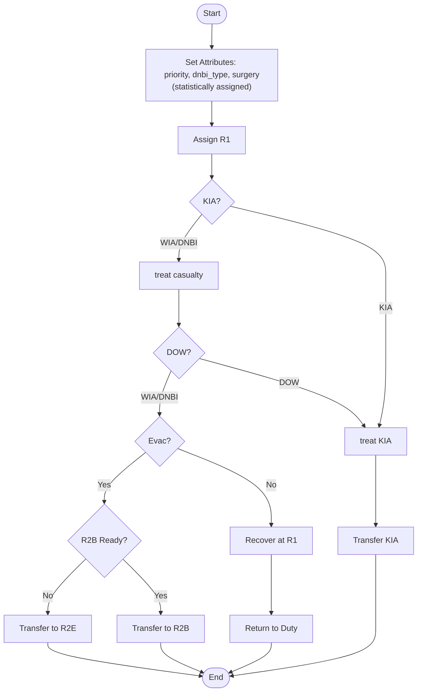
```mermaid
flowchart TD
    A(["Start"]) --> B["Set Attributes: <br> priority, dnbi_type, surgery (statistically assigned)"]
    B --> C["Assign R1"]
    C --> D{"KIA?"}
    D -- WIA/DNBI --> E["treat casualty"]
    E --> F{"DOW?"}
    F -- DOW --> G["treat KIA"]
    F -- WIA/DNBI --> H{"Evac?"}
    D -- KIA --> G
    H -- Yes --> I{"R2B Ready?"}
    I -- Yes --> J["Transfer to R2B"]
    I -- No --> K["Transfer to R2E"]
    K --> L(["End"])
    J --> L
    H -- No --> M["Recover at R1"]
    M --> N["Return to Duty"]
    N --> L
    G --> O["Transfer KIA"]
    O --> L
```

### R2B Trajectory

Casualties routed to the R2B undergo surgical care, stabilization, and further dispositioning. Casualties are initially assigned a holding bed, until they can be transferred to a resuscitation bed.

Similar to the R1, casualties arriving at R2B are assessed for DOW using the conditional increment of the time-dependent logistic survival function (see [Died of Wounds](#died-of-wounds)), applied to the elapsed time since injury at the point of arrival, conditional on having survived the R1 check. Under non-congested conditions, the incremental DOW probability at R2B is small (~1–3% for P1 arriving within 60 minutes of injury); under evacuation delay or queue pressure, the accumulated elapsed time produces substantially higher incremental risk. DOW casualties undergo a short treatment and are transported to the mortuary. Treatment and transport both use a duration with a triangular distribution: `min = 15`, `max = 45`, and `mode = 30` (minutes).

Resuscitation is modeled using a triangular distribution with ``min = 25``, ``max = 70``, and ``mode = 45`` (min). This distribution was developed based on estimates as there were no clear durations that could be identified in literature for the duration to be used for the resuscitation/emergency phase of treatment in R2 facilities. Instead, the likely/anticipated tasks required to be undertaken in this phase were collated with task duration estimates collated to produce estimates for use in the simulation (demonstrated in the table below). The durations were developed recognising the need for all activities to be completed within 90 min as indicated by [[19]](#References).

| Long Resuscitation       |           |            |           |
| ------------------------ | --------- | ---------- | --------- |
| Step                     | Min (min) | Mode (min) | Max (min) |
| Hemorrhage Control       | 2         | 5          | 10        |
| IV/IO Access             | 2         | 5          | 10        |
| TXA Administration       | 10        | 10         | 15        |
| Fluid Resuscitation      | 5         | 10         | 20        |
| Airway/Breathing Support | 3         | 5          | 10        |
| TBI Monitoring & Warming | 2         | 5          | 10        |
| Documentation/Prep       | 2         | 3          | 5         |
| **TOTAL**                | 25        | 45         | 70        |

Once resuscitation/emergency treatment has been completed, casualties not requiring surgery are transferred to a holding bed for recovery. Recovery follows a triangular distribution with ``min = 0.5``, ``max = 10``, and ``mode = 5`` (days).

Next, surgical candidacy is assessed. Since Issue #43, a pre-OT ICU availability gate is checked first, mirroring the R2E pattern for consistency and forward compatibility: Priority 1 candidates proceed regardless of this unit's ICU status; Priority 2+ candidates defer OT entry (polling on a timer, holding no resource) while this unit's ICU beds are fully saturated. R2B surgery does not seize ICU beds for post-operative recovery — the icu_beds checked here are the same beds used by the `wait_for_evac` fallback below — so this gate is expected to be inert under baseline load, where R2B ICU utilisation is effectively zero. Once the gate clears, operating theatre (OT) bed availability is assessed as before: if capacity permits, patients requiring surgery are transferred to an operating theatre for damage control (DAMCON) surgery. The DAMCON surgery treatment duration is modeled using a triangular distribution with ``min = 41``, ``max = 210``, and ``mode = 95`` (minutes). Due to the variability of potential requirements for surgery it was difficult to identify reliable durations for surgery time. This distribution was developed based on the interpretation of several meta studies ([[17]](#References), [[24]](#References)). Where there is not OT capacity, casualties are evacuated to the R2E for handling. 

Casualties requiring further care (surgery following the DCS model described in [[17]](#References) and [[18]](#References)) are evacuated to the R2E. The duration for evacuation to the R2E follows a triangular distribution with ``min = 15``, ``max = 45``, and ``mode = 30``. Where evacuation resources are not available, the patient is transferred to the ICU until evacuation resources are available to facilitate transfer.


```mermaid
flowchart TD
    A(["Start"]) --> B["Seize Hold Bed"]
    B --> C{"DOW?"}
    C -- Yes --> D["Treat KIA"]
    D --> E["Release Hold Bed"]
    E --> F["Transfer KIA"]
    F --> Z(["End"])
    C -- No --> G["Seize Resus Bed <br> Seize Emerg Team <br> Release Hold Bed"]
    G --> H["Resus"]
    H --> I["Release Resources"]
    I --> J{"Surgery?"}
    J -- Yes --> K0{"ICU Full and<br>Priority 2+?"}
    K0 -- "No (P1, or ICU free)" --> K{"OT Ready?"}
    K0 -- Yes --> KD["Defer: Poll ICU on Timer"]
    KD --> K0
    K -- Available --> L["Seize OT & Surg Team"]
    L --> M["Surgery"]
    M --> N["Release Resources"]
    K -- Not Available --> O{"Evac Ready?"}
    J -- No --> P["Seize Hold Bed"]
    P --> Q["Recover at R2B"]
    Q --> R["Release Hold Bed"]
    R --> S["Return to Duty"]
    S --> Z
    N --> O
    O -- Yes --> T["Select R2E"]
    T --> U["Transfer to R2E"]
    U --> V["Release Evac Team"]
    V --> Z
    O -- No --> W["Seize ICU"]
    W --> X["Wait for Evac"]
    X --> Y["Release ICU"]
    Y --> T
```

### R2E Heavy Trajectory

The R2E facility serves as a critical node for advanced casualty management, including resuscitation, surgery, intensive care, holding and pathways to strategic evacuation. 

Upon arrival, casualties are triaged; those identified as DOW by the time-dependent conditional increment check (see [Died of Wounds](#died-of-wounds)) are transferred for mortuary handling. By the time casualties reach R2E, elapsed time since injury is typically 60–180 minutes; the P1 logistic function produces substantially higher incremental mortality risk in this window, reflecting the clinical criticality of the R2E reception phase for unsurgicated casualties. Surviving casualties queue directly for a resuscitation bay, where they undergo a resuscitation phase. Where previous resuscitation has not been completed (at the R2B) a long duration resuscitation is completed, otherwise a short resuscitation is completed. The R2E long duration resuscitation follows the triangular distribution estimated for R2B resuscitations (`min = 25`, `max = 70`, and `mode = 45` (min)). The short duration resuscitation is modelled based on task estimate durations. These times are outlined in the table below. The duration uses a triangular distribution with ``min = 13``, ``max = 55``, and ``mode = 28``.

| Short Reuscitation       |           |            |           |
| ------------------------ | --------- | ---------- | --------- |
| Step                     | Min (min) | Mode (min) | Max (min) |
| Hemorrhage Control       | 2         | 5          | 10        |
| IV/IO Access             | 2         | 5          | 10        |
| Fluid Resuscitation      | 5         | 10         | 20        |
| TBI Monitoring & Warming | 2         | 5          | 10        |
| Documentation/Prep       | 2         | 3          | 5         |
| **TOTAL**                | 13        | 28         | 55        |

On completion of resuscitation, surgical candidacy is assessed via a pre-OT ICU availability gate (Issue #43 — see [Died of Wounds — Post-Operative Checkpoint](#died-of-wounds) for the full clinical rationale): if the casualty is flagged for damage control surgery, this team's ICU bed availability is checked *before* OT entry, not merely at the point of post-operative ICU admission. If an ICU bed is available, surgery proceeds and is followed by ICU recovery — the model behaviour is unchanged from pre-Issue-43. If ICU is saturated and the casualty is Priority 1, surgery still proceeds (withholding it would expose an unsurgicated Priority 1 casualty to near-certain DOW) but post-operative recovery is in a holding bed rather than ICU, with an elevated post-operative mortality risk. If ICU is saturated and the casualty is Priority 2 or lower, OT entry is deferred until an ICU bed frees. Surgical procedures follow the same triangular distribution for DAMCON surgeries at the R2B (``min = 41``, ``max = 210``, and ``mode = 95``), derived from meta-analyses and other academic studies ([[17]](#References), [[24]](#References)).

Post-operative care in the nominal (ICU-available) pathway involves admission to the ICU, where durations vary by surgical phase: the first ICU period ranges from ``min = 770`` to ``max = 2160`` minutes (``mode =  1440``) based on descriptions of post- DCS-I stabilization requirements (described as 24-36 h in most DCS research [[17]](#References), [[20]](#References), [[25]](#References)), while the secondary ICU phase (following second surgery) ranges from ``min = 30`` to ``mode = 90``, with ``mode = 60`` (min) to allow for post surgery monitoring and stabilisation prior to transfer to holding. In the ICU-saturated, Priority 1 pathway, post-operative recovery is instead in a holding bed with a triangular distribution of ``min = 360``, ``max = 1440``, and ``mode = 600`` minutes — shorter than a full ICU stay but carrying an elevated `dow_ceiling` (see Died of Wounds — Post-Operative Checkpoint). Both pathways converge on a shared post-operative DOW check before continuing. Casualties who arrive at the R2E requiring surgery, but not having received any prior to arrival, are queued to complete a second round of surgery after post-operative recovery.

After completing surgery and post-operative recovery, patients are either transferred to holding for recovery or undertake strategic evacuation. ~10% of casualties undertake recovery at the R2E following a triangular distribution for recovery time with ``min = 1``, ``max = 21``, and ``mode = 9`` (days) this distribution was selected on the basis that casualties with shorter recovery times and a likelihood for capacity to return to duty following recovery would be retained in theatre. The remaining ~90% are transferred for strategy evacuation. Based on [[9]](#References) Vietnam data that indicated 31% return to duty with 42% in theatre providing about 13% recovery in theatre at R2E

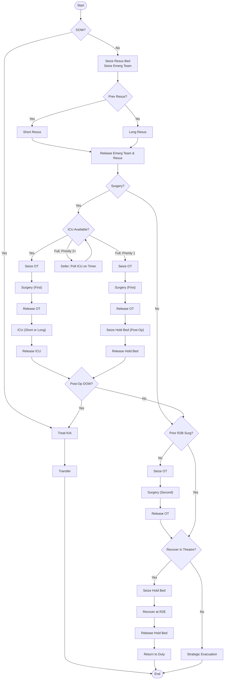
```mermaid
flowchart TD
    A(["Start"]) --> B{"DOW?"}
    B -- Yes --> C["Treat KIA"]
    C --> D["Transfer"]
    D --> Z(["End"])
    B -- No --> E["Seize Resus Bed <br> Seize Emerg Team"]
    E --> F{"Prev Resus?"}
    F -- Yes --> G["Short Resus"]
    F -- No --> H["Long Resus"]
    G --> I["Release Emerg Team & Resus"]
    H --> I
    I --> J{"Surgery?"}
    J -- No --> P{"Prior R2B Surg?"}
    J -- Yes --> K{"ICU Available?"}
    K -- "Yes" --> L["Seize OT"]
    L --> M["Surgery (First)"]
    M --> N["Release OT"]
    N --> O["ICU (Short or Long)"]
    O --> O2["Release ICU"]
    O2 --> PD{"Post-Op DOW?"}
    K -- "Full, Priority 1" --> L2["Seize OT"]
    L2 --> M2["Surgery (First)"]
    M2 --> N2["Release OT"]
    N2 --> O3["Seize Hold Bed (Post-Op)"]
    O3 --> O4["Release Hold Bed"]
    O4 --> PD
    K -- "Full, Priority 2+" --> KD["Defer: Poll ICU on Timer"]
    KD --> K
    PD -- Yes --> C
    PD -- No --> P
    P -- No --> Q["Seize OT"]
    Q --> R["Surgery (Second)"]
    R --> S["Release OT"]
    S --> T{"Recover in Theatre?"}
    P -- Yes --> T
    T -- Yes --> U["Seize Hold Bed"]
    U --> V["Recover at R2E"]
    V --> W["Release Hold Bed"]
    W --> X["Return to Duty"]
    X --> Z
    T -- No --> Y["Strategic Evacuation"]
    Y --> Z
```

---

## Model Outputs

The simulation produces a defined set of Key Performance Indicators (KPIs) organised by planner decision domain. Each KPI is selected against five criteria derived from military medical doctrine and discrete event simulation methodology [[22]](#References):

- **C1 — Doctrinal Standard Compliance:** Variable measures compliance with a named standard in AJP-4.10 [[21]](#References).
- **C2 — Planner Decision Relevance:** Variable value would change a force structure, positioning, or evacuation policy decision.
- **C3 — Causal Pathway Position:** Variable lies on the causal path between input parameters and health outcomes, required for meaningful Morris sensitivity screening.
- **C4 — Binding Constraint Identification:** Variable identifies when a resource or process becomes the active bottleneck.
- **C5 — Health Outcome Attribution:** Variable connects to a measurable health outcome (mortality, RTD, time-to-care).

> **Note on Point-of-Injury Time:** The simulation generates casualties as entities entering at Role 1. There is no pre-R1 phase modelled. Simmer's `start_time` in the arrivals monitor equals R1 arrival time, not point of injury. All time-to-care KPIs are therefore measured from R1 arrival, not point of injury. The POI-to-R1 transit falls outside the model's scope and cannot be derived from the current simulation structure. See the Limitations section for impact assessment.

---

### Domain 1 — Mortality and Preventable Death

> **MODEL OUTPUT — Total DOW Count:**
> Count of casualties assigned `dow = 1` across all replications. Includes all echelons.
> **Doctrinal basis:** AJP-4.10 §3: evacuation timeliness standards are designed to minimise preventable death.
> **Criteria:** C1, C2, C5
> **Computation:** `sum(attributes_wide$dow == 1, na.rm = TRUE)` per replication.
> **Note:** DOW probability is now time-dependent (Issue #5 implemented). DOW count will increase under queue saturation and evacuation delay relative to non-congested baseline values, making this metric sensitive to system load.

> **MODEL OUTPUT — DOW Rate by Echelon:**
> Count and proportion of DOW deaths occurring at each echelon (R1, R2B, R2E), derived from the `dow_echelon` attribute. Attribute encoding: 1 = R1, 2 = R2B, 3 = R2E (simmer supports only numeric attribute values).
> **Doctrinal basis:** AJP-4.10 §5: echelon-specific mortality is the primary indicator for role-appropriate capability allocation.
> **Criteria:** C1, C2, C3, C5
> **Computation:** Filter `attributes_wide` where `dow == 1`; decode `dow_echelon` (1‚Üí"r1", 2‚Üí"r2b", 3‚Üí"r2e"); count by decoded echelon label; divide by total arrivals for rate. Consistency check: echelon subtotals must sum to total DOW count.
> **Note:** With time-dependent DOW implemented (Issue #5), echelon DOW rates are now sensitive to system load. Elevated R2B or R2E DOW rates indicate that transport or admission delays are accumulating mortality risk in the corresponding phase of care.

---

### Domain 2 — Time-to-Care from R1 Arrival

> **MODEL OUTPUT — Time from R1 Arrival to First Surgical Incision:**
> Elapsed time (minutes) from R1 arrival (`start_time`) to first surgical incision (`min(r2b_surgery_start, r2e_surgery_1_start)`), per casualty requiring surgery.
> **Doctrinal basis:** AJP-4.10 §5 and the NATO 10-1-2 timeline specify surgical intervention within 2 hours of point of injury. This KPI measures the within-system component of that standard.
> **Criteria:** C1, C2, C3, C5
> **Computation:** `pmin(r2b_surgery_start, r2e_surgery_1_start, na.rm = TRUE) - start_time`; exclude KIA and DOW cases where death preceded any surgery; report mean, p10, p90.
> **Limitation:** Measured from R1 arrival, not point of injury. The POI-to-R1 component (evacuation from point of wounding to R1) is outside the model's scope and must be added separately to compare against the doctrinal 2-hour standard.

> **MODEL OUTPUT — R2B Dwell Time:**
> Time (minutes) a casualty spends at R2B from treatment start (`r2b_treatment_start_time`) to departure towards R2E (`r2b_departure_time`).
> **Doctrinal basis:** AJP-4.10 §5 specifies that R2B (Role 2 Basic) dwell should not exceed the damage control surgery window; extended dwell indicates holding capacity pressure.
> **Criteria:** C1, C3, C4
> **Computation:** `r2b_departure_time - r2b_treatment_start_time`; report mean and p90.

> **MODEL OUTPUT — R2B→R2E Transit Time:**
> Time (minutes) between R2B departure (`r2b_departure_time`) and R2E arrival (`r2e_arrival_time`).
> **Doctrinal basis:** AJP-4.10 §5 evacuation time norms for second-echelon to third-echelon transfer.
> **Criteria:** C1, C3
> **Computation:** `r2e_arrival_time - r2b_departure_time`; report mean and p90.

> **MODEL OUTPUT — R2E Dwell Time:**
> Time (minutes) a casualty spends at R2E from arrival (`r2e_arrival_time`) to disposition (`r2e_departure_time`), covering resuscitation, surgery, ICU, and holding.
> **Doctrinal basis:** R2E (Role 2 Enhanced) dwell is the primary determinant of ICU and OT bed occupancy; AJP-4.10 §5 capacity planning norms are calibrated to expected dwell distributions.
> **Criteria:** C1, C3, C4
> **Computation:** `r2e_departure_time - r2e_arrival_time`; report mean and p90.

---

### Domain 3 — Surgical Throughput

> **MODEL OUTPUT — OT Utilisation Rate by Echelon:**
> Server time as a proportion of available capacity-minutes within the observation window, for R2B and R2E operating theatres.
> **Doctrinal basis:** AJP-4.10 §5 bed and OT planning ratios; sustained utilisation above 85% indicates saturation risk.
> **Criteria:** C3, C4
> **Computation:** `sum(server √ó duration) / (sum(capacity) √ó observation_window)` per echelon, derived from resource monitor for `b_r2b_ot_*` and `b_r2eheavy_ot_*` resources.

> **MODEL OUTPUT — R2B and R2E Surgery Counts per Day:**
> Count of surgical cases started per simulation day at each echelon, derived from `r2b_surgery_start` and `r2e_surgery_1_start` / `r2e_surgery_2_start` attributes.
> **Doctrinal basis:** AJP-4.10 §5 OT throughput norms; daily surgical volume is the primary operational throughput indicator for surgical teams.
> **Criteria:** C2, C3, C4
> **Computation:** Floor of surgery start time divided by 1440; count by day and echelon.

---

### Domain 4 — Echelon Load and Capacity

> **MODEL OUTPUT — Resource Queue Length Over Time:**
> Queue length time-series for each bed type (hold, resus, OT, ICU) at R1, R2B, and R2E, derived from the simmer resource monitor.
> **Doctrinal basis:** AJP-4.10 §5 bed ratios and queue saturation thresholds; sustained non-zero queues indicate structural capacity shortfall.
> **Criteria:** C3, C4
> **Computation:** `queue` column from `get_mon_resources()` filtered by resource name pattern per echelon.

---

### Domain 5 — Flow and Disposition

> **MODEL OUTPUT — RTD Rate by Echelon:**
> Count and proportion of casualties returning to duty at each echelon (R1, R2B, R2E), decomposed by RTD type (`battle_fatigue` / `clinical`). Derived from the `return_echelon`, `return_day`, and `dnbi_type` attributes. Attribute encoding: `return_echelon` 1 = R1, 2 = R2B, 3 = R2E; `dnbi_type` 1 = battle fatigue.
> **Doctrinal basis:** AJP-4.10 §5 [[21]](#References): in-theatre return-to-duty rate is the primary combat power conservation metric; echelon-level RTD indicates where treatment is most efficient. The `battle_fatigue` sub-type reflects forward behavioural health management capacity (R1 hold, no R2 routing); the `clinical` sub-type reflects Role 2 treatment throughput and efficacy.
> **Criteria:** C1, C2, C5
> **Computation:** Filter `attributes_wide` where `return_day` is not NA; decode `return_echelon` (1‚Üí"r1", 2‚Üí"r2b", 3‚Üí"r2e"); assign `rtd_type` = "battle_fatigue" where `dnbi_type == 1`, else "clinical"; count by `(return_echelon, rtd_type)`; divide by total WIA + DNBI arrivals for rate. Consistency check: echelon √ó type subtotals must sum to `total_rtd`.

> **MODEL OUTPUT — R2B Bypass Rate:**
> Proportion of WIA casualties routed directly from R1 to R2E without R2B treatment, identifiable where `r2e_treated` is not NA and `r2b_treated` is NA.
> **Doctrinal basis:** AJP-4.10 §5: bypass indicates either R2B overload or deliberate acuity-based routing policy; elevated bypass rates reduce R2B workload while increasing R2E demand.
> **Criteria:** C2, C3, C4
> **Computation:** Count of `combined` where `!is.na(r2e_treated) & is.na(r2b_treated)`, divided by total WIA arrivals.

---

### Domain 6 — Combat Power

> **MODEL OUTPUT — Total RTD Count (bf_rtd + clinical_rtd):**
> Total count of casualties assigned `return_day`, decomposed into two operationally distinct sub-totals: `bf_rtd` (battle fatigue casualties returned at R1 without clinical treatment) and `clinical_rtd` (all other RTDs following R1 recovery, R2B hold-bed discharge, or R2E hold-bed discharge). `total_rtd = bf_rtd + clinical_rtd`.
> **Doctrinal basis:** AJP-4.10 §5 and ADDP 4.2: return-to-duty throughput directly determines the rate at which combat power is regenerated from the medical system. `bf_rtd` measures forward behavioural health management; `clinical_rtd` measures Role 2 treatment efficacy. Reporting a combined total without this decomposition overstates clinical RTD output.
> **Criteria:** C2, C5
> **Computation:** `bf_rtd = sum(!is.na(return_day) & dnbi_type == 1)`; `clinical_rtd = sum(!is.na(return_day) & (is.na(dnbi_type) | dnbi_type != 1))`; consistency check: `bf_rtd + clinical_rtd == sum(!is.na(return_day))`.

---

### Output Variable Register cross-reference

| KPI | Domain | Attributes Required | Criteria | Analysis Function |
|---|---|---|---|---|
| Total DOW count | Mortality | `dow` | C1, C2, C5 | `sum(dow == 1)` |
| DOW rate by echelon | Mortality | `dow`, `dow_echelon` | C1–C3, C5 | `dow_by_echelon` |
| Time to first surgery | Time-to-care | `r2b_surgery_start`, `r2e_surgery_1_start`, `start_time` | C1–C3, C5 | `time_to_first_surgery` |
| R2B dwell time | Time-to-care | `r2b_treatment_start_time`, `r2b_departure_time` | C1, C3, C4 | `r2b_dwell_time` |
| R2B‚ÜíR2E transit | Time-to-care | `r2b_departure_time`, `r2e_arrival_time` | C1, C3 | `r2b_r2e_transit_time` |
| R2E dwell time | Time-to-care | `r2e_arrival_time`, `r2e_departure_time` | C1, C3, C4 | `r2e_dwell_time` |
| OT utilisation | Surgical | resource monitor | C3, C4 | `ot_utilisation` |
| Surgery counts/day | Surgical | `r2b_surgery_start`, `r2e_surgery_*` | C2–C4 | `r2b_summary`, `r2e_summary` |
| Queue length over time | Echelon load | resource monitor | C3, C4 | resource plots |
| RTD rate by echelon √ó type | Flow/disposition | `return_day`, `return_echelon`, `dnbi_type` | C1, C2, C5 | `rtd_by_echelon` (columns: `return_echelon`, `rtd_type`, `rtd_count`, `rtd_rate`) |
| R2B bypass rate | Flow/disposition | `r2b_treated`, `r2e_treated` | C2–C4 | derived in `combined` |
| Total RTD count (bf + clinical) | Combat power | `return_day`, `dnbi_type` | C2, C5 | `bf_rtd`, `clinical_rtd`, `total_rtd` |

---

## Simulation Analysis

### Simulation Casualty Generation

This section presents a detailed breakdown of casualty source data captured from a single simulation run using seed 42, spanning a 30-day operational duration. The data is analyzed through the lens of deployed health system design, highlighting implications for medical resource allocation, evacuation planning, and treatment capacity across Role 1 and Role 2 facilities.

> **Note on warm-up exclusion:** No warm-up exclusion is applied. The simulation is classified as a terminating simulation; the full observation window, including campaign start-up, is retained in all outputs (`WARM_UP_DAYS = 0L`). See the [Warm-up Period Analysis](#warm-up-period-analysis) section for the methodological basis.

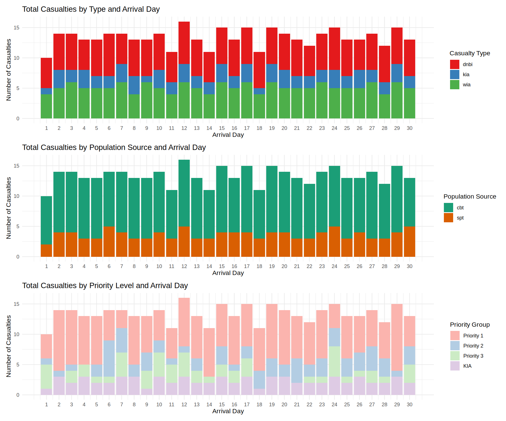

| Casualty Type | Population Source | 1   | 2   | 3   | 4   | 5   | 6   | 7   | 8   | 9   | 10  | 11  | 12  | 13  | 14  | 15  | 16  | 17  | 18  | 19  | 20  | 21  | 22  | 23  | 24  | 25  | 26  | 27  | 28  | 29  | 30  | total |
|:------------- |:----------------- | ---:| ---:| ---:| ---:| ---:| ---:| ---:| ---:| ---:| ---:| ---:| ---:| ---:| ---:| ---:| ---:| ---:| ---:| ---:| ---:| ---:| ---:| ---:| ---:| ---:| ---:| ---:| ---:| ---:| ---:| -----:|
| dnbi          | cbt               | 4   | 5   | 5   | 4   | 5   | 5   | 4   | 5   | 5   | 5   | 4   | 5   | 5   | 4   | 5   | 5   | 5   | 4   | 5   | 5   | 5   | 4   | 5   | 5   | 5   | 4   | 5   | 5   | 5   | 4   | 141   |
| dnbi          | spt               | 1   | 1   | 1   | 1   | 1   | 2   | 1   | 1   | 1   | 1   | 1   | 2   | 1   | 1   | 1   | 1   | 1   | 2   | 1   | 1   | 1   | 1   | 1   | 2   | 1   | 1   | 1   | 1   | 1   | 2   | 35    |
| kia           | cbt               | 1   | 2   | 1   | 2   | 2   | 1   | 2   | 2   | 1   | 2   | 1   | 2   | 2   | 1   | 2   | 1   | 2   | 1   | 2   | 2   | 1   | 2   | 1   | 2   | 2   | 1   | 2   | 1   | 2   | 1   | 47    |
| kia           | spt               | 0   | 1   | 1   | 1   | 0   | 1   | 1   | 1   | 0   | 1   | 1   | 1   | 0   | 1   | 1   | 1   | 1   | 0   | 1   | 1   | 1   | 0   | 1   | 1   | 1   | 1   | 0   | 1   | 1   | 1   | 23    |
| wia           | cbt               | 3   | 3   | 4   | 4   | 3   | 3   | 4   | 3   | 4   | 3   | 3   | 4   | 3   | 3   | 4   | 3   | 4   | 3   | 4   | 3   | 4   | 3   | 4   | 3   | 4   | 3   | 4   | 3   | 4   | 3   | 103   |
| wia           | spt               | 1   | 2   | 2   | 1   | 2   | 2   | 2   | 1   | 2   | 1   | 2   | 2   | 2   | 1   | 2   | 2   | 2   | 1   | 2   | 2   | 1   | 2   | 2   | 2   | 1   | 2   | 2   | 2   | 1   | 2   | 51    |
| Total         |                   | 10  | 14  | 14  | 13  | 13  | 14  | 14  | 13  | 13  | 13  | 12  | 16  | 13  | 11  | 15  | 13  | 15  | 11  | 15  | 14  | 13  | 12  | 14  | 15  | 14  | 12  | 14  | 13  | 14  | 13  | 400   |

The table above presents a summary of the simulated casualty data generated across three primary categories Wounded in Action (WIA), Killed in Action (KIA), and Disease and Non-Battle Injury (DNBI), with their source population: combat forces and support forces. A total of 400 casualties were recorded, with combat elements accounting for the majority (291), reflecting their higher exposure to operational risk. DNBI emerged as the most frequent casualty type (176 cases), underscoring the persistent burden of non-combat medical conditions even in high-intensity environments. This aligns with historical data indicating that DNBI can rival or exceed battle injuries in terms of lost duty days and medical resource consumption.

WIA cases totaled 154, with a notable skew toward combat personnel (103 vs. 51) as a result of the force ratios present within the simulation. These casualties typically require multi-echelon care, including resuscitation, surgical intervention, and post-operative holding, placing sustained demand on Role 1 and Role 2 facilities. KIA figures were lower (70 total).

From a health system planning perspective, this data implies a need for scalable treatment capacity, robust DNBI mitigation strategies, and distributed surgical capability. The consistent casualty generation across periods suggests a steady operational tempo, requiring continuous staffing, replenishment of medical supplies, and resilient evacuation pathways.

| Population Source | 1   | 2   | 3   | 4   | 5   | 6   | 7   | 8   | 9   | 10  | 11  | 12  | 13  | 14  | 15  | 16  | 17  | 18  | 19  | 20  | 21  | 22  | 23  | 24  | 25  | 26  | 27  | 28  | 29  | 30  | total |
|:----------------- | ---:| ---:| ---:| ---:| ---:| ---:| ---:| ---:| ---:| ---:| ---:| ---:| ---:| ---:| ---:| ---:| ---:| ---:| ---:| ---:| ---:| ---:| ---:| ---:| ---:| ---:| ---:| ---:| ---:| ---:| -----:|
| cbt               | 8   | 10  | 10  | 10  | 10  | 9   | 10  | 10  | 10  | 10  | 8   | 11  | 10  | 8   | 11  | 9   | 11  | 8   | 11  | 10  | 10  | 9   | 10  | 10  | 11  | 8   | 11  | 9   | 11  | 8   | 291   |
| spt               | 2   | 4   | 4   | 3   | 3   | 5   | 4   | 3   | 3   | 3   | 4   | 5   | 3   | 3   | 4   | 4   | 4   | 3   | 4   | 4   | 3   | 3   | 4   | 5   | 3   | 4   | 3   | 4   | 3   | 5   | 109   |
| Total             | 10  | 14  | 14  | 13  | 13  | 14  | 14  | 13  | 13  | 13  | 12  | 16  | 13  | 11  | 15  | 13  | 15  | 11  | 15  | 14  | 13  | 12  | 14  | 15  | 14  | 12  | 14  | 13  | 14  | 13  | 400   |

The second table provides a breakdown of the casualty population by source: combat forces (cbt) and support forces (spt). Of the 400 total casualties generated, 291 (approximately 73%) originated from combat elements, while 109 (27%) were drawn from support units. This distribution reflects the total population breakdown of the organisation. The consistent presence of support force casualties across all periods underscores the vulnerability of rear-area personnel in LSCO environments, particularly under conditions of indirect fire, degraded situational awareness, and disrupted medical evacuation. The temporal spread of casualties shows a relatively stable operational tempo, with total casualties per period ranging from 10 to 16. 

From a health system perspective, this data reinforces the need for distributed medical coverage that includes both forward and rear-area assets. Role 1 treatment teams must be positioned to respond rapidly to combat casualties, while Role 2 facilities must be capable of absorbing and triaging support force casualties who may present with different injury profiles, including DNBI and delayed trauma. The consistent casualty burden across both populations highlights the importance of scalable capacity, flexible evacuation pathways, and robust command and control to ensure timely treatment and prevent bottlenecks in casualty flow.

| Priority | 1   | 2   | 3   | 4   | 5   | 6   | 7   | 8   | 9   | 10  | 11  | 12  | 13  | 14  | 15  | 16  | 17  | 18  | 19  | 20  | 21  | 22  | 23  | 24  | 25  | 26  | 27  | 28  | 29  | 30  | total |
|:-------- | ---:| ---:| ---:| ---:| ---:| ---:| ---:| ---:| ---:| ---:| ---:| ---:| ---:| ---:| ---:| ---:| ---:| ---:| ---:| ---:| ---:| ---:| ---:| ---:| ---:| ---:| ---:| ---:| ---:| ---:| -----:|
| Pri 1    | 5   | 7   | 9   | 2   | 8   | 10  | 10  | 7   | 4   | 7   | 7   | 9   | 8   | 5   | 8   | 8   | 8   | 6   | 9   | 7   | 8   | 8   | 7   | 8   | 9   | 7   | 7   | 8   | 7   | 6   | 219   |
| Pri 2    | 3   | 2   | 2   | 3   | 2   | 1   | 0   | 2   | 6   | 2   | 1   | 3   | 2   | 3   | 3   | 2   | 1   | 2   | 1   | 3   | 1   | 1   | 3   | 2   | 1   | 2   | 3   | 1   | 2   | 1   | 61    |
| Pri 3    | 1   | 2   | 1   | 5   | 1   | 1   | 1   | 1   | 2   | 1   | 2   | 1   | 1   | 1   | 1   | 1   | 3   | 2   | 2   | 1   | 2   | 1   | 2   | 2   | 1   | 1   | 2   | 2   | 2   | 4   | 50    |
| KIA      | 1   | 3   | 2   | 3   | 2   | 2   | 3   | 3   | 1   | 3   | 2   | 3   | 2   | 2   | 3   | 2   | 3   | 1   | 3   | 3   | 2   | 2   | 2   | 3   | 3   | 2   | 2   | 2   | 3   | 2   | 70    |
| Total    | 10  | 14  | 14  | 13  | 13  | 14  | 14  | 13  | 13  | 13  | 12  | 16  | 13  | 11  | 15  | 13  | 15  | 11  | 15  | 14  | 13  | 12  | 14  | 15  | 14  | 12  | 14  | 13  | 14  | 13  | 400   |

Of the total casualties, 219 (54.8%) were classified as Priority 1, representing patients requiring immediate life-saving intervention. This dominant category underscores the doctrinal necessity of forward-positioned Role 1 assets capable of rapid triage and stabilization. The consistent presence of Priority 1 cases across all 30 days suggests a sustained high-acuity burden, reinforcing the need for scalable throughput 

Priority 2 and Priority 3 casualties accounted for 61 (15.3%) and 50 (12.5%) cases respectively. These patients typically require delayed or routine care. The simulation also generated 70 KIA cases (17.5%), distributed evenly across the operational timeline. While these cases do not contribute to medical workload substantially, their operational implications are significant.

From a systems design perspective, the acuity profile derived from this simulation reinforces several key imperatives:

- Role 1 facilities must be optimized for high-throughput triage and stabilization, with emphasis on rapid evacuation of Priority 1 cases.
- Role 2 facilities requires flexible bed space and surgical capability to absorb cases, especially during sustained operations.
- Evacuation architecture must support continuous movement of mixed-acuity casualties, with prioritization protocols and redundancy to ensure resilience.

### R1 Handling

Role‚ÄØ1 facilities consistently demonstrated the ability to process casualties without delay, with all patients receiving immediate triage and treatment on arrival. The absence of queuing reflects both adequate staffing and appropriately scaled treatment capacity relative to the casualty inflow modelled. Rapid handling times ensured that Priority‚ÄØ1 cases could be stabilised and evacuated without degradation in clinical status, while lower‚Äëpriority cases were managed and prepared for movement in line with requirements. However, the model does not currently fully represent the limitations in availability of evacuation assets, as a result, throughput at the Role‚ÄØ1 was not constrained by evacuation availability, allowing continuous casualty flow to higher‚Äëechelon care and preventing downstream bottlenecks in the system which may bear out with the introduction of more detailed modelling of evacuation. Despite this, the performance underscores the critical function of Role‚ÄØ1 as an agile, forward medical capability able to maintain momentum under sustained operational tempo.

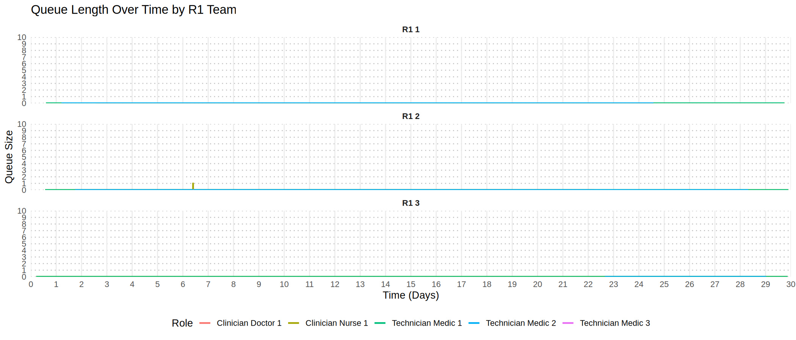

### R2B Handling

The plot below outlines a summary of casualty handling at R2B. Following DNBI sub-categorisation (Issue #7), OT-bypass routing (Issue #35), and correction of OT bed scheduling (Issue #37), the R2B picture is substantially revised from earlier model iterations.

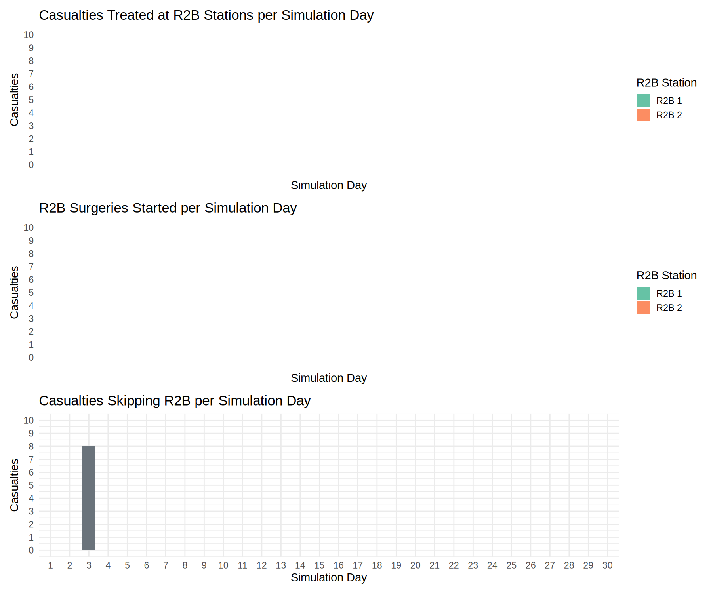

OT rooms are modelled as physical spaces available 24 hours per day. The surgical team operates on a 12-hour shift schedule and is the operative constraint on surgical access. Under seed 42 (30 days, post-Issue-43), **132 casualties reached the R2B surgical decision point**; **53 surgeries** were performed at R2B when both OT bed and team were simultaneously available, and **77 were bypassed to R2E**. R2B OT utilisation was **10.5% (T1) and 7.9% (T2) against 24-hour room time**, equivalent to approximately **21.0% and 15.9% against available team shift time**. The OT queue remained flat at zero throughout the run, confirming the bypass logic is functioning as designed.

**Bypass reason decomposition (Issue #40).** The undifferentiated bypass count above conflates two distinct causes: the surgical team being off-shift, and the OT bed itself being busy or queued. `r2b_bypass_reason` (set at the point of bypass in `r2b_treat_wia()`, `R/trajectories.R`) distinguishes them: of the 77 bypasses, **67 (87%) were because the surgical team was off-shift**, and only **10 (13%) were because the OT bed was busy or a queue existed**. This confirms the 12-hour shift window — not physical OT capacity — as the dominant constraint on forward surgical throughput at R2B: for half of each 24-hour cycle, a casualty arriving at either R2B unit cannot receive surgery there regardless of bed availability, and is routed to R2E instead.

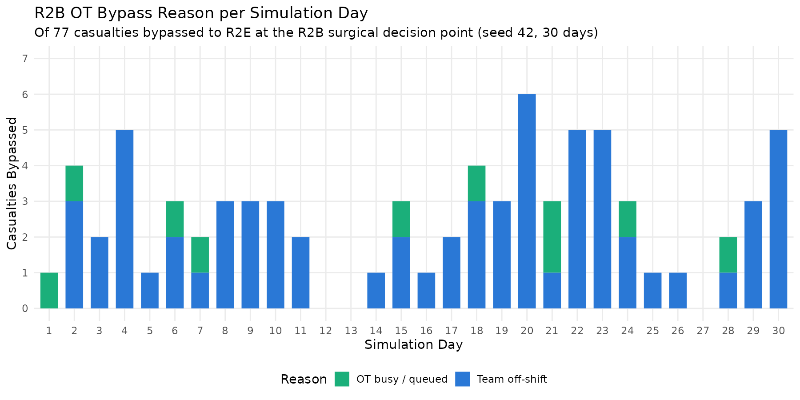

Off-shift bypasses (blue) dominate on nearly every day of the run, while OT-busy/queued bypasses (green) appear only intermittently and never exceed 2 in a single day — indicating the shift-window gap is a persistent, day-to-day constraint rather than an occasional congestion spike.

Two candidate interventions to close this gap were scoped under Issue #40 — extending the existing team's shift hours, or fielding a second surgical team per R2B unit on the complementary shift — but neither is evaluated in this analysis. Extending shift hours cannot be meaningfully assessed without a model of clinician fatigue and associated error/complication risk, which the simulation does not represent; reporting throughput gains from longer shifts without that counterweight would overstate the intervention's net benefit. Fielding a second team is an establishment-size decision — a resourcing question for planners, not a parameter the simulation should default to testing as if cost-free. Both remain candidate follow-up scenario tests once a fatigue model exists or a second-team establishment change is directed; see Further Development.

**Holding bed queues at R2B are the primary identified system constraint.** Hold bed queues build progressively from approximately Day 10–15 onward, reaching 8–10 patients waiting at both R2B nodes by Day 20–22 and remaining elevated through Day 30. This saturation is driven by disease DNBI evacuees occupying hold beds for multi-day durations (mode 5 days), not by post-surgical patients. The five hold beds per R2B unit are structurally insufficient for the cumulative DNBI holding demand generated over a 30-day operation.

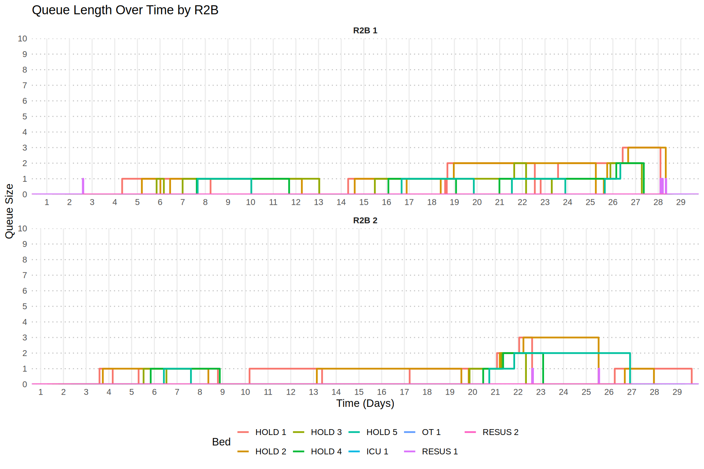

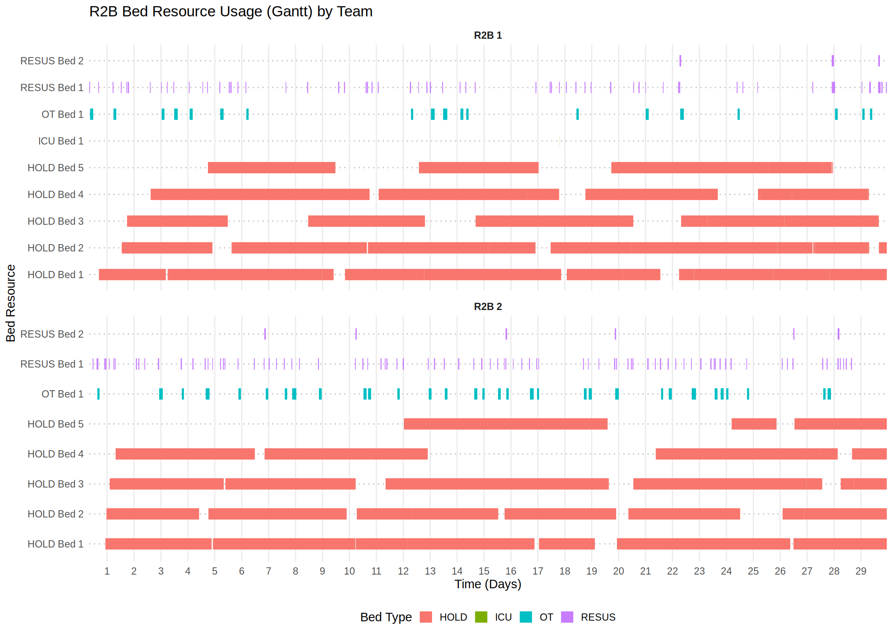

#### R2B Hold Bed Saturation — Stream Decomposition and Intervention Analysis

Issue #39 adds per-stream decomposition of R2B hold bed occupancy. A `r2b_hold_start` attribute is now recorded for each patient entering the long-duration hold pathway, enabling daily concurrent occupancy to be decomposed by patient stream (disease DNBI, NBI DNBI, WIA) in the analysis pipeline. The `r2b_hold_drawn` attribute stores the drawn hold duration at the time of bed seizure, supporting optional evac-threshold logic described below.

**Battle fatigue verification.** Code inspection confirms that battle fatigue casualties (dnbi_type == 1) exit the trajectory at R1 via the "Battle Fatigue R1 Hold" branch and never reach R2B hold beds. This is enforced by a `stopifnot` assertion in the analysis pipeline.

**Structural load calculation.** Under the baseline seed 42 parameters (176 DNBI total; 97 disease, 33 NBI, 46 battle fatigue):

- Disease DNBI reaching R2B hold: ~77 evacuated (P1: 97 × 0.65 × 0.95 ≈ 60; P2: 97 × 0.20 × 0.90 ≈ 17), minus ~6% surgical candidacy ≈ **72 entering hold-bed recovery** over 30 days (≈ 2.4 per day)
- Non-surgical WIA and NBI reaching R2B hold: ~19 over 30 days (≈ 0.6 per day)
- **Total hold entry rate: ≈ 3.0 patients per day**
- Expected hold duration (triangular min=0.5d, mode=5d, max=10d): mean = (0.5 + 5 + 10) / 3 = **5.17 days**
- **Expected concurrent hold occupancy: 3.0 × 5.17 ≈ 15.5 beds** against 10 available (5 per R2B unit × 2 units)

This is a **structural 55% overload**. The saturation cannot be resolved by changes to surgical throughput; it requires an intervention at the holding pathway itself.

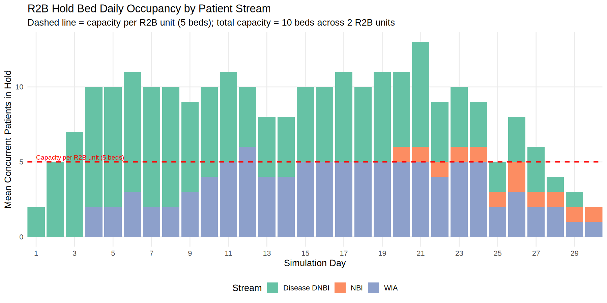

**Intervention Scenario A — Hold duration reduction** (`vars.r2b.holding.mode` in `env_data.json`). Reducing the hold mode from 5 days (7,200 min) to 3 days (4,320 min) reduces expected mean duration from 5.17 to (0.5 + 3 + 10) / 3 = 4.5 days. Expected concurrent occupancy falls from 15.5 to 3.0 × 4.5 = **13.5 beds** — still 35% above the 10-bed capacity. A clinically implausible mode of ≤ 1.3 days would be required to bring expected occupancy within capacity. Hold duration reduction alone is insufficient to resolve saturation. To test: change `{"var": "mode", "val": 7200}` to `{"var": "mode", "val": 4320}` in the `vars.r2b.holding` activity and re-run 10+ replications.

**Intervention Scenario B — Hold bed expansion** (`elms.r2b.beds.hold.qty` in `env_data.json`). Increasing hold beds from 5 to 10 per R2B unit provides 20 total beds against expected steady-state demand of ~15.5, yielding comfortable headroom to absorb stochastic variance. Eight beds per unit (16 total) provides marginal headroom. To test: change `{"name": "hold", "qty": 5}` to `{"name": "hold", "qty": 10}` in the `elms.r2b.beds` array and re-run 10+ replications.

**Intervention Scenario C — Evacuation threshold** (`vars.r2b.holding.evac_threshold` in `env_data.json`). The trajectory now supports an optional evac threshold (minutes): when `evac_threshold` is set and a patient's drawn hold duration exceeds it, the patient is forwarded to R2E rather than waiting for full recovery at R2B. At a threshold of 3 days (4,320 min): the triangular CDF gives P(draw > 4,320) = 1 − (4,320 − 720)² / ((14,400 − 720) × (7,200 − 720)) ≈ **85% of hold patients forwarded to R2E early**, effectively eliminating R2B hold saturation. This reduces R2B hold bed occupancy substantially but transfers a non-surgical medical load to the R2E hold and ICU pathway. To test: add `{"var": "evac_threshold", "val": 4320}` to the `vars.r2b.holding` activity vals array and re-run 10+ replications.

**Intervention Scenario D — Capacity-aware hold routing (Issue #39, implemented).** A two-tier routing policy manages hold bed allocation. The primary tier operates at R1 before transport begins; the secondary tier operates at R2B on arrival.

**Primary tier — upstream threshold routing (`vars.r2b.holding.hold_threshold`, default 0.8).** `select_r2b_for_hold()` now checks whether a R2B unit's hold occupancy is strictly below `hold_threshold × capacity` before routing a patient there. With 5 beds per unit and threshold 0.8, a unit is only selected if fewer than 4 beds (80%) are occupied, keeping at least 1 bed reserved for incoming Step 1 staging patients. If no R2B unit is below threshold, the patient is routed directly to R2E from R1 (`r2b_bypassed = 1`) without incurring transport to R2B at all. When `hold_threshold` is absent the function falls back to routing whenever any bed is free (original behaviour). This eliminates the cascade where long-duration Step 4 holders starve new Step 1 arrivals: the routing decision is made before transport, not after the patient has already consumed a hold bed. To test: set `{"var": "hold_threshold", "val": 0.6}` for more aggressive upstream routing, or remove the parameter to restore original behaviour.

**Secondary tier — at-R2B three-stage policy.** For patients who arrive at R2B (either because the upstream check passed, or a race condition occurred between routing decision and arrival):

1. **Hold capacity available** — patient seizes a hold bed immediately (Step 4 No Surgery branch).
2. **Hold full, R2E has capacity** — patient bypasses to R2E via evacuation-team transport (`r2b_hold_bypass = 1`); also the fallback when queue cap is exceeded.
3. **Both echelons full, queue within cap** — patient joins the R2B hold queue (`r2b_hold_queued = 1`). Queue cap = floor(R2B\_beds / (R2B\_beds + R2E\_beds) × R2B\_beds) = **2 patients**; above cap, fallback to stage 2.

The analysis pipeline reports all three routing outcomes: `r2b_pre_bypass_count` (upstream, at R1), `r2b_hold_bypass_count` (at R2B Step 4), and `r2b_hold_queued_count` (queued at R2B when both echelons saturated).

> **MODEL ASSUMPTION — R2B Hold Bed Structural Overload:** Five hold beds per R2B unit are insufficient to absorb the demand generated by 58% disease DNBI proportion over a 30-day operation. The overload is structural (expected demand 15.5 beds vs. 10 available) and is not resolved by hold duration reduction alone. With no-queue bypass active (Scenario D), overflowing patients transfer to R2E rather than accumulating at R2B, preserving system throughput at the cost of increased R2E medical hold load.
> **Basis:** Derived from model parameters: hold entry rate ≈ 3.0 patients/day × mean hold 5.17 days = 15.5 concurrent beds. No empirical doctrinal standard for forward medical holding capacity in LSCO contexts has been identified in open-access literature.
> **Uncertainty:** Medium — conditioned on the 58% disease DNBI proportion assumption (itself High uncertainty; see MODEL ASSUMPTION — DNBI Disease Proportion). If true disease proportion is lower, the overload reduces proportionally.
> **Consequence if wrong:** If disease DNBI proportion is substantially lower (e.g., 30%), expected concurrent hold occupancy falls to ~8 beds, within the 10-bed capacity. The saturation finding is sensitive to this assumption.

### R2E Heavy Handling

Following correction of DNBI sub-categorisation (Issue #7), OT-bypass routing (Issues #35 and #37), 24-hour OT bed availability, and the OT–ICU gating introduced by Issue #43, the R2E Heavy is the primary surgical node for the deployed health system. Under seed 42 (30 days, post-Issue-43), the R2E performed **134 first surgeries**, receiving both direct R1 bypass patients and R2B bypasses generated by off-shift, occupied, or ICU-saturated R2B OT.

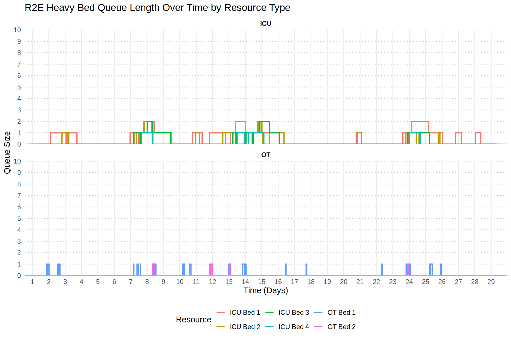

**R2E OT utilisation is moderate and not saturated.** OT 1 operated at **48.7%** utilisation against 24-hour room time; OT 2 at **25.2%**. OT queues are brief and sporadic. It should be noted that the R2E trajectory currently seizes OT bed resources but does not seize the surgical team directly; the team schedule therefore has no operative effect on R2E surgical timing. Correcting this is part of the individual resource seizure refactor (Issue #4) and will likely increase true R2E OT utilisation figures when implemented.

**ICU remains the primary binding constraint at R2E Heavy, though the OT–ICU gate (Issue #43) now visibly redistributes load away from it.** Per-bed utilisation across the four ICU beds is **75.8%, 62.6%, 59.0%, and 49.6%** (seed 42, 30 days) — lower than the pre-Issue-43 baseline (80.6%, 73.6%, 64.8%, 56.9%) because 23 of the 133 patients gated at the pre-OT ICU check were rerouted to post-operative holding-bed recovery instead of queuing for ICU. ICU 1 carries a queue for **27% of the run**; ICU 2 and ICU 3 for **7% and 6%** respectively; ICU 4 is never queued. Of the 133 casualties passing through the pre-OT gate, **110 recovered in ICU** (`post_op_pathway = 1`) and **23 Priority 1 casualties recovered in a holding bed** (`post_op_pathway = 2`) because ICU was saturated at the moment of OT entry; **10 Priority 2+ casualties had OT entry deferred** (`surgery_deferred = 1`) while ICU was saturated, all subsequently proceeding once a bed freed. Neither pathway produced a post-operative DOW event in this single seed-42 run — consistent with the small per-patient probabilities involved (see [Died of Wounds — Post-Operative Checkpoint](#died-of-wounds)) and the still-small absolute DOW counts characteristic of the Falklands-calibrated baseline; a saturated-ICU stress test (ICU capacity forced to 0, 90-day run) confirmed the mechanism fires correctly, producing measurable post-operative DOW when the elevated-risk pathway dominates. With post-surgical recovery demand driven by the volume of R2E first surgeries (134 in this run) against a four-bed ICU establishment, ICU remains the single greatest throughput constraint at the R2E, but the model now represents the clinical trade-off surgical teams face rather than silently queuing patients for a bed that may never come.

`analyse_run()` now visualises exactly which casualties, and on which simulation day, received degraded care as a direct consequence of ICU saturation:

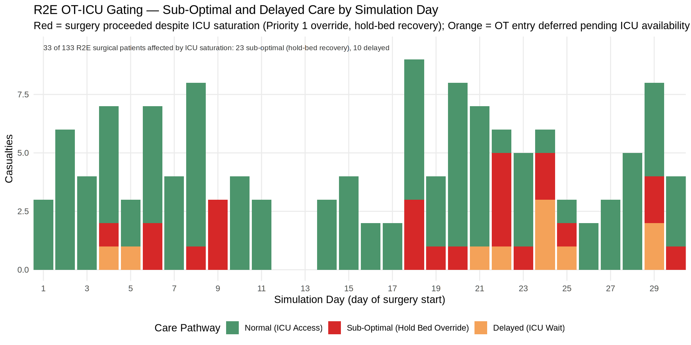

Sub-optimal care (red — surgery proceeded despite ICU saturation, Priority 1 override to holding-bed recovery) and delayed care (orange — OT entry deferred pending ICU availability, Priority 2+) cluster on the higher-arrival days from roughly Day 18 onward, consistent with cumulative ICU demand outstripping the four-bed establishment later in the run. `outputs/r2e_icu_gating_daily.csv` and `outputs/post_op_pathway_summary.csv` provide the underlying daily and pathway-level counts.

**50-replication validation (seed = NULL, 30 days) confirms the effect generalises beyond seed 42.** Comparing 50 independent replications pre- and post-Issue-43: mean R2E ICU utilisation fell from **74.1% to 60.2%** — a substantial, consistently-observed reduction in ICU load, not a seed-42 artefact. Mean DOW/run rose from **0.84 (95% CI [0.58, 1.10]) to 1.00 (95% CI [0.74, 1.26])** — the two confidence intervals overlap substantially, so this specific comparison does not reach conventional statistical significance at n = 50 (DOW remains a rare event; a properly powered before/after comparison would need a considerably larger replication count). The increase is, however, fully attributable to the new post-operative checkpoint: it contributed a mean of 0.10 DOW/run on its own (5 of 50 replications), accounting for essentially the entire point-estimate shift. Within that checkpoint, the qualitative design intent held using the real (non-stress-tested) parameters: the post-op hold pathway's realised DOW rate (2 deaths / 1,223 patients = 0.16%) was roughly **2.8× the ICU pathway's rate** (3 deaths / 5,085 patients = 0.06%) — the elevated-risk pathway is measurably, not just theoretically, riskier at baseline casualty rates, though the small absolute counts mean this ratio itself carries wide uncertainty.

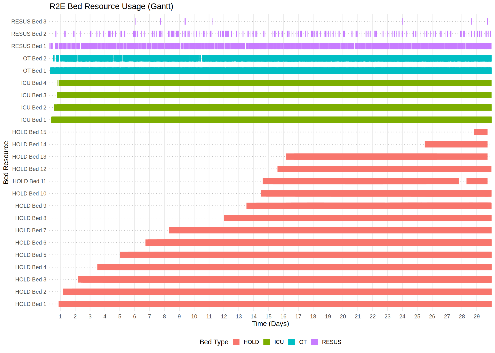


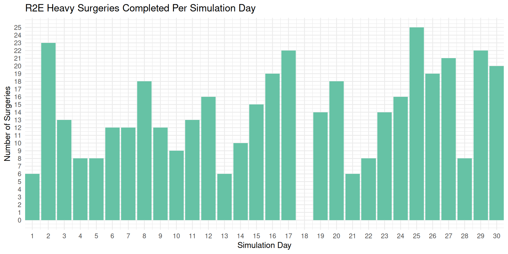

When examined in system context, the combined OT capacity of two R2B elements and one R2E Heavy is adequate for a single combat brigade under Falklands-equivalent casualty rates [[8]](#References). However, if this system were applied to a deployed division, surgical and holding capacity would be grossly insufficient even if only one brigade was assumed to be in contact at any time. The modelled scenario also does not account for mass-casualty events or the elevated casualty production rates reported in FORECAS modelling of campaigns such as Okinawa or Vietnam, both of which would expose this deficit [[8]](#References).

### Casualty Waiting Time

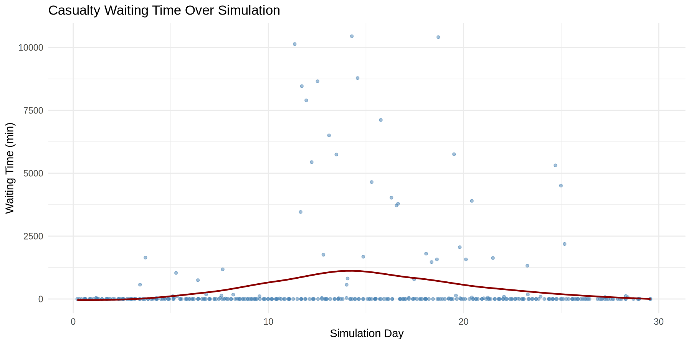

### Transport Fleet Capacity Margin

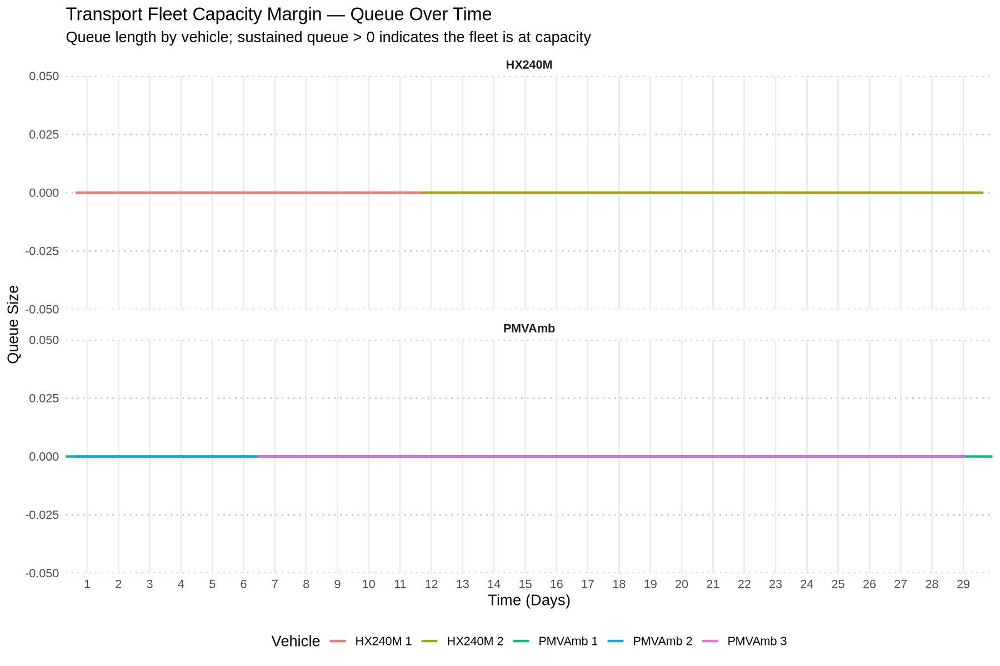

Under seed 42 (30 days), the queue for every PMV Ambulance and HX240M unit remains at 0 throughout the run, confirming the finding from the Transport Assets — Dead-Heading Return Legs section: the current three-vehicle PMV Ambulance and two-vehicle HX240M pools are not a binding constraint at the current Falklands-derived casualty rate, even with the full round-trip dead-heading model applied. Mean utilisation (`outputs/transport_utilisation.csv`) is 11.1% for PMV Ambulance and 4.9% for HX240M — substantial headroom remains. This plot shows the current single-run margin only; a fleet-size sweep (varying vehicle count directly, rather than only casualty rate or transport duration) is required to characterise at what fleet size or casualty rate transport becomes the binding constraint, and is tracked as a follow-up issue (see Further Development).

> **STUB — Fleet-Size Capacity Margin Sweep:** `plot_transport_capacity_margin_by_fleet_size()` in `R/analysis.R` is scaffolding only — it defines the intended parameters (`fleet_sizes`, `n_days`, `n_rep`) and documents the planned algorithm in its roxygen block, but calling it raises an explicit "not yet implemented" error. It depends on the comparative scenario runner (Issue #10) and is tracked as a Phase 4 follow-up issue, sequenced after #10.

### Return to Duty

Under seed 42 (30 days), **148 casualties** were assigned a `return_day` attribute, decomposed as follows:

| Echelon | RTD type | Count | Rate (of 400 arrivals) |
|---|---|---|---|
| R1 | battle_fatigue | 38 | 9.5% |
| R1 | clinical | 59 | 14.8% |
| R2B | clinical | 46 | 11.5% |
| R2E | clinical | 5 | 1.3% |
| **Total** | | **148** | **37.0%** |

`bf_rtd` is 38, not 46 (the total battle fatigue casualties generated), because 8 battle fatigue entities were still within their R1 hold timeout when the 30-day simulation ended and were not assigned `return_day`. Battle fatigue RTDs are exclusively at R1, consistent with the no-R2-routing design. The majority of clinical RTDs occur at R1 (Priority 3 WIA and NBI completing R1 recovery) and R2B (disease cases discharged from hold beds). R2E clinical RTDs are low (5) because R2E hold-bed discharge is contingent on post-surgical recovery completion, which for many casualties extends beyond the 30-day window. The aggregate RTD rate of 37.0% is within the historical range for in-theatre MTF admissions (7.6–42.1% [[9]](#References)), though direct comparison requires accounting for the simulation's 30-day boundary effect.

### Comparative Scenario Analysis

The preceding sections analyse a single seed-42 run under the base `env_data.json` configuration, which is Falklands-calibrated (see [Scenario Profiles](#scenario-profiles)). This section extends that analysis using the comparative scenario runner (`run_scenario()` / `compare_scenarios()`, `R/scenario_runner.R`), which executes the full multi-replication framework ([Multi-run Replication Framework](#multirun-replication-framework)) under a named scenario profile and aggregates queue and mortality KPIs across replications in the same mean (p10–p90), 95% CI format used throughout this project.

Two scenarios are compared — `moderate_intensity` (Falklands 1982 exemplar) and `high_intensity` (Okinawa exemplar, demonstration skeleton) — both defined in `env_data.json` by Issue #54 (see [Scenario Profiles](#scenario-profiles)). A third, Vietnam-calibrated profile is not included: FORECAS's Appendix A has no standalone Vietnam combat-troop WIA/KIA distribution table (Table A.5 is Vietnam DNBI only) [[8]](#References), so no genuinely FORECAS-sourced Vietnam parameters exist to build one from (see the Issue #54 merge notes and Limitation L12).

10 replications √ó 30 days (seed 42) were run for each scenario via `Rscript scripts/run_scenarios.R --iterations 10 --days 30`:

| Metric | `moderate_intensity` (Falklands) | `high_intensity` (Okinawa) | Ratio |
|---|---|---|---|
| Total casualties/run | 399.8 (p10–p90: 399.0–401.1) | 1082.1 (p10–p90: 1079.9–1084.1) | 2.71× |
| WIA/run | 153.9 (153–155) | 732.5 (730–734.1) | 4.76× |
| DOW/run | 0.4 (0–1) | 7.9 (6–9) | ~20× (small-sample; see DOW/WIA rate) |
| DOW/WIA rate | 0.260% (95% CI [0.02%, 0.50%]) | 1.078% (95% CI [0.96%, 1.19%]) | 4.15√ó |
| R2B OT mean queue | 0.000 | 0.000 | — |
| R2E OT mean queue | 0.049 | 37.82 | 773√ó |
| R2E ICU mean queue | 0.045 | 3.156 | 69√ó |
| R2B hold mean queue | 0.266 | 3.682 | 13.8√ó |
| Transport mean queue | 0.000 | 0.0002 | negligible in both |

`moderate_intensity` total casualties (399.8) match the documented seed-42 single-run baseline (400, `CLAUDE.md` Key Parameters) within 0.05% — confirming the comparative runner reproduces the existing baseline under the Falklands profile it is scenario-explicit about, consistent with Issue #54's no-op guarantee for `default`. The `moderate_intensity` and `high_intensity` DOW/run figures (0.4 and 7.9 at 10 replications each) are also consistent with the larger-sample validation runs documented in [Scenario Profiles](#scenario-profiles) and `CLAUDE.md` (`moderate_intensity`: 0.767 mean DOW/run at 30 replications; `high_intensity`: 7.040 mean DOW/run at 50 replications) — cross-validating this issue's `run_scenario()` / `compare_scenarios()` implementation against those independently-produced figures.

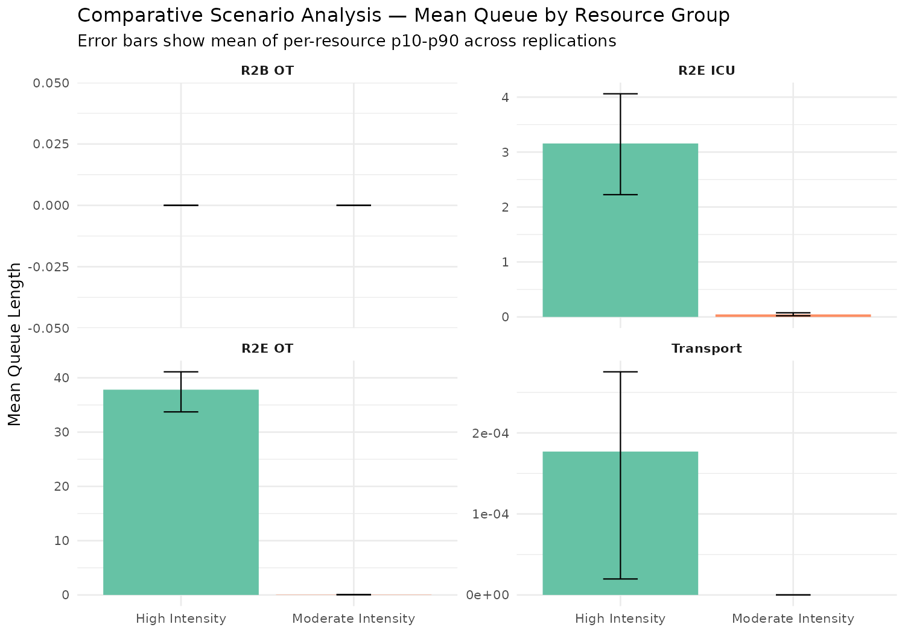

The comparison exposes a structural fragility that the single-scenario baseline could not surface. Under `high_intensity` casualty rates, R2E OT and ICU — already the binding constraints at Falklands-equivalent load (see [R2E Heavy Handling](#r2e-heavy-handling)) — become severely saturated: mean R2E OT queue rises from 0.05 to 37.8 casualties, and R2E ICU queue rises from 0.05 to 3.2. R2B OT queue remains at 0 in both scenarios — not because R2B absorbs any of the surge, but because the existing OT-bypass routing (Issues #35, #37, #40) diverts surgical candidates to R2E whenever R2B is off-shift, busy, or queued rather than allowing them to wait; under `high_intensity`, this shunts the entire surge onto an R2E that has no further capacity to absorb it. R2B hold bed queue — already identified as a Falklands-rate bottleneck (see [R2B Hold Bed Saturation](#r2b-hold-bed-saturation-—-stream-decomposition-and-intervention-analysis)) — increases 13.8× (0.27 to 3.68), driven by the proportional increase in non-surgical WIA volume rather than any change to DNBI generation (DNBI is not scenario-eligible; see [Scenario Profiles — Parameter classification](#parameter-classification)). Transport remains the one echelon with genuine headroom: mean queue stays effectively at 0 even at 2.7× total casualty volume, consistent with the [Transport Fleet Capacity Margin](#transport-fleet-capacity-margin) finding that the PMV Ambulance/HX240M pool is not the binding constraint at either intensity level.

### Conclusion

The single-run analysis, viewed in its entirety, demonstrates that the modelled deployed health system is capable of sustaining a steady operational tempo for a single brigade under baseline casualty assumptions derived from the Falklands conflict. Role 1 elements show sufficient responsiveness and throughput, and the dual-node R2B configuration absorbs surgical demand effectively through a combination of forward surgery and bypass routing to R2E.

Following correction of DNBI sub-categorisation (Issue #7), OT-bypass routing (Issues #35 and #37), and structural analysis of R2B holding capacity (Issue #39), two system constraints are identified. At R2B, holding bed capacity saturates progressively from Day 10–15 onward, driven by disease DNBI evacuees occupying hold beds for multi-day durations. Stream decomposition analysis (Issue #39) confirms disease DNBI as the dominant load: expected concurrent hold occupancy of ~15.5 beds exceeds 10-bed capacity by 55%, a structural mismatch not addressable through surgical throughput adjustment. Hold bed expansion (≥8 beds per unit) or an evacuation threshold policy are the indicated interventions. OT is not a constraint at either echelon: R2B OT operates at 5.4–8.5% against 24-hour room time (10.8–17.0% against shift time); R2E OT at 46.9% and 23.5%.

**The primary binding constraint at R2E is ICU capacity.** The four-bed ICU operates at 50–76% utilisation post-Issue-43 (down from 57–81% pre-Issue-43, reflecting the 23 casualties now rerouted to post-operative holding), with ICU bed 1 carrying a queue for 27% of the run. The R2E Heavy performs 134 first surgeries in the baseline run compared to 53 at R2B. Two distinct system levers are indicated: R2B holding bed expansion or higher evacuation threshold from R2B holding, and increased R2E ICU capacity to relieve the primary post-surgical bottleneck. The OT–ICU gate (Issue #43) does not add capacity; it makes the consequence of the existing shortfall explicit in the model's mortality output rather than absorbing it silently into ICU queue time.

The system's resilience to surge is now directly quantified rather than inferred. The comparative scenario analysis (see [Comparative Scenario Analysis](#comparative-scenario-analysis)) confirms that neither the R2B nor the R2E can absorb Okinawa-intensity casualty rates [[8]](#References): R2E OT queue increases 773-fold and R2E ICU queue 69-fold relative to the Falklands baseline, while R2B OT queue remains at zero only because the existing bypass routing shunts all surgical overflow onto an already-saturated R2E rather than R2B absorbing any of the surge itself. Effective LSCO medical support at this intensity would require scalable holding capacity at forward echelons, adaptable evacuation architecture, and dynamic load-balancing between R2B and R2E — capabilities that the current static establishment does not provide. A comparable Vietnam-intensity comparison remains unavailable pending a genuine FORECAS-sourced Vietnam combat-troop WIA/KIA table (see Limitation L12).
---

## Limitations

This section consolidates known model limitations, organised by impact on findings. Each limitation is cross-referenced to the inline assumption blocks or output annotation blocks where applicable, and to the action plan issue addressing it where one exists.

### High Impact

**L1 — Point-of-Injury to R1 Transit Not Modelled (Medium Impact on Time-to-Care KPIs)**
The simulation generates casualties as entities entering at Role 1 (R1). The transit from point of injury (POI) to R1 — covering application of tourniquet, self-aid, buddy-aid, and tactical field care — is outside the model's scope. All time-to-care KPIs are therefore measured from R1 arrival, not POI. This means the "time to first surgical incision" KPI represents only the within-system delay and cannot be directly compared to the doctrinal AJP-4.10 2-hour surgical standard without adding an external POI-to-R1 estimate. The within-system delay component remains planner-controllable; the POI-to-R1 component is determined by tactical factors outside the health system. **Impact: Medium.** Rated Medium rather than High because the within-system delay is the component planners can act on; however, any comparison to the doctrinal 2-hour standard must account for this gap explicitly.

**L2 — Flat DOW Rate Independent of Wait Time** *(Resolved — Issue #5)*
DOW probability is now modelled as a time-dependent shifted logistic function of elapsed time since injury, calibrated to [[38]](#References) and [[39]](#References). The conditional increment formulation across echelons ensures that queue saturation and evacuation delay produce measurable increases in modelled mortality. DOW count and rate by echelon are now sensitive to system load. See the [Died of Wounds](#died-of-wounds) section for parameter details.

**L3 — Team-Block Resource Seizure and Incomplete R2E Team Seizure (High Impact on Bottleneck Identification)**
Resources are seized as whole team vectors at R2B. A second casualty cannot use any team member even when the first casualty requires only a subset of skills. At R2E, the trajectory seizes OT bed resources but does not seize the surgical team; the R2E team schedule therefore has no operative effect on surgical timing, and R2E surgery can proceed at any hour regardless of whether the team is nominally on shift. Skill-specific bottlenecks (surgeon vs. anaesthetist vs. nursing officer) and task-sharing under surge conditions are invisible. OT utilisation KPIs understate true contention, and R2E surgical throughput is overstated until team seizure is implemented. **Impact: High.** Addressed in Issue #4 (individual resource seizure refactor).

### Medium Impact

**L4 — R2B Hold Bed Capacity Insufficient for Disease DNBI Load (Medium Impact on Patient Throughput and DOW Risk)**
Stream decomposition analysis (Issue #39) confirms that the five hold beds per R2B unit are structurally insufficient: expected concurrent occupancy is approximately 15.5 beds against a 10-bed total capacity across both R2B units (see R2B Hold Bed Saturation section). Four interventions have been analysed and implemented: hold duration reduction (insufficient alone), hold bed expansion to 8–10 per unit (structurally resolves the overload), an evacuation threshold policy routing long-duration holders to R2E early (activation: add `evac_threshold` to `vars.r2b.holding` in `env_data.json`), and a two-tier capacity-aware routing policy (Issue #39, implemented). The two-tier policy operates: (1) upstream at R1 — `select_r2b_for_hold()` routes patients to R2E before transport when R2B hold occupancy meets or exceeds `hold_threshold` (default 0.8; configurable in `vars.r2b.holding`), keeping at least one hold bed free for Step 1 incoming patients; (2) at R2B on arrival — a three-stage branch seizes hold if available, bypasses to R2E if hold is full but R2E has capacity, or queues at R2B (capped at 2 patients) if both echelons are simultaneously saturated. Together, the two tiers eliminate routine hold queuing; only genuine simultaneous saturation of both echelons (the most severe operational scenario) can produce a bounded R2B queue. **Impact: Medium** — patients are always dispositioned in finite time; upstream routing reduces R2B load at the cost of increased R2E medical hold demand. With Issue #5 (time-dependent DOW) now implemented, hold bed routing policy directly affects modelled mortality: patients routed to R2E earlier accumulate less time-at-echelon and therefore lower conditional DOW risk at the R2B check.

**L5 — Undifferentiated DNBI Treatment Pathway** *(Resolved — Issue #7)*
DNBI casualties are now sub-categorised into battle fatigue (25%), disease (58%), and NBI (17%) with differentiated treatment pathways. Battle fatigue cases are held at R1 and returned to duty without R2 routing. Disease cases may be evacuated to R2B for holding only, with a 6% emergency surgical candidacy. NBI cases follow the full WIA-equivalent trajectory. This removes approximately 83% of DNBI from the routine surgical pathway, eliminating the artificial inflation of surgical demand that previously characterised the model. Across 100 replications, NBI surgical candidacy was 79.6%, disease surgical candidacy was 5.7%, and battle fatigue was 0.0%.

**L6 — Unidirectional Transport** *(Resolved — Issue #6)*
PMV Ambulance and HX2 40M transport assets now hold for a configurable return leg (default 1.0× the outbound triangular distribution, i.e. a symmetric round trip — tactical rate-of-march is not doctrinally differentiated by payload) after casualty drop-off, before becoming available for the next pickup. Under the current Falklands-derived casualty rate, the vehicle pool is not saturated, so no persistent queue forms; the effect is visible as an increase in total PMV Ambulance busy-time over a 30-day run. The impact will be more pronounced under MASCAL conditions (Issue #9) where multiple casualties compete for the same limited vehicle pool. Return route conditions are assumed symmetric with the outbound route — see the Transport Assets MODEL ASSUMPTION block.

**L7 — No MASCAL Stochastic Injection (Medium Impact on Surge Capacity Assessment)**
The casualty generation model produces a smooth lognormal daily rate. Discrete tactical events generating 20–50 casualties within a 2–4 hour window — the primary stress test for surgical and ICU capacity in LSCO — are entirely absent. **Impact: Medium.** Addressed in Issue #9 (compound Poisson MASCAL injection).

**L8 — Single Baseline Casualty Rate Scenario** *(Resolved — Issue #10)*
A comparative scenario runner (`run_scenario()` / `compare_scenarios()`, `R/scenario_runner.R`) now executes the full multi-replication framework under a named scenario profile and reports queue/mortality KPIs in the same mean (p10–p90), 95% CI format used elsewhere in this project. Comparing `moderate_intensity` (Falklands, the existing baseline) against `high_intensity` (Okinawa exemplar, Issue #54) across 10 replications × 30 days each confirms that system adequacy conclusions do not extrapolate to Okinawa-intensity LSCO: R2E OT mean queue rises 773-fold and R2E ICU mean queue 69-fold, and DOW/WIA rate rises from 0.26% to 1.08% (see [Comparative Scenario Analysis](#comparative-scenario-analysis)). A genuinely FORECAS-sourced Vietnam-intensity comparison remains unavailable — FORECAS's Appendix A has no standalone Vietnam combat-troop WIA/KIA distribution table (see the Issue #54 merge notes and Limitation L12) — so the scenario comparison is bounded to Falklands and Okinawa intensities, not the full historical range originally envisaged.

**L9 — Partial Antithetisation (Low Impact on CI Precision)**
Antithetic variate variance reduction is applied to arrival time generation only. Service times and routing probabilities are generated internally by simmer's C++ engine from R's global RNG and cannot be antithetised without deep trajectory instrumentation. The CI-narrowing benefit of antithetic pairing is therefore partial: it reduces arrival-driven variance but leaves service-time variance unreduced. **Impact: Low** — the dominant source of between-replication variance is arrival schedule variation (lognormal), which is fully antithetised; residual variance from service draws is secondary.

**L11 — OT–ICU Gating Parameters Are Informed Estimates (Medium Impact on Post-Operative Mortality Realism)**
The Priority 1 override threshold, the post-op hold penalty multiplier (3.0), and the post-op hold LOS distribution introduced by Issue #43 (see [Died of Wounds — Post-Operative Checkpoint](#died-of-wounds)) are informed estimates rather than literature-derived values — no open-access source quantifies a ward-vs-ICU mortality ratio specific to post-DCS trauma patients, or a typical length of stay for post-operative recovery outside ICU in an austere setting. Priority 2+ candidates deferring OT entry while ICU is saturated have no escape valve in the current model: under sustained ICU saturation (e.g. MASCAL conditions, Issue #9), a deferred candidate could in principle wait indefinitely rather than being triaged to non-operative management. **Impact: Medium.** The qualitative direction of the model's findings (the post-op hold pathway carries materially higher DOW risk than ICU; deferred candidates accumulate visibly under saturation — confirmed under a saturated-ICU stress test) is expected to be robust to the exact parameter values chosen; absolute post-operative DOW rates should be treated as illustrative pending clinical expert consultation or a literature-derived calibration target.

**L12 — Falklands KIA:WIA Ratio, High Intensity Skeleton Incompleteness, and Missing Vietnam Source (Medium Impact on Scenario Validation)**
The `moderate_intensity` scenario profile (Issue #54, see [Scenario Profiles](#scenario-profiles)) reproduces a KIA:WIA ratio of 0.452 across 30 replications, against the published 255 KIA : 777 WIA (0.328) South Atlantic campaign record [[43]](#References). This ratio is a pre-existing characteristic of the base `generators.wia_cbt`/`generators.kia_cbt` casualty generation rates (FORECAS Table A.8 [[8]](#References), calibrated under Issue #1) combined with the lognormal-cap generation mechanism ([Casualty Generation](#casualty-generation)); it is not introduced or corrected by Issue #54, which overrides only the DOW ceiling and treatment efficacy factors. Separately, the `high_intensity` profile is an explicitly unvalidated demonstration skeleton: only casualty generation rates and distribution family are sourced (FORECAS Tables A.7/A.9 [[8]](#References)); DOW ceiling, treatment efficacy, priority distribution, DNBI composition, and transport times are inherited from the Falklands-calibrated base rather than sourced for the Okinawa context. No Vietnam-calibrated profile exists in this project: FORECAS's Appendix A has no standalone Vietnam combat-troop WIA/KIA distribution table (only a DNBI table), so no genuinely FORECAS-sourced Vietnam parameters could be identified — a Vietnam scenario should wait for a source that actually tabulates it rather than being estimated without one. **Impact: Medium.** The DOW rate — the parameter Issue #54 is responsible for — is well within tolerance of its historical target; the KIA:WIA discrepancy, the `high_intensity` skeleton's incompleteness, and the absence of a sourced Vietnam profile would need to be addressed by a future issue (most likely Issue #10) revisiting the casualty generator calibration or completing a fully validated `high_intensity` scenario profile.

### Low Impact

**L10 — No Endogenous Force Feedback (Low Impact on Arrival Rates)**
Casualty arrival rates are fixed exogenous inputs applied to a static force size. The feedback loop between return-to-duty rates, strategic evacuation, force depletion, and future casualty production is not represented. **Impact: Low** for 30-day runs; increases with campaign duration. Addressed in Issue #18 (endogenous casualty generation).

---

## Further Development

The single run analysis has demonstrated that while the current simulation framework offers a credible baseline for evaluating deployed health system performance under brigade-level LSCO conditions, several areas warrant further development to improve the accuracy of the model and enhance the analysis from it.

Dead-heading return legs for pooled transport assets are now modelled (Issue #6; see Transport Assets — Dead-Heading Return Legs). The immediate follow-on opportunity is a **fleet-size capacity margin sweep**: the current single-run analysis shows PMV Ambulance and HX240M utilisation rising under dead-heading but queue remaining at 0 under the current establishment, which only demonstrates margin exists — it does not quantify how much, or at what fleet size or casualty rate the transport layer becomes a binding constraint. A stub for this — `plot_transport_capacity_margin_by_fleet_size()` in `R/analysis.R` — is included as scaffolding: it documents the intended interface and algorithm but is not yet implemented, since a meaningful sweep requires the comparative scenario runner infrastructure (Issue #10) to avoid duplicating replication/aggregation logic. Tracked as a follow-up issue in Phase 4 (Scenario Expansion), sequenced after #10 — see `docs/BCH_Simulation_Action_Plan.md`.

Another refinement involves pulsing strategic medical evacuation availability to simulate its temporal constraints. Rather than assuming continuous access to strategic lift, future iterations should model episodic availability windows, reflecting real-world limitations such as airframe tasking, weather delays, or air superiority conditions. This would allow for more realistic bottleneck formation and better inform prioritisation protocols for high-acuity casualties.

Model fidelity can also be improved through structured expert consultation. Engaging clinicians, medical planners, and operational commanders would support refinement of treatment durations, triage logic, and evacuation thresholds. This would ensure that the simulation reflects not only doctrinal intent but also clinical realities and operational constraints.

To reflect the unpredictability of LSCO, future simulations should also incorporate rare but high-impact mass-casualty events. These could be triggered stochastically and used to evaluate system shock absorption, surge protocols, and triage degradation under extreme conditions. Such modelling would be particularly valuable in validating the robustness of the R2E Heavy and its ability to maintain throughput under duress.

Comparative analysis against other casualty generation models is now implemented (Issue #10; see [Comparative Scenario Analysis](#comparative-scenario-analysis)). Okinawa-intensity casualty rates [[8]](#References), applied via the `high_intensity` scenario profile (Issue #54), confirm severe surgical and ICU capacity shortfalls at R2E under sustained high-intensity LSCO. A genuinely FORECAS-sourced Vietnam-intensity comparison remains a future development item: FORECAS's Appendix A has no standalone Vietnam combat-troop WIA/KIA distribution table, so no comparison can be added without either a fresh literature source or a documented informed-estimate methodology consistent with this project's citation standards.

The R2B bypass-reason decomposition (Issue #40) confirms that surgical team off-shift hours, not OT bed congestion, are the dominant constraint on forward surgical throughput at R2B (see R2B Handling). Two scenario tests remain to quantify how this gap might be closed — extended shift hours and a second surgical team per unit — but both are deliberately deferred: extended-hours evaluation requires a clinician fatigue/error-rate model not currently represented, and a second team is an establishment-size decision for planners rather than a parameter the simulation should test unilaterally. Should either input become available (a fatigue model, or a directed establishment change), `ot_hours` already threads through to `build_env()` for the former, while the latter requires extending the R2B `surg` sub-element to `qty: 2` in `env_data.json` and reworking `build_env()`'s shift-alternation counter, which currently alternates across R2B units rather than within one.

The introduction of DNBI sub-categorisation (Issue #7) also opens a new sensitivity screening requirement. The Morris Elementary Effects analysis conducted in Issue #3 covers nine parameters from the original undifferentiated DNBI model; it does not include `disease_surgery_pct` (the proportion of disease DNBI cases escalated to emergency surgery), which carries High uncertainty and directly affects OT and ICU utilisation. A follow-up Morris screening should add this parameter to the set, re-run on the Issue #7 model, and update the µ\* ranking table to reflect current model structure. Until this re-run is complete, the absolute µ\* values in the current Sensitivity Analysis section should be interpreted with caution — the relative ranking of the original nine parameters is expected to remain qualitatively stable, since WIA continues to dominate surgical demand.

Despite these refinements, the recommendations from the single run analysis remain relevant. Rebalancing underutilised bed spaces (e.g., resuscitation and holding beds), expanding in-theatre recovery rates to improve return-to-duty throughput, and exploring the operational impact of increasing surgical team availability at R2B nodes are all worth investigating. The model refinements will support the development of a more responsive, and scalable deployed health system capable of sustaining combat power under the full spectrum of LSCO demands.

---

## Conclusion

This research has advanced the modelling of deployed health system performance by using casualty generation modelled on historical conflict casualty data with a discrete event simulation framework capable to build a brigade-level simulation that can be run over extended operational durations. Through a systematic review of existing literature, previously published casualty models were identified, restructured, and adapted to support per-minute simulation granularity; enabling evaluation of medical infrastructure across 30+ day campaigns.

A representative deployed health system was constructed, encompassing triage, evacuation, and definitive care, and incorporating a three-stage model of damage control surgery derived from academic resources. The simulation was executed under moderate casualty conditions, and its outputs were analysed to identify systemic risks, capacity shortfalls, and design inefficiencies. These findings informed targeted recommendations for system refinement, including adjustments to bed allocation, surgical team distribution, and recovery throughput.

The simulation demonstrates that the current system design is capable of managing casualty rates comparable to those experienced during the Falklands conflict. However, this historical benchmark may not reflect the operational realities anticipated in future large-scale combat operations (LSCO), where casualty volumes, evacuation delays, and treatment bottlenecks may be significantly more severe. The current model, while robust under Falklands-equivalent load, has now been tested against a high-intensity (Okinawa-exemplar) LSCO casualty projection and found wanting: R2E surgical and intensive care capacity cannot absorb the resulting surge under the current establishment.

To address this gap, further development is required. Enhancements such as pulsed strategic evacuation availability and stochastic mass-casualty event triggers will improve realism and operational relevance. A comparative scenario runner (Issue #10; see [Comparative Scenario Analysis](#comparative-scenario-analysis)) now executes this comparison directly: at Okinawa-intensity casualty rates (FORECAS [[8]](#References) Tables A.7/A.9), R2E OT and ICU queues increase 773-fold and 69-fold respectively relative to the Falklands baseline, confirming that the current health system architecture requires fundamental redesign — not incremental adjustment — to remain viable under high-intensity LSCO. A comparable Vietnam-intensity assessment awaits a genuine FORECAS-sourced Vietnam combat-troop casualty table, which does not exist in the source document's Appendix A (see Limitations).

Ultimately, this research provides a transparent, modular, and extensible foundation for future simulation efforts. It enables planners, clinicians, and commanders to interrogate system performance, anticipate failure points, and iteratively refine medical support doctrine. With continued development and rigorous testing, this framework can evolve into a decision-support tool capable of guiding health system design for the most demanding operational environments.

---

## References

<small>[Return to Top](#contents)</small>

<!-- REFERENCES START -->

[1] U.S. Army Combined Arms Center. (2025). *ADP 3-0: Operations*. Headquarters, Department of the Army. Retrieved 17 Aug 25, from https://armypubs.army.mil/epubs/DR*pubs/DR*a/ARN30041-ADP_3-0-000-WEB-1.pdf

[2] Remondelli, M. H., Remick, K. N., Shackelford, S. A., Gurney, J. M., Pamplin, J. C., Polk, T. M., ... & Holt, D. B. (2023). Casualty care implications of large-scale combat operations. *Journal of Trauma and Acute Care Surgery*, *95*(2S), S180-S184. Retrieved 17 Aug 25, from https://pmc.ncbi.nlm.nih.gov/articles/PMC10389308/

[3] U.S. Army Combined Arms Center. (2025). *FM 3-0: Operations*. Headquarters, Department of the Army. Retrieved 17 Aug 25, from https://armypubs.army.mil/epubs/DR_pubs/DR_a/ARN43326-FM_3-0-000-WEB-1.pdf

[4] The Economist. (2025, July 9). *Russia’s summer Ukraine offensive looks like its deadliest yet*. Retrieved 26 Jul 25, from https://www.economist.com/interactive/graphic-detail/2025/07/09/russias-summer-ukraine-offensive-looks-like-its-deadliest-so-far

[5] Fandre M. Medical Changes Needed for Large-Scale Combat Operations: Observations from Mission Command Training Program Warfighter Exercises. Military Review. 2020. Retrieved 17 Aug 25, from https://www.armyupress.army.mil/Journals/Military-Review/English-Edition-Archives/May-June-2020/Fandre-Medical-Changes/

[6] Department of Defence. (2023). *National Defence: Defence Strategic Review*, Commonwealth of Australia. Retrieved 17 Aug 25, from https://www.defence.gov.au/about/reviews-inquiries/defence-strategic-review

[7] Department of Defence. (2024). *National Defence Strategy 2024*, Commonwealth of Australia. Retrieved 17 Aug 25, from https://www.defence.gov.au/about/strategic-planning/2024-national-defence-strategy-2024-integrated-investment-program

[8] Blood, CG; Zouris, JM; Rotblatt, D; (1998) *Using the Ground Forces Casualty System (FORECAS) to Project Casualty Sustainment*. Retrieved 20 Jul 25, from https://ia803103.us.archive.org/18/items/DTIC_ADA339487/DTIC_ADA339487_text.pdf

[9] Izaguirre, MK; Cox, D; Lodi, PC; Giraud, RS; Murray, CK; Teyhen, DS; Capaldi, VF; Kelly, KM; Taylor, JF; Holland, JC; Laragione, VJ. (March 2025) *To Conserve Fighting Strength in Large Scale Combat Operations*. Military Review Online. Retrieved 20 Jul 25, from https://www.armyupress.army.mil/Journals/Military-Review/Online-Exclusive/2025-OLE/Conserve-Fighting-Strength-in-LSCO/

[10] Gibson, D (2003). *Casualty estimation in modern warfare*. The Free Library. Retrieved 20 Jul 25, from https://www.thefreelibrary.com/Casualty%2Bestimation%2Bin%2Bmodern%2Bwarfare.-a0110459243

[11] Holcomb, J. B., Stansbury, L. G., Champion, H. R., Wade, C., & Bellamy, R. F. (2006). *Understanding combat casualty care statistics*. U.S. Army Institute of Surgical Research. Retrieved 20 Jul 25, from https://apps.dtic.mil/sti/pdfs/ADA480496.pdf

[12] Howard, J. T., Kotwal, R. S., Stern, C. A., Janak, J. C., Mazuchowski, E. L., Butler, F. K., ... & Smith, D. J. (2019). Use of combat casualty care data to assess the US military trauma system during the Afghanistan and Iraq conflicts, 2001-2017. *JAMA surgery*, *154*(7), 600-608. Retrieved 01 Aug 25, from https://jamanetwork.com/journals/jamasurgery/articlepdf/2729451/jamasurgery_howard_2019_oi_190007.pdf

[13] Ucar I, Smeets B, Azcorra A (2019). “simmer: Discrete-Event Simulation for R.” *Journal of Statistical Software*, 90(2), 1–30. [doi:10.18637/jss.v090.i02](https://doi.org/10.18637/jss.v090.i02).

[14] Maddeh, M., Ayouni, S., Al-Otaibi, S., Alazzam, M. B., Alturki, N. M., & Hajjej, F. (2023). Discrete-Event Simulation Model for Monitoring Elderly and Patient’s Smart Beds. *Journal of Disability Research*, *2*(3), 1-9. DOI: 10.57197/JDR-2023-0026. Retrieved 26 Jul 25, from https://www.scienceopen.com/hosted-document?doi=10.57197/JDR-2023-0026

[15] Kemple, W. G., & Lacy, L. W. (1995). *Modeling command and control: The design and implementation of the C2 model*. Defense Technical Information Center. Retrieved 20 Jul 25, from https://apps.dtic.mil/sti/html/tr/ADA304910/)

[16] Wang, Y., & Pinsky, E. (2023). Geometry of deviation measures for triangular distributions. *Frontiers in Applied Mathematics and Statistics*, *9*, 1274787. Retrieved 26 Jul 25, from https://doi.org/10.3389/fams.2023.1274787

[17] Zizzo, M., Ruiz, C. C., Zanelli, M., Bassi, M. C., Sanguedolce, F., Ascani, S., & Annessi, V. (2020). Damage control surgery for the treatment of perforated acute colonic diverticulitis: a systematic review. *Medicine*, *99*(48), e23323. Retrieved 26 Jul 25, from https://journals.lww.com/md-journal/fulltext/2020/11250/damage_control_surgery_for_the_treatment_of.43.aspx

[18] Karamarković, A. Damage Control in Abdominal Surgery. *Clin Surg. 2016; 1*, *1118*. Retrieved 02 Aug 25, from https://www.clinicsinsurgery.com/open-access/damage-control-in-abdominal-surgery-2563.pdf

[19] Abri, M. A., Snani, S. A., Almayahi, J., Sharqi, A. A., & Qadhi, H. A. The Outcome of Damage Control Surgery at Sultan Qaboos University Hospital. *World J Surg Surgical Res. 2022; 5*, *1428*. Retrieved 26 Jul 25, from https://www.surgeryresearchjournal.com/open-access/the-outcome-of-damage-control-surgery-at-sultan-qaboos-university-9532.pdf

[20] Nickson, C. (2020, November 3). *Damage Control Resuscitation*. Life in the Fastlane. Retrieved 27 July, 2025, from https://litfl.com/damage-control-resuscitation/

[21] NATO Standardization Office. (2019). *AJP-4.10 allied joint doctrine for medical support* (Edition C, Version 1). NATO Standardization Office. Retrieved 25 Jun 26, from https://www.coemed.org/files/stanags/01_AJP/AJP-4.10_EDC_V1_E_2228.pdf

[22] Sargent, R. G. (2010). Verification and validation of simulation models. In *Proceedings of the 2010 Winter Simulation Conference* (pp. 166–183). IEEE. Retrieved 25 Jun 26, from https://www.informs-sim.org/wsc10papers/016.pdf

[23] Hodick√Ω, J., Proch√°zka, D., Jers√°k, R., Stodola, P., & Drozd, J. (2020). Optimization of the casualties' treatment process: Blended military experiment. *Entropy*, *22*(6), 706. Retrieved 25 Jun 26, from https://pmc.ncbi.nlm.nih.gov/articles/PMC7517244/

[24] Beldowicz, B.C. (2018). The evolution of damage control in concept and practice. *Clinics in Colon and Rectal Surgery*, *31*(1), 30–35. Retrieved 25 Jun 26, from https://pmc.ncbi.nlm.nih.gov/articles/PMC5787400/

[25] Chaudhry, R., Tiwari, G.L., & Singh, Y. (2006). Damage control surgery for abdominal trauma. *Medical Journal, Armed Forces India*, *62*(3), 259–262. Retrieved 25 Jun 26, from https://pmc.ncbi.nlm.nih.gov/articles/PMC4922877/

[26] Law, A.M. (2020). Statistical analysis of simulation output data: the practical state of the art. In *Proceedings of the 2020 Winter Simulation Conference* (pp. 1117–1127). INFORMS Simulation Society. Retrieved 25 Jun 26, from https://informs-sim.org/wsc20papers/134.pdf

[27] Rossetti, M. D. *Simulation Modeling and Arena*, Chapter 5.2–5.3: Replication-Deletion Method and Welch's Graphical Procedure. Retrieved 25 Jun 26, from https://rossetti.github.io/RossettiArenaBook/ch5-RepDeletion.html

[28] Gafarian, A. V., Ancker, C. J., & Morisaku, T. (1978). Evaluation of Commonly Used Rules for Detecting Steady State. *Naval Research Logistics Quarterly*, 25, 511–529.

[29] Banks, J., Carson, J. S., Nelson, B. L., & Nicol, D. M. (2005). *Discrete-Event System Simulation* (4th ed.). Pearson Prentice-Hall.

[30] Pujol, G., Iooss, B., Janon, A., Gilquin, L., Le Gratiet, L., Lemaitre, P., Marrel, A., Meynaoui, A., Nelson, B. L., Monod, H., Fruth, J., Ratto, M., Touati, T., & Weber, F. (2024). *sensitivity: Global Sensitivity Analysis of Model Outputs and Related Quantities*. R package version 1.30.1. Retrieved 25 Jun 26, from https://cran.r-project.org/package=sensitivity

[31] OpenMOLE Community. (2024). *Sensitivity Analysis: Morris Screening Method*. OpenMOLE Documentation. Retrieved 25 Jun 26, from https://openmole.org/Sensitivity.html

[32] Karl, A., Eubank, R., Milovanovic, J., Reiser, M., & Young, D. (2014). Using RngStreams for parallel random number generation in C++ and R. *Computational Statistics*, 29(5), 1301–1320. Open-access preprint retrieved 26 Jun 26, from https://arxiv.org/abs/1403.7645

[33] Rossetti, M. D. (2023). *Simulation Modeling using the Kotlin Simulation Library (KSL)* (open-access, CC BY-NC-ND 4.0), §9.2 Variance Reduction Techniques. Retrieved 26 Jun 26, from https://rossetti.github.io/KSLBook/ch9VRTs.html

[34] R Core Team. (2024). *RNGstreams: L'Ecuyer's RngStreams for parallel random number generation*. R Documentation, parallel package. Retrieved 26 Jun 26, from https://stat.ethz.ch/R-manual/R-patched/library/parallel/html/RngStream.html

[35] Izaguirre, M. K., Lopez, J. A., & Smith, T. R. (2025). To conserve fighting strength in large scale combat operations. *Military Review Online*. Retrieved 26 Jun 26, from https://www.armyupress.army.mil/Journals/Military-Review/Online-Exclusive/2025-OLE/Conserve-Fighting-Strength-in-LSCO/

[36] Black, J. (2002). Acute appendicitis in Japanese soldiers in Burma: support for the "fibre" theory. *Gut*, *51*(2), 297. Retrieved 26 Jun 26, from https://pmc.ncbi.nlm.nih.gov/articles/PMC1773321/

[37] Weeks, S. R., Oh, J. S., Elster, E. A., & Learn, P. A. (2017). Humanitarian surgical care in the US military treatment facilities in Afghanistan from 2002 to 2013. *JAMA Surgery*, *153*(1), 84–86. Retrieved 26 Jun 26, from https://pmc.ncbi.nlm.nih.gov/articles/PMC5833623/

[38] Eastridge, B. J., Mabry, R. L., Seguin, P., Cantrell, J., Tops, T., Uribe, P., ... & Blackbourne, L. H. (2012). Death on the battlefield (2001–2011): implications for the future of combat casualty care. *Journal of Trauma and Acute Care Surgery*, *73*(6 Suppl 5), S431–S437. Retrieved 29 Jun 26, from https://apps.dtic.mil/sti/pdfs/ADA609611.pdf

[39] Kotwal, R. S., Montgomery, H. R., Kotwal, B. M., Champion, H. R., Butler Jr, F. K., Mabry, R. L., ... & Holcomb, J. B. (2011). Eliminating preventable death on the battlefield. *Archives of Surgery*, *146*(12), 1350–1358. Retrieved 29 Jun 26, from https://pmc.ncbi.nlm.nih.gov/articles/PMC5832013/

[40] Braverman, M. A., Smith, A., Arshad, M. I., Cannon, J. W., Borgman, M. A., Holcomb, J. B., Etchill, E. W., DuBose, J. J., Rasmussen, T. E., Edwards, J., Epley, E., Glaser, J. J., Redfield, C. S., Schreiber, M. A., & Morrison, J. J. (2021). Damage control resuscitation in patients undergoing emergency laparotomy: outcomes and implications. *Journal of Trauma and Acute Care Surgery*, *92*(2), 321–328. Retrieved 01 Jul 26, from https://pmc.ncbi.nlm.nih.gov/articles/PMC8600903/

[41] Holcomb, J. B., Del Junco, D. J., Fox, E. E., Wade, C. E., Cohen, M. J., Schreiber, M. A., Alarcon, L. H., Bai, Y., Brasel, K. J., Bulger, E. M., Cotton, B. A., Matijevic, N., Muskat, P., Myers, J. G., Phelan, H. A., White, C. E., Zhang, J., Rahbar, M. H., & PROMMTT Study Group. (2013). The prospective, observational, multicenter, major trauma transfusion (PROMMTT) study: comparative effectiveness of a time-varying treatment with competing risks. *JAMA Surgery*, *148*(2), 127–136. Retrieved 01 Jul 26, from https://pmc.ncbi.nlm.nih.gov/articles/PMC3773975/

[42] Payne, R. (1983). The Falklands war: Army field surgical experience. *Annals of the Royal College of Surgeons of England*, *65*(5), 281–285. Retrieved 02 Jul 26, from https://pmc.ncbi.nlm.nih.gov/articles/PMC2494365/

[43] Jolly, R. (2018). Obituary: Surgeon Commander Rick Jolly OBE. *Journal of Military and Veterans' Health*, *26*(1). Retrieved 02 Jul 26, from https://jmvh.org/article/obituary-surgeon-commander-rick-jolly-obe/

[44] Fischer, J., Al-Husseini, M., Krishnamoorthy, R., Kumar, V., & Kochenderfer, M. J. (2025). Digital simulations to enhance military medical evacuation decision-making. Open-access preprint retrieved 02 Jul 26, from https://arxiv.org/abs/2507.06373

[45] Turner, J., & Wilson, A. (2024). Backed into a corner: damage control surgery in the rural or austere setting. *Trauma Surgery & Acute Care Open*, *9*(Suppl 2), e001391. Retrieved 02 Jul 26, from https://pmc.ncbi.nlm.nih.gov/articles/PMC11029234/

[46] Hardcastle, T. C., Gaarder, C., Balogh, Z., et al. (2025). Guidelines for Enhanced Recovery After Trauma and Intensive Care (ERATIC): ERAS Society and IATSIC Recommendations: Paper 1: Initial Care — Pre and Intraoperative Care Until ICU, Including Non-Operative Management. *World Journal of Surgery*, *49*(8), 1997–2028. Retrieved 02 Jul 26, from https://pmc.ncbi.nlm.nih.gov/articles/PMC12338446/

---

<!-- REFERENCES END -->
