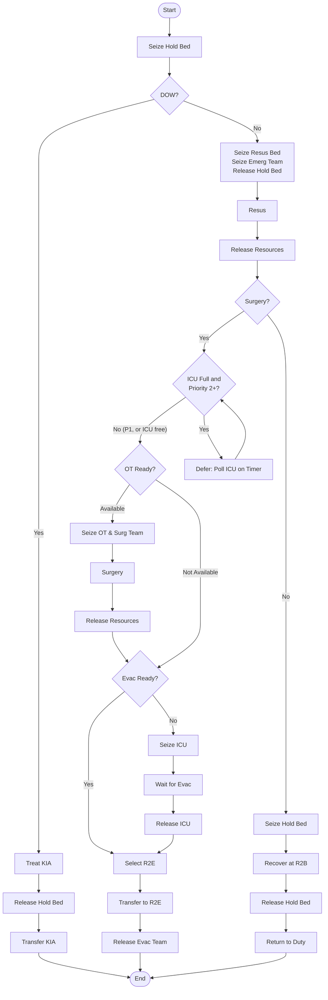
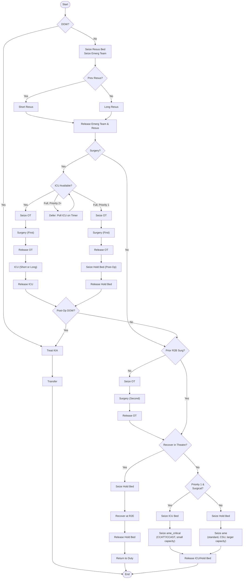

# Battlefield Casualty Handling

## Abstract

This repository contains a Discrete Event Simulation (DES) framework, written in R using the `simmer` package, developed to evaluate resource utilisation and casualty processing within a deployed battlefield medical system under Large Scale Combat Operations (LSCO). Providing baseline parameterised inputs derived from open-access literature, the simulation models per-minute casualty arrivals, triage, and surgical throughput across Role 1 (R1), Role 2 Basic (R2B), and Role 2 Enhanced – Heavy (R2E Heavy) treatment nodes, embedding a three-stage damage control surgery model to reflect treatment pathways and operational constraints.

This document is the project's **system reference**: it describes the codebase structure, the literature and doctrinal basis for every modelled algorithm and parameter, the resource and trajectory model (including the R1/R2B/R2E Heavy trajectory flowcharts), the model's known limitations, and the development environment. It does not present simulation results — those are published as two companion analysis documents:

- **[docs/Single_Run_Analysis.md](docs/Single_Run_Analysis.md)** — the illustrative single-run (seed 42, 30-day) analysis under the Falklands-modified casualty rate baseline, verifying model behaviour and identifying candidate system constraints echelon by echelon.
- **[docs/Multi_Run_Analysis.md](docs/Multi_Run_Analysis.md)** — a multi-run (n≥30 replications, 95% CI) comparative analysis confirming which of those constraints hold at statistical scale, and how the system responds under both the Falklands-modified and an Okinawa-intensity casualty rate.

This tool supports iterative refinement and stakeholder engagement, offering a transparent, modular platform for testing health system resilience. With further development and testing against high-intensity casualty models, the simulation can inform doctrinal updates and guide medical planning for future operational environments.

## Contents

<small>[Return to Top](#contents)</small>

<!-- TOC START -->
- [Abstract](#abstract)
- [Contents](#contents)
- [Introduction](#introduction)
- [Literature Review](#literature-review)
  - [Methodology](#methodology)
  - [Findings](#findings)
    - [Battlefield Casualty Rates and Estimation Models](#battlefield-casualty-rates-and-estimation-models)
    - [Casualty Simulation and DES](#casualty-simulation-and-des)
    - [Statistical Distributions and Modelling Algorithms](#statistical-distributions-and-modelling-algorithms)
    - [Military Doctrine and Operational Health Support Policy](#military-doctrine-and-operational-health-support-policy)
    - [Damage Control Surgery and Post-Operative Critical Care](#damage-control-surgery-and-postoperative-critical-care)
    - [Preventable Death and Time-Dependent Mortality](#preventable-death-and-timedependent-mortality)
    - [Strategic Aeromedical Evacuation (AME) and Role 4 Doctrine](#strategic-aeromedical-evacuation-ame-and-role-4-doctrine)
    - [Mass Casualty Event Simulation](#mass-casualty-event-simulation)
    - [Statistical Methods for Simulation Verification, Replication, and Sensitivity Analysis](#statistical-methods-for-simulation-verification-replication-and-sensitivity-analysis)
    - [Disease and Non-Battle Injury Evidence](#disease-and-nonbattle-injury-evidence)
- [Scenario Context](#scenario-context)
- [Resource Descriptions](#resource-descriptions)
  - [Health Teams](#health-teams)
    - [Role 1 (R1) Treatment Team](#role-1-r1-treatment-team)
    - [Role 2 Basic (R2B)](#role-2-basic-r2b)
    - [Role 2 Enhanced Heavy (R2E Heavy)](#role-2-enhanced-heavy-r2e-heavy)
  - [Bed Types](#bed-types)
    - [Operating Theatre (OT)](#operating-theatre-ot)
    - [Resuscitation (Resus) (alternatively Emergency)](#resuscitation-resus-alternatively-emergency)
    - [Intensive Care Unit (ICU)](#intensive-care-unit-icu)
    - [Holding (Hold)](#holding-hold)
  - [Transport Assets](#transport-assets)
    - [Protected Mobility Vehicle Ambulance (PMV Ambulance)](#protected-mobility-vehicle-ambulance-pmv-ambulance)
    - [HX2 40M](#hx2-40m)
    - [Dead-Heading Return Legs](#deadheading-return-legs)
- [Model Parameters and Model Configuration](#model-parameters-and-model-configuration)
  - [Force Size](#force-size)
    - [Population](#population)
    - [Reinforcement Demand & Fulfillment](#reinforcement-demand-fulfillment)
  - [Health System Architecture](#health-system-architecture)
  - [Medevac — Transport Fleet](#medevac-transport-fleet)
  - [Schedules and Rosters](#schedules-and-rosters)
  - [Casualty Generation](#casualty-generation)
    - [1. Distribution Parameterisation](#1-distribution-parameterisation)
    - [2. Per-Minute Rate Sampling and Scaling](#2-perminute-rate-sampling-and-scaling)
    - [3. Arrival Detection via Cumulative Sum](#3-arrival-detection-via-cumulative-sum)
    - [4. Temporal Randomisation](#4-temporal-randomisation)
    - [5. Mass Casualty Event Injection](#5-mass-casualty-event-injection)
    - [6. Force Regeneration and the Endogenous Feedback Loop](#6-force-regeneration-and-the-endogenous-feedback-loop)
  - [Casualty Generation Rates](#casualty-generation-rates)
    - [WIA — Combat](#wia-combat)
    - [KIA — Combat](#kia-combat)
    - [DNBI — Combat](#dnbi-combat)
    - [WIA — Support](#wia-support)
    - [KIA — Support](#kia-support)
    - [DNBI — Support](#dnbi-support)
  - [DNBI Sub-Type Split](#dnbi-subtype-split)
- [Casualty Priorities](#casualty-priorities)
- [Return to Duty](#return-to-duty)
- [Died of Wounds](#died-of-wounds)
  - [Survival Function](#survival-function)
  - [Parameter Calibration](#parameter-calibration)
  - [Multi-Echelon Check and Conditional Increment](#multiechelon-check-and-conditional-increment)
  - [Treatment Efficacy Modifiers](#treatment-efficacy-modifiers)
  - [Post-Operative Checkpoint (Issue #43)](#postoperative-checkpoint-issue-43)
  - [AME Wait Checkpoint (Issue #23 third follow-up)](#ame-wait-checkpoint-issue-23-third-followup)
- [Scenario Profiles](#scenario-profiles)
  - [Mechanism](#mechanism)
  - [Parameter classification](#parameter-classification)
  - [Moderate Intensity profile (Falklands 1982 exemplar)](#moderate-intensity-profile-falklands-1982-exemplar)
  - [High Intensity profile (Okinawa exemplar, demonstration skeleton)](#high-intensity-profile-okinawa-exemplar-demonstration-skeleton)
  - [Parameter editor integration](#parameter-editor-integration)
- [Development Environment](#development-environment)
  - [Prerequisites](#prerequisites)
  - [First-time setup](#firsttime-setup)
  - [Restoring dependencies](#restoring-dependencies)
  - [RStudio Server configuration](#rstudio-server-configuration)
  - [Running the simulation with full parallelism](#running-the-simulation-with-full-parallelism)
  - [Git workflow](#git-workflow)
- [Simulation Design](#simulation-design)
  - [Codebase Structure](#codebase-structure)
    - [Running the simulation](#running-the-simulation)
    - [Multi-run Replication Framework](#multirun-replication-framework)
    - [Warm-up Period Analysis](#warmup-period-analysis)
    - [Sensitivity Analysis](#sensitivity-analysis)
    - [Parameters Excluded from Screening](#parameters-excluded-from-screening)
    - [Parameter Name Reference](#parameter-name-reference)
    - [Comparative Scenario Runner](#comparative-scenario-runner)
    - [Shiny Application](#shiny-application)
      - [Full Analysis Mode](#full-analysis-mode)
      - [Sensitivity Panel](#sensitivity-panel)
  - [Simulation Environment Setup](#simulation-environment-setup)
  - [Core Trajectory](#core-trajectory)
  - [R2B Trajectory](#r2b-trajectory)
  - [R2E Heavy Trajectory](#r2e-heavy-trajectory)
  - [Role 4 (National Support Base) Demand Modelling](#role-4-national-support-base-demand-modelling)
- [Model Outputs](#model-outputs)
  - [Domain 1 — Mortality and Preventable Death](#domain-1-mortality-and-preventable-death)
  - [Domain 2 — Time-to-Care from R1 Arrival](#domain-2-timetocare-from-r1-arrival)
  - [Domain 3 — Surgical Throughput](#domain-3-surgical-throughput)
  - [Domain 4 — Echelon Load and Capacity](#domain-4-echelon-load-and-capacity)
  - [Domain 5 — Flow and Disposition](#domain-5-flow-and-disposition)
  - [Domain 6 — Combat Power](#domain-6-combat-power)
  - [Domain 7 — Strategic Evacuation and National Support Base Demand](#domain-7-strategic-evacuation-and-national-support-base-demand)
  - [Output Variable Register cross-reference](#output-variable-register-crossreference)
- [Limitations](#limitations)
  - [High Impact](#high-impact)
  - [Medium Impact](#medium-impact)
  - [Low Impact](#low-impact)
- [Further Development](#further-development)
- [Conclusion](#conclusion)
- [References](#references)
  <!-- TOC END -->

---

## Introduction

<small>[Return to Top](#contents)</small>

Large‑scale combat operations (LSCO) represent the most demanding form of conventional warfare, characterised by high‑tempo, multi‑domain action against peer or near‑peer adversaries. LSCO require the orchestration of manoeuvre, fires, logistics, intelligence, and command across vast, often nonlinear battlespaces [[1]](#References), [[2]](#References). Unlike the western experience in Middle-East conflicts, forces in LSCO will not have guaranteed air superiority, uncontested lines of communication, and predictable casualty flows. LSCO is expected to unfold in contested, degraded, and dynamic operational conditions [[1]](#References), [[2]](#References), [[3]](#References). Historical and contemporary case studies - from the industrial battlefields of the Second World War to recent fighting in Ukraine - demonstrate that such operations generate high casualty densities, impose unprecedented logistical demands, and challenge even the most sophisticated forces’ ability to sustain tempo over time [[2]](#References), [[4]](#References).

The medical implications of LSCO are profound. Estimates consistently project casualty high casualty rates, recent literature suggests that a significant amount of those potentially could and should be able to return to duty (potentially without evacuation from theatre) if treated effectively and without delay [[5]](#References). The deployed health system is therefore not a peripheral service but a critical combat enabler. Its capacity to preserve fighting strength underpins the force’s ability to seize, retain, and exploit the initiative. In LSCO, battlefield clearance must be achieved despite contested airspace and disrupted communications, injury patterns will reflect the lethality of modern munitions, and medical logistics must adapt to disrupted supply chains and fluid front lines.

Yet, existing medical doctrine and force design have evolved largely from counterinsurgency campaigns where operational conditions were comparatively permissive [[5]](#References). In a peer‑conflict LSCO scenario, planners must expect prolonged field care, delays in evacuation, and the need for smaller, more mobile surgical teams positioned closer to the fight [[3]](#References), [[5]](#References). A resilient and agile, deployed health system serves not only to save lives, but to sustain operational momentum and, ultimately, to enable the successful prosecution of the campaign.

This research looks to explore the performance of the deployed health system through simulation with an eye to understanding its implications for participation in LSCO. The simulation approach allows for the exploration of scenarios that are difficult to replicate in live exercises, offering evidence‑based insights to refine doctrine, optimise medical force posture, and ensure that health support is adequate for LSCO. In doing so, it contributes to the broader imperative of preparing the force for the realities of high‑intensity warfare in an era of renewed great‑power competition [[6]](#References), [[7]](#References).

---

## Literature Review

### Methodology

To inform the design and implementation of the battlefield casualty simulation, a structured literature review was conducted in two phases.

The initial phase used a multi-pronged methodology. First, open-access academic literature and publicly available internet-based resources on battlefield casualty modelling, discrete event simulation (DES), and casualty rate estimation were surveyed. This was complemented by a snowballing technique, recursively exploring the references cited within key papers to identify additional relevant sources. Large language models (LLMs) were then engaged to identify supplementary resources. This surfaced publications, technical reports, and grey literature that conventional search techniques did not. Finally, this academic and technical review was supplemented by a survey of publicly available military publications, providing context for force structure, casualty flow assumptions, and the operational constraints that shape operational medical planning. This initial phase established the foundational casualty-rate, DES, distributional, and doctrinal basis.

In the second phase the simulation was extended feature by feature, each addition triggered its own deliberate, LLM-assisted search for open-access sources addressing that specific enhancement. These features included the three-stage damage control surgery (DCS) model and its treatment-duration and post-operative recovery parameters, the time-dependent died-of-wounds survival function, the strategic aeromedical evacuation (AME) and Role 4 demand model, the compound Poisson mass casualty event mechanism, and the statistical framework underpinning multi-run replication, warm-up analysis, and Morris/Sobol sensitivity screening. This iterative extension is summarised in the further thematic domains that follow the initial four, each tied to the design or parameterisation requirement of a specific subsequent Issue.

### Findings

In total, 52 resources have been reviewed and incorporated into the simulation framework as of the current codebase, spanning peer-reviewed journals, technical reports, doctrinal publications, and internet publications. The review covers ten thematic domains.

#### Battlefield Casualty Rates and Estimation Models

Historical and predictive models of casualty rates were central to the review. The FORECAS system [[8]](#References) provided a statistically grounded approach to projecting wounded-in-action (WIA), killed-in-action (KIA), and disease/non-battle injury (DNBI) rates using empirical data from past conflicts. Complementary studies [[9]](#References), [[10]](#References), [[11]](#References) and [[12]](#References) highlighted the operational implications of casualty rates in LSCO, emphasizing the disproportionate impact of DNBI on lost duty days and the need for robust force health protection (FHP) strategies. The Falklands War 1982 (Operation CORPORATE) serves as this project's principal historical validation exemplar for a moderate-intensity casualty rate. Field-surgical mortality outcomes at the Ajax Bay Advanced Surgical Centre and forward stations are documented in [[13]](#References), and an aggregate died-of-wounds rate of 0.52% among 580 British soldiers and marines wounded in action is confirmed in [[14]](#References); these are the figures the `moderate_intensity` scenario profile's died-of-wounds calibration is tuned to reproduce (see [Scenario Profiles](#scenario-profiles)).

#### Casualty Simulation and DES

Simulation methodologies were explored through both military-specific and general DES literature. The simmer package for R [[15]](#References) was identified as a suitable framework for implementing modular, auditable, and event-driven logic. Studies such as [[16]](#References) demonstrated DES applications in healthcare contexts, while [[17]](#References) and [[4]](#References) provided high-level casualty rate numbers that allowed the evaluation of the performance of DES models and [[2]](#References) provided insights into trauma system design under combat conditions. These sources informed the architectural decisions for the simulation engine, including event scheduling, resource constraints, and patient flow logic.

#### Statistical Distributions and Modelling Algorithms

The review examined statistical distributions suitable for modelling casualty arrival rates and treatment durations. FORECAS [[8]](#References) employed lognormal and exponential distributions based on battle intensity and troop type, validated through historical data. Additional studies [[18]](#References), [[11]](#References) and [[16]](#References) provided statistics, explored distribution models measures, and described other approaches using DES in medical care contexts.
These findings guided the selection of distribution functions for stochastic modelling, ensuring that simulated outputs reflect doctrinally plausible variability and temporal clustering.

#### Military Doctrine and Operational Health Support Policy

Doctrinal and policy publications such as [[1]](#References), [[3]](#References), [[6]](#References) and [[7]](#References) established the current geostrategic context and outlined the imperitive for militaries to be able to provide force options for LSCO. 
Recent doctrinal analyses [[9]](#References), [[2]](#References) and [[5]](#References) emphasized the shift toward prolonged casualty care, contested evacuation, and the need for distributed medical assets. A related analysis [[19]](#References) frames return-to-duty as a direct force-sustainment lever rather than a purely clinical outcome and is implemented in the model directly ([Force Regeneration and the Endogenous Feedback Loop](#6-force-regeneration-and-the-endogenous-feedback-loop)), coupling casualty production to a live, time-varying effective force size. These insights were incorporated into the simulation design to ensure alignment with contemporary operational realities.

#### Damage Control Surgery and Post-Operative Critical Care

A systematic review [[20]](#References) and an account of damage control technique in abdominal surgery [[21]](#References) establish the three-phase structure that this project's R2B and R2E Heavy trajectories implement. Operative-time data reported for Sohn et al.'s (2018) cohort within [[20]](#References) directly sourced the DAMCON surgery duration distribution, corroborated by the rapid-closure operative-window principle central to damage control technique [[22]](#References) and by outcomes literature from an austere-setting DCS series [[23]](#References) and abdominal-trauma DCS practice [[24]](#References). Post-operative critical care requirements are established by [[25]](#References), [[22]](#References), [[24]](#References) and [[26]](#References); descriptions of post-DCS stabilisation timeframes [[20]](#References), [[27]](#References), [[24]](#References) informed the ICU length-of-stay parameters at both echelons. Task-time estimation for the R2B/R2E resuscitation phase, where no single published source tabulates an end-to-end duration, drew on the treatment-process optimisation methodology of [[28]](#References), constructing an estimate from collated task-duration components rather than a single reported figure.

#### Preventable Death and Time-Dependent Mortality

An analysis of 4,596 battlefield deaths during Operations Enduring Freedom and Iraqi Freedom [[29]](#References) found that 87.3% resulted from haemorrhage, predominantly within 30–90 minutes of injury; a study of a "golden hour" surgical-capability policy [[30]](#References) found it reduced preventable prehospital death from 32% to 3.5% in a Special Operations context. Together these establish the direct empirical link between time-to-care and survivability that motivates modelling died-of-wounds probability as a function of elapsed time since injury; the logistic curve's shape parameters are anchored to the mortality time-windows these two studies report. The treatment-efficacy multipliers that further modify the died-of-wounds ceiling by care received at each phase are similarly evidence-based rather than estimated outright: a 41% relative mortality reduction from balanced-component damage control resuscitation is reported in [[31]](#References), and the PROMMTT study [[32]](#References) provides the haemorrhage-specific mortality basis used to derive the surgical efficacy factor.

#### Strategic Aeromedical Evacuation (AME) and Role 4 Doctrine

The strategic AME and Role 4 demand model draws on [[33]](#References), which establishes the triage framework, echelon functions, and the Casualty Staging Unit/CCATT-CCAST acuity concepts underpinning the model's critical/standard AME pool split. Role 4 ward assignment and length-of-stay parameters follow the general injury-severity length-of-stay gradient described in [[34]](#References), applied by informed extension since no open-access source tabulates Role 4 ward assignment by this project's exact category scheme.

#### Mass Casualty Event Simulation

The compound Poisson mass casualty event mechanism follows the general approach to LSCO casualty-surge simulation described in [[35]](#References), and complements the discrete-event mass-casualty-incident stress-testing precedent of SIMEDIS [[36]](#References), which injects a fixed, deterministic victim count rather than a stochastically varying one. An account of aligning field hospital training with LSCO reality [[37]](#References) informed the blast-dominant triage priority distribution applied to mass-casualty-derived casualties.

#### Statistical Methods for Simulation Verification, Replication, and Sensitivity Analysis

Moving from a single illustrative run to a defensible multi-run analytical framework required its own literature base. Verification and validation followed the framework in [[38]](#References) and the general DES methodology in [[39]](#References). Warm-up classification used Welch's graphical procedure [[40]](#References) and the treatment of terminating-versus-steady-state simulation in [[41]](#References), with [[42]](#References) establishing that warm-up detection methods presuppose a steady state that does not apply to a campaign with a defined finite horizon. Multi-run replication and variance reduction drew on a demonstration of L'Ecuyer-CMRG parallel RNG streams in R [[43]](#References), the corresponding parallel-package documentation [[44]](#References), and a treatment of antithetic variates [[45]](#References). Global sensitivity screening used Morris Elementary Effects [[46]](#References), implemented via R's `sensitivity` package [[47]](#References) and the OpenMOLE documentation [[48]](#References), and Sobol variance-based decomposition [[49]](#References). A critical-care DES study [[50]](#References) informed the Shiny application's default replication count and 95% CI reporting.

#### Disease and Non-Battle Injury Evidence

Disease DNBI sub-categorisation and its emergency surgical candidacy rate draw on documented evidence of acute surgical disease conditions occurring in deployed populations. Acute appendicitis incidence among deployed Japanese soldiers in Burma is reported in [[51]](#References), and humanitarian surgical care delivered at US military treatment facilities in Afghanistan is documented in [[52]](#References), together supporting the inclusion of conditions such as appendicitis, cholecystitis, and perforated peptic ulcer within the disease DNBI pathway's surgical candidacy branch, distinct from the battle fatigue and NBI sub-types that do not carry the same surgical risk profile.

Because no open-access source was identified that tabulates the specific quantity required, several parameters in this project remain informed estimates rather than directly sourced values, described in detail in the [Limitations](#limitations) section.

This literature review enabled the design of a model suitable to support the assessment of the deployed health system capacity within LSCO.

---

## Scenario Context

<small>[Return to Top](#contents)</small>

The health system establishment — the number of Role 1 (R1) treatment teams, Role 2 Basic (R2B) facilities, and Role 2 Enhanced Heavy (R2E Heavy) hospitals, and each element's internal team and bed composition — is a configurable input to the simulation, defined in `env_data.json`'s `elms` structure and editable directly or via the Shiny Configure panel (`app.R`).

The shipped default configuration models the land combat health system anticipated for a representative combat brigade: three battlegroups, each allocated one R1 treatment team tasked with providing immediate clinical intervention and stabilisation in proximity to combat operations (three R1 teams in total); two R2B facilities conducting damage control resuscitation and surgery before onward evacuation to higher-level care; and one R2E Heavy hospital sited to the rear for complex surgical procedures, extended post-operative care, and advanced diagnostic support. This default configuration underpins the diagram below and the illustrative single-run and multi-run analyses documented in [docs/Single_Run_Analysis.md](docs/Single_Run_Analysis.md) and [docs/Multi_Run_Analysis.md](docs/Multi_Run_Analysis.md).


An [Interactive Diagram](https://www.map.army/?ShareID=1041883&UserType=RO-xOMjf7j6) allows further exploration of the default model configuration being simulated.

---

## Resource Descriptions

<small>[Return to Top](#contents)</small>

### Health Teams

#### Role 1 (R1) Treatment Team

A role 1 treatment team provides the first line of medical care. It is designed to deliver immediate lifesaving measures, perform triage and stabilization, and manage minor injuries and illnesses close to the point of injury or unit location. These teams also prepare casualties for evacuation to higher levels of care if needed.

#### Role 2 Basic (R2B)

A Role 2 Basic (R2B) medical treatment facility provides forward surgical and resuscitative care close to the battlefield. Its purpose is to deliver damage-control surgery, critical care, and short-term patient holding in austere environments where rapid intervention can save lives.

It’s designed to be mobile, logistically lean, and capable of stabilizing casualties before evacuation to higher-level care. With ICU beds, low-dependency holding, and a surgical team, R2B bridges the gap between frontline treatment and more comprehensive facilities like Role 2 Enhanced or Role 3.

#### Role 2 Enhanced Heavy (R2E Heavy)

A R2E Heavy facility delivers advanced surgical and critical care capabilities in forward-deployed military operations. Its purpose is to provide damage-control surgery, intensive care, inpatient services, and scalable resuscitation for casualties who require more than basic stabilization but are not yet ready for strategic evacuation.

The R2E Heavy is a static field hospital designed to handle complex trauma, prolonged care, and high casualty volumes.

### Bed Types

#### Operating Theatre (OT)

OT beds are specialized surgical stations designed to support damage-control surgery and life-saving interventions. These beds are part of a sterile operating suite and are equipped to handle:

- Emergency trauma procedures.
- Advanced surgical care including orthopedic, abdominal, and thoracic operations.
- Integrated anesthesia and monitoring systems for patient stability.
- Rapid turnover and sterilization protocols to manage high casualty volumes.

#### Resuscitation (Resus) (alternatively Emergency)

Emergency beds are designed for rapid stabilization and life-saving interventions immediately after casualty arrival. These beds support:

- Advanced trauma management including airway control, hemorrhage control, and shock treatment.
- Critical monitoring and resuscitation equipment such as defibrillators, oxygen delivery systems, and IV access.
- Quick turnover and accessibility to facilitate high casualty throughput during mass casualty events.
- Integration with surgical and evacuation pathways, ensuring seamless transition to operating theatres or higher echelons of care.

These beds serve as the first stop for severely injured personnel.

#### Intensive Care Unit (ICU)

Intensive Care Unit (ICU) beds are designed to deliver advanced life-support and continuous monitoring for critically injured or ill personnel. These beds serve as the backbone of forward-deployed critical care, enabling:

- Resuscitation and stabilization of casualties with multi-system trauma.
- Mechanical ventilation, invasive monitoring, and medication infusions.
- Postoperative care following damage-control surgery.
- Support for prolonged field care when evacuation is delayed.

#### Holding (Hold)

Holding beds are designated for short-term patient care and observation, typically for those who are awaiting evacuation, recovering from minor procedures, or expected to return to duty soon. These beds serve as a transitional space between acute treatment zones (like ICU or OT) and final disposition, whether that’s evacuation to higher care or reintegration into the force.

They’re often used for:

- Postoperative recovery after damage-control surgery.
- Monitoring stable patients who don’t require intensive care.
- Staging casualties for medical evacuation.
- Low-dependency care such as hydration, pain management, or wound dressing.

Holding beds help to maintain patient flow and prevent bottlenecks in critical care areas.

### Transport Assets

#### Protected Mobility Vehicle Ambulance (PMV Ambulance)

The PMV Ambulance (Protected Mobility Vehicle – Ambulance) is a blast-resistant, armored medical transport designed to safely evacuate casualties from combat zones. Based on the Bushmaster, it combines mobility, protection, and medical capability, allowing medics to deliver care en route while shielding patients from small arms fire, IEDs, and mines.

#### HX2 40M

The HX2 40M is a 4×4 tactical military truck developed by Rheinmetall MAN Military Vehicles (RMMV) as part of the HX2 series. Designed for high mobility and rugged performance, it serves as a versatile logistics platform for transporting troops, equipment, and supplies in demanding operational environments. In this simulation the HX2 40M is used for the transport of KIA and casualties that have DOW.

#### Dead-Heading Return Legs

PMV Ambulance and HX2 40M transport assets are held for a return leg after casualty drop-off, rather than becoming available for the next pickup immediately. This reflects the real-world requirement for a vehicle to travel back to the originating echelon before it can be tasked again.

Dead-heading is implemented for all four WIA/KIA transport legs using simmer's `clone()`/`synchronize()` activities. After the outbound timeout, the entity is cloned into two parallel branches: a vehicle (or, for the R2B→R2E WIA leg, escort-team) branch that runs an unladen return-leg timeout before releasing the asset, and a casualty branch with no further activity. `synchronize(wait = FALSE)` then lets the casualty branch continue immediately into the rest of the trajectory (it is always the first of the two clones to reach that point), while the vehicle/escort branch is discarded once it later arrives there having completed the return leg and released the resource. The resource therefore remains occupied for the full round trip, while the casualty's own care pathway is unaffected by the return travel time. The two pooled, brigade-level PMV Ambulance/HX2 40M fleets (R1→R2B WIA, R1→mortuary KIA) and the R2B→R2E mortuary road move (HX2 40M) share fleet capacity; the R2B→R2E WIA leg draws on a separate, R2B-team-organic resource not shared with any pooled fleet. R2E's own local mortuary transfer (`r2e_transport_kia()`) is the one remaining leg with no vehicle asset and no return leg, based on the design assumption that the mortuary is collocated with R2E itself. Return leg duration for all four legs is modelled as a fresh, unconditional triangular draw from the same outbound distribution.

---

## Model Parameters and Model Configuration

<small>[Return to Top](#contents)</small>

The population sizes, health system establishment, transport fleet, and casualty generation rates described in this section are the simulation's shipped defaults. Each is derived from the open-access research and analysis cited alongside it; each value is a configurable input, editable directly in `env_data.json` or via the Shiny Configure panel (`app.R`).

<!-- ENV SUMMARY START -->
<!-- This section is auto-generated. Do not edit manually. -->

### Force Size

#### Population

The following population groups are defined in the simulation environment:

| Population | Count |
|------------|-------|
| Combat | 2500 |
| Support | 1250 |

#### Reinforcement Demand & Fulfillment

A demand submission cycle of 0 days disables reinforcement (the shipped default); the fulfillment lag and fill distribution parameters are then unused.

| Parameter | Variable | Value |
|-----------|----------|-------|
| Demand Submission Cycle (days) | — | 0 |
| Fulfillment Lag (days) | — | 7 |
| Fill Distribution — Minimum (fraction of demand) | a | 0.2 |
| Fill Distribution — Mode (fraction of demand) | c | 0.85 |
| Fill Distribution — Maximum (fraction of demand) | b | 1.1 |

Each reinforcement cycle computes a pool's demand as its shortfall against initial establishment strength, net of any shortfall an earlier, still-pending cycle has already claimed (`initial − current − pending`, floored at 0) — this prevents overlapping cycles from independently re-claiming the same shortfall when the demand submission cycle is shorter than the fulfillment lag. The amount actually delivered is drawn, at submission time rather than at fulfillment, as a fraction of that demand from a Triangular(*a*, *b*, *c*) distribution parameterised by the three fill values above, then credited to the pool once the fulfillment lag elapses, clamped so a pool can never be credited above its initial establishment strength. The model has no sortie-failure rate or binary success/failure roll for reinforcement.

The fraction of demand *x* actually delivered in a single cycle is drawn from the following probability density function:

$$
f(x) =
\begin{cases}
\dfrac{2(x-a)}{(b-a)(c-a)} & a \le x < c \\[4pt]
\dfrac{2}{b-a} & x = c \\[4pt]
\dfrac{2(b-x)}{(b-a)(b-c)} & c < x \le b
\end{cases}
$$

Where *a*, *b*, and *c* are the Fill Distribution Minimum, Maximum, and Mode values in the table above respectively.

### Health System Architecture

The following table summarises the medical elements configured in `env_data.json`, including team types, personnel, and beds. `Quantity` (team counts) and `Beds` (bed counts per team) are editable directly in `env_data.json` or via the Shiny Configure panel's Health System Architecture group (`app.R`); the personnel/team composition columns (`Base`/`Surg`/`Emerg`/`Icu`/`Evac`) are a fixed part of the establishment definition and are not independently configurable.

| Element | Quantity | Beds | Base | Surg | Emerg | Icu | Evac |
| --- | --- | --- | --- | --- | --- | --- | --- |
| R1 | 3 | NA | Medic (3), Nurse (1), Doctor (1) | NA | NA | NA | NA |
| R2B | 2 | OT (1); Resus (2); ICU (2); Hold (5) | NA | Anesthetist (1), Surgeon (2), Medic (1) | Facem (1), Nurse (3), Medic (1) | Nurse (2), Medic (2) | Medic (2) |
| R2EHEAVY | 1 | OT (2); Resus (4); ICU (4); Hold (30) | NA | Anesthetist (1), Surgeon (2), Nurse (4) | Facem (1), Nurse (3), Medic (1) | Intensivist (1), Nurse (4) | Medic (2) |

### Medevac — Transport Fleet

These are the available transport platforms and their characteristics:

| Platform | Quantity | Capacity |
|----------|----------|----------|
| PMVAMB | 3 | 4 |
| HX240M | 4 | 50 |

<!-- ENV SUMMARY END -->

### Schedules and Rosters

Some resource teams have rosters/schedules. Due to the limited size and structure, surgical teams are rostered as available for12 hour shifts. This results in there being 12 hours of time available for surgery at the R2B in every 24 hours and 36 hours of surgery time available in every 24 hours across two OT in the R2E Heavy. 

| Resource | Roster applied | Configurable variable | Default | Where configured |
|---|---|---|---|---|
| R1 Treatment Team | No — no shift schedule; available continuously | — | — | — |
| R2B Surgical Team | Yes — alternating two-shift roster across R2B's surgical teams (`build_env()`, `R/environment.R`) | `ot_hours` | 12 (hours) | Shiny app "Run" tab (`app.R`); otherwise the `ot_hours` argument to `build_env()`/`run_once()` |
| R2E Surgical Team | Yes — alternating two-shift roster across R2E's surgical teams (`build_env()`, `R/environment.R`) | `ot_hours` | 12 (hours) | Shiny app "Run" tab (`app.R`); otherwise the `ot_hours` argument to `build_env()`/`run_once()` |
| R2B / R2E Operating Theatre beds | No — the physical OT bed is available 24 hours per day; only the surgical team carries the shift schedule | — | — | — |

`ot_hours` is a single shared parameter: it sets the first shift's length (the second shift covers the remainder of the 24-hour day) identically at both R2B and R2E, not independently per echelon. It is not part of `env_data.json` and has no CLI flag; it is Morris-screened (see [Sensitivity Analysis](#sensitivity-analysis)) and is otherwise fixed at its 12-hour default unless changed in the Shiny app or passed explicitly by calling code.

### Casualty Generation

Casualties are generated based on rates outlined in [[8]](#References) and refined with analysis provided in [[10]](#References) and supported by [[17]](#References), with the implementation outlined below.

The simulation supports three selectable casualty-rate profiles, each applied as a named scenario-profile overlay on the base configuration (see [Scenario Profiles](#scenario-profiles)) and selectable live via the Shiny app's Casualty Intensity Profile dropdown: the shipped default ("Falklands — Modified"), an explicit `moderate_intensity` profile ("Falklands — Unmodified"), and a `high_intensity` profile ("Okinawa — Casualty Rates"). The default and `moderate_intensity` share identical Falklands-calibrated casualty generation rates, differing only in their downstream died-of-wounds treatment-efficacy calibration (see [Scenario Profiles](#scenario-profiles)); `high_intensity` instead applies Okinawa-calibrated rates with an exponential rather than lognormal distribution family (see [Casualty Generation Rates](#casualty-generation-rates)). Every individual stream's mean and standard deviation is independently re-parameterisable via the Configure panel or directly in `env_data.json`, regardless of which profile is active.

US historical analysis of the Battle of Okinawa [[8]](#References) gives WIA and KIA rates producing approximately 30 casualties per day for a force size of 3,750 — a casualty rate of ~0.8%. By comparison, Russia’s estimated 700-1,100 daily casualties from a committed force of 450,000–600,000 in Ukraine imply a lower casualty rate of ~0.2% [[4]](#References). Historical data from the Falklands War suggests a casualty rate of ~0.37% [[8]](#References), and was selected as the shipped default over the Okinawa rate on the basis that the Okinawa-derived ~0.8% sits well above the rates currently observed for Russia in publicly available data in the Ukraine war. This selection also recognises that there is likely under-reporting in Russian casualty estimates, particularly of non-critical wounded personnel, and that casualty rates will have varied over time in the Ukraine war based on combat intensity and seasonal fluctuations in operational tempo.

Arrival times for the casualty streams are driven by a stateful generator closure (`make_ln_arrival_generator()`/`make_exp_arrival_generator()`, `R/environment.R`) passed directly to simmer's `add_generator()`, called once per arrival during the run itself (this excludes mass casualty event timing, which remains pre-computed and exogenous — see [Mass Casualty Event Injection](#5-mass-casualty-event-injection)). Each call models continuous per-minute intensity and converts it to a discrete arrival event via cumulative-threshold crossing, reading the live effective force size at each step so arrival timing can react to the replication's own in-run events (see [Force Regeneration and the Endogenous Feedback Loop](#6-force-regeneration-and-the-endogenous-feedback-loop)). The general process is outlined below.

[[8]](#References) fits casualty incidence to one of two distribution families, selected by battle intensity and troop type rather than a single distribution applying universally: a lognormal model for moderate/light-intensity combat troops and for support troops at all intensities, and an exponential model for combat troops in high-intensity battles. `generate_casualty_arrivals()` (`R/environment.R`) dispatches each casualty stream to `make_ln_arrival_generator()` or `make_exp_arrival_generator()` based on an explicit `distribution` field read from `env_data$vars$generators`. Both models share the same per-minute sampling, cumulative-sum arrival detection, and jitter mechanics (steps 2–4 below).

#### 1. Distribution Parameterisation

**Lognormal** (`make_ln_arrival_generator()`) converts the daily mean and standard deviation into log-space parameters, preserving the shape of the empirical distribution:

Mean (log-space):

$$
\mu_{\log} = \ln\left(\frac{\mu^2}{\sqrt{\sigma^2 + \mu^2}}\right)
$$

Standard deviation (log-space):

$$
\sigma_{\log} = \sqrt{\ln\left(1 + \frac{\sigma^2}{\mu^2}\right)}
$$

Where:

- \mu = expected number of casualties per day
- \sigma = daily standard deviation

**Exponential** (`make_exp_arrival_generator()`) is single-parameter — the rate is fully determined by the mean, with no separate shape parameter, following FORECAS's own formula $W \sim \text{exponential}(\mu)$:

$$
\lambda = \frac{1}{\mu}
$$

Where:

- \mu = expected number of casualties per day
- \lambda = exponential rate parameter passed to the per-minute draw (no \sigma term — a reported standard deviation for an exponential-fitted stream is retained in `env_data.json` for citation only and plays no role in generation)

#### 2. Per-Minute Rate Sampling and Scaling

Draws samples from the stream's selected distribution representing per-minute casualty rates, capped at a threshold to prevent extreme outliers, then scaled according to population size and temporal resolution (per minute per 1000 personnel).

For each simulation minute $i \in \{1, 2, \dots, n_{\text{minutes}}\}$, the per-minute casualty rate is computed as:

$$
r_i = \min\left(x_i, \text{cap}\right) \times \frac{P}{1000 \times 1440}
$$

Where:

- $x_i \sim \text{LogNormal}(\mu_{\log}, \sigma_{\log}^2)$ (lognormal streams) or $x_i \sim \text{Exponential}(\lambda)$ (exponential streams)
- $P$ = population size (support or combat) — as of Issue #18, this is no longer a fixed constant but a live, time-varying effective force size read at each minute; see [Force Regeneration and the Endogenous Feedback Loop](#6-force-regeneration-and-the-endogenous-feedback-loop) below
- $r_i$ = scaled and capped casualty rate for minute i

The cap exists primarily to keep the per-minute generator's execution time practically bounded, not merely to trim outliers cosmetically: because both the lognormal and exponential distributions have an unbounded right tail, an uncapped draw can occasionally return an implausibly large per-minute rate, and since `make_ln_arrival_generator()`/`make_exp_arrival_generator()` walk the simulation minute-by-minute inside a stateful closure rather than sampling arrival times directly, a rare extreme draw of this kind was previously found to substantially inflate run time for the lognormal generator before a cap was introduced. Bounding the draw keeps each minute's rate, and therefore the closure's iteration count, within a predictable range regardless of how extreme a single stochastic draw happens to be.

Each distribution family has a distinct cap, and each was selected to bind rarely enough that it does not materially distort the modelled casualty rate. `make_ln_arrival_generator()` uses a fixed absolute default (`cap = 5`). This has been the case since the casualty generator's earliest implementation; FORECAS [[8]](#References) does not describe an equivalent truncation mechanism, so this specific value has no independent citation, but it has not been shown to materially affect the validated `default`/`moderate_intensity` baseline. `make_exp_arrival_generator()` instead sets its cap relative to the stream's own mean (`cap = cap_multiplier × mean_daily`, default `cap_multiplier = 3`). This works because, for an exponential distribution, the chance of a draw exceeding some multiple of the mean stays the same fixed percentage no matter how large or small the mean is: a cap set at three times the mean always trims about the same small share of draws (≈5%), whether the stream's underlying rate is low or high. A single fixed cap number cannot offer that guarantee, since the share of draws it trims grows unpredictably as the mean approaches or exceeds that fixed value.

This distinction was not academic: applying the lognormal generator's fixed `cap = 5` to `make_exp_arrival_generator()`, as originally implemented for Issue #54, was found to truncate a highly uneven, mean-dependent share of each stream's draws — ~1.4% for `moderate_intensity` KIA (mean 0.68), ~7.3% for `moderate_intensity` WIA (mean 1.77), ~4.7% for `high_intensity` KIA (mean 1.63), but ~48% for `high_intensity` WIA (mean 6.86, *above* the fixed cap) — silently compressing the realised high-intensity WIA rate toward ~5/day regardless of the FORECAS-sourced 6.86 mean. `make_exp_arrival_generator()` was corrected to use `cap = 3 × mean_daily`, which truncates a constant ~5% of draws for every exponential stream regardless of intensity — matching the same order of magnitude as the pre-existing, accepted lognormal truncation rates above — rather than a share that grows unboundedly as mean_daily approaches a fixed ceiling. The choice of $k=3$ is an informed judgement matched to that existing order of magnitude, not a literature-derived value: a smaller `cap_multiplier` would re-introduce the under-scaling this correction fixed, while a larger one would rarely bind at all and stop serving as a safeguard against pathological single-minute draws. Neither cap has been shown to materially distort any currently validated scenario's casualty rate.

#### 3. Arrival Detection via Cumulative Sum

Accumulates per-minute rates and detects new arrivals based on when the cumulative total crosses each whole casualty threshold.

Let R = \{r_1, r_2, \dots, r_N\} be the per-minute rates. Then the cumulative sum is:

$$
C_i = \sum_{j=1}^{i} r_j
$$

An arrival is triggered at time i if:

$$
\lfloor C_i \rfloor > \lfloor C_{i-1} \rfloor
$$

This captures each increment in the expected arrival count.

#### 4. Temporal Randomisation

Introduces sub-minute jitter to avoid clustering arrivals on discrete time ticks and returns a sorted list of event timestamps.

#### 5. Mass Casualty Event Injection

The background streams above model a smooth, continuous casualty rate and cannot represent the acute, discrete casualty surges — a single artillery barrage, drone strike, or vehicle-borne IED detonation generating a cluster of casualties within a short window — that form a distinct stress test for surgical and ICU capacity, separate from the sustained background tempo the lognormal/exponential streams already represent. `generate_mass_casualty_events()` (`R/environment.R`) overlays mass casualty events on the background `wia_cbt` combat-WIA stream via one of two selectable event-timing modes (`mass_casualty.event.mode`), sharing an identical per-event casualty-count/injection-window mechanism (`mass_casualty_event_casualties()`) regardless of which mode generated the event's start time. This complements the discrete-event mass-casualty-incident stress-testing precedent of SIMEDIS [[36]](#References), which — unlike either mode here — injects a fixed, deterministic victim count per scenario rather than a stochastically varying one (the SIMEDIS authors cite variance reduction as the reason, and note stochastic victim generation as future work).

The feature ships **disabled by default** (`mode = "poisson"`, `mass_casualty.event.rate_per_day = 0` in `env_data.json`), so the seed-42 baseline documented throughout this README and in `CLAUDE.md` is unaffected by this feature's addition.

**Mode 1 — `"poisson"` (default).** A **compound Poisson process**, following the general approach used for LSCO casualty generation by Fischer et al. [[35]](#References). Event start times are drawn from a Poisson process with rate `mass_casualty.event.rate_per_day` (Issue #9 Recommended Approach value: 0.2/day, i.e. a mean inter-event interval of 5 days; used only for the explicit stress-test demonstration in [Mass Casualty Event Stress Test](docs/Single_Run_Analysis.md#mass-casualty-event-stress-test)), via the standard exponential inter-arrival construction (`mass_casualty_event_starts_poisson()`):

$$
t_{k+1} = t_k - \frac{\ln(1 - U)}{\lambda_{\text{min}}}, \quad U \sim \text{Uniform}(0, 1)
$$

where $\lambda_{\text{min}} = \text{rate\_per\_day} / 1440$ is the per-minute event rate. `rate_per_day = 0` returns an empty arrival stream with no RNG draws consumed, reproducing the background-only baseline exactly.

**Mode 2 — `"scheduled"`.** Rather than an inferred rate, a planner specifies a fixed set of candidate simulation days directly — `mass_casualty.schedule.days` (e.g. `[5, 12, 20]`) — with an independent per-day occurrence probability, `mass_casualty.schedule.probabilities` (e.g. `[1.0, 0.8, 0.5]`; omitted or empty defaults every listed day to probability 1, i.e. always fires). `mass_casualty_event_starts_scheduled()` draws a Bernoulli(probability) outcome for each configured day independently, so replication-to-replication variation is still possible for any day given a probability below 1, while a day at probability 1 fires identically in every replication — suited to scripting a specific historical or exercise timeline (a fixed number of events on fixed days) while retaining the option of controlled randomness rather than requiring either fully deterministic or fully stochastic timing. A fired day's exact start minute is drawn Uniform(0, 1440) within that day, so intra-day timing remains stochastic even when the day itself is planner-specified. An empty `days` list (the shipped default) produces no scheduled events regardless of `mode`.

**Event size** (both modes). Each fired event injects a number of casualties drawn from $\text{Uniform}(\text{min\_cas}, \text{max\_cas})$ (default 20–60), rounded to the nearest integer.

**Injection window** (both modes). Casualties from a single event are not injected simultaneously. Each event's injection window duration is drawn from $\text{Triangular}(\text{window\_min}, \text{window\_mode}, \text{window\_max})$ minutes (default 60/120/180, i.e. 1–3 hours, mode 2 hours); individual casualty offsets within that window are drawn from $\text{Uniform}(0, \text{window})$ and sorted.

**Triage priority** (both modes). Mass-casualty-derived casualties draw triage priority from a blast-dominant distribution (`mass_casualty.priority`: 70% P1, 20% P2, 10% P3) instead of the standard background distribution (`r1.priority`) — reflecting the higher proportion of immediately life-threatening injuries in blast/fragmentation trauma relative to the mixed injury pattern of the background stream, consistent with the ~70% blast/fragmentation injury share reported for contemporary LSCO [[37]](#References).

**Stream merge and tagging.** Mass casualty arrival times, from whichever mode is active, are merged into the background `wia_cbt` arrival vector and the combined vector is sorted before being passed to simmer's `at()` generator, so mass casualty and background casualties are dispatched through the same trajectory. Each casualty is tagged with a `mass_casualty_event` attribute (1 = mass-casualty-derived, 0 = background) at the point of triage in `build_casualty_trajectory()`, enabling the post-hoc stress-test analysis in [Mass Casualty Event Stress Test](docs/Single_Run_Analysis.md#mass-casualty-event-stress-test).

> **MODEL ASSUMPTION — MASS CASUALTY EVENTS INJECT WIA-ONLY COMBAT CASUALTIES:** Mass casualty events add casualties exclusively to the combat WIA (`wia_cbt`) stream, in either mode. Immediate KIA and DNBI are not separately generated by a mass casualty event in the current implementation.
> **Basis:** The stress test this feature targets (Issue #9) is surgical and ICU throughput under acute surge, which is driven by the WIA (survivor) casualty flow; DNBI is, by definition, a non-battle event with no causal link to a discrete tactical event. Immediate KIA from a mass casualty event are operationally real but not generated here.
> **Uncertainty:** Medium.
> **Consequence if wrong:** If a materially significant share of real-world mass casualty casualties are immediate KIA, the current model understates mass-casualty-driven contention on R1/mortuary transport and KIA-processing resources specifically, while still correctly capturing the OT/ICU surge this issue targets.

> **MODEL ASSUMPTION — MASS CASUALTY PARAMETER DEFAULTS:** The `"poisson"` mode's event rate (mean 5-day inter-arrival), casualty count per event (Uniform(20, 60)), injection window (Triangular(60, 120, 180) minutes), and blast-dominant priority split (70/20/10) are the values specified in Issue #9's Recommended Approach. The `"scheduled"` mode carries no default days or probabilities (shipped empty) — a planner using it must supply their own scenario-specific values, since there is no general-purpose default for a planner-scripted timeline the way there is for a stochastic rate.
> **Basis:** Issue #9 (this repository), informed by the compound Poisson parameterisation approach of Fischer et al. [[35]](#References) and the blast-dominant injury mechanism and high sustained-casualty-tempo context reported for contemporary LSCO [[37]](#References) — noting that [[37]](#References) itself characterises LSCO casualty flow as predominantly *sustained* rather than discretely event-driven; the discrete-event mass casualty framing modelled here targets the acute-surge component layered on that sustained tempo (e.g. a single barrage or strike), not the sustained background itself, which the existing lognormal/exponential streams already represent. No open-access source was identified that tabulates event-level (as opposed to daily aggregate) mass casualty rate/size distributions for a specific comparable historical LSCO campaign, so the specific rate/size/window values remain informed engineering estimates rather than literature-calibrated ones.
> **Uncertainty:** High.
> **Consequence if wrong:** A materially different event rate or size would change the absolute magnitude of the surge-capacity stress test (queue depth, DOW elevation) reported in [Mass Casualty Event Stress Test](docs/Single_Run_Analysis.md#mass-casualty-event-stress-test); the qualitative finding that a mass casualty event meaningfully strains OT/ICU capacity relative to background load is expected to be robust in direction even if not in magnitude.

#### 6. Force Regeneration and the Endogenous Feedback Loop

Prior to Issue #18, the population term $P$ in the per-minute rate formula (Step 2 above) was a fixed constant — the fighting force was implicitly treated as constant-strength and self-replenishing for the full duration of a run, regardless of casualty flow or evacuation policy. `in_theatre_rate` (the proportion of R2E casualties who recover in theatre rather than being strategically evacuated, [R2E Heavy Trajectory](#r2e-heavy-trajectory)) had no causal pathway to any arrival-rate or resource-load metric: it is applied only after all OT/ICU resources for that casualty have already been released, so its apparent Morris/Sobol influence ([Sensitivity Analysis](#sensitivity-analysis)) reflected an indirect effect on R2E holding-bed occupancy only, not a genuine mechanism linking evacuation policy to force strength. This is the gap FORECAS's own force-size-dependent projection methodology [[8]](#References) and the return-to-duty-as-force-sustainment-lever literature [[19]](#References) both point to: casualty production is a function of *combat power available*, not a fixed rate applied to a static roll strength.

Issue #18 closes this loop. $P$ in Step 2's formula is no longer a fixed constant but a live, time-varying **effective force size**, read fresh at every simulated minute from a simmer global (`effective_force_combat`/`effective_force_support`) that the running simulation itself updates as casualties occur and return to duty:

$$
r_i = \min(x_i, \text{cap}) \times \frac{F(t_i)}{1000 \times 1440}
$$

Where $F(t_i)$ is the effective force size (combat or support pool, matching the stream) at simulated minute $t_i$, replacing the fixed $P$ of Step 2.

**Mechanism.** Each pool starts at its full establishment strength (`env_data$pops$combat`/`support`) and is updated at three points, all driven by events the simulation itself generates for that specific replication (not a pre-computed or expected-value schedule):

1. **Debited by 1** the instant any casualty (WIA, KIA, or DNBI, either pool) is generated — `debit_force_size()`, applied at `build_casualty_trajectory()`'s `injury_time` assignment (`R/trajectories.R`). Every casualty is momentarily removed from effective fighting strength from the moment they occur.
2. **Credited by 1** the instant a casualty reaches return-to-duty — `credit_rtd()`, applied at each of R1/R2B/R2E's existing `return_day` assignment points (`R/trajectories.R`). Because `return_day` is already set to `now(env)` at the actual moment each echelon's own recovery/hold-bed timeout completes, this credit inherently reflects each echelon's real recovery duration.
3. **Credited via a demand/fulfillment cycle** — every `force_regeneration.reinforcement.demand_interval_days` (`env_data.json`), each pool independently *submits a demand* equal to its current shortfall against establishment strength, net of any shortfall already claimed by an earlier, still-pending cycle (`initial − current − pending`, floored at 0), then, after a configurable `fulfillment_lag_days`, is credited with a *fraction* of that demand drawn from a Triangular(`fill_min_frac`, `fill_mode_frac`, `fill_max_frac`) distribution, clamped so the credit can never carry the pool above `initial` (`build_reinforcement_trajectory()`, `R/trajectories.R`; Issue #124). This is the one genuinely periodic mechanism in the model; it ships disabled (`demand_interval_days = 0`) so no generator is added and no RNG draws are consumed, leaving the documented baseline exactly unaffected.

KIA and strategic-evac (`r2e_evac = 1`) casualties never reach a `return_day` site, so they remain a permanent loss to the pool without a separate subtraction term.

Architecturally, this required replacing the previous batch/`at()` arrival generation (all 30 days' arrival timestamps computed before `run()` starts) with function-based simmer generators (`make_ln_arrival_generator()`/`make_exp_arrival_generator()`, `R/environment.R`): each is a stateful closure, called once per arrival, that walks minute-by-minute through the same capped-rate/cumulative-sum-crossing mechanism as Steps 2–3 above, but reads the live force-size global at each step rather than a value baked in ahead of time — a pre-computed vector cannot react to a replication's own in-run events. Mass casualty event timing (Section 5) remains exogenous and pre-computed exactly as before, since it represents an imposed external shock rather than a population-scaled background rate; `wrap_with_mass_casualty()` interleaves it into the `wia_cbt` stream in strict chronological order.

> **MODEL ASSUMPTION — TWO INDEPENDENT FORCE POOLS:** Combat and support effective force size are tracked as two independent globals rather than a single combined scalar.
> **Basis:** Combat and support casualties are already separate generated streams drawn against separate population sizes ([Casualty Generation Rates](#casualty-generation-rates)); a combat casualty does not reduce support-troop headcount or vice versa, so conflating them into one scalar would misattribute cross-pool effects.
> **Uncertainty:** Low.
> **Consequence if wrong:** If the two populations should in practice be fungible (e.g. support personnel cross-employed in a combat role under sustained attrition), the current model would understate combat-pool depletion and overstate support-pool depletion relative to a pooled-strength model.

> **MODEL ASSUMPTION — CONTINUOUS INJURY/RTD CREDITING, NOT A DAILY POLL:** Force size is debited/credited at the exact simulated instant each injury/RTD event occurs, rather than being recomputed once per day from accumulated daily totals.
> **Basis:** A discrete-event simulation can update state exactly when it happens; polling once daily would introduce an arbitrary lag between an event and its effect on arrival rate with no corresponding gain in accuracy. Reinforcement is genuinely periodic (a planner-specified schedule, not an emergent event) and is the only term retained on a daily trigger.
> **Uncertainty:** Low.
> **Consequence if wrong:** None identified — continuous crediting is strictly more accurate than daily discretisation of the same underlying events; this is a refinement of the original Issue #18 proposal (which described "a scheduled trajectory at midnight"), not a simplification of it.

> **MODEL ASSUMPTION — NO ECHELON-WEIGHTED RTD DELAY BEYOND ACTUAL TRAJECTORY TIMING:** `credit_rtd()` applies no additional delay weighting based on `return_echelon` (Issue #22) beyond the recovery/hold-bed duration each echelon's trajectory already models.
> **Basis:** `return_day` is set to `now(env)` at the actual completion of each echelon's own timeout-governed recovery/holding period (R1: `r1.recovery`; R2B: `r2b.holding`; R2E: `r2eheavy.holding`) — the echelon-specific delay this concern raises is already present in the model's event timing, not absent from it.
> **Uncertainty:** Low.
> **Consequence if wrong:** None identified for the mechanism itself; `return_echelon` remains available (Issue #22) for any future disaggregated reporting (e.g. Issue #23's Role 4 occupancy analysis by echelon of prior recovery attempt).

> **MODEL ASSUMPTION — MASS CASUALTY EVENTS ARE NOT FORCE-SIZE-SCALED:** Mass casualty event rate/size ([Mass Casualty Event Injection](#5-mass-casualty-event-injection)) is exogenous and unaffected by the current effective force size.
> **Basis:** A mass casualty event (barrage, strike, IED) represents an externally imposed tactical shock, not a function of standing force strength the way sustained background attrition is.
> **Uncertainty:** Low.
> **Consequence if wrong:** If mass casualty incidence should itself scale with committed force size, the current model would over-weight mass casualty risk once the force has depleted materially — a secondary effect expected to be small relative to the primary background-rate mechanism this issue addresses.

> **MODEL ASSUMPTION — REINFORCEMENT DEMAND, FULFILLMENT LAG, AND TRIANGULAR FILL:** Reinforcement is modelled as a demand/fulfillment cycle rather than a fixed periodic top-up. Each cycle, a pool's demand is its full shortfall against establishment strength net of any shortfall an earlier, still-pending cycle has already claimed (not a planner-set fixed size); the amount actually delivered, credited after `fulfillment_lag_days`, is `demand × frac` where `frac ~ Triangular(fill_min_frac, fill_mode_frac, fill_max_frac)`, with the credited value clamped to the pool's establishment strength (Issue #124). The shipped defaults (`fill_min_frac = 0.2`, `fill_mode_frac = 0.85`, `fill_max_frac = 1.1`, `fulfillment_lag_days = 7`) give a distribution with a long left tail toward severe under-fill (5th percentile ≈ 0.37 of demand) and a short right tail bounding over-supply (99th percentile ≈ 1.05) — full or over-fulfillment is the *less* likely outcome even though it is the distribution's mode, because the long lower tail pulls the mean well below the mode (≈0.72 vs. 0.85 at the shipped defaults). Demand and the fill fraction are both resolved at submission time, not at fulfillment — the fill outcome is modelled as substantially known when a request is made, with delivery simply delayed, rather than as a second independent source of uncertainty layered on top of delivery timing. `fill_max_frac` is deliberately permitted to exceed 1.0 (a single reinforcement cycle filling slightly more than its own submission-time shortfall estimate is a reasonable real-world outcome); this is safe rather than a source of pool overshoot only because of the credit-time ceiling clamp, not because `fill_max_frac` itself is bounded at 1.0.
> **Basis:** No open-access source was identified that quantifies reinforcement fulfillment rates or lag times for a comparable LSCO reinforcement pipeline; all five parameters (the demand cycle, the lag, and the three triangular shape parameters) are informed estimates capturing the intended qualitative shape (reinforcement requests are usually under-met, rarely over-met, and never instantaneous) rather than a literature-calibrated pipeline.
> **Uncertainty:** High for the specific parameter values; Low for the qualitative shape (under-fill more likely than over-fill, non-zero delivery lag) as a directionally reasonable representation of a real reinforcement/replacement pipeline.
> **Consequence if wrong:** A shorter lag or a fill distribution weighted further toward full/over-delivery would sustain force size — and therefore casualty production — closer to establishment strength than modelled here; the reverse would deepen depletion. The demand-based design, combined with the in-flight demand netting and credit-time ceiling clamp introduced by Issue #124, ensures reinforcement cannot drive either pool above establishment strength under any valid parameter combination, including overlapping demand cycles (`demand_interval_days < fulfillment_lag_days`).

The reinforcement demand cycle, fulfillment lag, and fill distribution are the key modelling levers a planner controls: a baseline run with no reinforcement isolates the pure depletion effect of sustained casualty production against RTD-only regeneration; a run with a short demand cycle, short lag, and a fill distribution weighted toward full delivery approximates well-sustained LSCO reinforcement and keeps daily casualty volume closer to constant. Both are demonstrated in [Force Regeneration Feedback Loop](docs/Single_Run_Analysis.md#force-regeneration-feedback-loop).

### Casualty Generation Rates

#### WIA — Combat

Combat WIA casualty generation has been based on Falklands combat troop WIA rates ([[8]](#References), table A.8 p32).

$$
\mu = 1.77, \quad \sigma = 3.56
$$

#### KIA — Combat

Combat KIA casualty generation has been based on Falklands combat troop KIA rates ([[8]](#References), table A.8 p32).

$$
\mu = 0.68, \quad \sigma = 1.39
$$

#### DNBI — Combat

Combat DNBI casualty generation has been based on Vietnam combat troop DNBI rates ([[8]](#References), table A.5 p31).

$$
\mu = 2.04, \quad \sigma = 1.89
$$

#### WIA — Support

Support WIA casualties employ the same casualty generation outlined above for combat WIA (except using the support population estimate of 1250 instead of the combat population of 2500). This is on the basis that most historical modelling of force casualties include support elements at or below division in division and below casualty estimation due to their integral nature to combat operations and close proximity to the Forward Edge of the Battle Area (FEBA) (see [[17]](#References) and [[10]](#References) p 2-4).

#### KIA — Support

Similar to WIA, support casualty KIA employ the same casualty generation outlined above for combat KIA (except using the support population estimate of 1250 instead of the combat population of 2500) (see [[17]](#References) and [[10]](#References) p 2-4).

#### DNBI — Support

Support DNBI casualty generation has been based on Okinawa support troop DNBI rates ([[8]](#References), table A.2 p29).

$$
\mu = 0.94, \sigma = 0.56
$$

### DNBI Sub-Type Split

DNBI casualties are sub-categorised at generation time into three distinct clinical groups, each assigned a differentiated treatment pathway that reflects the substantially different resource demands of each sub-type.

| Sub-category                                    | Proportion | Pathway                                                                                                                                                               |
| ----------------------------------------------- | ---------- | --------------------------------------------------------------------------------------------------------------------------------------------------------------------- |
| Battle fatigue / psychiatric                    | 25%        | R1 hold → RTD. No R2 routing, no surgery candidacy, no DOW check.                                                                                                     |
| Disease (febrile, GI, respiratory)              | 58%        | R1 treatment → R2B holding if evacuation threshold met. 6% surgical candidacy for emergency conditions (appendicitis, cholecystitis, perforated ulcer). No DOW check. |
| Non-battle injury (musculoskeletal, accidental) | 17%        | Standard WIA-equivalent routing, including DOW check and surgical candidacy.                                                                                          |

The 17% NBI proportion is drawn from FORECAS empirical data ([[8]](#References), pp 22–23). The remaining split between battle fatigue and disease is derived from historical LSCO data: approximately 25–30% of total DNBI evacuations across conflict periods are documented as psychiatric and battle fatigue cases [[19]](#References). With NBI fixed at 17% from [[8]](#References), disease is the residual category, representing approximately 53–58% of total DNBI — rounded to 58% as the central estimate for the model.

In the simulation, each DNBI casualty is assigned a `dnbi_type` attribute (1 = battle fatigue, 2 = disease, 3 = NBI) on arrival. Battle fatigue cases are held at R1 and returned to duty after a recovery period equivalent to minor injury convalescence, with no surgical candidacy. Disease cases proceed through the standard evacuation decision at R1 with a 6% surgical candidacy applied unconditionally across priorities, reflecting emergency conditions such as appendicitis, cholecystitis, and perforated peptic ulcer that occur in deployed disease DNBI populations [[51]](#References)[[52]](#References); if evacuated to R2B without surgical candidacy, they enter the holding bed pathway only. NBI cases follow the full WIA-equivalent trajectory, including DOW branch and surgical candidacy at all echelons.

This sub-categorisation removes approximately 83% of DNBI from the routine surgical pathway, providing a more accurate representation of the true WIA surgical bottleneck, while retaining a small emergency surgical demand from disease cases. Across 100 replications (30 days, seed 42), the mean number of surgical candidates per replication was 158.6 (SD 6.8; range 143–177). Of DNBI sub-types, NBI cases generated surgical candidacy at a rate of 79.6% (consistent with the WIA-equivalent trajectory), disease cases at 5.7% (reflecting the 6% emergency surgical rate assumption), and battle fatigue cases at 0.0% (by design). This confirms that OT demand is now driven primarily by WIA and NBI casualties, with DNBI disease adding a minor but clinically plausible surgical load.

> **MODEL ASSUMPTION — DNBI Battle Fatigue Proportion:** Battle fatigue / psychiatric cases are assumed to constitute 25% of DNBI casualties.
> **Basis:** Historical data from Iraq and Afghanistan conflicts documents psychiatric and adjustment disorder rates consistent with this proportion ([[19]](#References)). No open-access ADF-specific figure is available.
> **Uncertainty:** Medium
> **Consequence if wrong:** Over-estimating battle fatigue proportion reduces R2B and R2E load artificially; under-estimating it over-loads the surgical pathway with non-surgical cases.

> **MODEL ASSUMPTION — DNBI Disease Proportion:** Disease (febrile, gastrointestinal, respiratory) cases are assumed to constitute 58% of DNBI casualties, with the remaining 17% classified as NBI.
> **Basis:** Informed estimation derived by subtraction. NBI proportion (17%) is drawn from FORECAS empirical data ([[8]](#References), pp 22–23). Battle fatigue proportion (~25%) is drawn from [[19]](#References). Disease is the residual: 100% − 17% − 25% = 58%. No open-access source providing a direct empirical measurement for the deployed disease DNBI proportion has been identified.
> **Uncertainty:** High
> **Consequence if wrong:** Disease proportion directly determines the fraction of DNBI routed to R2B holding. A higher disease proportion increases holding bed demand without affecting OT throughput.

> **MODEL ASSUMPTION — Disease DNBI Surgical Rate:** 6% of disease DNBI casualties are assumed to require emergency surgery.
> **Basis:** Informed estimate derived from population-level surgical incidence in military-age males. Appendicitis alone occurs at approximately 35–50 per 10,000 per year in this demographic ([[51]](#References)); acute cholecystitis, perforated peptic ulcer, and complicated soft tissue infections add further surgical demand. Against ~100 disease DNBI presentations per month in the modelled force, these conditions yield approximately 3–6 surgical cases (3–6%). Emergency surgical care for disease conditions has been documented as a significant component of deployed hospital workload ([[52]](#References)). A rate of 6% is used as a central estimate.
> **Uncertainty:** High
> **Consequence if wrong:** The absolute number of surgical cases from disease DNBI is small (typically fewer than 10 per 30-day run). Halving or doubling this rate produces a minor shift in OT utilisation relative to the dominant WIA surgical demand.

---

## Casualty Priorities

<small>[Return to Top](#contents)</small>

The following casualty priority rates were used with the rates requiring surgery:

- **Priority 1**. 65% of casualties with 90% requiring surgery.

- **Priority 2**. 20% of casualties with 80% requiring surgery.

- **Priority 3**. 15% of casualties with:
  
  - 40% of DNBI requiring surgery.
  
  - 60% of other priority 3 casualties requiring surgery. 

> **MODEL ASSUMPTION — Casualty Priority Distribution:** The priority distribution (65% Priority 1, 20% Priority 2, 15% Priority 3) and associated surgical requirement rates (90%, 80%, and 40–60% respectively) are derived from ADF operational planning guidance that is not publicly accessible. NATO doctrine (AJP-4.10 [[33]](#References)) establishes the triage framework and echelon functions but does not prescribe specific priority distribution percentages for simulation planning.
> **Basis:** ADF internal operational planning norms; no open-access source of equivalent specificity exists. The values reflect planning assumptions for a brigade-level ADF deployment rather than empirical data from a named conflict.
> **Uncertainty:** High
> **Consequence if wrong:** If the true priority distribution differs materially from that assumed, surgical resource utilisation at R2B and R2E shifts correspondingly. Over-representation of P1 increases OT and ICU demand; over-representation of P3 increases R1 holding time and reduces forward surgical load.

---

## Return to Duty

<small>[Return to Top](#contents)</small>

Return to duty (RTD) is modelled at three echelons and decomposed into two operationally distinct sub-types:

- **Battle fatigue RTD (R1 only):** Battle fatigue casualties (DNBI sub-type 1, 25% of DNBI) are held at R1 and returned to duty without R2 routing or clinical treatment. An entity receives a `return_day` attribute when it completes the R1 hold timeout. Because the 30-day simulation may end before all battle fatigue entities complete their hold, `bf_rtd` is bounded by simulation end and will be less than the total number of battle fatigue casualties generated.

- **Clinical RTD (R1, R2B, R2E):** All other casualties assigned `return_day` constitute clinical RTDs — Priority 3 WIA and NBI cases completing R1 recovery, disease cases discharged from R2B holding beds, and post-surgical cases discharged from R2E holding beds. `clinical_rtd` is assigned at the echelon where the hold-bed discharge occurs.

`total_rtd = bf_rtd + clinical_rtd`. The decomposition preserves the operational distinction between forward behavioural health management (which conserves R2 capacity) and clinical treatment efficacy at each Role 2 echelon.

Per [[9]](#References), historical in-theatre return-to-duty rates for those admitted to MTFs ranged from 7.6% (U.S. Indo-Pacific Command) to 42.1% (Republic of Vietnam) and 33.4% (CONUS). These figures are used as external validity comparators, not as model inputs.

---

## Died of Wounds

<small>[Return to Top](#contents)</small>

The simulation implements a time-dependent Died of Wounds (DOW) probability model calibrated from combat casualty survival literature. The model replaces the flat rates previously used (5% P1 at R1, 2.5% P2 at R1; 1% flat at R2B and R2E), which produced DOW counts independent of queue saturation and evacuation delay.

The clinical motivation is the well-documented relationship between time from injury and preventable death. An analysis of 4,596 battlefield deaths during Operations Enduring Freedom and Iraqi Freedom [[29]](#References) found that 87.3% resulted from haemorrhage — predominantly junctional and truncal wounds inaccessible to tourniquet — with the majority occurring within 30–90 minutes of injury. A study of a "golden hour" policy mandating surgical capability within 60 minutes of injury [[30]](#References) found it reduced preventable prehospital death rates from 32% to 3.5% in a Special Operations context, establishing a direct empirical link between time-to-care and survivability.

### Survival Function

DOW probability for each priority cohort is modelled as a shifted logistic function of elapsed time since injury:

```
F(t) = p_base + (p_max − p_base) / (1 + exp(−k × (t − t_mid)))
```

where *t* is elapsed minutes since injury, *p_base* is the irreducible DOW probability at *t* = 0 (representing immediately non-survivable injury independent of care speed), *p_max* is the asymptotic ceiling (representing the fraction of casualties that will die without timely definitive care), *k* controls the steepness of the rise, and *t_mid* is the inflection point in minutes.


*Figure: DOW probability F(t) for P1 (urgent, red) and P2 (priority, blue) cohorts. Both curves are near-flat before 60 minutes — the window in which most simulated casualties reach R1 treatment. The sigmoid rise through the haemorrhagic shock critical window (shaded, 60–180 min) represents the period of greatest time-sensitivity. Dashed horizontal lines show the p_max asymptotes; the curves approach but never exceed these ceilings.*

### Parameter Calibration

| Priority        | p_base | p_max | k (min⁻¹) | t_mid (min) |
| --------------- | ------ | ----- | --------- | ----------- |
| P1 (urgent)     | 0.001  | 0.023 | 0.04      | 120         |
| P2 (priority)   | 0.0005 | 0.019 | 0.025     | 180         |
| P3 (non-urgent) | —      | —     | flat      | 0.001       |

The logistic shape parameters (*k*, *t_mid*) are anchored to the haemorrhagic shock critical window. The majority of potentially survivable haemorrhagic deaths occur within 60–180 minutes post-injury [[29]](#References). The inflection point *t_mid* = 120 minutes centres the logistic rise within this window; the P2 inflection is set to 180 minutes, reflecting the lower urgency of the Priority 2 cohort.

The ceiling *p_max* and floor *p_base* values are calibrated to the Falklands War 1982 (Operation CORPORATE) historical DOW outcome. Four British Army Field Surgical Teams operated on 233 casualties across the Ajax Bay Advanced Surgical Centre and two forward stations (Teal Inlet, Fitzroy), with three post-operative deaths recorded [[13]](#References). Accounts of the Ajax Bay medical system confirm that only three of the 580 British soldiers and marines wounded in action died of wounds — a DOW/WIA rate of 0.52% [[14]](#References). The simulation, run at a baseline of 154 WIA per 30-day period, targets 0.80 DOW/run (= 0.52% × 154); calibrated parameters produce a mean of approximately 0.70 DOW/run (0.45%) with a 95% confidence interval that spans the historical target (50-replication estimate: [0.41, 0.95] per run).

The low Falklands DOW rate reflects the compact geography of the islands (short evacuation windows), the innovative field surgical care established at Ajax Bay, and the predominantly young, fit demographic of land-force casualties. The parameters above are the base `env_data.json` values used by the `default` scenario; they remain paired with OIF/OEF-era treatment efficacy factors (Table below) for the reasons discussed under [Treatment Efficacy Modifiers](#treatment-efficacy-modifiers). A discrete `moderate_intensity` profile (Falklands 1982 exemplar) with era-appropriate treatment efficacy factors and a re-calibrated ceiling — implemented in [Scenario Profiles](#scenario-profiles) (Issue #54) — is available for scenario-explicit analysis; see that section for the disentangled calibration.

The P3 flat rate of 0.1% applies only at R2B and R2E echelons. P3 casualties recover at R1 and are not evacuated; this parameter is therefore practically inactive in the current routing logic and is retained for structural completeness.

### Multi-Echelon Check and Conditional Increment

DOW checks are performed at four points in the trajectory: on completion of R1 treatment, on arrival at R2B (after hold bed seizure), on arrival at R2E, and — since Issue #43 — at completion of post-operative recovery at R2E (ICU or holding bed). To avoid double-counting mortality across echelons, the probability applied at each check after the first is a conditional increment — the additional mortality risk accumulated since the previous check — rather than the cumulative probability:

```
p_conditional = max(0, (F(t_now) − F(t_prev)) / (1 − F(t_prev)))
```

where *t_prev* is the elapsed time at the previous DOW check and *t_now* is the elapsed time at the current check. A `last_dow_t` attribute records the absolute simulation time of the most recent check for each entity. A casualty who survives the R1 DOW check (at t ≈ 20 minutes) and arrives at R2B after a 30-minute transport (t ≈ 50 minutes) has the conditional increment F(50) − F(20) / (1 − F(20)) applied, not the full F(50). This ensures that system-wide mortality integrates correctly across echelons.

Disease DNBI and battle fatigue DNBI are exempt from DOW checks at all echelons, consistent with their non-traumatic injury mechanisms. NBI and WIA follow the full time-dependent DOW pathway.

### Treatment Efficacy Modifiers

The logistic function F(t) characterises the mortality trajectory of a casualty receiving *no further care* — the probability of death given indefinite delay from the current state. Without modification, this ceiling (*p_max*) applies equally at each subsequent DOW check regardless of care received: a P1 casualty who has undergone R2B damage control resuscitation and surgery faces the same asymptotic mortality ceiling (0.60) on arrival at R2E as a casualty who received no treatment. This overstates residual mortality risk for the treated population and removes the incentive structure by which the model should reward timely definitive care.

To address this, the model introduces a per-entity `dow_ceiling` attribute, initialised to the priority-appropriate *p_max* at casualty entry. After each care phase completes, `dow_ceiling` is multiplied by a treatment efficacy factor, reducing the effective ceiling applied at the next DOW check:

```
dow_ceiling ← dow_ceiling × treatment_efficacy_factor
```

The *p_base* term is held fixed throughout: it represents non-survivable injuries (non-compressible truncal and junctional haemorrhage, unsurvivable CNS trauma) for which no care can alter the outcome. Only the treatable fraction of the ceiling is reduced.

| Care phase                 | Factor | Rationale                                                                                                                                                                                                                                                                                                                                                      |
| -------------------------- | ------ | -------------------------------------------------------------------------------------------------------------------------------------------------------------------------------------------------------------------------------------------------------------------------------------------------------------------------------------------------------------- |
| R1 TCCC                    | 0.83   | Non-compressible haemorrhage (truncal, junctional) is identified as the mechanism in 90% of potentially preventable battlefield deaths [[29]](#References) — injuries beyond the scope of TCCC intervention. TCCC skills (tourniquet, wound packing, airway management) address the remaining 10%, yielding a modest 17% ceiling reduction. |
| R2B DCR (resus)            | 0.56   | Damage control resuscitation with balanced haemostatic products reduces laparotomy mortality from 22% to 13% [[31]](#References) — a 41% relative reduction — reflecting the haemostatic benefit of early plasma and platelet administration.                                                                              |
| R2B DCS (surgery)          | 0.32   | The PROMMTT study [[32]](#References) reported a 40% overall mortality rate in massively transfused surgical patients, with exsanguination accounting for 33.3% of deaths — approximately 13% haemorrhage-specific post-DCS mortality. This implies a 68% relative reduction from the pre-DCS ceiling, applied as a factor of 0.32.                |
| R2E DCR (resus)            | 0.56   | Same factor as R2B DCR [[31]](#References); applied only when full resuscitation occurs at R2E (i.e., the casualty bypassed R2B). Casualties pre-resuscitated at R2B receive a short resus at R2E; this factor is not re-applied, avoiding double-counting the DCR effect.                                                                                     |
| R2E DCS 1st op             | 0.25   | Post-operative mortality in optimally resuscitated DCS patients is approximately 3–5% at 30 days — a 75% relative reduction from the pre-first-DCS ceiling [[31]](#References).                                                                                                                                                                                |
| R2E DCS 2nd op             | 0.57   | Informed estimate. The second definitive procedure addresses residual injury load after initial damage control; mortality reduction is smaller than the first operation. Applied only to casualties without prior R2B DCS.                                                                                                                                     |
| R2E post-op hold (penalty) | 3.0    | Informed estimate (Issue #43). Applied instead of a reduction when post-operative recovery occurs in a holding bed rather than ICU, partially reversing the R2E DCS 1st op reduction to reflect the absence of continuous critical-care monitoring. See Post-Operative Checkpoint below.                                                                       |

The cumulative effect on a P1 casualty (initial ceiling = 0.023) who receives the full care pathway (TCCC → R2B DCR → R2B DCS → R2E DCS first op) is:

```
0.023 × 0.83 × 0.56 × 0.32 × 0.25 = 0.00085
```

This residual ceiling of 0.085% represents the fraction of optimally treated P1 casualties expected to die of wounds despite receiving definitive care at every echelon — consistent with the Falklands 1982 historical outcome of effectively zero post-operative deaths in patients who survived to definitive surgical care at Ajax Bay.

> **MODEL ASSUMPTION — DOW LOGISTIC PARAMETERS:** The parameters *p_base*, *p_max*, *k*, and *t_mid* are calibrated to the Falklands War 1982 (Operation CORPORATE) historical outcome rather than empirically fitted to per-minute individual-level survival curves, which no published dataset provides. Three post-operative deaths among 233 casualties treated at the Ajax Bay Advanced Surgical Centre and forward stations are reported in [[13]](#References). Of 580 British soldiers and marines wounded in action, only three died of wounds [[14]](#References) — a DOW/WIA rate of 0.52%. The ceiling values (p1_p_max = 0.023, p2_p_max = 0.019) were iteratively calibrated until 50-replication Monte Carlo output produced a mean DOW/run of approximately 0.70 (0.45% of 154 baseline WIA), with a 95% CI spanning the 0.52% historical target. The shape parameters (k, t_mid) are anchored to aggregate mortality time-window analysis in [[29]](#References) and [[30]](#References); the logistic form is a standard S-shaped approximation for time-dependent failure processes [[41]](#References).
> **Basis:** [[13]](#References); [[14]](#References); [[29]](#References); [[30]](#References).
> **Uncertainty:** Medium — the calibration target (3 events / 580 WIA) is derived from a single conflict and may not generalise to other operational contexts. The treatment efficacy factors (Table above) retain OIF/OEF-era values and are not Falklands-specific; this base configuration is what the `default` scenario runs. A Falklands-specific disentanglement of *p_max* and the treatment efficacy factors is implemented as the `moderate_intensity` scenario profile — see [Scenario Profiles](#scenario-profiles) (Issue #54).
> **Consequence if wrong:** If the Falklands DOW rate is unrepresentative of the baseline scenario, DOW counts will be systematically biased. Sensitivity analysis (Issue #3) will quantify the influence of p_max uncertainty on total DOW output. Narrowing p_max reduces sensitivity of DOW count to queue saturation; shifting t_mid later makes the model less responsive to R1-level delays.
> **Co-dependence of p_max and treatment efficacy factors:** The value p_max = 0.023 was not derived independently of the efficacy factors; the simulation was calibrated iteratively with the OIF/OEF efficacy multipliers (0.83, 0.56, 0.32, 0.25) already in place. These two components are therefore entangled: p_max is the ceiling that, *when combined with those specific multipliers*, reproduces the 0.52% historical rate. This entanglement is exactly what the `moderate_intensity` scenario profile (Issue #54, see [Scenario Profiles](#scenario-profiles)) resolves: era-appropriate (weaker) treatment efficacy factors are paired with an independently re-calibrated, lower ceiling, reproducing the same historical DOW/WIA target through a mechanistically consistent route.

### Post-Operative Checkpoint (Issue #43)

Prior to Issue #43, the R2E surgical trajectory admitted every casualty flagged for surgery to an operating theatre as soon as an OT bed was free, irrespective of whether a post-operative ICU bed would be available on completion. A casualty finishing surgery with no ICU bed free simply queued for one — in `simmer` terms this blocks no further progress in the model, but clinically represents a patient receiving inadequate post-operative monitoring in a recovery area not equipped for it. Damage control surgery is established doctrine specifically because post-operative critical care is expected to follow [[25]](#References), and post-operative ICU or high-dependency care is the guideline-recommended standard after major trauma surgery [[26]](#References); bed capacity is an explicitly named constraint at deployed damage-control facilities in LSCO [[2]](#References).

The R2E surgical branch now performs a pre-OT ICU availability check before seizing an OT bed:

1. **ICU available** — surgery proceeds unchanged; post-operative recovery is in ICU (short or full duration, as before).
2. **ICU full, Priority 1** — surgery still proceeds (withholding it would expose an unsurgicated Priority 1 casualty to near-certain DOW), but post-operative recovery is in a holding bed instead of ICU. `dow_ceiling` is multiplied by the post-op hold penalty (3.0 — Treatment Efficacy Modifiers table above) rather than a further reduction, reflecting reduced monitoring.
3. **ICU full, Priority 2+** — OT entry is deferred. The candidate polls ICU availability every `icu_gating.defer_check_interval` minutes (30, by default) without holding any resource while waiting, and proceeds as path 1 once a bed frees.

Both the ICU and post-op-hold recovery paths converge on a shared post-operative DOW check — the same conditional-increment logistic mechanism used at the three arrival-time checkpoints, evaluated against each pathway's `dow_ceiling` — so the two pathways' realised mortality is directly comparable in output (`outputs/post_op_pathway_summary.csv`; `post_op_pathway` attribute: 1 = ICU, 2 = post-op hold). The same pre-OT ICU gate is mirrored at R2B for structural consistency, though R2B surgery does not seize ICU beds for recovery, so only the Priority 2+ deferral behaviour is materially active there, and only when R2B's own two-bed ICU (used otherwise for the `wait_for_evac` fallback) is saturated — a condition the existing analysis found effectively never occurs under baseline load.

> **MODEL ASSUMPTION — P1 SURGERY WITHOUT ICU:** A surgeon operates on a Priority 1 candidate even when no post-operative ICU bed is available, accepting elevated post-operative mortality risk in preference to withholding surgery (which would leave an unsurgicated Priority 1 casualty facing near-certain DOW). The priority threshold for this override (`icu_gating.p1_bypass_priority_max = 1`) and the post-op hold penalty multiplier (3.0) are both configured in `env_data.json`.
> **Basis:** The clinical trade-off is described in [[25]](#References) and [[2]](#References); the standard of post-operative ICU/HDU care against which the "hold" pathway is a departure is set out in [[26]](#References). The specific 3.0× penalty multiplier is an informed estimate — no open-access source quantifies a ward-vs-ICU mortality ratio for post-DCS trauma patients specifically — chosen to produce a materially higher, but not overwhelming, realised DOW rate for the hold pathway relative to ICU.
> **Uncertainty:** High. Both the priority threshold and the penalty multiplier are structural placeholders pending clinical expert consultation or a literature-derived ward-vs-ICU post-DCS mortality ratio.
> **Consequence if wrong:** An overstated penalty inflates post-op hold DOW beyond what forward surgical teams would actually accept operating under; an understated penalty removes the intended incentive structure that should make ICU capacity a visible driver of R2E mortality outcomes. The qualitative direction (hold pathway DOW rate exceeds ICU pathway DOW rate) is not sensitive to the exact multiplier value chosen.

> **MODEL ASSUMPTION — TREATMENT EFFICACY FACTORS:** The multiplicative reduction factors are derived from aggregate post-care survival rates in open-access literature; they are not fitted to individual-level combat casualty data and have not been validated against a specifically comparable conflict dataset.
> **Basis:** DCR factor (0.56) anchored to [[31]](#References); DCS factor (0.32) anchored to the PROMMTT study [[32]](#References); TCCC factor (0.83) derived from the non-compressible haemorrhage analysis in [[29]](#References). The R2E DCS second-operation factor (0.57) is an informed estimate with no direct literature anchor.
> **Uncertainty:** Low–Medium for DCR and DCS factors; High for R2E second-operation factor.
> **Consequence if wrong:** Overestimating efficacy factors reduces modelled DOW sensitivity to system overload for treated casualties; underestimating inflates DOW for patients who received definitive care. The relative ordering (DCS reduces ceiling more than DCR; DCR more than TCCC) reflects clinical consensus and is unlikely to reverse under parameter uncertainty.

### AME Wait Checkpoint (Issue #23 third follow-up)

Every DOW checkpoint described above fires once, at a fixed transition point, and precedes a further step in the casualty's journey that would otherwise price in any delay-accrued risk at the *next* checkpoint. The Strategic Evac disposition (see [Role 4 (National Support Base) Demand Modelling](#role-4-national-support-base-demand-modelling)) breaks this pattern: once a casualty is queued awaiting strategic AME, the R2E post-operative check (`dow_echelon == 4`, above) is the *last* checkpoint in the model, and the subsequent wait is unbounded — a critical-route casualty can wait multiple weeks under the shipped configuration (see [Strategic Evacuation and Role 4 Demand](docs/Single_Run_Analysis.md#strategic-evacuation-and-role-4-demand)). Prior to this follow-up, that wait carried zero mortality risk regardless of duration.

`ame_dow_poll()` (`R/trajectories.R`) closes this gap using the same conditional-increment logistic mechanism as every other checkpoint (`dow_prob_conditional()`, the same priority-based parameters and `dow_ceiling`), applied periodically rather than once:

1. **Capacity already available** — the casualty boards immediately, with no poll and no artificial minimum wait (matches the pre-follow-up fast path exactly).
2. **Capacity unavailable** — the casualty enters a poll loop: wait `role4.ame.dow_check_interval` minutes, roll DOW (conditional on elapsed time since injury, same as every other checkpoint), then re-check AME capacity and repeat if still unavailable. A casualty who dies during this poll releases the R2E bed they were holding and is routed to KIA processing exactly as at every other DOW checkpoint. `dow_echelon = 5` distinguishes this checkpoint in `outputs/dow_by_echelon.csv` (`"ame_wait"`).

This uses the same `timeout()`-then-`rollback()` polling pattern already used for R2E OT–ICU gating deferral (`icu_gating.defer_check_interval`, [Post-Operative Checkpoint](#postoperative-checkpoint-issue-43) above) — a resource-availability poll with no resource held while checking (the polling loop itself holds no lock; only the already-seized R2E bed persists across polls, which is the entire point of this feature).

> **MODEL ASSUMPTION — AME Wait DOW Poll Interval:** The shipped default polls every `dow_check_interval = 1440` minutes (once daily).
> **Basis:** Informed estimation. No open-access source specifies a periodic mortality-reassessment cadence for casualties held awaiting strategic evacuation. Daily polling is chosen as a plausible clinical-reassessment cadence for a stabilised, staged patient (as opposed to the 30-minute `icu_gating.defer_check_interval` used for an acute pre-operative deferral, where risk can change materially within the hour) and keeps the per-casualty poll count tractable given waits now measured in days to weeks.
> **Uncertainty:** High.
> **Consequence if wrong:** A shorter interval increases the number of conditional-increment rolls per unit time without changing the model's asymptotic DOW ceiling (the shifted logistic function's cumulative probability is approximately interval-invariant for small intervals relative to the survival curve's timescale — see [Multi-Echelon Check and Conditional Increment](#multiechelon-check-and-conditional-increment)); it primarily affects how finely wait-duration-dependent mortality is resolved, not its total magnitude. A much longer interval could materially understate risk by coarsening the conditional-increment approximation.

**Seed-42 finding:** exactly 1 of 133 seed-42 evacuation decisions results in a death while awaiting AME (`outputs/dow_by_echelon.csv`: `ame_wait` = 1), on the standard (not critical) route. This is a small, single-run count and should not be read as validating the checkpoint's magnitude — it is a low-probability-per-poll mechanism by design (the shifted-logistic survival function is already deep in its plateau region by the time a casualty has survived to this last checkpoint, so each poll's *conditional* increment is small even though the cumulative wait can be long) — but it confirms the mechanism fires correctly and is no longer structurally silent. A saturated-demand or longer-run stress test to observe this mechanism at a larger sample size, mirroring the OT–ICU gating stress test in [Post-Operative Checkpoint](#postoperative-checkpoint-issue-43), is identified as further development work.

---

## Scenario Profiles

<small>[Return to Top](#contents)</small>

The base `env_data.json` configuration conflates two historical contexts. Casualty generation rates ([Casualty Generation](#casualty-generation)) and the DOW ceiling ([Parameter Calibration](#parameter-calibration)) are calibrated to the Falklands War 1982 (Operation CORPORATE), while the treatment efficacy factors that modify that ceiling ([Treatment Efficacy Modifiers](#treatment-efficacy-modifiers)) — TCCC, damage control resuscitation, damage control surgery — describe techniques documented in 21st-century combat casualty care literature [[29]](#References), [[31]](#References), [[32]](#References) with no equivalent doctrine recorded in the available Falklands-specific sources [[13]](#References), [[14]](#References). Running a Falklands scenario through modern treatment efficacy factors risks misattributing the historically low Falklands DOW rate to treatment technique that was not available in 1982, rather than to the combination of casualty demographic, injury pattern, and evacuation geography that the historical sources actually describe.

This section introduces a **named scenario profile** mechanism that overlays a discrete, internally consistent parameter set onto the base configuration, so a given simulation run is scenario-explicit rather than an implicit hybrid. Profiles are named for FORECAS's own battle-intensity framing (`moderate_intensity`, `high_intensity`) rather than for a specific historical engagement, since FORECAS [[8]](#References) itself selects a casualty-rate distribution family by battle intensity and troop type, not by named conflict — a specific historical battle is retained as the calibration exemplar for each intensity tier, not the identity of the scenario.

### Mechanism

Scenario profiles are defined under a top-level `scenarios` key in `env_data.json`. Each profile is a partial `vars` override in the same shape as the base `vars` block — a list of element (`elm`) blocks, each containing activity (`acty`) blocks, each containing `var`/`val` pairs. `merge_scenario_vars()` (`R/scenario.R`) overlays a profile's `vars` onto the base `vars` at the individual variable level: only the variables named in the profile are replaced, every other variable retains its base value, and variables present in a profile but absent from the base are appended. `resolve_scenario()` (`R/scenario.R`) selects a named profile from `env_data.json` (or validates that the requested name exists, raising an explicit error listing available profiles otherwise), and `load_scenario(path, scenario)` (`R/environment.R`) composes this with the existing JSON parsing and environment-building pipeline (`build_environment()`).

```r
env_data <- load_scenario("env_data.json", "moderate_intensity")   # scenario-explicit
env_data <- load_scenario("env_data.json", "default")              # base configuration (unchanged)
env_data <- load_elms("env_data.json")                              # equivalent to the line above
```

`scenario = "default"` (or omitting the argument to `load_elms()`, as all existing call sites do) is a strict no-op: `resolve_scenario()` returns the parsed JSON unmodified, so every existing entry point (`run.R`, `scripts/run_warmup.R`, `scripts/run_sensitivity.R`) is unaffected. This was confirmed by comparing `load_elms("env_data.json")` against `load_scenario("env_data.json", "default")` for structural identity, and by re-running the documented seed-42 baseline (30 days): 400 total casualties (154 WIA, 70 KIA, 176 DNBI), matching the `CLAUDE.md` Key Parameters baseline exactly.

A distribution family is itself a scenario-specific choice, not just a distribution's parameters: FORECAS fits casualty incidence to either a lognormal or an exponential distribution depending on battle intensity, so `generators.*` entries carry an explicit `distribution` field (`"lognormal"` or `"exponential"`) alongside `mean_daily`/`sd_daily`. `generate_casualty_arrivals()` (`R/environment.R`) dispatches to `make_ln_arrival_generator()` or the new `make_exp_arrival_generator()` based on this field (defaulting to lognormal if the field is absent, for backward compatibility). `make_exp_arrival_generator()` draws the per-minute rate via `qexp(u, rate = 1 / mean_daily)` — a single-parameter distribution, so `sd_daily` plays no role in generation for exponential streams (it is retained in the JSON purely as the published empirical value, for citation).

### Parameter classification

Only variables that genuinely differ by battle intensity/historical context are scenario-eligible. Structural configuration — element/bed/team counts (`elms`), transport fleet sizes (`transports`), and population sizes (`pops`) — is never overridden by a scenario profile; these describe the deployed force structure being tested against a scenario, not the scenario itself.

| Parameter group                                                     | Scenario-specific? | `moderate_intensity` profile                                                                      |
| ------------------------------------------------------------------- | ------------------ | ------------------------------------------------------------------------------------------------- |
| Casualty generation rates and distribution family (`generators.*`)  | Yes                | Inherited from base — already Falklands-sourced (FORECAS Table A.8 [[8]](#References), lognormal) |
| DOW ceiling and shape (`dow.params`)                                | Yes                | **Overridden** — re-calibrated (see below)                                                        |
| DOW treatment efficacy (`dow.treatment_efficacy`)                   | Yes                | **Overridden** — era-appropriate factors (see below)                                              |
| Priority distribution (`r1.priority`)                               | Yes                | Inherited from base — no Falklands-specific triage data identified                                |
| DNBI composition, surgery/evacuation probabilities (`r1.other`)     | Yes                | Inherited from base — already Falklands/FORECAS-sourced where cited                               |
| Transport time distributions (`*.wia_transport`, `*.kia_transport`) | Yes                | Inherited from base — no Falklands-specific transport-time source identified                      |
| Element/bed/team counts, transport fleet sizes, population sizes    | No (structural)    | Not scenario-eligible                                                                             |

"Inherited from base" is a deliberate choice, not an oversight: restating identical values under the scenario key would duplicate a second source of truth with no behavioural effect. Where the base value is not actually Falklands-specific (transport time distributions, priority distribution), this is recorded as a limitation below rather than silently assumed correct.

### Moderate Intensity profile (Falklands 1982 exemplar)

The `moderate_intensity` profile overrides `dow.params` and `dow.treatment_efficacy` to disentangle the co-dependence flagged in the [Parameter Calibration](#parameter-calibration) MODEL ASSUMPTION block.

| Factor                   | Base (OIF/OEF-era) | `moderate_intensity` | Rationale                                                                                                                                                                                                                                                                                                                                                         |
| ------------------------ | ------------------ | -------------------- | ----------------------------------------------------------------------------------------------------------------------------------------------------------------------------------------------------------------------------------------------------------------------------------------------------------------------------------------------------------------- |
| R1 TCCC                  | 0.83               | 1.0                  | TCCC is a post-1990s doctrine [[29]](#References); no equivalent tourniquet-forward/haemostatic-dressing prehospital doctrine is documented for 1982 British forces in the available sources. No additional ceiling reduction is attributed to this checkpoint.                                                                                                   |
| R2B / R2E resuscitation  | 0.56               | 0.90                 | The 0.56 factor from [[31]](#References) is specific to balanced-component damage control resuscitation. A modest benefit from whole-blood/crystalloid resuscitation (available in 1982) is retained; the specific balanced-ratio benefit is not.                                                                                                |
| R2B DCS / R2E DCS 1st op | 0.32 / 0.25        | 0.55                 | Near-zero post-operative mortality is recorded among casualties who reached the Ajax Bay Advanced Surgical Centre [[13]](#References), so definitive surgical intervention itself is retained as materially protective; the more aggressive modern factors reflect additional staged damage-control/haemostatic-adjunct technique not available in 1982. |
| R2E DCS 2nd op           | 0.57               | 0.80                 | Era-appropriate weakening of the (already informed-estimate) second-operation factor, consistent with the same reasoning as the first operation.                                                                                                                                                                                                                  |
| R2E post-op hold penalty | 3.0                | 3.0 (unchanged)      | A within-era relative degradation factor (ICU vs. non-ICU recovery), not a period-specific treatment technology; not scenario-eligible.                                                                                                                                                                                                                           |

> **MODEL ASSUMPTION — FALKLANDS-ERA TREATMENT EFFICACY:** The `moderate_intensity` treatment efficacy factors are informed estimates, not literature-derived values — no open-access source quantifies 1982 British field-surgical efficacy in the same multiplicative-ceiling terms used by this model. They were constructed by reasoning from the absence of specific modern techniques (TCCC, balanced DCR, staged DCS) documented in [[29]](#References), [[31]](#References), [[32]](#References), while preserving the evidence in [[13]](#References) and [[14]](#References) that 1982 field surgery itself was highly effective for casualties who reached it.
> **Basis:** [[13]](#References); [[14]](#References); absence of a documented equivalent to [[29]](#References), [[31]](#References), [[32]](#References) for the 1982 conflict.
> **Uncertainty:** High for all five factors — these are the least literature-anchored parameters in the model.
> **Consequence if wrong:** The qualitative direction (era-appropriate factors are weaker than modern factors, i.e. closer to 1.0) is required by the underlying clinical history and is not sensitive to the exact values chosen. The paired *p_max* re-calibration (below) absorbs the exact magnitude of this estimate, so the aggregate DOW rate remains close to the historical target regardless of the precise factor values; what would change under different factor values is the *distribution* of mortality risk across care phases, not the aggregate rate.

With these weaker factors, `dow.params` was re-calibrated (the same iterative Monte Carlo procedure used for the base configuration in Issue #5) to reproduce the same 0.52% DOW/WIA historical target: `p1_p_max` = 0.0089, `p2_p_max` = 0.0074 (down from the base 0.023 / 0.019 — a lower ceiling is required to compensate for the weaker treatment efficacy factors' smaller ceiling reduction). A 30-replication run (30 days, `seed = NULL`) of `moderate_intensity` produced:

| Metric        | `moderate_intensity` (30-rep)    | Historical target                              |
| ------------- | -------------------------------- | ---------------------------------------------- |
| Mean DOW/run  | 0.767 (95% CI [0.431, 1.102])    | 0.80 (= 0.52% × 154 baseline WIA)              |
| DOW/WIA rate  | 0.498% (95% CI [0.280%, 0.715%]) | 0.52% [[13]](#References), [[14]](#References) |
| KIA:WIA ratio | 0.452                            | 0.328 (255 KIA : 777 WIA [[14]](#References))  |

The DOW/WIA rate is within the ±2 percentage point acceptance tolerance (well within it — the 95% CI spans the historical target). The KIA:WIA ratio is a pre-existing characteristic of the base casualty generator calibration (Issue #1), not something this issue's DOW/treatment-efficacy disentanglement changes — the FORECAS-derived `kia_cbt`/`wia_cbt` generation rates that both `default` and `moderate_intensity` inherit already produce this ratio under the current lognormal-cap generation mechanism, before any scenario override is applied. See Limitations (L12).

### High Intensity profile (Okinawa exemplar, demonstration skeleton)

The `high_intensity` profile demonstrates that the mechanism generalises beyond `moderate_intensity`, and that the underlying **distribution family** — not just its parameters — is itself scenario-specific per FORECAS's own methodology. It is **not** a fully validated second scenario, only a skeleton per Issue #54's acceptance criteria; Issue #10 (comparative scenario runner) owns extending it to a fully parameterised scenario.

FORECAS reports that INFANTRY (direct combat) troop WIA and KIA incidence in high-intensity battles is best approximated by a single-parameter exponential distribution, `W ~ exponential(mean)`, rather than the lognormal distribution used at moderate/light intensity. Table A.7 gives `Expon(6.86)` as the fitted combat-troop WIA distribution for Okinawa (historical data mean 6.86, SD 6.65); Table A.9 gives `Expon(1.63)` for combat-troop KIA (historical mean 1.63, SD 1.73) [[8]](#References). `generators.wia_cbt`/`kia_cbt` are overridden with `distribution = "exponential"` using these means.

FORECAS itself further distinguishes three troop categories with different casualty-rate treatments: INFANTRY (exponential at high intensity), SUPPORT (intra-divisional combat support — tank, artillery, light-armoured infantry, combat engineer; lognormal at all intensities), and SERVICE SUPPORT (extra-divisional sustainment — Force Service Support Group, Surveillance Reconnaissance Intelligence Group; lognormal, no autocorrelation, at all intensities) [[8]](#References). This simulation models a single brigade (division and below); it has no extra-divisional "service support" population, and the `support` population group represents an organic brigade element exposed to the same battle risk as the `combat` population — not FORECAS's rear-area service support troops. Both `generators.wia_cbt`/`kia_cbt` **and** `generators.wia_spt`/`kia_spt` are therefore overridden with `distribution = "exponential"` using the same Table A.7/A.9 means.

> **MODEL ASSUMPTION — SUPPORT POPULATION TREATED AS COMBAT-EXPOSED:** FORECAS's own "SUPPORT" troop category is kept lognormal at all intensities, distinct from its exponential-eligible "INFANTRY" category. This project instead applies the exponential (high-intensity) distribution to both of its own population groups (`combat`, `support`) under `high_intensity`, on the basis that a division-and-below brigade model has no genuine extra-divisional "service support" population, and that this project's `support` population is an organic, battle-exposed brigade element rather than FORECAS's rear-area category.
> **Basis:** FORECAS's own troop-category definitions (INFANTRY: ground combat troops; SUPPORT: intra-divisional combat support; SERVICE SUPPORT: extra-divisional sustainment) [[8]](#References); this project's brigade-level (division and below) scope.
> **Uncertainty:** Medium — this is a considered reclassification rather than a literature-derived value, but it follows directly from FORECAS's own category definitions and this project's documented force structure ([Scenario Context](#scenario-context)).
> **Consequence if wrong:** If the project's `support` population should instead be treated as FORECAS's lognormal-always "SUPPORT" category, `generators.wia_spt`/`kia_spt` should revert to `distribution = "lognormal"` for `high_intensity`, which would somewhat reduce realised support-troop casualty counts under this profile without affecting `combat` population output.

DOW ceiling, treatment efficacy factors, priority distribution, DNBI composition, and transport time distributions are **not** sourced for Okinawa in this issue and are inherited unchanged from the Falklands-calibrated base — an internally consistent Okinawa-era DOW/treatment model, analogous to the `moderate_intensity` disentanglement above, is out of scope for Issue #54 and would need its own issue.

A 30-replication run (30 days) of each produced:

| Metric                                 | `moderate_intensity` (30-rep) | `high_intensity` (30-rep) |
| -------------------------------------- | ----------------------------- | ------------------------- |
| Mean WIA/run                           | 154.0                         | 733.0                     |
| Mean KIA/run                           | 69.6                          | 173.4                     |
| WIA+KIA ratio vs. `moderate_intensity` | 1.00×                         | 4.05×                     |

These figures use `make_exp_arrival_generator()`'s mean-relative rate cap (`cap = 3 × mean_daily`, see [Casualty Generation](#casualty-generation)); an earlier version of this profile used the same fixed absolute cap as the lognormal streams, which truncated ~48% of `high_intensity` WIA draws and understated the WIA count by nearly half.

A companion Vietnam-calibrated profile was considered and dropped: FORECAS's Appendix A has no standalone Vietnam combat-troop WIA/KIA distribution table (Table A.5 is Vietnam combat-troop DNBI only), so no genuinely FORECAS-sourced Vietnam WIA/KIA parameters exist in the source document. Adding a Vietnam-named profile would have required either fabricating a citation or silently estimating a value without a source, neither of which meets this project's citation standards; a Vietnam-calibrated scenario should wait for a source that actually tabulates it.

### Parameter editor integration

`controller_legacy.R` (the original raw `env_data.json` editor, superseded by `app.R` — see [Shiny Application](#shiny-application) below) exposed a top-level scenario selector: selecting a profile re-rendered the editable form and JSON preview with that profile's parameters overlaid on the base — a read-only preview of the effective configuration, not a second copy of the data. Saving was only enabled while previewing `default`, so the override mechanism could not be accidentally flattened into the base file through the generic editor.

`app.R`'s Configure/Run/Analyse console (Issue #14) does not yet carry this scenario-preview capability forward — its scope is the plain-English parameter editor and Quick Run execution against the base configuration. Comparing named scenario profiles remains available via the CLI comparative scenario runner (`scripts/run_scenarios.R`, [Comparative Scenario Runner](#comparative-scenario-runner)); folding scenario selection into `app.R` is tracked as a Further Development item.

---

## Development Environment

<small>[Return to Top](#contents)</small>

The simulation uses `parallel::mclapply` for multi-replication parallelism, which relies on `fork()` — a POSIX primitive unavailable on Windows. On a Windows RStudio installation, `mclapply` silently falls back to sequential execution, meaning the full Morris sensitivity screening (r = 20, reps = 5, n_sobol = 200, ~8 000 simulation runs) takes an estimated 10–15 hours rather than 1–2 hours on equivalent hardware.

A Dev Container specification in `.devcontainer/` defines a reproducible Linux R environment (R 4.4.2, all project packages) that can be launched from VS Code with a single command. It provides a Linux `fork()` context, RStudio Server on `http://localhost:8787`, and automatic core-count configuration — so contributors on any host OS get full parallelism and a consistent package environment without manual dependency resolution.

### Prerequisites

| Requirement                                                                                                        | Notes                                                                                                 |
| ------------------------------------------------------------------------------------------------------------------ | ----------------------------------------------------------------------------------------------------- |
| [Docker Desktop](https://www.docker.com/products/docker-desktop/)                                                  | Provides the container runtime. Enable "Use the WSL 2 based engine" on Windows.                       |
| [VS Code](https://code.visualstudio.com/)                                                                          | Host IDE used to manage the container lifecycle.                                                      |
| [Dev Containers extension](https://marketplace.visualstudio.com/items?itemName=ms-vscode-remote.remote-containers) | VS Code extension (`ms-vscode-remote.remote-containers`) that adds the "Reopen in Container" command. |

### First-time setup

1. Clone the repository to the local machine:
   
   ```sh
   git clone https://github.com/natosys/Battlefield-Casualty-Handling.git
   cd Battlefield-Casualty-Handling
   ```
2. Open the repository folder in VS Code: **File → Open Folder**.
3. VS Code will detect `.devcontainer/devcontainer.json` and display a notification: *"Folder contains a Dev Container configuration file. Reopen folder to develop in a container."* Click **Reopen in Container**. Alternatively, open the Command Palette (`Ctrl+Shift+P` / `Cmd+Shift+P`) and select **Dev Containers: Reopen in Container**.
4. VS Code builds the Docker image and starts the container. The initial build downloads the base image, pre-warms the `renv` package cache from `renv.lock`, and installs all R packages; this typically takes 5–10 minutes. Subsequent starts use the cached image and complete in seconds.
5. Once the container starts, open a browser and navigate to `http://localhost:8787` to access RStudio Server. No login credentials are required (`DISABLE_AUTH=true`). `postCreateCommand` runs `renv::restore()` against the bind-mounted workspace automatically, so the RStudio session is ready to run the simulation without any manual package installation.

### Restoring dependencies

Package versions are pinned via `renv` (Issue #72): `renv.lock` at the repository root records the exact CRAN version of every package required by `run.R`, `app.R`, `R/*.R`, and `scripts/*.R`. The Dev Container restores from this lockfile automatically (`postCreateCommand`, above); it is the same lockfile the `.devcontainer/Dockerfile` image build uses to pre-warm its package cache, so the container and any host RStudio installation share a single source of truth for package versions.

Contributors running R directly on the host (outside the Dev Container), or after pulling a branch that updates `renv.lock`, should restore the pinned versions with:

```r
install.packages("renv")  # first-time only, if not already installed
renv::restore()
```

`renv::status()` can be used afterwards to confirm the project library matches `renv.lock` exactly.

### RStudio Server configuration

After connecting to RStudio Server at `http://localhost:8787`:

1. Set the working directory to the workspace mount point:
   
   ```r
   setwd("/home/rstudio/workspace")
   ```
   
   This can be made permanent via **Tools → Global Options → General → Default working directory**.
2. Verify the parallel core configuration:
   
   ```r
   parallel::detectCores(logical = FALSE)  # should return > 2 on a multi-core host
   getOption("mc.cores")                   # should match the above
   ```
   
   Both values are set automatically by `Rprofile.site` during the image build; no per-session configuration is required.

### Running the simulation with full parallelism

From the RStudio Server terminal or console, all `Rscript` invocations work identically to the host workflow:

```sh
# Standard single run (seed 42, 30 days, 1 iteration)
Rscript run.R --seed 42 --days 30 --iterations 1

# Multi-run replication (100 iterations, parallel via mclapply)
Rscript run.R --seed NULL --days 30 --iterations 100

# Quick smoke test (5 days, 5 iterations)
Rscript run.R --quick
```

`mclapply` will use all physical cores reported by `parallel::detectCores(logical = FALSE)`, providing linear scaling up to the host core count.

### Git workflow

All files are bind-mounted from the host filesystem into `/home/rstudio/workspace` inside the container. Git commits and pushes can be made from either location — changes are immediately visible on both sides. SSH keys placed in the host `~/.ssh/` directory are available inside the container via the default Docker bind mount for SSH agent forwarding.

---

## Simulation Design

<small>[Return to Top](#contents)</small>

The simulation is built as a Discrete Event Simulation (DES), it is written in R  using the simmer package [[15]](#References). DES has been used as a proven way to simulate healthcare systems and support healthcare decision-making (as shown in [[16]](#References)).

### Codebase Structure

The codebase is organised into a modular layout under an `R/` directory, with a single CLI entry point (`run.R`). The split allows each module to be tested and extended independently, and provides a clear separation between data loading, simulation logic, execution, and analysis.

| File / Directory                   | Purpose                                                                                                                                                                                                                                                   |
| ---------------------------------- | --------------------------------------------------------------------------------------------------------------------------------------------------------------------------------------------------------------------------------------------------------- |
| `run.R`                            | CLI entry point — parses arguments, orchestrates modules, and writes outputs                                                                                                                                                                              |
| `R/environment.R`                  | Data import (`load_elms`, `build_environment`), arrival generation (`generate_casualty_arrivals`, `make_ln_arrival_generator`, `make_exp_arrival_generator`), and simmer environment construction (`build_env`)                                                                                                            |
| `R/trajectories.R`                 | All simmer `trajectory()` definitions — R1, R2B, R2E, and core casualty flow                                                                                                                                                                              |
| `R/replication.R`                  | Multi-run replication framework — `run_once` (single replication with `wrap()`), `run_replications` (parallel `mclapply` over *n* replications), `summarise_replications` (time-weighted KPI summary with 95% CI), and `run_single` backwards-compat shim |
| `R/analysis.R`                     | Analysis and visualisation pipeline (`analyse_run`) — accepts monitoring data objects rather than reading from hardcoded CSV paths                                                                                                                        |
| `R/sensitivity.R`                  | Morris EE screening (`run_morris`) and Sobol variance decomposition (`run_sobol`) — parameter bounds table, `apply_params` for env_data override, `eval_params` for single design-point evaluation                                                        |
| `R/warmup.R`                       | Welch warm-up analysis — `compute_welch_cma`, `plot_welch`, `run_welch_analysis`; `WARM_UP_DAYS` constant                                                                                                                                                 |
| `R/app_params.R`                   | Parameter registry for the Shiny Configure panel (Issue #14) — plain-English labels, tooltips, and get/set accessors for every editable `env_data.json` field, keyed to Morris screening bounds where applicable                                          |
| `R/scenario.R`                     | Named scenario profile definitions (e.g. `moderate_intensity`, `high_intensity`) and the override logic applied on top of the base `env_data.json`                                                                                                        |
| `R/scenario_runner.R`              | Comparative scenario runner — `run_scenario()`/`compare_scenarios()` execute the multi-run replication framework under a named scenario profile                                                                                                           |
| `app.R`                            | Shiny app — Getting Started/Configure/Run/Analyse console (see [Shiny Application](#shiny-application) below)                                                                                                                                             |
| `scripts/run_sensitivity.R`        | CLI entry point for sensitivity analysis — `--quick`, `--sobol`, `--r`, `--reps`, `--days`, `--n-sobol` flags                                                                                                                                             |
| `scripts/run_warmup.R`             | CLI entry point for Welch warm-up analysis                                                                                                                                                                                                                |
| `scripts/run_scenarios.R`          | CLI entry point for the comparative scenario runner (see [Comparative Scenario Runner](#comparative-scenario-runner))                                                                                                                                     |
| `scripts/run_transport_sweep.R`    | CLI entry point for the transport fleet-size sweep (see Issue #57 in [Transport Fleet Capacity Margin](docs/Single_Run_Analysis.md#transport-fleet-capacity-margin))                                                                                      |
| `scripts/shiny_worker.R`           | Background worker script sourced by `app.R` to run Quick Run / Full Analysis asynchronously without blocking the Shiny session                                                                                                                            |
| `scripts/check_env_data_summary.R` | Regenerates the `<!-- ENV SUMMARY START/END -->` block within this README directly from `env_data.json`                                                                                                                                                   |
| `scripts/check_markdown.R`         | Maintains this README's table of contents and numbered reference links                                                                                                                                                                                    |
| `outputs/`                         | Generated outputs directory — CSVs and markdown tables are written here; tracked via `.gitkeep`, gitignored otherwise                                                                                                                                     |
| `data/`                            | Read-only input data plus a small set of diagnostic/event files regenerated at run time (`arrivals_*.txt` per-casualty-type diagnostics, `mass_casualty_events.csv` — Issue #9)                                                                           |
| `images/`                          | Tracked seed-42 baseline plots and reference diagrams, regenerated as part of PRs that shift the RNG stream or simulation outputs                                                                                                                         |
| `logs/`                            | Tracked seed-42 baseline console log (`logs.txt`)                                                                                                                                                                                                         |
| `docs/`                            | Project documentation — action plan, task-role allocation supplement, the R code style guide, and the in-app Getting Started guide (`Getting_Started.md`, Issue #115, also rendered inside `app.R`'s Getting Started tab)                                 |

#### Running the simulation

```sh
# Standard single run (seed 42, 30 days, 1 iteration)
Rscript run.R --seed 42 --days 30 --iterations 1

# Custom run
Rscript run.R --seed 99 --days 14 --iterations 10

# Quick smoke test (5 days, 5 iterations, seed 42)
Rscript run.R --quick
```

Single-run outputs (monitoring CSVs and markdown tables) are written to `outputs/`. Simulation logs are written to `logs/logs.txt`. Multi-run mode additionally writes `outputs/replication_summary.csv` containing the KPI table (see [Multi-run Replication Framework](#multirun-replication-framework) below).

> **Note — dependency pinning:** Package versions are pinned via a committed `renv.lock` (Issue #72). See [Restoring dependencies](#restoring-dependencies) for the `renv::restore()` workflow.

#### Multi-run Replication Framework

The simulation supports independent Monte Carlo replication via `run_replications(n_iterations, n_days)` in `R/replication.R`. When `--iterations` is greater than 1, each replication:

1. Builds a fresh `simmer` environment from `env_data.json` with independent arrival streams drawn from the lognormal generator (`seed = NULL` per worker).
2. Runs to completion and snapshots monitoring state with `wrap(env)`, which captures arrivals, attributes, and resource utilisation without holding the live environment in memory.
3. Returns all replication data aggregated by `get_mon_arrivals(envs)` / `get_mon_resources(envs)` / `get_mon_attributes(envs)`, which append a `replication` index column (1…*n*) to each row.

On POSIX systems (Linux, macOS), replications are dispatched via `mclapply` with `mc.set.seed = TRUE` and `RNGkind("L'Ecuyer-CMRG")` set before the call. This assigns each worker a provably non-overlapping substream of the underlying MRG32k3a generator, with overall period ρ ≈ 2¹⁹¹ and substream spacing ρ₂ = 2⁷⁶ — stream overlap is impossible within any realistic simulation workload. The practical application of this mechanism in R via the `parallel` and `rstream` packages is demonstrated in [[43]](#References). The physical core count is used via `mc.cores = parallel::detectCores()`. On Windows, the framework falls back to sequential `lapply`.

**Antithetic variate variance reduction** is applied to arrival generation. Replication pairs (2*k*−1, 2*k*) share a seed: both workers call `run_once()` with the same `seed` value, so their RNG streams start from an identical state. The primary replication (odd index) draws U ~ Uniform(0,1) and computes X = qlnorm(U); the antithetic replication (even index) substitutes U′ = 1 − U, computing X′ = qlnorm(1 − U). Because both use the *same* initial uniform sequence, the reflection is exact: Cor(X, X′) < 0 and the estimator variance Var[Ȳ] is reduced without increasing replication count [[45]](#References). Independence *across* pairs is ensured by distinct pair seeds drawn from the parent RNG. The within-minute arrival jitter is also antithetised. Antithetic application is limited to arrival times; service times and routing probabilities generated internally by simmer cannot be antithetised without deep trajectory instrumentation (see L9, Limitations).

A key-performance-indicator summary is computed by `summarise_replications(mon)` using the time-weighted mean queue per replication as the unit of analysis. The across-replication summary reports mean, p10, p90, max queue, and a 95% confidence interval (t-distribution, *df* = *n* − 1) for each resource, sorted descending by mean queue. Results are written to `outputs/replication_summary.csv`.

> **MODEL ASSUMPTION — L'Ecuyer-CMRG Non-overlapping RNG Streams:** Non-overlapping parallel RNG streams are guaranteed via `RNGkind("L'Ecuyer-CMRG")` with `mc.set.seed = TRUE` in `mclapply`. Each worker is assigned a distinct MRG32k3a substream with a period of 2⁷⁶ draws, making overlap negligible for any simulation budget used in this study. The R `parallel` package documentation confirms this assignment: "use a separate stream for each of the parallel computations (which ensures that the random numbers generated never get into sync)" [[44]](#References).
> **Basis:** [[43]](#References) demonstrates practical use of L'Ecuyer-CMRG via R's `parallel` package; [[44]](#References) documents the `mc.set.seed = TRUE` mechanism and stream period properties.
> **Uncertainty:** Low (the non-overlap property is mathematically proven given the substream period).
> **Consequence if wrong:** Correlated replications would understate variance and produce CI bounds that are overly narrow; this risk is negligible given the substream design [[44]](#References).

#### Warm-up Period Analysis

Discrete event simulations are classified as either **terminating** or **steady-state** based on the nature of the system being modelled [[41]](#References). A terminating simulation has a natural, finite end state (e.g., an operational campaign concluding after a defined horizon); the run begins under well-defined initial conditions, and behaviour across the entire horizon — including the start-up period — is of direct interest. A steady-state simulation models a perpetual system in which the long-run equilibrium is the quantity of interest; here, the initialisation transient is an artefact that must be discarded before meaningful statistics can be collected. The choice of classification governs whether warm-up exclusion is appropriate.

Welch's graphical method [[40]](#References) was applied to characterise the simulation's time-varying behaviour and determine which classification applies. The method involves: (1) running ≥10 independent replications of an extended simulation (90 days); (2) computing the cross-replication cumulative moving average (CMA) of a sensitive KPI at each time point; and (3) determining whether the CMA converges to a stable level. The R2E ICU queue was selected as the KPI, being the most congestion-sensitive resource in the model.

The analysis is implemented in `R/warmup.R` and can be executed from the repository root:

```bash
# Full analysis: 10 reps × 90 days
Rscript scripts/run_warmup.R

# Reduced run for testing
Rscript scripts/run_warmup.R --reps 5 --days 60
```

The resulting Welch plot shows the cross-replication CMA of the R2E ICU queue across 90 days.

 Rather than converging to a stable plateau, the CMA displays episodic, non-stationary behaviour: a rise to a local peak near Day 13 (the first wave of R2E ICU admissions propagating from early combat), a decline to a trough near Day 25, then a second rise to a higher peak near Day 38 as cumulative casualty load continues to build. No convergence to a steady state is observed within the 90-day horizon. This pattern is consistent with the lognormal arrival process generating episodic surges; the ICU queue is driven by campaign dynamics rather than a stationary queue process, and the CMA continues to shift across the full run length.

This non-convergent CMA confirms that the battlefield casualty handling simulation is a **terminating simulation** [[41]](#References). The campaign has a defined finite horizon; the ICU queue trajectory represents the operational reality of that campaign, including the initial build-up of casualties from Day 1. The empty-start initial condition — no casualties in care on Day 0 — is the correct operational initial condition for a force beginning operations. It is not a modelling artefact to be excluded. [[42]](#References) establishes that warm-up detection methods, including graphical approaches, presuppose the existence of a steady state; they are not applicable to terminating simulations.

Warm-up exclusion is therefore **not applied** as the default. The `WARM_UP_DAYS` constant in `R/warmup.R` is set to `0L`. All KPI summaries and analysis outputs use the full observation window.

The `--warm-up` CLI flag remains available for **parametric comparison runs** — sensitivity screening and scenario analysis — where a researcher wishes to study mid-campaign behaviour net of start-up effects, or where two scenarios differ in their initialisation characteristics and the comparison requires a common time base:

```bash
# Optional: exclude first 10 days for parametric comparison runs only
Rscript run.R --iterations 50 --days 60 --warm-up 10
```

> **MODEL ASSUMPTION — TERMINATING SIMULATION (NO WARM-UP EXCLUSION BY DEFAULT):** The simulation is classified as a terminating simulation. The empty-start initial condition is the correct operational initial condition; no warm-up exclusion is applied by default (`WARM_UP_DAYS = 0L`).
> **Basis:** [[41]](#References) distinguishes terminating simulations (finite-horizon, natural end state) from steady-state simulations (infinite-horizon, seeking long-run equilibrium). The battlefield casualty handling simulation models a finite operational campaign; the full run — including the initial build-up — represents the campaign truth. Welch's graphical method [[40]](#References) was applied across 10 × 90-day replications; the CMA of the R2E ICU queue exhibited episodic non-stationary behaviour (peaks at Days 13 and 38) with no convergence, confirming the absence of a steady state. [[42]](#References) establishes that graphical warm-up detection methods presuppose a steady state; they are not applicable to terminating simulations.
> **Uncertainty:** Low — the terminating classification is an inherent property of the finite campaign model structure, not a parameter subject to calibration.
> **Consequence if wrong:** If the simulation were treated as steady-state and early data discarded, KPIs would represent mid-campaign equilibrium rather than the campaign-wide casualty burden from Day 1. For operational planning — which must account for casualty load from the onset of operations — this would understate total system demand and the severity of early-period queues.

#### Sensitivity Analysis

The triangular distribution parameters governing surgery duration, resuscitation time, transport delay, DOW probability, ICU length of stay, and OT availability carry significant epistemic uncertainty. The conclusion that R2B holding bed saturation is the primary system constraint may shift under plausible parameter perturbations — in particular, changes to DNBI evacuation thresholds or holding durations directly affect holding bed demand. Without sensitivity analysis, no parameter can be identified as rate-limiting versus incidental to the result, and findings cannot be used to prioritise capability investments.

**Morris Elementary Effects (EE) screening** [[47]](#References) was applied using R's `sensitivity` package [[48]](#References). Morris EE is a global, one-at-a-time (OAT) method that identifies the few influential parameters from a larger set at low computational cost — r × (p + 1) model evaluations, where r is the trajectory count and p is the number of parameters. It produces two statistics per parameter: µ\* (the mean absolute Elementary Effect, indicating overall influence) and σ (the standard deviation of Elementary Effects, indicating nonlinearity and interaction). Parameters with large µ\* and small σ have large, approximately linear effects; large µ\* and large σ indicate nonlinear or interaction-dominated effects.

**Full parameter-surface audit (Issue #112).** The screening set below was originally selected as "the main uncertain inputs" by expert judgement (Issue #3) and had grown piecemeal since — new parameters introduced by Issues #7, #9, #18, and #23 were wired into `env_data.json` and, in most cases, into the Shiny Configure panel's parameter registry (`R/app_params.R`), without a corresponding audit of whether they should also be Morris-screened. Issue #112 closes this gap systematically: every numeric leaf value in `env_data.json`'s `vars` tree was enumerated by combining `R/app_params.R`'s `build_param_registry()` (269 fields, the same registry the Shiny Configure panel renders from, each carrying a `path` into the vars tree and, where established, a `source` citation) with a direct read of `env_data.json` for the handful of parameters (the full DOW logistic curve's shape/base terms and the DOW treatment-efficacy multipliers — see [Died of Wounds](#died-of-wounds)) that are calibrated constants rather than user-editable Configure-panel fields. Cross-referencing this full surface against the previously-screened eleven parameters found forty-four gaps, all forty-four of which were initially added to the screen (bringing the total to fifty-five).

A same-issue follow-up review then re-examined every parameter's category assignment (see "Reading the plots — colour coding" below) and found two of the forty-four newly-added parameters were not genuinely screenable at all: `icu_defer_check_interval` and `ame_dow_check_interval` are `timeout()`+`rollback()` polling-loop intervals in `R/trajectories.R` — a numerical discretisation of what is conceptually continuous monitoring (ICU-bed availability, DOW risk while queued for strategic evacuation), not a real standing order a health system issues about "how often to check." Labelling either "Policy" implied a planner could pull that lever in reality, which is misleading, so both were removed from screening entirely and moved to [Parameters Excluded from Screening](#parameters-excluded-from-screening) below, bringing the screened total to **fifty-three**. The same review reclassified `post_surgery_prob` from Policy to Context: it decides, for a casualty who already had R2B surgery, whether they need only a short vs. full R2E ICU stay (`R/trajectories.R`'s `r2e_icu_recovery`) — a clinical-severity fact about the casualty's condition, not a threshold the health system sets, unlike its sibling `in_theatre_rate` (in-theatre recovery vs. strategic evacuation), which remains Policy as a genuine disposition/triage decision. The screening was re-run at the corrected fifty-three-parameter set; the ranking table below reflects this re-run.

Fifty-three parameters are screened, spanning the main uncertain inputs across all three echelons plus the casualty generation, force regeneration, and strategic evacuation subsystems. Bounds are set using one of two rules (see MODEL ASSUMPTION — SENSITIVITY PARAMETER BOUNDS below): **Rule A** (citation-anchored, moderate uncertainty) spans approximately baseline ±40%; **Rule B** (informed estimate, no literature anchor) spans baseline ×0.5–×2.0 (duration/rate parameters) or approximately baseline ±0.15–0.25 (probabilities), clipped to a clinically sensible range.

**R1 — Forward Aid Post**

| Parameter                       | Variable               | Baseline | Lower | Upper | Rule |
| ------------------------------- | ---------------------- | -------- | ----- | ----- | ---- |
| R1→R2B transport time           | `r1_transport`         | 30 min   | 15    | 45    | A    |
| WIA treatment time              | `r1_wia_treat_mode`    | 20 min   | 12    | 28    | A    |
| Battle fatigue hold duration    | `r1_recovery_mode`     | 2880 min | 1440  | 5760  | B    |
| P1 surgical candidacy           | `pri1_surg_prob`       | 90%      | 70%   | 98%   | A    |
| P2 surgical candidacy           | `pri2_surg_prob`       | 80%      | 55%   | 95%   | B    |
| P3 DNBI surgical candidacy      | `pri3_dnbi_surg_prob`  | 40%      | 15%   | 55%   | B    |
| P3 other surgical candidacy     | `pri3_other_surg_prob` | 60%      | 35%   | 75%   | B    |
| Disease DNBI surgical candidacy | `disease_surgery_pct`  | 6%       | 3%    | 12%   | B    |
| P1 strategic evacuation rate    | `pri1_evac_prob`       | 95%      | 70%   | 99%   | B    |
| P2 strategic evacuation rate    | `pri2_evac_prob`       | 90%      | 65%   | 98%   | B    |

**R2B — Battalion Aid Post**

| Parameter                            | Variable             | Baseline | Lower | Upper | Rule |
| ------------------------------------ | -------------------- | -------- | ----- | ----- | ---- |
| Surgery duration (shared R2B/R2E)    | `surg_mode`          | 120 min  | 90    | 150   | A    |
| Long resuscitation duration (shared) | `long_resus_mode`    | 45 min   | 25    | 70    | A    |
| R2B→R2E transport time               | `r2b_transport`      | 30 min   | 15    | 45    | A    |
| Holding bed duration                 | `r2b_hold_mode`      | 7200 min | 3600  | 14400 | B    |
| Hold-bed reroute threshold           | `r2b_hold_threshold` | 80%      | 60%   | 95%   | B    |

**R2E — Field Hospital**

| Parameter                       | Variable            | Baseline  | Lower | Upper | Rule |
| ------------------------------- | ------------------- | --------- | ----- | ----- | ---- |
| Long ICU duration               | `long_icu_mode`     | 1440 min  | 770   | 2160  | A    |
| Short resuscitation duration    | `short_resus_mode`  | 28 min    | 17    | 39    | A    |
| Short ICU duration              | `short_icu_mode`    | 60 min    | 36    | 84    | B    |
| Holding bed duration            | `r2e_hold_mode`     | 12960 min | 7800  | 18150 | A    |
| Post-op holding-bed duration    | `post_op_hold_mode` | 600 min   | 380   | 1200  | B    |
| In-theatre recovery rate        | `in_theatre_rate`   | 10%       | 5%    | 20%   | A    |
| Post-surgery full-recovery rate | `post_surgery_prob` | 75%       | 55%   | 95%   | B    |
| OT shift duration               | `ot_hours`          | 12 hr     | 8     | 16    | A    |

**Died of Wounds — logistic curve and treatment efficacy**

| Parameter                           | Variable                                | Baseline | Lower  | Upper | Rule |
| ----------------------------------- | --------------------------------------- | -------- | ------ | ----- | ---- |
| P1 DOW max probability              | `p1_p_max`                              | 2.3%     | 1.15%  | 4.6%  | A    |
| P1 DOW base probability             | `p1_p_base`                             | 0.1%     | 0.05%  | 0.2%  | A    |
| P1 logistic steepness               | `p1_k`                                  | 0.04     | 0.024  | 0.056 | A    |
| P1 logistic midpoint                | `p1_t_mid`                              | 120 min  | 72     | 168   | A    |
| P2 DOW max probability              | `p2_p_max`                              | 1.9%     | 0.95%  | 3.8%  | A    |
| P2 DOW base probability             | `p2_p_base`                             | 0.05%    | 0.025% | 0.1%  | A    |
| P2 logistic steepness               | `p2_k`                                  | 0.025    | 0.015  | 0.035 | A    |
| P2 logistic midpoint                | `p2_t_mid`                              | 180 min  | 108    | 252   | A    |
| P3 flat DOW probability             | `p3_flat`                               | 0.1%     | 0.05%  | 0.2%  | B    |
| R1 TCCC efficacy factor             | `r1_tccc_factor`                        | 0.83     | 0.68   | 0.98  | A    |
| R2B/R2E DCR (resus) efficacy factor | `r2b_resus_factor` / `r2e_resus_factor` | 0.56     | 0.41   | 0.71  | A    |
| R2B DCS efficacy factor             | `r2b_dcs_factor`                        | 0.32     | 0.17   | 0.47  | A    |
| R2E DCS 1st-op efficacy factor      | `r2e_dcs1_factor`                       | 0.25     | 0.10   | 0.40  | A    |
| R2E DCS 2nd-op efficacy factor      | `r2e_dcs2_factor`                       | 0.57     | 0.42   | 0.72  | B    |
| R2E post-op hold penalty            | `r2e_postop_hold_penalty`               | 3.0×     | 1.5    | 6.0   | B    |

**Casualty Generation Rates**

| Parameter                       | Variable        | Baseline | Lower | Upper | Rule |
| ------------------------------- | --------------- | -------- | ----- | ----- | ---- |
| WIA — combat, mean daily rate   | `wia_cbt_mean`  | 1.77     | 1.06  | 2.48  | A    |
| KIA — combat, mean daily rate   | `kia_cbt_mean`  | 0.68     | 0.41  | 0.95  | A    |
| DNBI — combat, mean daily rate  | `dnbi_cbt_mean` | 2.04     | 1.22  | 2.86  | A    |
| WIA — support, mean daily rate  | `wia_spt_mean`  | 1.77     | 1.06  | 2.48  | A    |
| KIA — support, mean daily rate  | `kia_spt_mean`  | 0.68     | 0.41  | 0.95  | A    |
| DNBI — support, mean daily rate | `dnbi_spt_mean` | 0.94     | 0.56  | 1.32  | A    |

**Mass Casualty, Force Regeneration, Strategic AME**

| Parameter                            | Variable                     | Baseline     | Lower | Upper | Rule |
| ------------------------------------ | ---------------------------- | ------------ | ----- | ----- | ---- |
| Mass casualty event rate             | `mass_casualty_rate`         | 0/day        | 0     | 0.4   | B    |
| Mass casualty size — maximum         | `mass_casualty_max_cas`      | 60           | 40    | 80    | B    |
| Mass casualty size — minimum         | `mass_casualty_min_cas`      | 20           | 10    | 30    | B    |
| Reinforcement demand cycle           | `fr_demand_interval_days`    | 0 (disabled) | 0     | 14    | B    |
| Reinforcement fulfillment lag        | `fr_fulfillment_lag_days`    | 7 days       | 4     | 14    | B    |
| Reinforcement fill distribution mode | `fr_fill_mode_frac`          | 0.85         | 0.5   | 1.05  | B    |
| AME sortie interval                  | `ame_schedule_interval_days` | 7 days       | 4     | 14    | B    |
| AME sortie cancellation probability  | `ame_failure_probability`    | 15%          | 8%    | 30%   | B    |

#### Parameters Excluded from Screening

Not every numeric leaf in `env_data.json`'s `vars` tree is a candidate for Morris OAT screening. The following categories are deliberately excluded, each for a reason specific to the category rather than a blanket omission:

**Triangular-distribution minimum/maximum bounds.** For every duration modelled as a triangular distribution (surgery, resuscitation, transport, ICU, holding), only the *mode* is screened — matching the convention already established for the original eleven parameters (e.g. `surg_mode` is screened, but the surgery triangular's own `min`/`max` are not). The mode carries the primary epistemic uncertainty; the min/max define the distribution's outer envelope and are treated as fixed shape parameters, consistent with how this project already screens every other triangular input. This excludes 38 fields.

**KIA/mortuary processing durations.** `kia_treat` and `kia_transport` at all three echelons (`r1_kia_treat`, `r1_kia_transport`, `r2b_kia_transport`, `r2e_kia_treat`, `r2e_kia_transport`, plus R2B's KIA/mortuary road-move leg) govern only deceased-casualty logistics — the time to process and transport a body already confirmed dead. They do not affect any live-casualty health outcome or any of the seven tracked KPIs (surgical queues, ICU queue, DOW count, transport queue/utilisation), whose resource contention is dominated by live-patient throughput. Screening them would consume design points without informing a health-outcome-relevant finding.

**Simplex-constrained composition splits.** The R1 triage priority split (`pri_one`/`pri_two`/`pri_three`), the DNBI sub-type composition (`battle_fatigue_pct`/`disease_pct`/`nbi_pct`), and the mass casualty priority split (`mass_casualty.priority.one`/`two`/`three`) are each constrained to sum to 1.0. Morris OAT screening varies one factor at a time independently within its own bound; doing so for a simplex-constrained group either breaks the sum-to-1 invariant (if the other members are held fixed) or requires a renormalisation scheme that is itself a design decision affecting the result. A methodologically sound treatment of these nine parameters requires a Dirichlet-aware sampling design distinct from the OAT approach used here, which is out of scope for this audit and tracked as a follow-up (see Further Development).

**Discrete/categorical switches.** `r2e_icu_p1_bypass` (`icu_gating.p1_bypass_priority_max`) takes only the meaningful values 1–3 (a priority-level threshold) rather than varying continuously; `mass_casualty.event.mode` selects between `"poisson"` and `"scheduled"` timing, a categorical choice with no numeric ordering. Neither is amenable to continuous OAT interpolation.

**Fixed establishment/capacity counts.** Population sizes, team/bed/vehicle counts (`pop_combat`, `r1_team_count`, `r2b_bed_ot`, `transport_PMVAmb_qty`, etc.) and the two named AME aircraft configurations' fixed critical/standard capacity pairs (`ame_config_a`/`ame_config_b`, four fields) represent discrete establishment or hardware decisions a planner sets explicitly, not continuous parameters carrying epistemic uncertainty about a true underlying value. Varying them under Morris would answer "what if the establishment were different" rather than "how uncertain is our estimate of this quantity" — a legitimate but different question, already addressed by this project's scenario-comparison and capacity-margin-sweep tooling ([Comparative Scenario Runner](#comparative-scenario-runner), [Transport Fleet Capacity Margin](docs/Single_Run_Analysis.md#transport-fleet-capacity-margin)).

**Mass casualty schedule slots and injection-window timing.** The 20-slot deliberate event schedule (`mass_casualty.schedule.*`, 140 fields) is a planner-populated list that ships empty by default — each slot is a specific "what if a mass casualty event fires on day N" scenario input, not a single parameter with a baseline value and epistemic uncertainty around it. The injection window (`window_min`/`window_mode`/`window_max`, governing how a fired event's casualties are spread over time) is a secondary timing detail of an already-screened feature (`mass_casualty_rate`, `mass_casualty_max_cas`, `mass_casualty_min_cas` are screened); its own influence is expected to be second-order relative to whether an event fires and how large it is.

**Secondary casualty-rate shape parameter.** `sd_daily` (sixth field per generator stream, six fields total) governs day-to-day variability in an already-heavy-tailed lognormal/exponential arrival process; `mean_daily` (screened above) captures each stream's primary influence on total casualty load. Screening `sd_daily` as well is a reasonable follow-up once compute budget allows (see Further Development) but was deprioritised here relative to the 44 parameters added.

**Polling-loop intervals (Issue #112 follow-up).** `icu_defer_check_interval` (R2B/R2E OT-entry defer poll, shared field, Issue #43) and `ame_dow_check_interval` (strategic-AME-wait DOW poll, Issue #23 third follow-up) were screened in the initial 44-parameter addition but removed by a same-issue follow-up review. Both drive a `timeout()`+`rollback()` polling loop in `R/trajectories.R` that approximates continuous real-time monitoring (ICU-bed availability while OT entry is deferred; died-of-wounds risk while queued for strategic evacuation) at a fixed simulation-clock interval — a numerical discretisation choice, not a real-world decision a health system commander makes. This is a different kind of parameter from a genuine scheduling policy such as `ame_schedule_interval_days` (a real sortie-cadence decision, still screened): in reality, clinical staff and evacuation coordinators monitor these conditions continuously, not on a fixed poll interval, so there is no standing order a planner could actually issue to change either value. Screening them would answer "how sensitive are the tracked KPIs to this simulation's time-discretisation granularity" — a legitimate numerical-convergence question, but a different one from the epistemic-uncertainty question this screen is designed to answer for the other 51 parameters — and risked misleading a planner into treating a model-resolution artefact as an actionable lever.

A tenth parameter, the dead-heading return-leg multiplier (`return_leg_multiplier`), was screened here through the Issue #73 follow-up re-run below but has since been removed from the model entirely (Issue #74) rather than retained as a screened input — see the Issue #74 note following the table for why, and Limitation L15 for the full removal rationale.

#### Parameter Name Reference

The grouped tables above and the ranking table below use each parameter's raw `morris_params$name` (the identifier that also appears in `outputs/morris_ranking.csv`, in `R/sensitivity.R`'s `apply_params()`, and on the axis labels of every saved `images/morris_*.png` plot). The table below maps all fifty-three variable names to their plain-English title and category (Issue #112 third follow-up, updated by a fourth follow-up that corrected `post_surgery_prob`'s category and removed two polling-interval parameters from screening — see [Parameters Excluded from Screening](#parameters-excluded-from-screening) above), sorted alphabetically by variable for quick lookup when cross-referencing a code seen in a CSV or plot back to what it means — the same mapping (`MORRIS_LABELS`, `app.R`) drives the Shiny app's Sensitivity Calibration table and ranking table, so the two stay in sync by construction rather than by separately-maintained copies.

| Variable                     | Title                                     | Category                        |
| ---------------------------- | ----------------------------------------- | ------------------------------- |
| `ame_failure_probability`    | AME Sortie Cancellation Probability       | Scenario / Casualty Context     |
| `ame_schedule_interval_days` | AME Sortie Interval (Days)                | Health System Design - Policy   |
| `disease_surgery_pct`        | Disease Surgical Candidacy                | Scenario / Casualty Context     |
| `dnbi_cbt_mean`              | DNBI — Combat Mean Daily Rate             | Scenario / Casualty Context     |
| `dnbi_spt_mean`              | DNBI — Support Mean Daily Rate            | Scenario / Casualty Context     |
| `fr_demand_interval_days`    | Reinforcement Demand Cycle (Days)         | Health System Design - Policy   |
| `fr_fill_mode_frac`          | Reinforcement Fill Distribution (Mode)    | Health System Design - Policy   |
| `fr_fulfillment_lag_days`    | Reinforcement Fulfillment Lag (Days)      | Health System Design - Policy   |
| `in_theatre_rate`            | In-Theatre Recovery Rate                  | Health System Design - Policy   |
| `kia_cbt_mean`               | KIA — Combat Mean Daily Rate              | Scenario / Casualty Context     |
| `kia_spt_mean`               | KIA — Support Mean Daily Rate             | Scenario / Casualty Context     |
| `long_icu_mode`              | Long ICU Stay (Mode)                      | Health System Design - Capacity |
| `long_resus_mode`            | Long Resuscitation Duration (Mode)        | Health System Design - Capacity |
| `mass_casualty_max_cas`      | Mass Casualty Event Size (Maximum)        | Scenario / Casualty Context     |
| `mass_casualty_min_cas`      | Mass Casualty Event Size (Minimum)        | Scenario / Casualty Context     |
| `mass_casualty_rate`         | Mass Casualty Event Rate (per day)        | Scenario / Casualty Context     |
| `ot_hours`                   | OT Shift Length (Hours per Shift)         | Health System Design - Policy   |
| `p1_k`                       | Priority 1 DOW Logistic Steepness         | Scenario / Casualty Context     |
| `p1_p_base`                  | Priority 1 DOW Base Probability           | Scenario / Casualty Context     |
| `p1_p_max`                   | Priority 1 DOW Ceiling                    | Scenario / Casualty Context     |
| `p1_t_mid`                   | Priority 1 DOW Logistic Midpoint          | Scenario / Casualty Context     |
| `p2_k`                       | Priority 2 DOW Logistic Steepness         | Scenario / Casualty Context     |
| `p2_p_base`                  | Priority 2 DOW Base Probability           | Scenario / Casualty Context     |
| `p2_p_max`                   | Priority 2 DOW Ceiling                    | Scenario / Casualty Context     |
| `p2_t_mid`                   | Priority 2 DOW Logistic Midpoint          | Scenario / Casualty Context     |
| `p3_flat`                    | Priority 3 Flat DOW Probability           | Scenario / Casualty Context     |
| `post_op_hold_mode`          | R2E Post-Op Holding-Bed Duration (Mode)   | Health System Design - Capacity |
| `post_surgery_prob`          | R2E Post-Surgery Full-Recovery Rate       | Scenario / Casualty Context     |
| `pri1_evac_prob`             | Priority 1 Strategic Evacuation Rate      | Scenario / Casualty Context     |
| `pri1_surg_prob`             | Priority 1 Surgical Candidacy             | Scenario / Casualty Context     |
| `pri2_evac_prob`             | Priority 2 Strategic Evacuation Rate      | Scenario / Casualty Context     |
| `pri2_surg_prob`             | Priority 2 Surgical Candidacy             | Scenario / Casualty Context     |
| `pri3_dnbi_surg_prob`        | Priority 3 DNBI Surgical Candidacy        | Scenario / Casualty Context     |
| `pri3_other_surg_prob`       | Priority 3 Other Surgical Candidacy       | Scenario / Casualty Context     |
| `r1_recovery_mode`           | R1 Battle Fatigue Hold Duration (Mode)    | Health System Design - Capacity |
| `r1_tccc_factor`             | R1 TCCC Efficacy Factor                   | Scenario / Casualty Context     |
| `r1_transport`               | R1 Transport Time (Mode)                  | Scenario / Casualty Context     |
| `r1_wia_treat_mode`          | R1 WIA Treatment Time (Mode)              | Health System Design - Capacity |
| `r2b_dcs_factor`             | R2B DCS Efficacy Factor                   | Scenario / Casualty Context     |
| `r2b_hold_mode`              | R2B Holding Bed Duration (Mode)           | Health System Design - Capacity |
| `r2b_hold_threshold`         | R2B Hold-Bed Reroute Threshold            | Health System Design - Policy   |
| `r2b_resus_factor`           | R2B/R2E DCR (Resus) Efficacy Factor       | Scenario / Casualty Context     |
| `r2b_transport`              | R2B Transport Time (Mode)                 | Scenario / Casualty Context     |
| `r2e_dcs1_factor`            | R2E DCS 1st-Op Efficacy Factor            | Scenario / Casualty Context     |
| `r2e_dcs2_factor`            | R2E DCS 2nd-Op Efficacy Factor            | Scenario / Casualty Context     |
| `r2e_hold_mode`              | R2E Holding Bed Duration (Mode)           | Health System Design - Capacity |
| `r2e_postop_hold_penalty`    | R2E Post-Op Hold DOW Penalty (Multiplier) | Scenario / Casualty Context     |
| `r2e_resus_factor`           | R2E DCR (Resus) Efficacy Factor           | Scenario / Casualty Context     |
| `short_icu_mode`             | R2E Short ICU Stay (Mode)                 | Health System Design - Capacity |
| `short_resus_mode`           | R2E Short Resuscitation Duration (Mode)   | Health System Design - Capacity |
| `surg_mode`                  | Surgery Duration (Mode)                   | Health System Design - Capacity |
| `wia_cbt_mean`               | WIA — Combat Mean Daily Rate              | Scenario / Casualty Context     |
| `wia_spt_mean`               | WIA — Support Mean Daily Rate             | Scenario / Casualty Context     |

The Shiny app's own Sensitivity Calibration table (**Configure → Sensitivity Calibration** tab) presents the same Variable/Parameter/Category mapping alongside each parameter's screened bounds, with a CSV download button, so a planner working in the app has this lookup available without leaving it — see [Shiny Application](#shiny-application).

Three primary KPI outputs were monitored across all replications at each design point: mean R2B OT queue, mean R2E OT queue (combined as system OT queue), and mean R2E ICU queue. Total DOW count is tracked as a secondary output. Two further KPIs cover the transport layer directly (Issue #6): mean transport queue and mean transport utilisation, pooled across the PMV Ambulance and HX240M resources. The utilisation KPI is necessary alongside the queue KPI because, under the current baseline casualty rate, transport assets rarely queue — their availability is affected well before a queue forms — so a queue-only KPI would under-detect the influence of transport-related parameters. Parameters ranked by µ\* on the system OT queue identify the inputs most responsible for surgical bottleneck severity.

> **Note — sensitivity screening re-run for Issue #75:** The Morris screening reflects a full re-run (r=20, reps=5, 30 days, seed=42) against the codebase current as of that re-run — post DNBI sub-categorisation (Issue #7), time-dependent DOW (Issue #5), dead-heading transport (Issue #6), and OT–ICU gating (Issue #43) — replacing a screen that had last been run before those merges. The re-run was triggered by correcting `p1_p_max`'s screening bounds, which had drifted an order of magnitude from the shipped baseline after Issue #5's Falklands recalibration (25–75%, versus the shipped 2.3%; see Limitation L13, resolved). Because `morris_params$mode` supplies the value every *other* parameter is screened against while `p1_p_max` itself varies, the stale 60% mode had been silently biasing every parameter's µ\*/σ, not just `p1_p_max`'s own — the re-run corrects this for all ten screened parameters. The parameter set still does not include `disease_surgery_pct` (the disease DNBI emergency surgical rate — rated High uncertainty); adding it as an eleventh parameter and re-screening remains a separate follow-up task (see Further Development).

> **Note — sensitivity screening re-run for Issue #73 follow-up:** The Morris screening table below reflects a second full re-run (r=20, reps=5, 30 days, seed=42), triggered by the Issue #73 follow-up extending `return_leg_multiplier` from two dead-heading legs (R1↔R2B) to four (adding both R2B↔R2E legs). This re-run was carried out specifically to check a claim made during that PR's own review — that `return_leg_multiplier` ranking last on system OT queue under the two-leg screen meant "a material ranking change is not expected" from doubling its scope — **that claim was checked and found to be materially wrong for two of the seven screened KPIs.** On **system OT queue** (the table below) and the other queue-based KPIs, the claim holds: `return_leg_multiplier` still ranks 9th of 10 (µ\* = 0.0132, up from 0.0095 but still near the bottom of a tightly-clustered field), consistent with transport timing having limited leverage over surgical bottleneck queues specifically. But on **mean transport utilisation** and **total DOW count** — two of the same seven KPIs this exact screen has tracked since Issue #6 — `return_leg_multiplier` is now the most influential parameter screened: on transport utilisation its µ\* (≈0.092) is the highest of all ten parameters, roughly 18% above the next-highest (`pri1_surg_prob`, ≈0.078), with the largest σ (≈0.122) in the screen; on DOW count it has the largest σ (≈7.4) of any parameter and the second-highest µ\* (≈5.6, behind only `p1_p_max`'s ≈6.0). This is mechanistically expected once seen — doubling the number of legs the multiplier scales directly doubles its reach over both occupied-resource time (driving utilisation) and elapsed time-to-treatment (driving the DOW survival function, [Died of Wounds](#died-of-wounds)) — but it directly contradicts the "no material change expected" assertion made without re-running the screen. See `images/morris_transport_util.png` and `images/morris_dow_count.png`. The two figures quoted for these KPIs are read from the saved Morris scatter plots, not from `outputs/morris_ranking.csv` — `run_morris()` (`R/sensitivity.R`) only writes a ranking CSV for its primary KPI (system OT queue); exporting per-KPI ranking CSVs for all seven tracked KPIs, not just the primary one, is a worthwhile follow-up (tracked in Further Development) so this class of finding doesn't require reading pixel positions off a plot.

> **MODEL ASSUMPTION — SENSITIVITY PARAMETER BOUNDS:** The bounds in the Morris screening table are set to cover clinically plausible variation around the current baseline values, derived from expert judgement and the literature reviewed in the Simulation Design section, using one of two rules applied per-parameter (Issue #112):
> 
> - **Rule A (citation-anchored, moderate uncertainty):** approximately baseline ±40%, applied to parameters whose baseline value traces to a specific open-access source already cited elsewhere in this README (e.g. the DOW logistic shape parameters to [[29]](#References) and [[30]](#References); the treatment-efficacy factors with a named clinical-trial basis to [[31]](#References) or [[32]](#References); the casualty generation rates to FORECAS [[8]](#References)).
> - **Rule B (informed estimate, no literature anchor):** baseline ×0.5–×2.0 for duration/rate parameters, or approximately baseline ±0.15–0.25 for [0,1] probabilities (clipped to a clinically sensible range), applied to parameters whose own citation in `R/app_params.R` (the `SRC_*` constants) explicitly discloses "not literature-derived," "informed estimate," or "no open-access source" — e.g. the R2B hold-bed reroute threshold (Issue #39), the OT–ICU gating poll interval and post-op hold penalty (Issue #43), the force regeneration reinforcement cycle (Issue #18), and the strategic AME sortie cadence (Issue #23).
> 
> The original nine duration/probability parameters and the two mass-casualty parameters retain their previously-derived bounds (approximately ±25–50% for durations, 0.5×–2× for small-proportion parameters, full clinically plausible range for mid-range probabilities); Rule A/B above formalise and extend the same underlying logic to the 44 parameters added by Issue #112.
> **Basis:** As stated per-rule above; see the citations already established in [Died of Wounds](#died-of-wounds), [Casualty Generation](#casualty-generation), and the `source=` fields in `R/app_params.R` for each parameter's specific provenance.
> **Uncertainty:** Medium — bounds represent informed clinical/logistics judgement rather than empirically derived uncertainty intervals; Rule B parameters carry High uncertainty individually (inherited from their own citation's own uncertainty rating), reflected in this project's academic standard of disclosing "informed estimate" sourcing rather than fabricating a citation. Wider bounds would increase µ\* values without changing parameter ranking if the model is monotone.
> **Consequence if wrong:** Narrow bounds will understate the influence of parameters whose true range is wider; wide bounds will conflate plausible and implausible parameter regions. Parameter ranking is sensitive to bound specification in nonlinear models.

> **Note — screening trajectory count reduced for this expansion (Issue #112):** Prior full re-runs of this screen (Issues #75, #73 follow-up, #76) used r=20 Morris trajectories, giving r×(p+1) model evaluations — 200 for the nine/ten/eleven-parameter designs used previously. At r=20, the fifty-five-parameter design introduced here would require 20×56 = 1,120 design points × 5 replications each = 5,600 full 30-day simulation runs, a roughly 5.6× increase in compute cost proportional to the parameter-count increase, and impractical within this issue's development environment (no access to a persistent, multi-hour compute session with the project's pinned Dev Container). This re-run instead uses **r=5** (still a genuine, non-smoke-scale design — 5 reps per point, 30 days, seed 42, not the r=2–3/1 rep/3–5 day "smoke test" convention used elsewhere in this project for functional-only checks), giving 5×56 = 280 design points × 5 reps = 1,400 simulation runs. Reducing r increases the sampling noise on each parameter's µ\*/σ estimate (fewer OAT trajectories to average elementary effects over) without biasing the estimate itself — the Morris method [[46]](#References) is unbiased at any r ≥ 1; only its variance improves with more trajectories. The ranking below should therefore be read as indicative of relative parameter influence at full parameter coverage, with a wider re-run at r=20 (comparable in cost to the prior nine/ten/eleven-parameter re-runs) remaining a valuable follow-up once a longer compute session is available (see Further Development).

> **Note — an out-of-envelope screening bound corrupted the first two re-run attempts (Issue #112):** The first two 55-parameter re-runs both produced an unusable result — every parameter's σ (elementary-effect standard deviation) came out `NA`, though µ\* remained valid. Root cause: `fr_fill_mode_frac`'s upper screening bound (originally 1.4, the mechanical Rule-B-multiplicative value) exceeded `fill_max_frac`'s fixed, unscreened baseline (1.1, `env_data.json`) — `fill_fn()`'s `rtriangle(a = fill_min_frac, b = fill_max_frac, c = fill_mode_frac)` (R/trajectories.R) requires `a <= c <= b`, and silently returns `NA` when a design point pushes the screened mode outside that envelope. Because Morris's OAT design perturbs each parameter cumulatively within a trajectory, once one design point hit this invalid state, every subsequent point in the same trajectory inherited the corrupted value, cascading `NA` through roughly half of the design (confirmed by direct inspection of a single-trajectory reproduction: 30 of 56 points `NA`) and through it into every downstream KPI, not just the reinforcement mechanism's own outputs. An initial hypothesis — an OOM-killed `mclapply` worker, a known pre-existing failure mode this project's own code already documents (`run_replications()`, R/replication.R, Issue #15 follow-up) — was investigated first (prompting the addition of `--max-cores` to `scripts/run_sensitivity.R`) and ruled out: two full re-runs at default and `--max-cores 2` produced byte-identical `µ*` values, which a genuinely load-dependent OOM kill would not. Auditing every other newly-added triangular-mode parameter's bound against its own fixed JSON min/max found one further instance of the same bug class (`post_op_hold_mode`'s lower bound, 300, below `post_op_hold.min`'s fixed 360) before it could cause a second incident. Both bounds are corrected in the table above (`fr_fill_mode_frac`: 0.5–1.05; `post_op_hold_mode`: 380–1200) and documented inline in `R/sensitivity.R`.

> **Note — category review reduced the screen to fifty-three parameters and triggered a further re-run (Issue #112 fourth follow-up):** After the fifty-five-parameter re-run below first completed successfully, a user review of the category assignments found `icu_defer_check_interval` and `ame_dow_check_interval` were not genuine screening candidates at all — both are `timeout()`+`rollback()` polling-loop intervals approximating continuous monitoring in the simulation clock, not a real standing order a health system could issue (see [Parameters Excluded from Screening](#parameters-excluded-from-screening)) — and that `post_surgery_prob` had been miscategorised as Policy when it is in fact a clinical-severity fact (Context), inconsistent with its own sibling parameter `in_theatre_rate` which correctly remained Policy despite living under the same `recovery.*` env_data block. Both poll intervals were removed from `morris_params` entirely and `post_surgery_prob`'s category corrected, reducing the screen from fifty-five to fifty-three parameters, and the screening was re-run at r=5 against the corrected set — this project's established practice (see the Issue #74 removal note further below) is that dropping a parameter from the design changes `morris()`'s pseudorandom trajectory generation for every *remaining* parameter too, not just the ones removed, so the fifty-five-parameter table's rankings could not simply be pruned to fifty-three by deleting two rows; a fresh design was required. The table below reflects this corrected, fifty-three-parameter re-run.

A validation smoke test (r=3, 5 days) after this fix still showed 86 of 168 design points with at least one failed KPI — a second, unrelated latent bug: `force_regeneration.reinforcement.demand_interval_days` (screened 0–14 days for the first time by this issue) can exceed a short run's `n_days`, and the unguarded `at(seq(demand_interval * day_min, n_days * day_min, by = demand_interval * day_min))` (`R/replication.R`) then has `from > to` with a positive `by`, throwing R's "wrong sign in 'by' argument" for every such design point — this project's own `n_days=5` smoke-test convention is shorter than the parameter's own newly-screened upper bound. The sibling AME sortie scheduler a few lines below already guarded this exact case (`schedule_interval_days <= n_days`); the reinforcement scheduler was simply missing the same check, added here. A second validation smoke test confirmed the fix: real, non-`NA` µ\*/σ for all fifty-five parameters with zero failed design points. The corrected re-run below is the third full-scale attempt, and the first to succeed.

The sensitivity analysis is implemented in `R/sensitivity.R` and executed via:

```bash
# Full Morris screening: r=20 trajectories × (9 + 1) = 200 evaluations, 5 reps each
Rscript scripts/run_sensitivity.R

# Smoke test: r=3, reps=3, days=5 (completes in <5 minutes)
Rscript scripts/run_sensitivity.R --quick

# Morris then Sobol variance decomposition on top 5 parameters
Rscript scripts/run_sensitivity.R --sobol
```

Outputs are written to `outputs/morris_ranking.csv` (parameter ranking by µ\* for system OT queue) and per-KPI scatter plots to `images/morris_<kpi>.png`. When `--sobol` is specified, first-order (S1) and total-order (ST) indices for the top-ranked parameters are written to `outputs/sobol_<kpi>.csv`.

**Current table (Issue #112, fifty-three parameters).** The table below is `outputs/morris_ranking.csv` from the Issue #112 fourth-follow-up re-run — r=5, 5 reps, 30 days, seed 42 (see the reduced-r, bound-fix, and category-correction notes above), executed against the current codebase at the corrected fifty-three-parameter set, ranked by µ\* on the system OT queue. It supersedes every earlier table in this section, which are retained below as historical record per this project's practice of not erasing prior verified findings. Wall-clock time was 108 minutes on 4 cores in this development environment. R was run at version 4.3.3 in an unpinned apt-installed environment (no Docker access in this issue's development session to build the project's pinned `rocker/rstudio:4.4.2` Dev Container — the same caveat already documented for the Issue #18/#23 refreshes in `CLAUDE.md`); a maintainer re-run in the pinned container would be needed before this table is fully authoritative in the same sense as the pre-Issue-18 tables.

| Rank | Parameter                 | µ\*    | σ       | Rank | Parameter                    | µ\*    | σ      |
| ---- | ------------------------- | ------ | ------- | ---- | ---------------------------- | ------ | ------ |
| 1    | `pri1_evac_prob`          | 9.6285 | 11.7767 | 28   | `surg_mode`                  | 0.8556 | 0.8395 |
| 2    | `pri1_surg_prob`          | 7.4479 | 13.1315 | 29   | `ame_schedule_interval_days` | 0.8553 | 1.0327 |
| 3    | `r2e_dcs2_factor`         | 6.9901 | 11.4911 | 30   | `ame_failure_probability`    | 0.7820 | 0.9800 |
| 4    | `fr_demand_interval_days` | 6.2837 | 9.8554  | 31   | `pri2_evac_prob`             | 0.7298 | 0.9768 |
| 5    | `r2b_hold_mode`           | 3.5434 | 7.0305  | 32   | `p1_p_max`                   | 0.7233 | 1.1000 |
| 6    | `pri3_other_surg_prob`    | 3.3681 | 7.1993  | 33   | `long_resus_mode`            | 0.6831 | 1.0911 |
| 7    | `short_resus_mode`        | 3.3210 | 6.9503  | 34   | `r2e_resus_factor`           | 0.6591 | 1.1066 |
| 8    | `wia_spt_mean`            | 3.1055 | 6.1896  | 35   | `dnbi_cbt_mean`              | 0.5494 | 0.7270 |
| 9    | `pri3_dnbi_surg_prob`     | 2.9054 | 6.2861  | 36   | `short_icu_mode`             | 0.5058 | 0.6696 |
| 10   | `mass_casualty_rate`      | 2.8699 | 2.0662  | 37   | `r2b_resus_factor`           | 0.4769 | 0.6727 |
| 11   | `kia_spt_mean`            | 2.6471 | 4.5539  | 38   | `r2e_dcs1_factor`            | 0.4599 | 0.7370 |
| 12   | `mass_casualty_max_cas`   | 2.6190 | 4.9154  | 39   | `dnbi_spt_mean`              | 0.4346 | 0.8547 |
| 13   | `kia_cbt_mean`            | 2.5651 | 3.6500  | 40   | `r2b_transport`              | 0.3752 | 0.6840 |
| 14   | `p2_k`                    | 2.2704 | 3.4687  | 41   | `post_surgery_prob`          | 0.3662 | 0.4883 |
| 15   | `r1_transport`            | 2.2094 | 3.5133  | 42   | `disease_surgery_pct`        | 0.3184 | 0.5905 |
| 16   | `p1_p_base`               | 2.1857 | 3.3285  | 43   | `r2e_hold_mode`              | 0.3072 | 0.5612 |
| 17   | `r1_recovery_mode`        | 2.1738 | 4.4717  | 44   | `r2b_dcs_factor`             | 0.2900 | 0.4154 |
| 18   | `p3_flat`                 | 2.0918 | 3.7868  | 45   | `r2b_hold_threshold`         | 0.2546 | 0.3494 |
| 19   | `r1_wia_treat_mode`       | 2.0859 | 3.0575  | 46   | `long_icu_mode`              | 0.2443 | 0.3731 |
| 20   | `fr_fill_mode_frac`       | 2.0262 | 3.6954  | 47   | `p1_t_mid`                   | 0.2425 | 0.4887 |
| 21   | `wia_cbt_mean`            | 1.8676 | 3.4164  | 48   | `r1_tccc_factor`             | 0.2080 | 0.3922 |
| 22   | `p1_k`                    | 1.7930 | 3.2622  | 49   | `post_op_hold_mode`          | 0.1786 | 0.2838 |
| 23   | `p2_p_base`               | 1.6900 | 2.7566  | 50   | `r2e_postop_hold_penalty`    | 0.1784 | 0.2839 |
| 24   | `p2_p_max`                | 1.5494 | 3.0226  | 51   | `p2_t_mid`                   | 0.1595 | 0.2713 |
| 25   | `in_theatre_rate`         | 1.2782 | 2.4311  | 52   | `fr_fulfillment_lag_days`    | 0.1330 | 0.2019 |
| 26   | `pri2_surg_prob`          | 1.0394 | 1.5161  | 53   | `ot_hours`                   | 0.1203 | 0.1742 |
| 27   | `mass_casualty_min_cas`   | 0.8707 | 1.4419  |      |                              |        |        |

This table is a fresh fifty-three-parameter design, not the prior fifty-five-parameter table with two rows deleted — as this project's own precedent already establishes (see the Issue #74 removal note further below), `morris()` regenerates its pseudorandom one-at-a-time trajectories as a function of the factor count, so dropping two parameters changes the sampling for every *remaining* parameter too. The ranking below should be read on its own terms, not as a small perturbation of the fifty-five-parameter table above it: several parameters moved by dozens of rank positions (`wia_spt_mean`, 1st → 8th; `pri1_evac_prob`, 29th → 1st; `fr_demand_interval_days`, 26th → 4th), consistent with this being a genuinely different design, not a refinement of the same one.

µ\* ranges from 0.1203 (`ot_hours`) to 9.6285 (`pri1_evac_prob`), an 80-fold span — wider than the fifty-five-parameter table's 21-fold span — with the top parameter roughly 11× the median (0.8707). 51 of 53 parameters (96%) have σ exceeding µ\* (ratio range 0.72–2.16), indicating nonlinear or interaction-dominated effects remain the norm across this parameter set. The top 10 parameters by µ\* span all three categories — seven Context (`pri1_evac_prob` 1st, `pri1_surg_prob` 2nd, `r2e_dcs2_factor` 3rd, `pri3_other_surg_prob` 6th, `wia_spt_mean` 8th, `pri3_dnbi_surg_prob` 9th, `mass_casualty_rate` 10th), two Capacity (`r2b_hold_mode` 5th, `short_resus_mode` 7th), and one Policy (`fr_demand_interval_days`, 4th) — with the reinforcement demand cycle's high ranking notable given it ships disabled by default (`demand_interval_days = 0`) in the baseline configuration; its influence here reflects the screen's own bound (0–14 days) exercising the mechanism away from that default, not the shipped baseline's own behaviour. `mass_casualty_max_cas` and `mass_casualty_rate` both rank in the top 12 (12th and 10th), while their sibling `mass_casualty_min_cas` ranks at the exact median (27th) — a smaller but still-present asymmetry within the mass-casualty sizing trio, consistent with the finding already made in the fifty-five-parameter table. The reinforcement pipeline's three parameters split widely: `fr_demand_interval_days` (4th) and `fr_fill_mode_frac` (20th) rank well inside the top half, while `fr_fulfillment_lag_days` ranks 52nd of 53 — a materially larger spread within one mechanism's own parameters than either mass-casualty trio shows, though not itself evidence for or against the fill/lag-vs-Policy classification question raised during the same follow-up review (see "Reading the plots — colour coding" above). `post_surgery_prob`, reclassified from Policy to Context by the same review, ranks 41st (µ\* = 0.3662) — a below-median but not bottom-tier influence on this KPI, unaffected by the reclassification itself since only the parameter's category label changed, not its screened bounds.

The lowest-ranked parameters — `ot_hours` (53rd), `fr_fulfillment_lag_days` (52nd), `p2_t_mid` (51st), `r2e_postop_hold_penalty` (50th), and `post_op_hold_mode` (49th) — span all three categories rather than clustering in the fields added purely for completeness, unlike the fifty-five-parameter table's bottom tier. Notably `ot_hours` — a Policy parameter and, in the fifty-five-parameter table, ranked 11th — falls to last here, illustrating the same design-sensitivity point made above: a parameter's rank position in one Morris design is not a stable, portable fact about that parameter in isolation, only about its relative influence within that specific trajectory sample. This is expected behaviour for a screening method, not a defect, but it reinforces the wider r=20 re-run's value as a follow-up (see the reduced-r note above and Limitation L18) — more trajectories would narrow the sampling variance driving swings of this kind.

**Historical tables (superseded by the table above).** The nine/ten-parameter tables and analysis immediately below predate Issue #112's full-coverage expansion and are retained as historical record, per this project's practice of not erasing prior verified findings — they remain accurate descriptions of their own, smaller screened set at the time each was run.

The table below is `outputs/morris_ranking.csv` from a freshly regenerated nine-parameter design (r=20, 5 reps, 30 days, seed 42), executed against the current codebase following `return_leg_multiplier`'s removal (Issue #74), ranked by µ\* on the system OT queue. It supersedes the previous table, which was not a fresh design but the prior ten-parameter design's values with the removed parameter's row struck out — see the note below the table for why that placeholder approach turned out to understate how much the ranking would move. R was run at version 4.4.2, matching the version pinned in `.devcontainer/Dockerfile`; at the time this table was generated, package versions were not yet pinned via `renv` (Issue #72 was still open), so exact package builds may differ from the environment that produced earlier re-runs (Issues #73, #75). Issue #72 has since introduced a committed `renv.lock`; this historical table has not been re-run against the pinned environment.

| Rank | Parameter         | µ\*    | σ      |
| ---- | ----------------- | ------ | ------ |
| 1    | `surg_mode`       | 0.0228 | 0.0246 |
| 2    | `pri1_surg_prob`  | 0.0221 | 0.0255 |
| 3    | `in_theatre_rate` | 0.0204 | 0.0276 |
| 4    | `r1_transport`    | 0.0191 | 0.0253 |
| 5    | `long_icu_mode`   | 0.0188 | 0.0244 |
| 6    | `p1_p_max`        | 0.0175 | 0.0216 |
| 7    | `r2b_transport`   | 0.0171 | 0.0241 |
| 8    | `long_resus_mode` | 0.0148 | 0.0176 |
| 9    | `ot_hours`        | 0.0139 | 0.0171 |

No parameter dominates on this KPI: the nine parameters' µ\* values span a narrow range (0.0139–0.0228), narrower even than the placeholder table's 0.0116–0.0259, rather than showing the order-of-magnitude separation that would identify one or two clearly rate-limiting inputs. Every parameter's σ now meets or exceeds its µ\* (σ/µ\* ranging 1.08–1.40, up from 0.84–1.34), indicating nonlinear or interaction-dominated effects across all nine screened parameters rather than the simple linear effect a low-σ, high-µ\* parameter would show — consistent with the branching, resource-contingent routing logic in `R/trajectories.R`, where a parameter's effect depends on which branch a casualty happens to take.

**Correction to the prior placeholder note — the ranking moved substantially, not negligibly:** the note previously here (following Issue #74's removal) asserted that "a full re-run cannot change any of [the nine parameters' figures] by more than a rounding-scale amount, since the only code-level change was deleting a `* 1.0` multiplication." This fresh re-run shows that assertion was wrong. Relative to the placeholder table, four parameters moved by four or more rank positions: `ot_hours` fell from 2nd to last (9th), `r1_transport` fell from 1st to 4th, `surg_mode` rose from 5th to 1st, and `pri1_surg_prob` rose from 8th to 2nd; `long_icu_mode` also rose, from last (9th) to 5th. The prior note's reasoning considered only the simulation model's behaviour (correctly, the deleted multiplication was always by 1.0 and so was RNG-neutral for any *fixed* design) but not the screening methodology itself: `morris()` (R's `sensitivity` package) generates its one-at-a-time trajectories pseudorandomly as a function of the factor count `p`; regenerating the design with `p=9` under seed 42 does not reproduce the prior `p=10` design with one column deleted, it produces a materially different sequence of design points altogether. The prior note's own preceding sentence had already identified this mechanism ("dropping a parameter from the design changes the sampling for every other parameter too") but then understated its practical effect. The substantive conclusion of this section is unaffected — no parameter dominates, and all nine show comparable, interaction-dominated influence — but the specific rank ordering should be read as this fresh re-run's result, not inferred from code-level reasoning about a prior design.

**Issue #74 — `return_leg_multiplier` removed after screening, not before:** the finding that motivated the original placeholder table — `return_leg_multiplier` ranking last on system OT queue but becoming the most influential of all ten screened parameters on mean transport utilisation and total DOW count once its scope doubled to four legs — is what prompted its removal (see Limitation L15). Those historical figures (µ\* ≈0.092 on transport utilisation, σ ≈7.4 on DOW count) describe the ten-parameter model as it stood before removal and are unaffected by this re-run; they are not re-measured here since the parameter no longer exists to screen.

**Note — mass casualty parameters added, table not regenerated at the time (Issue #9):** `morris_params` (`R/sensitivity.R`) was extended to eleven parameters with `mass_casualty_rate` and `mass_casualty_max_cas`, wired through `apply_params()` and verified functionally with a smoke-scale run, but the nine-parameter table above predated this addition and did not reflect either new parameter's influence at the time. Both are now screened as part of the current fifty-three-parameter table above (`mass_casualty_max_cas` ranks 12th on system OT queue; `mass_casualty_rate` ranks 10th).

**Reading the plots — colour coding (Issue #112 follow-up).** Each point below is coloured by `morris_params$category`, which splits into three levels, not two — an initial two-way Context-vs-Design split conflated two kinds of "Design" parameter with very different practical implications for a planner deciding whether to act on a highly-ranked result:

- **Orange — "Scenario / Casualty Context"** (36 parameters): a fact about the operational environment or the casualty population itself — casualty generation rates, the DOW logistic curve, clinical-need composition, treatment efficacy, and (see below) inter-echelon transport time. A planner does not choose these; a finding sensitive to one says "our conclusions depend on how bad this scenario turns out to be," not something a health system decision can change.
- **Green — "Health System Design — Capacity"** (10 parameters): a treatment or holding throughput time — how long a procedure or stay inherently takes at current resourcing (e.g. `surg_mode`, `r1_wia_treat_mode`). Changeable only through investment — more staff, better equipment, training — not by a standing-order decision. A highly-ranked parameter in this category identifies where *capacity investment* would have the largest effect, not something a commander can simply order changed today.
- **Blue — "Health System Design — Policy"** (7 parameters): a threshold, cadence, or scheduling rule the health system's own standing orders set directly — the R2B hold-bed reroute threshold, OT shift length, the AME sortie interval, the force regeneration reinforcement cycle. A planner can change one of these by writing a new order, with no resourcing investment required to take effect — a highly-ranked parameter here is the most immediately actionable class of finding this screen produces.

A handful of parameters sit close to a line: `in_theatre_rate` is classified Policy as a recognised planner-adjustable retention/routing decision (hold in-theatre vs. strategic evacuation) rather than a pure casualty-severity fact, but its sibling `post_surgery_prob` — despite living under the same `recovery.*` env_data block and originally sharing `in_theatre_rate`'s Policy classification — was reclassified to Context by a same-issue follow-up review: it decides, for an already-operated casualty, whether they need only a short vs. full R2E ICU stay, a clinical-severity fact about the casualty's own condition rather than a threshold a health system sets. `ame_failure_probability` is classified Context as an external reliability factor — weather, tasking, airframe availability — despite sitting alongside otherwise Policy-classified AME scheduling parameters. `r1_transport`/`r2b_transport` (inter-echelon transport time) are classified Context, not Capacity — geography and terrain, not vehicle procurement, dominate transport time in a given scenario, unlike a treatment duration a staffing/equipment investment can genuinely shorten. `fr_fulfillment_lag_days` and `fr_fill_mode_frac` — how long the strategic reinforcement pipeline takes to deliver a request and how completely it fills it — remain classified Policy on the view that local commanders can influence fill rate and lag through prioritisation of their requests, distinguishing them from `fr_demand_interval_days` (the request cadence they set directly); this is a closer call than most of the other assignments in this list and was revisited without a change of classification during the same follow-up review. `icu_defer_check_interval` and `ame_dow_check_interval` are no longer screened at all, having been found to be simulation-resolution polling intervals rather than real levers — see [Parameters Excluded from Screening](#parameters-excluded-from-screening). This is a documented interpretive aid, not a claim of an uncontested partition — see the `category` column's own comment in `morris_params` (`R/sensitivity.R`) for the full assignment rule.


#### Comparative Scenario Runner

The comparative scenario runner (`R/scenario_runner.R`) executes the multi-run replication framework (above) under a named scenario profile ([Scenario Profiles](#scenario-profiles)) rather than the base configuration, and aggregates queue and mortality KPIs across replications for cross-scenario comparison.

`run_scenario(scenario, n_iterations, n_days)` resolves the named profile via `resolve_scenario()`/`build_environment()` (`R/scenario.R`, `R/environment.R`), sets the resulting `env_data` globally, and runs `run_replications()` exactly as the single-scenario path does. It returns the raw monitoring data plus two summary tables in the project's standard mean (p10–p90), 95% CI format: `queue_kpi` (per-resource queue KPIs, via `summarise_replications()`) and `totals` (`total_casualties`, `wia_count`, `dow_count`, and `dow_rate` — DOW as a proportion of WIA, matching the "DOW/WIA rate" convention used elsewhere in this project). An unrecognised scenario name raises an explicit error listing the profiles available in `env_data.json`.

`compare_scenarios(scenarios, n_iterations, n_days)` runs `run_scenario()` for each named profile in turn, combines their KPI tables with `scenario`/`scenario_label` columns, writes `outputs/scenario_comparison_queues.csv` and `outputs/scenario_comparison_totals.csv`, and renders a faceted bar chart of mean queue by resource group (R2B OT, R2E OT, R2E ICU, Transport) and scenario to `images/scenario_comparison.png`.

```bash
# Default comparison: moderate_intensity vs high_intensity, 10 reps x 30 days
Rscript scripts/run_scenarios.R

# Explicit scenario list, custom replication count
Rscript scripts/run_scenarios.R --scenarios moderate_intensity,high_intensity,default --iterations 30 --days 30

# Smoke test: 3 reps, 5 days
Rscript scripts/run_scenarios.R --quick
```

```r
# RStudio console
source("R/environment.R"); source("R/trajectories.R"); source("R/replication.R")
source("R/analysis.R"); source("R/scenario_runner.R")
cmp <- compare_scenarios(c("moderate_intensity", "high_intensity"), n_iterations = 10, n_days = 30)
```

Results and interpretation are presented in [Comparative Scenario Analysis](docs/Multi_Run_Analysis.md#comparative-scenario-analysis) in `docs/Multi_Run_Analysis.md`.

#### Shiny Application

`app.R` (Issue #14) is a Shiny console intended to let military planners, medical officers, and research analysts explore the parameter space without reading source code. It replaces `controller_legacy.R`'s raw JSON field editor with a Configure → Run → Analyse workflow, preceded by a **Getting Started** landing tab (Issue #115) that renders `docs/Getting_Started.md` in-app via `shiny::includeMarkdown()`. That document is a short, task-oriented onboarding guide — what the app does, the Configure → Run → Analyse workflow, which parameters are worth adjusting first, and how to read each Analyse-tab graph — aimed at a first-time, non-developer user who is unlikely to read this README's full academic treatment before using the tool; it is a companion to, not a replacement for, the fuller treatment of the model in this document.

```r
# Terminal (recommended for Full Analysis / Sensitivity Screening):
#   Rscript -e "shiny::runApp(port = 3838, host = '0.0.0.0')"
#   (port 8787 is already bound by RStudio Server in the dev container —
#   3838, the conventional Shiny Server port, is forwarded in
#   .devcontainer/devcontainer.json)
# RStudio console (Quick Run only — see note below):
shiny::runApp("app.R")
```

Full Analysis, Sensitivity Screening (Morris/Sobol), and the Transport Fleet Capacity Margin Sweep (Issue #57) launch `run_replications()`/`run_morris()`/`run_sobol()`/`plot_transport_capacity_margin_by_fleet_size()` from inside a `future` worker, and those functions internally fork further via `mclapply`. `app.R` selects `multicore` futures — which fork the Shiny process directly, safe to nest `mclapply` inside — when the R session supports it (`future::supportsMulticore()`), falling back to socket-based `multisession` futures only where forking is unavailable (Windows) or explicitly disabled. RStudio disables forked processing for any R session it directly manages, since forking can interfere with RStudio's own IPC (RStudio Inc.'s own guidance); running `shiny::runApp()` from the **RStudio console** therefore falls back to `multisession`, under which nested `mclapply` forking can desynchronise the future's control socket and surface as a "worker interrupted" error with no OOM or R-level cause (Issue #15 follow-up). Launching via `Rscript` from a terminal is not RStudio-managed and is unaffected. Quick Run (a single, unforked replication) works identically either way.

**Configure** groups every editable `env_data.json` field into five operational panels — Force Size, Health System Architecture, Medevac, Health Provision, Casualty Rates — each field carrying a plain-English label and a hover tooltip in place of the raw JSON field name. The three echelons (R1 — Forward Aid Post, R2B — Battalion Aid Post, R2E — Field Hospital) were previously three separate accordion panels, then consolidated into one "Force Design" panel; that panel has since been split again, this time by operational concept rather than by echelon, into three panels so a planner adjusting one kind of parameter is not scrolling past unrelated kinds to find it. **Health System Architecture** holds establishment (team counts) and per-team bed capacity (OT/Resus/ICU/Hold) for all three echelons. **Medevac** holds every inter-echelon transport field — WIA/KIA transport time for every leg that models one (point of injury → R1/R2B WIA and KIA; R2B ↔ R2E WIA, on the R2B team's own organic asset; and R2B → R2E mortuary transfer, on the shared HX2 40M fleet, since the mortuary is modelled as collocated with R2E, not R2B — Issue #73); each of these four legs also carries an unmodified dead-heading return leg with no separately configurable field (Issue #74) — plus a **Transport Fleet** subgroup (PMVAmb/HX240M fleet size and per-vehicle capacity), merged in from a previously separate "Transport Assets" panel so every field describing how casualties physically move through the evacuation chain lives in one place rather than split across two panels that were always read together. **Health Provision** holds every duration, threshold, and gating/recovery-rate field describing what happens to a casualty once at an echelon — treatment/processing/surgical/resuscitation/ICU/holding durations, the R2B Hold-Bed Reroute Threshold, the R2B/R2E OT-Entry Defer Poll Intervals, the ICU-Full Priority Override Threshold, and the R2E In-Theatre/Post-Surgery recovery rates. Each panel's echelon-specific sections (e.g. "R1 — Establishment", "R2B — Bed Capacity (per Team)", "R2E — ICU Gating") remain separately headed within their panel, in the same R1 → R2B → R2E order as before; only the grouping above that level changed. A **Force Structure** diagram (`force_structure_diagram()`) occupies a sticky sidebar column to the left of the Health System Architecture panel's fields, rather than sitting in the normal document flow above them, so it stays in view (`position: sticky`) as a planner scrolls through the column of establishment and bed-capacity fields to its right. It has two parts, both oriented vertically to match the R1 → R2B → R2E top-to-bottom order the field sections render in beside it. First, an SVG node graph (`force_node_graph()`): one node per deployed team at each echelon, arranged as three horizontal bands (R1 top, R2B middle, R2E bottom), with every node in one band connected by a line to every node in the next — e.g. 3 R1 teams and 2 R2B teams render as 3 nodes joined to 2 nodes by 6 lines. This full bipartite mesh is a deliberate choice, not a simplification: resources at each echelon are pooled and seized on availability (`select()`/`seize_selected()` in `R/trajectories.R`), not partitioned into fixed lanes, so a casualty from any team at one echelon can in principle be routed to any team at the next — the mesh shows that pooling directly rather than implying a fixed 1:1 pairing that doesn't exist in the model. Second, a table (`force_bed_table()`) tabulates aggregate bed capacity, transposed to rows-per-bed-type/columns-per-echelon (Bed Type, R2B, R2E) rather than the wider echelon-per-row layout an earlier iteration used, since the narrower table fits the sidebar column without overflowing; each cell shows the total (per-team count × team count) with the two factors it was built from underneath for traceability back to the fields that produced it. Both read the same `input$r1_team_count`/`r2b_bed_*`/etc. values the fields beside them edit, so they update immediately as those numbers change, with no separate confirmation step. The diagram is explicitly scoped to *structural* capacity — its caption states it is not a simulated outcome and cannot show queueing, wait times, or casualty outcomes under a given configuration, since only running Quick Run does that; this keeps it from being read as a substitute for the DES model it sits beside. Medevac has a matching sticky-sidebar diagram, a **Medevac Chain** (`medevac_diagram()`/`evac_chain_diagram()`), showing R1 → R2B → R2E as three fixed nodes with the vehicle-transport legs actually modelled in `R/trajectories.R` between them — unlike the Force Structure diagram, this topology is fixed rather than scaling with team counts, so only the text labels (current mode duration, plus a static "+ dead-heading return" label on all four legs drawn, none of which carry a separately configurable return-leg value — Issue #74) are live. Every leg drawn is traceable to a real function: R1 → R2B WIA (PMVAmb, `r1_transport_wia()`) and R1 → R2B KIA (HX240M, `r1_transport_kia()`) both seize a pooled fleet; R2B → R2E WIA is drawn in a third colour and labelled "R2B Evac Team" rather than a vehicle name, since every sub-path of `r2b_treat_wia()`'s evacuation step seizes each R2B team's own organic `evac` resource — a deliberate design distinct from the R1 → R2B legs' pooled fleet, not a gap (Issue #73) — with its own working dead-heading return leg on that same organic resource (`r2b_evac_leg()`/`r2b_evac_return_leg()`); R2B → R2E mortuary transfer is drawn in a fourth colour, since a KIA/DOW casualty at R2B has no organic mortuary asset to hand to and is instead road-moved by the shared HX2 40M fleet to the R2E-collocated mortuary (`r2b_transport_kia()`), with its own dead-heading return leg. KIA reaching R2E — whether dying there directly, or arriving by road from R1 or R2B — travel no further: `r2e_transport_kia()` moves them to the *collocated* R2E mortuary via the receiving team's own evacuation-team resource, rendered as a small ⚱ marker at R2E only rather than a line, so the diagram doesn't imply a further cross-echelon leg the model doesn't have (see Limitations, L15, resolved). The caption also states, with function names, the two distinct ways a WIA casualty bypasses R2B for R2E — upstream, before transport starts, when every R2B team's OT beds are fully occupied (`select_available_r2b_team()`); or after arrival at R2B, at the surgical decision point, when the selected team is off-shift or its OT is busy/queued — both reuse a leg already drawn rather than needing another line. Every field renders inside its own bordered card tile within a responsive grid — a single layout applied consistently across all five panels, so plain numeric fields, single-value sliders, and the curve/split fields described below all read as distinct tiles rather than bare label/widget pairs floating in a flex-wrap row. The field registry (`R/app_params.R`) reads and writes the parsed `env_data.json` tree directly, so `build_environment()` consumes an edited in-memory copy identically to the CLI path. Fields that also appear in the Morris sensitivity screen ([Sensitivity Analysis](#sensitivity-analysis)) render as sliders bounded by that screen's `lower`/`upper` range rather than plain numeric inputs, with the screened range noted in the tooltip (`isTRUE(f$morris) || isTRUE(f$slider)`, `app.R`) — as of Issue #112's full-coverage audit, this now includes the Surgical Candidacy rates (Priority 2/3 WIA, Priority 3 DNBI, and Disease; Priority 1 WIA was already screened before Issue #112), the two Strategic Evacuation Rates, the Priority 2 DOW Ceiling, the R2B Hold-Bed Reroute Threshold, and the R2E Post-Surgery Full-Recovery Rate, none of which were Morris-screened before that audit. A small set of additional probability/threshold fields not covered by the Morris screen — currently none in this specific list, following Issue #112 — would render via `slider = TRUE` set directly on the registry entry instead, the mechanism this project uses for fields where a slider communicates a [0,1] bound more directly than a bare numeric box regardless of Morris status (e.g. the compositional split fields). A distinct, third widget type exists for fields whose value is one of a small fixed set rather than a continuous range: the R2E ICU-Full Priority Override Threshold (1, 2, or 3 — a triage priority level, not a quantity) renders as a dropdown (`choices` on the field registry entry, `selectInput()`), since neither a numeric box nor a slider communicates "pick one of exactly three discrete levels" as directly as a dropdown does. Every slider — Morris-screened, `slider = TRUE`-flagged, and the two compositional split sliders — is paired with a small numeric box (`slider_with_text_input()`/`range_slider_with_text_input()`) for planners who prefer typing an exact value over dragging; the pair is kept in sync by a bidirectional observer registered once per field at server startup (`wire_slider_text_sync()`/`wire_range_slider_text_sync()`), so typing a value moves the slider and dragging the slider updates the box, while the slider's own `input` id remains the single value every other reactive in the app reads. Within Casualty Rates, these fields are organised into dedicated subgroups — Surgical Candidacy and Strategic Evacuation Rates are kept separate, grouping every Surgical Candidacy field (including Disease Surgical Candidacy, previously attached to the DNBI split) together rather than splitting related probabilities across sections that happen to share a source `env_data.json` path. Every tooltip also states the field's provenance — a citation matching this README's numbered references (e.g. FORECAS casualty rates, the Falklands DOW calibration), or an explicit "informed estimate, not independently cited" disclosure where no open-access source exists — so a planner adjusting a value can see at a glance how much evidentiary weight it carries, consistent with this project's Assumption Handling standard. *Save Configuration* downloads the edited tree as a timestamped `env_data.json`; *Load Configuration* accepts a previously saved file — unlike `controller_legacy.R`, neither action writes to the server's on-disk `env_data.json`, so exploring parameters in a running app session cannot silently mutate the repository's tracked configuration.

Each of the five panels — and the curve-preview plots and two sticky-sidebar diagrams nested within them — renders lazily, at Shiny's default `suspendWhenHidden = TRUE`: a panel's fields exist in `input` only once its accordion panel has actually been opened. This replaced an earlier eager-rendering approach (Issue #14), under which every panel's full field set and all 19 curve previews rendered and registered their initial values at page load regardless of visibility, so that every field would remain readable via `input` no matter which panels a planner had open. That eager rendering carried two costs: an ~18–20 second initial page load, and a race — dozens of widgets simultaneously reporting their bind-time initial value to the server could arrive after, and silently overwrite, an edit made in the first several seconds after load or a Casualty Intensity Profile switch (Issue #77). Deferred rendering removes both, since a panel's own fields now bind once, when it is opened, rather than competing with every other panel's fields at once. Every field remains correctly capturable by Save Configuration, Quick Run, Full Analysis, and Sensitivity Screening regardless of which panels are open: `apply_registry_values()` (building the JSON every run actually consumes) and `fill_missing_defaults()` (applied ahead of `validate_config()`'s own domain checks) both fall back to the active Casualty Intensity Profile's scenario-resolved default for any field whose panel has never been opened in the session, so an unvisited panel's fields are never simply absent from a run — they take the same value the panel would have shown had it been opened.

A **Casualty Intensity Profile** selector sits above the parameter panels, offering exactly the scenario profiles defined in `env_data.json`'s `scenarios` block ([Scenario Profiles](#scenario-profiles), Issue #54) — currently "Falklands — Modified" (the base configuration), "Falklands — Unmodified" (`moderate_intensity`), and "Okinawa — Casualty Rates" (`high_intensity`) — with no fabricated intermediate tiers, consistent with this project's citation standards. These dropdown labels are a display-only override (`SCENARIO_DROPDOWN_LABELS` in `app.R`) of `env_data.json`'s own longer, citation-quality scenario labels — used unchanged in the README and in output metadata (`R/scenario.R`'s `active_scenario_label`) — chosen because naming by battle intensity alone left it unclear that the base configuration and `moderate_intensity` are *both* Falklands-sourced. "Falklands — Modified" keeps Falklands-sourced casualty generation and a Falklands-calibrated DOW ceiling but pairs them with *modern* (OIF/OEF-era) treatment efficacy factors; "Falklands — Unmodified" re-derives both the DOW ceiling and the treatment efficacy factors to be internally consistent for 1982 ([Scenario Profiles](#scenario-profiles) — "The base env_data.json configuration conflates two historical contexts"). The two therefore produce measurably different DOW outcomes despite both being Falklands-sourced. "Okinawa — Casualty Rates" is named for exactly what it overrides rather than implied as a complete second scenario: it overrides only the WIA/KIA casualty-generation distributions, still inheriting the Falklands DOW ceiling and modern treatment efficacy from the base configuration, since it remains the documented "demonstration skeleton" described in [High Intensity profile (Okinawa exemplar, demonstration skeleton)](#high-intensity-profile-okinawa-exemplar-demonstration-skeleton). Selecting a profile re-resolves the base configuration through `resolve_scenario()` (`R/scenario.R`) and refreshes every affected field's default value and tooltip in place; an info panel names exactly which `elm.acty` paths the profile overrides, and each overridden field's own tooltip carries a matching ⚠ flag rather than relying on the panel note alone. Structural fields (force size, team/bed counts, transport fleet) are never touched by this selector, since `resolve_scenario()` only overlays `vars`.

The six casualty-generation streams (Casualty Rates → Casualty Generation Rates) render as small live density-curve previews rather than bare mean/standard-deviation figures, since a mean and SD alone say little about a lognormal or exponential distribution's actual shape — a long right tail versus a narrow peak have very different operational implications for surge planning even at the same mean. Each curve recomputes from the exact transform `make_ln_arrival_generator()`/`make_exp_arrival_generator()` (`R/environment.R`) apply to those two numbers, updates live as the fields are edited, and switches between lognormal and exponential shape automatically for whichever streams the active Casualty Intensity Profile overrides (e.g. selecting High Intensity redraws WIA/KIA as exponential curves per FORECAS's own distributional choice, while DNBI — untouched by that profile — stays lognormal). A stream's Std. Dev. field itself, not just its curve, follows this same switch: `make_exp_arrival_generator()` has no `sd_daily` parameter at all — an exponential distribution is fully described by its rate (the mean) alone — so whenever the active profile makes a stream exponential, that stream's Std. Dev. input is removed from the card entirely (replaced by a short note explaining why) rather than left on screen as an editable but functionally inert field; switching back to a profile where the stream is lognormal restores it.

Every triangular (minimum/most likely/maximum) duration field group in the app — treatment times, transport times, surgery/resuscitation/ICU/holding durations, 19 groups in total across R1, R2B, and R2E — gets the same treatment: a small live triangular-density curve (`render_tri_curve()`, using `triangle::dtriangle()`, the same package the simulation itself draws durations from via `rtriangle()` in `R/trajectories.R`) sits above the group's min/mode/max inputs, peaking at the mode and bounded by the min/max, updating as any of the three is edited. This is detected automatically rather than hand-wired per group: `detect_tri_triples()` scans the whole field registry once at startup for any `<prefix>_min`/`<prefix>_mode`/`<prefix>_max` id triple (the pattern `tri_fields()` in `R/app_params.R` always produces) and renders each as a curve card via `render_field_grid()`; any field that isn't part of such a triple still renders as a plain card exactly as before, so subgroups with no triangular fields are unaffected. All three of a triple's inputs render as small plain numeric boxes side by side beneath the curve (`tri_input_row()`, labelled "Min"/"Mode"/"Max" — the field's full name and provenance remain available via the same tooltip, just condensed to a short visible label since the curve card header already states the field's name once), rather than three full-width rows; this includes the mode field even where it is Morris-screened, which elsewhere in the app renders as a slider — inside a triangular curve card it renders as a plain input like its min/max siblings instead, so all three fit uniformly in one compact row (`wire_slider_text_sync()` is not registered for these fields, since there is no slider for it to synchronise with in this context).

The Died of Wounds Ceilings subgroup (Casualty Rates) similarly pairs the Priority 1 and Priority 2 DOW Ceiling sliders with a live curve card each, showing the full shifted-logistic survival function F(t) ([Died of Wounds](#died-of-wounds) — Survival Function) rather than the bare ceiling percentage alone (`render_dow_curve()`, drawing directly from `dow_prob()` in `R/trajectories.R`, the same function the simulation evaluates at each DOW check). The ceiling slider is the only editable input; dragging it moves the curve's dashed ceiling line and redraws the plateau live, making the number's operational meaning — "probability an untreated casualty this priority eventually dies of wounds" — visible rather than abstract. The three logistic shape constants (`p_base`, the floor at t=0; `k` and `t_mid`, the rise steepness and inflection point) are not editable Configure fields — no Morris screening or Configure field exists for them — but are displayed alongside the curve as disabled numeric boxes for context and traceability, sourced from the resolved scenario JSON so they update correctly if a future scenario profile overrides `dow.params`'s shape parameters (the two shipped profiles do not — only the ceilings differ between them, see [Scenario Profiles](#scenario-profiles)).

Both compositional splits that must always sum to 1 — the Triage Priority Split (Priority 1/2/3) and the DNBI Sub-Type Split (Battle Fatigue/Disease/NBI, Issue #7) — render as a two-handle range slider rather than three independent numeric fields, so the constraint is structural rather than something a planner can violate and then be told about after the fact. `app.R` converts each slider's two breakpoints to its three underlying `env_data.json` values (and back) at the point Quick Run or Save Configuration reads the form, via a shared `inject_split()` implementation generalised across both splits. Disease Surgical Candidacy (the proportion of disease DNBI casualties who nonetheless require surgery) is not part of the DNBI three-way split and no longer sits in its subgroup; it is grouped instead with the other Surgical Candidacy fields, below. The two sliders share a single grid row (rather than each subgroup rendering its own separate one-card grid, which would stretch each slider to the full panel width in turn) so they sit side by side — each in its own card, with the card header carrying the subgroup title in place of a separate heading above the row. Each slider's track is recoloured and labelled directly (`split_slider_recolor_script()`) to show all three segments — coloured to match their share, with a live text label (e.g. "P1: 0.65") positioned directly above the corresponding segment — rather than the default ion.rangeSlider styling, which paints only the region between the two handles (implying a single "selected range") and gives no indication of each segment's actual value. An earlier iteration paired the slider with a separate server-rendered breakdown bar for this purpose; it was removed once the slider itself could show the same information, since keeping both would have been a pure duplication. The recolouring and per-segment labels run entirely client-side (a `MutationObserver` on the slider's internal bar element, reading the bound input's own value string for exact figures rather than the rendered pixel geometry), so labels track the handles instantly with no server round-trip.

**Run** offers two modes, both executed asynchronously via the `future`/`promises` packages so the UI stays responsive rather than blocking. Quick Run executes a single replication (a progress indicator covers the ~20 second runtime of a 30-day run). Full Analysis (Issue #15) executes `n_reps` independent replications (slider, 10–1000, default 100) via `run_replications()` and reports real per-replication progress ("k of N replications complete") — see [Full Analysis Mode](#full-analysis-mode) below. Domain validation (positive force sizes and team counts, internally consistent triangular min/mode/max triples, transport capacity ≥ 1 wherever fleet size > 0) runs before either mode is submitted and reports every violation in a single dialog; the triage-priority and DNBI sub-type splits need no such check, since their two-handle sliders make summing to 1 a structural guarantee.

**Analyse** renders result tabs for Casualty Flow, Queue Depths, Bed & Resource Utilisation, Transport, Waiting Times, Return to Duty & DOW, Force Regeneration, Strategic AME (Issue #109), Mass Casualty Events, and Sensitivity Calibration. For Quick Run these are the single-run ggplot objects `analyse_run()` returns (`casualty_flow`, `r1_queues`, `r2b_treatment`, `r2b_bed_queues`, `r2b_gantt`, `r2e_surgery`, `r2e_bed_queues`, `waiting_times`, `r2e_gantt`, `r2e_icu_gating_plot`, and — since an Issue #117 coverage audit found them computed by `analyse_run()` but never wired into the app — `r2b_hold_occupancy_plot`, `r2b_bypass_reason_plot`, `transport_capacity_margin_plot`, `role4_census_plot`, `mass_casualty_timeline_plot`); for Full Analysis they are the mean ± 95% CI ribbon variants `analyse_replications()` returns instead (`casualty_flow`, `r1_queues`, `r2b_bed_queues`, `r2e_bed_queues`, `utilisation`, `waiting_times`, plus — since an Issue #117 follow-up extended `analyse_replications()` to close the same coverage gap for Full Analysis mode — `r2b_hold_occupancy_plot`, `r2b_bypass_reason_plot`, `transport_capacity_margin_plot`, `role4_census_plot`, `mass_casualty_timeline_plot` (shared field names with `analyse_run()`, so the same plot renders unchanged regardless of mode) and a family of `*_ci`-suffixed mean ± 95% CI tables/cards with no Quick Run equivalent (`dow_by_echelon_ci`, `rtd_summary_ci`, `rtd_by_echelon_ci`, `r2b_routing_summary_ci`, `post_op_pathway_summary_ci`, `transport_utilisation_ci`, `dwell_time_summary_ci`, `role4_summary_ci`, `ame_summary_ci` — see [Full Analysis Mode](#full-analysis-mode)), and four KPI summary cards (mean ± 95% CI for total casualties, DOW count, R2E ICU peak queue, R2B OT peak queue) appear above the tabs. Each tab carries PNG/PDF/CSV download buttons, and a *Download All* button (either mode) zips the three raw monitoring CSVs (`mon_arrivals.csv`, `mon_attributes.csv`, `mon_resources.csv`) from the most recent run. Queue Depths and, for Quick Run, Bed & Resource Utilisation were originally each one combined patchwork image stacking several ggplot panels (`r1_queues`/`r2b_bed_queues`/`r2e_bed_queues`; `r2b_treatment`/`r2b_gantt`/`r2e_surgery`/`r2e_gantt`) — a follow-up to Issue #121 split both into their constituent panels as separate plots, each with its own heading and PNG/PDF/CSV download buttons, since a single shared image meant every constituent panel shrank to fit one shrink-to-fit budget (see below) rather than getting its own. Full Analysis mode's Bed & Resource Utilisation tab keeps its single mean ± CI bar chart unsplit, since it has no per-bed Gantt panels to split apart. Each Bed & Resource Utilisation Gantt panel's rendered height is still computed rather than fixed (Issue #111): height scales at 25px per distinct bed row (summed per R2B team facet, since `facet_wrap` gives each team equal panel height regardless of its own bed count, and across all R2E beds, which are not faceted) with a 150px floor per section — so individual bed rows stay legible as an echelon's bed count grows, rather than being compressed into a fixed container. R2B Treatment is itself a 3-panel patchwork stack (casualties treated / surgeries started / casualties skipping R2B), like the Casualty Flow tab, so it is given the same 700px height rather than R2E Surgery's plain single-panel 400px — a shared 400px left too little room per stacked panel, causing each sub-panel's "Casualties" y-axis title to overlap its neighbour's. A fifth Quick-Run-only panel, R2E OT-ICU Gating (Issue #128), was added below the R2E Gantt using the same `r2e_icu_gating_plot` object `analyse_run()` already computed for the R2E OT-ICU gating mechanism (Issue #43, see [R2E Heavy Handling](docs/Single_Run_Analysis.md#r2e-heavy-handling)) — a daily stacked bar of R2E post-operative casualties split into Normal (ICU access), Sub-Optimal (Priority 1 recovered in a Hold bed because ICU was saturated at OT entry), and Delayed (Priority 2+ OT entry deferred pending ICU availability) — since the plot had been computed and saved to `images/r2e_icu_gating_impact.png` since Issue #43 but never wired into the app itself; it has no Full Analysis equivalent, consistent with the other single-run Gantt/breakdown panels in this tab. Every plot across all Analyse-tab result tabs, plus the three Sensitivity Calibration plots described below, is further wrapped in a "shrink-to-fit" container (Issue #121) so no single plot's rendered size ever exceeds the browser's visible viewport height by default — a user is never forced to scroll *within* a plot to see the rest of it — even though a data-driven height like the Gantt charts' can otherwise grow arbitrarily tall. Each plot is sized against the *full* viewport height budget independently of every other plot on the page, including where several split-out panels (Queue Depths' 3; Quick Run Bed & Resource Utilisation's 4) are stacked in the same tab: the page as a whole is free to scroll *between* those panels, which is why splitting them out of one shared image (rather than a group still sharing one combined budget) is worth doing at all — each now renders as large as it can be without itself exceeding the viewport, instead of shrinking to fit alongside its former siblings. Each plot still renders server-side at its own natural (data-driven or fixed) height exactly as computed above — via an explicit, non-auto-detected `renderPlot(height = ...)`, so Shiny never re-renders it at a different resolution in response to how it is later displayed — preserving Issue #111's row spacing at full detail regardless of shrinking. A small client-side script (`shrink_to_fit_script()`) shrinks only the *container's* CSS height to fit the current window height minus a fixed allowance for surrounding chrome (navbar, tab strip, download buttons), recomputing on every window resize; a paired stylesheet (`bch_shrink_to_fit_css()`) makes the plot image inside track that height (`height: 100%`, `width: auto`) so the browser scales the already-rendered, full-detail image down losslessly — like a photograph, not a redraw — and centres it (`margin: 0 auto`) rather than leaving it clinging to one edge. This client-side, CSS-only approach is deliberate on two counts: first, it avoids routing sizing through a reactive `input$window_height`, so a resize restyles the existing plot containers without tearing down and rebuilding the enclosing tab set (which would otherwise reset the user's selected tab on every resize); second, it avoids a CSS `transform: scale()` on a still-"auto"-sized render, since Shiny's own resize-sensing measures a container's on-screen (transformed) size and would otherwise re-render the plot at that already-shrunk size while the transform remained active, compounding into a progressively narrower, off-centre image. An "Expand to full size" link beside each plot opens the same plot, unscaled, in a modal dialog for planners who find a heavily shrunk plot (e.g. an R2E Gantt with 20+ beds on a short browser window) too dense to read at its default size. The Strategic AME tab (Issue #109) shows two plots built from `plot_ame_queue()` and `plot_ame_sortie()` (`R/analysis.R`) — AME Backlog Over Time (casualties simultaneously awaiting a scheduled sortie, split by pool — see [MODEL OUTPUT — Strategic AME Backlog Over Time (by Pool)](#domain-7-strategic-evacuation-and-national-support-base-demand)) and AME Sortie Timeline (the outcome of every scheduled sortie opportunity, reconstructed from the `"ame"`/`"ame_critical"` resource monitor — see [MODEL OUTPUT — Strategic AME Sortie Timeline](#domain-7-strategic-evacuation-and-national-support-base-demand)) — in both Quick Run and Full Analysis mode, since both underlying functions only need the resource monitor and average across replications when more than one is present rather than requiring a Full-Analysis-specific CI variant. The final tab, Sensitivity Calibration, lists the Morris-screened parameters, their plain-English labels, and screening bounds, and now also hosts the active Sensitivity Screening controls — see [Sensitivity Panel](#sensitivity-panel) below.

An Issue #117 coverage audit cross-checked every element `analyse_run()`/`analyse_replications()` return against what the Analyse tab actually rendered, and found a substantial gap: several outputs were computed and, in most cases, already written to `images/`/`outputs/` for the CLI path, but never wired into the app itself. This was closed in two stages. The first stage added six new or extended sections to the Quick Run path. Within Bed & Resource Utilisation, R2B Hold Bed Occupancy (`r2b_hold_occupancy_plot`, Issue #39, with the three R2B routing-diagnostic counts — upstream R1-threshold bypass, at-R2B hold-full bypass, hold queue — as value cards) and R2B OT Bypass Reason (`r2b_bypass_reason_plot`, Issue #40) now sit between the R2B Gantt and R2E Surgery panels; R2E Post-Operative Pathway (the ICU-vs-hold-bed casualty counts and post-operative DOW rate underlying [R2E Heavy Handling](docs/Single_Run_Analysis.md#r2e-heavy-handling)'s narrative, plus a `surgery_deferred_count` value card) and an Operating Theatre Utilisation table (`ot_utilisation`) now sit below R2E OT-ICU Gating. A new Transport tab shows the Transport Fleet Capacity Margin plot (`transport_capacity_margin_plot`, previously CLI/README-only despite [Transport Fleet Capacity Margin](docs/Single_Run_Analysis.md#transport-fleet-capacity-margin) documenting it) alongside a per-platform utilisation table (`transport_utilisation`). Waiting Times gained a Time-to-Treatment KPI table (`time_to_first_surgery`, `r2b_dwell_time`, `r2b_r2e_transit_time`, `r2e_dwell_time` — the Output Variable Register KPIs). A new Return to Duty & DOW tab shows battle-fatigue/clinical/total RTD value cards and the `dow_by_echelon`/`rtd_by_echelon` breakdown tables. Strategic AME gained a Role 4 Census section (`role4_census_plot` and its `role4_summary` value cards — total evacuated, peak occupancy, peak occupancy day), an Unconstrained AME Sortie Demand card row (`ame_summary` — total/peak/mean daily sorties required at same-day, uncapped, best-case throughput), and an Actual AME Wait Time by Route table (`ame_wait_time_summary`) comparing that unconstrained baseline against real constrained sortie performance. A new Mass Casualty Events tab shows the event timeline (`mass_casualty_timeline_plot`), an individual-events table (`mass_casualty_events_summary`), and the mass-casualty-vs-background DOW rate comparison (`mass_casualty_dow_summary`), with an explanatory message in place of the timeline when no mass casualty events occurred. New plots follow the existing dynamic y-axis (Issue #110) and shrink-to-fit sizing (Issue #111/#121) conventions; new tables use the same `DT`/`datatable()` pattern as the Sensitivity Calibration tab, with a matching CSV download button.

A same-issue follow-up then extended `analyse_replications()` itself to compute a mean ± 95% CI equivalent of every one of these outputs, rather than leaving Full Analysis mode with an explanatory "not available" placeholder — see [Full Analysis Mode](#full-analysis-mode) below for the aggregation approach. Every tab/section above is consequently identical in structure between Quick Run and Full Analysis, differing only in whether a card shows a bare count or a mean ± 95% CI, and whether a plot is a single-run trace or a CI ribbon/error-bar — the same visual distinction already established by every pre-existing Analyse tab. The one exception is the R2E OT-ICU Gating panel (`r2e_icu_gating_plot`) and its four sibling single-run Gantt/split-panel plots in Bed & Resource Utilisation (R2B Treatment, R2B Gantt, R2E Surgery, R2E Gantt): these remain Quick-Run-only, since a Gantt of individual bed occupancy or a per-station casualty count does not generalise to a multi-replication mean in any meaningful way, and this predates Issue #117 (see the Full Analysis Mode section below).

This audit also found, and fixed, a latent bug in Full Analysis mode's own pre-existing Bed & Resource Utilisation CSV download: it referenced `ot_utilisation`, a Quick-Run-only field absent from `analyse_replications()`'s return list, silently downloading an empty file; `analyse_replications()` now also returns `utilisation_summary` (the mean ± 95% CI-by-resource-group data frame the tab's bar chart is already built from) and the download handler branches on run mode to use whichever field actually backs the currently displayed plot.

`R/analysis.R::analyse_run()` no longer prints plots to the active graphics device — a prerequisite for calling it safely from a headless Shiny session — while still writing the same CSVs and PNGs to `output_dir`/`images_dir` for the CLI path. `run.R` reproduces the previous on-screen print sequence via `print_analysis_plots()` for interactive/RStudio use, so behaviour there is unchanged.

##### Full Analysis Mode

`analyse_replications(mon, warm_up_period, output_dir, images_dir)` (`R/analysis.R`, Issue #15) is the multi-replication counterpart to `analyse_run()`: it takes the `arrivals`/`attributes`/`resources` monitoring list `run_replications()` produces (each carrying a `replication` column) and returns the same class of embeddable ggplot objects, but as mean ± 95% CI ribbons rather than single-run traces. Each queue-depth plot (`r1_queues`, `r2b_bed_queues`, `r2e_bed_queues`) step-interpolates every resource's queue trace onto a shared 240-minute time grid per replication (mirroring `bin_icu_queue()`, [Warm-up Period Analysis](#warmup-period-analysis)), overlays a faint (α ≈ 0.1) trace per replication so an individual run's trajectory remains visible under the aggregate, and draws a t-distribution 95% CI ribbon around the cross-replication mean at each time bin. The Casualty Flow tab shows total casualties per arrival day the same way. Waiting Times shows a p10–p90 quantile band (with median line) computed by pooling every replication's casualties per arrival day, rather than a per-run scatter. Bed & Resource Utilisation has no multi-replication analogue for the single-run Gantt charts (a Gantt of individual bed occupancy for one run does not generalise across many runs), so it is instead a mean ± 95% CI bar-and-error-bar chart of busy-time-fraction utilisation across four resource groups (R2B OT, R2E OT, R2E ICU, and the pooled PMV Ambulance/HX240M transport fleet). Strategic AME (`ame_backlog_plot`, `ame_sortie_plot`, Issue #109) is the one pair of Analyse-tab plots with no separate multi-run variant at all: `compute_ame_backlog()`/`plot_ame_queue()` and `compute_ame_sorties()`/`plot_ame_sortie()` (`R/analysis.R`) are called unchanged on the pooled multi-replication attribute/resource monitor — the backlog reconstruction already facets by replication when more than one is present, and the sortie timeline already averages capacity added and seats used across replications at each scheduled sortie day — so Quick Run and Full Analysis share the identical code path rather than Full Analysis needing its own CI-ribbon reimplementation.

An Issue #117 follow-up extended `analyse_replications()` with mean ± 95% CI equivalents of every per-casualty breakdown, plot, and summary card `analyse_run()` computes that had no multi-replication counterpart (DOW/RTD by echelon, R2B hold occupancy/OT bypass reason/routing-diagnostic counts, R2E post-operative pathway, transport capacity margin/utilisation, time-to-treatment KPIs, Role 4 census, unconstrained AME sortie demand, and the mass casualty event stress test). Two shared helpers factored out of `analyse_run()` make this possible: `build_attributes_wide()` pivots the long-format attribute monitor to one row per (casualty, replication) — grouping by both columns rather than casualty name alone already made the original single-run implementation replication-safe, so the identical pivot serves both functions unchanged; `ci_by_group()` generalises the t-distribution mean ± 95% CI construction already used ad hoc elsewhere in this function (the queue-depth ribbons, force regeneration) to an arbitrary set of grouping columns. Every group-wise CI table (e.g. DOW count by echelon) completes every (replication × group) combination with an explicit zero count *before* aggregating, not after — the same bias `role4_census_daily`'s original roxygen already warned against (a replication with zero occurrences of a group would otherwise be silently excluded from the mean rather than counted as zero, biasing the estimate upward), generalised here to every new breakdown. Two outputs are pooled across replications rather than mean ± CI'd, matching the precedent Waiting Times' p10–p90 band already set: the actual AME wait time by route (`ame_wait_time_summary`, reusing `analyse_run()`'s identical `wait_stats()` function unchanged, since it does not care how many replications' worth of rows it is given) and the mass casualty DOW rate comparison (`mass_casualty_dow_summary`) — both report a single pooled figure (e.g. "142 evacuated, mean wait 12.8 days" across all replications combined) rather than a mean-of-per-replication-rates, since the underlying counts are typically too small per replication for a per-replication rate to be meaningful. `role4_replication_summary`/`ame_replication_summary` — the two multi-rep CI fields `analyse_run()` itself already computed when `n_reps > 1` — are superseded by this follow-up's `role4_summary_ci`/`ame_summary_ci` rather than reused, since `analyse_run()`'s versions were never reachable in practice (Quick Run always executes exactly one replication via `run_once()`).

The warm-up period argument (`WARM_UP_DAYS`, `R/warmup.R`) is threaded through identically to `analyse_run()`'s `warm_up_days`: at the current baseline value of 0 (this is a terminating, not steady-state, simulation — see [Warm-up Period Analysis](#warmup-period-analysis) — Welch CMA analysis across 10 × 90-day replications shows episodic non-stationary behaviour with no convergence to exclude), no records are excluded, but the exclusion logic is exercised identically to the single-run path so a future change to `WARM_UP_DAYS` (or an explicit override) takes effect in Full Analysis mode without further code changes.

KPI summary cards report mean ± 95% CI (t-distribution, clamped to a non-negative lower bound since all four are counts by construction) for total casualties, DOW count, R2E ICU peak queue (per-replication maximum of the summed ICU queue across all ICU beds, then averaged across replications), and R2B OT peak queue (same construction for R2B OT beds). Replication count guidance follows a critical-care DES study [[50]](#References) that found stable steady-state estimates required a substantial replication count and explicitly reported confidence intervals as the standard for defensible DES healthcare output — the Full Analysis mode's default of 100 replications, and its 95% CI bands on every plot and summary card, follow that standard rather than reporting a single arbitrarily-seeded run as if it were representative. As with Quick Run, `n_reps` between 10 (a fast exploratory check) and 1000 (a high-precision run for a final planning report) is available via the slider; the regression check for this issue is 10 replications, since the Documented Manual Test Plan format requires the test to complete in a reasonable time, but production planning outputs should use a replication count high enough that widening it further only narrows the CI rather than shifting the mean materially.

##### Sensitivity Panel

The Sensitivity Calibration tab's *Run Sensitivity Screening* button (present but disabled pending this issue in Issue #14) is now active. It exposes two controls — trajectories (`r`, default 20, range 3–50) and replications per design point (default 5, range 3–20) — and calls `run_morris(r, n_rep, n_days)` (`R/sensitivity.R`, [Sensitivity Analysis](#sensitivity-analysis)) asynchronously, with a real "evaluating design point M of N" progress counter (`progress_dir` marker-file polling, the same mechanism Full Analysis mode uses for per-replication progress — see `R/replication.R`/`R/sensitivity.R`). `n_days` is shared with the Run panel rather than duplicated.

On completion, the μ\* vs σ scatter for the primary KPI (R2E ICU queue, `morris_objs$r2e_icu_q`) is rendered as a `ggplot2` object (rather than the base-R `plot.morris` `run_morris()` also saves to `images/`), read directly from the Morris object's elementary-effects matrix (`ee`) rather than recomputed. Following the original Morris Elementary Effects method [[46]](#References): μ\* (the mean absolute elementary effect) indicates a parameter's overall importance; σ (the standard deviation of elementary effects) indicates nonlinearity or interaction — a parameter with large μ\* and small σ has a large, approximately linear effect, while large μ\* and large σ indicates its effect depends on other parameters' values. The ranked parameter table (by μ\* on system OT queue, matching `outputs/morris_ranking.csv`) uses the same plain-English labels as the Configure panel and Sensitivity Calibration table (`MORRIS_LABELS` in `app.R`) rather than raw `morris_params$name` values, and highlights its top 5 rows.

A *Run Sobol Decomposition* button activates once Morris completes, pre-selecting (via a checkbox group a planner can still adjust) the top 5 parameters by μ\*. It calls `run_sobol()` asynchronously on the selected subset, reusing the Morris "replications per point" value and the Run panel's `n_days`, with the same real progress-counter mechanism. On completion, first-order (S1) and total-order (ST) indices for the system OT queue KPI are rendered as a grouped bar chart with 95% bootstrap CI error bars (`sobol2007`'s own `nboot = 100` bootstrap, `R/sensitivity.R`), following [[49]](#References): S1 measures the fraction of output variance attributable to a parameter acting alone; ST measures the fraction attributable to the parameter including every interaction it participates in. A parameter with high ST but low S1 has effects that depend on at least one other parameter's value — its influence would be missed by a one-parameter-at-a-time sensitivity check.

A **Transport Fleet Capacity Margin Sweep** panel (Issue #57) sits below Sobol Decomposition, independent of Morris/Sobol state — it does not require either to have run first. Two range sliders (PMV Ambulance, default 1–5; HX240M, default 1–4, both adjustable up to 10) set the swept fleet-size range for each vehicle type; a *Run Transport Fleet Sweep* button dispatches `plot_transport_capacity_margin_by_fleet_size()` (`R/analysis.R`, [Transport Fleet Capacity Margin](docs/Single_Run_Analysis.md#transport-fleet-capacity-margin)) through the same `run_shiny_worker()` subprocess mechanism as Morris/Sobol, reusing the "Replications per Point" value set above for Morris and the Run panel's `n_days`, with the same real "evaluating sweep point M of N" progress-counter mechanism (one marker per vehicle/fleet-size combination swept). On completion, the sweep's raw per-point results (not a pre-rendered image) are returned from the worker and rendered via `render_transport_sweep_plot()` — factored out of `plot_transport_capacity_margin_by_fleet_size()` specifically so the app's on-screen plot is built from the identical `ggplot2` specification the CLI/README path uses, rather than a separately maintained copy — with the dashed current-establishment reference line read live from the Configure panel's current PMVAmb/HX240M fleet-size fields rather than hardcoded. A CSV download button provides the full per-point sweep table, including the 95% CI bounds the plot's ribbons are drawn from.

Wall-clock time scales with r × (p + 1) × reps, where p is the number of screened parameters — as of Issue #112's expansion to 55 parameters (up from 11), the "production configuration" default of r = 20, 5 reps, 30 days is a materially larger run than the ~2–3 hours previously quoted for the eleven-parameter screen (a figure that no longer applies at p = 55). Issue #112's own re-run used a reduced r = 5 at this parameter count (280 design points × 5 reps, 94 minutes total — ≈20 seconds per design point — on 4 cores in that development environment) — actual wall-clock time is hardware-dependent, and a planner intending to run the r = 20 default at p = 55 (1,120 design points × 5 reps, a proportional extrapolation would suggest roughly 6 hours) should budget accordingly, or reduce `r` via the Sensitivity Calibration tab's control. Sobol's default of 200 design points (`n_sobol`, the `sobol2007`/Saltelli 2007 estimator's own default) times (parameters + 2) evaluations is comparable or greater at whatever parameter subset is selected. A quick smoke test (r = 3, 3 reps per point) completes much faster but produces high-uncertainty μ\*/σ estimates — some parameters may show near-zero effect at this scale — and is intended to verify the screening pipeline runs end-to-end, not to draw scientific conclusions from. Download buttons provide the Morris PNGs (all seven tracked KPIs, zipped), the ranked parameter CSV, and the Sobol indices (all evaluated KPIs, zipped).

### Simulation Environment Setup

The simulation models casualty handling across echelons of care in a battlefield environment, structured around modular trajectories and dynamic resource availability. It operates within a discrete-event simulation framework using `simmer`, and is driven by probabilistic rates, conditional branching, and resource interactions across Role 1 (R1), Role 2 Basic (R2B), and Role 2 Enhanced Heavy (R2E) facilities.

The simulation was designed around the general functions of each role of health element as outlined in the diagram below. Where roles overlap they are able to provide the same functions to varying degree. The diagram below provides an outline of the role and function design applied for this simulation using the three-stage Damage Control Surgery (DCS) model of care described in [[20]](#References) and [[21]](#References).


```mermaid
block-beta
  columns 13

  a["Casualty Care"]:13
  b["R1"]:3
  c["R2B"]:4 space:9
  e["R2E"]:7 space:6
  f["R4"]:10

  g["Triage"]
  h["POI Care"]
  i["MEDIVAC"]
  j["Resus/Emergency"]
  k["Abbreviated Surgery"]
  l["ICU Stabilisation"]
  m["MEDIVAC"]
  n["Definitive Surgery"]
  o["Recovery"]
  p["MEDIVAC"]
  q["Reconstructive Surgery"]
  r["Rehabilitation"]
  s["Long Term Recovery"]

  %% Role 1 — Deep Navy
  style b fill:#336699,stroke:#003366,color:#ffffff
  style g fill:#336699,stroke:#003366,color:#ffffff
  style h fill:#336699,stroke:#003366,color:#ffffff
  style i fill:#336699,stroke:#003366,color:#ffffff

  %% Role 2B — Dark Sea Green
  style c fill:#2e8b57,stroke:#14532d,color:#ffffff
  style j fill:#2e8b57,stroke:#14532d,color:#ffffff
  style k fill:#2e8b57,stroke:#14532d,color:#ffffff
  style l fill:#2e8b57,stroke:#14532d,color:#ffffff
  style m fill:#2e8b57,stroke:#14532d,color:#ffffff

  %% Role 2E — Olive Gold
  style e fill:#b5a900,stroke:#665c00,color:#ffffff
  style n fill:#b5a900,stroke:#665c00,color:#ffffff
  style o fill:#b5a900,stroke:#665c00,color:#ffffff
  style p fill:#b5a900,stroke:#665c00,color:#ffffff

  %% Role 4 — Burnt Amber
  style f fill:#cc6600,stroke:#663300,color:#ffffff
  style q fill:#cc6600,stroke:#663300,color:#ffffff
  style r fill:#cc6600,stroke:#663300,color:#ffffff
  style s fill:#cc6600,stroke:#663300,color:#ffffff
```

The simulation heavily uses triangular distributions to model the duration of activities undertaken in the model (treatment, transport and other handling tasks). A triangular distributions was employed as they are generally used when the underlying distribution is unknown, but a minimal value, some maximal value, and a most likely value are available [[18]](#References). This approach is similar to other applications of DES in clinical settings, as shown in [[16]](#References). 

---

### Core Trajectory

The casualty processing trajectory at R1 care establishes a dynamic and doctrinally aligned framework for routing battlefield casualties based on classification—wounded in action (WIA), disease/non-battle injury (DNBI), or killed in action (KIA). Each casualty is initialised with key attributes: assignment to a R1 team (via random selection), triage priority for WIA/DNBI based on weighted probabilities (priority 1–3), and a probabilistic determination of surgical need based on casualty type and severity. DNBI casualties are additionally assigned a sub-category (`dnbi_type`): battle fatigue (25%), disease (58%), or NBI (17%) — with battle fatigue and disease sub-types assigned zero surgical candidacy unconditionally. WIA and NBI DNBI casualties are assessed for died-of-wounds (DOW) using the time-dependent shifted logistic survival function described in the [Died of Wounds](#died-of-wounds) section. The DOW probability at R1 is evaluated at the elapsed time since injury at the point of check completion; for a typical R1 processing time of ~20 minutes, the P1 DOW probability evaluates to approximately 6%, consistent with the prior estimate based on [[12]](#References). Battle fatigue and disease DNBI cases are not subject to the DOW check, consistent with their non-traumatic injury mechanisms. Those flagged as DOW are reclassified and routed through KIA processing. 

Survivors are dispositioned based on urgency: evacuation decisions for Priority 1 and Priority 2 cases result in approximately ``95%`` of Priority 1 and ``90%`` of Priority 2 casualties advancing (based on estimates of casualty surgical requirement) to R2B, or bypassing to R2E if R2B teams are unavailable. Lower-priority or DNBI casualties not meeting evacuation criteria are retained for local recovery at the R1, with a recovery duration modeled using triangular distribution with ``min = 0.5``, ``max = 5``, and ``mode = 2`` (days), based on field estimates of minor injury convalescence. WIA and DNBI casualties receiving immediate treatment at R1 are assigned a treatment duration drawn from a triangular distribution with ``min = 10``, ``max = 30``, and ``mode = 20`` (minutes) [[28]](#References). KIA casualties bypass clinical treatment and are processed and transported, each having a processing duration with a triangular distribution: ``min = 15``, ``max = 45``, and ``mode = 30`` (minutes).


```mermaid
flowchart TD
    A(["Start"]) --> B["Set Attributes: <br> priority, dnbi_type, surgery (statistically assigned)"]
    B --> C["Assign R1"]
    C --> D{"KIA?"}
    D -- WIA/DNBI --> E["treat casualty"]
    E --> F{"DOW?"}
    F -- DOW --> G["treat KIA"]
    F -- WIA/DNBI --> H{"Evac?"}
    D -- KIA --> G
    H -- Yes --> I{"R2B Ready?"}
    I -- Yes --> J["Transfer to R2B"]
    I -- No --> K["Transfer to R2E"]
    K --> L(["End"])
    J --> L
    H -- No --> M["Recover at R1"]
    M --> N["Return to Duty"]
    N --> L
    G --> O["Transfer KIA"]
    O --> L
```

### R2B Trajectory

Casualties routed to the R2B undergo surgical care, stabilization, and further dispositioning. Casualties are initially assigned a holding bed, until they can be transferred to a resuscitation bed.

Similar to the R1, casualties arriving at R2B are assessed for DOW using the conditional increment of the time-dependent logistic survival function (see [Died of Wounds](#died-of-wounds)), applied to the elapsed time since injury at the point of arrival, conditional on having survived the R1 check. Under non-congested conditions, the incremental DOW probability at R2B is small (~1–3% for P1 arriving within 60 minutes of injury); under evacuation delay or queue pressure, the accumulated elapsed time produces substantially higher incremental risk. DOW casualties undergo a short treatment and are transported to the mortuary. Treatment and transport both use a duration with a triangular distribution: `min = 15`, `max = 45`, and `mode = 30` (minutes).

Resuscitation is modeled using a triangular distribution with ``min = 25``, ``max = 70``, and ``mode = 45`` (min). This distribution was developed based on estimates as there were no clear durations that could be identified in literature for the duration to be used for the resuscitation/emergency phase of treatment in R2 facilities. Instead, the likely/anticipated tasks required to be undertaken in this phase were collated with task duration estimates collated to produce estimates for use in the simulation (demonstrated in the table below). The durations were developed recognising the need for all activities to be completed within 90 min as indicated by [[23]](#References).

| Long Resuscitation       |           |            |           |
| ------------------------ | --------- | ---------- | --------- |
| Step                     | Min (min) | Mode (min) | Max (min) |
| Hemorrhage Control       | 2         | 5          | 10        |
| IV/IO Access             | 2         | 5          | 10        |
| TXA Administration       | 10        | 10         | 15        |
| Fluid Resuscitation      | 5         | 10         | 20        |
| Airway/Breathing Support | 3         | 5          | 10        |
| TBI Monitoring & Warming | 2         | 5          | 10        |
| Documentation/Prep       | 2         | 3          | 5         |
| **TOTAL**                | 25        | 45         | 70        |

Once resuscitation/emergency treatment has been completed, casualties not requiring surgery are transferred to a holding bed for recovery. Recovery follows a triangular distribution with ``min = 0.5``, ``max = 10``, and ``mode = 5`` (days).

Next, surgical candidacy is assessed. Since Issue #43, a pre-OT ICU availability gate is checked first, mirroring the R2E pattern for consistency and forward compatibility: Priority 1 candidates proceed regardless of this unit's ICU status; Priority 2+ candidates defer OT entry (polling on a timer, holding no resource) while this unit's ICU beds are fully saturated. R2B surgery does not seize ICU beds for post-operative recovery — the icu_beds checked here are the same beds used by the `wait_for_evac` fallback below — so this gate is expected to be inert under baseline load, where R2B ICU utilisation is effectively zero. Once the gate clears, operating theatre (OT) bed availability is assessed as before: if capacity permits, patients requiring surgery are transferred to an operating theatre for damage control (DAMCON) surgery. The DAMCON surgery treatment duration is modeled using a triangular distribution with ``min = 41``, ``max = 210``, and ``mode = 95`` (minutes). Due to the variability of potential requirements for surgery it was difficult to identify reliable durations for surgery time. The min/max bounds are taken directly from first-look DCS operative-time data (median 96 minutes, range 41–210) reported for Sohn et al.'s (2018) cohort within Zizzo et al.'s (2020) systematic review [[20]](#References), consistent with the shorter, rapid-closure operative window (concluded within c. 90 minutes) that damage control technique more broadly aims for [[22]](#References); the mode of 95 approximates that reported median. Where there is not OT capacity, casualties are evacuated to the R2E for handling. 

Casualties requiring further care (surgery following the DCS model described in [[20]](#References) and [[21]](#References)) are evacuated to the R2E. The duration for evacuation to the R2E follows a triangular distribution with ``min = 15``, ``max = 45``, and ``mode = 30``. Where evacuation resources are not available, the patient is transferred to the ICU until evacuation resources are available to facilitate transfer.


```mermaid
flowchart TD
    A(["Start"]) --> B["Seize Hold Bed"]
    B --> C{"DOW?"}
    C -- Yes --> D["Treat KIA"]
    D --> E["Release Hold Bed"]
    E --> F["Transfer KIA"]
    F --> Z(["End"])
    C -- No --> G["Seize Resus Bed <br> Seize Emerg Team <br> Release Hold Bed"]
    G --> H["Resus"]
    H --> I["Release Resources"]
    I --> J{"Surgery?"}
    J -- Yes --> K0{"ICU Full and<br>Priority 2+?"}
    K0 -- "No (P1, or ICU free)" --> K{"OT Ready?"}
    K0 -- Yes --> KD["Defer: Poll ICU on Timer"]
    KD --> K0
    K -- Available --> L["Seize OT & Surg Team"]
    L --> M["Surgery"]
    M --> N["Release Resources"]
    K -- Not Available --> O{"Evac Ready?"}
    J -- No --> P["Seize Hold Bed"]
    P --> Q["Recover at R2B"]
    Q --> R["Release Hold Bed"]
    R --> S["Return to Duty"]
    S --> Z
    N --> O
    O -- Yes --> T["Select R2E"]
    T --> U["Transfer to R2E"]
    U --> V["Release Evac Team"]
    V --> Z
    O -- No --> W["Seize ICU"]
    W --> X["Wait for Evac"]
    X --> Y["Release ICU"]
    Y --> T
```

### R2E Heavy Trajectory

The R2E facility serves as a critical node for advanced casualty management, including resuscitation, surgery, intensive care, holding and pathways to strategic evacuation. 

Upon arrival, casualties are triaged; those identified as DOW by the time-dependent conditional increment check (see [Died of Wounds](#died-of-wounds)) are transferred for mortuary handling. By the time casualties reach R2E, elapsed time since injury is typically 60–180 minutes; the P1 logistic function produces substantially higher incremental mortality risk in this window, reflecting the clinical criticality of the R2E reception phase for unsurgicated casualties. Surviving casualties queue directly for a resuscitation bay, where they undergo a resuscitation phase. Where previous resuscitation has not been completed (at the R2B) a long duration resuscitation is completed, otherwise a short resuscitation is completed. The R2E long duration resuscitation follows the triangular distribution estimated for R2B resuscitations (`min = 25`, `max = 70`, and `mode = 45` (min)). The short duration resuscitation is modelled based on task estimate durations. These times are outlined in the table below. The duration uses a triangular distribution with ``min = 13``, ``max = 55``, and ``mode = 28``.

| Short Reuscitation       |           |            |           |
| ------------------------ | --------- | ---------- | --------- |
| Step                     | Min (min) | Mode (min) | Max (min) |
| Hemorrhage Control       | 2         | 5          | 10        |
| IV/IO Access             | 2         | 5          | 10        |
| Fluid Resuscitation      | 5         | 10         | 20        |
| TBI Monitoring & Warming | 2         | 5          | 10        |
| Documentation/Prep       | 2         | 3          | 5         |
| **TOTAL**                | 13        | 28         | 55        |

On completion of resuscitation, surgical candidacy is assessed via a pre-OT ICU availability gate (Issue #43 — see [Died of Wounds — Post-Operative Checkpoint](#died-of-wounds) for the full clinical rationale): if the casualty is flagged for damage control surgery, this team's ICU bed availability is checked *before* OT entry, not merely at the point of post-operative ICU admission. If an ICU bed is available, surgery proceeds and is followed by ICU recovery — the model behaviour is unchanged from pre-Issue-43. If ICU is saturated and the casualty is Priority 1, surgery still proceeds (withholding it would expose an unsurgicated Priority 1 casualty to near-certain DOW) but post-operative recovery is in a holding bed rather than ICU, with an elevated post-operative mortality risk. If ICU is saturated and the casualty is Priority 2 or lower, OT entry is deferred until an ICU bed frees. Surgical procedures follow the same triangular distribution for DAMCON surgeries at the R2B (``min = 41``, ``max = 210``, and ``mode = 95``), sourced from the same Sohn et al. (2018) operative-time data [[20]](#References) described in the R2B Trajectory section above.

Post-operative care in the nominal (ICU-available) pathway involves admission to the ICU, where durations vary by surgical phase: the first ICU period ranges from ``min = 770`` to ``max = 2160`` minutes (``mode =  1440``) based on descriptions of post- DCS-I stabilization requirements (described as 24-36 h in most DCS research [[20]](#References), [[27]](#References), [[24]](#References)), while the secondary ICU phase (following second surgery) ranges from ``min = 30`` to ``mode = 90``, with ``mode = 60`` (min) to allow for post surgery monitoring and stabilisation prior to transfer to holding. In the ICU-saturated, Priority 1 pathway, post-operative recovery is instead in a holding bed with a triangular distribution of ``min = 360``, ``max = 1440``, and ``mode = 600`` minutes — shorter than a full ICU stay but carrying an elevated `dow_ceiling` (see Died of Wounds — Post-Operative Checkpoint). Both pathways converge on a shared post-operative DOW check before continuing. Casualties who arrive at the R2E requiring surgery, but not having received any prior to arrival, are queued to complete a second round of surgery after post-operative recovery.

After completing surgery and post-operative recovery, patients are either transferred to holding for recovery or undertake strategic evacuation. ~10% of casualties undertake recovery at the R2E following a triangular distribution for recovery time with ``min = 1``, ``max = 21``, and ``mode = 9`` (days) this distribution was selected on the basis that casualties with shorter recovery times and a likelihood for capacity to return to duty following recovery would be retained in theatre. The remaining ~90% are transferred for strategy evacuation. Based on [[9]](#References) Vietnam data that indicated 31% return to duty with 42% in theatre providing about 13% recovery in theatre at R2E


```mermaid
flowchart TD
    A(["Start"]) --> B{"DOW?"}
    B -- Yes --> C["Treat KIA"]
    C --> D["Transfer"]
    D --> Z(["End"])
    B -- No --> E["Seize Resus Bed <br> Seize Emerg Team"]
    E --> F{"Prev Resus?"}
    F -- Yes --> G["Short Resus"]
    F -- No --> H["Long Resus"]
    G --> I["Release Emerg Team & Resus"]
    H --> I
    I --> J{"Surgery?"}
    J -- No --> P{"Prior R2B Surg?"}
    J -- Yes --> K{"ICU Available?"}
    K -- "Yes" --> L["Seize OT"]
    L --> M["Surgery (First)"]
    M --> N["Release OT"]
    N --> O["ICU (Short or Long)"]
    O --> O2["Release ICU"]
    O2 --> PD{"Post-Op DOW?"}
    K -- "Full, Priority 1" --> L2["Seize OT"]
    L2 --> M2["Surgery (First)"]
    M2 --> N2["Release OT"]
    N2 --> O3["Seize Hold Bed (Post-Op)"]
    O3 --> O4["Release Hold Bed"]
    O4 --> PD
    K -- "Full, Priority 2+" --> KD["Defer: Poll ICU on Timer"]
    KD --> K
    PD -- Yes --> C
    PD -- No --> P
    P -- No --> Q["Seize OT"]
    Q --> R["Surgery (Second)"]
    R --> S["Release OT"]
    S --> T{"Recover in Theatre?"}
    P -- Yes --> T
    T -- Yes --> U["Seize Hold Bed"]
    U --> V["Recover at R2E"]
    V --> W["Release Hold Bed"]
    W --> X["Return to Duty"]
    X --> Z
    T -- No --> Y{"Priority 1 &<br>Surgical?"}
    Y -- Yes --> Y1["Seize ICU Bed"]
    Y1 --> Y1a["Seize ame_critical<br>(CCATT/CCAST, small capacity)"]
    Y -- No --> Y2["Seize Hold Bed"]
    Y2 --> Y2a["Seize ame<br>(standard, CSU, larger capacity)"]
    Y1a --> Y4["Release ICU/Hold Bed"]
    Y2a --> Y4
    Y4 --> Z
```

---

### Role 4 (National Support Base) Demand Modelling

Prior to Issue #23, casualties reaching the strategic evacuation decision (`r2e_evac = 1`, R2E Heavy Trajectory Phase 5) were recorded as departing the theatre system and produced no downstream output: there was no estimate of Role 4 (national support base) bed occupancy, and no derived metric for strategic aeromedical evacuation (AME) sortie demand. This section completes the causal chain from theatre medical policy through to national health system demand — the outbound complement to Issue #18's inbound force-regeneration modelling (see [Force Regeneration and the Endogenous Feedback Loop](#6-force-regeneration-and-the-endogenous-feedback-loop)):

```
Theatre policy → evacuation rate → force depletion        (Issue #18)
Theatre policy → evacuation rate → Role 4 load             (Issue #23)
Theatre policy → AME schedule/capacity → evacuation delay   (Issue #23 follow-up, this section)
```

The model has two distinct layers, developed in two stages. **Role 4** (the national support base hospital) is modelled as **unconstrained demand**: `compute_role4_census()` (`R/analysis.R`) is a post-simulation calculation over the evacuation event log, consistent with the model's purpose as a theatre-level demand estimation tool rather than a capacity planning model for the national support base — see Limitations for the consequence of this design choice. **Strategic AME** (the transport that gets a casualty from R2E to Role 4), by contrast, *is* modelled as a constrained simmer resource: two theatre-wide resources sharing a single sortie schedule, available only on a configurable schedule with a per-sortie failure probability, seized only from the R2E Heavy Strategic Evac disposition. A casualty who reaches that disposition continues to occupy a real R2E bed — not merely an entry in a post-simulation log — for as long as it takes a scheduled sortie to have spare capacity on the pool that casualty needs.

**Attribute capture.** At the point a casualty is assigned to strategic evacuation (R2E Heavy Trajectory, Phase 5 — Final Disposition), `r2e_evac = 1` is set along with `evacuation_decision_day` (the simulation day the disposition was decided) and `treatment_received` (1 if the casualty underwent DAMCON surgery at either R2B or R2E, else 0); `priority` and `injury_type` were already captured at R1. The casualty then seizes an R2E bed and queues for AME (see below); only once actually boarded are `ame_departure_time`, `evacuation_day` (the simulation day of *actual* departure), and `ame_wait_minutes` (`ame_departure_time − r2e_departure_time`) set. `r2e_departure_time` itself keeps its original meaning — clinical care concluded, disposition decided — so the pre-existing R2E Dwell Time KPI (Domain 2) is unaffected by this section; AME wait is deliberately tracked as a separate metric rather than folded into clinical dwell.

**Length-of-stay categories and ward mapping.** Each evacuated casualty is assigned to one of four length-of-stay (LoS) categories, each parameterised as a triangular distribution in `env_data.json` (`vars.role4.los_*`), and a ward category used both for the Role 4 occupancy census *and* — new in this section — to decide which R2E bed type a casualty occupies while awaiting AME:

| LoS category    | Assignment criteria                                         | Ward          | R2E bed while awaiting AME | AME pool       | `env_data.json` key  |
| --------------- | ----------------------------------------------------------- | ------------- | -------------------------- | -------------- | -------------------- |
| P1 Surgical     | Priority 1, `treatment_received = 1`                        | ICU           | ICU bed                    | `ame_critical` | `los_p1_surgical`    |
| P1 Non-Surgical | Priority 1, `treatment_received = 0`                        | Surgical Ward | Hold bed                   | `ame`          | `los_p1_nonsurgical` |
| P2              | Priority 2 (any `treatment_received`)                       | Surgical Ward | Hold bed                   | `ame`          | `los_p2`             |
| P3 / DNBI       | Priority 3 WIA, or any DNBI casualty regardless of priority | General Ward  | Hold bed                   | `ame`          | `los_p3_dnbi`        |

R2E has no physical Surgical Ward or General Ward bed type — only ICU and Hold — so both non-ICU ward categories share the R2E `hold_bed` pool while awaiting AME.

> **MODEL ASSUMPTION — Role 4 Ward/LoS Category Mapping:** DNBI casualties are assigned the P3/DNBI length-of-stay category and General Ward irrespective of their in-theatre triage priority, and Priority 2 casualties are assigned Surgical Ward irrespective of whether they underwent a theatre-level surgical procedure.
> **Basis:** Informed estimation. DNBI conditions (disease, non-battle injury, battle fatigue) are treated as inherently lower-acuity for national-level length-of-stay purposes, consistent with this model's existing treatment of `dnbi_type` for DOW exemption and RTD sub-typing (see [Died of Wounds](#died-of-wounds) and [Return to Duty](#return-to-duty)). Priority 2 casualties are assumed to require ongoing orthopaedic/surgical-specialty ward management at the national support base even where no operative procedure occurred in theatre, following the general LoS gradient by injury severity described in [[34]](#References). No open-access source tabulates Role 4 ward assignment by this exact category scheme.
> **Uncertainty:** High
> **Consequence if wrong:** A different mapping (e.g. splitting P2 by `treatment_received`, or assigning DNBI its own ward category) would redistribute occupancy between Surgical Ward and General Ward without changing total Role 4 bed-days, and would redistribute which R2E bed type (ICU vs Hold) AME-awaiting casualties occupy; ICU occupancy (P1 Surgical only) is the least sensitive to this assumption.

> **MODEL ASSUMPTION — Role 4 Length-of-Stay Distribution Parameters:** The four triangular LoS distributions (`env_data.json` `vars.role4.los_p1_surgical/los_p1_nonsurgical/los_p2/los_p3_dnbi`; min/mode/max in days: 10/21/45, 7/14/30, 5/10/21, 2/5/14 respectively) are informed estimates reflecting a general severity gradient — longest stays for surgical Priority 1 casualties, shortest for DNBI/Priority 3 — rather than values extracted directly from a single tabulated source.
> **Basis:** Informed estimation (Source Prioritisation level 5), directionally consistent with the Role 4/CONUS length-of-stay patterns for combat casualties by injury category described in [[34]](#References). This source has not been used to extract exact per-category day counts for this model; a direct extraction of tabulated LoS data from it is identified as further development work.
> **Uncertainty:** High
> **Consequence if wrong:** Peak Role 4 occupancy and total bed-days scale roughly linearly with the LoS parameters; an error in the mode values directly biases the peak occupancy estimate reported to national planners, but does not affect any theatre-level (R1/R2B/R2E) output, since Role 4 census is computed downstream of, and independent from, all in-theatre simulation logic.

**Strategic AME resource — two pools, two aircraft configurations, one schedule.** AME is available only at scheduled sortie opportunities, every `vars.role4.ame.schedule_interval_days` days (`build_ame_sortie_trajectory()`, driven by its own generator in `run_once()`, `R/replication.R`); at each opportunity the sortie is cancelled with probability `vars.role4.ame.failure_probability`. If it flies, the planner-defined "Configuration A" (`vars.role4.ame_config_a`) or "Configuration B" (`vars.role4.ame_config_b`) — each a fixed `{critical_capacity, standard_capacity}` pair — is selected and its capacity added to the corresponding simmer resource: `"ame"` (standard) and `"ame_critical"` (critical, CCATT/CCAST-supported). Casualties are routed to exactly one pool by the same acuity split that determines their R2E holding bed (see the table above): Priority 1 surgical evacuees hold an ICU bed and queue on `"ame_critical"`; everyone else holds a Hold bed and queues on `"ame"`. Both pools queue FIFO by decision order and are admitted as soon as their own pool has capacity.

**Configuration selection (Issue #23 second follow-up).** A real AME sortie flies one fixed loadout, not an arbitrary capacity pair on each pool independently — a CCATT/CCAST-augmented aircraft trades standard litter/seat slots for critical-care equipment and crew on the same airframe, so the planner defines exactly two named configurations rather than two independently-filling pools. At each scheduled opportunity, `select_ame_configuration()` (`build_ame_sortie_trajectory()`, `R/trajectories.R`) computes, for each configuration, the total casualties that would remain queued after that configuration's capacity is applied to both pools (`unmet = max(0, queue("ame_critical") - critical_capacity) + max(0, queue("ame") - standard_capacity)`), and flies whichever configuration minimises this total (ties favour Configuration A).

This two-pool design, and the choice of which casualties use which bed/pool, is grounded directly in AJP-4.10(B) [[33]](#References), not an arbitrary split:

> **MODEL ASSUMPTION — AME Holding Bed and Route Assignment:** Every casualty reaching the Strategic Evac disposition is assumed already clinically stabilised (having completed R2E's post-operative ICU or Hold recovery timeout beforehand — see [R2E Heavy Trajectory](#r2e-heavy-trajectory)), so the *default* is Hold-bed staging on the standard AME pool. Priority 1 surgical evacuees are the exception, modelled as still warranting in-transit critical care and routed to an ICU bed and the smaller critical AME pool instead.
> **Basis:** AJP-4.10(B) [[33]](#References) defines a Casualty Staging Unit (CSU) as a unit that "encompass[es] an adequate patient holding and nursing capacity to **collocate already stabilized patients**, hold them, prepare them for transportation and transfer them to the transport platform" — critical care is explicitly described as an *augmentation* ("CSUs may be augmented/enhanced with a critical care... capability **if required**"), not the default. Separately, AJP-4.10(B) describes aeromedical evacuation crews being augmented by "a critical care air transport team (CCATT) or a critical care aeromedical evacuation support team (CCAST) providing in-transit-critical-care during AE," and states explicitly that this capability is "**limited by capacity**." Taken together, this is the doctrinal basis for a two-pool model: most evacuees are CSU-equivalent stabilised patients on a Hold bed and the larger standard pool; Priority 1 surgical evacuees are the CCATT/CCAST-supported minority on an ICU bed and a deliberately smaller critical pool. An earlier version of this model routed all Priority 1 surgical evacuees to the ICU bed *without* a correspondingly constrained critical-care transport pool, which both overstated ICU bed contention with unrelated post-operative recovery patients and understated how genuinely scarce critical-care evacuation capacity is in practice; this was corrected before merge.
> **Uncertainty:** Medium — the CSU/CCATT-CCAST distinction itself is well-sourced; which of this model's existing patient categories maps to "already stabilised" vs "still warrants critical care" is an informed judgement (P1-surgical-only), since AJP-4.10(B) does not define that mapping in clinical-priority terms.
> **Consequence if wrong:** If the true stabilised/critical split is narrower than "all P1 surgical" (e.g. only a subset of P1 surgical evacuees genuinely need in-transit critical care), this model overstates both ICU bed contention with post-operative recovery (Limitation L17) and critical-pool AME backlog; if broader (e.g. some P1 non-surgical or P2 evacuees also warrant it), the model understates both.

> **MODEL ASSUMPTION — AME Schedule Interval, Failure Probability, and Configuration Defaults:** The shipped defaults are a sortie every 7 days (`schedule_interval_days = 7`) with a 15% cancellation probability (`failure_probability = 0.15`), Configuration A = 2 critical/8 standard casualties per successful sortie (`ame_config_a`), and Configuration B = 0 critical/20 standard casualties per successful sortie (`ame_config_b`).
> **Basis:** Informed estimation. AJP-4.10(B) [[33]](#References) establishes strategic AME, CSU staging, and CCATT/CCAST augmentation as planning functions without prescribing a specific cadence, failure rate, or per-sortie patient count for either configuration — actual tasking frequency, weather/airframe cancellation rates, and CCATT/CCAST team availability are platform-, theatre-, and campaign-specific and not tabulated in any open-access source identified for this model. The 7-day interval is set to match `force_regeneration.reinforcement.demand_interval_days`'s intended operating cadence (Issue #18; shipped disabled at 0, but 7 days is the cycle length the reinforcement mechanism is designed around) — a reasonable planning starting point on the basis that inbound reinforcement and outbound strategic evacuation are likely to share the same lift assets on the same theatre resupply cycle, though no source confirms this specific coupling and the two intervals remain independently configurable. Configuration A's critical capacity is set at a quarter of its standard capacity, reflecting that a CCATT/CCAST team is a scarcer augmentation to the standard crew rather than a like-for-like capacity, but no source quantifies the actual ratio or the total-seat trade-off between configurations.
> **Uncertainty:** High
> **Consequence if wrong:** The schedule interval and failure probability jointly determine both pools' backlog scale; the two configurations' capacity values, together with the selection rule below, determine how much of any backlog concentrates in the critical (ICU-bed-holding) pool versus the standard pool — see the seed-42 results below, where Configuration A is selected at every opportunity, giving the critical pool a *lower* per-sortie throughput (2) than the single-pool design this replaced (4), and a longer interval than the model's original 3-day default materially lengthens both pools' backlog on top of that.

> **MODEL ASSUMPTION — AME Configuration Selection Rule (Minimise Total Unmet Need):** At each scheduled sortie opportunity, the simulation flies whichever of the two planner-defined configurations leaves fewer casualties queued in total across both pools, rather than a rule proportional to either pool's backlog share or a fixed rotation between configurations.
> **Basis:** Informed design choice, confirmed with the project owner (Issue #23 second follow-up) in preference to two alternatives considered — a backlog-proportional rule (fly whichever configuration allocates more capacity to the currently larger of the two backlogs) and a critical-priority threshold rule (always fly the critical-capable configuration while any critical casualty is queued, deferring to backlog size only once the critical queue is empty). No open-access AJP-4.10(B) or FORECAS material specifies a tasking-priority algorithm at this level of detail; the chosen rule was selected for being the most defensible throughput-based, single well-defined optimum among the alternatives.
> **Uncertainty:** Medium — the rule itself is unambiguous and deterministic, but its emergent behaviour at the shipped configuration values is a genuine finding, not a design target: because the standard pool rarely backs up (its capacity comfortably exceeds demand under either configuration), `unmet(Configuration A)` is smaller than `unmet(Configuration B)` in almost every case where any critical casualty is queued, so Configuration A is selected at nearly every opportunity — the model does not evenly alternate between configurations the way "aircraft configuration selection" might suggest.
> **Consequence if wrong:** A backlog-proportional or critical-priority rule would likely select Configuration A even more consistently (both bias toward flying critical capacity whenever any critical backlog exists), so this is not the more consequential choice; the shipped configuration *capacity values* (above) — not the selection rule — are the larger source of uncertainty, since Configuration A's 2-critical-seat throughput being lower than the single-pool design's fixed 4-per-sortie is what drives the longer critical-pool wait documented below.

> **MODEL ASSUMPTION — AME Capacity Banking:** Unclaimed capacity from an under-subscribed sortie is not lost — it persists on the relevant pool and can be claimed by a later arrival, including between scheduled sorties, rather than being wasted the way a real aircraft's empty seats would be once it departs.
> **Basis:** Engineering necessity, not a doctrinal claim. Casualties who board AME never release the resource (permanent consumption, matching a one-way strategic evacuation), so `"server"` (casualties ever admitted) is monotonically non-decreasing for the whole run, on both pools. Setting capacity to an *absolute* value at each sortie (rather than adding to it) would cap total-ever-admitted at that value the first time the server count reaches it — the resource would never "reopen" for a later sortie, which was caught as a bug during this section's own verification (see the test plan). Additive capacity is the only mechanism compatible with never-release semantics.
> **Uncertainty:** Low (mechanism), Medium (real-world fidelity)
> **Consequence if wrong:** Banking's practical effect differs sharply by pool at the shipped defaults (see the seed-42 results below): the standard pool's capacity so comfortably exceeds demand that banking effectively eliminates standard-pool wait entirely once the first sortie flies, while the critical pool stays saturated regardless of banking, since demand persistently exceeds even its banked capacity. A configuration closer to matched capacity/demand on either pool would show banking's effect more gradually.

> **MODEL ASSUMPTION — AME Boarding Order (FIFO Within Each Pool):** Within a pool, casualties board strictly in the order they reached the Strategic Evac disposition — no further acuity-based prioritisation is modelled beyond the critical/standard pool split itself (e.g. a Priority 1 surgical evacuee does not board ahead of an earlier-queued Priority 1 surgical evacuee).
> **Basis:** Simmer's default resource queuing discipline (FIFO), used as the simplest tractable default within a pool once the coarser critical/standard acuity split (above) has already been applied.
> **Uncertainty:** Medium — lower than the original single-pool design, since the split itself now captures the main acuity distinction doctrine describes.
> **Consequence if wrong:** Any further within-pool prioritisation (e.g. by wait time already accrued, or by finer clinical grading) would redistribute wait time within a pool without changing that pool's aggregate throughput or backlog.

**Wait-time mortality (Issue #23 third follow-up).** Casualties queued in either pool are periodically re-assessed for DOW risk while waiting, closing what was previously a structural gap: the R2E post-operative check is the model's last fixed checkpoint, so an unbounded AME wait carried zero mortality risk before this follow-up. See [AME Wait Checkpoint](#ame-wait-checkpoint-issue-23-third-followup) (Died of Wounds) for the mechanism and the seed-42 finding.

**Unconstrained-baseline AME demand.** `compute_ame_demand()` (`R/analysis.R`) is retained as a separate, deliberately *unconstrained* comparison against the larger of the two configurations' combined standard + critical throughput: `sorties_required = ceiling(daily_evacuation_count / max(config_a_total, config_b_total))`, grouped by `evacuation_decision_day` (not the schedule-gated `evacuation_day`) — i.e. "how many sorties would same-day, uncapped, best-case AME need to clear each day's decisions," without distinguishing pool or which configuration actually flew. Comparing this single aggregate baseline against the real constrained resources' actual, route-decomposed throughput (`ame_wait_time_summary`, `ame_backlog_plot` — see Domain 7 below) is what makes each pool's adequacy (or inadequacy) visible — including cases like the seed-42 baseline where the aggregate baseline looks entirely reasonable while one pool is badly saturated.

**Multi-run aggregation.** When `analyse_run()` is called with multi-replication monitoring data (Issue #1 framework), peak Role 4 occupancy and the unconstrained-baseline total sortie count are additionally summarised as mean ± 95% CI across replications (`role4_replication_summary`, `ame_replication_summary`), using the same t-distribution CI convention as `summarise_replications()` (`R/replication.R`).

---

## Model Outputs

The simulation produces a defined set of Key Performance Indicators (KPIs) organised by planner decision domain. Each KPI is selected against five criteria derived from military medical doctrine and discrete event simulation methodology [[38]](#References):

- **C1 — Doctrinal Standard Compliance:** Variable measures compliance with a named standard in AJP-4.10 [[33]](#References).
- **C2 — Planner Decision Relevance:** Variable value would change a force structure, positioning, or evacuation policy decision.
- **C3 — Causal Pathway Position:** Variable lies on the causal path between input parameters and health outcomes, required for meaningful Morris sensitivity screening.
- **C4 — Binding Constraint Identification:** Variable identifies when a resource or process becomes the active bottleneck.
- **C5 — Health Outcome Attribution:** Variable connects to a measurable health outcome (mortality, RTD, time-to-care).

> **Note on Point-of-Injury Time:** The simulation generates casualties as entities entering at Role 1. There is no pre-R1 phase modelled. Simmer's `start_time` in the arrivals monitor equals R1 arrival time, not point of injury. All time-to-care KPIs are therefore measured from R1 arrival, not point of injury. The POI-to-R1 transit falls outside the model's scope and cannot be derived from the current simulation structure. See the Limitations section for impact assessment.

---

### Domain 1 — Mortality and Preventable Death

> **MODEL OUTPUT — Total DOW Count:**
> Count of casualties assigned `dow = 1` across all replications. Includes all echelons.
> **Doctrinal basis:** AJP-4.10 §3: evacuation timeliness standards are designed to minimise preventable death.
> **Criteria:** C1, C2, C5
> **Computation:** `sum(attributes_wide$dow == 1, na.rm = TRUE)` per replication.
> **Note:** DOW probability is now time-dependent (Issue #5 implemented). DOW count will increase under queue saturation and evacuation delay relative to non-congested baseline values, making this metric sensitive to system load.

> **MODEL OUTPUT — DOW Rate by Echelon:**
> Count and proportion of DOW deaths occurring at each echelon (R1, R2B, R2E), derived from the `dow_echelon` attribute. Attribute encoding: 1 = R1, 2 = R2B, 3 = R2E (simmer supports only numeric attribute values).
> **Doctrinal basis:** AJP-4.10 §5: echelon-specific mortality is the primary indicator for role-appropriate capability allocation.
> **Criteria:** C1, C2, C3, C5
> **Computation:** Filter `attributes_wide` where `dow == 1`; decode `dow_echelon` (1→"r1", 2→"r2b", 3→"r2e"); count by decoded echelon label; divide by total arrivals for rate. Consistency check: echelon subtotals must sum to total DOW count.
> **Note:** With time-dependent DOW implemented (Issue #5), echelon DOW rates are now sensitive to system load. Elevated R2B or R2E DOW rates indicate that transport or admission delays are accumulating mortality risk in the corresponding phase of care.

---

### Domain 2 — Time-to-Care from R1 Arrival

> **MODEL OUTPUT — Time from R1 Arrival to First Surgical Incision:**
> Elapsed time (minutes) from R1 arrival (`start_time`) to first surgical incision (`min(r2b_surgery_start, r2e_surgery_1_start)`), per casualty requiring surgery.
> **Doctrinal basis:** AJP-4.10 §5 and the NATO 10-1-2 timeline specify surgical intervention within 2 hours of point of injury. This KPI measures the within-system component of that standard.
> **Criteria:** C1, C2, C3, C5
> **Computation:** `pmin(r2b_surgery_start, r2e_surgery_1_start, na.rm = TRUE) - start_time`; exclude KIA and DOW cases where death preceded any surgery; report mean, p10, p90.
> **Limitation:** Measured from R1 arrival, not point of injury. The POI-to-R1 component (evacuation from point of wounding to R1) is outside the model's scope and must be added separately to compare against the doctrinal 2-hour standard.

> **MODEL OUTPUT — R2B Dwell Time:**
> Time (minutes) a casualty spends at R2B from treatment start (`r2b_treatment_start_time`) to departure towards R2E (`r2b_departure_time`).
> **Doctrinal basis:** AJP-4.10 §5 specifies that R2B (Role 2 Basic) dwell should not exceed the damage control surgery window; extended dwell indicates holding capacity pressure.
> **Criteria:** C1, C3, C4
> **Computation:** `r2b_departure_time - r2b_treatment_start_time`; report mean and p90.

> **MODEL OUTPUT — R2B→R2E Transit Time:**
> Time (minutes) between R2B departure (`r2b_departure_time`) and R2E arrival (`r2e_arrival_time`).
> **Doctrinal basis:** AJP-4.10 §5 evacuation time norms for second-echelon to third-echelon transfer.
> **Criteria:** C1, C3
> **Computation:** `r2e_arrival_time - r2b_departure_time`; report mean and p90.

> **MODEL OUTPUT — R2E Dwell Time:**
> Time (minutes) a casualty spends at R2E from arrival (`r2e_arrival_time`) to disposition (`r2e_departure_time`), covering resuscitation, surgery, ICU, and holding.
> **Doctrinal basis:** R2E (Role 2 Enhanced) dwell is the primary determinant of ICU and OT bed occupancy; AJP-4.10 §5 capacity planning norms are calibrated to expected dwell distributions.
> **Criteria:** C1, C3, C4
> **Computation:** `r2e_departure_time - r2e_arrival_time`; report mean and p90.

---

### Domain 3 — Surgical Throughput

> **MODEL OUTPUT — OT Utilisation Rate by Echelon:**
> Server time as a proportion of available capacity-minutes within the observation window, for R2B and R2E operating theatres.
> **Doctrinal basis:** AJP-4.10 §5 bed and OT planning ratios; sustained utilisation above 85% indicates saturation risk.
> **Criteria:** C3, C4
> **Computation:** `sum(server × duration) / (sum(capacity) × observation_window)` per echelon, derived from resource monitor for `b_r2b_ot_*` and `b_r2eheavy_ot_*` resources.

> **MODEL OUTPUT — R2B and R2E Surgery Counts per Day:**
> Count of surgical cases started per simulation day at each echelon, derived from `r2b_surgery_start` and `r2e_surgery_1_start` / `r2e_surgery_2_start` attributes.
> **Doctrinal basis:** AJP-4.10 §5 OT throughput norms; daily surgical volume is the primary operational throughput indicator for surgical teams.
> **Criteria:** C2, C3, C4
> **Computation:** Floor of surgery start time divided by 1440; count by day and echelon.

---

### Domain 4 — Echelon Load and Capacity

> **MODEL OUTPUT — Resource Queue Length Over Time:**
> Queue length time-series for each bed type (hold, resus, OT, ICU) at R1, R2B, and R2E, derived from the simmer resource monitor.
> **Doctrinal basis:** AJP-4.10 §5 bed ratios and queue saturation thresholds; sustained non-zero queues indicate structural capacity shortfall.
> **Criteria:** C3, C4
> **Computation:** `queue` column from `get_mon_resources()` filtered by resource name pattern per echelon.

---

### Domain 5 — Flow and Disposition

> **MODEL OUTPUT — RTD Rate by Echelon:**
> Count and proportion of casualties returning to duty at each echelon (R1, R2B, R2E), decomposed by RTD type (`battle_fatigue` / `clinical`). Derived from the `return_echelon`, `return_day`, and `dnbi_type` attributes. Attribute encoding: `return_echelon` 1 = R1, 2 = R2B, 3 = R2E; `dnbi_type` 1 = battle fatigue.
> **Doctrinal basis:** AJP-4.10 §5 [[33]](#References): in-theatre return-to-duty rate is the primary combat power conservation metric; echelon-level RTD indicates where treatment is most efficient. The `battle_fatigue` sub-type reflects forward behavioural health management capacity (R1 hold, no R2 routing); the `clinical` sub-type reflects Role 2 treatment throughput and efficacy.
> **Criteria:** C1, C2, C5
> **Computation:** Filter `attributes_wide` where `return_day` is not NA; decode `return_echelon` (1→"r1", 2→"r2b", 3→"r2e"); assign `rtd_type` = "battle_fatigue" where `dnbi_type == 1`, else "clinical"; count by `(return_echelon, rtd_type)`; divide by total WIA + DNBI arrivals for rate. Consistency check: echelon × type subtotals must sum to `total_rtd`.

> **MODEL OUTPUT — R2B Bypass Rate:**
> Proportion of WIA casualties routed directly from R1 to R2E without R2B treatment, identifiable where `r2e_treated` is not NA and `r2b_treated` is NA.
> **Doctrinal basis:** AJP-4.10 §5: bypass indicates either R2B overload or deliberate acuity-based routing policy; elevated bypass rates reduce R2B workload while increasing R2E demand.
> **Criteria:** C2, C3, C4
> **Computation:** Count of `combined` where `!is.na(r2e_treated) & is.na(r2b_treated)`, divided by total WIA arrivals.

---

### Domain 6 — Combat Power

> **MODEL OUTPUT — Total RTD Count (bf_rtd + clinical_rtd):**
> Total count of casualties assigned `return_day`, decomposed into two operationally distinct sub-totals: `bf_rtd` (battle fatigue casualties returned at R1 without clinical treatment) and `clinical_rtd` (all other RTDs following R1 recovery, R2B hold-bed discharge, or R2E hold-bed discharge). `total_rtd = bf_rtd + clinical_rtd`.
> **Doctrinal basis:** AJP-4.10 §5 and ADDP 4.2: return-to-duty throughput directly determines the rate at which combat power is regenerated from the medical system. `bf_rtd` measures forward behavioural health management; `clinical_rtd` measures Role 2 treatment efficacy. Reporting a combined total without this decomposition overstates clinical RTD output.
> **Criteria:** C2, C5
> **Computation:** `bf_rtd = sum(!is.na(return_day) & dnbi_type == 1)`; `clinical_rtd = sum(!is.na(return_day) & (is.na(dnbi_type) | dnbi_type != 1))`; consistency check: `bf_rtd + clinical_rtd == sum(!is.na(return_day))`.

---

### Domain 7 — Strategic Evacuation and National Support Base Demand

> **MODEL OUTPUT — Role 4 Daily Bed Occupancy by Ward:**
> Mean concurrent Role 4 (national support base) patients by ward category (ICU, Surgical Ward, General Ward) per simulation day, derived from strategically evacuated casualties' assigned length-of-stay, admitted from the day of *actual* AME departure (`evacuation_day`), not the day the evacuation decision was made (see [Role 4 (National Support Base) Demand Modelling](#role-4-national-support-base-demand-modelling)).
> **Doctrinal basis:** AJP-4.10 [[33]](#References) mandates that Role 4 requirements be derived from theatre casualty estimates.
> **Criteria:** C2, C3, C5
> **Computation:** `compute_role4_census()` equivalent logic in `analyse_run()`: assign `los_category`/`ward` from `injury_type`, `priority`, `treatment_received` for casualties with a completed AME departure (`!is.na(evacuation_day)`); draw `los_days` from the matching triangular distribution (`env_data$vars$role4`); expand each casualty into one row per occupied day between `evacuation_day` and `evacuation_day + ceiling(los_days) - 1`; average concurrent occupancy per `(day, ward)` across replications.
> **Note:** Role 4 itself remains an unconstrained demand signal, not a capacity-gated queuing outcome (see Limitations) — but its *input* (which casualties have reached Role 4, and when) is now gated by the real constrained AME resource below, not merely the evacuation decision.

> **MODEL OUTPUT — Unconstrained-Baseline AME Sortie Demand:**
> Daily and cumulative strategic aeromedical evacuation sortie requirements *if* AME had same-day, uncapped capacity — a theoretical comparison baseline, not a prediction of actual throughput (see the real constrained-resource outputs below).
> **Doctrinal basis:** AJP-4.10 [[33]](#References) strategic evacuation planning function.
> **Criteria:** C2, C4, C5
> **Computation:** `sorties_required = ceiling(daily_evacuation_count / ame_capacity)` grouped by `evacuation_decision_day`, where `ame_capacity` is the larger of the two configurations' combined standard + critical throughput (`max(ame_config_a$critical_capacity + ame_config_a$standard_capacity, ame_config_b$critical_capacity + ame_config_b$standard_capacity)`); `cumulative_sorties = cumsum(sorties_required)`.
> **Note:** A derived planning metric, not a simulated resource constraint.

> **MODEL OUTPUT — Strategic AME Wait Time (by Route):**
> Elapsed time (minutes) from evacuation decision (`r2e_departure_time`) to actual AME boarding (`ame_departure_time`), decomposed by route (critical/ICU/CCATT-CCAST vs standard/Hold/CSU — see [Role 4 (National Support Base) Demand Modelling](#role-4-national-support-base-demand-modelling)) as well as reported overall, for casualties who have completed evacuation by the end of the run; also reports the count still queued (`n_awaiting`) per route at end of run.
> **Doctrinal basis:** AJP-4.10 [[33]](#References) strategic evacuation timeliness planning; the CSU/CCATT-CCAST distinction (see MODEL ASSUMPTION — AME Holding Bed and Route Assignment) is exactly what the route decomposition is designed to make visible.
> **Criteria:** C2, C4, C5
> **Computation:** `ame_wait_minutes = ame_departure_time - r2e_departure_time`, computed in the R2E Heavy Trajectory's Strategic Evac branch at the moment `seize("ame", 1)` or `seize("ame_critical", 1)` succeeds (`ame_route` records which); `analyse_run()` reports `n_evacuated`, `n_awaiting`, and mean/p10/p90 `ame_wait_minutes` for "Overall" and each route separately (`ame_wait_time_summary`).
> **Note:** No further acuity-based boarding priority beyond the critical/standard route split itself is modelled — see MODEL ASSUMPTION — AME Boarding Order.

> **MODEL OUTPUT — Strategic AME Backlog Over Time (by Pool):**
> Count of casualties simultaneously awaiting AME sortie capacity, by simulation time, for each of the two AME pools separately (critical-pool casualties each occupy an R2E ICU bed; standard-pool casualties each occupy an R2E Hold bed).
> **Doctrinal basis:** AJP-4.10 [[33]](#References) — backlog size is the direct visible consequence of a schedule/capacity combination inadequate to theatre demand; reporting the two pools separately is necessary because, as the seed-42 results show, one pool can be saturated while the other clears completely.
> **Criteria:** C3, C4, C5
> **Computation:** `compute_ame_backlog()`/`plot_ame_queue()` (`R/analysis.R`, Issue #109) reconstruct the backlog from per-casualty event timestamps — `r2e_departure_time` (a `+1` event, when the Strategic Evac disposition is decided and the AME wait begins; `ame_route` selects the pool) and `ame_departure_time` (a `-1` event, NA while still waiting) — cumulatively summed in event-time order per (replication, pool), rather than from the `"ame"`/`"ame_critical"` resource monitor's own `queue` column. This is a correction, not a stylistic choice: `ame_wait_and_board()` (R/trajectories.R) uses a manual `timeout()`/`rollback()` polling loop (`ame_dow_poll()`) rather than `select()`/`seize_selected()` or a blocking `seize()`, calling `seize(resource_name, 1)` only once capacity is already confirmed available — so a waiting casualty never registers in simmer's own queue tracking for these two resources, and the `queue` column is structurally always 0 regardless of the true backlog. An initial implementation of this plot read that column directly and, verified against a real seed-42 run with 93 casualties genuinely still awaiting AME at run end, rendered a flat zero line for the entire run on both pools; the event-based reconstruction instead reproduces the peak backlog figures already reported in [Strategic Evacuation and Role 4 Demand](docs/Single_Run_Analysis.md#strategic-evacuation-and-role-4-demand) below (critical pool peaking at 89). Faceted by pool (and by replication when more than one is present), with independent y-axis scales given the pools' very different capacity magnitudes.
> **Note:** Because critical-pool-awaiting casualties occupy a real R2E ICU bed, a sustained critical-pool backlog also directly increases contention on that same bed pool for unrelated post-operative recovery casualties — see Limitations.

> **MODEL OUTPUT — Strategic AME Sortie Timeline (Issue #109):**
> The outcome of every scheduled AME sortie opportunity across the run: whether it flew or was cancelled (the `failure_probability` roll), which of the two planner-defined configurations was selected, how many seats each pool's added capacity brought, and how many of those seats were boarded before the next scheduled sortie.
> **Doctrinal basis:** AJP-4.10 [[33]](#References) strategic evacuation planning function — the configuration-selection mechanism (see MODEL ASSUMPTION — AME Configuration Selection Rule) is only visible as a schedule/capacity/backlog time series, not from the aggregate wait-time or backlog outputs alone; a planner comparing configuration options needs to see which one the model actually chose at each opportunity and why.
> **Criteria:** C3, C4, C5
> **Computation:** `compute_ame_sorties()` (`R/analysis.R`) reconstructs every scheduled opportunity from the `"ame"`/`"ame_critical"` resource monitor rather than from a dedicated sortie log (`build_ame_sortie_trajectory()` keeps none): the schedule itself is deterministic (fixed `at(seq(...))` times), so each opportunity's outcome is read as the capacity delta at that exact time (0/0 = cancelled; matched against `ame_config_a`/`ame_config_b` otherwise). Seats used is the change in the resource's `server` count (a boarded casualty is never released — see `build_ame_sortie_trajectory()`'s roxygen — so `server` is monotonically non-decreasing) between this sortie and the next scheduled sortie exclusive (or end of run for the last one) — not the backlog waiting at the sortie's own instant: an earlier implementation used that instantaneous reading and was verified, against a real seed-42 run, to always read 0, because `ame_wait_and_board()` (R/trajectories.R) lets an arriving casualty seize freed capacity immediately with no queueing step, so a sortie's seats are typically claimed by arrivals in the days *following* it rather than by anyone already queued at its own moment (see the backlog output above for the same underlying mechanism). `plot_ame_sortie()` averages capacity added and seats used across replications at each scheduled day (a fixed, schedule-determined x-axis every replication shares) and colours by the modal configuration selected, so the same function serves both Quick Run (mean = the single observed value) and Full Analysis without a branch.
> **Note:** A cancelled sortie (both pools' capacity delta zero) is indistinguishable from a flown sortie of a hypothetical zero-capacity configuration; since neither planner-defined configuration has zero capacity on both pools simultaneously, this is not a practical ambiguity. Because capacity is additive and never expires (MODEL ASSUMPTION — AME Capacity Banking), a sortie's "seats used" can exceed its own "capacity added" — its window drew on capacity banked from an earlier, under-subscribed sortie, not solely its own contribution.

---

### Output Variable Register cross-reference

| KPI                                      | Domain                | Attributes Required                                                           | Criteria   | Analysis Function                                                                   |
| ---------------------------------------- | --------------------- | ----------------------------------------------------------------------------- | ---------- | ----------------------------------------------------------------------------------- |
| Total DOW count                          | Mortality             | `dow`                                                                         | C1, C2, C5 | `sum(dow == 1)`                                                                     |
| DOW rate by echelon                      | Mortality             | `dow`, `dow_echelon`                                                          | C1–C3, C5  | `dow_by_echelon`                                                                    |
| Time to first surgery                    | Time-to-care          | `r2b_surgery_start`, `r2e_surgery_1_start`, `start_time`                      | C1–C3, C5  | `time_to_first_surgery`                                                             |
| R2B dwell time                           | Time-to-care          | `r2b_treatment_start_time`, `r2b_departure_time`                              | C1, C3, C4 | `r2b_dwell_time`                                                                    |
| R2B→R2E transit                          | Time-to-care          | `r2b_departure_time`, `r2e_arrival_time`                                      | C1, C3     | `r2b_r2e_transit_time`                                                              |
| R2E dwell time                           | Time-to-care          | `r2e_arrival_time`, `r2e_departure_time`                                      | C1, C3, C4 | `r2e_dwell_time`                                                                    |
| OT utilisation                           | Surgical              | resource monitor                                                              | C3, C4     | `ot_utilisation`                                                                    |
| Surgery counts/day                       | Surgical              | `r2b_surgery_start`, `r2e_surgery_*`                                          | C2–C4      | `r2b_summary`, `r2e_summary`                                                        |
| Queue length over time                   | Echelon load          | resource monitor                                                              | C3, C4     | resource plots                                                                      |
| RTD rate by echelon × type               | Flow/disposition      | `return_day`, `return_echelon`, `dnbi_type`                                   | C1, C2, C5 | `rtd_by_echelon` (columns: `return_echelon`, `rtd_type`, `rtd_count`, `rtd_rate`)   |
| R2B bypass rate                          | Flow/disposition      | `r2b_treated`, `r2e_treated`                                                  | C2–C4      | derived in `combined`                                                               |
| Total RTD count (bf + clinical)          | Combat power          | `return_day`, `dnbi_type`                                                     | C2, C5     | `bf_rtd`, `clinical_rtd`, `total_rtd`                                               |
| Role 4 bed occupancy by ward             | Strategic evac/Role 4 | `r2e_evac`, `injury_type`, `priority`, `treatment_received`, `evacuation_day` | C2, C3, C5 | `role4_census_daily`, `role4_summary`, `role4_replication_summary`                  |
| Unconstrained-baseline AME sortie demand | Strategic evac/Role 4 | `r2e_evac`, `evacuation_decision_day`                                         | C2, C4, C5 | `ame_demand_daily`, `ame_summary`, `ame_replication_summary`                        |
| Strategic AME wait time by route         | Strategic evac/Role 4 | `r2e_departure_time`, `ame_departure_time`, `ame_wait_minutes`, `ame_route`   | C2, C4, C5 | `ame_wait_time_summary`                                                             |
| Strategic AME backlog over time by pool  | Strategic evac/Role 4 | resource monitor (`"ame"`, `"ame_critical"`)                                  | C3–C5      | `plot_ame_queue()` (`ame_backlog_plot`)                                             |
| Strategic AME sortie timeline            | Strategic evac/Role 4 | resource monitor (`"ame"`, `"ame_critical"`)                                  | C3–C5      | `compute_ame_sorties()`, `plot_ame_sortie()` (`ame_sortie_data`, `ame_sortie_plot`) |

---

## Limitations

This section consolidates known model limitations, organised by impact on findings. Each limitation is cross-referenced to the inline assumption blocks or output annotation blocks where applicable, and to the action plan issue addressing it where one exists.

### High Impact

**L1 — Point-of-Injury to R1 Transit Not Modelled (Medium Impact on Time-to-Care KPIs)**
The simulation generates casualties as entities entering at Role 1 (R1). The transit from point of injury (POI) to R1 — covering application of tourniquet, self-aid, buddy-aid, and tactical field care — is outside the model's scope. All time-to-care KPIs are therefore measured from R1 arrival, not POI. This means the "time to first surgical incision" KPI represents only the within-system delay and cannot be directly compared to the doctrinal AJP-4.10 2-hour surgical standard without adding an external POI-to-R1 estimate. The within-system delay component remains planner-controllable; the POI-to-R1 component is determined by tactical factors outside the health system. **Impact: Medium.** Rated Medium rather than High because the within-system delay is the component planners can act on; however, any comparison to the doctrinal 2-hour standard must account for this gap explicitly.

**L2 — Flat DOW Rate Independent of Wait Time** *(Resolved — Issue #5)*
DOW probability is now modelled as a time-dependent shifted logistic function of elapsed time since injury, calibrated to [[29]](#References) and [[30]](#References). The conditional increment formulation across echelons ensures that queue saturation and evacuation delay produce measurable increases in modelled mortality. DOW count and rate by echelon are now sensitive to system load. See the [Died of Wounds](#died-of-wounds) section for parameter details.

**L3 — Team-Block Resource Seizure and Incomplete R2E Team Seizure (High Impact on Bottleneck Identification)**
Resources are seized as whole team vectors at R2B. A second casualty cannot use any team member even when the first casualty requires only a subset of skills. At R2E, the trajectory seizes OT bed resources but does not seize the surgical team; the R2E team schedule therefore has no operative effect on surgical timing, and R2E surgery can proceed at any hour regardless of whether the team is nominally on shift. Skill-specific bottlenecks (surgeon vs. anaesthetist vs. nursing officer) and task-sharing under surge conditions are invisible. OT utilisation KPIs understate true contention, and R2E surgical throughput is overstated until team seizure is implemented. **Impact: High.** Addressed in Issue #4 (individual resource seizure refactor).

**L17 — Critical-Pool AME-Awaiting Casualties Compete for R2E ICU Beds with Post-Operative Recovery (High Impact on R2E ICU/OT-Gating Capacity Findings at the Shipped AME Configuration)**
Because critical-pool AME-awaiting casualties occupy a real R2E ICU bed for the duration of their wait (Issue #23 follow-up — see [Role 4 (National Support Base) Demand Modelling](#role-4-national-support-base-demand-modelling)), they compete for the same finite bed pool as the OT–ICU gating mechanism's post-operative recovery patients (Issue #43; see [Died of Wounds — Post-Operative Checkpoint](#died-of-wounds)). At the shipped seed-42 baseline, where the critical AME pool is persistently saturated (mean 12.8-day wait — see [Strategic Evacuation and Role 4 Demand](docs/Single_Run_Analysis.md#strategic-evacuation-and-role-4-demand)), this is not a modest effect: the R2E post-operative pathway split moves from the documented pre-follow-up baseline (`icu`=110, `hold`=14, `CLAUDE.md`) to `icu`=4, `hold`=104, and 17 surgeries were deferred pending ICU availability against essentially none pre-follow-up. This is a genuine, intended emergent interaction — not a bug — reflecting the reality that a casualty awaiting strategic evacuation still occupies theatre medical capacity, which was the explicit motivation for this work; the two-pool acuity split (this issue's second follow-up) was itself adopted specifically because an undifferentiated single AME pool both overstated ICU contention (routing all Priority 1 surgical evacuees through ICU-bed-holding regardless of real transport-capacity constraints) and hid the genuinely scarce critical-care transport bottleneck the two-pool split now makes visible. It was accepted as a deliberate design trade-off in preference to a separate, dedicated AME-holding bed pool (which would avoid the ICU coupling but require a new resource type not grounded in any established R2E establishment structure). **Impact: High** at the shipped configuration specifically, where the configuration-selection mechanism (a third Issue #23 follow-up) settles on Configuration A's 2-critical-seat throughput at every sortie — *lower* than the single-pool design's previous fixed 4/sortie — against critical-pool demand (97 of 133 seed-42 decisions route to it), and the shipped 7-day schedule interval (a fourth Issue #23 follow-up, set to match the reinforcement mechanism's intended cadence) gives that backlog more time to build between opportunities than the model's original 3-day interval — any existing or future R2E ICU/OT-gating capacity finding (Domain 3, Domain 4) computed with strategic evacuation enabled must now be read alongside the Role 4/AME outputs (Domain 7), not in isolation, since the two are no longer independent. A configuration pair with more critical capacity, a third configuration weighted more heavily toward critical lift, or a shorter `schedule_interval_days`, would each reduce this coupling; the shipped defaults were not tuned to avoid it, since demonstrating a genuine bottleneck honestly is more valuable than parameterising it away.

### Medium Impact

**L4 — R2B Hold Bed Capacity Insufficient for Disease DNBI Load (Medium Impact on Patient Throughput and DOW Risk)**
Stream decomposition analysis (Issue #39) confirms that the five hold beds per R2B unit are structurally insufficient: expected concurrent occupancy is approximately 15.5 beds against a 10-bed total capacity across both R2B units (see R2B Hold Bed Saturation section). Four interventions have been analysed and implemented: hold duration reduction (insufficient alone), hold bed expansion to 8–10 per unit (structurally resolves the overload), an evacuation threshold policy routing long-duration holders to R2E early (activation: add `evac_threshold` to `vars.r2b.holding` in `env_data.json`), and a two-tier capacity-aware routing policy (Issue #39, implemented). The two-tier policy operates: (1) upstream at R1 — `select_r2b_for_hold()` routes patients to R2E before transport when R2B hold occupancy meets or exceeds `hold_threshold` (default 0.8; configurable in `vars.r2b.holding`), keeping at least one hold bed free for Step 1 incoming patients; (2) at R2B on arrival — a three-stage branch seizes hold if available, bypasses to R2E if hold is full but R2E has capacity, or queues at R2B (capped at 2 patients) if both echelons are simultaneously saturated. Together, the two tiers eliminate routine hold queuing; only genuine simultaneous saturation of both echelons (the most severe operational scenario) can produce a bounded R2B queue. **Impact: Medium** — patients are always dispositioned in finite time; upstream routing reduces R2B load at the cost of increased R2E medical hold demand. With Issue #5 (time-dependent DOW) now implemented, hold bed routing policy directly affects modelled mortality: patients routed to R2E earlier accumulate less time-at-echelon and therefore lower conditional DOW risk at the R2B check.

**L5 — Undifferentiated DNBI Treatment Pathway** *(Resolved — Issue #7)*
DNBI casualties are now sub-categorised into battle fatigue (25%), disease (58%), and NBI (17%) with differentiated treatment pathways. Battle fatigue cases are held at R1 and returned to duty without R2 routing. Disease cases may be evacuated to R2B for holding only, with a 6% emergency surgical candidacy. NBI cases follow the full WIA-equivalent trajectory. This removes approximately 83% of DNBI from the routine surgical pathway, eliminating the artificial inflation of surgical demand that previously characterised the model. Across 100 replications, NBI surgical candidacy was 79.6%, disease surgical candidacy was 5.7%, and battle fatigue was 0.0%.

**L6 — Unidirectional Transport** *(Resolved — Issue #6)*
PMV Ambulance and HX2 40M transport assets now hold for a return leg (an unmodified fresh draw from the same outbound triangular distribution, i.e. a symmetric round trip — tactical rate-of-march is not doctrinally differentiated by payload) after casualty drop-off, before becoming available for the next pickup. This was originally configurable via `return_leg_multiplier`, but that parameter was removed (Issue #74; see Limitation L15) once Morris screening showed it materially influenced transport utilisation and DOW count with no evidentiary basis for any non-default value. Under the current Falklands-derived casualty rate, the vehicle pool is not saturated, so no persistent queue forms; the effect is visible as an increase in total PMV Ambulance busy-time over a 30-day run. The impact will be more pronounced under mass casualty conditions (Issue #9) where multiple casualties compete for the same limited vehicle pool. Return route conditions are assumed symmetric with the outbound route.

**L7 — No Mass Casualty Stochastic Injection** *(Resolved — Issue #9)*
`generate_mass_casualty_events()` (`R/environment.R`) now overlays a compound Poisson process of mass casualty events on the background combat-WIA stream: event inter-arrival times are Poisson-distributed (Issue #9 Recommended Approach: mean 5-day interval), each event injects Uniform(20, 60) casualties across a Triangular(60, 120, 180)-minute injection window, and mass-casualty-derived casualties draw a blast-dominant triage priority (70/20/10 P1/P2/P3) distinct from the background distribution — see [Casualty Generation](#casualty-generation) for the full methodology and [Mass Casualty Event Stress Test](docs/Single_Run_Analysis.md#mass-casualty-event-stress-test) for the seed-42 stress-test results. The feature ships **disabled by default** (`mass_casualty.event.rate_per_day = 0`), so it does not alter the documented seed-42 baseline; enabling it is a `env_data.json` parameter change, matching this project's policy of not altering the baseline scenario within a feature PR. Immediate KIA and DNBI are not separately generated by a mass casualty event (see the MASS CASUALTY EVENTS INJECT WIA-ONLY COMBAT CASUALTIES assumption block); event-level rate/size parameters are informed engineering estimates rather than literature-calibrated values (see the MASS CASUALTY PARAMETER DEFAULTS assumption block).

**L8 — Single Baseline Casualty Rate Scenario** *(Resolved — Issue #10)*
A comparative scenario runner (`run_scenario()` / `compare_scenarios()`, `R/scenario_runner.R`) now executes the full multi-replication framework under a named scenario profile and reports queue/mortality KPIs in the same mean (p10–p90), 95% CI format used elsewhere in this project. Results and interpretation are presented in a dedicated multi-run analysis document (`docs/Multi_Run_Analysis.md`), comparing `moderate_intensity` (Falklands, the existing baseline) against `high_intensity` (Okinawa exemplar, Issue #54) across n≥30 replications × 30 days each; see [Comparative Scenario Analysis](docs/Multi_Run_Analysis.md#comparative-scenario-analysis) for the current figures. A genuinely FORECAS-sourced Vietnam-intensity comparison remains unavailable — FORECAS's Appendix A has no standalone Vietnam combat-troop WIA/KIA distribution table (see the Issue #54 merge notes and Limitation L12) — so the scenario comparison is bounded to Falklands and Okinawa intensities, not the full historical range originally envisaged.

**L9 — Partial Antithetisation (Low Impact on CI Precision)**
Antithetic variate variance reduction is applied to arrival time generation only. Service times and routing probabilities are generated internally by simmer's C++ engine from R's global RNG and cannot be antithetised without deep trajectory instrumentation. The CI-narrowing benefit of antithetic pairing is therefore partial: it reduces arrival-driven variance but leaves service-time variance unreduced. **Impact: Low** — the dominant source of between-replication variance is arrival schedule variation (lognormal), which is fully antithetised; residual variance from service draws is secondary.

**L11 — OT–ICU Gating Parameters Are Informed Estimates (Medium Impact on Post-Operative Mortality Realism)**
The Priority 1 override threshold, the post-op hold penalty multiplier (3.0), and the post-op hold LOS distribution introduced by Issue #43 (see [Died of Wounds — Post-Operative Checkpoint](#died-of-wounds)) are informed estimates rather than literature-derived values — no open-access source quantifies a ward-vs-ICU mortality ratio specific to post-DCS trauma patients, or a typical length of stay for post-operative recovery outside ICU in an austere setting. Priority 2+ candidates deferring OT entry while ICU is saturated have no escape valve in the current model: under sustained ICU saturation (e.g. mass casualty conditions, Issue #9), a deferred candidate could in principle wait indefinitely rather than being triaged to non-operative management. **Impact: Medium.** The qualitative direction of the model's findings (the post-op hold pathway carries materially higher DOW risk than ICU; deferred candidates accumulate visibly under saturation — confirmed under a saturated-ICU stress test) is expected to be robust to the exact parameter values chosen; absolute post-operative DOW rates should be treated as illustrative pending clinical expert consultation or a literature-derived calibration target.

**L12 — Falklands KIA:WIA Ratio, High Intensity Skeleton Incompleteness, and Missing Vietnam Source (Medium Impact on Scenario Validation)**
The `moderate_intensity` scenario profile (Issue #54, see [Scenario Profiles](#scenario-profiles)) reproduces a KIA:WIA ratio of 0.452 across 30 replications, against the published 255 KIA : 777 WIA (0.328) South Atlantic campaign record [[14]](#References). This ratio is a pre-existing characteristic of the base `generators.wia_cbt`/`generators.kia_cbt` casualty generation rates (FORECAS Table A.8 [[8]](#References), calibrated under Issue #1) combined with the lognormal-cap generation mechanism ([Casualty Generation](#casualty-generation)); it is not introduced or corrected by Issue #54, which overrides only the DOW ceiling and treatment efficacy factors. Separately, the `high_intensity` profile is an explicitly unvalidated demonstration skeleton: only casualty generation rates and distribution family are sourced (FORECAS Tables A.7/A.9 [[8]](#References)); DOW ceiling, treatment efficacy, priority distribution, DNBI composition, and transport times are inherited from the Falklands-calibrated base rather than sourced for the Okinawa context. No Vietnam-calibrated profile exists in this project: FORECAS's Appendix A has no standalone Vietnam combat-troop WIA/KIA distribution table (only a DNBI table), so no genuinely FORECAS-sourced Vietnam parameters could be identified — a Vietnam scenario should wait for a source that actually tabulates it rather than being estimated without one. **Impact: Medium.** The DOW rate — the parameter Issue #54 is responsible for — is well within tolerance of its historical target; the KIA:WIA discrepancy, the `high_intensity` skeleton's incompleteness, and the absence of a sourced Vietnam profile would need to be addressed by a future issue (most likely Issue #10) revisiting the casualty generator calibration or completing a fully validated `high_intensity` scenario profile.

**L16 — Role 4 Modelled as Unconstrained Demand; Within-Pool Boarding Priority Not Modelled (Medium Impact on Strategic Evacuation Outputs)** *(Partially resolved — Issue #23 follow-ups)*
Role 4 (the national support base) is still computed as a post-simulation calculation over the evacuation event log (`compute_role4_census()`), not as a simmer resource with finite capacity — Role 4 bed occupancy can exceed any real-world national support base's actual bed count without producing a queue, deferral, or any other capacity-constrained behaviour; the output is a demand *signal* for national planners, not a validated statement that the national support base can absorb that demand. Strategic AME, however, *is* now a constrained, scheduled, two-pool simmer resource with a doctrinally-grounded critical/standard acuity split and a planner-defined, backlog-minimising choice between two aircraft configurations (see [Role 4 (National Support Base) Demand Modelling](#role-4-national-support-base-demand-modelling)), and casualties queued awaiting AME are now periodically re-assessed for DOW risk while waiting ([AME Wait Checkpoint](#ame-wait-checkpoint-issue-23-third-followup) — a third Issue #23 follow-up), so the remaining gaps are narrower still: (1) no *within-pool* boarding priority is modelled beyond the critical/standard split itself — casualties board strictly FIFO by decision order within their pool (MODEL ASSUMPTION — AME Boarding Order); (2) the wait-time DOW poll's interval (daily) is an informed estimate rather than a literature-derived reassessment cadence, and has only been observed to fire once in the seed-42 baseline — a stress test at larger sample size to validate the mechanism's magnitude (not just its correctness) is not yet performed (MODEL ASSUMPTION — AME Wait DOW Poll Interval); (3) unclaimed sortie capacity "banks" forward on both pools rather than being wasted (MODEL ASSUMPTION — AME Capacity Banking), a simplification with no real-world analogue; (4) the LoS category/ward mapping, LoS distribution parameters, the AME schedule interval/failure probability/configuration capacity defaults, and the configuration-selection rule itself, are all informed estimates or design choices rather than literature-extracted values (see the MODEL ASSUMPTION blocks in the Role 4 sub-section); (5) exactly two aircraft configurations are supported — a planner cannot define a third loadout, or a time-varying preference between configurations (e.g. more critical-heavy sorties during an anticipated surge). **Impact: Medium.** The demand *signal* (relative magnitude and timing of Role 4 load, its route-decomposed backlog behaviour, and its correct-direction response to theatre-level policy changes such as `in_theatre_rate`) is the feature's intended contribution and is unaffected by these gaps; an absolute capacity-adequacy claim about the national support base, or a finer-grained evacuation prioritisation policy comparison, would each require further modelling this section deliberately does not implement (see Further Development).

### Low Impact

**L10 — No Endogenous Force Feedback** *(Resolved — Issue #18)*
Casualty arrival rates were previously fixed exogenous inputs applied to a static force size, with no feedback loop between return-to-duty rates, strategic evacuation, force depletion, and future casualty production — `in_theatre_rate` in particular had no causal pathway to any arrival-rate or resource-load metric (its apparent Morris/Sobol influence reflected an indirect effect on R2E holding-bed occupancy only). The casualty arrival generators now scale against a live, time-varying effective force size that the running simulation itself debits at each casualty's injury and credits at each return-to-duty event, plus an optional configurable reinforcement schedule — see [Force Regeneration and the Endogenous Feedback Loop](#6-force-regeneration-and-the-endogenous-feedback-loop) for the full mechanism. **Residual impact: Low.** The effect is intentionally modest over a 30-day run at Falklands-calibrated casualty rates (single-digit percentage force depletion absent reinforcement — see [Force Regeneration Feedback Loop](docs/Single_Run_Analysis.md#force-regeneration-feedback-loop)); it is expected to grow materially over longer campaign durations or higher-intensity scenarios, which this issue's acceptance criteria did not require demonstrating.

**L13 — Stale Morris Screening Bounds for `p1_p_max`** *(Resolved — Issue #75)*
`morris_params` (`R/sensitivity.R`) now screens `p1_p_max` (the Priority 1 DOW ceiling) over 1.15%–4.6%, a 0.5×–2× multiplicative range centred on the shipped 0.023 baseline — replacing the previous 0.25–0.75 range, which predated Issue #5's Falklands recalibration and had drifted an order of magnitude from the baseline it was meant to bracket. Because `morris_params$mode` also supplies the fixed value held for `p1_p_max` while every *other* parameter is screened, the stale 60% mode had been silently biasing every parameter's µ\*/σ ranking, not just `p1_p_max`'s own; the full Morris screen (all ten parameters, r=20, 5 reps, 30 days, seed 42) was re-run against the current codebase to correct this. `app.R`'s Configure panel slider for this field now derives its correct range directly from `morris_params` with no defensive widening needed. See [Sensitivity Analysis](#sensitivity-analysis) for the updated bounds table and re-run Morris plots.

**L14 — R2B/R2E Surgery Duration: Narrative Text Diverges from Shipped `env_data.json`** *(Resolved — Issue #76)*
The [R2B Trajectory](#r2b-trajectory) and [R2E Heavy Trajectory](#r2e-heavy-trajectory) narrative text stated the DAMCON surgery duration as a triangular distribution with `min = 41`, `max = 210`, `mode = 95` minutes, citing DCS meta-analyses, while the shipped `env_data.json` configured `min = 90`, `max = 240`, `mode = 120` minutes for both `r2b.surgery` and `r2eheavy.surgery` — an unsourced placeholder present since the project's initial commit and never reconciled with the later-researched narrative text. Investigation traced the narrative's 41/210/95 figures directly to first-look DCS operative-time data reported for Sohn et al.'s (2018) cohort within Zizzo et al.'s (2020) systematic review [[20]](#References) — median 96 minutes, range 41–210 — making the narrative, not the shipped configuration, the correctly-sourced target. `env_data.json`'s `r2b.surgery` and `r2eheavy.surgery` min/max/mode were therefore updated to 41/210/95 to match, the seed-42 30-day baseline was re-run, and the resulting output changes are recorded in `CLAUDE.md`'s Key Parameters table. The Shiny Configure panel tooltip discrepancy flag for these fields (Issue #14) has been removed accordingly.

**L15 — R2B → R2E WIA Dead-Heading Return Leg Is Configured but Never Applied** *(Resolved — Issue #73)*
`r2b_transport_wia()` (`R/trajectories.R`) previously sat alongside the R2B → R2E WIA evacuation code actually in use as dead code: it read `r2b.wia_transport.return_leg_multiplier` and seized the shared PMVAmb fleet, but was never called from any trajectory. The evacuation code actually used (every sub-path of `r2b_treat_wia()`'s Step 5 — immediate hold-then-evac, hold-full bypass, hold-queue-then-evac, and the ICU-wait fallback — all funnel through the same inline step) seizes each R2B team's own `evac` resource instead, and did not model a return trip.

Resolution had two stages. The dead `r2b_transport_wia()` function (PMVAmb-based) was first removed, formalising the R2B → R2E WIA leg's organic-team-asset design as intentional rather than wiring in the shared fleet — R2B → R2E WIA transport represents an organic R2B unit asset, distinct from the brigade-pooled PMVAmb fleet used for R1 → R2B. A follow-up then added a dead-heading return leg to that *same* organic resource instead (`r2b_evac_leg()`/`r2b_evac_return_leg()`, `R/trajectories.R`): once an R2B team's evac asset drops a casualty at R2E, it is modelled as unavailable to its own team until it completes the return trip, consistent with the R1 ↔ R2B legs. `return_leg_multiplier` was restored to `r2b.wia_transport` (`env_data.json`, Configure field, Morris `apply_params()`).

The same follow-up also addressed a related gap: R2B's KIA/DOW mortuary transfer (`r2b_transport_kia()`) previously modelled mortuary processing as local to R2B, using the R2B team's own `evac` resource with no travel time — but the mortuary is modelled as collocated with R2E, not R2B, and R2B has no organic mortuary asset. `r2b_transport_kia()` now transports KIA/DOW casualties by road to R2E using the shared HX2 40M fleet, with a dead-heading return leg mirroring `r1_transport_kia()`, before handing the casualty to a randomly selected R2E team's own mortuary intake (`r2e_mortuary_intake()`, which wraps the existing `r2e_treat_kia()`/`r2e_transport_kia()`) to complete processing and set `mortuary_treated`.

The Medevac Chain diagram (Issue #14) now draws all four legs — R1→R2B WIA (PMVAmb), R1→mortuary KIA (HX2 40M), R2B→R2E WIA (organic evac resource), and R2B→R2E KIA/mortuary (HX2 40M) — each labelled as carrying a dead-heading return leg, and the mortuary marker now renders only at R2E.

**Sensitivity screening re-run for this follow-up:** the Morris screening ([Sensitivity Analysis](#sensitivity-analysis)) had ranked `return_leg_multiplier` while it affected only the two R1↔R2B legs; it now also affects the two R2B↔R2E legs, so the screen was re-run (r=20, 5 reps, 30 days, seed 42) to check whether this materially changed the parameter's influence, rather than assuming it would not. It does, for two of the screen's seven tracked KPIs: `return_leg_multiplier` remains low-ranked (9th of 10) on system OT queue, but is now the *most* influential parameter of all ten screened on both mean transport utilisation and total DOW count — mechanistically expected, since doubling the number of legs it scales doubles its reach over occupied-resource time and elapsed time-to-treatment, but a materially different picture than "no material change" would suggest. See the Issue #73 follow-up note in [Sensitivity Analysis](#sensitivity-analysis) for the full re-run results.

**L18 — Sensitivity Screening Coverage Was Incomplete; Expanded Re-Run Uses a Reduced Trajectory Count (Medium Impact on Sensitivity Ranking Precision)** *(Partially resolved — Issue #112)*
Prior to Issue #112, the Morris screen covered eleven of the roughly one hundred numeric parameters in `env_data.json`'s `vars` tree — the set selected by expert judgement when the screen was first built (Issue #3), grown ad hoc by later issues (#5, #9) without a systematic audit of newly-introduced parameters. Issue #112 conducted a full audit (cross-referencing `R/app_params.R`'s parameter registry against `morris_params`) and expanded the screen to fifty-five parameters, covering every continuous parameter judged to carry genuine epistemic uncertainty and plausible influence on a tracked KPI. A same-issue follow-up review then found two of those fifty-five — `icu_defer_check_interval` and `ame_dow_check_interval` — were simulation-resolution polling intervals rather than genuine screening candidates and removed them, settling the screen at fifty-three (see [Parameters Excluded from Screening](#parameters-excluded-from-screening) for the full exclusion rationale, including this correction). The expanded re-run, however, uses r=5 Morris trajectories rather than the r=20 used for prior full re-runs (Issues #75, #73 follow-up, #76), because r×(p+1) evaluations at r=20 and p=53 (1,080 design points × 5 reps = 5,400 simulation runs) was not achievable within this issue's development session. Morris's method is unbiased at any r, so this does not skew the µ\*/σ estimates, but it increases their sampling noise relative to prior re-runs' r=20 designs — parameter rankings close together in µ\* should be read with more caution than the same gap would warrant at r=20. **Impact: Medium.** The relative-influence *ranking* is more informative now (fifty-three parameters screened vs. eleven) even though each individual ranking is noisier; a follow-up r=20 re-run, once a longer compute session or the pinned Dev Container is available, would sharpen the existing findings without being expected to overturn the qualitative picture. The nine simplex-constrained parameters identified during the audit (triage priority split, DNBI composition, mass casualty priority split) remain entirely unscreened pending a Dirichlet-aware design (see Further Development) — this portion of the gap is not resolved by this issue.

The expanded screen's first two execution attempts also surfaced two latent bugs that had never been exercised before — not properties of the expansion's methodology, but genuine defects in code this issue's parameter selection happened to be the first to reach: `fr_fill_mode_frac`'s initial screening bound (1.4) exceeded the fixed, unscreened `fill_max_frac` baseline (1.1), producing an invalid `rtriangle()` call that silently returned `NA` and cascaded through every subsequent design point in an affected OAT trajectory; and `force_regeneration.reinforcement.demand_interval_days` (screened 0–14 days for the first time) could exceed a short run's `n_days`, producing a `seq()` call with `from > to` and a positive `by` — a case the sibling AME sortie scheduler already guarded against, but this one did not. Both are fixed (see the incident note above the current table, and the `fix(issue-112)` commits). The corrected, final re-run produced valid µ\*/σ for all fifty-five parameters with zero failed design points.

Unlike the first stage, this follow-up is **not** RNG-neutral: it adds `rtriangle()` draws (return-leg timeouts, and the road-move outbound/return draws for R2B KIA) on code paths that previously consumed none, shifting the seed-42 RNG stream from that point onward — the same class of effect documented for Issue #6. Total casualty count is unaffected; downstream figures (surgery counts, bypass counts, post-op pathway split) shift. See `CLAUDE.md`'s Key Parameters table for the current values.

**Issue #74 — `return_leg_multiplier` subsequently removed.** The finding immediately above — that extending the multiplier's scope to four legs made it the most influential screened parameter on transport utilisation and DOW count — was raised against Issue #74, a pre-existing issue proposing the parameter's removal on the (now superseded) grounds that Morris screening had found it inert. Rather than retaining a parameter now shown to materially move the model's core mortality outcome, the parameter was removed outright: the operational basis for the default (tactical rate-of-march is not doctrinally differentiated by payload [[35]](#References)) was judged to apply regardless of the parameter's measured influence — a dead-heading ambulance does not travel at a different speed for lack of a patient, so there is no scenario the multiplier could legitimately represent by moving away from 1.0. The return leg for all four legs is now an unconditional fresh draw from the outbound distribution with no multiplier, `env_data.json`'s four `return_leg_multiplier` fields and the corresponding Configure-panel fields were deleted, and the Morris screen was reduced from ten parameters to nine (`R/sensitivity.R`). This removal is RNG-stream-neutral for the simulation model itself (the deleted multiplication was always by 1.0 in the shipped baseline) but the Morris screening table and re-run notes above are retained as-written since they document a real, verified finding about the parameter while it existed, not an error to be erased. Model-level RNG-neutrality does not carry over to the Morris screen built on top of the model, however: a fresh nine-parameter Morris re-run (see [Sensitivity Analysis](#sensitivity-analysis)) found the system-OT-queue ranking reshuffled substantially once the design was regenerated at a different factor count, correcting an earlier note that had assumed otherwise.

---

## Further Development

The single run analysis has demonstrated that while the current simulation framework offers a credible baseline for evaluating deployed health system performance under brigade-level LSCO conditions, several areas warrant further development to improve the accuracy of the model and enhance the analysis from it.

Dead-heading return legs for pooled transport assets are now modelled (Issue #6; see Transport Assets — Dead-Heading Return Legs), and a fleet-size capacity margin sweep is now implemented (Issue #57; see [Transport Fleet Capacity Margin](docs/Single_Run_Analysis.md#transport-fleet-capacity-margin)), quantifying how much margin the current establishment carries and at what fleet size the transport layer becomes a binding constraint. That sweep is run at the Falklands-derived casualty rate only. The immediate follow-on opportunity is to re-run it under Vietnam/Okinawa-intensity casualty rates (Issue #10; see [Comparative Scenario Analysis](docs/Multi_Run_Analysis.md#comparative-scenario-analysis)) and under mass casualty injection (Issue #9; see [Mass Casualty Event Stress Test](docs/Single_Run_Analysis.md#mass-casualty-event-stress-test)), where the demand side of the margin is materially higher and the current always-large-margin finding may not hold — `plot_transport_capacity_margin_by_fleet_size()`'s `path` parameter allows sweeping against an env_data.json pre-configured for either scenario, but does not yet accept a scenario name directly.

Pulsing strategic medical evacuation availability to simulate its temporal constraints is now implemented (Issue #23 follow-ups; see [Role 4 (National Support Base) Demand Modelling](#role-4-national-support-base-demand-modelling)): strategic AME is a scheduled, two-pool, capacity-limited, failure-prone simmer resource rather than continuously available lift, with casualties occupying real R2E beds while queued — the critical/standard pool split (grounded in AJP-4.10(B)'s Casualty Staging Unit and CCATT/CCAST concepts) already captures the model's main acuity-based prioritisation, the planner chooses between two named aircraft configurations rather than fixing a single per-pool capacity pair (with the simulation selecting whichever configuration minimises total unmet need at each scheduled opportunity), and casualties queued in either pool are now periodically re-assessed for DOW risk while waiting ([AME Wait Checkpoint](#ame-wait-checkpoint-issue-23-third-followup)), closing what was previously the model's only unbounded, risk-free wait. Follow-ups remain, tracked in Limitation L16: *within*-pool boarding priority (currently strict FIFO once the critical/standard split has applied); validating the wait-time DOW poll's magnitude at a larger sample size than the single seed-42 event observed so far (a saturated-demand or longer-run stress test, mirroring the OT–ICU gating stress test); and support for more than two configurations or a time-varying configuration preference (e.g. tasking more critical-heavy sorties during an anticipated surge window). Role 4 (the national support base hospital itself) remains modelled as unconstrained demand — see Limitation L16. The critical-pool/post-operative-ICU bed coupling this design introduces (Limitation L17) is itself a candidate for a future dedicated AME-holding bed pool, should the coupling prove undesirable for a given planning question; the shipped default configurations (2 critical/8 standard vs 0 critical/20 standard) also demonstrate that the mutually-exclusive-loadout redesign can produce a *worse* critical-pool wait than the fixed-pair design it replaced, so retuning the configuration capacities is a more immediate lever than the coupling itself for a planner concerned specifically with critical-pool throughput.

Model fidelity can also be improved through structured expert consultation. Engaging clinicians, medical planners, and operational commanders would support refinement of treatment durations, triage logic, and evacuation thresholds. This would ensure that the simulation reflects not only doctrinal intent but also clinical realities and operational constraints.

Rare but high-impact mass casualty events are now implemented (Issue #9; see [Casualty Generation — Mass Casualty Event Injection](#5-mass-casualty-event-injection) and [Mass Casualty Event Stress Test](docs/Single_Run_Analysis.md#mass-casualty-event-stress-test)), triggered stochastically via a compound Poisson process and used to evaluate R2E OT–ICU shock absorption under an acute surge layered on the sustained background tempo. One follow-up remains: mass casualty events currently inject WIA-only combat casualties (no immediate KIA or DNBI), which understates mass-casualty-driven contention on R1/mortuary transport and KIA-processing resources specifically (see the MASS CASUALTY EVENTS INJECT WIA-ONLY COMBAT CASUALTIES assumption block). The mass casualty rate/size parameters (`mass_casualty_rate`, `mass_casualty_max_cas`, and now also `mass_casualty_min_cas`) are screened as part of the full fifty-five-parameter re-run (Issue #112; see [Sensitivity Analysis](#sensitivity-analysis)).

Comparative analysis against other casualty generation models is now implemented (Issue #10; see [Comparative Scenario Analysis](docs/Multi_Run_Analysis.md#comparative-scenario-analysis)). Okinawa-intensity casualty rates [[8]](#References), applied via the `high_intensity` scenario profile (Issue #54), confirm severe surgical and ICU capacity shortfalls at R2E under sustained high-intensity LSCO. A genuinely FORECAS-sourced Vietnam-intensity comparison remains a future development item: FORECAS's Appendix A has no standalone Vietnam combat-troop WIA/KIA distribution table, so no comparison can be added without either a fresh literature source or a documented informed-estimate methodology consistent with this project's citation standards.

The R2B bypass-reason decomposition (Issue #40) confirms that surgical team off-shift hours, not OT bed congestion, are the dominant constraint on forward surgical throughput at R2B (see R2B Handling). Two scenario tests remain to quantify how this gap might be closed — extended shift hours and a second surgical team per unit — but both are deliberately deferred: extended-hours evaluation requires a clinician fatigue/error-rate model not currently represented, and a second team is an establishment-size decision for planners rather than a parameter the simulation should test unilaterally. Should either input become available (a fatigue model, or a directed establishment change), `ot_hours` already threads through to `build_env()` for the former, while the latter requires extending the R2B `surg` sub-element to `qty: 2` in `env_data.json` and reworking `build_env()`'s shift-alternation counter, which currently alternates across R2B units rather than within one.

The Issue #73 follow-up Morris re-run ([Sensitivity Analysis](#sensitivity-analysis)) found `return_leg_multiplier` to be the most influential of all ten screened parameters on two KPIs (transport utilisation, DOW count) despite ranking near-bottom on system OT queue — a finding only discovered by reading the saved per-KPI scatter plots directly, since `run_morris()` (`R/sensitivity.R`) only writes a ranking CSV for its primary KPI. Extending it to write `outputs/morris_ranking_<kpi>.csv` for all seven tracked KPIs (`morris_objs` already computes them internally) would let this class of finding be read directly from a table rather than requiring visual inspection of a plot image, and is a low-effort follow-up.

That same finding led directly to `return_leg_multiplier`'s removal from the model (Issue #74; see [Sensitivity Analysis](#sensitivity-analysis) and Limitation L15). The nine-parameter Morris screen has since been fully re-run against a freshly regenerated design (r=20, 5 reps, 30 days, seed 42), replacing the placeholder table that had carried the prior ten-parameter design's values with the removed row struck out. Contrary to that placeholder's own note, which expected no material ranking change since the removal was RNG-neutral for the simulation model, the fresh re-run's ranking reshuffled substantially (four parameters moved four or more rank positions) — because regenerating a Morris design with a different factor count produces a materially different set of design points under the same seed, not the prior design with one column removed. See [Sensitivity Analysis](#sensitivity-analysis) for the corrected table and the full explanation. This is now recorded as a general methodological caution for this project: code-level reasoning about RNG-neutrality of a model change does not extend to RNG-neutrality of a Morris (or other randomised-design) screen built on top of it, and should not be used as a substitute for an actual re-run when a screened factor count changes.

The Morris screen (`R/sensitivity.R`) was re-run against the current model structure as part of Issue #75 (see [Sensitivity Analysis](#sensitivity-analysis) and Limitation L13), correcting a stale `p1_p_max` baseline that had been biasing every screened parameter's µ\*/σ ranking. Issue #112 subsequently conducted a full audit of every numeric parameter in `env_data.json` against the screened set, adding `disease_surgery_pct` and 43 other previously-unscreened parameters (55 total), then a same-issue follow-up review removed two simulation-resolution polling-interval parameters found not to be genuine screening candidates, settling the screen at 53 (see [Sensitivity Analysis](#sensitivity-analysis)). The r=20 trajectory count used for prior re-runs was not computationally feasible at this parameter count within a single development session; the Issue #112 re-run uses r=5, a genuine but noisier full-coverage design, with a wider r=20 re-run remaining a valuable follow-up (see the reduced-r note in [Sensitivity Analysis](#sensitivity-analysis) and Limitation L18).

Issue #112's full parameter audit found nine parameters that are simplex-constrained (sum to 1.0 across a small group: the R1 triage priority split, the DNBI sub-type composition, and the mass casualty priority split) and therefore not screenable under the standard one-at-a-time Morris design used elsewhere in this project without a renormalisation scheme that would itself bias the result. A Dirichlet-aware sampling design for these nine parameters — varying the simplex as a whole rather than one component in isolation — is a follow-up item; see [Parameters Excluded from Screening](#parameters-excluded-from-screening).

The Shiny Configure/Run/Analyse console (Issue #14; see [Shiny Application](#shiny-application)) is a first delivery. Its Full Analysis mode selector and the Sensitivity Calibration tab's "Run Sensitivity Screening" button are present but intentionally disabled, pending Issue #15 (multi-replication execution with confidence intervals from within the app). Scenario-profile selection, previously available in `controller_legacy.R`, has not yet been carried forward into `app.R`; re-adding it remains tracked as follow-on work.

Despite these refinements, the recommendations from the single run analysis remain relevant. Rebalancing underutilised bed spaces (e.g., resuscitation and holding beds), expanding in-theatre recovery rates to improve return-to-duty throughput, and exploring the operational impact of increasing surgical team availability at R2B nodes are all worth investigating. The model refinements will support the development of a more responsive, and scalable deployed health system capable of sustaining combat power under the full spectrum of LSCO demands.

---

## Conclusion

<small>[Return to Top](#contents)</small>

This project has advanced the modelling of deployed health system performance by combining casualty generation calibrated on historical conflict casualty data with a discrete event simulation framework capable of brigade-level, multi-week campaign simulation. Through systematic literature review, previously published casualty models were identified, restructured, and adapted to support per-minute simulation granularity, enabling evaluation of medical infrastructure across 30-day (and longer) campaigns.

A representative deployed health system was constructed, encompassing triage, evacuation, and definitive care, incorporating a three-stage model of damage control surgery derived from academic sources, and a statistical replication framework (multi-run execution, warm-up analysis, and Morris/Sobol sensitivity screening) that allows every reported finding to be characterised by its uncertainty rather than read from a single simulated run alone. Simulation results — both the single-run illustrative analysis and the multi-run comparative analysis — are published as the two companion documents linked above ([Single-Run Analysis](docs/Single_Run_Analysis.md), [Multi-Run Analysis](docs/Multi_Run_Analysis.md)), which together supersede this document's own results narrative in earlier revisions of this project.

Ultimately, this repository provides a transparent, modular, and extensible foundation for future simulation efforts. It enables planners, clinicians, and commanders to interrogate system performance, anticipate failure points, and iteratively refine medical support doctrine. With continued development and rigorous testing, this framework can evolve into a decision-support tool capable of guiding health system design for the most demanding operational environments.

---

## References

<small>[Return to Top](#contents)</small>

<!-- REFERENCES START -->

[1] U.S. Army Combined Arms Center. (2025). *ADP 3-0: Operations*. Headquarters, Department of the Army. Retrieved 17 Aug 25, from https://armypubs.army.mil/epubs/DR*pubs/DR*a/ARN30041-ADP_3-0-000-WEB-1.pdf

[2] Remondelli, M. H., Remick, K. N., Shackelford, S. A., Gurney, J. M., Pamplin, J. C., Polk, T. M., ... & Holt, D. B. (2023). Casualty care implications of large-scale combat operations. *Journal of Trauma and Acute Care Surgery*, *95*(2S), S180-S184. Retrieved 17 Aug 25, from https://pmc.ncbi.nlm.nih.gov/articles/PMC10389308/

[3] U.S. Army Combined Arms Center. (2025). *FM 3-0: Operations*. Headquarters, Department of the Army. Retrieved 17 Aug 25, from https://armypubs.army.mil/epubs/DR_pubs/DR_a/ARN43326-FM_3-0-000-WEB-1.pdf

[4] The Economist. (2025, July 9). *Russia’s summer Ukraine offensive looks like its deadliest yet*. Retrieved 26 Jul 25, from https://www.economist.com/interactive/graphic-detail/2025/07/09/russias-summer-ukraine-offensive-looks-like-its-deadliest-so-far

[5] Fandre M. Medical Changes Needed for Large-Scale Combat Operations: Observations from Mission Command Training Program Warfighter Exercises. Military Review. 2020. Retrieved 17 Aug 25, from https://www.armyupress.army.mil/Journals/Military-Review/English-Edition-Archives/May-June-2020/Fandre-Medical-Changes/

[6] Department of Defence. (2023). *National Defence: Defence Strategic Review*, Commonwealth of Australia. Retrieved 17 Aug 25, from https://www.defence.gov.au/about/reviews-inquiries/defence-strategic-review

[7] Department of Defence. (2024). *National Defence Strategy 2024*, Commonwealth of Australia. Retrieved 17 Aug 25, from https://www.defence.gov.au/about/strategic-planning/2024-national-defence-strategy-2024-integrated-investment-program

[8] Blood, CG; Zouris, JM; Rotblatt, D; (1998) *Using the Ground Forces Casualty System (FORECAS) to Project Casualty Sustainment*. Retrieved 20 Jul 25, from https://ia803103.us.archive.org/18/items/DTIC_ADA339487/DTIC_ADA339487_text.pdf

[9] Izaguirre, MK; Cox, D; Lodi, PC; Giraud, RS; Murray, CK; Teyhen, DS; Capaldi, VF; Kelly, KM; Taylor, JF; Holland, JC; Laragione, VJ. (March 2025) *To Conserve Fighting Strength in Large Scale Combat Operations*. Military Review Online. Retrieved 20 Jul 25, from https://www.armyupress.army.mil/Journals/Military-Review/Online-Exclusive/2025-OLE/Conserve-Fighting-Strength-in-LSCO/

[10] Gibson, D (2003). *Casualty estimation in modern warfare*. The Free Library. Retrieved 20 Jul 25, from https://www.thefreelibrary.com/Casualty%2Bestimation%2Bin%2Bmodern%2Bwarfare.-a0110459243

[11] Holcomb, J. B., Stansbury, L. G., Champion, H. R., Wade, C., & Bellamy, R. F. (2006). *Understanding combat casualty care statistics*. U.S. Army Institute of Surgical Research. Retrieved 20 Jul 25, from https://apps.dtic.mil/sti/pdfs/ADA480496.pdf

[12] Howard, J. T., Kotwal, R. S., Stern, C. A., Janak, J. C., Mazuchowski, E. L., Butler, F. K., ... & Smith, D. J. (2019). Use of combat casualty care data to assess the US military trauma system during the Afghanistan and Iraq conflicts, 2001-2017. *JAMA surgery*, *154*(7), 600-608. Retrieved 01 Aug 25, from https://jamanetwork.com/journals/jamasurgery/articlepdf/2729451/jamasurgery_howard_2019_oi_190007.pdf

[13] Payne, R. (1983). The Falklands war: Army field surgical experience. *Annals of the Royal College of Surgeons of England*, *65*(5), 281–285. Retrieved 02 Jul 26, from https://pmc.ncbi.nlm.nih.gov/articles/PMC2494365/

[14] Jolly, R. (2018). Obituary: Surgeon Commander Rick Jolly OBE. *Journal of Military and Veterans' Health*, *26*(1). Retrieved 02 Jul 26, from https://jmvh.org/article/obituary-surgeon-commander-rick-jolly-obe/

[15] Ucar I, Smeets B, Azcorra A (2019). “simmer: Discrete-Event Simulation for R.” *Journal of Statistical Software*, 90(2), 1–30. [doi:10.18637/jss.v090.i02](https://doi.org/10.18637/jss.v090.i02).

[16] Maddeh, M., Ayouni, S., Al-Otaibi, S., Alazzam, M. B., Alturki, N. M., & Hajjej, F. (2023). Discrete-Event Simulation Model for Monitoring Elderly and Patient’s Smart Beds. *Journal of Disability Research*, *2*(3), 1-9. DOI: 10.57197/JDR-2023-0026. Retrieved 26 Jul 25, from https://www.scienceopen.com/hosted-document?doi=10.57197/JDR-2023-0026

[17] Kemple, W. G., & Lacy, L. W. (1995). *Modeling command and control: The design and implementation of the C2 model*. Defense Technical Information Center. Retrieved 20 Jul 25, from https://apps.dtic.mil/sti/html/tr/ADA304910/)

[18] Wang, Y., & Pinsky, E. (2023). Geometry of deviation measures for triangular distributions. *Frontiers in Applied Mathematics and Statistics*, *9*, 1274787. Retrieved 26 Jul 25, from https://doi.org/10.3389/fams.2023.1274787

[19] Izaguirre, M. K., Lopez, J. A., & Smith, T. R. (2025). To conserve fighting strength in large scale combat operations. *Military Review Online*. Retrieved 26 Jun 26, from https://www.armyupress.army.mil/Journals/Military-Review/Online-Exclusive/2025-OLE/Conserve-Fighting-Strength-in-LSCO/

[20] Zizzo, M., Ruiz, C. C., Zanelli, M., Bassi, M. C., Sanguedolce, F., Ascani, S., & Annessi, V. (2020). Damage control surgery for the treatment of perforated acute colonic diverticulitis: a systematic review. *Medicine*, *99*(48), e23323. Retrieved 26 Jul 25, from https://journals.lww.com/md-journal/fulltext/2020/11250/damage_control_surgery_for_the_treatment_of.43.aspx

[21] Karamarković, A. Damage Control in Abdominal Surgery. *Clin Surg. 2016; 1*, *1118*. Retrieved 02 Aug 25, from https://www.clinicsinsurgery.com/open-access/damage-control-in-abdominal-surgery-2563.pdf

[22] Beldowicz, B.C. (2018). The evolution of damage control in concept and practice. *Clinics in Colon and Rectal Surgery*, *31*(1), 30–35. Retrieved 25 Jun 26, from https://pmc.ncbi.nlm.nih.gov/articles/PMC5787400/

[23] Abri, M. A., Snani, S. A., Almayahi, J., Sharqi, A. A., & Qadhi, H. A. The Outcome of Damage Control Surgery at Sultan Qaboos University Hospital. *World J Surg Surgical Res. 2022; 5*, *1428*. Retrieved 26 Jul 25, from https://www.surgeryresearchjournal.com/open-access/the-outcome-of-damage-control-surgery-at-sultan-qaboos-university-9532.pdf

[24] Chaudhry, R., Tiwari, G.L., & Singh, Y. (2006). Damage control surgery for abdominal trauma. *Medical Journal, Armed Forces India*, *62*(3), 259–262. Retrieved 25 Jun 26, from https://pmc.ncbi.nlm.nih.gov/articles/PMC4922877/

[25] Turner, J., & Wilson, A. (2024). Backed into a corner: damage control surgery in the rural or austere setting. *Trauma Surgery & Acute Care Open*, *9*(Suppl 2), e001391. Retrieved 02 Jul 26, from https://pmc.ncbi.nlm.nih.gov/articles/PMC11029234/

[26] Hardcastle, T. C., Gaarder, C., Balogh, Z., et al. (2025). Guidelines for Enhanced Recovery After Trauma and Intensive Care (ERATIC): ERAS Society and IATSIC Recommendations: Paper 1: Initial Care — Pre and Intraoperative Care Until ICU, Including Non-Operative Management. *World Journal of Surgery*, *49*(8), 1997–2028. Retrieved 02 Jul 26, from https://pmc.ncbi.nlm.nih.gov/articles/PMC12338446/

[27] Nickson, C. (2020, November 3). *Damage Control Resuscitation*. Life in the Fastlane. Retrieved 27 July, 2025, from https://litfl.com/damage-control-resuscitation/

[28] Hodický, J., Procházka, D., Jersák, R., Stodola, P., & Drozd, J. (2020). Optimization of the casualties' treatment process: Blended military experiment. *Entropy*, *22*(6), 706. Retrieved 25 Jun 26, from https://pmc.ncbi.nlm.nih.gov/articles/PMC7517244/

[29] Eastridge, B. J., Mabry, R. L., Seguin, P., Cantrell, J., Tops, T., Uribe, P., ... & Blackbourne, L. H. (2012). Death on the battlefield (2001–2011): implications for the future of combat casualty care. *Journal of Trauma and Acute Care Surgery*, *73*(6 Suppl 5), S431–S437. Retrieved 29 Jun 26, from https://apps.dtic.mil/sti/pdfs/ADA609611.pdf

[30] Kotwal, R. S., Montgomery, H. R., Kotwal, B. M., Champion, H. R., Butler Jr, F. K., Mabry, R. L., ... & Holcomb, J. B. (2011). Eliminating preventable death on the battlefield. *Archives of Surgery*, *146*(12), 1350–1358. Retrieved 29 Jun 26, from https://pmc.ncbi.nlm.nih.gov/articles/PMC5832013/

[31] Braverman, M. A., Smith, A., Arshad, M. I., Cannon, J. W., Borgman, M. A., Holcomb, J. B., Etchill, E. W., DuBose, J. J., Rasmussen, T. E., Edwards, J., Epley, E., Glaser, J. J., Redfield, C. S., Schreiber, M. A., & Morrison, J. J. (2021). Damage control resuscitation in patients undergoing emergency laparotomy: outcomes and implications. *Journal of Trauma and Acute Care Surgery*, *92*(2), 321–328. Retrieved 01 Jul 26, from https://pmc.ncbi.nlm.nih.gov/articles/PMC8600903/

[32] Holcomb, J. B., Del Junco, D. J., Fox, E. E., Wade, C. E., Cohen, M. J., Schreiber, M. A., Alarcon, L. H., Bai, Y., Brasel, K. J., Bulger, E. M., Cotton, B. A., Matijevic, N., Muskat, P., Myers, J. G., Phelan, H. A., White, C. E., Zhang, J., Rahbar, M. H., & PROMMTT Study Group. (2013). The prospective, observational, multicenter, major trauma transfusion (PROMMTT) study: comparative effectiveness of a time-varying treatment with competing risks. *JAMA Surgery*, *148*(2), 127–136. Retrieved 01 Jul 26, from https://pmc.ncbi.nlm.nih.gov/articles/PMC3773975/

[33] NATO Standardization Office. (2019). *AJP-4.10 allied joint doctrine for medical support* (Edition C, Version 1). NATO Standardization Office. Retrieved 25 Jun 26, from https://www.coemed.org/files/stanags/01_AJP/AJP-4.10_EDC_V1_E_2228.pdf

[34] Nessen, S. C., Lounsbury, D. E., & Hetz, S. P. (Eds.). (2008). *War Surgery in Afghanistan and Iraq: A Series of Cases, 2003–2007*. Borden Institute, Office of The Surgeon General, US Army. Retrieved 13 Jul 26, from https://medcoe.army.mil/borden-tb-war-surgery-afg-iraq/

---

[35] Fischer, J., Al-Husseini, M., Krishnamoorthy, R., Kumar, V., & Kochenderfer, M. J. (2025). Digital simulations to enhance military medical evacuation decision-making. Open-access preprint retrieved 02 Jul 26, from https://arxiv.org/abs/2507.06373

[36] Debacker, M., Van Utterbeeck, F., Ullrich, C., Dhondt, E., & Hubloue, I. (2016). SIMEDIS: a discrete-event simulation model for testing responses to mass casualty incidents. *Journal of Medical Systems*, *40*(12), 273. Retrieved 10 Jul 26, from https://pmc.ncbi.nlm.nih.gov/articles/PMC5069323/

[37] Dilday, T. (2026, April 20). *From MASCAL to Campaign Medicine: Aligning Field Hospital Training with LSCO Reality*. U.S. Army. Retrieved 10 Jul 26, from https://www.army.mil/article/290575

[38] Sargent, R. G. (2010). Verification and validation of simulation models. In *Proceedings of the 2010 Winter Simulation Conference* (pp. 166–183). IEEE. Retrieved 25 Jun 26, from https://www.informs-sim.org/wsc10papers/016.pdf

[39] Banks, J., Carson, J. S., Nelson, B. L., & Nicol, D. M. (2005). *Discrete-Event System Simulation* (4th ed.). Pearson Prentice-Hall.

[40] Rossetti, M. D. *Simulation Modeling and Arena*, Chapter 5.2–5.3: Replication-Deletion Method and Welch's Graphical Procedure. Retrieved 25 Jun 26, from https://rossetti.github.io/RossettiArenaBook/ch5-RepDeletion.html

[41] Law, A.M. (2020). Statistical analysis of simulation output data: the practical state of the art. In *Proceedings of the 2020 Winter Simulation Conference* (pp. 1117–1127). INFORMS Simulation Society. Retrieved 25 Jun 26, from https://informs-sim.org/wsc20papers/134.pdf

[42] Gafarian, A. V., Ancker, C. J., & Morisaku, T. (1978). Evaluation of Commonly Used Rules for Detecting Steady State. *Naval Research Logistics Quarterly*, 25, 511–529.

[43] Karl, A., Eubank, R., Milovanovic, J., Reiser, M., & Young, D. (2014). Using RngStreams for parallel random number generation in C++ and R. *Computational Statistics*, 29(5), 1301–1320. Open-access preprint retrieved 26 Jun 26, from https://arxiv.org/abs/1403.7645

[44] R Core Team. (2024). *RNGstreams: L'Ecuyer's RngStreams for parallel random number generation*. R Documentation, parallel package. Retrieved 26 Jun 26, from https://stat.ethz.ch/R-manual/R-patched/library/parallel/html/RngStream.html

[45] Rossetti, M. D. (2023). *Simulation Modeling using the Kotlin Simulation Library (KSL)* (open-access, CC BY-NC-ND 4.0), §9.2 Variance Reduction Techniques. Retrieved 26 Jun 26, from https://rossetti.github.io/KSLBook/ch9VRTs.html

[46] Morris, M. D. (1991). Factorial sampling plans for preliminary computational experiments. *Technometrics*, *33*(2), 161–174. Retrieved 11 Jul 26, from https://www.stat.cmu.edu/technometrics/90-00/vol-33-02/v3302161.pdf

[47] Pujol, G., Iooss, B., Janon, A., Gilquin, L., Le Gratiet, L., Lemaitre, P., Marrel, A., Meynaoui, A., Nelson, B. L., Monod, H., Fruth, J., Ratto, M., Touati, T., & Weber, F. (2024). *sensitivity: Global Sensitivity Analysis of Model Outputs and Related Quantities*. R package version 1.30.1. Retrieved 25 Jun 26, from https://cran.r-project.org/package=sensitivity

[48] OpenMOLE Community. (2024). *Sensitivity Analysis: Morris Screening Method*. OpenMOLE Documentation. Retrieved 25 Jun 26, from https://openmole.org/Sensitivity.html

[49] Saltelli, A., Annoni, P., Azzini, I., Campolongo, F., Ratto, M., & Tarantola, S. (2010). Variance based sensitivity analysis of model output. Design and estimator for the total sensitivity index. *Computer Physics Communications*, *181*(2), 259–270. Retrieved 11 Jul 26, from https://www.andreasaltelli.eu/file/repository/PUBLISHED_PAPER.pdf

[50] Williams, E., Szakmany, T., Spernaes, I., Muthuswamy, B., & Holborn, P. (2020). Discrete-event simulation modeling of critical care flow: New hospital, old challenges. *Critical Care Explorations*, *2*(9), e0174. Retrieved 11 Jul 26, from https://pmc.ncbi.nlm.nih.gov/articles/PMC7491890/

[51] Black, J. (2002). Acute appendicitis in Japanese soldiers in Burma: support for the "fibre" theory. *Gut*, *51*(2), 297. Retrieved 26 Jun 26, from https://pmc.ncbi.nlm.nih.gov/articles/PMC1773321/

[52] Weeks, S. R., Oh, J. S., Elster, E. A., & Learn, P. A. (2017). Humanitarian surgical care in the US military treatment facilities in Afghanistan from 2002 to 2013. *JAMA Surgery*, *153*(1), 84–86. Retrieved 26 Jun 26, from https://pmc.ncbi.nlm.nih.gov/articles/PMC5833623/

<!-- REFERENCES END -->
