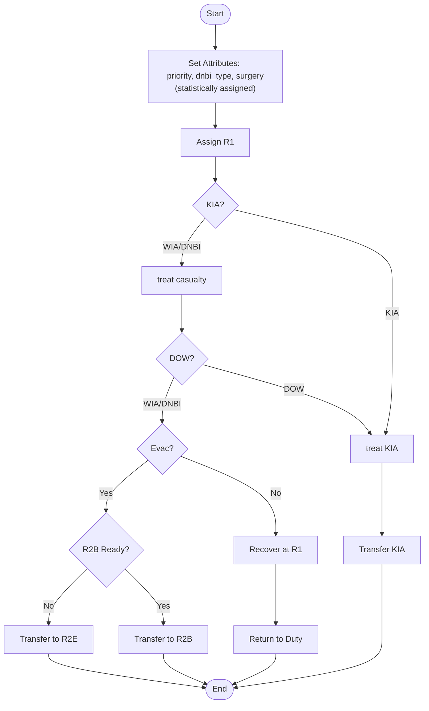
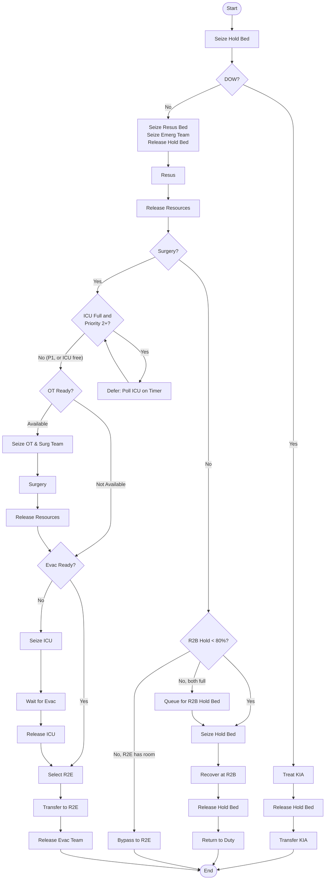
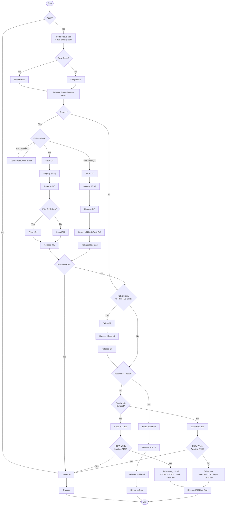

# Battlefield Casualty Handling

## Abstract

This repository contains a Discrete Event Simulation (DES) framework, written in R using the `simmer` package, developed to evaluate resource utilisation and casualty processing within a deployed battlefield medical system under Large Scale Combat Operations (LSCO). Providing baseline parameterised inputs derived from open-access literature, the simulation models per-minute casualty arrivals, triage, and surgical throughput across Role 1 (R1), Role 2 Basic (R2B), and Role 2 Enhanced – Heavy (R2E Heavy) treatment nodes, embedding a three-stage damage control surgery model to reflect treatment pathways and operational constraints.

This document is the project's **system reference**: it describes the codebase structure, the literature and doctrinal basis for every modelled algorithm and parameter, the resource and trajectory model (including the R1/R2B/R2E Heavy trajectory flowcharts), the model's known limitations, and the development environment. It does not present simulation results — those are published as two companion analysis documents:

- **[docs/Single_Run_Analysis.md](docs/Single_Run_Analysis.md)** — the illustrative single-run (seed 42, 30-day) analysis under the Falklands-modified casualty rate baseline, verifying model behaviour and identifying candidate system constraints echelon by echelon.
- **[docs/Multi_Run_Analysis.md](docs/Multi_Run_Analysis.md)** — a multi-run (n≥30 replications, 95% CI) comparative analysis confirming which of those constraints hold at statistical scale, and how the system responds under both the Falklands-modified and an Okinawa-intensity casualty rate.

Readers wanting to run the simulation rather than read about it should start at [Development Environment](#development-environment), which covers the Dev Container setup, dependency restoration, and how to launch a run.

This tool supports iterative refinement and stakeholder engagement, offering a transparent, modular platform for testing health system resilience. With further development and testing against high-intensity casualty models, the simulation can inform doctrinal updates and guide medical planning for future operational environments.

## Contents

<small>[Return to Top](#contents)</small>

<!-- TOC START -->
- [Abstract](#abstract)
- [Contents](#contents)
- [Introduction](#introduction)
- [Literature Review](#literature-review)
  - [Methodology](#methodology)
  - [Findings](#findings)
    - [Battlefield Casualty Rates and Estimation Models](#battlefield-casualty-rates-and-estimation-models)
    - [Casualty Simulation and DES](#casualty-simulation-and-des)
    - [Statistical Distributions and Modelling Algorithms](#statistical-distributions-and-modelling-algorithms)
    - [Military Doctrine and Operational Health Support Policy](#military-doctrine-and-operational-health-support-policy)
    - [Damage Control Surgery and Post-Operative Critical Care](#damage-control-surgery-and-postoperative-critical-care)
    - [Preventable Death and Time-Dependent Mortality](#preventable-death-and-timedependent-mortality)
    - [Strategic Aeromedical Evacuation (AME) and Role 4 Doctrine](#strategic-aeromedical-evacuation-ame-and-role-4-doctrine)
    - [Mass Casualty Event Simulation](#mass-casualty-event-simulation)
    - [Statistical Methods for Simulation Verification, Replication, and Sensitivity Analysis](#statistical-methods-for-simulation-verification-replication-and-sensitivity-analysis)
    - [Disease and Non-Battle Injury Evidence](#disease-and-nonbattle-injury-evidence)
- [Scenario Context](#scenario-context)
- [Simulation Framework](#simulation-framework)
- [Resource Descriptions](#resource-descriptions)
  - [Health Teams](#health-teams)
    - [Role 1 (R1) Treatment Team](#role-1-r1-treatment-team)
    - [Role 2 Basic (R2B)](#role-2-basic-r2b)
    - [Role 2 Enhanced Heavy (R2E Heavy)](#role-2-enhanced-heavy-r2e-heavy)
  - [Bed Types](#bed-types)
    - [Operating Theatre (OT)](#operating-theatre-ot)
    - [Resuscitation (Resus) (alternatively Emergency)](#resuscitation-resus-alternatively-emergency)
    - [Intensive Care Unit (ICU)](#intensive-care-unit-icu)
    - [Holding (Hold)](#holding-hold)
  - [Transport Assets](#transport-assets)
    - [Protected Mobility Vehicle Ambulance (PMV Ambulance)](#protected-mobility-vehicle-ambulance-pmv-ambulance)
    - [HX2 40M](#hx2-40m)
    - [Dead-Heading Return Legs](#deadheading-return-legs)
- [Model Parameters and Model Configuration](#model-parameters-and-model-configuration)
  - [Force Size](#force-size)
    - [Population](#population)
    - [Reinforcement Demand & Fulfillment](#reinforcement-demand-fulfillment)
  - [Health System Architecture](#health-system-architecture)
  - [Medevac — Transport Fleet](#medevac-transport-fleet)
  - [Schedules and Rosters](#schedules-and-rosters)
  - [Casualty Generation](#casualty-generation)
    - [1. Distribution Parameterisation](#1-distribution-parameterisation)
    - [2. Per-Minute Rate Sampling and Scaling](#2-perminute-rate-sampling-and-scaling)
    - [3. Arrival Detection via Cumulative Sum](#3-arrival-detection-via-cumulative-sum)
    - [4. Temporal Randomisation](#4-temporal-randomisation)
    - [5. Mass Casualty Event Injection](#5-mass-casualty-event-injection)
    - [6. Force Regeneration and the Endogenous Feedback Loop](#6-force-regeneration-and-the-endogenous-feedback-loop)
  - [Casualty Generation Rates](#casualty-generation-rates)
    - [WIA — Combat](#wia-combat)
    - [KIA — Combat](#kia-combat)
    - [DNBI — Combat](#dnbi-combat)
    - [WIA — Support](#wia-support)
    - [KIA — Support](#kia-support)
    - [DNBI — Support](#dnbi-support)
  - [DNBI Sub-Type Split](#dnbi-subtype-split)
  - [Parameters Not Scenario-Eligible](#parameters-not-scenarioeligible)
- [Casualty Priorities](#casualty-priorities)
- [Return to Duty](#return-to-duty)
- [Died of Wounds](#died-of-wounds)
  - [Survival Function](#survival-function)
  - [Parameter Calibration](#parameter-calibration)
  - [Multi-Echelon Check and Conditional Increment](#multiechelon-check-and-conditional-increment)
  - [Treatment Efficacy Modifiers](#treatment-efficacy-modifiers)
  - [Post-Operative Checkpoint](#postoperative-checkpoint)
  - [AME Wait Checkpoint](#ame-wait-checkpoint)
- [Scenario Profiles](#scenario-profiles)
  - [Mechanism](#mechanism)
  - [Parameter classification](#parameter-classification)
  - [Moderate Intensity profile (Falklands 1982 exemplar)](#moderate-intensity-profile-falklands-1982-exemplar)
  - [High Intensity profile (Okinawa exemplar)](#high-intensity-profile-okinawa-exemplar)
- [Development Environment](#development-environment)
  - [Prerequisites](#prerequisites)
  - [First-time setup](#firsttime-setup)
  - [Restoring dependencies](#restoring-dependencies)
  - [RStudio Server configuration](#rstudio-server-configuration)
  - [Running the simulation with full parallelism](#running-the-simulation-with-full-parallelism)
  - [Git workflow](#git-workflow)
- [Simulation Design](#simulation-design)
  - [Codebase Structure](#codebase-structure)
    - [Running the simulation](#running-the-simulation)
    - [Multi-run Replication Framework](#multirun-replication-framework)
    - [Warm-up Period Analysis](#warmup-period-analysis)
    - [Sensitivity Analysis](#sensitivity-analysis)
    - [Parameters Excluded from Screening](#parameters-excluded-from-screening)
    - [Parameter Name Reference](#parameter-name-reference)
    - [Comparative Scenario Runner](#comparative-scenario-runner)
    - [Shiny Application](#shiny-application)
      - [Full Analysis Mode](#full-analysis-mode)
      - [Sensitivity Panel](#sensitivity-panel)
  - [Simulation Environment Setup](#simulation-environment-setup)
  - [Core Trajectory](#core-trajectory)
  - [R2B Trajectory](#r2b-trajectory)
  - [R2E Heavy Trajectory](#r2e-heavy-trajectory)
  - [Role 4 (National Support Base) Demand Modelling](#role-4-national-support-base-demand-modelling)
- [Model Outputs](#model-outputs)
  - [Domain 1 — Mortality and Preventable Death](#domain-1-mortality-and-preventable-death)
  - [Domain 2 — Time-to-Care from R1 Arrival](#domain-2-timetocare-from-r1-arrival)
  - [Domain 3 — Surgical Throughput](#domain-3-surgical-throughput)
  - [Domain 4 — Echelon Load and Capacity](#domain-4-echelon-load-and-capacity)
  - [Domain 5 — Flow and Disposition](#domain-5-flow-and-disposition)
  - [Domain 6 — Combat Power](#domain-6-combat-power)
  - [Domain 7 — Strategic Evacuation and National Support Base Demand](#domain-7-strategic-evacuation-and-national-support-base-demand)
  - [Output Variable Register cross-reference](#output-variable-register-crossreference)
- [Limitations](#limitations)
  - [High Impact](#high-impact)
  - [Medium Impact](#medium-impact)
  - [Low Impact](#low-impact)
- [Further Development](#further-development)
- [Conclusion](#conclusion)
- [References](#references)
  <!-- TOC END -->

---

## Introduction

<small>[Return to Top](#contents)</small>

Large‑scale combat operations (LSCO) represent the most demanding form of conventional warfare, characterised by high‑tempo, multi‑domain action against peer or near‑peer adversaries. LSCO require the orchestration of manoeuvre, fires, logistics, intelligence, and command across vast, often nonlinear battlespaces [[1]](#References), [[2]](#References). Unlike the western experience in Middle-East conflicts, forces in LSCO will not have guaranteed air superiority, uncontested lines of communication, and predictable casualty flows. LSCO is expected to unfold in contested, degraded, and dynamic operational conditions [[1]](#References), [[2]](#References), [[3]](#References). Historical and contemporary case studies - from the industrial battlefields of the Second World War to recent fighting in Ukraine - demonstrate that such operations generate high casualty densities, impose unprecedented logistical demands, and challenge even the most sophisticated forces’ ability to sustain tempo over time [[2]](#References), [[4]](#References).

The medical implications of LSCO are profound. Estimates consistently project casualty high casualty rates, recent literature suggests that a significant amount of those potentially could and should be able to return to duty (potentially without evacuation from theatre) if treated effectively and without delay [[5]](#References). The deployed health system is therefore not a peripheral service but a critical combat enabler. Its capacity to preserve fighting strength underpins the force’s ability to seize, retain, and exploit the initiative. In LSCO, battlefield clearance must be achieved despite contested airspace and disrupted communications, injury patterns will reflect the lethality of modern munitions, and medical logistics must adapt to disrupted supply chains and fluid front lines.

Yet, existing medical doctrine and force design have evolved largely from counterinsurgency campaigns where operational conditions were comparatively permissive [[5]](#References). In a peer‑conflict LSCO scenario, planners must expect prolonged field care, delays in evacuation, and the need for smaller, more mobile surgical teams positioned closer to the fight [[3]](#References), [[5]](#References). A resilient and agile, deployed health system serves not only to save lives, but to sustain operational momentum and, ultimately, to enable the successful prosecution of the campaign.

This research looks to explore the performance of the deployed health system through simulation with an eye to understanding its implications for participation in LSCO. The simulation approach allows for the exploration of scenarios that are difficult to replicate in live exercises, offering evidence‑based insights to refine doctrine, optimise medical force posture, and ensure that health support is adequate for LSCO. In doing so, it contributes to the broader imperative of preparing the force for the realities of high‑intensity warfare in an era of renewed great‑power competition [[6]](#References), [[7]](#References).

---

## Literature Review

### Methodology

To inform the design and implementation of the battlefield casualty simulation, a structured literature review was conducted in two phases.

The initial phase used a multi-pronged methodology. First, open-access academic literature and publicly available internet-based resources on battlefield casualty modelling, discrete event simulation (DES), and casualty rate estimation were surveyed. This was complemented by a snowballing technique, recursively exploring the references cited within key papers to identify additional relevant sources. Large language models (LLMs) were then engaged to identify supplementary resources. This surfaced publications, technical reports, and grey literature that conventional search techniques did not. Finally, this academic and technical review was supplemented by a survey of publicly available military publications, providing context for force structure, casualty flow assumptions, and the operational constraints that shape operational medical planning. This initial phase established the foundational casualty-rate, DES, distributional, and doctrinal basis.

In the second phase the simulation was extended feature by feature, each addition triggered its own deliberate, LLM-assisted search for open-access sources addressing that specific enhancement. These features included the three-stage damage control surgery (DCS) model and its treatment-duration and post-operative recovery parameters, the time-dependent died-of-wounds survival function, the strategic aeromedical evacuation (AME) and Role 4 demand model, the compound Poisson mass casualty event mechanism, and the statistical framework underpinning multi-run replication, warm-up analysis, and Morris/Sobol sensitivity screening. This iterative extension is summarised in the further thematic domains that follow the initial four, each tied to the design or parameterisation requirement of a specific subsequent Issue.

### Findings

In total, 52 resources have been reviewed and incorporated into the simulation framework as of the current codebase, spanning peer-reviewed journals, technical reports, doctrinal publications, and internet publications. The review covers ten thematic domains.

#### Battlefield Casualty Rates and Estimation Models

Historical and predictive models of casualty rates were central to the review. The FORECAS system [[8]](#References) provided a statistically grounded approach to projecting wounded-in-action (WIA), killed-in-action (KIA), and disease/non-battle injury (DNBI) rates using empirical data from past conflicts. Complementary studies [[9]](#References), [[10]](#References), [[11]](#References) and [[12]](#References) highlighted the operational implications of casualty rates in LSCO, emphasizing the disproportionate impact of DNBI on lost duty days and the need for robust force health protection (FHP) strategies. The Falklands War 1982 (Operation CORPORATE) serves as this project's principal historical validation exemplar for a moderate-intensity casualty rate. Field-surgical mortality outcomes at the Ajax Bay Advanced Surgical Centre and forward stations are documented in [[13]](#References), and an aggregate died-of-wounds rate of 0.52% among 580 British soldiers and marines wounded in action is confirmed in [[14]](#References); these are the figures the `moderate_intensity` scenario profile's died-of-wounds calibration is tuned to reproduce (see [Scenario Profiles](#scenario-profiles)).

#### Casualty Simulation and DES

Simulation methodologies were explored through both military-specific and general DES literature. The simmer package for R [[15]](#References) was identified as a suitable framework for implementing modular, auditable, and event-driven logic. Studies such as [[16]](#References) demonstrated DES applications in healthcare contexts, while [[17]](#References) and [[4]](#References) provided high-level casualty rate numbers that allowed the evaluation of the performance of DES models and [[2]](#References) provided insights into trauma system design under combat conditions. These sources informed the architectural decisions for the simulation engine, including event scheduling, resource constraints, and patient flow logic.

#### Statistical Distributions and Modelling Algorithms

The review examined statistical distributions suitable for modelling casualty arrival rates and treatment durations. FORECAS [[8]](#References) employed lognormal and exponential distributions based on battle intensity and troop type, validated through historical data. Additional studies [[18]](#References), [[11]](#References) and [[16]](#References) provided statistics, explored distribution models measures, and described other approaches using DES in medical care contexts.
These findings guided the selection of distribution functions for stochastic modelling, ensuring that simulated outputs reflect doctrinally plausible variability and temporal clustering.

#### Military Doctrine and Operational Health Support Policy

Doctrinal and policy publications such as [[1]](#References), [[3]](#References), [[6]](#References) and [[7]](#References) established the current geostrategic context and outlined the imperitive for militaries to be able to provide force options for LSCO. 
Recent doctrinal analyses [[9]](#References), [[2]](#References) and [[5]](#References) emphasized the shift toward prolonged casualty care, contested evacuation, and the need for distributed medical assets. A related analysis [[19]](#References) frames return-to-duty as a direct force-sustainment lever rather than a purely clinical outcome and is implemented in the model directly ([Force Regeneration and the Endogenous Feedback Loop](#6-force-regeneration-and-the-endogenous-feedback-loop)), coupling casualty production to a live, time-varying effective force size. These insights were incorporated into the simulation design to ensure alignment with contemporary operational realities.

#### Damage Control Surgery and Post-Operative Critical Care

A systematic review [[20]](#References) and an account of damage control technique in abdominal surgery [[21]](#References) establish the three-phase structure that this project's R2B and R2E Heavy trajectories implement. Operative-time data reported for a damage control cohort within [[20]](#References) directly sourced the DAMCON surgery duration distribution, corroborated by the rapid-closure operative-window principle central to damage control technique [[22]](#References) and by outcomes literature from an austere-setting DCS series [[23]](#References) and abdominal-trauma DCS practice [[24]](#References). Post-operative critical care requirements are established by [[25]](#References), [[22]](#References), [[24]](#References) and [[26]](#References); descriptions of post-DCS stabilisation timeframes [[20]](#References), [[27]](#References), [[24]](#References) informed the ICU length-of-stay parameters at both echelons. Task-time estimation for the R2B/R2E resuscitation phase, where no single published source tabulates an end-to-end duration, drew on the treatment-process optimisation methodology of [[28]](#References), constructing an estimate from collated task-duration components rather than a single reported figure.

#### Preventable Death and Time-Dependent Mortality

An analysis of 4,596 battlefield deaths during Operations Enduring Freedom and Iraqi Freedom [[29]](#References) found that 87.3% resulted from haemorrhage, predominantly within 30–90 minutes of injury; a study of a "golden hour" surgical-capability policy [[30]](#References) found it reduced preventable prehospital death from 32% to 3.5% in a Special Operations context. Together these establish the direct empirical link between time-to-care and survivability that motivates modelling died-of-wounds probability as a function of elapsed time since injury; the logistic curve's shape parameters are anchored to the mortality time-windows these two studies report. The treatment-efficacy multipliers that further modify the died-of-wounds ceiling by care received at each phase are similarly evidence-based rather than estimated outright: a 41% relative mortality reduction from balanced-component damage control resuscitation is reported in [[31]](#References), and the PROMMTT study [[32]](#References) provides the haemorrhage-specific mortality basis used to derive the surgical efficacy factor.

#### Strategic Aeromedical Evacuation (AME) and Role 4 Doctrine

The strategic AME and Role 4 demand model draws on [[33]](#References), which establishes the triage framework, echelon functions, and the Casualty Staging Unit/CCATT-CCAST acuity concepts underpinning the model's critical/standard AME pool split. Role 4 ward assignment and length-of-stay parameters follow the general injury-severity length-of-stay gradient described in [[34]](#References), applied by informed extension since no open-access source tabulates Role 4 ward assignment by this project's exact category scheme.

#### Mass Casualty Event Simulation

The compound Poisson mass casualty event mechanism follows the general approach to LSCO casualty-surge simulation described in [[35]](#References), and complements the discrete-event mass-casualty-incident stress-testing precedent of SIMEDIS [[36]](#References), which injects a fixed, deterministic victim count rather than a stochastically varying one. An account of aligning field hospital training with LSCO reality [[37]](#References) informed the blast-dominant triage priority distribution applied to mass-casualty-derived casualties.

#### Statistical Methods for Simulation Verification, Replication, and Sensitivity Analysis

Moving from a single illustrative run to a defensible multi-run analytical framework required its own literature base. Verification and validation followed the framework in [[38]](#References) and the general DES methodology in [[39]](#References). Warm-up classification used Welch's graphical procedure [[40]](#References) and the treatment of terminating-versus-steady-state simulation in [[41]](#References), with [[42]](#References) establishing that warm-up detection methods presuppose a steady state that does not apply to a campaign with a defined finite horizon. Multi-run replication and variance reduction drew on a demonstration of L'Ecuyer-CMRG parallel RNG streams in R [[43]](#References), the corresponding parallel-package documentation [[44]](#References), and a treatment of antithetic variates [[45]](#References). Global sensitivity screening used Morris Elementary Effects [[46]](#References), implemented via R's `sensitivity` package [[47]](#References) and the OpenMOLE documentation [[48]](#References), and Sobol variance-based decomposition [[49]](#References). A critical-care DES study [[50]](#References) informed the Shiny application's default replication count and 95% CI reporting.

#### Disease and Non-Battle Injury Evidence

Disease DNBI sub-categorisation and its emergency surgical candidacy rate draw on documented evidence of acute surgical disease conditions occurring in deployed populations. Acute appendicitis incidence among deployed Japanese soldiers in Burma is reported in [[51]](#References), and humanitarian surgical care delivered at US military treatment facilities in Afghanistan is documented in [[52]](#References), together supporting the inclusion of conditions such as appendicitis, cholecystitis, and perforated peptic ulcer within the disease DNBI pathway's surgical candidacy branch, distinct from the battle fatigue and NBI sub-types that do not carry the same surgical risk profile.

Because no open-access source was identified that tabulates the specific quantity required, several parameters in this project remain informed estimates rather than directly sourced values, described in detail in the [Limitations](#limitations) section.

This literature review enabled the design of a model suitable to support the assessment of the deployed health system capacity within LSCO.

---

## Scenario Context

<small>[Return to Top](#contents)</small>

The health system establishment — the number of Role 1 (R1) treatment teams, Role 2 Basic (R2B) facilities, and Role 2 Enhanced Heavy (R2E Heavy) hospitals, and each element's internal team and bed composition — is a configurable input to the simulation, defined in `env_data.json`'s `elms` structure and editable directly or via the Shiny Configure panel (`app.R`).

The shipped default configuration models the land combat health system anticipated for a representative combat brigade: three battlegroups, each allocated one R1 treatment team tasked with providing immediate clinical intervention and stabilisation in proximity to combat operations (three R1 teams in total); two R2B facilities conducting damage control resuscitation and surgery before onward evacuation to higher-level care; and one R2E Heavy hospital sited to the rear for complex surgical procedures, extended post-operative care, and advanced diagnostic support. This default configuration underpins the diagram below and the illustrative single-run and multi-run analyses documented in [docs/Single_Run_Analysis.md](docs/Single_Run_Analysis.md) and [docs/Multi_Run_Analysis.md](docs/Multi_Run_Analysis.md).


An [Interactive Diagram](https://www.map.army/?ShareID=1041883&UserType=RO-xOMjf7j6) allows further exploration of the default model configuration being simulated.

---

## Simulation Framework

<small>[Return to Top](#contents)</small>

The simulation models casualty handling across echelons of care in a battlefield environment, structured around modular trajectories and dynamic resource availability. It operates within a discrete-event simulation framework using `simmer`, and is driven by probabilistic rates, conditional branching, and resource interactions across Role 1 (R1), Role 2 Basic (R2B), and Role 2 Enhanced Heavy (R2E) facilities.

The simulation was designed around the general functions of each role of health element as outlined in the diagram below. Where roles overlap they are able to provide the same functions to varying degree. The diagram below provides an outline of the role and function design applied for this simulation using the three-stage Damage Control Surgery (DCS) model of care described in [[20]](#References) and [[21]](#References).


```mermaid
block-beta
  columns 13

  a["Casualty Care"]:13
  b["R1"]:3
  c["R2B"]:4 space:9
  e["R2E"]:7 space:6
  f["R4"]:10

  g["Triage"]
  h["POI Care"]
  i["MEDIVAC"]
  j["Resus/Emergency"]
  k["Abbreviated Surgery"]
  l["ICU Stabilisation"]
  m["MEDIVAC"]
  n["Definitive Surgery"]
  o["Recovery"]
  p["MEDIVAC"]
  q["Reconstructive Surgery"]
  r["Rehabilitation"]
  s["Long Term Recovery"]

  %% Role 1 — Deep Navy
  style b fill:#336699,stroke:#003366,color:#ffffff
  style g fill:#336699,stroke:#003366,color:#ffffff
  style h fill:#336699,stroke:#003366,color:#ffffff
  style i fill:#336699,stroke:#003366,color:#ffffff

  %% Role 2B — Dark Sea Green
  style c fill:#2e8b57,stroke:#14532d,color:#ffffff
  style j fill:#2e8b57,stroke:#14532d,color:#ffffff
  style k fill:#2e8b57,stroke:#14532d,color:#ffffff
  style l fill:#2e8b57,stroke:#14532d,color:#ffffff
  style m fill:#2e8b57,stroke:#14532d,color:#ffffff

  %% Role 2E — Olive Gold
  style e fill:#b5a900,stroke:#665c00,color:#ffffff
  style n fill:#b5a900,stroke:#665c00,color:#ffffff
  style o fill:#b5a900,stroke:#665c00,color:#ffffff
  style p fill:#b5a900,stroke:#665c00,color:#ffffff

  %% Role 4 — Burnt Amber
  style f fill:#cc6600,stroke:#663300,color:#ffffff
  style q fill:#cc6600,stroke:#663300,color:#ffffff
  style r fill:#cc6600,stroke:#663300,color:#ffffff
  style s fill:#cc6600,stroke:#663300,color:#ffffff
```

---

## Resource Descriptions

<small>[Return to Top](#contents)</small>

### Health Teams

#### Role 1 (R1) Treatment Team

A role 1 treatment team provides the first line of medical care. It is designed to deliver immediate lifesaving measures, perform triage and stabilization, and manage minor injuries and illnesses close to the point of injury or unit location. These teams also prepare casualties for evacuation to higher levels of care if needed.

#### Role 2 Basic (R2B)

A Role 2 Basic (R2B) medical treatment facility provides forward surgical and resuscitative care close to the battlefield. Its purpose is to deliver damage-control surgery, critical care, and short-term patient holding in austere environments where rapid intervention can save lives.

It’s designed to be mobile, logistically lean, and capable of stabilizing casualties before evacuation to higher-level care. With ICU beds, low-dependency holding, and a surgical team, R2B bridges the gap between frontline treatment and more comprehensive facilities like Role 2 Enhanced or Role 3.

#### Role 2 Enhanced Heavy (R2E Heavy)

A R2E Heavy facility delivers advanced surgical and critical care capabilities in forward-deployed military operations. Its purpose is to provide damage-control surgery, intensive care, inpatient services, and scalable resuscitation for casualties who require more than basic stabilization but are not yet ready for strategic evacuation.

The R2E Heavy is a static field hospital designed to handle complex trauma, prolonged care, and high casualty volumes.

### Bed Types

#### Operating Theatre (OT)

OT beds are specialized surgical stations designed to support damage-control surgery and life-saving interventions. These beds are part of a sterile operating suite and are equipped to handle:

- Emergency trauma procedures.
- Advanced surgical care including orthopedic, abdominal, and thoracic operations.
- Integrated anesthesia and monitoring systems for patient stability.
- Rapid turnover and sterilization protocols to manage high casualty volumes.

#### Resuscitation (Resus) (alternatively Emergency)

Emergency beds are designed for rapid stabilization and life-saving interventions immediately after casualty arrival. These beds support:

- Advanced trauma management including airway control, hemorrhage control, and shock treatment.
- Critical monitoring and resuscitation equipment such as defibrillators, oxygen delivery systems, and IV access.
- Quick turnover and accessibility to facilitate high casualty throughput during mass casualty events.
- Integration with surgical and evacuation pathways, ensuring seamless transition to operating theatres or higher echelons of care.

These beds serve as the first stop for severely injured personnel.

#### Intensive Care Unit (ICU)

Intensive Care Unit (ICU) beds are designed to deliver advanced life-support and continuous monitoring for critically injured or ill personnel. These beds serve as the backbone of forward-deployed critical care, enabling:

- Resuscitation and stabilization of casualties with multi-system trauma.
- Mechanical ventilation, invasive monitoring, and medication infusions.
- Postoperative care following damage-control surgery.
- Support for prolonged field care when evacuation is delayed.

#### Holding (Hold)

Holding beds are designated for short-term patient care and observation, typically for those who are awaiting evacuation, recovering from minor procedures, or expected to return to duty soon. These beds serve as a transitional space between acute treatment zones (like ICU or OT) and final disposition, whether that’s evacuation to higher care or reintegration into the force.

They’re often used for:

- Postoperative recovery after damage-control surgery.
- Monitoring stable patients who don’t require intensive care.
- Staging casualties for medical evacuation.
- Low-dependency care such as hydration, pain management, or wound dressing.

Holding beds help to maintain patient flow and prevent bottlenecks in critical care areas.

### Transport Assets

#### Protected Mobility Vehicle Ambulance (PMV Ambulance)

The PMV Ambulance (Protected Mobility Vehicle – Ambulance) is a blast-resistant, armored medical transport designed to safely evacuate casualties from combat zones. Based on the Bushmaster, it combines mobility, protection, and medical capability, allowing medics to deliver care en route while shielding patients from small arms fire, IEDs, and mines.

#### HX2 40M

The HX2 40M is a 4×4 tactical military truck developed by Rheinmetall MAN Military Vehicles (RMMV) as part of the HX2 series. Designed for high mobility and rugged performance, it serves as a versatile logistics platform for transporting troops, equipment, and supplies in demanding operational environments. In this simulation the HX2 40M is used for the transport of KIA and casualties that have DOW.

#### Dead-Heading Return Legs

PMV Ambulance and HX2 40M transport assets are held for a return leg after casualty drop-off, rather than becoming available for the next pickup immediately. This reflects the real-world requirement for a vehicle to travel back to the originating echelon before it can be tasked again.

Dead-heading is implemented for all four WIA/KIA transport legs using simmer's `clone()`/`synchronize()` activities. After the outbound timeout, the entity is cloned into two parallel branches: a vehicle (or, for the R2B→R2E WIA leg, escort-team) branch that runs an unladen return-leg timeout before releasing the asset, and a casualty branch with no further activity. `synchronize(wait = FALSE)` then lets the casualty branch continue immediately into the rest of the trajectory (it is always the first of the two clones to reach that point), while the vehicle/escort branch is discarded once it later arrives there having completed the return leg and released the resource. The resource therefore remains occupied for the full round trip, while the casualty's own care pathway is unaffected by the return travel time. The two pooled, brigade-level PMV Ambulance/HX2 40M fleets (R1→R2B WIA, R1→mortuary KIA) and the R2B→R2E mortuary road move (HX2 40M) share fleet capacity; the R2B→R2E WIA leg draws on a separate, R2B-team-organic resource not shared with any pooled fleet. R2E's own local mortuary transfer (`r2e_transport_kia()`) is the one remaining leg with no vehicle asset and no return leg, based on the design assumption that the mortuary is collocated with R2E itself. Return leg duration for all four legs is modelled as a fresh, unconditional triangular draw from the same outbound distribution.

---

## Model Parameters and Model Configuration

<small>[Return to Top](#contents)</small>

The population sizes, health system establishment, transport fleet, and casualty generation rates described in this section are the simulation's shipped defaults. Each is derived from the open-access research and analysis cited alongside it; each value is a configurable input, editable directly in `env_data.json` or via the Shiny Configure panel (`app.R`).

The simulation heavily uses triangular distributions to model the duration of activities undertaken in the model (treatment, transport and other handling tasks). Triangular distributions were employed as they are generally used when the underlying distribution is unknown, but a minimal value, some maximal value, and a most likely value are available [[18]](#References). This approach is similar to other applications of DES in clinical settings, as shown in [[16]](#References).

<!-- ENV SUMMARY START -->
<!-- This section is auto-generated. Do not edit manually. -->

### Force Size

#### Population

The following population groups are defined in the simulation environment:

| Population | Count |
|------------|-------|
| Combat | 2500 |
| Support | 1250 |

#### Reinforcement Demand & Fulfillment

A demand submission cycle of 0 days disables reinforcement (the shipped default); the fulfillment lag and fill distribution parameters are then unused.

| Parameter | Variable | Value |
|-----------|----------|-------|
| Demand Submission Cycle (days) | — | 0 |
| Fulfillment Lag (days) | — | 7 |
| Fill Distribution — Minimum (fraction of demand) | a | 0.2 |
| Fill Distribution — Mode (fraction of demand) | c | 0.85 |
| Fill Distribution — Maximum (fraction of demand) | b | 1.1 |

Each reinforcement cycle computes a pool's demand as its shortfall against initial establishment strength, net of any shortfall an earlier, still-pending cycle has already claimed (`initial − current − pending`, floored at 0) — this prevents overlapping cycles from independently re-claiming the same shortfall when the demand submission cycle is shorter than the fulfillment lag. The amount actually delivered is drawn, at submission time rather than at fulfillment, as a fraction of that demand from a Triangular(*a*, *b*, *c*) distribution parameterised by the three fill values above, then credited to the pool once the fulfillment lag elapses, clamped so a pool can never be credited above its initial establishment strength. The model has no sortie-failure rate or binary success/failure roll for reinforcement.

The fraction of demand *x* actually delivered in a single cycle is drawn from the following probability density function:

$$
f(x) =
\begin{cases}
\dfrac{2(x-a)}{(b-a)(c-a)} & a \le x < c \\[4pt]
\dfrac{2}{b-a} & x = c \\[4pt]
\dfrac{2(b-x)}{(b-a)(b-c)} & c < x \le b
\end{cases}
$$

Where *a*, *b*, and *c* are the Fill Distribution Minimum, Maximum, and Mode values in the table above respectively.

### Health System Architecture

The following table summarises the medical elements configured in `env_data.json`, including team types, personnel, and beds. `Quantity` (team counts) and `Beds` (bed counts per team) are editable directly in `env_data.json` or via the Shiny Configure panel's Health System Architecture group (`app.R`); the personnel/team composition columns (`Base`/`Surg`/`Emerg`/`Icu`/`Evac`) are a fixed part of the establishment definition and are not independently configurable.

| Element | Quantity | Beds | Base | Surg | Emerg | Icu | Evac |
| --- | --- | --- | --- | --- | --- | --- | --- |
| R1 | 3 | NA | Medic (3), Nurse (1), Doctor (1) | NA | NA | NA | NA |
| R2B | 2 | OT (1); Resus (2); ICU (2); Hold (5) | NA | Anesthetist (1), Surgeon (2), Medic (1) | Facem (1), Nurse (3), Medic (1) | Nurse (2), Medic (2) | Medic (2) |
| R2EHEAVY | 1 | OT (2); Resus (4); ICU (4); Hold (30) | NA | Anesthetist (1), Surgeon (2), Nurse (4) | Facem (1), Nurse (3), Medic (1) | Intensivist (1), Nurse (4) | Medic (2) |

### Medevac — Transport Fleet

These are the available transport platforms and their characteristics:

| Platform | Quantity | Capacity |
|----------|----------|----------|
| PMVAMB | 3 | 4 |
| HX240M | 4 | 50 |

<!-- ENV SUMMARY END -->

### Schedules and Rosters

Some resource teams have rosters/schedules. Due to the limited size and structure, surgical teams are rostered as available for12 hour shifts. This results in there being 12 hours of time available for surgery at the R2B in every 24 hours and 36 hours of surgery time available in every 24 hours across two OT in the R2E Heavy. 

| Resource | Roster applied | Configurable variable | Default | Where configured |
|---|---|---|---|---|
| R1 Treatment Team | No — no shift schedule; available continuously | — | — | — |
| R2B Surgical Team | Yes — alternating two-shift roster across R2B's surgical teams (`build_env()`, `R/environment.R`) | `ot_hours` | 12 (hours) | Shiny app "Run" tab (`app.R`); otherwise the `ot_hours` argument to `build_env()`/`run_once()` |
| R2E Surgical Team | Yes — alternating two-shift roster across R2E's surgical teams (`build_env()`, `R/environment.R`) | `ot_hours` | 12 (hours) | Shiny app "Run" tab (`app.R`); otherwise the `ot_hours` argument to `build_env()`/`run_once()` |
| R2B / R2E Operating Theatre beds | No — the physical OT bed is available 24 hours per day; only the surgical team carries the shift schedule | — | — | — |

`ot_hours` is a single shared parameter: it sets the first shift's length (the second shift covers the remainder of the 24-hour day) identically at both R2B and R2E, not independently per echelon. It is not part of `env_data.json` and has no CLI flag; it is Morris-screened (see [Sensitivity Analysis](#sensitivity-analysis)) and is otherwise fixed at its 12-hour default unless changed in the Shiny app or passed explicitly by calling code.

### Casualty Generation

Casualties are generated based on rates outlined in [[8]](#References) and refined with analysis provided in [[10]](#References) and supported by [[17]](#References), with the implementation outlined below.

The simulation supports three selectable casualty-rate profiles, each applied as a named scenario-profile overlay on the base configuration (see [Scenario Profiles](#scenario-profiles)) and selectable live via the Shiny app's Casualty Intensity Profile dropdown: the shipped default ("Falklands — Modified"), an explicit `moderate_intensity` profile ("Falklands — Unmodified"), and a `high_intensity` profile ("Okinawa — Casualty Rates"). The default and `moderate_intensity` share identical Falklands-calibrated casualty generation rates, differing only in their downstream died-of-wounds treatment-efficacy calibration (see [Scenario Profiles](#scenario-profiles)); `high_intensity` instead applies Okinawa-calibrated rates with an exponential rather than lognormal distribution family (see [Casualty Generation Rates](#casualty-generation-rates)). Every individual stream's mean and standard deviation is independently re-parameterisable via the Configure panel or directly in `env_data.json`, regardless of which profile is active.

US historical analysis of the Battle of Okinawa [[8]](#References) gives WIA and KIA rates producing approximately 30 casualties per day for a force size of 3,750 — a casualty rate of ~0.8%. By comparison, Russia’s estimated 700-1,100 daily casualties from a committed force of 450,000–600,000 in Ukraine imply a lower casualty rate of ~0.2% [[4]](#References). Historical data from the Falklands War suggests a casualty rate of ~0.37% [[8]](#References), and was selected as the shipped default over the Okinawa rate on the basis that the Okinawa-derived ~0.8% sits well above the rates currently observed for Russia in publicly available data in the Ukraine war. This selection also recognises that there is likely under-reporting in Russian casualty estimates, particularly of non-critical wounded personnel, and that casualty rates will have varied over time in the Ukraine war based on combat intensity and seasonal fluctuations in operational tempo.

Arrival times for the casualty streams are driven by a stateful generator closure (`make_ln_arrival_generator()`/`make_exp_arrival_generator()`, `R/environment.R`) passed directly to simmer's `add_generator()`, called once per arrival during the run itself (this excludes mass casualty event timing, which remains pre-computed and exogenous — see [Mass Casualty Event Injection](#5-mass-casualty-event-injection)). Each call models continuous per-minute intensity and converts it to a discrete arrival event via cumulative-threshold crossing, reading the live effective force size at each step so arrival timing can react to the replication's own in-run events (see [Force Regeneration and the Endogenous Feedback Loop](#6-force-regeneration-and-the-endogenous-feedback-loop)). The general process is outlined below.

[[8]](#References) fits casualty incidence to one of two distribution families, selected by battle intensity and troop type rather than a single distribution applying universally: a lognormal model for moderate/light-intensity combat troops and for support troops at all intensities, and an exponential model for combat troops in high-intensity battles. `generate_casualty_arrivals()` (`R/environment.R`) dispatches each casualty stream to `make_ln_arrival_generator()` or `make_exp_arrival_generator()` based on an explicit `distribution` field read from `env_data$vars$generators`. Both models share the same per-minute sampling, cumulative-sum arrival detection, and jitter mechanics (steps 2–4 below).

#### 1. Distribution Parameterisation

**Lognormal** (`make_ln_arrival_generator()`) converts the daily mean and standard deviation into log-space parameters, preserving the shape of the empirical distribution:

Mean (log-space):

$$
\mu_{\log} = \ln\left(\frac{\mu^2}{\sqrt{\sigma^2 + \mu^2}}\right)
$$

Standard deviation (log-space):

$$
\sigma_{\log} = \sqrt{\ln\left(1 + \frac{\sigma^2}{\mu^2}\right)}
$$

Where:

- \mu = expected number of casualties per day
- \sigma = daily standard deviation

**Exponential** (`make_exp_arrival_generator()`) is single-parameter — the rate is fully determined by the mean, with no separate shape parameter, following FORECAS's own formula $W \sim \text{exponential}(\mu)$:

$$
\lambda = \frac{1}{\mu}
$$

Where:

- \mu = expected number of casualties per day
- \lambda = exponential rate parameter passed to the per-minute draw (no \sigma term — a reported standard deviation for an exponential-fitted stream is retained in `env_data.json` for citation only and plays no role in generation)

#### 2. Per-Minute Rate Sampling and Scaling

Draws samples from the stream's selected distribution representing per-minute casualty rates, capped at a threshold to prevent extreme outliers, then scaled according to population size and temporal resolution (per minute per 1000 personnel).

For each simulation minute $i \in \{1, 2, \dots, n_{\text{minutes}}\}$, the per-minute casualty rate is computed as:

$$
r_i = \min\left(x_i, \text{cap}\right) \times \frac{P}{1000 \times 1440}
$$

Where:

- $x_i \sim \text{LogNormal}(\mu_{\log}, \sigma_{\log}^2)$ (lognormal streams) or $x_i \sim \text{Exponential}(\lambda)$ (exponential streams)
- $P$ = population size (support or combat) — not a fixed constant, but a live, time-varying effective force size read at each minute; see [Force Regeneration and the Endogenous Feedback Loop](#6-force-regeneration-and-the-endogenous-feedback-loop) below
- $r_i$ = scaled and capped casualty rate for minute i

The cap exists primarily to keep the per-minute generator's execution time practically bounded, not merely to trim outliers cosmetically: because both the lognormal and exponential distributions have an unbounded right tail, an uncapped draw can occasionally return an implausibly large per-minute rate, and since `make_ln_arrival_generator()`/`make_exp_arrival_generator()` walk the simulation minute-by-minute inside a stateful closure rather than sampling arrival times directly, a rare extreme draw of this kind was previously found to substantially inflate run time for the lognormal generator before a cap was introduced. Bounding the draw keeps each minute's rate, and therefore the closure's iteration count, within a predictable range regardless of how extreme a single stochastic draw happens to be.

Each distribution family has a distinct cap, and each was selected to bind rarely enough that it does not materially distort the modelled casualty rate. `make_ln_arrival_generator()` uses a fixed absolute default (`cap = 5`). `make_exp_arrival_generator()` instead sets its cap relative to the stream's own mean (`cap = cap_multiplier × mean_daily`, default `cap_multiplier = 3`). This works because, for an exponential distribution, the chance of a draw exceeding some multiple of the mean stays the same fixed percentage no matter how large or small the mean is: a cap set at three times the mean always trims about the same small share of draws (≈5%).

#### 3. Arrival Detection via Cumulative Sum

Accumulates per-minute rates and detects new arrivals based on when the cumulative total crosses each whole casualty threshold.

Let R = \{r_1, r_2, \dots, r_N\} be the per-minute rates. Then the cumulative sum is:

$$
C_i = \sum_{j=1}^{i} r_j
$$

An arrival is triggered at time i if:

$$
\lfloor C_i \rfloor > \lfloor C_{i-1} \rfloor
$$

This captures each increment in the expected arrival count.

#### 4. Temporal Randomisation

Introduces sub-minute jitter — a Uniform(0, 1) offset added to each detected arrival's whole-minute timestamp (`arrival_time <- minute_ptr + jitter`), so arrivals are not tied to the exact minute boundary the discrete per-minute computation grid produces them on. Without this offset, every arrival from every one of the six independent casualty-generation streams would fall on a whole-minute timestamp, and two streams (e.g. combat WIA and combat KIA) could easily register an arrival in the same simulated minute, producing simultaneous, tied event times with no principled ordering between them. The jitter spreads each stream's arrivals continuously within their detected minute, giving simmer's event queue a well-ordered sequence of distinct timestamps to schedule against rather than a discretised, tick-aligned one. Each call to the generator closure returns the gap, in simulation minutes, between this arrival and the previous one — the value simmer's `add_generator()` `distribution` argument itself expects — rather than a pre-computed, already-sorted vector of arrival times; because each stream's own arrivals are produced in strictly increasing time order by construction, no separate sorting step is needed.

#### 5. Mass Casualty Event Injection

The background streams above model a continuous casualty rate and cannot represent the acute, discrete casualty surges. These form a distinct stress test for surgical and ICU capacity, separate from the sustained background tempo the lognormal/exponential streams already represent. `generate_mass_casualty_events()` (`R/environment.R`) overlays mass casualty events on the background `wia_cbt` combat-WIA stream via one of two selectable event-timing modes (`mass_casualty.event.mode`), sharing an identical per-event casualty-count/injection-window mechanism (`mass_casualty_event_casualties()`) regardless of which mode generated the event's start time. This complements the discrete-event mass-casualty-incident stress-testing precedent of SIMEDIS [[36]](#References), which, unlike either mode here, injects a fixed, deterministic victim count per scenario rather than a stochastically varying one.

The feature ships disabled by default (`mode = "poisson"`, `mass_casualty.event.rate_per_day = 0` in `env_data.json`).

**Mode 1 — `"poisson"` (default).** A compound Poisson process, informed by the compound Poisson parameterisation of Fischer et al. [[35]](#References) and the blast-dominant injury context reported for contemporary LSCO [[37]](#References). Event start times are drawn from a Poisson process with rate `mass_casualty.event.rate_per_day` via the standard exponential inter-arrival construction (`mass_casualty_event_starts_poisson()`):

$$
t_{k+1} = t_k - \frac{\ln(1 - U)}{\lambda_{\text{min}}}, \quad U \sim \text{Uniform}(0, 1)
$$

where $\lambda_{\text{min}} = \text{rate\_per\_day} / 1440$ is the per-minute event rate. `rate_per_day = 0` returns an empty arrival stream with no RNG draws consumed, reproducing the background-only baseline exactly.

**Mode 2 — `"scheduled"`.** Rather than an inferred rate, a planner specifies a fixed set of candidate simulation days directly — `mass_casualty.schedule.days` (e.g. `[5, 12, 20]`) — with an independent per-day occurrence probability, `mass_casualty.schedule.probabilities` (e.g. `[1.0, 0.8, 0.5]`; omitted or empty defaults every listed day to probability 1, i.e. always fires). `mass_casualty_event_starts_scheduled()` draws a Bernoulli(probability) outcome for each configured day independently, so replication-to-replication variation is still possible for any day given a probability below 1, while a day at probability 1 fires identically in every replication. A fired day's exact start minute is drawn Uniform(0, 1440) within that day, so intra-day timing remains stochastic even when the day itself is planner-specified. An empty `days` list (the shipped default) produces no scheduled events regardless of `mode`.

**Event size** (both modes). Each fired event injects a number of casualties drawn from $\text{Uniform}(\text{min\_cas}, \text{max\_cas})$ (default 20–60), rounded to the nearest integer.

**Injection window** (both modes). Casualties from a single event are not injected simultaneously. Each event's injection window duration is drawn from $\text{Triangular}(\text{window\_min}, \text{window\_mode}, \text{window\_max})$ minutes (default 60/120/180, i.e. 1–3 hours, mode 2 hours); individual casualty offsets within that window are drawn from $\text{Uniform}(0, \text{window})$ and sorted.

**Triage priority** (both modes). Mass-casualty-derived casualties draw triage priority from an independently set distribution. The default distribution is intended to reflect the higher proportion of immediately life-threatening injuries in blast/fragmentation trauma relative to the mixed injury pattern of the background stream, consistent with the blast/fragmentation injury share reported in [[37]](#References).

**Stream merge and tagging.** Mass casualty arrival times, from whichever mode is active, are merged into the background `wia_cbt` arrival vector and the combined vector is sorted before being passed to simmer's `at()` generator, so mass casualty and background casualties are dispatched through the same trajectory. Each casualty is tagged with a `mass_casualty_event` attribute (1 = mass-casualty-derived, 0 = background) at the point of triage in `build_casualty_trajectory()`, enabling the post-hoc stress-test analysis in [Mass Casualty Event Stress Test](docs/Single_Run_Analysis.md#mass-casualty-event-stress-test).

Because mass casualty events overlay only the combat WIA stream, immediate KIA and DNBI are not generated by a mass casualty event.

#### 6. Force Regeneration and the Endogenous Feedback Loop

The population term $P$ in the per-minute rate formula (Step 2 above) is a live, time-varying effective force size, read fresh at every simulated minute from a simmer global (`effective_force_combat`/`effective_force_support`) that the running simulation updates as casualties occur and return to duty or where reinforcements are introduced. Casualty production is thereby a function of the effective force, consistent with [[8]](#References) and [[19]](#References).

$$
r_i = \min(x_i, \text{cap}) \times \frac{F(t_i)}{1000 \times 1440}
$$

Where $F(t_i)$ is the effective force size (combat or support pool, matching the stream) at simulated minute $t_i$.

Combat and support effective force size are tracked as two independent globals rather than a single combined scalar: combat and support casualties are already separate generated streams drawn against separate population sizes ([Casualty Generation Rates](#casualty-generation-rates)).

**Mechanism.** Each pool starts at its full establishment strength (`env_data$pops$combat`/`support`) and is updated at three points, all driven by events the simulation itself generates for that specific replication, at the instant each occurs:

1. **Debited by 1** the instant any casualty (WIA, KIA, or DNBI, either pool) is generated — `debit_force_size()`, applied at `build_casualty_trajectory()`'s `injury_time` assignment (`R/trajectories.R`). Every casualty is removed from effective fighting strength from the moment they occur.
2. **Credited by 1** the instant a casualty reaches return-to-duty — `credit_rtd()`, applied at each of R1/R2B/R2E's existing `return_day` assignment points (`R/trajectories.R`). `return_day` is set to `now(env)` at the actual completion of each echelon's own timeout-governed recovery/holding period.
3. **Reinforcement** — every `force_regeneration.reinforcement.demand_interval_days` (`env_data.json`), each pool independently submits a demand equal to its current shortfall against establishment strength, net of any shortfall already claimed by an earlier, still-pending cycle (`initial − current − pending`, floored at 0), then, after a configurable `fulfillment_lag_days`, is credited with a fraction of that demand drawn from a Triangular(`fill_min_frac`, `fill_mode_frac`, `fill_max_frac`) distribution, clamped so the credit can never carry the pool above `initial` (`build_reinforcement_trajectory()`, `R/trajectories.R`). This is the one genuinely periodic mechanism in the model; it ships disabled (`demand_interval_days = 0`) so no generator is added and no RNG draws are consumed.

KIA and strategic-evac (`r2e_evac = 1`) casualties never reach a `return_day` site, so they remain a permanent loss to the pool without a separate subtraction term.

The reinforcement demand/fulfillment cycle's shipped defaults (`fill_min_frac = 0.2`, `fill_mode_frac = 0.85`, `fill_max_frac = 1.1`, `fulfillment_lag_days = 7`) give a fill-fraction distribution with a long left tail toward severe under-fill (5th percentile ≈ 0.37 of demand) and a short right tail bounding over-supply (99th percentile ≈ 1.05) — full or over-fulfillment is the *less* likely outcome even though it is the distribution's mode, because the long lower tail pulls the mean well below the mode (≈0.72 vs. 0.85 at the shipped defaults). Demand and the fill fraction are both resolved at submission time, not at fulfillment.

The reinforcement demand cycle, fulfillment lag, and fill distribution are the key modelling levers a planner controls: a baseline run with no reinforcement isolates the pure depletion effect of sustained casualty production against RTD-only regeneration; a run with a short demand cycle, short lag, and a fill distribution weighted toward full delivery approximates well-sustained LSCO reinforcement and keeps daily casualty volume closer to constant. Both are demonstrated in [Force Regeneration Feedback Loop](docs/Single_Run_Analysis.md#force-regeneration-feedback-loop).

### Casualty Generation Rates

The shipped default and `moderate_intensity` share identical lognormal parameters; `high_intensity` overrides the WIA and KIA streams with an exponential distribution, while DNBI remains lognormal and inherited from the base configuration unchanged across all three profiles.

#### WIA — Combat

Combat WIA casualty generation has been based on Falklands combat troop WIA rates for the default and `moderate_intensity` profiles, and Okinawa combat troop WIA rates for `high_intensity` ([[8]](#References), tables A.8 p32 and A.7 respectively).

| Profile | Distribution | Parameters |
|---|---|---|
| default / `moderate_intensity` | Lognormal | $\mu = 1.77$, $\sigma = 3.56$ |
| `high_intensity` | Exponential | $\mu = 6.86$ |

#### KIA — Combat

Combat KIA casualty generation has been based on Falklands combat troop KIA rates for the default and `moderate_intensity` profiles, and Okinawa combat troop KIA rates for `high_intensity` ([[8]](#References), tables A.8 p32 and A.9 respectively).

| Profile | Distribution | Parameters |
|---|---|---|
| default / `moderate_intensity` | Lognormal | $\mu = 0.68$, $\sigma = 1.39$ |
| `high_intensity` | Exponential | $\mu = 1.63$ |

#### DNBI — Combat

Combat DNBI casualty generation has been based on Vietnam combat troop DNBI rates ([[8]](#References), table A.5 p31). This stream is inherited from the base configuration unchanged across all three profiles.

$$
\mu = 2.04, \quad \sigma = 1.89
$$

#### WIA — Support

Support WIA casualties employ the same casualty generation outlined above for combat WIA (except using the support population estimate of 1250 instead of the combat population of 2500), including the same `high_intensity` exponential override applied to the support population (see [Scenario Profiles](#scenario-profiles) for the rationale). This is on the basis that most historical modelling of force casualties include support elements at or below division in division and below casualty estimation due to their integral nature to combat operations and close proximity to the Forward Edge of the Battle Area (FEBA) (see [[17]](#References) and [[10]](#References) p 2-4).

#### KIA — Support

Similar to WIA, support casualty KIA employ the same casualty generation outlined above for combat KIA (except using the support population estimate of 1250 instead of the combat population of 2500), including the same `high_intensity` exponential override applied to the support population (see [[17]](#References) and [[10]](#References) p 2-4).

#### DNBI — Support

Support DNBI casualty generation has been based on Okinawa support troop DNBI rates ([[8]](#References), table A.2 p29). This stream is inherited from the base configuration unchanged across all three profiles.

$$
\mu = 0.94, \sigma = 0.56
$$

### DNBI Sub-Type Split

DNBI casualties are sub-categorised at generation time into three distinct clinical groups, each assigned a differentiated treatment pathway that reflects the substantially different resource demands of each sub-type.

| Sub-category                                    | Proportion | Pathway                                                                                                                                                               |
| ----------------------------------------------- | ---------- | --------------------------------------------------------------------------------------------------------------------------------------------------------------------- |
| Battle fatigue / psychiatric                    | 25%        | R1 hold → RTD. No R2 routing, no surgery candidacy, no DOW check.                                                                                                     |
| Disease (febrile, GI, respiratory)              | 58%        | R1 treatment → R2B holding if evacuation threshold met. 6% surgical candidacy for emergency conditions (appendicitis, cholecystitis, perforated ulcer). No DOW check. |
| Non-battle injury (musculoskeletal, accidental) | 17%        | Standard WIA-equivalent routing, including DOW check and surgical candidacy.                                                                                          |

The 17% NBI proportion is drawn from FORECAS empirical data ([[8]](#References), pp 22–23). The remaining split between battle fatigue and disease is derived from historical LSCO data: approximately 25–30% of total DNBI evacuations across conflict periods are documented as psychiatric and battle fatigue cases [[19]](#References); 25% is used as a central estimate, with an over-estimate artificially reducing R2B/R2E load and an under-estimate over-loading the surgical pathway with non-surgical cases. With NBI fixed at 17% from [[8]](#References), disease is the residual category, representing approximately 53–58% of total DNBI — rounded to 58% as the central estimate for the model, since no open-access source directly measures the deployed disease DNBI proportion; because this proportion determines the fraction of DNBI routed to R2B holding rather than to surgery, a higher disease proportion would increase holding bed demand without affecting OT throughput.

The disease sub-type's 6% emergency surgical candidacy rate is an informed estimate derived from population-level surgical incidence in military-age males: appendicitis alone occurs at approximately 35–50 per 10,000 per year in this demographic [[51]](#References), with acute cholecystitis, perforated peptic ulcer, and complicated soft tissue infections adding further surgical demand, and against approximately 100 disease DNBI presentations per month in the modelled force these conditions yield approximately 3–6 surgical cases — consistent with emergency surgical care for disease conditions being documented as a significant component of deployed hospital workload [[52]](#References).

Only the NBI sub-type (17% of DNBI) enters the routine surgical pathway on the same terms as WIA; disease contributes a small additional load through its 6% emergency surgical candidacy, and battle fatigue contributes none. OT demand is therefore driven primarily by WIA and NBI casualties. Across 100 replications (30 days, seed 42), the mean number of casualties requiring surgery per replication was 158.6 (SD 6.8; range 143–177). Of DNBI sub-types, NBI cases generated surgical candidacy at a rate of 79.6% (consistent with the WIA-equivalent trajectory), disease cases at 5.7% (reflecting the 6% emergency surgical rate assumption), and battle fatigue cases at 0.0% (by design).

### Parameters Not Scenario-Eligible

The scenario profiles ([Scenario Profiles](#scenario-profiles)) override only casualty generation, DOW, priority, DNBI, and transport-time parameters. Several other `env_data.json` parameter groups sit outside that framework entirely, either because neither shipped profile has yet been sourced to override them, or because they describe something other than a historically-variable casualty-rate or mortality fact:

- **Structural configuration** (element, bed, and team counts in `elms`; transport fleet sizes in `transports`; and population sizes in `pops`) describes the deployed force structure being tested against a scenario rather than the scenario itself, so it is never overridden by a scenario profile.
- **Mass casualty event parameters** (`mass_casualty.event`, `mass_casualty.priority`, `mass_casualty.schedule`; see [Mass Casualty Event Injection](#5-mass-casualty-event-injection)) are plausibly scenario-relevant, since event rate, size, and the blast-dominant priority mix could differ by battle intensity, but neither shipped profile currently overrides them; sourcing era-specific mass casualty parameters is the same class of gap already noted for `high_intensity`'s DOW ceiling and treatment efficacy.
- **Force regeneration reinforcement parameters** (`force_regeneration.reinforcement`; see [Force Regeneration and the Endogenous Feedback Loop](#6-force-regeneration-and-the-endogenous-feedback-loop)) are a planner-configured logistics lever, the reinforcement demand cadence, fulfillment lag, and fill distribution, rather than a fact about a historical casualty rate, so they are not treated as scenario-eligible.
- **Role 4 and strategic AME parameters** (`role4.*`; see [Role 4 (National Support Base) Demand Modelling](#role-4-national-support-base-demand-modelling)) are inherited unchanged by both shipped profiles. Strategic fixed-wing aeromedical evacuation as modelled here is a distinctly modern capability, so applying it unchanged to `high_intensity`'s Okinawa-era casualty stream is the same kind of era mismatch already acknowledged for that profile's DOW ceiling and treatment efficacy factors.
- **Per-echelon treatment and process parameters** (`r1.recovery`/`kia_treat`/`wia_treat`; `r2b.surgery`/`long_resus`/`holding`/`kia_treat`/`icu_gating`; `r2eheavy.surgery`/`short_resus`/`long_resus`/`long_icu`/`short_icu`/`holding`/`recovery`/`kia_treat`/`icu_gating`/`post_op_hold`; see [Core Trajectory](#core-trajectory), [R2B Trajectory](#r2b-trajectory), and [R2E Heavy Trajectory](#r2e-heavy-trajectory)) describe how long a clinical task takes and when a gating threshold triggers, not how effective that task is. Only the treatment efficacy factors that modify DOW risk ([Treatment Efficacy Modifiers](#treatment-efficacy-modifiers)) are treated as era-specific; the task durations themselves are held constant across profiles.

---

## Casualty Priorities

<small>[Return to Top](#contents)</small>

The following casualty priority rates were used with the rates requiring surgery:

- **Priority 1**. 65% of casualties with 90% requiring surgery.

- **Priority 2**. 20% of casualties with 80% requiring surgery.

- **Priority 3**. 15% of casualties with:
  
  - 40% of DNBI requiring surgery.
  
  - 60% of other priority 3 casualties requiring surgery. 

The values reflect planning assumptions for a brigade-level deployment rather than empirical data from a named conflict.

---

## Return to Duty

<small>[Return to Top](#contents)</small>

Return to duty (RTD) is modelled at three echelons and decomposed into two operationally distinct sub-types:

- **Battle fatigue RTD (R1 only):** Battle fatigue casualties (DNBI sub-type 1, 25% of DNBI) are held at R1 and returned to duty without R2 routing or clinical treatment. An entity receives a `return_day` attribute when it completes the R1 hold timeout. Because the 30-day simulation may end before all battle fatigue entities complete their hold, `bf_rtd` is bounded by simulation end and will be less than the total number of battle fatigue casualties generated.

- **Clinical RTD (R1, R2B, R2E):** All other casualties assigned `return_day` constitute clinical RTDs — Priority 3 WIA and NBI cases completing R1 recovery, disease cases discharged from R2B holding beds, and post-surgical cases discharged from R2E holding beds. `clinical_rtd` is assigned at the echelon where the hold-bed discharge occurs.

`total_rtd = bf_rtd + clinical_rtd`. The decomposition preserves the operational distinction between forward behavioural health management (which conserves R2 capacity) and clinical treatment efficacy at each Role 2 echelon.

Per [[9]](#References), historical in-theatre return-to-duty rates for those admitted to MTFs ranged from 7.6% (U.S. Indo-Pacific Command) to 42.1% (Republic of Vietnam) and 33.4% (CONUS). These figures are used as external validity comparators.

---

## Died of Wounds

<small>[Return to Top](#contents)</small>

The simulation implements a time-dependent Died of Wounds (DOW) probability model calibrated from combat casualty survival literature, so that DOW risk is sensitive to queue saturation and evacuation delay rather than reflecting a flat, time-invariant rate.

This allows the incorporation of the well-documented relationship between time from injury and preventable death. An analysis of 4,596 battlefield deaths during Operations Enduring Freedom and Iraqi Freedom [[29]](#References) found that 87.3% resulted from haemorrhage, with the majority occurring within 30–90 minutes of injury. A study of a "golden hour" policy mandating surgical capability within 60 minutes of injury [[30]](#References) found it reduced preventable prehospital death rates from 32% to 3.5% in a Special Operations context, establishing a direct empirical link between time-to-care and survivability.

### Survival Function

DOW probability for each priority cohort is modelled as a shifted logistic function of elapsed time since injury:

$$
F(t) = p_{base} + \frac{p_{max} - p_{base}}{1 + e^{-k(t - t_{mid})}}
$$

where $t$ is elapsed minutes since injury, $p_{base}$ is the irreducible DOW probability at $t = 0$ (representing immediately non-survivable injury independent of care speed), $p_{max}$ is the asymptotic ceiling (representing the fraction of casualties that will die without timely definitive care), $k$ controls the steepness of the rise, and $t_{mid}$ is the inflection point in minutes.


The plotted curves show DOW probability $F(t)$ for the P1 (urgent, red) and P2 (priority, blue) cohorts. Both curves are near-flat before 60 minutes — the window in which most simulated casualties reach R1 treatment — before rising through the critical window (shaded, 60–180 min), the period of greatest time-sensitivity. The dashed horizontal lines show the $p_{max}$ asymptotes; the curves approach but never exceed these ceilings.

### Parameter Calibration

| Priority        | p_base | p_max | k (min⁻¹) | t_mid (min) |
| --------------- | ------ | ----- | --------- | ----------- |
| P1 (urgent)     | 0.001  | 0.023 | 0.04      | 120         |
| P2 (priority)   | 0.0005 | 0.019 | 0.025     | 180         |
| P3 (non-urgent) | —      | —     | flat      | 0.001       |

The logistic shape parameters ($k$, $t_{mid}$) are anchored to the haemorrhagic shock critical window. The majority of potentially survivable haemorrhagic deaths occur within 60–180 minutes post-injury [[29]](#References). The inflection point $t_{mid} = 120$ minutes centres the logistic rise within this window; the P2 inflection is set to 180 minutes, reflecting the lower urgency of the Priority 2 cohort.

The ceiling $p_{max}$ and floor $p_{base}$ values, and the shape parameters, are calibrated to the Falklands War 1982 (Operation CORPORATE) historical DOW outcome rather than fitted to a per-minute individual-level survival curve, which no published dataset provides. Four British Army Field Surgical Teams operated on 233 casualties across the Ajax Bay Advanced Surgical Centre and two forward stations (Teal Inlet, Fitzroy), with three post-operative deaths recorded [[13]](#References). Accounts of the Ajax Bay medical system confirm that only three of the 580 British soldiers and marines wounded in action died of wounds — a DOW/WIA rate of 0.52% [[14]](#References). The ceiling values (`p1_p_max` = 0.023, `p2_p_max` = 0.019) were iteratively calibrated until 50-replication Monte Carlo output produced a mean of approximately 0.70 DOW/run (0.45% of the 154 baseline WIA), with a 95% confidence interval that spans the historical target ([0.41, 0.95] per run). The shape parameters are anchored to the aggregate mortality time-window analysis in [[29]](#References) and [[30]](#References); the logistic form itself is a standard S-shaped approximation for time-dependent failure processes [[41]](#References).

A lower $p_{max}$ caps how high DOW probability can rise even under severe queue saturation or evacuation delay, so the total DOW count becomes less sensitive to those conditions. A later $t_{mid}$ delays the point at which DOW probability starts climbing steeply, so the model becomes less sensitive specifically to delays that occur early, at R1.

$p_{max}$ and the treatment efficacy factors ([Treatment Efficacy Modifiers](#treatment-efficacy-modifiers), below) were calibrated together: $p_{max} = 0.023$ reproduces the 0.52% historical rate specifically in combination with the OIF/OEF-era multipliers detailed there, so the two are entangled. The `moderate_intensity` scenario profile ([Scenario Profiles](#scenario-profiles)) resolves this by pairing era-appropriate (weaker) treatment efficacy factors with an independently re-calibrated, lower ceiling, reproducing the same historical DOW/WIA target through a mechanistically consistent route; the `default` scenario runs this base configuration, retaining the OIF/OEF-era factors.

### Multi-Echelon Check and Conditional Increment

DOW checks are performed at four points in the trajectory: on completion of R1 treatment, on arrival at R2B (after hold bed seizure), on arrival at R2E, and on completion of post-operative recovery at R2E (ICU or holding bed — see [Post-Operative Checkpoint](#postoperative-checkpoint) below). To avoid double-counting mortality across echelons, the probability applied at each check after the first is a conditional increment — the additional mortality risk accumulated since the previous check — rather than the cumulative probability:

$$
p_{conditional} = \max\left(0, \frac{F(t_{now}) - F(t_{prev})}{1 - F(t_{prev})}\right)
$$

where $t_{prev}$ is the elapsed time at the previous DOW check and $t_{now}$ is the elapsed time at the current check. A `last_dow_t` attribute records the absolute simulation time of the most recent check for each entity. A casualty who survives the R1 DOW check (at $t \approx 20$ minutes) and arrives at R2B after a 30-minute transport ($t \approx 50$ minutes) has the conditional increment $\frac{F(50) - F(20)}{1 - F(20)}$ applied, not the full $F(50)$. This ensures that system-wide mortality integrates correctly across echelons.

Disease DNBI and battle fatigue DNBI are exempt from DOW checks at all echelons, consistent with their non-traumatic injury mechanisms. NBI and WIA follow the full time-dependent DOW pathway.

### Treatment Efficacy Modifiers

The logistic function $F(t)$ characterises the mortality trajectory of a casualty receiving no further care — the probability of death given indefinite delay from the current state. Without modification, this ceiling ($p_{max}$) would apply equally at each subsequent DOW check regardless of care received: a P1 casualty who has undergone R2B damage control resuscitation and surgery would face the same asymptotic mortality ceiling (0.023) on arrival at R2E as a casualty who received no treatment, which overstates residual mortality risk for the treated population and removes the incentive structure by which the model should reward timely definitive care.

To address this, the model introduces a per-entity `dow_ceiling` attribute, initialised to the priority-appropriate $p_{max}$ at casualty entry. After each care phase completes, `dow_ceiling` is multiplied by a treatment efficacy factor, reducing the effective ceiling applied at the next DOW check:

$$
\text{dow\_ceiling} \leftarrow \text{dow\_ceiling} \times \text{treatment\_efficacy\_factor}
$$

The $p_{base}$ term is held fixed throughout: it represents non-survivable injuries (non-compressible truncal and junctional haemorrhage, unsurvivable CNS trauma) for which no care can alter the outcome. Only the treatable fraction of the ceiling is reduced.

| Care phase                 | Factor | Rationale                                                                                                                                                                                                                                                                                                                                                      |
| -------------------------- | ------ | -------------------------------------------------------------------------------------------------------------------------------------------------------------------------------------------------------------------------------------------------------------------------------------------------------------------------------------------------------------- |
| R1 TCCC                    | 0.83   | Non-compressible haemorrhage (truncal, junctional) is identified as the mechanism in 90% of potentially preventable battlefield deaths [[29]](#References) — injuries beyond the scope of TCCC intervention. TCCC skills (tourniquet, wound packing, airway management) address the remaining 10%, yielding a modest 17% ceiling reduction. |
| R2B DCR (resus)            | 0.56   | Damage control resuscitation with balanced haemostatic products reduces laparotomy mortality from 22% to 13% [[31]](#References) — a 41% relative reduction — reflecting the haemostatic benefit of early plasma and platelet administration.                                                                              |
| R2B DCS (surgery)          | 0.32   | The PROMMTT study [[32]](#References) reported a 40% overall mortality rate in massively transfused surgical patients, with exsanguination accounting for 33.3% of deaths — approximately 13% haemorrhage-specific post-DCS mortality. This implies a 68% relative reduction from the pre-DCS ceiling, applied as a factor of 0.32.                |
| R2E DCR (resus)            | 0.56   | Same factor as R2B DCR [[31]](#References); applied only when full resuscitation occurs at R2E (i.e., the casualty bypassed R2B). Casualties pre-resuscitated at R2B receive a short resus at R2E; this factor is not re-applied, avoiding double-counting the DCR effect.                                                                                     |
| R2E DCS 1st op             | 0.25   | Post-operative mortality in optimally resuscitated DCS patients is approximately 3–5% at 30 days — a 75% relative reduction from the pre-first-DCS ceiling [[31]](#References).                                                                                                                                                                                |
| R2E DCS 2nd op             | 0.57   | Informed estimate. The second definitive procedure addresses residual injury load after initial damage control; mortality reduction is smaller than the first operation. Applied only to casualties without prior R2B DCS.                                                                                                                                     |
| R2E post-op hold (penalty) | 3.0    | Informed estimate. Applied instead of a reduction when post-operative recovery occurs in a holding bed rather than ICU, partially reversing the R2E DCS 1st op reduction to reflect the absence of continuous critical-care monitoring. See [Post-Operative Checkpoint](#postoperative-checkpoint) below.                                                                       |

The cumulative effect on a P1 casualty (initial ceiling = 0.023) who receives the full care pathway (TCCC → R2B DCR → R2B DCS → R2E DCS first op) is:

$$
0.023 \times 0.83 \times 0.56 \times 0.32 \times 0.25 = 0.00085
$$

This residual ceiling of 0.085% represents the fraction of optimally treated P1 casualties expected to die of wounds despite receiving definitive care at every echelon — consistent with the Falklands 1982 historical outcome of effectively zero post-operative deaths in patients who survived to definitive surgical care at Ajax Bay.

The multiplicative reduction factors are derived from aggregate post-care survival rates found in academic literature rather than fitted to individual-level combat casualty data, and have not been validated against a specifically comparable conflict dataset. Overestimating a factor would reduce modelled DOW sensitivity to system overload for treated casualties, while underestimating one would inflate DOW for patients who received definitive care; the relative ordering (DCS reduces the ceiling more than DCR, DCR more than TCCC) reflects clinical consensus and is unlikely to reverse under parameter uncertainty.

### Post-Operative Checkpoint

The R2E surgical trajectory performs a pre-OT ICU availability check before seizing an OT bed, since damage control surgery is established doctrine specifically because post-operative critical care is expected to follow [[25]](#References), post-operative ICU or high-dependency care is the guideline-recommended standard after major trauma surgery [[26]](#References), and bed capacity is an explicitly named constraint at deployed damage-control facilities in LSCO [[2]](#References):

1. **ICU available** — surgery proceeds unchanged; post-operative recovery is in ICU (short or full duration).
2. **ICU full, Priority 1** — surgery still proceeds (withholding it would expose a Priority 1 casualty who has not undergone surgery to near-certain DOW), but post-operative recovery is in a holding bed instead of ICU. `dow_ceiling` is multiplied by the post-op hold penalty (3.0 — Treatment Efficacy Modifiers table above) rather than a further reduction, reflecting reduced monitoring.
3. **ICU full, Priority 2+** — OT entry is deferred. The casualty polls ICU availability every `icu_gating.defer_check_interval` minutes (30, by default) without holding any resource while waiting, and proceeds as path 1 once a bed frees.

Both the ICU and post-op-hold pathways lead into the same post-operative DOW check afterward, using the same conditional-increment mechanism as the three earlier arrival-time checkpoints, each evaluated against its own `dow_ceiling`. Because both pathways share this check, their resulting mortality is directly comparable in the output (`outputs/post_op_pathway_summary.csv`; `post_op_pathway` attribute: 1 = ICU, 2 = post-op hold).

R2B has the same pre-OT ICU check, for consistency with R2E, but R2B does not actually use ICU beds for post-operative recovery. So at R2B, only the Priority 2+ deferral rule matters, and only when its own two-bed ICU (normally reserved for the `wait_for_evac` fallback) is already full. Existing analysis shows this essentially never happens under baseline casualty load.

Priority 1 casualties are always committed to surgery, even when no post-operative ICU bed is available, accepting elevated post-operative mortality risk in preference to withholding surgery, which would leave them facing near-certain DOW. The clinical trade-off is described in [[25]](#References) and [[2]](#References), and the standard of post-operative ICU/HDU care against which the "hold" pathway is a departure is set out in [[26]](#References); the default 3.0× penalty multiplier is an informed estimate, chosen to produce a materially higher, but not overwhelming, realised DOW rate for the hold pathway relative to ICU.

### AME Wait Checkpoint

Once a casualty is queued awaiting strategic AME (see [Role 4 (National Support Base) Demand Modelling](#role-4-national-support-base-demand-modelling)), the wait for evacuation capacity can be unbounded (see [Strategic Evacuation and Role 4 Demand](docs/Single_Run_Analysis.md#strategic-evacuation-and-role-4-demand)). `ame_dow_poll()` (`R/trajectories.R`) checks DOW risk periodically while the casualty waits, rather than once as at the other checkpoints, using the same conditional-increment logistic mechanism (`dow_prob_conditional()`, the same priority-based parameters and `dow_ceiling`):

1. **Capacity already available** — the casualty boards immediately, with no poll and no artificial minimum wait.
2. **Capacity unavailable** — the casualty enters a poll loop: wait `role4.ame.dow_check_interval` minutes, roll DOW (conditional on elapsed time since injury, same as every other checkpoint), then re-check AME capacity and repeat if still unavailable. A casualty who dies during this poll releases the R2E bed they were holding and is routed to KIA processing exactly as at every other DOW checkpoint. `dow_echelon = 5` distinguishes this checkpoint in `outputs/dow_by_echelon.csv` (`"ame_wait"`).

This uses the same `timeout()`-then-`rollback()` polling pattern already used for R2E OT–ICU gating deferral (`icu_gating.defer_check_interval`, [Post-Operative Checkpoint](#postoperative-checkpoint) above).

The shipped default polls every `dow_check_interval = 1440` minutes (once daily). No open-access source specifies a periodic mortality-reassessment cadence for this wait, so daily polling is an informed estimate, chosen to manage simulation cost without materially affecting outcomes. A shorter interval increases the number of conditional-increment rolls per unit time without changing the model's asymptotic DOW ceiling.

---

## Scenario Profiles

<small>[Return to Top](#contents)</small>

Casualty generation rates ([Casualty Generation](#casualty-generation)) and the DOW ceiling ([Parameter Calibration](#parameter-calibration)) are, by default, calibrated to the Falklands War 1982 (Operation CORPORATE), while the treatment efficacy factors that modify that ceiling ([Treatment Efficacy Modifiers](#treatment-efficacy-modifiers)) model modern combat casualty care [[29]](#References), [[31]](#References), [[32]](#References). This allows the user to leverage the Falklands casualty pattern, with a model of modern combat casualty care. A **named scenario profile** overlays a discrete, internally consistent parameter set onto that base configuration, which the Shiny console lists as "Falklands — Modified". Two profiles ship: `moderate_intensity`, shown as "Falklands — Unmodified", and `high_intensity`, shown as "Okinawa — Casualty Rates". The identifiers follow FORECAS's battle-intensity framing [[8]](#References); the console's labels instead name the conflict each profile is calibrated against (see [Shiny Application](#shiny-application)).

### Mechanism

Scenario profiles are defined under a top-level `scenarios` key in `env_data.json`. Each profile carries a `label`, a `source`, `notes`, and a partial `vars` override in the same shape as the base `vars` block: a list of element (`elm`) blocks, each holding `actys` entries, each of which holds `vals` entries of `var`/`val` pairs. `merge_scenario_vars()` (`R/scenario.R`) overlays a profile's `vars` onto the base at the individual variable level, so only the variables the profile names are replaced, every other variable retains its base value, and names present in a profile but absent from the base are appended. `resolve_scenario()` (`R/scenario.R`) selects a named profile, raising an explicit error listing the available profiles if the requested name does not exist, and records the selection in `active_scenario`/`active_scenario_label` so output metadata identifies which profile produced a given run. `load_scenario(path, scenario)` (`R/environment.R`) composes this with the JSON parsing and environment-building pipeline (`build_environment()`).

```r
env_data <- load_scenario("env_data.json", "moderate_intensity")   # scenario-explicit
env_data <- load_scenario("env_data.json", "default")              # base configuration
env_data <- load_elms("env_data.json")                              # equivalent to the line above
```

Every entry point that does not name a profile (`run.R`, `scripts/run_warmup.R`, `scripts/run_sensitivity.R`) calls `load_elms()` directly, so it runs the base configuration exactly as it would were the scenario mechanism absent. Profiles are selectable interactively through the Shiny console's Casualty Intensity Profile dropdown, which lists both alongside the base configuration under plainer, conflict-based labels (see [Shiny Application](#shiny-application)), and from the command line through the comparative scenario runner ([Comparative Scenario Runner](#comparative-scenario-runner)).

A distribution family is itself a scenario-specific choice, not just a distribution's parameters: FORECAS fits casualty incidence to either a lognormal or an exponential distribution depending on battle intensity, so `generators.*` entries carry an explicit `distribution` field (`"lognormal"` or `"exponential"`) alongside `mean_daily`/`sd_daily`. `generate_casualty_arrivals()` (`R/environment.R`) dispatches to `make_ln_arrival_generator()` or `make_exp_arrival_generator()` on this field, defaulting to lognormal where the field is absent. `make_exp_arrival_generator()` draws the per-minute rate via `qexp(u, rate = 1 / mean_daily)`, a single-parameter distribution.

### Parameter classification

Only variables that genuinely differ by battle intensity or historical context are scenario-eligible. See [Parameters Not Scenario-Eligible](#parameters-not-scenarioeligible) for the parameter groups this excludes.

| Parameter group                                                     | `moderate_intensity` profile                                                                     |
| ------------------------------------------------------------------- | ------------------------------------------------------------------------------------------------ |
| Casualty generation rates and distribution family (`generators.*`)  | Inherited from base (already Falklands-sourced: FORECAS Table A.8 [[8]](#References), lognormal) |
| DOW ceiling and shape (`dow.params`)                                | **Overridden**, re-calibrated (see below)                                                        |
| DOW treatment efficacy (`dow.treatment_efficacy`)                   | **Overridden**, era-appropriate factors (see below)                                              |
| Priority distribution (`r1.priority`)                               | Inherited from base (no Falklands-specific triage data identified)                               |
| DNBI composition, surgery/evacuation probabilities (`r1.other`)     | Inherited from base (already Falklands/FORECAS-sourced where cited)                              |
| Transport time distributions (`*.wia_transport`, `*.kia_transport`) | Inherited from base (no Falklands-specific transport-time source identified)                     |

### Moderate Intensity profile (Falklands 1982 exemplar)

The `moderate_intensity` profile overrides `dow.params` and `dow.treatment_efficacy` to separate the DOW ceiling from the treatment efficacy factors it was jointly calibrated with (see [Parameter Calibration](#parameter-calibration)); the base value each factor modifies is given in [Treatment Efficacy Modifiers](#treatment-efficacy-modifiers).

| Factor                   | `moderate_intensity` | Rationale                                                                                                                                                                                                                                                                                                                                                         |
| ------------------------ | -------------------- | ------------------------------------------------------------------------------------------------------------------------------------------------------------------------------------------------------------------------------------------------------------------------------------------------------------------------------------------------------------------- |
| R1 TCCC                  | 1.0                  | TCCC is a post-1990s doctrine [[29]](#References); no equivalent tourniquet-forward or haemostatic-dressing prehospital doctrine is documented for 1982 British forces in the available sources, so no ceiling reduction is attributed to this checkpoint.                                                                                                        |
| R2B / R2E resuscitation  | 0.90                 | The base factor from [[31]](#References) is specific to balanced-component damage control resuscitation. A modest benefit from whole-blood/crystalloid resuscitation (available in 1982) is retained; the specific balanced-ratio benefit is not.                                                                                                |
| R2B DCS / R2E DCS 1st op | 0.55                 | Near-zero post-operative mortality is recorded among casualties who reached the Ajax Bay Advanced Surgical Centre [[13]](#References), so definitive surgical intervention itself is retained as materially protective; the more aggressive modern base factors reflect additional staged damage-control and haemostatic-adjunct technique not available in 1982. |
| R2E DCS 2nd op           | 0.80                 | Era-appropriate weakening of the (already informed-estimate) second-operation factor, consistent with the reasoning applied to the first operation.                                                                                                                                                                                                               |
| R2E post-op hold penalty | 3.0 (unchanged)      | A within-era relative degradation factor (ICU versus non-ICU recovery) rather than a period-specific treatment technology, and therefore not scenario-eligible.                                                                                                                                                                                                   |

These treatment efficacy factors are informed estimates. They were constructed by reasoning from the absence of the specific modern techniques (TCCC, balanced DCR, staged DCS) documented in [[29]](#References), [[31]](#References), and [[32]](#References), while preserving the evidence in [[13]](#References) and [[14]](#References) that 1982 field surgery was highly effective for casualties who reached it. The paired ceiling re-calibration below absorbs the magnitude of the estimate, so the aggregate DOW rate stays close to the historical target regardless of the precise factor values; what different values would change is the distribution of mortality risk across care phases, not the aggregate rate.

With these weaker factors, `dow.params` was re-calibrated by the same iterative Monte Carlo procedure used for the base configuration, reproducing the same 0.52% DOW/WIA historical target at `p1_p_max` = 0.0089 and `p2_p_max` = 0.0074, down from the base 0.023 and 0.019. A lower ceiling is required to compensate for the weaker factors' smaller ceiling reduction. The floors (`p1_p_base`, `p2_p_base`), the shape parameters ($k$, $t_{mid}$ for both priorities), and the P3 flat rate (`p3_flat`) are unchanged from base under this profile; only the two ceilings are re-calibrated. Each of these terms is defined by the shifted logistic curve given in [Survival Function](#survival-function). A 30-replication run (30 days, `seed = NULL`) of `moderate_intensity` produced:

| Metric        | `moderate_intensity` (30-rep)    | Historical target                              |
| ------------- | -------------------------------- | ---------------------------------------------- |
| Mean DOW/run  | 0.767 (95% CI [0.431, 1.102])    | 0.80 (= 0.52% × 154 baseline WIA)              |
| DOW/WIA rate  | 0.498% (95% CI [0.280%, 0.715%]) | 0.52% [[13]](#References), [[14]](#References) |
| KIA:WIA ratio | 0.452                            | 0.328 (255 KIA : 777 WIA [[14]](#References))  |

The DOW/WIA rate matches the historical target: the 95% confidence interval, [0.280%, 0.715%], contains the 0.52% target used to calibrate the base configuration. The KIA:WIA ratio does not match, but this is a characteristic of the base casualty generation rates that both profiles share rather than something this profile introduced, since the profile overrides only the DOW ceiling and treatment efficacy factors (see Limitations).

### High Intensity profile (Okinawa exemplar)

The `high_intensity` profile implements exponential casualty generation in line with the casualty models published in FORECAS [[8]](#References). It is not a fully validated second scenario (see Limitations).

FORECAS reports that INFANTRY (direct combat) troop WIA and KIA incidence in high-intensity battles is best approximated by a single-parameter exponential distribution, $W \sim \text{exponential}(\mu)$, rather than the lognormal distribution used at moderate and light intensity [[8]](#References). The fitted Okinawa WIA and KIA means are given alongside the base lognormal parameters in [Casualty Generation Rates](#casualty-generation-rates), and `generators.wia_cbt`/`kia_cbt` are overridden with `distribution = "exponential"` using them.

FORECAS further distinguishes three troop categories with different casualty-rate treatments: INFANTRY (ground combat troops, exponential at high intensity), SUPPORT (intra-divisional combat support such as tank, artillery, light-armoured infantry, and combat engineer, lognormal at all intensities), and SERVICE SUPPORT (extra-divisional sustainment such as Force Service Support Group and Surveillance Reconnaissance Intelligence Group, lognormal and without autocorrelation at all intensities) [[8]](#References). This simulation models a single brigade (division and below), so it has no extra-divisional service support population, and its `support` group represents an organic brigade element exposed to the same battle risk as the `combat` group rather than FORECAS's rear-area category. Both `generators.wia_cbt`/`kia_cbt` **and** `generators.wia_spt`/`kia_spt` are therefore overridden with `distribution = "exponential"` using the same Table A.7 and A.9 means. This is a considered reclassification rather than a literature-derived value, following FORECAS's own category definitions and this project's documented force structure ([Scenario Context](#scenario-context)); were the `support` group better treated as FORECAS's lognormal-always SUPPORT category, `generators.wia_spt`/`kia_spt` would revert to `distribution = "lognormal"` under this profile, somewhat reducing realised support-troop casualty counts without affecting `combat` output.

DOW ceiling, treatment efficacy factors, priority distribution, DNBI composition, and transport time distributions are not sourced for Okinawa and are inherited unchanged from the Falklands-calibrated base (see Limitations).

A 30-replication run (30 days, seed 42) of each profile produced:

| Metric                                 | `moderate_intensity` (30-rep) | `high_intensity` (30-rep) |
| -------------------------------------- | ----------------------------- | ------------------------- |
| Mean WIA/run                           | 148.9                         | 656.7                     |
| Mean KIA/run                           | 67.2                          | 155.5                     |
| WIA+KIA ratio vs. `moderate_intensity` | 1.00×                         | 3.76×                     |

The two profiles cap their draws differently (see [Casualty Generation](#casualty-generation)). `make_exp_arrival_generator()` applies a mean-relative cap (`cap = 3 × mean_daily`) that trims a constant 5% of draws whatever the stream's mean. `make_ln_arrival_generator()` applies a fixed cap of 5 on the same per-1,000-troops daily scale, so the share it trims varies by stream, from 7.3% for the WIA streams to 1.4% for KIA. DNBI is not overridden by either profile and stays lognormal under both.

Mean DNBI per run falls under `high_intensity`, from 169.9 to 157.3, even though the profile leaves DNBI generation untouched. Casualty rates are set per 1,000 troops and scaled by the live force size (see [Force Regeneration and the Endogenous Feedback Loop](#6-force-regeneration-and-the-endogenous-feedback-loop)), so heavier battle attrition leaves fewer troops in theatre to fall sick.

---

## Development Environment

<small>[Return to Top](#contents)</small>

The simulation uses `parallel::mclapply` for multi-replication parallelism, which relies on `fork()`, a POSIX primitive unavailable on Windows. On a Windows RStudio installation, `mclapply` silently falls back to sequential execution rather than reporting an error, so a multi-replication run or a sensitivity screen takes roughly as many times longer as the host has physical cores (see [Sensitivity Analysis](#sensitivity-analysis) for the screening configuration and its run time).

A Dev Container specification in `.devcontainer/` defines a reproducible Linux R environment (R 4.4.2, all project packages) that can be launched from VS Code with a single command. It provides a Linux `fork()` context, RStudio Server on `http://localhost:8787`, and automatic core-count configuration, so contributors on any host OS get full parallelism and a consistent package environment without manual dependency resolution. Two ports are forwarded: 8787 for RStudio Server, and 3838 for the Shiny console (see [Shiny Application](#shiny-application)).

### Prerequisites

| Requirement                                                                                                        | Notes                                                                                                 |
| ------------------------------------------------------------------------------------------------------------------ | ----------------------------------------------------------------------------------------------------- |
| [Docker Desktop](https://www.docker.com/products/docker-desktop/)                                                  | Provides the container runtime. Enable "Use the WSL 2 based engine" on Windows.                       |
| [VS Code](https://code.visualstudio.com/)                                                                          | Host IDE used to manage the container lifecycle.                                                      |
| [Dev Containers extension](https://marketplace.visualstudio.com/items?itemName=ms-vscode-remote.remote-containers) | VS Code extension (`ms-vscode-remote.remote-containers`) that adds the "Reopen in Container" command. |
| Host capacity                                                                                                      | The container declares `hostRequirements` of 4 CPUs and 16 GB of memory (`.devcontainer/devcontainer.json`). Multi-replication runs scale with physical core count, so a host below this will still work but more slowly. |

### First-time setup

1. Clone the repository to the local machine:
   
   ```sh
   git clone https://github.com/natosys/Battlefield-Casualty-Handling.git
   cd Battlefield-Casualty-Handling
   ```
2. Open the repository folder in VS Code: **File → Open Folder**.
3. VS Code will detect `.devcontainer/devcontainer.json` and display a notification: *"Folder contains a Dev Container configuration file. Reopen folder to develop in a container."* Click **Reopen in Container**. Alternatively, open the Command Palette (`Ctrl+Shift+P` / `Cmd+Shift+P`) and select **Dev Containers: Reopen in Container**.
4. VS Code builds the Docker image and starts the container. The initial build downloads the base image, pre-warms the `renv` package cache from `renv.lock`, and installs all R packages; this typically takes 5–10 minutes. Subsequent starts use the cached image and complete in seconds.
5. Once the container starts, open a browser and navigate to `http://localhost:8787` to access RStudio Server. No login credentials are required (`DISABLE_AUTH=true`). `postCreateCommand` runs `renv::restore()` against the bind-mounted workspace automatically, so the RStudio session is ready to run the simulation without any manual package installation.

### Restoring dependencies

Package versions are pinned via `renv`: `renv.lock` at the repository root records the exact CRAN version of every package required by `run.R`, `app.R`, `R/*.R`, and `scripts/*.R`. The Dev Container restores from this lockfile automatically (`postCreateCommand`, above); it is the same lockfile the `.devcontainer/Dockerfile` image build uses to pre-warm its package cache, so the container and any host RStudio installation share a single source of truth for package versions.

Contributors running R directly on the host (outside the Dev Container), or after pulling a branch that updates `renv.lock`, should restore the pinned versions with:

```r
install.packages("renv")  # first-time only, if not already installed
renv::restore()
```

`renv::status()` can be used afterwards to confirm the project library matches `renv.lock` exactly.

### RStudio Server configuration

After connecting to RStudio Server at `http://localhost:8787`:

1. Set the working directory to the workspace mount point:
   
   ```r
   setwd("/home/rstudio/workspace")
   ```
   
   This can be made permanent via **Tools → Global Options → General → Default working directory**.
2. Verify the parallel core configuration:
   
   ```r
   parallel::detectCores(logical = FALSE)  # should return > 2 on a multi-core host
   getOption("mc.cores")                   # should match the above
   ```
   
   Both values are set automatically by `Rprofile.site` during the image build; no per-session configuration is required.

### Running the simulation with full parallelism

From the RStudio Server terminal or console, all `Rscript` invocations work identically to the host workflow:

```sh
# Standard single run (seed 42, 30 days, 1 iteration)
Rscript run.R --seed 42 --days 30 --iterations 1

# Multi-run replication (100 iterations, parallel via mclapply)
Rscript run.R --days 30 --iterations 100

# Quick smoke test (5 days, 5 iterations)
Rscript run.R --quick
```

`mclapply` will use all physical cores reported by `parallel::detectCores(logical = FALSE)`, providing linear scaling up to the host core count. `--seed` takes an integer and defaults to 42; it is not given a null value to obtain independent replications, since `run_replications()` already draws a separate L'Ecuyer-CMRG stream for each worker.

### Git workflow

All files are bind-mounted from the host filesystem into `/home/rstudio/workspace` inside the container (`workspaceMount`, `.devcontainer/devcontainer.json`). Git commits and pushes can be made from either location, since changes are immediately visible on both sides.

---

## Simulation Design

<small>[Return to Top](#contents)</small>

The simulation is built as a Discrete Event Simulation (DES), it is written in R  using the simmer package [[15]](#References). DES has been used as a proven way to simulate healthcare systems and support healthcare decision-making (as shown in [[16]](#References)).

### Codebase Structure

The codebase is organised into a modular layout under an `R/` directory, with a single CLI entry point (`run.R`). The split allows each module to be tested and extended independently, and provides a clear separation between data loading, simulation logic, execution, and analysis.

| File / Directory                   | Purpose |
| ---------------------------------- | ------- |
| `run.R`                            | CLI entry point; parses arguments, orchestrates modules, and writes outputs |
| `env_data.json`                    | All simulation parameters: populations, health system establishment, transport fleet, distributions, schedules, and the named scenario profiles under its `scenarios` block (see [Model Parameters and Model Configuration](#model-parameters-and-model-configuration)) |
| `R/environment.R`                  | Data import (`load_elms`, `load_scenario`, `build_environment`), arrival generation (`generate_casualty_arrivals`, `make_ln_arrival_generator`, `make_exp_arrival_generator`), and simmer environment construction (`build_env`) |
| `R/trajectories.R`                 | All simmer `trajectory()` definitions: R1, R2B, R2E, and core casualty flow |
| `R/replication.R`                  | Multi-run replication framework: `run_once` (single replication with `wrap()`), `run_replications` (parallel `mclapply` over *n* replications), and `summarise_replications` (time-weighted KPI summary with 95% CI) |
| `R/analysis.R`                     | Analysis and visualisation pipeline (`analyse_run`); accepts monitoring data objects rather than reading from hardcoded CSV paths |
| `R/sensitivity.R`                  | Morris EE screening (`run_morris`) and Sobol variance decomposition (`run_sobol`); holds the `morris_params` bounds table, `apply_params` for env_data override, and `eval_params` for single design-point evaluation |
| `R/warmup.R`                       | Welch warm-up analysis: `compute_welch_cma`, `plot_welch`, `run_welch_analysis`, and the `WARM_UP_DAYS` constant |
| `R/app_params.R`                   | Parameter registry for the Shiny Configure panel: plain-English labels, tooltips, and get/set accessors for every editable `env_data.json` field, keyed to Morris screening bounds where applicable |
| `R/scenario.R`                     | Scenario overlay mechanism: `resolve_scenario()` applies a named profile's overrides, and `merge_scenario_vars()` merges them variable by variable onto the base configuration. The profiles themselves are defined in `env_data.json`, not here |
| `R/scenario_runner.R`              | Comparative scenario runner; `run_scenario()`/`compare_scenarios()` execute the multi-run replication framework under a named scenario profile |
| `app.R`                            | Shiny console with Getting Started, Configure, Run, and Analyse tabs (see [Shiny Application](#shiny-application) below) |
| `scripts/run_sensitivity.R`        | CLI entry point for sensitivity analysis, with `--quick`, `--sobol`, `--r`, `--reps`, `--days`, and `--n-sobol` flags |
| `scripts/run_warmup.R`             | CLI entry point for Welch warm-up analysis |
| `scripts/run_scenarios.R`          | CLI entry point for the comparative scenario runner (see [Comparative Scenario Runner](#comparative-scenario-runner)) |
| `scripts/run_transport_sweep.R`    | CLI entry point for the transport fleet-size sweep (see [Transport Fleet Capacity Margin](docs/Single_Run_Analysis.md#transport-fleet-capacity-margin)) |
| `scripts/shiny_worker.R`           | Background worker script sourced by `app.R` to run Quick Run / Full Analysis asynchronously without blocking the Shiny session |
| `scripts/check_env_data_summary.R` | Regenerates the `<!-- ENV SUMMARY START/END -->` block within this README directly from `env_data.json` |
| `scripts/check_markdown.R`         | Maintains the table of contents and "Return to Top" links across this README and the two analysis documents, and rejects any heading containing emoji |
| `renv.lock`, `.Rprofile`, `renv/`  | Pinned package versions and the `renv` project library (see [Restoring dependencies](#restoring-dependencies)) |
| `.devcontainer/`                   | Dev Container definition pinning the reproducible R 4.4.2 Linux environment (see [Development Environment](#development-environment)) |
| `outputs/`                         | Generated outputs directory; CSVs and markdown tables are written here, tracked via `.gitkeep` and otherwise gitignored |
| `data/`                            | Read-only input data plus a small set of diagnostic/event files regenerated at run time (`arrivals_*.txt` per-casualty-type diagnostics, `mass_casualty_events.csv`) |
| `images/`                          | Tracked seed-42 baseline plots and reference diagrams, regenerated as part of PRs that shift the RNG stream or simulation outputs |
| `logs/`                            | Tracked seed-42 baseline console log (`logs.txt`) |
| `docs/`                            | Project documentation: the two companion analysis documents, the action plan, the task-role allocation supplement, the R code style guide, and the in-app Getting Started guide (`Getting_Started.md`, also rendered inside `app.R`'s Getting Started tab) |

#### Running the simulation

```sh
# Standard single run (seed 42, 30 days, 1 iteration)
Rscript run.R --seed 42 --days 30 --iterations 1

# Custom run
Rscript run.R --seed 99 --days 14 --iterations 10

# Quick smoke test (5 days, 5 iterations, seed 42)
Rscript run.R --quick

# Exclude a warm-up period from the analysis window
Rscript run.R --days 30 --iterations 10 --warm-up 5
```

`--seed` takes an integer and defaults to 42, `--days` defaults to 30, and `--iterations` defaults to 1. `--warm-up` sets the number of days excluded from the start of the analysis window, defaulting to the `WARM_UP_DAYS` constant in `R/warmup.R`, which currently ships at 0 (see [Warm-up Period Analysis](#warmup-period-analysis) below for why).

Both run modes write monitoring CSVs and markdown tables to `outputs/`. A single run additionally captures its console output to `logs/logs.txt` and writes arrival diagnostics to `data/`, neither of which a multi-run produces; a multi-run instead writes `outputs/replication_summary.csv` containing the KPI table (see [Multi-run Replication Framework](#multirun-replication-framework) below).

Package versions are pinned via a committed `renv.lock`; see [Restoring dependencies](#restoring-dependencies) for the `renv::restore()` workflow.

#### Multi-run Replication Framework

The simulation supports Monte Carlo replication via `run_replications(n_iterations, n_days)` in `R/replication.R`. When `--iterations` is greater than 1, each replication:

1. Builds a fresh `simmer` environment from `env_data.json`, with arrival streams drawn from whichever generator the active configuration selects for each stream, lognormal or exponential (see [Casualty Generation](#casualty-generation)).
2. Runs to completion and snapshots monitoring state with `wrap(env)`, which captures arrivals, attributes, and resource utilisation without holding the live environment in memory.
3. Returns all replication data aggregated by `get_mon_arrivals(envs)` / `get_mon_resources(envs)` / `get_mon_attributes(envs)`, which append a `replication` index column ($1 \ldots n$) to each row.

Replications are dispatched in parallel via `mclapply` whenever the platform is not Windows and more than one replication is requested; any other case runs them sequentially through `lapply`. The parallel path sets `RNGkind("L'Ecuyer-CMRG")` before the call and passes `mc.set.seed = TRUE`, which assigns each worker a distinct substream of the underlying MRG32k3a generator. That generator has period $\rho \approx 2^{191}$ with substream spacing $2^{76}$, so stream overlap is impossible within any realistic simulation workload; the practical application of this mechanism in R via the `parallel` and `rstream` packages is demonstrated in [[43]](#References). The worker count is taken from the `mc.cores` option where set, falling back to `parallel::detectCores(logical = FALSE)`, the physical rather than logical core count.

Non-overlapping streams are assumed rather than measured here, on the basis that the R `parallel` package documentation states the mechanism is designed to "use a separate stream for each of the parallel computations (which ensures that the random numbers generated never get into sync)" [[44]](#References), and that the non-overlap property follows mathematically from the substream period given any simulation budget used in this study. Were the assumption wrong, replications would be correlated, understating variance and producing confidence intervals that are too narrow.

**Antithetic variate variance reduction** is applied to arrival generation. Replication pairs ($2k-1$, $2k$) share a seed drawn from the parent RNG: both workers call `run_once()` with the same `seed` value, so their RNG streams start from an identical state. The primary replication (odd index) draws $U \sim \mathrm{Uniform}(0,1)$ and computes $X = F^{-1}(U)$ through the active stream's quantile function; the antithetic replication (even index) substitutes $U' = 1 - U$. Because both use the same initial uniform sequence, the reflection is exact: $\mathrm{Cor}(X, X') < 0$ and the estimator variance $\mathrm{Var}[\bar{Y}]$ is reduced without increasing replication count [[45]](#References). Independence across pairs is ensured by drawing a distinct seed per pair. The within-minute arrival jitter is also antithetised. Antithetic application is limited to arrival times; service times and routing probabilities generated internally by simmer cannot be antithetised without deep trajectory instrumentation (see Limitations).

A key-performance-indicator summary is computed by `summarise_replications(mon)` using the time-weighted mean queue per replication as the unit of analysis. The across-replication summary reports mean, p10, p90, max queue, and a 95% confidence interval ($t$-distribution, $\mathit{df} = n - 1$) for each resource, sorted descending by mean queue. `run.R` writes it to `outputs/replication_summary.csv`.

#### Warm-up Period Analysis

Discrete event simulations are classified as either **terminating** or **steady-state** based on the nature of the system being modelled [[41]](#References). A terminating simulation has a natural, finite end state (for example, an operational campaign concluding after a defined horizon); the run begins under well-defined initial conditions, and behaviour across the entire horizon, including the start-up period, is of direct interest. A steady-state simulation models a perpetual system in which the long-run equilibrium is the quantity of interest; here, the initialisation transient is an artefact that must be discarded before meaningful statistics can be collected. The choice of classification governs whether warm-up exclusion is appropriate.

Welch's graphical method [[40]](#References) was applied to characterise the simulation's time-varying behaviour and determine which classification applies. The method involves: (1) running at least 10 independent replications of an extended simulation (90 days); (2) computing the cross-replication cumulative moving average (CMA) of a sensitive KPI at each time point; and (3) determining whether the CMA converges to a stable level. The R2E ICU queue was selected as the KPI, being the most congestion-sensitive resource in the model.

The analysis is implemented in `R/warmup.R` and can be executed from the repository root:

```bash
# Full analysis: 10 replications, 90 days
Rscript scripts/run_warmup.R

# Reduced run for testing
Rscript scripts/run_warmup.R --reps 5 --days 60
```

The resulting Welch plot shows the cross-replication CMA of the R2E ICU queue across 90 days.


Rather than converging to a stable plateau, the CMA rises monotonically and close to linearly across the whole horizon, from 0 at Day 0 to 30.6 at Day 89, and is still climbing when the run ends. Not one of the 2,159 hourly increments is a decrease. The instantaneous cross-replication mean queue behaves the same way, reaching 56.9 casualties waiting on a pool of four R2E ICU beds by Day 89. This is unbounded accumulation rather than a transient: casualties awaiting strategic aeromedical evacuation hold an ICU bed for the duration of their wait, and the sortie schedule clears the critical pool more slowly than casualties enter it, so the backlog grows for as long as the campaign runs (see [Role 4 (National Support Base) Demand Modelling](#role-4-national-support-base-demand-modelling) and Limitations). No steady state exists to converge to.

This divergent CMA confirms that the battlefield casualty handling simulation is a **terminating simulation** [[41]](#References). The campaign has a defined finite horizon; the ICU queue trajectory represents the operational reality of that campaign, including the initial build-up of casualties from Day 1. The empty-start initial condition, no casualties in care on Day 0, is the correct operational initial condition for a force beginning operations rather than a modelling artefact to be excluded. [[42]](#References) establishes that warm-up detection methods, including graphical approaches, presuppose the existence of a steady state; they are not applicable to terminating simulations. Uncertainty on this classification is low, since it follows from the finite campaign model structure rather than from a parameter subject to calibration. Were it wrong, and early data discarded as a transient, the reported KPIs would describe mid-campaign equilibrium rather than the campaign-wide casualty burden from Day 1, understating both total system demand and the severity of early-period queues for a planner who must account for casualty load from the onset of operations.

Warm-up exclusion is therefore **not applied** as the default. The `WARM_UP_DAYS` constant in `R/warmup.R` is set to `0L`. All KPI summaries and analysis outputs use the full observation window.

The `--warm-up` CLI flag remains available for **parametric comparison runs**, such as sensitivity screening and scenario analysis, where a researcher wishes to study mid-campaign behaviour net of start-up effects, or where two scenarios differ in their initialisation characteristics and the comparison requires a common time base:

```bash
# Optional: exclude first 10 days for parametric comparison runs only
Rscript run.R --iterations 50 --days 60 --warm-up 10
```

#### Sensitivity Analysis

The triangular distribution parameters carry significant epistemic uncertainty. The conclusion that a particular resource is the primary system constraint may shift under plausible parameter perturbations. Without sensitivity analysis, no parameter can be identified as rate-limiting versus incidental to the result, and findings cannot be used to prioritise capability investments.

**Morris Elementary Effects (EE) screening** [[47]](#References) was applied using R's `sensitivity` package [[48]](#References). Morris EE is a global, one-at-a-time (OAT) method that identifies the few influential parameters from a larger set at low computational cost, requiring r × (p + 1) model evaluations, where r is the trajectory count and p is the number of parameters. It produces two statistics per parameter: µ\* (the mean absolute Elementary Effect, indicating overall influence) and σ (the standard deviation of Elementary Effects, indicating nonlinearity and interaction). Parameters with large µ\* and small σ have large, approximately linear effects; large µ\* and large σ indicate nonlinear or interaction-dominated effects.

**Parameter coverage.** The screened set is derived from the full parameter surface rather than by expert selection. Every numeric leaf in `env_data.json`'s `vars` tree is enumerated by combining `R/app_params.R`'s `build_param_registry()` (269 fields, the same registry the Shiny Configure panel renders from, each carrying a `path` into the vars tree and, where established, a `source` citation) with a direct read of `env_data.json` for the parameters that are calibrated constants rather than user-editable fields, namely the DOW logistic curve's shape and base terms and the treatment efficacy multipliers (see [Died of Wounds](#died-of-wounds)).

Two classes of parameter are then held out of the screen. Polling-loop intervals are excluded because they discretise continuous monitoring rather than represent a decision a planner could make, and the categories listed under [Parameters Excluded from Screening](#parameters-excluded-from-screening) are excluded for the reasons given there. `post_surgery_prob` is classified as Context rather than Policy: it decides whether a casualty who already had R2B surgery needs a short or a full R2E ICU stay (`r2e_icu_recovery`, `R/trajectories.R`), which is a clinical-severity fact about that casualty, unlike its sibling `in_theatre_rate`, which is a genuine disposition decision and remains Policy.

Fifty-three parameters are screened, spanning the main uncertain inputs across all three echelons plus the casualty generation, force regeneration, and strategic evacuation subsystems. Bounds are set using one of two rules, described below: **Rule A** (citation-anchored, moderate uncertainty) spans approximately baseline ±40%; **Rule B** (informed estimate, no literature anchor) spans baseline ×0.5–×2.0 (duration/rate parameters) or approximately baseline ±0.15–0.25 (probabilities), clipped to a clinically sensible range.

**R1 — Forward Aid Post**

| Parameter                       | Variable               | Baseline | Lower | Upper | Rule |
| ------------------------------- | ---------------------- | -------- | ----- | ----- | ---- |
| R1→R2B transport time           | `r1_transport`         | 30 min   | 15    | 45    | A    |
| WIA treatment time              | `r1_wia_treat_mode`    | 20 min   | 12    | 28    | A    |
| Battle fatigue hold duration    | `r1_recovery_mode`     | 2880 min | 1440  | 5760  | B    |
| P1 surgical candidacy           | `pri1_surg_prob`       | 90%      | 70%   | 98%   | A    |
| P2 surgical candidacy           | `pri2_surg_prob`       | 80%      | 55%   | 95%   | B    |
| P3 DNBI surgical candidacy      | `pri3_dnbi_surg_prob`  | 40%      | 15%   | 55%   | B    |
| P3 other surgical candidacy     | `pri3_other_surg_prob` | 60%      | 35%   | 75%   | B    |
| Disease DNBI surgical candidacy | `disease_surgery_pct`  | 6%       | 3%    | 12%   | B    |
| P1 strategic evacuation rate    | `pri1_evac_prob`       | 95%      | 70%   | 99%   | B    |
| P2 strategic evacuation rate    | `pri2_evac_prob`       | 90%      | 65%   | 98%   | B    |

**R2B — Battalion Aid Post**

| Parameter                            | Variable             | Baseline | Lower | Upper | Rule |
| ------------------------------------ | -------------------- | -------- | ----- | ----- | ---- |
| Surgery duration (shared R2B/R2E)    | `surg_mode`          | 120 min  | 90    | 150   | A    |
| Long resuscitation duration (shared) | `long_resus_mode`    | 45 min   | 25    | 70    | A    |
| R2B→R2E transport time               | `r2b_transport`      | 30 min   | 15    | 45    | A    |
| Holding bed duration                 | `r2b_hold_mode`      | 7200 min | 3600  | 14400 | B    |
| Hold-bed reroute threshold           | `r2b_hold_threshold` | 80%      | 60%   | 95%   | B    |

**R2E — Field Hospital**

| Parameter                       | Variable            | Baseline  | Lower | Upper | Rule |
| ------------------------------- | ------------------- | --------- | ----- | ----- | ---- |
| Long ICU duration               | `long_icu_mode`     | 1440 min  | 770   | 2160  | A    |
| Short resuscitation duration    | `short_resus_mode`  | 28 min    | 17    | 39    | A    |
| Short ICU duration              | `short_icu_mode`    | 60 min    | 36    | 84    | B    |
| Holding bed duration            | `r2e_hold_mode`     | 12960 min | 7800  | 18150 | A    |
| Post-op holding-bed duration    | `post_op_hold_mode` | 600 min   | 380   | 1200  | B    |
| In-theatre recovery rate        | `in_theatre_rate`   | 10%       | 5%    | 20%   | A    |
| Post-surgery full-recovery rate | `post_surgery_prob` | 75%       | 55%   | 95%   | B    |
| OT shift duration               | `ot_hours`          | 12 hr     | 8     | 16    | A    |

**Died of Wounds — logistic curve and treatment efficacy**

| Parameter                           | Variable                                | Baseline | Lower  | Upper | Rule |
| ----------------------------------- | --------------------------------------- | -------- | ------ | ----- | ---- |
| P1 DOW max probability              | `p1_p_max`                              | 2.3%     | 1.15%  | 4.6%  | A    |
| P1 DOW base probability             | `p1_p_base`                             | 0.1%     | 0.05%  | 0.2%  | A    |
| P1 logistic steepness               | `p1_k`                                  | 0.04     | 0.024  | 0.056 | A    |
| P1 logistic midpoint                | `p1_t_mid`                              | 120 min  | 72     | 168   | A    |
| P2 DOW max probability              | `p2_p_max`                              | 1.9%     | 0.95%  | 3.8%  | A    |
| P2 DOW base probability             | `p2_p_base`                             | 0.05%    | 0.025% | 0.1%  | A    |
| P2 logistic steepness               | `p2_k`                                  | 0.025    | 0.015  | 0.035 | A    |
| P2 logistic midpoint                | `p2_t_mid`                              | 180 min  | 108    | 252   | A    |
| P3 flat DOW probability             | `p3_flat`                               | 0.1%     | 0.05%  | 0.2%  | B    |
| R1 TCCC efficacy factor             | `r1_tccc_factor`                        | 0.83     | 0.68   | 0.98  | A    |
| R2B/R2E DCR (resus) efficacy factor | `r2b_resus_factor` / `r2e_resus_factor` | 0.56     | 0.41   | 0.71  | A    |
| R2B DCS efficacy factor             | `r2b_dcs_factor`                        | 0.32     | 0.17   | 0.47  | A    |
| R2E DCS 1st-op efficacy factor      | `r2e_dcs1_factor`                       | 0.25     | 0.10   | 0.40  | A    |
| R2E DCS 2nd-op efficacy factor      | `r2e_dcs2_factor`                       | 0.57     | 0.42   | 0.72  | B    |
| R2E post-op hold penalty            | `r2e_postop_hold_penalty`               | 3.0×     | 1.5    | 6.0   | B    |

**Casualty Generation Rates**

| Parameter                       | Variable        | Baseline | Lower | Upper | Rule |
| ------------------------------- | --------------- | -------- | ----- | ----- | ---- |
| WIA — combat, mean daily rate   | `wia_cbt_mean`  | 1.77     | 1.06  | 2.48  | A    |
| KIA — combat, mean daily rate   | `kia_cbt_mean`  | 0.68     | 0.41  | 0.95  | A    |
| DNBI — combat, mean daily rate  | `dnbi_cbt_mean` | 2.04     | 1.22  | 2.86  | A    |
| WIA — support, mean daily rate  | `wia_spt_mean`  | 1.77     | 1.06  | 2.48  | A    |
| KIA — support, mean daily rate  | `kia_spt_mean`  | 0.68     | 0.41  | 0.95  | A    |
| DNBI — support, mean daily rate | `dnbi_spt_mean` | 0.94     | 0.56  | 1.32  | A    |

**Mass Casualty, Force Regeneration, Strategic AME**

| Parameter                            | Variable                     | Baseline     | Lower | Upper | Rule |
| ------------------------------------ | ---------------------------- | ------------ | ----- | ----- | ---- |
| Mass casualty event rate             | `mass_casualty_rate`         | 0/day        | 0     | 0.4   | B    |
| Mass casualty size — maximum         | `mass_casualty_max_cas`      | 60           | 40    | 80    | B    |
| Mass casualty size — minimum         | `mass_casualty_min_cas`      | 20           | 10    | 30    | B    |
| Reinforcement demand cycle           | `fr_demand_interval_days`    | 0 (disabled) | 0     | 14    | B    |
| Reinforcement fulfillment lag        | `fr_fulfillment_lag_days`    | 7 days       | 4     | 14    | B    |
| Reinforcement fill distribution mode | `fr_fill_mode_frac`          | 0.85         | 0.5   | 1.05  | B    |
| AME sortie interval                  | `ame_schedule_interval_days` | 7 days       | 4     | 14    | B    |
| AME sortie cancellation probability  | `ame_failure_probability`    | 15%          | 8%    | 30%   | B    |

#### Parameters Excluded from Screening

Not every numeric leaf in `env_data.json`'s `vars` tree is a candidate for Morris OAT screening. The following categories are deliberately excluded, each for a reason specific to the category rather than a blanket omission:

**Triangular-distribution minimum/maximum bounds.** For every duration modelled as a triangular distribution (surgery, resuscitation, transport, ICU, holding, and Role 4 length of stay), only the *mode* is screened. The mode carries the primary epistemic uncertainty; the min/max define the distribution's outer envelope and are treated as fixed shape parameters. This excludes 36 fields.

**KIA/mortuary processing durations.** `kia_treat` and `kia_transport` at all three echelons (`r1_kia_treat`, `r1_kia_transport`, `r2b_kia_treat`, `r2b_kia_transport`, which carries the KIA/mortuary road move to the R2E-collocated mortuary, `r2e_kia_treat`, and `r2e_kia_transport`) govern only deceased-casualty logistics, the time to process and transport a body already confirmed dead. They do not affect any live-casualty health outcome or any of the seven tracked KPIs (surgical queues, ICU queue, DOW count, transport queue/utilisation), whose resource contention is dominated by live-patient throughput. Screening them would consume design points without informing a health-outcome-relevant finding.

**Simplex-constrained composition splits.** The R1 triage priority split (`pri_one`/`pri_two`/`pri_three`), the DNBI sub-type composition (`battle_fatigue_pct`/`disease_pct`/`nbi_pct`), and the mass casualty priority split (`mass_casualty.priority.one`/`two`/`three`) are each constrained to sum to 1.0. Morris OAT screening varies one factor at a time independently within its own bound; doing so for a simplex-constrained group either breaks the sum-to-1 invariant (if the other members are held fixed) or requires a renormalisation scheme that is itself a design decision affecting the result. A methodologically sound treatment of these nine parameters requires a Dirichlet-aware sampling design.

**Discrete/categorical switches.** `r2e_icu_p1_bypass` (`icu_gating.p1_bypass_priority_max`) takes only the meaningful values 1–3 (a priority-level threshold) rather than varying continuously; `mass_casualty.event.mode` selects between `"poisson"` and `"scheduled"` timing, a categorical choice with no numeric ordering. Neither is amenable to continuous OAT interpolation.

**Fixed establishment/capacity counts.** Population sizes, team/bed/vehicle counts (`pop_combat`, `r1_team_count`, `r2b_bed_ot`, `transport_PMVAmb_qty`, etc.) and the two named AME aircraft configurations' fixed critical/standard capacity pairs (`ame_config_a`/`ame_config_b`, four fields) represent discrete establishment or hardware decisions a planner sets explicitly, not continuous parameters carrying epistemic uncertainty about a true underlying value.

**Mass casualty schedule slots and injection-window timing.** The 20-slot deliberate event schedule (`mass_casualty.schedule.*`, 140 fields) is a planner-populated list that ships empty by default, each slot a specific scenario input rather than a parameter carrying epistemic uncertainty around a baseline value. The injection window (`window_min`/`window_mode`/`window_max`, which spreads a fired event's casualties over time) is excluded because its influence is expected to be second-order relative to whether an event fires and how large it is, both of which are screened.

**Secondary casualty-rate shape parameter.** `sd_daily` (second of the three fields per generator stream, six fields total) governs day-to-day variability in the already heavy-tailed lognormal arrival process, and is unused by exponential streams, which are single-parameter; `mean_daily` (screened above) captures each stream's primary influence on total casualty load.

**Polling-loop intervals.** The OT-entry defer poll (`r2b_icu_defer_interval`, `r2e_icu_defer_interval`) and the strategic-AME-wait DOW poll (`ame_dow_check_interval`) are not screened. These are a different kind of parameter from a genuine scheduling policy such as `ame_schedule_interval_days` (a real sortie-cadence decision, still screened): in reality, clinical staff and evacuation coordinators monitor these conditions continuously, not on a fixed poll interval.

#### Parameter Name Reference

The grouped tables above and the ranking table below identify each parameter by its `morris_params$name`, the same identifier used in `outputs/morris_ranking.csv`, in `apply_params()` (`R/sensitivity.R`), and on every `images/morris_*.png` axis. The table below maps all fifty-three to a plain-English title and category, sorted alphabetically by variable. Titles come from `MORRIS_LABELS` (`app.R`) and categories from `morris_params$category` (`R/sensitivity.R`); this table reproduces both rather than deriving from them, so it must be updated whenever a parameter is added, removed, retitled, or recategorised. The Shiny app's Sensitivity Calibration tab presents the same mapping alongside each parameter's screened bounds, with a CSV download ([Shiny Application](#shiny-application)).

| Variable                     | Title                                     | Category                        |
| ---------------------------- | ----------------------------------------- | ------------------------------- |
| `ame_failure_probability`    | AME Sortie Cancellation Probability       | Scenario / Casualty Context     |
| `ame_schedule_interval_days` | AME Sortie Interval (Days)                | Health System Design - Policy   |
| `disease_surgery_pct`        | Disease Surgical Candidacy                | Scenario / Casualty Context     |
| `dnbi_cbt_mean`              | DNBI — Combat Mean Daily Rate             | Scenario / Casualty Context     |
| `dnbi_spt_mean`              | DNBI — Support Mean Daily Rate            | Scenario / Casualty Context     |
| `fr_demand_interval_days`    | Reinforcement Demand Cycle (Days)         | Health System Design - Policy   |
| `fr_fill_mode_frac`          | Reinforcement Fill Distribution (Mode)    | Health System Design - Policy   |
| `fr_fulfillment_lag_days`    | Reinforcement Fulfillment Lag (Days)      | Health System Design - Policy   |
| `in_theatre_rate`            | In-Theatre Recovery Rate                  | Health System Design - Policy   |
| `kia_cbt_mean`               | KIA — Combat Mean Daily Rate              | Scenario / Casualty Context     |
| `kia_spt_mean`               | KIA — Support Mean Daily Rate             | Scenario / Casualty Context     |
| `long_icu_mode`              | Long ICU Stay (Mode)                      | Health System Design - Capacity |
| `long_resus_mode`            | Long Resuscitation Duration (Mode)        | Health System Design - Capacity |
| `mass_casualty_max_cas`      | Mass Casualty Event Size (Maximum)        | Scenario / Casualty Context     |
| `mass_casualty_min_cas`      | Mass Casualty Event Size (Minimum)        | Scenario / Casualty Context     |
| `mass_casualty_rate`         | Mass Casualty Event Rate (per day)        | Scenario / Casualty Context     |
| `ot_hours`                   | OT Shift Length (Hours per Shift)         | Health System Design - Policy   |
| `p1_k`                       | Priority 1 DOW Logistic Steepness         | Scenario / Casualty Context     |
| `p1_p_base`                  | Priority 1 DOW Base Probability           | Scenario / Casualty Context     |
| `p1_p_max`                   | Priority 1 DOW Ceiling                    | Scenario / Casualty Context     |
| `p1_t_mid`                   | Priority 1 DOW Logistic Midpoint          | Scenario / Casualty Context     |
| `p2_k`                       | Priority 2 DOW Logistic Steepness         | Scenario / Casualty Context     |
| `p2_p_base`                  | Priority 2 DOW Base Probability           | Scenario / Casualty Context     |
| `p2_p_max`                   | Priority 2 DOW Ceiling                    | Scenario / Casualty Context     |
| `p2_t_mid`                   | Priority 2 DOW Logistic Midpoint          | Scenario / Casualty Context     |
| `p3_flat`                    | Priority 3 Flat DOW Probability           | Scenario / Casualty Context     |
| `post_op_hold_mode`          | R2E Post-Op Holding-Bed Duration (Mode)   | Health System Design - Capacity |
| `post_surgery_prob`          | R2E Post-Surgery Full-Recovery Rate       | Scenario / Casualty Context     |
| `pri1_evac_prob`             | Priority 1 Strategic Evacuation Rate      | Scenario / Casualty Context     |
| `pri1_surg_prob`             | Priority 1 Surgical Candidacy             | Scenario / Casualty Context     |
| `pri2_evac_prob`             | Priority 2 Strategic Evacuation Rate      | Scenario / Casualty Context     |
| `pri2_surg_prob`             | Priority 2 Surgical Candidacy             | Scenario / Casualty Context     |
| `pri3_dnbi_surg_prob`        | Priority 3 DNBI Surgical Candidacy        | Scenario / Casualty Context     |
| `pri3_other_surg_prob`       | Priority 3 Other Surgical Candidacy       | Scenario / Casualty Context     |
| `r1_recovery_mode`           | R1 Battle Fatigue Hold Duration (Mode)    | Health System Design - Capacity |
| `r1_tccc_factor`             | R1 TCCC Efficacy Factor                   | Scenario / Casualty Context     |
| `r1_transport`               | R1 Transport Time (Mode)                  | Scenario / Casualty Context     |
| `r1_wia_treat_mode`          | R1 WIA Treatment Time (Mode)              | Health System Design - Capacity |
| `r2b_dcs_factor`             | R2B DCS Efficacy Factor                   | Scenario / Casualty Context     |
| `r2b_hold_mode`              | R2B Holding Bed Duration (Mode)           | Health System Design - Capacity |
| `r2b_hold_threshold`         | R2B Hold-Bed Reroute Threshold            | Health System Design - Policy   |
| `r2b_resus_factor`           | R2B/R2E DCR (Resus) Efficacy Factor       | Scenario / Casualty Context     |
| `r2b_transport`              | R2B Transport Time (Mode)                 | Scenario / Casualty Context     |
| `r2e_dcs1_factor`            | R2E DCS 1st-Op Efficacy Factor            | Scenario / Casualty Context     |
| `r2e_dcs2_factor`            | R2E DCS 2nd-Op Efficacy Factor            | Scenario / Casualty Context     |
| `r2e_hold_mode`              | R2E Holding Bed Duration (Mode)           | Health System Design - Capacity |
| `r2e_postop_hold_penalty`    | R2E Post-Op Hold DOW Penalty (Multiplier) | Scenario / Casualty Context     |
| `r2e_resus_factor`           | R2E DCR (Resus) Efficacy Factor           | Scenario / Casualty Context     |
| `short_icu_mode`             | R2E Short ICU Stay (Mode)                 | Health System Design - Capacity |
| `short_resus_mode`           | R2E Short Resuscitation Duration (Mode)   | Health System Design - Capacity |
| `surg_mode`                  | Surgery Duration (Mode)                   | Health System Design - Capacity |
| `wia_cbt_mean`               | WIA — Combat Mean Daily Rate              | Scenario / Casualty Context     |
| `wia_spt_mean`               | WIA — Support Mean Daily Rate             | Scenario / Casualty Context     |

Seven response variables are computed at each design point. Five are time-weighted mean queue depths: R2B OT, R2E OT, their sum as the system OT queue, R2E ICU, and transport pooled across the PMV Ambulance and HX240M fleets. A sixth, mean transport utilisation over the same fleets, is tracked because transport assets rarely queue at the baseline casualty rate: availability tightens before a queue forms, so a queue-only response would under-detect transport parameters. All six are averaged across a design point's replications. The seventh, total DOW count, is summed across them, so its µ\* values are not on the same scale as the rest. The system OT queue is the ranking response: `run_morris()` builds `outputs/morris_ranking.csv` from it and the table below is sorted on it, identifying the inputs most responsible for surgical bottleneck severity. The Shiny Sensitivity panel instead displays the R2E ICU queue scatter ([Shiny Application](#shiny-application)).

Screening bounds cover clinically plausible variation around each baseline, under two rules that record where the baseline came from. **Rule A** covers parameters traceable to an open-access source cited in this document, including the DOW logistic shape parameters [[29]](#References), [[30]](#References), the treatment efficacy factors [[31]](#References), [[32]](#References), and the casualty generation rates [[8]](#References). **Rule B** covers parameters whose entry in `R/app_params.R` states the value is an informed estimate with no published source.

Bound width depends on what kind of quantity a parameter is. Durations and rates are scaled: `r1_recovery_mode`, a 2880-minute hold, spans half to twice that at 1440 to 5760, while `surg_mode`, at 120 minutes, spans a narrower 90 to 150 because a cited source constrains it. Probabilities and efficacy factors instead move by a fixed amount, usually 0.15 to 0.25: `r1_tccc_factor` spans 0.68 to 0.98 around a baseline of 0.83. Where that margin would carry a value past a clinical limit it is clipped, which is what makes some bounds lopsided: `pri1_evac_prob` runs from 70% to 99% around a 95% baseline, since 95% plus 25 points would exceed certainty.

One further constraint applies whatever the width. A screened triangular mode must stay inside its own distribution's fixed minimum and maximum, because `rtriangle()` requires $a \leq c \leq b$ and returns `NA` otherwise. `fr_fill_mode_frac` and `post_op_hold_mode` are bounded to respect this, with the reason recorded in `R/sensitivity.R`.

These bounds are estimates, so confidence in them is moderate overall and lower for Rule B parameters. Bounds set too narrow understate a parameter's influence; bounds set too wide mix realistic values with unrealistic ones. Because the model responds non-linearly, the ranking can shift with the bounds chosen, though widening every bound would raise µ\* without reordering parameters if responses were monotonic.

The screen runs at r = 5 Morris trajectories rather than the `--r` default of 20, giving 5 × 54 = 270 design points at five replications each. At r = 20 it would need 1,080, four times the compute. A lower r makes each µ\*/σ estimate noisier without biasing it, since the Morris method [[46]](#References) is unbiased at any number of trajectories and only gains precision as more are added. The ranking below should therefore be read as indicating relative influence rather than an exact order.


The sensitivity analysis is implemented in `R/sensitivity.R` and executed via:

```bash
# Full Morris screening: r=20 trajectories × (53 + 1) = 1,080 design points, 5 reps each
Rscript scripts/run_sensitivity.R

# Smoke test: r=3, reps=3, days=5 (completes in <5 minutes)
Rscript scripts/run_sensitivity.R --quick

# Morris then Sobol variance decomposition on top 5 parameters
Rscript scripts/run_sensitivity.R --sobol
```

Outputs are written to `outputs/morris_ranking.csv` (parameter ranking by µ\* for system OT queue) and per-KPI scatter plots to `images/morris_<kpi>.png`. When `--sobol` is specified, first-order (S1) and total-order (ST) indices for the top-ranked parameters are written to `outputs/sobol_<kpi>.csv`.

**Current ranking.** The table below is `outputs/morris_ranking.csv` for the shipped fifty-three-parameter set, run at r = 5 with 5 replications over 30 days at seed 42, ranked by µ\* on the system OT queue. Wall-clock time was 108 minutes on 4 cores.

| Rank | Parameter                 | µ\*    | σ       | Rank | Parameter                    | µ\*    | σ      |
| ---- | ------------------------- | ------ | ------- | ---- | ---------------------------- | ------ | ------ |
| 1    | `pri1_evac_prob`          | 9.6285 | 11.7767 | 28   | `surg_mode`                  | 0.8556 | 0.8395 |
| 2    | `pri1_surg_prob`          | 7.4479 | 13.1315 | 29   | `ame_schedule_interval_days` | 0.8553 | 1.0327 |
| 3    | `r2e_dcs2_factor`         | 6.9901 | 11.4911 | 30   | `ame_failure_probability`    | 0.7820 | 0.9800 |
| 4    | `fr_demand_interval_days` | 6.2837 | 9.8554  | 31   | `pri2_evac_prob`             | 0.7298 | 0.9768 |
| 5    | `r2b_hold_mode`           | 3.5434 | 7.0305  | 32   | `p1_p_max`                   | 0.7233 | 1.1000 |
| 6    | `pri3_other_surg_prob`    | 3.3681 | 7.1993  | 33   | `long_resus_mode`            | 0.6831 | 1.0911 |
| 7    | `short_resus_mode`        | 3.3210 | 6.9503  | 34   | `r2e_resus_factor`           | 0.6591 | 1.1066 |
| 8    | `wia_spt_mean`            | 3.1055 | 6.1896  | 35   | `dnbi_cbt_mean`              | 0.5494 | 0.7270 |
| 9    | `pri3_dnbi_surg_prob`     | 2.9054 | 6.2861  | 36   | `short_icu_mode`             | 0.5058 | 0.6696 |
| 10   | `mass_casualty_rate`      | 2.8699 | 2.0662  | 37   | `r2b_resus_factor`           | 0.4769 | 0.6727 |
| 11   | `kia_spt_mean`            | 2.6471 | 4.5539  | 38   | `r2e_dcs1_factor`            | 0.4599 | 0.7370 |
| 12   | `mass_casualty_max_cas`   | 2.6190 | 4.9154  | 39   | `dnbi_spt_mean`              | 0.4346 | 0.8547 |
| 13   | `kia_cbt_mean`            | 2.5651 | 3.6500  | 40   | `r2b_transport`              | 0.3752 | 0.6840 |
| 14   | `p2_k`                    | 2.2704 | 3.4687  | 41   | `post_surgery_prob`          | 0.3662 | 0.4883 |
| 15   | `r1_transport`            | 2.2094 | 3.5133  | 42   | `disease_surgery_pct`        | 0.3184 | 0.5905 |
| 16   | `p1_p_base`               | 2.1857 | 3.3285  | 43   | `r2e_hold_mode`              | 0.3072 | 0.5612 |
| 17   | `r1_recovery_mode`        | 2.1738 | 4.4717  | 44   | `r2b_dcs_factor`             | 0.2900 | 0.4154 |
| 18   | `p3_flat`                 | 2.0918 | 3.7868  | 45   | `r2b_hold_threshold`         | 0.2546 | 0.3494 |
| 19   | `r1_wia_treat_mode`       | 2.0859 | 3.0575  | 46   | `long_icu_mode`              | 0.2443 | 0.3731 |
| 20   | `fr_fill_mode_frac`       | 2.0262 | 3.6954  | 47   | `p1_t_mid`                   | 0.2425 | 0.4887 |
| 21   | `wia_cbt_mean`            | 1.8676 | 3.4164  | 48   | `r1_tccc_factor`             | 0.2080 | 0.3922 |
| 22   | `p1_k`                    | 1.7930 | 3.2622  | 49   | `post_op_hold_mode`          | 0.1786 | 0.2838 |
| 23   | `p2_p_base`               | 1.6900 | 2.7566  | 50   | `r2e_postop_hold_penalty`    | 0.1784 | 0.2839 |
| 24   | `p2_p_max`                | 1.5494 | 3.0226  | 51   | `p2_t_mid`                   | 0.1595 | 0.2713 |
| 25   | `in_theatre_rate`         | 1.2782 | 2.4311  | 52   | `fr_fulfillment_lag_days`    | 0.1330 | 0.2019 |
| 26   | `pri2_surg_prob`          | 1.0394 | 1.5161  | 53   | `ot_hours`                   | 0.1203 | 0.1742 |
| 27   | `mass_casualty_min_cas`   | 0.8707 | 1.4419  |      |                              |        |        |

**What the ranking tells you.** Casualty disposition dominates. Priority 1 Strategic Evacuation Rate (`pri1_evac_prob`) and Priority 1 Surgical Candidacy (`pri1_surg_prob`) rank first and second, at µ\* 9.63 and 7.45 against a median of 0.87 across the set. Before relying on a run, check that both match the scenario being modelled: an error in either shifts surgical queue depth more than an error anywhere else.

Seven of the top ten are Scenario / Casualty Context parameters, so results depend most on assumptions about the casualty load rather than on decisions the health system can make. Two are Capacity, R2B Holding Bed Duration (`r2b_hold_mode`) and R2E Short Resuscitation Duration (`short_resus_mode`), and one is Policy, the Reinforcement Demand Cycle (`fr_demand_interval_days`). A parameter's category tells you what a high rank means in practice and matters more than its exact position; see "Reading the plots: colour coding" below.

**Effects are not independent.** σ exceeds µ\* for 51 of the 53 parameters, meaning most parameters' influence depends on where the others are set. A parameter that looks inert at the baseline may matter once other values move, so conclusions drawn by changing one input at a time will understate what the model can do. Vary related parameters together, or compare whole scenario profiles, rather than tuning singly.

**Two results to read carefully.** The Reinforcement Demand Cycle ranks 4th, but reinforcement ships disabled (`demand_interval_days = 0`). Its rank comes from the screen varying it across 0 to 14 days, and shows that reinforcement would matter if switched on, not that it drives the shipped baseline. Separately, ranks toward the bottom sit very close together: the ten lowest span only 0.29 to 0.12, and ranks 49 and 50 differ by 0.0002. Treat the lower half of the table as a band rather than an order.

**Influence varies widely inside a single mechanism.** Reinforcement is the clearest case: the demand cycle ranks 4th while Reinforcement Fulfillment Lag (`fr_fulfillment_lag_days`) ranks 52nd of 53 and Reinforcement Fill Distribution (`fr_fill_mode_frac`) 20th, so cycle length is the value to get right when configuring it. Mass casualty sizing shows the same pattern more mildly, with Event Rate (`mass_casualty_rate`) 10th and Event Size Maximum (`mass_casualty_max_cas`) 12th against Event Size Minimum (`mass_casualty_min_cas`) at the median.

**Reading the plots: colour coding.** Each point is coloured by category, which tells you what can be done about a high-ranking parameter.

- **Orange, Scenario / Casualty Context (36 parameters).** Facts about the operating environment or the casualty population: casualty generation rates, the DOW curve, clinical-need composition, treatment efficacy, and transport times between echelons. Nobody chooses these. A high rank means the conclusion depends on how severe the scenario turns out to be.
- **Green, Health System Design - Capacity (10 parameters).** How long a treatment or holding step takes at current resourcing, such as Surgery Duration (`surg_mode`) and R1 WIA Treatment Time (`r1_wia_treat_mode`). Shortening these needs investment in staff, equipment or training. A high rank shows where capacity investment would have the largest effect.
- **Blue, Health System Design - Policy (7 parameters).** Thresholds, cadences and scheduling rules set by standing order: R2B Hold-Bed Reroute Threshold (`r2b_hold_threshold`), OT Shift Length (`ot_hours`), AME Sortie Interval (`ame_schedule_interval_days`), the reinforcement demand cycle, and In-Theatre Recovery Rate (`in_theatre_rate`). These can be changed by decision, without new resources, so a high rank here is the most immediately actionable result the screen produces.

Four assignments are judgement calls, and each affects how a result should be read. Transport times (`r1_transport`, `r2b_transport`) are Context rather than Capacity, because terrain and distance dominate them rather than vehicle numbers. AME Sortie Cancellation Probability (`ame_failure_probability`) is Context despite sitting among Policy AME settings, since weather, tasking and airframe availability drive it. R2E Post-Surgery Full-Recovery Rate (`post_surgery_prob`) is Context while its neighbour In-Theatre Recovery Rate is Policy: the first is a clinical fact about the casualty's condition, the second a disposition decision, even though both sit in the same `recovery` block. Reinforcement Fulfillment Lag and Fill Distribution are Policy on the view that commanders influence both through how they prioritise requests, which is the least clear-cut call in the set. The `category` field in `R/sensitivity.R` records the rule applied.


#### Comparative Scenario Runner

The comparative scenario runner (`R/scenario_runner.R`) runs the replication framework described above under a named scenario profile instead of the base configuration, then aggregates queue and mortality results across replications so scenarios can be compared side by side.

Two profiles ship in `env_data.json`, `moderate_intensity` and `high_intensity` (see [Scenario Profiles](#scenario-profiles)). The name `default` is also accepted and means the unmodified baseline. Any other name fails immediately, with a message listing what is available.

`run_scenario(scenario, n_iterations, n_days)` runs a single profile. It returns the raw monitoring data plus two summary tables, both in the project's mean (p10 to p90) with 95% CI format:

- `queue_kpi`, per-resource queue depths
- `totals`, holding `total_casualties`, `wia_count`, `dow_count`, and `dow_rate` (deaths of wounds as a proportion of wounded in action)

`compare_scenarios(scenarios, n_iterations, n_days)` runs each profile in turn and combines the results, labelled by scenario. It writes three files:

- `outputs/scenario_comparison_queues.csv`
- `outputs/scenario_comparison_totals.csv`
- `images/scenario_comparison.png`, mean queue by scenario, faceted across R2B OT, R2E OT, R2E ICU and Transport

```bash
# Default comparison: moderate_intensity vs high_intensity, 10 reps x 30 days
Rscript scripts/run_scenarios.R

# Explicit scenario list, custom replication count
Rscript scripts/run_scenarios.R --scenarios moderate_intensity,high_intensity,default --iterations 30 --days 30

# Smoke test: 3 reps, 5 days
Rscript scripts/run_scenarios.R --quick
```

```r
# RStudio console
source("R/environment.R"); source("R/trajectories.R"); source("R/replication.R")
source("R/analysis.R"); source("R/scenario_runner.R")
cmp <- compare_scenarios(c("moderate_intensity", "high_intensity"), n_iterations = 10, n_days = 30)
```

Results and interpretation are presented in [Comparative Scenario Analysis](docs/Multi_Run_Analysis.md#comparative-scenario-analysis) in `docs/Multi_Run_Analysis.md`.

#### Shiny Application

`app.R` is a Shiny console that lets users explore the parameter space without reading source code, through a Configure, Run, Analyse workflow.

```r
# Terminal (recommended for Full Analysis / Sensitivity Screening):
#   Rscript -e "shiny::runApp(port = 3838, host = '0.0.0.0')"
#   (port 8787 is already bound by RStudio Server in the dev container —
#   3838, the conventional Shiny Server port, is forwarded in
#   .devcontainer/devcontainer.json)
# RStudio console (Quick Run only — see note below):
shiny::runApp("app.R")
```

Full Analysis, Sensitivity Screening, and the Transport Fleet Capacity Margin Sweep all run replications in parallel and should be launched from a terminal rather than the RStudio console, which does not support the parallel backend they use. Quick Run works in either.

**Configure** presents every editable parameter across six panels: Force Size, Health System Architecture, Medevac, Health Provision, Casualty Rates, and Mass Casualty. Fields carry plain-English labels and a hover tooltip giving the value's provenance, either a citation matching this document's references or an explicit statement that the value is an informed estimate with no published source, so the evidence behind a number is visible while adjusting it.

A **Casualty Intensity Profile** selector above the panels switches between the base configuration and the profiles defined in `env_data.json` (see [Scenario Profiles](#scenario-profiles)): "Falklands — Modified" (the base), "Falklands — Unmodified", and "Okinawa — Casualty Rates". Selecting one refreshes every affected field's default and tooltip in place, flags each overridden field, and names the paths the profile changes. Force size, team counts, bed counts and fleet sizes are never touched by a profile.

Input widgets follow the kind of value:

- Parameters in the Morris screen render as sliders bounded by the screened range, with that range shown in the tooltip ([Sensitivity Analysis](#sensitivity-analysis)).
- Every slider is paired with a numeric box, so a value can be dragged or typed.
- The R2E ICU-Full Priority Override Threshold is a dropdown, since it takes one of three triage priority levels rather than a quantity.
- The Triage Priority Split and the DNBI Sub-Type Split use a single two-handle slider each, so the three shares always sum to 1 and cannot be set to an invalid combination.

Several field groups carry a live preview that redraws as values change, computed from the same functions the simulation itself uses:

- The six casualty-generation streams show a density curve, because a mean and standard deviation say little about a distribution's shape and a long tail plans very differently from a narrow peak. Where a profile makes a stream exponential, its standard deviation field is removed, since an exponential is described by its mean alone.
- All 21 triangular duration groups show a triangular curve above their minimum, most likely and maximum inputs.
- The Priority 1 and Priority 2 DOW Ceilings show the full survival curve ([Died of Wounds](#died-of-wounds)), turning the ceiling percentage into a visible statement about how an untreated casualty's risk accumulates over time.

*Save Configuration* downloads the edited parameters as a timestamped `env_data.json`, and *Load Configuration* accepts a file saved earlier. Neither writes to the copy of `env_data.json` on disk, so exploring parameters cannot alter the repository's tracked configuration.

**Run** offers two modes, both executed in the background so the interface stays responsive. Quick Run executes a single replication, taking roughly 20 seconds for a 30-day run. Full Analysis executes between 10 and 1,000 independent replications, 100 by default, and reports progress as each completes (see [Full Analysis Mode](#full-analysis-mode)). Before either starts, the configuration is checked for force sizes and team counts above zero, triangular minimum, most likely and maximum values in a valid order, and transport capacity of at least one wherever a fleet size is above zero. Any problems are reported together in a single dialog.

**Analyse** presents results across ten tabs: Casualty Flow, Queue Depths, Bed & Resource Utilisation, Transport, Waiting Times, Return to Duty & DOW, Force Regeneration, Strategic AME, Mass Casualty Events, and Sensitivity Calibration. After a Quick Run these show single-run results. After a Full Analysis they show mean values with 95% confidence intervals instead, and four summary cards appear above the tabs giving total casualties, DOW count, R2E ICU peak queue and R2B OT peak queue in the same form.

Every plot can be downloaded as PNG, PDF or CSV, and a *Download All* button zips the three raw monitoring files (`mon_arrivals.csv`, `mon_attributes.csv`, `mon_resources.csv`) from the most recent run. Plots are scaled to fit the browser window, so none needs scrolling within itself to see; where a plot is dense, such as a bed-occupancy chart with many rows, an *Expand to full size* link opens it unscaled in a dialog.

##### Full Analysis Mode

Full Analysis runs the model many times and reports results as averages with 95% confidence intervals, so a finding can be told apart from the variation between runs.

Plots change form accordingly. Queue-depth and Casualty Flow plots put each replication's trace on a shared 240-minute grid, draw a faint line per replication so individual runs stay visible, and overlay a confidence ribbon around the mean. Waiting Times shows a p10 to p90 band with a median line, pooling every replication's casualties per arrival day, since a scatter of individual runs does not aggregate. Bed & Resource Utilisation replaces the single-run Gantt charts, which describe one run's bed-by-bed occupancy and do not generalise across many, with a bar chart of mean utilisation and confidence intervals across four groups: R2B OT, R2E OT, R2E ICU, and the pooled PMV Ambulance and HX240M fleet. The two Strategic AME plots are identical in both modes, since both already handle multiple replications.

Every breakdown and summary available after a Quick Run has a multi-run form. Two are pooled across replications rather than averaged: actual AME wait time by route, and the mass casualty DOW rate comparison. Both report one combined figure, because the counts in any single replication are usually too small for a rate to mean anything.

Four summary cards sit above the tabs: total casualties, DOW count, R2E ICU peak queue and R2B OT peak queue. The two peak-queue cards take each replication's highest summed queue and then average those, so the figure is a typical worst moment rather than the worst moment seen anywhere. Lower bounds are held at zero, since all four are counts.

The replication slider runs from 10, for a quick exploratory check, to 1,000 for a final planning figure, and defaults to 100. Reporting confidence intervals rather than a single seeded run follows published practice for defensible discrete event simulation output in healthcare [[50]](#References). A figure intended for planning use should use a count high enough that raising it further narrows the interval without moving the mean.

Warm-up exclusion is applied identically in both modes and ships at zero (see [Warm-up Period Analysis](#warmup-period-analysis)).

##### Sensitivity Panel

The Sensitivity Calibration tab's *Run Sensitivity Screening* button runs the Morris screen from within the app. Two controls set the design: trajectories (`r`, default 20, range 3 to 50) and replications per design point (default 5, range 3 to 20). Duration is shared with the Run panel rather than set separately. The screen runs in the background, reporting progress as "evaluating design point M of N".

On completion the µ\* against σ scatter for the R2E ICU queue is drawn in the app, read directly from the Morris result rather than recomputed. See [Sensitivity Analysis](#sensitivity-analysis) for what µ\* and σ measure and which response the ranking is built on. The ranked parameter table uses the same plain-English labels as the Configure panel, and highlights its top five rows.

A *Run Sobol Decomposition* button becomes available once Morris finishes, pre-selecting the top five parameters by µ\* in a checkbox group that can still be adjusted. It reuses the replications-per-point and duration values already set, and reports progress the same way. Results are drawn as a grouped bar chart with 95% bootstrap confidence intervals, following [[49]](#References): S1 is the share of output variance a parameter explains acting alone, and ST the share it explains including every interaction it takes part in. A parameter with high ST but low S1 matters only in combination with others, and a one-parameter-at-a-time check would miss it.

A **Transport Fleet Capacity Margin Sweep** panel sits below Sobol Decomposition and runs independently of either, so neither needs to have run first. It re-runs the model across a range of fleet sizes for a chosen vehicle type and plots the resulting queue and utilisation against a dashed line marking the current establishment, showing how much margin the fleet holds before queues form (see [Transport Fleet Capacity Margin](docs/Single_Run_Analysis.md#transport-fleet-capacity-margin)).

Run time scales with r × (p + 1) × reps, where p is the number of screened parameters. At 53 parameters, the shipped default of r = 20 with 5 replications is a long job; the r = 5 configuration behind the current published ranking took 94 minutes on 4 cores, roughly 20 seconds per design point. Actual times are hardware-dependent. A deliberately small design runs quickly but produces high-uncertainty estimates, with some parameters showing near-zero effect purely through sampling noise, and is useful for checking the pipeline runs rather than for interpreting results.

### Simulation Environment Setup

Before any casualty is generated, the declarative configuration in `env_data.json` is expanded into a populated `simmer` environment. Two stages build the environment itself, and a third populates it at run time. `build_environment()` (`R/environment.R`) converts the parsed JSON into a structured list of populations, resource identifiers, transport identifiers, and parameter values, without touching `simmer` at all. `build_env()` (`R/environment.R`) then takes that list and registers every identifier as an actual `simmer` resource, applying shift schedules where they apply. Two entry points reach the first stage: `load_elms()` reads and parses a file directly, while `load_scenario()` additionally applies a named profile's overrides through `resolve_scenario()` before building (see [Scenario Profiles](#scenario-profiles)). `load_elms()` takes only a path and has no scenario argument.

The expansion step is what turns a compact configuration into an explicit inventory. Each element block in `env_data.json` carries a `qty`, and `build_environment()` repeats that block's full resource set once per instance, numbering each copy. A configuration declaring three R1 teams therefore yields three independent sets of R1 resources rather than one shared set with a capacity of three, which is what allows a casualty to be routed to a specific team and to queue for that team's resources alone.

Every resource carries a structured identifier recording where it sits in that inventory, and these identifiers are what appear in resource monitor output and in the [Model Outputs](#model-outputs) computations. Four forms are produced:

| Form | Pattern | Example |
| --- | --- | --- |
| Personnel in an unsectioned element | `c_<element>_<type>_<role>_<n>_t<instance>` | `c_r1_clinician_doctor_1_t1` |
| Personnel in a sectioned element | `c_<element>_<section>_<section n>_<role>_<n>_t<instance>` | `c_r2b_emerg_1_nurse_3_t2` |
| Beds | `b_<element>_<bed type>_<n>_t<instance>` | `b_r2b_hold_3_t1` |
| Transport vehicles | `t_<vehicle>_<n>` | `t_PMVAmb_1` |

The trailing `t<instance>` counter identifies which team of that element type the resource belongs to, so `b_r2b_hold_3_t1` is the third holding bed of the first R2B team. Transport identifiers carry no such counter because the fleet is pooled across the theatre rather than held by any one element (see [Transport Assets](#transport-assets)).

`build_env()` registers these with `add_resource()`. Most are added with no schedule and are continuously available. The exception is the surgical sections at R2B and R2E, which are assigned alternating day and night shifts across successive teams so that surgical cover is staggered rather than simultaneous; operating theatre rooms themselves are registered without a schedule, since a room is a physical space available at any hour while the team staffing it is not (see [Schedules and Rosters](#schedules-and-rosters) for the shift boundary and its parameter).

Two strategic aeromedical evacuation resources, `ame` and `ame_critical`, are added when a run is set up (`run_once()`, `R/replication.R`) rather than during environment construction, since they represent a theatre-level airlift capability rather than anything held by a deployed element. Both are created with zero capacity and always exist, because any casualty reaching the strategic evacuation disposition attempts to seize one of them. Capacity is added only when a sortie arrives, so a configuration that schedules no sorties leaves both permanently closed and every strategic evacuee queued (see [Role 4 (National Support Base) Demand Modelling](#role-4-national-support-base-demand-modelling)).

Run setup then adds the globals that couple the model to its own outputs, `effective_force_combat` and `effective_force_support`, and attaches the six casualty arrival generators. Each generator is bound to whichever of those two globals matches its population pool, which is what makes arrival rates respond to losses already sustained (see [Force Regeneration and the Endogenous Feedback Loop](#6-force-regeneration-and-the-endogenous-feedback-loop)). The combat WIA generator is wrapped by `wrap_with_mass_casualty()`, which interleaves pre-computed mass casualty arrivals into the background stream in chronological order (see [Casualty Generation](#casualty-generation) and [Mass Casualty Event Injection](#5-mass-casualty-event-injection)).

### Core Trajectory

Every casualty enters the model at R1 and is routed by classification: wounded in action (WIA), disease or non-battle injury (DNBI), or killed in action (KIA). On arrival each casualty is assigned to an R1 team, given a triage priority of 1 to 3 by weighted draw if WIA or DNBI, and assessed for whether it will need surgery. DNBI casualties also receive a sub-type: battle fatigue (25%), disease (58%), or non-battle injury (17%). Battle fatigue carries no surgical need. Disease carries a 6% chance of an emergency surgical condition such as appendicitis, applied regardless of priority.

WIA and non-battle-injury casualties are then checked for died of wounds, using the time-dependent survival function described under [Died of Wounds](#died-of-wounds). The check is evaluated at elapsed time since injury, so at a typical R1 treatment time of about 20 minutes the Priority 1 probability is roughly 0.1%, approaching its 2.3% ceiling only after many hours without treatment. Battle fatigue and disease cases are exempt, since neither has a traumatic injury mechanism. A casualty flagged as died of wounds is reclassified and follows KIA handling.

Survivors are then dispositioned. Around 95% of Priority 1 and 90% of Priority 2 casualties are evacuated to R2B, or directly to R2E if no R2B team is available. Those not meeting the evacuation criteria, mostly Priority 3 and DNBI cases, recover at R1 over 0.5 to 5 days, most often 2, and return to duty.

Durations are drawn from triangular distributions. WIA and DNBI treatment at R1 takes 10 to 30 minutes, most often 20 [[28]](#References). KIA processing takes 10 to 20 minutes, most often 15, followed by transport to the mortuary of 15 to 45 minutes, most often 30.


```mermaid
flowchart TD
    A(["Start"]) --> B["Set Attributes: <br> priority, dnbi_type, surgery (statistically assigned)"]
    B --> C["Assign R1"]
    C --> D{"KIA?"}
    D -- WIA/DNBI --> E["treat casualty"]
    E --> F{"DOW?"}
    F -- DOW --> G["treat KIA"]
    F -- WIA/DNBI --> H{"Evac?"}
    D -- KIA --> G
    H -- Yes --> I{"R2B Ready?"}
    I -- Yes --> J["Transfer to R2B"]
    I -- No --> K["Transfer to R2E"]
    K --> L(["End"])
    J --> L
    H -- No --> M["Recover at R1"]
    M --> N["Return to Duty"]
    N --> L
    G --> O["Transfer KIA"]
    O --> L
```

### R2B Trajectory

Casualties arriving at R2B take a holding bed until a resuscitation bed frees up.

They are then checked for died of wounds, using the same time-dependent survival function as at R1 (see [Died of Wounds](#died-of-wounds)), applied to elapsed time since injury and conditional on having survived the R1 check. Under normal conditions the added risk is very small: a Priority 1 casualty arriving 60 minutes after injury carries an incremental probability of roughly 0.1%. Under evacuation delay or queue pressure, the accumulated elapsed time raises it substantially. A casualty who dies of wounds is processed over 10 to 20 minutes, most often 15, then transported to the mortuary over 15 to 45 minutes, most often 30.

Resuscitation takes 25 to 70 minutes, most often 45. No published duration for the resuscitation phase at a Role 2 facility could be found, so the distribution was built from the tasks the phase involves, with an estimated duration for each, constrained so that all of them complete within the 90 minutes indicated by [[23]](#References):

| Long Resuscitation       |           |            |           |
| ------------------------ | --------- | ---------- | --------- |
| Step                     | Min (min) | Mode (min) | Max (min) |
| Hemorrhage Control       | 2         | 5          | 10        |
| IV/IO Access             | 2         | 5          | 10        |
| TXA Administration       | 10        | 10         | 15        |
| Fluid Resuscitation      | 5         | 10         | 20        |
| Airway/Breathing Support | 3         | 5          | 10        |
| TBI Monitoring & Warming | 2         | 5          | 10        |
| Documentation/Prep       | 2         | 3          | 5         |
| **TOTAL**                | 25        | 45         | 70        |

Casualties not needing surgery need a holding bed, and where that bed is found depends on capacity. A team is only chosen if its holding beds are less than 80% occupied, which reserves headroom for new arrivals rather than letting long-stay patients fill the unit. If a team has room the casualty recovers at R2B over 0.5 to 10 days, most often 5, and returns to duty. If no R2B team is below the threshold but R2E has holding capacity, the casualty is sent to R2E instead. If both are full, the casualty queues for an R2B bed, subject to a cap on queue length.

Surgical candidacy is assessed next, behind an ICU availability gate. Priority 1 casualties proceed regardless of ICU status; Priority 2 and below defer entry to the operating theatre while every ICU bed is occupied, polling on a timer and holding no resource in the meantime. R2B surgery does not use ICU beds for post-operative recovery: the `icu_bed` resources checked here are the same ones the evacuation-wait fallback uses. The gate is therefore expected to be inert at baseline load, though R2B ICU utilisation is not among the reported outputs, so that expectation has not been checked against a run.

Once the gate clears, operating theatre availability decides the route. If a theatre is free, the casualty undergoes damage control surgery taking 41 to 210 minutes, most often 95. Surgical durations vary too widely for a single reliable figure; these bounds are the first-look operative-time range reported for a damage control cohort in a systematic review [[20]](#References), whose median of 96 minutes the mode approximates, and they sit within the rapid-closure window of about 90 minutes that damage control technique aims for [[22]](#References). If no theatre is free, the casualty is evacuated to R2E instead.

Casualties needing further surgery under the damage control model [[20]](#References), [[21]](#References) are evacuated to R2E, a move taking 15 to 45 minutes, most often 30. If no evacuation asset is free, they hold an ICU bed until one becomes available.


```mermaid
flowchart TD
    A(["Start"]) --> B["Seize Hold Bed"]
    B --> C{"DOW?"}
    C -- Yes --> D["Treat KIA"]
    D --> E["Release Hold Bed"]
    E --> F["Transfer KIA"]
    F --> Z(["End"])
    C -- No --> G["Seize Resus Bed <br> Seize Emerg Team <br> Release Hold Bed"]
    G --> H["Resus"]
    H --> I["Release Resources"]
    I --> J{"Surgery?"}
    J -- Yes --> K0{"ICU Full and<br>Priority 2+?"}
    K0 -- "No (P1, or ICU free)" --> K{"OT Ready?"}
    K0 -- Yes --> KD["Defer: Poll ICU on Timer"]
    KD --> K0
    K -- Available --> L["Seize OT & Surg Team"]
    L --> M["Surgery"]
    M --> N["Release Resources"]
    K -- Not Available --> O{"Evac Ready?"}
    J -- No --> P0{"R2B Hold < 80%?"}
    P0 -- Yes --> P["Seize Hold Bed"]
    P --> Q["Recover at R2B"]
    Q --> R["Release Hold Bed"]
    R --> S["Return to Duty"]
    S --> Z
    P0 -- "No, R2E has room" --> PB["Bypass to R2E"]
    PB --> Z
    P0 -- "No, both full" --> PC["Queue for R2B Hold Bed"]
    PC --> P
    N --> O
    O -- Yes --> T["Select R2E"]
    T --> U["Transfer to R2E"]
    U --> V["Release Evac Team"]
    V --> Z
    O -- No --> W["Seize ICU"]
    W --> X["Wait for Evac"]
    X --> Y["Release ICU"]
    Y --> T
```

### R2E Heavy Trajectory

Casualties are checked for died of wounds on arrival (see [Died of Wounds](#died-of-wounds)) and those who have died are handled as KIA. Elapsed time since injury is typically 60 to 180 minutes by this point, a window over which the Priority 1 risk rises steeply, so reception matters most for casualties who have not yet had surgery. Survivors queue for a resuscitation bay. A casualty already resuscitated at R2B receives a short resuscitation of 13 to 55 minutes, most often 28, built from task estimates in the same way as the R2B distribution; anyone else receives the full resuscitation, using the R2B distribution of 25 to 70 minutes, most often 45.

| Short Resuscitation      |           |            |           |
| ------------------------ | --------- | ---------- | --------- |
| Step                     | Min (min) | Mode (min) | Max (min) |
| Hemorrhage Control       | 2         | 5          | 10        |
| IV/IO Access             | 2         | 5          | 10        |
| Fluid Resuscitation      | 5         | 10         | 20        |
| TBI Monitoring & Warming | 2         | 5          | 10        |
| Documentation/Prep       | 2         | 3          | 5         |
| **TOTAL**                | 13        | 28         | 55        |

Surgical candidacy is assessed next, behind an ICU availability gate that is checked before theatre entry rather than at the point of post-operative admission. If an ICU bed is free, surgery proceeds and ICU recovery follows. If ICU is full and the casualty is Priority 1, surgery still proceeds, because withholding it would leave an unoperated Priority 1 casualty at near-certain risk of dying of wounds, but recovery is in a holding bed instead, at elevated risk. If ICU is full and the casualty is Priority 2 or lower, theatre entry is deferred until a bed frees. Surgery takes 41 to 210 minutes, most often 95, drawn from the same operative-time data as R2B [[20]](#References).

Post-operative care depends on which route the gate sent the casualty down. With ICU available, the first ICU stay runs 770 to 2,160 minutes, most often 1,440, matching the 24 to 36 hours of post-damage-control stabilisation described in the literature [[20]](#References), [[24]](#References), [[27]](#References). A second, shorter ICU stay of 30 to 90 minutes, most often 60, follows a second operation, covering monitoring before transfer to holding. On the saturated Priority 1 route, recovery is in a holding bed for 360 to 1,440 minutes, most often 600: shorter than a full ICU stay, but carrying an elevated risk of dying of wounds. Both routes then meet at a shared post-operative check for died of wounds. A casualty who needed surgery and had none before arriving is queued for a second operation after recovery.

After post-operative recovery a casualty either stays in theatre or is evacuated. About 10% recover at R2E over 1 to 21 days, most often 9, and return to duty; the rest go to strategic evacuation. The in-theatre share is set from Vietnam data [[9]](#References) showing 31% of casualties returned to duty and 42% of those did so in theatre, which gives roughly 13%. The shipped value is 10%, and the reason for the difference is not recorded.


```mermaid
flowchart TD
    A(["Start"]) --> B{"DOW?"}
    B -- Yes --> C["Treat KIA"]
    C --> D["Transfer"]
    D --> Z(["End"])
    B -- No --> E["Seize Resus Bed <br> Seize Emerg Team"]
    E --> F{"Prev Resus?"}
    F -- Yes --> G["Short Resus"]
    F -- No --> H["Long Resus"]
    G --> I["Release Emerg Team & Resus"]
    H --> I
    I --> J{"Surgery?"}
    J -- No --> P{"R2E Surgery,<br>No Prior R2B Surg?"}
    J -- Yes --> K{"ICU Available?"}
    K -- "Yes" --> L["Seize OT"]
    L --> M["Surgery (First)"]
    M --> N["Release OT"]
    N --> O{"Prior R2B Surg?"}
    O -- Yes --> Osh["Short ICU"]
    O -- No --> Olo["Long ICU"]
    Osh --> O2["Release ICU"]
    Olo --> O2
    O2 --> PD{"Post-Op DOW?"}
    K -- "Full, Priority 1" --> L2["Seize OT"]
    L2 --> M2["Surgery (First)"]
    M2 --> N2["Release OT"]
    N2 --> O3["Seize Hold Bed (Post-Op)"]
    O3 --> O4["Release Hold Bed"]
    O4 --> PD
    K -- "Full, Priority 2+" --> KD["Defer: Poll ICU on Timer"]
    KD --> K
    PD -- Yes --> C
    PD -- No --> P
    P -- Yes --> Q["Seize OT"]
    Q --> R["Surgery (Second)"]
    R --> S["Release OT"]
    S --> T{"Recover in Theatre?"}
    P -- No --> T
    T -- Yes --> U["Seize Hold Bed"]
    U --> V["Recover at R2E"]
    V --> W["Release Hold Bed"]
    W --> X["Return to Duty"]
    X --> Z
    T -- No --> Y{"Priority 1 &<br>Surgical?"}
    Y -- Yes --> Y1["Seize ICU Bed"]
    Y1 --> YW{"DOW While<br>Awaiting AME?"}
    YW -- Yes --> C
    YW -- No --> Y1a["Seize ame_critical<br>(CCATT/CCAST, small capacity)"]
    Y -- No --> Y2["Seize Hold Bed"]
    Y2 --> YW2{"DOW While<br>Awaiting AME?"}
    YW2 -- Yes --> C
    YW2 -- No --> Y2a["Seize ame<br>(standard, CSU, larger capacity)"]
    Y1a --> Y4["Release ICU/Hold Bed"]
    Y2a --> Y4
    Y4 --> Z
```

---

### Role 4 (National Support Base) Demand Modelling

Strategic evacuation is modelled in two layers, because the two halves of it constrain a theatre differently.

**Role 4**, the national support base hospital, is modelled as unconstrained demand. `compute_role4_census()` (`R/analysis.R`) works out bed occupancy after the simulation finishes, from the log of evacuation events. The model estimates what a theatre asks of the national health system; it does not plan that system's capacity, and Limitations records what follows from that.

**Strategic aeromedical evacuation**, the transport that carries a casualty from R2E to Role 4, is a constrained resource inside the simulation: two theatre-wide pools sharing one sortie schedule, seized only at the R2E strategic evacuation disposition. A casualty waiting for a sortie continues to hold a real R2E bed, so evacuation delay competes for beds with clinical care rather than being a bookkeeping entry.

When a casualty is assigned to strategic evacuation, the model records the day the decision was made and whether damage control surgery was performed at either echelon; priority and injury type were already captured at R1. Departure time, departure day and total wait are recorded only once a casualty actually boards. Clinical dwell time at R2E keeps its original meaning of care concluded and disposition decided, so the evacuation wait is reported separately rather than folded into it.

Each evacuated casualty is assigned one of four length-of-stay categories, each a triangular distribution in `env_data.json`. The category sets the Role 4 ward, which R2E bed the casualty occupies while waiting, and which AME pool carries them:

| LoS category    | Assignment criteria                                         | Role 4 ward   | R2E bed while awaiting AME | AME pool       | `env_data.json` key  |
| --------------- | ----------------------------------------------------------- | ------------- | -------------------------- | -------------- | -------------------- |
| P1 Surgical     | Priority 1, `treatment_received = 1`                        | ICU           | ICU bed                    | `ame_critical` | `los_p1_surgical`    |
| P1 Non-Surgical | Priority 1, `treatment_received = 0`                        | Surgical Ward | Hold bed                   | `ame`          | `los_p1_nonsurgical` |
| P2              | Priority 2 (any `treatment_received`)                       | Surgical Ward | Hold bed                   | `ame`          | `los_p2`             |
| P3 / DNBI       | Priority 3 WIA, or any DNBI casualty regardless of priority | General Ward  | Hold bed                   | `ame`          | `los_p3_dnbi`        |


Two parts of this mapping are informed estimates rather than sourced rules. DNBI casualties take the P3/DNBI category and general ward whatever their in-theatre priority, treating disease, non-battle injury and battle fatigue as lower-acuity for national length-of-stay purposes, consistent with how the model already handles DNBI sub-types elsewhere. Priority 2 casualties take the surgical ward whether or not they were operated on in theatre, on the assumption they need continuing surgical-specialty management, which follows the severity gradient described in [[34]](#References). No open-access source tabulates ward assignment by this scheme, so uncertainty is high. A different mapping would move occupancy between the surgical and general wards without changing total Role 4 bed-days, and would change which R2E bed type evacuees hold while waiting; ICU occupancy is the least affected, since only Priority 1 surgical casualties reach it.

The four length-of-stay distributions, in days, are 10/21/45, 7/14/30, 5/10/21 and 2/5/14 for minimum, most likely and maximum. They are informed estimates reflecting a severity gradient, longest for Priority 1 surgical casualties and shortest for DNBI, directionally consistent with the length-of-stay patterns in [[34]](#References) but not extracted from its tables, so uncertainty is high. Peak Role 4 occupancy and total bed-days scale roughly linearly with these values, so an error biases the figure reported to national planners, but nothing in theatre is affected, since the census is computed downstream of all in-theatre logic.

**Sorties and aircraft configurations.** Evacuation is available only at scheduled opportunities, and each one is cancelled with a set probability. A sortie that flies carries one of two planner-defined configurations, each a fixed pair of critical and standard capacities, because a real aircraft flies one loadout: fitting a critical care air transport team trades litter and seat slots for equipment and crew on the same airframe. At each opportunity the model flies whichever configuration would leave fewer casualties queued across both pools, with ties going to the first.

The shipped defaults are a sortie every 7 days, a 15% cancellation probability, and configurations of 2 critical with 8 standard, or 0 critical with 20 standard. AJP-4.10(B) [[33]](#References) establishes strategic evacuation, casualty staging and critical care augmentation as planning functions without prescribing a cadence, cancellation rate or per-sortie load, all of which are platform, theatre and campaign specific. No source fixes these values and none has been confirmed by a planner, so they are arbitrary placeholders and should be set to the lift cycle and airframe fit of the operation being modelled before any result is relied on. Together the interval and cancellation rate set the scale of both backlogs, and the two configurations decide how much of any backlog sits in the critical pool.

**Which pool a casualty uses** follows AJP-4.10(B) [[33]](#References) rather than an arbitrary split. A casualty reaching strategic evacuation has already completed post-operative recovery, so the default is a holding bed and the standard pool: the doctrine defines a casualty staging unit as holding *already stabilised* patients and describes critical care as an augmentation added only if required, and one explicitly limited by capacity. Priority 1 surgical evacuees are the exception, modelled as still needing in-transit critical care and routed to an ICU bed and the smaller critical pool. The doctrinal distinction is well sourced; which of this model's categories counts as already stabilised is an informed judgement, since the doctrine does not map it to triage priorities. If in reality fewer casualties need in-transit critical care, the model overstates both ICU contention with post-operative recovery and critical-pool backlog; if more do, it understates both.

Two mechanisms are simplifications made for tractability. Unclaimed capacity from an under-subscribed sortie persists on its pool and can be taken by a later arrival, rather than departing with the aircraft as empty seats would. This is an engineering necessity rather than a doctrinal claim: casualties who board never release the resource, matching one-way evacuation, so capacity has to accumulate for a pool to reopen at the next sortie. Its practical effect differs sharply by pool, since the standard pool's capacity comfortably exceeds demand while the critical pool stays saturated regardless. Within a pool, casualties board in the order they reached the disposition, with no further prioritisation beyond the critical and standard split itself. Any finer ordering would redistribute waiting time within a pool without changing its throughput or backlog.

**Dying while waiting.** Casualties queued in either pool are re-assessed for died-of-wounds risk at intervals, so an unbounded wait carries mortality risk rather than none. See [AME Wait Checkpoint](#ame-wait-checkpoint) for the mechanism.

**Unconstrained comparison.** `compute_ame_demand()` (`R/analysis.R`) separately reports how many sorties same-day, uncapped, best-case evacuation would need to clear each day's decisions, dividing each day's evacuation count by the larger configuration's combined capacity and grouping by the day the decision was made rather than the day of departure. Comparing that against what the constrained pools actually achieved is what makes each pool's adequacy visible, including cases where the aggregate looks reasonable while one pool is badly saturated.

Across multiple replications, peak Role 4 occupancy and the unconstrained sortie total are also reported as means with 95% confidence intervals.

---

## Model Outputs

The simulation produces a defined set of Key Performance Indicators (KPIs) organised by planner decision domain. Each KPI is selected against five criteria derived from military medical doctrine and discrete event simulation methodology [[38]](#References):

- **C1 — Doctrinal Standard Compliance:** Variable measures compliance with a named standard in AJP-4.10 [[33]](#References).
- **C2 — Planner Decision Relevance:** Variable value would change a force structure, positioning, or evacuation policy decision.
- **C3 — Causal Pathway Position:** Variable lies on the causal path between input parameters and health outcomes, required for meaningful Morris sensitivity screening.
- **C4 — Binding Constraint Identification:** Variable identifies when a resource or process becomes the active bottleneck.
- **C5 — Health Outcome Attribution:** Variable connects to a measurable health outcome (mortality, RTD, time-to-care).

**Point-of-injury time.** The simulation generates casualties as entities entering at Role 1. There is no pre-R1 phase modelled. Simmer's `start_time` in the arrivals monitor equals R1 arrival time, not point of injury. All time-to-care KPIs are therefore measured from R1 arrival, not point of injury. The POI-to-R1 transit falls outside the model's scope and cannot be derived from the current simulation structure. See the Limitations section for impact assessment.

---

### Domain 1 — Mortality and Preventable Death

**Total DOW Count.** Count of casualties assigned `dow = 1` across all replications. Includes all echelons.

- **Doctrinal basis:** AJP-4.10 §3: evacuation timeliness standards are designed to minimise preventable death.
- **Criteria:** C1, C2, C5
- **Computation:** `sum(attributes_wide$dow == 1, na.rm = TRUE)` per replication.
- **Note:** DOW probability is time-dependent, so DOW count increases under queue saturation and evacuation delay relative to non-congested baseline values, making this metric sensitive to system load.

**DOW Rate by Echelon.** Count and proportion of DOW deaths occurring at each echelon (R1, R2B, R2E), derived from the `dow_echelon` attribute. Attribute encoding: 1 = R1, 2 = R2B, 3 = R2E (simmer supports only numeric attribute values).

- **Doctrinal basis:** AJP-4.10 §5: echelon-specific mortality is the primary indicator for role-appropriate capability allocation.
- **Criteria:** C1, C2, C3, C5
- **Computation:** Filter `attributes_wide` where `dow == 1`; decode `dow_echelon` (1→"r1", 2→"r2b", 3→"r2e"); count by decoded echelon label; divide by total arrivals for rate. Consistency check: echelon subtotals must sum to total DOW count.
- **Note:** Echelon DOW rates are sensitive to system load. Elevated R2B or R2E DOW rates indicate that transport or admission delays are accumulating mortality risk in the corresponding phase of care.

---

### Domain 2 — Time-to-Care from R1 Arrival

**Time from R1 Arrival to First Surgical Incision.** Elapsed time (minutes) from R1 arrival (`start_time`) to first surgical incision (`min(r2b_surgery_start, r2e_surgery_1_start)`), per casualty requiring surgery.

- **Doctrinal basis:** AJP-4.10 §5 and the NATO 10-1-2 timeline specify surgical intervention within 2 hours of point of injury. This KPI measures the within-system component of that standard.
- **Criteria:** C1, C2, C3, C5
- **Computation:** `pmin(r2b_surgery_start, r2e_surgery_1_start, na.rm = TRUE) - start_time`; exclude KIA and DOW cases where death preceded any surgery; report mean, p10, p90.
- **Limitation:** Measured from R1 arrival, not point of injury. The POI-to-R1 component (evacuation from point of wounding to R1) is outside the model's scope and must be added separately to compare against the doctrinal 2-hour standard.

**R2B Dwell Time.** Time (minutes) a casualty spends at R2B from treatment start (`r2b_treatment_start_time`) to departure towards R2E (`r2b_departure_time`).

- **Doctrinal basis:** AJP-4.10 §5 specifies that R2B (Role 2 Basic) dwell should not exceed the damage control surgery window; extended dwell indicates holding capacity pressure.
- **Criteria:** C1, C3, C4
- **Computation:** `r2b_departure_time - r2b_treatment_start_time`; report mean and p90.

**R2B→R2E Transit Time.** Time (minutes) between R2B departure (`r2b_departure_time`) and R2E arrival (`r2e_arrival_time`).

- **Doctrinal basis:** AJP-4.10 §5 evacuation time norms for second-echelon to third-echelon transfer.
- **Criteria:** C1, C3
- **Computation:** `r2e_arrival_time - r2b_departure_time`; report mean and p90.

**R2E Dwell Time.** Time (minutes) a casualty spends at R2E from arrival (`r2e_arrival_time`) to disposition (`r2e_departure_time`), covering resuscitation, surgery, ICU, and holding.

- **Doctrinal basis:** R2E (Role 2 Enhanced) dwell is the primary determinant of ICU and OT bed occupancy; AJP-4.10 §5 capacity planning norms are calibrated to expected dwell distributions.
- **Criteria:** C1, C3, C4
- **Computation:** `r2e_departure_time - r2e_arrival_time`; report mean and p90.

---

### Domain 3 — Surgical Throughput

**OT Utilisation Rate by Echelon.** Server time as a proportion of available capacity-minutes within the observation window, for R2B and R2E operating theatres.

- **Doctrinal basis:** AJP-4.10 §5 bed and OT planning ratios; sustained utilisation above 85% indicates saturation risk.
- **Criteria:** C3, C4
- **Computation:** `sum(server × duration) / (sum(capacity) × observation_window)` per echelon, derived from resource monitor for `b_r2b_ot_*` and `b_r2eheavy_ot_*` resources.

**R2B and R2E Surgery Counts per Day.** Count of surgical cases started per simulation day at each echelon, derived from `r2b_surgery_start` and `r2e_surgery_1_start` / `r2e_surgery_2_start` attributes.

- **Doctrinal basis:** AJP-4.10 §5 OT throughput norms; daily surgical volume is the primary operational throughput indicator for surgical teams.
- **Criteria:** C2, C3, C4
- **Computation:** Floor of surgery start time divided by 1440; count by day and echelon.

---

### Domain 4 — Echelon Load and Capacity

**Resource Queue Length Over Time.** Queue length time-series for each bed type (hold, resus, OT, ICU) at R1, R2B, and R2E, derived from the simmer resource monitor.

- **Doctrinal basis:** AJP-4.10 §5 bed ratios and queue saturation thresholds; sustained non-zero queues indicate structural capacity shortfall.
- **Criteria:** C3, C4
- **Computation:** `queue` column from `get_mon_resources()` filtered by resource name pattern per echelon.

---

### Domain 5 — Flow and Disposition

**RTD Rate by Echelon.** Count and proportion of casualties returning to duty at each echelon (R1, R2B, R2E), decomposed by RTD type (`battle_fatigue` / `clinical`). Derived from the `return_echelon`, `return_day`, and `dnbi_type` attributes. Attribute encoding: `return_echelon` 1 = R1, 2 = R2B, 3 = R2E; `dnbi_type` 1 = battle fatigue.

- **Doctrinal basis:** AJP-4.10 §5 [[33]](#References): in-theatre return-to-duty rate is the primary combat power conservation metric; echelon-level RTD indicates where treatment is most efficient. The `battle_fatigue` sub-type reflects forward behavioural health management capacity (R1 hold, no R2 routing); the `clinical` sub-type reflects Role 2 treatment throughput and efficacy.
- **Criteria:** C1, C2, C5
- **Computation:** Filter `attributes_wide` where `return_day` is not NA; decode `return_echelon` (1→"r1", 2→"r2b", 3→"r2e"); assign `rtd_type` = "battle_fatigue" where `dnbi_type == 1`, else "clinical"; count by `(return_echelon, rtd_type)`; divide by total WIA + DNBI arrivals for rate. Consistency check: echelon × type subtotals must sum to `total_rtd`.

**R2B Bypass Rate.** Proportion of WIA casualties routed directly from R1 to R2E without R2B treatment, identifiable where `r2e_treated` is not NA and `r2b_treated` is NA.

- **Doctrinal basis:** AJP-4.10 §5: bypass indicates either R2B overload or deliberate acuity-based routing policy; elevated bypass rates reduce R2B workload while increasing R2E demand.
- **Criteria:** C2, C3, C4
- **Computation:** Count of `combined` where `!is.na(r2e_treated) & is.na(r2b_treated)`, divided by total WIA arrivals.

---

### Domain 6 — Combat Power

**Total RTD Count (bf_rtd + clinical_rtd).** Total count of casualties assigned `return_day`, decomposed into two operationally distinct sub-totals: `bf_rtd` (battle fatigue casualties returned at R1 without clinical treatment) and `clinical_rtd` (all other RTDs following R1 recovery, R2B hold-bed discharge, or R2E hold-bed discharge). `total_rtd = bf_rtd + clinical_rtd`.

- **Doctrinal basis:** AJP-4.10 §5 and ADDP 4.2: return-to-duty throughput directly determines the rate at which combat power is regenerated from the medical system. `bf_rtd` measures forward behavioural health management; `clinical_rtd` measures Role 2 treatment efficacy. Reporting a combined total without this decomposition overstates clinical RTD output.
- **Criteria:** C2, C5
- **Computation:** `bf_rtd = sum(!is.na(return_day) & dnbi_type == 1)`; `clinical_rtd = sum(!is.na(return_day) & (is.na(dnbi_type) | dnbi_type != 1))`; consistency check: `bf_rtd + clinical_rtd == sum(!is.na(return_day))`.

---

### Domain 7 — Strategic Evacuation and National Support Base Demand

**Role 4 Daily Bed Occupancy by Ward.** Mean concurrent Role 4 (national support base) patients by ward category (ICU, Surgical Ward, General Ward) per simulation day, derived from strategically evacuated casualties' assigned length-of-stay, admitted from the day of *actual* AME departure (`evacuation_day`), not the day the evacuation decision was made (see [Role 4 (National Support Base) Demand Modelling](#role-4-national-support-base-demand-modelling)).

- **Doctrinal basis:** AJP-4.10 [[33]](#References) mandates that Role 4 requirements be derived from theatre casualty estimates.
- **Criteria:** C2, C3, C5
- **Computation:** `compute_role4_census()` equivalent logic in `analyse_run()`: assign `los_category`/`ward` from `injury_type`, `priority`, `treatment_received` for casualties with a completed AME departure (`!is.na(evacuation_day)`); draw `los_days` from the matching triangular distribution (`env_data$vars$role4`); expand each casualty into one row per occupied day between `evacuation_day` and `evacuation_day + ceiling(los_days) - 1`; average concurrent occupancy per `(day, ward)` across replications.
- **Note:** Role 4 itself remains an unconstrained demand signal, not a capacity-gated queuing outcome (see Limitations), but its *input* (which casualties have reached Role 4, and when) is now gated by the real constrained AME resource below, not merely the evacuation decision.

**Unconstrained-Baseline AME Sortie Demand.** Daily and cumulative strategic aeromedical evacuation sortie requirements *if* AME had same-day, uncapped capacity: a theoretical comparison baseline, not a prediction of actual throughput (see the real constrained-resource outputs below).

- **Doctrinal basis:** AJP-4.10 [[33]](#References) strategic evacuation planning function.
- **Criteria:** C2, C4, C5
- **Computation:** `sorties_required = ceiling(daily_evacuation_count / ame_capacity)` grouped by `evacuation_decision_day`, where `ame_capacity` is the larger of the two configurations' combined standard + critical throughput (`max(ame_config_a$critical_capacity + ame_config_a$standard_capacity, ame_config_b$critical_capacity + ame_config_b$standard_capacity)`); `cumulative_sorties = cumsum(sorties_required)`.
- **Note:** A derived planning metric, not a simulated resource constraint.

**Strategic AME Wait Time (by Route).** Elapsed time (minutes) from evacuation decision (`r2e_departure_time`) to actual AME boarding (`ame_departure_time`), decomposed by route (critical/ICU/CCATT-CCAST vs standard/Hold/CSU, see [Role 4 (National Support Base) Demand Modelling](#role-4-national-support-base-demand-modelling)) as well as reported overall, for casualties who have completed evacuation by the end of the run; also reports the count still queued (`n_awaiting`) per route at end of run.

- **Doctrinal basis:** AJP-4.10 [[33]](#References) strategic evacuation timeliness planning; the CSU/CCATT-CCAST distinction (see [Role 4 (National Support Base) Demand Modelling](#role-4-national-support-base-demand-modelling)) is exactly what the route decomposition is designed to make visible.
- **Criteria:** C2, C4, C5
- **Computation:** `ame_wait_minutes = ame_departure_time - r2e_departure_time`, computed in the R2E Heavy Trajectory's Strategic Evac branch at the moment `seize("ame", 1)` or `seize("ame_critical", 1)` succeeds (`ame_route` records which); `analyse_run()` reports `n_evacuated`, `n_awaiting`, and mean/p10/p90 `ame_wait_minutes` for "Overall" and each route separately (`ame_wait_time_summary`).
- **Note:** No further acuity-based boarding priority beyond the critical/standard route split itself is modelled; see [Role 4 (National Support Base) Demand Modelling](#role-4-national-support-base-demand-modelling).

**Strategic AME Backlog Over Time (by Pool).** Count of casualties simultaneously awaiting AME sortie capacity, by simulation time, for each of the two AME pools separately (critical-pool casualties each occupy an R2E ICU bed; standard-pool casualties each occupy an R2E Hold bed).

- **Doctrinal basis:** AJP-4.10 [[33]](#References). Backlog size is the direct visible consequence of a schedule/capacity combination inadequate to theatre demand; reporting the two pools separately is necessary because, as the seed-42 results show, one pool can be saturated while the other clears completely.
- **Criteria:** C3, C4, C5
- **Computation:** `compute_ame_backlog()`/`plot_ame_queue()` (`R/analysis.R`) reconstruct the backlog from per-casualty event timestamps: `r2e_departure_time` (a `+1` event, when the Strategic Evac disposition is decided and the AME wait begins; `ame_route` selects the pool) and `ame_departure_time` (a `-1` event, NA while still waiting), cumulatively summed in event-time order per (replication, pool), rather than from the `"ame"`/`"ame_critical"` resource monitor's own `queue` column. This is a correction, not a stylistic choice: `ame_wait_and_board()` (R/trajectories.R) uses a manual `timeout()`/`rollback()` polling loop (`ame_dow_poll()`) rather than `select()`/`seize_selected()` or a blocking `seize()`, calling `seize(resource_name, 1)` only once capacity is already confirmed available, so a waiting casualty never registers in simmer's own queue tracking for these two resources, and the `queue` column is structurally always 0 regardless of the true backlog. An initial implementation of this plot read that column directly and, verified against a real seed-42 run with 93 casualties genuinely still awaiting AME at run end, rendered a flat zero line for the entire run on both pools; the event-based reconstruction instead reproduces the peak backlog figures already reported in [Strategic Evacuation and Role 4 Demand](docs/Single_Run_Analysis.md#strategic-evacuation-and-role-4-demand) below (critical pool peaking at 89). Faceted by pool (and by replication when more than one is present), with independent y-axis scales given the pools' very different capacity magnitudes.
- **Note:** Because critical-pool-awaiting casualties occupy a real R2E ICU bed, a sustained critical-pool backlog also directly increases contention on that same bed pool for unrelated post-operative recovery casualties; see Limitations.

**Strategic AME Sortie Timeline.** The outcome of every scheduled AME sortie opportunity across the run: whether it flew or was cancelled (the `failure_probability` roll), which of the two planner-defined configurations was selected, how many seats each pool's added capacity brought, and how many of those seats were boarded before the next scheduled sortie.

- **Doctrinal basis:** AJP-4.10 [[33]](#References) strategic evacuation planning function. The configuration-selection mechanism (see [Role 4 (National Support Base) Demand Modelling](#role-4-national-support-base-demand-modelling)) is only visible as a schedule/capacity/backlog time series, not from the aggregate wait-time or backlog outputs alone; a planner comparing configuration options needs to see which one the model actually chose at each opportunity and why.
- **Criteria:** C3, C4, C5
- **Computation:** `compute_ame_sorties()` (`R/analysis.R`) reconstructs every scheduled opportunity from the `"ame"`/`"ame_critical"` resource monitor rather than from a dedicated sortie log (`build_ame_sortie_trajectory()` keeps none): the schedule itself is deterministic (fixed `at(seq(...))` times), so each opportunity's outcome is read as the capacity delta at that exact time (0/0 = cancelled; matched against `ame_config_a`/`ame_config_b` otherwise). Seats used is the change in the resource's `server` count (a boarded casualty is never released, as `build_ame_sortie_trajectory()`'s roxygen records, so `server` is monotonically non-decreasing) between this sortie and the next scheduled sortie exclusive (or end of run for the last one), not the backlog waiting at the sortie's own instant: an earlier implementation used that instantaneous reading and was verified, against a real seed-42 run, to always read 0, because `ame_wait_and_board()` (R/trajectories.R) lets an arriving casualty seize freed capacity immediately with no queueing step, so a sortie's seats are typically claimed by arrivals in the days *following* it rather than by anyone already queued at its own moment (see the backlog output above for the same underlying mechanism). `plot_ame_sortie()` averages capacity added and seats used across replications at each scheduled day (a fixed, schedule-determined x-axis every replication shares) and colours by the modal configuration selected, so the same function serves both Quick Run (mean = the single observed value) and Full Analysis without a branch.
- **Note:** A cancelled sortie (both pools' capacity delta zero) is indistinguishable from a flown sortie of a hypothetical zero-capacity configuration; since neither planner-defined configuration has zero capacity on both pools simultaneously, this is not a practical ambiguity. Because capacity is additive and never expires ([Role 4 (National Support Base) Demand Modelling](#role-4-national-support-base-demand-modelling)), a sortie's "seats used" can exceed its own "capacity added", since its window drew on capacity banked from an earlier, under-subscribed sortie, not solely its own contribution.

---

### Output Variable Register cross-reference

| KPI                                      | Domain                | Attributes Required                                                           | Criteria   | Analysis Function                                                                   |
| ---------------------------------------- | --------------------- | ----------------------------------------------------------------------------- | ---------- | ----------------------------------------------------------------------------------- |
| Total DOW count                          | Mortality             | `dow`                                                                         | C1, C2, C5 | `sum(dow == 1)`                                                                     |
| DOW rate by echelon                      | Mortality             | `dow`, `dow_echelon`                                                          | C1–C3, C5  | `dow_by_echelon`                                                                    |
| Time to first surgery                    | Time-to-care          | `r2b_surgery_start`, `r2e_surgery_1_start`, `start_time`                      | C1–C3, C5  | `time_to_first_surgery`                                                             |
| R2B dwell time                           | Time-to-care          | `r2b_treatment_start_time`, `r2b_departure_time`                              | C1, C3, C4 | `r2b_dwell_time`                                                                    |
| R2B→R2E transit                          | Time-to-care          | `r2b_departure_time`, `r2e_arrival_time`                                      | C1, C3     | `r2b_r2e_transit_time`                                                              |
| R2E dwell time                           | Time-to-care          | `r2e_arrival_time`, `r2e_departure_time`                                      | C1, C3, C4 | `r2e_dwell_time`                                                                    |
| OT utilisation                           | Surgical              | resource monitor                                                              | C3, C4     | `ot_utilisation`                                                                    |
| Surgery counts/day                       | Surgical              | `r2b_surgery_start`, `r2e_surgery_*`                                          | C2–C4      | `r2b_summary`, `r2e_summary`                                                        |
| Queue length over time                   | Echelon load          | resource monitor                                                              | C3, C4     | resource plots                                                                      |
| RTD rate by echelon × type               | Flow/disposition      | `return_day`, `return_echelon`, `dnbi_type`                                   | C1, C2, C5 | `rtd_by_echelon` (columns: `return_echelon`, `rtd_type`, `rtd_count`, `rtd_rate`)   |
| R2B bypass rate                          | Flow/disposition      | `r2b_treated`, `r2e_treated`                                                  | C2–C4      | derived in `combined`                                                               |
| Total RTD count (bf + clinical)          | Combat power          | `return_day`, `dnbi_type`                                                     | C2, C5     | `bf_rtd`, `clinical_rtd`, `total_rtd`                                               |
| Role 4 bed occupancy by ward             | Strategic evac/Role 4 | `r2e_evac`, `injury_type`, `priority`, `treatment_received`, `evacuation_day` | C2, C3, C5 | `role4_census_daily`, `role4_summary`, `role4_replication_summary`                  |
| Unconstrained-baseline AME sortie demand | Strategic evac/Role 4 | `r2e_evac`, `evacuation_decision_day`                                         | C2, C4, C5 | `ame_demand_daily`, `ame_summary`, `ame_replication_summary`                        |
| Strategic AME wait time by route         | Strategic evac/Role 4 | `r2e_departure_time`, `ame_departure_time`, `ame_wait_minutes`, `ame_route`   | C2, C4, C5 | `ame_wait_time_summary`                                                             |
| Strategic AME backlog over time by pool  | Strategic evac/Role 4 | resource monitor (`"ame"`, `"ame_critical"`)                                  | C3–C5      | `plot_ame_queue()` (`ame_backlog_plot`)                                             |
| Strategic AME sortie timeline            | Strategic evac/Role 4 | resource monitor (`"ame"`, `"ame_critical"`)                                  | C3–C5      | `compute_ame_sorties()`, `plot_ame_sortie()` (`ame_sortie_data`, `ame_sortie_plot`) |

---

## Limitations

This section consolidates known model limitations, organised by impact on findings. Each limitation is cross-referenced to the inline assumption blocks or output annotation blocks where applicable, and to the action plan issue addressing it where one exists.

### High Impact

**L3 — Team-Block Resource Seizure and Incomplete R2E Team Seizure (High Impact on Bottleneck Identification)**
Resources are seized as whole team vectors at R2B. A second casualty cannot use any team member even when the first casualty requires only a subset of skills. At R2E, the trajectory seizes OT bed resources but does not seize the surgical team; the R2E team schedule therefore has no operative effect on surgical timing, and R2E surgery can proceed at any hour regardless of whether the team is nominally on shift. Skill-specific bottlenecks (surgeon vs. anaesthetist vs. nursing officer) and task-sharing under surge conditions are invisible. OT utilisation KPIs understate true contention, and R2E surgical throughput is overstated until team seizure is implemented. **Impact: High.** Addressed in Issue #4 (individual resource seizure refactor).

**L17 — Critical-Pool AME-Awaiting Casualties Compete for R2E ICU Beds with Post-Operative Recovery (High Impact on R2E ICU/OT-Gating Capacity Findings at the Shipped AME Configuration)**
Because critical-pool AME-awaiting casualties occupy a real R2E ICU bed for the duration of their wait (Issue #23 follow-up, see [Role 4 (National Support Base) Demand Modelling](#role-4-national-support-base-demand-modelling)), they compete for the same finite bed pool as the OT–ICU gating mechanism's post-operative recovery patients (Issue #43; see [Died of Wounds; Post-Operative Checkpoint](#died-of-wounds)). At the shipped seed-42 baseline, where the critical AME pool is persistently saturated (mean 12.8-day wait, see [Strategic Evacuation and Role 4 Demand](docs/Single_Run_Analysis.md#strategic-evacuation-and-role-4-demand)), this is not a modest effect: the R2E post-operative pathway split moves from the documented pre-follow-up baseline (`icu`=110, `hold`=14, `CLAUDE.md`) to `icu`=4, `hold`=104, and 17 surgeries were deferred pending ICU availability against essentially none pre-follow-up. This is a genuine, intended emergent interaction, not a bug, reflecting the reality that a casualty awaiting strategic evacuation still occupies theatre medical capacity, which was the explicit motivation for this work; the two-pool acuity split (this issue's second follow-up) was itself adopted specifically because an undifferentiated single AME pool both overstated ICU contention (routing all Priority 1 surgical evacuees through ICU-bed-holding regardless of real transport-capacity constraints) and hid the genuinely scarce critical-care transport bottleneck the two-pool split now makes visible. It was accepted as a deliberate design trade-off in preference to a separate, dedicated AME-holding bed pool (which would avoid the ICU coupling but require a new resource type not grounded in any established R2E establishment structure). **Impact: High** at the shipped configuration specifically, where the configuration-selection mechanism (a third Issue #23 follow-up) settles on Configuration A's 2-critical-seat throughput at every sortie; *lower* than the single-pool design's previous fixed 4/sortie, against critical-pool demand (97 of 133 seed-42 decisions route to it), and the shipped 7-day schedule interval (a fourth Issue #23 follow-up, set to match the reinforcement mechanism's intended cadence) gives that backlog more time to build between opportunities than the model's original 3-day interval, any existing or future R2E ICU/OT-gating capacity finding (Domain 3, Domain 4) computed with strategic evacuation enabled must now be read alongside the Role 4/AME outputs (Domain 7), not in isolation, since the two are no longer independent. A configuration pair with more critical capacity, a third configuration weighted more heavily toward critical lift, or a shorter `schedule_interval_days`, would each reduce this coupling; the shipped defaults were not tuned to avoid it, since demonstrating a genuine bottleneck honestly is more valuable than parameterising it away.

### Medium Impact

**L1 — Point-of-Injury to R1 Transit Not Modelled (Medium Impact on Time-to-Care KPIs)**
The simulation generates casualties as entities entering at Role 1 (R1). The transit from point of injury (POI) to R1, covering application of tourniquet, self-aid, buddy-aid, and tactical field care, is outside the model's scope. All time-to-care KPIs are therefore measured from R1 arrival, not POI. This means the "time to first surgical incision" KPI represents only the within-system delay and cannot be directly compared to the doctrinal AJP-4.10 2-hour surgical standard without adding an external POI-to-R1 estimate. The within-system delay component remains planner-controllable; the POI-to-R1 component is determined by tactical factors outside the health system. **Impact: Medium.** Rated Medium rather than High because the within-system delay is the component planners can act on; however, any comparison to the doctrinal 2-hour standard must account for this gap explicitly.

**L4 — R2B Hold Bed Capacity Insufficient for Disease DNBI Load (Medium Impact on Patient Throughput and DOW Risk)**
Stream decomposition analysis (Issue #39) confirms that the five hold beds per R2B unit are structurally insufficient: expected concurrent occupancy is approximately 15.5 beds against a 10-bed total capacity across both R2B units (see R2B Hold Bed Saturation section). Four interventions have been analysed and implemented: hold duration reduction (insufficient alone), hold bed expansion to 8–10 per unit (structurally resolves the overload), an evacuation threshold policy routing long-duration holders to R2E early (activation: add `evac_threshold` to `vars.r2b.holding` in `env_data.json`), and a two-tier capacity-aware routing policy (Issue #39, implemented). The two-tier policy operates: (1) upstream at R1, `select_r2b_for_hold()` routes patients to R2E before transport when R2B hold occupancy meets or exceeds `hold_threshold` (default 0.8; configurable in `vars.r2b.holding`), keeping at least one hold bed free for Step 1 incoming patients; (2) at R2B on arrival, a three-stage branch seizes hold if available, bypasses to R2E if hold is full but R2E has capacity, or queues at R2B (capped at 2 patients) if both echelons are simultaneously saturated. Together, the two tiers eliminate routine hold queuing; only genuine simultaneous saturation of both echelons (the most severe operational scenario) can produce a bounded R2B queue. **Impact: Medium**, patients are always dispositioned in finite time; upstream routing reduces R2B load at the cost of increased R2E medical hold demand. With Issue #5 (time-dependent DOW) now implemented, hold bed routing policy directly affects modelled mortality: patients routed to R2E earlier accumulate less time-at-echelon and therefore lower conditional DOW risk at the R2B check.

**L11 — OT–ICU Gating Parameters Are Informed Estimates (Medium Impact on Post-Operative Mortality Realism)**
The Priority 1 override threshold, the post-op hold penalty multiplier (3.0), and the post-op hold LOS distribution introduced by Issue #43 (see [Died of Wounds; Post-Operative Checkpoint](#died-of-wounds)) are informed estimates rather than literature-derived values, no open-access source quantifies a ward-vs-ICU mortality ratio specific to post-DCS trauma patients, or a typical length of stay for post-operative recovery outside ICU in an austere setting. Priority 2+ casualties deferring OT entry while ICU is saturated have no escape valve in the current model: under sustained ICU saturation (e.g. mass casualty conditions, Issue #9), a deferred casualty could in principle wait indefinitely rather than being triaged to non-operative management. **Impact: Medium.** The qualitative direction of the model's findings (the post-op hold pathway carries materially higher DOW risk than ICU; deferred casualties accumulate visibly under saturation, confirmed under a saturated-ICU stress test) is expected to be robust to the exact parameter values chosen; absolute post-operative DOW rates should be treated as illustrative pending clinical expert consultation or a literature-derived calibration target.

**L12 — Falklands KIA:WIA Ratio, High Intensity Skeleton Incompleteness, and Missing Vietnam Source (Medium Impact on Scenario Validation)**
The `moderate_intensity` scenario profile (Issue #54, see [Scenario Profiles](#scenario-profiles)) reproduces a KIA:WIA ratio of 0.452 across 30 replications, against the published 255 KIA : 777 WIA (0.328) South Atlantic campaign record [[14]](#References). This ratio is a pre-existing characteristic of the base `generators.wia_cbt`/`generators.kia_cbt` casualty generation rates (FORECAS Table A.8 [[8]](#References), calibrated under Issue #1) combined with the lognormal-cap generation mechanism ([Casualty Generation](#casualty-generation)); it is not introduced or corrected by Issue #54, which overrides only the DOW ceiling and treatment efficacy factors. Separately, the `high_intensity` profile is an explicitly unvalidated demonstration skeleton: only casualty generation rates and distribution family are sourced (FORECAS Tables A.7/A.9 [[8]](#References)); DOW ceiling, treatment efficacy, priority distribution, DNBI composition, and transport times are inherited from the Falklands-calibrated base rather than sourced for the Okinawa context. No Vietnam-calibrated profile exists in this project: FORECAS's Appendix A has no standalone Vietnam combat-troop WIA/KIA distribution table (only a DNBI table), so no genuinely FORECAS-sourced Vietnam parameters could be identified, a Vietnam scenario should wait for a source that actually tabulates it rather than being estimated without one. **Impact: Medium.** The DOW rate, the parameter Issue #54 is responsible for, is well within tolerance of its historical target; the KIA:WIA discrepancy, the `high_intensity` skeleton's incompleteness, and the absence of a sourced Vietnam profile would need to be addressed by a future issue (most likely Issue #10) revisiting the casualty generator calibration or completing a fully validated `high_intensity` scenario profile.

**L16 — Role 4 Modelled as Unconstrained Demand; Within-Pool Boarding Priority Not Modelled (Medium Impact on Strategic Evacuation Outputs)** *(Partially resolved; Issue #23 follow-ups)*
Role 4 (the national support base) is still computed as a post-simulation calculation over the evacuation event log (`compute_role4_census()`), not as a simmer resource with finite capacity; Role 4 bed occupancy can exceed any real-world national support base's actual bed count without producing a queue, deferral, or any other capacity-constrained behaviour; the output is a demand *signal* for national planners, not a validated statement that the national support base can absorb that demand. Strategic AME, however, *is* now a constrained, scheduled, two-pool simmer resource with a doctrinally-grounded critical/standard acuity split and a planner-defined, backlog-minimising choice between two aircraft configurations (see [Role 4 (National Support Base) Demand Modelling](#role-4-national-support-base-demand-modelling)), and casualties queued awaiting AME are now periodically re-assessed for DOW risk while waiting ([AME Wait Checkpoint](#ame-wait-checkpoint), a third Issue #23 follow-up), so the remaining gaps are narrower still: (1) no *within-pool* boarding priority is modelled beyond the critical/standard split itself, casualties board strictly FIFO by decision order within their pool (see [Role 4 (National Support Base) Demand Modelling](#role-4-national-support-base-demand-modelling)); (2) the wait-time DOW poll's interval (daily) is an informed estimate rather than a literature-derived reassessment cadence, and has only been observed to fire once in the seed-42 baseline, a stress test at larger sample size to validate the mechanism's magnitude (not just its correctness) is not yet performed (see [Died of Wounds; AME Wait Checkpoint](#died-of-wounds)); (3) unclaimed sortie capacity "banks" forward on both pools rather than being wasted ([Role 4 (National Support Base) Demand Modelling](#role-4-national-support-base-demand-modelling)), a simplification with no real-world analogue; (4) the LoS category/ward mapping, LoS distribution parameters, the AME schedule interval/failure probability/configuration capacity defaults, and the configuration-selection rule itself, are all informed estimates or design choices rather than literature-extracted values (see the informed-estimate disclosures in the Role 4 sub-section); (5) exactly two aircraft configurations are supported, a planner cannot define a third loadout, or a time-varying preference between configurations (e.g. more critical-heavy sorties during an anticipated surge). **Impact: Medium.** The demand *signal* (relative magnitude and timing of Role 4 load, its route-decomposed backlog behaviour, and its correct-direction response to theatre-level policy changes such as `in_theatre_rate`) is the feature's intended contribution and is unaffected by these gaps; an absolute capacity-adequacy claim about the national support base, or a finer-grained evacuation prioritisation policy comparison, would each require further modelling this section deliberately does not implement (see Further Development).

**L18 — Sensitivity Screening Coverage Was Incomplete; Expanded Re-Run Uses a Reduced Trajectory Count (Medium Impact on Sensitivity Ranking Precision)** *(Partially resolved; Issue #112)*
Prior to Issue #112, the Morris screen covered eleven of the roughly one hundred numeric parameters in `env_data.json`'s `vars` tree, the set selected by expert judgement when the screen was first built (Issue #3), grown ad hoc by later issues (#5, #9) without a systematic audit of newly-introduced parameters. Issue #112 conducted a full audit (cross-referencing `R/app_params.R`'s parameter registry against `morris_params`) and expanded the screen to fifty-five parameters, covering every continuous parameter judged to carry genuine epistemic uncertainty and plausible influence on a tracked KPI. A same-issue follow-up review then found two of those fifty-five, the OT-entry defer poll and `ame_dow_check_interval`, were simulation-resolution polling intervals rather than genuine screening candidates and removed them, settling the screen at fifty-three (see [Parameters Excluded from Screening](#parameters-excluded-from-screening) for the full exclusion rationale, including this correction). The expanded re-run, however, uses r=5 Morris trajectories rather than the r=20 used for prior full re-runs (Issues #75, #73 follow-up, #76), because r×(p+1) evaluations at r=20 and p=53 (1,080 design points × 5 reps = 5,400 simulation runs) was not achievable within this issue's development session. Morris's method is unbiased at any r, so this does not skew the µ\*/σ estimates, but it increases their sampling noise relative to prior re-runs' r=20 designs, parameter rankings close together in µ\* should be read with more caution than the same gap would warrant at r=20. **Impact: Medium.** The relative-influence *ranking* is more informative now (fifty-three parameters screened vs. eleven) even though each individual ranking is noisier; a follow-up r=20 re-run, once a longer compute session or the pinned Dev Container is available, would sharpen the existing findings without being expected to overturn the qualitative picture. The nine simplex-constrained parameters identified during the audit (triage priority split, DNBI composition, mass casualty priority split) remain entirely unscreened pending a Dirichlet-aware design (see Further Development), this portion of the gap is not resolved by this issue.

The expanded screen's first two execution attempts also surfaced two latent bugs that had never been exercised before, not properties of the expansion's methodology, but genuine defects in code this issue's parameter selection happened to be the first to reach: `fr_fill_mode_frac`'s initial screening bound (1.4) exceeded the fixed, unscreened `fill_max_frac` baseline (1.1), producing an invalid `rtriangle()` call that silently returned `NA` and cascaded through every subsequent design point in an affected OAT trajectory; and `force_regeneration.reinforcement.demand_interval_days` (screened 0–14 days for the first time) could exceed a short run's `n_days`, producing a `seq()` call with `from > to` and a positive `by`, a case the sibling AME sortie scheduler already guarded against, but this one did not. Both are fixed (see the `fix(issue-112)` commits). The corrected, final re-run produced valid µ\*/σ for all fifty-five parameters with zero failed design points.

Unlike the first stage, this follow-up is **not** RNG-neutral: it adds `rtriangle()` draws (return-leg timeouts, and the road-move outbound/return draws for R2B KIA) on code paths that previously consumed none, shifting the seed-42 RNG stream from that point onward, the same class of effect documented for Issue #6. Total casualty count is unaffected; downstream figures (surgery counts, bypass counts, post-op pathway split) shift. See `CLAUDE.md`'s Key Parameters table for the current values.

**Issue #74, `return_leg_multiplier` subsequently removed.** The finding immediately above, that extending the multiplier's scope to four legs made it the most influential screened parameter on transport utilisation and DOW count, was raised against Issue #74, a pre-existing issue proposing the parameter's removal on the (now superseded) grounds that Morris screening had found it inert. Rather than retaining a parameter now shown to materially move the model's core mortality outcome, the parameter was removed outright: the operational basis for the default (tactical rate-of-march is not doctrinally differentiated by payload [[35]](#References)) was judged to apply regardless of the parameter's measured influence, a dead-heading ambulance does not travel at a different speed for lack of a patient, so there is no scenario the multiplier could legitimately represent by moving away from 1.0. The return leg for all four legs is now an unconditional fresh draw from the outbound distribution with no multiplier, `env_data.json`'s four `return_leg_multiplier` fields and the corresponding Configure-panel fields were deleted, and the Morris screen was reduced from ten parameters to nine (`R/sensitivity.R`). This removal is RNG-stream-neutral for the simulation model itself (the deleted multiplication was always by 1.0 in the shipped baseline) but the Morris screening table and re-run notes above are retained as-written since they document a real, verified finding about the parameter while it existed, not an error to be erased. Model-level RNG-neutrality does not carry over to the Morris screen built on top of the model, however: a fresh nine-parameter Morris re-run (see [Sensitivity Analysis](#sensitivity-analysis)) found the system-OT-queue ranking reshuffled substantially once the design was regenerated at a different factor count, correcting an earlier note that had assumed otherwise.

---

### Low Impact

**L9 — Partial Antithetisation (Low Impact on CI Precision)**
Antithetic variate variance reduction is applied to arrival time generation only. Service times and routing probabilities are generated internally by simmer's C++ engine from R's global RNG and cannot be antithetised without deep trajectory instrumentation. The CI-narrowing benefit of antithetic pairing is therefore partial: it reduces arrival-driven variance but leaves service-time variance unreduced. **Impact: Low**, the dominant source of between-replication variance is arrival schedule variation (lognormal), which is fully antithetised; residual variance from service draws is secondary.

## Further Development

Several areas would improve the model's accuracy and widen the range of questions it can answer.

**Expert consultation.** Treatment durations, triage logic and evacuation thresholds would benefit from review by clinicians, medical planners and operational commanders, so the model reflects clinical and operational reality as well as doctrinal intent. A number of parameters are informed estimates with no published source, and this is the most direct route to replacing them.

**Transport capacity margin under harder conditions.** The fleet-size sweep runs at the Falklands-derived casualty rate only. Re-running it at Okinawa intensity and under mass casualty injection would test whether its finding survives higher demand. `plot_transport_capacity_margin_by_fleet_size()` accepts a path to a pre-configured `env_data.json` but not a scenario name, so this needs a small interface change first.

**Strategic evacuation.** Boarding within a pool is strictly first come, first served once the critical and standard split has applied, so no finer acuity ordering is modelled. The wait-time died-of-wounds poll needs validating at a larger sample than a single run provides, through a saturated-demand or longer run. The model supports exactly two aircraft configurations with no time-varying preference, so an anticipated surge cannot be met by tasking more critical-heavy sorties in advance. A dedicated holding bed pool for casualties awaiting evacuation is a further option: they currently occupy R2E ICU and holding beds, which couples evacuation delay to clinical bed availability, and a separate pool would break that coupling where a planning question needs the two apart.

**Mass casualty composition.** Mass casualty events generate wounded combat casualties only, with no immediate deaths and no disease or non-battle injury. This understates the load such an event places on mortuary handling and on R1 transport.

**A third casualty-rate scenario.** A Vietnam-intensity comparison would extend the scenario set, but FORECAS Appendix A carries no standalone Vietnam combat-troop distribution table, so it needs either a new source or a documented informed-estimate method consistent with this project's citation standard.

**R2B surgical throughput.** Two ways of raising it are deliberately deferred. Extending shift hours needs a clinician fatigue and error-rate model the simulation does not have. Adding a second surgical team per unit is an establishment decision for planners rather than something the model should assume. `ot_hours` already threads through to `build_env()` for the first; the second needs the R2B `surg` sub-element at `qty: 2` and a rework of the shift-alternation counter, which alternates across units rather than within one.

**Sensitivity screening.** `run_morris()` writes a ranking CSV for the primary response only, so a finding on any other response has to be read off a plot image; writing one per response would make those readable directly. The screen currently runs at five Morris trajectories rather than the default twenty, so its ranking is indicative rather than precise. Nine parameters are excluded because they are constrained to sum to one, which a one-at-a-time design cannot vary without a renormalisation that would itself bias the result; a Dirichlet-aware design would bring them into scope.

## Conclusion

<small>[Return to Top](#contents)</small>

This project has advanced the modelling of deployed health system performance by combining casualty generation calibrated on historical conflict casualty data with a discrete event simulation framework capable of brigade-level, multi-week campaign simulation. Through systematic literature review, previously published casualty models were identified, restructured, and adapted to support per-minute simulation granularity, enabling evaluation of medical infrastructure across 30-day (and longer) campaigns.

A representative deployed health system was constructed, encompassing triage, evacuation, and definitive care, incorporating a three-stage model of damage control surgery derived from academic sources, and a statistical replication framework (multi-run execution, warm-up analysis, and Morris/Sobol sensitivity screening) that allows every reported finding to be characterised by its uncertainty rather than read from a single simulated run alone. Simulation results — both the single-run illustrative analysis and the multi-run comparative analysis — are published as the two companion documents linked above ([Single-Run Analysis](docs/Single_Run_Analysis.md), [Multi-Run Analysis](docs/Multi_Run_Analysis.md)), which together supersede this document's own results narrative in earlier revisions of this project.

Ultimately, this repository provides a transparent, modular, and extensible foundation for future simulation efforts. It enables planners, clinicians, and commanders to interrogate system performance, anticipate failure points, and iteratively refine medical support doctrine. With continued development and rigorous testing, this framework can evolve into a decision-support tool capable of guiding health system design for the most demanding operational environments.

---

## References

<small>[Return to Top](#contents)</small>

<!-- REFERENCES START -->

[1] U.S. Army Combined Arms Center. (2025). *ADP 3-0: Operations*. Headquarters, Department of the Army. Retrieved 17 Aug 25, from https://armypubs.army.mil/epubs/DR*pubs/DR*a/ARN30041-ADP_3-0-000-WEB-1.pdf

[2] Remondelli, M. H., Remick, K. N., Shackelford, S. A., Gurney, J. M., Pamplin, J. C., Polk, T. M., ... & Holt, D. B. (2023). Casualty care implications of large-scale combat operations. *Journal of Trauma and Acute Care Surgery*, *95*(2S), S180-S184. Retrieved 17 Aug 25, from https://pmc.ncbi.nlm.nih.gov/articles/PMC10389308/

[3] U.S. Army Combined Arms Center. (2025). *FM 3-0: Operations*. Headquarters, Department of the Army. Retrieved 17 Aug 25, from https://armypubs.army.mil/epubs/DR_pubs/DR_a/ARN43326-FM_3-0-000-WEB-1.pdf

[4] The Economist. (2025, July 9). *Russia’s summer Ukraine offensive looks like its deadliest yet*. Retrieved 26 Jul 25, from https://www.economist.com/interactive/graphic-detail/2025/07/09/russias-summer-ukraine-offensive-looks-like-its-deadliest-so-far

[5] Fandre M. Medical Changes Needed for Large-Scale Combat Operations: Observations from Mission Command Training Program Warfighter Exercises. Military Review. 2020. Retrieved 17 Aug 25, from https://www.armyupress.army.mil/Journals/Military-Review/English-Edition-Archives/May-June-2020/Fandre-Medical-Changes/

[6] Department of Defence. (2023). *National Defence: Defence Strategic Review*, Commonwealth of Australia. Retrieved 17 Aug 25, from https://www.defence.gov.au/about/reviews-inquiries/defence-strategic-review

[7] Department of Defence. (2024). *National Defence Strategy 2024*, Commonwealth of Australia. Retrieved 17 Aug 25, from https://www.defence.gov.au/about/strategic-planning/2024-national-defence-strategy-2024-integrated-investment-program

[8] Blood, CG; Zouris, JM; Rotblatt, D; (1998) *Using the Ground Forces Casualty System (FORECAS) to Project Casualty Sustainment*. Retrieved 20 Jul 25, from https://ia803103.us.archive.org/18/items/DTIC_ADA339487/DTIC_ADA339487_text.pdf

[9] Izaguirre, MK; Cox, D; Lodi, PC; Giraud, RS; Murray, CK; Teyhen, DS; Capaldi, VF; Kelly, KM; Taylor, JF; Holland, JC; Laragione, VJ. (March 2025) *To Conserve Fighting Strength in Large Scale Combat Operations*. Military Review Online. Retrieved 20 Jul 25, from https://www.armyupress.army.mil/Journals/Military-Review/Online-Exclusive/2025-OLE/Conserve-Fighting-Strength-in-LSCO/

[10] Gibson, D (2003). *Casualty estimation in modern warfare*. The Free Library. Retrieved 20 Jul 25, from https://www.thefreelibrary.com/Casualty%2Bestimation%2Bin%2Bmodern%2Bwarfare.-a0110459243

[11] Holcomb, J. B., Stansbury, L. G., Champion, H. R., Wade, C., & Bellamy, R. F. (2006). *Understanding combat casualty care statistics*. U.S. Army Institute of Surgical Research. Retrieved 20 Jul 25, from https://apps.dtic.mil/sti/pdfs/ADA480496.pdf

[12] Howard, J. T., Kotwal, R. S., Stern, C. A., Janak, J. C., Mazuchowski, E. L., Butler, F. K., ... & Smith, D. J. (2019). Use of combat casualty care data to assess the US military trauma system during the Afghanistan and Iraq conflicts, 2001-2017. *JAMA surgery*, *154*(7), 600-608. Retrieved 01 Aug 25, from https://jamanetwork.com/journals/jamasurgery/articlepdf/2729451/jamasurgery_howard_2019_oi_190007.pdf

[13] Payne, R. (1983). The Falklands war: Army field surgical experience. *Annals of the Royal College of Surgeons of England*, *65*(5), 281–285. Retrieved 02 Jul 26, from https://pmc.ncbi.nlm.nih.gov/articles/PMC2494365/

[14] Westphalen, N. (2018). Surgeon Captain Richard Tadeusz 'Rick' Jolly OBE RN Rtd. *Journal of Military and Veterans' Health*, *26*(1). Retrieved 26 Jul 26, from https://jmvh.org/article/surgeon-captain-richard-tadeusz-rick-jolly-obe-rn-rtd/

[15] Ucar I, Smeets B, Azcorra A (2019). “simmer: Discrete-Event Simulation for R.” *Journal of Statistical Software*, 90(2), 1–30. [doi:10.18637/jss.v090.i02](https://doi.org/10.18637/jss.v090.i02).

[16] Maddeh, M., Ayouni, S., Al-Otaibi, S., Alazzam, M. B., Alturki, N. M., & Hajjej, F. (2023). Discrete-Event Simulation Model for Monitoring Elderly and Patient’s Smart Beds. *Journal of Disability Research*, *2*(3), 1-9. DOI: 10.57197/JDR-2023-0026. Retrieved 26 Jul 25, from https://www.scienceopen.com/hosted-document?doi=10.57197/JDR-2023-0026

[17] Kemple, W. G., & Lacy, L. W. (1995). *Modeling command and control: The design and implementation of the C2 model*. Defense Technical Information Center. Retrieved 20 Jul 25, from https://apps.dtic.mil/sti/html/tr/ADA304910/)

[18] Wang, Y., & Pinsky, E. (2023). Geometry of deviation measures for triangular distributions. *Frontiers in Applied Mathematics and Statistics*, *9*, 1274787. Retrieved 26 Jul 25, from https://doi.org/10.3389/fams.2023.1274787

[19] Izaguirre, M. K., Lopez, J. A., & Smith, T. R. (2025). To conserve fighting strength in large scale combat operations. *Military Review Online*. Retrieved 26 Jun 26, from https://www.armyupress.army.mil/Journals/Military-Review/Online-Exclusive/2025-OLE/Conserve-Fighting-Strength-in-LSCO/

[20] Zizzo, M., Ruiz, C. C., Zanelli, M., Bassi, M. C., Sanguedolce, F., Ascani, S., & Annessi, V. (2020). Damage control surgery for the treatment of perforated acute colonic diverticulitis: a systematic review. *Medicine*, *99*(48), e23323. Retrieved 26 Jul 25, from https://journals.lww.com/md-journal/fulltext/2020/11250/damage_control_surgery_for_the_treatment_of.43.aspx

[21] Karamarković, A. Damage Control in Abdominal Surgery. *Clin Surg. 2016; 1*, *1118*. Retrieved 02 Aug 25, from https://www.clinicsinsurgery.com/open-access/damage-control-in-abdominal-surgery-2563.pdf

[22] Beldowicz, B.C. (2018). The evolution of damage control in concept and practice. *Clinics in Colon and Rectal Surgery*, *31*(1), 30–35. Retrieved 25 Jun 26, from https://pmc.ncbi.nlm.nih.gov/articles/PMC5787400/

[23] Abri, M. A., Snani, S. A., Almayahi, J., Sharqi, A. A., & Qadhi, H. A. The Outcome of Damage Control Surgery at Sultan Qaboos University Hospital. *World J Surg Surgical Res. 2022; 5*, *1428*. Retrieved 26 Jul 25, from https://www.surgeryresearchjournal.com/open-access/the-outcome-of-damage-control-surgery-at-sultan-qaboos-university-9532.pdf

[24] Chaudhry, R., Tiwari, G.L., & Singh, Y. (2006). Damage control surgery for abdominal trauma. *Medical Journal, Armed Forces India*, *62*(3), 259–262. Retrieved 25 Jun 26, from https://pmc.ncbi.nlm.nih.gov/articles/PMC4922877/

[25] Turner, J., & Wilson, A. (2024). Backed into a corner: damage control surgery in the rural or austere setting. *Trauma Surgery & Acute Care Open*, *9*(Suppl 2), e001391. Retrieved 02 Jul 26, from https://pmc.ncbi.nlm.nih.gov/articles/PMC11029234/

[26] Hardcastle, T. C., Gaarder, C., Balogh, Z., et al. (2025). Guidelines for Enhanced Recovery After Trauma and Intensive Care (ERATIC): ERAS Society and IATSIC Recommendations: Paper 1: Initial Care — Pre and Intraoperative Care Until ICU, Including Non-Operative Management. *World Journal of Surgery*, *49*(8), 1997–2028. Retrieved 02 Jul 26, from https://pmc.ncbi.nlm.nih.gov/articles/PMC12338446/

[27] Nickson, C. (2020, November 3). *Damage Control Resuscitation*. Life in the Fastlane. Retrieved 27 July, 2025, from https://litfl.com/damage-control-resuscitation/

[28] Hodický, J., Procházka, D., Jersák, R., Stodola, P., & Drozd, J. (2020). Optimization of the casualties' treatment process: Blended military experiment. *Entropy*, *22*(6), 706. Retrieved 25 Jun 26, from https://pmc.ncbi.nlm.nih.gov/articles/PMC7517244/

[29] Eastridge, B. J., Mabry, R. L., Seguin, P., Cantrell, J., Tops, T., Uribe, P., ... & Blackbourne, L. H. (2012). Death on the battlefield (2001–2011): implications for the future of combat casualty care. *Journal of Trauma and Acute Care Surgery*, *73*(6 Suppl 5), S431–S437. Retrieved 29 Jun 26, from https://apps.dtic.mil/sti/pdfs/ADA609611.pdf

[30] Kotwal, R. S., Montgomery, H. R., Kotwal, B. M., Champion, H. R., Butler Jr, F. K., Mabry, R. L., ... & Holcomb, J. B. (2011). Eliminating preventable death on the battlefield. *Archives of Surgery*, *146*(12), 1350–1358. Retrieved 29 Jun 26, from https://pmc.ncbi.nlm.nih.gov/articles/PMC5832013/

[31] Braverman, M. A., Smith, A., Arshad, M. I., Cannon, J. W., Borgman, M. A., Holcomb, J. B., Etchill, E. W., DuBose, J. J., Rasmussen, T. E., Edwards, J., Epley, E., Glaser, J. J., Redfield, C. S., Schreiber, M. A., & Morrison, J. J. (2021). Damage control resuscitation in patients undergoing emergency laparotomy: outcomes and implications. *Journal of Trauma and Acute Care Surgery*, *92*(2), 321–328. Retrieved 01 Jul 26, from https://pmc.ncbi.nlm.nih.gov/articles/PMC8600903/

[32] Holcomb, J. B., Del Junco, D. J., Fox, E. E., Wade, C. E., Cohen, M. J., Schreiber, M. A., Alarcon, L. H., Bai, Y., Brasel, K. J., Bulger, E. M., Cotton, B. A., Matijevic, N., Muskat, P., Myers, J. G., Phelan, H. A., White, C. E., Zhang, J., Rahbar, M. H., & PROMMTT Study Group. (2013). The prospective, observational, multicenter, major trauma transfusion (PROMMTT) study: comparative effectiveness of a time-varying treatment with competing risks. *JAMA Surgery*, *148*(2), 127–136. Retrieved 01 Jul 26, from https://pmc.ncbi.nlm.nih.gov/articles/PMC3773975/

[33] NATO Standardization Office. (2019). *AJP-4.10 allied joint doctrine for medical support* (Edition C, Version 1). NATO Standardization Office. Retrieved 25 Jun 26, from https://www.coemed.org/files/stanags/01_AJP/AJP-4.10_EDC_V1_E_2228.pdf

[34] Nessen, S. C., Lounsbury, D. E., & Hetz, S. P. (Eds.). (2008). *War Surgery in Afghanistan and Iraq: A Series of Cases, 2003–2007*. Borden Institute, Office of The Surgeon General, US Army. Retrieved 13 Jul 26, from https://medcoe.army.mil/borden-tb-war-surgery-afg-iraq/

---

[35] Fischer, J., Al-Husseini, M., Krishnamoorthy, R., Kumar, V., & Kochenderfer, M. J. (2025). Digital simulations to enhance military medical evacuation decision-making. Open-access preprint retrieved 02 Jul 26, from https://arxiv.org/abs/2507.06373

[36] Debacker, M., Van Utterbeeck, F., Ullrich, C., Dhondt, E., & Hubloue, I. (2016). SIMEDIS: a discrete-event simulation model for testing responses to mass casualty incidents. *Journal of Medical Systems*, *40*(12), 273. Retrieved 10 Jul 26, from https://pmc.ncbi.nlm.nih.gov/articles/PMC5069323/

[37] Dilday, T. (2026, April 20). *From MASCAL to Campaign Medicine: Aligning Field Hospital Training with LSCO Reality*. U.S. Army. Retrieved 10 Jul 26, from https://www.army.mil/article/290575

[38] Sargent, R. G. (2010). Verification and validation of simulation models. In *Proceedings of the 2010 Winter Simulation Conference* (pp. 166–183). IEEE. Retrieved 25 Jun 26, from https://www.informs-sim.org/wsc10papers/016.pdf

[39] Banks, J., Carson, J. S., Nelson, B. L., & Nicol, D. M. (2005). *Discrete-Event System Simulation* (4th ed.). Pearson Prentice-Hall.

[40] Rossetti, M. D. *Simulation Modeling and Arena*, Chapter 5.2–5.3: Replication-Deletion Method and Welch's Graphical Procedure. Retrieved 25 Jun 26, from https://rossetti.github.io/RossettiArenaBook/ch5-RepDeletion.html

[41] Law, A.M. (2020). Statistical analysis of simulation output data: the practical state of the art. In *Proceedings of the 2020 Winter Simulation Conference* (pp. 1117–1127). INFORMS Simulation Society. Retrieved 25 Jun 26, from https://informs-sim.org/wsc20papers/134.pdf

[42] Gafarian, A. V., Ancker, C. J., & Morisaku, T. (1978). Evaluation of Commonly Used Rules for Detecting Steady State. *Naval Research Logistics Quarterly*, 25, 511–529.

[43] Karl, A., Eubank, R., Milovanovic, J., Reiser, M., & Young, D. (2014). Using RngStreams for parallel random number generation in C++ and R. *Computational Statistics*, 29(5), 1301–1320. Open-access preprint retrieved 26 Jun 26, from https://arxiv.org/abs/1403.7645

[44] R Core Team. (2024). *RNGstreams: L'Ecuyer's RngStreams for parallel random number generation*. R Documentation, parallel package. Retrieved 26 Jun 26, from https://stat.ethz.ch/R-manual/R-patched/library/parallel/html/RngStream.html

[45] Rossetti, M. D. (2023). *Simulation Modeling using the Kotlin Simulation Library (KSL)* (open-access, CC BY-NC-ND 4.0), §9.2 Variance Reduction Techniques. Retrieved 26 Jun 26, from https://rossetti.github.io/KSLBook/ch9VRTs.html

[46] Morris, M. D. (1991). Factorial sampling plans for preliminary computational experiments. *Technometrics*, *33*(2), 161–174. Retrieved 11 Jul 26, from https://www.stat.cmu.edu/technometrics/90-00/vol-33-02/v3302161.pdf

[47] Pujol, G., Iooss, B., Janon, A., Gilquin, L., Le Gratiet, L., Lemaitre, P., Marrel, A., Meynaoui, A., Nelson, B. L., Monod, H., Fruth, J., Ratto, M., Touati, T., & Weber, F. (2024). *sensitivity: Global Sensitivity Analysis of Model Outputs and Related Quantities*. R package version 1.30.1. Retrieved 25 Jun 26, from https://cran.r-project.org/package=sensitivity

[48] OpenMOLE Community. (2024). *Sensitivity Analysis: Morris Screening Method*. OpenMOLE Documentation. Retrieved 25 Jun 26, from https://openmole.org/Sensitivity.html

[49] Saltelli, A., Annoni, P., Azzini, I., Campolongo, F., Ratto, M., & Tarantola, S. (2010). Variance based sensitivity analysis of model output. Design and estimator for the total sensitivity index. *Computer Physics Communications*, *181*(2), 259–270. Retrieved 11 Jul 26, from https://www.andreasaltelli.eu/file/repository/PUBLISHED_PAPER.pdf

[50] Williams, E., Szakmany, T., Spernaes, I., Muthuswamy, B., & Holborn, P. (2020). Discrete-event simulation modeling of critical care flow: New hospital, old challenges. *Critical Care Explorations*, *2*(9), e0174. Retrieved 11 Jul 26, from https://pmc.ncbi.nlm.nih.gov/articles/PMC7491890/

[51] Black, J. (2002). Acute appendicitis in Japanese soldiers in Burma: support for the "fibre" theory. *Gut*, *51*(2), 297. Retrieved 26 Jun 26, from https://pmc.ncbi.nlm.nih.gov/articles/PMC1773321/

[52] Weeks, S. R., Oh, J. S., Elster, E. A., & Learn, P. A. (2017). Humanitarian surgical care in the US military treatment facilities in Afghanistan from 2002 to 2013. *JAMA Surgery*, *153*(1), 84–86. Retrieved 26 Jun 26, from https://pmc.ncbi.nlm.nih.gov/articles/PMC5833623/

<!-- REFERENCES END -->
