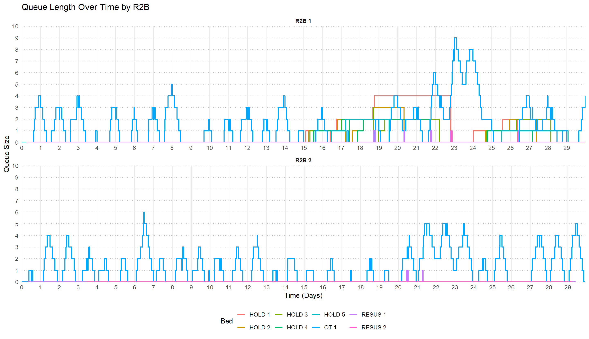
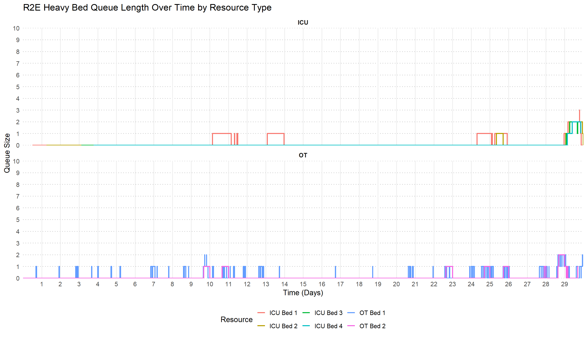

# Battlefield Casualty Handling

## Abstract

This study presents a Discrete Event Simulation (DES) framework developed to evaluate resource utilization and casualty processing within a deployed battlefield medical system under Large Scale Combat Operations (LSCO). Leveraging parameterized inputs published in open-access literature, the simulation models per-minute casualty arrivals, triage, and surgical throughput across Role 1 (R1), Role 2 Basic (R2B), and Role 2 Enhanced – Heavy (R2E Heavy) treatment nodes.

The model enables extended-duration analysis at varying scales, capturing key metrics such as queue lengths, wait times, and resource saturation to identify temporal bottlenecks and assess system suitability. A three-stage damage control surgery model is embedded within the simulation to reflect treatment pathways and operational constraints.

Findings demonstrate that the current system design is capable of managing moderate casualty volumes, historically represented by the Falklands conflict. However, the simulation reveals critical vulnerabilities in surgical capacity and evacuation throughput that would likely be exacerbated under LSCO conditions with greater casualty rates. The study identifies areas of risk, recommends targeted system refinements, and proposes enhancements to the simulation architecture—including dynamic DOW modelling, pulsed strategic evacuation, and stochastic mass-casualty events.

This tool supports iterative refinement and stakeholder engagement, offering a transparent, modular platform for testing health system resilience. With further development and testing against high-intensity casualty models, the simulation can inform doctrinal updates and guide medical planning for future operational environments.

## Contents

<small>[Return to Top](#contents)</small>

<!-- TOC START -->
- [Abstract](#abstract)
- [Contents](#contents)
- [📘 Introduction](#-introduction)
- [📚 Literature Review](#-literature-review)
  - [Methodology](#methodology)
  - [Findings](#findings)
    - [Battlefield Casualty Rates and Estimation Models](#battlefield-casualty-rates-and-estimation-models)
    - [Casualty Simulation and DES](#casualty-simulation-and-des)
    - [Statistical Distributions and Modelling Algorithms](#statistical-distributions-and-modelling-algorithms)
    - [Military Doctrine and Operational Health Support Policy](#military-doctrine-and-operational-health-support-policy)
- [🌍 Scenario Context](#-scenario-context)
- [🧰 Resource Descriptions](#-resource-descriptions)
  - [🏥Health Teams](#health-teams)
    - [Role 1 (R1) Treatment Team](#role-1-r1-treatment-team)
    - [Role 2 Basic (R2B)](#role-2-basic-r2b)
    - [Role 2 Enhanced Heavy (R2E Heavy)](#role-2-enhanced-heavy-r2e-heavy)
  - [🛏️ Bed Types](#-bed-types)
    - [Operating Theatre (OT)](#operating-theatre-ot)
    - [Resuscitation (Resus) (alternatively Emergency)](#resuscitation-resus-alternatively-emergency)
    - [Intensive Care Unit (ICU)](#intensive-care-unit-icu)
    - [Holding (Hold)](#holding-hold)
  - [🚑 Transport Assets](#-transport-assets)
    - [Protected Mobility Vehicle Ambulance (PMV Ambulance)](#protected-mobility-vehicle-ambulance-pmv-ambulance)
    - [HX2 40M](#hx2-40m)
- [📊 Environment Data Summary](#-environment-data-summary)
  - [👥 Population Groups](#-population-groups)
  - [🚑 Transport Resources](#-transport-resources)
  - [🏥 Medical Resources](#-medical-resources)
  - [Schedules and Rosters](#schedules-and-rosters)
- [🤕 Casualties](#-casualties)
  - [Casualty Generation](#casualty-generation)
    - [1. Lognormal Parameterisation](#1-lognormal-parameterisation)
    - [2. Per-Minute Rate Sampling and Scaling](#2-perminute-rate-sampling-and-scaling)
    - [3. Arrival Detection via Cumulative Sum](#3-arrival-detection-via-cumulative-sum)
    - [4. Temporal Randomisation](#4-temporal-randomisation)
  - [Wounded In Action (WIA)](#wounded-in-action-wia)
    - [Combat Casualties](#combat-casualties)
    - [Support Casualties](#support-casualties)
  - [Killed In Action (KIA)](#killed-in-action-kia)
    - [Combat Casualties](#combat-casualties)
    - [Support Casualties](#support-casualties)
  - [Disease and Non-Battle Injury (DNBI)](#disease-and-nonbattle-injury-dnbi)
    - [Combat Casualties](#combat-casualties)
    - [Support Casualties](#support-casualties)
    - [DNBI Sub-Categorisation](#dnbi-subcategorisation)
- [Casualty Priorities](#casualty-priorities)
- [Return to Duty](#return-to-duty)
- [Died of Wounds](#died-of-wounds)
- [Simulation Design](#simulation-design)
  - [🔧Simulation Environment Setup](#simulation-environment-setup)
  - [Core Trajectory](#core-trajectory)
  - [R2B Trajectory](#r2b-trajectory)
  - [R2E Heavy Trajectory](#r2e-heavy-trajectory)
- [Simulation Analysis](#simulation-analysis)
  - [Simulation Casualty Generation](#simulation-casualty-generation)
  - [R1 Handling](#r1-handling)
  - [R2B Handling](#r2b-handling)
  - [R2E Heavy Handling](#r2e-heavy-handling)
  - [Conclusion](#conclusion)
- [Further Development](#further-development)
- [Conclusion](#conclusion)
- [References](#references)
- [Other Resources](#other-resources)
  <!-- TOC END -->

---

## 📘 Introduction

<small>[Return to Top](#contents)</small>

Large‑scale combat operations (LSCO) represent the most demanding form of conventional warfare, characterised by high‑tempo, multi‑domain action against peer or near‑peer adversaries. Defined in contemporary doctrine such as extensive joint combat operations conducted at division (and above) scale to achieve strategic objectives, LSCO require the orchestration of manoeuvre, fires, logistics, intelligence, and command across vast, often nonlinear battlespaces [[1]](#References), [[2]](#References). Unlike the western experience in Middle-East conflicts, forces in LSCO will not have guaranteed air superiority, uncontested lines of communication, and predictable casualty flows. LSCO is expected to unfold in contested, degraded, and dynamic operational conditions [[1]](#References), [[2]](#References), [[3]](#References). Historical and contemporary case studies - from the industrial battlefields of the Second World War to recent fighting in Ukraine - demonstrate that such operations generate high casualty densities, impose unprecedented logistical demands, and challenge even the most sophisticated forces’ ability to sustain tempo over time [[2]](#References), [[4]](#References).

The medical implications of LSCO are profound. Estimates consistently project casualty volumes in the order of 50,000 to 60,000 per 100,000 personnel over a matter of weeks, with thousands of those potentially able to return to duty if treated effectively and without delay [[5]](#References). The deployed health system — encompassing point‑of‑injury care, medical evacuation, forward surgical capabilities, hospitalisation, force health protection, and medical command and control — is therefore not a peripheral service but a critical combat enabler. Its capacity to preserve fighting strength underpins the force’s ability to seize, retain, and exploit the initiative. In LSCO, battlefield clearance must be achieved despite contested airspace and disrupted communications, injury patterns will reflect the lethality of modern munitions, and medical logistics must adapt to disrupted supply chains and fluid front lines.

Yet, existing medical doctrine and force design have evolved largely from counterinsurgency campaigns where operational conditions were comparatively permissive [[5]](#References). In a peer‑conflict LSCO scenario, planners must expect prolonged field care, delays in evacuation, and the need for smaller, more mobile surgical teams positioned closer to the fight [[3]](#References), [[5]](#References). A resilient and agile, deployed health system serves not only to save lives, but to sustain operational momentum and, ultimately, to enable the successful prosecution of the campaign.

This thesis looks to explore the performance of the deployed health system within the through simulation with an eye to understanding its implications for participation in LSCO. By modelling casualty flows, evacuation timelines, treatment capacities, and return‑to‑duty rates, the study seeks to identify key vulnerabilities, and resource requirements. The simulation approach allows for the exploration of scenarios that are difficult to replicate in live exercises, offering evidence‑based insights to refine doctrine, optimise medical force posture, and ensure that health support is adequate for LSCO. In doing so, it contributes to the broader imperative of preparing the force for the realities of high‑intensity warfare in an era of renewed great‑power competition [[6]](#References), [[7]](#References).

## 📚 Literature Review

### Methodology

To inform the design and implementation of the battlefield casualty simulation, a structured literature review was conducted using a multi-pronged methodology. The initial phase involved surveying open-access academic literature and publicly available internet-based resources related to battlefield casualty modelling, discrete event simulation (DES), and casualty rate estimation. This was complemented by a snowballing technique, where references cited within key papers were recursively explored to identify additional relevant sources.

To further expand the scope and ensure coverage of emerging and less-indexed materials, large language models (LLMs) were engaged iteratively to identify supplementary resources. These included algorithmic approaches to casualty distribution modelling, comparative analyses of simulation paradigms, and operational insights into trauma system design under combat conditions. The use of LLMs enabled the discovery of niche publications, technical reports, and grey literature that may not have surfaced through conventional search techniques.

This academic and technical review was supplemented by a survey of publicly available military publications, including field manuals, operational health service support doctrine, and policy documents from allied defence organisations. These sources provided critical context for force structure, casualty flow assumptions, and the operational constraints that shape real-world medical planning.

### Findings

In total, 26 resources were reviewed to develop the simulation framework. These spanned peer-reviewed journals, technical reports, doctrinal publications, and internet publications. The review focused on four thematic domains:

#### Battlefield Casualty Rates and Estimation Models

Historical and predictive models of casualty rates were central to the review. The FORECAS system [[8]](#References) provided a statistically grounded approach to projecting wounded-in-action (WIA), killed-in-action (KIA), and disease/non-battle injury (DNBI) rates using empirical data from past conflicts. Complementary studies [[9]](#References), [[10]](#References), [[11]](#References) and [[12]](#References) highlighted the operational implications of casualty rates in LSCO, emphasizing the disproportionate impact of DNBI on lost duty days and the need for robust force health protection (FHP) strategies.

#### Casualty Simulation and DES

Simulation methodologies were explored through both military-specific and general DES literature. The simmer package for R [[13]](#References) was identified as a suitable framework for implementing modular, auditable, and event-driven logic. Studies such as [[14]](#References) demonstrated DES applications in healthcare contexts, while [[15]](#References) and [[4]](#References) provided high-level casualty rate numbers that allowed the evaluation of the performance of DES models and [[2]](#References) provided insights into trauma system design under combat conditions.
These sources informed the architectural decisions for the simulation engine, including event scheduling, resource constraints, and patient flow logic.

#### Statistical Distributions and Modelling Algorithms

The review examined statistical distributions suitable for modelling casualty arrival rates and treatment durations. FORECAS [[8]](#References) employed lognormal and exponential distributions based on battle intensity and troop type, validated through historical data. Additional studies [[16]](#References), [[11]](#References) and [[14]](#References) provided statistics, explored distribution models measures, and described other approaches using DES in medical care contexts.
These findings guided the selection of distribution functions for stochastic modelling, ensuring that simulated outputs reflect doctrinally plausible variability and temporal clustering.

#### Military Doctrine and Operational Health Support Policy

Doctrinal and policy publications such as [[1]](#References), [[3]](#References), [[6]](#References) and [[7]](#References) established the current geostrategic context and outlined the imperitive for militaries to be able to provide force options for LSCO. 
Recent doctrinal analyses [[9]](#References), [[2]](#References) and [[5]](#References) emphasized the shift toward prolonged casualty care, contested evacuation, and the need for distributed medical assets. These insights were incorporated into the simulation design to ensure alignment with contemporary operational realities.

This literature review enabled the design of a model suitable to support the assessment of the deployed health system capacity within LSCO.

## 🌍 Scenario Context

<small>[Return to Top](#contents)</small>

The simulation scenario models a deployed combat brigade's assigned health support capabilities. The design reflects the doctrinal organisation of deployed elements adapted to the operational requirements of LSCO. The simulated brigade is composed of three battlegroups, each commanded by one of the resident combat manoeuvre units. To ensure close health support at the point of need, each battlegroup is allocated `1` R1 treatment teams tasked with providing immediate clinical intervention and stabilisation in proximity to combat operations (for a total of `3` R1 treatment teams). These forward elements represent the first echelon of the deployed health system, capable of delivering life‑saving care under combat conditions.

In the second medical echelon, `2` Role 2 - Basic (R2B) facilities are established. Their function is to conduct damage control resuscitation and surgery, stabilising casualties before onward evacuation to higher‑level medical treatment facilities. Positioned to balance proximity to the fight with survivability, the R2B facilities serve as critical nodes in the casualty evacuation chain, extending the reach of forward treatment teams.

To provide robust surgical capability and greater depth of care, `1` Role 2 – Enhanced Heavy (R2E Heavy) hospital is sited to the rear. This facility is equipped to conduct complex surgical procedures, extended post‑operative care, and advanced diagnostic support. Its location optimises both the survivability of the asset and its accessibility to casualties moved from forward positions, thereby anchoring the brigade’s deployed medical architecture.

The organisational structure described above underpins the simulation’s logic for casualty generation, treatment timelines, and evacuation flows. A representative diagram illustrates the spatial and functional relationships between the brigade’s manoeuvre elements and its health support system, serving as the baseline model for subsequent scenario analysis.

An [Interactive Diagram](https://www.map.army/?ShareID=1041883&UserType=RO-xOMjf7j6) allows further exploration of the model being simulated.

---

## 🧰 Resource Descriptions

<small>[Return to Top](#contents)</small>

### 🏥Health Teams

#### Role 1 (R1) Treatment Team

A role 1 treatment team provides the first line of medical care. It is designed to deliver immediate lifesaving measures, perform triage and stabilization, and manage minor injuries and illnesses close to the point of injury or unit location. These teams also prepare casualties for evacuation to higher levels of care if needed.

#### Role 2 Basic (R2B)

A Role 2 Basic (R2B) medical treatment facility provides forward surgical and resuscitative care close to the battlefield. Its purpose is to deliver damage-control surgery, critical care, and short-term patient holding in austere environments where rapid intervention can save lives.

It’s designed to be mobile, logistically lean, and capable of stabilizing casualties before evacuation to higher-level care. With ICU beds, low-dependency holding, and a surgical team, R2B bridges the gap between frontline treatment and more comprehensive facilities like Role 2 Enhanced or Role 3.

#### Role 2 Enhanced Heavy (R2E Heavy)

A R2E Heavy facility delivers advanced surgical and critical care capabilities in forward-deployed military operations. Its purpose is to provide damage-control surgery, intensive care, inpatient services, and scalable resuscitation for casualties who require more than basic stabilization but are not yet ready for strategic evacuation.

The R2E Heavy is a static field hospital with designed to handle complex trauma, prolonged care, and high casualty volumes—bridging the gap between battlefield stabilization and full hospital-level treatment.

### 🛏️ Bed Types

#### Operating Theatre (OT)

OT beds are specialized surgical stations designed to support damage-control surgery and life-saving interventions. These beds are part of a sterile operating suite and are equipped to handle:

- Emergency trauma procedures.
- Advanced surgical care including orthopedic, abdominal, and thoracic operations.
- Integrated anesthesia and monitoring systems for patient stability.
- Rapid turnover and sterilization protocols to manage high casualty volumes.

#### Resuscitation (Resus) (alternatively Emergency)

Emergency beds are designed for rapid stabilization and life-saving interventions immediately after casualty arrival. These beds support:

- Advanced trauma management including airway control, hemorrhage control, and shock treatment.
- Critical monitoring and resuscitation equipment such as defibrillators, oxygen delivery systems, and IV access.
- Quick turnover and accessibility to facilitate high casualty throughput during mass casualty events.
- Integration with surgical and evacuation pathways, ensuring seamless transition to operating theatres or higher echelons of care.

These beds serve as the first stop for severely injured personnel.

#### Intensive Care Unit (ICU)

Intensive Care Unit (ICU) beds are designed to deliver advanced life-support and continuous monitoring for critically injured or ill personnel. These beds serve as the backbone of forward-deployed critical care, enabling:

- Resuscitation and stabilization of casualties with multi-system trauma.
- Mechanical ventilation, invasive monitoring, and medication infusions.
- Postoperative care following damage-control surgery.
- Support for prolonged field care when evacuation is delayed.

ICU beds are equipped with portable monitors, ventilators, infusion pumps, and access to diagnostics like labs and imaging.

#### Holding (Hold)

Holding beds are designated for short-term patient care and observation, typically for those who are awaiting evacuation, recovering from minor procedures, or expected to return to duty soon. These beds serve as a transitional space between acute treatment zones (like ICU or OT) and final disposition—whether that’s evacuation to higher care or reintegration into the force.

They’re often used for:

- Postoperative recovery after damage-control surgery.
- Monitoring stable patients who don’t require intensive care.
- Staging casualties for medical evacuation.
- Low-dependency care such as hydration, pain management, or wound dressing.

Holding beds help to maintain patient flow and prevent bottlenecks in critical care areas.

### 🚑 Transport Assets

#### Protected Mobility Vehicle Ambulance (PMV Ambulance)

The PMV Ambulance (Protected Mobility Vehicle – Ambulance) is a blast-resistant, armored medical transport designed to safely evacuate casualties from combat zones. Based on the Bushmaster, it combines mobility, protection, and medical capability, allowing medics to deliver care en route while shielding patients from small arms fire, IEDs, and mines.

#### HX2 40M

The HX2 40M is a 4×4 tactical military truck developed by Rheinmetall MAN Military Vehicles (RMMV) as part of the HX2 series. Designed for high mobility and rugged performance, it serves as a versatile logistics platform for transporting troops, equipment, and supplies in demanding operational environments. In this simulation the HX2 40M is used for the transport of KIA and casualties that have DOW.

---

## 📊 Environment Data Summary

<small>[Return to Top](#contents)</small>

<!-- ENV SUMMARY START -->
<!-- This section is auto-generated. Do not edit manually. -->

### 👥 Population Groups

The following population groups are defined in the simulation environment:

| Population | Count |
|------------|-------|
| Combat | 2500 |
| Support | 1250 |

### 🚑 Transport Resources

These are the available transport platforms and their characteristics:

| Platform | Quantity | Capacity |
|----------|----------|----------|
| PMVAMB | 3 | 4 |
| HX240M | 4 | 50 |

### 🏥 Medical Resources

The following table summarises the medical elements configured in `env_data.json`, including team types, personnel, and beds:

| Element | Quantity | Beds | 1 | Surg | Emerg | Icu | Evac |
| --- | --- | --- | --- | --- | --- | --- | --- |
| R1 | 3 | NA | Medic (3), Nurse (1), Doctor (1) | NA | NA | NA | NA |
| R2B | 2 | OT (1); Resus (2); ICU (2); Hold (5) | NA | Anesthetist (1), Surgeon (2), Medic (1) | Facem (1), Nurse (3), Medic (1) | Nurse (2), Medic (2) | Medic (2) |
| R2EHEAVY | 1 | OT (2); Resus (4); ICU (4); Hold (30) | NA | Anesthetist (1), Surgeon (2), Nurse (4) | Facem (1), Nurse (3), Medic (1) | Intensivist (1), Nurse (4) | Medic (2) |

<!-- ENV SUMMARY END -->

### Schedules and Rosters

Some resource teams have rosters/schedules. Due to the limited size and structure, surgical teams are rostered as available for12 hour shifts. This results in there being 12 hours of time available for surgery at the R2B in every 24 hours and 36 hours of surgery time available in every 24 hours across two OT in the R2E Heavy. 

---

## 🤕 Casualties

<small>[Return to Top](#contents)</small>

Casualties are generated based on rates outlined in [[8]](#References) and refined with analysis provided in [[10]](#References) and supported by [[15]](#References), with the implementation outlined below.

Initially, WIA and KIA rates from US historical analysis of the Battle of Okinawa were used [[8]](#References), producing approximately 30 casualties per day for a force size of 3,750, yielding a casualty rate of ~0.8%. By comparison, Russia’s estimated 700-1,100 daily casualties from a committed force of 450,000–600,000 in Ukraine imply a lower casualty rate of ~0.2% [[4]](#References).

Given this discrepancy, a planning baseline was re-evaluated using historical data from the Falklands War, which suggests a casualty rate of ~0.37% [[8]](#References). This adjustment accounts for both the likely under-reporting in Russian casualty estimates, particularly of non-critical wounded personnel and over three years of varied combat intensity in Ukraine, with seasonal fluctuations in operational tempo (source TBD).

Based on this reasoning, a daily casualty rate of ~0.37% is considered a suitable estimate for operational planning.

### Casualty Generation

For simulation efficiency, arrival times for cases were pre-computed and then introduced deterministically to the simulation environment for processing. The function simulates the timing of casualty arrivals using a lognormal distribution to reflect daily variability, transformed into randomized, minute-level arrival times. Rather than sampling explicit arrival times, the function models continuous per-minute intensity and converts this to discrete arrival events using cumulative thresholds. The general process is outlined below.

#### 1. Lognormal Parameterisation

Converts daily mean and standard deviation into log-space parameters, preserving the shape of the empirical distribution.

Mean (log-space):

$$
\mu_{\log} = \ln\left(\frac{\mu^2}{\sqrt{\sigma^2 + \mu^2}}\right)
$$

Standard deviation (log-space):

$$
\sigma_{\log} = \sqrt{\ln\left(1 + \frac{\sigma^2}{\mu^2}\right)}
$$

Where:

- \mu = expected number of DNBI casualties per day
- \sigma = daily standard deviation

#### 2. Per-Minute Rate Sampling and Scaling

Draws lognormally distributed samples representing per-minute DNBI rates, capped at a specified threshold to prevent extreme outliers. The sample is scaled according to population size and temporal resolution (per minute per 1000 personnel).

For each simulation minute $i \in \{1, 2, \dots, n_{\text{minutes}}\}$, the per-minute DNBI rate is computed as:

$$
r_i = \min\left(x_i, \text{cap}\right) \times \frac{P}{1000 \times 1440}
$$

Where:

- $x_i \sim \text{LogNormal}(\mu_{\log}, \sigma_{\log}^2)$
- $\mu_{\log} = \ln\left(\frac{\mu^2}{\sqrt{\sigma^2 + \mu^2}}\right)$
- $\sigma_{\log} = \sqrt{\ln\left(1 + \frac{\sigma^2}{\mu^2}\right)}$
- $\mu, \sigma$ = daily mean and standard deviation
- $\text{cap}$ = upper bound (e.g., 5) to prevent extreme values
- $P$ = population size (support or combat)
- $r_i$ = scaled and capped casualty rate for minute i

#### 3. Arrival Detection via Cumulative Sum

Accumulates per-minute rates and detects new arrivals based on when the cumulative total crosses each whole casualty threshold.

Let R = \{r_1, r_2, \dots, r_N\} be the per-minute rates. Then the cumulative sum is:

$$
C_i = \sum_{j=1}^{i} r_j
$$

An arrival is triggered at time i if:

$$
\lfloor C_i \rfloor > \lfloor C_{i-1} \rfloor
$$

This captures each increment in the expected arrival count.

#### 4. Temporal Randomisation

Introduces sub-minute jitter to avoid clustering arrivals on discrete time ticks and returns a sorted list of event timestamps.

### Wounded In Action (WIA)

#### Combat Casualties

Combat WIA casualty generation has been based on Falklands combat troop WIA rates ([[a8]](#References), table A.8 p32).

$$
\mu = 1.77, \quad \sigma = 3.56
$$

#### Support Casualties

Support casualties employ the same casualty generation outlined above (except using the support population estimate of 1250 instead of the combatt population of 2250). This is on the basis that most historical modelling of force casualties include support elements at or below division in division and below casualty estimation due to their integral nature to combat operations and close proximity to the Forward Edge of the Battle Area (FEBA) (see [[15]](#References) and [[10]](#References) p 2-4).

### Killed In Action (KIA)

#### Combat Casualties

Combat WIA casualty generation has been based on Falklands combat troop WIA rates ([[8]](#References), table A.8 p32).

$$
\mu = 0.68, \quad \sigma = 1.39
$$

#### Support Casualties

Similar to WIA, support casualty KIA employ the same casualty generation outlined above (except using the support population estimate of 1250 instead of the combatt population of 2250) (see [[15]](#References) and [[10]](#References) p 2-4).

### Disease and Non-Battle Injury (DNBI)

#### Combat Casualties

Combat DNBI casualty generation has been based on Vietnam combat troop DNBI rates ([[8]](#References), table A.5 p31).

$$
\mu = 2.04, \quad \sigma = 1.89
$$

#### Support Casualties

Support DNBI casualty generation has been based on Okinawa support troop DNBI rates ([[8]](#References), table A.2 p29).

$$
\mu = 0.94, \sigma = 0.56
$$

#### DNBI Sub-Categorisation

DNBI cases were further sub-categorised as either NBI or disease/battle fatigue with 17% of DNBI cases being allocated as NBI and the remainder disease or battle fatigue (per [[8]](#References), pp 22-23).

## Casualty Priorities

<small>[Return to Top](#contents)</small>

The following casualty priority rates were used with the rates requiring surgery (informed by [[17]](#References)):

- **Priority 1**. 65% of casualties with 90% requiring surgery.

- **Priority 2**. 20% of casualties with 80% requiring surgery.

- **Priority 3**. 15% of casualties with:
  
  - 40% of DNBI requiring surgery.
  
  - 60% of other priority 3 casualties requiring surgery. 

## Return to Duty

<small>[Return to Top](#contents)</small>

- Priority 3 are returned to duty from R1. Priority 1 and 2 that do not require surgery are RTF post recovery from emergency treatment at r2b.

- Per [[9]](#References), of those admitted to MTFs, the distribution for return to duty was 42.1 percent in Republic of Vietnam, 7.6 percent in the U.S. Indo-Pacific Command, and 33.4 percent in the CONUS.

## Died of Wounds

<small>[Return to Top](#contents)</small>

5% of Priority 1 and 2.5% of P2 at R1, 1% of arrivals at R2B, 1% of arrivals ar R2E Heavy

---

## Simulation Design

<small>[Return to Top](#contents)</small>

The simulation is built as a Discrete Event Simulation (DES), it is written in R  using the simmer package [[13]](#References). DES has been used as a proven way to simulate healthcare systems and support healthcare decision-making (as shown in [[14]](#References)).

### 🔧Simulation Environment Setup

The simulation models casualty handling across echelons of care in a battlefield environment, structured around modular trajectories and dynamic resource availability. It operates within a discrete-event simulation framework using `simmer`, and is driven by probabilistic rates, conditional branching, and resource interactions across Role 1 (R1), Role 2 Basic (R2B), and Role 2 Enhanced Heavy (R2E) facilities.

The simulation was designed around the general functions of each role of health element as outlined in the diagram below. Where roles overlap they are able to provide the same functions to varying degree. The diagram below provides an outline of the role and function design applied for this simulation using the three-stage Damage Control Surgery (DCS) model of care described in [[18]](#References) and [[19]](#References).

The simulation heavily uses triangular distributions to model the duration of activities undertaken in the model (treatment, transport and other handling tasks). A triangular distributions was employed as they are generally used when the underlying distribution is unknown, but a minimal value, some maximal value, and a most likely value are available [[16]](#References). This approach is similar to other applications of DES in clinical settings, as shown in [[14]](#References). 

---

### Core Trajectory

The casualty processing trajectory at R1 care establishes a dynamic and doctrinally aligned framework for routing battlefield casualties based on classification—wounded in action (WIA), disease/non-battle injury (DNBI), or killed in action (KIA). Each casualty is initialized with key attributes: assignment to a R1 team (via random selection), triage priority for WIA/DNBI based on weighted probabilities (priority 1-3) per [[17]](#References), NBI status flagged with a ``17%`` probability [[8]](#References), and a probabilistic determination of surgical need based on casualty type and severity [[17]](#References). WIA and DNBI casualties are determined if they have died-of-wounds (DOW) with probabilistic allocation of DOW for Priority 1 and Priority 2 cases ``5%`` DOW chance for Priority 1 and ``2.5%`` for Priority 2 casualties (estimate based on reporting in [[12]](#References)). Those flagged as DOW are reclassified and routed through KIA processing. 

Survivors are dispositioned based on urgency: evacuation decisions for Priority 1 and Priority 2 cases result in approximately ``95%`` of Priority 1 and ``90%`` of Priority 2 casualties advancing (based on estimates of casualty surgical requirement from [[17]](#References)) to R2B, or bypassing to R2E if R2B teams are unavailable. Lower-priority or DNBI casualties not meeting evacuation criteria are retained for local recovery at the R1, with a recovery duration modeled using triangular distribution with ``min = 0.5``, ``max = 5``, and ``mode = 2`` (days), based on field estimates of minor injury convalescence. WIA and DNBI casualties receiving immediate treatment at R1 are assigned a treatment duration drawn from a triangular distribution with ``min = 10``, ``max = 30``, and ``mode = 20`` (minutes) per [[20]](#References). KIA casualties bypass clinical treatment and are processed and transported, each having a processing duration with a triangular distribution: ``min = 15``, ``max = 45``, and ``mode = 30`` (minutes).

### R2B Trajectory

Casualties routed to the R2B undergo surgical care, stabilization, and further dispositioning. Casualties are initially assigned a holding bed, until they can be transferred to a resuscitation bed.

Similar to the R1, where DOW occurs (~1% of arrivals at the R2B, again based on [[12]](#References)), casualties undergo a short treatment and are transported to the mortuary. Treatment and transport both use a duration with a triangular distribution: `min = 15`, `max = 45`, and `mode = 30` (minutes).

Resuscitation is modeled using a triangular distribution with ``min = 25``, ``max = 70``, and ``mode = 45`` (min). This distribution was developed based on estimates as there were no clear durations that could be identified in literature for the duration to be used for the resuscitation/emergency phase of treatment in R2 facilities. Instead, the likely/anticipated tasks required to be undertaken in this phase were collated with task duration estimates collated to produce estimates for use in the simulation (demonstrated in the table below). The durations were developed recognising the need for all activities to be completed within 90 min as indicated by [[21]](#References).

| Long Resuscitation       |           |            |           |
| ------------------------ | --------- | ---------- | --------- |
| Step                     | Min (min) | Mode (min) | Max (min) |
| Hemorrhage Control       | 2         | 5          | 10        |
| IV/IO Access             | 2         | 5          | 10        |
| TXA Administration       | 10        | 10         | 15        |
| Fluid Resuscitation      | 5         | 10         | 20        |
| Airway/Breathing Support | 3         | 5          | 10        |
| TBI Monitoring & Warming | 2         | 5          | 10        |
| Documentation/Prep       | 2         | 3          | 5         |
| **TOTAL**                | 25        | 45         | 70        |

Once resuscitation/emergency treatment has been completed, casualties not requiring surgery are transferred to a holding bed for recovery. Recovery follows a triangular distribution with ``min = 0.5``, ``max = 10``, and ``mode = 5`` (days).

Next, surgical candidacy is assessed based on operating theatre (OT) bed availability. If capacity permits, patients requiring surgery are transferred to an operating theatre for damage control (DAMCON) surgery. The DAMCON surgery treatment duration is modeled using a triangular distribution with ``min = 41``, ``max = 210``, and ``mode = 95`` (minutes). Due to the variability of potential requirements for surgery it was difficult to identify reliable durations for surgery time. This distribution was developed based on the interpretation of several meta studies ([[18]](#References), [[22]](#References) and [[23]](#References)). Where there is not OT capacity, casualties are evacuated to the R2E for handling. 

Casualties requiring further care (surgery following the DCS model described in [[18]](#References) and [[19]](#References)) are evacuated to the R2E. The duration for evacuation to the R2E follows a triangular distribution with ``min = 15``, ``max = 45``, and ``mode = 30``. Where evacuation resources are not available, the patient is transferred to the ICU until evacuation resources are available to facilitate transfer.

### R2E Heavy Trajectory

The R2E facility serves as a critical node for advanced casualty management, including resuscitation, surgery, intensive care, holding and pathways to strategic evacuation. 

Upon arrival, casualties are triaged, those identified as DOW (~1%, based on [[12]](#References)) are transferred for mortuary handling. Surviving casualties are allocated to an initial holding bed until a resuscitation bay is available, where they undergo a resuscitation phase. Where previous resuscitation has not been completed (at the R2B) a long duration resuscitation is completed, otherwise a short resuscitation is completed. The R2E long duration resuscitation follows the triangular distribution estimated for R2B resuscitations (`min = 25`, `max = 70`, and `mode = 45` (min)). The short duration resuscitation is modelled based on task estimate durations. These times are outlined in the table below. The duration uses a triangular distribution with ``min = 13``, ``max = 55``, and ``mode = 28``.

| Short Reuscitation       |           |            |           |
| ------------------------ | --------- | ---------- | --------- |
| Step                     | Min (min) | Mode (min) | Max (min) |
| Hemorrhage Control       | 2         | 5          | 10        |
| IV/IO Access             | 2         | 5          | 10        |
| Fluid Resuscitation      | 5         | 10         | 20        |
| TBI Monitoring & Warming | 2         | 5          | 10        |
| Documentation/Prep       | 2         | 3          | 5         |
| **TOTAL**                | 13        | 28         | 55        |

On completion of resuscitation, surgical candidacy is then assessed: if the casualty is flagged for damage control surgery and operating theatre resources are available, procedures follow the same triangular distribution for DAMCON surgeries at the R2B (``min = 41``, ``max = 210``, and ``mode = 95``), derived from meta-analyses and other academic studies ([[18]](#References), [[22]](#References), and [[23]](#References)). 

Post-operative care involves admission to the ICU, where durations vary by surgical phase: the first ICU period ranges from ``min = 770`` to ``max = 2160`` minutes (``mode =  1440``) based on descriptions of post- DCS-I stabilization requirements (described as 24-36 h in most DCS research [[18]](#References), [[24]](#References), [[25]](#References), [[26]](#References)), while the secondary ICU phase (following second surgery) ranges from ``min = 30`` to ``mode = 90``, with ``mode = 60`` (min) to allow for post surgery monitoring and stabilisation prior to transfer to holding. Casualties who arrive at the R2E requiring surgery, but not having received any prior to arrival are queued to complete a second round of surgery after ICU time. 

After completing surgery and ICU monitoring, patients are either transferred to holding for recovery or undertake strategic evacuation. ~10% of casualties undertake recovery at the R2E following a triangular distribution for recovery time with ``min = 1``, ``max = 21``, and ``mode = 9`` (days) this distribution was selected on the basis that casualties with shorter recovery times and a likelihood for capacity to return to duty following recovery would be retained in theatre. The remaining ~90% are transferred for strategy evacuation. Based on [[9]](#References) Vietnam data that indicated 31% return to duty with 42% in theatre providing about 13% recovery in theatre at R2E

---

## Simulation Analysis

### Simulation Casualty Generation

This section presents a detailed breakdown of casualty source data captured from a single simulation run using seed 42, spanning a 30-day operational duration. The data is analyzed through the lens of deployed health system design, highlighting implications for medical resource allocation, evacuation planning, and treatment capacity across Role 1 and Role 2 facilities.

| Casualty Type | Population Source | 1   | 2   | 3   | 4   | 5   | 6   | 7   | 8   | 9   | 10  | 11  | 12  | 13  | 14  | 15  | 16  | 17  | 18  | 19  | 20  | 21  | 22  | 23  | 24  | 25  | 26  | 27  | 28  | 29  | 30  | total |
|:------------- |:----------------- | ---:| ---:| ---:| ---:| ---:| ---:| ---:| ---:| ---:| ---:| ---:| ---:| ---:| ---:| ---:| ---:| ---:| ---:| ---:| ---:| ---:| ---:| ---:| ---:| ---:| ---:| ---:| ---:| ---:| ---:| -----:|
| dnbi          | cbt               | 4   | 5   | 5   | 4   | 5   | 4   | 5   | 5   | 5   | 4   | 5   | 5   | 4   | 5   | 5   | 5   | 5   | 4   | 5   | 5   | 4   | 5   | 5   | 5   | 4   | 5   | 4   | 5   | 5   | 5   | 141   |
| dnbi          | spt               | 1   | 1   | 1   | 1   | 1   | 2   | 1   | 1   | 1   | 1   | 1   | 2   | 1   | 1   | 1   | 1   | 2   | 1   | 1   | 1   | 1   | 1   | 2   | 1   | 1   | 1   | 1   | 1   | 1   | 2   | 35    |
| kia           | cbt               | 1   | 2   | 1   | 2   | 1   | 2   | 2   | 1   | 2   | 2   | 1   | 2   | 1   | 2   | 2   | 1   | 2   | 1   | 2   | 1   | 2   | 2   | 1   | 2   | 1   | 2   | 1   | 2   | 1   | 2   | 47    |
| kia           | spt               | 0   | 1   | 1   | 1   | 0   | 1   | 1   | 1   | 1   | 0   | 1   | 1   | 1   | 1   | 0   | 1   | 1   | 1   | 1   | 0   | 1   | 1   | 1   | 1   | 0   | 1   | 1   | 1   | 1   | 0   | 23    |
| wia           | cbt               | 3   | 4   | 3   | 3   | 4   | 3   | 4   | 3   | 4   | 3   | 4   | 3   | 4   | 3   | 3   | 4   | 4   | 3   | 4   | 3   | 4   | 3   | 3   | 4   | 3   | 4   | 3   | 4   | 3   | 4   | 104   |
| wia           | spt               | 1   | 2   | 2   | 1   | 2   | 2   | 2   | 1   | 2   | 2   | 1   | 2   | 2   | 1   | 2   | 2   | 2   | 1   | 2   | 2   | 1   | 2   | 2   | 2   | 1   | 2   | 2   | 1   | 2   | 2   | 51    |
| Total         |                   | 10  | 15  | 13  | 12  | 13  | 14  | 15  | 12  | 15  | 12  | 13  | 15  | 13  | 13  | 13  | 14  | 16  | 11  | 15  | 12  | 13  | 14  | 14  | 15  | 10  | 15  | 12  | 14  | 13  | 15  | 401   |

The table above presents a summary of the simulated casualty data generated across three primary categories Wounded in Action (WIA), Killed in Action (KIA), and Disease and Non-Battle Injury (DNBI), with their source population: combat forces and support forces. A total of 401 casualties were recorded, with combat elements accounting for the majority (292), reflecting their higher exposure to operational risk. DNBI emerged as the most frequent casualty type (176 cases), underscoring the persistent burden of non-combat medical conditions even in high-intensity environments. This aligns with historical data indicating that DNBI can rival or exceed battle injuries in terms of lost duty days and medical resource consumption.

WIA cases totaled 155, with a notable skew toward combat personnel (104 vs. 51) as a result of the force ratios present within the simulation. These casualties typically require multi-echelon care, including resuscitation, surgical intervention, and post-operative holding, placing sustained demand on Role 1 and Role 2 facilities. KIA figures were lower (70 total).

From a health system planning perspective, this data implies a need for scalable treatment capacity, robust DNBI mitigation strategies, and distributed surgical capability. The consistent casualty generation across periods suggests a steady operational tempo, requiring continuous staffing, replenishment of medical supplies, and resilient evacuation pathways.

| Population Source | 1   | 2   | 3   | 4   | 5   | 6   | 7   | 8   | 9   | 10  | 11  | 12  | 13  | 14  | 15  | 16  | 17  | 18  | 19  | 20  | 21  | 22  | 23  | 24  | 25  | 26  | 27  | 28  | 29  | 30  | total |
|:----------------- | ---:| ---:| ---:| ---:| ---:| ---:| ---:| ---:| ---:| ---:| ---:| ---:| ---:| ---:| ---:| ---:| ---:| ---:| ---:| ---:| ---:| ---:| ---:| ---:| ---:| ---:| ---:| ---:| ---:| ---:| -----:|
| cbt               | 8   | 11  | 9   | 9   | 10  | 9   | 11  | 9   | 11  | 9   | 10  | 10  | 9   | 10  | 10  | 10  | 11  | 8   | 11  | 9   | 10  | 10  | 9   | 11  | 8   | 11  | 8   | 11  | 9   | 11  | 292   |
| spt               | 2   | 4   | 4   | 3   | 3   | 5   | 4   | 3   | 4   | 3   | 3   | 5   | 4   | 3   | 3   | 4   | 5   | 3   | 4   | 3   | 3   | 4   | 5   | 4   | 2   | 4   | 4   | 3   | 4   | 4   | 109   |
| Total             | 10  | 15  | 13  | 12  | 13  | 14  | 15  | 12  | 15  | 12  | 13  | 15  | 13  | 13  | 13  | 14  | 16  | 11  | 15  | 12  | 13  | 14  | 14  | 15  | 10  | 15  | 12  | 14  | 13  | 15  | 401   |

The second table provides a breakdown of the casualty population by source: combat forces (cbt) and support forces (spt). Of the 401 total casualties generated, 292 (approximately 73%) originated from combat elements, while 109 (27%) were drawn from support units. This distribution reflects the total population breakdown of the organisation. The consistent presence of support force casualties across all periods underscores the vulnerability of rear-area personnel in LSCO environments, particularly under conditions of indirect fire, degraded situational awareness, and disrupted medical evacuation. The temporal spread of casualties shows a relatively stable operational tempo, with total casualties per period ranging from 10 to 16. 

From a health system perspective, this data reinforces the need for distributed medical coverage that includes both forward and rear-area assets. Role 1 treatment teams must be positioned to respond rapidly to combat casualties, while Role 2 facilities must be capable of absorbing and triaging support force casualties who may present with different injury profiles, including DNBI and delayed trauma. The consistent casualty burden across both populations highlights the importance of scalable capacity, flexible evacuation pathways, and robust command and control to ensure timely treatment and prevent bottlenecks in casualty flow.

| Priority | 1   | 2   | 3   | 4   | 5   | 6   | 7   | 8   | 9   | 10  | 11  | 12  | 13  | 14  | 15  | 16  | 17  | 18  | 19  | 20  | 21  | 22  | 23  | 24  | 25  | 26  | 27  | 28  | 29  | 30  | total |
|:-------- | ---:| ---:| ---:| ---:| ---:| ---:| ---:| ---:| ---:| ---:| ---:| ---:| ---:| ---:| ---:| ---:| ---:| ---:| ---:| ---:| ---:| ---:| ---:| ---:| ---:| ---:| ---:| ---:| ---:| ---:| -----:|
| Pri 1    | 7   | 9   | 5   | 6   | 6   | 6   | 9   | 6   | 10  | 7   | 8   | 8   | 5   | 8   | 7   | 8   | 8   | 6   | 6   | 6   | 5   | 8   | 6   | 10  | 7   | 7   | 6   | 4   | 7   | 6   | 207   |
| Pri 2    | 1   | 2   | 4   | 1   | 4   | 4   | 2   | 1   | 1   | 1   | 1   | 3   | 6   | 1   | 3   | 2   | 2   | 2   | 4   | 3   | 3   | 1   | 5   | 2   | 1   | 4   | 2   | 4   | 1   | 5   | 76    |
| Pri 3    | 1   | 1   | 2   | 2   | 2   | 1   | 1   | 3   | 1   | 2   | 2   | 1   | 0   | 1   | 1   | 2   | 3   | 1   | 2   | 2   | 2   | 2   | 1   | 0   | 1   | 1   | 2   | 3   | 3   | 2   | 48    |
| KIA      | 1   | 3   | 2   | 3   | 1   | 3   | 3   | 2   | 3   | 2   | 2   | 3   | 2   | 3   | 2   | 2   | 3   | 2   | 3   | 1   | 3   | 3   | 2   | 3   | 1   | 3   | 2   | 3   | 2   | 2   | 70    |
| Total    | 10  | 15  | 13  | 12  | 13  | 14  | 15  | 12  | 15  | 12  | 13  | 15  | 13  | 13  | 13  | 14  | 16  | 11  | 15  | 12  | 13  | 14  | 14  | 15  | 10  | 15  | 12  | 14  | 13  | 15  | 401   |

Of the total casualties, 207 (51.6%) were classified as Priority 1, representing patients requiring immediate life-saving intervention. This dominant category underscores the doctrinal necessity of forward-positioned Role 1 assets capable of rapid triage and stabilization. The consistent presence of Priority 1 cases across all 30 days suggests a sustained high-acuity burden, reinforcing the need for scalable throughput 

Priority 2 and Priority 3 casualties accounted for 76 (19.0%) and 48 (12.0%) cases respectively. These patients typically require delayed or routine care. The simulation also generated 70 KIA cases (17.5%), distributed evenly across the operational timeline. While these cases do not contribute to medical workload substantially, their operational implications are significant.

From a systems design perspective, the acuity profile derived from this simulation reinforces several key imperatives:

- Role 1 facilities must be optimized for high-throughput triage and stabilization, with emphasis on rapid evacuation of Priority 1 cases.
- Role 2 facilities requires flexible bed space and surgical capability to absorb cases, especially during sustained operations.
- Evacuation architecture must support continuous movement of mixed-acuity casualties, with prioritization protocols and redundancy to ensure resilience.

### R1 Handling

Role 1 facilities consistently demonstrated the ability to process casualties without delay, with all patients receiving immediate triage and treatment on arrival. The absence of queuing reflects both adequate staffing and appropriately scaled treatment capacity relative to the casualty inflow modelled. Rapid handling times ensured that Priority 1 cases could be stabilised and evacuated without degradation in clinical status, while lower‑priority cases were managed and prepared for movement in line with requirements. However, the model does not currently fully represent the limitations in availability of evacuation assets, as a result, throughput at the Role 1 was not constrained by evacuation availability, allowing continuous casualty flow to higher‑echelon care and preventing downstream bottlenecks in the system which may bear out with the introduction of more detailed modelling of evacuation. Despite this, the performance underscores the critical function of Role 1 as an agile, forward medical capability able to maintain momentum under sustained operational tempo.

### R2B Handling

The plot below outlines a summary of the casualty handling at the R2B. The data indicates a system that is generally well-balanced, handling a substantial number of the casualties generated within the simulation every day. 

Daily casualty treatments at R2B 1 and R2B 2 show saw-tooth cycles in queuing for OT (shown in the plots below) returning to zero in the vast majority of days. Of note, the 12-hour availability window for the single surgical team in each R2B is likely to substantially impact this saw-toothing. The development of models to support the ongoing availability of the R2B OT is likely to see substantial improvement in overall system capacity with relatively modest resource investment. The majority of casualties processed through the deployed health system receive treatment at the R2B, confirming that the two-node configuration is effective for the medical demand without excessive reliance on direct bypass to a higher echelon of health care.

### R2E Heavy Handling

The R2E Heavy reveals a complex interaction between critical care saturation, surgical throughput, and the utilisation of downstream holding capacity. ICU queues displayed sustained and system‑wide congestion during several periods, most notably between Days 11–13 and Days 26–29, where as many a number of patients were awaiting critical care. Such peaks are consistent with high‑acuity casualty streams in LSCO and prolonged ICU lengths of stay, both of which constrain turnover rates. Under these conditions, surgical throughput is at risk, as post‑operative patients may be delayed in theatre or recovery pending ICU availability, potentially increasing morbidity and mortality. This dynamic underscores the vulnerability of the R2E Heavy’s ICU provision to operational surges and the need for either expanded critical care capacity or well‑rehearsed transfer protocols to higher‑echelon or other health facilities.

Operating Theatre (OT) queues at the R2E Heavy were shorter and less frequent than ICU queues, rarely exceeding two patients per theatre; however, they were almost continuously present throughout the simulation. This pattern suggests the surgical component was operating at or near full capacity, with minimal slack to absorb unplanned casualty spikes. When examined in system context, the combined OT capacity of two Role 2 Basic (R2B) elements and one R2E Heavy appears sufficient to support a single combat brigade under conditions modelled on the Falklands casualty rates [[8]](#References). Yet, if this deployed health system was applied to a deployed division it would be grossly insufficient, even if only one brigade was assumed to be in contact at any time. With no other changes to casualty rates with an increased force, DNBI rates for a the further deployed force of a division would exceed the limited excess capacity that is observed in this system. Furthermore, the modelled scenario does not account for mass‑casualty events or the elevated casualty production rates reported in FORECAS modelling of campaigns such as Okinawa, or Vietnam both of which would further expose this deficit [[8]](#References).

Analysis of other treatment capacities revealed significant underutilisation in certain areas. Two resuscitation beds were unused throughout the simulation, while sixteen holding beds saw no occupancy at all. This imbalance offers an opportunity to reallocate resources—either through expansion of OT capacity at the R2E Heavy or by modifying holding policy to increase the proportion of in‑theatre recoveries beyond the ten percent modelled in the simulation. A higher return‑to‑duty rate within theatre could alleviate the burden on higher‑echelon facilities and improve the overall force operational viability period.

Taken together, the simulation outputs indicate that the R2E Heavy’s primary limiting factor is OT availability, with ICU capacity representing a secondary but significant constraint. Both could be mitigated through deliberate rebalancing of underused bed spaces and by modelling scenarios that better reflect LSCO surge conditions. Forward Role 2 Basic nodes remain a critical component in modulating the demand placed upon the R2E Heavy, highlighting the importance of integrated patient flow monitoring, robust surge protocols, and synchronised scheduling across all surgical and critical care assets. Without such measures, even sustained baseline performance offers little resilience to the shock of high‑intensity operational realities.

### Conclusion

The single run analysis, viewed in its entirety, demonstrates that while the modelled deployed health system is capable of sustaining a steady operational tempo for a single brigade under baseline casualty assumptions (using casualty models derived from the Falklands war), it operates with little reserve and exhibits critical vulnerabilities under higher‑demand conditions. Role 1 elements show sufficient responsiveness and throughput, and the dual‑node R2B configuration effectively absorbs the majority of cases without systemic reliance on bypass to higher care. However, the R2E Heavy emerges as a structural bottleneck, with surgical and ICU capacity constraints that would be rapidly overwhelmed in the event of divisional‑level operations, mass‑casualty incidents, or casualty rates on par with historical LSCO campaigns with more substantial casualty rates such as Okinawa or Vietnam.

Underutilisation of resuscitation and holding beds indicates scope for resource reallocation or policy changes to increase in‑theatre recovery and return‑to‑duty rates, thereby reducing pressure on constrained surgical and critical care assets. Without such adjustments, the system’s ability to absorb prolonged surges, manage high‑acuity case‑mixes, and maintain operational tempo would be severely limited.

Ultimately, the findings reinforce that effective LSCO medical support cannot rely solely on baseline performance metrics. Instead, it must be built on a foundation of scalable capacity, adaptable evacuation architecture, and dynamically balanced resource distribution between Roles 1, 2B, and 2E Heavy. By integrating these design principles into future modelling and force development, the deployed health system will be better positioned to sustain combat effectiveness across the full spectrum of operational intensity.

---

## Further Development

The single run analysis has demonstrated that while the current simulation framework offers a credible baseline for evaluating deployed health system performance under brigade-level LSCO conditions, several areas warrant further development to improve the accuracy of the model and enhance the analysis from it.

One immediate opportunity lies in expanding the modelling of transport resources to include return journeys—commonly referred to as "dead-heading". The current simulation assumes unidirectional casualty movement, which underestimates the logistical burden and resource consumption associated with evacuation cycles. Incorporating return legs would allow for more accurate scheduling, asset availability tracking, and fuel or crew fatigue modelling, all of which are critical in contested or extended operational environments.

Another refinement involves pulsing strategic medical evacuation availability to simulate its temporal constraints. Rather than assuming continuous access to strategic lift, future iterations should model episodic availability windows, reflecting real-world limitations such as airframe tasking, weather delays, or air superiority conditions. This would allow for more realistic bottleneck formation and better inform prioritisation protocols for high-acuity casualties.

Model fidelity can also be improved through structured expert consultation. Engaging clinicians, medical planners, and operational commanders would support refinement of treatment durations, triage logic, and evacuation thresholds. This would ensure that the simulation reflects not only doctrinal intent but also clinical realities and operational constraints.

A critical enhancement involves introducing dynamic modelling of Died of Wounds (DOW) outcomes based on wait times. The current simulation does not penalise delayed treatment, which may understate the clinical consequences of ICU or OT saturation. By linking DOW probability to time-to-treatment metrics, future models can better capture the operational cost of medical delay and support more aggressive capacity planning.

To reflect the unpredictability of LSCO, future simulations should also incorporate rare but high-impact mass-casualty events. These could be triggered stochastically and used to evaluate system shock absorption, surge protocols, and triage degradation under extreme conditions. Such modelling would be particularly valuable in validating the robustness of the R2E Heavy and its ability to maintain throughput under duress.

Finally, comparative analysis against other casualty generation models—particularly those published in [[8]](#References), such as Okinawa and Vietnam—would provide a more rigorous test of system scalability. These historical scenarios project casualty rates far beyond those modelled in the current run and would likely expose critical shortfalls in surgical capacity, evacuation throughput, and ICU resilience. Such stress-testing is essential to determine whether the current health system design is supportable under true LSCO conditions or whether significant redesign is required.

Despite these refinements, the recommendations from the single run analysis remain relevant. Rebalancing underutilised bed spaces (e.g., resuscitation and holding beds), expanding in-theatre recovery rates to improve return-to-duty throughput, and exploring the operational impact of increasing surgical team availability at R2B nodes are all worth investigating. The model refinements will support the development of a more responsive, and scalable deployed health system capable of sustaining combat power under the full spectrum of LSCO demands.

---

## Conclusion

This research has advanced the modelling of deployed health system performance by using casualty generation modelled on historical conflict casualty data with a discrete event simulation framework capable to build a brigade-level simulation that can be run over extended operational durations. Through a systematic review of existing literature, previously published casualty models were identified, restructured, and adapted to support per-minute simulation granularity; enabling evaluation of medical infrastructure across 30+ day campaigns.

A representative deployed health system was constructed, encompassing triage, evacuation, and definitive care, and incorporating a three-stage model of damage control surgery derived from academic resources. The simulation was executed under moderate casualty conditions, and its outputs were analysed to identify systemic risks, capacity shortfalls, and design inefficiencies. These findings informed targeted recommendations for system refinement, including adjustments to bed allocation, surgical team distribution, and recovery throughput.

The simulation demonstrates that the current system design is capable of managing casualty rates comparable to those experienced during the Falklands conflict. However, this historical benchmark may not reflect the operational realities anticipated in future large-scale combat operations (LSCO), where casualty volumes, evacuation delays, and treatment bottlenecks may be significantly more severe. The current model, while robust under moderate stress, has not yet been fully tested against LSCO-scale casualty projections.

To address this gap, further development is required. Enhancements such as dynamic DOW modelling, pulsed strategic evacuation availability, and stochastic mass-casualty event triggers will improve realism and operational relevance. Comparative analysis against high-intensity casualty models—such as those published in [[8]](#References) for Okinawa and Vietnam—will be essential to evaluate whether the current health system architecture is supportable under LSCO conditions or requires fundamental redesign.

Ultimately, this research provides a transparent, modular, and extensible foundation for future simulation efforts. It enables planners, clinicians, and commanders to interrogate system performance, anticipate failure points, and iteratively refine medical support doctrine. With continued development and rigorous testing, this framework can evolve into a decision-support tool capable of guiding health system design for the most demanding operational environments.

---

## References

<small>[Return to Top](#contents)</small>

<!-- REFERENCES START -->

---

[1] U.S. Army Combined Arms Center. (2025). *ADP 3-0: Operations*. Headquarters, Department of the Army. Retrieved 17 Aug 25, from https://armypubs.army.mil/epubs/DR*pubs/DR*a/ARN30041-ADP_3-0-000-WEB-1.pdf

[2] Remondelli, M. H., Remick, K. N., Shackelford, S. A., Gurney, J. M., Pamplin, J. C., Polk, T. M., ... & Holt, D. B. (2023). Casualty care implications of large-scale combat operations. *Journal of Trauma and Acute Care Surgery*, *95*(2S), S180-S184. Retrieved 17 Aug 25, from https://journals.lww.com/jtrauma/_layouts/15/oaks.journals/downloadpdf.aspx?an=01586154-202308001-00026

[3] U.S. Army Combined Arms Center. (2025). *FM 3-0: Operations*. Headquarters, Department of the Army. Retrieved 17 Aug 25, from https://armypubs.army.mil/epubs/DR_pubs/DR_a/ARN43326-FM_3-0-000-WEB-1.pdf

[4] The Economist. (2025, July 9). *Russia’s summer Ukraine offensive looks like its deadliest yet*. Retrieved 26 Jul 25, from https://www.economist.com/interactive/graphic-detail/2025/07/09/russias-summer-ukraine-offensive-looks-like-its-deadliest-so-far

[5] Fandre M. Medical Changes Needed for Large-Scale Combat Operations: Observations from Mission Command Training Program Warfighter Exercises. Military Review. 2020. Retrieved 17 Aug 25, from https://www.armyupress.army.mil/Journals/Military-Review/English-Edition-Archives/May-June-2020/Fandre-Medical-Changes/

[6] Department of Defence. (2023). *National Defence: Defence Strategic Review*, Commonwealth of Australia. Retrieved 17 Aug 25, from https://www.defence.gov.au/about/reviews-inquiries/defence-strategic-review

[7] Department of Defence. (2024). *National Defence Strategy 2024*, Commonwealth of Australia. Retrieved 17 Aug 25, from https://www.defence.gov.au/about/strategic-planning/2024-national-defence-strategy-2024-integrated-investment-program

[8] Blood, CG; Zouris, JM; Rotblatt, D; (1998) *Using the Ground Forces Casualty System (FORECAS) to Project Casualty Sustainment*. Retrieved 20 Jul 25, from https://ia803103.us.archive.org/18/items/DTIC_ADA339487/DTIC_ADA339487_text.pdf

[9] Izaguirre, MK; Cox, D; Lodi, PC; Giraud, RS; Murray, CK; Teyhen, DS; Capaldi, VF; Kelly, KM; Taylor, JF; Holland, JC; Laragione, VJ. (March 2025) *To Conserve Fighting Strength in Large Scale Combat Operations*. Military Review Online. Retrieved 20 Jul 25, from https://www.armyupress.army.mil/Journals/Military-Review/Online-Exclusive/2025-OLE/Conserve-Fighting-Strength-in-LSCO/

[10] Gibson, D (2003). *Casualty estimation in modern warfare*. The Free Library. Retrieved 20 Jul 25, from https://www.thefreelibrary.com/Casualty%2Bestimation%2Bin%2Bmodern%2Bwarfare.-a0110459243

[11] Holcomb, J. B., Stansbury, L. G., Champion, H. R., Wade, C., & Bellamy, R. F. (2006). *Understanding combat casualty care statistics*. U.S. Army Institute of Surgical Research. Retrieved 20 Jul 25, from https://apps.dtic.mil/sti/pdfs/ADA480496.pdf

[12] Howard, J. T., Kotwal, R. S., Stern, C. A., Janak, J. C., Mazuchowski, E. L., Butler, F. K., ... & Smith, D. J. (2019). Use of combat casualty care data to assess the US military trauma system during the Afghanistan and Iraq conflicts, 2001-2017. *JAMA surgery*, *154*(7), 600-608. Retrieved 01 Aug 25, from https://jamanetwork.com/journals/jamasurgery/articlepdf/2729451/jamasurgery_howard_2019_oi_190007.pdf

[13] Ucar I, Smeets B, Azcorra A (2019). “simmer: Discrete-Event Simulation for R.” *Journal of Statistical Software*, 90(2), 1–30. [doi:10.18637/jss.v090.i02](https://doi.org/10.18637/jss.v090.i02).[1] Blood, CG; Zouris, JM; Rotblatt, D; (1998) *Using the Ground Forces Casualty System (FORECAS) to Project Casualty Sustainment*. Retrieved 20 Jul 25, from https://ia803103.us.archive.org/18/items/DTIC_ADA339487/DTIC_ADA339487_text.pdf

[14] Maddeh, M., Ayouni, S., Al-Otaibi, S., Alazzam, M. B., Alturki, N. M., & Hajjej, F. (2023). Discrete-Event Simulation Model for Monitoring Elderly and Patient’s Smart Beds. *Journal of Disability Research*, *2*(3), 1-9. DOI: 10.57197/JDR-2023-0026. Retrieved 26 Jul 25, from https://www.scienceopen.com/hosted-document?doi=10.57197/JDR-2023-0026

[15] Kemple, W. G., & Lacy, L. W. (1995). *Modeling command and control: The design and implementation of the C2 model*. Defense Technical Information Center. Retrieved 20 Jul 25, from https://apps.dtic.mil/sti/html/tr/ADA304910/)

[16] Wang, Y., & Pinsky, E. (2023). Geometry of deviation measures for triangular distributions. *Frontiers in Applied Mathematics and Statistics*, *9*, 1274787. Retrieved 26 Jul 25, from https://doi.org/10.3389/fams.2023.1274787

[17] Australian Army (2018) *Land Warfare Publication 0-5-2 Staff Officers Aide-Memoir*. Accessed 20 Jul 25.

[18] Zizzo, M., Ruiz, C. C., Zanelli, M., Bassi, M. C., Sanguedolce, F., Ascani, S., & Annessi, V. (2020). Damage control surgery for the treatment of perforated acute colonic diverticulitis: a systematic review. *Medicine*, *99*(48), e23323. Retrieved 26 Jul 25, from https://journals.lww.com/md-journal/fulltext/2020/11250/damage_control_surgery_for_the_treatment_of.43.aspx

[19] Karamarković, A. Damage Control in Abdominal Surgery. *Clin Surg. 2016; 1*, *1118*. Retrieved 02 Aug 25, from https://www.clinicsinsurgery.com/open-access/damage-control-in-abdominal-surgery-2563.pdf

[20] Lynch, P., Griffin, K., Terrell, A. G., & Pealin, D. (1997). Medical planning--casualty treatment times at first and second line. *Journal of the Royal Army Medical Corps*, *143*(2), 83-89. Retrieved 02 Aug 25, from https://pubmed.ncbi.nlm.nih.gov/9247859/

[21] Abri, M. A., Snani, S. A., Almayahi, J., Sharqi, A. A., & Qadhi, H. A. The Outcome of Damage Control Surgery at Sultan Qaboos University Hospital. *World J Surg Surgical Res. 2022; 5*, *1428*. Retrieved 26 Jul 25, from https://www.surgeryresearchjournal.com/open-access/the-outcome-of-damage-control-surgery-at-sultan-qaboos-university-9532.pdf

[22] Krige, J. E., Navsaria, P. H., & Nicol, A. J. (2016). Damage control laparotomy and delayed pancreatoduodenectomy for complex combined pancreatoduodenal and venous injuries. *European Journal of Trauma and Emergency Surgery*, *42*(2), 225-230. Retrieved 26 Jul 25, from https://pubmed.ncbi.nlm.nih.gov/26038043/

[23] Hall, A., Graham, B., Hanson, M., & Stern, C. (2023). Surgical capability utilization time for military casualties at Role 2 and Role 3 facilities. *Military medicine*, *188*(11-12), e3368-e3370. Retrieved 26 Jul 25, from https://doi.org/10.1093/milmed/usac414

[24] Lamb, C. M., MacGoey, P., Navarro, A. P., & Brooks, A. J. (2014). Damage control surgery in the era of damage control resuscitation. *British Journal of Anaesthesia*, *113*(2), 242-249. Retrieved 27 Jul 25, from https://doi.org/10.1093/bja/aeu233

[25] Allen, S. R., Brooks, A. J., Reilly, P. M., & Cotton, B. A. (2011). Damage Control Part III: Definitive Reconstruction. In *Ryan's Ballistic Trauma* (pp. 453-460). Springer, London. Retrieved 27 Jul 25, from https://link.springer.com/chapter/10.1007/978-1-84882-124-8_31

[26] Nickson, C. (2020, November 3). *Damage Control Resuscitation*. Life in the Fastlane. Retrieved 27 July, 2025, from https://litfl.com/damage-control-resuscitation/

---

<!-- REFERENCES END -->

## Other Resources

https://pure.southwales.ac.uk/ws/portalfiles/portal/987130/1_3_Bricknell_Paper_3_Casualty_Estimation_final_PhD.pdfResources
