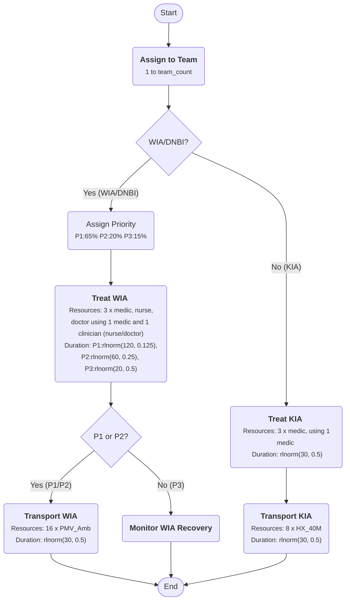

> :warning: Calculation of per minute rate must be verified. It is currently significantly under-representing DNBI case rates. 

> [!Note]
> 
> Useful information

# Battlefield Casualty Handling

## 📘 Introduction

This is a Discrete Event Simulation (DES) written in R that uses the simmer package. The code is designed to simulate the flow of battlefield casualties in Large Scale Combat Operations (LSCO) scenarios. The purpose of the simulation is to support decision making on deployed health system design with a focus on capacity planning.

---

## 🔧Simulation Environment Setup

- **Framework:** `simmer` (discrete-event simulation)

- **Context:** Battlefield casualty handling with Role 1 treatment and evacuation logic

---

## 🌍 Context

The code simulates a deployed combat brigade based on the Australian combat and health brigade capabilities. 

**Organisation**. The simulation is built around the following design:

1. The combat brigade has formed `3` battlegroups headquartered by the resident `2` infantry battalions and `1` cavalry regiment. a commander's reserve has been established by the brigade commander formed around a combat team.  The cavalry regiment based battlegroup is performing a screen forward of the two infantry battlegroups. Each battlegroup has been force assigned `2` treatment teams to provide close health support.

2. Artillery support is assigned with battery's assigned Direct Support (DS) to the infantry battlegroups and are placed with the capacity to provide support to their supported call-signs. The Brigade Headquarters (HQ) has established a HQ-Forward and HQ-Main. The HQ-Forward is placed one tactical bound behind the forward battlegroups. `1` additional treatment team has been establsihed to provide close health support to the artillery unit and HQ-Forward. `1` Role 2 - Basic (R2B) has been established in vicinity of the HQ-Forward to support damage control (DAMCON) and stabilise casualties prior to evacuation to higher level care.

3. The Combat Service Support Battalion (CSSB) has established the Brigade Maintenance Area (BMA). One further treatment team has been established to provide close health support within the BMA. To provide surgical capability to the brigade a Role 2 - Enhanced (R2E) hospital has been established within the BMA.

---

## 👨‍⚕️Resource Initialisation

**Health Teams**. The health architecture is made up of the following health teams:

- **Treatment Team**. The `8` treatment teams are made up of the following personnel resources:
  
  - `3` Medics
  
  - `1` Nurse
  
  - `1` Doctor

- **R2B**. 

**Transport Resources**. Transport resources are typically drawn from the supported call-sign or a CSS element. the following transport resources are available by echelon:

- **Treatment Team**. Treatment teams have access to battlegroup vehicle assets to effect casualty evacuations. The treatment teams have access to:
  
  - `2` PMV Ambulances per treatment team (for a total of `16`), used for the transport of Wounded In Action (WIA) and Disease and Non-Battle Injury (DNBI) to the R2B (where required)
  
  - `1` HX2 40 M per treatment team (for a total of `8`), used for the transport of Killed In Action (KIA) to the mortuary (at R2E)
  
  Transport resources are shared across all treatment teams.

- **R2B**.  

---

### 🧬 **Casualty Trajectory Logic**

- Each casualty is assigned:
  
  - A team (random)
  
  - A priority (if WIA or DNBI, not KIA)

- Then:
  
  - **Branch 1:** WIA/DNBI
    
    - Treatment by assigned team
    
    - Conditional transport if Priority 1 or 2
  
  - **Branch 2:** KIA
    
    - Treatment by assigned team
    
    - Then transport to mortuary

[Online FlowChart & Diagrams Editor - Mermaid Live Editor](https://mermaid.live/edit#pako:eNqVVP9vojAU_1ealyyRhCkFYUiMxpuXnDEuZLfcVy6mQqdk0JoCu3nG__0KBZWZy278QN-3vn4-7712DyGPKHjwmPDf4YaIHD1MA4bk9zmXWudnAJUQwC8NXV-P0AMl6STL4jXrBDBcjZSMcl55hr3VCA1XQv6ylCTJCJeeXHqWIS9YPuwpcwCaOuWUrsr-dTa53dDwaS-F3vTuw2x8UHGNQ0ah7zRDnSZAofJFzEWc747I6pyNvYUJ-dhz7Cvkm55pyMXysH11gaydUnEXlOTyYMW80kpgF6TvacYLEdLMQxZ6QSmN4lBHrBAZ1VHEw5wLVGQxWyOsnIiwSMphErM4jAlDnSq4p2K1Kve0ECSPOfNK-CJhXKQdbBo6MrrYtDW9pFObncqqjFZjVKG2dtmCmlWrkKoLAfgYSbC-OQ7g0K5Lux0-7vlmPSGCsGzLxXmlastb1cKOLJe_-LKcpCv0inVNw_oXjQtcd1zCshSmBWexrOQRUa2XeNA9DfkzFTsJbHzMdj5vZaL5bKKdZmDenoH5f89Au-vvZNgc3a7y_LLKb-BxJZ5P35Z9Y_F-BKfWVig-sqh8IuRSPhAq6FTrJuTV5vm5J2Cgw1rEEXi5KKgOKRUpKVXYl_sCyDc0pQF4UoyIeAogYAe5Z0vYD87TZpvgxXoD3iNJ5CWDYhuRnE5jshYkPVoFZREVt-VDBJ7pYrPKAt4eXqRuuvIiOXgwuLFdu29YNzrsQD4UXYwtx7b6huGatoMPOvypzjW6LrYMyzXdgd13Bo7jHP4CLfKgpA)

---

### 💀 **KIA (Killed in Action) Handling**

- **Treatment (`treat_kia()`):**
  
  - Selects medics using shortest-queue policy
  
  - Brief timeout (avg 15 min), simulating confirmation and prep for evacuation

- **Transport (`transport_kia()`):**
  
  - Uses HX2_40M vehicles (selected by shortest queue)
  
  - Simulates transport to mortuary near Role 2 (avg ~30 min, log-normal)

---

### 🤕 **WIA (Wounded in Action) / DNBI (Disease/Non-Battle Injury) Handling**

- **Treatment (`treat_wia()`):**
  
  - Seizes medics and clinicians (shortest-queue per group)
  
  - Treatment duration depends on assigned `priority` (1–3), drawn probabilistically
    
    - Priority 1: ~120 min
    
    - Priority 2: ~60 min
    
    - Priority 3: ~20 min

- **Evacuation Decision:**
  
  - Only Priority 1 & 2 trigger **transport to Role 2** via PMV_Amb
  
  - Priority 3 enters a placeholder recovery trajectory

---

### 
