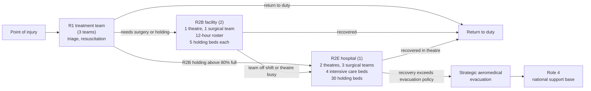
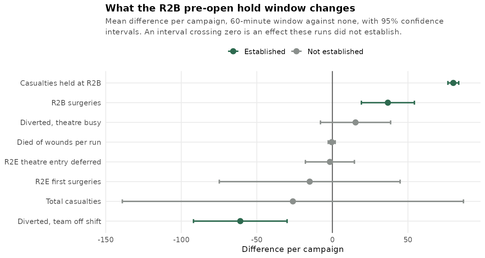

# Surgical Hours, Not Operating Theatres: Sizing the Land-Based Trauma System for Large Scale Combat Operations

## Abstract

<small>[Return to Top](#contents)</small>

**Background**

Casualty estimation is critical to the planning and design of the land-based trauma system deployed to support operations. Recent conflicts have produced lower casualty rates than those previously observed, or those expected in future large scale combat operations [[1]](#references), so a health system sized against recent experience is likely to not be adequate to handle the casualties of these more intense war fighting scenarios [[2]](#references).

**Objective**

To identify options to improve the land-based trauma system, and to establish where that system fails as casualty intensity rises.

**Methods**

A discrete event simulation of a brigade force with aligned health assets was run at two casualty intensities, 50 replications of a 30-day campaign each. Both intensities derive their casualty rates from the FORECAS projection study [[3]](#references): a moderate intensity calibrated to the Falklands 1982 campaign, and a high intensity calibrated to Okinawa 1945. The health system is identical under both, isolating casualty intensity. Six further experiments each vary one design or policy setting, among them the size of the ambulance fleet, the holding capacity at Role 2 Basic, and the rule governing when a casualty is held forward for surgery rather than moved rearward.

**Results**

Casualty volume rises 2.33-fold from moderate to high intensity, while queues grow disproportionately. The Role 2 Enhanced (R2E) operating theatre queue rises about 36-fold, Role 2 Basic (R2B) holding beds about 5.5-fold, R2E holding beds about 4.5-fold and R2E intensive care about 4.3-fold. Surgical team scheduling is the major system constraint: a casualty occupies a theatre while waiting for a rostered surgical team, and the teams work 12-hour shifts against theatres available around the clock. R2E intensive care runs close to full at both intensities. The ambulance and truck fleets hold margin at both intensities.

**Conclusion**

Extending surgical team coverage towards 24 hours at R2B and R2E needs no additional operating theatres, the existing ones standing idle for half of each day. Whether the additional hours come from the rostered teams or from further teams is a workforce and organisational design question this simulation does not evaluate. Relieving R2B holding capacity is the second priority. Delivering post-operative intensive care forward at R2B does not measurably relieve R2E intensive care and is not recommended. Several effects could not be separated from random variation within the compute available, and are reported as unresolved with the further analysis each required.

## Contents

<small>[Return to Top](#contents)</small>

<!-- TOC START -->
- [Abstract](#abstract)
- [Contents](#contents)
- [Introduction](#introduction)
- [Methods](#methods)
  - [The Simulated Trauma System](#the-simulated-trauma-system)
  - [How the Simulation Was Run](#how-the-simulation-was-run)
  - [Confidence Intervals](#confidence-intervals)
  - [Replication Count and Resolution](#replication-count-and-resolution)
  - [Reading the Evidence Labels](#reading-the-evidence-labels)
  - [The Two Casualty Intensities](#the-two-casualty-intensities)
- [Where the Trauma System Fails First](#where-the-trauma-system-fails-first)
  - [Comparative Scenario Analysis](#comparative-scenario-analysis)
  - [Surgical Team Scheduling Is the Principal Constraint](#surgical-team-scheduling-is-the-principal-constraint)
- [Planning Options in Priority Order](#planning-options-in-priority-order)
  - [Option 1. Extend Surgical Team Coverage Towards 24 Hours](#option-1-extend-surgical-team-coverage-towards-24-hours)
  - [Option 2. Increase R2B Holding Capacity or Set an Evacuation Threshold](#option-2-increase-r2b-holding-capacity-or-set-an-evacuation-threshold)
  - [Option 3. Hold Casualties at R2B for a Team About to Return](#option-3-hold-casualties-at-r2b-for-a-team-about-to-return)
    - [The R2B Pre-Open Hold Window](#the-r2b-pre-open-hold-window)
  - [Option 4. Size the Medical Evacuation Fleet at Three Ambulances](#option-4-size-the-medical-evacuation-fleet-at-three-ambulances)
    - [Transport Fleet-Size Sweep](#transport-fleet-size-sweep)
  - [Not Recommended: Delivering Post-Operative Intensive Care Forward](#not-recommended-delivering-post-operative-intensive-care-forward)
    - [Forward ICU Share Decision Frontier](#forward-icu-share-decision-frontier)
- [System Design Features That Shape the Results](#system-design-features-that-shape-the-results)
  - [R2B Diversion Is a Policy Setting, Not a Capacity Signal](#r2b-diversion-is-a-policy-setting-not-a-capacity-signal)
  - [Intensive Care Access Is Rationed by Design](#intensive-care-access-is-rationed-by-design)
    - [The Post-Operative Intensive Care Gate](#the-post-operative-intensive-care-gate)
  - [Mass Casualty Events Degrade Care Without Revealing New Constraints](#mass-casualty-events-degrade-care-without-revealing-new-constraints)
    - [Mass Casualty Event Stress Test](#mass-casualty-event-stress-test)
- [Demand on the National Support Base](#demand-on-the-national-support-base)
- [Effects the Simulation Could Not Resolve](#effects-the-simulation-could-not-resolve)
- [Further Development](#further-development)
- [Limitations](#limitations)
- [Conclusion](#conclusion)
- [References](#references)
<!-- TOC END -->

---

## Introduction

<small>[Return to Top](#contents)</small>

A planner designing a deployed health system faces a single problem with many parts: the system has to be sized prior to its deployment to support a campaign, against a casualty load nobody can know in advance. Optimising it means trading one part of the system against another, more surgical capacity against more holding beds, more evacuation lift against more in-theatre recovery, with a fixed establishment and a finite lift to move it. This paper tests those trade-offs by simulation, and reports which of them improve the health outcome of the force.

Casualty volumes expected in large scale combat operations exceed those the deployed health systems of the past two decades were built around [[1]](#references), and planning assumptions carried forward from those operations understate both the volume and the acuity a peer fight would produce [[2]](#references). An establishment drawn from the last campaign is a baseline that may not transfer.

This paper is presented in five parts. The first locates where the simulated trauma system fails as casualty intensity rises. The second sets out four options in priority order, each labelled by what the evidence establishes about it. The third describes three features of the system's design that shape how its results should be read. The fourth reports demand on the national support base. The fifth states the effects the simulation could not resolve, and the further analysis each required.

---

## Methods

<small>[Return to Top](#contents)</small>

### The Simulated Trauma System

The simulation is a discrete event model in which each casualty is an entity that arrives, then claims and releases clinical staff, beds, operating theatres and transport as it moves rearward through the echelons of allied medical support doctrine [[4]](#references). Role 1 (R1) provides primary care and resuscitation forward. Role 2 Basic (R2B) provides damage control surgery and short-term holding. Role 2 Enhanced Heavy (R2E) provides definitive surgery, intensive care and in-theatre recovery. Strategic aeromedical evacuation moves casualties beyond the theatre to a Role 4 national support base. The establishment simulated is a combat brigade served by three R1 treatment teams, two R2B facilities and one R2E hospital. The model is built on the `simmer` package for R [[5]](#references) and all results were produced under R 4.4.2.

Casualties reach R2E either directly from R1, when R2B holding is already close to full, or from R2B when its surgical team is off shift or its theatre is occupied. This routing is further explored in [R2B Diversion Is a Policy Setting, Not a Capacity Signal](#r2b-diversion-is-a-policy-setting-not-a-capacity-signal).

### How the Simulation Was Run

Two campaigns fought at the same casualty rate produce different results, because the timing and severity of arrivals differ. One campaign therefore measures that campaign and not the system. Each experiment runs the same campaign many times over, each with a different stream of random numbers, and reports the average across those runs with a measure of how precisely it is known. Each run is a complete 30-day campaign starting from an empty system, and each is independent of the others, which is what allows the averages to be treated statistically. A campaign is measured as a whole: one number per run for each quantity of interest, such as the average queue at a given resource across the 30 days, or the count of casualties who took a given pathway. Comparisons drawn between individual casualties or individual days within a campaign would not be valid, because observations inside one campaign are not independent of each other.

The full design of every experiment below, including the run counts, the settings varied and the statistical detail, is given in the supplementary material [[6]](#references).

Each campaign is analysed from its first day, with no opening period removed. A deployed health system genuinely starts empty, so the opening period is part of the behaviour of interest rather than a transient to be discarded [[7]](#references).

### Confidence Intervals

Results below are reported as an average across runs with a 95% confidence interval, written as the average followed by a range in brackets. The interval is calculated as

$$\bar{x} \pm t_{0.975,\;n-1}\,\frac{s}{\sqrt{n}}$$

where $n$ is the number of runs, $\bar{x}$ the average across them and $s$ the variation between them. Dividing by the square root of the number of runs is what makes additional runs improve precision: quadrupling the runs halves the width of the interval.

Two points govern how these intervals should be used. First, the interval describes how precisely the average is known, not how much one campaign varies. Several tables also report a 10th-to-90th-percentile range, which is the spread across campaigns, and it is many times the wider of the two. At moderate intensity, for example, the average campaign produces 437.8 casualties and that average is known to within about 17 either way, while the campaigns themselves range from 363 to 528. Sizing against 438 under-provides for the campaign that actually occurs. Second, where two intervals overlap, the simulation has not established a difference between them, and the gap between the two averages should not be acted on as though it were real.

### Replication Count and Resolution

The number of runs each experiment needs depends on how many events it observes. A queue measure accumulates over every arrival and departure at a resource across 30 days and is well determined after 50 runs. A death count rests on a handful of events, a moderate-intensity campaign producing about one death of wounds, and is not.

Available compute time is a limitation on this, and it is the reason several findings below are reported as unresolved rather than measured. Separating a difference in the died-of-wounds rate of a tenth of a percentage point would take 62 runs, and one of five hundredths of a point would take 237. The 50-run mortality figures below therefore carry about $\pm 0.11$ points, enough to separate two casualty intensities whose rates differ eightfold, and not enough to separate two treatment pathways within one intensity. Every unresolved effect below states the number of runs that would settle it. Re-running those experiments with more replications is recommended for further research.

### Reading the Evidence Labels

Not every finding below rests on the same strength of evidence. Each option therefore carries a label saying what its evidence supports. A label attaches to a particular claim, so an option whose diagnosis is measured may still have a remedy that is untested.

| Label | Meaning |
|---|---|
| **Measured** | The effect is established. Direction and approximate size are both supported. |
| **Direction only** | The effect points the way expected and the mechanism is confirmed, but its size is not established. |
| **Unresolved** | The available compute could not separate the effect from random variation. Figures are bounds, not estimates. |
| **Untested** | The simulation cannot evaluate the option as presently built. |

### The Two Casualty Intensities

A moderate intensity and a high intensity casualty rate are compared. Both derive their arrival rates from the FORECAS casualty projection study [[3]](#references), the moderate intensity calibrated to the Falklands 1982 campaign and the high intensity to Okinawa 1945. Both use the same calibrated model of the trauma system, differing only in the rate, mix and severity of casualties arriving at it, so any difference in the results is attributable to casualty intensity alone.

Each intensity also carries the died-of-wounds experience of the campaign it is calibrated to, the Okinawa figure taken from US Army reporting [[8]](#references). That is a deliberate choice, because a casualty rate and the survival experience that accompanied it belong together, but it means the mortality difference between the two intensities combines casualty volume with a difference in the standard of care. High intensity takes its triage priority split, disease composition and transport times from the moderate-intensity calibration.

Element, bed and transport fleet sizes are parameters a planner using the simulation can set. A casualty intensity does not adjust them, which is what holds the health system constant across the comparison.

---
## Where the Trauma System Fails First

<small>[Return to Top](#contents)</small>

**The establishment gives way at the R2E operating theatres before anywhere else, and it is already under strain at moderate intensity rather than only at high.** Casualty volume rises by a factor of 2.33 from moderate to high intensity while the R2E theatre queue rises by a factor of about 36. Sizing the system from the casualty ratio alone would under-provide surgery by more than an order of magnitude.

### Comparative Scenario Analysis

**Design.** 50 runs of a 30-day campaign at each casualty intensity, under the same establishment throughout.

| Metric | Moderate intensity | High intensity | Ratio |
|---|---|---|---|
| Total casualties/run | 437.8 [421.0, 454.7] (p10–p90: 362.7–528.0) | 1,021.0 [993.9, 1,048.1] (p10–p90: 906.5–1,138.5) | 2.33× |
| Wounded in action/run | 188.7 [175.4, 202.0] (p10–p90: 137.6–251.5) | 684.3 [658.3, 710.3] (p10–p90: 586.2–792.5) | 3.63× |
| Died of wounds/run | 0.78 [0.55, 1.01] (p10–p90: 0–2.0) | 23.58 [21.88, 25.28] (p10–p90: 18.0–32.1) | 30.2× |
| Died of wounds, as share of wounded | 0.42% [0.29%, 0.54%] | 3.43% [3.24%, 3.61%] | 8.24× |

Casualty counts vary widely from campaign to campaign, because each arrival stream draws its daily rate from a distribution before placing that day's arrivals within the day [[9]](#references), so the between-day variation FORECAS reports [[3]](#references) reaches the output rather than being averaged away. At moderate intensity the total spans 362.7 to 528.0 casualties between the 10th and 90th percentiles against an average of 437.8. Surge capacity therefore has to be judged against the heavy day rather than the average one.

Deaths of wounds rise 30-fold while casualty volume rises 2.33-fold, but that comparison measures more than the health system, each intensity carrying the survival experience of its own campaign as well as its casualty rate.

The width of the pale band against the narrow bar inside it is the point to take from this figure. The confidence interval says the average is known precisely; the band says one campaign in five falls outside a range spanning roughly a third of that average. Planning against the point rather than the band under-provides for the campaign that arrives.

| Resource group | Moderate intensity mean queue | High intensity mean queue | Ratio |
|---|---|---|---|
| R2B operating theatre | 0.000 [0.000, 0.000] | 0.000 [0.000, 0.000] | not applicable |
| R2B holding beds | 0.593 [0.501, 0.685] | 3.228 [3.005, 3.452] | 5.45× |
| R2E operating theatre | 1.063 [0.691, 1.435] | 38.17 [34.01, 42.33] | 35.9× |
| R2E intensive care | 0.131 [0.104, 0.159] | 0.564 [0.464, 0.664] | 4.29× |
| R2E holding beds | 0.598 [0.437, 0.758] | 2.694 [2.449, 2.938] | 4.51× |
| Ambulance and truck fleets | 0.0038 [0.0000, 0.0078] | 0.0278 [0.0196, 0.0361] | 7.25× |

Each figure is the average queue at that group of resources across a campaign, averaged over the 50 runs. A resource that stands idle throughout a campaign contributes a zero rather than dropping out, so the figures describe the full establishment rather than only its busy parts.

Every queue grows faster than the casualty volume driving it. R2E operating theatre grows the most and carries by far the largest absolute queue. The ambulance and truck fleets grow second fastest, which is why the figure sizes each point by its absolute queue: transport grows 7.25-fold from a base so small that the resulting queue is still a fraction of one casualty.

Each panel carries its own vertical scale, so the panels compare intensities rather than resources: the R2E theatre panel runs to 60 casualties while the transport panel runs to 0.07. The error bars show the spread across campaigns rather than a confidence interval, and every high-intensity bar is wide enough to show that surge queues vary a great deal between campaigns.

### Surgical Team Scheduling Is the Principal Constraint

**Surgical team scheduling is the principal constraint on the system.** A casualty takes an operating theatre before taking one of the three surgical teams that staff them at R2E, so a theatre stands occupied while the casualty inside it waits for a team to become available. The theatres are available around the clock; the teams work 12-hour shifts, two on during the first shift and one on during the second. **Evidence: measured.**

Adding theatres would therefore not relieve the queue, which measures a wait for people and is relieved only by surgical team hours.

Theatre contention is not confined to high intensity. The R2E theatre queue at moderate intensity averages 1.06 casualties, so casualties already wait for surgery at the lower of the two rates tested. The establishment is therefore not comfortably adequate at moderate intensity either: it absorbs that load without the queue growing without bound, but it does so with casualties waiting on its heavy days. Addressing the constraint is a standing requirement rather than a contingency measure.

The rest of R2E follows the theatres rather than leading them. Intensive care rises 4.3-fold, the flattest of the three R2E groups, because only casualties on the damage control pathway take a stabilisation episode. Its four beds run close to full at both intensities, so the queue is short not because the beds are ample but because casualties who cannot get one are diverted to a holding bed instead, which is examined in [Intensive Care Access Is Rationed by Design](#intensive-care-access-is-rationed-by-design). R2E holding beds rise 4.5-fold, absorbing what intensive care cannot, and they also hold every casualty waiting for strategic evacuation.

---

## Planning Options in Priority Order

<small>[Return to Top](#contents)</small>

**Four options were identified from the outcomes of the simulation, ordered by how directly each improves the health outcome of the force.** An option addressing the principal constraint ranks above one that is better measured but acts where the system is not failing.

| Priority | Option | What the evidence establishes |
|---|---|---|
| 1 | Extend surgical team coverage at R2B and R2E towards 24 hours | Diagnosis **measured**; the best means of sourcing the hours **untested** |
| 2 | Increase R2B holding capacity or set an evacuation threshold | Diagnosis **measured** at both intensities; the three remedies **untested** |
| 3 | Hold casualties at R2B for a team about to return rather than divert | **Measured** on casualties held and diversions avoided; **unresolved** on surgeries gained |
| 4 | Size the medical evacuation fleet at three ambulances | **Measured**: margin holds at two, collapses at one |
| Not recommended | Deliver post-operative intensive care forward at R2B | **Unresolved**: no benefit visible at any setting |

Further simulation would refine every row of this table. The two untested remedies need the establishment itself made variable, so that team and bed counts can be swept as the fleet size already is. The unresolved rows need more runs than the available compute allowed. Both are set out in [Further Development](#further-development).

### Option 1. Extend Surgical Team Coverage Towards 24 Hours

**Surgical team hours are the capacity to add, at both R2B and R2E, and the theatres to use them already exist.** **Evidence for the diagnosis: measured. Evidence for the best means of sourcing the hours: untested.**

At R2B, each of the two facilities fields one surgical team on a 12-hour shift against a theatre available around the clock, so for half of each day the theatre stands ready with nobody rostered to operate in it. Of the casualties diverted from R2B to R2E in a verified campaign, 71% were diverted because the surgical team was off shift and 29% because the theatre was busy [[10]](#references). Time to surgery is among the strongest determinants of survival after severe battlefield injury [[11]](#references), so a casualty who travels further to reach a surgeon because none is rostered is a clinical cost, not an administrative one.

At R2E, the single second-shift team carries the whole night-time surgical load. It is busy for 53.6% of its rostered time against 30.8% for each first-shift team, and queued for 2.45% against 0.67% and 0.60% [[10]](#references).

Extending coverage requires no additional principal equipment, the operating theatres already existing and standing idle for half of each day at R2B. What it does require is provision in the operational viability period, the organisational design and the workforce model, which are the instruments through which the additional hours would have to be found.

How to source those hours is a separate question. Extending the rostered teams' hours and fielding additional teams both deliver coverage at different costs in personnel, sustainment and clinical risk, and the simulation fixes team counts as structure, so neither can be swept at present. Making the establishment variable is the first item in [Further Development](#further-development).

### Option 2. Increase R2B Holding Capacity or Set an Evacuation Threshold

**R2B holding is the second constraint, and the shortfall is present at both casualty intensities rather than appearing only under surge.** The R2B holding queue rises 5.45-fold from moderate to high intensity, the second largest movement in the queue comparison, driven by the rise in non-surgical wounded rather than by any change in disease. **Evidence: measured.**

Ten holding beds are fielded across the two facilities against an expected occupancy of about 15.5, and disease casualties staying for days at a time are what fill them [[10]](#references). No change in surgical throughput closes a gap of that kind.

Three remedies are available. Shortening the length of stay cannot bring occupancy inside capacity at any clinically plausible figure. Increasing holding capacity to ten beds per facility would. Setting an evacuation threshold, so that a casualty whose expected recovery exceeds a set duration moves rearward rather than occupying a forward bed, is the cheapest, at the cost of transferring a non-surgical medical load onto R2E holding, which Option 1 has already identified as working near its limit.

**Evidence for all three: untested.** Choosing between them requires sweeping holding capacity jointly against the evacuation threshold, which needs no new model structure and is the most tractable item of further analysis in this paper.

### Option 3. Hold Casualties at R2B for a Team About to Return

**Holding a casualty at R2B for a surgical team about to come on shift, rather than moving them to R2E, reduces the surgical load transferred rearward without exceeding R2E's capacity to absorb it.** About six casualties per campaign are kept forward this way, and diversions caused by the team being off shift fall by about ten. **Evidence: measured.**

#### The R2B Pre-Open Hold Window

The rule tested is a pre-open window of an arbitrarily selected 60 minutes: a casualty arriving while the R2B surgical team is off shift is held at R2B if that team is due back within the window, and moved to R2E otherwise.

**Design.** 50 runs of a 30-day campaign for each of two arms, one with the window set to zero so that every such casualty is moved rearward immediately, the other with it set to 60 minutes. The third column is the average difference between the two arms.

| Measure | Window 0 | Window 60 min | Difference |
| --- | --- | --- | --- |
| Casualties held at R2B | 0 | 5.90 | +5.90 [+5.18, +6.62] |
| R2B surgeries | 51.82 | 52.20 | +0.38 [−2.75, +3.51] |
| Diverted, team off shift | 84.94 | 75.24 | −9.70 [−17.25, −2.15] |
| Diverted, theatre busy | 19.76 | 17.08 | −2.68 [−6.95, +1.59] |
| R2E first surgeries | 125.16 | 117.96 | −7.20 [−16.33, +1.93] |
| R2E theatre entry deferred | 18.94 | 15.62 | −3.32 [−6.56, −0.08] |
| Died of wounds per run | 1.02 | 1.02 | +0.00 [−0.38, +0.38] |
| Total casualties | 442.82 | 433.18 | −9.64 [−32.00, +12.72] |

The policy does what it was designed to do. It keeps 5.90 casualties per campaign at R2B, where a zero window keeps none, and off-shift diversions fall by 9.70. Neither of those intervals includes zero, so both effects are established.

Three of the eight measures are established and five are not. Casualties held at R2B, diversions avoided when the team is off shift, and deferred theatre entry at R2E all sit clear of the zero line. The remainder, including whether R2B performs more surgery as a result, have intervals wide enough to contain no change at all.

Whether those casualties then receive surgery at R2B sooner than they would have at R2E is not established. R2B surgeries rise by 0.38, an interval wide enough to contain both no change at all and the full six operations the holds would suggest, so the simulation cannot distinguish between them. **Evidence for the surgical benefit: unresolved.** The cause is that introducing the hold changes the sequence of random draws, so the two arms generate different casualty streams and cannot be compared casualty for casualty. Settling it would take about 120 runs per arm rather than 50, which the available compute did not allow.

One further row is informative. Casualties whose entry to the R2E operating theatre was deferred for want of an intensive care bed fall by 3.32, an interval excluding zero, so holding casualties at R2B relieves a little pressure on the R2E surgical teams that Option 1 identifies as the principal constraint. Mortality is unchanged between the arms, which at 50 runs is an absence of evidence rather than evidence of safety.

### Option 4. Size the Medical Evacuation Fleet at Three Ambulances

**Three ambulances are sufficient for medical evacuation between echelons in support of a brigade, and two would carry the load with a reduced margin.** These are the ambulances that move casualties between R1, R2B and R2E, not those integral to the combat force that move casualties from the point of injury to R1. **Evidence: measured.**

#### Transport Fleet-Size Sweep

**Design.** 10 runs of a 30-day campaign at each fleet size, the ambulance fleet swept from 1 to 5 vehicles and the truck fleet from 1 to 4, each with the other held at its current size.

The ambulance queue collapses between one and two vehicles and is flat thereafter, so three vehicles sit on the flat part of the curve rather than at its bend.

| Fleet size | Ambulance mean queue | Truck mean queue |
|---|---|---|
| 1 | 2.1060 [0.2270, 3.9850] | 0.0442 [0.0000, 0.1021] |
| 2 | 0.0487 [0.0000, 0.0974] | 0.0011 [0.0000, 0.0022] |
| 3 (current ambulance) | 0.0068 [0.0000, 0.0155] | 0.0001 [0.0000, 0.0002] |
| 4 (current truck) | 0.0006 [0.0000, 0.0012] | 0.0000 |
| 5 | 0.0001 [0.0000, 0.0001] | not swept |

At one vehicle the ambulance fleet queues heavily, at an average of 2.11 casualties waiting, so the sweep locates the capacity boundary sharply rather than merely confirming that the current fleet is adequate. The queue falls roughly fortyfold at two vehicles and sevenfold again at three. What produces any queue at all is the day-to-day variation in casualty volume rather than its average, a transport queue forming on peak days and no others.

Two qualifications bound the recommendation. The sweep was run at moderate intensity only, and the intensity comparison puts the transport queue up 7.25-fold at high intensity, so this evidence does not establish that the margin survives surge; re-running the sweep at high intensity is listed in [Further Development](#further-development) and is the shortfall most likely to change this recommendation. And utilisation is too poorly determined at 10 runs to read at all, running the wrong way on both platforms; the queue column is the one to use.

### Not Recommended: Delivering Post-Operative Intensive Care Forward

**Providing intensive care forward at R2B does not have a significant impact on R2E intensive care usage, and is not recommended on the present evidence.** **Evidence: unresolved across the whole range tested.**

#### Forward ICU Share Decision Frontier

In this simulation design, a casualty's need for post-operative stabilisation is a single quantity that the forward-holding policy divides between R2B and R2E, so shifting the policy moves load between echelons without changing how much care is given. Only casualties on the damage control pathway have a stabilisation phase, so the policy reaches roughly half of operated casualties.

**Design.** 20 runs of a 30-day campaign at each setting, the share of post-operative intensive care delivered forward set to 0, 25, 50, 75 and 100% in turn.

Every panel moves little across the full range, and every confidence ribbon is wide enough to cover the whole movement.

| Forward share | R2E ICU mean queue | R2B ICU utilisation | R2E ICU utilisation | Post-definitive care in ICU | Died of wounds per run |
|---|---|---|---|---|---|
| 0% (current) | 0.108 [0.066, 0.149] | 22.4% | 87.7% | 35.5% [28.4, 42.6] | 0.80 [0.35, 1.25] |
| 25% | 0.080 [0.042, 0.119] | 22.1% | 84.9% | 38.7% [30.4, 46.9] | 1.00 [0.52, 1.48] |
| 50% | 0.078 [0.028, 0.129] | 14.1% | 83.4% | 41.6% [34.5, 48.8] | 1.00 [0.52, 1.48] |
| 75% | 0.079 [0.036, 0.121] | 20.2% | 83.8% | 42.2% [31.4, 52.9] | 1.10 [0.47, 1.73] |
| 100% | 0.125 [0.033, 0.218] | 22.7% | 83.9% | 42.0% [32.4, 51.6] | 1.00 [0.25, 1.73] |

The policy achieves little because the group of casualties it reaches is small. About half of operated casualties take the single-stage pathway and have no stabilisation phase to move; of the remainder, only those operated on at R2B can have any of it delivered forward. What is left is too small a group to relieve a unit already running near 85% occupancy. The R2E intensive care queue moves between 0.078 and 0.125 casualties with overlapping intervals and no trend, and its highest value falls at the 100% setting, where the policy should help most.

Whether the policy would pay at higher casualty rates, where R2E intensive care is contended by a wider margin, is listed in [Further Development](#further-development).

---

## System Design Features That Shape the Results

<small>[Return to Top](#contents)</small>

**Three features of how the simulated system is designed determine what its measurements mean.** All three are policy settings that could be changed, rather than fixed properties of the system.

### R2B Diversion Is a Policy Setting, Not a Capacity Signal

**The R2B operating theatre queue reads zero at both casualty intensities, and that is a consequence of the casualty handling policy rather than evidence that R2B has spare surgical capacity.** The policy moves a casualty requiring surgery to R2E whenever the R2B theatre is occupied or the surgical team has been off shift beyond the pre-open window, rather than letting that casualty wait at R2B. A queue therefore cannot form. At high intensity the same policy transfers the entire surgical surge onto R2E, which has little spare capacity to take it.

A zero queue at R2B therefore signals a shortfall being exported rather than capacity being adequate. The same pattern appears in holding, where the routing policy diverts casualties to R2E before transport whenever R2B holding is close to full. Any measure of whether R2B is adequately resourced has to count what was sent rearward, not what waited.

The policy itself is a planning option. Allowing a casualty to wait at R2B where the delay would be short, which is what the pre-open window in Option 3 does in a limited way, trades a wait forward against a transfer of load rearward. Sweeping the diversion thresholds across their range would show where that trade is best struck, and is listed in [Further Development](#further-development).

### Intensive Care Access Is Rationed by Design

**When R2E intensive care is full, the simulation does not queue casualties indefinitely; it gives some of them a holding bed instead, and defers others' surgery until a bed is free.** A casualty on the damage control pathway needs a period of post-operative stabilisation, and entry to the operating theatre depends on an intensive care bed being available to provide it. A Priority 1 casualty is operated on regardless and recovers in a holding bed, at raised risk, when no intensive care bed is free. A Priority 2 or lower casualty waits for a bed before entering theatre.

That design is why the R2E intensive care queue reads low while its beds run near capacity: the shortfall appears as casualties receiving a lesser standard of care, not as a queue. The intensive care figures should therefore be read as a count of who received which standard of care, which is more useful than a queue length because it names who bore the cost. The remedy it points to is intensive care capacity at R2E, competing for the same resources as Option 1.

#### The Post-Operative Intensive Care Gate

**Design.** 50 runs of a 30-day campaign, comparing the system with and without the rationing rule described above.

Average R2E intensive care utilisation falls from 74.1% to 60.2% when the rule is applied, a substantial reduction in load. Average deaths of wounds per campaign rise from 0.84 [0.58, 1.10] to 1.00 [0.74, 1.26]. Those intervals overlap, so the simulation has not established that the rule costs lives, and the direction is the one the design would predict. **Evidence: direction only.**

Within the rule, casualties recovering in a holding bed died at 0.16% against 0.06% for those recovering in intensive care, roughly 2.8 times the rate. That difference is built into the model rather than discovered by it: receiving reduced care changes the died-of-wounds curve applied to a casualty, so the figures measure how many casualties the rule sends down the higher-risk curve, not whether that curve is correct. The counts behind the ratio are small in any case, so it establishes a direction rather than a size.

Both figures are limited by compute rather than by design. Deaths of wounds are rare enough at moderate intensity that separating two pathways of a few dozen casualties each would take far more runs than were available, and the comparison above was also run under an earlier statistical arrangement that makes its intervals narrower than they should be. Re-running it under the current arrangement, at a higher run count, is listed in [Further Development](#further-development).

### Mass Casualty Events Degrade Care Without Revealing New Constraints

**A mass casualty event degrades the care the system delivers without exposing a constraint that the ordinary casualty tempo was hiding**, because a tempo that already produces heavy days has consumed the spare capacity at R2B and R2E before any event arrives.

#### Mass Casualty Event Stress Test

**Design.** 10 runs of a 30-day campaign with mass casualty events injected at an average of one event every five days, compared against 10 runs with no events injected. Each arm is a separate set of runs under one configuration.

| Metric | No events injected | Events injected |
|---|---|---|
| Average total casualties/run | 444.6 | 682.1 |
| Average events/run | 0 | 5.40 (range 3–8) |
| Died-of-wounds rate, ordinary casualties | 0.18% | 0.28% |
| Died-of-wounds rate, event casualties | not applicable | 0.58% |

Casualties from mass casualty events die of wounds at 2.1 times the rate of ordinary casualties, consistent with a blast-dominant injury mix arriving faster than the system can absorb. **Evidence: direction only**, the 13 deaths in each arm being too few for a precise figure. The comparison arm is not a quiet baseline, the ordinary casualty stream producing heavy days of its own, which is why its rate is 0.18% rather than near zero.

When a mass casualty event occurs, the majority of casualties are given a holding bed to recover in because intensive care is unavailable, and those casualties consequently have poorer outcomes. In a verified campaign the split was 85 casualties in holding against 37 in intensive care under injection, where the same campaign without injection gave 58 and 79 [[10]](#references): the majority pathway reverses, and it stays reversed for the whole campaign rather than only during the events. Policies to relieve that pressure, by reducing intensive care time or discharging non-critical casualties from holding to recover capacity, and the triggers at which they should be introduced, are worth investigating and are listed in [Further Development](#further-development).

Theatre and diversion measures barely move under injection, which is the finding rather than an absence of one.

Two events thirteen days apart is a thin draw from a process set to deliver an average of six across the campaign, so this campaign illustrates the mechanism while the table above carries the measurement.

---

## Demand on the National Support Base

<small>[Return to Top](#contents)</small>

**Strategic evacuation is limited by how many sorties actually depart rather than by how many places each carries, and every casualty left waiting occupies an R2E holding bed.** The findings in this section come from one verified campaign rather than from repeated runs, so they establish the mechanism rather than its size. **Evidence: direction only, from a single campaign.**

Of 135 casualties reaching a strategic evacuation decision, 99 boarded and reached the national support base within 30 days while 36 were still waiting, each occupying an R2E holding bed, when the campaign ended [[10]](#references). Two of four scheduled sorties were cancelled, so the first to fly departed on day 21 and the average wait reached 10.1 days. Each aircraft offers 36 high-dependency and 54 ambulatory places, and the sortie that flew on day 21 filled its high-dependency cabin exactly and still left casualties behind.

Two planning recommendations follow. The first concerns the sortie pattern. The simulation provides a means of establishing the aeromedical evacuation sortie pattern required to clear casualties from R2E at a given casualty intensity, rather than sizing the aircraft: a schedule resilient to cancellation, whether through a reserve airframe or a shorter interval between sorties, clears the backlog where additional cabin capacity on an unreliable schedule does not. The same analysis would inform related policies, such as releasing recovering casualties to light duties in theatre, which reduces the number needing evacuation at all.

The second concerns the demand signal sent rearward. Occupancy at the national support base reached 90 concurrent patients on the campaign's last day and decayed to near zero only around day 69, so the base carries its heaviest load after the campaign that generates it has ended. A demand signal for bed types at the national support base should therefore be derived from the theatre's evacuation pipeline, and phased to peak after the engagement rather than during it. The simulation can generate that signal by bed type, which is a more useful planning product than a total casualty estimate.

Both recommendations rest on one campaign and one set of sortie cancellation draws. A replicated analysis of national support base demand is the first item in [Further Development](#further-development).

---

## Effects the Simulation Could Not Resolve

<small>[Return to Top](#contents)</small>

**Three effects could not be separated from random variation within the compute available, and are unmeasured rather than small.** The distinction decides whether acting on them is sound. Each is listed below with the further work that would settle it.

| Effect | What the simulation found | What would settle it |
|---|---|---|
| Whether holding casualties at R2B increases surgery performed there | An increase of 0.38 operations per campaign, with a range too wide to distinguish from no change | About 120 runs per arm rather than 50 |
| Whether delivering intensive care forward relieves R2E | No movement at any setting from 0 to 100% | More than 20 runs per setting, and a test at high intensity |
| Whether rationing intensive care access costs lives | A rise of 0.16 deaths per campaign, well within the range of chance | Far more runs than available; the effect is too rare to resolve at this casualty intensity |

The first two are a matter of compute time and would be settled by longer runs. The third is not: deaths of wounds at moderate intensity are rare enough that no realistic number of runs would separate two groups of a few dozen casualties, so answering it needs a different measure of harm.

---

## Further Development

<small>[Return to Top](#contents)</small>

**The option this paper ranks first is one the simulation cannot yet evaluate, which sets the development priority.** Each item below names the decision it would unblock.

| Priority | Development | Decision it unblocks |
|---|---|---|
| 1 | Repeated runs of national support base demand and strategic evacuation | The sortie pattern needed to clear R2E, and the bed-type demand signal sent rearward |
| 2 | Make the establishment variable, so team and bed counts can be swept as fleet sizes already are | Option 1: how best to source additional surgical team hours, and Option 2: how many holding beds |
| 3 | Joint sweep of R2B holding capacity against an evacuation threshold | Option 2: which of the three remedies to adopt |
| 4 | Re-run the unresolved experiments at the run counts stated above | Options 1 and 3, and the cost of rationing intensive care access |
| 5 | Sweep the R2B diversion thresholds across their range | Where to strike the trade between waiting forward and transferring load rearward |
| 6 | Test policies for recovering holding capacity during a mass casualty event, and the triggers for applying them | How to relieve the reversal of the intensive care and holding pathways under surge |
| 7 | Re-run the transport fleet sweep at high intensity | Option 4: whether the margin survives surge |
| 8 | Queue length and degraded care rate as time series across replications | Whether the R2E theatre queue clears between peaks or never clears, which decides between surge capability and permanent establishment |
| 9 | Casualty severity conditioning of surgery durations | Whether theatre contention is understated on the heavy days it is measured on |

Alongside these, the simulated system's design and its calibration would benefit from structured review by clinical and health planning subject matter experts. The parameters governing intensive care rationing and post-operative risk are informed estimates rather than measured values, and expert calibration would do more to improve confidence in the mortality findings than additional computation.

---

## Limitations

<small>[Return to Top](#contents)</small>

Three limitations bear on how the options above should be read.

**The simulation is verified but not validated.** It behaves as its specification describes, which is a separate question from whether that specification represents the real trauma system well [[12]](#references). Verification has been demonstrated [[10]](#references); validation would require the structured expert review described in [Further Development](#further-development). Every option above is an option inside the simulation, and holds only as far as the simulation does.

**Compute time limited what could be measured.** Three effects are unresolved for that reason alone, and the run counts that would settle two of them are stated above. This constrains the precision of the findings rather than their direction, and it bears hardest on mortality, which is the rarest quantity the simulation reports.

**Comparisons between two configurations are not perfectly controlled.** Changing a setting alters the sequence of random draws, so the two arms of a comparison generate different casualty streams and cannot be matched campaign for campaign. The effect is a loss of precision rather than a bias: the averages remain correct and the intervals around them are wider than a matched design would give, which is why several comparisons here are unresolved at 50 runs. The casualty intensity comparison is unaffected, its arms differing by design rather than by a small perturbation.

Two narrower caveats apply. Clinical teams are taken whole rather than by individual clinician, so team utilisation overstates scarcity where a procedure needs only part of a team; and one pool of R2E holding beds carries both in-theatre recovery and the strategic evacuation wait, so those queue figures combine two demands.

---

## Conclusion

<small>[Return to Top](#contents)</small>

This paper set out to identify options for improving the land-based trauma system, and to establish where that system fails first as casualty intensity rises. It did so by running a discrete event simulation of a brigade force with aligned health assets at two casualty intensities, both derived from historical campaign data, and by testing individual design and policy settings a planner controls.

**The system does not scale from moderate to high casualty intensity, and it fails at the R2E operating theatres first.** Casualty volume rises 2.33-fold while the R2E theatre queue rises about 36-fold, R2B holding about 5.5-fold and R2E holding about 4.5-fold. The constraint is surgical team scheduling rather than theatre space, because a casualty occupies a theatre while waiting for a team, and the teams work 12-hour shifts against theatres available around the clock. That contention is present at moderate intensity too, so it is a standing weakness rather than one confined to peer conflict.

**Four options follow, and the first is the strongest.** Extending surgical team coverage towards 24 hours at R2B and R2E addresses the principal constraint and needs no additional operating theatres, though it does need provision in the operational viability period, organisational design and workforce model. Increasing R2B holding capacity, or setting an evacuation threshold, addresses the second constraint. Holding casualties at R2B for a team about to return demonstrably reduces the surgical load transferred rearward. Three ambulances are sufficient for inter-echelon medical evacuation in support of a brigade. Delivering post-operative intensive care forward at R2B is not recommended, showing no measurable benefit at any setting tested.

**Further research would be worthwhile, and in three directions.** The most valuable is making the establishment variable within the simulation, which would allow the surgical coverage and holding capacity options to be costed against each other rather than only argued from the mechanism. The second is repeated analysis of national support base demand, which would turn the strategic evacuation findings from one campaign into a planning product: the sortie pattern required to clear R2E, and a bed-type demand signal phased to the peak that arrives after the campaign ends. The third is structured expert review of the simulated system's design and calibration, which would do more for confidence in the mortality findings than any amount of additional computation.

---

## References

<small>[Return to Top](#contents)</small>

<!-- REFERENCES START -->

[1] Remondelli, M. H., Remick, K. N., Shackelford, S. A., Gurney, J. M., Pamplin, J. C., Polk, T. M., Potter, B. K., & Holt, D. B. (2023). Casualty care implications of large-scale combat operations. *Journal of Trauma and Acute Care Surgery*, *95*(2S), S180–S184. Retrieved 27 Aug 26, from https://pmc.ncbi.nlm.nih.gov/articles/PMC10389308/

[2] Fandre, M. (2020). Medical changes needed for large-scale combat operations: observations from Mission Command Training Program warfighter exercises. *Military Review*. Retrieved 27 Aug 26, from https://www.armyupress.army.mil/Journals/Military-Review/English-Edition-Archives/May-June-2020/Fandre-Medical-Changes/

[3] Blood, C. G., Zouris, J. M., & Rotblatt, D. (1998). *Using the Ground Forces Casualty System (FORECAS) to Project Casualty Sustainment*. Retrieved 20 Jul 25, from https://ia803103.us.archive.org/18/items/DTIC_ADA339487/DTIC_ADA339487_text.pdf

[4] NATO Standardization Office. (2019). *AJP-4.10 Allied Joint Doctrine for Medical Support* (Edition C, Version 1). NATO Standardization Office. Retrieved 27 Aug 26, from https://www.coemed.org/files/stanags/01_AJP/AJP-4.10_EDC_V1_E_2228.pdf

[5] Ucar, I., Smeets, B., & Azcorra, A. (2019). simmer: Discrete-Event Simulation for R. *Journal of Statistical Software*, *90*(2), 1–30. Retrieved 27 Aug 26, from https://doi.org/10.18637/jss.v090.i02

[6] Battlefield Casualty Handling project. (2026). *Supplementary Material: Experimental Designs and Statistical Methods for the Replicated Trauma System Experiments*. Retrieved 06 Sep 26, from https://github.com/natosys/Battlefield-Casualty-Handling/blob/main/docs/Multi_Run_Supplement.md

[7] Rossetti, M. D. *Simulation Modeling and Arena*, Chapter 5: Statistical Analysis for Infinite Horizon Simulation Models. Retrieved 27 Aug 26, from https://rossetti.github.io/RossettiArenaBook/05-Chapter5.html

[8] Marble, S. (2025). Both joint and not: Medical support at Okinawa, 1945. *Joint Force Quarterly*, *117*(2), article 11. National Defense University Press. Retrieved 17 Aug 26, from https://digitalcommons.ndu.edu/joint-force-quarterly/vol117/iss2/11/

[9] Lewis, P. A. W., & Shedler, G. S. (1979). Simulation of nonhomogeneous Poisson processes by thinning. *Naval Research Logistics Quarterly*, *26*(3), 403–413. Naval Postgraduate School Calhoun repository. Retrieved 13 Aug 26, from https://calhoun.nps.edu/handle/10945/63159

[10] Battlefield Casualty Handling project. (2026). *Applying Discrete Event Simulation to the Land-Based Trauma System: Model Verification and Baseline Behaviour*. Retrieved 06 Sep 26, from https://github.com/natosys/Battlefield-Casualty-Handling/blob/main/docs/Single_Run_Analysis.md

[11] Kotwal, R. S., Montgomery, H. R., Kotwal, B. M., Champion, H. R., Butler, F. K., Mabry, R. L., Cain, J. S., Blackbourne, L. H., Mechler, K. K., & Holcomb, J. B. (2011). Eliminating preventable death on the battlefield. *Archives of Surgery*, *146*(12), 1350–1358. Retrieved 27 Aug 26, from https://pmc.ncbi.nlm.nih.gov/articles/PMC5832013/

[12] Sargent, R. G. (2010). Verification and validation of simulation models. In *Proceedings of the 2010 Winter Simulation Conference* (pp. 166–183). IEEE. Retrieved 27 Aug 26, from https://www.informs-sim.org/wsc10papers/016.pdf

<!-- REFERENCES END -->
