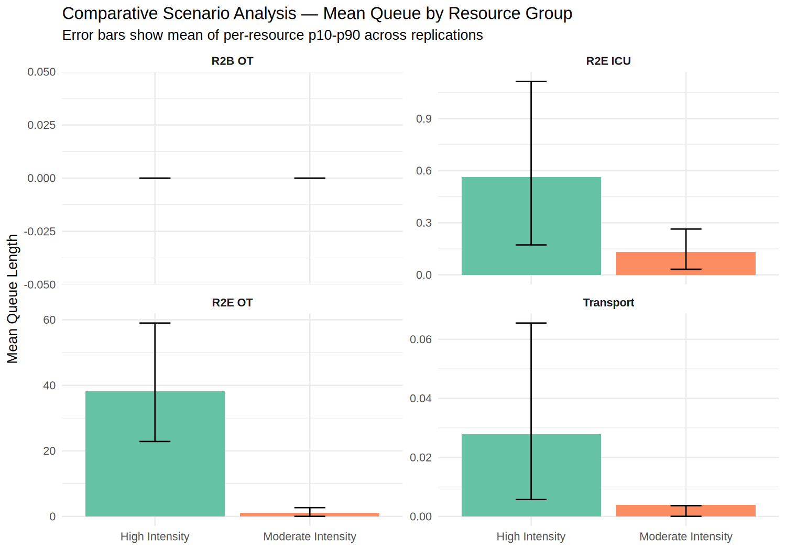

# Battlefield Casualty Handling — Multi-Run Comparative Analysis

## Abstract

<small>[Return to Top](#contents)</small>

This document presents a multi-run (n≥30 replications, 95% confidence intervals) comparative analysis of the Battlefield Casualty Handling discrete event simulation under two named casualty-rate scenario profiles: `moderate_intensity` (a Falklands 1982-modified baseline, the same casualty rate underlying the illustrative single-run analysis in `docs/Single_Run_Analysis.md`) and `high_intensity` (an Okinawa exemplar, its casualty rates calibrated from FORECAS Tables A.7/A.9 [[1]](#references) and its died-of-wounds model from the rate the US Army reported on Okinawa [[2]](#references)). Where the single-run document establishes what the modelled deployed health system does under one seed and one casualty-rate assumption, this document establishes whether those findings are an artefact of that single draw and how the same system responds when casualty production is scaled to a materially higher intensity, using the project's multi-run replication framework, which executes independent stochastic replications of the discrete event simulation and aggregates outcomes as mean, 95% confidence interval, and p10–p90 range across runs.

Across 50 replications of each scenario (30 simulated days, seed 42), the comparison confirms that the current establishment's adequacy conclusion does not extrapolate from Falklands to Okinawa intensity: mean total casualties per run rise 2.33-fold, the R2E Operating Theatre mean queue rises approximately 36-fold, the R2E Intensive Care Unit mean queue rises approximately 4.3-fold from a low base, the R2E Holding bed mean queue rises approximately 4.3-fold from a base already materially non-zero, and the R2B Holding bed mean queue rises approximately 5.5-fold, while R2B OT queue remains at zero in both scenarios — not because R2B absorbs any of the surge, but because the model's existing bypass routing diverts all surgical overflow to an already-saturated R2E. Died-of-wounds rate as a proportion of WIA rises from 0.42% to 3.43%, though that row alone compares two campaigns' standards of care as well as two casualty volumes, each profile carrying the mortality model of the conflict its casualty rates come from. Transport (PMV Ambulance / HX240M) remains the one echelon with genuine headroom at both intensities.

## Contents

<small>[Return to Top](#contents)</small>

<!-- TOC START -->
- [Abstract](#abstract)
- [Contents](#contents)
- [Methodology](#methodology)
- [Comparative Scenario Analysis](#comparative-scenario-analysis)
  - [Casualty and Mortality Totals](#casualty-and-mortality-totals)
  - [Resource Queue Comparison (mean of per-resource mean queue, by group)](#resource-queue-comparison-mean-of-per-resource-mean-queue-by-group)
  - [Interpretation](#interpretation)
- [The R2B Pre-Open Hold Window](#the-r2b-pre-open-hold-window)
- [Conclusion](#conclusion)
- [References](#references)
<!-- TOC END -->

---

## Methodology

<small>[Return to Top](#contents)</small>

This analysis uses the project's comparative scenario runner (`run_scenario()` / `compare_scenarios()`, `R/scenario_runner.R`), which executes the multi-replication framework (`run_replications()`, `R/replication.R`) under a named scenario profile and aggregates queue and mortality KPIs across replications in the same mean (p10–p90), 95% CI format used throughout this project. A scenario profile is a named set of overrides applied on top of the shipped default `env_data.json` parameters; each profile's casualty-generation parameters (arrival-rate distributions, priority-severity mix, and died-of-wounds calibration) are calibrated against a named historical exemplar. The extent of that validation differs by profile and by parameter. Each profile's died-of-wounds ceilings are calibrated against a treated-cohort mortality rate reported for its own campaign, measured over casualties who reached a treatment facility alive rather than over all wounded (see the README's [Parameter Calibration](../README.md#parameter-calibration) and Further Development entry L22): `moderate_intensity` against the Falklands figure, `high_intensity` against the rate the US Army reported on Okinawa. What `high_intensity` still inherits from the Falklands-calibrated base is its priority split, its DNBI composition and its transport times, as the following paragraph sets out.

Both scenarios use the same health system establishment — the simulation's shipped default configuration, a representative combat brigade served by three Role 1 (R1) treatment teams, two Role 2 Basic (R2B) facilities, and one Role 2 Enhanced Heavy (R2E Heavy) hospital — since element, bed, and transport fleet counts are structural configuration, not scenario-eligible parameters. Only the casualty-generation parameters differ between `moderate_intensity` and `high_intensity`.

Two scenarios are compared — `moderate_intensity` (Falklands 1982 exemplar) and `high_intensity` (Okinawa exemplar, calibrated in its casualty generation and its died-of-wounds model but not in its triage, sub-type and transport assumptions) — both defined in `env_data.json` (Issue #54). A third, Vietnam-calibrated profile is not included: FORECAS's Appendix A has no standalone Vietnam combat-troop WIA/KIA distribution table (Table A.5 is Vietnam DNBI only) [[1]](#references), so no genuinely FORECAS-sourced Vietnam parameters exist to build one from.

**Run configuration:** 50 replications × 30 days (seed 42) were run for each scenario via:

```
Rscript scripts/run_scenarios.R --scenarios moderate_intensity,high_intensity --iterations 50 --days 30 --seed 42
```

`moderate_intensity` total casualties (441.6, 95% CI [441.0, 442.2]) match the documented seed-42 single-run baseline (437, `CLAUDE.md` Key Parameters) within 1.1%, confirming that the comparative runner reproduces the single-run baseline under the Falklands profile it is scenario-explicit about, consistent with the scenario mechanism's no-op guarantee for `default`.

---

## Comparative Scenario Analysis

<small>[Return to Top](#contents)</small>

### Casualty and Mortality Totals

| Metric | `moderate_intensity` (Falklands) | `high_intensity` (Okinawa) | Ratio |
|---|---|---|---|
| Total casualties/run | 437.8 (p10–p90: 362.7–528.0) | 1,021.0 (p10–p90: 906.5–1,138.5) | 2.33× |
| WIA/run | 188.7 (137.6–251.5) | 684.3 (586.2–792.5) | 3.63× |
| DOW/run | 0.78 (0–2.0) | 23.58 (18.0–32.1) | 30.2× |
| DOW/WIA rate | 0.42% (95% CI [0.29%, 0.54%]) | 3.43% (95% CI [3.24%, 3.61%]) | 8.24× |

The p10 to p90 spread on the casualty rows is the headline change from the previous measurement of this table, and it is the arrival process rather than the model around it. Both profiles now draw each stream's rate once per simulated day from the distribution its configuration names, so the between-day standard deviation the source reports reaches the output instead of being averaged away across 1,440 per-minute draws (see the README's [Casualty Generation](../README.md#casualty-generation)). Total casualties per `moderate_intensity` run previously spanned 439.0 to 444.1 between the 10th and 90th percentiles, a range of five casualties across a whole campaign; they now span 362.7 to 528.0. The means are essentially unmoved, 437.8 against 441.6, which is what an unchanged configured mean should produce. Every mean in this document should now be read against a distribution wide enough that a single run is a poor guide to it.

The died-of-wounds rows are the other change from the previous measurement, and unlike the spread they are not a discovery about the system: `high_intensity` now carries a mortality model calibrated against Okinawa rather than one inherited from the Falklands-calibrated base, so its died-of-wounds figures moved from a Falklands ceiling paired with modern treatment technique to a 1945 pairing (see the README's [Scenario Profiles](../README.md#scenario-profiles)). The 30-fold ratio between the profiles is therefore a comparison of two campaigns' mortality experience as well as of two casualty volumes, and the two effects cannot be separated within this table.

The two rows are also resolved very differently. The `moderate_intensity` figure is a single 50-replication measurement of a response averaging well under one death per replication, which 50 replications resolve only to roughly ±0.13 percentage points (see the README's [Further Development](../README.md#further-development) entry L22 for where that figure comes from); it moves between control seeds by about as much as its own interval spans, so the figure to quote for that profile is the 150-replication pooled one in the README's [Scenario Profiles](../README.md#scenario-profiles), 0.368% (95% CI [0.310%, 0.426%]) on the treated cohort. The `high_intensity` figure rests on some 24 deaths per replication and is correspondingly well resolved, its 3.43% sitting inside the 3.471% (95% CI [3.360%, 3.583%]) that the same 150-replication pooling gives. The intervals in both cases are correctly specified, the replications behind them being independent of one another (see the README's [Multi-run Replication Framework](../README.md#multi-run-replication-framework)). The queue rows below are better resolved than either at the same replication count, being time-weighted occupancy measures with far more events behind each replication.

### Resource Queue Comparison (mean of per-resource mean queue, by group)

| Resource group | `moderate_intensity` mean queue | `high_intensity` mean queue | Ratio |
|---|---|---|---|
| R2B OT | 0.000 | 0.000 | — |
| R2B Hold | 0.593 | 3.228 | 5.45× |
| R2E OT | 1.063 | 38.17 | 35.9× |
| R2E ICU | 0.131 | 0.564 | 4.29× |
| R2E Hold | 0.622 | 2.694 | 4.33× |
| Transport (PMV Ambulance / HX240M) | 0.00386 | 0.0278 | 7.22× (small in both) |



### Interpretation

The comparison exposes a structural fragility that the single-run baseline could not surface on its own, and it locates that fragility in the operating theatres. Mean R2E OT queue rises from 1.06 casualties at Falklands-equivalent load to 38.2 under `high_intensity`, a factor of roughly 36, which is by a wide margin the largest movement anywhere in the model. The mechanism is the surgical roster: a casualty seizes a theatre before it seizes one of the three surgical sections that staff them, so a room reads as queued while its occupant waits for staff, and at Okinawa-intensity arrival rates that wait dominates. The ratio has fallen sharply from the roughly 180-fold previously reported, and the reason is instructive rather than reassuring: the Falklands-load figure rose almost fivefold, from 0.227 to 1.06, while the surge figure barely moved. An arrival process that can deliver a heavy day produces theatre contention at Falklands rates too, so what the previous measurement read as a fragility confined to peer conflict is better read as one that peer conflict makes acute. R2E ICU rises from 0.131 to 0.564, a factor of 4.3, and is the flattest of the three R2E groups under surge: with only the damage control cohort taking a stabilisation episode, intensive care carries one episode for half the surgical population and two for the other half rather than two for everyone. R2E holding beds rise from 0.622 to 2.69, a factor of 4.3, and absorb what intensive care does not, since the holding bed is where a casualty goes when no intensive care bed is free and where those awaiting strategic evacuation stage. Both R2E theatre and R2E intensive care queues read slightly shorter than the previous measurement of this table, at 38.2 against 39.8 and 0.564 against 0.618, while every other queue reads longer; the profile's calibrated mortality is what separates them, a casualty who dies of wounds leaving the queue for the resource that would otherwise have treated them.

R2B OT queue remains at 0 in both scenarios — not because R2B absorbs any of the surge, but because the OT-bypass routing diverts casualties requiring surgery to R2E whenever the theatre is busy or queued, or the surgical section is closed for longer than the pre-open hold window, rather than letting them wait; under `high_intensity`, this shunts the entire surge onto an R2E that has limited further capacity to absorb it. The hold window bounds how long a casualty may wait for a section about to reopen and so cannot produce a standing queue, which is why the queue reads zero even with the window open (see [The R2B Pre-Open Hold Window](#the-r2b-pre-open-hold-window)). R2B Hold bed queue, already identified as a Falklands-rate bottleneck (see the single-run analysis's [R2B Hold Bed Saturation](Single_Run_Analysis.md#r2b-hold-bed-saturation--stream-decomposition-and-intervention-analysis) finding), increases roughly 5-fold (0.593 to 3.23), driven by the proportional increase in non-surgical WIA volume rather than any change to DNBI generation, since DNBI generation rate is not one of the parameters a scenario profile overrides.

Transport remains the one echelon with genuine headroom: mean queue stays a small fraction of a casualty even at 2.3× total casualty volume, consistent with the single-run analysis's [Transport Fleet Capacity Margin](Single_Run_Analysis.md#transport-fleet-capacity-margin) finding that the PMV Ambulance/HX240M pool is not the binding constraint at the Falklands-derived rate. The absolute figures are nonetheless some 300 times larger than they were before the arrival process was rebuilt around per-day rate draws, at 0.0039 and 0.028 casualties against 0.0000113 and 0.000131, because a queue forms on peak days where a flattened arrival process produced none at all. The margin is wide and it is no longer untouched, which is what makes a re-run of the dedicated fleet-size sweep against the current arrival process the outstanding work rather than a re-run at higher intensity alone (see the README's Further Development entry L19).

DOW/WIA rate rises from 0.42% to 3.43%, a factor of roughly 8, on intervals that do not overlap. What that factor measures has changed with this table, and it is worth being explicit about, because it is the one row here that is no longer a statement about the modelled health system alone. Each profile now carries the mortality model of the campaign its casualty rates come from, so the gap between the rows is the combined effect of three things: Okinawa's heavier casualty volume, the treatment queues that volume produces, and a standard of surgical and resuscitative care four decades older than the Falklands profile's. The first two belong to this comparison; the third is a property of the calibration and would be present at equal casualty volumes. A planner reading the ratio as the cost of surge alone would overstate it substantially. What survives unambiguously is the mechanism the queue rows establish: at Okinawa intensity the deaths are driven by treatment queues deep enough that removing an intensive care episode and a theatre episode from half the operated population, which is what the surgical pathway split does, does not relieve them.

---

## The R2B Pre-Open Hold Window

<small>[Return to Top](#contents)</small>

R2B fields one surgical section per team on a 12-hour shift against a theatre available around the clock, so for half of each day the theatre stands ready with nobody rostered to operate in it. `r2b.surgery.pre_open_window_min` sets how long a casualty who arrives in that half may be held forward for the section, rather than being diverted to R2E as every off-shift arrival previously was (see the README's [R2B Trajectory](../README.md#r2b-trajectory)). The window ships at 60 minutes and has no source, so what it does is a question for measurement rather than for argument.

A single run cannot answer it. Turning the window on shifts simmer's single global random stream, so a zero-window run and a 60-minute run at the same seed are different realisations rather than a controlled comparison, and at seed 42 the forward surgery count moves the opposite way to the population mean. The table below is therefore 50 replications at each setting, run at control seed 42 under the shipped default configuration. Every figure is a per-replication mean with a 95% confidence interval.

| Measure | Window 0 (instant diversion) | Window 60 min (shipped) |
| --- | --- | --- |
| Casualties held forward | 0 | 5.64 [5.03, 6.25] |
| R2B surgeries | 50.78 [49.20, 52.36] | 56.42 [54.53, 58.31] |
| Bypassed, section off shift | 65.66 [63.99, 67.33] | 62.02 [60.00, 64.04] |
| Bypassed, theatre busy or queued | 7.56 [6.75, 8.37] | 7.10 [6.18, 8.02] |
| R2B OT utilisation (24-hour room) | 7.4% [7.2%, 7.6%] | 8.3% [8.0%, 8.6%] |
| R2B surgical section utilisation | 6.9% [6.7%, 7.1%] | 7.6% [7.4%, 7.9%] |
| R2E first surgeries | 99.88 [97.82, 101.94] | 98.90 [96.99, 100.81] |
| R2E theatre entry deferred (ICU full) | 12.40 [11.45, 13.35] | 11.20 [10.18, 12.22] |
| Died of wounds per run | 1.10 [0.79, 1.41] | 0.78 [0.57, 0.99] |
| Treated-cohort died-of-wounds rate | 0.63% [0.45%, 0.81%] | 0.44% [0.32%, 0.55%] |
| Total casualties | 381.18 [380.79, 381.57] | 381.22 [380.89, 381.55] |

The window does what it was added to do, and the accounting closes. Roughly 5.6 casualties are held forward per run, forward surgeries rise by 5.6, and the off-shift bypass count falls by 3.6; the intervals on the first two overlap almost exactly, which is what a mechanism that converts a diversion into a forward operation and nothing else should produce. Forward theatre utilisation rises by about a fifth in relative terms, from 7.4% to 8.3% of room time, and section utilisation with it.

The concern the mechanism raises is that a held casualty occupies the single forward theatre for the whole hold and then for the operation, so each hold might displace the cases arriving behind it. The measurement says it does not, at this window: the theatre-busy bypass count is 7.56 against 7.10, an interval overlap wide enough that no displacement is detectable. What bounds the effect is the same thing that bounds the hold, since a 60-minute window reaches only the last hour of a 720-minute closed period and can hold at most one casualty per team at a time.

The rearward effect is small but consistent in direction. R2E performs about one fewer first operation per run and defers theatre entry about one fewer time, both movements with intervals that overlap zero, which is what shifting five or six operations forward out of about a hundred should look like against replication-to-replication variation. Mortality falls, from 1.10 deaths per run to 0.78, and the treated-cohort rate with it, from 0.63% to 0.44%. Both intervals sit at or below the approximately 0.46% Ajax Bay bound the project's one-sided calibration check applies (see the README's Further Development entry L22), so neither ceiling is adjusted; the movement is in the direction the mechanism predicts, earlier surgery for the casualties it reaches, but a response averaging about one death per replication is not resolved to a factor by 50 replications and the direction is the defensible reading rather than the size.

Three limits apply to this comparison. It was run at the shipped default configuration only, so it says nothing about how the window behaves under surge, where the forward theatre is contended and displacement would be likelier to bite; the comparative scenario figures above were not re-measured for it. It also predates both the generator reparameterisation described in the [Conclusion](#conclusion) and the rebuild of the arrival process around per-day rate draws, so both arms of it were measured against streams realising between 79% and 99% of their configured means and carrying almost no day-to-day variation. The comparison between the arms is unaffected, both having been run under the same generator, but the absolute counts in it are well below what the shipped configuration now produces, and the question the window turns on, whether a hold displaces the cases arriving behind it, is precisely the question a peaky arrival process would answer differently. The table has not been re-measured and re-measuring it is the outstanding work on this section. And 60 minutes is one point on a range the screening bounds run from zero to six hours, so this establishes that the shipped value pays for itself, not that it is the value that pays best.

---

## Conclusion

<small>[Return to Top](#contents)</small>

The system's resilience to surge is directly quantified rather than inferred. This multi-run comparison confirms that neither R2B nor R2E can absorb Okinawa-intensity casualty rates without fundamental redesign: R2E OT mean queue rises approximately 36-fold and R2E Hold mean queue approximately 4-fold relative to the Falklands-modified baseline, R2B Hold queue rises approximately 5-fold, and DOW/WIA rate rises by a factor of roughly 8, of which only part is attributable to surge (see the interpretation above), all while R2B OT queue remains at zero only because the existing bypass routing shunts all surgical overflow onto an already-saturated R2E rather than R2B absorbing any of the surge itself. Effective LSCO medical support at Okinawa intensity would require scalable holding capacity at forward echelons, a deeper surgical roster at R2E, and dynamic load-balancing between R2B and R2E, capabilities the current static establishment does not provide.

These figures were regenerated at 50 replications per scenario after the arrival generators were rebuilt around per-day rate draws and thinning, and they supersede the comparison made while a rate redrawn every simulated minute was flattening each stream's day-to-day variation to roughly a quarter of a plain Poisson process's (see the README's [Casualty Generation](../README.md#casualty-generation)). The means barely move: `moderate_intensity` total casualties from 441.6 to 437.8 per run and `high_intensity` from 1,015.6 to 992.3, which is what an unchanged configured mean should produce. What moves is the spread and everything that depends on it. The 10th to 90th percentile range on `moderate_intensity` total casualties widens from 439.0-444.1 to 362.7-528.0, and the queue rows widen with it.

The direction of that movement is what makes this the most consequential of the generator changes for the findings above. Every ratio in the tables compresses, because the Falklands-load arm rises far more than the surge arm: the R2E theatre mean queue at `moderate_intensity` rises from 0.227 to 1.06 while the `high_intensity` figure falls slightly, from 40.8 to 39.8 as then measured, and the headline ratio falls from roughly 180 to roughly 37. A ratio compressing is easy to misread as a system found more robust than it was. It is the opposite. The surge arm is close to unmoved because it was already generating contention on most days; the baseline arm rises because it now has bad days at all. What the previous arrival process supported was the claim that theatre contention is a peer-conflict problem, and that claim does not survive the correction. Transport shows the same pattern in a smaller register, its Falklands-load mean queue rising from around one ten-thousandth of a casualty to roughly four thousandths, small in absolute terms and no longer indistinguishable from zero.

The tables were then re-measured again when `high_intensity` gained a died-of-wounds model calibrated to Okinawa in place of the one it had inherited from the Falklands-calibrated base, which is the version shown above and which supersedes the `high_intensity` figures quoted in the two paragraphs before this one. The profile's own rows move as that calibration intends, DOW/WIA from 0.88% to 3.43%, and its queue rows move a little with them: the theatre and intensive care queues shorten, 39.8 to 38.2 and 0.618 to 0.564, because a casualty who dies of wounds leaves the queue for the resource that would have treated them, while the queues further from the point of death lengthen alongside a casualty count that reads 1,021.0 against 992.3. The `moderate_intensity` arm is untouched by that change and reproduced every figure above exactly, which is the evidence that the two arms differ only where they are meant to.

The qualitative conclusion is unchanged and the quantitative one is now measured against an arrival process that reproduces both the daily rate and the day-to-day variation the configuration names. The run was made in an unpinned R 4.3.3 sandbox rather than the project's pinned Dev Container, under the same caveat as the other figures refreshed alongside it (see `CLAUDE.md`'s Key Parameters provenance caveats). `images/scenario_comparison.png` was regenerated alongside the tables by the command given above. A comparable Vietnam-intensity comparison remains unavailable pending a genuine FORECAS-sourced Vietnam combat-troop WIA/KIA table.

---

## References

<small>[Return to Top](#contents)</small>

<!-- REFERENCES START -->

[1] Blood, CG; Zouris, JM; Rotblatt, D; (1998) *Using the Ground Forces Casualty System (FORECAS) to Project Casualty Sustainment*. Retrieved 20 Jul 25, from https://ia803103.us.archive.org/18/items/DTIC_ADA339487/DTIC_ADA339487_text.pdf

[2] Marble, S. (2025). Both joint and not: Medical support at Okinawa, 1945. *Joint Force Quarterly*, *117*(2), article 11. National Defense University Press. Retrieved 17 Aug 26, from https://digitalcommons.ndu.edu/joint-force-quarterly/vol117/iss2/11/

<!-- REFERENCES END -->
