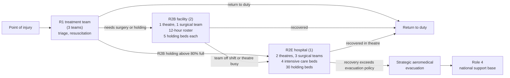

# Surgical Hours, Not Operating Theatres: Sizing the Land-Based Trauma System for Large Scale Combat Operations

## Abstract

<small>[Return to Top](#contents)</small>

**Background**

Casualty estimation is critical to the planning and design of the land-based trauma system deployed to support operations. Recent conflicts have produced lower casualty rates than those previously observed, or those expected in future large scale combat operations [[1]](#references), so a health system sized against recent experience is likely to not be adequate to handle the casualties of these more intense war fighting scenarios [[2]](#references).

**Objective**

To identify options to improve the land-based trauma system, to establish where that system fails as casualty intensity rises, and to state what the evidence supports for each lever a planner controls.

**Methods**

A discrete event simulation of a brigade force with aligned health assets was run at two casualty intensities derived from the FORECAS projection study [[3]](#references), a moderate intensity calibrated to the Falklands 1982 campaign and a high intensity calibrated to Okinawa 1945. Each lever the model can vary was then varied in a replicated experiment of 30 campaigns of 360 days. This paper reads those measurements as planning options. Every figure is quoted from the results paper [[4]](#references) and every experimental design is stated in the methods paper [[5]](#references).

**Results**

Casualty volume rises <!-- GEN cell:scenario_totals::Total casualties/run::Ratio::mean -->2.34×<!-- /GEN --> from moderate to high intensity, while the Role 2 Enhanced (R2E) operating theatre queue rises <!-- GEN cell:scenario_queue::R2E operating theatre::Ratio::mean -->239.26×<!-- /GEN --> and R2E intensive care <!-- GEN cell:scenario_queue::R2E intensive care::Ratio::mean -->969.24×<!-- /GEN --> ([Results](Results.md#comparative-scenario-analysis)). The principal constraint is surgical team scheduling: a casualty occupies a theatre while waiting for a rostered team, and the teams work 12-hour shifts against theatres available around the clock. At high intensity the R2E theatre queue stands empty for <!-- GEN cell:queue_clearance::R2E operating theatres::High: queue empty::mean -->1%<!-- /GEN --> of the campaign and is still growing when it ends, while at moderate intensity it stands empty for <!-- GEN cell:queue_clearance::R2E operating theatres::Moderate: queue empty::mean -->68%<!-- /GEN --> ([Results](Results.md#queue-behaviour-over-the-campaign)). The shipped 21-day evacuation policy is the only setting in the doctrinal range that is stable, and strategic evacuation absorbs the loss of up to 5% of sorties without cost but not much more ([Results](Results.md#national-support-base-and-strategic-airlift)). Several effects could not be separated from random variation, and the replications each would need are stated.

**Conclusion**

Extending surgical team coverage towards 24 hours at Role 2 Basic (R2B) and R2E is the first priority and needs no additional operating theatres. The evacuation policy, the strategic airlift schedule and the R2B holding establishment are the next levers the evidence supports, in that order. Delivering post-operative intensive care forward and enlarging the R2E holding pool beyond its shipped size are not supported.

## Contents

<small>[Return to Top](#contents)</small>

<!-- TOC START -->
- [Abstract](#abstract)
- [Contents](#contents)
- [Introduction](#introduction)
- [The System and the Evidence Labels](#the-system-and-the-evidence-labels)
- [Where the Trauma System Fails First](#where-the-trauma-system-fails-first)
- [Every Lever, and What the Evidence Supports](#every-lever-and-what-the-evidence-supports)
- [Recommendations in Priority Order](#recommendations-in-priority-order)
  - [1. Extend Surgical Team Coverage Towards 24 Hours](#1-extend-surgical-team-coverage-towards-24-hours)
  - [2. Hold the Evacuation Policy and Protect the Strategic Airlift](#2-hold-the-evacuation-policy-and-protect-the-strategic-airlift)
  - [3. Increase R2B Holding Capacity to Clear the Forward Queue](#3-increase-r2b-holding-capacity-to-clear-the-forward-queue)
  - [4. Hold Casualties at R2B for a Team About to Return](#4-hold-casualties-at-r2b-for-a-team-about-to-return)
  - [5. Size the Medical Evacuation Fleet at Three Ambulances and Four Trucks](#5-size-the-medical-evacuation-fleet-at-three-ambulances-and-four-trucks)
  - [6. Use the Forward Surgical Saturation Release Only Where the Base Can Absorb It](#6-use-the-forward-surgical-saturation-release-only-where-the-base-can-absorb-it)
  - [What Resourcing Alone Does Not Fix, and What Is Not Supported](#what-resourcing-alone-does-not-fix-and-what-is-not-supported)
- [Effects the Simulation Could Not Resolve](#effects-the-simulation-could-not-resolve)
- [Research Agenda](#research-agenda)
- [Limitations](#limitations)
- [Conclusion](#conclusion)
- [References](#references)
<!-- TOC END -->

---

## Introduction

<small>[Return to Top](#contents)</small>

A planner designing a deployed health system faces a single problem with many parts: the system has to be sized before its deployment to support a campaign, against a casualty load nobody can know in advance. Optimising it means trading one part of the system against another, more surgical capacity against more holding beds, more evacuation lift against more in-theatre recovery, with a fixed establishment and a finite lift to move it.

Casualty volumes expected in large scale combat operations exceed those the deployed health systems of the past two decades were built around [[1]](#references), and planning assumptions carried forward from those operations understate both the volume and the acuity a peer fight would produce [[2]](#references). An establishment drawn from the last campaign is a baseline that may not transfer.

This paper reads the measurements of the results paper [[4]](#references) as planning options and states no measurement of its own. Every figure it quotes is regenerated from the tracked evidence, is tagged with the section of the results paper it comes from, and cannot differ from it. The experimental designs, the interval method and the replication counts are in the methods paper [[5]](#references). The first part below locates where the system fails as casualty intensity rises. The second sets every lever the simulation can evaluate in one table, each with an evidence label. The third turns the table into recommendations in priority order. The fourth states the effects the simulation could not resolve, and the fifth the research that would resolve them.

---

## The System and the Evidence Labels

<small>[Return to Top](#contents)</small>

The simulation is a discrete event model in which each casualty moves rearward through the echelons of allied medical support doctrine [[6]](#references): Role 1 (R1) primary care, R2B damage control surgery and short-term holding, R2E definitive surgery, intensive care and in-theatre recovery, and strategic aeromedical evacuation to a Role 4 national support base. The establishment is a combat brigade served by three R1 treatment teams, two R2B facilities and one R2E hospital. The system is described in full in the system reference [[7]](#references).

Not every finding rests on the same strength of evidence. Each lever therefore carries a label saying what its evidence supports. A label attaches to a particular claim, so a lever whose diagnosis is measured may still have a remedy that is untested.

| Label | Meaning |
|---|---|
| **Measured** | The effect is established. Direction and approximate size are both supported. |
| **Direction only** | The effect points the way expected and the mechanism is confirmed, but its size is not established. |
| **Unresolved** | The available compute could not separate the effect from random variation. Figures are bounds, not estimates. |
| **Untested** | The simulation cannot evaluate the option as presently built. |

Two readings of the results paper govern every statement below. Where two intervals overlap the simulation has not established a difference, and the gap between the two averages should not be acted on. And the interval describes how precisely an average is known, not how much one campaign varies: the campaigns themselves spread many times more widely than the average is uncertain, so a system sized against the average under-provides for the campaign that arrives ([Results: scenario totals](Results.md#comparative-scenario-analysis)).

---

## Where the Trauma System Fails First

<small>[Return to Top](#contents)</small>

**The establishment gives way at the R2E operating theatres before anywhere else, and it is already under strain at moderate intensity.** Casualty volume rises <!-- GEN cell:scenario_totals::Total casualties/run::Ratio::mean -->2.34×<!-- /GEN --> from moderate to high intensity while the R2E theatre queue rises <!-- GEN cell:scenario_queue::R2E operating theatre::Ratio::mean -->239.26×<!-- /GEN -->, the R2E intensive care queue <!-- GEN cell:scenario_queue::R2E intensive care::Ratio::mean -->969.24×<!-- /GEN --> and the R2E holding queue <!-- GEN cell:scenario_queue::R2E holding beds::Ratio::mean -->615.43×<!-- /GEN --> ([Results: comparative scenario analysis](Results.md#comparative-scenario-analysis)). Sizing the system from the casualty ratio alone would under-provide surgery by two orders of magnitude. Three of the four bedded pools grow together, the signature of three stages of one pathway rather than three independent constraints, so relieving one without the others moves the wait rather than removing it. **Evidence: measured.**

**Surgical team scheduling is the principal constraint.** A casualty takes an operating theatre before taking one of the surgical teams that staff it, so a theatre stands occupied while the casualty inside it waits for a team. The theatres are available around the clock and the teams work 12-hour shifts. Adding theatres would therefore not relieve a queue that measures a wait for people. The R2E theatre queue at moderate intensity averages <!-- GEN cell:scenario_queue::R2E operating theatre::Moderate intensity mean queue::mean -->2.324<!-- /GEN --> casualties, so the establishment is not comfortably adequate even at the lower rate ([Results: comparative scenario analysis](Results.md#comparative-scenario-analysis)). In the verified seed-42 campaign the single second-shift section carried the whole night-time surgical load and was busier and queued longer than the first-shift sections ([Results: Annex A](Results.md#annex-a-model-verification-of-one-seed-42-campaign)). **Evidence: measured.**

**The same shortfall takes a different form at each intensity.** At high intensity the R2E theatre queue stands empty for <!-- GEN cell:queue_clearance::R2E operating theatres::High: queue empty::mean -->1%<!-- /GEN --> of the campaign and its longest unbroken run above zero, in days with the interquartile range, is <!-- GEN cell:queue_clearance::R2E operating theatres::High: longest run above zero (days)::full -->354.9 (352.5–358.4)<!-- /GEN --> days; at moderate intensity it stands empty for <!-- GEN cell:queue_clearance::R2E operating theatres::Moderate: queue empty::mean -->68%<!-- /GEN --> and its longest run is <!-- GEN cell:queue_clearance::R2E operating theatres::Moderate: longest run above zero (days)::full -->13.4 (11.1–15.5)<!-- /GEN --> days ([Results: queue behaviour over the campaign](Results.md#queue-behaviour-over-the-campaign)). A queue that clears is a surge problem, answered by capability brought to bear on the heavy day and stood down afterwards. A queue that never clears is an establishment problem, and no surge capability reaches it because there is no trough to surge into. Surgical hours are therefore a standing measure at high intensity and a surge measure at moderate, and a force sized for one is not sized for the other. **Evidence: measured.**

**At high intensity the R2E queues have no level to be sized against.** Over a 360-day campaign the R2E theatre queue is classified as <!-- GEN cell:long_horizon_stability::R2E operating theatre queue::High intensity::full -->**drifting, +11.1%/block**, 40.5 to 605.9<!-- /GEN --> (the drift per 30-day block, then the first and last block means), and the holding, intensive care and strategic evacuation backlogs drift the same way, while no response at moderate intensity shows a trend its own interval can separate from zero ([Results: sustained operations](Results.md#sustained-operations)). The moderate-intensity result is an absence of detectable trend rather than a demonstration of a level. A high-intensity queue figure is therefore a point on a growing backlog, and the finding that the queue does not clear is firmer for it. **Evidence: measured.**

**Intensive care is rationed rather than queued.** When R2E intensive care is full the simulation gives some casualties a holding bed instead and defers others' surgery until a bed is free, so the shortfall appears as casualties receiving a lesser standard of care rather than as a queue. At high intensity the share of post-definitive care delivered in a holding bed reaches 100% in the median campaign from day <!-- GEN cell:degraded_care::High intensity: Post-definitive care::First day the median daily rate reaches 100%::mean -->5<!-- /GEN -->, and over the whole campaign it is <!-- GEN cell:degraded_care::High intensity: Post-definitive care::Whole campaign::mean -->99.6%<!-- /GEN --> against <!-- GEN cell:degraded_care::Moderate intensity: Post-definitive care::Whole campaign::mean -->66.7%<!-- /GEN --> at moderate intensity ([Results: queue behaviour over the campaign](Results.md#queue-behaviour-over-the-campaign)). A rate that is a standing condition from the first week is answered only by the establishment, not by a reserve brought forward on particular days. **Evidence: measured.**

**A zero R2B theatre queue signals a shortfall being exported, not spare capacity.** The routing policy moves a casualty requiring surgery to R2E whenever the R2B theatre is occupied or its team is off shift beyond the pre-open window, so no queue can form there ([Results: comparative scenario analysis](Results.md#comparative-scenario-analysis)). Any measure of whether R2B is adequately resourced has to count what was sent rearward, not what waited.

---

## Every Lever, and What the Evidence Supports

<small>[Return to Top](#contents)</small>

Each row of the table is one lever a planner controls, with the setting the evidence supports and the measurement that supports it. The figures are quoted from the section of the results paper linked in the row.

| Lever | Setting supported | What the measurement shows | Evidence |
|---|---|---|---|
| Surgical team coverage at R2B and R2E | Towards 24 hours | Theatre queue rises <!-- GEN cell:scenario_queue::R2E operating theatre::Ratio::mean -->239.26×<!-- /GEN --> with intensity; teams are the limit ([Results](Results.md#comparative-scenario-analysis)) | Diagnosis **measured**; sourcing the hours **untested** |
| R2B holding beds per unit | Ten | Forward queue falls from <!-- GEN cell:hold_threshold_beds::5 (shipped)::R2B hold mean queue::mean -->4.90<!-- /GEN --> to <!-- GEN cell:hold_threshold_beds::10::R2B hold mean queue::mean -->0.26<!-- /GEN --> ([Results](Results.md#r2b-holding-capacity-and-evacuation-threshold)) | **Measured** |
| R2B evacuation threshold | Not a remedy; it moves the queue, not the outcome | One day loads the R2E holding queue to <!-- GEN cell:hold_threshold_threshold::1 day::R2E hold mean queue::mean -->2.217<!-- /GEN --> with returns to duty at <!-- GEN cell:hold_threshold_threshold::1 day::Returns to duty::full -->1665 [1630, 1700]<!-- /GEN --> against <!-- GEN cell:hold_threshold_threshold::Disabled (shipped)::Returns to duty::full -->1687 [1663, 1711]<!-- /GEN --> disabled ([Results](Results.md#r2b-holding-capacity-and-evacuation-threshold)) | **Measured** |
| R2B pre-open hold window | 60 minutes | <!-- GEN cell:hold_window::Casualties held at R2B::Window 60 min::mean -->80.03<!-- /GEN --> casualties held forward and off-shift diversions change by <!-- GEN cell:hold_window::Diverted, team off shift::Difference::mean -->−60.93<!-- /GEN --> ([Results](Results.md#r2b-pre-open-hold-window)) | **Measured** forward; downstream R2E load **unresolved** |
| Ambulance fleet | Three | Queue <!-- GEN cell:transport::1::Ambulance mean queue::mean -->1.4397<!-- /GEN --> at one vehicle, <!-- GEN cell:transport::3 (current ambulance)::Ambulance mean queue::mean -->0.0171<!-- /GEN --> at three ([Results](Results.md#transport-fleet-size)) | **Measured** at both intensities |
| Truck fleet | Four | Queue <!-- GEN cell:transport::4 (current truck)::Truck mean queue::mean -->0.0035<!-- /GEN --> at four ([Results](Results.md#transport-fleet-size)) | **Measured** at both intensities |
| Forward post-operative intensive care holding | Not supported | R2E intensive care queue <!-- GEN cell:forward_hold::Off (current)::R2E ICU mean queue::mean -->1.578<!-- /GEN --> with none held forward and <!-- GEN cell:forward_hold::240 min::R2E ICU mean queue::mean -->0.771<!-- /GEN --> at a 240-minute window ([Results](Results.md#forward-holding-of-post-operative-intensive-care)) | **Unresolved** |
| Intensive care rationing gate | Retain | R2E intensive care utilisation <!-- GEN cell:icu_gate::R2E ICU utilisation (%)::Without the rule::mean -->94.8<!-- /GEN -->% without the gate and <!-- GEN cell:icu_gate::R2E ICU utilisation (%)::With the rule::mean -->87.1<!-- /GEN -->% with it ([Results](Results.md#post-operative-intensive-care-gate)) | Load **measured**; mortality **unresolved** |
| Theatre evacuation policy | 21 days | At 30 days post-definitive intensive care access is <!-- GEN cell:policy::Post-definitive ICU access (%)::30 d::mean -->3.3<!-- /GEN -->% against <!-- GEN cell:policy::Post-definitive ICU access (%)::21 d (shipped)::mean -->31.4<!-- /GEN -->% ([Results](Results.md#evacuation-policy)) | **Measured** |
| R2E holding beds | Shipped 30, within 15 of any larger pool | Holding queue <!-- GEN cell:establishment::R2E hold mean queue::30 beds (shipped)::mean -->0.32<!-- /GEN --> at 30 beds and <!-- GEN cell:establishment::R2E hold mean queue::45 beds::mean -->0.00<!-- /GEN --> at 45 ([Results](Results.md#r2e-holding-establishment)) | **Measured** at the shipped policy; joint grid with the policy **untested** |
| Forward surgical saturation release | Eight, where the national support base can absorb it | Theatre queue <!-- GEN cell:saturation::Theatre mean queue::0 (disabled)::mean -->5.77<!-- /GEN --> disabled and <!-- GEN cell:saturation::Theatre mean queue::8 (shipped)::mean -->3.95<!-- /GEN --> at eight ([Results](Results.md#forward-surgical-saturation-release)) | **Measured** for queue and work moved; mortality **unresolved** |
| Strategic sortie interval | Seven days or shorter | Mean wait <!-- GEN cell:airlift_interval::Mean wait (days)::7 days (shipped)::mean -->0.39<!-- /GEN --> days at seven and <!-- GEN cell:airlift_interval::Mean wait (days)::14 days::mean -->27.35<!-- /GEN --> at fourteen ([Results](Results.md#national-support-base-and-strategic-airlift)) | **Measured** |
| Strategic sortie reliability | Losses of 5% or less | <!-- GEN cell:airlift_collapse::10%::Collapsed::mean -->3<!-- /GEN --> of 30 campaigns collapse at 10% loss ([Results](Results.md#national-support-base-and-strategic-airlift)) | **Measured** |
| Casualty surge event response | Policies to recover holding capacity | Event casualties die of wounds at <!-- GEN cell:casualty_surge::Died-of-wounds rate, event casualties::Events injected::mean -->0.77%<!-- /GEN --> against <!-- GEN cell:casualty_surge::Died-of-wounds rate, ordinary casualties::Events injected::mean -->0.37%<!-- /GEN --> for ordinary casualties ([Results](Results.md#casualty-surge-events)) | Cost **measured**; remedies **untested** |
| Establishment as a variable (team and bed counts) | Not evaluable | Team counts are fixed structure and cannot be swept | **Untested** |

---

## Recommendations in Priority Order

<small>[Return to Top](#contents)</small>

**Recommendations follow the lever table, ordered by how directly each improves the health outcome of the force.** A lever addressing the principal constraint ranks above one that is better measured but acts where the system is not failing.

### 1. Extend Surgical Team Coverage Towards 24 Hours

**Surgical team hours are the capacity to add, at both R2B and R2E, and the theatres to use them already exist.** **Evidence for the diagnosis: measured. Evidence for the best means of sourcing the hours: untested.**

At R2B each of the two facilities fields one surgical team on a 12-hour shift against a theatre available around the clock, so for half of each day the theatre stands ready with nobody rostered to operate in it. In the verified seed-42 campaign most casualties diverted from R2B to R2E were diverted because the team was off shift rather than because the theatre was busy ([Results: Annex A](Results.md#annex-a-model-verification-of-one-seed-42-campaign)). Time to surgery is among the strongest determinants of survival after severe battlefield injury [[8]](#references), so a casualty who travels further to reach a surgeon because none is rostered is a clinical cost rather than an administrative one. Extending coverage needs no additional principal equipment. It does need provision in the operational viability period, the organisational design and the workforce model, which are the instruments through which the hours would have to be found.

Whether the hours are a standing establishment or a surge measure depends on the intensity planned for. At high intensity the hours must be permanently established, because the queue has no trough; at moderate intensity they can be held as a capability brought to bear on the heavy day. How to source them is a separate question that the simulation cannot yet answer, since extending the rostered teams' hours and fielding additional teams deliver coverage at different costs in personnel, sustainment and clinical risk, and team counts are fixed structure. Making the establishment variable is the first item of the research agenda.

### 2. Hold the Evacuation Policy and Protect the Strategic Airlift

**The shipped 21-day theatre evacuation policy is the only setting in the doctrinal range that is both admissible against the historical envelope and stable over a sustained campaign.** The realised in-theatre share is an output of the policy, and against the historical range of in-theatre retention it is admissible only for 21 and 30 days, a 15-day policy retaining <!-- GEN cell:policy::In-theatre share (%)::15 d::mean -->5.2<!-- /GEN -->% and a 45-day policy <!-- GEN cell:policy::In-theatre share (%)::45 d::mean -->66.5<!-- /GEN -->% ([Results: evacuation policy](Results.md#evacuation-policy)). Of those two, only 21 is stable. At 30 days both R2E pools sit at full occupancy for the whole closing quarter, post-definitive intensive care access falls from <!-- GEN cell:policy::Post-definitive ICU access (%)::21 d (shipped)::mean -->31.4<!-- /GEN -->% to <!-- GEN cell:policy::Post-definitive ICU access (%)::30 d::mean -->3.3<!-- /GEN -->% and <!-- GEN cell:policy::Never evacuated by horizon::30 d::mean -->422.2<!-- /GEN --> casualties per campaign are still waiting to be evacuated when the horizon closes against <!-- GEN cell:policy::Never evacuated by horizon::21 d (shipped)::mean -->2.7<!-- /GEN --> at 21 days ([Results: evacuation policy](Results.md#evacuation-policy)). The price of stability is real, since returns to duty peak at 30 days and the 30-day policy is also the one that costs deaths of wounds, but it is the price of a system that does not saturate. **Evidence: measured.**

**Strategic airlift is limited by how many sorties fly, and the shipped schedule sits near the edge of a cliff.** At the shipped seven-day interval the mean wait is <!-- GEN cell:airlift_interval::Mean wait (days)::7 days (shipped)::mean -->0.39<!-- /GEN --> days, and shortening the interval buys almost nothing because the wait is already near zero. Lengthening it does not degrade smoothly: at ten days the mean wait is <!-- GEN cell:airlift_interval::Mean wait (days)::10 days::mean -->8.44<!-- /GEN --> days and at fourteen <!-- GEN cell:airlift_interval::Mean wait (days)::14 days::mean -->27.35<!-- /GEN -->, because once the sorties flown fall below the evacuation decisions the backlog accumulates for the rest of the campaign ([Results: national support base and strategic airlift](Results.md#national-support-base-and-strategic-airlift)). Cancellation behaves the same way, and the two levers are close to interchangeable when measured by the sorties they leave flown, so a planner buys the number of sorties that fly over the campaign rather than frequency or reliability separately. The sortie loss the trauma system can absorb is also a cliff: no campaign collapses at 0% or 5% loss, and <!-- GEN cell:airlift_collapse::10%::Collapsed::full -->3 of 30<!-- /GEN --> collapse at 10%, rising to <!-- GEN cell:airlift_collapse::25%::Collapsed::full -->16 of 30<!-- /GEN --> at 25% ([Results: national support base and strategic airlift](Results.md#national-support-base-and-strategic-airlift)). The median campaign shows nothing wrong across most of that range, so a reader watching typical performance would not see the risk. Whether any reliability is achievable is a question about airframes, weather and tasking that sits outside the simulation. **Evidence: measured.**

**Demand on the national support base is a sustained level, not a terminal surge.** Over a 360-day campaign the Role 4 census rises to a plateau, with a peak of <!-- GEN cell:airlift_baseline::Role 4 peak occupancy (concurrent patients)::Moderate intensity::mean -->181.67<!-- /GEN --> concurrent patients at moderate intensity and <!-- GEN cell:airlift_baseline::Role 4 peak occupancy (concurrent patients)::High intensity::mean -->198.03<!-- /GEN --> at high, because sortie capacity caps what reaches the base ([Results: national support base and strategic airlift](Results.md#national-support-base-and-strategic-airlift)). A demand signal for the base should therefore be derived from the theatre's evacuation pipeline, in particular its sortie capacity, rather than from a casualty estimate, and phased as a sustained load. The wait also consumes clinical capacity: the evacuation wait holds <!-- GEN cell:airlift_baseline::Share of R2E holding beds held by the evacuation wait::Moderate intensity::mean -->2%<!-- /GEN --> of the R2E holding beds at moderate intensity and <!-- GEN cell:airlift_baseline::Share of R2E holding beds held by the evacuation wait::High intensity::mean -->27%<!-- /GEN --> at high, so a lever that delays a sortie propagates into intensive care. **Evidence: measured.**

### 3. Increase R2B Holding Capacity to Clear the Forward Queue

**R2B holding is a standing shortfall at both intensities, and beds are the cleaner remedy.** The R2B holding queue carries <!-- GEN cell:scenario_queue::R2B holding beds::Moderate intensity mean queue::mean -->6.648<!-- /GEN --> casualties waiting at moderate intensity, the largest queue any pool carries at moderate intensity, against <!-- GEN cell:scenario_queue::R2E operating theatre::Moderate intensity mean queue::mean -->2.324<!-- /GEN --> at the R2E theatres ([Results: comparative scenario analysis](Results.md#comparative-scenario-analysis)). Raising the establishment from five to ten beds per unit takes the forward queue from <!-- GEN cell:hold_threshold_beds::5 (shipped)::R2B hold mean queue::full -->4.90 [3.68, 6.12]<!-- /GEN --> to <!-- GEN cell:hold_threshold_beds::10::R2B hold mean queue::full -->0.26 [0.09, 0.42]<!-- /GEN --> without a resolved cost to the R2E pools behind it, but returns to duty are <!-- GEN cell:hold_threshold_beds::5 (shipped)::Returns to duty::full -->1687 [1663, 1711]<!-- /GEN --> at five beds and <!-- GEN cell:hold_threshold_beds::10::Returns to duty::full -->1678 [1649, 1707]<!-- /GEN --> at ten, so the purchase is relief of a forward queue and not a measured gain in outcome ([Results: R2B holding capacity and evacuation threshold](Results.md#r2b-holding-capacity-and-evacuation-threshold)). An evacuation threshold relieves the same queue by moving casualties rearward early: at one day it takes the forward queue to <!-- GEN cell:hold_threshold_threshold::1 day::R2B hold mean queue::mean -->0.07<!-- /GEN --> and loads the R2E holding queue to <!-- GEN cell:hold_threshold_threshold::1 day::R2E hold mean queue::mean -->2.217<!-- /GEN -->, again without a resolved change in returns to duty. A casualty needs the same convalescence wherever it is served, so neither lever changes how much recovery the system must deliver, only where it is delivered. Where the establishment can be grown, capacity is the cleaner purchase, because it adds no load to R2E. **Evidence: measured.**

### 4. Hold Casualties at R2B for a Team About to Return

**A 60-minute pre-open window keeps a meaningful number of casualties forward, cuts diversions caused by the team being off shift and raises R2B surgery, and whether it reduces the surgical load reaching R2E is not established.** The window held <!-- GEN cell:hold_window::Casualties held at R2B::Window 60 min::mean -->80.03<!-- /GEN --> casualties per campaign at R2B against none with a zero window, off-shift diversions changed by <!-- GEN cell:hold_window::Diverted, team off shift::Difference::full -->−60.93 [−91.91, −29.96]<!-- /GEN --> and R2B surgeries by <!-- GEN cell:hold_window::R2B surgeries::Difference::full -->+36.73 [+19.19, +54.28]<!-- /GEN -->, all three intervals clear of zero ([Results: R2B pre-open hold window](Results.md#r2b-pre-open-hold-window)). R2E first surgeries changed by <!-- GEN cell:hold_window::R2E first surgeries::Difference::full -->−15.00 [−74.83, +44.83]<!-- /GEN -->, an interval wide enough to contain both no change and a substantial fall, and the replications needed to settle it are in [Effects the Simulation Could Not Resolve](#effects-the-simulation-could-not-resolve). Mortality is unchanged between the arms within the resolution available, which is an absence of evidence rather than evidence of safety. **Evidence: measured on casualties held, diversions avoided and R2B surgeries gained; unresolved on R2E load and mortality.**

### 5. Size the Medical Evacuation Fleet at Three Ambulances and Four Trucks

**Three ambulances carry the inter-echelon load between R1, R2B and R2E, and two would carry it with a reduced margin.** The ambulance queue collapses between one and two vehicles and flattens from three, from <!-- GEN cell:transport::1::Ambulance mean queue::mean -->1.4397<!-- /GEN --> at one to <!-- GEN cell:transport::2::Ambulance mean queue::mean -->0.0866<!-- /GEN --> at two and <!-- GEN cell:transport::3 (current ambulance)::Ambulance mean queue::mean -->0.0171<!-- /GEN --> at three, and nothing is bought beyond the third vehicle ([Results: transport fleet size](Results.md#transport-fleet-size)). The margin survives at high intensity, where one vehicle queues at <!-- GEN cell:transport_high::1::Ambulance mean queue::mean -->46.7132<!-- /GEN --> and three at <!-- GEN cell:transport_high::3 (current ambulance)::Ambulance mean queue::mean -->0.2188<!-- /GEN -->, so the boundary between an inadequate and an adequate fleet does not move with casualty intensity. These are the ambulances that move casualties between echelons, not those integral to the combat force that move casualties from the point of injury to R1. **Evidence: measured.**

### 6. Use the Forward Surgical Saturation Release Only Where the Base Can Absorb It

**Releasing casualties to strategic evacuation with the definitive repair outstanding, once the forward theatre queue reaches a threshold, cuts the R2E theatre queue and moves the operation to the national support base.** The theatre queue falls from <!-- GEN cell:saturation::Theatre mean queue::0 (disabled)::full -->5.77 [3.82, 7.71]<!-- /GEN --> with the release disabled to <!-- GEN cell:saturation::Theatre mean queue::8 (shipped)::full -->3.95 [2.71, 5.19]<!-- /GEN --> at the shipped threshold of eight, and the cost is paid elsewhere: <!-- GEN cell:saturation::Released with repair outstanding::8 (shipped)::mean -->146.9<!-- /GEN --> casualties per campaign reach the base unrepaired and the base owes <!-- GEN cell:saturation::Role 4 operations owed::8 (shipped)::mean -->1127.1<!-- /GEN --> operations against <!-- GEN cell:saturation::Role 4 operations owed::0 (disabled)::mean -->963.4<!-- /GEN --> without the release ([Results: forward surgical saturation release](Results.md#forward-surgical-saturation-release)). Post-definitive intensive care access falls from <!-- GEN cell:saturation::Post-definitive ICU access (%)::0 (disabled)::mean -->35.1<!-- /GEN -->% to <!-- GEN cell:saturation::Post-definitive ICU access (%)::8 (shipped)::mean -->31.4<!-- /GEN -->%. The relief decays smoothly as the threshold rises, so the choice is where on a continuum to sit, and the one threshold that costs deaths is the most aggressive, at one casualty. The lever trades a forward queue for work the simulation reports but does not constrain at the national support base, so whether it is worth using depends on a capacity the model does not represent. **Evidence: measured for the queue, the releases and the work moved; unresolved for mortality at the shipped setting.**

### What Resourcing Alone Does Not Fix, and What Is Not Supported

**Two levers are not supported on the present evidence.** Holding operated casualties forward at R2B does not measurably relieve R2E intensive care: forward utilisation rises steadily across the windows because the policy is being applied, while the R2E queue is not monotone and every interval overlaps the interval with no forward holding ([Results: forward holding](Results.md#forward-holding-of-post-operative-intensive-care)). Both surgical pathways are eligible, so the lever reaches every casualty operated on at R2B. **Evidence: unresolved across the whole range tested.** Enlarging the R2E holding pool beyond 45 beds changes nothing a planner would act on, because at the shipped policy the pool is not the binding constraint: the residual queue of <!-- GEN cell:establishment::R2E hold mean queue::30 beds (shipped)::mean -->0.32<!-- /GEN --> at 30 beds is <!-- GEN cell:establishment::R2E hold mean queue::45 beds::mean -->0.00<!-- /GEN --> at 45, and nothing after that changes any outcome ([Results: R2E holding establishment](Results.md#r2e-holding-establishment)). **Evidence: measured.**

**Three conditions are properties of the design, not of any resource level.** First, the intensive care rationing gate relieves load, from <!-- GEN cell:icu_gate::R2E ICU utilisation (%)::Without the rule::mean -->94.8<!-- /GEN -->% utilisation without it to <!-- GEN cell:icu_gate::R2E ICU utilisation (%)::With the rule::mean -->87.1<!-- /GEN -->% with it, and its mortality cost is not established ([Results: post-operative intensive care gate](Results.md#post-operative-intensive-care-gate)). Casualties recovering in a holding bed die at a higher rate than those in an intensive care bed, <!-- GEN cell:icu_gate_pathways::Holding bed::Rate::mean -->0.11%<!-- /GEN --> against <!-- GEN cell:icu_gate_pathways::Intensive care bed::Rate::mean -->0.02%<!-- /GEN -->, but that difference is built into the model rather than discovered by it. Second, a casualty surge event degrades care without exposing a new constraint: event casualties die of wounds at <!-- GEN cell:casualty_surge::Died-of-wounds rate, event casualties::Events injected::mean -->0.77%<!-- /GEN --> against <!-- GEN cell:casualty_surge::Died-of-wounds rate, ordinary casualties::Events injected::mean -->0.37%<!-- /GEN --> for ordinary casualties in the same campaigns, and the events also raise the ordinary rate from <!-- GEN cell:casualty_surge::Died-of-wounds rate, ordinary casualties::No events injected::mean -->0.29%<!-- /GEN --> to <!-- GEN cell:casualty_surge::Died-of-wounds rate, ordinary casualties::Events injected::mean -->0.37%<!-- /GEN --> ([Results: casualty surge events](Results.md#casualty-surge-events)). Policies to recover holding capacity during an event are untested. Third, the high-intensity backlog drifts without a level, so no establishment drawn from a high-intensity closing-window figure is a steady-state sizing ([Results: sustained operations](Results.md#sustained-operations)).

---

## Effects the Simulation Could Not Resolve

<small>[Return to Top](#contents)</small>

**Several effects could not be separated from random variation within the compute available, and are unmeasured rather than small.** The distinction decides whether acting on them is sound. The table gives each paired difference with its interval, the half-width the experiment sought, and the replications that half-width would need, regenerated from the tracked paired differences ([Results: resolution of paired differences](Results.md#resolution-of-paired-differences)).

<!-- GEN resolution -->
| Comparison | Paired difference | Half-width sought | Replications needed |
|---|---|---|---|
| Hold window, R2E first surgeries | −15.00 [−74.83, +44.83] | 2.0 | 24,655 |
| Hold window, R2E theatre entry deferred | −1.63 [−17.85, +14.58] | 1.0 | 7,246 |
| Hold window, diverted for a busy theatre | +15.33 [−7.88, +38.55] | 2.0 | 3,712 |
| Hold window, died of wounds | −0.43 [−2.75, +1.88] | 0.5 | 591 |
| Intensive care gate, died of wounds | +0.90 [−1.17, +2.97] | 0.5 | 471 |
| Policy 15 days against 21, died of wounds | −0.73 [−2.46, +0.99] | 1.0 | 82 |
| Policy 45 days against 21, died of wounds | +9.77 [+7.21, +12.32] | 1.0 | 181 |
| Policy 60 days against 21, died of wounds | +12.40 [+10.18, +14.62] | 1.0 | 137 |
| Saturation release at 8, died of wounds | −0.10 [−1.55, +1.35] | 1.0 | 58 |
| Saturation release at 8, returns to duty | +18.63 [−17.54, +54.81] | 10.0 | 361 |
<!-- /GEN -->

Three kinds of limit separate them. The hold window's downstream effects on R2E load are limited by the stream divergence between its arms, which grows with the campaign length, so lengthening the campaign did not resolve them and the replication counts above are far beyond what any horizon change buys. The mortality differences of the intensive care gate, the evacuation policy and the saturation release are limited by the rarity of the event: deaths of wounds at moderate intensity are rare enough that no realistic number of replications would separate two groups of a few dozen casualties, so answering them needs a different measure of harm. Forward holding is limited by the spread of the R2E queue across replications, and needs a test at high intensity as well as more replications.

---

## Research Agenda

<small>[Return to Top](#contents)</small>

**The lever this paper ranks first is one the simulation cannot yet evaluate, which sets the development priority.** Each item below names the decision it would unblock.

| Priority | Development | Decision it unblocks |
|---|---|---|
| 1 | Make the establishment variable, so team counts can be swept as fleet sizes already are | How best to source additional surgical team hours |
| 2 | Run the joint grid of evacuation policy against R2E holding establishment | Whether a larger pool would make a 30-day policy admissible and stable |
| 3 | Re-run the unresolved experiments at the replication counts the resolution table states | The hold window's effect on R2E load, and the cost of rationing and of the release |
| 4 | Sweep the R2B diversion thresholds across their range | Where to strike the trade between waiting forward and transferring load rearward |
| 5 | Test policies for recovering holding capacity during a casualty surge event, and the triggers for applying them | How to relieve the reversal of the intensive care and holding pathways under surge |
| 6 | Casualty severity conditioning of surgery durations | Whether theatre contention is understated on the heavy days it is measured on |
| 7 | A sustained-horizon sensitivity screen, and a sizing of the R2E establishment against the level its queues reach under a defined surge | Whether the leading parameters differ from those found at 30 days ([Results: sensitivity screens](Results.md#sensitivity-screens)) |

Alongside these, the simulated system's design and calibration would benefit from structured review by clinical and health planning subject matter experts. The parameters governing intensive care rationing and post-operative risk are informed estimates rather than measured values, and expert calibration would do more to improve confidence in the mortality findings than additional computation.

---

## Limitations

<small>[Return to Top](#contents)</small>

Four limitations bear on how the recommendations above should be read.

**The simulation is verified but not validated.** It behaves as its specification describes, which is a separate question from whether that specification represents the real trauma system well [[9]](#references). Verification is reported in [Annex A of the results paper](Results.md#annex-a-model-verification-of-one-seed-42-campaign). The treated-cohort died-of-wounds rates at the sustained horizon are reported in [Results](Results.md#treated-cohort-mortality), where the shipped configuration sits above the Ajax Bay bound its ceilings were fitted to at 30 days. Every lever above is a lever inside the simulation, and holds only as far as the simulation does.

**Compute time limited what could be measured.** The effects in the resolution table are unresolved for that reason or for the rarity of the event, and the replication counts that would settle them are stated there. This constrains the precision of the findings rather than their direction, and it bears hardest on mortality, which is the rarest quantity the simulation reports.

**Comparisons between two configurations are not perfectly controlled.** Changing a setting alters the sequence of random draws, so the two arms of a comparison generate different casualty streams and cannot be matched campaign for campaign. The effect is a loss of precision rather than a bias, which is why several comparisons are unresolved at the replication counts used. The casualty intensity comparison is unaffected, its arms differing by design rather than by a small perturbation.

**The high-intensity queue figures measure a backlog still growing, not a level.** The sustained-horizon measurement shows those queues still growing at the end of a year ([Results: sustained operations](Results.md#sustained-operations)), so no high-intensity R2E queue figure is a steady-state figure. Nothing recommended here depends on that level, the conclusion drawn from the queue being that it does not clear.

Two narrower caveats apply. Clinical teams are taken whole rather than by individual clinician, so team utilisation overstates scarcity where a procedure needs only part of a team; and one pool of R2E holding beds carries both in-theatre recovery and the strategic evacuation wait, so those queue figures combine two demands. The model's gaps are catalogued in the system reference [[7]](#references).

---

## Conclusion

<small>[Return to Top](#contents)</small>

This paper set out to identify options for improving the land-based trauma system, to establish where that system fails first as casualty intensity rises, and to state what the evidence supports for each lever a planner controls.

**The system does not scale from moderate to high casualty intensity, and it fails at the R2E operating theatres first.** Casualty volume rises <!-- GEN cell:scenario_totals::Total casualties/run::Ratio::mean -->2.34×<!-- /GEN --> while the R2E theatre queue rises <!-- GEN cell:scenario_queue::R2E operating theatre::Ratio::mean -->239.26×<!-- /GEN --> and R2E intensive care <!-- GEN cell:scenario_queue::R2E intensive care::Ratio::mean -->969.24×<!-- /GEN --> ([Results: comparative scenario analysis](Results.md#comparative-scenario-analysis)). The constraint is surgical team scheduling rather than theatre space, and it is present at moderate intensity too. It takes a different form at each intensity: at high intensity the theatre queue stands empty for <!-- GEN cell:queue_clearance::R2E operating theatres::High: queue empty::mean -->1%<!-- /GEN --> of the campaign and is still growing at its end, while at moderate intensity it clears for <!-- GEN cell:queue_clearance::R2E operating theatres::Moderate: queue empty::mean -->68%<!-- /GEN --> of it ([Results: queue behaviour over the campaign](Results.md#queue-behaviour-over-the-campaign)).

**The recommendations follow in priority order.** Extend surgical team coverage towards 24 hours at R2B and R2E, which needs no additional operating theatres. Hold the 21-day evacuation policy, the only stable setting in the doctrinal range, and protect the strategic airlift, whose schedule sits near a cliff: no campaign collapses up to 5% sortie loss and <!-- GEN cell:airlift_collapse::10%::Collapsed::full -->3 of 30<!-- /GEN --> collapse at 10% ([Results: national support base and strategic airlift](Results.md#national-support-base-and-strategic-airlift)). Raise R2B holding capacity to ten beds per unit to clear the forward queue, expecting relief of the queue and not a measured gain in returns to duty; an evacuation threshold relieves the same queue only by loading R2E. Hold casualties at R2B for a team about to return, which keeps <!-- GEN cell:hold_window::Casualties held at R2B::Window 60 min::mean -->80.03<!-- /GEN --> casualties forward per campaign without a resolved effect on R2E load ([Results: R2B pre-open hold window](Results.md#r2b-pre-open-hold-window)). Keep three ambulances and four trucks. Do not deliver post-operative intensive care forward, and do not enlarge the R2E holding pool beyond its shipped size.

**Further research would be worthwhile, and in three directions.** The most valuable is making the establishment variable within the simulation, which would allow the surgical coverage and holding capacity levers to be costed against each other rather than only argued from the mechanism. The second is the joint grid of evacuation policy against holding establishment, and the repeated analysis of the effects the resolution table leaves open. The third is structured expert review of the simulated system's design and calibration, which would do more for confidence in the mortality findings than any amount of additional computation.

---

## References

<small>[Return to Top](#contents)</small>

<!-- REFERENCES START -->

[1] Remondelli, M. H., Remick, K. N., Shackelford, S. A., Gurney, J. M., Pamplin, J. C., Polk, T. M., Potter, B. K., & Holt, D. B. (2023). Casualty care implications of large-scale combat operations. *Journal of Trauma and Acute Care Surgery*, *95*(2S), S180–S184. Retrieved 27 Aug 26, from https://pmc.ncbi.nlm.nih.gov/articles/PMC10389308/

[2] Fandre, M. (2020). Medical changes needed for large-scale combat operations: observations from Mission Command Training Program warfighter exercises. *Military Review*. Retrieved 27 Aug 26, from https://www.armyupress.army.mil/Journals/Military-Review/English-Edition-Archives/May-June-2020/Fandre-Medical-Changes/

[3] Blood, C. G., Zouris, J. M., & Rotblatt, D. (1998). *Using the Ground Forces Casualty System (FORECAS) to Project Casualty Sustainment*. Retrieved 20 Jul 25, from https://ia803103.us.archive.org/18/items/DTIC_ADA339487/DTIC_ADA339487_text.pdf

[4] Battlefield Casualty Handling project. (2026). *Measured Results of a Replicated Simulation of the Land-Based Trauma System*. Retrieved 03 Oct 26, from https://github.com/natosys/Battlefield-Casualty-Handling/blob/main/docs/Results.md

[5] Battlefield Casualty Handling project. (2026). *Experimental Design and Statistical Method for a Replicated Simulation of the Land-Based Trauma System*. Retrieved 06 Sep 26, from https://github.com/natosys/Battlefield-Casualty-Handling/blob/main/docs/Methods.md

[6] NATO Standardization Office. (2019). *AJP-4.10 Allied Joint Doctrine for Medical Support* (Edition C, Version 1). NATO Standardization Office. Retrieved 27 Aug 26, from https://www.coemed.org/files/stanags/01_AJP/AJP-4.10_EDC_V1_E_2228.pdf

[7] Battlefield Casualty Handling project. (2026). *Battlefield Casualty Handling*. Retrieved 07 Sep 26, from https://github.com/natosys/Battlefield-Casualty-Handling/blob/main/README.md

[8] Kotwal, R. S., Montgomery, H. R., Kotwal, B. M., Champion, H. R., Butler, F. K., Mabry, R. L., Cain, J. S., Blackbourne, L. H., Mechler, K. K., & Holcomb, J. B. (2011). Eliminating preventable death on the battlefield. *Archives of Surgery*, *146*(12), 1350–1358. Retrieved 27 Aug 26, from https://pmc.ncbi.nlm.nih.gov/articles/PMC5832013/

[9] Sargent, R. G. (2010). Verification and validation of simulation models. In *Proceedings of the 2010 Winter Simulation Conference* (pp. 166–183). IEEE. Retrieved 27 Aug 26, from https://www.informs-sim.org/wsc10papers/016.pdf

<!-- REFERENCES END -->
