# Measured Results of a Replicated Simulation of the Land-Based Trauma System

## Abstract

<small>[Return to Top](#contents)</small>

**Background**

A discrete event simulation of an Australian brigade-sized force and its land-based trauma system produces measurements that planners can read without the model's own interpretation attached. This document reports those measurements and nothing else: every replicated experiment and the verification of one seed-42 campaign, with a statement of why the sensitivity screens are not reported.

**Methods**

Each replicated experiment ran 30 independent replications of a 360-day campaign under the shipped configuration or a named variation, and measured queues and occupancy as whole-pool totals over each campaign's closing 90 days. Intervals are 95% Student $t$ intervals about the mean of per-replication values unless a section states otherwise. The designs are in [Methods](Methods.md).

**Results**

At moderate casualty intensity a campaign produced <!-- GEN cell:scenario_totals|Total casualties/run|Moderate intensity|mean -->5,277.8<!-- /GEN --> casualties and at high intensity <!-- GEN cell:scenario_totals|Total casualties/run|High intensity|mean -->12,448.5<!-- /GEN -->. Over the closing 90 days the mean R2E operating theatre queue was <!-- GEN cell:scenario_queue|R2E operating theatre|Moderate intensity mean queue|mean -->2.345<!-- /GEN --> casualties at moderate intensity and <!-- GEN cell:scenario_queue|R2E operating theatre|High intensity mean queue|mean -->652.705<!-- /GEN --> at high. At high intensity that queue stood empty for <!-- GEN cell:queue_clearance|R2E operating theatres|High: queue empty|full -->0%<!-- /GEN --> of the campaign and was still growing at day 360, while at moderate intensity it stood empty for <!-- GEN cell:queue_clearance|R2E operating theatres|Moderate: queue empty|full -->64%<!-- /GEN -->. Over the closing 90 days the national support base carried a mean census of <!-- GEN cell:role4_census_ward|Total, closing 90-day mean beds|Moderate intensity|mean -->143.65<!-- /GEN --> beds at moderate intensity and <!-- GEN cell:role4_census_ward|Total, closing 90-day mean beds|High intensity|mean -->189.57<!-- /GEN --> at high. The treated-cohort died-of-wounds rate of the shipped default configuration was <!-- GEN cell:dow_calibration|Shipped default|Treated-cohort died-of-wounds rate|full -->0.471% [0.407%, 0.535%]<!-- /GEN --> at 360 days.

**Conclusion**

The measurements record where queues form at each intensity and which responses each tested lever moved. Their reading as planning options is in [Planning Implications](Planning_Implications.md).

## Contents

<small>[Return to Top](#contents)</small>

<!-- TOC START -->
- [Abstract](#abstract)
- [Contents](#contents)
- [Scope and Conventions](#scope-and-conventions)
- [Comparative Scenario Analysis](#comparative-scenario-analysis)
- [Queue Behaviour over the Campaign](#queue-behaviour-over-the-campaign)
- [Sustained Operations](#sustained-operations)
  - [Demand, Utilisation and Shortfall per Day](#demand-utilisation-and-shortfall-per-day)
- [Treated-Cohort Mortality](#treated-cohort-mortality)
- [Forward Holding and Evacuation Levers](#forward-holding-and-evacuation-levers)
  - [R2B Pre-Open Hold Window](#r2b-pre-open-hold-window)
  - [R2B Holding Capacity and Evacuation Threshold](#r2b-holding-capacity-and-evacuation-threshold)
  - [Transport Fleet Size](#transport-fleet-size)
    - [Utilisation of Shared Fleets and Integral Evacuation Elements](#utilisation-of-shared-fleets-and-integral-evacuation-elements)
  - [Forward Holding of Post-Operative Intensive Care](#forward-holding-of-post-operative-intensive-care)
  - [Post-Operative Intensive Care Gate](#post-operative-intensive-care-gate)
  - [Evacuation Policy](#evacuation-policy)
  - [R2E Holding Establishment](#r2e-holding-establishment)
  - [High-Intensity Evacuation Policy and Holding Establishment](#high-intensity-evacuation-policy-and-holding-establishment)
  - [High-Intensity Strategic Sortie Interval by Policy and Holding Establishment](#high-intensity-strategic-sortie-interval-by-policy-and-holding-establishment)
  - [Moderate-Intensity Evacuation Policy and Holding Establishment](#moderate-intensity-evacuation-policy-and-holding-establishment)
  - [Forward Surgical Saturation Release](#forward-surgical-saturation-release)
  - [Surgical Team Establishment](#surgical-team-establishment)
  - [R2E Intensive Care Bed Establishment](#r2e-intensive-care-bed-establishment)
- [National Support Base and Strategic Airlift](#national-support-base-and-strategic-airlift)
- [Role 4 Bed Demand](#role-4-bed-demand)
- [Casualty Surge Events](#casualty-surge-events)
- [Casualty Surge Event Size](#casualty-surge-event-size)
- [Resolution of Paired Differences](#resolution-of-paired-differences)
- [Sensitivity Screens](#sensitivity-screens)
- [Annex A. Model Verification of One Seed-42 Campaign](#annex-a-model-verification-of-one-seed-42-campaign)
- [References](#references)
<!-- TOC END -->

---

## Scope and Conventions

<small>[Return to Top](#contents)</small>

This document states what the model measured. It makes no recommendation, ranks no option and draws no planning conclusion; each section gives the question the experiment asked, a protocol tag, the measurement and a neutral statement of what the measurement shows with its interval and resolution. The experimental designs, the interval constructions and the checks that defend them are in [Methods](Methods.md), and the reading of these results as planning options is in [Planning Implications](Planning_Implications.md).

A protocol tag has the form `[configuration · horizon · replications · measurement]`. A replication is one complete campaign from an empty system under its own random number stream. A pool's queue is the total number of casualties waiting across every bed of one type at one facility, and its occupancy is the time-weighted number of beds in use over the beds established, both measured over a campaign's closing 90 days unless a section states otherwise. Responses that accumulate over a campaign, such as returns to duty and deaths of wounds, are campaign totals. Ratios divide the high-intensity figure by the moderate-intensity one. Intervals are 95% Student $t$ intervals about the mean of per-replication values; a bound below zero for a quantity that cannot be negative is clamped at zero where a section says so, and an interval for a proportion of campaigns is an exact binomial interval.

Every table and every quoted figure is regenerated from the tracked evidence under `data/` by `scripts/render_results_tables.R`, and `tests/checks/check_results_tables.R` fails when the document disagrees with that evidence. A figure written in a sentence is a copy of a cell of the table beside it.

---

## Comparative Scenario Analysis

<small>[Return to Top](#contents)</small>

**Question.** How do casualty volume, mortality and the load on each resource pool differ between the moderate-intensity (Falklands 1982) and high-intensity (Okinawa 1945) casualty profiles, whose rates derive from the FORECAS projection study [[1]](#references), when the health system is identical? `[moderate_intensity and high_intensity · 360 d · 30 replications · pool totals, closing 90 d]`

<!-- GEN scenario_totals -->
| Metric | Moderate intensity | High intensity | Ratio |
|---|---|---|---|
| Total casualties/run | 5,277.8 [5,191.9, 5,363.6] (p10–p90: 5,019.3–5,565.2) | 12,448.5 [12,335.5, 12,561.4] (p10–p90: 12,150.8–12,801.7) | 2.36× |
| Wounded in action/run | 2,255.8 [2,186.1, 2,325.5] (p10–p90: 2,029.2–2,493.6) | 8,398.7 [8,301.7, 8,495.8] (p10–p90: 8,118.7–8,728.4) | 3.72× |
| Died of wounds/run | 15.50 [13.16, 17.84] (p10–p90: 8.9–24.5) | 560.23 [527.56, 592.91] (p10–p90: 454.1–670.1) | 36.1× |
| Died of wounds, as share of wounded | 0.68% [0.59%, 0.77%] | 6.66% [6.31%, 7.00%] | 9.83× |
<!-- /GEN -->

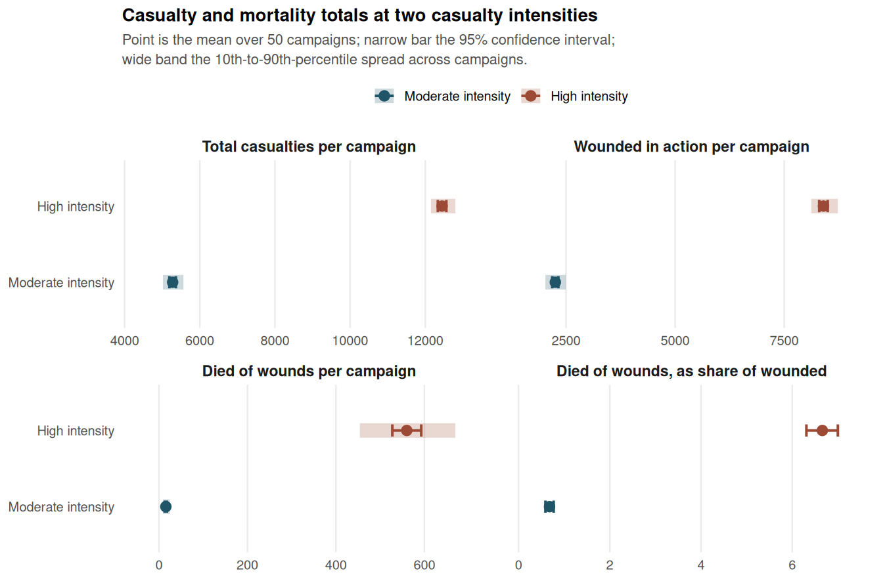

Each panel plots the moderate and high casualty intensities as a point with a narrow 95% confidence interval bar and a wide band for the 10th-to-90th-percentile spread across campaigns. The bar shows how precisely the average is known and the band shows how much one campaign varies.

Moderate intensity produced <!-- GEN cell:scenario_totals|Total casualties/run|Moderate intensity|mean -->5,277.8<!-- /GEN --> casualties per run (95% interval <!-- GEN cell:scenario_totals|Total casualties/run|Moderate intensity|ci -->[5,191.9, 5,363.6]<!-- /GEN -->) and high intensity <!-- GEN cell:scenario_totals|Total casualties/run|High intensity|mean -->12,448.5<!-- /GEN --> (<!-- GEN cell:scenario_totals|Total casualties/run|High intensity|ci -->[12,335.5, 12,561.4]<!-- /GEN -->), a ratio of <!-- GEN cell:scenario_totals|Total casualties/run|Ratio|full -->2.36×<!-- /GEN -->. Wounded in action rose by <!-- GEN cell:scenario_totals|Wounded in action/run|Ratio|full -->3.72×<!-- /GEN -->, died of wounds per run by <!-- GEN cell:scenario_totals|Died of wounds/run|Ratio|full -->36.1×<!-- /GEN --> and died of wounds as a share of wounded by <!-- GEN cell:scenario_totals|Died of wounds, as share of wounded|Ratio|full -->9.83×<!-- /GEN -->, from <!-- GEN cell:scenario_totals|Died of wounds, as share of wounded|Moderate intensity|mean -->0.68%<!-- /GEN --> to <!-- GEN cell:scenario_totals|Died of wounds, as share of wounded|High intensity|mean -->6.66%<!-- /GEN -->.

<!-- GEN scenario_queue -->
| Resource group | Moderate intensity mean queue | High intensity mean queue | Ratio |
|---|---|---|---|
| R2B operating theatre | 0.000 [0.000, 0.000] | 0.000 [0.000, 0.000] | not applicable |
| R2B holding beds | 3.836 [2.858, 4.814] | 35.949 [29.983, 41.915] | 9.37× |
| R2E operating theatre | 2.345 [1.740, 2.951] | 652.705 [599.802, 705.607] | 278.30× |
| R2E intensive care | 0.846 [0.617, 1.074] | 1,279.702 [1,258.380, 1,301.024] | 1513.12× |
| R2E holding beds | 0.278 [−0.059, 0.615] | 331.132 [306.074, 356.189] | 1191.99× |
| Ambulance and truck fleets | 0.020 [0.010, 0.031] | 0.237 [0.153, 0.320] | 11.73× |
<!-- /GEN -->

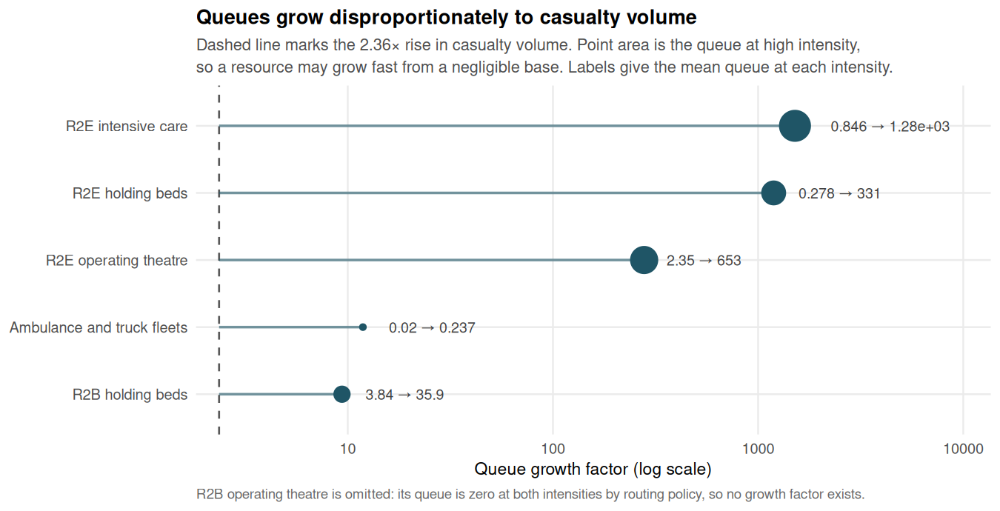

Queue growth factor from moderate to high intensity on a logarithmic scale, with a dashed reference line at the growth in casualty volume. Each point is sized by its absolute queue at high intensity.

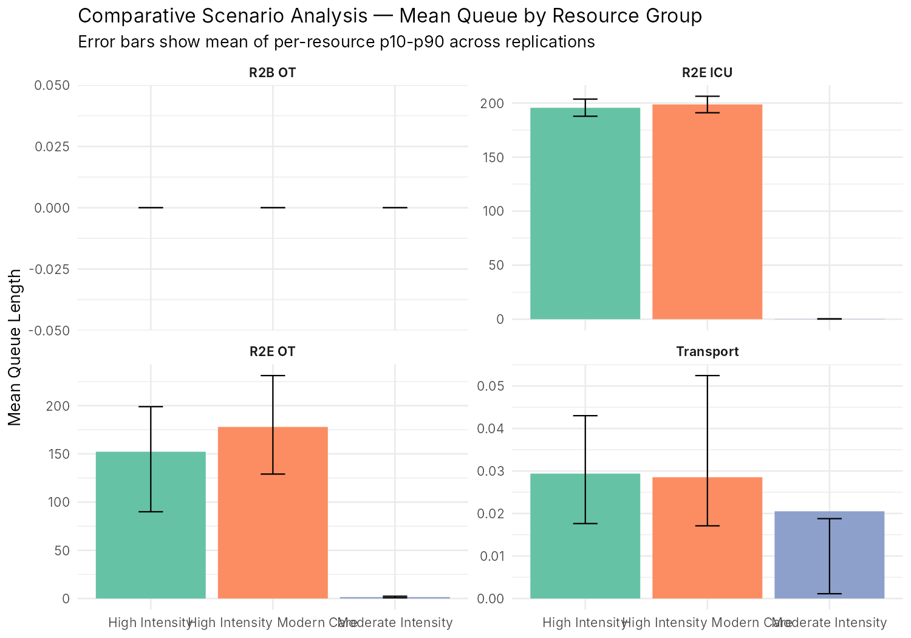

Mean queue length by resource group at each casualty intensity. Each panel has its own vertical scale, and the error bars show the spread across campaigns rather than a confidence interval.

The R2B operating theatre queue was zero at both intensities. At moderate intensity the R2B holding beds carried a mean queue of <!-- GEN cell:scenario_queue|R2B holding beds|Moderate intensity mean queue|mean -->3.836<!-- /GEN --> casualties (<!-- GEN cell:scenario_queue|R2B holding beds|Moderate intensity mean queue|ci -->[2.858, 4.814]<!-- /GEN -->), against <!-- GEN cell:scenario_queue|R2E operating theatre|Moderate intensity mean queue|mean -->2.345<!-- /GEN --> at the R2E operating theatres (<!-- GEN cell:scenario_queue|R2E operating theatre|Moderate intensity mean queue|ci -->[1.740, 2.951]<!-- /GEN -->). At high intensity the R2E operating theatre queue was <!-- GEN cell:scenario_queue|R2E operating theatre|High intensity mean queue|mean -->652.705<!-- /GEN --> (<!-- GEN cell:scenario_queue|R2E operating theatre|High intensity mean queue|ci -->[599.802, 705.607]<!-- /GEN -->), the R2E intensive care queue <!-- GEN cell:scenario_queue|R2E intensive care|High intensity mean queue|mean -->1,279.702<!-- /GEN --> (<!-- GEN cell:scenario_queue|R2E intensive care|High intensity mean queue|ci -->[1,258.380, 1,301.024]<!-- /GEN -->) and the R2E holding queue <!-- GEN cell:scenario_queue|R2E holding beds|High intensity mean queue|mean -->331.132<!-- /GEN --> (<!-- GEN cell:scenario_queue|R2E holding beds|High intensity mean queue|ci -->[306.074, 356.189]<!-- /GEN -->); the ratios to moderate intensity were <!-- GEN cell:scenario_queue|R2E operating theatre|Ratio|full -->278.30×<!-- /GEN -->, <!-- GEN cell:scenario_queue|R2E intensive care|Ratio|full -->1513.12×<!-- /GEN --> and <!-- GEN cell:scenario_queue|R2E holding beds|Ratio|full -->1191.99×<!-- /GEN -->. The ambulance and truck fleets queued <!-- GEN cell:scenario_queue|Ambulance and truck fleets|Moderate intensity mean queue|mean -->0.020<!-- /GEN --> and <!-- GEN cell:scenario_queue|Ambulance and truck fleets|High intensity mean queue|mean -->0.237<!-- /GEN --> casualties at the two intensities. The high-intensity R2E figures are means over a window in which the queues were still growing, as the sections that follow record, so they describe the closing 90 days and not a level.

---

## Queue Behaviour over the Campaign

<small>[Return to Top](#contents)</small>

**Question.** Does a pool's queue clear between its busy spells, or does it stand for the whole campaign, and how does the share of post-operative care delivered in a holding bed change with time? `[moderate_intensity and high_intensity · 360 d · 30 replications · pool totals, unbinned series]`

<!-- GEN queue_clearance -->
| Resource pool | Moderate: queue empty | Moderate: longest run above zero (days) | High: queue empty | High: longest run above zero (days) |
|---|---|---|---|---|
| R2B holding beds | 46% | 45.1 (38.8–50.3) | 5% | 208.0 (155.9–335.9) |
| R2E operating theatres | 64% | 13.1 (11.2–15.5) | 0% | 356.7 (345.4–358.9) |
| R2E intensive care | 63% | 13.2 (8.5–20.4) | 0% | 357.9 (355.7–358.6) |
| R2E holding beds | 93% | 19.3 (3.8–24.0) | 1% | 357.2 (356.9–357.7) |
<!-- /GEN -->

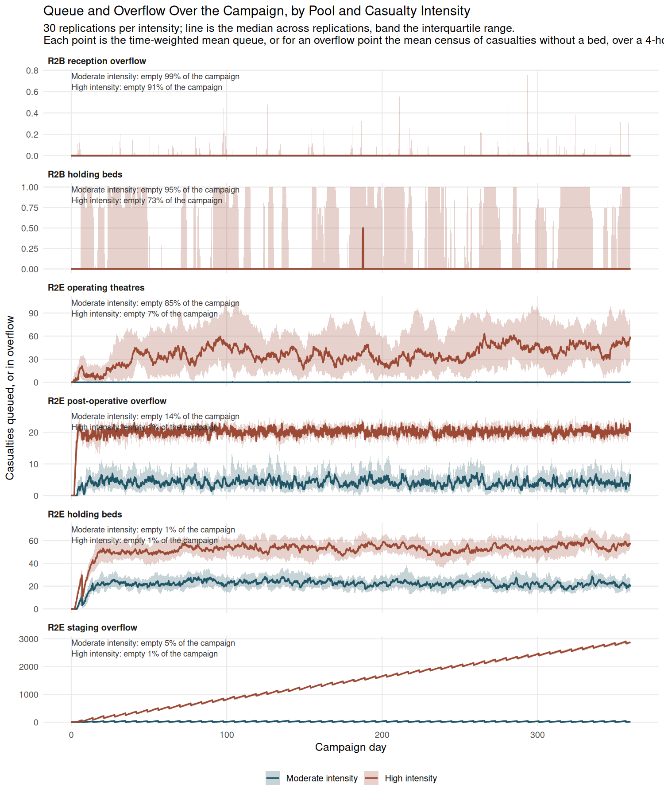

Queue length against campaign day for each pool, as the median across replications with an interquartile band, at each casualty intensity. Each panel is annotated with the share of the campaign the queue stood empty.

The table reports, for each pool and intensity, the median across replications of the share of the campaign the pool's queue stood empty and of the longest unbroken spell it did not, with the interquartile range of the spell in parentheses. At high intensity every pool listed stood empty for <!-- GEN cell:queue_clearance|R2E operating theatres|High: queue empty|full -->0%<!-- /GEN --> of the campaign or less, and the median longest spell above zero in the R2E operating theatres was <!-- GEN cell:queue_clearance|R2E operating theatres|High: longest run above zero (days)|full -->356.7 (345.4–358.9)<!-- /GEN --> of the 360 days. At moderate intensity the same pool stood empty for <!-- GEN cell:queue_clearance|R2E operating theatres|Moderate: queue empty|full -->64%<!-- /GEN --> of the campaign with a median longest spell of <!-- GEN cell:queue_clearance|R2E operating theatres|Moderate: longest run above zero (days)|full -->13.1 (11.2–15.5)<!-- /GEN --> days.

<!-- GEN degraded_care -->
| Intensity and stage | First day the median daily rate reaches 100% | First ten days | Last ten days | Whole campaign |
|---|---|---|---|---|
| Moderate intensity: Stabilisation | not reached | 47.4% | 49.2% | 50.6% |
| Moderate intensity: Post-definitive care | not reached | 61.6% | 68.9% | 68.3% |
| High intensity: Stabilisation | 7 | 71.5% | 100.0% | 99.2% |
| High intensity: Post-definitive care | 3 | 92.0% | 100.0% | 99.8% |
<!-- /GEN -->

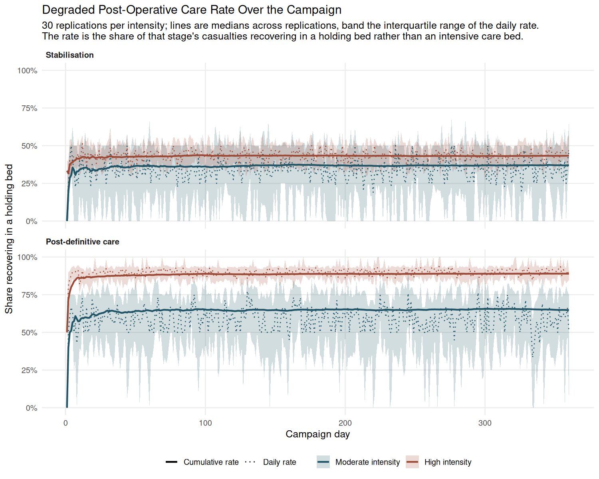

The share of casualties taking the holding-bed recovery against campaign day, stabilisation above and post-definitive care below, as a daily rate inside an interquartile band and as a running cumulative rate.

The degraded post-operative care rate is the share of casualties who took the holding-bed recovery in place of an intensive care bed at the point the decision was taken. At high intensity the median daily rate for post-definitive care first reached 100% on day <!-- GEN cell:degraded_care|High intensity: Post-definitive care|First day the median daily rate reaches 100%|full -->3<!-- /GEN --> and for stabilisation on day <!-- GEN cell:degraded_care|High intensity: Stabilisation|First day the median daily rate reaches 100%|full -->7<!-- /GEN -->; over the whole campaign <!-- GEN cell:degraded_care|High intensity: Post-definitive care|Whole campaign|full -->99.8%<!-- /GEN --> of post-definitive care and <!-- GEN cell:degraded_care|High intensity: Stabilisation|Whole campaign|full -->99.2%<!-- /GEN --> of stabilisation took the holding bed. At moderate intensity the whole-campaign rates were <!-- GEN cell:degraded_care|Moderate intensity: Post-definitive care|Whole campaign|full -->68.3%<!-- /GEN --> and <!-- GEN cell:degraded_care|Moderate intensity: Stabilisation|Whole campaign|full -->50.6%<!-- /GEN -->, and the median daily rate did not reach 100%.

---

## Sustained Operations

<small>[Return to Top](#contents)</small>

**Question.** Does each response settle to a level over a 360-day campaign, or does it keep moving? `[moderate_intensity and high_intensity · 360 d · 30 replications · twelve 30-day block means]`

Each response was reduced to twelve consecutive 30-day block means and classified from the trend over the late half of the campaign; the rule is in [Methods](Methods.md#classifying-stability).

<!-- GEN long_horizon_stability -->
| Response | Moderate intensity | High intensity |
|---|---|---|
| R2E operating theatre queue | converged at 3.27 | **drifting, +11.7%/block**, 36.9 to 573.6 |
| R2E holding bed queue | converged at 0.09 | **drifting, +9.3%/block**, 48.6 to 595.9 |
| R2E intensive care queue | converged at 1.05 | **drifting, +13.0%/block**, 32.5 to 1,590.1 |
| Strategic evacuation backlog | converged at 1.89 | **drifting, +12.4%/block**, 68.8 to 1,850.7 |
| R2B holding bed queue | converged at 4.73 | converged at 32.6 |
| Casualty arrivals per day | converged at 15.0 | converged at 34.6 |
| Deaths of wounds per day | converged at 0.03 | converged at 0.77 |
<!-- /GEN -->

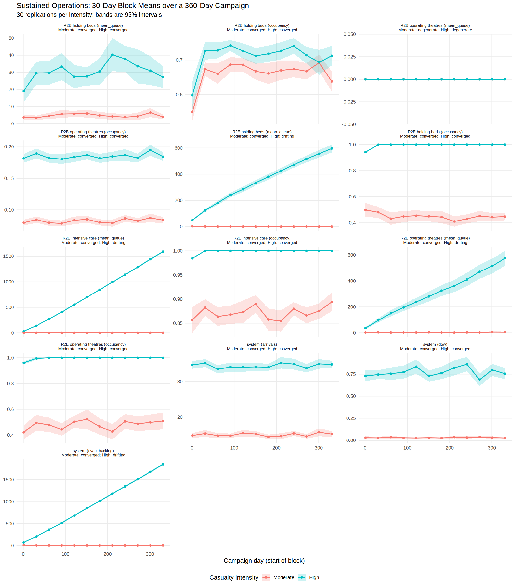

Block means of every queue, occupancy, arrival, evacuation backlog and mortality response over the campaign at the two casualty intensities, each panel headed by its stability classification at each intensity.

Four responses at high intensity were classified as drifting: the R2E operating theatre queue (<!-- GEN cell:long_horizon_stability|R2E operating theatre queue|High intensity|full -->**drifting, +11.7%/block**, 36.9 to 573.6<!-- /GEN -->), the R2E holding bed queue (<!-- GEN cell:long_horizon_stability|R2E holding bed queue|High intensity|full -->**drifting, +9.3%/block**, 48.6 to 595.9<!-- /GEN -->), the R2E intensive care queue (<!-- GEN cell:long_horizon_stability|R2E intensive care queue|High intensity|full -->**drifting, +13.0%/block**, 32.5 to 1,590.1<!-- /GEN -->) and the strategic evacuation backlog (<!-- GEN cell:long_horizon_stability|Strategic evacuation backlog|High intensity|full -->**drifting, +12.4%/block**, 68.8 to 1,850.7<!-- /GEN -->). The R2B holding bed queue at high intensity was classified as converged, at <!-- GEN cell:long_horizon_stability|R2B holding bed queue|High intensity|full -->converged at 32.6<!-- /GEN -->. No response at moderate intensity was classified as drifting; the R2E operating theatre queue was <!-- GEN cell:long_horizon_stability|R2E operating theatre queue|Moderate intensity|full -->converged at 3.27<!-- /GEN --> and the R2B holding bed queue <!-- GEN cell:long_horizon_stability|R2B holding bed queue|Moderate intensity|full -->converged at 4.73<!-- /GEN -->.

### Demand, Utilisation and Shortfall per Day

**Question.** How much more demand does the high-intensity profile place on the system than the moderate-intensity one, how fully is each R2E pool used over the closing 90 days, and at what rate does a pool fall behind where it has not settled? `[moderate_intensity and high_intensity · 360 d · 30 replications · closing 90 d and the late half of the campaign]`

<!-- GEN load_demand -->
| Demand measure | Moderate intensity | High intensity | Ratio |
|---|---|---|---|
| Wounded in action/run | 2,255.8 [2,186.1, 2,325.5] | 8,398.7 [8,301.7, 8,495.8] | 3.72× |
| R2B and R2E first surgeries/run | 2,291.8 [2,242.9, 2,340.6] | 5,115.8 [5,082.0, 5,149.6] | 2.23× |
| Post-definitive recovery dispositions/run | 3,149.6 [3,097.3, 3,202.0] | 5,674.4 [5,640.6, 5,708.3] | 1.80× |
<!-- /GEN -->

The wounded in action rose <!-- GEN cell:load_demand|Wounded in action/run|Ratio|full -->3.72×<!-- /GEN -->, the first surgeries at R2B and R2E <!-- GEN cell:load_demand|R2B and R2E first surgeries/run|Ratio|full -->2.23×<!-- /GEN --> and the post-definitive recovery dispositions <!-- GEN cell:load_demand|Post-definitive recovery dispositions/run|Ratio|full -->1.80×<!-- /GEN --> from moderate to high intensity. The surgeries and dispositions are per-campaign counts from the shipped configuration's arms of the [R2B pre-open hold window](#r2b-pre-open-hold-window) and [evacuation policy](#evacuation-policy) experiments, and the total casualties are in the [comparative scenario analysis](#comparative-scenario-analysis).

<!-- GEN load_shortfall -->
| Pool | Moderate: shortfall per day | Moderate: utilisation | High: shortfall per day | High: utilisation |
|---|---|---|---|---|
| R2E operating theatres | 0.016 [−0.005, 0.037] | 49.8% [45.9%, 53.8%] | 1.629 [1.505, 1.753] | 100.0% [100.0%, 100.0%] |
| R2E holding beds | 0.000 [−0.001, 0.001] | 44.8% [42.6%, 46.9%] | 1.459 [1.408, 1.511] | 100.0% [100.0%, 100.0%] |
| R2E intensive care | 0.004 [−0.003, 0.012] | 87.8% [86.8%, 88.9%] | 4.954 [4.905, 5.002] | 100.0% [100.0%, 100.0%] |
| Strategic evacuation backlog | 0.005 [−0.004, 0.014] | not applicable | 5.550 [5.499, 5.601] | not applicable |
<!-- /GEN -->

The shortfall per day is the slope of the 30-day block means over the late half of the campaign, the fit the stability classification uses, divided by the 30 days of a block; the estimator is defined in [Methods](Methods.md#classifying-stability). At moderate intensity every shortfall interval contains zero. At high intensity the R2E theatre queue grew by <!-- GEN cell:load_shortfall|R2E operating theatres|High: shortfall per day|full -->1.629 [1.505, 1.753]<!-- /GEN --> casualties a day, the holding bed queue by <!-- GEN cell:load_shortfall|R2E holding beds|High: shortfall per day|full -->1.459 [1.408, 1.511]<!-- /GEN -->, the intensive care queue by <!-- GEN cell:load_shortfall|R2E intensive care|High: shortfall per day|full -->4.954 [4.905, 5.002]<!-- /GEN --> and the strategic evacuation backlog by <!-- GEN cell:load_shortfall|Strategic evacuation backlog|High: shortfall per day|full -->5.550 [5.499, 5.601]<!-- /GEN -->. Over the closing 90 days the R2E theatres were in use <!-- GEN cell:load_shortfall|R2E operating theatres|Moderate: utilisation|full -->49.8% [45.9%, 53.8%]<!-- /GEN --> of the time at moderate intensity and <!-- GEN cell:load_shortfall|R2E operating theatres|High: utilisation|full -->100.0% [100.0%, 100.0%]<!-- /GEN --> at high, the holding beds <!-- GEN cell:load_shortfall|R2E holding beds|Moderate: utilisation|full -->44.8% [42.6%, 46.9%]<!-- /GEN --> and <!-- GEN cell:load_shortfall|R2E holding beds|High: utilisation|full -->100.0% [100.0%, 100.0%]<!-- /GEN -->, and the intensive care beds <!-- GEN cell:load_shortfall|R2E intensive care|Moderate: utilisation|full -->87.8% [86.8%, 88.9%]<!-- /GEN --> and <!-- GEN cell:load_shortfall|R2E intensive care|High: utilisation|full -->100.0% [100.0%, 100.0%]<!-- /GEN -->. The strategic evacuation backlog counts casualties awaiting a sortie and has no bed establishment, so it carries no utilisation.

---

## Treated-Cohort Mortality

<small>[Return to Top](#contents)</small>

**Question.** What fraction of casualties who reach an R2B or R2E facility die of wounds, measured against the historical anchor of the campaign each configuration models? `[default and moderate_intensity · 360 d · 3 measurements of 10 replications · pooled, Student t]`

<!-- GEN dow_calibration -->
| Configuration | Historical anchor | Treated-cohort died-of-wounds rate | Post-operative share of risk | Replications |
|---|---|---|---|---|
| Shipped default | at or below, 0.46% (Ajax Bay) | 0.471% [0.407%, 0.535%] | 11% | 30 |
| Moderate intensity | at or below, 0.46% (Ajax Bay) | 0.471% [0.407%, 0.535%] | 11% | 30 |
<!-- /GEN -->

The anchor is the three deaths of wounds among over 650 combat casualties treated by the Ajax Bay field hospital and its forward stations at Teal Inlet and Fitzroy [[2]](#references), an upper bound for the two Falklands-calibrated configurations. The shipped default's pooled rate over 360-day campaigns was <!-- GEN cell:dow_calibration|Shipped default|Treated-cohort died-of-wounds rate|full -->0.471% [0.407%, 0.535%]<!-- /GEN --> and moderate intensity's <!-- GEN cell:dow_calibration|Moderate intensity|Treated-cohort died-of-wounds rate|full -->0.471% [0.407%, 0.535%]<!-- /GEN -->, with post-operative care carrying <!-- GEN cell:dow_calibration|Shipped default|Post-operative share of risk|full -->11%<!-- /GEN --> of the shipped default's expected deaths. High intensity shares the mortality model and carries no anchor of its own, so its deaths of wounds are a model output, reported in [Comparative Scenario Analysis](#comparative-scenario-analysis). The calibration check `tests/checks/check_dow_calibration.R` runs at 30 days, the horizon at which the base rates and the post-operative multiplier were fitted.

---

## Forward Holding and Evacuation Levers

<small>[Return to Top](#contents)</small>

Each subsection varies one setting of the shipped configuration and reports the responses it moved. Experiments with several arms draw every arm from one control seed unless the subsection says otherwise, and the paired difference is reported where the arms are paired.

### R2B Pre-Open Hold Window

**Question.** What changes when a casualty needing surgery at R2B is held forward for a surgical section about to reopen rather than moved rearward at once? `[default, hold window 0 and 60 min · 360 d · 30 replications · campaign totals, paired difference]`

<!-- GEN hold_window -->
| Measure | Window 0 | Window 60 min | Difference |
| --- | --- | --- | --- |
| Casualties held at R2B | 0.00 | 88.87 | +88.87 [+85.42, +92.31] |
| R2B surgeries | 664.63 | 718.30 | +53.67 [+31.17, +76.16] |
| Diverted, team off shift | 1061.73 | 997.73 | −64.00 [−105.06, −22.94] |
| Diverted, theatre busy | 187.67 | 201.60 | +13.93 [−4.25, +32.11] |
| R2E first surgeries | 1584.37 | 1573.47 | −10.90 [−72.35, +50.55] |
| R2E theatre entry deferred | 223.13 | 220.23 | −2.90 [−20.63, +14.83] |
| Died of wounds per run | 10.73 | 10.67 | −0.07 [−2.25, +2.11] |
| Total casualties | 5423.97 | 5402.87 | −21.10 [−161.67, +119.47] |
<!-- /GEN -->

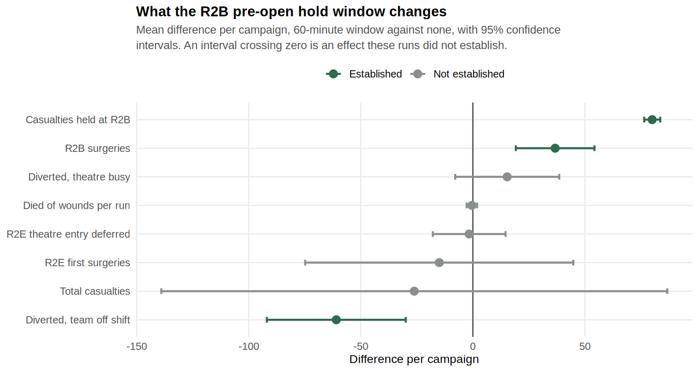

The paired difference per campaign for each of the eight measures with its 95% confidence interval against a vertical line at zero.

A 60-minute window held <!-- GEN cell:hold_window|Casualties held at R2B|Window 60 min|full -->88.87<!-- /GEN --> casualties per campaign at R2B against none with a zero window. R2B surgeries differed by <!-- GEN cell:hold_window|R2B surgeries|Difference|full -->+53.67 [+31.17, +76.16]<!-- /GEN --> and diversions for an off-shift section by <!-- GEN cell:hold_window|Diverted, team off shift|Difference|full -->−64.00 [−105.06, −22.94]<!-- /GEN -->. The differences in diversions for a busy theatre were <!-- GEN cell:hold_window|Diverted, theatre busy|Difference|full -->+13.93 [−4.25, +32.11]<!-- /GEN -->, in R2E first surgeries <!-- GEN cell:hold_window|R2E first surgeries|Difference|full -->−10.90 [−72.35, +50.55]<!-- /GEN -->, in R2E theatre entry deferrals <!-- GEN cell:hold_window|R2E theatre entry deferred|Difference|full -->−2.90 [−20.63, +14.83]<!-- /GEN -->, in died of wounds <!-- GEN cell:hold_window|Died of wounds per run|Difference|full -->−0.07 [−2.25, +2.11]<!-- /GEN --> and in total casualties <!-- GEN cell:hold_window|Total casualties|Difference|full -->−21.10 [−161.67, +119.47]<!-- /GEN -->.

**High-intensity profile.** The same comparison under `high_intensity` `[high_intensity, hold window 0 and 60 min · 360 d · 30 replications · campaign totals, paired differences]`:

<!-- GEN hold_window_high -->
| Measure | Window 0 | Window 60 min | Difference |
| --- | --- | --- | --- |
| Casualties held at R2B | 0.00 | 267.87 | +267.87 [+261.86, +273.87] |
| R2B surgeries | 1507.87 | 1579.80 | +71.93 [+47.82, +96.05] |
| Diverted, team off shift | 3402.13 | 3161.63 | −240.50 [−297.69, −183.31] |
| Diverted, theatre busy | 1053.10 | 1106.73 | +53.63 [+11.61, +95.66] |
| R2E first surgeries | 3533.23 | 3535.97 | +2.73 [−31.91, +37.38] |
| R2E theatre entry deferred | 1027.93 | 1013.50 | −14.43 [−38.01, +9.14] |
| Died of wounds per run | 278.70 | 277.60 | −1.10 [−11.59, +9.39] |
| Total casualties | 12423.60 | 12409.50 | −14.10 [−165.18, +136.98] |
<!-- /GEN -->

The 60-minute window held <!-- GEN cell:hold_window_high|Casualties held at R2B|Window 60 min|full -->267.87<!-- /GEN --> casualties forward and changed diversions for a team off shift by <!-- GEN cell:hold_window_high|Diverted, team off shift|Difference|full -->−240.50 [−297.69, −183.31]<!-- /GEN -->.

### R2B Holding Capacity and Evacuation Threshold

**Question.** How do the R2B holding queue and the pools behind it respond to the R2B holding bed establishment and to the threshold at which convalescent casualties are evacuated early? `[default, 5 to 10 holding beds per unit crossed with a 0 to 7 day threshold · 360 d · 30 replications · pool totals, closing 90 d]`

<!-- GEN hold_threshold_beds -->
| R2B holding beds per unit | R2B hold mean queue | R2B hold utilisation | R2E hold mean queue | R2E ICU mean queue | Returns to duty | Deaths of wounds |
|---|---|---|---|---|---|---|
| 5 (shipped) | 4.84 [3.57, 6.11] | 66.6% [65.1, 68.0] | 0.078 [0.000, 0.190] | 1.355 [0.554, 2.156] | 1673 [1647, 1700] | 10.7 [9.3, 12.0] |
| 7 | 2.09 [1.38, 2.80] | 61.6% [59.4, 63.9] | 0.009 [0.000, 0.021] | 0.700 [0.543, 0.856] | 1660 [1629, 1692] | 10.8 [9.6, 12.0] |
| 10 | 0.32 [0.10, 0.53] | 46.9% [44.8, 49.0] | 0.000 [0.000, 0.000] | 0.886 [0.576, 1.196] | 1670 [1648, 1692] | 9.5 [8.6, 10.5] |
<!-- /GEN -->

With the threshold disabled, raising the establishment from five to ten holding beds per unit moved the R2B holding queue from <!-- GEN cell:hold_threshold_beds|5 (shipped)|R2B hold mean queue|full -->4.84 [3.57, 6.11]<!-- /GEN --> to <!-- GEN cell:hold_threshold_beds|10|R2B hold mean queue|full -->0.32 [0.10, 0.53]<!-- /GEN --> and R2B holding utilisation from <!-- GEN cell:hold_threshold_beds|5 (shipped)|R2B hold utilisation|full -->66.6% [65.1, 68.0]<!-- /GEN --> to <!-- GEN cell:hold_threshold_beds|10|R2B hold utilisation|full -->46.9% [44.8, 49.0]<!-- /GEN -->. The R2E holding queue was <!-- GEN cell:hold_threshold_beds|5 (shipped)|R2E hold mean queue|full -->0.078 [0.000, 0.190]<!-- /GEN --> at five beds and <!-- GEN cell:hold_threshold_beds|10|R2E hold mean queue|full -->0.000 [0.000, 0.000]<!-- /GEN --> at ten, and the R2E intensive care queue <!-- GEN cell:hold_threshold_beds|5 (shipped)|R2E ICU mean queue|full -->1.355 [0.554, 2.156]<!-- /GEN --> and <!-- GEN cell:hold_threshold_beds|10|R2E ICU mean queue|full -->0.886 [0.576, 1.196]<!-- /GEN --> Returns to duty were <!-- GEN cell:hold_threshold_beds|5 (shipped)|Returns to duty|full -->1673 [1647, 1700]<!-- /GEN --> at five beds and <!-- GEN cell:hold_threshold_beds|10|Returns to duty|full -->1670 [1648, 1692]<!-- /GEN --> at ten, and deaths of wounds <!-- GEN cell:hold_threshold_beds|5 (shipped)|Deaths of wounds|full -->10.7 [9.3, 12.0]<!-- /GEN --> and <!-- GEN cell:hold_threshold_beds|10|Deaths of wounds|full -->9.5 [8.6, 10.5]<!-- /GEN -->.

<!-- GEN hold_threshold_threshold -->
| Evacuation threshold | R2B hold mean queue | R2B hold utilisation | R2E hold mean queue | R2E ICU mean queue | Returns to duty | Deaths of wounds |
|---|---|---|---|---|---|---|
| Disabled (shipped) | 4.84 [3.57, 6.11] | 66.6% [65.1, 68.0] | 0.078 [0.000, 0.190] | 1.355 [0.554, 2.156] | 1673 [1647, 1700] | 10.7 [9.3, 12.0] |
| 1 day | 0.01 [0.00, 0.04] | 7.1% [6.7, 7.5] | 1.655 [0.829, 2.481] | 1.274 [0.773, 1.775] | 1666 [1646, 1687] | 10.8 [9.3, 12.3] |
| 3 days | 0.04 [0.00, 0.09] | 20.4% [19.1, 21.6] | 1.047 [0.489, 1.606] | 1.099 [0.533, 1.666] | 1671 [1643, 1699] | 10.4 [9.2, 11.5] |
| 5 days (mode) | 0.15 [0.06, 0.25] | 31.0% [29.5, 32.6] | 1.018 [0.361, 1.675] | 2.051 [0.000, 4.558] | 1669 [1637, 1701] | 10.1 [8.8, 11.3] |
| 7 days | 0.49 [0.33, 0.66] | 43.0% [40.9, 45.1] | 0.219 [0.041, 0.396] | 0.662 [0.528, 0.795] | 1684 [1667, 1701] | 10.4 [9.2, 11.6] |
<!-- /GEN -->

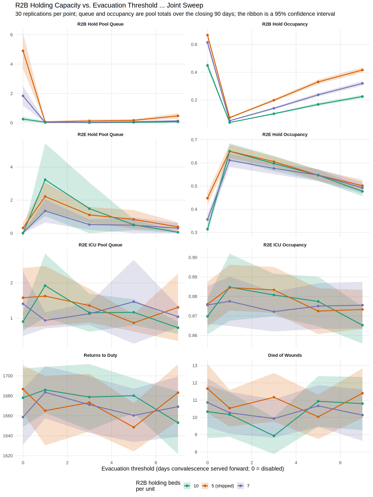

R2B and R2E queue and utilisation, returns to duty and died of wounds against the evacuation threshold in days, one line per swept bed count, with a 95% confidence ribbon.

With five beds per unit, a one-day threshold moved the R2B holding queue to <!-- GEN cell:hold_threshold_threshold|1 day|R2B hold mean queue|full -->0.01 [0.00, 0.04]<!-- /GEN --> and the R2E holding queue to <!-- GEN cell:hold_threshold_threshold|1 day|R2E hold mean queue|full -->1.655 [0.829, 2.481]<!-- /GEN -->, and the R2E intensive care queue to <!-- GEN cell:hold_threshold_threshold|1 day|R2E ICU mean queue|full -->1.274 [0.773, 1.775]<!-- /GEN -->. A three-day threshold gave <!-- GEN cell:hold_threshold_threshold|3 days|R2B hold mean queue|full -->0.04 [0.00, 0.09]<!-- /GEN -->, <!-- GEN cell:hold_threshold_threshold|3 days|R2E hold mean queue|full -->1.047 [0.489, 1.606]<!-- /GEN --> and <!-- GEN cell:hold_threshold_threshold|3 days|R2E ICU mean queue|full -->1.099 [0.533, 1.666]<!-- /GEN --> on the same three responses. At five and seven days the R2B holding queue was <!-- GEN cell:hold_threshold_threshold|5 days (mode)|R2B hold mean queue|full -->0.15 [0.06, 0.25]<!-- /GEN --> and <!-- GEN cell:hold_threshold_threshold|7 days|R2B hold mean queue|full -->0.49 [0.33, 0.66]<!-- /GEN -->. Returns to duty were <!-- GEN cell:hold_threshold_threshold|Disabled (shipped)|Returns to duty|full -->1673 [1647, 1700]<!-- /GEN --> with the threshold disabled and <!-- GEN cell:hold_threshold_threshold|1 day|Returns to duty|full -->1666 [1646, 1687]<!-- /GEN --> at one day, and deaths of wounds <!-- GEN cell:hold_threshold_threshold|Disabled (shipped)|Deaths of wounds|full -->10.7 [9.3, 12.0]<!-- /GEN --> and <!-- GEN cell:hold_threshold_threshold|1 day|Deaths of wounds|full -->10.8 [9.3, 12.3]<!-- /GEN -->. The full grid, including returns to duty and deaths of wounds at every point, is in `data/sweeps/r2b_hold_threshold_sweep.csv`.

**High-intensity profile.** The same grid under `high_intensity` `[high_intensity, 5 to 10 beds per unit and 0 to 7 days · 360 d · 30 replications · pool totals, closing 90 d]`:

<!-- GEN hold_threshold_beds_high -->
| R2B holding beds per unit | R2B hold mean queue | R2B hold utilisation | R2E hold mean queue | R2E ICU mean queue | Returns to duty | Deaths of wounds |
|---|---|---|---|---|---|---|
| 5 (shipped) | 30.58 [25.22, 35.95] | 70.6% [68.8, 72.5] | 556.080 [528.497, 583.663] | 1438.305 [1423.919, 1452.690] | 2840 [2806, 2874] | 277.6 [272.1, 283.1] |
| 7 | 17.54 [13.94, 21.13] | 68.1% [66.7, 69.5] | 561.599 [538.761, 584.437] | 1429.201 [1411.988, 1446.413] | 2845 [2810, 2879] | 275.9 [269.6, 282.2] |
| 10 | 2.87 [2.26, 3.48] | 54.2% [52.2, 56.1] | 592.399 [570.560, 614.238] | 1432.174 [1416.337, 1448.010] | 2814 [2786, 2842] | 268.8 [263.0, 274.6] |
<!-- /GEN -->

<!-- GEN hold_threshold_threshold_high -->
| Evacuation threshold | R2B hold mean queue | R2B hold utilisation | R2E hold mean queue | R2E ICU mean queue | Returns to duty | Deaths of wounds |
|---|---|---|---|---|---|---|
| Disabled (shipped) | 30.58 [25.22, 35.95] | 70.6% [68.8, 72.5] | 556.080 [528.497, 583.663] | 1438.305 [1423.919, 1452.690] | 2840 [2806, 2874] | 277.6 [272.1, 283.1] |
| 1 day | 0.13 [0.10, 0.16] | 11.0% [10.6, 11.5] | 615.346 [583.381, 647.312] | 1431.386 [1414.086, 1448.685] | 2828 [2800, 2855] | 274.1 [265.0, 283.2] |
| 3 days | 0.42 [0.33, 0.51] | 23.8% [22.5, 25.1] | 610.999 [588.441, 633.558] | 1434.711 [1420.608, 1448.815] | 2794 [2761, 2827] | 276.3 [271.2, 281.5] |
| 5 days (mode) | 1.20 [0.98, 1.41] | 38.5% [37.0, 40.1] | 610.545 [592.845, 628.246] | 1436.273 [1419.741, 1452.804] | 2826 [2791, 2861] | 270.2 [262.0, 278.3] |
| 7 days | 4.01 [3.26, 4.76] | 50.5% [48.9, 52.0] | 632.854 [608.255, 657.453] | 1427.024 [1410.788, 1443.259] | 2846 [2812, 2880] | 277.1 [269.7, 284.4] |
<!-- /GEN -->

At 10 holding beds per unit the R2B holding queue was <!-- GEN cell:hold_threshold_beds_high|10|R2B hold mean queue|full -->2.87 [2.26, 3.48]<!-- /GEN --> against <!-- GEN cell:hold_threshold_beds_high|5 (shipped)|R2B hold mean queue|full -->30.58 [25.22, 35.95]<!-- /GEN --> at the shipped five. A one-day evacuation threshold left the R2E holding queue at <!-- GEN cell:hold_threshold_threshold_high|1 day|R2E hold mean queue|full -->615.346 [583.381, 647.312]<!-- /GEN --> against <!-- GEN cell:hold_threshold_threshold_high|Disabled (shipped)|R2E hold mean queue|full -->556.080 [528.497, 583.663]<!-- /GEN --> with the threshold disabled.

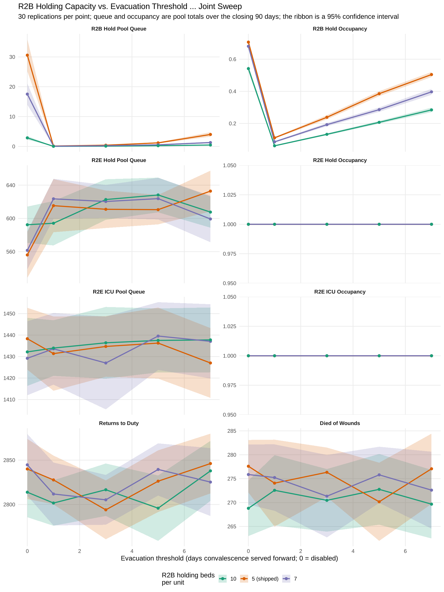

The panels of the first figure of this section under the high-intensity profile.

### Transport Fleet Size

**Question.** At what fleet size does the transport queue form, at each casualty intensity? `[default and high_intensity · 360 d · 30 replications · pool totals, closing 90 d]`

The first table is the shipped moderate-intensity configuration and the second the high-intensity profile.

<!-- GEN transport -->
| Fleet size | Ambulance mean queue | Truck mean queue |
|---|---|---|
| 1 | 1.2509 [0.4597, 2.0422] | 0.1133 [0.0055, 0.2210] |
| 2 | 0.1427 [0.0342, 0.2513] | 0.0369 [0.0000, 0.0816] |
| 3 (current ambulance) | 0.4278 [0.0000, 1.1927] | 0.0011 [0.0005, 0.0018] |
| 4 (current truck) | 0.0511 [0.0000, 0.1204] | 0.0001 [0.0000, 0.0002] |
| 5 | 0.0067 [0.0000, 0.0166] | not swept |
<!-- /GEN -->

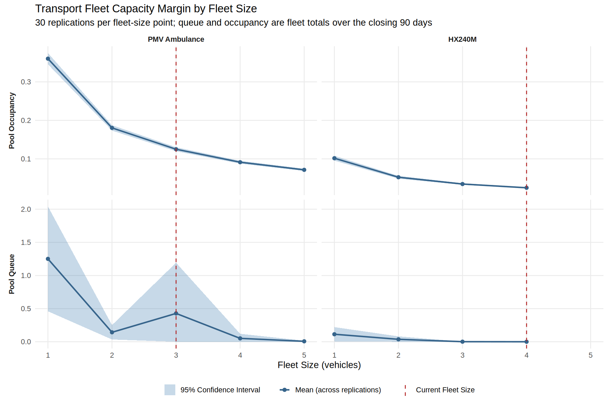

Mean queue and mean utilisation against fleet size for the ambulance and truck fleets under the shipped configuration, each with a 95% confidence ribbon and a dashed vertical line at the current establishment size.

<!-- GEN transport_high -->
| Fleet size | Ambulance mean queue | Truck mean queue |
|---|---|---|
| 1 | 46.7132 [37.7039, 55.7225] | 0.1202 [0.1006, 0.1398] |
| 2 | 1.1259 [0.8840, 1.3678] | 0.0090 [0.0075, 0.0104] |
| 3 (current ambulance) | 0.2188 [0.1604, 0.2771] | 0.0013 [0.0009, 0.0018] |
| 4 (current truck) | 0.0644 [0.0366, 0.0921] | 0.0002 [0.0001, 0.0004] |
| 5 | 0.0122 [0.0088, 0.0155] | not swept |
<!-- /GEN -->

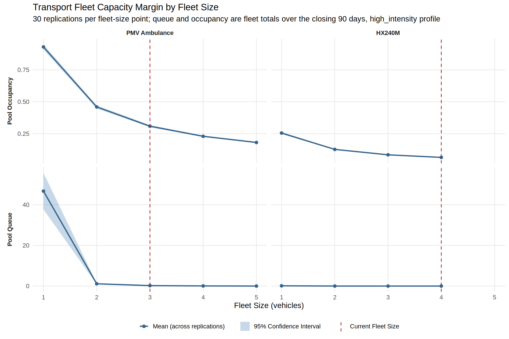

The same measures under the `high_intensity` profile, each with a 95% confidence ribbon and a dashed vertical line at the current establishment size.

Under the shipped configuration a single ambulance queued <!-- GEN cell:transport|1|Ambulance mean queue|mean -->1.2509<!-- /GEN --> casualties (interval <!-- GEN cell:transport|1|Ambulance mean queue|ci -->[0.4597, 2.0422]<!-- /GEN -->), two queued <!-- GEN cell:transport|2|Ambulance mean queue|mean -->0.1427<!-- /GEN --> and the shipped three <!-- GEN cell:transport|3 (current ambulance)|Ambulance mean queue|mean -->0.4278<!-- /GEN -->. Under the high-intensity profile the corresponding ambulance queues were <!-- GEN cell:transport_high|1|Ambulance mean queue|mean -->46.7132<!-- /GEN -->, <!-- GEN cell:transport_high|2|Ambulance mean queue|mean -->1.1259<!-- /GEN --> and <!-- GEN cell:transport_high|3 (current ambulance)|Ambulance mean queue|mean -->0.2188<!-- /GEN -->, and the shipped four trucks queued <!-- GEN cell:transport_high|4 (current truck)|Truck mean queue|mean -->0.0002<!-- /GEN -->.

#### Utilisation of Shared Fleets and Integral Evacuation Elements

**Question.** How heavily is each transport holder used, the shared brigade fleets and the evacuation elements integral to R2B and R2E? `[default and high_intensity · 360 d · 30 replications · pool totals, closing 90 d, shipped establishment, not swept]`

Utilisation is the time-weighted share of the established units in use over the closing 90 days. An evacuation crew is two medics seized together, so a crew is measured on its lead medic.

<!-- GEN transport_holders -->
| Holder | Asset | Moderate intensity mean queue | Moderate intensity utilisation | High intensity mean queue | High intensity utilisation |
|---|---|---|---|---|---|
| PMV Ambulance fleet | Shared | 0.019 [0.008, 0.029] | 12.1% [11.6%, 12.5%] | 0.236 [0.153, 0.320] | 30.9% [30.1%, 31.7%] |
| HX2 40M fleet | Shared | 0.002 [0.000, 0.003] | 2.6% [2.4%, 2.8%] | 0.000 [0.000, 0.000] | 6.0% [5.8%, 6.2%] |
| R2B evacuation crews | Integral | 0.048 [0.040, 0.056] | 15.2% [14.6%, 15.8%] | 0.457 [0.416, 0.498] | 41.6% [40.6%, 42.6%] |
| R2E evacuation sections | Integral | 0.000 [0.000, 0.000] | 0.0% [0.0%, 0.0%] | 0.001 [0.001, 0.001] | 1.3% [1.2%, 1.3%] |
<!-- /GEN -->

At moderate intensity the R2B evacuation crews were in use for <!-- GEN cell:transport_holders|R2B evacuation crews|Moderate intensity utilisation|mean -->15.2%<!-- /GEN --> of the window and the ambulance fleet for <!-- GEN cell:transport_holders|PMV Ambulance fleet|Moderate intensity utilisation|mean -->12.1%<!-- /GEN -->. At high intensity the crews were in use for <!-- GEN cell:transport_holders|R2B evacuation crews|High intensity utilisation|mean -->41.6%<!-- /GEN --> (interval <!-- GEN cell:transport_holders|R2B evacuation crews|High intensity utilisation|ci -->[40.6%, 42.6%]<!-- /GEN -->) and queued <!-- GEN cell:transport_holders|R2B evacuation crews|High intensity mean queue|mean -->0.457<!-- /GEN --> casualties, the ambulance fleet was in use for <!-- GEN cell:transport_holders|PMV Ambulance fleet|High intensity utilisation|mean -->30.9%<!-- /GEN --> and the truck fleet for <!-- GEN cell:transport_holders|HX2 40M fleet|High intensity utilisation|mean -->6.0%<!-- /GEN -->. The R2E evacuation sections were in use for <!-- GEN cell:transport_holders|R2E evacuation sections|High intensity utilisation|mean -->1.3%<!-- /GEN --> at high intensity.

### Forward Holding of Post-Operative Intensive Care

**Question.** What changes when a casualty operated on at R2B is held there for part of their post-operative intensive care, for a stability window or while R2E intensive care is saturated? `[default, seven forward holding arms · 360 d · 30 replications · pool totals, closing 90 d]`

<!-- GEN forward_hold -->
| Forward holding rule | R2E ICU mean queue | R2B ICU utilisation | R2E ICU utilisation | Post-definitive care in ICU | Died of wounds per run |
|---|---|---|---|---|---|
| Off (current) | 1.355 [0.554, 2.156] | 1.6% | 87.8% | 31.7 [30.6, 32.8] | 10.67 [9.33, 12.00] |
| 120 min | 2.305 [0.000, 4.787] | 5.3% | 87.6% | 32.7 [30.9, 34.5] | 11.83 [10.44, 13.23] |
| 240 min | 0.911 [0.674, 1.149] | 9.3% | 86.7% | 34.4 [32.8, 36.0] | 11.40 [10.01, 12.79] |
| 480 min | 0.803 [0.368, 1.239] | 17.1% | 85.7% | 36.1 [34.6, 37.7] | 11.07 [9.83, 12.30] |
| 1,440 min | 1.020 [0.436, 1.603] | 36.8% | 82.9% | 41.4 [39.7, 43.1] | 12.23 [10.59, 13.87] |
| Capacity only | 0.953 [0.468, 1.437] | 16.8% | 88.4% | 37.0 [35.6, 38.3] | 12.40 [11.02, 13.78] |
| 240 min + capacity | 0.666 [0.546, 0.786] | 22.8% | 87.4% | 37.8 [36.2, 39.5] | 12.53 [11.41, 13.66] |
<!-- /GEN -->

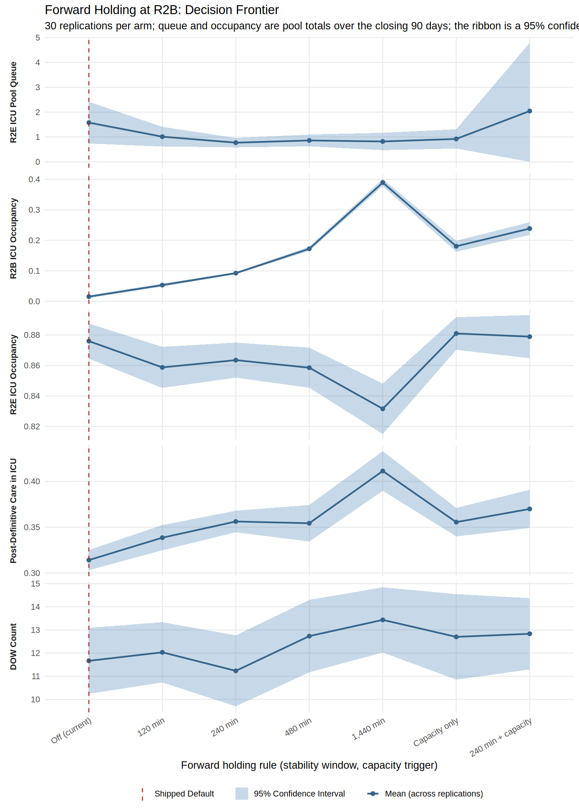

R2E intensive care mean queue, R2B and R2E intensive care utilisation, the share of post-definitive care delivered in intensive care and the died-of-wounds count under each forward holding arm, each with a 95% confidence ribbon. The windows apply to damage control and single-stage casualties alike.

The R2E intensive care queue was <!-- GEN cell:forward_hold|Off (current)|R2E ICU mean queue|full -->1.355 [0.554, 2.156]<!-- /GEN --> with no forward holding and <!-- GEN cell:forward_hold|240 min|R2E ICU mean queue|full -->0.911 [0.674, 1.149]<!-- /GEN --> with a 240-minute window. R2B intensive care utilisation rose from <!-- GEN cell:forward_hold|Off (current)|R2B ICU utilisation|full -->1.6%<!-- /GEN --> with no forward holding to <!-- GEN cell:forward_hold|1,440 min|R2B ICU utilisation|full -->36.8%<!-- /GEN --> at a 1,440-minute window while R2E intensive care utilisation moved from <!-- GEN cell:forward_hold|Off (current)|R2E ICU utilisation|full -->87.8%<!-- /GEN --> to <!-- GEN cell:forward_hold|1,440 min|R2E ICU utilisation|full -->82.9%<!-- /GEN -->. Post-definitive care in an intensive care bed rose from <!-- GEN cell:forward_hold|Off (current)|Post-definitive care in ICU|full -->31.7 [30.6, 32.8]<!-- /GEN --> to <!-- GEN cell:forward_hold|1,440 min|Post-definitive care in ICU|full -->41.4 [39.7, 43.1]<!-- /GEN -->, and died of wounds per run was <!-- GEN cell:forward_hold|Off (current)|Died of wounds per run|full -->10.67 [9.33, 12.00]<!-- /GEN --> with no forward holding and <!-- GEN cell:forward_hold|1,440 min|Died of wounds per run|full -->12.23 [10.59, 13.87]<!-- /GEN --> at 1,440 minutes. Holding on capacity grounds alone gave an R2E queue of <!-- GEN cell:forward_hold|Capacity only|R2E ICU mean queue|full -->0.953 [0.468, 1.437]<!-- /GEN -->, and a 240-minute window with the capacity trigger gave <!-- GEN cell:forward_hold|240 min + capacity|R2E ICU mean queue|full -->0.666 [0.546, 0.786]<!-- /GEN -->.

**High-intensity profile.** The same seven arms under `high_intensity` `[high_intensity, seven forward holding arms · 360 d · 30 replications · pool totals, closing 90 d]`:

<!-- GEN forward_hold_high -->
| Forward holding rule | R2E ICU mean queue | R2B ICU utilisation | R2E ICU utilisation | Post-definitive care in ICU | Died of wounds per run |
|---|---|---|---|---|---|
| Off (current) | 1438.305 [1423.919, 1452.690] | 12.3% | 100.0% | 0.2 [0.2, 0.3] | 277.60 [272.10, 283.10] |
| 120 min | 1441.629 [1424.180, 1459.078] | 20.1% | 100.0% | 0.3 [0.2, 0.3] | 300.87 [293.39, 308.34] |
| 240 min | 1462.552 [1445.361, 1479.743] | 28.9% | 100.0% | 0.2 [0.2, 0.3] | 304.67 [297.44, 311.89] |
| 480 min | 1441.944 [1419.803, 1464.085] | 39.8% | 100.0% | 0.2 [0.2, 0.3] | 309.50 [302.08, 316.92] |
| 1,440 min | 1421.368 [1405.829, 1436.906] | 65.2% | 100.0% | 0.3 [0.2, 0.4] | 333.40 [325.77, 341.03] |
| Capacity only | 1431.916 [1412.631, 1451.201] | 64.4% | 100.0% | 0.3 [0.2, 0.4] | 337.57 [329.95, 345.19] |
| 240 min + capacity | 1426.679 [1413.398, 1439.960] | 65.1% | 100.0% | 0.3 [0.2, 0.4] | 328.20 [320.71, 335.69] |
<!-- /GEN -->

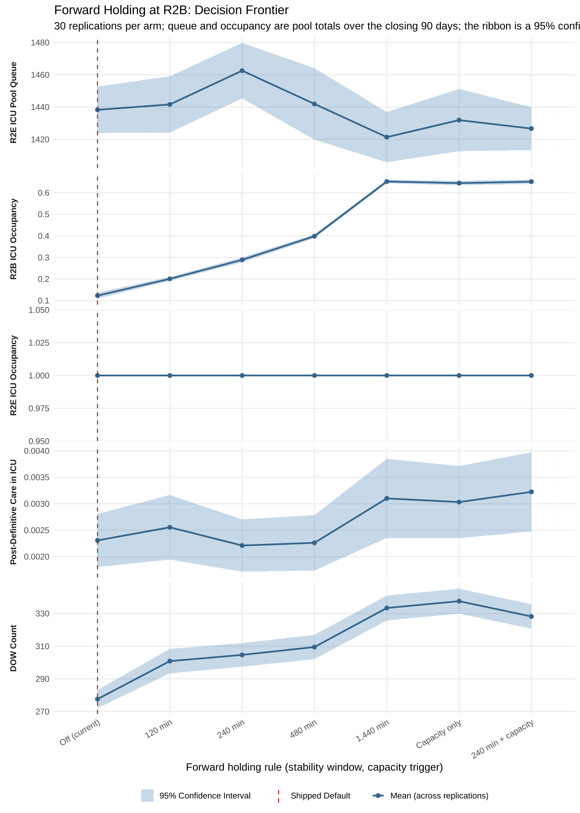

The panels of the figure above under the high-intensity profile.

The R2E intensive care queue was <!-- GEN cell:forward_hold_high|Off (current)|R2E ICU mean queue|full -->1438.305 [1423.919, 1452.690]<!-- /GEN --> with no forward holding and <!-- GEN cell:forward_hold_high|240 min|R2E ICU mean queue|full -->1462.552 [1445.361, 1479.743]<!-- /GEN --> with a 240-minute window. R2E intensive care utilisation was <!-- GEN cell:forward_hold_high|Off (current)|R2E ICU utilisation|full -->100.0%<!-- /GEN --> with no forward holding and <!-- GEN cell:forward_hold_high|1,440 min|R2E ICU utilisation|full -->100.0%<!-- /GEN --> at a 1,440-minute window, while R2B intensive care utilisation rose from <!-- GEN cell:forward_hold_high|Off (current)|R2B ICU utilisation|full -->12.3%<!-- /GEN --> to <!-- GEN cell:forward_hold_high|1,440 min|R2B ICU utilisation|full -->65.2%<!-- /GEN -->. Died of wounds per run was <!-- GEN cell:forward_hold_high|Off (current)|Died of wounds per run|full -->277.60 [272.10, 283.10]<!-- /GEN --> with no forward holding and <!-- GEN cell:forward_hold_high|Capacity only|Died of wounds per run|full -->337.57 [329.95, 345.19]<!-- /GEN --> on the capacity trigger alone.

### Post-Operative Intensive Care Gate

**Question.** What does the rationing rule that defers lower-priority surgery when intensive care is saturated change? `[default, gate on and off · 360 d · 30 replications · paired, closing 90 d]`

<!-- GEN icu_gate -->
| Measure | Without the rule | With the rule | Paired difference |
|---|---|---|---|
| R2E ICU utilisation (%) | 93.0 [91.8, 94.2] | 87.8 [86.8, 88.9] | −5.1 [−6.7, −3.5] |
| Died of wounds per run | 10.57 [9.67, 11.46] | 10.67 [9.33, 12.00] | +0.10 [−1.71, +1.91] |
| Total casualties | 5,350.7 [5,290.0, 5,411.3] | 5,402.9 [5,315.9, 5,489.8] | +52.2 [−65.2, +169.6] |
<!-- /GEN -->

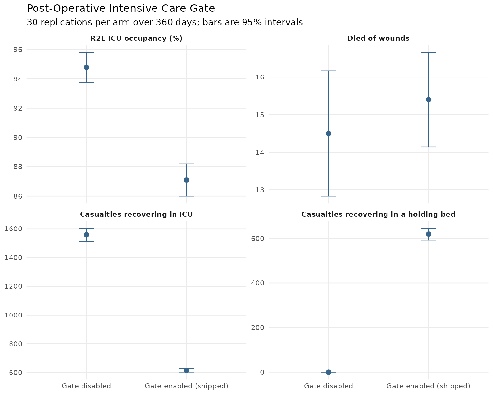

Intensive care occupancy, deaths of wounds and the casualties taking each post-operative pathway with the gate disabled and enabled, each point with its 95% confidence interval.

R2E intensive care utilisation was <!-- GEN cell:icu_gate|R2E ICU utilisation (%)|Without the rule|full -->93.0 [91.8, 94.2]<!-- /GEN --> without the rule and <!-- GEN cell:icu_gate|R2E ICU utilisation (%)|With the rule|full -->87.8 [86.8, 88.9]<!-- /GEN --> with it, a paired difference of <!-- GEN cell:icu_gate|R2E ICU utilisation (%)|Paired difference|full -->−5.1 [−6.7, −3.5]<!-- /GEN --> percentage points. Died of wounds per run were <!-- GEN cell:icu_gate|Died of wounds per run|Without the rule|full -->10.57 [9.67, 11.46]<!-- /GEN --> and <!-- GEN cell:icu_gate|Died of wounds per run|With the rule|full -->10.67 [9.33, 12.00]<!-- /GEN -->, a paired difference of <!-- GEN cell:icu_gate|Died of wounds per run|Paired difference|full -->+0.10 [−1.71, +1.91]<!-- /GEN -->.

<!-- GEN icu_gate_pathways -->
| Recovery pathway | Casualty-replications | Died of wounds | Rate |
|---|---|---|---|
| Intensive care bed | 18,455 | 15 | 0.08% |
| Holding bed | 18,731 | 34 | 0.18% |
<!-- /GEN -->

Where the rule was in force, casualties recovering in a holding bed died of wounds at <!-- GEN cell:icu_gate_pathways|Holding bed|Rate|full -->0.18%<!-- /GEN --> and those recovering in an intensive care bed at <!-- GEN cell:icu_gate_pathways|Intensive care bed|Rate|full -->0.08%<!-- /GEN -->, pooled over the replications of that arm.

**High-intensity profile.** The same comparison under `high_intensity` `[high_intensity, gate disabled and enabled · 360 d · 30 replications · campaign totals, paired differences]`:

<!-- GEN icu_gate_high -->
| Measure | Without the rule | With the rule | Paired difference |
|---|---|---|---|
| R2E ICU utilisation (%) | 100.0 [100.0, 100.0] | 100.0 [100.0, 100.0] | +0.0 [+0.0, +0.0] |
| Died of wounds per run | 263.93 [254.97, 272.90] | 277.60 [272.10, 283.10] | +13.67 [+3.72, +23.62] |
| Total casualties | 12,447.5 [12,307.7, 12,587.2] | 12,409.5 [12,291.1, 12,527.9] | −38.0 [−248.0, +172.1] |
<!-- /GEN -->

<!-- GEN icu_gate_pathways_high -->
| Recovery pathway | Casualty-replications | Died of wounds | Rate |
|---|---|---|---|
| Intensive care bed | 565 | 5 | 0.88% |
| Holding bed | 65,786 | 854 | 1.30% |
<!-- /GEN -->

The paired difference in deaths of wounds per run with the rule in force was <!-- GEN cell:icu_gate_high|Died of wounds per run|Paired difference|full -->+13.67 [+3.72, +23.62]<!-- /GEN -->. Casualties recovering in a holding bed died of wounds at <!-- GEN cell:icu_gate_pathways_high|Holding bed|Rate|full -->1.30%<!-- /GEN --> and those recovering in an intensive care bed at <!-- GEN cell:icu_gate_pathways_high|Intensive care bed|Rate|full -->0.88%<!-- /GEN -->.

### Evacuation Policy

**Question.** What happens to returns to duty, mortality and the R2E pools when the days a casualty may recover in theatre before evacuation is set across its doctrinal range? `[default, evacuation policy 15 to 60 days · 360 d · 30 replications · pool totals, closing 90 d]`

<!-- GEN policy -->
| Response | 15 d | 21 d (shipped) | 30 d | 45 d | 60 d |
|---|---|---|---|---|---|
| R2E hold occupancy (%) | 20.3 [19.0, 21.6] | 44.8 [42.6, 46.9] | 100.0 [100.0, 100.0] | 100.0 [100.0, 100.0] | 100.0 [100.0, 100.0] |
| R2E hold mean queue | 0.00 [0.00, 0.00] | 0.08 [0.00, 0.19] | 759.26 [706.25, 812.27] | 1833.35 [1776.97, 1889.73] | 1965.53 [1927.78, 2003.28] |
| R2E ICU occupancy (%) | 86.9 [85.7, 88.0] | 87.8 [86.8, 88.9] | 100.0 [100.0, 100.0] | 100.0 [100.0, 100.0] | 100.0 [100.0, 100.0] |
| R2E ICU mean queue | 0.82 [0.62, 1.01] | 1.35 [0.55, 2.16] | 113.29 [102.97, 123.62] | 44.09 [35.73, 52.44] | 24.23 [20.48, 27.98] |
| Post-definitive ICU access (%) | 33.5 [31.7, 35.3] | 31.7 [30.6, 32.8] | 3.4 [2.8, 4.0] | 4.5 [3.8, 5.2] | 6.0 [4.8, 7.2] |
| In-theatre share (%) | 5.2 [5.0, 5.4] | 12.2 [11.9, 12.5] | 29.8 [29.2, 30.4] | 66.7 [65.9, 67.6] | 87.1 [86.4, 87.7] |
| Returns to duty | 1476.0 [1452.3, 1499.8] | 1673.3 [1647.0, 1699.6] | 1875.3 [1855.2, 1895.4] | 1814.4 [1788.8, 1840.0] | 1724.5 [1698.2, 1750.8] |
| Died of wounds | 9.87 [8.47, 11.26] | 10.67 [9.33, 12.00] | 12.10 [10.73, 13.47] | 11.83 [10.64, 13.03] | 13.43 [11.91, 14.96] |
| Never evacuated by horizon | 2.9 [1.4, 4.5] | 1.5 [0.9, 2.1] | 440.8 [417.8, 463.8] | 367.8 [348.7, 387.0] | 157.9 [147.4, 168.4] |
| Mean evacuation wait (d) | 0.39 [0.24, 0.55] | 0.33 [0.28, 0.38] | 34.62 [32.17, 37.06] | 95.56 [91.73, 99.40] | 98.69 [92.01, 105.37] |
| Role 4 peak beds | 205.2 [197.2, 213.2] | 211.0 [201.5, 220.5] | 105.5 [100.2, 110.8] | 30.3 [26.9, 33.7] | 15.4 [12.5, 18.2] |
<!-- /GEN -->

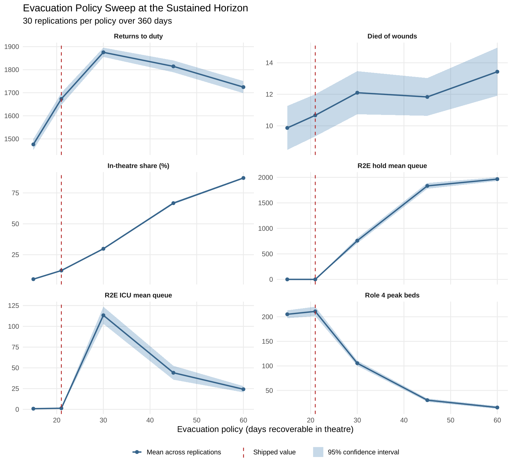

Six responses against the evacuation policy in days, each with its 95% confidence interval and the shipped policy marked by a dashed line.

At the shipped 21-day policy the R2E holding queue was <!-- GEN cell:policy|R2E hold mean queue|21 d (shipped)|full -->0.08 [0.00, 0.19]<!-- /GEN --> and its occupancy <!-- GEN cell:policy|R2E hold occupancy (%)|21 d (shipped)|full -->44.8 [42.6, 46.9]<!-- /GEN -->. At 30 days the holding occupancy was <!-- GEN cell:policy|R2E hold occupancy (%)|30 d|full -->100.0 [100.0, 100.0]<!-- /GEN --> and the queue <!-- GEN cell:policy|R2E hold mean queue|30 d|full -->759.26 [706.25, 812.27]<!-- /GEN -->; at 45 and 60 days the occupancy was <!-- GEN cell:policy|R2E hold occupancy (%)|45 d|full -->100.0 [100.0, 100.0]<!-- /GEN --> and <!-- GEN cell:policy|R2E hold occupancy (%)|60 d|full -->100.0 [100.0, 100.0]<!-- /GEN -->. Returns to duty per campaign were <!-- GEN cell:policy|Returns to duty|15 d|full -->1476.0 [1452.3, 1499.8]<!-- /GEN --> at 15 days, <!-- GEN cell:policy|Returns to duty|21 d (shipped)|full -->1673.3 [1647.0, 1699.6]<!-- /GEN --> at 21, <!-- GEN cell:policy|Returns to duty|30 d|full -->1875.3 [1855.2, 1895.4]<!-- /GEN --> at 30, <!-- GEN cell:policy|Returns to duty|45 d|full -->1814.4 [1788.8, 1840.0]<!-- /GEN --> at 45 and <!-- GEN cell:policy|Returns to duty|60 d|full -->1724.5 [1698.2, 1750.8]<!-- /GEN --> at 60. Died of wounds were <!-- GEN cell:policy|Died of wounds|15 d|full -->9.87 [8.47, 11.26]<!-- /GEN -->, <!-- GEN cell:policy|Died of wounds|21 d (shipped)|full -->10.67 [9.33, 12.00]<!-- /GEN -->, <!-- GEN cell:policy|Died of wounds|30 d|full -->12.10 [10.73, 13.47]<!-- /GEN -->, <!-- GEN cell:policy|Died of wounds|45 d|full -->11.83 [10.64, 13.03]<!-- /GEN --> and <!-- GEN cell:policy|Died of wounds|60 d|full -->13.43 [11.91, 14.96]<!-- /GEN --> across the five policies. The realised in-theatre share was <!-- GEN cell:policy|In-theatre share (%)|15 d|full -->5.2 [5.0, 5.4]<!-- /GEN -->, <!-- GEN cell:policy|In-theatre share (%)|21 d (shipped)|full -->12.2 [11.9, 12.5]<!-- /GEN -->, <!-- GEN cell:policy|In-theatre share (%)|30 d|full -->29.8 [29.2, 30.4]<!-- /GEN -->, <!-- GEN cell:policy|In-theatre share (%)|45 d|full -->66.7 [65.9, 67.6]<!-- /GEN --> and <!-- GEN cell:policy|In-theatre share (%)|60 d|full -->87.1 [86.4, 87.7]<!-- /GEN --> percent. Paired differences against the shipped policy are in `data/policy/policy_sweep_paired.csv`.

### R2E Holding Establishment

**Question.** What does enlarging the R2E holding establishment change at the shipped evacuation policy? `[default, 21-day policy, 30 to 90 holding beds · 360 d · 30 replications · pool totals, closing 90 d]`

<!-- GEN establishment -->
| Response | 30 beds (shipped) | 45 beds | 60 beds | 90 beds |
|---|---|---|---|---|
| R2E hold occupancy (%) | 44.8 [42.6, 46.9] | 29.7 [27.6, 31.7] | 24.1 [19.8, 28.3] | 14.6 [13.8, 15.4] |
| R2E hold mean queue | 0.08 [0.00, 0.19] | 0.07 [0.00, 0.20] | 0.56 [0.00, 1.70] | 0.00 [0.00, 0.00] |
| R2E ICU mean queue | 1.35 [0.55, 2.16] | 0.73 [0.52, 0.93] | 1.98 [0.00, 4.16] | 0.87 [0.62, 1.11] |
| Post-definitive ICU access (%) | 31.7 [30.6, 32.8] | 32.1 [30.0, 34.1] | 31.0 [28.7, 33.2] | 32.0 [30.8, 33.3] |
| In-theatre share (%) | 12.2 [11.9, 12.5] | 12.2 [11.9, 12.4] | 12.1 [11.9, 12.3] | 12.1 [11.8, 12.3] |
| Returns to duty | 1673.3 [1647.0, 1699.6] | 1692.8 [1662.3, 1723.3] | 1693.0 [1665.1, 1720.9] | 1685.8 [1655.3, 1716.3] |
| Died of wounds | 10.7 [9.3, 12.0] | 11.2 [9.6, 12.7] | 11.3 [10.1, 12.6] | 11.0 [9.9, 12.1] |
| Never evacuated by horizon | 1.5 [0.9, 2.1] | 1.1 [0.5, 1.6] | 2.6 [0.3, 4.9] | 1.6 [0.7, 2.5] |
| Role 4 peak beds | 211.0 [201.5, 220.5] | 209.8 [200.8, 218.9] | 215.9 [208.6, 223.2] | 214.7 [207.2, 222.3] |
<!-- /GEN -->

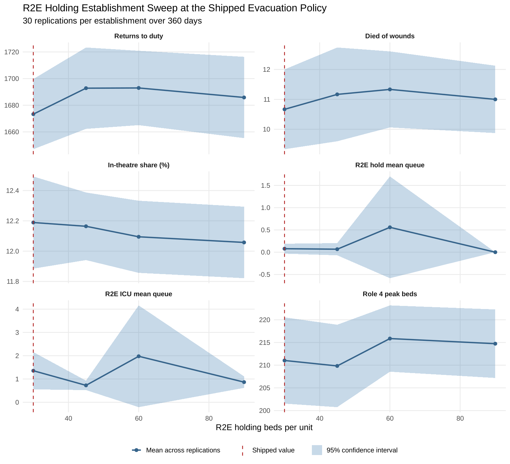

The same six responses against the R2E holding bed establishment at the shipped evacuation policy, with the shipped establishment marked by a dashed line.

Holding occupancy was <!-- GEN cell:establishment|R2E hold occupancy (%)|30 beds (shipped)|full -->44.8 [42.6, 46.9]<!-- /GEN --> at the shipped 30 beds, <!-- GEN cell:establishment|R2E hold occupancy (%)|45 beds|full -->29.7 [27.6, 31.7]<!-- /GEN --> at 45, <!-- GEN cell:establishment|R2E hold occupancy (%)|60 beds|full -->24.1 [19.8, 28.3]<!-- /GEN --> at 60 and <!-- GEN cell:establishment|R2E hold occupancy (%)|90 beds|full -->14.6 [13.8, 15.4]<!-- /GEN --> at 90 percent. The R2E holding queue was <!-- GEN cell:establishment|R2E hold mean queue|30 beds (shipped)|full -->0.08 [0.00, 0.19]<!-- /GEN --> at 30 beds and <!-- GEN cell:establishment|R2E hold mean queue|45 beds|full -->0.07 [0.00, 0.20]<!-- /GEN --> at 45. Returns to duty per campaign were <!-- GEN cell:establishment|Returns to duty|30 beds (shipped)|full -->1673.3 [1647.0, 1699.6]<!-- /GEN --> at 30 beds and <!-- GEN cell:establishment|Returns to duty|90 beds|full -->1685.8 [1655.3, 1716.3]<!-- /GEN --> at 90, and died of wounds <!-- GEN cell:establishment|Died of wounds|30 beds (shipped)|full -->10.7 [9.3, 12.0]<!-- /GEN --> and <!-- GEN cell:establishment|Died of wounds|90 beds|full -->11.0 [9.9, 12.1]<!-- /GEN -->.

### High-Intensity Evacuation Policy and Holding Establishment

**Question.** What happens to the R2E pools, returns to duty and mortality under the high-intensity profile when the evacuation policy and the R2E holding establishment are set across their ranges together? `[high_intensity, evacuation policy 15 to 60 days, 30 to 90 holding beds · 360 d · 30 replications · pool totals, closing 90 d]`

<!-- GEN policy_establishment_high -->
| Policy and holding beds | R2E hold mean queue | R2E ICU mean queue | Returns to duty | Died of wounds | Never evacuated by horizon | Role 4 peak beds |
|---|---|---|---|---|---|---|
| 15 d, 30 beds | 630.1 [607.1, 653.2] | 1,447.9 [1,433.7, 1,462.1] | 2,651.3 [2,617.8, 2,684.9] | 271.7 [263.4, 280.0] | 1,998.1 [1,978.7, 2,017.6] | 233.2 [230.8, 235.6] |
| 15 d, 45 beds | 644.2 [619.2, 669.1] | 1,421.3 [1,404.8, 1,437.9] | 2,653.9 [2,620.7, 2,687.0] | 278.6 [270.9, 286.2] | 1,975.7 [1,953.8, 1,997.6] | 235.8 [233.7, 237.9] |
| 15 d, 60 beds | 629.9 [601.5, 658.3] | 1,409.4 [1,389.4, 1,429.4] | 2,632.0 [2,602.0, 2,662.0] | 274.2 [267.7, 280.8] | 1,952.0 [1,931.4, 1,972.5] | 232.9 [230.7, 235.2] |
| 15 d, 90 beds | 631.9 [599.7, 664.0] | 1,376.5 [1,355.0, 1,398.0] | 2,633.5 [2,604.3, 2,662.6] | 274.0 [266.2, 281.8] | 1,936.0 [1,914.4, 1,957.7] | 231.2 [229.2, 233.2] |
| 21 d, 30 beds | 556.1 [528.5, 583.7] | 1,438.3 [1,423.9, 1,452.7] | 2,840.0 [2,806.2, 2,873.9] | 277.6 [272.1, 283.1] | 1,924.4 [1,904.1, 1,944.8] | 226.3 [224.7, 227.8] |
| 21 d, 45 beds | 549.2 [524.6, 573.9] | 1,429.5 [1,406.7, 1,452.3] | 2,857.5 [2,819.4, 2,895.5] | 286.3 [279.8, 292.9] | 1,923.0 [1,897.1, 1,948.9] | 231.9 [229.1, 234.7] |
| 21 d, 60 beds | 561.5 [531.3, 591.6] | 1,409.8 [1,392.7, 1,426.9] | 2,813.6 [2,776.1, 2,851.0] | 285.1 [276.8, 293.4] | 1,913.9 [1,897.1, 1,930.6] | 227.1 [224.9, 229.3] |
| 21 d, 90 beds | 531.2 [501.0, 561.4] | 1,414.3 [1,391.9, 1,436.8] | 2,857.8 [2,825.5, 2,890.1] | 287.1 [280.5, 293.7] | 1,925.2 [1,903.7, 1,946.8] | 228.4 [226.2, 230.6] |
| 30 d, 30 beds | 2,346.4 [2,281.7, 2,411.0] | 1,002.3 [982.7, 1,022.0] | 3,004.3 [2,973.7, 3,034.9] | 292.0 [284.0, 300.0] | 1,976.5 [1,954.6, 1,998.5] | 125.7 [120.7, 130.7] |
| 30 d, 45 beds | 856.9 [779.6, 934.2] | 1,369.3 [1,347.0, 1,391.6] | 3,187.0 [3,154.1, 3,220.0] | 295.2 [287.7, 302.6] | 1,920.4 [1,890.7, 1,950.1] | 215.2 [206.9, 223.5] |
| 30 d, 60 beds | 414.6 [397.1, 432.1] | 1,417.7 [1,400.6, 1,434.8] | 3,245.8 [3,208.7, 3,282.9] | 305.4 [297.0, 313.8] | 1,807.5 [1,788.1, 1,827.0] | 223.0 [220.1, 225.9] |
| 30 d, 90 beds | 381.9 [352.2, 411.6] | 1,401.5 [1,372.2, 1,430.8] | 3,264.3 [3,230.5, 3,298.2] | 304.7 [297.2, 312.2] | 1,809.2 [1,780.0, 1,838.3] | 221.3 [219.2, 223.4] |
| 45 d, 30 beds | 3,997.3 [3,957.3, 4,037.2] | 386.7 [370.8, 402.7] | 2,930.6 [2,890.2, 2,970.9] | 308.0 [298.9, 317.1] | 1,123.9 [1,101.0, 1,146.8] | 46.8 [43.1, 50.5] |
| 45 d, 45 beds | 3,454.5 [3,404.0, 3,505.1] | 596.9 [583.0, 610.8] | 3,090.7 [3,058.0, 3,123.4] | 305.2 [297.0, 313.4] | 1,364.6 [1,341.8, 1,387.3] | 63.2 [56.7, 69.7] |
| 45 d, 60 beds | 2,897.1 [2,854.2, 2,940.0] | 772.6 [755.5, 789.7] | 3,240.3 [3,203.8, 3,276.7] | 303.0 [295.4, 310.5] | 1,531.3 [1,508.1, 1,554.6] | 76.6 [71.4, 81.8] |
| 45 d, 90 beds | 1,833.2 [1,778.7, 1,887.7] | 1,079.0 [1,060.0, 1,098.0] | 3,559.0 [3,520.3, 3,597.7] | 307.0 [298.4, 315.6] | 1,722.0 [1,703.0, 1,740.9] | 129.9 [123.6, 136.2] |
| 60 d, 30 beds | 4,341.8 [4,294.8, 4,388.8] | 228.1 [216.6, 239.7] | 2,878.1 [2,850.6, 2,905.5] | 309.8 [301.2, 318.4] | 608.2 [589.0, 627.5] | 21.7 [19.0, 24.4] |
| 60 d, 45 beds | 3,953.3 [3,914.8, 3,991.8] | 375.7 [362.2, 389.1] | 3,014.0 [2,990.6, 3,037.3] | 309.6 [303.3, 315.9] | 809.6 [793.5, 825.7] | 33.5 [29.5, 37.6] |
| 60 d, 60 beds | 3,653.9 [3,611.0, 3,696.7] | 487.2 [474.4, 500.0] | 3,149.0 [3,113.3, 3,184.8] | 307.8 [301.6, 314.0] | 967.1 [949.0, 985.2] | 39.9 [35.7, 44.1] |
| 60 d, 90 beds | 3,019.2 [2,976.9, 3,061.6] | 679.7 [661.7, 697.6] | 3,414.5 [3,380.0, 3,449.1] | 307.6 [300.0, 315.2] | 1,186.7 [1,165.1, 1,208.3] | 59.6 [54.3, 65.0] |
<!-- /GEN -->

At the shipped 21-day policy and 30 holding beds the closing-window R2E holding queue was <!-- GEN cell:policy_establishment_high|21 d, 30 beds|R2E hold mean queue|full -->556.1 [528.5, 583.7]<!-- /GEN --> casualties and the R2E intensive care queue <!-- GEN cell:policy_establishment_high|21 d, 30 beds|R2E ICU mean queue|full -->1,438.3 [1,423.9, 1,452.7]<!-- /GEN -->. The lowest holding queue of the grid was <!-- GEN cell:policy_establishment_high|30 d, 90 beds|R2E hold mean queue|full -->381.9 [352.2, 411.6]<!-- /GEN --> at 30 days and 90 beds, and the lowest intensive care queue was <!-- GEN cell:policy_establishment_high|60 d, 30 beds|R2E ICU mean queue|full -->228.1 [216.6, 239.7]<!-- /GEN --> at 60 days and 30 beds, where the holding queue was <!-- GEN cell:policy_establishment_high|60 d, 30 beds|R2E hold mean queue|full -->4,341.8 [4,294.8, 4,388.8]<!-- /GEN -->.

<!-- GEN policy_establishment_high_stability -->
| Policy and holding beds | Holding queue below threshold | ICU queue below threshold | Both below threshold |
|---|---|---|---|
| 15 d, 30 beds | 0 of 30 | 0 of 30 | 0 of 30 |
| 15 d, 45 beds | 0 of 30 | 0 of 30 | 0 of 30 |
| 15 d, 60 beds | 0 of 30 | 0 of 30 | 0 of 30 |
| 15 d, 90 beds | 0 of 30 | 0 of 30 | 0 of 30 |
| 21 d, 30 beds | 0 of 30 | 0 of 30 | 0 of 30 |
| 21 d, 45 beds | 0 of 30 | 0 of 30 | 0 of 30 |
| 21 d, 60 beds | 0 of 30 | 0 of 30 | 0 of 30 |
| 21 d, 90 beds | 0 of 30 | 0 of 30 | 0 of 30 |
| 30 d, 30 beds | 0 of 30 | 0 of 30 | 0 of 30 |
| 30 d, 45 beds | 0 of 30 | 0 of 30 | 0 of 30 |
| 30 d, 60 beds | 0 of 30 | 0 of 30 | 0 of 30 |
| 30 d, 90 beds | 0 of 30 | 0 of 30 | 0 of 30 |
| 45 d, 30 beds | 0 of 30 | 0 of 30 | 0 of 30 |
| 45 d, 45 beds | 0 of 30 | 0 of 30 | 0 of 30 |
| 45 d, 60 beds | 0 of 30 | 0 of 30 | 0 of 30 |
| 45 d, 90 beds | 0 of 30 | 0 of 30 | 0 of 30 |
| 60 d, 30 beds | 0 of 30 | 0 of 30 | 0 of 30 |
| 60 d, 45 beds | 0 of 30 | 0 of 30 | 0 of 30 |
| 60 d, 60 beds | 0 of 30 | 0 of 30 | 0 of 30 |
| 60 d, 90 beds | 0 of 30 | 0 of 30 | 0 of 30 |
<!-- /GEN -->

The table counts the replications whose closing-window mean queue was below the twenty-casualty threshold the strategic airlift collapse experiment classifies against. At 30 days and 90 beds, the cell with the lowest holding queue, the count of replications below the threshold in both pools was <!-- GEN cell:policy_establishment_high_stability|30 d, 90 beds|Both below threshold|full -->0 of 30<!-- /GEN -->.

<!-- GEN policy_establishment_high_paired -->
| Policy and holding beds | Returns to duty | Died of wounds | Role 4 peak beds |
|---|---|---|---|
| 15 d, 30 beds | −188.7 [−241.5, −135.9] | −5.9 [−16.0, +4.2] | +7.0 [+3.8, +10.1] |
| 15 d, 45 beds | −186.2 [−231.5, −140.9] | +1.0 [−7.9, +9.8] | +9.5 [+7.0, +12.0] |
| 15 d, 60 beds | −208.1 [−249.2, −166.9] | −3.4 [−12.3, +5.6] | +6.7 [+4.1, +9.3] |
| 15 d, 90 beds | −206.6 [−250.7, −162.5] | −3.6 [−13.4, +6.3] | +4.9 [+2.4, +7.5] |
| 21 d, 45 beds | +17.4 [−36.3, +71.1] | +8.7 [−0.3, +17.8] | +5.6 [+2.7, +8.5] |
| 21 d, 60 beds | −26.5 [−77.9, +25.0] | +7.5 [−1.7, +16.7] | +0.8 [−1.8, +3.4] |
| 21 d, 90 beds | +17.8 [−34.0, +69.5] | +9.5 [+0.6, +18.4] | +2.1 [−1.0, +5.2] |
| 30 d, 30 beds | +164.3 [+124.0, +204.5] | +14.4 [+3.7, +25.1] | −100.6 [−105.9, −95.2] |
| 30 d, 45 beds | +347.0 [+291.6, +402.4] | +17.6 [+8.7, +26.4] | −11.1 [−19.5, −2.7] |
| 30 d, 60 beds | +405.8 [+355.0, +456.5] | +27.8 [+18.1, +37.5] | −3.3 [−7.0, +0.4] |
| 30 d, 90 beds | +424.3 [+374.0, +474.6] | +27.1 [+17.6, +36.6] | −5.0 [−7.6, −2.3] |
| 45 d, 30 beds | +90.5 [+35.5, +145.6] | +30.4 [+18.9, +41.8] | −179.5 [−183.8, −175.1] |
| 45 d, 45 beds | +250.7 [+203.3, +298.0] | +27.6 [+17.2, +38.0] | −163.1 [−169.9, −156.2] |
| 45 d, 60 beds | +400.2 [+347.2, +453.3] | +25.4 [+16.0, +34.8] | −149.6 [−155.3, −144.0] |
| 45 d, 90 beds | +718.9 [+680.4, +757.5] | +29.4 [+18.4, +40.3] | −96.4 [−103.0, −89.7] |
| 60 d, 30 beds | +38.0 [−7.1, +83.1] | +32.2 [+21.2, +43.3] | −204.6 [−208.2, −201.0] |
| 60 d, 45 beds | +173.9 [+130.1, +217.8] | +32.0 [+24.2, +39.8] | −192.7 [−197.5, −188.0] |
| 60 d, 60 beds | +309.0 [+262.8, +355.2] | +30.2 [+22.3, +38.1] | −186.4 [−191.4, −181.3] |
| 60 d, 90 beds | +574.5 [+520.3, +628.7] | +30.0 [+19.7, +40.3] | −166.6 [−172.5, −160.7] |
<!-- /GEN -->

Each cell was paired by replication against the shipped 21-day policy at 30 holding beds. At 30 days and 90 beds returns to duty differed by <!-- GEN cell:policy_establishment_high_paired|30 d, 90 beds|Returns to duty|full -->+424.3 [+374.0, +474.6]<!-- /GEN --> and Role 4 peak beds by <!-- GEN cell:policy_establishment_high_paired|30 d, 90 beds|Role 4 peak beds|full -->−5.0 [−7.6, −2.3]<!-- /GEN -->.

For each holding establishment the largest policy holding both pools below the threshold in every replication is given below; where none did, the cell reads as such.

<!-- GEN policy_grid_largest_high -->
| Holding beds | Largest policy holding both pools in every replication | Returns to duty there | Paired gain over 21 d and 30 beds | Gain per added bed |
|---|---|---|---|---|
| 30 | none in the grid | not applicable | not applicable | not applicable |
| 45 | none in the grid | not applicable | not applicable | not applicable |
| 60 | none in the grid | not applicable | not applicable | not applicable |
| 90 | none in the grid | not applicable | not applicable | not applicable |
<!-- /GEN -->

### High-Intensity Strategic Sortie Interval by Policy and Holding Establishment

**Question.** Does a shorter interval between strategic sorties, together with a longer evacuation policy or more R2E holding beds, keep the R2E pools below the collapse threshold under the high-intensity profile? `[high_intensity, sortie interval 3 to 7 days, evacuation policy 21 and 30 days, 30 and 60 holding beds · 360 d · 30 replications · pool totals, closing 90 d]`

<!-- GEN interval_grid_high -->
| Interval, policy and holding beds | R2E hold mean queue | R2E ICU mean queue | Both pools below threshold |
|---|---|---|---|
| 3 d interval, 21 d policy, 30 beds | 1.7 [1.0, 2.3] | 519.6 [494.9, 544.3] | 0 of 30 |
| 3 d interval, 21 d policy, 60 beds | 0.0 [0.0, 0.0] | 445.3 [426.3, 464.2] | 0 of 30 |
| 3 d interval, 30 d policy, 30 beds | 2,302.7 [2,234.0, 2,371.3] | 990.4 [970.1, 1,010.7] | 0 of 30 |
| 3 d interval, 30 d policy, 60 beds | 30.9 [21.7, 40.0] | 793.2 [746.2, 840.1] | 0 of 30 |
| 5 d interval, 21 d policy, 30 beds | 43.2 [39.1, 47.2] | 1,195.4 [1,176.5, 1,214.4] | 0 of 30 |
| 5 d interval, 21 d policy, 60 beds | 47.2 [40.6, 53.8] | 1,127.6 [1,101.7, 1,153.4] | 0 of 30 |
| 5 d interval, 30 d policy, 30 beds | 2,345.4 [2,293.9, 2,396.9] | 988.2 [968.5, 1,007.8] | 0 of 30 |
| 5 d interval, 30 d policy, 60 beds | 33.5 [27.7, 39.3] | 1,071.5 [1,038.9, 1,104.0] | 0 of 30 |
| 7 d interval, 21 d policy, 30 beds | 556.1 [528.5, 583.7] | 1,438.3 [1,423.9, 1,452.7] | 0 of 30 |
| 7 d interval, 21 d policy, 60 beds | 561.5 [531.3, 591.6] | 1,409.8 [1,392.7, 1,426.9] | 0 of 30 |
| 7 d interval, 30 d policy, 30 beds | 2,346.4 [2,281.7, 2,411.0] | 1,002.3 [982.7, 1,022.0] | 0 of 30 |
| 7 d interval, 30 d policy, 60 beds | 414.6 [397.1, 432.1] | 1,417.7 [1,400.6, 1,434.8] | 0 of 30 |
<!-- /GEN -->

The table counts the replications whose closing-window mean queue was below the twenty-casualty threshold in both R2E pools. At the shipped cell, the seven-day interval with the 21-day policy and 30 beds, the closing-window R2E holding queue was <!-- GEN cell:interval_grid_high|7 d interval, 21 d policy, 30 beds|R2E hold mean queue|full -->556.1 [528.5, 583.7]<!-- /GEN --> casualties and the intensive care queue <!-- GEN cell:interval_grid_high|7 d interval, 21 d policy, 30 beds|R2E ICU mean queue|full -->1,438.3 [1,423.9, 1,452.7]<!-- /GEN -->. At the three-day interval with the same policy and establishment they were <!-- GEN cell:interval_grid_high|3 d interval, 21 d policy, 30 beds|R2E hold mean queue|full -->1.7 [1.0, 2.3]<!-- /GEN --> and <!-- GEN cell:interval_grid_high|3 d interval, 21 d policy, 30 beds|R2E ICU mean queue|full -->519.6 [494.9, 544.3]<!-- /GEN -->, and with 60 beds <!-- GEN cell:interval_grid_high|3 d interval, 21 d policy, 60 beds|R2E hold mean queue|full -->0.0 [0.0, 0.0]<!-- /GEN --> and <!-- GEN cell:interval_grid_high|3 d interval, 21 d policy, 60 beds|R2E ICU mean queue|full -->445.3 [426.3, 464.2]<!-- /GEN -->. The count of replications below the threshold in both pools was <!-- GEN cell:interval_grid_high|3 d interval, 21 d policy, 60 beds|Both pools below threshold|full -->0 of 30<!-- /GEN --> in that cell and <!-- GEN cell:interval_grid_high|3 d interval, 30 d policy, 60 beds|Both pools below threshold|full -->0 of 30<!-- /GEN --> at the 30-day policy.

<!-- GEN interval_grid_high_wait -->
| Interval, policy and holding beds | Mean wait, critical channel (days) | Mean wait, standard channel (days) | Still waiting, critical channel | Still waiting, standard channel |
|---|---|---|---|---|
| 3 d interval, 21 d policy, 30 beds | 21.27 [20.39, 22.15] | 0.11 [0.08, 0.13] | 603.3 [576.5, 630.1] | 0.2 [0.0, 0.4] |
| 3 d interval, 21 d policy, 60 beds | 19.10 [18.28, 19.93] | 0.02 [0.01, 0.02] | 516.9 [496.7, 537.1] | 0.1 [0.0, 0.2] |
| 3 d interval, 30 d policy, 30 beds | 55.07 [52.55, 57.59] | 58.13 [55.74, 60.53] | 1,533.5 [1,514.1, 1,552.9] | 418.4 [403.6, 433.3] |
| 3 d interval, 30 d policy, 60 beds | 24.10 [22.31, 25.89] | 0.98 [0.74, 1.23] | 951.7 [893.6, 1,009.8] | 7.3 [4.4, 10.1] |
| 5 d interval, 21 d policy, 30 beds | 26.45 [25.67, 27.23] | 1.75 [1.66, 1.84] | 1,402.9 [1,382.4, 1,423.4] | 12.1 [9.4, 14.8] |
| 5 d interval, 21 d policy, 60 beds | 26.26 [25.37, 27.14] | 1.40 [1.26, 1.53] | 1,361.1 [1,333.4, 1,388.9] | 14.7 [11.8, 17.6] |
| 5 d interval, 30 d policy, 30 beds | 55.44 [52.99, 57.89] | 58.54 [56.62, 60.45] | 1,531.0 [1,506.8, 1,555.2] | 425.3 [410.9, 439.7] |
| 5 d interval, 30 d policy, 60 beds | 28.67 [27.55, 29.80] | 1.56 [1.39, 1.73] | 1,250.2 [1,218.9, 1,281.6] | 8.1 [5.0, 11.2] |
| 7 d interval, 21 d policy, 30 beds | 21.90 [21.49, 22.30] | 14.58 [13.89, 15.27] | 1,808.2 [1,790.3, 1,826.2] | 116.2 [111.1, 121.3] |
| 7 d interval, 21 d policy, 60 beds | 19.71 [18.89, 20.54] | 11.66 [10.93, 12.38] | 1,790.3 [1,772.6, 1,808.1] | 123.5 [115.0, 132.1] |
| 7 d interval, 30 d policy, 30 beds | 58.14 [55.82, 60.46] | 60.37 [57.86, 62.87] | 1,544.4 [1,523.9, 1,565.0] | 432.1 [418.2, 446.0] |
| 7 d interval, 30 d policy, 60 beds | 18.31 [17.83, 18.80] | 11.37 [10.83, 11.92] | 1,742.1 [1,722.9, 1,761.2] | 65.5 [59.1, 71.8] |
<!-- /GEN -->

The mean wait is reported separately for the casualties who boarded on the critical (intensive care) channel and on the standard channel, with the casualties of each channel decided for evacuation who had not boarded at the close. At the three-day interval with the 21-day policy and 30 beds the mean wait was <!-- GEN cell:interval_grid_high_wait|3 d interval, 21 d policy, 30 beds|Mean wait, critical channel (days)|full -->21.27 [20.39, 22.15]<!-- /GEN --> days on the critical channel against <!-- GEN cell:interval_grid_high_wait|3 d interval, 21 d policy, 30 beds|Mean wait, standard channel (days)|full -->0.11 [0.08, 0.13]<!-- /GEN --> days on the standard channel, and <!-- GEN cell:interval_grid_high_wait|3 d interval, 21 d policy, 30 beds|Still waiting, critical channel|full -->603.3 [576.5, 630.1]<!-- /GEN --> casualties were still waiting on the critical channel at the close against <!-- GEN cell:interval_grid_high_wait|3 d interval, 21 d policy, 30 beds|Still waiting, standard channel|full -->0.2 [0.0, 0.4]<!-- /GEN --> on the standard channel. At the shipped seven-day interval the standard channel waited <!-- GEN cell:interval_grid_high_wait|7 d interval, 21 d policy, 30 beds|Mean wait, standard channel (days)|full -->14.58 [13.89, 15.27]<!-- /GEN --> days.

<!-- GEN interval_grid_high_outcomes -->
| Interval, policy and holding beds | Returns to duty | Died of wounds | Role 4 peak beds | Role 4 closing mean beds |
|---|---|---|---|---|
| 3 d interval, 21 d policy, 30 beds | 2,861.8 [2,826.9, 2,896.7] | 288.1 [280.3, 296.0] | 360.9 [357.9, 363.8] | 250.8 [247.5, 254.2] |
| 3 d interval, 21 d policy, 60 beds | 2,877.1 [2,842.4, 2,911.8] | 290.0 [281.5, 298.5] | 365.1 [360.8, 369.4] | 257.7 [255.0, 260.5] |
| 3 d interval, 30 d policy, 30 beds | 2,993.7 [2,956.9, 3,030.4] | 295.4 [285.9, 304.9] | 137.0 [128.0, 146.0] | 65.5 [63.1, 67.9] |
| 3 d interval, 30 d policy, 60 beds | 3,285.3 [3,250.6, 3,319.9] | 306.6 [298.1, 315.1] | 331.2 [324.7, 337.8] | 202.3 [194.7, 209.9] |
| 5 d interval, 21 d policy, 30 beds | 2,849.5 [2,811.7, 2,887.3] | 287.2 [279.8, 294.6] | 292.3 [289.4, 295.1] | 199.2 [197.5, 201.0] |
| 5 d interval, 21 d policy, 60 beds | 2,852.9 [2,815.5, 2,890.2] | 286.1 [278.4, 293.7] | 293.0 [289.9, 296.1] | 198.9 [197.1, 200.7] |
| 5 d interval, 30 d policy, 30 beds | 2,995.9 [2,963.6, 3,028.2] | 296.4 [288.2, 304.7] | 137.0 [130.1, 144.0] | 63.9 [61.2, 66.6] |
| 5 d interval, 30 d policy, 60 beds | 3,298.9 [3,269.2, 3,328.6] | 309.9 [301.1, 318.8] | 306.3 [299.0, 313.7] | 191.7 [187.4, 195.9] |
| 7 d interval, 21 d policy, 30 beds | 2,840.0 [2,806.2, 2,873.9] | 277.6 [272.1, 283.1] | 226.3 [224.7, 227.8] | 151.9 [150.2, 153.5] |
| 7 d interval, 21 d policy, 60 beds | 2,813.6 [2,776.1, 2,851.0] | 285.1 [276.8, 293.4] | 227.1 [224.9, 229.3] | 150.0 [148.3, 151.7] |
| 7 d interval, 30 d policy, 30 beds | 3,004.3 [2,973.7, 3,034.9] | 292.0 [284.0, 300.0] | 125.7 [120.7, 130.7] | 65.0 [62.3, 67.6] |
| 7 d interval, 30 d policy, 60 beds | 3,245.8 [3,208.7, 3,282.9] | 305.4 [297.0, 313.8] | 223.0 [220.1, 225.9] | 144.8 [142.8, 146.8] |
<!-- /GEN -->

Returns to duty per campaign were <!-- GEN cell:interval_grid_high_outcomes|7 d interval, 21 d policy, 30 beds|Returns to duty|full -->2,840.0 [2,806.2, 2,873.9]<!-- /GEN --> at the shipped cell and <!-- GEN cell:interval_grid_high_outcomes|3 d interval, 30 d policy, 60 beds|Returns to duty|full -->3,285.3 [3,250.6, 3,319.9]<!-- /GEN --> at the three-day interval with the 30-day policy and 60 beds, where the Role 4 peak was <!-- GEN cell:interval_grid_high_outcomes|3 d interval, 30 d policy, 60 beds|Role 4 peak beds|full -->331.2 [324.7, 337.8]<!-- /GEN --> beds.

<!-- GEN interval_grid_high_paired -->
| Interval, policy and holding beds | Returns to duty | Died of wounds | Role 4 peak beds |
|---|---|---|---|
| 3 d interval, 21 d policy, 30 beds | +21.8 [−30.2, +73.8] | +10.5 [+0.2, +20.8] | +134.6 [+130.7, +138.5] |
| 3 d interval, 21 d policy, 60 beds | +37.1 [−17.1, +91.2] | +12.4 [+1.2, +23.6] | +138.8 [+134.2, +143.5] |
| 3 d interval, 30 d policy, 30 beds | +153.6 [+97.5, +209.7] | +17.8 [+6.9, +28.7] | −89.3 [−98.5, −80.1] |
| 3 d interval, 30 d policy, 60 beds | +445.2 [+393.8, +496.6] | +29.0 [+18.0, +39.9] | +105.0 [+98.7, +111.3] |
| 5 d interval, 21 d policy, 30 beds | +9.4 [−38.0, +56.9] | +9.6 [+1.3, +17.9] | +66.0 [+62.5, +69.5] |
| 5 d interval, 21 d policy, 60 beds | +12.8 [−41.3, +67.0] | +8.5 [−1.9, +18.8] | +66.7 [+63.5, +70.0] |
| 5 d interval, 30 d policy, 30 beds | +155.9 [+107.3, +204.4] | +18.8 [+9.1, +28.6] | −89.2 [−96.0, −82.4] |
| 5 d interval, 30 d policy, 60 beds | +458.9 [+425.7, +492.1] | +32.3 [+21.6, +43.0] | +80.1 [+72.7, +87.4] |
| 7 d interval, 21 d policy, 60 beds | −26.5 [−77.9, +25.0] | +7.5 [−1.7, +16.7] | +0.8 [−1.8, +3.4] |
| 7 d interval, 30 d policy, 30 beds | +164.3 [+124.0, +204.5] | +14.4 [+3.7, +25.1] | −100.6 [−105.9, −95.2] |
| 7 d interval, 30 d policy, 60 beds | +405.8 [+355.0, +456.5] | +27.8 [+18.1, +37.5] | −3.3 [−7.0, +0.4] |
<!-- /GEN -->

Each cell was paired by replication against the shipped cell. At the three-day interval with the 30-day policy and 60 beds returns to duty differed by <!-- GEN cell:interval_grid_high_paired|3 d interval, 30 d policy, 60 beds|Returns to duty|full -->+445.2 [+393.8, +496.6]<!-- /GEN --> and died of wounds by <!-- GEN cell:interval_grid_high_paired|3 d interval, 30 d policy, 60 beds|Died of wounds|full -->+29.0 [+18.0, +39.9]<!-- /GEN -->; at the three-day interval with the 21-day policy and 30 beds returns to duty differed by <!-- GEN cell:interval_grid_high_paired|3 d interval, 21 d policy, 30 beds|Returns to duty|full -->+21.8 [−30.2, +73.8]<!-- /GEN --> and the Role 4 peak by <!-- GEN cell:interval_grid_high_paired|3 d interval, 21 d policy, 30 beds|Role 4 peak beds|full -->+134.6 [+130.7, +138.5]<!-- /GEN -->.

### Moderate-Intensity Evacuation Policy and Holding Establishment

**Question.** What happens to the R2E pools, returns to duty and mortality under the shipped configuration when the evacuation policy is set across the 21 to 30 day gap and the R2E holding establishment across 30 to 60 beds together? `[default, evacuation policy 21 to 30 days, 30 to 60 holding beds · 360 d · 30 replications · pool totals, closing 90 d]`

<!-- GEN policy_establishment_moderate -->
| Policy and holding beds | R2E hold mean queue | R2E ICU mean queue | Returns to duty | Died of wounds | Never evacuated by horizon | Role 4 peak beds |
|---|---|---|---|---|---|---|
| 21 d, 30 beds | 0.1 [0.0, 0.2] | 1.4 [0.6, 2.2] | 1,673.3 [1,647.0, 1,699.6] | 10.7 [9.3, 12.0] | 1.5 [0.9, 2.1] | 211.0 [201.5, 220.5] |
| 21 d, 45 beds | 0.1 [0.0, 0.2] | 0.7 [0.5, 0.9] | 1,692.8 [1,662.3, 1,723.3] | 11.2 [9.6, 12.7] | 1.1 [0.5, 1.6] | 209.8 [200.8, 218.9] |
| 21 d, 60 beds | 0.6 [0.0, 1.7] | 2.0 [0.0, 4.2] | 1,693.0 [1,665.1, 1,720.9] | 11.3 [10.1, 12.6] | 2.6 [0.3, 4.9] | 215.9 [208.6, 223.2] |
| 24 d, 30 beds | 8.5 [5.2, 11.9] | 2.6 [1.8, 3.4] | 1,807.1 [1,783.1, 1,831.1] | 10.1 [8.7, 11.5] | 6.0 [3.7, 8.4] | 203.0 [194.3, 211.8] |
| 24 d, 45 beds | 0.0 [0.0, 0.1] | 1.3 [0.6, 2.1] | 1,815.9 [1,785.5, 1,846.3] | 11.6 [10.1, 13.2] | 1.8 [0.9, 2.8] | 207.3 [196.9, 217.7] |
| 24 d, 60 beds | 0.0 [0.0, 0.0] | 1.4 [0.6, 2.1] | 1,828.8 [1,792.2, 1,865.4] | 12.2 [10.9, 13.6] | 2.0 [1.1, 2.8] | 210.8 [201.6, 219.9] |
| 27 d, 30 beds | 158.4 [129.0, 187.8] | 60.9 [45.3, 76.6] | 1,892.3 [1,872.5, 1,912.1] | 12.1 [11.1, 13.2] | 133.4 [109.0, 157.7] | 177.5 [167.6, 187.4] |
| 27 d, 45 beds | 2.3 [0.8, 3.8] | 1.3 [0.9, 1.8] | 1,919.5 [1,883.8, 1,955.1] | 11.4 [10.2, 12.7] | 2.4 [0.9, 4.0] | 189.9 [182.7, 197.0] |
| 27 d, 60 beds | 0.0 [0.0, 0.0] | 0.7 [0.6, 0.9] | 1,961.4 [1,932.4, 1,990.4] | 10.9 [9.6, 12.3] | 1.5 [0.5, 2.6] | 208.7 [200.1, 217.3] |
| 30 d, 30 beds | 759.3 [706.3, 812.3] | 113.3 [103.0, 123.6] | 1,875.3 [1,855.2, 1,895.4] | 12.1 [10.7, 13.5] | 440.8 [417.8, 463.8] | 105.5 [100.2, 110.8] |
| 30 d, 45 beds | 53.3 [39.0, 67.6] | 24.0 [12.5, 35.5] | 2,030.6 [2,001.0, 2,060.2] | 12.4 [11.2, 13.7] | 44.7 [25.9, 63.4] | 182.8 [175.6, 190.1] |
| 30 d, 60 beds | 2.0 [0.9, 3.1] | 1.3 [0.8, 1.8] | 2,097.7 [2,068.9, 2,126.5] | 12.2 [10.8, 13.7] | 4.0 [1.1, 6.9] | 191.5 [182.8, 200.1] |
<!-- /GEN -->

At the shipped 21-day policy and 30 holding beds the closing-window R2E holding queue was <!-- GEN cell:policy_establishment_moderate|21 d, 30 beds|R2E hold mean queue|full -->0.1 [0.0, 0.2]<!-- /GEN --> casualties and the R2E intensive care queue <!-- GEN cell:policy_establishment_moderate|21 d, 30 beds|R2E ICU mean queue|full -->1.4 [0.6, 2.2]<!-- /GEN -->. At 30 days and 30 beds they were <!-- GEN cell:policy_establishment_moderate|30 d, 30 beds|R2E hold mean queue|full -->759.3 [706.3, 812.3]<!-- /GEN --> and <!-- GEN cell:policy_establishment_moderate|30 d, 30 beds|R2E ICU mean queue|full -->113.3 [103.0, 123.6]<!-- /GEN -->, and at 30 days and 60 beds <!-- GEN cell:policy_establishment_moderate|30 d, 60 beds|R2E hold mean queue|full -->2.0 [0.9, 3.1]<!-- /GEN --> and <!-- GEN cell:policy_establishment_moderate|30 d, 60 beds|R2E ICU mean queue|full -->1.3 [0.8, 1.8]<!-- /GEN -->. Returns to duty per campaign rose from <!-- GEN cell:policy_establishment_moderate|21 d, 30 beds|Returns to duty|full -->1,673.3 [1,647.0, 1,699.6]<!-- /GEN --> at the shipped setting to <!-- GEN cell:policy_establishment_moderate|30 d, 60 beds|Returns to duty|full -->2,097.7 [2,068.9, 2,126.5]<!-- /GEN --> at 30 days and 60 beds.

<!-- GEN policy_establishment_moderate_stability -->
| Policy and holding beds | Holding queue below threshold | ICU queue below threshold | Both below threshold |
|---|---|---|---|
| 21 d, 30 beds | 30 of 30 | 30 of 30 | 30 of 30 |
| 21 d, 45 beds | 30 of 30 | 30 of 30 | 30 of 30 |
| 21 d, 60 beds | 30 of 30 | 29 of 30 | 29 of 30 |
| 24 d, 30 beds | 27 of 30 | 30 of 30 | 27 of 30 |
| 24 d, 45 beds | 30 of 30 | 30 of 30 | 30 of 30 |
| 24 d, 60 beds | 30 of 30 | 30 of 30 | 30 of 30 |
| 27 d, 30 beds | 1 of 30 | 4 of 30 | 1 of 30 |
| 27 d, 45 beds | 30 of 30 | 30 of 30 | 30 of 30 |
| 27 d, 60 beds | 30 of 30 | 30 of 30 | 30 of 30 |
| 30 d, 30 beds | 0 of 30 | 0 of 30 | 0 of 30 |
| 30 d, 45 beds | 3 of 30 | 17 of 30 | 3 of 30 |
| 30 d, 60 beds | 30 of 30 | 30 of 30 | 30 of 30 |
<!-- /GEN -->

The table counts the replications whose closing-window mean queue was below the twenty-casualty threshold the strategic airlift collapse experiment classifies against. At 27 days the count below the threshold in both pools was <!-- GEN cell:policy_establishment_moderate_stability|27 d, 30 beds|Both below threshold|full -->1 of 30<!-- /GEN --> at 30 beds, <!-- GEN cell:policy_establishment_moderate_stability|27 d, 45 beds|Both below threshold|full -->30 of 30<!-- /GEN --> at 45 and <!-- GEN cell:policy_establishment_moderate_stability|27 d, 60 beds|Both below threshold|full -->30 of 30<!-- /GEN --> at 60; at 30 days it was <!-- GEN cell:policy_establishment_moderate_stability|30 d, 30 beds|Both below threshold|full -->0 of 30<!-- /GEN -->, <!-- GEN cell:policy_establishment_moderate_stability|30 d, 45 beds|Both below threshold|full -->3 of 30<!-- /GEN --> and <!-- GEN cell:policy_establishment_moderate_stability|30 d, 60 beds|Both below threshold|full -->30 of 30<!-- /GEN -->.

<!-- GEN policy_establishment_moderate_paired -->
| Policy and holding beds | Returns to duty | Died of wounds | Role 4 peak beds |
|---|---|---|---|
| 21 d, 45 beds | +19.5 [−21.1, +60.1] | +0.5 [−1.4, +2.4] | −1.2 [−14.2, +11.8] |
| 21 d, 60 beds | +19.7 [−13.8, +53.1] | +0.7 [−1.3, +2.6] | +4.8 [−6.9, +16.6] |
| 24 d, 30 beds | +133.8 [+91.1, +176.5] | −0.6 [−2.5, +1.4] | −8.0 [−20.5, +4.5] |
| 24 d, 45 beds | +142.6 [+101.3, +183.9] | +1.0 [−1.0, +3.0] | −3.7 [−17.5, +10.0] |
| 24 d, 60 beds | +155.5 [+109.7, +201.3] | +1.6 [−0.4, +3.6] | −0.3 [−12.9, +12.4] |
| 27 d, 30 beds | +219.0 [+187.8, +250.2] | +1.5 [−0.1, +3.0] | −33.6 [−46.6, −20.5] |
| 27 d, 45 beds | +246.2 [+200.4, +291.9] | +0.8 [−0.7, +2.2] | −21.2 [−33.3, −9.0] |
| 27 d, 60 beds | +288.1 [+245.4, +330.8] | +0.3 [−1.6, +2.2] | −2.3 [−14.5, +9.9] |
| 30 d, 30 beds | +202.0 [+166.9, +237.1] | +1.4 [−0.4, +3.3] | −105.5 [−115.2, −95.8] |
| 30 d, 45 beds | +357.3 [+324.8, +389.8] | +1.8 [+0.1, +3.4] | −28.2 [−39.0, −17.4] |
| 30 d, 60 beds | +424.4 [+383.9, +465.0] | +1.6 [−0.2, +3.3] | −19.6 [−34.8, −4.4] |
<!-- /GEN -->

Each cell was paired by replication against the shipped 21-day policy at 30 holding beds. At 27 days and 45 beds returns to duty differed by <!-- GEN cell:policy_establishment_moderate_paired|27 d, 45 beds|Returns to duty|full -->+246.2 [+200.4, +291.9]<!-- /GEN --> and Role 4 peak beds by <!-- GEN cell:policy_establishment_moderate_paired|27 d, 45 beds|Role 4 peak beds|full -->−21.2 [−33.3, −9.0]<!-- /GEN -->; at 30 days and 60 beds the differences were <!-- GEN cell:policy_establishment_moderate_paired|30 d, 60 beds|Returns to duty|full -->+424.4 [+383.9, +465.0]<!-- /GEN --> and <!-- GEN cell:policy_establishment_moderate_paired|30 d, 60 beds|Role 4 peak beds|full -->−19.6 [−34.8, −4.4]<!-- /GEN -->.

<!-- GEN policy_grid_largest_moderate -->
| Holding beds | Largest policy holding both pools in every replication | Returns to duty there | Paired gain over 21 d and 30 beds | Gain per added bed |
|---|---|---|---|---|
| 30 | 21 d | 1,673.3 [1,647.0, 1,699.6] | 0 (the shipped setting) | not applicable |
| 45 | 27 d | 1,919.5 [1,883.8, 1,955.1] | +246.2 [+200.4, +291.9] | +16.4 |
| 60 | 30 d | 2,097.7 [2,068.9, 2,126.5] | +424.4 [+383.9, +465.0] | +14.1 |
<!-- /GEN -->

The largest policy at which both R2E pools stayed below the threshold in every replication was <!-- GEN cell:policy_grid_largest_moderate|30|Largest policy holding both pools in every replication|full -->21 d<!-- /GEN --> at 30 beds, <!-- GEN cell:policy_grid_largest_moderate|45|Largest policy holding both pools in every replication|full -->27 d<!-- /GEN --> at 45 and <!-- GEN cell:policy_grid_largest_moderate|60|Largest policy holding both pools in every replication|full -->30 d<!-- /GEN --> at 60. The paired gain per added bed was <!-- GEN cell:policy_grid_largest_moderate|45|Gain per added bed|full -->+16.4<!-- /GEN --> returns to duty at 45 beds and <!-- GEN cell:policy_grid_largest_moderate|60|Gain per added bed|full -->+14.1<!-- /GEN --> at 60.

### Forward Surgical Saturation Release

**Question.** What changes when casualties are released to strategic evacuation with the definitive repair outstanding once the R2E theatre queue reaches a threshold? `[default, threshold 0 to 24 casualties · 360 d · 30 replications · paired, closing 90 d]`

<!-- GEN saturation -->
| Response | 0 (disabled) | 1 | 2 | 3 | 5 | 8 (shipped) | 12 | 16 | 24 |
|---|---|---|---|---|---|---|---|---|---|
| Theatre mean queue | 8.32 [5.23, 11.42] | 2.28 [1.40, 3.16] | 2.30 [1.34, 3.26] | 2.62 [1.14, 4.09] | 4.84 [1.09, 8.60] | 4.92 [1.93, 7.91] | 2.77 [2.09, 3.44] | 3.66 [2.79, 4.53] | 6.90 [3.71, 10.08] |
| Released with repair outstanding | 0.0 [0.0, 0.0] | 296.0 [272.0, 319.9] | 228.5 [206.6, 250.5] | 216.0 [193.6, 238.4] | 175.8 [156.8, 194.8] | 146.0 [125.8, 166.3] | 93.0 [77.0, 108.9] | 77.7 [61.1, 94.3] | 55.8 [40.2, 71.5] |
| Role 4 operations owed | 932.6 [899.3, 966.0] | 1299.9 [1235.6, 1364.3] | 1182.3 [1132.1, 1232.5] | 1209.1 [1151.5, 1266.8] | 1111.1 [1059.5, 1162.7] | 1142.0 [1089.3, 1194.7] | 1026.2 [979.1, 1073.4] | 1037.2 [991.0, 1083.3] | 997.1 [958.1, 1036.1] |
| Post-definitive ICU access (%) | 34.8 [33.8, 35.7] | 28.8 [27.2, 30.3] | 30.4 [28.0, 32.8] | 30.9 [29.6, 32.2] | 31.8 [30.3, 33.3] | 31.7 [30.6, 32.8] | 33.2 [31.7, 34.8] | 32.6 [31.4, 33.9] | 33.5 [32.2, 34.8] |
| Died of wounds | 10.7 [9.5, 11.9] | 11.2 [9.6, 12.8] | 10.6 [9.1, 12.1] | 11.0 [9.5, 12.4] | 11.8 [10.5, 13.1] | 10.7 [9.3, 12.0] | 10.9 [9.7, 12.0] | 12.1 [10.7, 13.5] | 10.5 [9.3, 11.7] |
| Returns to duty | 1670.9 [1646.1, 1695.8] | 1670.5 [1644.8, 1696.3] | 1672.7 [1644.1, 1701.2] | 1668.2 [1641.7, 1694.6] | 1674.5 [1650.2, 1698.8] | 1673.3 [1647.0, 1699.6] | 1664.1 [1637.7, 1690.6] | 1697.7 [1671.2, 1724.2] | 1674.8 [1645.4, 1704.2] |
<!-- /GEN -->

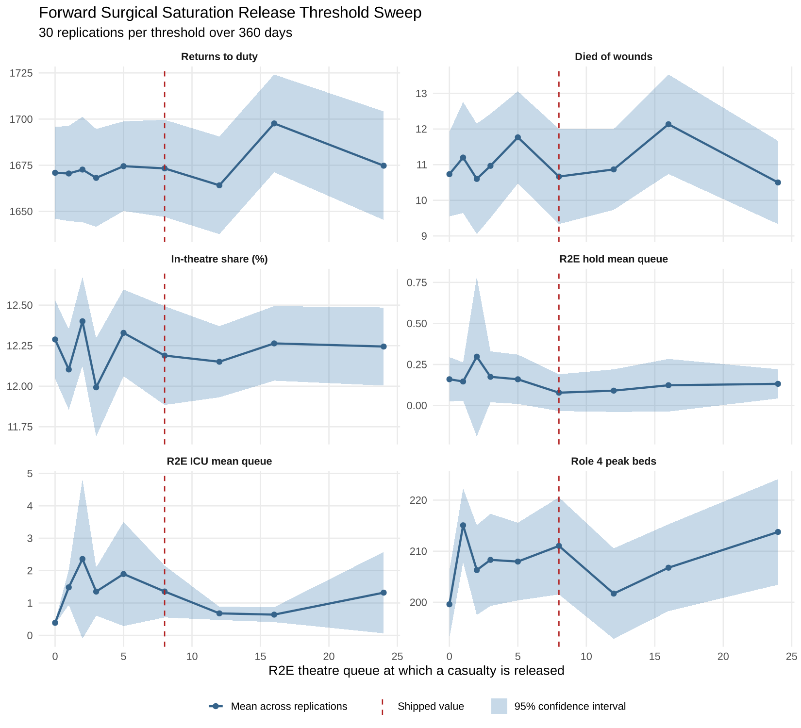

The same six responses against the R2E theatre queue length at which a casualty is released, with the shipped threshold marked by a dashed line.

With the release disabled the closing-window theatre queue was <!-- GEN cell:saturation|Theatre mean queue|0 (disabled)|full -->8.32 [5.23, 11.42]<!-- /GEN --> casualties and no casualty was released with the repair outstanding. At the shipped threshold of eight the queue was <!-- GEN cell:saturation|Theatre mean queue|8 (shipped)|full -->4.92 [1.93, 7.91]<!-- /GEN --> and <!-- GEN cell:saturation|Released with repair outstanding|8 (shipped)|full -->146.0 [125.8, 166.3]<!-- /GEN --> casualties per campaign were released with the repair outstanding, with <!-- GEN cell:saturation|Role 4 operations owed|8 (shipped)|full -->1142.0 [1089.3, 1194.7]<!-- /GEN --> operations owed at the national support base against <!-- GEN cell:saturation|Role 4 operations owed|0 (disabled)|full -->932.6 [899.3, 966.0]<!-- /GEN --> with the release disabled. Returns to duty and died of wounds per campaign were <!-- GEN cell:saturation|Returns to duty|8 (shipped)|full -->1673.3 [1647.0, 1699.6]<!-- /GEN --> and <!-- GEN cell:saturation|Died of wounds|8 (shipped)|full -->10.7 [9.3, 12.0]<!-- /GEN --> at the shipped threshold and <!-- GEN cell:saturation|Returns to duty|0 (disabled)|full -->1670.9 [1646.1, 1695.8]<!-- /GEN --> and <!-- GEN cell:saturation|Died of wounds|0 (disabled)|full -->10.7 [9.5, 11.9]<!-- /GEN --> with the release disabled.

**High-intensity profile.** The same sweep under `high_intensity` `[high_intensity, threshold 0 to 24 casualties · 360 d · 30 replications · paired, closing 90 d]`:

<!-- GEN saturation_high -->
| Response | 0 (disabled) | 1 | 2 | 3 | 5 | 8 (shipped) | 12 | 16 | 24 |
|---|---|---|---|---|---|---|---|---|---|
| Theatre mean queue | 1520.25 [1457.70, 1582.80] | 453.01 [400.63, 505.39] | 510.15 [450.73, 569.57] | 528.74 [467.04, 590.43] | 538.97 [472.52, 605.42] | 520.60 [466.00, 575.20] | 517.56 [459.20, 575.92] | 549.12 [482.09, 616.16] | 555.52 [492.13, 618.92] |
| Released with repair outstanding | 0.0 [0.0, 0.0] | 1463.9 [1448.3, 1479.5] | 1459.1 [1440.5, 1477.8] | 1454.4 [1439.6, 1469.1] | 1465.0 [1452.5, 1477.5] | 1466.2 [1452.0, 1480.4] | 1460.7 [1446.9, 1474.5] | 1474.9 [1462.8, 1487.0] | 1464.2 [1447.8, 1480.5] |
| Role 4 operations owed | 1296.4 [1271.7, 1321.1] | 1401.5 [1377.1, 1425.9] | 1407.7 [1379.6, 1435.8] | 1392.1 [1364.3, 1420.0] | 1388.9 [1367.2, 1410.5] | 1395.6 [1369.9, 1421.3] | 1401.4 [1378.7, 1424.2] | 1384.0 [1361.7, 1406.3] | 1373.6 [1348.6, 1398.6] |
| Post-definitive ICU access (%) | 1.0 [0.8, 1.1] | 0.2 [0.1, 0.2] | 0.2 [0.1, 0.2] | 0.2 [0.1, 0.3] | 0.2 [0.2, 0.3] | 0.2 [0.2, 0.3] | 0.3 [0.2, 0.3] | 0.3 [0.2, 0.4] | 0.3 [0.3, 0.4] |
| Died of wounds | 269.1 [261.7, 276.5] | 275.6 [269.5, 281.7] | 279.4 [272.8, 286.0] | 282.6 [274.9, 290.2] | 276.5 [268.2, 284.8] | 277.6 [272.1, 283.1] | 284.4 [278.3, 290.5] | 286.4 [279.7, 293.1] | 279.5 [274.5, 284.5] |
| Returns to duty | 2806.2 [2770.4, 2842.1] | 2797.5 [2767.8, 2827.2] | 2830.3 [2797.8, 2862.8] | 2830.7 [2790.6, 2870.8] | 2831.9 [2794.4, 2869.4] | 2840.0 [2806.2, 2873.9] | 2845.8 [2811.2, 2880.4] | 2855.7 [2817.0, 2894.4] | 2850.3 [2813.2, 2887.3] |
<!-- /GEN -->

The R2E theatre mean queue was <!-- GEN cell:saturation_high|Theatre mean queue|0 (disabled)|full -->1520.25 [1457.70, 1582.80]<!-- /GEN --> with the release disabled and <!-- GEN cell:saturation_high|Theatre mean queue|8 (shipped)|full -->520.60 [466.00, 575.20]<!-- /GEN --> at the shipped threshold of eight.

### Surgical Team Establishment

**Question.** What changes when the surgical sections fielded at R2E, at R2B or at both are increased, and does the R2E theatre queue converge at the larger establishment? `[default, R2E 3 to 6 and R2B 1 to 2 sections · 360 d · 30 replications · paired, closing 90 d]`

Each arm is a count of surgical sections: three, four or six at R2E, and one or two per R2B unit. R2E fields two operating theatres in every arm. A second R2B section takes the shift the first does not, and an R2E fourth section makes two sections on each shift. The shipped establishment is three sections at R2E and one per R2B unit.

<!-- GEN surgical_team -->
| Response | R2E 3, R2B 1 (shipped) | R2E 4, R2B 1 | R2E 6, R2B 1 | R2E 3, R2B 2 | R2E 4, R2B 2 |
|---|---|---|---|---|---|
| R2E theatre mean queue | 4.92 [1.93, 7.91] | 2.39 [1.33, 3.44] | 1.66 [1.23, 2.10] | 2.04 [0.89, 3.19] | 1.39 [0.71, 2.06] |
| R2E theatre queue, late-half classification | converged at 3.27 | converged at 2.00 | converged at 1.51 | converged at 1.72 | converged at 0.96 |
| R2E theatre queue shortfall per day | 0.016 [−0.005, 0.037] | 0.002 [−0.003, 0.007] | −0.001 [−0.008, 0.006] | −0.003 [−0.018, 0.011] | 0.003 [−0.003, 0.008] |
| Diverted, team off shift | 997.7 [972.0, 1023.4] | 984.8 [963.9, 1005.7] | 983.5 [957.9, 1009.1] | 0.0 [0.0, 0.0] | 0.0 [0.0, 0.0] |
| Diverted, theatre busy | 201.6 [188.0, 215.2] | 193.2 [181.7, 204.6] | 205.2 [189.8, 220.5] | 414.1 [392.0, 436.2] | 408.4 [385.6, 431.3] |
| R2B surgeries | 718.3 [705.3, 731.3] | 714.5 [704.6, 724.4] | 712.7 [698.2, 727.2] | 1351.3 [1327.7, 1375.0] | 1334.9 [1311.1, 1358.6] |
| R2E first surgeries | 1573.5 [1535.9, 1611.0] | 1548.3 [1515.5, 1581.1] | 1554.4 [1518.5, 1590.3] | 1213.0 [1168.6, 1257.3] | 1203.8 [1159.9, 1247.6] |
| R2E theatre entry deferred | 220.2 [209.1, 231.4] | 208.0 [198.0, 218.0] | 213.6 [196.8, 230.4] | 133.7 [124.3, 143.1] | 129.7 [120.2, 139.3] |
| Released with repair outstanding | 146.0 [125.8, 166.3] | 107.9 [89.9, 125.8] | 96.3 [80.1, 112.4] | 71.1 [57.4, 84.8] | 55.6 [44.0, 67.2] |
| Died of wounds | 10.67 [9.33, 12.00] | 11.27 [9.89, 12.65] | 11.10 [9.85, 12.35] | 8.40 [7.33, 9.47] | 8.17 [7.24, 9.10] |
| Returns to duty | 1673.3 [1647.0, 1699.6] | 1666.7 [1640.9, 1692.4] | 1679.4 [1655.3, 1703.4] | 1675.4 [1647.5, 1703.2] | 1657.8 [1632.9, 1682.6] |
| Post-definitive ICU access (%) | 31.7 [30.6, 32.8] | 32.5 [31.3, 33.7] | 31.6 [29.0, 34.3] | 32.0 [30.5, 33.6] | 31.9 [30.1, 33.8] |
<!-- /GEN -->

The paired differences against the shipped establishment are in the next table, each taken within replication.

<!-- GEN surgical_team_paired -->
| Paired difference against the shipped establishment | R2E 4, R2B 1 | R2E 6, R2B 1 | R2E 3, R2B 2 | R2E 4, R2B 2 |
|---|---|---|---|---|
| R2E theatre mean queue | −2.54 [−4.83, −0.24] | −3.26 [−6.34, −0.18] | −2.88 [−5.85, +0.08] | −3.53 [−6.61, −0.46] |
| Diverted, team off shift | −12.9 [−47.3, +21.4] | −14.2 [−52.3, +23.9] | −997.7 [−1023.4, −972.0] | −997.7 [−1023.4, −972.0] |
| Diverted, theatre busy | −8.4 [−23.2, +6.4] | +3.6 [−18.4, +25.5] | +212.5 [+188.4, +236.5] | +206.8 [+178.5, +235.2] |
| R2B surgeries | −3.8 [−20.8, +13.1] | −5.6 [−26.4, +15.2] | +633.0 [+608.6, +657.5] | +616.6 [+587.3, +645.8] |
| R2E first surgeries | −25.2 [−77.0, +26.7] | −19.1 [−73.8, +35.6] | −360.5 [−407.4, −313.6] | −369.7 [−429.1, −310.3] |
| R2E theatre entry deferred | −12.3 [−26.3, +1.8] | −6.6 [−28.7, +15.4] | −86.5 [−101.0, −72.0] | −90.5 [−105.9, −75.1] |
| Released with repair outstanding | −38.2 [−63.1, −13.3] | −49.8 [−77.8, −21.7] | −74.9 [−96.8, −53.0] | −90.4 [−113.9, −66.9] |
| Died of wounds | +0.60 [−1.00, +2.20] | +0.43 [−1.06, +1.93] | −2.27 [−4.04, −0.49] | −2.50 [−4.16, −0.84] |
| Returns to duty | −6.6 [−35.7, +22.4] | +6.1 [−29.6, +41.8] | +2.1 [−34.8, +39.0] | −15.5 [−45.6, +14.6] |
| Post-definitive ICU access (%) | +0.8 [−0.7, +2.3] | −0.1 [−3.1, +2.9] | +0.3 [−1.5, +2.1] | +0.2 [−1.9, +2.4] |
<!-- /GEN -->

At the shipped establishment the R2E theatre queue averaged <!-- GEN cell:surgical_team|R2E theatre mean queue|R2E 3, R2B 1 (shipped)|full -->4.92 [1.93, 7.91]<!-- /GEN --> over the closing 90 days and was classified <!-- GEN cell:surgical_team|R2E theatre queue, late-half classification|R2E 3, R2B 1 (shipped)|full -->converged at 3.27<!-- /GEN -->. A fourth R2E section changed it by <!-- GEN cell:surgical_team_paired|R2E theatre mean queue|R2E 4, R2B 1|full -->−2.54 [−4.83, −0.24]<!-- /GEN --> and a sixth by <!-- GEN cell:surgical_team_paired|R2E theatre mean queue|R2E 6, R2B 1|full -->−3.26 [−6.34, −0.18]<!-- /GEN -->, with the queue classified <!-- GEN cell:surgical_team|R2E theatre queue, late-half classification|R2E 4, R2B 1|full -->converged at 2.00<!-- /GEN --> and <!-- GEN cell:surgical_team|R2E theatre queue, late-half classification|R2E 6, R2B 1|full -->converged at 1.51<!-- /GEN -->. The paired differences in deaths of wounds for the fourth and sixth R2E sections were <!-- GEN cell:surgical_team_paired|Died of wounds|R2E 4, R2B 1|full -->+0.60 [−1.00, +2.20]<!-- /GEN --> and <!-- GEN cell:surgical_team_paired|Died of wounds|R2E 6, R2B 1|full -->+0.43 [−1.06, +1.93]<!-- /GEN -->, and in returns to duty <!-- GEN cell:surgical_team_paired|Returns to duty|R2E 4, R2B 1|full -->−6.6 [−35.7, +22.4]<!-- /GEN --> and <!-- GEN cell:surgical_team_paired|Returns to duty|R2E 6, R2B 1|full -->+6.1 [−29.6, +41.8]<!-- /GEN -->.

A second R2B section removed the cases diverted for a closed section, which fell from <!-- GEN cell:surgical_team|Diverted, team off shift|R2E 3, R2B 1 (shipped)|full -->997.7 [972.0, 1023.4]<!-- /GEN --> to <!-- GEN cell:surgical_team|Diverted, team off shift|R2E 3, R2B 2|full -->0.0 [0.0, 0.0]<!-- /GEN -->, and raised those diverted for a busy theatre by <!-- GEN cell:surgical_team_paired|Diverted, theatre busy|R2E 3, R2B 2|full -->+212.5 [+188.4, +236.5]<!-- /GEN -->. R2B surgeries rose by <!-- GEN cell:surgical_team_paired|R2B surgeries|R2E 3, R2B 2|full -->+633.0 [+608.6, +657.5]<!-- /GEN -->, R2E first surgeries fell by <!-- GEN cell:surgical_team_paired|R2E first surgeries|R2E 3, R2B 2|full -->−360.5 [−407.4, −313.6]<!-- /GEN --> and the casualties released with the repair outstanding fell by <!-- GEN cell:surgical_team_paired|Released with repair outstanding|R2E 3, R2B 2|full -->−74.9 [−96.8, −53.0]<!-- /GEN -->. Deaths of wounds differed by <!-- GEN cell:surgical_team_paired|Died of wounds|R2E 3, R2B 2|full -->−2.27 [−4.04, −0.49]<!-- /GEN --> per campaign, and returns to duty by <!-- GEN cell:surgical_team_paired|Returns to duty|R2E 3, R2B 2|full -->+2.1 [−34.8, +39.0]<!-- /GEN -->. With both levers together the differences in deaths of wounds and in returns to duty were <!-- GEN cell:surgical_team_paired|Died of wounds|R2E 4, R2B 2|full -->−2.50 [−4.16, −0.84]<!-- /GEN --> and <!-- GEN cell:surgical_team_paired|Returns to duty|R2E 4, R2B 2|full -->−15.5 [−45.6, +14.6]<!-- /GEN -->.

At high intensity the same five arms were run under the `high_intensity` profile (30 replications, 360 days, seed 42).

<!-- GEN surgical_team_high -->
| Response | R2E 3, R2B 1 (shipped) | R2E 4, R2B 1 | R2E 6, R2B 1 | R2E 3, R2B 2 | R2E 4, R2B 2 |
|---|---|---|---|---|---|
| R2E theatre mean queue | 520.60 [466.00, 575.20] | 321.64 [272.58, 370.70] | 115.07 [91.39, 138.76] | 216.10 [170.43, 261.78] | 109.97 [88.32, 131.62] |
| R2E theatre queue, late-half classification | **drifting, +11.7%/block**, 36.9 to 573.6 | **drifting, +9.1%/block**, 34.9 to 355.3 | **drifting, +5.9%/block**, 22.2 to 122.6 | **drifting, +10.5%/block**, 25.5 to 239.2 | **drifting, +3.4%/block**, 25.2 to 107.9 |
| R2E theatre queue shortfall per day | 1.629 [1.505, 1.753] | 0.820 [0.670, 0.970] | 0.201 [0.165, 0.238] | 0.609 [0.407, 0.811] | 0.115 [0.034, 0.195] |
| Diverted, team off shift | 3161.6 [3108.8, 3214.5] | 3201.2 [3152.1, 3250.4] | 3178.1 [3132.9, 3223.3] | 0.0 [0.0, 0.0] | 0.0 [0.0, 0.0] |
| Diverted, theatre busy | 1106.7 [1080.6, 1132.9] | 1122.6 [1087.6, 1157.7] | 1116.6 [1094.7, 1138.4] | 2134.0 [2093.1, 2174.9] | 2171.5 [2137.4, 2205.6] |
| R2B surgeries | 1579.8 [1561.9, 1597.7] | 1602.9 [1587.5, 1618.2] | 1587.5 [1569.0, 1605.9] | 2938.4 [2910.5, 2966.3] | 2950.4 [2926.2, 2974.6] |
| R2E first surgeries | 3536.0 [3510.8, 3561.1] | 3822.3 [3789.4, 3855.2] | 4017.3 [3977.0, 4057.5] | 3427.7 [3401.5, 3454.0] | 3612.7 [3575.7, 3649.7] |
| R2E theatre entry deferred | 1013.5 [991.8, 1035.2] | 1014.2 [992.4, 1035.9] | 1021.5 [1004.6, 1038.5] | 794.8 [777.7, 811.9] | 817.4 [803.3, 831.4] |
| Released with repair outstanding | 1466.2 [1452.0, 1480.4] | 1531.4 [1508.4, 1554.4] | 1514.1 [1475.1, 1553.0] | 970.7 [951.6, 989.8] | 970.8 [937.1, 1004.6] |
| Died of wounds | 277.60 [272.10, 283.10] | 290.97 [284.80, 297.14] | 283.03 [275.85, 290.22] | 259.07 [251.41, 266.73] | 261.87 [255.36, 268.37] |
| Returns to duty | 2840.0 [2806.2, 2873.9] | 2824.3 [2792.6, 2856.1] | 2834.4 [2799.5, 2869.3] | 2842.8 [2800.9, 2884.8] | 2859.0 [2831.0, 2886.9] |
| Post-definitive ICU access (%) | 0.2 [0.2, 0.3] | 0.2 [0.2, 0.3] | 0.2 [0.1, 0.3] | 0.2 [0.1, 0.2] | 0.2 [0.1, 0.2] |
<!-- /GEN -->

<!-- GEN surgical_team_paired_high -->
| Paired difference against the shipped establishment | R2E 4, R2B 1 | R2E 6, R2B 1 | R2E 3, R2B 2 | R2E 4, R2B 2 |
|---|---|---|---|---|
| R2E theatre mean queue | −198.96 [−270.85, −127.06] | −405.52 [−464.06, −346.98] | −304.49 [−376.27, −232.72] | −410.63 [−467.10, −354.16] |
| Diverted, team off shift | +39.6 [−40.0, +119.2] | +16.5 [−57.5, +90.4] | −3161.6 [−3214.5, −3108.8] | −3161.6 [−3214.5, −3108.8] |
| Diverted, theatre busy | +15.9 [−29.1, +60.9] | +9.8 [−26.1, +45.7] | +1027.3 [+977.9, +1076.6] | +1064.8 [+1020.2, +1109.3] |
| R2B surgeries | +23.1 [−2.5, +48.6] | +7.7 [−21.0, +36.3] | +1358.6 [+1326.4, +1390.9] | +1370.6 [+1337.3, +1403.8] |
| R2E first surgeries | +286.3 [+245.2, +327.4] | +481.3 [+430.4, +532.2] | −108.2 [−138.8, −77.6] | +76.7 [+32.7, +120.8] |
| R2E theatre entry deferred | +0.7 [−30.3, +31.6] | +8.0 [−21.1, +37.2] | −218.7 [−248.7, −188.7] | −196.1 [−221.4, −170.8] |
| Released with repair outstanding | +65.2 [+38.1, +92.3] | +47.9 [+11.1, +84.7] | −495.5 [−522.2, −468.8] | −495.4 [−532.4, −458.4] |
| Died of wounds | +13.37 [+4.09, +22.65] | +5.43 [−4.08, +14.95] | −18.53 [−27.90, −9.17] | −15.73 [−24.95, −6.52] |
| Returns to duty | −15.7 [−52.9, +21.5] | −5.7 [−51.6, +40.3] | +2.8 [−53.8, +59.4] | +18.9 [−27.9, +65.8] |
| Post-definitive ICU access (%) | +0.0 [−0.1, +0.1] | −0.0 [−0.1, +0.0] | −0.0 [−0.1, +0.0] | −0.0 [−0.1, +0.0] |
<!-- /GEN -->

At the shipped establishment the high-intensity R2E theatre queue averaged <!-- GEN cell:surgical_team_high|R2E theatre mean queue|R2E 3, R2B 1 (shipped)|full -->520.60 [466.00, 575.20]<!-- /GEN --> over the closing 90 days and was classified <!-- GEN cell:surgical_team_high|R2E theatre queue, late-half classification|R2E 3, R2B 1 (shipped)|full -->**drifting, +11.7%/block**, 36.9 to 573.6<!-- /GEN -->, a shortfall of <!-- GEN cell:surgical_team_high|R2E theatre queue shortfall per day|R2E 3, R2B 1 (shipped)|full -->1.629 [1.505, 1.753]<!-- /GEN --> casualties per day. A fourth R2E section gave <!-- GEN cell:surgical_team_high|R2E theatre mean queue|R2E 4, R2B 1|full -->321.64 [272.58, 370.70]<!-- /GEN --> and <!-- GEN cell:surgical_team_high|R2E theatre queue, late-half classification|R2E 4, R2B 1|full -->**drifting, +9.1%/block**, 34.9 to 355.3<!-- /GEN -->, with a shortfall of <!-- GEN cell:surgical_team_high|R2E theatre queue shortfall per day|R2E 4, R2B 1|full -->0.820 [0.670, 0.970]<!-- /GEN --> per day; a sixth gave <!-- GEN cell:surgical_team_high|R2E theatre queue, late-half classification|R2E 6, R2B 1|full -->**drifting, +5.9%/block**, 22.2 to 122.6<!-- /GEN --> and <!-- GEN cell:surgical_team_high|R2E theatre queue shortfall per day|R2E 6, R2B 1|full -->0.201 [0.165, 0.238]<!-- /GEN --> per day. A second R2B section alone gave <!-- GEN cell:surgical_team_high|R2E theatre queue, late-half classification|R2E 3, R2B 2|full -->**drifting, +10.5%/block**, 25.5 to 239.2<!-- /GEN --> and <!-- GEN cell:surgical_team_high|R2E theatre queue shortfall per day|R2E 3, R2B 2|full -->0.609 [0.407, 0.811]<!-- /GEN --> per day, and both levers together <!-- GEN cell:surgical_team_high|R2E theatre queue, late-half classification|R2E 4, R2B 2|full -->**drifting, +3.4%/block**, 25.2 to 107.9<!-- /GEN --> and <!-- GEN cell:surgical_team_high|R2E theatre queue shortfall per day|R2E 4, R2B 2|full -->0.115 [0.034, 0.195]<!-- /GEN --> per day. The paired difference in deaths of wounds was <!-- GEN cell:surgical_team_paired_high|Died of wounds|R2E 4, R2B 1|full -->+13.37 [+4.09, +22.65]<!-- /GEN --> for the fourth R2E section and <!-- GEN cell:surgical_team_paired_high|Died of wounds|R2E 4, R2B 2|full -->−15.73 [−24.95, −6.52]<!-- /GEN --> for both levers, and in returns to duty <!-- GEN cell:surgical_team_paired_high|Returns to duty|R2E 4, R2B 1|full -->−15.7 [−52.9, +21.5]<!-- /GEN --> and <!-- GEN cell:surgical_team_paired_high|Returns to duty|R2E 4, R2B 2|full -->+18.9 [−27.9, +65.8]<!-- /GEN -->.

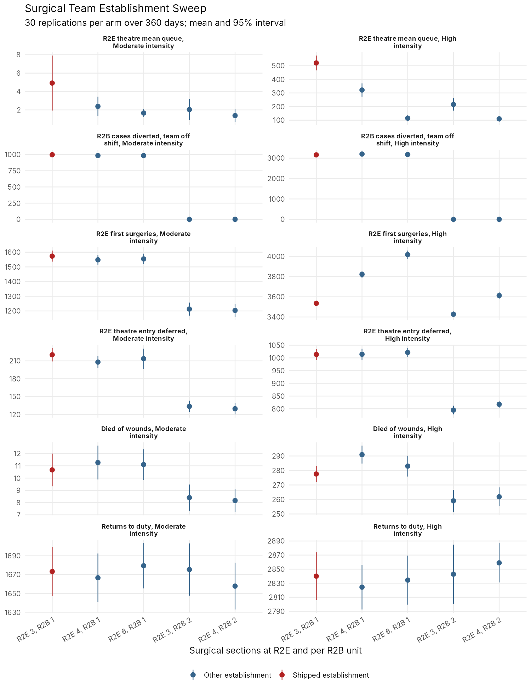

The R2E theatre queue and the diversions, deaths of wounds and returns to duty of each establishment, at moderate intensity (left) and high intensity (right), with the shipped establishment marked.

### R2E Intensive Care Bed Establishment

**Question.** What changes when the R2E intensive care establishment is raised from the shipped four beds, and does the R2E intensive care queue converge at any bed count swept? `[default and high_intensity, R2E ICU 4 to 16 beds · 360 d · 30 replications · paired, closing 90 d]`

Each arm is a bed count for the R2E intensive care pool: four (shipped), six, eight, twelve and sixteen. No stay at R2E seizes an intensive care section, so the beds are varied without staff and the nurses per bed row is the shipped three sections of four nurses over the bed count, a ratio the model does not charge. R2B intensive care beds are not varied.

<!-- GEN icu_bed -->
| Response | 4 beds (shipped) | 6 beds | 8 beds | 12 beds | 16 beds |
|---|---|---|---|---|---|
| Nurses per ICU bed at three sections | 3.00 | 2.00 | 1.50 | 1.00 | 0.75 |
| R2E ICU mean queue | 1.35 [0.55, 2.16] | 0.47 [0.35, 0.59] | 0.34 [0.28, 0.40] | 0.13 [0.10, 0.17] | 0.90 [0.00, 2.65] |
| R2E ICU queue, late-half classification | converged at 1.05 | converged at 0.53 | converged at 0.41 | converged at 0.17 | **drifting, -27.0%/block**, 0.2 to 1.0 |
| R2E ICU queue shortfall per day | 0.004 [−0.003, 0.012] | 0.000 [−0.003, 0.002] | −0.002 [−0.004, 0.000] | −0.001 [−0.002, 0.001] | −0.016 [−0.027, −0.006] |
| R2E ICU occupancy (%) | 87.8 [86.8, 88.9] | 80.1 [78.5, 81.6] | 74.7 [73.1, 76.2] | 62.1 [59.8, 64.5] | 52.9 [49.1, 56.7] |
| R2E holding mean queue | 0.08 [0.00, 0.19] | 0.07 [0.01, 0.13] | 0.01 [0.00, 0.03] | 0.01 [0.00, 0.02] | 5.34 [0.00, 16.27] |
| R2E holding queue, late-half classification | converged at 0.09 | converged at 0.12 | converged at 0.27 | converged at 0.07 | converged at 5.21 |
| R2E holding queue shortfall per day | 0.000 [−0.001, 0.001] | −0.001 [−0.004, 0.001] | −0.006 [−0.014, 0.002] | −0.002 [−0.004, 0.001] | −0.007 [−0.030, 0.016] |
| Replications with an R2E pool queue of 20 or more | 0 of 30 | 0 of 30 | 0 of 30 | 0 of 30 | 1 of 30 |
| Post-operative care in a holding bed (%) | 50.2 [49.1, 51.4] | 35.9 [34.5, 37.3] | 25.3 [23.7, 26.8] | 11.2 [10.2, 12.3] | 5.5 [2.1, 8.8] |
| Post-definitive ICU access (%) | 31.7 [30.6, 32.8] | 51.0 [49.2, 52.8] | 65.9 [64.1, 67.7] | 85.6 [84.1, 87.1] | 92.7 [87.6, 97.8] |
| R2E theatre entry deferred | 220.2 [209.1, 231.4] | 162.1 [151.8, 172.4] | 125.5 [115.7, 135.3] | 68.4 [60.4, 76.3] | 37.3 [17.6, 57.0] |
| Died of wounds | 10.67 [9.33, 12.00] | 10.77 [9.41, 12.13] | 10.07 [8.83, 11.31] | 10.33 [9.24, 11.43] | 10.60 [9.39, 11.81] |
| Returns to duty | 1673.3 [1647.0, 1699.6] | 1669.9 [1644.6, 1695.1] | 1672.0 [1643.1, 1700.9] | 1676.1 [1647.6, 1704.7] | 1677.9 [1650.9, 1704.9] |
| Critical-route evacuation wait (days) | 0.54 [0.47, 0.62] | 0.54 [0.40, 0.69] | 0.53 [0.31, 0.76] | 0.56 [0.37, 0.75] | 1.07 [0.03, 2.10] |
| Role 4 peak census | 211.0 [201.5, 220.5] | 209.7 [199.1, 220.3] | 216.8 [207.0, 226.6] | 220.2 [209.4, 230.9] | 209.5 [199.5, 219.5] |
| Role 4 closing mean census | 114.9 [109.3, 120.4] | 110.0 [104.3, 115.8] | 108.6 [104.8, 112.4] | 110.4 [103.6, 117.3] | 109.4 [104.8, 114.0] |
<!-- /GEN -->

<!-- GEN icu_bed_paired -->
| Paired difference against the shipped establishment | 6 beds | 8 beds | 12 beds | 16 beds |
|---|---|---|---|---|
| R2E ICU mean queue | −0.89 [−1.69, −0.09] | −1.02 [−1.83, −0.20] | −1.22 [−2.02, −0.42] | −0.45 [−2.42, +1.51] |
| R2E ICU occupancy (%) | −7.8 [−9.7, −5.8] | −13.2 [−15.2, −11.2] | −25.7 [−28.4, −23.1] | −34.9 [−38.9, −31.0] |
| R2E holding mean queue | −0.01 [−0.13, +0.11] | −0.07 [−0.18, +0.04] | −0.07 [−0.18, +0.04] | +5.27 [−5.67, +16.20] |
| Post-operative care in a holding bed (%) | −14.4 [−16.1, −12.7] | −25.0 [−26.8, −23.1] | −39.0 [−40.4, −37.6] | −44.8 [−48.1, −41.4] |
| Post-definitive ICU access (%) | +19.3 [+17.3, +21.3] | +34.2 [+32.0, +36.3] | +53.9 [+52.3, +55.5] | +61.0 [+56.2, +65.8] |
| R2E theatre entry deferred | −58.2 [−73.0, −43.3] | −94.7 [−109.8, −79.7] | −151.9 [−164.5, −139.2] | −182.9 [−202.9, −163.0] |
| Died of wounds | +0.10 [−1.75, +1.95] | −0.60 [−2.47, +1.27] | −0.33 [−1.95, +1.28] | −0.07 [−1.78, +1.64] |
| Returns to duty | −3.4 [−36.0, +29.2] | −1.3 [−41.0, +38.3] | +2.8 [−30.0, +35.7] | +4.6 [−29.9, +39.1] |
| Critical-route evacuation wait (days) | +0.00 [−0.14, +0.14] | −0.01 [−0.25, +0.23] | +0.02 [−0.16, +0.20] | +0.52 [−0.49, +1.53] |
| Role 4 peak census | −1.3 [−17.1, +14.5] | +5.8 [−6.1, +17.6] | +9.1 [−3.9, +22.2] | −1.6 [−14.5, +11.3] |
| Role 4 closing mean census | −4.8 [−13.3, +3.6] | −6.3 [−12.4, −0.2] | −4.4 [−13.0, +4.2] | −5.5 [−12.4, +1.4] |
<!-- /GEN -->

At the shipped establishment the R2E intensive care queue over the closing 90 days averaged <!-- GEN cell:icu_bed|R2E ICU mean queue|4 beds (shipped)|full -->1.35 [0.55, 2.16]<!-- /GEN --> and was classified <!-- GEN cell:icu_bed|R2E ICU queue, late-half classification|4 beds (shipped)|full -->converged at 1.05<!-- /GEN -->, with <!-- GEN cell:icu_bed|R2E ICU occupancy (%)|4 beds (shipped)|full -->87.8 [86.8, 88.9]<!-- /GEN --> percent occupancy; <!-- GEN cell:icu_bed|Post-operative care in a holding bed (%)|4 beds (shipped)|full -->50.2 [49.1, 51.4]<!-- /GEN --> percent of post-operative care was taken in a holding bed and <!-- GEN cell:icu_bed|Post-definitive ICU access (%)|4 beds (shipped)|full -->31.7 [30.6, 32.8]<!-- /GEN --> percent of post-definitive care in an intensive care bed. Twelve beds changed the share of post-operative care taken in a holding bed by <!-- GEN cell:icu_bed_paired|Post-operative care in a holding bed (%)|12 beds|full -->−39.0 [−40.4, −37.6]<!-- /GEN --> percentage points and the post-definitive access by <!-- GEN cell:icu_bed_paired|Post-definitive ICU access (%)|12 beds|full -->+53.9 [+52.3, +55.5]<!-- /GEN --> percentage points. The paired differences in deaths of wounds at six, eight, twelve and sixteen beds were <!-- GEN cell:icu_bed_paired|Died of wounds|6 beds|full -->+0.10 [−1.75, +1.95]<!-- /GEN -->, <!-- GEN cell:icu_bed_paired|Died of wounds|8 beds|full -->−0.60 [−2.47, +1.27]<!-- /GEN -->, <!-- GEN cell:icu_bed_paired|Died of wounds|12 beds|full -->−0.33 [−1.95, +1.28]<!-- /GEN --> and <!-- GEN cell:icu_bed_paired|Died of wounds|16 beds|full -->−0.07 [−1.78, +1.64]<!-- /GEN -->, and in returns to duty <!-- GEN cell:icu_bed_paired|Returns to duty|6 beds|full -->−3.4 [−36.0, +29.2]<!-- /GEN -->, <!-- GEN cell:icu_bed_paired|Returns to duty|8 beds|full -->−1.3 [−41.0, +38.3]<!-- /GEN -->, <!-- GEN cell:icu_bed_paired|Returns to duty|12 beds|full -->+2.8 [−30.0, +35.7]<!-- /GEN --> and <!-- GEN cell:icu_bed_paired|Returns to duty|16 beds|full -->+4.6 [−29.9, +39.1]<!-- /GEN -->. In the sixteen-bed arm <!-- GEN cell:icu_bed|Replications with an R2E pool queue of 20 or more|16 beds|full -->1 of 30<!-- /GEN --> replications ended with an R2E pool queue of twenty or more.

At high intensity the same five arms were run under the `high_intensity` profile (30 replications, 360 days, seed 42).

<!-- GEN icu_bed_high -->
| Response | 4 beds (shipped) | 6 beds | 8 beds | 12 beds | 16 beds |
|---|---|---|---|---|---|
| Nurses per ICU bed at three sections | 3.00 | 2.00 | 1.50 | 1.00 | 0.75 |
| R2E ICU mean queue | 1438.30 [1423.92, 1452.69] | 1378.59 [1365.04, 1392.15] | 1329.59 [1311.45, 1347.73] | 1272.33 [1252.52, 1292.13] | 1210.12 [1193.38, 1226.86] |
| R2E ICU queue, late-half classification | **drifting, +13.0%/block**, 32.5 to 1,590.1 | **drifting, +13.5%/block**, 26.5 to 1,529.2 | **drifting, +13.7%/block**, 19.9 to 1,477.6 | **drifting, +14.2%/block**, 13.2 to 1,413.2 | **drifting, +14.7%/block**, 9.9 to 1,349.4 |
| R2E ICU queue shortfall per day | 4.954 [4.905, 5.002] | 4.875 [4.808, 4.941] | 4.775 [4.694, 4.856] | 4.678 [4.629, 4.726] | 4.589 [4.533, 4.645] |
| R2E ICU occupancy (%) | 100.0 [100.0, 100.0] | 100.0 [100.0, 100.0] | 100.0 [100.0, 100.0] | 100.0 [100.0, 100.0] | 100.0 [100.0, 100.0] |
| R2E holding mean queue | 556.08 [528.50, 583.66] | 639.45 [615.32, 663.59] | 711.27 [692.81, 729.72] | 796.56 [776.83, 816.29] | 853.16 [830.12, 876.20] |
| R2E holding queue, late-half classification | **drifting, +9.3%/block**, 48.6 to 595.9 | **drifting, +8.8%/block**, 51.1 to 684.1 | **drifting, +9.0%/block**, 56.8 to 759.6 | **drifting, +8.7%/block**, 62.6 to 850.3 | **drifting, +8.2%/block**, 67.0 to 909.1 |
| R2E holding queue shortfall per day | 1.459 [1.408, 1.511] | 1.601 [1.498, 1.704] | 1.813 [1.694, 1.932] | 1.974 [1.907, 2.040] | 2.013 [1.870, 2.155] |
| Replications with an R2E pool queue of 20 or more | 30 of 30 | 30 of 30 | 30 of 30 | 30 of 30 | 30 of 30 |
| Post-operative care in a holding bed (%) | 99.1 [99.0, 99.3] | 98.6 [98.4, 98.7] | 97.8 [97.6, 98.1] | 96.1 [95.8, 96.5] | 93.8 [93.3, 94.4] |
| Post-definitive ICU access (%) | 0.2 [0.2, 0.3] | 0.4 [0.3, 0.5] | 0.7 [0.6, 0.8] | 1.5 [1.2, 1.7] | 2.4 [2.1, 2.8] |
| R2E theatre entry deferred | 1013.5 [991.8, 1035.2] | 1019.8 [997.6, 1042.0] | 1014.0 [995.1, 1032.9] | 1006.1 [987.1, 1025.1] | 1015.3 [995.0, 1035.5] |
| Died of wounds | 277.60 [272.10, 283.10] | 282.93 [275.34, 290.53] | 287.17 [281.47, 292.86] | 283.77 [276.05, 291.49] | 285.10 [278.08, 292.12] |
| Returns to duty | 2840.0 [2806.2, 2873.9] | 2841.6 [2811.9, 2871.2] | 2834.4 [2800.0, 2868.8] | 2824.0 [2797.2, 2850.9] | 2832.7 [2799.4, 2866.1] |
| Critical-route evacuation wait (days) | 21.90 [21.49, 22.30] | 25.25 [24.89, 25.61] | 27.97 [27.64, 28.29] | 32.07 [31.72, 32.41] | 34.95 [34.51, 35.39] |
| Role 4 peak census | 226.3 [224.7, 227.8] | 226.8 [224.8, 228.8] | 229.7 [226.9, 232.4] | 227.9 [225.7, 230.1] | 228.2 [226.0, 230.4] |
| Role 4 closing mean census | 151.9 [150.2, 153.5] | 152.8 [151.3, 154.3] | 151.8 [150.3, 153.3] | 152.1 [150.6, 153.5] | 151.5 [149.9, 153.1] |
<!-- /GEN -->

<!-- GEN icu_bed_paired_high -->
| Paired difference against the shipped establishment | 6 beds | 8 beds | 12 beds | 16 beds |
|---|---|---|---|---|
| R2E ICU mean queue | −59.71 [−80.72, −38.71] | −108.72 [−132.27, −85.16] | −165.98 [−186.02, −145.94] | −228.18 [−248.00, −208.36] |
| R2E ICU occupancy (%) | −0.0 [−0.0, +0.0] | +0.0 [+0.0, +0.0] | +0.0 [−0.0, +0.0] | +0.0 [+0.0, +0.0] |
| R2E holding mean queue | +83.37 [+48.04, +118.71] | +155.19 [+120.10, +190.27] | +240.48 [+213.82, +267.15] | +297.08 [+265.14, +329.02] |
| Post-operative care in a holding bed (%) | −0.6 [−0.8, −0.4] | −1.3 [−1.6, −1.1] | −3.0 [−3.4, −2.6] | −5.3 [−5.9, −4.7] |
| Post-definitive ICU access (%) | +0.2 [+0.1, +0.3] | +0.5 [+0.4, +0.6] | +1.2 [+1.0, +1.4] | +2.2 [+1.8, +2.6] |
| R2E theatre entry deferred | +6.3 [−24.5, +37.1] | +0.5 [−21.4, +22.4] | −7.4 [−35.2, +20.4] | +1.8 [−29.9, +33.4] |
| Died of wounds | +5.33 [−5.12, +15.79] | +9.57 [+1.43, +17.70] | +6.17 [−5.16, +17.49] | +7.50 [−1.92, +16.92] |
| Returns to duty | +1.5 [−46.3, +49.4] | −5.7 [−49.6, +38.3] | −16.0 [−58.1, +26.1] | −7.3 [−55.9, +41.3] |
| Critical-route evacuation wait (days) | +3.36 [+2.86, +3.85] | +6.07 [+5.52, +6.62] | +10.17 [+9.64, +10.69] | +13.05 [+12.53, +13.57] |
| Role 4 peak census | +0.6 [−1.5, +2.7] | +3.4 [+0.4, +6.4] | +1.6 [−1.4, +4.6] | +1.9 [−0.8, +4.7] |
| Role 4 closing mean census | +0.9 [−1.1, +2.9] | −0.0 [−2.2, +2.1] | +0.2 [−1.8, +2.2] | −0.4 [−2.5, +1.8] |
<!-- /GEN -->

At the shipped establishment the high-intensity R2E intensive care queue averaged <!-- GEN cell:icu_bed_high|R2E ICU mean queue|4 beds (shipped)|full -->1438.30 [1423.92, 1452.69]<!-- /GEN --> and was classified <!-- GEN cell:icu_bed_high|R2E ICU queue, late-half classification|4 beds (shipped)|full -->**drifting, +13.0%/block**, 32.5 to 1,590.1<!-- /GEN -->, a shortfall of <!-- GEN cell:icu_bed_high|R2E ICU queue shortfall per day|4 beds (shipped)|full -->4.954 [4.905, 5.002]<!-- /GEN --> casualties per day. At sixteen beds, four times the shipped establishment, the queue averaged <!-- GEN cell:icu_bed_high|R2E ICU mean queue|16 beds|full -->1210.12 [1193.38, 1226.86]<!-- /GEN -->, was classified <!-- GEN cell:icu_bed_high|R2E ICU queue, late-half classification|16 beds|full -->**drifting, +14.7%/block**, 9.9 to 1,349.4<!-- /GEN --> and fell short by <!-- GEN cell:icu_bed_high|R2E ICU queue shortfall per day|16 beds|full -->4.589 [4.533, 4.645]<!-- /GEN --> per day, so no bed count swept classified the pool as converged. Over the same arms the R2E holding queue shortfall per day went from <!-- GEN cell:icu_bed_high|R2E holding queue shortfall per day|4 beds (shipped)|full -->1.459 [1.408, 1.511]<!-- /GEN --> at the shipped establishment to <!-- GEN cell:icu_bed_high|R2E holding queue shortfall per day|16 beds|full -->2.013 [1.870, 2.155]<!-- /GEN --> at sixteen beds, and the mean evacuation wait of the critical route from <!-- GEN cell:icu_bed_high|Critical-route evacuation wait (days)|4 beds (shipped)|full -->21.90 [21.49, 22.30]<!-- /GEN --> days to <!-- GEN cell:icu_bed_high|Critical-route evacuation wait (days)|16 beds|full -->34.95 [34.51, 35.39]<!-- /GEN --> days. The paired differences at sixteen beds were <!-- GEN cell:icu_bed_paired_high|Died of wounds|16 beds|full -->+7.50 [−1.92, +16.92]<!-- /GEN --> in deaths of wounds and <!-- GEN cell:icu_bed_paired_high|Returns to duty|16 beds|full -->−7.3 [−55.9, +41.3]<!-- /GEN --> in returns to duty.

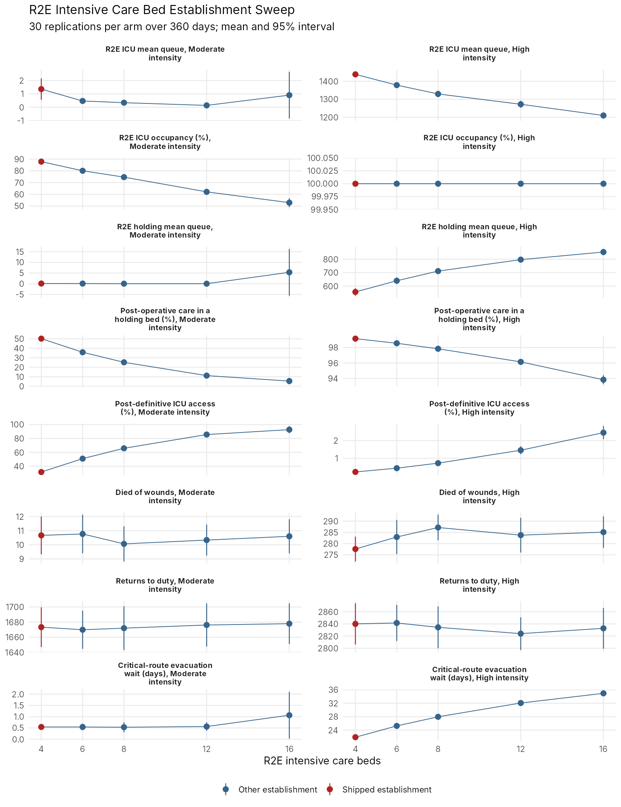

The R2E intensive care queue, occupancy, holding queue, post-operative and post-definitive care and the critical-route evacuation wait of each establishment, with deaths of wounds and returns to duty, at moderate intensity (left) and high intensity (right), with the shipped establishment marked.

---

## National Support Base and Strategic Airlift

<small>[Return to Top](#contents)</small>

**Question.** How does strategic evacuation demand and its wait respond to the shipped airlift schedule, to the interval between sorties and to sortie cancellation, and what census does the national support base carry? `[default, both intensities and swept values · 360 d · 30 replications · per-replication reductions]`

<!-- GEN airlift_baseline -->
| Response at the shipped schedule | Moderate intensity | High intensity |
|---|---|---|
| Casualties boarded | 2786.90 [2735.91, 2837.89] | 3366.73 [3344.71, 3388.76] |
| Still waiting at the close | 1.50 [0.89, 2.11] | 1924.43 [1904.07, 1944.80] |
| Mean wait (days) | 0.33 [0.28, 0.38] | 18.57 [18.04, 19.10] |
| Share of R2E holding beds held by the evacuation wait | 4% [3%, 5%] | 38% [37%, 39%] |
| Role 4 peak occupancy (concurrent patients) | 211.03 [201.53, 220.54] | 226.27 [224.71, 227.82] |
| Days the peak falls before the campaign ends | 134.20 [97.84, 170.56] | 169.47 [133.45, 205.48] |
<!-- /GEN -->

At the shipped schedule <!-- GEN cell:airlift_baseline|Casualties boarded|Moderate intensity|mean -->2786.90<!-- /GEN --> casualties boarded at moderate intensity and <!-- GEN cell:airlift_baseline|Casualties boarded|High intensity|mean -->3366.73<!-- /GEN --> at high, with <!-- GEN cell:airlift_baseline|Still waiting at the close|Moderate intensity|mean -->1.50<!-- /GEN --> and <!-- GEN cell:airlift_baseline|Still waiting at the close|High intensity|mean -->1924.43<!-- /GEN --> still waiting at the close and mean waits of <!-- GEN cell:airlift_baseline|Mean wait (days)|Moderate intensity|mean -->0.33<!-- /GEN --> and <!-- GEN cell:airlift_baseline|Mean wait (days)|High intensity|mean -->18.57<!-- /GEN --> days. The evacuation wait held <!-- GEN cell:airlift_baseline|Share of R2E holding beds held by the evacuation wait|Moderate intensity|full -->4% [3%, 5%]<!-- /GEN --> and <!-- GEN cell:airlift_baseline|Share of R2E holding beds held by the evacuation wait|High intensity|full -->38% [37%, 39%]<!-- /GEN --> of the R2E holding beds. Role 4 peak occupancy was <!-- GEN cell:airlift_baseline|Role 4 peak occupancy (concurrent patients)|Moderate intensity|full -->211.03 [201.53, 220.54]<!-- /GEN --> and <!-- GEN cell:airlift_baseline|Role 4 peak occupancy (concurrent patients)|High intensity|full -->226.27 [224.71, 227.82]<!-- /GEN --> concurrent patients, and the peak fell <!-- GEN cell:airlift_baseline|Days the peak falls before the campaign ends|Moderate intensity|full -->134.20 [97.84, 170.56]<!-- /GEN --> and <!-- GEN cell:airlift_baseline|Days the peak falls before the campaign ends|High intensity|full -->169.47 [133.45, 205.48]<!-- /GEN --> days before the campaign ended.

<!-- GEN airlift_interval -->
| Response by interval between sorties | 3 days | 5 days | 7 days (shipped) | 10 days | 14 days |
|---|---|---|---|---|---|
| Sorties flown | 119.00 | 71.00 | 51.00 | 35.00 | 25.00 |
| Mean wait (days) | 0.23 [0.20, 0.26] | 0.24 [0.21, 0.27] | 0.33 [0.28, 0.38] | 9.30 [7.77, 10.83] | 26.84 [25.42, 28.25] |
| Share of R2E holding beds held by the evacuation wait | 0% [0%, 1%] | 2% [1%, 2%] | 4% [3%, 5%] | 53% [49%, 57%] | 64% [64%, 65%] |
| Ventilated pre-flight intensive care hold (hours) | 24.15 [23.91, 24.39] | 24.40 [24.14, 24.66] | 25.17 [24.50, 25.83] | 135.73 [117.75, 153.72] | 423.31 [395.55, 451.07] |
<!-- /GEN -->

Shortening the interval between sorties below the shipped seven days left the mean wait at <!-- GEN cell:airlift_interval|Mean wait (days)|3 days|mean -->0.23<!-- /GEN --> days at three days and <!-- GEN cell:airlift_interval|Mean wait (days)|5 days|mean -->0.24<!-- /GEN --> at five against <!-- GEN cell:airlift_interval|Mean wait (days)|7 days (shipped)|mean -->0.33<!-- /GEN --> at seven. Lengthening it gave <!-- GEN cell:airlift_interval|Mean wait (days)|10 days|full -->9.30 [7.77, 10.83]<!-- /GEN --> days at ten days with <!-- GEN cell:airlift_interval|Sorties flown|10 days|full -->35.00<!-- /GEN --> sorties flown and <!-- GEN cell:airlift_interval|Mean wait (days)|14 days|full -->26.84 [25.42, 28.25]<!-- /GEN --> days at fourteen with <!-- GEN cell:airlift_interval|Sorties flown|14 days|full -->25.00<!-- /GEN -->.

<!-- GEN airlift_reliability -->
| Response by configured cancellation probability | 0% | 5% | 10% | 15% | 25% | 40% |
|---|---|---|---|---|---|---|
| Sorties flown | 51.00 | 48.40 | 45.03 | 43.80 | 37.87 | 31.43 |
| Realised cancellation rate | 0% | 5% | 12% | 14% | 26% | 38% |
| Mean wait (days) | 0.33 [0.28, 0.38] | 0.83 [0.22, 1.44] | 1.46 [0.36, 2.56] | 2.30 [0.85, 3.76] | 7.78 [5.43, 10.14] | 15.81 [12.91, 18.70] |
| Share of R2E holding beds held by the evacuation wait | 4% [3%, 5%] | 8% [4%, 12%] | 13% [8%, 19%] | 20% [13%, 26%] | 43% [36%, 50%] | 57% [54%, 60%] |
<!-- /GEN -->

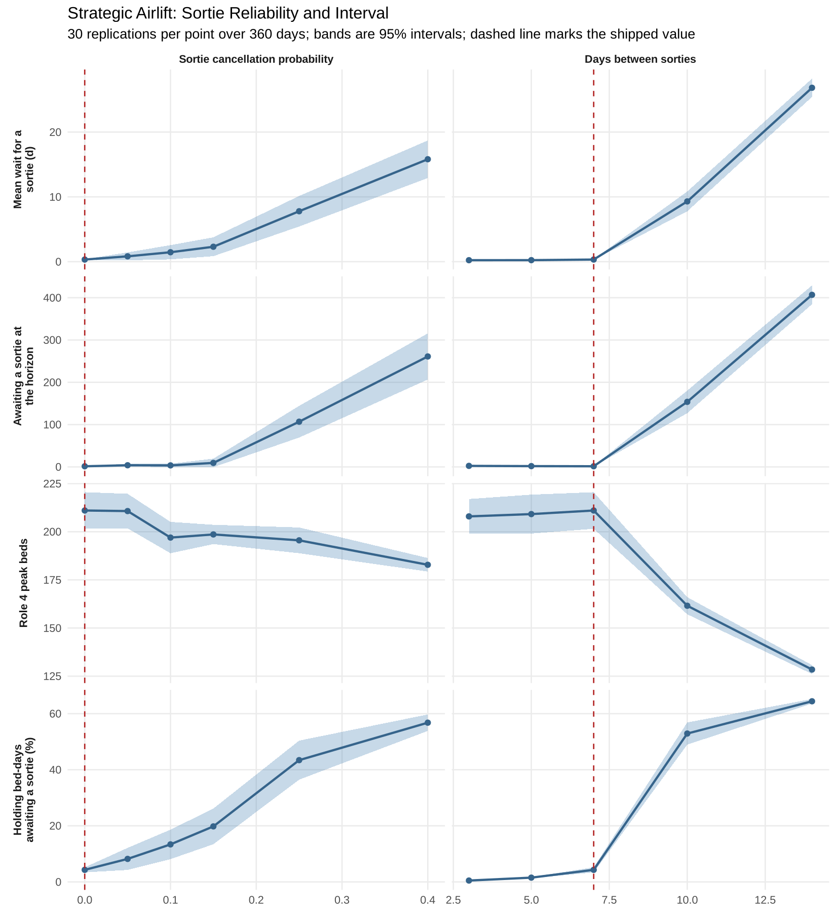

Wait for a sortie, casualties still waiting at the horizon, Role 4 peak beds and the share of holding bed-days spent awaiting a sortie against sortie cancellation probability and the interval between sorties, with the shipped value of each marked by a dashed line.

The mean wait rose from <!-- GEN cell:airlift_reliability|Mean wait (days)|0%|mean -->0.33<!-- /GEN --> days with no cancellation to <!-- GEN cell:airlift_reliability|Mean wait (days)|10%|mean -->1.46<!-- /GEN --> at 10%, <!-- GEN cell:airlift_reliability|Mean wait (days)|25%|mean -->7.78<!-- /GEN --> at 25% and <!-- GEN cell:airlift_reliability|Mean wait (days)|40%|mean -->15.81<!-- /GEN --> at 40%, as the sorties flown fell from <!-- GEN cell:airlift_reliability|Sorties flown|0%|full -->51.00<!-- /GEN --> to <!-- GEN cell:airlift_reliability|Sorties flown|40%|full -->31.43<!-- /GEN -->.

**High-intensity profile.** The same two sweeps under `high_intensity` `[high_intensity, interval 3 to 14 days and cancellation 0 to 40% · 360 d · 30 replications · campaign means]`:

<!-- GEN airlift_interval_high -->
| Response by interval between sorties | 3 days | 5 days | 7 days (shipped) | 10 days | 14 days |
|---|---|---|---|---|---|
| Sorties flown | 119.00 | 71.00 | 51.00 | 35.00 | 25.00 |
| Mean wait (days) | 14.27 [13.69, 14.85] | 16.76 [16.29, 17.22] | 18.57 [18.04, 19.10] | 39.03 [38.32, 39.75] | 59.32 [58.47, 60.17] |
| Share of R2E holding beds held by the evacuation wait | 1% [0%, 1%] | 31% [29%, 32%] | 38% [37%, 39%] | 50% [49%, 51%] | 58% [57%, 59%] |
| Ventilated pre-flight intensive care hold (hours) | 25.46 [25.07, 25.85] | 62.08 [60.21, 63.95] | 269.45 [257.03, 281.87] | 559.98 [540.34, 579.63] | 850.45 [823.13, 877.76] |
<!-- /GEN -->

At the shipped seven-day interval the mean wait was <!-- GEN cell:airlift_interval_high|Mean wait (days)|7 days (shipped)|mean -->18.57<!-- /GEN --> days. Shortening the interval to five days gave <!-- GEN cell:airlift_interval_high|Mean wait (days)|5 days|mean -->16.76<!-- /GEN --> days and to three days <!-- GEN cell:airlift_interval_high|Mean wait (days)|3 days|mean -->14.27<!-- /GEN --> days with <!-- GEN cell:airlift_interval_high|Sorties flown|3 days|mean -->119.00<!-- /GEN --> sorties flown, while lengthening it to ten and fourteen days gave <!-- GEN cell:airlift_interval_high|Mean wait (days)|10 days|mean -->39.03<!-- /GEN --> and <!-- GEN cell:airlift_interval_high|Mean wait (days)|14 days|mean -->59.32<!-- /GEN --> days.

<!-- GEN airlift_reliability_high -->
| Response by configured cancellation probability | 0% | 5% | 10% | 15% | 25% | 40% |
|---|---|---|---|---|---|---|
| Sorties flown | 51.00 | 48.53 | 45.37 | 43.07 | 38.07 | 30.43 |
| Realised cancellation rate | 0% | 5% | 11% | 16% | 25% | 40% |
| Mean wait (days) | 18.57 [18.04, 19.10] | 21.24 [20.08, 22.40] | 25.58 [24.13, 27.02] | 28.90 [27.20, 30.59] | 35.78 [33.21, 38.36] | 48.09 [45.11, 51.06] |
| Share of R2E holding beds held by the evacuation wait | 38% [37%, 39%] | 40% [39%, 41%] | 42% [41%, 43%] | 44% [43%, 45%] | 48% [46%, 49%] | 53% [52%, 55%] |
<!-- /GEN -->

The mean wait rose from <!-- GEN cell:airlift_reliability_high|Mean wait (days)|0%|mean -->18.57<!-- /GEN --> days with no cancellation to <!-- GEN cell:airlift_reliability_high|Mean wait (days)|10%|mean -->25.58<!-- /GEN --> at 10%, <!-- GEN cell:airlift_reliability_high|Mean wait (days)|25%|mean -->35.78<!-- /GEN --> at 25% and <!-- GEN cell:airlift_reliability_high|Mean wait (days)|40%|mean -->48.09<!-- /GEN --> at 40%, as the sorties flown fell from <!-- GEN cell:airlift_reliability_high|Sorties flown|0%|mean -->51.00<!-- /GEN --> to <!-- GEN cell:airlift_reliability_high|Sorties flown|40%|mean -->30.43<!-- /GEN -->.

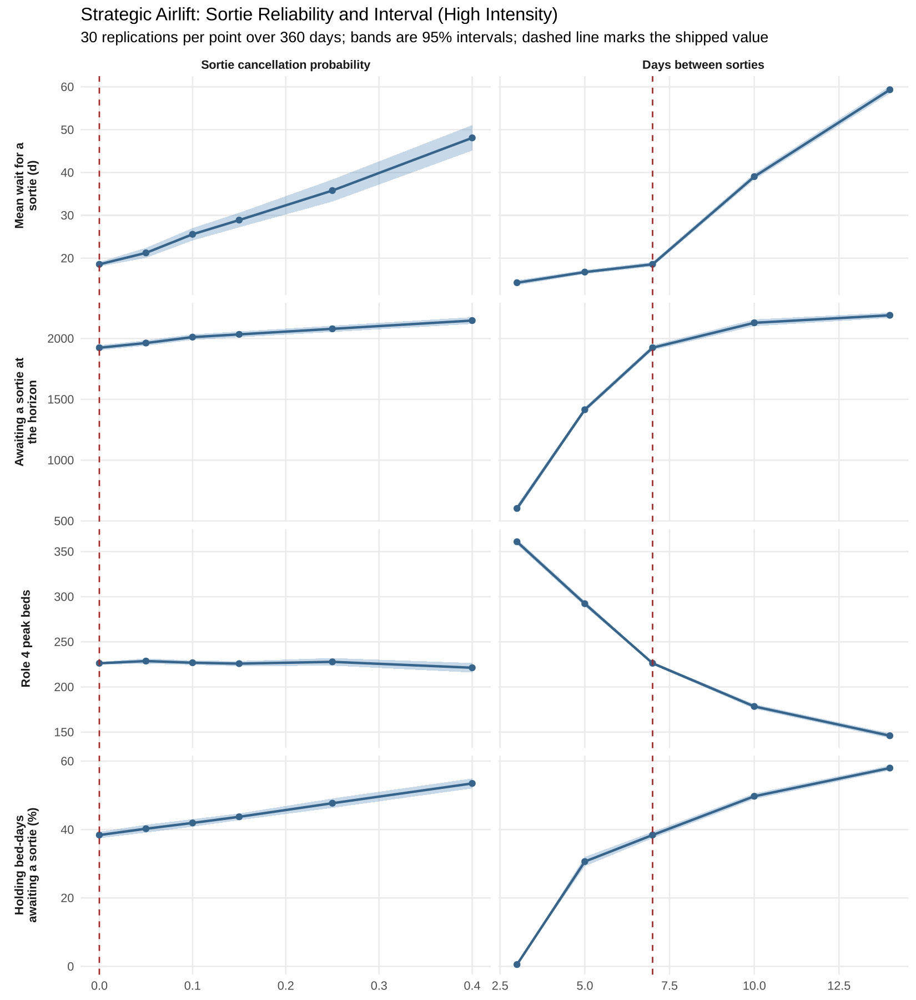

The panels of the figure above under the high-intensity profile, with the shipped value of each sweep marked by a dashed line.

**Collapse classification.** A campaign was classified as collapsed where its R2E holding queue over the closing 90 days averaged twenty casualties or more. `[default, sortie cancellation 0 to 25% · 360 d · 30 replications · exact binomial]`

<!-- GEN airlift_collapse -->
| Sortie cancellation | Collapsed | Collapse rate (exact 95% interval) | Median closing-window queue | Worst closing-window queue |
|---|---|---|---|---|
| 0% | 0 of 30 | 0.0% [0.0%, 11.6%] | 0.00 | 1.48 |
| 5% | 0 of 30 | 0.0% [0.0%, 11.6%] | 0.00 | 8.32 |
| 10% | 2 of 30 | 6.7% [0.8%, 22.1%] | 0.00 | 32.50 |
| 15% | 4 of 30 | 13.3% [3.8%, 30.7%] | 0.00 | 86.28 |
| 20% | 11 of 30 | 36.7% [19.9%, 56.1%] | 12.61 | 297.37 |
| 25% | 22 of 30 | 73.3% [54.1%, 87.7%] | 64.90 | 346.99 |
<!-- /GEN -->

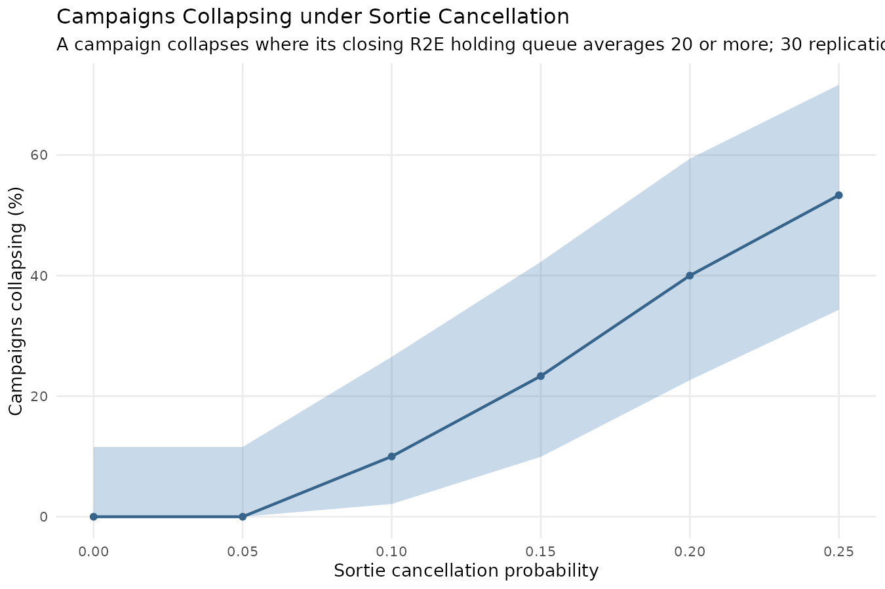

The share of campaigns classified as collapsed against sortie cancellation probability, with exact binomial 95% confidence intervals.

No campaign collapsed at <!-- GEN cell:airlift_collapse|0%|Sortie cancellation|full -->0%<!-- /GEN --> or 5% cancellation. <!-- GEN cell:airlift_collapse|10%|Collapsed|full -->2 of 30<!-- /GEN --> collapsed at 10% cancellation, <!-- GEN cell:airlift_collapse|15%|Collapsed|full -->4 of 30<!-- /GEN --> at 15%, <!-- GEN cell:airlift_collapse|20%|Collapsed|full -->11 of 30<!-- /GEN --> at 20% and <!-- GEN cell:airlift_collapse|25%|Collapsed|full -->22 of 30<!-- /GEN --> at 25%.

**High-intensity profile.** The same classification under `high_intensity` `[high_intensity, sortie cancellation 0 to 25% · 360 d · 30 replications per arm · exact binomial interval]`:

<!-- GEN airlift_collapse_high -->
| Sortie cancellation | Collapsed | Collapse rate (exact 95% interval) | Median closing-window queue | Worst closing-window queue |
|---|---|---|---|---|
| 0% | 30 of 30 | 100.0% [88.4%, 100.0%] | 551.62 | 755.85 |
| 5% | 30 of 30 | 100.0% [88.4%, 100.0%] | 712.58 | 898.64 |
| 10% | 30 of 30 | 100.0% [88.4%, 100.0%] | 898.07 | 1,196.43 |
| 15% | 30 of 30 | 100.0% [88.4%, 100.0%] | 977.76 | 1,221.08 |
| 20% | 30 of 30 | 100.0% [88.4%, 100.0%] | 1,176.61 | 1,549.80 |
| 25% | 30 of 30 | 100.0% [88.4%, 100.0%] | 1,305.04 | 1,704.42 |
<!-- /GEN -->

<!-- GEN cell:airlift_collapse_high|0%|Collapsed|full -->30 of 30<!-- /GEN --> campaigns were classified as collapsed with no sortie cancellation, and <!-- GEN cell:airlift_collapse_high|25%|Collapsed|full -->30 of 30<!-- /GEN --> at 25% cancellation. The median closing-window queue was <!-- GEN cell:airlift_collapse_high|0%|Median closing-window queue|full -->551.62<!-- /GEN --> at 0% and <!-- GEN cell:airlift_collapse_high|25%|Median closing-window queue|full -->1,305.04<!-- /GEN --> at 25%.

---

## Role 4 Bed Demand

<small>[Return to Top](#contents)</small>

**Question.** How many national support base beds does a campaign commit, what is the demand made of, has it settled by the closing window, and how do the forward evacuation levers move it? `[default, both intensities, the evacuation policy, R2E holding establishment, saturation release and sortie cancellation sweeps · 360 d · 30 replications · daily census, mean, peak and closing 90 d]`

The model gives the national support base no capacity, queue or shortfall, so every figure here is demand: the casualties in a Role 4 bed on a day, counted as the other sections count the Role 4 peak. The mean is taken over the whole campaign, the peak is the busiest day of one campaign, and the closing mean is the mean over the last 90 days. A casualty is counted by the ward phase it is in, intensive care or step-down, and by its origin, battle injury, disease and non-battle injury or the reconstruction cohort.

<!-- GEN role4_census_ward -->
| Census by ward phase | Moderate intensity | High intensity |
|---|---|---|
| Total, mean beds | 133.66 [130.43, 136.89] | 180.61 [179.73, 181.50] |
| Total, peak beds | 211.03 [201.53, 220.54] | 226.27 [224.71, 227.82] |
| Total, closing 90-day mean beds | 143.65 [136.93, 150.37] | 189.57 [187.86, 191.28] |
| Intensive care phase, mean beds | 28.90 [28.00, 29.81] | 39.33 [39.09, 39.56] |
| Intensive care phase, peak beds | 64.30 [61.30, 67.30] | 61.93 [61.28, 62.58] |
| Intensive care phase, closing 90-day mean beds | 30.77 [28.65, 32.89] | 40.03 [39.66, 40.41] |
| Step-down ward phase, mean beds | 104.76 [102.41, 107.11] | 141.29 [140.44, 142.13] |
| Step-down ward phase, peak beds | 167.13 [159.99, 174.28] | 177.03 [174.84, 179.23] |
| Step-down ward phase, closing 90-day mean beds | 112.88 [108.18, 117.58] | 149.54 [147.89, 151.19] |
<!-- /GEN -->

At moderate intensity the census averaged <!-- GEN cell:role4_census_ward|Total, mean beds|Moderate intensity|full -->133.66 [130.43, 136.89]<!-- /GEN --> beds over the campaign, peaked at <!-- GEN cell:role4_census_ward|Total, peak beds|Moderate intensity|full -->211.03 [201.53, 220.54]<!-- /GEN --> and averaged <!-- GEN cell:role4_census_ward|Total, closing 90-day mean beds|Moderate intensity|full -->143.65 [136.93, 150.37]<!-- /GEN --> over the closing 90 days. At high intensity the three figures were <!-- GEN cell:role4_census_ward|Total, mean beds|High intensity|full -->180.61 [179.73, 181.50]<!-- /GEN -->, <!-- GEN cell:role4_census_ward|Total, peak beds|High intensity|full -->226.27 [224.71, 227.82]<!-- /GEN --> and <!-- GEN cell:role4_census_ward|Total, closing 90-day mean beds|High intensity|full -->189.57 [187.86, 191.28]<!-- /GEN -->. The closing mean exceeded the campaign mean at both intensities. The step-down ward phase carried <!-- GEN cell:role4_census_ward|Step-down ward phase, mean beds|Moderate intensity|mean -->104.76<!-- /GEN --> of the <!-- GEN cell:role4_census_ward|Total, mean beds|Moderate intensity|mean -->133.66<!-- /GEN --> mean beds at moderate intensity and <!-- GEN cell:role4_census_ward|Step-down ward phase, mean beds|High intensity|mean -->141.29<!-- /GEN --> of the <!-- GEN cell:role4_census_ward|Total, mean beds|High intensity|mean -->180.61<!-- /GEN --> at high, and the intensive care phase the remainder.

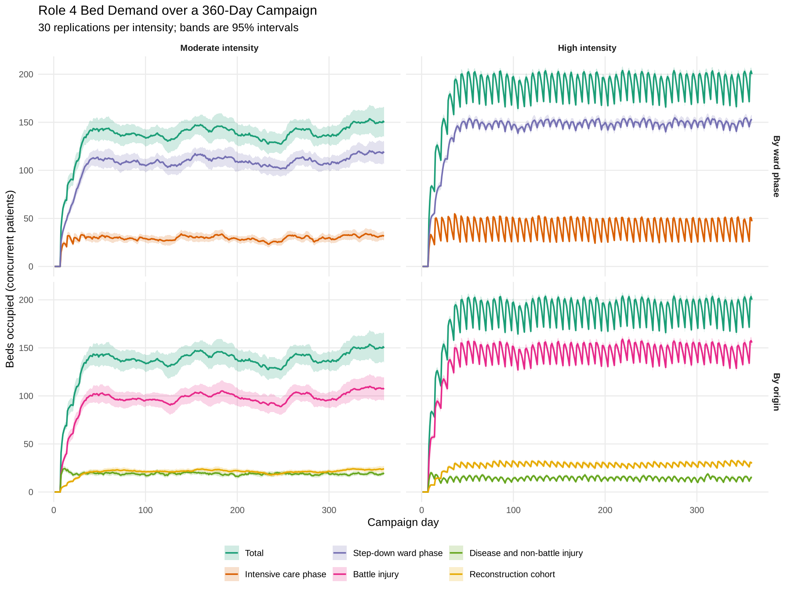

The mean daily census across replications with its 95% interval, at each casualty intensity, divided by ward phase (upper row) and by origin (lower row), each beside the total it sums to. At high intensity the census rises and falls in a regular cycle about its mean.

<!-- GEN role4_census_origin -->
| Census by origin | Moderate intensity | High intensity |
|---|---|---|
| Total, mean beds | 133.66 [130.43, 136.89] | 180.61 [179.73, 181.50] |
| Total, peak beds | 211.03 [201.53, 220.54] | 226.27 [224.71, 227.82] |
| Total, closing 90-day mean beds | 143.65 [136.93, 150.37] | 189.57 [187.86, 191.28] |
| Battle injury, mean beds | 94.45 [91.70, 97.19] | 139.31 [138.35, 140.26] |
| Battle injury, peak beds | 155.57 [147.92, 163.22] | 179.80 [177.63, 181.97] |
| Battle injury, closing 90-day mean beds | 102.62 [96.59, 108.64] | 146.29 [144.44, 148.14] |
| Disease and non-battle injury, mean beds | 18.65 [18.28, 19.03] | 13.98 [13.65, 14.32] |
| Disease and non-battle injury, peak beds | 39.83 [37.88, 41.78] | 28.50 [27.46, 29.54] |
| Disease and non-battle injury, closing 90-day mean beds | 18.67 [17.98, 19.35] | 13.95 [13.36, 14.55] |
| Reconstruction cohort, mean beds | 20.57 [19.86, 21.27] | 27.32 [26.82, 27.83] |
| Reconstruction cohort, peak beds | 37.30 [35.32, 39.28] | 41.87 [40.64, 43.09] |
| Reconstruction cohort, closing 90-day mean beds | 22.36 [21.23, 23.50] | 29.33 [28.47, 30.19] |
<!-- /GEN -->

Battle injury accounted for <!-- GEN cell:role4_census_origin|Battle injury, mean beds|Moderate intensity|mean -->94.45<!-- /GEN --> of the mean beds at moderate intensity and <!-- GEN cell:role4_census_origin|Battle injury, mean beds|High intensity|mean -->139.31<!-- /GEN --> at high. Disease and non-battle injury accounted for <!-- GEN cell:role4_census_origin|Disease and non-battle injury, mean beds|Moderate intensity|mean -->18.65<!-- /GEN --> and <!-- GEN cell:role4_census_origin|Disease and non-battle injury, mean beds|High intensity|mean -->13.98<!-- /GEN -->, and the reconstruction cohort for <!-- GEN cell:role4_census_origin|Reconstruction cohort, mean beds|Moderate intensity|mean -->20.57<!-- /GEN --> and <!-- GEN cell:role4_census_origin|Reconstruction cohort, mean beds|High intensity|mean -->27.32<!-- /GEN -->.

<!-- GEN role4_operations -->
| Demand owed alongside the census | Moderate intensity | High intensity |
|---|---|---|
| Operations owed within the 360 days | 1,124 [1,074, 1,174] | 1,374 [1,348, 1,399] |
| Definitive repairs owed within the 360 days | 145 [125, 166] | 99 [94, 104] |
| Debridements owed within the 360 days | 673 [645, 700] | 906 [886, 926] |
| Reconstructions owed within the 360 days | 306 [297, 315] | 368 [363, 374] |
| Operations owed after day 360 | 18 [13, 22] | 22 [19, 24] |
| Operations owed by casualties admitted during the campaign | 1,142 [1,089, 1,195] | 1,396 [1,370, 1,421] |
| Operations owed on the busiest day | 11.27 [10.64, 11.89] | 13.53 [13.03, 14.04] |
| Closing 90-day mean operations owed per day | 3.37 [3.05, 3.68] | 3.77 [3.63, 3.92] |
| Theatre minutes owed for definitive repairs | 16,793 [14,494, 19,093] | 11,400 [10,827, 11,973] |
<!-- /GEN -->

The operations owed alongside the census were counted three ways. <!-- GEN cell:role4_operations|Operations owed within the 360 days|Moderate intensity|mean -->1,124<!-- /GEN --> fell inside the campaign at moderate intensity and <!-- GEN cell:role4_operations|Operations owed within the 360 days|High intensity|mean -->1,374<!-- /GEN --> at high, a further <!-- GEN cell:role4_operations|Operations owed after day 360|Moderate intensity|mean -->18<!-- /GEN --> and <!-- GEN cell:role4_operations|Operations owed after day 360|High intensity|mean -->22<!-- /GEN --> fell after the campaign ended, in the reconstruction sequences of casualties admitted late, and <!-- GEN cell:role4_operations|Operations owed by casualties admitted during the campaign|Moderate intensity|mean -->1,142<!-- /GEN --> and <!-- GEN cell:role4_operations|Operations owed by casualties admitted during the campaign|High intensity|mean -->1,396<!-- /GEN --> were owed in all, the figure the other sections report as operations owed. By source, the operations inside the campaign were <!-- GEN cell:role4_operations|Definitive repairs owed within the 360 days|Moderate intensity|mean -->145<!-- /GEN --> definitive repairs, <!-- GEN cell:role4_operations|Debridements owed within the 360 days|Moderate intensity|mean -->673<!-- /GEN --> debridements and <!-- GEN cell:role4_operations|Reconstructions owed within the 360 days|Moderate intensity|mean -->306<!-- /GEN --> reconstructions at moderate intensity, and <!-- GEN cell:role4_operations|Definitive repairs owed within the 360 days|High intensity|mean -->99<!-- /GEN -->, <!-- GEN cell:role4_operations|Debridements owed within the 360 days|High intensity|mean -->906<!-- /GEN --> and <!-- GEN cell:role4_operations|Reconstructions owed within the 360 days|High intensity|mean -->368<!-- /GEN --> at high. The busiest day owed <!-- GEN cell:role4_operations|Operations owed on the busiest day|Moderate intensity|mean -->11.27<!-- /GEN --> operations at moderate intensity and <!-- GEN cell:role4_operations|Operations owed on the busiest day|High intensity|mean -->13.53<!-- /GEN --> at high. The theatre minutes cover the definitive repairs only, no source reporting the time a debridement or a flap takes.

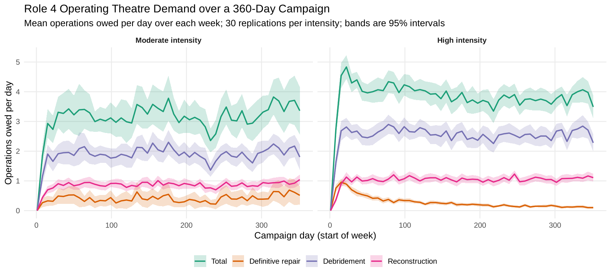

The mean operations owed per day over each week of the campaign, with the 95% interval across replications, at each casualty intensity, for the definitive repairs, the debridements and the reconstructions and for their total.

<!-- GEN role4_stability -->
| Census | Moderate intensity classification | Moderate intensity settles by block | Moderate intensity late mean beds | High intensity classification | High intensity settles by block | High intensity late mean beds |
|---|---|---|---|---|---|---|
| Total | converged | 2 | 140.65 | converged | 5 | 189.23 |
| Intensive care phase | converged | 2 | 29.76 | converged | 2 | 40.14 |
| Step-down ward phase | converged | 2 | 110.89 | converged | 5 | 149.09 |
| Battle injury | converged | 2 | 100.10 | converged | 5 | 146.27 |
| Disease and non-battle injury | converged | 2 | 18.80 | converged | 2 | 14.25 |
| Reconstruction cohort | converged | 2 | 21.75 | converged | 2 | 28.70 |
<!-- /GEN -->

<!-- GEN role4_cma -->
| Cumulative moving average of the mean total census (beds) | Moderate intensity | High intensity |
|---|---|---|
| Day 30 | 68.14 | 91.32 |
| Day 90 | 115.59 | 155.42 |
| Day 180 | 127.34 | 171.97 |
| Day 360 | 133.66 | 180.61 |
<!-- /GEN -->

The 30-day block means of the total census were classified <!-- GEN cell:role4_stability|Total|Moderate intensity classification|full -->converged<!-- /GEN --> at moderate intensity, settling by block <!-- GEN cell:role4_stability|Total|Moderate intensity settles by block|full -->2<!-- /GEN -->, and <!-- GEN cell:role4_stability|Total|High intensity classification|full -->converged<!-- /GEN --> at high, settling by block <!-- GEN cell:role4_stability|Total|High intensity settles by block|full -->5<!-- /GEN -->. The reconstruction cohort was classified <!-- GEN cell:role4_stability|Reconstruction cohort|Moderate intensity classification|full -->converged<!-- /GEN --> at moderate intensity and <!-- GEN cell:role4_stability|Reconstruction cohort|High intensity classification|full -->converged<!-- /GEN --> at high. The cumulative moving average of the mean total census was <!-- GEN cell:role4_cma|Day 90|Moderate intensity|full -->115.59<!-- /GEN --> beds at day 90 and <!-- GEN cell:role4_cma|Day 360|Moderate intensity|full -->133.66<!-- /GEN --> at day 360 at moderate intensity, and <!-- GEN cell:role4_cma|Day 90|High intensity|full -->155.42<!-- /GEN --> and <!-- GEN cell:role4_cma|Day 360|High intensity|full -->180.61<!-- /GEN --> at high.

**Response to the forward levers.** The three sweeps below carry the Role 4 peak, the closing 90-day mean and the operations owed by the casualties admitted in their own evidence sets, and are read from them without a further run; the sortie cancellation sweep was measured for this section, the strategic airlift evidence set carrying the peak alone. Each table's shipped column is the configuration of the census tables above at moderate intensity.

<!-- GEN role4_levers_policy -->
| Response | 15 d | 21 d (shipped) | 30 d | 45 d | 60 d |
|---|---|---|---|---|---|
| Role 4 peak beds | 205.2 [197.2, 213.2] | 211.0 [201.5, 220.5] | 105.5 [100.2, 110.8] | 30.3 [26.9, 33.7] | 15.4 [12.5, 18.2] |
| Role 4 closing 90-day mean beds | 111.2 [106.4, 116.0] | 114.9 [109.3, 120.4] | 53.5 [50.5, 56.5] | 8.5 [7.6, 9.4] | 2.8 [2.4, 3.1] |
| Role 4 operations owed | 1048 [997, 1099] | 1142 [1089, 1195] | 503 [472, 534] | 92 [81, 103] | 48 [42, 55] |
<!-- /GEN -->

The closing mean was <!-- GEN cell:role4_levers_policy|Role 4 closing 90-day mean beds|15 d|mean -->111.2<!-- /GEN --> beds at 15 days, <!-- GEN cell:role4_levers_policy|Role 4 closing 90-day mean beds|21 d (shipped)|mean -->114.9<!-- /GEN --> at the shipped 21 days, <!-- GEN cell:role4_levers_policy|Role 4 closing 90-day mean beds|30 d|mean -->53.5<!-- /GEN --> at 30, <!-- GEN cell:role4_levers_policy|Role 4 closing 90-day mean beds|45 d|mean -->8.5<!-- /GEN --> at 45 and <!-- GEN cell:role4_levers_policy|Role 4 closing 90-day mean beds|60 d|mean -->2.8<!-- /GEN --> at 60. The peak was <!-- GEN cell:role4_levers_policy|Role 4 peak beds|21 d (shipped)|mean -->211.0<!-- /GEN --> at 21 days and <!-- GEN cell:role4_levers_policy|Role 4 peak beds|30 d|mean -->105.5<!-- /GEN -->, <!-- GEN cell:role4_levers_policy|Role 4 peak beds|45 d|mean -->30.3<!-- /GEN --> and <!-- GEN cell:role4_levers_policy|Role 4 peak beds|60 d|mean -->15.4<!-- /GEN --> at 30, 45 and 60. The operations owed were <!-- GEN cell:role4_levers_policy|Role 4 operations owed|21 d (shipped)|mean -->1142<!-- /GEN --> at 21 days and <!-- GEN cell:role4_levers_policy|Role 4 operations owed|60 d|mean -->48<!-- /GEN --> at 60.

<!-- GEN role4_levers_establishment -->
| Response | 30 beds (shipped) | 45 beds | 60 beds | 90 beds |
|---|---|---|---|---|
| Role 4 peak beds | 211.0 [201.5, 220.5] | 209.8 [200.8, 218.9] | 215.9 [208.6, 223.2] | 214.7 [207.2, 222.3] |
| Role 4 closing 90-day mean beds | 114.9 [109.3, 120.4] | 107.4 [102.3, 112.5] | 112.2 [106.9, 117.5] | 111.3 [106.8, 115.8] |
| Role 4 operations owed | 1142 [1089, 1195] | 1104 [1051, 1157] | 1139 [1086, 1193] | 1124 [1078, 1170] |
<!-- /GEN -->

The closing mean was <!-- GEN cell:role4_levers_establishment|Role 4 closing 90-day mean beds|30 beds (shipped)|mean -->114.9<!-- /GEN --> beds at the shipped 30 R2E holding beds and <!-- GEN cell:role4_levers_establishment|Role 4 closing 90-day mean beds|45 beds|mean -->107.4<!-- /GEN -->, <!-- GEN cell:role4_levers_establishment|Role 4 closing 90-day mean beds|60 beds|mean -->112.2<!-- /GEN --> and <!-- GEN cell:role4_levers_establishment|Role 4 closing 90-day mean beds|90 beds|mean -->111.3<!-- /GEN --> at 45, 60 and 90; the four intervals overlap. The peak was <!-- GEN cell:role4_levers_establishment|Role 4 peak beds|30 beds (shipped)|mean -->211.0<!-- /GEN --> at 30 beds and <!-- GEN cell:role4_levers_establishment|Role 4 peak beds|90 beds|mean -->214.7<!-- /GEN --> at 90.

<!-- GEN role4_levers_saturation -->
| Response | 0 (disabled) | 1 | 2 | 3 | 5 | 8 (shipped) | 12 | 16 | 24 |
|---|---|---|---|---|---|---|---|---|---|
| Role 4 peak beds | 199.6 [193.0, 206.2] | 215.1 [207.8, 222.3] | 206.3 [197.5, 215.1] | 208.3 [199.3, 217.3] | 208.0 [200.4, 215.6] | 211.0 [201.5, 220.5] | 201.7 [192.8, 210.6] | 206.8 [198.3, 215.3] | 213.8 [203.4, 224.1] |
| Role 4 closing 90-day mean beds | 111.3 [105.8, 116.7] | 112.6 [106.5, 118.8] | 110.4 [105.6, 115.2] | 112.4 [106.6, 118.1] | 111.2 [105.4, 116.9] | 114.9 [109.3, 120.4] | 106.2 [101.9, 110.5] | 108.5 [103.6, 113.3] | 111.4 [104.7, 118.1] |
| Role 4 operations owed | 933 [899, 966] | 1300 [1236, 1364] | 1182 [1132, 1232] | 1209 [1151, 1267] | 1111 [1059, 1163] | 1142 [1089, 1195] | 1026 [979, 1073] | 1037 [991, 1083] | 997 [958, 1036] |
<!-- /GEN -->

The closing mean was <!-- GEN cell:role4_levers_saturation|Role 4 closing 90-day mean beds|0 (disabled)|mean -->111.3<!-- /GEN --> beds with the release disabled and <!-- GEN cell:role4_levers_saturation|Role 4 closing 90-day mean beds|8 (shipped)|mean -->114.9<!-- /GEN --> at the shipped threshold of 8, and ranged across the nine thresholds without a monotone course. The operations owed were <!-- GEN cell:role4_levers_saturation|Role 4 operations owed|0 (disabled)|mean -->933<!-- /GEN --> with the release disabled, <!-- GEN cell:role4_levers_saturation|Role 4 operations owed|1|mean -->1300<!-- /GEN --> at a threshold of 1, <!-- GEN cell:role4_levers_saturation|Role 4 operations owed|8 (shipped)|mean -->1142<!-- /GEN --> at 8 and <!-- GEN cell:role4_levers_saturation|Role 4 operations owed|24|mean -->997<!-- /GEN --> at 24.

<!-- GEN role4_levers_cancellation -->
| Response | 0% (shipped) | 5% | 10% | 15% | 25% | 40% |
|---|---|---|---|---|---|---|
| Role 4 peak beds | 211.0 [201.5, 220.5] | 210.7 [201.8, 219.7] | 197.0 [188.8, 205.1] | 198.6 [193.6, 203.6] | 195.5 [188.8, 202.2] | 182.8 [179.3, 186.4] |
| Role 4 closing 90-day mean beds | 143.6 [136.9, 150.4] | 142.8 [135.1, 150.5] | 135.3 [129.0, 141.6] | 139.0 [134.3, 143.8] | 125.0 [118.0, 132.1] | 105.4 [98.6, 112.1] |
| Role 4 operations owed | 1142 [1089, 1195] | 1129 [1071, 1187] | 1080 [1031, 1129] | 1093 [1051, 1134] | 986 [941, 1030] | 790 [756, 824] |
<!-- /GEN -->

The closing mean was <!-- GEN cell:role4_levers_cancellation|Role 4 closing 90-day mean beds|0% (shipped)|mean -->143.6<!-- /GEN --> beds with no sortie cancelled and <!-- GEN cell:role4_levers_cancellation|Role 4 closing 90-day mean beds|10%|mean -->135.3<!-- /GEN -->, <!-- GEN cell:role4_levers_cancellation|Role 4 closing 90-day mean beds|25%|mean -->125.0<!-- /GEN --> and <!-- GEN cell:role4_levers_cancellation|Role 4 closing 90-day mean beds|40%|mean -->105.4<!-- /GEN --> at cancellation probabilities of 10%, 25% and 40%. The peak was <!-- GEN cell:role4_levers_cancellation|Role 4 peak beds|0% (shipped)|mean -->211.0<!-- /GEN --> with no cancellation and <!-- GEN cell:role4_levers_cancellation|Role 4 peak beds|40%|mean -->182.8<!-- /GEN --> at 40%, and the operations owed were <!-- GEN cell:role4_levers_cancellation|Role 4 operations owed|0% (shipped)|mean -->1142<!-- /GEN --> and <!-- GEN cell:role4_levers_cancellation|Role 4 operations owed|40%|mean -->790<!-- /GEN -->.

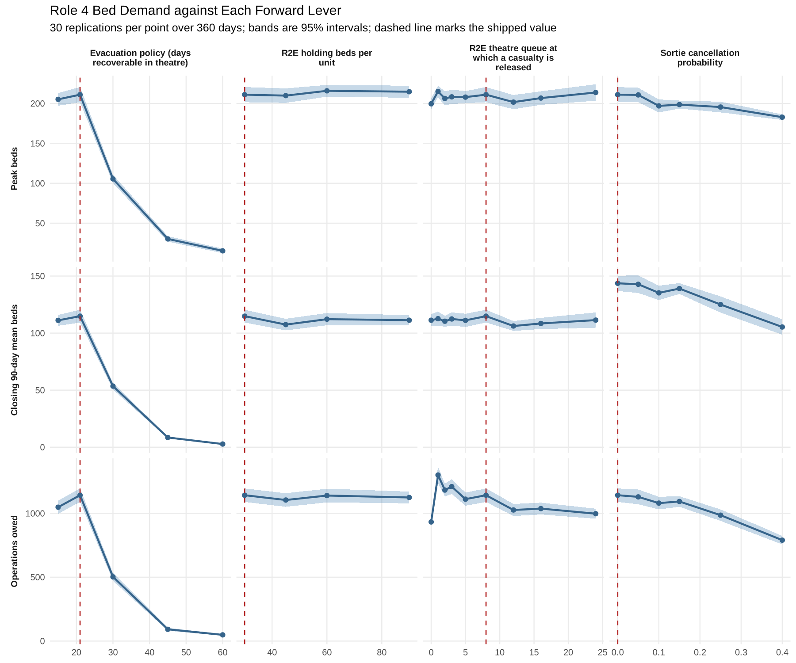

The Role 4 peak beds (upper row), closing 90-day mean beds (middle row) and operations owed (lower row), with 95% intervals across replications, against each lever, with the shipped value of each marked by a dashed line.

---

## Casualty Surge Events

<small>[Return to Top](#contents)</small>

**Question.** What changes when casualty surge events are injected into a campaign? `[default, injection off and on at 0.2 events per day · 360 d · 30 replications per arm · independent seeds, pooled exact binomial]`

<!-- GEN casualty_surge -->
| Metric | No events injected | Events injected |
|---|---|---|
| Average total casualties/run | 5402.9 | 8160.5 |
| Average events/run | 0 | 72.47 (range 59–91) |
| Died-of-wounds rate, ordinary casualties | 0.20% [0.18%, 0.22%] | 0.21% [0.19%, 0.23%] |
| Died-of-wounds rate, event casualties | not applicable | 0.43% [0.39%, 0.48%] |
<!-- /GEN -->

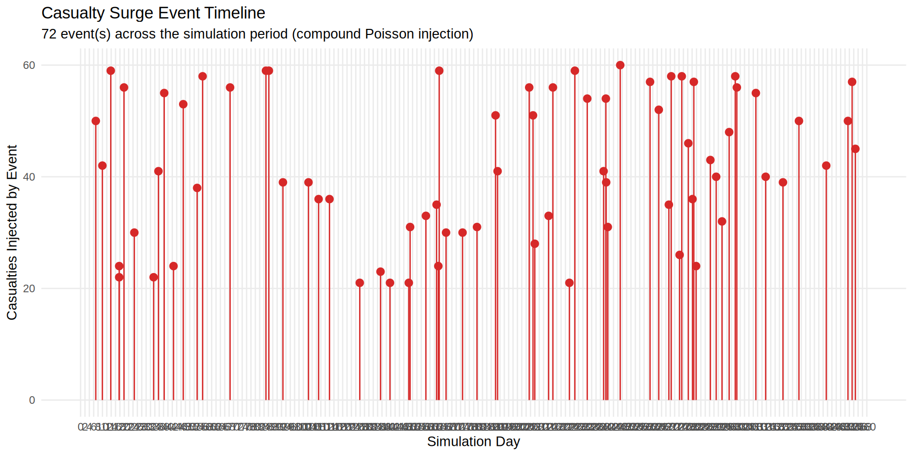

Casualty surge events reconstructed from one seed-42 campaign, each drawn as a vertical line at its simulation day with a point at its casualty count.

Events added <!-- GEN cell:casualty_surge|Average events/run|Events injected|full -->72.47 (range 59–91)<!-- /GEN --> events per campaign and raised the mean campaign total from <!-- GEN cell:casualty_surge|Average total casualties/run|No events injected|full -->5402.9<!-- /GEN --> to <!-- GEN cell:casualty_surge|Average total casualties/run|Events injected|full -->8160.5<!-- /GEN --> casualties. The died-of-wounds rate among event casualties was <!-- GEN cell:casualty_surge|Died-of-wounds rate, event casualties|Events injected|full -->0.43% [0.39%, 0.48%]<!-- /GEN -->. Among ordinary casualties it was <!-- GEN cell:casualty_surge|Died-of-wounds rate, ordinary casualties|No events injected|full -->0.20% [0.18%, 0.22%]<!-- /GEN --> without injection and <!-- GEN cell:casualty_surge|Died-of-wounds rate, ordinary casualties|Events injected|full -->0.21% [0.19%, 0.23%]<!-- /GEN --> with it.

**High-intensity profile.** The same stress test under `high_intensity` `[high_intensity, 0 and 0.2 events per day · 360 d · 30 replications · campaign totals]`:

<!-- GEN casualty_surge_high -->
| Metric | No events injected | Events injected |
|---|---|---|
| Average total casualties/run | 12409.5 | 14972.2 |
| Average events/run | 0 | 72.47 (range 59–91) |
| Died-of-wounds rate, ordinary casualties | 2.24% [2.19%, 2.29%] | 2.28% [2.23%, 2.33%] |
| Died-of-wounds rate, event casualties | not applicable | 2.87% [2.76%, 2.98%] |
<!-- /GEN -->

Event casualties died of wounds at <!-- GEN cell:casualty_surge_high|Died-of-wounds rate, event casualties|Events injected|full -->2.87% [2.76%, 2.98%]<!-- /GEN --> against <!-- GEN cell:casualty_surge_high|Died-of-wounds rate, ordinary casualties|Events injected|full -->2.28% [2.23%, 2.33%]<!-- /GEN --> for ordinary casualties in the same arm.

---

## Casualty Surge Event Size

<small>[Return to Top](#contents)</small>

**Question.** At what size do casualty surge events begin to degrade care? `[default, every event fixed at one size · 0.2 events per day · 360 d · 30 replications per size · independent seeds, pooled exact binomial and Student t]`

<!-- GEN casualty_surge_size -->
| Event size | Events/run | Died of wounds, event casualties | Died of wounds, ordinary casualties | Peak R2B holding queue | Peak R2E theatre queue | Peak R2E intensive care queue | Peak R2E holding queue |
|---|---|---|---|---|---|---|---|
| None | 0.0 | not applicable | 0.20% [0.18%, 0.22%] | 48.7 ± 9.2 | 44.1 ± 11.9 | 14.4 ± 3.1 | 19.9 ± 5.0 |
| 10 | 72.5 | 0.32% [0.25%, 0.40%] | 0.20% [0.18%, 0.23%] | 50.2 ± 8.0 | 47.2 ± 9.2 | 33.4 ± 12.8 | 54.6 ± 12.4 |
| 20 | 72.5 | 0.43% [0.37%, 0.49%] | 0.21% [0.19%, 0.24%] | 59.5 ± 7.0 | 44.3 ± 4.2 | 143.6 ± 25.4 | 126.7 ± 10.0 |
| 40 | 72.5 | 0.45% [0.40%, 0.49%] | 0.21% [0.19%, 0.24%] | 90.8 ± 12.2 | 77.2 ± 10.5 | 654.3 ± 49.3 | 240.9 ± 15.5 |
| 60 | 72.5 | 0.44% [0.41%, 0.48%] | 0.22% [0.20%, 0.24%] | 125.0 ± 16.6 | 142.4 ± 14.8 | 1110.0 ± 57.6 | 366.3 ± 25.7 |
| 90 | 72.5 | 0.47% [0.44%, 0.50%] | 0.22% [0.20%, 0.24%] | 151.3 ± 17.5 | 416.9 ± 63.0 | 1584.6 ± 47.3 | 503.3 ± 32.7 |
| 120 | 72.5 | 0.46% [0.43%, 0.48%] | 0.24% [0.21%, 0.26%] | 194.5 ± 23.4 | 1051.6 ± 120.2 | 1665.4 ± 35.5 | 660.0 ± 34.4 |
| 180 | 72.5 | 0.48% [0.46%, 0.51%] | 0.25% [0.22%, 0.27%] | 251.1 ± 33.4 | 2556.0 ± 178.4 | 1739.7 ± 27.5 | 898.7 ± 43.6 |
<!-- /GEN -->

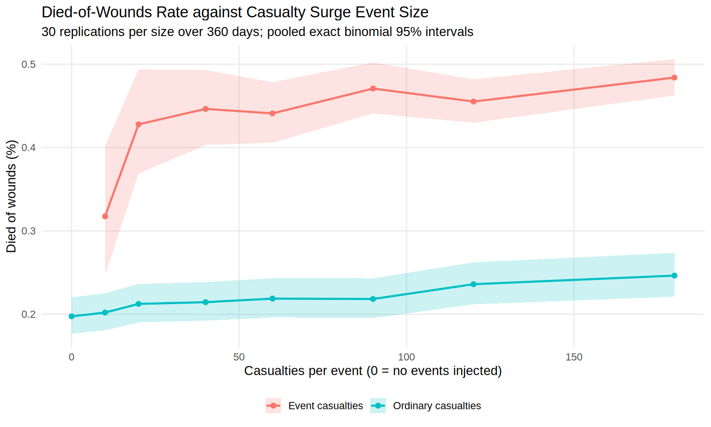

The died-of-wounds rate of event and ordinary casualties against the number of casualties per event, with pooled exact binomial 95% confidence intervals.

Peak queues are the largest four-hour mean queue of each pool over the campaign, with a 95% half-width across replications. With every event fixed at 10 casualties, the died-of-wounds rate among event casualties was <!-- GEN cell:casualty_surge_size|10|Died of wounds, event casualties|full -->0.32% [0.25%, 0.40%]<!-- /GEN --> and the peak R2E intensive care queue <!-- GEN cell:casualty_surge_size|10|Peak R2E intensive care queue|full -->33.4 ± 12.8<!-- /GEN -->, against <!-- GEN cell:casualty_surge_size|None|Peak R2E intensive care queue|full -->14.4 ± 3.1<!-- /GEN --> with no events injected. At 20 casualties per event the intensive care queue peaked at <!-- GEN cell:casualty_surge_size|20|Peak R2E intensive care queue|full -->143.6 ± 25.4<!-- /GEN -->, and at 40 at <!-- GEN cell:casualty_surge_size|40|Peak R2E intensive care queue|full -->654.3 ± 49.3<!-- /GEN -->. The R2E theatre queue peaked at <!-- GEN cell:casualty_surge_size|None|Peak R2E theatre queue|full -->44.1 ± 11.9<!-- /GEN --> with no events, <!-- GEN cell:casualty_surge_size|60|Peak R2E theatre queue|full -->142.4 ± 14.8<!-- /GEN --> at 60 casualties per event, <!-- GEN cell:casualty_surge_size|90|Peak R2E theatre queue|full -->416.9 ± 63.0<!-- /GEN --> at 90 and <!-- GEN cell:casualty_surge_size|180|Peak R2E theatre queue|full -->2556.0 ± 178.4<!-- /GEN --> at 180. The event casualty died-of-wounds rate was <!-- GEN cell:casualty_surge_size|60|Died of wounds, event casualties|full -->0.44% [0.41%, 0.48%]<!-- /GEN --> at 60 casualties and <!-- GEN cell:casualty_surge_size|180|Died of wounds, event casualties|full -->0.48% [0.46%, 0.51%]<!-- /GEN --> at 180, and the rate among ordinary casualties was <!-- GEN cell:casualty_surge_size|None|Died of wounds, ordinary casualties|full -->0.20% [0.18%, 0.22%]<!-- /GEN --> with no events and <!-- GEN cell:casualty_surge_size|180|Died of wounds, ordinary casualties|full -->0.25% [0.22%, 0.27%]<!-- /GEN --> at 180.

**High-intensity profile.** The same sweep under `high_intensity` `[high_intensity, every event fixed at one size · 0.2 events per day · 360 d · 30 replications per size · independent seeds]`:

<!-- GEN casualty_surge_size_high -->
| Event size | Events/run | Died of wounds, event casualties | Died of wounds, ordinary casualties | Peak R2B holding queue | Peak R2E theatre queue | Peak R2E intensive care queue | Peak R2E holding queue |
|---|---|---|---|---|---|---|---|
| None | 0.0 | not applicable | 2.24% [2.19%, 2.29%] | 152.3 ± 12.5 | 619.1 ± 57.8 | 1665.7 ± 15.0 | 641.4 ± 29.4 |
| 10 | 72.5 | 2.47% [2.26%, 2.68%] | 2.29% [2.24%, 2.34%] | 156.7 ± 14.8 | 791.6 ± 46.0 | 1674.8 ± 16.0 | 677.7 ± 22.4 |
| 20 | 72.5 | 2.70% [2.55%, 2.86%] | 2.28% [2.23%, 2.32%] | 180.3 ± 15.1 | 1063.1 ± 70.8 | 1697.5 ± 18.1 | 736.1 ± 27.3 |
| 40 | 72.5 | 2.72% [2.62%, 2.83%] | 2.27% [2.22%, 2.32%] | 191.5 ± 17.5 | 1511.1 ± 75.6 | 1700.8 ± 16.8 | 831.9 ± 32.8 |
| 60 | 72.5 | 2.87% [2.78%, 2.96%] | 2.30% [2.25%, 2.35%] | 201.1 ± 18.5 | 1939.3 ± 86.1 | 1735.1 ± 19.3 | 884.6 ± 32.4 |
| 90 | 72.5 | 2.98% [2.91%, 3.06%] | 2.37% [2.32%, 2.42%] | 244.5 ± 21.1 | 2667.5 ± 96.6 | 1745.6 ± 19.0 | 1005.1 ± 40.0 |
| 120 | 72.5 | 3.04% [2.97%, 3.10%] | 2.34% [2.29%, 2.39%] | 267.6 ± 21.6 | 3386.0 ± 127.4 | 1746.2 ± 16.6 | 1138.6 ± 32.8 |
| 180 | 72.5 | 2.96% [2.91%, 3.02%] | 2.43% [2.38%, 2.48%] | 334.7 ± 32.0 | 4802.4 ± 180.2 | 1751.3 ± 16.7 | 1320.2 ± 49.8 |
<!-- /GEN -->

At 20 casualties per event the peak R2E intensive care queue was <!-- GEN cell:casualty_surge_size_high|20|Peak R2E intensive care queue|full -->1697.5 ± 18.1<!-- /GEN -->, against <!-- GEN cell:casualty_surge_size_high|None|Peak R2E intensive care queue|full -->1665.7 ± 15.0<!-- /GEN --> with no events injected.

---

## Resolution of Paired Differences

<small>[Return to Top](#contents)</small>

**Question.** Which of the paired differences the experiments above sized for resolution excluded zero at 30 replications, and how many replications would each of the others need before its interval narrowed to a stated half-width? `[as each experiment above · 360 d · 30 replications · paired, normal approximation to the interval half-width]`

<!-- GEN resolution -->
| Comparison | Paired difference | Half-width sought | Replications needed |
|---|---|---|---|
| Hold window, R2E first surgeries | −10.90 [−72.35, +50.55] | 2.0 | 26,008 |
| Hold window, R2E theatre entry deferred | −2.90 [−20.63, +14.83] | 1.0 | 8,665 |
| Hold window, diverted for a busy theatre | +13.93 [−4.25, +32.11] | 2.0 | 2,277 |
| Hold window, died of wounds | −0.07 [−2.25, +2.11] | 0.5 | 524 |
| Intensive care gate, died of wounds | +0.10 [−1.71, +1.91] | 0.5 | 362 |
| Policy 15 days against 21, died of wounds | −0.80 [−2.54, +0.94] | 1.0 | 84 |
| Policy 45 days against 21, died of wounds | +1.17 [−0.81, +3.14] | 1.0 | 108 |
| Saturation release at 8, died of wounds | −0.07 [−1.72, +1.58] | 1.0 | 75 |
| Saturation release at 8, returns to duty | +2.37 [−35.97, +40.70] | 10.0 | 405 |
<!-- /GEN -->

A comparison whose 95% interval excludes zero is listed in the second table rather than the first, the split being taken from the evidence each time the document is generated.

<!-- GEN resolved -->
| Comparison | Paired difference |
|---|---|
| Policy 60 days against 21, died of wounds | +2.77 [+0.66, +4.87] |
<!-- /GEN -->

The count for each row is $\lceil (z_{0.975}\, s_d / h)^2 \rceil$, where $s_d$ is the standard deviation of the within-replication differences observed at 30 replications and $h$ the half-width sought, chosen in the response's own units by the script that ran the experiment. The hold window's R2E first-surgery difference was <!-- GEN cell:resolution|Hold window, R2E first surgeries|Paired difference|full -->−10.90 [−72.35, +50.55]<!-- /GEN --> against a half-width sought of <!-- GEN cell:resolution|Hold window, R2E first surgeries|Half-width sought|full -->2.0<!-- /GEN --> operations, which needs <!-- GEN cell:resolution|Hold window, R2E first surgeries|Replications needed|full -->26,008<!-- /GEN --> replications. The intensive care gate's died-of-wounds difference was <!-- GEN cell:resolution|Intensive care gate, died of wounds|Paired difference|full -->+0.10 [−1.71, +1.91]<!-- /GEN --> and needs <!-- GEN cell:resolution|Intensive care gate, died of wounds|Replications needed|full -->362<!-- /GEN -->. Against a half-width sought of <!-- GEN cell:resolution|Policy 15 days against 21, died of wounds|Half-width sought|full -->1.0<!-- /GEN --> death per campaign, the 15-day and 45-day policy comparisons against the shipped 21 days need <!-- GEN cell:resolution|Policy 15 days against 21, died of wounds|Replications needed|full -->84<!-- /GEN --> and <!-- GEN cell:resolution|Policy 45 days against 21, died of wounds|Replications needed|full -->108<!-- /GEN --> replications. The 60-day policy's died-of-wounds difference against 21 days was <!-- GEN cell:resolved|Policy 60 days against 21, died of wounds|Paired difference|full -->+2.77 [+0.66, +4.87]<!-- /GEN -->, an interval that excludes zero. The saturation release's died-of-wounds difference at the shipped threshold of eight needs <!-- GEN cell:resolution|Saturation release at 8, died of wounds|Replications needed|full -->75<!-- /GEN -->.

---

## Sensitivity Screens

<small>[Return to Top](#contents)</small>

A Morris elementary effects screen and a Sobol variance decomposition were run at the sustained horizon, and neither is reported here as evidence. Parameters that cannot affect a response inside the simulation, among them the Role 4 length-of-stay modes, which are drawn after the run, ranked among the active parameters on the R2E operating theatre queue, so the screen did not separate most parameters from replication noise, and the decomposition did not establish the orderings it would need. Parameter influence is measured instead by the replicated sweeps reported above, each of which varies one lever across a range of settings. The design of both screens and the reason they were set aside are recorded in [Sensitivity Screens](Methods.md#sensitivity-screens), and the tracked caches remain under `data/sensitivity/` as their provenance.

---

## Annex A. Model Verification of One Seed-42 Campaign

<small>[Return to Top](#contents)</small>

This annex records the measurements of one 360-day campaign at seed 42 that verify mechanisms a replicated experiment cannot show: that each arrival stream realises its configured rate, that the triage and damage control splits realise their configured shares, that the strategic evacuation timeline closes, the surgical sections carry the load their rosters imply and the force regeneration cycle holds the pool near establishment. It reports one run, carries no interval and measures no performance; the replicated sections above do that. The measurements are tracked in `data/seed42/seed42_verification.csv`, written with the baseline by `Rscript run.R --seed 42 --days 360 --iterations 1 --refresh-baseline`.

**Casualty generation.** A stream's configured expectation is its configured daily mean per thousand personnel times its population over a thousand times the days.

<!-- GEN annex_generation -->
| Measure | Realised | Configured expectation |
|---|---|---|
| Combat wounded in action | 1,600 | 1,593 |
| Support wounded in action | 694 | 796 |
| Combat killed in action | 629 | 612 |
| Support killed in action | 272 | 306 |
| Combat disease and non-battle injury | 1,794 | 1,836 |
| Support disease and non-battle injury | 396 | 423 |
<!-- /GEN -->

**Triage.** The expectation is the configured share of the casualties who received a priority.

<!-- GEN annex_triage -->
| Measure | Realised | Configured expectation |
|---|---|---|
| Priority 1 | 2,920 | 2,913 |
| Priority 2 | 892 | 896 |
| Priority 3 | 670 | 672 |
| Killed in action | 901 | not applicable |
<!-- /GEN -->

**Damage control.** The expectation is the configured damage control rate times the casualties operated on at that priority.

<!-- GEN annex_damage_control -->
| Measure | Realised | Configured expectation |
|---|---|---|
| Priority 1 operated | 1,481 | not applicable |
| Priority 1 damage control | 837 | 815 |
| Priority 2 operated | 401 | not applicable |
| Priority 2 damage control | 79 | 80 |
<!-- /GEN -->

**Strategic evacuation.**

<!-- GEN annex_evacuation -->
| Measure | Realised | Configured expectation |
|---|---|---|
| Strategic evacuation decisions | 2,755 | not applicable |
| Boarded | 2,753 | not applicable |
| Still waiting at the close | 2 | not applicable |
<!-- /GEN -->

**Surgical load.** Utilisation of open time is the time-weighted share of a section's rostered time during which its first surgeon was in use, and the queued share is the share of that open time with one or more casualties waiting for any role in the section.

<!-- GEN annex_surgical_load -->
| Measure | Realised | Configured expectation |
|---|---|---|
| Diverted from R2B, surgical team off shift | 930 | not applicable |
| Diverted from R2B, theatre busy | 202 | not applicable |
| R2B holding beds in use, both facilities (mean) | 6.76 | not applicable |
| R2E section 1 utilisation of open time (%) | 21.7 | not applicable |
| R2E section 2 utilisation of open time (%) | 43.0 | not applicable |
| R2E section 3 utilisation of open time (%) | 21.2 | not applicable |
| R2E section 1 queued share of open time (%) | 2.0 | not applicable |
| R2E section 2 queued share of open time (%) | 17.5 | not applicable |
| R2E section 3 queued share of open time (%) | 2.3 | not applicable |
<!-- /GEN -->

**Force regeneration.** The effective force is the combat or support pool at the day shown, under the shipped seven-day reinforcement cycle.

<!-- GEN annex_force -->
| Measure | Realised | Configured expectation |
|---|---|---|
| Combat force, day 0 | 2,500 | not applicable |
| Combat force, day 180 | 2,378 | not applicable |
| Combat force, day 360 | 2,348 | not applicable |
| Support force, day 0 | 1,250 | not applicable |
| Support force, day 180 | 1,231 | not applicable |
| Support force, day 360 | 1,215 | not applicable |
<!-- /GEN -->

The conservation of a casualty's intensive care requirement across the three post-operative routes is asserted by `tests/checks/check_icu_time_conservation.R` and the generation rates by `tests/checks/check_arrival_rate_fidelity.R`.

---

## References

<small>[Return to Top](#contents)</small>

<!-- REFERENCES START -->

[1] Blood, C. G., Zouris, J. M., & Rotblatt, D. (1997). *Using the Ground Forces Casualty Forecasting System (FORECAS) to Project Casualty Sustainment* (NHRC Report No. 97-39). Naval Health Research Center. Retrieved 21 Oct 26, from https://archive.org/details/DTIC_ADA339487

[2] Westphalen, N. (2018). Surgeon Captain Richard Tadeusz 'Rick' Jolly OBE RN Rtd. *Journal of Military and Veterans' Health*, *26*(1). Retrieved 26 Jul 26, from https://jmvh.org/article/surgeon-captain-richard-tadeusz-rick-jolly-obe-rn-rtd/

<!-- REFERENCES END -->
