# Measured Results of a Replicated Simulation of the Land-Based Trauma System

## Abstract

<small>[Return to Top](#contents)</small>

**Background**

A discrete event simulation of an Australian brigade-sized force and its land-based trauma system produces measurements that planners can read without the model's own interpretation attached. This document reports those measurements and nothing else: every replicated experiment and the verification of one seed-42 campaign, with a statement of why the sensitivity screens are not reported.

**Methods**

Each replicated experiment ran 30 independent replications of a 360-day campaign under the shipped configuration or a named variation, and measured queues and occupancy as whole-pool totals over each campaign's closing 90 days. Intervals are 95% Student $t$ intervals about the mean of per-replication values unless a section states otherwise. The designs are in [Methods](Methods.md).

**Results**

At moderate casualty intensity a campaign produced <!-- GEN cell:scenario_totals|Total casualties/run|Moderate intensity|mean -->5,372.7<!-- /GEN --> casualties and at high intensity <!-- GEN cell:scenario_totals|Total casualties/run|High intensity|mean -->12,543.4<!-- /GEN -->. Over the closing 90 days the mean R2E operating theatre queue was <!-- GEN cell:scenario_queue|R2E operating theatre|Moderate intensity mean queue|mean -->0.663<!-- /GEN --> casualties at moderate intensity and <!-- GEN cell:scenario_queue|R2E operating theatre|High intensity mean queue|mean -->100.454<!-- /GEN --> at high. At high intensity that queue stood empty for <!-- GEN cell:queue_clearance|R2E operating theatres|High: queue empty|full -->6%<!-- /GEN --> of the campaign, its late-half level classified as <!-- GEN cell:long_horizon_stability|R2E operating theatre queue|High intensity|full -->converged at 97.9<!-- /GEN -->, while at moderate intensity it stood empty for <!-- GEN cell:queue_clearance|R2E operating theatres|Moderate: queue empty|full -->85%<!-- /GEN -->. Over the closing 90 days the national support base carried a mean census of <!-- GEN cell:role4_census_ward|Total, closing 90-day mean beds|Moderate intensity|mean -->150.39<!-- /GEN --> beds at moderate intensity and <!-- GEN cell:role4_census_ward|Total, closing 90-day mean beds|High intensity|mean -->219.27<!-- /GEN --> at high. The treated-cohort died-of-wounds rate of the shipped default configuration was <!-- GEN cell:dow_calibration|Shipped default|Rate at the anchor's horizon|full -->0.451% [0.380%, 0.522%]<!-- /GEN --> at the 30 days of its Ajax Bay anchor and <!-- GEN cell:dow_calibration|Shipped default|Rate at 360 days|full -->0.505% [0.450%, 0.559%]<!-- /GEN --> at 360 days.

**Conclusion**

The measurements record where queues form at each intensity and which responses each tested lever moved. Their reading as planning options is in [Planning Implications](Planning_Implications.md).

## Contents

<small>[Return to Top](#contents)</small>

<!-- TOC START -->
- [Abstract](#abstract)
- [Contents](#contents)
- [Scope and Conventions](#scope-and-conventions)
- [Comparative Scenario Analysis](#comparative-scenario-analysis)
- [Queue Behaviour over the Campaign](#queue-behaviour-over-the-campaign)
- [Sustained Operations](#sustained-operations)
  - [Demand, Utilisation and Shortfall per Day](#demand-utilisation-and-shortfall-per-day)
- [Treated-Cohort Mortality](#treated-cohort-mortality)
- [Forward Holding and Evacuation Levers](#forward-holding-and-evacuation-levers)
  - [R2B Pre-Open Hold Window](#r2b-pre-open-hold-window)
  - [R2B Holding Capacity and Evacuation Threshold](#r2b-holding-capacity-and-evacuation-threshold)
  - [Transport Fleet Size](#transport-fleet-size)
    - [Utilisation of Shared Fleets and Integral Evacuation Elements](#utilisation-of-shared-fleets-and-integral-evacuation-elements)
  - [Forward Holding of Post-Operative Intensive Care](#forward-holding-of-post-operative-intensive-care)
  - [Post-Operative Intensive Care Gate](#post-operative-intensive-care-gate)
  - [Evacuation Policy](#evacuation-policy)
  - [R2E Holding Establishment](#r2e-holding-establishment)
  - [High-Intensity Evacuation Policy and Holding Establishment](#high-intensity-evacuation-policy-and-holding-establishment)
  - [High-Intensity Strategic Sortie Interval by Policy and Holding Establishment](#high-intensity-strategic-sortie-interval-by-policy-and-holding-establishment)
  - [Moderate-Intensity Evacuation Policy and Holding Establishment](#moderate-intensity-evacuation-policy-and-holding-establishment)
  - [Forward Surgical Saturation Release](#forward-surgical-saturation-release)
  - [Surgical Team Establishment](#surgical-team-establishment)
  - [R2B Second Theatre](#r2b-second-theatre)
  - [Surgical Capacity as a Package](#surgical-capacity-as-a-package)
  - [R2E Operating Theatre Establishment](#r2e-operating-theatre-establishment)
  - [Surgery and Post-Operative Beds Together](#surgery-and-post-operative-beds-together)
  - [R2E Intensive Care Bed Establishment](#r2e-intensive-care-bed-establishment)
  - [Priority 1 Triage Share](#priority-1-triage-share)
  - [Post-Definitive Intensive Care Share](#post-definitive-intensive-care-share)
  - [Forward Evacuation Delay](#forward-evacuation-delay)
- [National Support Base and Strategic Airlift](#national-support-base-and-strategic-airlift)
- [Critical-Care Places per Sortie](#critical-care-places-per-sortie)
- [Role 4 Bed Demand](#role-4-bed-demand)
- [Casualty Surge Events](#casualty-surge-events)
- [Casualty Surge Event Size](#casualty-surge-event-size)
- [Resolution of Paired Differences](#resolution-of-paired-differences)
- [Sensitivity Screens](#sensitivity-screens)
- [Annex A. Model Verification of One Seed-42 Campaign](#annex-a-model-verification-of-one-seed-42-campaign)
- [References](#references)
<!-- TOC END -->

---

## Scope and Conventions

<small>[Return to Top](#contents)</small>

This document states what the model measured. It makes no recommendation, ranks no option and draws no planning conclusion; each section gives the question the experiment asked, a protocol tag, the measurement and a neutral statement of what the measurement shows with its interval and resolution. The experimental designs, the interval constructions and the checks that defend them are in [Methods](Methods.md), and the reading of these results as planning options is in [Planning Implications](Planning_Implications.md).

A protocol tag has the form `[configuration · horizon · replications · measurement]`. A replication is one complete campaign from an empty system under its own random number stream. A pool's queue is the total number of casualties waiting across every bed of one type at one facility, and its occupancy is the time-weighted number of beds in use over the beds established, both measured over a campaign's closing 90 days unless a section states otherwise. Responses that accumulate over a campaign, such as returns to duty and deaths of wounds, are campaign totals. Ratios divide the high-intensity figure by the moderate-intensity one. Intervals are 95% Student $t$ intervals about the mean of per-replication values; a bound below zero for a quantity that cannot be negative is clamped at zero where a section says so, and an interval for a proportion of campaigns is an exact binomial interval. A paired difference marked † has an interval that excludes zero but does not survive Holm's adjustment across the comparisons of its experiment ([Methods: Interval Methods](Methods.md#interval-methods)), and is not resolved.

Every table and every quoted figure is regenerated from the tracked evidence under `data/` by `scripts/render_results_tables.R`, and `tests/checks/check_results_tables.R` fails when the document disagrees with that evidence. A figure written in a sentence is a copy of a cell of the table beside it.

---

## Comparative Scenario Analysis

<small>[Return to Top](#contents)</small>

**Question.** How do casualty volume, mortality and the load on each resource pool differ between the moderate-intensity (Falklands 1982) and high-intensity (Okinawa 1945) casualty profiles, whose rates derive from the FORECAS projection study [[1]](#references), when the health system is identical? `[moderate_intensity and high_intensity · 360 d · 30 replications · pool totals, closing 90 d]`

<!-- GEN scenario_totals -->
| Metric | Moderate intensity | High intensity | Ratio |
|---|---|---|---|
| Total casualties/run | 5,372.7 [5,298.5, 5,446.8] (p10–p90: 5,108.9–5,608.9) | 12,543.4 [12,403.3, 12,683.6] (p10–p90: 12,096.4–12,979.2) | 2.33× |
| Wounded in action/run | 2,326.9 [2,277.4, 2,376.5] (p10–p90: 2,189.9–2,478.3) | 8,453.3 [8,313.6, 8,593.1] (p10–p90: 7,924.9–8,935.6) | 3.63× |
| Died of wounds/run | 21.67 [17.68, 25.65] (p10–p90: 13.0–27.6) | 637.23 [523.53, 750.93] (p10–p90: 350.9–1,016.7) | 29.4× |
| Died of wounds, as share of wounded | 0.92% [0.76%, 1.09%] | 7.43% [6.21%, 8.65%] | 8.05× |
| Time to first incision (hours) | 7.21 [6.13, 8.30] (p10–p90: 5.2–9.2) | 89.45 [69.24, 109.67] (p10–p90: 38.8–156.6) | 12.40× |
<!-- /GEN -->

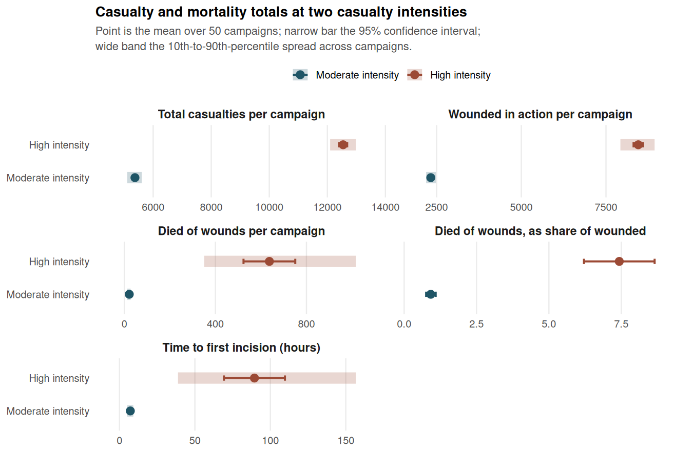

Each panel plots the moderate and high casualty intensities as a point with a narrow 95% confidence interval bar and a wide band for the 10th-to-90th-percentile spread across campaigns. The bar shows how precisely the average is known and the band shows how much one campaign varies.

Moderate intensity produced <!-- GEN cell:scenario_totals|Total casualties/run|Moderate intensity|mean -->5,372.7<!-- /GEN --> casualties per run (95% interval <!-- GEN cell:scenario_totals|Total casualties/run|Moderate intensity|ci -->[5,298.5, 5,446.8]<!-- /GEN -->) and high intensity <!-- GEN cell:scenario_totals|Total casualties/run|High intensity|mean -->12,543.4<!-- /GEN --> (<!-- GEN cell:scenario_totals|Total casualties/run|High intensity|ci -->[12,403.3, 12,683.6]<!-- /GEN -->), a ratio of <!-- GEN cell:scenario_totals|Total casualties/run|Ratio|full -->2.33×<!-- /GEN -->. Wounded in action rose by <!-- GEN cell:scenario_totals|Wounded in action/run|Ratio|full -->3.63×<!-- /GEN -->, died of wounds per run by <!-- GEN cell:scenario_totals|Died of wounds/run|Ratio|full -->29.4×<!-- /GEN --> and died of wounds as a share of wounded by <!-- GEN cell:scenario_totals|Died of wounds, as share of wounded|Ratio|full -->8.05×<!-- /GEN -->, from <!-- GEN cell:scenario_totals|Died of wounds, as share of wounded|Moderate intensity|mean -->0.92%<!-- /GEN --> to <!-- GEN cell:scenario_totals|Died of wounds, as share of wounded|High intensity|mean -->7.43%<!-- /GEN -->.

<!-- GEN scenario_queue -->
| Resource group | Moderate intensity mean queue | High intensity mean queue | Ratio |
|---|---|---|---|
| R2B operating theatre | 0.000 [0.000, 0.000] | 0.000 [0.000, 0.000] | not applicable |
| R2B holding beds | 0.062 [0.031, 0.093] | 0.353 [0.277, 0.428] | 5.69× |
| R2B reception overflow census | 0.026 [−0.005, 0.056] | 0.352 [0.265, 0.439] | 13.79× |
| R2E operating theatre | 0.663 [0.442, 0.885] | 100.454 [68.730, 132.178] | 151.45× |
| R2E holding beds | 23.051 [21.407, 24.695] | 54.370 [52.107, 56.633] | 2.36× |
| R2E post-operative overflow census | 5.568 [5.180, 5.955] | 19.623 [19.249, 19.996] | 3.52× |
| R2E staging overflow census | 33.733 [25.875, 41.592] | 1,412.071 [1,378.542, 1,445.600] | 41.86× |
| Ambulance and truck fleets | 0.187 [0.079, 0.294] | 2.278 [1.687, 2.868] | 12.21× |
<!-- /GEN -->

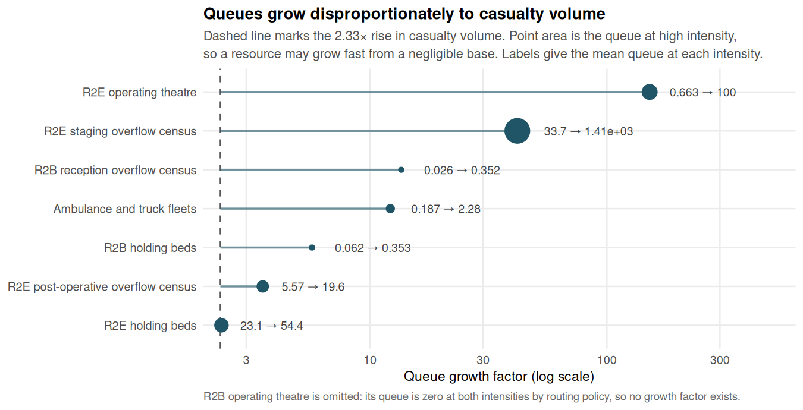

Queue growth factor from moderate to high intensity on a logarithmic scale, with a dashed reference line at the growth in casualty volume. Each point is sized by its absolute queue at high intensity.

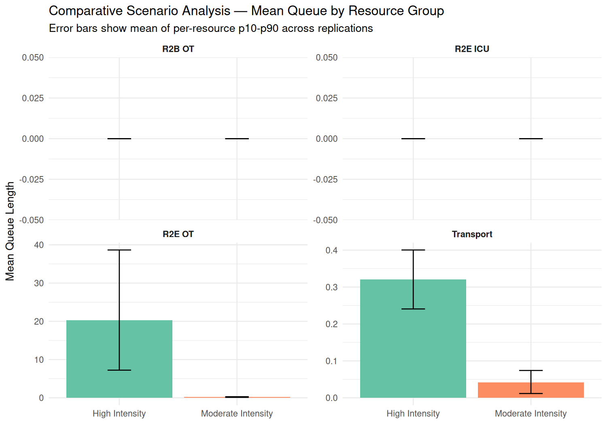

Mean queue length by resource group at each casualty intensity. Each panel has its own vertical scale, and the error bars show the spread across campaigns rather than a confidence interval.

The R2B operating theatre queue was zero at both intensities. At moderate intensity the R2E holding beds carried a mean queue of <!-- GEN cell:scenario_queue|R2E holding beds|Moderate intensity mean queue|mean -->23.051<!-- /GEN --> casualties (<!-- GEN cell:scenario_queue|R2E holding beds|Moderate intensity mean queue|ci -->[21.407, 24.695]<!-- /GEN -->), against <!-- GEN cell:scenario_queue|R2E operating theatre|Moderate intensity mean queue|mean -->0.663<!-- /GEN --> at the R2E operating theatres (<!-- GEN cell:scenario_queue|R2E operating theatre|Moderate intensity mean queue|ci -->[0.442, 0.885]<!-- /GEN -->); a mean of <!-- GEN cell:scenario_queue|R2E post-operative overflow census|Moderate intensity mean queue|mean -->5.568<!-- /GEN --> operated casualties were cared for in post-operative overflow and <!-- GEN cell:scenario_queue|R2E staging overflow census|Moderate intensity mean queue|mean -->33.733<!-- /GEN --> awaited a flight in staging overflow. At high intensity the R2E operating theatre queue was <!-- GEN cell:scenario_queue|R2E operating theatre|High intensity mean queue|mean -->100.454<!-- /GEN --> (<!-- GEN cell:scenario_queue|R2E operating theatre|High intensity mean queue|ci -->[68.730, 132.178]<!-- /GEN -->), the R2E holding queue <!-- GEN cell:scenario_queue|R2E holding beds|High intensity mean queue|mean -->54.370<!-- /GEN --> (<!-- GEN cell:scenario_queue|R2E holding beds|High intensity mean queue|ci -->[52.107, 56.633]<!-- /GEN -->), the post-operative overflow census <!-- GEN cell:scenario_queue|R2E post-operative overflow census|High intensity mean queue|mean -->19.623<!-- /GEN --> (<!-- GEN cell:scenario_queue|R2E post-operative overflow census|High intensity mean queue|ci -->[19.249, 19.996]<!-- /GEN -->) and the staging overflow census <!-- GEN cell:scenario_queue|R2E staging overflow census|High intensity mean queue|mean -->1,412.071<!-- /GEN --> (<!-- GEN cell:scenario_queue|R2E staging overflow census|High intensity mean queue|ci -->[1,378.542, 1,445.600]<!-- /GEN -->); the ratios to moderate intensity were <!-- GEN cell:scenario_queue|R2E operating theatre|Ratio|full -->151.45×<!-- /GEN -->, <!-- GEN cell:scenario_queue|R2E holding beds|Ratio|full -->2.36×<!-- /GEN -->, <!-- GEN cell:scenario_queue|R2E post-operative overflow census|Ratio|full -->3.52×<!-- /GEN --> and <!-- GEN cell:scenario_queue|R2E staging overflow census|Ratio|full -->41.86×<!-- /GEN -->. The ambulance and truck fleets queued <!-- GEN cell:scenario_queue|Ambulance and truck fleets|Moderate intensity mean queue|mean -->0.187<!-- /GEN --> and <!-- GEN cell:scenario_queue|Ambulance and truck fleets|High intensity mean queue|mean -->2.278<!-- /GEN --> casualties at the two intensities. An overflow census counts casualties cared for without a bed rather than casualties waiting for one, a casualty finding no intensive care or holding bed being placed in overflow instead of queued, so the intensive care pool carries no queue. The high-intensity staging figure is a mean over a window in which that quantity was still growing, as the sections that follow record, so it describes the closing 90 days and not a level.

---

## Queue Behaviour over the Campaign

<small>[Return to Top](#contents)</small>

**Question.** Does a pool's queue clear between its busy spells, or does it stand for the whole campaign, and how does the share of post-operative care delivered in a holding bed change with time? `[moderate_intensity and high_intensity · 360 d · 30 replications · pool totals, unbinned series]`

<!-- GEN queue_clearance -->
| Resource pool | Moderate: queue empty | Moderate: longest run above zero (days) | High: queue empty | High: longest run above zero (days) |
|---|---|---|---|---|
| R2B reception overflow | 99% | 0.9 (0.6–1.2) | 90% | 2.0 (1.6–2.4) |
| R2B holding beds | 94% | 10.6 (6.9–12.2) | 73% | 15.5 (13.3–17.9) |
| R2E operating theatres | 85% | 4.4 (3.9–6.6) | 6% | 152.5 (90.0–203.2) |
| R2E post-operative overflow | 14% | 22.5 (20.3–28.4) | 1% | 357.8 (357.3–358.4) |
| R2E holding beds | 1% | 355.6 (355.0–356.7) | 1% | 357.7 (357.5–358.2) |
| R2E staging overflow | 5% | 76.7 (45.8–116.0) | 1% | 357.8 (357.5–358.4) |
<!-- /GEN -->

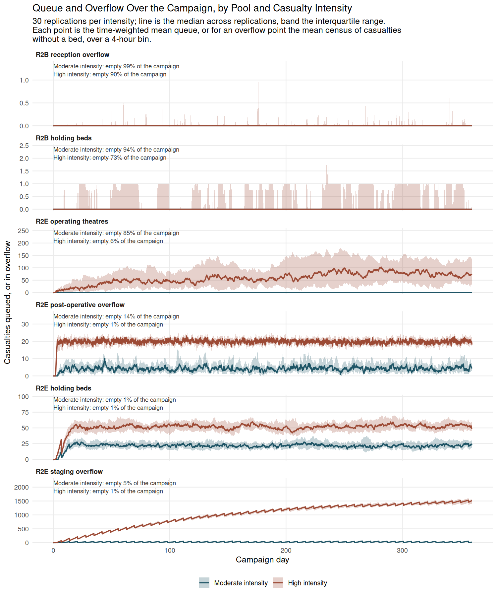

Queue length against campaign day for each pool, as the median across replications with an interquartile band, at each casualty intensity. Each panel is annotated with the share of the campaign the queue stood empty.

The table reports, for each pool and intensity, the median across replications of the share of the campaign the pool's queue or overflow census stood empty and of the longest unbroken spell it did not, with the interquartile range of the spell in parentheses. At high intensity the R2E operating theatre queue stood empty for <!-- GEN cell:queue_clearance|R2E operating theatres|High: queue empty|full -->6%<!-- /GEN --> of the campaign, with a median longest spell above zero of <!-- GEN cell:queue_clearance|R2E operating theatres|High: longest run above zero (days)|full -->152.5 (90.0–203.2)<!-- /GEN --> days, and the R2E holding queue and both R2E overflow censuses stood empty for <!-- GEN cell:queue_clearance|R2E staging overflow|High: queue empty|full -->1%<!-- /GEN --> or less. At moderate intensity the theatre queue stood empty for <!-- GEN cell:queue_clearance|R2E operating theatres|Moderate: queue empty|full -->85%<!-- /GEN --> of the campaign with a median longest spell of <!-- GEN cell:queue_clearance|R2E operating theatres|Moderate: longest run above zero (days)|full -->4.4 (3.9–6.6)<!-- /GEN --> days, while the R2E holding queue stood empty for <!-- GEN cell:queue_clearance|R2E holding beds|Moderate: queue empty|full -->1%<!-- /GEN -->.

<!-- GEN degraded_care -->
| Intensity and stage | First day the median daily rate reaches 100% | First ten days | Last ten days | Whole campaign |
|---|---|---|---|---|
| Moderate intensity: Stabilisation | not reached | 33.7% | 37.9% | 36.5% |
| Moderate intensity: Post-definitive care | not reached | 60.5% | 65.8% | 64.7% |
| High intensity: Stabilisation | not reached | 40.4% | 45.3% | 43.4% |
| High intensity: Post-definitive care | not reached | 86.3% | 89.3% | 88.8% |
<!-- /GEN -->

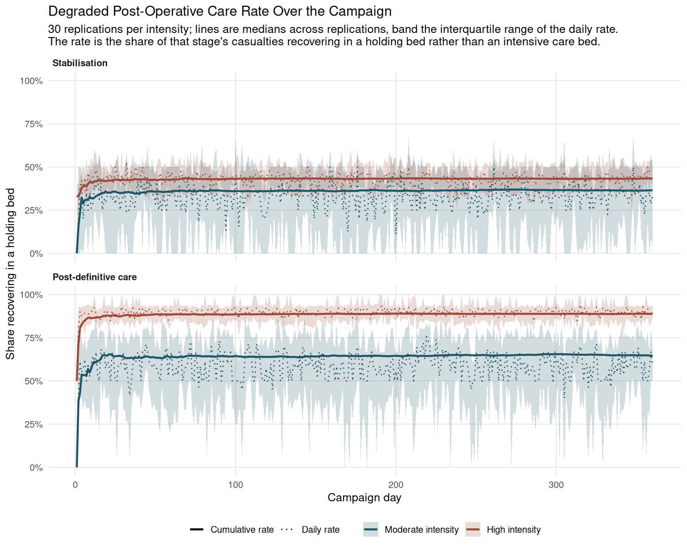

The share of casualties taking the holding-bed recovery against campaign day, stabilisation above and post-definitive care below, as a daily rate inside an interquartile band and as a running cumulative rate.

The degraded post-operative care rate is the share of casualties who took the holding-bed recovery in place of an intensive care bed at the point the decision was taken. At high intensity the median daily rate for post-definitive care first reached 100% on day <!-- GEN cell:degraded_care|High intensity: Post-definitive care|First day the median daily rate reaches 100%|full -->not reached<!-- /GEN --> and for stabilisation on day <!-- GEN cell:degraded_care|High intensity: Stabilisation|First day the median daily rate reaches 100%|full -->not reached<!-- /GEN -->; over the whole campaign <!-- GEN cell:degraded_care|High intensity: Post-definitive care|Whole campaign|full -->88.8%<!-- /GEN --> of post-definitive care and <!-- GEN cell:degraded_care|High intensity: Stabilisation|Whole campaign|full -->43.4%<!-- /GEN --> of stabilisation took the holding bed. At moderate intensity the whole-campaign rates were <!-- GEN cell:degraded_care|Moderate intensity: Post-definitive care|Whole campaign|full -->64.7%<!-- /GEN --> and <!-- GEN cell:degraded_care|Moderate intensity: Stabilisation|Whole campaign|full -->36.5%<!-- /GEN -->, and the median daily rate did not reach 100%.

---

## Sustained Operations

<small>[Return to Top](#contents)</small>

**Question.** Does each response settle to a level over a 360-day campaign, or does it keep moving? `[moderate_intensity and high_intensity · 360 d · 30 replications · twelve 30-day block means]`

Each response was reduced to twelve consecutive 30-day block means and classified from the trend over the late half of the campaign, one slope per replication with an interval across replications; the rule is in [Methods](Methods.md#classifying-stability).

<!-- GEN long_horizon_stability -->
| Response | Moderate intensity | High intensity |
|---|---|---|
| R2E operating theatre queue | converged at 0.85 | converged at 97.9 |
| R2E holding bed queue | converged at 23.1 | converged at 53.1 |
| R2E post-operative overflow census | converged at 5.58 | converged at 19.7 |
| R2E staging overflow census | converged at 32.7 | **drifting, +4.9%/block**, 122.3 to 1,460.5 |
| Strategic evacuation backlog | converged at 40.2 | **drifting, +4.8%/block**, 141.4 to 1,475.7 |
| R2B reception overflow census | converged at 0.05 | converged at 0.33 |
| R2B holding bed queue | converged at 0.07 | converged at 0.35 |
| Casualty arrivals per day | converged at 14.9 | converged at 34.8 |
| Deaths of wounds per day | converged at 0.06 | converged at 2.13 |
<!-- /GEN -->

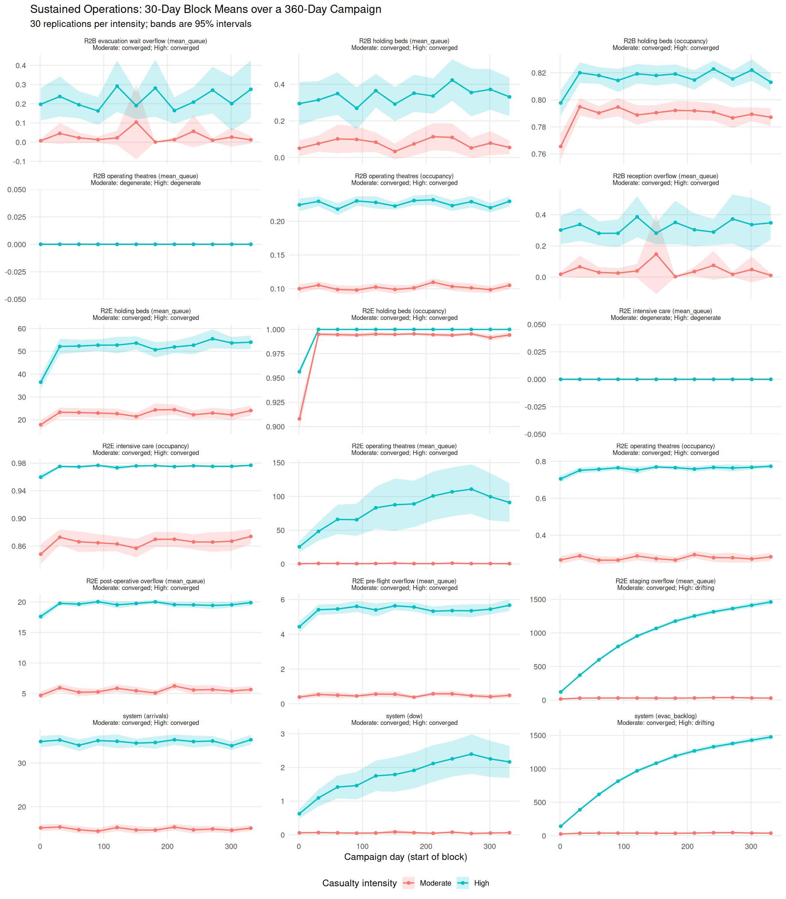

Block means of every queue, occupancy, arrival, evacuation backlog and mortality response over the campaign at the two casualty intensities, each panel headed by its stability classification at each intensity.

Three responses at high intensity were classified as drifting: the R2E staging overflow census (<!-- GEN cell:long_horizon_stability|R2E staging overflow census|High intensity|full -->**drifting, +4.9%/block**, 122.3 to 1,460.5<!-- /GEN -->), the strategic evacuation backlog (<!-- GEN cell:long_horizon_stability|Strategic evacuation backlog|High intensity|full -->**drifting, +4.8%/block**, 141.4 to 1,475.7<!-- /GEN -->) and the deaths of wounds per day (<!-- GEN cell:long_horizon_stability|Deaths of wounds per day|High intensity|full -->converged at 2.13<!-- /GEN -->). The R2E operating theatre queue at high intensity was <!-- GEN cell:long_horizon_stability|R2E operating theatre queue|High intensity|full -->converged at 97.9<!-- /GEN -->, as were the R2E holding bed queue, <!-- GEN cell:long_horizon_stability|R2E holding bed queue|High intensity|full -->converged at 53.1<!-- /GEN -->, and the post-operative overflow census, <!-- GEN cell:long_horizon_stability|R2E post-operative overflow census|High intensity|full -->converged at 19.7<!-- /GEN -->. At moderate intensity one response was classified as drifting, the strategic evacuation backlog (<!-- GEN cell:long_horizon_stability|Strategic evacuation backlog|Moderate intensity|full -->converged at 40.2<!-- /GEN -->); the R2E operating theatre queue was <!-- GEN cell:long_horizon_stability|R2E operating theatre queue|Moderate intensity|full -->converged at 0.85<!-- /GEN -->, the R2E holding bed queue <!-- GEN cell:long_horizon_stability|R2E holding bed queue|Moderate intensity|full -->converged at 23.1<!-- /GEN -->, the post-operative overflow census <!-- GEN cell:long_horizon_stability|R2E post-operative overflow census|Moderate intensity|full -->converged at 5.58<!-- /GEN --> and the staging overflow census <!-- GEN cell:long_horizon_stability|R2E staging overflow census|Moderate intensity|full -->converged at 32.7<!-- /GEN -->.

### Demand, Utilisation and Shortfall per Day

**Question.** How much more demand does the high-intensity profile place on the system than the moderate-intensity one, how fully is each R2E pool used over the closing 90 days, and at what rate does a pool fall behind where it has not settled? `[moderate_intensity and high_intensity · 360 d · 30 replications · closing 90 d and the late half of the campaign]`

<!-- GEN load_demand -->
| Demand measure | Moderate intensity | High intensity | Ratio |
|---|---|---|---|
| Wounded in action/run | 2,326.9 [2,277.4, 2,376.5] | 8,453.3 [8,313.6, 8,593.1] | 3.63× |
| R2B and R2E first surgeries/run | 2,653.0 [2,603.0, 2,703.0] | 8,031.6 [7,932.1, 8,131.2] | 3.03× |
| Post-definitive recovery dispositions/run | 3,919.8 [3,861.4, 3,978.3] | 9,322.5 [9,243.1, 9,402.0] | 2.38× |
<!-- /GEN -->

The wounded in action rose <!-- GEN cell:load_demand|Wounded in action/run|Ratio|full -->3.63×<!-- /GEN -->, the first surgeries at R2B and R2E <!-- GEN cell:load_demand|R2B and R2E first surgeries/run|Ratio|full -->3.03×<!-- /GEN --> and the post-definitive recovery dispositions <!-- GEN cell:load_demand|Post-definitive recovery dispositions/run|Ratio|full -->2.38×<!-- /GEN --> from moderate to high intensity. The surgeries and dispositions are per-campaign counts from the shipped configuration's arms of the [R2B pre-open hold window](#r2b-pre-open-hold-window) and [evacuation policy](#evacuation-policy) experiments, and the total casualties are in the [comparative scenario analysis](#comparative-scenario-analysis).

<!-- GEN load_shortfall -->
| Pool | Moderate: shortfall per day | Moderate: utilisation | High: shortfall per day | High: utilisation |
|---|---|---|---|---|
| R2E operating theatres | −0.002 [−0.010, 0.005] | 27.7% [26.4%, 29.0%] | 0.049 [−0.232, 0.330] | 76.8% [75.8%, 77.9%] |
| R2E holding beds | 0.002 [−0.013, 0.018] | 99.4% [99.2%, 99.5%] | 0.013 [−0.007, 0.033] | 100.0% [100.0%, 100.0%] |
| R2E intensive care | no queue forms | 86.9% [86.1%, 87.7%] | no queue forms | 97.6% [97.5%, 97.7%] |
| R2E post-operative overflow | 0.001 [−0.003, 0.005] | not applicable | −0.001 [−0.004, 0.003] | not applicable |
| R2E staging overflow | 0.017 [−0.058, 0.092] | not applicable | 2.099 [1.855, 2.343] | not applicable |
| Strategic evacuation backlog | 0.018 [−0.058, 0.094] | not applicable | 2.095 [1.850, 2.341] | not applicable |
<!-- /GEN -->

The shortfall per day is the mean per-replication slope of the 30-day block means over the late half of the campaign, the estimate the stability classification uses, divided by the 30 days of a block; the estimator is defined in [Methods](Methods.md#classifying-stability). At moderate intensity the intervals of the R2E theatre queue (<!-- GEN cell:load_shortfall|R2E operating theatres|Moderate: shortfall per day|full -->−0.002 [−0.010, 0.005]<!-- /GEN -->), the holding bed queue (<!-- GEN cell:load_shortfall|R2E holding beds|Moderate: shortfall per day|full -->0.002 [−0.013, 0.018]<!-- /GEN -->), the post-operative overflow census (<!-- GEN cell:load_shortfall|R2E post-operative overflow|Moderate: shortfall per day|full -->0.001 [−0.003, 0.005]<!-- /GEN -->), the staging overflow census (<!-- GEN cell:load_shortfall|R2E staging overflow|Moderate: shortfall per day|full -->0.017 [−0.058, 0.092]<!-- /GEN -->) and the strategic evacuation backlog (<!-- GEN cell:load_shortfall|Strategic evacuation backlog|Moderate: shortfall per day|full -->0.018 [−0.058, 0.094]<!-- /GEN -->) all contain zero. At high intensity the staging overflow census grew by <!-- GEN cell:load_shortfall|R2E staging overflow|High: shortfall per day|full -->2.099 [1.855, 2.343]<!-- /GEN --> and the strategic evacuation backlog by <!-- GEN cell:load_shortfall|Strategic evacuation backlog|High: shortfall per day|full -->2.095 [1.850, 2.341]<!-- /GEN -->, while the intervals of the R2E theatre queue (<!-- GEN cell:load_shortfall|R2E operating theatres|High: shortfall per day|full -->0.049 [−0.232, 0.330]<!-- /GEN -->), the holding bed queue (<!-- GEN cell:load_shortfall|R2E holding beds|High: shortfall per day|full -->0.013 [−0.007, 0.033]<!-- /GEN -->) and the post-operative overflow census (<!-- GEN cell:load_shortfall|R2E post-operative overflow|High: shortfall per day|full -->−0.001 [−0.004, 0.003]<!-- /GEN -->) contain zero. Over the closing 90 days the R2E theatres were in use <!-- GEN cell:load_shortfall|R2E operating theatres|Moderate: utilisation|full -->27.7% [26.4%, 29.0%]<!-- /GEN --> of the time at moderate intensity and <!-- GEN cell:load_shortfall|R2E operating theatres|High: utilisation|full -->76.8% [75.8%, 77.9%]<!-- /GEN --> at high, the holding beds <!-- GEN cell:load_shortfall|R2E holding beds|Moderate: utilisation|full -->99.4% [99.2%, 99.5%]<!-- /GEN --> and <!-- GEN cell:load_shortfall|R2E holding beds|High: utilisation|full -->100.0% [100.0%, 100.0%]<!-- /GEN -->, and the intensive care beds <!-- GEN cell:load_shortfall|R2E intensive care|Moderate: utilisation|full -->86.9% [86.1%, 87.7%]<!-- /GEN --> and <!-- GEN cell:load_shortfall|R2E intensive care|High: utilisation|full -->97.6% [97.5%, 97.7%]<!-- /GEN -->. The strategic evacuation backlog and the overflow censuses count casualties without a bed and have no establishment, so they carry no utilisation, and the intensive care beds carry no shortfall, no queue forming for them.

---

## Treated-Cohort Mortality

<small>[Return to Top](#contents)</small>

**Question.** What fraction of casualties reaching an R2B or R2E facility die of wounds over a 360-day campaign, and how does that compare with the rate at the length of the historical campaign each configuration models? `[default and high_intensity · 360 d and each anchor's horizon (30 d, 82 d) · 3 measurements of 10 and of 50 replications · pooled, Student t]`

<!-- GEN dow_calibration -->
| Configuration | Rate at 360 days | Post-operative share at 360 days | Replications at 360 days | Historical anchor | Rate at the anchor's horizon | Post-operative share at the anchor's horizon | Replications at the anchor's horizon |
|---|---|---|---|---|---|---|---|
| Shipped default | 0.505% [0.450%, 0.559%] | 14% | 30 | fitted to 0.46% (Ajax Bay, 30 days) | 0.451% [0.380%, 0.522%] | 12% | 150 |
| High intensity | 6.448% [5.439%, 7.457%] | 11% | 30 | independent bound, at or below 3.40% (Okinawa, 82 days) | 3.376% [3.122%, 3.631%] | 5% | 150 |
<!-- /GEN -->

At 360 days the shipped default's pooled rate was <!-- GEN cell:dow_calibration|Shipped default|Rate at 360 days|full -->0.505% [0.450%, 0.559%]<!-- /GEN -->, with post-operative care carrying <!-- GEN cell:dow_calibration|Shipped default|Post-operative share at 360 days|full -->14%<!-- /GEN --> of its expected deaths, and high intensity's was <!-- GEN cell:dow_calibration|High intensity|Rate at 360 days|full -->6.448% [5.439%, 7.457%]<!-- /GEN -->, with post-operative care carrying <!-- GEN cell:dow_calibration|High intensity|Post-operative share at 360 days|full -->11%<!-- /GEN -->. Each configuration was also measured at the length of the historical campaign it models, where the two anchors play different roles. The Falklands anchor is the three deaths of wounds among over 650 combat casualties treated by the Ajax Bay field hospital and its forward stations at Teal Inlet and Fitzroy [[2]](#references), a 30-day campaign; the shipped default's base rates and post-operative multiplier are fitted to it, so its rate at that horizon, <!-- GEN cell:dow_calibration|Shipped default|Rate at the anchor's horizon|full -->0.451% [0.380%, 0.522%]<!-- /GEN -->, shows that the fit was achieved rather than measuring an outcome. The Okinawa anchor is the share of casualties reaching a hospital alive who died of wounds over the 82 days of that campaign [[3]](#references); high intensity is not fitted to it, so its rate at that horizon, <!-- GEN cell:dow_calibration|High intensity|Rate at the anchor's horizon|full -->3.376% [3.122%, 3.631%]<!-- /GEN -->, is checked against it as an independent upper bound. The calibration check `tests/checks/check_dow_calibration.R` asserts each anchor at the length of the campaign it describes.

---

## Forward Holding and Evacuation Levers

<small>[Return to Top](#contents)</small>

Each subsection varies one setting of the shipped configuration and reports the responses it moved. Experiments with several arms draw every arm from one control seed unless the subsection says otherwise, and the paired difference is reported where the arms are paired.

### R2B Pre-Open Hold Window

**Question.** What changes when a casualty needing surgery at R2B is held forward for a surgical section about to reopen rather than moved rearward at once? `[default, hold window 0 and 60 min · 360 d · 30 replications · campaign totals, paired difference]`

<!-- GEN hold_window -->
| Measure | Window 0 | Window 60 min | Difference |
| --- | --- | --- | --- |
| Casualties held at R2B | 0.00 | 109.47 | +109.47 [+105.19, +113.74] |
| R2B surgeries | 767.27 | 823.57 | +56.30 [+37.61, +74.99] |
| Diverted, team off shift | 1295.93 | 1209.90 | −86.03 [−123.60, −48.47] |
| Diverted, theatre busy | 226.77 | 240.07 | +13.30 [−10.75, +37.35] |
| R2E first surgeries | 1855.10 | 1829.47 | −25.63 [−90.80, +39.53] |
| R2E theatre entry deferred | 385.17 | 373.97 | −11.20 [−32.41, +10.01] |
| Died of wounds per run | 23.23 | 21.67 | −1.57 [−6.17, +3.03] |
| Total casualties | 5400.20 | 5372.67 | −27.53 [−142.76, +87.69] |
<!-- /GEN -->

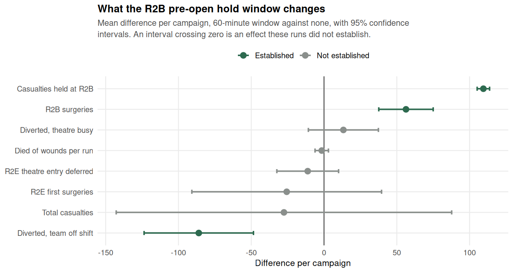

The paired difference per campaign for each of the eight measures with its 95% confidence interval against a vertical line at zero.

A 60-minute window held <!-- GEN cell:hold_window|Casualties held at R2B|Window 60 min|full -->109.47<!-- /GEN --> casualties per campaign at R2B against none with a zero window. R2B surgeries differed by <!-- GEN cell:hold_window|R2B surgeries|Difference|full -->+56.30 [+37.61, +74.99]<!-- /GEN --> and diversions for an off-shift section by <!-- GEN cell:hold_window|Diverted, team off shift|Difference|full -->−86.03 [−123.60, −48.47]<!-- /GEN -->. The differences in diversions for a busy theatre were <!-- GEN cell:hold_window|Diverted, theatre busy|Difference|full -->+13.30 [−10.75, +37.35]<!-- /GEN -->, in R2E first surgeries <!-- GEN cell:hold_window|R2E first surgeries|Difference|full -->−25.63 [−90.80, +39.53]<!-- /GEN -->, in R2E theatre entry deferrals <!-- GEN cell:hold_window|R2E theatre entry deferred|Difference|full -->−11.20 [−32.41, +10.01]<!-- /GEN -->, in died of wounds <!-- GEN cell:hold_window|Died of wounds per run|Difference|full -->−1.57 [−6.17, +3.03]<!-- /GEN --> and in total casualties <!-- GEN cell:hold_window|Total casualties|Difference|full -->−27.53 [−142.76, +87.69]<!-- /GEN -->.

**High-intensity profile.** The same comparison under `high_intensity` `[high_intensity, hold window 0 and 60 min · 360 d · 30 replications · campaign totals, paired differences]`:

<!-- GEN hold_window_high -->
| Measure | Window 0 | Window 60 min | Difference |
| --- | --- | --- | --- |
| Casualties held at R2B | 0.00 | 341.53 | +341.53 [+335.60, +347.46] |
| R2B surgeries | 1746.60 | 1810.17 | +63.57 [+43.49, +83.64] |
| Diverted, team off shift | 4169.47 | 3860.07 | −309.40 [−367.26, −251.54] |
| Diverted, theatre busy | 1333.47 | 1426.57 | +93.10 [+53.48, +132.72] |
| R2E first surgeries | 6237.73 | 6221.47 | −16.27 [−106.67, +74.14] |
| R2E theatre entry deferred | 1631.37 | 1613.90 | −17.47 [−51.28, +16.34] |
| Died of wounds per run | 543.10 | 637.23 | +94.13 [−30.05, +218.32] |
| Total casualties | 12598.77 | 12543.43 | −55.33 [−203.14, +92.47] |
<!-- /GEN -->

The 60-minute window held <!-- GEN cell:hold_window_high|Casualties held at R2B|Window 60 min|full -->341.53<!-- /GEN --> casualties forward and changed diversions for a team off shift by <!-- GEN cell:hold_window_high|Diverted, team off shift|Difference|full -->−309.40 [−367.26, −251.54]<!-- /GEN -->.

### R2B Holding Capacity and Evacuation Threshold

**Question.** How do the R2B holding queue and the pools behind it respond to the R2B holding bed establishment and to the threshold at which convalescent casualties are evacuated early? `[default, 5 to 10 holding beds per unit crossed with a 0 to 7 day threshold · 360 d · 30 replications · pool totals, closing 90 d]`

<!-- GEN hold_threshold_beds -->
| R2B holding beds per unit | R2B hold mean queue | R2B hold utilisation | R2B reception overflow census | R2E hold mean queue | R2E post-operative overflow census | Returns to duty | Deaths of wounds |
|---|---|---|---|---|---|---|---|
| 5 (shipped) | 0.06 [0.03, 0.09] | 78.8% [78.5, 79.1] | 0.026 [0.000, 0.056] | 23.051 [21.407, 24.695] | 5.57 [5.18, 5.96] | 2030 [2001, 2059] | 21.7 [17.7, 25.6] |
| 7 | 0.13 [0.06, 0.20] | 83.9% [83.5, 84.2] | 0.037 [0.013, 0.061] | 20.863 [19.678, 22.047] | 5.49 [5.12, 5.86] | 2036 [2009, 2063] | 20.5 [18.2, 22.7] |
| 10 | 0.07 [0.01, 0.12] | 77.8% [77.4, 78.2] | 0.051 [0.000, 0.107] | 19.018 [17.535, 20.502] | 5.45 [5.05, 5.86] | 2054 [2019, 2089] | 22.1 [19.2, 25.1] |
<!-- /GEN -->

With the threshold disabled, raising the establishment from five to ten holding beds per unit moved the R2B holding queue from <!-- GEN cell:hold_threshold_beds|5 (shipped)|R2B hold mean queue|full -->0.06 [0.03, 0.09]<!-- /GEN --> to <!-- GEN cell:hold_threshold_beds|10|R2B hold mean queue|full -->0.07 [0.01, 0.12]<!-- /GEN --> and R2B holding utilisation from <!-- GEN cell:hold_threshold_beds|5 (shipped)|R2B hold utilisation|full -->78.8% [78.5, 79.1]<!-- /GEN --> to <!-- GEN cell:hold_threshold_beds|10|R2B hold utilisation|full -->77.8% [77.4, 78.2]<!-- /GEN -->. The R2E holding queue was <!-- GEN cell:hold_threshold_beds|5 (shipped)|R2E hold mean queue|full -->23.051 [21.407, 24.695]<!-- /GEN --> at five beds and <!-- GEN cell:hold_threshold_beds|10|R2E hold mean queue|full -->19.018 [17.535, 20.502]<!-- /GEN --> at ten, and the R2E post-operative overflow census <!-- GEN cell:hold_threshold_beds|5 (shipped)|R2E post-operative overflow census|full -->5.57 [5.18, 5.96]<!-- /GEN --> and <!-- GEN cell:hold_threshold_beds|10|R2E post-operative overflow census|full -->5.45 [5.05, 5.86]<!-- /GEN --> Returns to duty were <!-- GEN cell:hold_threshold_beds|5 (shipped)|Returns to duty|full -->2030 [2001, 2059]<!-- /GEN --> at five beds and <!-- GEN cell:hold_threshold_beds|10|Returns to duty|full -->2054 [2019, 2089]<!-- /GEN --> at ten, and deaths of wounds <!-- GEN cell:hold_threshold_beds|5 (shipped)|Deaths of wounds|full -->21.7 [17.7, 25.6]<!-- /GEN --> and <!-- GEN cell:hold_threshold_beds|10|Deaths of wounds|full -->22.1 [19.2, 25.1]<!-- /GEN -->.

<!-- GEN hold_threshold_threshold -->
| Evacuation threshold | R2B hold mean queue | R2B hold utilisation | R2B reception overflow census | R2E hold mean queue | R2E post-operative overflow census | Returns to duty | Deaths of wounds |
|---|---|---|---|---|---|---|---|
| Disabled (shipped) | 0.06 [0.03, 0.09] | 78.8% [78.5, 79.1] | 0.026 [0.000, 0.056] | 23.051 [21.407, 24.695] | 5.57 [5.18, 5.96] | 2030 [2001, 2059] | 21.7 [17.7, 25.6] |
| 1 day | 0.04 [0.03, 0.06] | 54.2% [53.4, 55.1] | 0.050 [0.020, 0.081] | 24.866 [23.361, 26.370] | 5.44 [5.10, 5.77] | 2040 [2005, 2075] | 22.6 [19.6, 25.6] |
| 3 days | 0.05 [0.04, 0.07] | 69.2% [68.6, 69.8] | 0.029 [0.013, 0.046] | 25.158 [23.915, 26.401] | 5.49 [5.15, 5.82] | 2053 [2025, 2081] | 20.9 [17.9, 24.0] |
| 5 days (mode) | 0.05 [0.03, 0.06] | 74.2% [73.7, 74.7] | 0.046 [0.014, 0.079] | 24.687 [23.245, 26.130] | 5.70 [5.25, 6.15] | 2040 [2009, 2070] | 23.1 [19.7, 26.6] |
| 7 days | 0.07 [0.03, 0.10] | 76.3% [75.9, 76.8] | 0.024 [0.011, 0.038] | 24.747 [22.888, 26.606] | 5.31 [4.95, 5.68] | 2068 [2043, 2094] | 20.3 [18.2, 22.4] |
<!-- /GEN -->

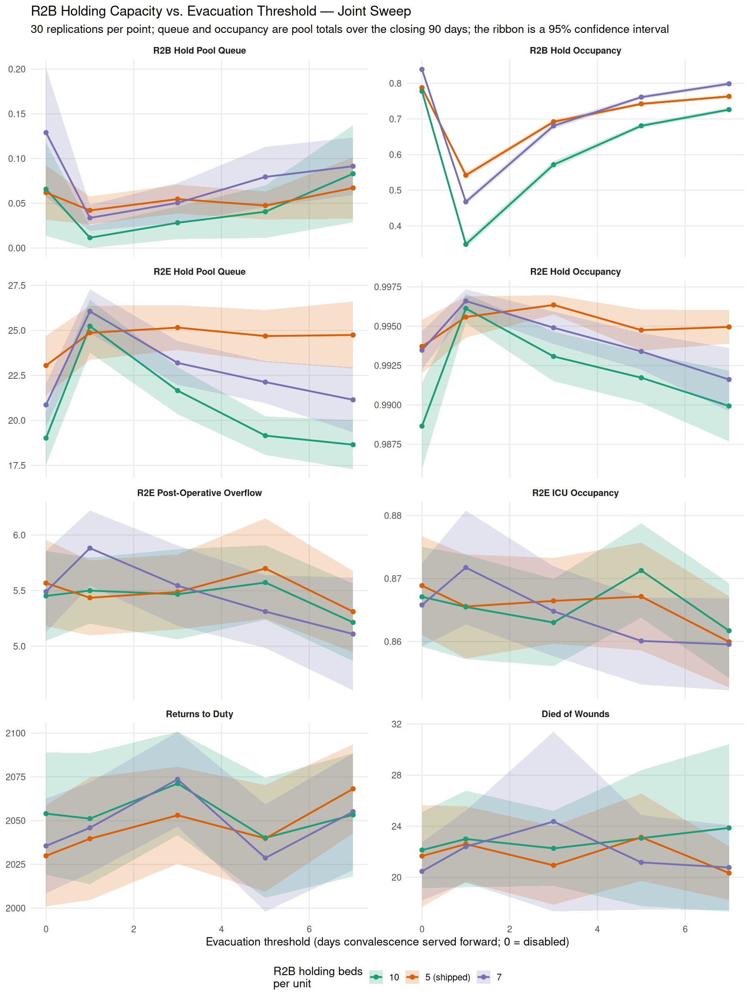

R2B and R2E queue and utilisation, returns to duty and died of wounds against the evacuation threshold in days, one line per swept bed count, with a 95% confidence ribbon.

With five beds per unit, a one-day threshold moved the R2B holding queue to <!-- GEN cell:hold_threshold_threshold|1 day|R2B hold mean queue|full -->0.04 [0.03, 0.06]<!-- /GEN --> and the R2E holding queue to <!-- GEN cell:hold_threshold_threshold|1 day|R2E hold mean queue|full -->24.866 [23.361, 26.370]<!-- /GEN -->, and the R2E post-operative overflow census to <!-- GEN cell:hold_threshold_threshold|1 day|R2E post-operative overflow census|full -->5.44 [5.10, 5.77]<!-- /GEN -->. A three-day threshold gave <!-- GEN cell:hold_threshold_threshold|3 days|R2B hold mean queue|full -->0.05 [0.04, 0.07]<!-- /GEN -->, <!-- GEN cell:hold_threshold_threshold|3 days|R2E hold mean queue|full -->25.158 [23.915, 26.401]<!-- /GEN --> and <!-- GEN cell:hold_threshold_threshold|3 days|R2E post-operative overflow census|full -->5.49 [5.15, 5.82]<!-- /GEN --> on the same three responses. At five and seven days the R2B holding queue was <!-- GEN cell:hold_threshold_threshold|5 days (mode)|R2B hold mean queue|full -->0.05 [0.03, 0.06]<!-- /GEN --> and <!-- GEN cell:hold_threshold_threshold|7 days|R2B hold mean queue|full -->0.07 [0.03, 0.10]<!-- /GEN -->. Returns to duty were <!-- GEN cell:hold_threshold_threshold|Disabled (shipped)|Returns to duty|full -->2030 [2001, 2059]<!-- /GEN --> with the threshold disabled and <!-- GEN cell:hold_threshold_threshold|1 day|Returns to duty|full -->2040 [2005, 2075]<!-- /GEN --> at one day, and deaths of wounds <!-- GEN cell:hold_threshold_threshold|Disabled (shipped)|Deaths of wounds|full -->21.7 [17.7, 25.6]<!-- /GEN --> and <!-- GEN cell:hold_threshold_threshold|1 day|Deaths of wounds|full -->22.6 [19.6, 25.6]<!-- /GEN -->. The full grid, including returns to duty and deaths of wounds at every point, is in `data/sweeps/r2b_hold_threshold_sweep.csv`.

**High-intensity profile.** The same grid under `high_intensity` `[high_intensity, 5 to 10 beds per unit and 0 to 7 days · 360 d · 30 replications · pool totals, closing 90 d]`:

<!-- GEN hold_threshold_beds_high -->
| R2B holding beds per unit | R2B hold mean queue | R2B hold utilisation | R2B reception overflow census | R2E hold mean queue | R2E post-operative overflow census | Returns to duty | Deaths of wounds |
|---|---|---|---|---|---|---|---|
| 5 (shipped) | 0.35 [0.28, 0.43] | 81.7% [81.2, 82.1] | 0.352 [0.265, 0.439] | 54.370 [52.107, 56.633] | 19.62 [19.25, 20.00] | 4254 [4209, 4300] | 637.2 [523.5, 750.9] |
| 7 | 0.58 [0.49, 0.67] | 86.3% [86.0, 86.6] | 0.332 [0.267, 0.396] | 52.011 [50.110, 53.911] | 19.73 [19.51, 19.95] | 4290 [4247, 4333] | 679.7 [575.9, 783.5] |
| 10 | 0.42 [0.30, 0.55] | 80.6% [80.2, 81.0] | 0.274 [0.212, 0.337] | 48.017 [46.014, 50.020] | 19.63 [19.32, 19.94] | 4259 [4216, 4302] | 693.5 [571.3, 815.8] |
<!-- /GEN -->

<!-- GEN hold_threshold_threshold_high -->
| Evacuation threshold | R2B hold mean queue | R2B hold utilisation | R2B reception overflow census | R2E hold mean queue | R2E post-operative overflow census | Returns to duty | Deaths of wounds |
|---|---|---|---|---|---|---|---|
| Disabled (shipped) | 0.35 [0.28, 0.43] | 81.7% [81.2, 82.1] | 0.352 [0.265, 0.439] | 54.370 [52.107, 56.633] | 19.62 [19.25, 20.00] | 4254 [4209, 4300] | 637.2 [523.5, 750.9] |
| 1 day | 0.15 [0.13, 0.17] | 60.8% [60.0, 61.6] | 0.432 [0.334, 0.531] | 55.301 [53.519, 57.082] | 19.62 [19.33, 19.91] | 4230 [4194, 4265] | 693.0 [575.3, 810.7] |
| 3 days | 0.22 [0.18, 0.25] | 74.3% [73.9, 74.7] | 0.372 [0.288, 0.456] | 54.145 [52.635, 55.655] | 19.51 [19.27, 19.76] | 4262 [4223, 4301] | 676.3 [567.0, 785.6] |
| 5 days (mode) | 0.27 [0.24, 0.31] | 78.2% [77.7, 78.6] | 0.363 [0.281, 0.445] | 54.589 [52.550, 56.627] | 19.69 [19.31, 20.06] | 4288 [4240, 4335] | 670.7 [552.8, 788.5] |
| 7 days | 0.30 [0.25, 0.35] | 80.1% [79.8, 80.4] | 0.368 [0.308, 0.428] | 54.256 [53.076, 55.435] | 19.96 [19.77, 20.16] | 4271 [4240, 4302] | 619.6 [546.6, 692.5] |
<!-- /GEN -->

At 10 holding beds per unit the R2B holding queue was <!-- GEN cell:hold_threshold_beds_high|10|R2B hold mean queue|full -->0.42 [0.30, 0.55]<!-- /GEN --> against <!-- GEN cell:hold_threshold_beds_high|5 (shipped)|R2B hold mean queue|full -->0.35 [0.28, 0.43]<!-- /GEN --> at the shipped five. A one-day evacuation threshold left the R2E holding queue at <!-- GEN cell:hold_threshold_threshold_high|1 day|R2E hold mean queue|full -->55.301 [53.519, 57.082]<!-- /GEN --> against <!-- GEN cell:hold_threshold_threshold_high|Disabled (shipped)|R2E hold mean queue|full -->54.370 [52.107, 56.633]<!-- /GEN --> with the threshold disabled.

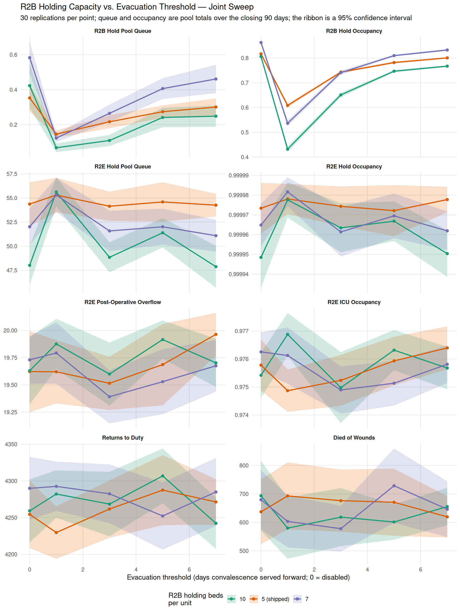

The panels of the first figure of this section under the high-intensity profile.

### Transport Fleet Size

**Question.** At what fleet size does the transport queue form, at each casualty intensity? `[default and high_intensity · 360 d · 30 replications · pool totals, closing 90 d]`

The first table is the shipped moderate-intensity configuration and the second the high-intensity profile.

<!-- GEN transport -->
| Fleet size | Ambulance mean queue | Truck mean queue |
|---|---|---|
| 1 | 6.9417 [3.7820, 10.1014] | 0.2520 [0.0000, 0.5566] |
| 2 | 0.7209 [0.4146, 1.0272] | 0.0060 [0.0021, 0.0100] |
| 3 (current ambulance) | 0.1864 [0.0790, 0.2938] | 0.0006 [0.0001, 0.0010] |
| 4 (current truck) | 0.1981 [0.0563, 0.3399] | 0.0002 [0.0000, 0.0003] |
| 5 | 0.2137 [0.0000, 0.5280] | not swept |
<!-- /GEN -->

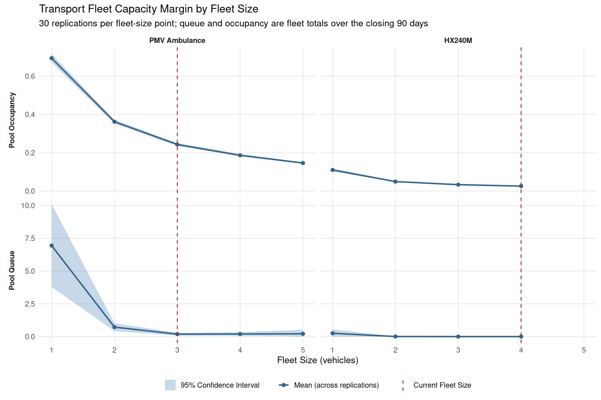

Mean queue and mean utilisation against fleet size for the ambulance and truck fleets under the shipped configuration, each with a 95% confidence ribbon and a dashed vertical line at the current establishment size.

<!-- GEN transport_high -->
| Fleet size | Ambulance mean queue | Truck mean queue |
|---|---|---|
| 1 | 2179.6470 [2082.4992, 2276.7948] | 0.0953 [0.0777, 0.1130] |
| 2 | 13.2344 [10.9132, 15.5557] | 0.0103 [0.0084, 0.0121] |
| 3 (current ambulance) | 2.2774 [1.6869, 2.8678] | 0.0012 [0.0008, 0.0015] |
| 4 (current truck) | 0.6135 [0.4849, 0.7422] | 0.0002 [0.0001, 0.0003] |
| 5 | 0.2463 [0.1801, 0.3126] | not swept |
<!-- /GEN -->

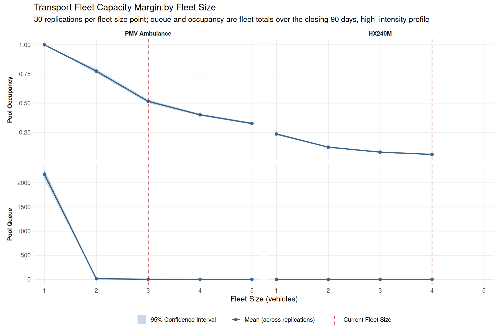

The same measures under the `high_intensity` profile, each with a 95% confidence ribbon and a dashed vertical line at the current establishment size.

Under the shipped configuration a single ambulance queued <!-- GEN cell:transport|1|Ambulance mean queue|mean -->6.9417<!-- /GEN --> casualties (interval <!-- GEN cell:transport|1|Ambulance mean queue|ci -->[3.7820, 10.1014]<!-- /GEN -->), two queued <!-- GEN cell:transport|2|Ambulance mean queue|mean -->0.7209<!-- /GEN --> and the shipped three <!-- GEN cell:transport|3 (current ambulance)|Ambulance mean queue|mean -->0.1864<!-- /GEN -->. Under the high-intensity profile the corresponding ambulance queues were <!-- GEN cell:transport_high|1|Ambulance mean queue|mean -->2179.6470<!-- /GEN -->, <!-- GEN cell:transport_high|2|Ambulance mean queue|mean -->13.2344<!-- /GEN --> and <!-- GEN cell:transport_high|3 (current ambulance)|Ambulance mean queue|mean -->2.2774<!-- /GEN -->, and the shipped four trucks queued <!-- GEN cell:transport_high|4 (current truck)|Truck mean queue|mean -->0.0002<!-- /GEN -->.

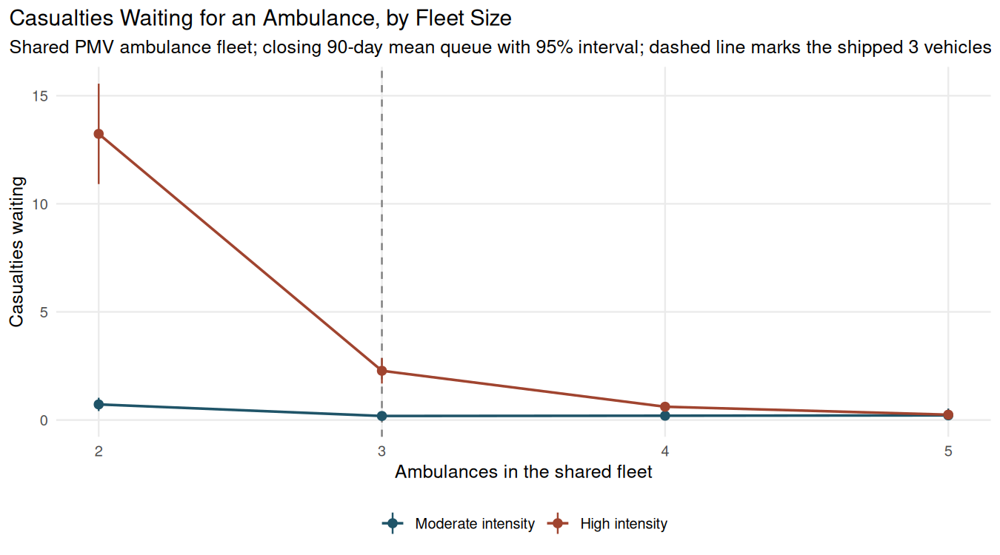

The closing 90-day mean queue for the shared PMV ambulance fleet at two to five vehicles, with its 95% interval, at both intensities on one scale, the shipped fleet marked; the single-vehicle fleet, whose high-intensity queue is in the table above, is left out.

#### Utilisation of Shared Fleets and Integral Evacuation Elements

**Question.** How heavily is each transport holder used, the shared brigade fleets and the evacuation elements integral to R2B and R2E? `[default and high_intensity · 360 d · 30 replications · pool totals, closing 90 d, shipped establishment, not swept]`

Utilisation is the time-weighted share of the established units in use over the closing 90 days. An evacuation crew is two medics seized together, so a crew is measured on its lead medic.

<!-- GEN transport_holders -->
| Holder | Asset | Moderate intensity mean queue | Moderate intensity utilisation | High intensity mean queue | High intensity utilisation |
|---|---|---|---|---|---|
| PMV Ambulance fleet | Shared | 0.186 [0.079, 0.294] | 24.3% [23.5%, 25.1%] | 2.277 [1.687, 2.868] | 51.5% [50.2%, 52.9%] |
| HX2 40M fleet | Shared | 0.000 [0.000, 0.000] | 2.6% [2.4%, 2.7%] | 0.000 [0.000, 0.000] | 6.0% [5.8%, 6.2%] |
| R2B evacuation crews | Integral | 0.064 [0.029, 0.098] | 13.5% [12.9%, 14.1%] | 0.779 [0.644, 0.913] | 42.1% [41.0%, 43.2%] |
| R2E evacuation sections | Integral | 0.000 [0.000, 0.000] | 0.0% [0.0%, 0.0%] | 0.000 [0.000, 0.000] | 1.2% [0.9%, 1.4%] |
<!-- /GEN -->

At moderate intensity the R2B evacuation crews were in use for <!-- GEN cell:transport_holders|R2B evacuation crews|Moderate intensity utilisation|mean -->13.5%<!-- /GEN --> of the window and the ambulance fleet for <!-- GEN cell:transport_holders|PMV Ambulance fleet|Moderate intensity utilisation|mean -->24.3%<!-- /GEN -->. At high intensity the crews were in use for <!-- GEN cell:transport_holders|R2B evacuation crews|High intensity utilisation|mean -->42.1%<!-- /GEN --> (interval <!-- GEN cell:transport_holders|R2B evacuation crews|High intensity utilisation|ci -->[41.0%, 43.2%]<!-- /GEN -->) and queued <!-- GEN cell:transport_holders|R2B evacuation crews|High intensity mean queue|mean -->0.779<!-- /GEN --> casualties, the ambulance fleet was in use for <!-- GEN cell:transport_holders|PMV Ambulance fleet|High intensity utilisation|mean -->51.5%<!-- /GEN --> and the truck fleet for <!-- GEN cell:transport_holders|HX2 40M fleet|High intensity utilisation|mean -->6.0%<!-- /GEN -->. The R2E evacuation sections were in use for <!-- GEN cell:transport_holders|R2E evacuation sections|High intensity utilisation|mean -->1.2%<!-- /GEN --> at high intensity.

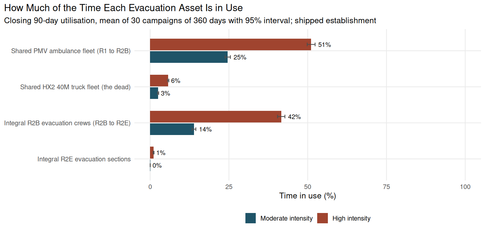

The closing 90-day utilisation of each transport holder, with its 95% interval, at both intensities under the shipped establishment: the shared ambulance and truck fleets and the evacuation elements integral to R2B and R2E.

### Forward Holding of Post-Operative Intensive Care

**Question.** What changes when a casualty operated on at R2B is held there for part of their post-operative intensive care, for a stability window or while R2E intensive care is saturated? `[default, seven forward holding arms · 360 d · 30 replications · pool totals, closing 90 d]`

<!-- GEN forward_hold -->
| Forward holding rule | R2E post-operative overflow census | R2B ICU utilisation | R2E ICU utilisation | Post-definitive care in ICU | Died of wounds per run |
|---|---|---|---|---|---|
| Off (current) | 5.57 [5.18, 5.96] | 1.0% | 86.9% | 35.2 [34.6, 35.8] | 21.67 [17.68, 25.65] |
| 120 min | 5.22 [4.89, 5.56] | 5.8% | 86.1% | 36.5 [35.8, 37.2] | 21.77 [18.93, 24.60] |
| 240 min | 5.37 [4.99, 5.75] | 10.9% | 86.6% | 36.7 [36.0, 37.4] | 20.23 [17.83, 22.64] |
| 480 min | 4.72 [4.42, 5.01] | 19.2% | 84.9% | 37.6 [37.1, 38.1] | 20.80 [18.35, 23.25] |
| 1,440 min | 3.85 [3.59, 4.10] | 44.1% | 82.5% | 42.4 [41.7, 43.1] | 23.43 [21.08, 25.79] |
| Capacity only | 5.16 [4.84, 5.47] | 11.8% | 88.1% | 37.2 [36.4, 38.1] | 27.70 [20.27, 35.13] |
| 240 min + capacity | 5.03 [4.66, 5.40] | 19.9% | 87.2% | 38.4 [37.7, 39.2] | 24.17 [20.10, 28.23] |
<!-- /GEN -->

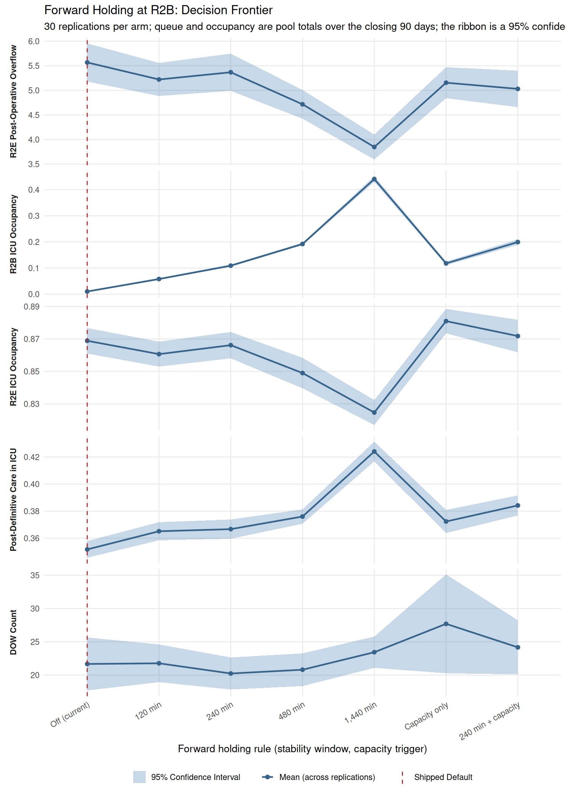

R2E post-operative overflow census, R2B and R2E intensive care utilisation, the share of post-definitive care delivered in intensive care and the died-of-wounds count under each forward holding arm, each with a 95% confidence ribbon. The windows apply to damage control and single-stage casualties alike.

The R2E post-operative overflow census was <!-- GEN cell:forward_hold|Off (current)|R2E post-operative overflow census|full -->5.57 [5.18, 5.96]<!-- /GEN --> with no forward holding and <!-- GEN cell:forward_hold|240 min|R2E post-operative overflow census|full -->5.37 [4.99, 5.75]<!-- /GEN --> with a 240-minute window. R2B intensive care utilisation rose from <!-- GEN cell:forward_hold|Off (current)|R2B ICU utilisation|full -->1.0%<!-- /GEN --> with no forward holding to <!-- GEN cell:forward_hold|1,440 min|R2B ICU utilisation|full -->44.1%<!-- /GEN --> at a 1,440-minute window while R2E intensive care utilisation moved from <!-- GEN cell:forward_hold|Off (current)|R2E ICU utilisation|full -->86.9%<!-- /GEN --> to <!-- GEN cell:forward_hold|1,440 min|R2E ICU utilisation|full -->82.5%<!-- /GEN -->. Post-definitive care in an intensive care bed rose from <!-- GEN cell:forward_hold|Off (current)|Post-definitive care in ICU|full -->35.2 [34.6, 35.8]<!-- /GEN --> to <!-- GEN cell:forward_hold|1,440 min|Post-definitive care in ICU|full -->42.4 [41.7, 43.1]<!-- /GEN -->, and died of wounds per run was <!-- GEN cell:forward_hold|Off (current)|Died of wounds per run|full -->21.67 [17.68, 25.65]<!-- /GEN --> with no forward holding and <!-- GEN cell:forward_hold|1,440 min|Died of wounds per run|full -->23.43 [21.08, 25.79]<!-- /GEN --> at 1,440 minutes. Holding on capacity grounds alone gave a post-operative overflow census of <!-- GEN cell:forward_hold|Capacity only|R2E post-operative overflow census|full -->5.16 [4.84, 5.47]<!-- /GEN -->, and a 240-minute window with the capacity trigger gave <!-- GEN cell:forward_hold|240 min + capacity|R2E post-operative overflow census|full -->5.03 [4.66, 5.40]<!-- /GEN -->.

**High-intensity profile.** The same seven arms under `high_intensity` `[high_intensity, seven forward holding arms · 360 d · 30 replications · pool totals, closing 90 d]`:

<!-- GEN forward_hold_high -->
| Forward holding rule | R2E post-operative overflow census | R2B ICU utilisation | R2E ICU utilisation | Post-definitive care in ICU | Died of wounds per run |
|---|---|---|---|---|---|
| Off (current) | 19.62 [19.25, 20.00] | 10.5% | 97.6% | 11.1 [11.0, 11.3] | 637.23 [523.53, 750.93] |
| 120 min | 19.37 [19.12, 19.63] | 20.7% | 97.6% | 11.2 [11.1, 11.4] | 668.17 [594.90, 741.43] |
| 240 min | 19.18 [18.96, 19.40] | 30.4% | 97.5% | 11.4 [11.2, 11.6] | 559.43 [487.75, 631.12] |
| 480 min | 18.08 [17.82, 18.33] | 45.6% | 97.4% | 11.8 [11.6, 12.0] | 599.83 [534.92, 664.75] |
| 1,440 min | 15.49 [15.26, 15.72] | 72.5% | 97.0% | 13.3 [13.1, 13.5] | 643.20 [552.49, 733.91] |
| Capacity only | 18.35 [18.08, 18.63] | 41.7% | 97.6% | 12.4 [12.2, 12.6] | 598.37 [518.37, 678.37] |
| 240 min + capacity | 17.50 [17.27, 17.74] | 54.6% | 97.6% | 12.7 [12.5, 12.9] | 644.07 [567.69, 720.44] |
<!-- /GEN -->

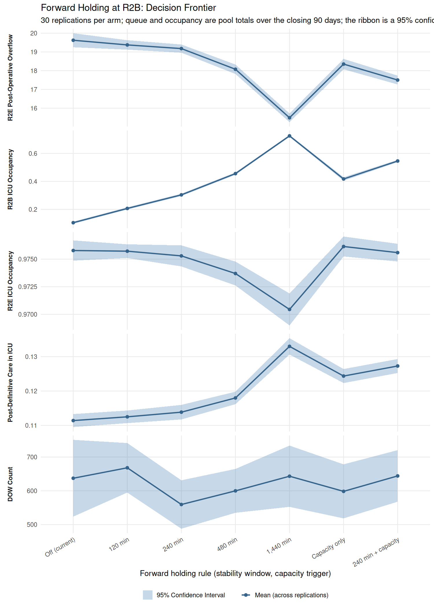

The panels of the figure above under the high-intensity profile.

The R2E post-operative overflow census was <!-- GEN cell:forward_hold_high|Off (current)|R2E post-operative overflow census|full -->19.62 [19.25, 20.00]<!-- /GEN --> with no forward holding and <!-- GEN cell:forward_hold_high|240 min|R2E post-operative overflow census|full -->19.18 [18.96, 19.40]<!-- /GEN --> with a 240-minute window. R2E intensive care utilisation was <!-- GEN cell:forward_hold_high|Off (current)|R2E ICU utilisation|full -->97.6%<!-- /GEN --> with no forward holding and <!-- GEN cell:forward_hold_high|1,440 min|R2E ICU utilisation|full -->97.0%<!-- /GEN --> at a 1,440-minute window, while R2B intensive care utilisation rose from <!-- GEN cell:forward_hold_high|Off (current)|R2B ICU utilisation|full -->10.5%<!-- /GEN --> to <!-- GEN cell:forward_hold_high|1,440 min|R2B ICU utilisation|full -->72.5%<!-- /GEN -->. Died of wounds per run was <!-- GEN cell:forward_hold_high|Off (current)|Died of wounds per run|full -->637.23 [523.53, 750.93]<!-- /GEN --> with no forward holding and <!-- GEN cell:forward_hold_high|Capacity only|Died of wounds per run|full -->598.37 [518.37, 678.37]<!-- /GEN --> on the capacity trigger alone.

### Post-Operative Intensive Care Gate

**Question.** What does the rationing rule that defers lower-priority surgery when intensive care is saturated change? `[default, gate on and off · 360 d · 30 replications · paired, closing 90 d]`

<!-- GEN icu_gate -->
| Measure | Without the rule | With the rule | Paired difference |
|---|---|---|---|
| R2E ICU utilisation (%) | 85.8 [85.2, 86.5] | 86.9 [86.1, 87.7] | +1.1 [+0.0, +2.1]† |
| Died of wounds per run | 21.67 [18.43, 24.90] | 21.67 [17.68, 25.65] | +0.00 [−4.74, +4.74] |
| Total casualties | 5,330.5 [5,255.4, 5,405.6] | 5,372.7 [5,298.5, 5,446.8] | +42.2 [−56.4, +140.8] |
<!-- /GEN -->

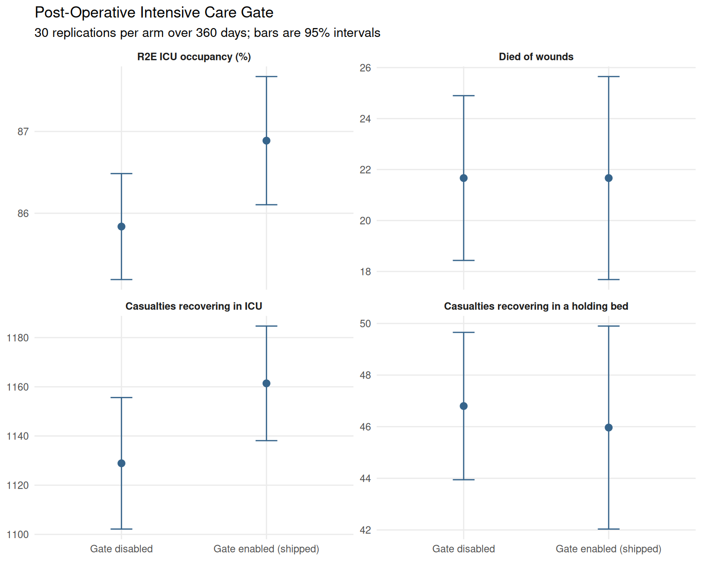

Intensive care occupancy, deaths of wounds and the casualties taking each post-operative pathway with the gate disabled and enabled, each point with its 95% confidence interval.

R2E intensive care utilisation was <!-- GEN cell:icu_gate|R2E ICU utilisation (%)|Without the rule|full -->85.8 [85.2, 86.5]<!-- /GEN --> without the rule and <!-- GEN cell:icu_gate|R2E ICU utilisation (%)|With the rule|full -->86.9 [86.1, 87.7]<!-- /GEN --> with it, a paired difference of <!-- GEN cell:icu_gate|R2E ICU utilisation (%)|Paired difference|full -->+1.1 [+0.0, +2.1]†<!-- /GEN --> percentage points. Died of wounds per run were <!-- GEN cell:icu_gate|Died of wounds per run|Without the rule|full -->21.67 [18.43, 24.90]<!-- /GEN --> and <!-- GEN cell:icu_gate|Died of wounds per run|With the rule|full -->21.67 [17.68, 25.65]<!-- /GEN -->, a paired difference of <!-- GEN cell:icu_gate|Died of wounds per run|Paired difference|full -->+0.00 [−4.74, +4.74]<!-- /GEN -->.

<!-- GEN icu_gate_pathways -->
| Recovery pathway | Casualty-replications | Died of wounds | Rate |
|---|---|---|---|
| Intensive care bed | 34,842 | 208 | 0.60% |
| Holding bed | 1,379 | 3 | 0.22% |
<!-- /GEN -->

Where the rule was in force, casualties recovering in a holding bed died of wounds at <!-- GEN cell:icu_gate_pathways|Holding bed|Rate|full -->0.22%<!-- /GEN --> and those recovering in an intensive care bed at <!-- GEN cell:icu_gate_pathways|Intensive care bed|Rate|full -->0.60%<!-- /GEN -->, pooled over the replications of that arm.

**High-intensity profile.** The same comparison under `high_intensity` `[high_intensity, gate disabled and enabled · 360 d · 30 replications · campaign totals, paired differences]`:

<!-- GEN icu_gate_high -->
| Measure | Without the rule | With the rule | Paired difference |
|---|---|---|---|
| R2E ICU utilisation (%) | 97.4 [97.3, 97.5] | 97.6 [97.5, 97.7] | +0.2 [+0.1, +0.3] |
| Died of wounds per run | 615.03 [483.82, 746.24] | 637.23 [523.53, 750.93] | +22.20 [−137.60, +182.00] |
| Total casualties | 12,579.6 [12,447.2, 12,711.9] | 12,543.4 [12,403.3, 12,683.6] | −36.1 [−215.7, +143.4] |
<!-- /GEN -->

<!-- GEN icu_gate_pathways_high -->
| Recovery pathway | Casualty-replications | Died of wounds | Rate |
|---|---|---|---|
| Intensive care bed | 106,039 | 8,582 | 8.09% |
| Holding bed | 343 | 7 | 2.04% |
<!-- /GEN -->

The paired difference in deaths of wounds per run with the rule in force was <!-- GEN cell:icu_gate_high|Died of wounds per run|Paired difference|full -->+22.20 [−137.60, +182.00]<!-- /GEN -->. Casualties recovering in a holding bed died of wounds at <!-- GEN cell:icu_gate_pathways_high|Holding bed|Rate|full -->2.04%<!-- /GEN --> and those recovering in an intensive care bed at <!-- GEN cell:icu_gate_pathways_high|Intensive care bed|Rate|full -->8.09%<!-- /GEN -->.

### Evacuation Policy

**Question.** What happens to returns to duty, mortality and the R2E pools when the days a casualty may recover in theatre before evacuation is set across its doctrinal range? `[default, evacuation policy 15 to 60 days · 360 d · 30 replications · pool totals, closing 90 d]`

<!-- GEN policy -->
| Response | 15 d | 21 d (shipped) | 30 d | 45 d | 60 d |
|---|---|---|---|---|---|
| R2E hold occupancy (%) | 96.4 [95.8, 96.9] | 99.4 [99.2, 99.5] | 99.9 [99.9, 99.9] | 100.0 [100.0, 100.0] | 100.0 [100.0, 100.0] |
| R2E hold mean queue | 9.41 [8.62, 10.19] | 23.05 [21.41, 24.69] | 39.74 [37.47, 42.02] | 80.59 [76.76, 84.42] | 138.65 [131.74, 145.55] |
| R2E ICU occupancy (%) | 86.9 [86.1, 87.6] | 86.9 [86.1, 87.7] | 86.1 [85.4, 86.8] | 86.3 [85.6, 86.9] | 86.5 [85.7, 87.4] |
| R2E post-operative overflow census | 4.92 [4.51, 5.33] | 5.57 [5.18, 5.96] | 5.45 [5.08, 5.82] | 5.88 [5.55, 6.21] | 6.18 [5.67, 6.68] |
| R2E staging overflow census | 28.4 [21.6, 35.2] | 33.7 [25.9, 41.6] | 26.9 [21.6, 32.1] | 22.3 [19.0, 25.6] | 18.7 [14.6, 22.8] |
| Post-definitive ICU access (%) | 35.4 [34.8, 35.9] | 35.2 [34.6, 35.8] | 35.6 [35.0, 36.2] | 35.7 [34.9, 36.4] | 35.6 [34.8, 36.4] |
| In-theatre share (%) | 27.3 [26.9, 27.7] | 39.9 [39.4, 40.3] | 48.4 [48.0, 48.8] | 59.2 [58.8, 59.6] | 70.6 [70.2, 71.0] |
| Returns to duty | 1574.4 [1547.4, 1601.4] | 2029.9 [2001.0, 2058.8] | 2329.2 [2297.6, 2360.8] | 2702.8 [2659.8, 2745.9] | 2993.6 [2944.4, 3042.8] |
| Died of wounds | 23.87 [19.85, 27.88] | 21.67 [17.68, 25.65] | 21.77 [19.77, 23.76] | 24.77 [16.46, 33.07] | 24.03 [19.72, 28.35] |
| Never evacuated by horizon | 41.9 [32.3, 51.4] | 34.7 [26.5, 42.9] | 21.5 [15.6, 27.4] | 17.7 [13.9, 21.6] | 19.1 [12.9, 25.2] |
| Mean evacuation wait (d) | 4.93 [4.55, 5.31] | 5.31 [4.89, 5.73] | 5.42 [4.82, 6.02] | 5.05 [4.44, 5.67] | 4.54 [4.20, 4.88] |
| Role 4 peak beds | 230.4 [224.4, 236.4] | 209.0 [205.4, 212.6] | 197.1 [193.0, 201.2] | 176.1 [171.5, 180.6] | 155.7 [149.9, 161.5] |
<!-- /GEN -->

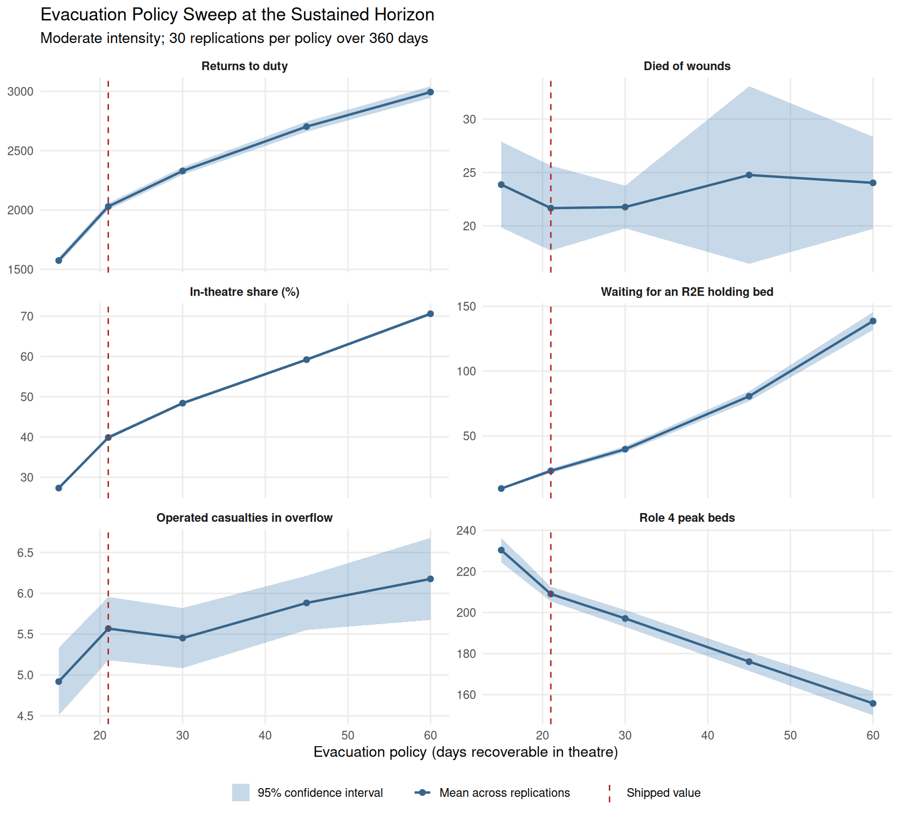

Six responses against the evacuation policy in days, each with its 95% confidence interval and the shipped policy marked by a dashed line.

At the shipped 21-day policy the R2E holding queue was <!-- GEN cell:policy|R2E hold mean queue|21 d (shipped)|full -->23.05 [21.41, 24.69]<!-- /GEN --> and its occupancy <!-- GEN cell:policy|R2E hold occupancy (%)|21 d (shipped)|full -->99.4 [99.2, 99.5]<!-- /GEN -->. At 30 days the holding occupancy was <!-- GEN cell:policy|R2E hold occupancy (%)|30 d|full -->99.9 [99.9, 99.9]<!-- /GEN --> and the queue <!-- GEN cell:policy|R2E hold mean queue|30 d|full -->39.74 [37.47, 42.02]<!-- /GEN -->; at 45 and 60 days the occupancy was <!-- GEN cell:policy|R2E hold occupancy (%)|45 d|full -->100.0 [100.0, 100.0]<!-- /GEN --> and <!-- GEN cell:policy|R2E hold occupancy (%)|60 d|full -->100.0 [100.0, 100.0]<!-- /GEN -->. Returns to duty per campaign were <!-- GEN cell:policy|Returns to duty|15 d|full -->1574.4 [1547.4, 1601.4]<!-- /GEN --> at 15 days, <!-- GEN cell:policy|Returns to duty|21 d (shipped)|full -->2029.9 [2001.0, 2058.8]<!-- /GEN --> at 21, <!-- GEN cell:policy|Returns to duty|30 d|full -->2329.2 [2297.6, 2360.8]<!-- /GEN --> at 30, <!-- GEN cell:policy|Returns to duty|45 d|full -->2702.8 [2659.8, 2745.9]<!-- /GEN --> at 45 and <!-- GEN cell:policy|Returns to duty|60 d|full -->2993.6 [2944.4, 3042.8]<!-- /GEN --> at 60. Died of wounds were <!-- GEN cell:policy|Died of wounds|15 d|full -->23.87 [19.85, 27.88]<!-- /GEN -->, <!-- GEN cell:policy|Died of wounds|21 d (shipped)|full -->21.67 [17.68, 25.65]<!-- /GEN -->, <!-- GEN cell:policy|Died of wounds|30 d|full -->21.77 [19.77, 23.76]<!-- /GEN -->, <!-- GEN cell:policy|Died of wounds|45 d|full -->24.77 [16.46, 33.07]<!-- /GEN --> and <!-- GEN cell:policy|Died of wounds|60 d|full -->24.03 [19.72, 28.35]<!-- /GEN --> across the five policies. The realised in-theatre share was <!-- GEN cell:policy|In-theatre share (%)|15 d|full -->27.3 [26.9, 27.7]<!-- /GEN -->, <!-- GEN cell:policy|In-theatre share (%)|21 d (shipped)|full -->39.9 [39.4, 40.3]<!-- /GEN -->, <!-- GEN cell:policy|In-theatre share (%)|30 d|full -->48.4 [48.0, 48.8]<!-- /GEN -->, <!-- GEN cell:policy|In-theatre share (%)|45 d|full -->59.2 [58.8, 59.6]<!-- /GEN --> and <!-- GEN cell:policy|In-theatre share (%)|60 d|full -->70.6 [70.2, 71.0]<!-- /GEN --> percent. Paired differences against the shipped policy are in `data/policy/policy_sweep_paired.csv`.

### R2E Holding Establishment

**Question.** What does enlarging the R2E holding establishment change at the shipped evacuation policy? `[default, 21-day policy, 30 to 90 holding beds · 360 d · 30 replications · pool totals, closing 90 d]`

<!-- GEN establishment -->
| Response | 30 beds (shipped) | 45 beds | 60 beds | 90 beds |
|---|---|---|---|---|
| R2E hold occupancy (%) | 99.4 [99.2, 99.5] | 97.1 [96.7, 97.6] | 94.4 [93.4, 95.4] | 84.4 [81.9, 86.8] |
| R2E hold mean queue | 23.05 [21.41, 24.69] | 16.94 [15.86, 18.02] | 14.55 [12.92, 16.19] | 6.55 [4.92, 8.18] |
| R2E post-operative overflow census | 5.57 [5.18, 5.96] | 4.42 [4.03, 4.81] | 4.42 [3.85, 5.00] | 2.18 [1.70, 2.67] |
| R2E staging overflow census | 33.7 [25.9, 41.6] | 22.3 [15.4, 29.2] | 28.1 [16.5, 39.8] | 13.3 [7.2, 19.5] |
| Post-definitive ICU access (%) | 35.2 [34.6, 35.8] | 35.3 [34.6, 35.9] | 34.8 [34.1, 35.5] | 35.1 [34.4, 35.7] |
| In-theatre share (%) | 39.9 [39.4, 40.3] | 39.9 [39.4, 40.5] | 39.8 [39.2, 40.4] | 40.2 [39.7, 40.7] |
| Returns to duty | 2029.9 [2001.0, 2058.8] | 2029.6 [2002.2, 2057.0] | 2038.6 [2008.2, 2069.0] | 2045.5 [2012.4, 2078.6] |
| Died of wounds | 21.7 [17.7, 25.6] | 20.5 [18.2, 22.8] | 23.3 [19.9, 26.7] | 20.4 [17.8, 23.0] |
| Never evacuated by horizon | 34.7 [26.5, 42.9] | 30.5 [21.2, 39.9] | 46.6 [28.1, 65.2] | 32.6 [24.8, 40.5] |
| Role 4 peak beds | 209.0 [205.4, 212.6] | 211.2 [207.0, 215.3] | 211.4 [206.3, 216.4] | 210.1 [206.0, 214.2] |
<!-- /GEN -->

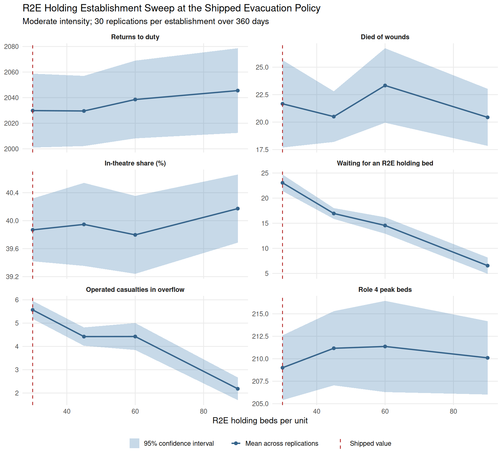

The same six responses against the R2E holding bed establishment at the shipped evacuation policy, with the shipped establishment marked by a dashed line.

Holding occupancy was <!-- GEN cell:establishment|R2E hold occupancy (%)|30 beds (shipped)|full -->99.4 [99.2, 99.5]<!-- /GEN --> at the shipped 30 beds, <!-- GEN cell:establishment|R2E hold occupancy (%)|45 beds|full -->97.1 [96.7, 97.6]<!-- /GEN --> at 45, <!-- GEN cell:establishment|R2E hold occupancy (%)|60 beds|full -->94.4 [93.4, 95.4]<!-- /GEN --> at 60 and <!-- GEN cell:establishment|R2E hold occupancy (%)|90 beds|full -->84.4 [81.9, 86.8]<!-- /GEN --> at 90 percent. The R2E holding queue was <!-- GEN cell:establishment|R2E hold mean queue|30 beds (shipped)|full -->23.05 [21.41, 24.69]<!-- /GEN --> at 30 beds and <!-- GEN cell:establishment|R2E hold mean queue|45 beds|full -->16.94 [15.86, 18.02]<!-- /GEN --> at 45. Returns to duty per campaign were <!-- GEN cell:establishment|Returns to duty|30 beds (shipped)|full -->2029.9 [2001.0, 2058.8]<!-- /GEN --> at 30 beds and <!-- GEN cell:establishment|Returns to duty|90 beds|full -->2045.5 [2012.4, 2078.6]<!-- /GEN --> at 90, and died of wounds <!-- GEN cell:establishment|Died of wounds|30 beds (shipped)|full -->21.7 [17.7, 25.6]<!-- /GEN --> and <!-- GEN cell:establishment|Died of wounds|90 beds|full -->20.4 [17.8, 23.0]<!-- /GEN -->.

### High-Intensity Evacuation Policy and Holding Establishment

**Question.** What happens to the R2E pools, returns to duty and mortality under the high-intensity profile when the evacuation policy and the R2E holding establishment are set across their ranges together? `[high_intensity, evacuation policy 15 to 60 days, 30 to 90 holding beds · 360 d · 30 replications · pool totals, closing 90 d]`

<!-- GEN policy_establishment_high -->
| Policy and holding beds | R2E hold mean queue | R2E post-operative overflow census | Returns to duty | Died of wounds | Never evacuated by horizon | Role 4 peak beds |
|---|---|---|---|---|---|---|
| 15 d, 30 beds | 28.1 [27.4, 28.9] | 19.4 [19.0, 19.7] | 3,568.2 [3,527.6, 3,608.7] | 696.4 [569.9, 822.8] | 3,103.3 [3,031.5, 3,175.2] | 288.1 [286.9, 289.3] |
| 15 d, 45 beds | 29.1 [28.1, 30.0] | 19.6 [19.4, 19.9] | 3,569.2 [3,529.5, 3,609.0] | 555.3 [481.2, 629.4] | 3,171.5 [3,116.2, 3,226.8] | 288.1 [286.6, 289.6] |
| 15 d, 60 beds | 29.3 [28.3, 30.3] | 19.5 [19.4, 19.7] | 3,569.7 [3,537.6, 3,601.8] | 528.4 [464.5, 592.3] | 3,175.5 [3,126.8, 3,224.2] | 287.8 [286.4, 289.1] |
| 15 d, 90 beds | 28.7 [27.9, 29.6] | 19.2 [18.9, 19.5] | 3,537.8 [3,504.4, 3,571.2] | 602.5 [485.9, 719.1] | 3,126.5 [3,060.0, 3,193.0] | 287.3 [285.9, 288.7] |
| 21 d, 30 beds | 54.4 [52.1, 56.6] | 19.6 [19.2, 20.0] | 4,254.5 [4,208.7, 4,300.3] | 637.2 [523.5, 750.9] | 2,973.3 [2,914.2, 3,032.4] | 281.7 [279.1, 284.3] |
| 21 d, 45 beds | 50.4 [48.8, 52.0] | 19.5 [19.3, 19.8] | 4,270.2 [4,220.1, 4,320.2] | 626.5 [547.3, 705.7] | 2,977.3 [2,921.6, 3,033.0] | 281.4 [279.1, 283.8] |
| 21 d, 60 beds | 51.4 [50.0, 52.9] | 19.5 [19.1, 19.9] | 4,279.2 [4,243.5, 4,314.9] | 602.2 [499.6, 704.7] | 2,997.2 [2,927.7, 3,066.7] | 281.2 [278.5, 283.8] |
| 21 d, 90 beds | 51.6 [49.9, 53.2] | 19.4 [19.1, 19.7] | 4,256.4 [4,207.4, 4,305.3] | 680.0 [547.4, 812.6] | 2,948.7 [2,873.0, 3,024.4] | 281.7 [279.7, 283.7] |
| 30 d, 30 beds | 94.3 [91.7, 96.9] | 19.9 [19.6, 20.2] | 4,743.2 [4,697.7, 4,788.8] | 556.7 [472.7, 640.8] | 2,896.0 [2,838.8, 2,953.1] | 262.3 [260.2, 264.4] |
| 30 d, 45 beds | 80.3 [78.4, 82.3] | 19.8 [19.5, 20.1] | 4,728.7 [4,684.0, 4,773.4] | 598.7 [493.9, 703.4] | 2,894.6 [2,833.9, 2,955.3] | 261.4 [259.1, 263.6] |
| 30 d, 60 beds | 72.7 [70.8, 74.6] | 19.6 [19.3, 19.9] | 4,736.7 [4,699.0, 4,774.4] | 640.2 [542.3, 738.1] | 2,883.4 [2,837.7, 2,929.1] | 263.1 [260.9, 265.3] |
| 30 d, 90 beds | 72.8 [70.8, 74.8] | 19.6 [19.4, 19.9] | 4,735.9 [4,692.4, 4,779.3] | 577.2 [491.1, 663.3] | 2,905.9 [2,857.5, 2,954.2] | 261.8 [259.5, 264.2] |
| 45 d, 30 beds | 190.2 [185.8, 194.6] | 19.8 [19.5, 20.1] | 5,323.3 [5,266.5, 5,380.1] | 678.9 [552.9, 804.9] | 2,572.8 [2,498.4, 2,647.2] | 224.3 [222.2, 226.4] |
| 45 d, 45 beds | 173.5 [169.7, 177.2] | 19.5 [19.2, 19.8] | 5,356.4 [5,314.5, 5,398.2] | 761.7 [632.9, 890.5] | 2,582.4 [2,501.0, 2,663.8] | 226.7 [224.7, 228.7] |
| 45 d, 60 beds | 164.0 [161.1, 166.9] | 19.8 [19.5, 20.1] | 5,375.2 [5,327.8, 5,422.6] | 640.0 [516.9, 763.1] | 2,617.9 [2,548.8, 2,687.0] | 225.7 [224.1, 227.3] |
| 45 d, 90 beds | 131.0 [127.4, 134.6] | 19.5 [19.1, 19.9] | 5,314.8 [5,272.5, 5,357.0] | 721.7 [586.7, 856.6] | 2,568.6 [2,494.5, 2,642.7] | 226.1 [224.5, 227.8] |
| 60 d, 30 beds | 326.0 [318.7, 333.2] | 19.6 [19.3, 19.9] | 5,840.0 [5,790.8, 5,889.2] | 709.4 [620.8, 797.9] | 2,188.4 [2,134.9, 2,241.9] | 196.5 [195.3, 197.7] |
| 60 d, 45 beds | 310.1 [303.7, 316.5] | 19.4 [19.1, 19.7] | 5,841.8 [5,805.0, 5,878.6] | 766.0 [667.2, 864.7] | 2,178.8 [2,128.3, 2,229.3] | 196.4 [194.7, 198.0] |
| 60 d, 60 beds | 297.9 [291.5, 304.2] | 19.7 [19.5, 20.0] | 5,871.9 [5,827.3, 5,916.5] | 643.4 [543.6, 743.2] | 2,233.8 [2,176.9, 2,290.7] | 195.8 [194.5, 197.1] |
| 60 d, 90 beds | 263.4 [257.4, 269.4] | 19.6 [19.3, 19.9] | 5,819.1 [5,784.8, 5,853.4] | 720.4 [601.8, 839.0] | 2,195.5 [2,131.8, 2,259.2] | 194.6 [193.4, 195.7] |
<!-- /GEN -->

At the shipped 21-day policy and 30 holding beds the closing-window R2E holding queue was <!-- GEN cell:policy_establishment_high|21 d, 30 beds|R2E hold mean queue|full -->54.4 [52.1, 56.6]<!-- /GEN --> casualties and the post-operative overflow census <!-- GEN cell:policy_establishment_high|21 d, 30 beds|R2E post-operative overflow census|full -->19.6 [19.2, 20.0]<!-- /GEN -->. The holding queue was <!-- GEN cell:policy_establishment_high|15 d, 30 beds|R2E hold mean queue|full -->28.1 [27.4, 28.9]<!-- /GEN --> at 15 days and 30 beds and <!-- GEN cell:policy_establishment_high|60 d, 30 beds|R2E hold mean queue|full -->326.0 [318.7, 333.2]<!-- /GEN --> at 60 days and 30 beds, and <!-- GEN cell:policy_establishment_high|60 d, 90 beds|R2E hold mean queue|full -->263.4 [257.4, 269.4]<!-- /GEN --> at 60 days and 90 beds. The post-operative overflow census lay between <!-- GEN cell:policy_establishment_high|60 d, 60 beds|R2E post-operative overflow census|full -->19.7 [19.5, 20.0]<!-- /GEN --> at 60 days and 60 beds and <!-- GEN cell:policy_establishment_high|21 d, 30 beds|R2E post-operative overflow census|full -->19.6 [19.2, 20.0]<!-- /GEN --> at the shipped setting.

<!-- GEN policy_establishment_high_stability -->
| Policy and holding beds | Holding queue not growing | Post-operative overflow not growing | Both not growing | Staging overflow not growing | R2E pools across the cell |
|---|---|---|---|---|---|
| 15 d, 30 beds | 28 of 30 | 29 of 30 | 27 of 30 | 1 of 30 | at least one growing |
| 15 d, 45 beds | 30 of 30 | 29 of 30 | 29 of 30 | 0 of 30 | at least one growing |
| 15 d, 60 beds | 28 of 30 | 30 of 30 | 28 of 30 | 0 of 30 | at least one growing |
| 15 d, 90 beds | 28 of 30 | 28 of 30 | 26 of 30 | 0 of 30 | at least one growing |
| 21 d, 30 beds | 28 of 30 | 29 of 30 | 27 of 30 | 2 of 30 | at least one growing |
| 21 d, 45 beds | 27 of 30 | 30 of 30 | 27 of 30 | 0 of 30 | at least one growing |
| 21 d, 60 beds | 28 of 30 | 30 of 30 | 28 of 30 | 1 of 30 | at least one growing |
| 21 d, 90 beds | 28 of 30 | 28 of 30 | 27 of 30 | 1 of 30 | at least one growing |
| 30 d, 30 beds | 30 of 30 | 30 of 30 | 30 of 30 | 0 of 30 | at least one growing |
| 30 d, 45 beds | 30 of 30 | 29 of 30 | 29 of 30 | 1 of 30 | at least one growing |
| 30 d, 60 beds | 28 of 30 | 30 of 30 | 28 of 30 | 1 of 30 | at least one growing |
| 30 d, 90 beds | 30 of 30 | 27 of 30 | 27 of 30 | 0 of 30 | at least one growing |
| 45 d, 30 beds | 27 of 30 | 30 of 30 | 27 of 30 | 0 of 30 | at least one growing |
| 45 d, 45 beds | 29 of 30 | 30 of 30 | 29 of 30 | 2 of 30 | at least one growing |
| 45 d, 60 beds | 29 of 30 | 28 of 30 | 27 of 30 | 2 of 30 | at least one growing |
| 45 d, 90 beds | 29 of 30 | 30 of 30 | 29 of 30 | 1 of 30 | at least one growing |
| 60 d, 30 beds | 30 of 30 | 29 of 30 | 29 of 30 | 1 of 30 | at least one growing |
| 60 d, 45 beds | 28 of 30 | 30 of 30 | 28 of 30 | 0 of 30 | at least one growing |
| 60 d, 60 beds | 27 of 30 | 30 of 30 | 27 of 30 | 0 of 30 | at least one growing |
| 60 d, 90 beds | 28 of 30 | 29 of 30 | 28 of 30 | 1 of 30 | at least one growing |
<!-- /GEN -->

The table counts, for each cell, the replications in which each R2E pool was not still rising over the late half of the campaign, and classifies the cell as a whole: a pool is growing across the cell where the mean of its replications' late-half slopes is positive with a 95% interval excluding zero and a drift of at least one percent of its level per 30-day block, the rule of [Classifying Stability](Methods.md#classifying-stability), and the cell holds where no pool is growing. The staging overflow census was not growing in <!-- GEN cell:policy_establishment_high_stability|21 d, 30 beds|Staging overflow not growing|full -->2 of 30<!-- /GEN --> replications at the shipped cell and in <!-- GEN cell:policy_establishment_high_stability|60 d, 90 beds|Staging overflow not growing|full -->1 of 30<!-- /GEN --> at 60 days and 90 beds, and the shipped cell was classified <!-- GEN cell:policy_establishment_high_stability|21 d, 30 beds|R2E pools across the cell|full -->at least one growing<!-- /GEN -->.

<!-- GEN policy_establishment_high_paired -->
| Policy and holding beds | Returns to duty | Died of wounds | Role 4 peak beds |
|---|---|---|---|
| 15 d, 30 beds | −686.3 [−749.3, −623.3] | +59.1 [−106.4, +224.7] | +6.4 [+4.0, +8.8] |
| 15 d, 45 beds | −685.3 [−739.4, −631.1] | −82.0 [−217.0, +53.1] | +6.4 [+4.1, +8.7] |
| 15 d, 60 beds | −684.8 [−734.6, −635.0] | −108.8 [−231.4, +13.8] | +6.1 [+3.1, +9.1] |
| 15 d, 90 beds | −716.7 [−772.7, −660.8] | −34.7 [−213.1, +143.6] | +5.6 [+3.2, +8.0] |
| 21 d, 45 beds | +15.7 [−60.5, +91.9] | −10.7 [−133.1, +111.7] | −0.3 [−3.4, +2.9] |
| 21 d, 60 beds | +24.7 [−29.3, +78.7] | −35.1 [−194.5, +124.4] | −0.5 [−4.5, +3.4] |
| 21 d, 90 beds | +1.9 [−61.4, +65.1] | +42.8 [−134.0, +219.6] | +0.0 [−3.5, +3.5] |
| 30 d, 30 beds | +488.7 [+433.1, +544.4] | −80.5 [−221.7, +60.7] | −19.4 [−22.4, −16.5] |
| 30 d, 45 beds | +474.2 [+407.5, +540.8] | −38.6 [−193.9, +116.8] | −20.3 [−23.9, −16.8] |
| 30 d, 60 beds | +482.2 [+427.7, +536.7] | +3.0 [−154.8, +160.8] | −18.6 [−22.1, −15.2] |
| 30 d, 90 beds | +481.4 [+413.3, +549.4] | −60.0 [−207.7, +87.7] | −19.9 [−23.0, −16.7] |
| 45 d, 30 beds | +1,068.8 [+995.4, +1,142.2] | +41.7 [−148.9, +232.3] | −57.4 [−61.2, −53.7] |
| 45 d, 45 beds | +1,101.9 [+1,034.0, +1,169.8] | +124.5 [−65.1, +314.1] | −55.0 [−58.7, −51.3] |
| 45 d, 60 beds | +1,120.7 [+1,062.3, +1,179.0] | +2.8 [−156.9, +162.4] | −56.0 [−58.8, −53.1] |
| 45 d, 90 beds | +1,060.3 [+994.8, +1,125.7] | +84.4 [−68.9, +237.8] | −55.6 [−58.7, −52.4] |
| 60 d, 30 beds | +1,585.5 [+1,522.6, +1,648.5] | +72.1 [−88.1, +232.3] | −85.2 [−87.6, −82.9] |
| 60 d, 45 beds | +1,587.3 [+1,533.9, +1,640.7] | +128.7 [−29.1, +286.5] | −85.3 [−88.5, −82.1] |
| 60 d, 60 beds | +1,617.4 [+1,553.4, +1,681.4] | +6.1 [−145.8, +158.0] | −85.9 [−89.0, −82.8] |
| 60 d, 90 beds | +1,564.6 [+1,514.5, +1,614.7] | +83.2 [−103.2, +269.6] | −87.1 [−90.0, −84.3] |
<!-- /GEN -->

Each cell was paired by replication against the shipped 21-day policy at 30 holding beds. At 30 days and 90 beds returns to duty differed by <!-- GEN cell:policy_establishment_high_paired|30 d, 90 beds|Returns to duty|full -->+481.4 [+413.3, +549.4]<!-- /GEN --> and Role 4 peak beds by <!-- GEN cell:policy_establishment_high_paired|30 d, 90 beds|Role 4 peak beds|full -->−19.9 [−23.0, −16.7]<!-- /GEN -->.

For each holding establishment the largest policy at which the cell held the R2E pools, by the rule of the preceding table, is given below; where none did, the cell reads as such.

<!-- GEN policy_grid_largest_high -->
| Holding beds | Largest policy holding the R2E pools | Returns to duty there | Paired gain over 21 d and 30 beds | Gain of the added beds at that policy |
|---|---|---|---|---|
| 30 | none in the grid | not applicable | not applicable | not applicable |
| 45 | none in the grid | not applicable | not applicable | not applicable |
| 60 | none in the grid | not applicable | not applicable | not applicable |
| 90 | none in the grid | not applicable | not applicable | not applicable |
<!-- /GEN -->

### High-Intensity Strategic Sortie Interval by Policy and Holding Establishment

**Question.** Does a shorter interval between strategic sorties, together with a longer evacuation policy or more R2E holding beds, keep the R2E pools below the collapse threshold under the high-intensity profile? `[high_intensity, sortie interval 3 to 7 days, evacuation policy 21 and 30 days, 30 and 60 holding beds · 360 d · 30 replications · pool totals, closing 90 d]`

<!-- GEN interval_grid_high -->
| Interval, policy and holding beds | R2E hold mean queue | R2E post-operative overflow census | Pools |
|---|---|---|---|
| 3 d interval, 21 d policy, 30 beds | 51.9 [50.7, 53.2] | 19.6 [19.4, 19.9] | at least one growing |
| 3 d interval, 21 d policy, 60 beds | 43.3 [42.3, 44.3] | 19.3 [19.0, 19.5] | at least one growing |
| 3 d interval, 30 d policy, 30 beds | 90.4 [87.8, 93.1] | 19.6 [19.2, 19.9] | at least one growing |
| 3 d interval, 30 d policy, 60 beds | 66.8 [64.8, 68.9] | 19.5 [19.2, 19.8] | at least one growing |
| 5 d interval, 21 d policy, 30 beds | 54.0 [52.1, 55.9] | 19.7 [19.4, 20.0] | at least one growing |
| 5 d interval, 21 d policy, 60 beds | 49.7 [48.1, 51.3] | 19.4 [19.1, 19.6] | at least one growing |
| 5 d interval, 30 d policy, 30 beds | 93.9 [91.3, 96.6] | 20.0 [19.7, 20.2] | at least one growing |
| 5 d interval, 30 d policy, 60 beds | 73.2 [70.7, 75.7] | 19.7 [19.4, 20.0] | at least one growing |
| 7 d interval, 21 d policy, 30 beds | 54.4 [52.1, 56.6] | 19.6 [19.2, 20.0] | at least one growing |
| 7 d interval, 21 d policy, 60 beds | 51.4 [50.0, 52.9] | 19.5 [19.1, 19.9] | at least one growing |
| 7 d interval, 30 d policy, 30 beds | 94.3 [91.7, 96.9] | 19.9 [19.6, 20.2] | at least one growing |
| 7 d interval, 30 d policy, 60 beds | 72.7 [70.8, 74.6] | 19.6 [19.3, 19.9] | at least one growing |
<!-- /GEN -->

The last column classifies each cell by the rule of the preceding grid. At the shipped cell, the seven-day interval with the 21-day policy and 30 beds, the closing-window R2E holding queue was <!-- GEN cell:interval_grid_high|7 d interval, 21 d policy, 30 beds|R2E hold mean queue|full -->54.4 [52.1, 56.6]<!-- /GEN --> casualties and the post-operative overflow census <!-- GEN cell:interval_grid_high|7 d interval, 21 d policy, 30 beds|R2E post-operative overflow census|full -->19.6 [19.2, 20.0]<!-- /GEN -->. At the three-day interval with the same policy and establishment they were <!-- GEN cell:interval_grid_high|3 d interval, 21 d policy, 30 beds|R2E hold mean queue|full -->51.9 [50.7, 53.2]<!-- /GEN --> and <!-- GEN cell:interval_grid_high|3 d interval, 21 d policy, 30 beds|R2E post-operative overflow census|full -->19.6 [19.4, 19.9]<!-- /GEN -->, and with 60 beds <!-- GEN cell:interval_grid_high|3 d interval, 21 d policy, 60 beds|R2E hold mean queue|full -->43.3 [42.3, 44.3]<!-- /GEN --> and <!-- GEN cell:interval_grid_high|3 d interval, 21 d policy, 60 beds|R2E post-operative overflow census|full -->19.3 [19.0, 19.5]<!-- /GEN -->. The three-day, 21-day, 60-bed cell was classified <!-- GEN cell:interval_grid_high|3 d interval, 21 d policy, 60 beds|Pools|full -->at least one growing<!-- /GEN -->, as was the three-day, 30-day, 60-bed cell (<!-- GEN cell:interval_grid_high|3 d interval, 30 d policy, 60 beds|Pools|full -->at least one growing<!-- /GEN -->).

<!-- GEN interval_grid_high_wait -->
| Interval, policy and holding beds | Mean wait, critical channel (days) | Mean wait, standard channel (days) | Still waiting, critical channel | Still waiting, standard channel |
|---|---|---|---|---|
| 3 d interval, 21 d policy, 30 beds | 18.79 [17.22, 20.37] | 1.50 [1.49, 1.51] | 448.7 [408.5, 488.9] | 18.3 [16.6, 20.0] |
| 3 d interval, 21 d policy, 60 beds | 20.21 [18.91, 21.51] | 1.50 [1.49, 1.50] | 500.6 [472.7, 528.5] | 16.8 [14.9, 18.7] |
| 3 d interval, 30 d policy, 30 beds | 18.48 [16.63, 20.32] | 1.50 [1.49, 1.51] | 435.6 [374.7, 496.4] | 13.6 [12.4, 14.9] |
| 3 d interval, 30 d policy, 60 beds | 16.79 [15.32, 18.26] | 1.51 [1.50, 1.52] | 401.7 [355.6, 447.9] | 13.8 [12.0, 15.6] |
| 5 d interval, 21 d policy, 30 beds | 65.26 [64.28, 66.23] | 2.49 [2.48, 2.50] | 1,180.2 [1,139.3, 1,221.1] | 29.6 [27.2, 32.0] |
| 5 d interval, 21 d policy, 60 beds | 64.85 [64.01, 65.69] | 2.50 [2.48, 2.51] | 1,176.1 [1,143.6, 1,208.7] | 29.9 [27.1, 32.7] |
| 5 d interval, 30 d policy, 30 beds | 64.94 [64.03, 65.85] | 2.50 [2.48, 2.52] | 1,200.6 [1,167.5, 1,233.7] | 22.8 [21.0, 24.7] |
| 5 d interval, 30 d policy, 60 beds | 65.07 [64.25, 65.89] | 2.50 [2.48, 2.51] | 1,165.4 [1,130.3, 1,200.4] | 23.2 [20.5, 25.8] |
| 7 d interval, 21 d policy, 30 beds | 88.57 [87.38, 89.76] | 3.58 [3.54, 3.61] | 1,477.8 [1,439.7, 1,516.0] | 19.6 [17.0, 22.2] |
| 7 d interval, 21 d policy, 60 beds | 88.97 [87.89, 90.05] | 3.54 [3.52, 3.57] | 1,490.8 [1,440.0, 1,541.6] | 17.9 [15.8, 20.0] |
| 7 d interval, 30 d policy, 30 beds | 87.94 [86.76, 89.13] | 3.51 [3.49, 3.53] | 1,482.6 [1,443.8, 1,521.4] | 14.7 [13.0, 16.4] |
| 7 d interval, 30 d policy, 60 beds | 88.54 [87.36, 89.72] | 3.52 [3.50, 3.55] | 1,471.7 [1,434.8, 1,508.6] | 16.4 [14.5, 18.3] |
<!-- /GEN -->

The mean wait is reported separately for the casualties who boarded on the critical (intensive care) channel and on the standard channel, with the casualties of each channel decided for evacuation who were still waiting at the close, having neither boarded, died while waiting nor returned to duty. At the three-day interval with the 21-day policy and 30 beds the mean wait was <!-- GEN cell:interval_grid_high_wait|3 d interval, 21 d policy, 30 beds|Mean wait, critical channel (days)|full -->18.79 [17.22, 20.37]<!-- /GEN --> days on the critical channel against <!-- GEN cell:interval_grid_high_wait|3 d interval, 21 d policy, 30 beds|Mean wait, standard channel (days)|full -->1.50 [1.49, 1.51]<!-- /GEN --> days on the standard channel, and <!-- GEN cell:interval_grid_high_wait|3 d interval, 21 d policy, 30 beds|Still waiting, critical channel|full -->448.7 [408.5, 488.9]<!-- /GEN --> casualties were still waiting on the critical channel at the close against <!-- GEN cell:interval_grid_high_wait|3 d interval, 21 d policy, 30 beds|Still waiting, standard channel|full -->18.3 [16.6, 20.0]<!-- /GEN --> on the standard channel. At the shipped seven-day interval the standard channel waited <!-- GEN cell:interval_grid_high_wait|7 d interval, 21 d policy, 30 beds|Mean wait, standard channel (days)|full -->3.58 [3.54, 3.61]<!-- /GEN --> days.

<!-- GEN interval_grid_high_outcomes -->
| Interval, policy and holding beds | Returns to duty | Died of wounds | Role 4 peak beds | Role 4 closing mean beds |
|---|---|---|---|---|
| 3 d interval, 21 d policy, 30 beds | 2,883.0 [2,850.5, 2,915.5] | 536.8 [451.3, 622.3] | 465.9 [462.8, 468.9] | 327.0 [325.0, 329.1] |
| 3 d interval, 21 d policy, 60 beds | 2,866.1 [2,833.1, 2,899.2] | 460.7 [387.2, 534.3] | 463.7 [460.7, 466.6] | 327.6 [325.9, 329.3] |
| 3 d interval, 30 d policy, 30 beds | 3,444.3 [3,413.8, 3,474.8] | 547.4 [434.6, 660.1] | 447.1 [445.0, 449.2] | 316.9 [314.6, 319.1] |
| 3 d interval, 30 d policy, 60 beds | 3,446.3 [3,414.7, 3,477.9] | 593.9 [485.6, 702.2] | 448.0 [445.3, 450.7] | 316.6 [313.9, 319.4] |
| 5 d interval, 21 d policy, 30 beds | 3,862.4 [3,822.9, 3,901.9] | 624.5 [515.5, 733.5] | 337.6 [335.2, 339.9] | 219.6 [218.1, 221.2] |
| 5 d interval, 21 d policy, 60 beds | 3,861.1 [3,820.0, 3,902.2] | 580.9 [493.0, 668.8] | 334.4 [332.1, 336.7] | 221.1 [219.3, 222.9] |
| 5 d interval, 30 d policy, 30 beds | 4,361.6 [4,323.0, 4,400.3] | 527.9 [464.6, 591.3] | 315.2 [312.5, 317.8] | 209.4 [207.4, 211.4] |
| 5 d interval, 30 d policy, 60 beds | 4,369.7 [4,332.6, 4,406.7] | 617.4 [529.8, 705.0] | 314.2 [311.8, 316.6] | 209.4 [207.3, 211.5] |
| 7 d interval, 21 d policy, 30 beds | 4,254.5 [4,208.7, 4,300.3] | 637.2 [523.5, 750.9] | 281.7 [279.1, 284.3] | 175.3 [173.4, 177.2] |
| 7 d interval, 21 d policy, 60 beds | 4,279.2 [4,243.5, 4,314.9] | 602.2 [499.6, 704.7] | 281.2 [278.5, 283.8] | 174.9 [172.9, 176.9] |
| 7 d interval, 30 d policy, 30 beds | 4,743.2 [4,697.7, 4,788.8] | 556.7 [472.7, 640.8] | 262.3 [260.2, 264.4] | 166.2 [164.7, 167.6] |
| 7 d interval, 30 d policy, 60 beds | 4,736.7 [4,699.0, 4,774.4] | 640.2 [542.3, 738.1] | 263.1 [260.9, 265.3] | 164.2 [162.8, 165.6] |
<!-- /GEN -->

Returns to duty per campaign were <!-- GEN cell:interval_grid_high_outcomes|7 d interval, 21 d policy, 30 beds|Returns to duty|full -->4,254.5 [4,208.7, 4,300.3]<!-- /GEN --> at the shipped cell and <!-- GEN cell:interval_grid_high_outcomes|3 d interval, 30 d policy, 60 beds|Returns to duty|full -->3,446.3 [3,414.7, 3,477.9]<!-- /GEN --> at the three-day interval with the 30-day policy and 60 beds, where the Role 4 peak was <!-- GEN cell:interval_grid_high_outcomes|3 d interval, 30 d policy, 60 beds|Role 4 peak beds|full -->448.0 [445.3, 450.7]<!-- /GEN --> beds.

<!-- GEN interval_grid_high_paired -->
| Interval, policy and holding beds | Returns to duty | Died of wounds | Role 4 peak beds |
|---|---|---|---|
| 3 d interval, 21 d policy, 30 beds | −1,371.5 [−1,431.6, −1,311.3] | −100.4 [−231.5, +30.7] | +184.2 [+180.2, +188.1] |
| 3 d interval, 21 d policy, 60 beds | −1,388.4 [−1,446.4, −1,330.3] | −176.5 [−320.5, −32.5]† | +182.0 [+178.0, +185.9] |
| 3 d interval, 30 d policy, 30 beds | −810.2 [−870.4, −750.0] | −89.9 [−253.0, +73.3] | +165.4 [+161.8, +169.0] |
| 3 d interval, 30 d policy, 60 beds | −808.2 [−856.1, −760.2] | −43.3 [−210.6, +124.0] | +166.3 [+161.8, +170.8] |
| 5 d interval, 21 d policy, 30 beds | −392.1 [−454.0, −330.3] | −12.7 [−168.1, +142.6] | +55.9 [+52.2, +59.6] |
| 5 d interval, 21 d policy, 60 beds | −393.4 [−447.2, −339.5] | −56.3 [−195.0, +82.4] | +52.7 [+49.5, +55.8] |
| 5 d interval, 30 d policy, 30 beds | +107.1 [+52.2, +162.1] | −109.3 [−251.0, +32.4] | +33.5 [+29.5, +37.5] |
| 5 d interval, 30 d policy, 60 beds | +115.2 [+60.9, +169.5] | −19.8 [−157.3, +117.6] | +32.5 [+29.2, +35.8] |
| 7 d interval, 21 d policy, 60 beds | +24.7 [−29.3, +78.7] | −35.1 [−194.5, +124.4] | −0.5 [−4.5, +3.4] |
| 7 d interval, 30 d policy, 30 beds | +488.7 [+433.1, +544.4] | −80.5 [−221.7, +60.7] | −19.4 [−22.4, −16.5] |
| 7 d interval, 30 d policy, 60 beds | +482.2 [+427.7, +536.7] | +3.0 [−154.8, +160.8] | −18.6 [−22.1, −15.2] |
<!-- /GEN -->

Each cell was paired by replication against the shipped cell. At the three-day interval with the 30-day policy and 60 beds returns to duty differed by <!-- GEN cell:interval_grid_high_paired|3 d interval, 30 d policy, 60 beds|Returns to duty|full -->−808.2 [−856.1, −760.2]<!-- /GEN --> and died of wounds by <!-- GEN cell:interval_grid_high_paired|3 d interval, 30 d policy, 60 beds|Died of wounds|full -->−43.3 [−210.6, +124.0]<!-- /GEN -->; at the three-day interval with the 21-day policy and 30 beds returns to duty differed by <!-- GEN cell:interval_grid_high_paired|3 d interval, 21 d policy, 30 beds|Returns to duty|full -->−1,371.5 [−1,431.6, −1,311.3]<!-- /GEN --> and the Role 4 peak by <!-- GEN cell:interval_grid_high_paired|3 d interval, 21 d policy, 30 beds|Role 4 peak beds|full -->+184.2 [+180.2, +188.1]<!-- /GEN -->.

### Moderate-Intensity Evacuation Policy and Holding Establishment

**Question.** What happens to the R2E pools, returns to duty and mortality under the shipped configuration when the evacuation policy is set across the 21 to 30 day gap and the R2E holding establishment across 30 to 60 beds together? `[default, evacuation policy 21 to 30 days, 30 to 60 holding beds · 360 d · 30 replications · pool totals, closing 90 d]`

<!-- GEN policy_establishment_moderate -->
| Policy and holding beds | R2E hold mean queue | R2E post-operative overflow census | Returns to duty | Died of wounds | Never evacuated by horizon | Role 4 peak beds |
|---|---|---|---|---|---|---|
| 21 d, 30 beds | 23.1 [21.4, 24.7] | 5.6 [5.2, 6.0] | 2,029.9 [2,001.0, 2,058.8] | 21.7 [17.7, 25.6] | 34.7 [26.5, 42.9] | 209.0 [205.4, 212.6] |
| 21 d, 45 beds | 16.9 [15.9, 18.0] | 4.4 [4.0, 4.8] | 2,029.6 [2,002.2, 2,057.0] | 20.5 [18.2, 22.8] | 30.5 [21.2, 39.9] | 211.2 [207.0, 215.3] |
| 21 d, 60 beds | 14.6 [12.9, 16.2] | 4.4 [3.8, 5.0] | 2,038.6 [2,008.2, 2,069.0] | 23.3 [19.9, 26.7] | 46.6 [28.1, 65.2] | 211.4 [206.3, 216.4] |
| 24 d, 30 beds | 32.5 [30.4, 34.6] | 6.0 [5.8, 6.3] | 2,193.1 [2,163.7, 2,222.5] | 20.6 [18.0, 23.1] | 38.2 [28.4, 48.1] | 201.5 [197.0, 206.0] |
| 24 d, 45 beds | 23.2 [21.4, 24.9] | 5.2 [4.7, 5.6] | 2,230.5 [2,187.9, 2,273.0] | 27.2 [20.0, 34.5] | 44.3 [26.5, 62.1] | 210.8 [206.3, 215.3] |
| 24 d, 60 beds | 18.2 [16.6, 19.9] | 4.3 [3.7, 4.8] | 2,200.9 [2,169.9, 2,231.9] | 25.3 [16.4, 34.2] | 36.8 [25.7, 47.9] | 204.3 [199.2, 209.3] |
| 27 d, 30 beds | 37.2 [35.0, 39.3] | 5.8 [5.4, 6.3] | 2,288.4 [2,259.8, 2,317.0] | 22.5 [19.3, 25.6] | 35.0 [24.9, 45.2] | 200.2 [195.7, 204.7] |
| 27 d, 45 beds | 26.9 [25.4, 28.5] | 4.9 [4.6, 5.2] | 2,252.2 [2,215.0, 2,289.4] | 23.5 [17.6, 29.4] | 27.0 [19.6, 34.3] | 201.7 [196.6, 206.7] |
| 27 d, 60 beds | 20.1 [18.4, 21.9] | 4.2 [3.7, 4.7] | 2,271.7 [2,241.3, 2,302.1] | 22.7 [19.2, 26.2] | 28.2 [18.2, 38.2] | 201.0 [196.5, 205.4] |
| 30 d, 30 beds | 39.7 [37.5, 42.0] | 5.5 [5.1, 5.8] | 2,329.2 [2,297.6, 2,360.8] | 21.8 [19.8, 23.8] | 21.5 [15.6, 27.4] | 197.1 [193.0, 201.2] |
| 30 d, 45 beds | 30.8 [28.6, 33.0] | 5.6 [5.2, 6.1] | 2,324.1 [2,288.3, 2,359.9] | 21.8 [18.2, 25.4] | 31.8 [23.2, 40.4] | 196.4 [192.6, 200.3] |
| 30 d, 60 beds | 24.3 [22.3, 26.3] | 4.6 [4.2, 5.0] | 2,336.1 [2,304.8, 2,367.3] | 20.6 [17.7, 23.5] | 28.5 [18.6, 38.4] | 196.6 [192.2, 201.0] |
<!-- /GEN -->

At the shipped 21-day policy and 30 holding beds the closing-window R2E holding queue was <!-- GEN cell:policy_establishment_moderate|21 d, 30 beds|R2E hold mean queue|full -->23.1 [21.4, 24.7]<!-- /GEN --> casualties and the post-operative overflow census <!-- GEN cell:policy_establishment_moderate|21 d, 30 beds|R2E post-operative overflow census|full -->5.6 [5.2, 6.0]<!-- /GEN -->. At 30 days and 30 beds they were <!-- GEN cell:policy_establishment_moderate|30 d, 30 beds|R2E hold mean queue|full -->39.7 [37.5, 42.0]<!-- /GEN --> and <!-- GEN cell:policy_establishment_moderate|30 d, 30 beds|R2E post-operative overflow census|full -->5.5 [5.1, 5.8]<!-- /GEN -->, and at 30 days and 60 beds <!-- GEN cell:policy_establishment_moderate|30 d, 60 beds|R2E hold mean queue|full -->24.3 [22.3, 26.3]<!-- /GEN --> and <!-- GEN cell:policy_establishment_moderate|30 d, 60 beds|R2E post-operative overflow census|full -->4.6 [4.2, 5.0]<!-- /GEN -->. Returns to duty per campaign rose from <!-- GEN cell:policy_establishment_moderate|21 d, 30 beds|Returns to duty|full -->2,029.9 [2,001.0, 2,058.8]<!-- /GEN --> at the shipped setting to <!-- GEN cell:policy_establishment_moderate|30 d, 60 beds|Returns to duty|full -->2,336.1 [2,304.8, 2,367.3]<!-- /GEN --> at 30 days and 60 beds.

<!-- GEN policy_establishment_moderate_stability -->
| Policy and holding beds | Holding queue not growing | Post-operative overflow not growing | Both not growing | Staging overflow not growing | R2E pools across the cell |
|---|---|---|---|---|---|
| 21 d, 30 beds | 26 of 30 | 29 of 30 | 25 of 30 | 26 of 30 | all hold |
| 21 d, 45 beds | 28 of 30 | 30 of 30 | 28 of 30 | 29 of 30 | all hold |
| 21 d, 60 beds | 27 of 30 | 29 of 30 | 26 of 30 | 25 of 30 | at least one growing |
| 24 d, 30 beds | 30 of 30 | 29 of 30 | 29 of 30 | 28 of 30 | all hold |
| 24 d, 45 beds | 30 of 30 | 29 of 30 | 29 of 30 | 28 of 30 | all hold |
| 24 d, 60 beds | 29 of 30 | 29 of 30 | 29 of 30 | 26 of 30 | all hold |
| 27 d, 30 beds | 28 of 30 | 30 of 30 | 28 of 30 | 24 of 30 | all hold |
| 27 d, 45 beds | 30 of 30 | 29 of 30 | 29 of 30 | 30 of 30 | all hold |
| 27 d, 60 beds | 28 of 30 | 27 of 30 | 26 of 30 | 27 of 30 | all hold |
| 30 d, 30 beds | 28 of 30 | 30 of 30 | 28 of 30 | 29 of 30 | all hold |
| 30 d, 45 beds | 29 of 30 | 29 of 30 | 28 of 30 | 28 of 30 | at least one growing |
| 30 d, 60 beds | 28 of 30 | 29 of 30 | 28 of 30 | 29 of 30 | all hold |
<!-- /GEN -->

The table counts and classifies as the high-intensity grid's does. At 27 days the replications with neither the holding queue nor the post-operative overflow growing numbered <!-- GEN cell:policy_establishment_moderate_stability|27 d, 30 beds|Both not growing|full -->28 of 30<!-- /GEN --> at 30 beds, <!-- GEN cell:policy_establishment_moderate_stability|27 d, 45 beds|Both not growing|full -->29 of 30<!-- /GEN --> at 45 and <!-- GEN cell:policy_establishment_moderate_stability|27 d, 60 beds|Both not growing|full -->26 of 30<!-- /GEN --> at 60; at 30 days they numbered <!-- GEN cell:policy_establishment_moderate_stability|30 d, 30 beds|Both not growing|full -->28 of 30<!-- /GEN -->, <!-- GEN cell:policy_establishment_moderate_stability|30 d, 45 beds|Both not growing|full -->28 of 30<!-- /GEN --> and <!-- GEN cell:policy_establishment_moderate_stability|30 d, 60 beds|Both not growing|full -->28 of 30<!-- /GEN -->. The 30-day, 30-bed cell was classified <!-- GEN cell:policy_establishment_moderate_stability|30 d, 30 beds|R2E pools across the cell|full -->all hold<!-- /GEN -->.

<!-- GEN policy_establishment_moderate_paired -->
| Policy and holding beds | Returns to duty | Died of wounds | Role 4 peak beds |
|---|---|---|---|
| 21 d, 45 beds | −0.3 [−40.6, +40.0] | −1.2 [−6.1, +3.7] | +2.2 [−3.8, +8.1] |
| 21 d, 60 beds | +8.7 [−37.8, +55.1] | +1.7 [−3.4, +6.8] | +2.4 [−3.9, +8.6] |
| 24 d, 30 beds | +163.2 [+125.9, +200.6] | −1.1 [−6.0, +3.8] | −7.5 [−13.2, −1.7]† |
| 24 d, 45 beds | +200.6 [+136.6, +264.6] | +5.6 [−2.9, +14.0] | +1.8 [−2.9, +6.5] |
| 24 d, 60 beds | +171.0 [+136.6, +205.4] | +3.7 [−6.4, +13.7] | −4.7 [−10.9, +1.4] |
| 27 d, 30 beds | +258.5 [+222.3, +294.7] | +0.8 [−4.3, +5.9] | −8.8 [−14.9, −2.6]† |
| 27 d, 45 beds | +222.3 [+184.0, +260.6] | +1.8 [−5.1, +8.8] | −7.3 [−12.4, −2.3]† |
| 27 d, 60 beds | +241.8 [+195.1, +288.6] | +1.0 [−4.7, +6.7] | −8.0 [−13.9, −2.2]† |
| 30 d, 30 beds | +299.3 [+273.0, +325.7] | +0.1 [−4.2, +4.4] | −11.9 [−18.2, −5.6] |
| 30 d, 45 beds | +294.2 [+249.0, +339.3] | +0.1 [−5.7, +5.9] | −12.6 [−17.9, −7.3] |
| 30 d, 60 beds | +306.2 [+260.0, +352.4] | −1.1 [−6.1, +3.9] | −12.4 [−18.0, −6.9] |
<!-- /GEN -->

Each cell was paired by replication against the shipped 21-day policy at 30 holding beds. At 27 days and 45 beds returns to duty differed by <!-- GEN cell:policy_establishment_moderate_paired|27 d, 45 beds|Returns to duty|full -->+222.3 [+184.0, +260.6]<!-- /GEN --> and Role 4 peak beds by <!-- GEN cell:policy_establishment_moderate_paired|27 d, 45 beds|Role 4 peak beds|full -->−7.3 [−12.4, −2.3]†<!-- /GEN -->; at 30 days and 60 beds the differences were <!-- GEN cell:policy_establishment_moderate_paired|30 d, 60 beds|Returns to duty|full -->+306.2 [+260.0, +352.4]<!-- /GEN --> and <!-- GEN cell:policy_establishment_moderate_paired|30 d, 60 beds|Role 4 peak beds|full -->−12.4 [−18.0, −6.9]<!-- /GEN -->.

<!-- GEN policy_grid_largest_moderate -->
| Holding beds | Largest policy holding the R2E pools | Returns to duty there | Paired gain over 21 d and 30 beds | Gain of the added beds at that policy |
|---|---|---|---|---|
| 30 | 30 d | 2,329.2 [2,297.6, 2,360.8] | +299.3 [+273.0, +325.7] | not applicable |
| 45 | 27 d | 2,252.2 [2,215.0, 2,289.4] | +222.3 [+184.0, +260.6] | −36.2 [−85.7, +13.3] |
| 60 | 30 d | 2,336.1 [2,304.8, 2,367.3] | +306.2 [+260.0, +352.4] | +6.8 [−39.3, +53.0] |
<!-- /GEN -->

The largest policy at which the cell held the R2E pools was <!-- GEN cell:policy_grid_largest_moderate|30|Largest policy holding the R2E pools|full -->30 d<!-- /GEN --> at 30 beds, <!-- GEN cell:policy_grid_largest_moderate|45|Largest policy holding the R2E pools|full -->27 d<!-- /GEN --> at 45 and <!-- GEN cell:policy_grid_largest_moderate|60|Largest policy holding the R2E pools|full -->30 d<!-- /GEN --> at 60. At that 30-day policy, the beds added beyond 30 changed returns to duty by <!-- GEN cell:policy_grid_largest_moderate|45|Gain of the added beds at that policy|full -->−36.2 [−85.7, +13.3]<!-- /GEN --> at 45 beds and <!-- GEN cell:policy_grid_largest_moderate|60|Gain of the added beds at that policy|full -->+6.8 [−39.3, +53.0]<!-- /GEN --> at 60, each paired by replication against the same policy at 30 beds.

### Forward Surgical Saturation Release

**Question.** What changes when casualties are released to strategic evacuation with the definitive repair outstanding once the R2E theatre queue reaches a threshold? `[default, threshold 0 to 24 casualties · 360 d · 30 replications · paired, closing 90 d]`

<!-- GEN saturation -->
| Response | 0 (disabled) | 1 | 2 (shipped) | 3 | 5 | 8 | 12 | 16 | 24 |
|---|---|---|---|---|---|---|---|---|---|
| Theatre mean queue | 1.12 [0.70, 1.54] | 0.81 [0.23, 1.38] | 0.66 [0.44, 0.88] | 0.87 [0.61, 1.14] | 0.76 [0.46, 1.07] | 1.67 [0.03, 3.30] | 1.37 [0.59, 2.16] | 1.13 [0.62, 1.65] | 1.11 [0.80, 1.41] |
| Released with repair outstanding | 0.0 [0.0, 0.0] | 172.7 [156.1, 189.4] | 132.3 [118.9, 145.7] | 123.7 [103.3, 144.2] | 85.9 [72.4, 99.4] | 71.7 [53.4, 90.0] | 48.3 [35.5, 61.0] | 37.7 [24.2, 51.2] | 23.4 [12.4, 34.3] |
| Role 4 operations owed | 1080.7 [1044.2, 1117.3] | 1267.2 [1221.3, 1313.1] | 1220.7 [1174.8, 1266.5] | 1217.4 [1167.5, 1267.4] | 1147.5 [1106.7, 1188.3] | 1146.8 [1098.9, 1194.7] | 1135.3 [1095.6, 1174.9] | 1114.8 [1079.1, 1150.6] | 1111.1 [1075.4, 1146.9] |
| Post-definitive ICU access (%) | 34.6 [33.7, 35.4] | 35.3 [34.5, 36.0] | 35.2 [34.6, 35.8] | 35.2 [34.5, 36.0] | 35.2 [34.4, 36.0] | 35.0 [34.2, 35.9] | 34.8 [34.1, 35.4] | 34.5 [33.8, 35.2] | 34.4 [33.6, 35.1] |
| Died of wounds | 21.7 [17.7, 25.6] | 21.0 [18.4, 23.7] | 21.7 [17.7, 25.6] | 26.7 [19.9, 33.5] | 21.1 [17.9, 24.2] | 23.1 [16.4, 29.8] | 23.7 [20.9, 26.5] | 22.6 [19.1, 26.1] | 23.4 [18.4, 28.5] |
| Returns to duty | 2052.1 [2015.6, 2088.6] | 2072.5 [2045.5, 2099.5] | 2029.9 [2001.0, 2058.8] | 2062.7 [2030.0, 2095.4] | 2083.7 [2051.6, 2115.7] | 2042.0 [2008.4, 2075.7] | 2047.3 [2016.7, 2077.8] | 2052.5 [2023.5, 2081.5] | 2043.9 [2006.0, 2081.7] |
<!-- /GEN -->

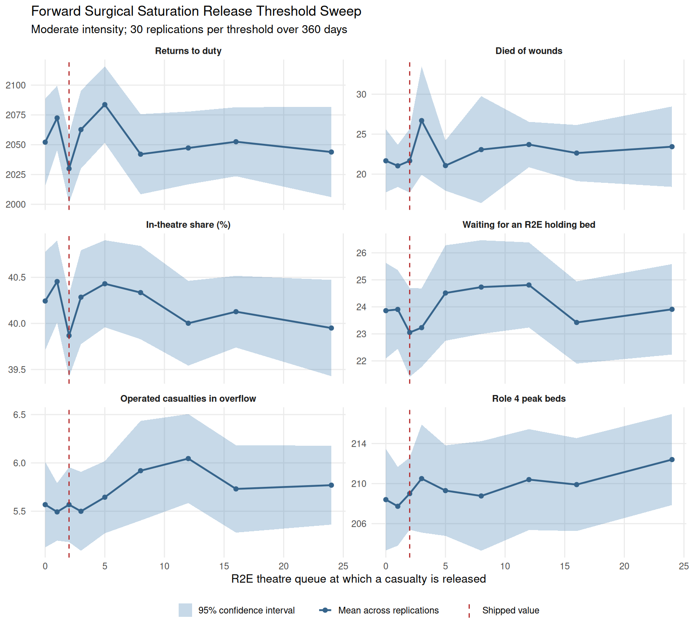

The same six responses against the R2E theatre queue length at which a casualty is released, with the shipped threshold marked by a dashed line.

With the release disabled the closing-window theatre queue was <!-- GEN cell:saturation|Theatre mean queue|0 (disabled)|full -->1.12 [0.70, 1.54]<!-- /GEN --> casualties and no casualty was released with the repair outstanding. At the shipped threshold of two the queue was <!-- GEN cell:saturation|Theatre mean queue|2 (shipped)|full -->0.66 [0.44, 0.88]<!-- /GEN --> and <!-- GEN cell:saturation|Released with repair outstanding|2 (shipped)|full -->132.3 [118.9, 145.7]<!-- /GEN --> casualties per campaign were released with the repair outstanding, with <!-- GEN cell:saturation|Role 4 operations owed|2 (shipped)|full -->1220.7 [1174.8, 1266.5]<!-- /GEN --> operations owed at the national support base against <!-- GEN cell:saturation|Role 4 operations owed|0 (disabled)|full -->1080.7 [1044.2, 1117.3]<!-- /GEN --> with the release disabled. Returns to duty and died of wounds per campaign were <!-- GEN cell:saturation|Returns to duty|2 (shipped)|full -->2029.9 [2001.0, 2058.8]<!-- /GEN --> and <!-- GEN cell:saturation|Died of wounds|2 (shipped)|full -->21.7 [17.7, 25.6]<!-- /GEN --> at the shipped threshold and <!-- GEN cell:saturation|Returns to duty|0 (disabled)|full -->2052.1 [2015.6, 2088.6]<!-- /GEN --> and <!-- GEN cell:saturation|Died of wounds|0 (disabled)|full -->21.7 [17.7, 25.6]<!-- /GEN --> with the release disabled.

**High-intensity profile.** The same sweep under `high_intensity` `[high_intensity, threshold 0 to 24 casualties · 360 d · 30 replications · paired, closing 90 d]`:

<!-- GEN saturation_high -->
| Response | 0 (disabled) | 1 | 2 (shipped) | 3 | 5 | 8 | 12 | 16 | 24 |
|---|---|---|---|---|---|---|---|---|---|
| Theatre mean queue | 895.92 [846.77, 945.06] | 122.38 [82.37, 162.39] | 100.45 [68.73, 132.18] | 121.71 [90.34, 153.08] | 108.39 [65.50, 151.28] | 127.89 [88.48, 167.29] | 159.10 [111.60, 206.59] | 117.52 [78.34, 156.71] | 97.95 [74.93, 120.96] |
| Released with repair outstanding | 0.0 [0.0, 0.0] | 2019.0 [1979.2, 2058.9] | 1977.5 [1935.9, 2019.1] | 1967.9 [1933.1, 2002.7] | 1913.0 [1872.3, 1953.8] | 1910.0 [1868.4, 1951.5] | 1848.3 [1786.3, 1910.3] | 1826.5 [1778.5, 1874.6] | 1752.0 [1697.7, 1806.4] |
| Role 4 operations owed | 1737.0 [1702.0, 1772.0] | 3074.4 [3038.6, 3110.2] | 3050.1 [3013.7, 3086.5] | 3064.7 [3022.6, 3106.9] | 3041.0 [2999.4, 3082.5] | 3029.5 [2988.7, 3070.3] | 3025.5 [2983.2, 3067.9] | 3036.6 [2996.5, 3076.7] | 2975.0 [2927.7, 3022.2] |
| Post-definitive ICU access (%) | 16.0 [15.8, 16.1] | 11.2 [11.0, 11.3] | 11.1 [11.0, 11.3] | 11.0 [10.9, 11.2] | 11.2 [11.0, 11.3] | 11.2 [11.0, 11.4] | 11.2 [11.0, 11.4] | 11.3 [11.1, 11.4] | 11.4 [11.2, 11.5] |
| Died of wounds | 1896.7 [1823.3, 1970.1] | 712.2 [585.8, 838.6] | 637.2 [523.5, 750.9] | 681.4 [583.5, 779.3] | 613.0 [496.6, 729.3] | 691.4 [587.0, 795.7] | 743.4 [629.1, 857.7] | 642.5 [553.1, 732.0] | 643.9 [553.6, 734.3] |
| Returns to duty | 3392.4 [3357.3, 3427.6] | 4267.6 [4227.6, 4307.6] | 4254.5 [4208.7, 4300.3] | 4264.2 [4226.1, 4302.4] | 4302.5 [4268.3, 4336.7] | 4298.8 [4255.2, 4342.5] | 4288.2 [4243.0, 4333.4] | 4325.5 [4286.7, 4364.3] | 4297.1 [4260.4, 4333.7] |
<!-- /GEN -->

The R2E theatre mean queue was <!-- GEN cell:saturation_high|Theatre mean queue|0 (disabled)|full -->895.92 [846.77, 945.06]<!-- /GEN --> with the release disabled and <!-- GEN cell:saturation_high|Theatre mean queue|2 (shipped)|full -->100.45 [68.73, 132.18]<!-- /GEN --> at the shipped threshold of two.

### Surgical Team Establishment

**Question.** What changes when the surgical sections fielded at R2E, at R2B or at both are increased, and does the R2E theatre queue converge at the larger establishment? `[default, R2E 3 to 6 and R2B 1 to 2 sections · 360 d · 30 replications · paired, closing 90 d]`

Each arm is a count of surgical sections: three, four or six at R2E, and one or two per R2B unit. R2E fields two operating theatres in every arm. A second R2B section takes the shift the first does not, and an R2E fourth section makes two sections on each shift. The shipped establishment is three sections at R2E and one per R2B unit.

<!-- GEN surgical_team -->
| Response | R2E 3, R2B 1 (shipped) | R2E 4, R2B 1 | R2E 6, R2B 1 | R2E 3, R2B 2 | R2E 4, R2B 2 |
|---|---|---|---|---|---|
| R2E theatre mean queue | 0.66 [0.44, 0.88] | 0.29 [0.17, 0.41] | 0.27 [0.19, 0.34] | 0.41 [0.19, 0.63] | 0.27 [0.10, 0.45] |
| R2E theatre queue, late-half classification | converged at 0.85 | converged at 0.38 | converged at 0.32 | converged at 0.41 | converged at 0.30 |
| R2E theatre queue shortfall per day | −0.002 [−0.010, 0.005] | −0.002 [−0.004, 0.000] | −0.001 [−0.002, 0.001] | 0.001 [−0.001, 0.003] | 0.000 [−0.003, 0.003] |
| Diverted, team off shift | 1209.9 [1186.1, 1233.7] | 1206.2 [1175.3, 1237.1] | 1202.3 [1166.6, 1237.9] | 0.0 [0.0, 0.0] | 0.0 [0.0, 0.0] |
| Diverted, theatre busy | 240.1 [226.4, 253.7] | 242.7 [222.9, 262.4] | 244.7 [224.7, 264.7] | 512.2 [483.6, 540.8] | 503.3 [474.0, 532.6] |
| R2B surgeries | 823.6 [811.9, 835.2] | 822.3 [808.3, 836.2] | 833.0 [821.1, 844.9] | 1580.0 [1552.2, 1607.8] | 1556.7 [1533.8, 1579.6] |
| R2E first surgeries | 1829.5 [1788.8, 1870.1] | 1824.6 [1770.0, 1879.3] | 1828.4 [1766.4, 1890.3] | 1402.5 [1350.6, 1454.3] | 1372.0 [1323.2, 1420.9] |
| R2E theatre entry deferred | 374.0 [362.8, 385.1] | 377.2 [361.8, 392.7] | 372.3 [352.3, 392.3] | 234.9 [221.7, 248.1] | 229.2 [216.1, 242.4] |
| Released with repair outstanding | 132.3 [118.9, 145.7] | 91.0 [72.9, 109.1] | 93.5 [75.2, 111.9] | 78.0 [63.9, 92.1] | 55.7 [41.9, 69.6] |
| Died of wounds | 21.67 [17.68, 25.65] | 21.60 [14.66, 28.54] | 20.07 [16.90, 23.24] | 20.37 [17.01, 23.72] | 19.03 [14.92, 23.15] |
| Returns to duty | 2029.9 [2001.0, 2058.8] | 2013.8 [1981.2, 2046.5] | 2054.1 [2016.9, 2091.4] | 2057.5 [2030.2, 2084.8] | 2051.7 [2018.7, 2084.7] |
| Post-definitive ICU access (%) | 35.2 [34.6, 35.8] | 35.0 [34.2, 35.7] | 34.9 [34.1, 35.8] | 33.8 [33.0, 34.7] | 34.4 [33.6, 35.1] |
<!-- /GEN -->

The paired differences against the shipped establishment are in the next table, each taken within replication.

<!-- GEN surgical_team_paired -->
| Paired difference against the shipped establishment | R2E 4, R2B 1 | R2E 6, R2B 1 | R2E 3, R2B 2 | R2E 4, R2B 2 |
|---|---|---|---|---|
| R2E theatre mean queue | −0.37 [−0.64, −0.11]† | −0.39 [−0.59, −0.20] | −0.25 [−0.56, +0.05] | −0.39 [−0.68, −0.10]† |
| Diverted, team off shift | −3.7 [−43.9, +36.5] | −7.6 [−46.5, +31.2] | −1209.9 [−1233.7, −1186.1] | −1209.9 [−1233.7, −1186.1] |
| Diverted, theatre busy | +2.6 [−21.1, +26.3] | +4.7 [−16.5, +25.8] | +272.1 [+240.7, +303.5] | +263.3 [+233.5, +293.0] |
| R2B surgeries | −1.3 [−20.7, +18.1] | +9.4 [−5.7, +24.6] | +756.4 [+729.9, +783.0] | +733.1 [+712.5, +753.7] |
| R2E first surgeries | −4.8 [−73.3, +63.6] | −1.1 [−67.6, +65.4] | −427.0 [−490.0, −364.0] | −457.4 [−511.0, −403.8] |
| R2E theatre entry deferred | +3.3 [−15.6, +22.1] | −1.7 [−24.1, +20.7] | −139.1 [−155.6, −122.6] | −144.7 [−160.0, −129.4] |
| Released with repair outstanding | −41.3 [−66.0, −16.6] | −38.8 [−59.1, −18.4] | −54.3 [−75.3, −33.3] | −76.6 [−94.0, −59.1] |
| Died of wounds | −0.07 [−8.66, +8.53] | −1.60 [−6.05, +2.85] | −1.30 [−6.66, +4.06] | −2.63 [−6.28, +1.01] |
| Returns to duty | −16.1 [−54.4, +22.3] | +24.2 [−20.2, +68.7] | +27.6 [−9.8, +65.1] | +21.8 [−21.5, +65.2] |
| Post-definitive ICU access (%) | −0.2 [−1.3, +0.9] | −0.3 [−1.2, +0.7] | −1.3 [−2.3, −0.4]† | −0.8 [−1.6, −0.0]† |
<!-- /GEN -->

At the shipped establishment the R2E theatre queue averaged <!-- GEN cell:surgical_team|R2E theatre mean queue|R2E 3, R2B 1 (shipped)|full -->0.66 [0.44, 0.88]<!-- /GEN --> over the closing 90 days and was classified <!-- GEN cell:surgical_team|R2E theatre queue, late-half classification|R2E 3, R2B 1 (shipped)|full -->converged at 0.85<!-- /GEN -->. A fourth R2E section changed it by <!-- GEN cell:surgical_team_paired|R2E theatre mean queue|R2E 4, R2B 1|full -->−0.37 [−0.64, −0.11]†<!-- /GEN --> and a sixth by <!-- GEN cell:surgical_team_paired|R2E theatre mean queue|R2E 6, R2B 1|full -->−0.39 [−0.59, −0.20]<!-- /GEN -->, with the queue classified <!-- GEN cell:surgical_team|R2E theatre queue, late-half classification|R2E 4, R2B 1|full -->converged at 0.38<!-- /GEN --> and <!-- GEN cell:surgical_team|R2E theatre queue, late-half classification|R2E 6, R2B 1|full -->converged at 0.32<!-- /GEN -->. The paired differences in deaths of wounds for the fourth and sixth R2E sections were <!-- GEN cell:surgical_team_paired|Died of wounds|R2E 4, R2B 1|full -->−0.07 [−8.66, +8.53]<!-- /GEN --> and <!-- GEN cell:surgical_team_paired|Died of wounds|R2E 6, R2B 1|full -->−1.60 [−6.05, +2.85]<!-- /GEN -->, and in returns to duty <!-- GEN cell:surgical_team_paired|Returns to duty|R2E 4, R2B 1|full -->−16.1 [−54.4, +22.3]<!-- /GEN --> and <!-- GEN cell:surgical_team_paired|Returns to duty|R2E 6, R2B 1|full -->+24.2 [−20.2, +68.7]<!-- /GEN -->.

A second R2B section removed the cases diverted for a closed section, which fell from <!-- GEN cell:surgical_team|Diverted, team off shift|R2E 3, R2B 1 (shipped)|full -->1209.9 [1186.1, 1233.7]<!-- /GEN --> to <!-- GEN cell:surgical_team|Diverted, team off shift|R2E 3, R2B 2|full -->0.0 [0.0, 0.0]<!-- /GEN -->, and raised those diverted for a busy theatre by <!-- GEN cell:surgical_team_paired|Diverted, theatre busy|R2E 3, R2B 2|full -->+272.1 [+240.7, +303.5]<!-- /GEN -->. R2B surgeries rose by <!-- GEN cell:surgical_team_paired|R2B surgeries|R2E 3, R2B 2|full -->+756.4 [+729.9, +783.0]<!-- /GEN -->, R2E first surgeries fell by <!-- GEN cell:surgical_team_paired|R2E first surgeries|R2E 3, R2B 2|full -->−427.0 [−490.0, −364.0]<!-- /GEN --> and the casualties released with the repair outstanding fell by <!-- GEN cell:surgical_team_paired|Released with repair outstanding|R2E 3, R2B 2|full -->−54.3 [−75.3, −33.3]<!-- /GEN -->. Deaths of wounds differed by <!-- GEN cell:surgical_team_paired|Died of wounds|R2E 3, R2B 2|full -->−1.30 [−6.66, +4.06]<!-- /GEN --> per campaign, and returns to duty by <!-- GEN cell:surgical_team_paired|Returns to duty|R2E 3, R2B 2|full -->+27.6 [−9.8, +65.1]<!-- /GEN -->. With both levers together the differences in deaths of wounds and in returns to duty were <!-- GEN cell:surgical_team_paired|Died of wounds|R2E 4, R2B 2|full -->−2.63 [−6.28, +1.01]<!-- /GEN --> and <!-- GEN cell:surgical_team_paired|Returns to duty|R2E 4, R2B 2|full -->+21.8 [−21.5, +65.2]<!-- /GEN -->.

At high intensity the same five arms were run under the `high_intensity` profile (30 replications, 360 days, seed 42).

<!-- GEN surgical_team_high -->
| Response | R2E 3, R2B 1 (shipped) | R2E 4, R2B 1 | R2E 6, R2B 1 | R2E 3, R2B 2 | R2E 4, R2B 2 |
|---|---|---|---|---|---|
| R2E theatre mean queue | 100.45 [68.73, 132.18] | 10.02 [7.98, 12.06] | 10.46 [7.96, 12.97] | 23.87 [16.78, 30.96] | 6.02 [4.50, 7.54] |
| R2E theatre queue, late-half classification | converged at 97.9 | converged at 9.86 | converged at 10.5 | converged at 26.4 | converged at 5.57 |
| R2E theatre queue shortfall per day | 0.049 [−0.232, 0.330] | 0.001 [−0.021, 0.022] | −0.006 [−0.031, 0.020] | −0.034 [−0.138, 0.071] | 0.006 [−0.007, 0.019] |
| Diverted, team off shift | 3860.1 [3806.1, 3914.0] | 3895.8 [3855.6, 3936.0] | 3868.8 [3827.7, 3909.9] | 0.0 [0.0, 0.0] | 0.0 [0.0, 0.0] |
| Diverted, theatre busy | 1426.6 [1385.3, 1467.9] | 1400.0 [1366.2, 1433.7] | 1402.8 [1357.9, 1447.7] | 2619.4 [2569.2, 2669.6] | 2601.0 [2556.0, 2645.9] |
| R2B surgeries | 1810.2 [1791.4, 1829.0] | 1808.1 [1793.3, 1822.9] | 1813.3 [1794.6, 1831.9] | 3299.5 [3274.9, 3324.0] | 3290.9 [3269.5, 3312.3] |
| R2E first surgeries | 6221.5 [6138.6, 6304.3] | 6321.7 [6244.1, 6399.2] | 6290.8 [6201.7, 6379.9] | 5498.9 [5412.2, 5585.6] | 5482.2 [5397.6, 5566.7] |
| R2E theatre entry deferred | 1613.9 [1585.3, 1642.5] | 1623.6 [1599.8, 1647.5] | 1622.1 [1598.3, 1645.9] | 1289.1 [1260.0, 1318.2] | 1285.1 [1258.4, 1311.9] |
| Released with repair outstanding | 1977.5 [1935.9, 2019.1] | 1610.1 [1556.1, 1664.0] | 1620.8 [1563.6, 1678.0] | 1399.6 [1353.1, 1446.1] | 1026.1 [977.4, 1074.9] |
| Died of wounds | 637.23 [523.53, 750.93] | 219.00 [205.55, 232.45] | 224.20 [211.08, 237.32] | 279.43 [255.29, 303.58] | 163.47 [154.51, 172.43] |
| Returns to duty | 4254.5 [4208.7, 4300.3] | 4642.4 [4587.9, 4697.0] | 4660.9 [4589.3, 4732.5] | 4750.1 [4689.4, 4810.8] | 4868.0 [4810.3, 4925.7] |
| Post-definitive ICU access (%) | 11.1 [11.0, 11.3] | 11.4 [11.2, 11.6] | 11.3 [11.0, 11.5] | 10.6 [10.3, 10.8] | 10.9 [10.7, 11.0] |
<!-- /GEN -->

<!-- GEN surgical_team_paired_high -->
| Paired difference against the shipped establishment | R2E 4, R2B 1 | R2E 6, R2B 1 | R2E 3, R2B 2 | R2E 4, R2B 2 |
|---|---|---|---|---|
| R2E theatre mean queue | −90.43 [−121.64, −59.23] | −89.99 [−122.13, −57.85] | −76.58 [−109.53, −43.64] | −94.44 [−126.22, −62.65] |
| Diverted, team off shift | +35.7 [−37.1, +108.6] | +8.7 [−61.3, +78.8] | −3860.1 [−3914.0, −3806.1] | −3860.1 [−3914.0, −3806.1] |
| Diverted, theatre busy | −26.6 [−79.2, +26.0] | −23.7 [−82.3, +34.8] | +1192.8 [+1123.2, +1262.4] | +1174.4 [+1115.3, +1233.5] |
| R2B surgeries | −2.1 [−25.4, +21.3] | +3.1 [−21.3, +27.5] | +1489.3 [+1455.6, +1523.0] | +1480.7 [+1452.1, +1509.4] |
| R2E first surgeries | +100.2 [−24.3, +224.7] | +69.3 [−49.4, +188.0] | −722.6 [−843.5, −601.7] | −739.3 [−860.5, −618.1] |
| R2E theatre entry deferred | +9.7 [−31.1, +50.6] | +8.2 [−27.0, +43.4] | −324.8 [−369.4, −280.1] | −328.8 [−365.6, −291.9] |
| Released with repair outstanding | −367.4 [−442.3, −292.5] | −356.7 [−416.1, −297.3] | −577.9 [−642.3, −513.5] | −951.3 [−1017.2, −885.5] |
| Died of wounds | −418.23 [−529.52, −306.94] | −413.03 [−528.30, −297.76] | −357.80 [−470.84, −244.76] | −473.77 [−587.83, −359.71] |
| Returns to duty | +387.9 [+322.7, +453.2] | +406.4 [+320.3, +492.4] | +495.6 [+411.8, +579.4] | +613.5 [+545.0, +682.0] |
| Post-definitive ICU access (%) | +0.2 [−0.1, +0.5] | +0.1 [−0.2, +0.4] | −0.6 [−0.9, −0.3] | −0.3 [−0.6, −0.0]† |
<!-- /GEN -->

At the shipped establishment the high-intensity R2E theatre queue averaged <!-- GEN cell:surgical_team_high|R2E theatre mean queue|R2E 3, R2B 1 (shipped)|full -->100.45 [68.73, 132.18]<!-- /GEN --> over the closing 90 days and was classified <!-- GEN cell:surgical_team_high|R2E theatre queue, late-half classification|R2E 3, R2B 1 (shipped)|full -->converged at 97.9<!-- /GEN -->, a shortfall of <!-- GEN cell:surgical_team_high|R2E theatre queue shortfall per day|R2E 3, R2B 1 (shipped)|full -->0.049 [−0.232, 0.330]<!-- /GEN --> casualties per day. A fourth R2E section gave <!-- GEN cell:surgical_team_high|R2E theatre mean queue|R2E 4, R2B 1|full -->10.02 [7.98, 12.06]<!-- /GEN --> and <!-- GEN cell:surgical_team_high|R2E theatre queue, late-half classification|R2E 4, R2B 1|full -->converged at 9.86<!-- /GEN -->, with a shortfall of <!-- GEN cell:surgical_team_high|R2E theatre queue shortfall per day|R2E 4, R2B 1|full -->0.001 [−0.021, 0.022]<!-- /GEN --> per day; a sixth gave <!-- GEN cell:surgical_team_high|R2E theatre queue, late-half classification|R2E 6, R2B 1|full -->converged at 10.5<!-- /GEN --> and <!-- GEN cell:surgical_team_high|R2E theatre queue shortfall per day|R2E 6, R2B 1|full -->−0.006 [−0.031, 0.020]<!-- /GEN --> per day. A second R2B section alone gave <!-- GEN cell:surgical_team_high|R2E theatre queue, late-half classification|R2E 3, R2B 2|full -->converged at 26.4<!-- /GEN --> and <!-- GEN cell:surgical_team_high|R2E theatre queue shortfall per day|R2E 3, R2B 2|full -->−0.034 [−0.138, 0.071]<!-- /GEN --> per day, and both levers together <!-- GEN cell:surgical_team_high|R2E theatre queue, late-half classification|R2E 4, R2B 2|full -->converged at 5.57<!-- /GEN --> and <!-- GEN cell:surgical_team_high|R2E theatre queue shortfall per day|R2E 4, R2B 2|full -->0.006 [−0.007, 0.019]<!-- /GEN --> per day. The paired difference in deaths of wounds was <!-- GEN cell:surgical_team_paired_high|Died of wounds|R2E 4, R2B 1|full -->−418.23 [−529.52, −306.94]<!-- /GEN --> for the fourth R2E section and <!-- GEN cell:surgical_team_paired_high|Died of wounds|R2E 4, R2B 2|full -->−473.77 [−587.83, −359.71]<!-- /GEN --> for both levers, and in returns to duty <!-- GEN cell:surgical_team_paired_high|Returns to duty|R2E 4, R2B 1|full -->+387.9 [+322.7, +453.2]<!-- /GEN --> and <!-- GEN cell:surgical_team_paired_high|Returns to duty|R2E 4, R2B 2|full -->+613.5 [+545.0, +682.0]<!-- /GEN -->.

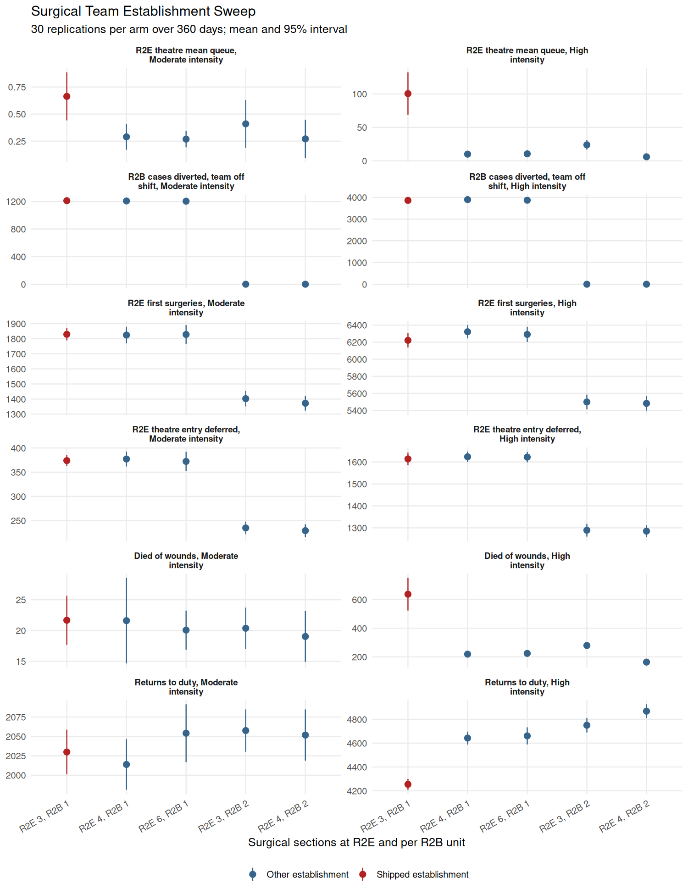

The R2E theatre queue and the diversions, deaths of wounds and returns to duty of each establishment, at moderate intensity (left) and high intensity (right), with the shipped establishment marked.

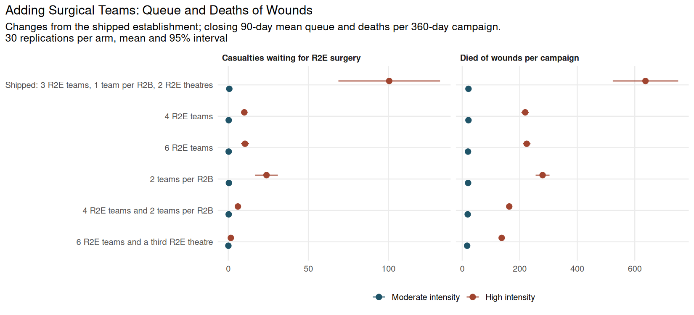

The closing 90-day mean R2E theatre queue (left) and deaths of wounds per campaign (right) for the shipped establishment, four and six R2E teams, two teams per R2B unit, four R2E teams with two per R2B unit, and six R2E teams with a third R2E theatre, the last from the operating theatre sweep, at both intensities, each with its 95% interval.

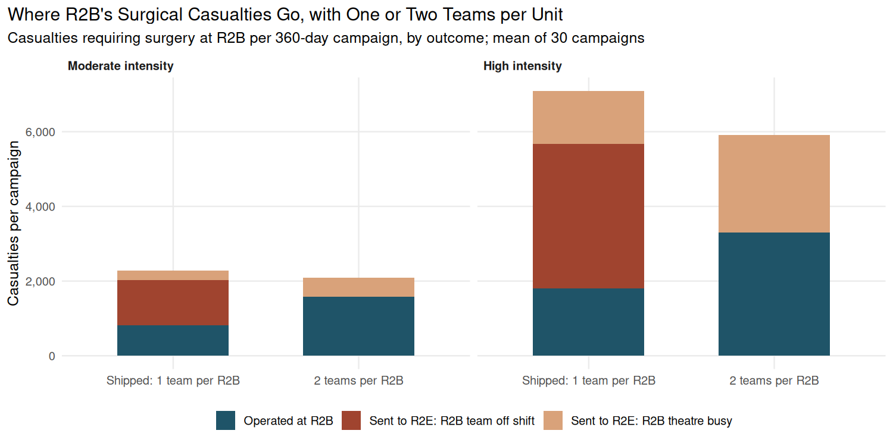

The operations performed at R2B and the casualties sent on to R2E because the R2B team was off shift or its theatre busy, per campaign, with the shipped one surgical team per R2B unit and with two, at moderate intensity (left) and high intensity (right) on a shared scale.

### R2B Second Theatre

**Question.** Once a second surgical section per unit covers the other shift, does a second R2B theatre keep forward the casualties now sent on because the theatre is busy, and does it need a second section on each shift to do so? `[default and high_intensity, R2B 1 to 4 sections and 1 or 2 theatres per unit · 360 d · 30 replications · paired, closing 90 d]`

Each arm adds one step to the arm before it: a second section per unit, which covers the other shift; a second theatre at two sections, where one section is on shift and a casualty who finds the section operating waits in the second theatre for it rather than being sent on to R2E; and four sections at two theatres, two on each shift, a second operation at once ([Methods](Methods.md#r2b-second-theatre-sweep)). R2E keeps its shipped three sections and two theatres. R2B theatre occupancy is the share of all R2B theatre time in use, a theatre in which a casualty waits for the section counting as in use. Every arm is compared with the shipped establishment and each step with the arm before it.

<!-- GEN r2b_theatre -->
| Response | R2B 1 section, 1 theatre (shipped) | R2B 2 sections, 1 theatre | R2B 2 sections, 2 theatres | R2B 4 sections, 2 theatres |
|---|---|---|---|---|
| Sections on the larger shift against theatres, per unit | 1 against 1 | 1 against 1 | 1 against 2 | 2 against 2 |
| R2B surgeries | 823.6 [811.9, 835.2] | 1580.0 [1552.2, 1607.8] | 1888.4 [1852.2, 1924.6] | 1939.4 [1903.4, 1975.4] |
| Diverted from R2B, team off shift | 1209.9 [1186.1, 1233.7] | 0.0 [0.0, 0.0] | 0.0 [0.0, 0.0] | 0.0 [0.0, 0.0] |
| Diverted from R2B, theatre busy | 240.1 [226.4, 253.7] | 512.2 [483.6, 540.8] | 14.9 [12.5, 17.3] | 118.0 [104.0, 132.0] |
| Held at R2B for a team about to come on shift | 109.5 [105.2, 113.7] | 0.0 [0.0, 0.0] | 0.0 [0.0, 0.0] | 0.0 [0.0, 0.0] |
| R2B theatre occupancy (%) | 10.2 [9.8, 10.5] | 18.6 [18.1, 19.2] | 11.3 [11.0, 11.5] | 11.7 [11.3, 12.1] |
| R2E theatre mean queue | 0.66 [0.44, 0.88] | 0.41 [0.19, 0.63] | 0.14 [0.11, 0.18] | 0.29 [0.15, 0.43] |
| R2E theatre queue, late-half classification | converged at 0.85 | converged at 0.41 | converged at 0.15 | converged at 0.31 |
| R2E first surgeries | 1829.5 [1788.8, 1870.1] | 1402.5 [1350.6, 1454.3] | 1144.6 [1106.5, 1182.7] | 1209.9 [1163.3, 1256.5] |
| Released with definitive repair outstanding | 132.3 [118.9, 145.7] | 78.0 [63.9, 92.1] | 27.9 [22.0, 33.9] | 48.2 [38.1, 58.3] |
| R2E post-operative overflow census | 5.57 [5.18, 5.96] | 5.55 [5.14, 5.97] | 5.54 [5.26, 5.83] | 6.01 [5.58, 6.44] |
| Died of wounds | 21.67 [17.68, 25.65] | 20.37 [17.01, 23.72] | 16.83 [14.89, 18.78] | 18.67 [15.11, 22.23] |
| Returns to duty | 2029.9 [2001.0, 2058.8] | 2057.5 [2030.2, 2084.8] | 2044.3 [2010.1, 2078.5] | 2067.2 [2033.2, 2101.2] |
<!-- /GEN -->

<!-- GEN r2b_theatre_paired -->
| Paired difference | R2B 2 sections, 1 theatre | R2B 2 sections, 2 theatres | R2B 4 sections, 2 theatres | R2B 2 sections, 2 theatres against R2B 2 sections, 1 theatre | R2B 4 sections, 2 theatres against R2B 2 sections, 2 theatres |
|---|---|---|---|---|---|
| R2B surgeries | +756.4 [+729.9, +783.0] | +1064.8 [+1027.7, +1101.9] | +1115.8 [+1077.6, +1154.1] | +308.4 [+267.9, +348.9] | +51.0 [−3.6, +105.6] |
| Diverted from R2B, theatre busy | +272.1 [+240.7, +303.5] | −225.1 [−239.3, −210.9] | −122.0 [−142.5, −101.6] | −497.2 [−525.7, −468.7] | +103.1 [+88.8, +117.4] |
| R2B theatre occupancy (%) | +8.5 [+7.8, +9.1] | +1.1 [+0.6, +1.5] | +1.5 [+1.0, +2.0] | −7.4 [−8.0, −6.8] | +0.4 [−0.0, +0.9] |
| R2E theatre mean queue | −0.25 [−0.56, +0.05] | −0.52 [−0.74, −0.30] | −0.37 [−0.61, −0.13]† | −0.26 [−0.49, −0.04]† | +0.15 [−0.00, +0.30] |
| R2E first surgeries | −427.0 [−490.0, −364.0] | −684.9 [−740.3, −629.4] | −619.6 [−682.6, −556.5] | −257.9 [−318.5, −197.2] | +65.3 [−1.3, +131.9] |
| Released with definitive repair outstanding | −54.3 [−75.3, −33.3] | −104.4 [−119.4, −89.3] | −84.1 [−102.6, −65.5] | −50.1 [−65.2, −34.9] | +20.3 [+7.9, +32.7]† |
| R2E post-operative overflow census | −0.01 [−0.54, +0.51] | −0.03 [−0.48, +0.43] | +0.44 [−0.05, +0.94] | −0.01 [−0.44, +0.41] | +0.47 [−0.01, +0.95] |
| Died of wounds | −1.30 [−6.66, +4.06] | −4.83 [−9.06, −0.60]† | −3.00 [−8.67, +2.67] | −3.53 [−7.16, +0.09] | +1.83 [−2.37, +6.03] |
| Returns to duty | +27.6 [−9.8, +65.1] | +14.4 [−32.3, +61.1] | +37.3 [+2.2, +72.4]† | −13.2 [−58.4, +31.9] | +22.9 [−19.7, +65.5] |
<!-- /GEN -->

At high intensity the same four arms were run under the `high_intensity` profile (30 replications, 360 days, seed 42).

<!-- GEN r2b_theatre_high -->
| Response | R2B 1 section, 1 theatre (shipped) | R2B 2 sections, 1 theatre | R2B 2 sections, 2 theatres | R2B 4 sections, 2 theatres |
|---|---|---|---|---|
| Sections on the larger shift against theatres, per unit | 1 against 1 | 1 against 1 | 1 against 2 | 2 against 2 |
| R2B surgeries | 1810.2 [1791.4, 1829.0] | 3299.5 [3274.9, 3324.0] | 4569.0 [4517.7, 4620.3] | 4726.2 [4693.2, 4759.2] |
| Diverted from R2B, team off shift | 3860.1 [3806.1, 3914.0] | 0.0 [0.0, 0.0] | 0.0 [0.0, 0.0] | 0.0 [0.0, 0.0] |
| Diverted from R2B, theatre busy | 1426.6 [1385.3, 1467.9] | 2619.4 [2569.2, 2669.6] | 165.3 [158.8, 171.7] | 924.1 [896.1, 952.1] |
| Held at R2B for a team about to come on shift | 341.5 [335.6, 347.5] | 0.0 [0.0, 0.0] | 0.0 [0.0, 0.0] | 0.0 [0.0, 0.0] |
| R2B theatre occupancy (%) | 22.6 [22.2, 23.1] | 39.4 [38.7, 40.0] | 27.2 [26.7, 27.7] | 28.2 [27.8, 28.7] |
| R2E theatre mean queue | 100.45 [68.73, 132.18] | 23.87 [16.78, 30.96] | 6.69 [5.25, 8.13] | 8.13 [6.79, 9.48] |
| R2E theatre queue, late-half classification | converged at 97.9 | converged at 26.4 | **drifting, -5.6%/block**, 6.4 to 6.0 | converged at 8.68 |
| R2E first surgeries | 6221.5 [6138.6, 6304.3] | 5498.9 [5412.2, 5585.6] | 4727.9 [4636.9, 4818.9] | 4758.9 [4682.8, 4835.0] |
| Released with definitive repair outstanding | 1977.5 [1935.9, 2019.1] | 1399.6 [1353.1, 1446.1] | 827.9 [787.9, 867.9] | 836.8 [801.5, 872.1] |
| R2E post-operative overflow census | 19.62 [19.25, 20.00] | 22.60 [22.08, 23.12] | 24.08 [23.46, 24.70] | 24.88 [24.32, 25.44] |
| Died of wounds | 637.23 [523.53, 750.93] | 279.43 [255.29, 303.58] | 179.10 [168.77, 189.43] | 163.83 [154.13, 173.54] |
| Returns to duty | 4254.5 [4208.7, 4300.3] | 4750.1 [4689.4, 4810.8] | 4898.5 [4826.4, 4970.6] | 4959.1 [4890.2, 5028.0] |
<!-- /GEN -->

<!-- GEN r2b_theatre_paired_high -->
| Paired difference | R2B 2 sections, 1 theatre | R2B 2 sections, 2 theatres | R2B 4 sections, 2 theatres | R2B 2 sections, 2 theatres against R2B 2 sections, 1 theatre | R2B 4 sections, 2 theatres against R2B 2 sections, 2 theatres |
|---|---|---|---|---|---|
| R2B surgeries | +1489.3 [+1455.6, +1523.0] | +2758.8 [+2711.1, +2806.6] | +2916.0 [+2875.7, +2956.3] | +1269.5 [+1208.6, +1330.5] | +157.2 [+92.7, +221.7] |
| Diverted from R2B, theatre busy | +1192.8 [+1123.2, +1262.4] | −1261.3 [−1302.6, −1220.0] | −502.5 [−551.0, −453.9] | −2454.1 [−2505.3, −2403.0] | +758.8 [+730.4, +787.2] |
| R2B theatre occupancy (%) | +16.7 [+15.9, +17.6] | +4.6 [+3.9, +5.3] | +5.6 [+4.9, +6.4] | −12.1 [−12.9, −11.3] | +1.0 [+0.4, +1.6] |
| R2E theatre mean queue | −76.58 [−109.53, −43.64] | −93.77 [−125.33, −62.20] | −92.32 [−124.22, −60.42] | −17.18 [−24.64, −9.73] | +1.45 [−0.56, +3.46] |
| R2E first surgeries | −722.6 [−843.5, −601.7] | −1493.6 [−1597.4, −1389.7] | −1462.6 [−1583.5, −1341.7] | −771.0 [−898.9, −643.1] | +31.0 [−89.8, +151.8] |
| Released with definitive repair outstanding | −577.9 [−642.3, −513.5] | −1149.6 [−1203.7, −1095.4] | −1140.6 [−1199.1, −1082.2] | −571.7 [−635.4, −507.9] | +8.9 [−48.1, +66.0] |
| R2E post-operative overflow census | +2.98 [+2.30, +3.66] | +4.46 [+3.69, +5.23] | +5.26 [+4.53, +5.99] | +1.48 [+0.65, +2.31] | +0.80 [+0.05, +1.55]† |
| Died of wounds | −357.80 [−470.84, −244.76] | −458.13 [−569.18, −347.09] | −473.40 [−588.27, −358.53] | −100.33 [−125.17, −75.50] | −15.27 [−29.82, −0.71]† |
| Returns to duty | +495.6 [+411.8, +579.4] | +644.0 [+563.6, +724.4] | +704.6 [+627.9, +781.3] | +148.4 [+49.5, +247.3] | +60.6 [−31.5, +152.6] |
<!-- /GEN -->

At moderate intensity a second section per unit ended the diversions because the team was off shift and raised those because the theatre was busy to <!-- GEN cell:r2b_theatre|Diverted from R2B, theatre busy|R2B 2 sections, 1 theatre|full -->512.2 [483.6, 540.8]<!-- /GEN -->. Against two sections at one theatre, a second theatre changed those diversions by <!-- GEN cell:r2b_theatre_paired|Diverted from R2B, theatre busy|R2B 2 sections, 2 theatres against R2B 2 sections, 1 theatre|full -->−497.2 [−525.7, −468.7]<!-- /GEN -->, R2B surgeries by <!-- GEN cell:r2b_theatre_paired|R2B surgeries|R2B 2 sections, 2 theatres against R2B 2 sections, 1 theatre|full -->+308.4 [+267.9, +348.9]<!-- /GEN -->, the R2E theatre queue by <!-- GEN cell:r2b_theatre_paired|R2E theatre mean queue|R2B 2 sections, 2 theatres against R2B 2 sections, 1 theatre|full -->−0.26 [−0.49, −0.04]†<!-- /GEN --> and deaths of wounds by <!-- GEN cell:r2b_theatre_paired|Died of wounds|R2B 2 sections, 2 theatres against R2B 2 sections, 1 theatre|full -->−3.53 [−7.16, +0.09]<!-- /GEN -->. Against the shipped establishment, two sections and two theatres changed R2E first surgeries by <!-- GEN cell:r2b_theatre_paired|R2E first surgeries|R2B 2 sections, 2 theatres|full -->−684.9 [−740.3, −629.4]<!-- /GEN -->, casualties released with definitive repair outstanding by <!-- GEN cell:r2b_theatre_paired|Released with definitive repair outstanding|R2B 2 sections, 2 theatres|full -->−104.4 [−119.4, −89.3]<!-- /GEN -->, the R2E post-operative overflow census by <!-- GEN cell:r2b_theatre_paired|R2E post-operative overflow census|R2B 2 sections, 2 theatres|full -->−0.03 [−0.48, +0.43]<!-- /GEN -->, deaths of wounds by <!-- GEN cell:r2b_theatre_paired|Died of wounds|R2B 2 sections, 2 theatres|full -->−4.83 [−9.06, −0.60]†<!-- /GEN --> and returns to duty by <!-- GEN cell:r2b_theatre_paired|Returns to duty|R2B 2 sections, 2 theatres|full -->+14.4 [−32.3, +61.1]<!-- /GEN -->. Four sections against two at two theatres changed R2B surgeries by <!-- GEN cell:r2b_theatre_paired|R2B surgeries|R2B 4 sections, 2 theatres against R2B 2 sections, 2 theatres|full -->+51.0 [−3.6, +105.6]<!-- /GEN -->, diversions because the theatre was busy by <!-- GEN cell:r2b_theatre_paired|Diverted from R2B, theatre busy|R2B 4 sections, 2 theatres against R2B 2 sections, 2 theatres|full -->+103.1 [+88.8, +117.4]<!-- /GEN --> and deaths of wounds by <!-- GEN cell:r2b_theatre_paired|Died of wounds|R2B 4 sections, 2 theatres against R2B 2 sections, 2 theatres|full -->+1.83 [−2.37, +6.03]<!-- /GEN -->.

At high intensity a second section per unit ended the diversions because the team was off shift and raised those because the theatre was busy to <!-- GEN cell:r2b_theatre_high|Diverted from R2B, theatre busy|R2B 2 sections, 1 theatre|full -->2619.4 [2569.2, 2669.6]<!-- /GEN -->. Against two sections at one theatre, a second theatre changed those diversions by <!-- GEN cell:r2b_theatre_paired_high|Diverted from R2B, theatre busy|R2B 2 sections, 2 theatres against R2B 2 sections, 1 theatre|full -->−2454.1 [−2505.3, −2403.0]<!-- /GEN -->, R2B surgeries by <!-- GEN cell:r2b_theatre_paired_high|R2B surgeries|R2B 2 sections, 2 theatres against R2B 2 sections, 1 theatre|full -->+1269.5 [+1208.6, +1330.5]<!-- /GEN -->, the R2E theatre queue by <!-- GEN cell:r2b_theatre_paired_high|R2E theatre mean queue|R2B 2 sections, 2 theatres against R2B 2 sections, 1 theatre|full -->−17.18 [−24.64, −9.73]<!-- /GEN --> and deaths of wounds by <!-- GEN cell:r2b_theatre_paired_high|Died of wounds|R2B 2 sections, 2 theatres against R2B 2 sections, 1 theatre|full -->−100.33 [−125.17, −75.50]<!-- /GEN -->. Against the shipped establishment, two sections and two theatres changed R2E first surgeries by <!-- GEN cell:r2b_theatre_paired_high|R2E first surgeries|R2B 2 sections, 2 theatres|full -->−1493.6 [−1597.4, −1389.7]<!-- /GEN -->, casualties released with definitive repair outstanding by <!-- GEN cell:r2b_theatre_paired_high|Released with definitive repair outstanding|R2B 2 sections, 2 theatres|full -->−1149.6 [−1203.7, −1095.4]<!-- /GEN -->, the R2E post-operative overflow census by <!-- GEN cell:r2b_theatre_paired_high|R2E post-operative overflow census|R2B 2 sections, 2 theatres|full -->+4.46 [+3.69, +5.23]<!-- /GEN -->, deaths of wounds by <!-- GEN cell:r2b_theatre_paired_high|Died of wounds|R2B 2 sections, 2 theatres|full -->−458.13 [−569.18, −347.09]<!-- /GEN --> and returns to duty by <!-- GEN cell:r2b_theatre_paired_high|Returns to duty|R2B 2 sections, 2 theatres|full -->+644.0 [+563.6, +724.4]<!-- /GEN -->. Four sections against two at two theatres changed R2B surgeries by <!-- GEN cell:r2b_theatre_paired_high|R2B surgeries|R2B 4 sections, 2 theatres against R2B 2 sections, 2 theatres|full -->+157.2 [+92.7, +221.7]<!-- /GEN -->, diversions because the theatre was busy by <!-- GEN cell:r2b_theatre_paired_high|Diverted from R2B, theatre busy|R2B 4 sections, 2 theatres against R2B 2 sections, 2 theatres|full -->+758.8 [+730.4, +787.2]<!-- /GEN --> and deaths of wounds by <!-- GEN cell:r2b_theatre_paired_high|Died of wounds|R2B 4 sections, 2 theatres against R2B 2 sections, 2 theatres|full -->−15.27 [−29.82, −0.71]†<!-- /GEN -->. The R2E theatre queue was classified <!-- GEN cell:r2b_theatre_high|R2E theatre queue, late-half classification|R2B 2 sections, 2 theatres|full -->**drifting, -5.6%/block**, 6.4 to 6.0<!-- /GEN --> at two sections and two theatres, and converged at every arm at both intensities.

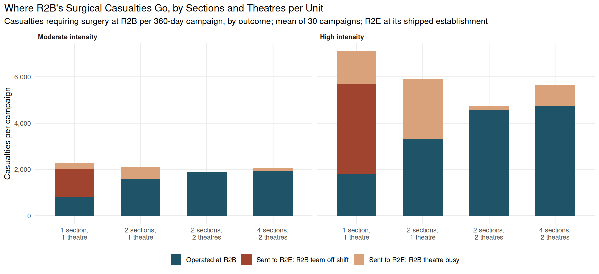

The mean per campaign of the casualties requiring surgery at R2B who were operated on forward, sent on to R2E because the unit's section was off shift, and sent on because its theatre was busy, for each section and theatre establishment per unit, at moderate intensity (left) and high intensity (right), on one shared scale.

### Surgical Capacity as a Package

**Question.** Once R2B keeps its surgery forward with two sections and two theatres per unit, what does each R2E addition, a fourth section, six sections with a third theatre, and twelve intensive care beds behind either, still buy? `[high_intensity, six establishments · 360 d · 30 replications · paired, closing 90 d]`

Every arm past the shipped establishment carries the R2B package of the [R2B second theatre sweep](#r2b-second-theatre), two sections and two theatres per unit, and adds R2E capacity to it one step at a time ([Methods](Methods.md#surgical-package-sweep)). R2E holding beds stay at the shipped 30. Every arm is compared with the shipped establishment in the first table of paired differences; the second compares each R2E addition with the R2B package alone, each twelve-bed arm with the same surgery at four beds, and six sections and three theatres with four sections.

<!-- GEN surgical_package -->
| Response | Shipped | R2B package | R2B package, R2E 4 sections | R2B package, R2E 4 sections, 12 ICU | R2B package, R2E 6 sections, 3 theatres | R2B package, R2E 6 sections, 3 theatres, 12 ICU |
|---|---|---|---|---|---|---|
| R2B surgeries | 1810.2 [1791.4, 1829.0] | 4569.0 [4517.7, 4620.3] | 4592.8 [4556.8, 4628.8] | 4570.7 [4523.4, 4617.9] | 4578.1 [4539.3, 4616.9] | 4562.5 [4525.5, 4599.5] |
| Diverted from R2B, theatre busy | 1426.6 [1385.3, 1467.9] | 165.3 [158.8, 171.7] | 169.1 [162.4, 175.8] | 170.7 [162.6, 178.9] | 165.2 [157.4, 173.0] | 160.4 [152.3, 168.5] |
| R2E theatre mean queue | 100.45 [68.73, 132.18] | 6.69 [5.25, 8.13] | 2.20 [1.83, 2.57] | 2.70 [2.16, 3.23] | 0.45 [0.39, 0.52] | 0.42 [0.34, 0.50] |
| R2E operating theatres, late-half classification | converged at 97.9 | **drifting, -5.6%/block**, 6.4 to 6.0 | converged at 2.23 | converged at 2.43 | converged at 0.45 | converged at 0.40 |
| R2E first surgeries | 6221.5 [6138.6, 6304.3] | 4727.9 [4636.9, 4818.9] | 4789.5 [4721.1, 4857.9] | 4780.9 [4686.0, 4875.9] | 4788.8 [4700.6, 4877.0] | 4748.0 [4664.8, 4831.2] |
| Released with definitive repair outstanding | 1977.5 [1935.9, 2019.1] | 827.9 [787.9, 867.9] | 563.7 [539.7, 587.8] | 570.6 [538.8, 602.4] | 205.1 [188.1, 222.0] | 188.0 [169.7, 206.4] |
| R2E intensive care occupancy (%) | 97.6 [97.5, 97.7] | 97.3 [97.2, 97.4] | 97.1 [97.0, 97.3] | 95.1 [94.8, 95.4] | 97.0 [96.9, 97.2] | 94.7 [94.3, 95.0] |
| Post-definitive care in an intensive care bed (%) | 11.1 [11.0, 11.3] | 10.4 [10.1, 10.6] | 10.3 [10.1, 10.4] | 33.8 [33.3, 34.3] | 10.2 [10.0, 10.4] | 33.8 [33.3, 34.3] |
| R2E post-operative overflow census | 19.62 [19.25, 20.00] | 24.08 [23.46, 24.70] | 25.30 [24.75, 25.86] | 19.09 [18.37, 19.81] | 26.63 [25.97, 27.28] | 19.47 [18.73, 20.20] |
| R2E post-operative overflow, late-half classification | converged at 19.7 | converged at 24.4 | converged at 25.5 | converged at 18.9 | converged at 26.3 | converged at 19.5 |
| R2E holding mean queue | 54.37 [52.11, 56.63] | 55.32 [53.72, 56.93] | 57.85 [55.98, 59.72] | 57.16 [54.78, 59.53] | 58.03 [56.05, 60.00] | 57.67 [55.30, 60.04] |
| Died of wounds | 637.23 [523.53, 750.93] | 179.10 [168.77, 189.43] | 148.07 [141.51, 154.63] | 149.23 [139.48, 158.99] | 129.57 [122.55, 136.58] | 126.10 [117.97, 134.23] |
| Returns to duty | 4254.5 [4208.7, 4300.3] | 4898.5 [4826.4, 4970.6] | 5030.2 [4960.2, 5100.3] | 4985.7 [4909.1, 5062.3] | 5041.9 [4951.7, 5132.1] | 5015.0 [4940.2, 5089.8] |
<!-- /GEN -->

<!-- GEN surgical_package_paired -->
| Paired difference | R2B package | R2B package, R2E 4 sections | R2B package, R2E 4 sections, 12 ICU | R2B package, R2E 6 sections, 3 theatres | R2B package, R2E 6 sections, 3 theatres, 12 ICU |
|---|---|---|---|---|---|
| R2B surgeries | +2758.8 [+2711.1, +2806.6] | +2782.6 [+2741.8, +2823.4] | +2760.5 [+2713.2, +2807.8] | +2768.0 [+2727.0, +2808.9] | +2752.3 [+2714.8, +2789.8] |
| Diverted from R2B, theatre busy | −1261.3 [−1302.6, −1220.0] | −1257.5 [−1299.9, −1215.0] | −1255.8 [−1295.4, −1216.2] | −1261.4 [−1303.8, −1219.0] | −1266.2 [−1304.9, −1227.5] |
| R2E theatre mean queue | −93.77 [−125.33, −62.20] | −98.25 [−129.95, −66.55] | −97.76 [−129.28, −66.24] | −100.00 [−131.70, −68.30] | −100.03 [−131.76, −68.31] |
| R2E first surgeries | −1493.6 [−1597.4, −1389.7] | −1431.9 [−1543.9, −1319.9] | −1440.5 [−1539.0, −1342.0] | −1432.6 [−1540.9, −1324.3] | −1473.5 [−1569.4, −1377.5] |
| Released with definitive repair outstanding | −1149.6 [−1203.7, −1095.4] | −1413.7 [−1465.1, −1362.4] | −1406.9 [−1450.8, −1362.9] | −1772.4 [−1819.7, −1725.1] | −1789.4 [−1829.8, −1749.1] |
| R2E intensive care occupancy (%) | −0.3 [−0.4, −0.1]† | −0.4 [−0.6, −0.3] | −2.4 [−2.8, −2.1] | −0.6 [−0.7, −0.4] | −2.9 [−3.2, −2.6] |
| Post-definitive care in an intensive care bed (%) | −0.8 [−1.1, −0.5] | −0.9 [−1.2, −0.6] | +22.6 [+22.1, +23.2] | −0.9 [−1.1, −0.7] | +22.7 [+22.2, +23.1] |
| R2E post-operative overflow census | +4.46 [+3.69, +5.23] | +5.68 [+4.95, +6.41] | −0.53 [−1.40, +0.34] | +7.01 [+6.33, +7.69] | −0.16 [−0.95, +0.64] |
| R2E holding mean queue | +0.95 [−2.03, +3.94] | +3.48 [+0.28, +6.68]† | +2.79 [+0.01, +5.56]† | +3.66 [+0.50, +6.81]† | +3.30 [+0.35, +6.25]† |
| Died of wounds | −458.13 [−569.18, −347.09] | −489.17 [−602.55, −375.78] | −488.00 [−599.66, −376.34] | −507.67 [−620.33, −395.00] | −511.13 [−624.04, −398.22] |
| Returns to duty | +644.0 [+563.6, +724.4] | +775.7 [+693.1, +858.3] | +731.2 [+650.0, +812.4] | +787.4 [+687.5, +887.3] | +760.5 [+675.3, +845.6] |
<!-- /GEN -->

<!-- GEN surgical_package_paired_steps -->
| Paired difference | R2B package, R2E 4 sections against R2B package | R2B package, R2E 4 sections, 12 ICU against R2B package | R2B package, R2E 6 sections, 3 theatres against R2B package | R2B package, R2E 6 sections, 3 theatres, 12 ICU against R2B package | R2B package, R2E 4 sections, 12 ICU against R2B package, R2E 4 sections | R2B package, R2E 6 sections, 3 theatres, 12 ICU against R2B package, R2E 6 sections, 3 theatres | R2B package, R2E 6 sections, 3 theatres against R2B package, R2E 4 sections |
|---|---|---|---|---|---|---|---|
| R2B surgeries | +23.8 [−42.1, +89.7] | +1.7 [−65.1, +68.4] | +9.1 [−57.0, +75.3] | −6.5 [−69.3, +56.2] | −22.1 [−75.1, +30.9] | −15.7 [−64.4, +33.0] | −14.6 [−75.1, +45.8] |
| Diverted from R2B, theatre busy | +3.8 [−7.1, +14.8] | +5.5 [−4.4, +15.4] | −0.1 [−11.6, +11.5] | −4.9 [−15.5, +5.8] | +1.6 [−8.6, +11.9] | −4.8 [−15.2, +5.6] | −3.9 [−13.1, +5.3] |
| R2E theatre mean queue | −4.49 [−5.98, −2.99] | −3.99 [−5.54, −2.44] | −6.23 [−7.68, −4.79] | −6.27 [−7.71, −4.82] | +0.49 [−0.21, +1.20] | −0.03 [−0.14, +0.07] | −1.75 [−2.11, −1.38] |
| R2E first surgeries | +61.6 [−65.0, +188.2] | +53.0 [−67.2, +173.3] | +60.9 [−76.7, +198.5] | +20.1 [−95.7, +135.9] | −8.6 [−132.8, +115.6] | −40.8 [−140.8, +59.2] | −0.7 [−128.1, +126.7] |
| Released with definitive repair outstanding | −264.2 [−315.4, −213.0] | −257.3 [−307.4, −207.2] | −622.8 [−671.8, −573.9] | −639.9 [−685.5, −594.2] | +6.9 [−36.9, +50.6] | −17.0 [−37.4, +3.3] | −358.7 [−388.1, −329.2] |
| R2E intensive care occupancy (%) | −0.2 [−0.3, −0.0]† | −2.2 [−2.5, −1.8] | −0.3 [−0.5, −0.1]† | −2.6 [−3.0, −2.3] | −2.0 [−2.4, −1.6] | −2.3 [−2.8, −1.9] | −0.1 [−0.3, +0.1] |
| Post-definitive care in an intensive care bed (%) | −0.1 [−0.4, +0.2] | +23.4 [+22.9, +23.9] | −0.1 [−0.4, +0.2] | +23.5 [+22.9, +24.0] | +23.5 [+23.0, +24.1] | +23.6 [+23.1, +24.0] | −0.0 [−0.3, +0.3] |
| R2E post-operative overflow census | +1.22 [+0.50, +1.94]† | −4.99 [−5.99, −3.99] | +2.54 [+1.62, +3.47] | −4.62 [−5.63, −3.60] | −6.21 [−7.20, −5.22] | −7.16 [−8.15, −6.17] | +1.33 [+0.43, +2.22]† |
| R2E holding mean queue | +2.52 [−0.00, +5.05] | +1.83 [−0.89, +4.55] | +2.70 [+0.49, +4.92]† | +2.35 [−0.83, +5.53] | −0.69 [−4.03, +2.64] | −0.36 [−3.57, +2.86] | +0.18 [−2.66, +3.02] |
| Died of wounds | −31.03 [−43.59, −18.47] | −29.87 [−42.81, −16.93] | −49.53 [−62.71, −36.36] | −53.00 [−65.32, −40.68] | +1.17 [−11.60, +13.93] | −3.47 [−13.34, +6.41] | −18.50 [−29.13, −7.87]† |
| Returns to duty | +131.7 [+23.4, +240.1]† | +87.2 [−6.7, +181.1] | +143.4 [+14.6, +272.2]† | +116.5 [+26.6, +206.3]† | −44.5 [−142.8, +53.7] | −26.9 [−130.5, +76.7] | +11.7 [−104.6, +127.9] |
<!-- /GEN -->

Against the shipped establishment, the R2B package alone changed deaths of wounds by <!-- GEN cell:surgical_package_paired|Died of wounds|R2B package|full -->−458.13 [−569.18, −347.09]<!-- /GEN --> and the R2E theatre queue by <!-- GEN cell:surgical_package_paired|R2E theatre mean queue|R2B package|full -->−93.77 [−125.33, −62.20]<!-- /GEN -->, and the whole package, with six R2E sections, three theatres and twelve intensive care beds, changed deaths of wounds by <!-- GEN cell:surgical_package_paired|Died of wounds|R2B package, R2E 6 sections, 3 theatres, 12 ICU|full -->−511.13 [−624.04, −398.22]<!-- /GEN --> and casualties released with definitive repair outstanding by <!-- GEN cell:surgical_package_paired|Released with definitive repair outstanding|R2B package, R2E 6 sections, 3 theatres, 12 ICU|full -->−1789.4 [−1829.8, −1749.1]<!-- /GEN -->. No R2E addition changed the operations done at R2B: against the R2B package, six sections and three theatres changed R2B surgeries by <!-- GEN cell:surgical_package_paired_steps|R2B surgeries|R2B package, R2E 6 sections, 3 theatres against R2B package|full -->+9.1 [−57.0, +75.3]<!-- /GEN -->.

Against the R2B package, a fourth R2E section changed the R2E theatre queue by <!-- GEN cell:surgical_package_paired_steps|R2E theatre mean queue|R2B package, R2E 4 sections against R2B package|full -->−4.49 [−5.98, −2.99]<!-- /GEN --> and deaths of wounds by <!-- GEN cell:surgical_package_paired_steps|Died of wounds|R2B package, R2E 4 sections against R2B package|full -->−31.03 [−43.59, −18.47]<!-- /GEN -->; six sections and three theatres changed the queue by <!-- GEN cell:surgical_package_paired_steps|R2E theatre mean queue|R2B package, R2E 6 sections, 3 theatres against R2B package|full -->−6.23 [−7.68, −4.79]<!-- /GEN -->, casualties released with definitive repair outstanding by <!-- GEN cell:surgical_package_paired_steps|Released with definitive repair outstanding|R2B package, R2E 6 sections, 3 theatres against R2B package|full -->−622.8 [−671.8, −573.9]<!-- /GEN -->, the post-operative overflow census by <!-- GEN cell:surgical_package_paired_steps|R2E post-operative overflow census|R2B package, R2E 6 sections, 3 theatres against R2B package|full -->+2.54 [+1.62, +3.47]<!-- /GEN --> and deaths of wounds by <!-- GEN cell:surgical_package_paired_steps|Died of wounds|R2B package, R2E 6 sections, 3 theatres against R2B package|full -->−49.53 [−62.71, −36.36]<!-- /GEN -->. Against four sections, six sections and three theatres changed deaths of wounds by <!-- GEN cell:surgical_package_paired_steps|Died of wounds|R2B package, R2E 6 sections, 3 theatres against R2B package, R2E 4 sections|full -->−18.50 [−29.13, −7.87]†<!-- /GEN -->. Twelve intensive care beds, against the same surgery at four, changed the post-operative overflow census by <!-- GEN cell:surgical_package_paired_steps|R2E post-operative overflow census|R2B package, R2E 4 sections, 12 ICU against R2B package, R2E 4 sections|full -->−6.21 [−7.20, −5.22]<!-- /GEN --> at four sections and <!-- GEN cell:surgical_package_paired_steps|R2E post-operative overflow census|R2B package, R2E 6 sections, 3 theatres, 12 ICU against R2B package, R2E 6 sections, 3 theatres|full -->−7.16 [−8.15, −6.17]<!-- /GEN --> at six, post-definitive care in an intensive care bed by <!-- GEN cell:surgical_package_paired_steps|Post-definitive care in an intensive care bed (%)|R2B package, R2E 4 sections, 12 ICU against R2B package, R2E 4 sections|full -->+23.5 [+23.0, +24.1]<!-- /GEN --> and <!-- GEN cell:surgical_package_paired_steps|Post-definitive care in an intensive care bed (%)|R2B package, R2E 6 sections, 3 theatres, 12 ICU against R2B package, R2E 6 sections, 3 theatres|full -->+23.6 [+23.1, +24.0]<!-- /GEN --> percentage points, and deaths of wounds by <!-- GEN cell:surgical_package_paired_steps|Died of wounds|R2B package, R2E 4 sections, 12 ICU against R2B package, R2E 4 sections|full -->+1.17 [−11.60, +13.93]<!-- /GEN --> and <!-- GEN cell:surgical_package_paired_steps|Died of wounds|R2B package, R2E 6 sections, 3 theatres, 12 ICU against R2B package, R2E 6 sections, 3 theatres|full -->−3.47 [−13.34, +6.41]<!-- /GEN -->. No addition changed the R2E holding queue: against the R2B package, the full R2E addition changed it by <!-- GEN cell:surgical_package_paired_steps|R2E holding mean queue|R2B package, R2E 6 sections, 3 theatres, 12 ICU against R2B package|full -->+2.35 [−0.83, +5.53]<!-- /GEN -->.

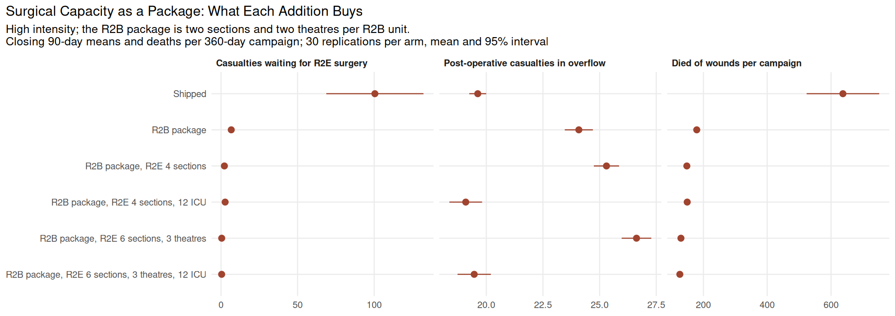

The closing 90-day mean R2E theatre queue (left), post-operative overflow census (centre) and deaths of wounds per campaign (right) at high intensity for the shipped establishment, the R2B package of two sections and two theatres per unit, and the R2B package with each R2E addition, each with its 95% interval.

### R2E Operating Theatre Establishment

**Question.** Does the number of R2E operating theatres or the number of surgical sections limit R2E surgery, and what does an added theatre buy when more sections share a shift than there are theatres? `[default and high_intensity, R2E 2 to 4 theatres crossed with 3 to 8 sections · 360 d · 30 replications · paired, closing 90 d]`

Each arm is an R2E theatre count crossed with a surgical section count, and the first row of each table states the sections on the larger shift against the theatres, the ratio the arms were chosen on ([Methods](Methods.md#r2e-operating-theatre-establishment-sweep)). Theatres are open around the clock, so theatre occupancy is the share of all theatre time in use. Every arm is compared with the shipped establishment, and three theatres at six sections with two theatres at six sections; Holm's adjustment is taken across all of those comparisons.

<!-- GEN ot_bed -->
| Response | 2 theatres, 3 sections (shipped) | 3 theatres, 3 sections | 2 theatres, 6 sections | 3 theatres, 6 sections | 4 theatres, 8 sections |
|---|---|---|---|---|---|
| Sections on the larger shift against theatres | 2 against 2 | 2 against 3 | 3 against 2 | 3 against 3 | 4 against 4 |
| R2E theatre mean queue | 0.66 [0.44, 0.88] | 0.96 [0.40, 1.52] | 0.27 [0.19, 0.34] | 0.07 [0.04, 0.10] | 0.02 [0.01, 0.03] |
| R2E theatre queue, late-half classification | converged at 0.85 | converged at 0.71 | converged at 0.32 | converged at 0.06 | **drifting, -11.4%/block**, 0.0 to 0.0 |
| R2E theatre queue shortfall per day | −0.002 [−0.010, 0.005] | 0.004 [−0.001, 0.008] | −0.001 [−0.002, 0.001] | 0.000 [0.000, 0.000] | 0.000 [0.000, 0.000] |
| R2E theatre occupancy (%) | 27.7 [26.4, 29.0] | 18.8 [17.7, 19.8] | 28.4 [26.9, 29.9] | 18.8 [17.8, 19.9] | 14.2 [13.5, 15.0] |
| R2E first surgeries | 1829.5 [1788.8, 1870.1] | 1800.7 [1749.5, 1851.8] | 1828.4 [1766.4, 1890.3] | 1789.2 [1745.1, 1833.3] | 1846.7 [1787.0, 1906.3] |
| R2E theatre entry deferred | 374.0 [362.8, 385.1] | 372.1 [356.5, 387.7] | 372.3 [352.3, 392.3] | 362.7 [348.2, 377.2] | 378.8 [361.9, 395.7] |
| Released with definitive repair outstanding | 132.3 [118.9, 145.7] | 123.0 [104.9, 141.1] | 93.5 [75.2, 111.9] | 33.5 [26.5, 40.6] | 17.9 [13.2, 22.6] |
| Diverted from R2B, theatre busy | 240.1 [226.4, 253.7] | 229.2 [212.9, 245.5] | 244.7 [224.7, 264.7] | 230.0 [216.7, 243.3] | 248.4 [229.1, 267.6] |
| R2E ICU occupancy (%) | 86.9 [86.1, 87.7] | 86.7 [85.8, 87.6] | 86.9 [86.2, 87.6] | 85.9 [85.1, 86.7] | 86.1 [85.4, 86.8] |
| R2E post-operative overflow census | 5.57 [5.18, 5.96] | 5.68 [5.22, 6.15] | 5.84 [5.39, 6.28] | 5.63 [5.20, 6.07] | 5.74 [5.31, 6.17] |
| R2E post-operative overflow, late-half classification | converged at 5.58 | converged at 5.46 | converged at 5.68 | converged at 5.61 | converged at 5.91 |
| R2E holding mean queue | 23.05 [21.41, 24.69] | 23.57 [22.09, 25.05] | 24.51 [22.73, 26.29] | 23.54 [22.07, 25.00] | 23.85 [22.69, 25.02] |
| R2E holding queue, late-half classification | converged at 23.1 | converged at 23.1 | converged at 23.9 | converged at 23.4 | converged at 23.7 |
| R2E staging overflow, late-half classification | converged at 32.7 | converged at 30.6 | converged at 33.0 | converged at 27.6 | converged at 33.8 |
| Post-definitive ICU access (%) | 35.2 [34.6, 35.8] | 35.6 [34.8, 36.3] | 34.9 [34.1, 35.8] | 34.9 [34.1, 35.7] | 33.8 [32.9, 34.7] |
| Died of wounds | 21.67 [17.68, 25.65] | 21.27 [17.70, 24.83] | 20.07 [16.90, 23.24] | 17.07 [15.58, 18.55] | 18.53 [15.95, 21.11] |
| Returns to duty | 2029.9 [2001.0, 2058.8] | 2027.1 [1994.1, 2060.1] | 2054.1 [2016.9, 2091.4] | 2037.8 [2008.0, 2067.6] | 2053.8 [2020.2, 2087.4] |
<!-- /GEN -->

The paired differences, each taken within replication, are in the next table.

<!-- GEN ot_bed_paired -->
| Paired difference | 3 theatres, 3 sections | 2 theatres, 6 sections | 3 theatres, 6 sections | 4 theatres, 8 sections | 3 theatres, 6 sections against 2 theatres, 6 sections |
|---|---|---|---|---|---|
| R2E theatre mean queue | +0.30 [−0.33, +0.92] | −0.39 [−0.59, −0.20] | −0.59 [−0.82, −0.37] | −0.64 [−0.86, −0.42] | −0.20 [−0.28, −0.12] |
| R2E theatre occupancy (%) | −9.0 [−10.6, −7.3] | +0.7 [−1.2, +2.6] | −8.9 [−10.4, −7.4] | −13.5 [−14.9, −12.1] | −9.6 [−11.5, −7.7] |
| R2E first surgeries | −28.8 [−81.0, +23.4] | −1.1 [−67.6, +65.4] | −40.3 [−94.7, +14.1] | +17.2 [−40.6, +75.0] | −39.2 [−112.1, +33.7] |
| R2E theatre entry deferred | −1.9 [−20.0, +16.2] | −1.7 [−24.1, +20.7] | −11.2 [−27.4, +5.0] | +4.8 [−12.7, +22.3] | −9.5 [−31.9, +12.8] |
| Released with definitive repair outstanding | −9.3 [−28.8, +10.2] | −38.8 [−59.1, −18.4] | −98.8 [−112.5, −85.0] | −114.4 [−126.7, −102.1] | −60.0 [−79.6, −40.4] |
| Diverted from R2B, theatre busy | −10.9 [−28.6, +6.8] | +4.7 [−16.5, +25.8] | −10.1 [−27.7, +7.6] | +8.3 [−10.5, +27.1] | −14.7 [−37.3, +7.8] |
| R2E ICU occupancy (%) | −0.2 [−1.5, +1.1] | +0.0 [−1.0, +1.1] | −1.0 [−2.1, +0.1] | −0.8 [−1.9, +0.2] | −1.0 [−2.1, +0.1] |
| R2E post-operative overflow census | +0.11 [−0.46, +0.69] | +0.27 [−0.30, +0.84] | +0.07 [−0.47, +0.60] | +0.17 [−0.41, +0.74] | −0.20 [−0.82, +0.41] |
| R2E holding mean queue | +0.52 [−1.84, +2.88] | +1.46 [−0.90, +3.81] | +0.48 [−1.67, +2.64] | +0.80 [−1.35, +2.95] | −0.97 [−3.25, +1.31] |
| Post-definitive ICU access (%) | +0.4 [−0.4, +1.2] | −0.3 [−1.2, +0.7] | −0.2 [−1.2, +0.7] | −1.4 [−2.3, −0.5]† | +0.0 [−1.1, +1.2] |
| Died of wounds | −0.40 [−4.56, +3.76] | −1.60 [−6.05, +2.85] | −4.60 [−8.24, −0.96]† | −3.13 [−7.67, +1.40] | −3.00 [−6.29, +0.29] |
| Returns to duty | −2.8 [−45.6, +40.0] | +24.2 [−20.2, +68.7] | +7.9 [−28.2, +44.0] | +23.9 [−19.4, +67.2] | −16.3 [−53.5, +20.9] |
<!-- /GEN -->

At the shipped establishment the R2E theatre queue averaged <!-- GEN cell:ot_bed|R2E theatre mean queue|2 theatres, 3 sections (shipped)|full -->0.66 [0.44, 0.88]<!-- /GEN --> over the closing 90 days and was classified <!-- GEN cell:ot_bed|R2E theatre queue, late-half classification|2 theatres, 3 sections (shipped)|full -->converged at 0.85<!-- /GEN -->, with a theatre occupancy of <!-- GEN cell:ot_bed|R2E theatre occupancy (%)|2 theatres, 3 sections (shipped)|full -->27.7 [26.4, 29.0]<!-- /GEN --> per cent. A third theatre at three sections changed the queue by <!-- GEN cell:ot_bed_paired|R2E theatre mean queue|3 theatres, 3 sections|full -->+0.30 [−0.33, +0.92]<!-- /GEN --> and deaths of wounds by <!-- GEN cell:ot_bed_paired|Died of wounds|3 theatres, 3 sections|full -->−0.40 [−4.56, +3.76]<!-- /GEN -->. Six sections at two theatres changed the queue by <!-- GEN cell:ot_bed_paired|R2E theatre mean queue|2 theatres, 6 sections|full -->−0.39 [−0.59, −0.20]<!-- /GEN --> and deaths of wounds by <!-- GEN cell:ot_bed_paired|Died of wounds|2 theatres, 6 sections|full -->−1.60 [−6.05, +2.85]<!-- /GEN -->, with a theatre occupancy of <!-- GEN cell:ot_bed|R2E theatre occupancy (%)|2 theatres, 6 sections|full -->28.4 [26.9, 29.9]<!-- /GEN --> per cent. Against that arm, a third theatre at six sections changed the queue by <!-- GEN cell:ot_bed_paired|R2E theatre mean queue|3 theatres, 6 sections against 2 theatres, 6 sections|full -->−0.20 [−0.28, −0.12]<!-- /GEN -->, deaths of wounds by <!-- GEN cell:ot_bed_paired|Died of wounds|3 theatres, 6 sections against 2 theatres, 6 sections|full -->−3.00 [−6.29, +0.29]<!-- /GEN -->, returns to duty by <!-- GEN cell:ot_bed_paired|Returns to duty|3 theatres, 6 sections against 2 theatres, 6 sections|full -->−16.3 [−53.5, +20.9]<!-- /GEN --> and the post-operative overflow census by <!-- GEN cell:ot_bed_paired|R2E post-operative overflow census|3 theatres, 6 sections against 2 theatres, 6 sections|full -->−0.20 [−0.82, +0.41]<!-- /GEN -->. Four theatres and eight sections changed deaths of wounds by <!-- GEN cell:ot_bed_paired|Died of wounds|4 theatres, 8 sections|full -->−3.13 [−7.67, +1.40]<!-- /GEN --> and returns to duty by <!-- GEN cell:ot_bed_paired|Returns to duty|4 theatres, 8 sections|full -->+23.9 [−19.4, +67.2]<!-- /GEN --> against the shipped establishment, and the queue was classified <!-- GEN cell:ot_bed|R2E theatre queue, late-half classification|4 theatres, 8 sections|full -->**drifting, -11.4%/block**, 0.0 to 0.0<!-- /GEN -->.

At high intensity the same five arms were run under the `high_intensity` profile (30 replications, 360 days, seed 42).

<!-- GEN ot_bed_high -->
| Response | 2 theatres, 3 sections (shipped) | 3 theatres, 3 sections | 2 theatres, 6 sections | 3 theatres, 6 sections | 4 theatres, 8 sections |
|---|---|---|---|---|---|
| Sections on the larger shift against theatres | 2 against 2 | 2 against 3 | 3 against 2 | 3 against 3 | 4 against 4 |
| R2E theatre mean queue | 100.45 [68.73, 132.18] | 40.87 [32.41, 49.32] | 10.46 [7.96, 12.97] | 1.61 [1.27, 1.95] | 0.47 [0.42, 0.52] |
| R2E theatre queue, late-half classification | converged at 97.9 | converged at 47.8 | converged at 10.5 | converged at 1.47 | converged at 0.46 |
| R2E theatre queue shortfall per day | 0.049 [−0.232, 0.330] | −0.099 [−0.253, 0.056] | −0.006 [−0.031, 0.020] | 0.002 [−0.001, 0.005] | 0.000 [−0.001, 0.000] |
| R2E theatre occupancy (%) | 76.8 [75.8, 77.9] | 52.2 [51.5, 52.9] | 83.5 [81.6, 85.5] | 64.3 [62.9, 65.8] | 51.4 [49.8, 53.1] |
| R2E first surgeries | 6221.5 [6138.6, 6304.3] | 6342.3 [6251.5, 6433.2] | 6290.8 [6201.7, 6379.9] | 6433.8 [6349.4, 6518.1] | 6413.2 [6305.4, 6521.0] |
| R2E theatre entry deferred | 1613.9 [1585.3, 1642.5] | 1635.7 [1612.9, 1658.4] | 1622.1 [1598.3, 1645.9] | 1641.8 [1613.7, 1669.8] | 1643.0 [1611.9, 1674.0] |
| Released with definitive repair outstanding | 1977.5 [1935.9, 2019.1] | 2037.6 [1985.4, 2089.8] | 1620.8 [1563.6, 1678.0] | 811.4 [773.6, 849.3] | 366.5 [341.2, 391.7] |
| Diverted from R2B, theatre busy | 1426.6 [1385.3, 1467.9] | 1428.2 [1395.9, 1460.5] | 1402.8 [1357.9, 1447.7] | 1447.6 [1410.2, 1485.1] | 1451.3 [1405.6, 1497.1] |
| R2E ICU occupancy (%) | 97.6 [97.5, 97.7] | 97.5 [97.4, 97.7] | 97.3 [97.1, 97.5] | 97.0 [96.8, 97.1] | 96.9 [96.7, 97.0] |
| R2E post-operative overflow census | 19.62 [19.25, 20.00] | 20.64 [20.33, 20.95] | 22.08 [21.53, 22.62] | 25.07 [24.43, 25.71] | 26.70 [25.77, 27.62] |
| R2E post-operative overflow, late-half classification | converged at 19.7 | converged at 20.6 | converged at 22.3 | converged at 25.1 | converged at 26.2 |
| R2E holding mean queue | 54.37 [52.11, 56.63] | 55.11 [53.39, 56.84] | 57.55 [55.19, 59.91] | 60.01 [57.71, 62.31] | 60.23 [57.53, 62.94] |
| R2E holding queue, late-half classification | converged at 53.1 | converged at 54.7 | converged at 56.9 | converged at 59.1 | converged at 59.0 |
| R2E staging overflow, late-half classification | **drifting, +4.9%/block**, 122.3 to 1,460.5 | **drifting, +5.2%/block**, 131.4 to 1,583.0 | **drifting, +4.5%/block**, 132.6 to 1,469.1 | **drifting, +2.8%/block**, 133.3 to 1,262.3 | **drifting, +1.9%/block**, 143.3 to 1,168.2 |
| Post-definitive ICU access (%) | 11.1 [11.0, 11.3] | 10.9 [10.6, 11.1] | 11.3 [11.0, 11.5] | 11.1 [10.9, 11.2] | 11.0 [10.7, 11.2] |
| Died of wounds | 637.23 [523.53, 750.93] | 451.37 [399.95, 502.78] | 224.20 [211.08, 237.32] | 137.17 [130.51, 143.82] | 116.97 [110.52, 123.41] |
| Returns to duty | 4254.5 [4208.7, 4300.3] | 4412.9 [4380.9, 4444.9] | 4660.9 [4589.3, 4732.5] | 5014.1 [4945.3, 5082.9] | 5078.7 [4993.0, 5164.5] |
<!-- /GEN -->

<!-- GEN ot_bed_paired_high -->
| Paired difference | 3 theatres, 3 sections | 2 theatres, 6 sections | 3 theatres, 6 sections | 4 theatres, 8 sections | 3 theatres, 6 sections against 2 theatres, 6 sections |
|---|---|---|---|---|---|
| R2E theatre mean queue | −59.59 [−92.08, −27.10] | −89.99 [−122.13, −57.85] | −98.84 [−130.60, −67.08] | −99.99 [−131.72, −68.25] | −8.85 [−11.38, −6.33] |
| R2E theatre occupancy (%) | −24.6 [−26.0, −23.3] | +6.7 [+4.3, +9.1] | −12.5 [−14.3, −10.7] | −25.4 [−27.6, −23.3] | −19.2 [−21.9, −16.5] |
| R2E first surgeries | +120.9 [−2.1, +243.8] | +69.3 [−49.4, +188.0] | +212.3 [+91.0, +333.6] | +191.7 [+51.3, +332.2]† | +143.0 [+21.4, +264.6]† |
| R2E theatre entry deferred | +21.8 [−16.2, +59.8] | +8.2 [−27.0, +43.4] | +27.9 [−12.6, +68.4] | +29.1 [−14.5, +72.7] | +19.7 [−15.2, +54.5] |
| Released with definitive repair outstanding | +60.1 [−9.0, +129.3] | −356.7 [−416.1, −297.3] | −1166.0 [−1221.9, −1110.1] | −1611.0 [−1658.0, −1564.0] | −809.3 [−876.0, −742.6] |
| Diverted from R2B, theatre busy | +1.6 [−50.7, +54.0] | −23.7 [−82.3, +34.8] | +21.1 [−35.9, +78.0] | +24.8 [−39.8, +89.3] | +44.8 [−14.7, +104.3] |
| R2E ICU occupancy (%) | −0.0 [−0.2, +0.1] | −0.3 [−0.5, −0.1]† | −0.6 [−0.8, −0.4] | −0.7 [−0.9, −0.5] | −0.3 [−0.6, −0.1]† |
| R2E post-operative overflow census | +1.02 [+0.55, +1.49] | +2.45 [+1.76, +3.15] | +5.45 [+4.65, +6.24] | +7.07 [+5.99, +8.16] | +2.99 [+2.07, +3.91] |
| R2E holding mean queue | +0.74 [−1.38, +2.87] | +3.18 [−0.47, +6.83] | +5.64 [+2.57, +8.71] | +5.86 [+2.83, +8.89] | +2.46 [−1.00, +5.93] |
| Post-definitive ICU access (%) | −0.3 [−0.6, +0.0] | +0.1 [−0.2, +0.4] | −0.1 [−0.3, +0.2] | −0.2 [−0.5, +0.1] | −0.2 [−0.4, +0.1] |
| Died of wounds | −185.87 [−311.72, −60.01]† | −413.03 [−528.30, −297.76] | −500.07 [−614.77, −385.36] | −520.27 [−634.77, −405.76] | −87.03 [−98.86, −75.20] |
| Returns to duty | +158.4 [+107.8, +209.0] | +406.4 [+320.3, +492.4] | +759.6 [+688.7, +830.5] | +824.2 [+715.8, +932.7] | +353.2 [+262.6, +443.8] |
<!-- /GEN -->

At the shipped establishment at high intensity the R2E theatre queue averaged <!-- GEN cell:ot_bed_high|R2E theatre mean queue|2 theatres, 3 sections (shipped)|full -->100.45 [68.73, 132.18]<!-- /GEN --> over the closing 90 days and was classified <!-- GEN cell:ot_bed_high|R2E theatre queue, late-half classification|2 theatres, 3 sections (shipped)|full -->converged at 97.9<!-- /GEN -->, with a theatre occupancy of <!-- GEN cell:ot_bed_high|R2E theatre occupancy (%)|2 theatres, 3 sections (shipped)|full -->76.8 [75.8, 77.9]<!-- /GEN --> per cent. A third theatre at three sections changed the queue by <!-- GEN cell:ot_bed_paired_high|R2E theatre mean queue|3 theatres, 3 sections|full -->−59.59 [−92.08, −27.10]<!-- /GEN --> and deaths of wounds by <!-- GEN cell:ot_bed_paired_high|Died of wounds|3 theatres, 3 sections|full -->−185.87 [−311.72, −60.01]†<!-- /GEN -->. Six sections at two theatres changed the queue by <!-- GEN cell:ot_bed_paired_high|R2E theatre mean queue|2 theatres, 6 sections|full -->−89.99 [−122.13, −57.85]<!-- /GEN --> and deaths of wounds by <!-- GEN cell:ot_bed_paired_high|Died of wounds|2 theatres, 6 sections|full -->−413.03 [−528.30, −297.76]<!-- /GEN -->, with a theatre occupancy of <!-- GEN cell:ot_bed_high|R2E theatre occupancy (%)|2 theatres, 6 sections|full -->83.5 [81.6, 85.5]<!-- /GEN --> per cent. Against that arm, a third theatre at six sections changed the queue by <!-- GEN cell:ot_bed_paired_high|R2E theatre mean queue|3 theatres, 6 sections against 2 theatres, 6 sections|full -->−8.85 [−11.38, −6.33]<!-- /GEN -->, deaths of wounds by <!-- GEN cell:ot_bed_paired_high|Died of wounds|3 theatres, 6 sections against 2 theatres, 6 sections|full -->−87.03 [−98.86, −75.20]<!-- /GEN -->, returns to duty by <!-- GEN cell:ot_bed_paired_high|Returns to duty|3 theatres, 6 sections against 2 theatres, 6 sections|full -->+353.2 [+262.6, +443.8]<!-- /GEN --> and the post-operative overflow census by <!-- GEN cell:ot_bed_paired_high|R2E post-operative overflow census|3 theatres, 6 sections against 2 theatres, 6 sections|full -->+2.99 [+2.07, +3.91]<!-- /GEN -->. Four theatres and eight sections changed deaths of wounds by <!-- GEN cell:ot_bed_paired_high|Died of wounds|4 theatres, 8 sections|full -->−520.27 [−634.77, −405.76]<!-- /GEN --> and returns to duty by <!-- GEN cell:ot_bed_paired_high|Returns to duty|4 theatres, 8 sections|full -->+824.2 [+715.8, +932.7]<!-- /GEN --> against the shipped establishment, and the queue was classified <!-- GEN cell:ot_bed_high|R2E theatre queue, late-half classification|4 theatres, 8 sections|full -->converged at 0.46<!-- /GEN -->.

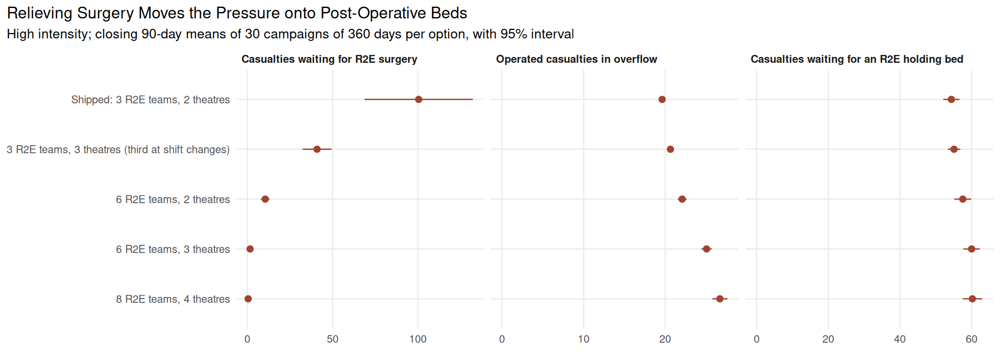

The closing 90-day mean R2E theatre queue (left), operated casualties in post-operative overflow (centre) and R2E holding queue (right) for each theatre and section establishment at high intensity, each with its 95% interval and every axis starting at zero. Three theatres at three sections is the null control, its added theatre being unusable.

### Surgery and Post-Operative Beds Together

**Question.** Once R2E surgery is raised to keep pace at high intensity, what do added R2E intensive care and holding beds buy behind it? `[high_intensity, 6 sections and 3 theatres crossed with 4 to 12 ICU and 30 to 90 holding beds · 360 d · 30 replications · paired, closing 90 d]`

The added surgery is six R2E surgical sections in three theatres, the [operating theatre arm](#r2e-operating-theatre-establishment) that clears the theatre queue without an idle room, crossed with four, eight and twelve intensive care beds and 30, 60 and 90 holding beds; the shipped establishment is carried as a tenth arm ([Methods](Methods.md#surgery-and-post-operative-bed-sweep)). Every arm is compared with the shipped establishment, which prices the whole change, and every bed arm with the added surgery at the shipped beds, which isolates what the beds buy. The post-operative care each arm gives is in the first table and its outcomes in the second.

<!-- GEN post_op_capacity -->
| Establishment | R2E ICU occupancy (%) | Post-definitive ICU access (%) | R2E post-operative overflow census | Post-operative overflow, late-half classification | R2E holding occupancy (%) | R2E holding mean queue | Holding queue, late-half classification |
|---|---|---|---|---|---|---|---|
| 3 sections, 2 theatres, 4 ICU, 30 hold (shipped) | 97.6 [97.5, 97.7] | 11.1 [11.0, 11.3] | 19.62 [19.25, 20.00] | converged at 19.7 | 100.0 [100.0, 100.0] | 54.37 [52.11, 56.63] | converged at 53.1 |
| 6 sections, 3 theatres, 4 ICU, 30 hold | 97.0 [96.8, 97.1] | 11.1 [10.9, 11.2] | 25.07 [24.43, 25.71] | converged at 25.1 | 100.0 [100.0, 100.0] | 60.01 [57.71, 62.31] | converged at 59.1 |
| 6 sections, 3 theatres, 4 ICU, 60 hold | 97.0 [96.9, 97.1] | 11.0 [10.8, 11.3] | 24.58 [23.97, 25.18] | converged at 24.7 | 100.0 [100.0, 100.0] | 51.37 [50.03, 52.71] | converged at 52.1 |
| 6 sections, 3 theatres, 4 ICU, 90 hold | 97.0 [96.9, 97.2] | 10.9 [10.7, 11.2] | 25.10 [24.45, 25.75] | converged at 24.9 | 100.0 [100.0, 100.0] | 53.15 [51.51, 54.79] | converged at 52.1 |
| 6 sections, 3 theatres, 8 ICU, 30 hold | 96.2 [96.0, 96.4] | 22.9 [22.5, 23.2] | 22.85 [22.21, 23.48] | **drifting, +1.1%/block**, 19.3 to 22.9 | 100.0 [100.0, 100.0] | 60.19 [57.65, 62.73] | **drifting, +1.4%/block**, 40.3 to 60.3 |
| 6 sections, 3 theatres, 8 ICU, 60 hold | 96.0 [95.7, 96.2] | 23.2 [22.9, 23.6] | 21.27 [20.84, 21.69] | converged at 21.4 | 100.0 [100.0, 100.0] | 51.44 [50.09, 52.78] | converged at 51.2 |
| 6 sections, 3 theatres, 8 ICU, 90 hold | 96.0 [95.8, 96.2] | 23.1 [22.7, 23.4] | 21.03 [20.50, 21.55] | converged at 21.2 | 100.0 [100.0, 100.0] | 51.80 [50.08, 53.52] | converged at 51.6 |
| 6 sections, 3 theatres, 12 ICU, 30 hold | 95.1 [94.7, 95.4] | 34.9 [34.4, 35.4] | 19.26 [18.50, 20.02] | **drifting, +1.8%/block**, 16.2 to 19.4 | 100.0 [100.0, 100.0] | 59.72 [57.88, 61.56] | **drifting, +1.5%/block**, 37.6 to 59.4 |
| 6 sections, 3 theatres, 12 ICU, 60 hold | 94.6 [94.1, 95.1] | 34.9 [34.4, 35.4] | 18.43 [17.63, 19.23] | converged at 18.2 | 100.0 [100.0, 100.0] | 50.49 [49.09, 51.89] | converged at 50.3 |
| 6 sections, 3 theatres, 12 ICU, 90 hold | 95.1 [94.8, 95.4] | 34.1 [33.7, 34.4] | 18.71 [18.22, 19.20] | converged at 18.6 | 100.0 [99.9, 100.0] | 51.03 [49.40, 52.66] | converged at 51.5 |
<!-- /GEN -->

<!-- GEN post_op_capacity_outcomes -->
| Establishment | R2E theatre mean queue | Released with definitive repair outstanding | Staging overflow, late-half classification | Died of wounds | Returns to duty |
|---|---|---|---|---|---|
| 3 sections, 2 theatres, 4 ICU, 30 hold (shipped) | 100.45 [68.73, 132.18] | 1977.5 [1935.9, 2019.1] | **drifting, +4.9%/block**, 122.3 to 1,460.5 | 637.23 [523.53, 750.93] | 4254.5 [4208.7, 4300.3] |
| 6 sections, 3 theatres, 4 ICU, 30 hold | 1.61 [1.27, 1.95] | 811.4 [773.6, 849.3] | **drifting, +2.8%/block**, 133.3 to 1,262.3 | 137.17 [130.51, 143.82] | 5014.1 [4945.3, 5082.9] |
| 6 sections, 3 theatres, 4 ICU, 60 hold | 1.48 [1.25, 1.72] | 811.8 [770.4, 853.1] | **drifting, +2.6%/block**, 119.2 to 1,234.5 | 138.73 [131.77, 145.70] | 4991.3 [4924.8, 5057.7] |
| 6 sections, 3 theatres, 4 ICU, 90 hold | 1.42 [1.27, 1.57] | 842.9 [793.6, 892.2] | **drifting, +3.0%/block**, 98.3 to 1,248.2 | 144.23 [135.07, 153.39] | 5028.1 [4944.3, 5112.0] |
| 6 sections, 3 theatres, 8 ICU, 30 hold | 1.61 [1.32, 1.90] | 822.0 [777.7, 866.4] | **drifting, +2.9%/block**, 143.3 to 1,288.2 | 136.40 [130.59, 142.21] | 4977.3 [4908.7, 5045.9] |
| 6 sections, 3 theatres, 8 ICU, 60 hold | 1.18 [1.05, 1.31] | 738.2 [704.6, 771.9] | **drifting, +3.0%/block**, 124.9 to 1,204.0 | 129.57 [123.19, 135.94] | 4914.1 [4838.9, 4989.2] |
| 6 sections, 3 theatres, 8 ICU, 90 hold | 1.26 [1.08, 1.43] | 769.3 [727.9, 810.7] | **drifting, +2.0%/block**, 108.4 to 1,168.6 | 131.83 [124.99, 138.68] | 4996.7 [4912.5, 5080.9] |
| 6 sections, 3 theatres, 12 ICU, 30 hold | 1.31 [1.09, 1.52] | 767.3 [717.8, 816.8] | **drifting, +3.2%/block**, 139.5 to 1,260.4 | 127.53 [119.36, 135.71] | 4921.5 [4864.2, 4978.7] |
| 6 sections, 3 theatres, 12 ICU, 60 hold | 1.17 [1.00, 1.34] | 724.7 [682.1, 767.2] | **drifting, +2.4%/block**, 123.0 to 1,200.0 | 125.77 [118.64, 132.89] | 4927.0 [4852.6, 5001.4] |
| 6 sections, 3 theatres, 12 ICU, 90 hold | 1.31 [1.14, 1.49] | 815.0 [778.5, 851.6] | **drifting, +2.5%/block**, 103.8 to 1,225.5 | 130.10 [123.30, 136.90] | 5051.2 [4996.4, 5106.1] |
<!-- /GEN -->

The paired differences against the shipped establishment are in the next table, and against the added surgery at the shipped beds in the one after.

<!-- GEN post_op_capacity_paired -->
| Paired difference against 3 sections, 2 theatres, 4 ICU, 30 hold | R2E ICU occupancy (%) | Post-definitive ICU access (%) | R2E post-operative overflow census | R2E holding mean queue | Died of wounds | Returns to duty |
|---|---|---|---|---|---|---|
| 6 sections, 3 theatres, 4 ICU, 30 hold | −0.6 [−0.8, −0.4] | −0.1 [−0.3, +0.2] | +5.45 [+4.65, +6.24] | +5.64 [+2.57, +8.71]† | −500.07 [−614.77, −385.36] | +759.6 [+688.7, +830.5] |
| 6 sections, 3 theatres, 4 ICU, 60 hold | −0.6 [−0.7, −0.4] | −0.1 [−0.4, +0.2] | +4.95 [+4.33, +5.58] | −3.00 [−5.89, −0.11]† | −498.50 [−611.32, −385.68] | +736.8 [+664.5, +809.0] |
| 6 sections, 3 theatres, 4 ICU, 90 hold | −0.6 [−0.7, −0.4] | −0.2 [−0.5, +0.1] | +5.48 [+4.69, +6.26] | −1.22 [−4.19, +1.74] | −493.00 [−606.30, −379.70] | +773.6 [+684.5, +862.7] |
| 6 sections, 3 theatres, 8 ICU, 30 hold | −1.4 [−1.6, −1.2] | +11.7 [+11.4, +12.1] | +3.22 [+2.57, +3.88] | +5.82 [+2.83, +8.82] | −500.83 [−614.45, −387.22] | +722.8 [+640.5, +805.2] |
| 6 sections, 3 theatres, 8 ICU, 60 hold | −1.6 [−1.9, −1.3] | +12.1 [+11.7, +12.5] | +1.65 [+1.07, +2.22] | −2.93 [−5.56, −0.31]† | −507.67 [−622.82, −392.51] | +659.6 [+575.0, +744.1] |
| 6 sections, 3 theatres, 8 ICU, 90 hold | −1.6 [−1.8, −1.4] | +11.9 [+11.6, +12.3] | +1.40 [+0.88, +1.93] | −2.57 [−5.52, +0.37] | −505.40 [−620.22, −390.58] | +742.2 [+643.2, +841.2] |
| 6 sections, 3 theatres, 12 ICU, 30 hold | −2.5 [−2.9, −2.2] | +23.7 [+23.1, +24.3] | −0.37 [−1.23, +0.50] | +5.35 [+2.38, +8.32]† | −509.70 [−626.46, −392.94] | +667.0 [+587.4, +746.6] |
| 6 sections, 3 theatres, 12 ICU, 60 hold | −3.0 [−3.4, −2.5] | +23.8 [+23.2, +24.3] | −1.19 [−2.05, −0.34]† | −3.88 [−6.63, −1.13]† | −511.47 [−625.37, −397.56] | +672.5 [+580.0, +765.0] |
| 6 sections, 3 theatres, 12 ICU, 90 hold | −2.5 [−2.7, −2.2] | +22.9 [+22.5, +23.4] | −0.91 [−1.50, −0.32]† | −3.34 [−5.90, −0.78]† | −507.13 [−618.93, −395.33] | +796.7 [+719.0, +874.5] |
<!-- /GEN -->

<!-- GEN post_op_capacity_paired_surgery -->
| Paired difference against 6 sections, 3 theatres, 4 ICU, 30 hold | R2E ICU occupancy (%) | Post-definitive ICU access (%) | R2E post-operative overflow census | R2E holding mean queue | Died of wounds | Returns to duty |
|---|---|---|---|---|---|---|
| 6 sections, 3 theatres, 4 ICU, 60 hold | +0.0 [−0.2, +0.2] | −0.0 [−0.3, +0.2] | −0.49 [−1.41, +0.42] | −8.64 [−11.11, −6.17] | +1.57 [−9.01, +12.15] | −22.8 [−119.6, +73.9] |
| 6 sections, 3 theatres, 4 ICU, 90 hold | +0.0 [−0.2, +0.3] | −0.1 [−0.4, +0.1] | +0.03 [−0.88, +0.95] | −6.86 [−9.41, −4.32] | +7.07 [−2.85, +16.98] | +14.0 [−83.7, +111.7] |
| 6 sections, 3 theatres, 8 ICU, 30 hold | −0.8 [−1.1, −0.5] | +11.8 [+11.4, +12.1] | −2.22 [−2.95, −1.50] | +0.18 [−3.04, +3.40] | −0.77 [−9.22, +7.69] | −36.8 [−126.2, +52.7] |
| 6 sections, 3 theatres, 8 ICU, 60 hold | −1.0 [−1.2, −0.7] | +12.1 [+11.8, +12.5] | −3.80 [−4.51, −3.09] | −8.57 [−10.96, −6.19] | −7.60 [−15.53, +0.33] | −100.0 [−187.4, −12.6]† |
| 6 sections, 3 theatres, 8 ICU, 90 hold | −1.0 [−1.2, −0.7] | +12.0 [+11.6, +12.4] | −4.04 [−4.85, −3.24] | −8.21 [−10.66, −5.76] | −5.33 [−15.67, +5.01] | −17.4 [−135.2, +100.5] |
| 6 sections, 3 theatres, 12 ICU, 30 hold | −1.9 [−2.3, −1.5] | +23.8 [+23.2, +24.4] | −5.81 [−6.90, −4.72] | −0.29 [−3.33, +2.75] | −9.63 [−20.63, +1.37] | −92.6 [−180.6, −4.7]† |
| 6 sections, 3 theatres, 12 ICU, 60 hold | −2.4 [−2.9, −1.8] | +23.8 [+23.3, +24.3] | −6.64 [−7.63, −5.65] | −9.52 [−11.91, −7.13] | −11.40 [−18.66, −4.14]† | −87.1 [−182.1, +7.9] |
| 6 sections, 3 theatres, 12 ICU, 90 hold | −1.9 [−2.2, −1.6] | +23.0 [+22.6, +23.4] | −6.36 [−7.05, −5.66] | −8.98 [−11.53, −6.42] | −7.07 [−17.27, +3.14] | +37.1 [−50.1, +124.3] |
<!-- /GEN -->

With the added surgery at the shipped beds the post-operative overflow census averaged <!-- GEN cell:post_op_capacity|6 sections, 3 theatres, 4 ICU, 30 hold|R2E post-operative overflow census|full -->25.07 [24.43, 25.71]<!-- /GEN --> against <!-- GEN cell:post_op_capacity|3 sections, 2 theatres, 4 ICU, 30 hold (shipped)|R2E post-operative overflow census|full -->19.62 [19.25, 20.00]<!-- /GEN --> at the shipped establishment, and post-definitive intensive care access <!-- GEN cell:post_op_capacity|6 sections, 3 theatres, 4 ICU, 30 hold|Post-definitive ICU access (%)|full -->11.1 [10.9, 11.2]<!-- /GEN --> percent. Against the added surgery alone, eight intensive care beds at 30 holding beds changed the census by <!-- GEN cell:post_op_capacity_paired_surgery|6 sections, 3 theatres, 8 ICU, 30 hold|R2E post-operative overflow census|full -->−2.22 [−2.95, −1.50]<!-- /GEN --> and twelve by <!-- GEN cell:post_op_capacity_paired_surgery|6 sections, 3 theatres, 12 ICU, 30 hold|R2E post-operative overflow census|full -->−5.81 [−6.90, −4.72]<!-- /GEN -->, to <!-- GEN cell:post_op_capacity|6 sections, 3 theatres, 12 ICU, 30 hold|R2E post-operative overflow census|full -->19.26 [18.50, 20.02]<!-- /GEN -->, with access changing by <!-- GEN cell:post_op_capacity_paired_surgery|6 sections, 3 theatres, 12 ICU, 30 hold|Post-definitive ICU access (%)|full -->+23.8 [+23.2, +24.4]<!-- /GEN --> percentage points; against the shipped establishment the census at twelve beds changed by <!-- GEN cell:post_op_capacity_paired|6 sections, 3 theatres, 12 ICU, 30 hold|R2E post-operative overflow census|full -->−0.37 [−1.23, +0.50]<!-- /GEN -->. The R2E holding beds were <!-- GEN cell:post_op_capacity|6 sections, 3 theatres, 4 ICU, 90 hold|R2E holding occupancy (%)|full -->100.0 [100.0, 100.0]<!-- /GEN --> percent occupied at 90 holding beds, and against 30 holding beds at four intensive care beds the holding queue changed by <!-- GEN cell:post_op_capacity_paired_surgery|6 sections, 3 theatres, 4 ICU, 90 hold|R2E holding mean queue|full -->−6.86 [−9.41, −4.32]<!-- /GEN -->; it was classified <!-- GEN cell:post_op_capacity|6 sections, 3 theatres, 8 ICU, 90 hold|Holding queue, late-half classification|full -->converged at 51.6<!-- /GEN --> at eight intensive care beds and 90 holding beds and <!-- GEN cell:post_op_capacity|6 sections, 3 theatres, 12 ICU, 90 hold|Holding queue, late-half classification|full -->converged at 51.5<!-- /GEN --> at twelve, and converged in every arm at 30 or 60 holding beds. Against the added surgery alone no bed arm's paired difference in deaths of wounds excluded zero, twelve intensive care beds at 60 holding beds changing it by <!-- GEN cell:post_op_capacity_paired_surgery|6 sections, 3 theatres, 12 ICU, 60 hold|Died of wounds|full -->−11.40 [−18.66, −4.14]†<!-- /GEN -->, while the added surgery alone changed it by <!-- GEN cell:post_op_capacity_paired|6 sections, 3 theatres, 4 ICU, 30 hold|Died of wounds|full -->−500.07 [−614.77, −385.36]<!-- /GEN --> against the shipped establishment. The staging overflow census drifted in every arm: <!-- GEN cell:post_op_capacity_outcomes|3 sections, 2 theatres, 4 ICU, 30 hold (shipped)|Staging overflow, late-half classification|full -->**drifting, +4.9%/block**, 122.3 to 1,460.5<!-- /GEN --> at the shipped establishment and <!-- GEN cell:post_op_capacity_outcomes|6 sections, 3 theatres, 12 ICU, 90 hold|Staging overflow, late-half classification|full -->**drifting, +2.5%/block**, 103.8 to 1,225.5<!-- /GEN --> at twelve intensive care and 90 holding beds.

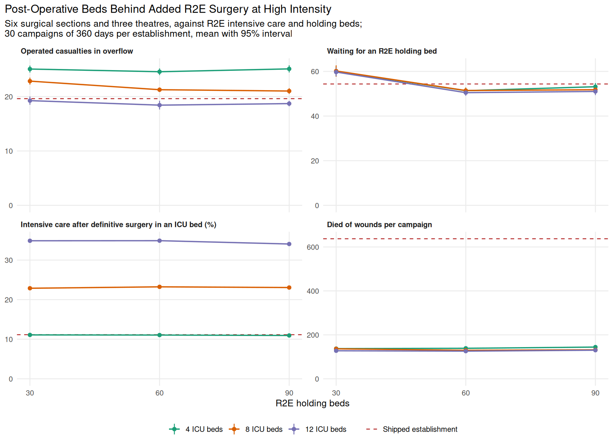

The closing 90-day post-operative overflow census, R2E holding queue and post-definitive intensive care access, and deaths of wounds over the campaign, against the R2E holding bed count with one line per intensive care bed count, every arm at six surgical sections and three theatres at high intensity, each with its 95% interval and every axis starting at zero. The dashed line marks the shipped establishment.

### R2E Intensive Care Bed Establishment

**Question.** What changes when the R2E intensive care establishment is raised from the shipped four beds, and does the post-operative overflow census, where an operated casualty finding no intensive care bed is placed, stop growing at any bed count swept? `[default and high_intensity, R2E ICU 4 to 16 beds · 360 d · 30 replications · paired, closing 90 d]`

Each arm is a bed count for the R2E intensive care pool: four (shipped), six, eight, twelve and sixteen. No stay at R2E seizes an intensive care section, so the beds are varied without staff and the nurses per bed row is the shipped three sections of four nurses over the bed count, a ratio the model does not charge. R2B intensive care beds are not varied.

<!-- GEN icu_bed -->
| Response | 4 beds (shipped) | 6 beds | 8 beds | 12 beds | 16 beds |
|---|---|---|---|---|---|
| Nurses per ICU bed at three sections | 3.00 | 2.00 | 1.50 | 1.00 | 0.75 |
| R2E post-operative overflow census | 5.57 [5.18, 5.96] | 4.36 [3.95, 4.78] | 3.17 [2.82, 3.52] | 1.99 [1.75, 2.22] | 1.17 [1.00, 1.35] |
| R2E post-operative overflow, late-half classification | converged at 5.58 | converged at 4.28 | converged at 3.34 | converged at 1.88 | converged at 1.11 |
| R2E post-operative overflow growth per day | 0.001 [−0.003, 0.005] | 0.001 [−0.003, 0.004] | −0.001 [−0.004, 0.001] | 0.001 [−0.001, 0.004] | 0.000 [−0.002, 0.002] |
| R2E ICU occupancy (%) | 86.9 [86.1, 87.7] | 81.9 [81.0, 82.9] | 75.2 [74.1, 76.3] | 63.8 [62.4, 65.2] | 54.6 [53.0, 56.2] |
| R2E holding mean queue | 23.05 [21.41, 24.69] | 23.32 [22.20, 24.43] | 22.68 [21.18, 24.19] | 23.57 [22.36, 24.78] | 24.06 [22.82, 25.29] |
| R2E holding queue, late-half classification | converged at 23.1 | converged at 23.4 | converged at 23.2 | converged at 23.2 | **drifting, +1.9%/block**, 15.7 to 25.6 |
| R2E holding queue shortfall per day | 0.002 [−0.013, 0.018] | 0.001 [−0.010, 0.012] | −0.006 [−0.020, 0.009] | 0.009 [−0.006, 0.024] | 0.015 [0.000, 0.030] |
| R2E staging overflow, late-half classification | converged at 32.7 | converged at 31.0 | converged at 31.6 | converged at 29.1 | converged at 31.8 |
| Post-operative care in a holding bed (%) | 36.5 [36.1, 37.0] | 29.4 [28.8, 29.9] | 22.9 [22.3, 23.5] | 13.3 [12.7, 14.0] | 7.8 [7.2, 8.5] |
| Post-definitive ICU access (%) | 35.2 [34.6, 35.8] | 50.5 [49.7, 51.2] | 62.4 [61.3, 63.4] | 79.2 [78.3, 80.2] | 88.3 [87.3, 89.2] |
| R2E theatre entry deferred | 374.0 [362.8, 385.1] | 301.0 [287.6, 314.5] | 238.8 [224.7, 252.9] | 139.0 [131.3, 146.8] | 80.8 [70.2, 91.5] |
| Died of wounds | 21.67 [17.68, 25.65] | 20.30 [17.08, 23.52] | 20.73 [17.51, 23.96] | 17.90 [15.92, 19.88] | 18.43 [14.29, 22.57] |
| Returns to duty | 2029.9 [2001.0, 2058.8] | 2031.9 [2002.1, 2061.7] | 2026.5 [1997.4, 2055.5] | 2031.7 [2005.9, 2057.5] | 2024.3 [1992.8, 2055.9] |
| Critical-route evacuation wait (days) | 6.29 [5.64, 6.94] | 5.92 [5.37, 6.46] | 5.90 [5.13, 6.67] | 5.59 [5.21, 5.98] | 6.09 [4.80, 7.38] |
| Role 4 peak census | 209.0 [205.4, 212.6] | 210.7 [206.8, 214.6] | 211.5 [206.2, 216.8] | 209.5 [206.3, 212.8] | 209.2 [204.2, 214.2] |
| Role 4 closing mean census | 121.2 [117.3, 125.1] | 118.6 [113.9, 123.3] | 118.9 [113.6, 124.2] | 120.1 [116.7, 123.4] | 120.5 [115.4, 125.6] |
<!-- /GEN -->

<!-- GEN icu_bed_paired -->
| Paired difference against the shipped establishment | 6 beds | 8 beds | 12 beds | 16 beds |
|---|---|---|---|---|
| R2E post-operative overflow census | −1.20 [−1.75, −0.66] | −2.40 [−2.88, −1.91] | −3.58 [−4.00, −3.17] | −4.39 [−4.83, −3.96] |
| R2E ICU occupancy (%) | −4.9 [−6.3, −3.6] | −11.7 [−13.0, −10.5] | −23.1 [−24.4, −21.8] | −32.3 [−33.9, −30.7] |
| R2E holding mean queue | +0.27 [−1.61, +2.15] | −0.37 [−2.11, +1.37] | +0.52 [−1.57, +2.62] | +1.01 [−0.90, +2.91] |
| Post-operative care in a holding bed (%) | −7.2 [−7.8, −6.5] | −13.6 [−14.5, −12.8] | −23.2 [−23.8, −22.5] | −28.7 [−29.5, −27.8] |
| Post-definitive ICU access (%) | +15.3 [+14.5, +16.1] | +27.2 [+26.2, +28.2] | +44.1 [+43.0, +45.1] | +53.1 [+51.9, +54.3] |
| R2E theatre entry deferred | −72.9 [−88.5, −57.3] | −135.2 [−150.0, −120.3] | −234.9 [−247.1, −222.8] | −293.1 [−308.7, −277.6] |
| Died of wounds | −1.37 [−5.19, +2.45] | −0.93 [−4.66, +2.80] | −3.77 [−7.59, +0.05] | −3.23 [−8.66, +2.19] |
| Returns to duty | +2.0 [−40.8, +44.8] | −3.4 [−38.9, +32.1] | +1.8 [−37.7, +41.3] | −5.6 [−44.0, +32.9] |
| Critical-route evacuation wait (days) | −0.37 [−1.09, +0.34] | −0.39 [−1.12, +0.34] | −0.70 [−1.38, −0.02]† | −0.20 [−1.68, +1.28] |
| Role 4 peak census | +1.7 [−2.7, +6.1] | +2.5 [−3.4, +8.3] | +0.5 [−3.8, +4.9] | +0.2 [−6.7, +7.1] |
| Role 4 closing mean census | −2.6 [−8.1, +2.9] | −2.3 [−8.8, +4.2] | −1.1 [−5.9, +3.6] | −0.7 [−6.6, +5.1] |
<!-- /GEN -->

At the shipped establishment the R2E post-operative overflow census over the closing 90 days averaged <!-- GEN cell:icu_bed|R2E post-operative overflow census|4 beds (shipped)|full -->5.57 [5.18, 5.96]<!-- /GEN --> and was classified <!-- GEN cell:icu_bed|R2E post-operative overflow, late-half classification|4 beds (shipped)|full -->converged at 5.58<!-- /GEN -->, with <!-- GEN cell:icu_bed|R2E ICU occupancy (%)|4 beds (shipped)|full -->86.9 [86.1, 87.7]<!-- /GEN --> percent occupancy of the intensive care beds; <!-- GEN cell:icu_bed|Post-operative care in a holding bed (%)|4 beds (shipped)|full -->36.5 [36.1, 37.0]<!-- /GEN --> percent of post-operative care was taken in a holding bed and <!-- GEN cell:icu_bed|Post-definitive ICU access (%)|4 beds (shipped)|full -->35.2 [34.6, 35.8]<!-- /GEN --> percent of post-definitive care in an intensive care bed. At sixteen beds the census averaged <!-- GEN cell:icu_bed|R2E post-operative overflow census|16 beds|full -->1.17 [1.00, 1.35]<!-- /GEN -->. Twelve beds changed the share of post-operative care taken in a holding bed by <!-- GEN cell:icu_bed_paired|Post-operative care in a holding bed (%)|12 beds|full -->−23.2 [−23.8, −22.5]<!-- /GEN --> percentage points and the post-definitive access by <!-- GEN cell:icu_bed_paired|Post-definitive ICU access (%)|12 beds|full -->+44.1 [+43.0, +45.1]<!-- /GEN --> percentage points. The paired differences in deaths of wounds at six, eight, twelve and sixteen beds were <!-- GEN cell:icu_bed_paired|Died of wounds|6 beds|full -->−1.37 [−5.19, +2.45]<!-- /GEN -->, <!-- GEN cell:icu_bed_paired|Died of wounds|8 beds|full -->−0.93 [−4.66, +2.80]<!-- /GEN -->, <!-- GEN cell:icu_bed_paired|Died of wounds|12 beds|full -->−3.77 [−7.59, +0.05]<!-- /GEN --> and <!-- GEN cell:icu_bed_paired|Died of wounds|16 beds|full -->−3.23 [−8.66, +2.19]<!-- /GEN -->, and in returns to duty <!-- GEN cell:icu_bed_paired|Returns to duty|6 beds|full -->+2.0 [−40.8, +44.8]<!-- /GEN -->, <!-- GEN cell:icu_bed_paired|Returns to duty|8 beds|full -->−3.4 [−38.9, +32.1]<!-- /GEN -->, <!-- GEN cell:icu_bed_paired|Returns to duty|12 beds|full -->+1.8 [−37.7, +41.3]<!-- /GEN --> and <!-- GEN cell:icu_bed_paired|Returns to duty|16 beds|full -->−5.6 [−44.0, +32.9]<!-- /GEN -->. The R2E holding queue was classified <!-- GEN cell:icu_bed|R2E holding queue, late-half classification|4 beds (shipped)|full -->converged at 23.1<!-- /GEN --> at the shipped establishment and <!-- GEN cell:icu_bed|R2E holding queue, late-half classification|16 beds|full -->**drifting, +1.9%/block**, 15.7 to 25.6<!-- /GEN --> at sixteen beds.

At high intensity the same five arms were run under the `high_intensity` profile (30 replications, 360 days, seed 42).

<!-- GEN icu_bed_high -->
| Response | 4 beds (shipped) | 6 beds | 8 beds | 12 beds | 16 beds |
|---|---|---|---|---|---|
| Nurses per ICU bed at three sections | 3.00 | 2.00 | 1.50 | 1.00 | 0.75 |
| R2E post-operative overflow census | 19.62 [19.25, 20.00] | 18.42 [18.08, 18.76] | 16.97 [16.66, 17.27] | 14.58 [14.28, 14.87] | 11.59 [11.11, 12.07] |
| R2E post-operative overflow, late-half classification | converged at 19.7 | converged at 18.5 | converged at 17.1 | converged at 14.5 | converged at 11.5 |
| R2E post-operative overflow growth per day | −0.001 [−0.004, 0.003] | −0.001 [−0.004, 0.002] | −0.004 [−0.006, −0.002] | 0.001 [−0.001, 0.004] | 0.000 [−0.003, 0.004] |
| R2E ICU occupancy (%) | 97.6 [97.5, 97.7] | 97.3 [97.2, 97.4] | 97.1 [97.0, 97.2] | 96.7 [96.5, 96.8] | 95.4 [95.0, 95.9] |
| R2E holding mean queue | 54.37 [52.11, 56.63] | 54.97 [53.21, 56.72] | 53.72 [51.57, 55.86] | 54.55 [52.71, 56.39] | 53.65 [51.78, 55.52] |
| R2E holding queue, late-half classification | converged at 53.1 | converged at 54.9 | converged at 53.4 | converged at 54.4 | converged at 53.3 |
| R2E holding queue shortfall per day | 0.013 [−0.007, 0.033] | −0.006 [−0.025, 0.014] | 0.001 [−0.022, 0.023] | 0.007 [−0.014, 0.027] | 0.001 [−0.017, 0.020] |
| R2E staging overflow, late-half classification | **drifting, +4.9%/block**, 122.3 to 1,460.5 | **drifting, +4.8%/block**, 120.8 to 1,478.3 | **drifting, +4.6%/block**, 120.9 to 1,452.2 | **drifting, +5.1%/block**, 122.4 to 1,470.2 | **drifting, +4.4%/block**, 124.6 to 1,439.6 |
| Post-operative care in a holding bed (%) | 43.3 [43.1, 43.5] | 40.5 [40.3, 40.8] | 37.6 [37.4, 37.8] | 31.9 [31.6, 32.1] | 25.7 [25.4, 26.0] |
| Post-definitive ICU access (%) | 11.1 [11.0, 11.3] | 17.1 [16.8, 17.4] | 23.1 [22.8, 23.4] | 35.2 [34.8, 35.6] | 47.7 [47.1, 48.4] |
| R2E theatre entry deferred | 1613.9 [1585.3, 1642.5] | 1531.4 [1503.5, 1559.3] | 1453.7 [1431.1, 1476.3] | 1279.1 [1262.1, 1296.2] | 1065.6 [1045.3, 1085.8] |
| Died of wounds | 637.23 [523.53, 750.93] | 642.53 [539.39, 745.68] | 654.77 [547.57, 761.96] | 706.50 [599.44, 813.56] | 688.07 [554.02, 822.12] |
| Returns to duty | 4254.5 [4208.7, 4300.3] | 4316.2 [4273.6, 4358.9] | 4255.8 [4217.7, 4293.9] | 4288.7 [4261.7, 4315.6] | 4262.6 [4222.3, 4302.9] |
| Critical-route evacuation wait (days) | 88.57 [87.38, 89.76] | 88.70 [87.73, 89.67] | 88.64 [87.42, 89.87] | 88.97 [88.01, 89.94] | 89.20 [88.32, 90.09] |
| Role 4 peak census | 281.7 [279.1, 284.3] | 282.1 [280.5, 283.7] | 281.7 [279.3, 284.1] | 284.6 [282.1, 287.2] | 282.4 [280.2, 284.6] |
| Role 4 closing mean census | 175.3 [173.4, 177.2] | 175.5 [173.9, 177.1] | 175.2 [173.7, 176.7] | 177.6 [175.8, 179.4] | 177.1 [175.2, 179.1] |
<!-- /GEN -->

<!-- GEN icu_bed_paired_high -->
| Paired difference against the shipped establishment | 6 beds | 8 beds | 12 beds | 16 beds |
|---|---|---|---|---|
| R2E post-operative overflow census | −1.20 [−1.71, −0.70] | −2.66 [−3.15, −2.16] | −5.05 [−5.49, −4.60] | −8.03 [−8.61, −7.45] |
| R2E ICU occupancy (%) | −0.3 [−0.4, −0.1] | −0.5 [−0.7, −0.4] | −0.9 [−1.1, −0.8] | −2.1 [−2.6, −1.7] |
| R2E holding mean queue | +0.60 [−2.09, +3.28] | −0.65 [−3.81, +2.51] | +0.18 [−2.22, +2.58] | −0.72 [−3.45, +2.02] |
| Post-operative care in a holding bed (%) | −2.7 [−3.1, −2.4] | −5.7 [−6.0, −5.4] | −11.4 [−11.8, −11.1] | −17.5 [−17.9, −17.2] |
| Post-definitive ICU access (%) | +5.9 [+5.6, +6.2] | +12.0 [+11.6, +12.4] | +24.0 [+23.6, +24.4] | +36.6 [+35.9, +37.2] |
| R2E theatre entry deferred | −82.5 [−123.6, −41.4] | −160.2 [−202.0, −118.4] | −334.8 [−366.3, −303.2] | −548.3 [−582.1, −514.5] |
| Died of wounds | +5.30 [−161.08, +171.68] | +17.53 [−143.36, +178.43] | +69.27 [−93.53, +232.06] | +50.83 [−133.88, +235.55] |
| Returns to duty | +61.7 [+12.8, +110.7]† | +1.3 [−52.7, +55.2] | +34.2 [−18.4, +86.8] | +8.1 [−53.4, +69.6] |
| Critical-route evacuation wait (days) | +0.14 [−1.13, +1.41] | +0.08 [−1.77, +1.93] | +0.40 [−1.13, +1.94] | +0.64 [−0.72, +2.00] |
| Role 4 peak census | +0.4 [−2.7, +3.5] | +0.0 [−3.0, +3.0] | +2.9 [−1.1, +7.0] | +0.7 [−2.3, +3.7] |
| Role 4 closing mean census | +0.2 [−1.7, +2.1] | −0.1 [−2.5, +2.3] | +2.3 [+0.3, +4.2]† | +1.8 [−1.2, +4.9] |
<!-- /GEN -->

At the shipped establishment the high-intensity post-operative overflow census averaged <!-- GEN cell:icu_bed_high|R2E post-operative overflow census|4 beds (shipped)|full -->19.62 [19.25, 20.00]<!-- /GEN --> and was classified <!-- GEN cell:icu_bed_high|R2E post-operative overflow, late-half classification|4 beds (shipped)|full -->converged at 19.7<!-- /GEN -->, with <!-- GEN cell:icu_bed_high|R2E ICU occupancy (%)|4 beds (shipped)|full -->97.6 [97.5, 97.7]<!-- /GEN --> percent occupancy. At sixteen beds, four times the shipped establishment, the census averaged <!-- GEN cell:icu_bed_high|R2E post-operative overflow census|16 beds|full -->11.59 [11.11, 12.07]<!-- /GEN --> and was classified <!-- GEN cell:icu_bed_high|R2E post-operative overflow, late-half classification|16 beds|full -->converged at 11.5<!-- /GEN -->, and post-definitive intensive care access changed by <!-- GEN cell:icu_bed_paired_high|Post-definitive ICU access (%)|16 beds|full -->+36.6 [+35.9, +37.2]<!-- /GEN --> percentage points. The R2E holding queue was classified <!-- GEN cell:icu_bed_high|R2E holding queue, late-half classification|4 beds (shipped)|full -->converged at 53.1<!-- /GEN --> at the shipped establishment and <!-- GEN cell:icu_bed_high|R2E holding queue, late-half classification|16 beds|full -->converged at 53.3<!-- /GEN --> at sixteen, and the staging overflow census <!-- GEN cell:icu_bed_high|R2E staging overflow, late-half classification|4 beds (shipped)|full -->**drifting, +4.9%/block**, 122.3 to 1,460.5<!-- /GEN --> and <!-- GEN cell:icu_bed_high|R2E staging overflow, late-half classification|16 beds|full -->**drifting, +4.4%/block**, 124.6 to 1,439.6<!-- /GEN -->. The mean evacuation wait of the critical route was <!-- GEN cell:icu_bed_high|Critical-route evacuation wait (days)|4 beds (shipped)|full -->88.57 [87.38, 89.76]<!-- /GEN --> days at the shipped establishment and <!-- GEN cell:icu_bed_high|Critical-route evacuation wait (days)|16 beds|full -->89.20 [88.32, 90.09]<!-- /GEN --> days at sixteen beds. The paired differences in deaths of wounds at six, eight, twelve and sixteen beds were <!-- GEN cell:icu_bed_paired_high|Died of wounds|6 beds|full -->+5.30 [−161.08, +171.68]<!-- /GEN -->, <!-- GEN cell:icu_bed_paired_high|Died of wounds|8 beds|full -->+17.53 [−143.36, +178.43]<!-- /GEN -->, <!-- GEN cell:icu_bed_paired_high|Died of wounds|12 beds|full -->+69.27 [−93.53, +232.06]<!-- /GEN --> and <!-- GEN cell:icu_bed_paired_high|Died of wounds|16 beds|full -->+50.83 [−133.88, +235.55]<!-- /GEN -->, and in returns to duty at sixteen beds <!-- GEN cell:icu_bed_paired_high|Returns to duty|16 beds|full -->+8.1 [−53.4, +69.6]<!-- /GEN -->.

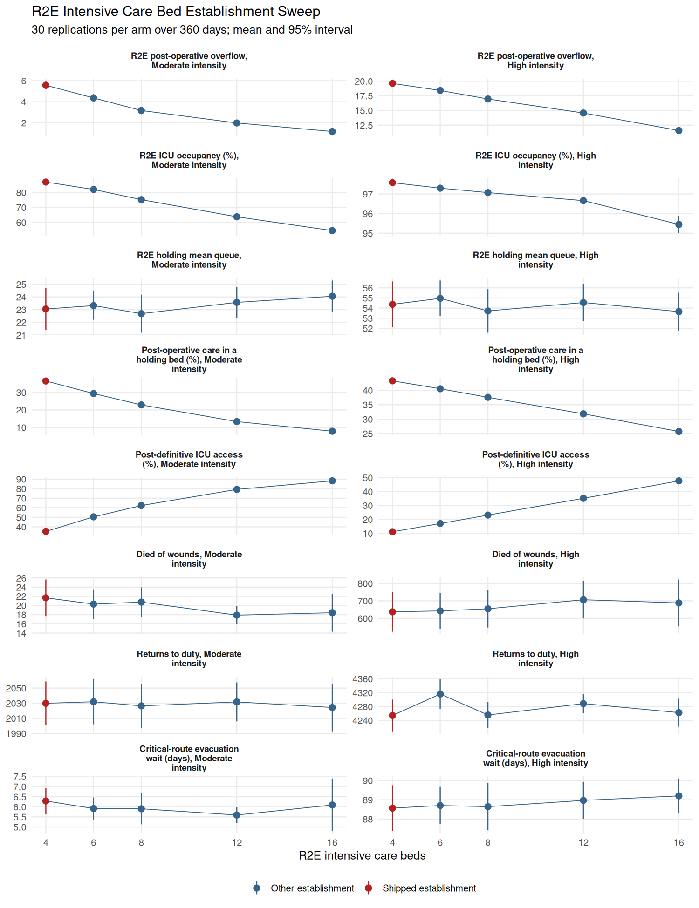

The R2E post-operative overflow census, intensive care occupancy, holding queue, post-operative and post-definitive care and the critical-route evacuation wait of each establishment, with deaths of wounds and returns to duty, at moderate intensity (left) and high intensity (right), with the shipped establishment marked.

### Priority 1 Triage Share

**Question.** Do the capacity, flow and mortality responses change when the Priority 1 share of the background triage split is lowered from the shipped sixty-five per cent towards the comparator range, and does the treated-cohort died-of-wounds rate move with it? `[default and high_intensity, Priority 1 share fifteen to sixty-five per cent · 360 d · 30 replications · paired, closing 90 d]`

Each arm is a Priority 1 share of the background split, the remainder divided between Priority 2 and Priority 3 in the shipped ratio of 20 to 15. The died-of-wounds parameters, the surgical need rates and the damage control rates are held at their shipped values, and the treated-cohort rate is the mean of each arm's per-replication rates with a Student $t$ interval.

<!-- GEN triage_split -->
| Response | P1 15% | P1 30% | P1 45% | P1 65% (shipped) |
|---|---|---|---|---|
| Priority split (%, P1 / P2 / P3) | 15 / 49 / 36 | 30 / 40 / 30 | 45 / 31 / 24 | 65 / 20 / 15 |
| Wounded in action | 2289.8 [2227.7, 2351.9] | 2317.4 [2254.3, 2380.6] | 2329.4 [2255.8, 2403.1] | 2326.8 [2277.2, 2376.4] |
| Died of wounds | 16.20 [13.77, 18.63] | 18.63 [15.87, 21.40] | 18.47 [15.80, 21.13] | 21.67 [17.68, 25.65] |
| Died of wounds per wounded in action (%) | 0.70 [0.61, 0.80] | 0.79 [0.70, 0.89] | 0.79 [0.69, 0.89] | 0.92 [0.76, 1.09] |
| Treated-cohort died-of-wounds rate | 0.393% [0.337%, 0.450%] | 0.451% [0.390%, 0.513%] | 0.443% [0.385%, 0.501%] | 0.526% [0.429%, 0.622%] |
| Expected deaths accrued after surgery (%) | 8% | 10% | 11% | 14% |
| R2B surgeries | 750.9 [738.7, 763.0] | 779.4 [766.7, 792.1] | 799.5 [784.3, 814.7] | 823.6 [811.9, 835.2] |
| Diverted from R2B, team off shift | 1052.5 [1028.6, 1076.4] | 1106.4 [1079.2, 1133.6] | 1152.9 [1125.9, 1179.9] | 1209.9 [1186.1, 1233.7] |
| Diverted from R2B, theatre busy | 190.2 [178.5, 201.8] | 209.8 [192.9, 226.6] | 223.1 [205.3, 240.8] | 240.1 [226.4, 253.7] |
| R2E first surgeries | 1428.5 [1393.2, 1463.8] | 1564.2 [1517.5, 1611.0] | 1678.5 [1629.0, 1727.9] | 1829.5 [1788.8, 1870.1] |
| Time to first incision (hours) | 7.99 [7.20, 8.77] | 7.74 [6.82, 8.67] | 7.43 [6.61, 8.25] | 7.21 [6.13, 8.30] |
| Casualties requiring surgery operated on (%) | 99.7 [99.6, 99.8] | 99.7 [99.6, 99.7] | 99.7 [99.6, 99.7] | 99.7 [99.6, 99.8] |
| R2E theatre queue, late-half classification | converged at 0.45 | converged at 0.56 | converged at 0.72 | converged at 0.85 |
| R2E post-operative overflow, late-half classification | converged at 3.75 | converged at 4.41 | converged at 5.12 | converged at 5.58 |
| R2E holding queue, late-half classification | converged at 40.8 | converged at 34.6 | converged at 30.5 | converged at 23.1 |
| R2E staging overflow, late-half classification | converged at 17.1 | converged at 18.6 | converged at 21.7 | converged at 32.7 |
| R2E theatre mean queue | 0.37 [0.29, 0.46] | 0.53 [0.30, 0.76] | 0.71 [0.46, 0.96] | 0.66 [0.44, 0.88] |
| R2E post-operative overflow census | 3.65 [3.40, 3.91] | 4.38 [4.06, 4.70] | 4.91 [4.54, 5.27] | 5.57 [5.18, 5.96] |
| R2E holding mean queue | 40.19 [38.20, 42.18] | 34.79 [33.07, 36.51] | 30.37 [28.54, 32.19] | 23.05 [21.41, 24.69] |
| R2E staging overflow census | 16.66 [15.89, 17.42] | 18.70 [17.75, 19.65] | 21.21 [19.01, 23.42] | 33.73 [25.87, 41.59] |
| R2E ICU occupancy (%) | 81.6 [80.4, 82.7] | 83.6 [82.7, 84.6] | 84.6 [83.7, 85.5] | 86.9 [86.1, 87.7] |
| Returns to duty | 2621.5 [2585.0, 2658.0] | 2426.4 [2384.7, 2468.2] | 2268.6 [2239.6, 2297.6] | 2029.9 [2001.0, 2058.8] |
| Strategic evacuation decisions | 1784.4 [1748.0, 1820.7] | 1958.9 [1915.6, 2002.2] | 2135.3 [2084.3, 2186.4] | 2371.0 [2325.8, 2416.1] |
| Critical airlift backlog at the close | 3.2 [2.5, 3.9] | 7.2 [4.6, 9.8] | 10.5 [7.2, 13.9] | 27.1 [19.6, 34.5] |
| Role 4 peak ICU census | 29.4 [26.5, 32.2] | 46.9 [43.9, 49.8] | 58.5 [56.4, 60.6] | 64.9 [64.1, 65.7] |
<!-- /GEN -->

<!-- GEN triage_split_paired -->
| Paired difference against the shipped split | P1 15% | P1 30% | P1 45% |
|---|---|---|---|
| Died of wounds | −5.47 [−10.21, −0.73]† | −3.03 [−7.89, +1.82] | −3.20 [−7.92, +1.52] |
| Died of wounds per wounded in action (%) | −0.22 [−0.41, −0.04]† | −0.13 [−0.32, +0.06] | −0.14 [−0.32, +0.05] |
| Diverted from R2B, team off shift | −157.4 [−194.0, −120.9] | −103.5 [−137.6, −69.4] | −57.0 [−98.4, −15.6]† |
| Diverted from R2B, theatre busy | −49.9 [−68.0, −31.8] | −30.3 [−50.3, −10.3]† | −17.0 [−42.0, +8.0] |
| Time to first incision (hours) | +0.77 [−0.56, +2.11] | +0.53 [−1.00, +2.06] | +0.21 [−1.30, +1.73] |
| Casualties requiring surgery operated on (%) | +0.0 [−0.1, +0.1] | −0.0 [−0.1, +0.1] | −0.0 [−0.1, +0.1] |
| R2E theatre mean queue | −0.29 [−0.55, −0.04]† | −0.13 [−0.47, +0.20] | +0.04 [−0.32, +0.40] |
| R2E post-operative overflow census | −1.91 [−2.43, −1.40] | −1.19 [−1.67, −0.70] | −0.66 [−1.24, −0.09]† |
| R2E holding mean queue | +17.14 [+14.08, +20.20] | +11.74 [+9.44, +14.04] | +7.32 [+4.89, +9.75] |
| R2E staging overflow census | −17.08 [−25.08, −9.07] | −15.03 [−22.98, −7.09] | −12.52 [−20.87, −4.18]† |
| R2E ICU occupancy (%) | −5.3 [−6.7, −3.9] | −3.3 [−4.3, −2.2] | −2.3 [−3.4, −1.2] |
| Returns to duty | +591.6 [+546.1, +637.1] | +396.5 [+337.7, +455.4] | +238.7 [+200.1, +277.2] |
| Strategic evacuation decisions | −586.6 [−651.0, −522.2] | −412.0 [−469.1, −355.0] | −235.6 [−313.9, −157.4] |
| Critical airlift backlog at the close | −23.9 [−31.6, −16.2] | −19.9 [−27.8, −11.9] | −16.5 [−25.3, −7.8] |
| Role 4 peak ICU census | −35.5 [−38.5, −32.5] | −18.0 [−20.9, −15.2] | −6.4 [−8.5, −4.3] |
<!-- /GEN -->

At the shipped share the treated-cohort died-of-wounds rate was <!-- GEN cell:triage_split|Treated-cohort died-of-wounds rate|P1 65% (shipped)|full -->0.526% [0.429%, 0.622%]<!-- /GEN -->, with <!-- GEN cell:triage_split|Expected deaths accrued after surgery (%)|P1 65% (shipped)|full -->14%<!-- /GEN --> of the cohort's expected deaths accrued after surgery, and at a share of fifteen per cent it was <!-- GEN cell:triage_split|Treated-cohort died-of-wounds rate|P1 15%|full -->0.393% [0.337%, 0.450%]<!-- /GEN -->, with <!-- GEN cell:triage_split|Expected deaths accrued after surgery (%)|P1 15%|full -->8%<!-- /GEN -->; the base rates were fitted at the shipped share, to the anchor the calibration table states: <!-- GEN cell:dow_calibration|Shipped default|Historical anchor|full -->fitted to 0.46% (Ajax Bay, 30 days)<!-- /GEN -->. Lowering the share from sixty-five per cent to fifteen per cent changed R2E first surgeries from <!-- GEN cell:triage_split|R2E first surgeries|P1 65% (shipped)|full -->1829.5 [1788.8, 1870.1]<!-- /GEN --> to <!-- GEN cell:triage_split|R2E first surgeries|P1 15%|full -->1428.5 [1393.2, 1463.8]<!-- /GEN -->, the post-operative overflow census by <!-- GEN cell:triage_split_paired|R2E post-operative overflow census|P1 15%|full -->−1.91 [−2.43, −1.40]<!-- /GEN -->, the staging overflow census by <!-- GEN cell:triage_split_paired|R2E staging overflow census|P1 15%|full -->−17.08 [−25.08, −9.07]<!-- /GEN -->, the critical airlift backlog at the close by <!-- GEN cell:triage_split_paired|Critical airlift backlog at the close|P1 15%|full -->−23.9 [−31.6, −16.2]<!-- /GEN --> and the Role 4 peak intensive care census by <!-- GEN cell:triage_split_paired|Role 4 peak ICU census|P1 15%|full -->−35.5 [−38.5, −32.5]<!-- /GEN -->, and changed the R2E holding queue by <!-- GEN cell:triage_split_paired|R2E holding mean queue|P1 15%|full -->+17.14 [+14.08, +20.20]<!-- /GEN --> and returns to duty by <!-- GEN cell:triage_split_paired|Returns to duty|P1 15%|full -->+591.6 [+546.1, +637.1]<!-- /GEN -->. The R2E theatre queue was classified <!-- GEN cell:triage_split|R2E theatre queue, late-half classification|P1 65% (shipped)|full -->converged at 0.85<!-- /GEN --> at the shipped share and <!-- GEN cell:triage_split|R2E theatre queue, late-half classification|P1 15%|full -->converged at 0.45<!-- /GEN --> at fifteen per cent, the post-operative overflow <!-- GEN cell:triage_split|R2E post-operative overflow, late-half classification|P1 65% (shipped)|full -->converged at 5.58<!-- /GEN --> and <!-- GEN cell:triage_split|R2E post-operative overflow, late-half classification|P1 15%|full -->converged at 3.75<!-- /GEN -->, and the staging overflow <!-- GEN cell:triage_split|R2E staging overflow, late-half classification|P1 65% (shipped)|full -->converged at 32.7<!-- /GEN --> and <!-- GEN cell:triage_split|R2E staging overflow, late-half classification|P1 15%|full -->converged at 17.1<!-- /GEN -->. The paired differences in deaths of wounds at fifteen, thirty and forty-five per cent were <!-- GEN cell:triage_split_paired|Died of wounds|P1 15%|full -->−5.47 [−10.21, −0.73]†<!-- /GEN -->, <!-- GEN cell:triage_split_paired|Died of wounds|P1 30%|full -->−3.03 [−7.89, +1.82]<!-- /GEN --> and <!-- GEN cell:triage_split_paired|Died of wounds|P1 45%|full -->−3.20 [−7.92, +1.52]<!-- /GEN -->.

At high intensity the same four arms were run under the `high_intensity` profile (30 replications, 360 days, seed 42).

<!-- GEN triage_split_high -->
| Response | P1 15% | P1 30% | P1 45% | P1 65% (shipped) |
|---|---|---|---|---|
| Priority split (%, P1 / P2 / P3) | 15 / 49 / 36 | 30 / 40 / 30 | 45 / 31 / 24 | 65 / 20 / 15 |
| Wounded in action | 8608.9 [8471.7, 8746.2] | 8437.0 [8315.7, 8558.3] | 8537.3 [8434.3, 8640.2] | 8452.5 [8312.8, 8592.3] |
| Died of wounds | 147.63 [134.37, 160.90] | 201.83 [181.52, 222.15] | 333.67 [302.56, 364.78] | 637.23 [523.53, 750.93] |
| Died of wounds per wounded in action (%) | 1.71 [1.57, 1.84] | 2.38 [2.17, 2.59] | 3.89 [3.56, 4.22] | 7.43 [6.21, 8.65] |
| Treated-cohort died-of-wounds rate | 1.427% [1.309%, 1.546%] | 1.988% [1.807%, 2.170%] | 3.262% [2.978%, 3.546%] | 6.279% [5.224%, 7.334%] |
| Expected deaths accrued after surgery (%) | 4% | 13% | 15% | 11% |
| R2B surgeries | 1732.9 [1711.8, 1754.0] | 1742.1 [1721.5, 1762.7] | 1778.9 [1761.1, 1796.8] | 1810.2 [1791.4, 1829.0] |
| Diverted from R2B, team off shift | 3473.8 [3425.7, 3521.9] | 3546.8 [3502.2, 3591.4] | 3741.2 [3709.2, 3773.2] | 3860.1 [3806.1, 3914.0] |
| Diverted from R2B, theatre busy | 1258.0 [1218.8, 1297.2] | 1262.5 [1229.5, 1295.6] | 1346.9 [1310.1, 1383.7] | 1426.6 [1385.3, 1467.9] |
| R2E first surgeries | 5312.4 [5225.2, 5399.6] | 5516.2 [5434.0, 5598.4] | 5905.4 [5840.9, 5969.9] | 6221.5 [6138.6, 6304.3] |
| Time to first incision (hours) | 29.32 [26.91, 31.73] | 32.26 [28.90, 35.62] | 47.43 [42.01, 52.85] | 89.45 [69.24, 109.67] |
| Casualties requiring surgery operated on (%) | 99.3 [99.2, 99.4] | 99.1 [99.0, 99.3] | 98.9 [98.7, 99.1] | 98.3 [98.0, 98.7] |
| R2E theatre queue, late-half classification | converged at 16.6 | converged at 20.1 | converged at 43.2 | converged at 97.9 |
| R2E post-operative overflow, late-half classification | converged at 17.9 | converged at 18.4 | converged at 19.5 | converged at 19.7 |
| R2E holding queue, late-half classification | converged at 120.0 | **drifting, +1.1%/block**, 69.1 to 98.5 | converged at 80.6 | converged at 53.1 |
| R2E staging overflow, late-half classification | converged at 361.7 | **drifting, +4.4%/block**, 79.4 to 731.6 | **drifting, +5.5%/block**, 90.5 to 1,061.2 | **drifting, +4.9%/block**, 122.3 to 1,460.5 |
| R2E theatre mean queue | 17.99 [14.00, 21.98] | 19.10 [14.88, 23.31] | 41.93 [31.93, 51.93] | 100.45 [68.73, 132.18] |
| R2E post-operative overflow census | 17.98 [17.65, 18.31] | 18.45 [18.07, 18.83] | 19.47 [19.12, 19.82] | 19.62 [19.25, 20.00] |
| R2E holding mean queue | 120.76 [117.85, 123.68] | 99.67 [97.16, 102.17] | 80.03 [77.07, 82.98] | 54.37 [52.11, 56.63] |
| R2E staging overflow census | 365.94 [352.62, 379.27] | 715.35 [687.70, 743.00] | 1032.69 [997.52, 1067.87] | 1412.07 [1378.54, 1445.60] |
| R2E ICU occupancy (%) | 96.8 [96.6, 96.9] | 97.0 [96.8, 97.1] | 97.4 [97.2, 97.5] | 97.6 [97.5, 97.7] |
| Returns to duty | 5662.5 [5570.0, 5755.1] | 4794.4 [4705.6, 4883.2] | 4473.9 [4409.8, 4537.9] | 4254.5 [4208.7, 4300.3] |
| Strategic evacuation decisions | 5598.5 [5518.5, 5678.5] | 5998.0 [5925.6, 6070.4] | 6515.1 [6451.4, 6578.7] | 6882.1 [6811.8, 6952.4] |
| Critical airlift backlog at the close | 25.9 [20.5, 31.3] | 498.2 [478.0, 518.3] | 957.9 [930.1, 985.8] | 1477.8 [1439.7, 1516.0] |
| Role 4 peak ICU census | 66.3 [65.4, 67.1] | 67.7 [67.1, 68.3] | 68.2 [67.6, 68.9] | 68.5 [67.8, 69.2] |
<!-- /GEN -->

<!-- GEN triage_split_paired_high -->
| Paired difference against the shipped split | P1 15% | P1 30% | P1 45% |
|---|---|---|---|
| Died of wounds | −489.60 [−606.49, −372.71] | −435.40 [−550.82, −319.98] | −303.57 [−425.29, −181.84] |
| Died of wounds per wounded in action (%) | −5.72 [−6.97, −4.48] | −5.05 [−6.30, −3.81] | −3.54 [−4.85, −2.24] |
| Diverted from R2B, team off shift | −386.3 [−475.7, −296.8] | −313.3 [−380.2, −246.3] | −118.9 [−183.3, −54.4] |
| Diverted from R2B, theatre busy | −168.6 [−226.8, −110.3] | −164.0 [−218.8, −109.3] | −79.7 [−138.5, −20.9] |
| Time to first incision (hours) | −60.13 [−81.04, −39.23] | −57.19 [−77.61, −36.77] | −42.02 [−63.95, −20.10] |
| Casualties requiring surgery operated on (%) | +1.0 [+0.6, +1.4] | +0.8 [+0.4, +1.2] | +0.6 [+0.2, +1.0] |
| R2E theatre mean queue | −82.47 [−115.34, −49.59] | −81.36 [−114.52, −48.19] | −58.52 [−91.99, −25.06] |
| R2E post-operative overflow census | −1.64 [−2.18, −1.10] | −1.17 [−1.73, −0.62] | −0.15 [−0.70, +0.40] |
| R2E holding mean queue | +66.39 [+62.74, +70.05] | +45.30 [+42.25, +48.34] | +25.66 [+22.64, +28.68] |
| R2E staging overflow census | −1046.13 [−1081.10, −1011.15] | −696.72 [−743.66, −649.77] | −379.38 [−430.95, −327.80] |
| R2E ICU occupancy (%) | −0.8 [−1.0, −0.6] | −0.6 [−0.8, −0.4] | −0.2 [−0.3, −0.1] |
| Returns to duty | +1408.0 [+1305.0, +1511.0] | +539.9 [+451.4, +628.3] | +219.4 [+157.6, +281.2] |
| Strategic evacuation decisions | −1283.6 [−1386.5, −1180.7] | −884.1 [−985.6, −782.5] | −367.0 [−455.6, −278.4] |
| Critical airlift backlog at the close | −1451.9 [−1490.0, −1413.9] | −979.7 [−1024.3, −935.0] | −519.9 [−569.0, −470.8] |
| Role 4 peak ICU census | −2.2 [−3.4, −1.1] | −0.8 [−1.9, +0.2] | −0.3 [−1.3, +0.7] |
<!-- /GEN -->

At the shipped share the high-intensity treated-cohort died-of-wounds rate was <!-- GEN cell:triage_split_high|Treated-cohort died-of-wounds rate|P1 65% (shipped)|full -->6.279% [5.224%, 7.334%]<!-- /GEN --> and at fifteen per cent it was <!-- GEN cell:triage_split_high|Treated-cohort died-of-wounds rate|P1 15%|full -->1.427% [1.309%, 1.546%]<!-- /GEN -->. The R2E theatre queue was classified <!-- GEN cell:triage_split_high|R2E theatre queue, late-half classification|P1 65% (shipped)|full -->converged at 97.9<!-- /GEN --> at the shipped share and <!-- GEN cell:triage_split_high|R2E theatre queue, late-half classification|P1 15%|full -->converged at 16.6<!-- /GEN --> at fifteen per cent, the post-operative overflow <!-- GEN cell:triage_split_high|R2E post-operative overflow, late-half classification|P1 65% (shipped)|full -->converged at 19.7<!-- /GEN --> and <!-- GEN cell:triage_split_high|R2E post-operative overflow, late-half classification|P1 15%|full -->converged at 17.9<!-- /GEN -->, and the staging overflow <!-- GEN cell:triage_split_high|R2E staging overflow, late-half classification|P1 65% (shipped)|full -->**drifting, +4.9%/block**, 122.3 to 1,460.5<!-- /GEN --> and <!-- GEN cell:triage_split_high|R2E staging overflow, late-half classification|P1 15%|full -->converged at 361.7<!-- /GEN -->. Lowering the share from sixty-five per cent to fifteen per cent changed the R2E theatre queue by <!-- GEN cell:triage_split_paired_high|R2E theatre mean queue|P1 15%|full -->−82.47 [−115.34, −49.59]<!-- /GEN -->, the critical airlift backlog at the close by <!-- GEN cell:triage_split_paired_high|Critical airlift backlog at the close|P1 15%|full -->−1451.9 [−1490.0, −1413.9]<!-- /GEN -->, the R2E holding queue by <!-- GEN cell:triage_split_paired_high|R2E holding mean queue|P1 15%|full -->+66.39 [+62.74, +70.05]<!-- /GEN -->, deaths of wounds by <!-- GEN cell:triage_split_paired_high|Died of wounds|P1 15%|full -->−489.60 [−606.49, −372.71]<!-- /GEN --> and returns to duty by <!-- GEN cell:triage_split_paired_high|Returns to duty|P1 15%|full -->+1408.0 [+1305.0, +1511.0]<!-- /GEN -->.

### Post-Definitive Intensive Care Share

**Question.** Do intensive care and holding load, and the outcomes they bear on, change when the share of the operated cohort owed intensive care after the definitive repair is lowered from the shipped upper bound of one? `[default and high_intensity, share a quarter to one · 360 d · 30 replications · paired, closing 90 d]`

Each arm is the probability that an operated casualty owed the post-definitive episode needs intensive care; one who does not recovers on the ward for the same requirement, in a holding bed or in overflow. Post-definitive intensive care access is the share of the casualties placed for the intensive care episode who received an intensive care bed, so it excludes the ward recoveries. Holding bed-days are taken over the whole campaign and divided by the stay that held the bed.

<!-- GEN post_definitive -->
| Response | ICU share 25% | ICU share 50% | ICU share 75% | ICU share 100% (shipped) |
|---|---|---|---|---|
| Post-definitive ward recoveries | 1626.5 [1591.7, 1661.3] | 1074.7 [1055.8, 1093.6] | 534.7 [519.9, 549.6] | 0.0 [0.0, 0.0] |
| Ward recoveries in overflow | 1504.3 [1464.5, 1544.1] | 996.8 [976.1, 1017.4] | 491.2 [474.6, 507.9] | 0.0 [0.0, 0.0] |
| Placed for post-definitive ICU | 536.5 [522.5, 550.6] | 1070.8 [1051.9, 1089.8] | 1607.2 [1574.1, 1640.2] | 2158.6 [2125.8, 2191.5] |
| Post-definitive ICU access (%) | 59.5 [58.1, 60.8] | 49.4 [48.4, 50.4] | 41.3 [40.3, 42.3] | 35.2 [34.6, 35.8] |
| R2E ICU occupancy (%) | 69.3 [68.0, 70.6] | 78.5 [77.4, 79.5] | 83.1 [82.3, 83.9] | 86.9 [86.1, 87.7] |
| R2E ICU mean queue | 0.00 [0.00, 0.00] | 0.00 [0.00, 0.00] | 0.00 [0.00, 0.00] | 0.00 [0.00, 0.00] |
| R2E holding occupancy (%) | 99.4 [99.3, 99.6] | 99.6 [99.5, 99.7] | 99.5 [99.4, 99.7] | 99.4 [99.2, 99.5] |
| R2E holding mean queue | 22.83 [21.56, 24.10] | 25.59 [24.23, 26.96] | 23.49 [22.05, 24.94] | 23.05 [21.41, 24.69] |
| Holding bed-days, post-definitive care | 145 [136, 153] | 118 [112, 123] | 114 [106, 121] | 104 [98, 111] |
| of which ward recoveries | 133 [124, 141] | 84 [80, 89] | 47 [43, 50] | 0 [0, 0] |
| Holding bed-days, in-theatre recovery | 9250 [9161, 9338] | 9421 [9343, 9499] | 9367 [9296, 9439] | 9336 [9254, 9418] |
| Holding bed-days, awaiting airlift | 1248 [1159, 1336] | 1099 [1027, 1170] | 1142 [1082, 1202] | 1180 [1107, 1253] |
| R2E post-operative overflow census | 6.37 [6.00, 6.75] | 6.23 [5.93, 6.53] | 5.70 [5.30, 6.10] | 5.57 [5.18, 5.96] |
| R2E staging overflow census | 32.73 [25.15, 40.31] | 36.24 [29.26, 43.22] | 30.86 [25.50, 36.22] | 33.73 [25.87, 41.59] |
| R2E ICU queue, late-half classification | converged at 0.00 | converged at 0.00 | converged at 0.00 | converged at 0.00 |
| R2E holding queue, late-half classification | converged at 23.6 | converged at 24.6 | converged at 23.6 | converged at 23.1 |
| R2E post-operative overflow, late-half classification | converged at 6.32 | converged at 6.15 | converged at 5.73 | converged at 5.58 |
| R2E staging overflow, late-half classification | converged at 35.5 | converged at 33.3 | converged at 30.1 | converged at 32.7 |
| Post-operative care in a holding bed (%) | 25.5 [24.8, 26.2] | 30.3 [29.7, 30.9] | 34.1 [33.5, 34.6] | 36.5 [36.1, 37.0] |
| R2E theatre entry deferred | 256.4 [240.7, 272.1] | 306.9 [293.4, 320.3] | 342.9 [327.9, 357.8] | 374.0 [362.8, 385.1] |
| Died of wounds | 21.50 [18.36, 24.64] | 20.80 [18.31, 23.29] | 20.90 [18.22, 23.58] | 21.67 [17.68, 25.65] |
| Returns to duty | 2022.5 [1994.4, 2050.6] | 2060.1 [2031.6, 2088.6] | 2046.2 [2015.9, 2076.5] | 2029.9 [2001.0, 2058.8] |
| Critical-route evacuation wait (days) | 6.75 [5.50, 8.00] | 5.85 [5.28, 6.41] | 5.71 [5.19, 6.23] | 6.29 [5.64, 6.94] |
| Role 4 peak census | 210.2 [204.8, 215.6] | 206.5 [202.5, 210.4] | 210.1 [206.3, 214.0] | 209.0 [205.4, 212.6] |
<!-- /GEN -->

<!-- GEN post_definitive_paired -->
| Paired difference against the shipped share | ICU share 25% | ICU share 50% | ICU share 75% |
|---|---|---|---|
| Post-definitive ward recoveries | +1626.5 [+1591.7, +1661.3] | +1074.7 [+1055.8, +1093.6] | +534.7 [+519.9, +549.6] |
| Post-definitive ICU access (%) | +24.3 [+22.9, +25.7] | +14.2 [+13.0, +15.5] | +6.1 [+5.1, +7.1] |
| R2E ICU occupancy (%) | −17.6 [−19.1, −16.0] | −8.4 [−9.5, −7.3] | −3.8 [−4.8, −2.8] |
| R2E ICU mean queue | +0.00 [+0.00, +0.00] | +0.00 [+0.00, +0.00] | +0.00 [+0.00, +0.00] |
| R2E holding occupancy (%) | +0.0 [−0.1, +0.2] | +0.2 [+0.1, +0.4]† | +0.2 [−0.0, +0.3] |
| R2E holding mean queue | −0.22 [−2.07, +1.62] | +2.54 [+0.12, +4.97]† | +0.44 [−1.72, +2.60] |
| Holding bed-days, post-definitive care | +40 [+30, +51] | +14 [+6, +21] | +10 [+0, +19]† |
| of which ward recoveries | +133 [+124, +141] | +84 [+80, +89] | +47 [+43, +50] |
| R2E post-operative overflow census | +0.81 [+0.32, +1.29] | +0.66 [+0.16, +1.16]† | +0.13 [−0.38, +0.64] |
| R2E staging overflow census | −1.00 [−10.75, +8.75] | +2.51 [−8.82, +13.83] | −2.88 [−11.76, +6.01] |
| Post-operative care in a holding bed (%) | −11.0 [−11.9, −10.2] | −6.2 [−7.1, −5.4] | −2.4 [−3.0, −1.9] |
| R2E theatre entry deferred | −117.6 [−133.3, −101.8] | −67.1 [−83.7, −50.5] | −31.1 [−46.1, −16.1] |
| Died of wounds | −0.17 [−5.44, +5.11] | −0.87 [−5.99, +4.26] | −0.77 [−4.84, +3.31] |
| Returns to duty | −7.4 [−39.6, +24.8] | +30.2 [−10.3, +70.7] | +16.3 [−24.0, +56.6] |
| Critical-route evacuation wait (days) | +0.46 [−0.92, +1.84] | −0.44 [−1.36, +0.47] | −0.58 [−1.30, +0.14] |
| Role 4 peak census | +1.2 [−4.7, +7.1] | −2.5 [−8.0, +2.9] | +1.1 [−3.5, +5.7] |
<!-- /GEN -->

At the shipped share R2E intensive care occupancy was <!-- GEN cell:post_definitive|R2E ICU occupancy (%)|ICU share 100% (shipped)|mean -->86.9<!-- /GEN -->% and at a share of a quarter it was <!-- GEN cell:post_definitive|R2E ICU occupancy (%)|ICU share 25%|mean -->69.3<!-- /GEN -->%, while post-definitive intensive care access rose from <!-- GEN cell:post_definitive|Post-definitive ICU access (%)|ICU share 100% (shipped)|mean -->35.2<!-- /GEN -->% to <!-- GEN cell:post_definitive|Post-definitive ICU access (%)|ICU share 25%|mean -->59.5<!-- /GEN -->% and post-operative care in a holding bed fell from <!-- GEN cell:post_definitive|Post-operative care in a holding bed (%)|ICU share 100% (shipped)|mean -->36.5<!-- /GEN -->% to <!-- GEN cell:post_definitive|Post-operative care in a holding bed (%)|ICU share 25%|mean -->25.5<!-- /GEN -->%. The holding beds were <!-- GEN cell:post_definitive|R2E holding occupancy (%)|ICU share 100% (shipped)|mean -->99.4<!-- /GEN -->% and <!-- GEN cell:post_definitive|R2E holding occupancy (%)|ICU share 25%|mean -->99.4<!-- /GEN -->% occupied, and of the <!-- GEN cell:post_definitive|Post-definitive ward recoveries|ICU share 25%|mean -->1626.5<!-- /GEN --> ward recoveries at a share of a quarter, <!-- GEN cell:post_definitive|Ward recoveries in overflow|ICU share 25%|mean -->1504.3<!-- /GEN --> were taken in overflow. Lowering the share to a quarter changed deaths of wounds by <!-- GEN cell:post_definitive_paired|Died of wounds|ICU share 25%|full -->−0.17 [−5.44, +5.11]<!-- /GEN --> and returns to duty by <!-- GEN cell:post_definitive_paired|Returns to duty|ICU share 25%|full -->−7.4 [−39.6, +24.8]<!-- /GEN -->.

At high intensity the same four arms were run under the `high_intensity` profile (30 replications, 360 days, seed 42).

<!-- GEN post_definitive_high -->
| Response | ICU share 25% | ICU share 50% | ICU share 75% | ICU share 100% (shipped) |
|---|---|---|---|---|
| Post-definitive ward recoveries | 3614.2 [3586.5, 3641.9] | 2413.3 [2389.6, 2437.0] | 1207.3 [1196.3, 1218.3] | 0.0 [0.0, 0.0] |
| Ward recoveries in overflow | 3596.1 [3568.4, 3623.9] | 2401.0 [2377.3, 2424.7] | 1200.8 [1189.9, 1211.8] | 0.0 [0.0, 0.0] |
| Placed for post-definitive ICU | 1197.0 [1182.6, 1211.5] | 2411.7 [2391.4, 2432.0] | 3606.0 [3581.9, 3630.0] | 4780.1 [4732.9, 4827.3] |
| Post-definitive ICU access (%) | 16.6 [16.1, 17.1] | 14.6 [14.3, 14.9] | 12.6 [12.4, 12.8] | 11.1 [11.0, 11.3] |
| R2E ICU occupancy (%) | 95.8 [95.6, 96.1] | 96.6 [96.5, 96.8] | 97.2 [97.0, 97.3] | 97.6 [97.5, 97.7] |
| R2E ICU mean queue | 0.00 [0.00, 0.00] | 0.00 [0.00, 0.00] | 0.00 [0.00, 0.00] | 0.00 [0.00, 0.00] |
| R2E holding occupancy (%) | 100.0 [100.0, 100.0] | 100.0 [100.0, 100.0] | 100.0 [100.0, 100.0] | 100.0 [100.0, 100.0] |
| R2E holding mean queue | 53.36 [51.42, 55.29] | 54.42 [52.62, 56.22] | 54.28 [52.60, 55.96] | 54.37 [52.11, 56.63] |
| Holding bed-days, post-definitive care | 24 [22, 26] | 23 [20, 25] | 21 [18, 23] | 22 [20, 24] |
| of which ward recoveries | 20 [18, 21] | 13 [12, 15] | 7 [6, 8] | 0 [0, 0] |
| Holding bed-days, in-theatre recovery | 10045 [9946, 10145] | 10118 [10027, 10208] | 10160 [10079, 10241] | 10060 [9988, 10133] |
| Holding bed-days, awaiting airlift | 684 [585, 783] | 611 [523, 699] | 569 [489, 650] | 668 [596, 739] |
| R2E post-operative overflow census | 20.44 [20.18, 20.70] | 20.24 [20.01, 20.47] | 19.95 [19.74, 20.16] | 19.62 [19.25, 20.00] |
| R2E staging overflow census | 1416.69 [1381.35, 1452.03] | 1455.07 [1426.71, 1483.42] | 1428.61 [1409.72, 1447.51] | 1412.07 [1378.54, 1445.60] |
| R2E ICU queue, late-half classification | converged at 0.00 | converged at 0.00 | converged at 0.00 | converged at 0.00 |
| R2E holding queue, late-half classification | converged at 52.8 | converged at 54.0 | converged at 54.4 | converged at 53.1 |
| R2E post-operative overflow, late-half classification | converged at 20.3 | converged at 20.2 | converged at 19.9 | converged at 19.7 |
| R2E staging overflow, late-half classification | **drifting, +4.9%/block**, 129.3 to 1,467.4 | **drifting, +5.3%/block**, 125.9 to 1,508.9 | **drifting, +4.9%/block**, 125.7 to 1,477.1 | **drifting, +4.9%/block**, 122.3 to 1,460.5 |
| Post-operative care in a holding bed (%) | 40.6 [40.4, 40.8] | 41.8 [41.6, 42.0] | 42.7 [42.5, 42.9] | 43.3 [43.1, 43.5] |
| R2E theatre entry deferred | 1511.4 [1485.0, 1537.9] | 1578.9 [1547.5, 1610.3] | 1599.3 [1570.8, 1627.8] | 1613.9 [1585.3, 1642.5] |
| Died of wounds | 613.43 [529.21, 697.66] | 586.10 [501.16, 671.04] | 588.33 [523.66, 653.00] | 637.23 [523.53, 750.93] |
| Returns to duty | 4263.0 [4226.2, 4299.8] | 4278.4 [4239.1, 4317.8] | 4302.5 [4263.5, 4341.6] | 4254.5 [4208.7, 4300.3] |
| Critical-route evacuation wait (days) | 88.83 [87.76, 89.90] | 89.21 [88.00, 90.41] | 88.95 [87.96, 89.93] | 88.57 [87.38, 89.76] |
| Role 4 peak census | 283.5 [280.9, 286.0] | 282.7 [280.6, 284.8] | 283.7 [281.0, 286.3] | 281.7 [279.1, 284.3] |
<!-- /GEN -->

<!-- GEN post_definitive_paired_high -->
| Paired difference against the shipped share | ICU share 25% | ICU share 50% | ICU share 75% |
|---|---|---|---|
| Post-definitive ward recoveries | +3614.2 [+3586.5, +3641.9] | +2413.3 [+2389.6, +2437.0] | +1207.3 [+1196.3, +1218.3] |
| Post-definitive ICU access (%) | +5.4 [+4.9, +6.0] | +3.4 [+3.1, +3.8] | +1.5 [+1.2, +1.8] |
| R2E ICU occupancy (%) | −1.7 [−2.0, −1.4] | −1.0 [−1.1, −0.8] | −0.4 [−0.5, −0.3] |
| R2E ICU mean queue | +0.00 [+0.00, +0.00] | +0.00 [+0.00, +0.00] | +0.00 [+0.00, +0.00] |
| R2E holding occupancy (%) | −0.0 [−0.0, +0.0] | +0.0 [−0.0, +0.0] | +0.0 [−0.0, +0.0] |
| R2E holding mean queue | −1.01 [−4.02, +2.00] | +0.05 [−2.42, +2.52] | −0.09 [−2.70, +2.52] |
| Holding bed-days, post-definitive care | +2 [−1, +5] | +1 [−2, +3] | −1 [−4, +2] |
| of which ward recoveries | +20 [+18, +21] | +13 [+12, +15] | +7 [+6, +8] |
| R2E post-operative overflow census | +0.82 [+0.34, +1.29] | +0.62 [+0.21, +1.03]† | +0.33 [−0.11, +0.76] |
| R2E staging overflow census | +4.62 [−45.83, +55.06] | +43.00 [+4.49, +81.50]† | +16.54 [−24.55, +57.64] |
| Post-operative care in a holding bed (%) | −2.7 [−3.0, −2.4] | −1.5 [−1.7, −1.2] | −0.6 [−0.9, −0.3] |
| R2E theatre entry deferred | −102.5 [−143.4, −61.6] | −35.0 [−74.0, +4.0] | −14.6 [−61.3, +32.1] |
| Died of wounds | −23.80 [−182.28, +134.68] | −51.13 [−190.21, +87.94] | −48.90 [−198.26, +100.46] |
| Returns to duty | +8.5 [−48.1, +65.1] | +23.9 [−33.1, +80.9] | +48.0 [−7.8, +103.9] |
| Critical-route evacuation wait (days) | +0.26 [−1.51, +2.04] | +0.64 [−0.98, +2.25] | +0.38 [−1.31, +2.07] |
| Role 4 peak census | +1.8 [−1.3, +4.8] | +1.0 [−1.9, +4.0] | +2.0 [−1.8, +5.7] |
<!-- /GEN -->

At high intensity R2E intensive care occupancy was <!-- GEN cell:post_definitive_high|R2E ICU occupancy (%)|ICU share 100% (shipped)|mean -->97.6<!-- /GEN -->% at the shipped share and <!-- GEN cell:post_definitive_high|R2E ICU occupancy (%)|ICU share 25%|mean -->95.8<!-- /GEN -->% at a share of a quarter, and post-definitive intensive care access rose from <!-- GEN cell:post_definitive_high|Post-definitive ICU access (%)|ICU share 100% (shipped)|mean -->11.1<!-- /GEN -->% to <!-- GEN cell:post_definitive_high|Post-definitive ICU access (%)|ICU share 25%|mean -->16.6<!-- /GEN -->%. Of the <!-- GEN cell:post_definitive_high|Post-definitive ward recoveries|ICU share 25%|mean -->3614.2<!-- /GEN --> ward recoveries at a share of a quarter, <!-- GEN cell:post_definitive_high|Ward recoveries in overflow|ICU share 25%|mean -->3596.1<!-- /GEN --> were taken in overflow, the holding beds being <!-- GEN cell:post_definitive_high|R2E holding occupancy (%)|ICU share 25%|mean -->100.0<!-- /GEN -->% occupied. Lowering the share to a quarter changed deaths of wounds by <!-- GEN cell:post_definitive_paired_high|Died of wounds|ICU share 25%|full -->−23.80 [−182.28, +134.68]<!-- /GEN --> and returns to duty by <!-- GEN cell:post_definitive_paired_high|Returns to duty|ICU share 25%|full -->+8.5 [−48.1, +65.1]<!-- /GEN -->, and the staging overflow was classified <!-- GEN cell:post_definitive_high|R2E staging overflow, late-half classification|ICU share 25%|full -->**drifting, +4.9%/block**, 129.3 to 1,467.4<!-- /GEN --> at that share.

### Forward Evacuation Delay

**Question.** How far do deaths of wounds, surgical timing and the load on the Role 2 echelons move when every casualty's forward evacuation is delayed, as on a contested axis, from none to thirty days? `[default and high_intensity, delay none to thirty days · 360 d · 30 replications · paired, closing 90 d]`

Each arm is the nominal delay for which every casualty is held after R1 treatment before the road move to Role 2, drawn triangular from half to one and a half times that value. A casualty held forward carries the R1 treatment multiplier times the prolonged-care multiplier, held at its shipped value of one, and one whose drawn death time falls within the wait dies while held. The time to first incision is measured from arrival and so carries the delay, and PMV ambulance utilisation is taken over the whole campaign.

<!-- GEN evac_delay -->
| Response | No delay (shipped) | 6 hours | 1 day | 3 days | 7 days | 14 days | 30 days |
|---|---|---|---|---|---|---|---|
| Mean delay held forward (days) | 0.00 [0.00, 0.00] | 0.25 [0.25, 0.25] | 1.00 [1.00, 1.00] | 3.00 [3.00, 3.00] | 7.00 [7.00, 7.01] | 14.00 [13.98, 14.02] | 29.99 [29.96, 30.03] |
| Casualties held forward | 0.0 [0.0, 0.0] | 4432.3 [4339.6, 4525.0] | 4453.7 [4392.1, 4515.4] | 4460.7 [4370.0, 4551.5] | 4512.3 [4418.7, 4605.8] | 4520.5 [4428.1, 4612.9] | 4471.6 [4395.0, 4548.2] |
| Died of wounds while held forward | 0.00 [0.00, 0.00] | 15.47 [13.86, 17.08] | 59.80 [55.96, 63.64] | 179.20 [173.85, 184.55] | 384.83 [367.52, 402.15] | 696.03 [672.29, 719.77] | 1150.37 [1114.57, 1186.17] |
| Died of wounds | 21.67 [17.68, 25.65] | 36.17 [32.34, 39.99] | 79.40 [74.65, 84.15] | 197.13 [189.96, 204.30] | 401.20 [380.88, 421.52] | 706.53 [682.77, 730.30] | 1157.67 [1121.50, 1193.83] |
| Died of wounds per wounded in action (%) | 0.92 [0.76, 1.09] | 1.58 [1.44, 1.73] | 3.44 [3.29, 3.59] | 8.59 [8.40, 8.78] | 17.14 [16.83, 17.44] | 30.14 [29.66, 30.62] | 50.86 [50.22, 51.50] |
| Treated-cohort died-of-wounds rate (%) | 0.526 [0.429, 0.622] | 0.898 [0.811, 0.985] | 2.011 [1.911, 2.111] | 5.043 [4.918, 5.168] | 10.265 [9.962, 10.568] | 18.458 [18.132, 18.784] | 32.121 [31.768, 32.475] |
| Time to first incision (hours) | 7.21 [6.13, 8.30] | 12.58 [11.93, 13.24] | 30.47 [29.76, 31.18] | 77.92 [77.06, 78.77] | 174.32 [171.88, 176.75] | 339.61 [338.94, 340.28] | 720.82 [719.43, 722.20] |
| Casualties requiring surgery operated on (%) | 99.7 [99.6, 99.8] | 99.7 [99.6, 99.7] | 99.5 [99.3, 99.6] | 98.9 [98.7, 99.1] | 97.9 [97.6, 98.2] | 95.8 [95.1, 96.4] | 91.4 [90.7, 92.1] |
| R2B surgeries | 823.6 [811.9, 835.2] | 815.5 [799.4, 831.7] | 829.3 [815.6, 843.0] | 857.4 [842.8, 872.1] | 886.0 [866.1, 905.9] | 889.0 [869.0, 909.0] | 842.5 [824.4, 860.5] |
| Diverted from R2B, team off shift | 1209.9 [1186.1, 1233.7] | 1174.4 [1137.6, 1211.3] | 1207.2 [1182.7, 1231.7] | 1192.5 [1156.8, 1228.3] | 1201.0 [1157.8, 1244.2] | 1176.7 [1136.4, 1217.0] | 1085.0 [1049.0, 1121.0] |
| Diverted from R2B, theatre busy | 240.1 [226.4, 253.7] | 226.0 [208.7, 243.3] | 214.1 [202.2, 226.0] | 187.5 [172.0, 203.0] | 170.6 [152.7, 188.5] | 153.7 [145.7, 161.8] | 138.3 [129.1, 147.5] |
| R2E first surgeries | 1829.5 [1788.8, 1870.1] | 1775.1 [1714.3, 1835.9] | 1792.8 [1752.8, 1832.9] | 1759.6 [1704.7, 1814.5] | 1764.7 [1695.3, 1834.0] | 1720.1 [1663.6, 1776.7] | 1591.5 [1539.5, 1643.6] |
| R2B theatre queue, late-half classification | converged at 0.00 | converged at 0.00 | converged at 0.00 | converged at 0.00 | converged at 0.00 | converged at 0.00 | converged at 0.00 |
| R2B holding queue, late-half classification | converged at 0.07 | converged at 0.08 | converged at 0.04 | converged at 0.04 | converged at 0.03 | converged at 0.03 | converged at 0.04 |
| R2E theatre queue, late-half classification | converged at 0.85 | converged at 0.77 | converged at 0.76 | converged at 0.67 | converged at 0.92 | converged at 0.28 | converged at 0.17 |
| R2E post-operative overflow, late-half classification | converged at 5.58 | converged at 5.47 | converged at 5.58 | converged at 5.33 | converged at 5.69 | converged at 5.65 | converged at 5.56 |
| R2E holding queue, late-half classification | converged at 23.1 | converged at 23.2 | converged at 23.2 | converged at 23.0 | converged at 23.6 | converged at 23.9 | converged at 23.7 |
| R2E staging overflow, late-half classification | converged at 32.7 | converged at 30.2 | converged at 32.1 | converged at 29.8 | converged at 38.7 | converged at 31.2 | converged at 27.8 |
| R2E theatre mean queue | 0.66 [0.44, 0.88] | 0.69 [0.40, 0.98] | 0.56 [0.38, 0.75] | 0.67 [0.39, 0.95] | 1.15 [0.00, 2.72] | 0.26 [0.17, 0.34] | 0.17 [0.14, 0.20] |
| R2E post-operative overflow census | 5.57 [5.18, 5.96] | 5.41 [5.02, 5.80] | 5.46 [5.11, 5.82] | 5.56 [5.13, 6.00] | 5.58 [4.94, 6.23] | 5.80 [5.37, 6.22] | 5.70 [5.27, 6.12] |
| R2E holding mean queue | 23.05 [21.41, 24.69] | 23.33 [21.72, 24.93] | 22.61 [21.11, 24.12] | 23.12 [21.58, 24.66] | 24.18 [22.89, 25.47] | 24.78 [22.96, 26.61] | 24.00 [22.45, 25.54] |
| R2E staging overflow census | 33.73 [25.87, 41.59] | 30.90 [24.81, 36.99] | 32.47 [24.50, 40.44] | 33.42 [26.50, 40.34] | 35.92 [21.39, 50.46] | 31.88 [24.46, 39.30] | 29.25 [22.06, 36.44] |
| R2E ICU occupancy (%) | 86.9 [86.1, 87.7] | 86.8 [86.1, 87.5] | 87.2 [86.6, 87.8] | 88.0 [87.2, 88.7] | 89.2 [88.6, 89.9] | 90.2 [89.6, 90.8] | 90.8 [90.3, 91.4] |
| Returns to duty | 2029.9 [2001.0, 2058.8] | 2028.0 [1993.1, 2062.9] | 2019.2 [1993.8, 2044.6] | 2010.6 [1975.7, 2045.5] | 1998.8 [1969.6, 2028.1] | 1963.6 [1926.4, 2000.7] | 1882.0 [1854.9, 1909.0] |
| PMV ambulance utilisation (%) | 24.3 [24.0, 24.7] | 24.1 [23.6, 24.6] | 24.1 [23.8, 24.4] | 24.0 [23.5, 24.5] | 23.9 [23.5, 24.4] | 23.4 [23.0, 23.9] | 22.2 [21.9, 22.6] |
<!-- /GEN -->

<!-- GEN evac_delay_paired -->
| Paired difference against no delay | 6 hours | 1 day | 3 days | 7 days | 14 days | 30 days |
|---|---|---|---|---|---|---|
| Died of wounds while held forward | +15.47 [+13.86, +17.08] | +59.80 [+55.96, +63.64] | +179.20 [+173.85, +184.55] | +384.83 [+367.52, +402.15] | +696.03 [+672.29, +719.77] | +1150.37 [+1114.57, +1186.17] |
| Died of wounds | +14.50 [+8.67, +20.33] | +57.73 [+51.12, +64.35] | +175.47 [+166.18, +184.76] | +379.53 [+359.45, +399.62] | +684.87 [+660.84, +708.89] | +1136.00 [+1101.50, +1170.50] |
| Treated-cohort died-of-wounds rate (%) | +0.372 [+0.237, +0.507] | +1.486 [+1.337, +1.635] | +4.518 [+4.332, +4.704] | +9.740 [+9.428, +10.051] | +17.932 [+17.600, +18.265] | +31.596 [+31.285, +31.907] |
| Time to first incision (hours) | +5.37 [+4.21, +6.53] | +23.26 [+22.03, +24.49] | +70.70 [+69.26, +72.14] | +167.10 [+164.40, +169.80] | +332.40 [+331.07, +333.73] | +713.60 [+712.00, +715.21] |
| Casualties requiring surgery operated on (%) | −0.0 [−0.1, +0.1] | −0.2 [−0.4, −0.1]† | −0.8 [−1.0, −0.6] | −1.8 [−2.1, −1.5] | −3.9 [−4.6, −3.2] | −8.3 [−9.0, −7.6] |
| Diverted from R2B, team off shift | −35.5 [−77.8, +6.9] | −2.7 [−40.7, +35.3] | −17.4 [−58.1, +23.4] | −8.9 [−50.2, +32.4] | −33.2 [−79.7, +13.3] | −124.9 [−165.8, −84.1] |
| Diverted from R2B, theatre busy | −14.1 [−35.9, +7.7] | −26.0 [−45.9, −6.1]† | −52.6 [−74.3, −30.8] | −69.5 [−88.1, −50.8] | −86.3 [−102.2, −70.4] | −101.7 [−118.2, −85.2] |
| R2E theatre mean queue | +0.03 [−0.32, +0.37] | −0.10 [−0.33, +0.13] | +0.00 [−0.41, +0.42] | +0.49 [−1.12, +2.10] | −0.41 [−0.62, −0.20] | −0.49 [−0.72, −0.27] |
| R2E post-operative overflow census | −0.15 [−0.66, +0.35] | −0.10 [−0.55, +0.34] | −0.00 [−0.65, +0.65] | +0.02 [−0.72, +0.76] | +0.23 [−0.37, +0.83] | +0.13 [−0.49, +0.74] |
| R2E holding mean queue | +0.28 [−1.69, +2.24] | −0.44 [−2.63, +1.75] | +0.07 [−2.17, +2.31] | +1.13 [−0.68, +2.94] | +1.73 [−0.98, +4.44] | +0.94 [−1.59, +3.48] |
| R2E ICU occupancy (%) | −0.1 [−1.2, +1.1] | +0.3 [−0.7, +1.3] | +1.1 [−0.0, +2.2] | +2.3 [+1.2, +3.4] | +3.3 [+2.3, +4.3] | +3.9 [+3.1, +4.8] |
| Returns to duty | −1.9 [−39.9, +36.0] | −10.7 [−55.0, +33.6] | −19.3 [−64.7, +26.0] | −31.1 [−65.5, +3.4] | −66.3 [−114.5, −18.2]† | −147.9 [−189.0, −106.9] |
| PMV ambulance utilisation (%) | −0.2 [−0.7, +0.3] | −0.3 [−0.8, +0.3] | −0.3 [−0.9, +0.3] | −0.4 [−0.9, +0.0] | −0.9 [−1.5, −0.3]† | −2.1 [−2.6, −1.6] |
<!-- /GEN -->

Deaths of wounds rose from <!-- GEN cell:evac_delay|Died of wounds|No delay (shipped)|mean -->21.67<!-- /GEN --> with no delay to <!-- GEN cell:evac_delay|Died of wounds|6 hours|mean -->36.17<!-- /GEN --> at six hours and <!-- GEN cell:evac_delay|Died of wounds|30 days|mean -->1157.67<!-- /GEN --> at thirty days, the paired difference at thirty days being <!-- GEN cell:evac_delay_paired|Died of wounds|30 days|full -->+1136.00 [+1101.50, +1170.50]<!-- /GEN --> against <!-- GEN cell:evac_delay_paired|Died of wounds while held forward|30 days|full -->+1150.37 [+1114.57, +1186.17]<!-- /GEN --> for the deaths while held forward. The treated-cohort rate rose from <!-- GEN cell:evac_delay|Treated-cohort died-of-wounds rate (%)|No delay (shipped)|mean -->0.526<!-- /GEN -->% to <!-- GEN cell:evac_delay|Treated-cohort died-of-wounds rate (%)|1 day|mean -->2.011<!-- /GEN -->% at one day and <!-- GEN cell:evac_delay|Treated-cohort died-of-wounds rate (%)|30 days|mean -->32.121<!-- /GEN -->% at thirty, and the time to first incision from <!-- GEN cell:evac_delay|Time to first incision (hours)|No delay (shipped)|mean -->7.21<!-- /GEN --> hours to <!-- GEN cell:evac_delay|Time to first incision (hours)|1 day|mean -->30.47<!-- /GEN --> at one day. Every R2B and R2E pool was classified converged at every delay. The R2E theatre queue changed by <!-- GEN cell:evac_delay_paired|R2E theatre mean queue|30 days|full -->−0.49 [−0.72, −0.27]<!-- /GEN --> at thirty days, R2E intensive care occupancy by <!-- GEN cell:evac_delay_paired|R2E ICU occupancy (%)|30 days|full -->+3.9 [+3.1, +4.8]<!-- /GEN --> percentage points and the holding queue by <!-- GEN cell:evac_delay_paired|R2E holding mean queue|30 days|full -->+0.94 [−1.59, +3.48]<!-- /GEN -->. Returns to duty changed by <!-- GEN cell:evac_delay_paired|Returns to duty|30 days|full -->−147.9 [−189.0, −106.9]<!-- /GEN --> and PMV ambulance utilisation by <!-- GEN cell:evac_delay_paired|PMV ambulance utilisation (%)|30 days|full -->−2.1 [−2.6, −1.6]<!-- /GEN --> percentage points at thirty days.

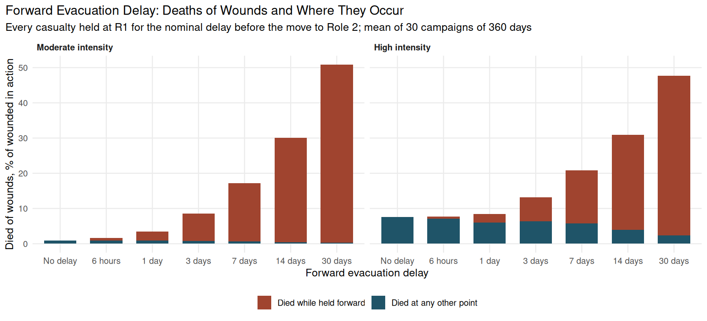

Deaths of wounds per campaign as a share of wounded in action at each delay, at moderate intensity (left) and high intensity (right), split into deaths while held forward and every other death of wounds; each bar is a ratio of the two arms' campaign means.

At high intensity the same seven arms were run under the `high_intensity` profile (30 replications, 360 days, seed 42).

<!-- GEN evac_delay_high -->
| Response | No delay (shipped) | 6 hours | 1 day | 3 days | 7 days | 14 days | 30 days |
|---|---|---|---|---|---|---|---|
| Mean delay held forward (days) | 0.00 [0.00, 0.00] | 0.25 [0.25, 0.25] | 1.00 [1.00, 1.00] | 3.00 [3.00, 3.00] | 7.00 [6.99, 7.00] | 14.00 [13.99, 14.01] | 30.00 [29.98, 30.02] |
| Casualties held forward | 0.0 [0.0, 0.0] | 10505.8 [10390.2, 10621.3] | 10460.4 [10354.7, 10566.1] | 10567.3 [10471.0, 10663.6] | 10578.3 [10450.8, 10705.8] | 10470.2 [10357.0, 10583.5] | 10541.2 [10416.9, 10665.6] |
| Died of wounds while held forward | 0.00 [0.00, 0.00] | 49.47 [46.95, 51.99] | 197.77 [191.79, 203.74] | 585.93 [576.82, 595.05] | 1286.40 [1265.19, 1307.61] | 2268.13 [2237.57, 2298.70] | 3838.33 [3772.36, 3904.31] |
| Died of wounds | 637.23 [523.53, 750.93] | 650.00 [536.87, 763.13] | 703.87 [636.97, 770.77] | 1121.97 [1045.70, 1198.23] | 1780.23 [1686.74, 1873.73] | 2596.80 [2520.28, 2673.32] | 4039.10 [3921.01, 4157.19] |
| Died of wounds per wounded in action (%) | 7.43 [6.21, 8.65] | 7.62 [6.40, 8.85] | 8.34 [7.64, 9.04] | 13.15 [12.40, 13.91] | 20.82 [20.01, 21.63] | 30.83 [30.27, 31.39] | 47.58 [46.82, 48.34] |
| Treated-cohort died-of-wounds rate (%) | 6.279 [5.224, 7.334] | 6.442 [5.382, 7.502] | 7.048 [6.441, 7.654] | 11.214 [10.536, 11.892] | 17.927 [17.195, 18.659] | 27.051 [26.525, 27.578] | 43.954 [43.269, 44.639] |
| Time to first incision (hours) | 89.45 [69.24, 109.67] | 90.73 [68.79, 112.67] | 93.69 [81.24, 106.13] | 150.80 [137.74, 163.86] | 253.77 [235.47, 272.08] | 400.79 [387.69, 413.88] | 780.98 [755.82, 806.14] |
| Casualties requiring surgery operated on (%) | 98.3 [98.0, 98.7] | 98.2 [97.8, 98.7] | 98.2 [97.8, 98.6] | 97.7 [97.2, 98.1] | 96.3 [95.7, 96.9] | 94.9 [94.5, 95.4] | 90.2 [89.7, 90.7] |
| R2B surgeries | 1810.2 [1791.4, 1829.0] | 1807.3 [1788.0, 1826.6] | 1807.7 [1795.1, 1820.2] | 1846.0 [1832.4, 1859.6] | 1848.4 [1832.4, 1864.4] | 1815.0 [1802.8, 1827.2] | 1756.2 [1740.8, 1771.7] |
| Diverted from R2B, team off shift | 3860.1 [3806.1, 3914.0] | 3863.2 [3815.5, 3910.9] | 3915.0 [3875.0, 3955.0] | 4044.8 [3995.0, 4094.6] | 4123.5 [4068.0, 4178.9] | 4047.8 [3992.4, 4103.2] | 3895.2 [3830.5, 3959.8] |
| Diverted from R2B, theatre busy | 1426.6 [1385.3, 1467.9] | 1385.5 [1350.9, 1420.2] | 1330.6 [1294.8, 1366.5] | 1209.2 [1182.5, 1236.0] | 1087.4 [1055.6, 1119.1] | 998.9 [976.7, 1021.2] | 942.0 [912.7, 971.4] |
| R2E first surgeries | 6221.5 [6138.6, 6304.3] | 6210.7 [6141.8, 6279.6] | 6189.6 [6129.2, 6249.9] | 6203.2 [6141.8, 6264.5] | 6108.1 [6042.2, 6174.0] | 5956.8 [5885.4, 6028.2] | 5687.7 [5613.0, 5762.3] |
| R2B theatre queue, late-half classification | converged at 0.00 | converged at 0.00 | converged at 0.00 | converged at 0.00 | converged at 0.00 | converged at 0.00 | converged at 0.00 |
| R2B holding queue, late-half classification | converged at 0.35 | converged at 0.32 | converged at 0.29 | converged at 0.22 | converged at 0.16 | converged at 0.11 | converged at 0.11 |
| R2E theatre queue, late-half classification | converged at 97.9 | converged at 89.4 | converged at 74.4 | converged at 86.6 | **drifting, +8.8%/block**, 10.4 to 132.9 | converged at 79.0 | converged at 76.6 |
| R2E post-operative overflow, late-half classification | converged at 19.7 | converged at 19.7 | converged at 19.9 | converged at 20.1 | converged at 20.0 | converged at 20.2 | converged at 20.3 |
| R2E holding queue, late-half classification | converged at 53.1 | converged at 53.4 | converged at 54.1 | converged at 54.3 | converged at 53.5 | converged at 53.7 | converged at 52.9 |
| R2E staging overflow, late-half classification | **drifting, +4.9%/block**, 122.3 to 1,460.5 | **drifting, +4.9%/block**, 122.0 to 1,473.8 | **drifting, +5.1%/block**, 113.8 to 1,490.1 | **drifting, +5.3%/block**, 101.0 to 1,499.6 | **drifting, +5.2%/block**, 72.3 to 1,458.4 | **drifting, +5.6%/block**, 32.8 to 1,473.8 | **drifting, +6.5%/block**, 0.1 to 1,458.9 |
| R2E theatre mean queue | 100.45 [68.73, 132.18] | 88.92 [51.43, 126.41] | 85.80 [56.13, 115.47] | 92.15 [62.99, 121.30] | 124.60 [78.84, 170.35] | 80.32 [55.45, 105.19] | 87.16 [50.53, 123.80] |
| R2E post-operative overflow census | 19.62 [19.25, 20.00] | 19.70 [19.31, 20.09] | 19.80 [19.53, 20.07] | 19.97 [19.70, 20.24] | 19.88 [19.53, 20.22] | 20.20 [19.97, 20.43] | 20.30 [20.01, 20.59] |
| R2E holding mean queue | 54.37 [52.11, 56.63] | 54.04 [52.07, 56.02] | 54.53 [52.82, 56.23] | 54.33 [52.87, 55.79] | 53.58 [51.88, 55.28] | 54.07 [52.22, 55.91] | 52.80 [51.21, 54.40] |
| R2E staging overflow census | 1412.07 [1378.54, 1445.60] | 1421.61 [1374.24, 1468.99] | 1446.92 [1416.97, 1476.87] | 1450.09 [1425.03, 1475.14] | 1411.62 [1374.73, 1448.52] | 1424.39 [1394.14, 1454.64] | 1400.33 [1353.65, 1447.01] |
| R2E ICU occupancy (%) | 97.6 [97.5, 97.7] | 97.5 [97.4, 97.7] | 97.5 [97.4, 97.6] | 97.6 [97.5, 97.7] | 97.7 [97.6, 97.7] | 97.7 [97.6, 97.7] | 97.7 [97.6, 97.8] |
| Returns to duty | 4254.5 [4208.7, 4300.3] | 4271.9 [4230.9, 4312.9] | 4267.3 [4224.5, 4310.1] | 4261.8 [4223.8, 4299.8] | 4180.8 [4133.4, 4228.1] | 4107.6 [4074.5, 4140.8] | 3878.0 [3841.0, 3915.0] |
| PMV ambulance utilisation (%) | 51.7 [51.1, 52.4] | 51.8 [51.3, 52.4] | 51.4 [50.9, 51.9] | 51.5 [51.1, 52.0] | 51.1 [50.5, 51.7] | 49.5 [49.0, 50.0] | 47.3 [46.7, 47.9] |
<!-- /GEN -->

<!-- GEN evac_delay_paired_high -->
| Paired difference against no delay | 6 hours | 1 day | 3 days | 7 days | 14 days | 30 days |
|---|---|---|---|---|---|---|
| Died of wounds while held forward | +49.47 [+46.95, +51.99] | +197.77 [+191.79, +203.74] | +585.93 [+576.82, +595.05] | +1286.40 [+1265.19, +1307.61] | +2268.13 [+2237.57, +2298.70] | +3838.33 [+3772.36, +3904.31] |
| Died of wounds | +12.77 [−135.26, +160.79] | +66.63 [−67.36, +200.63] | +484.73 [+365.74, +603.73] | +1143.00 [+1003.68, +1282.32] | +1959.57 [+1819.37, +2099.76] | +3401.87 [+3240.94, +3562.79] |
| Treated-cohort died-of-wounds rate (%) | +0.163 [−1.199, +1.524] | +0.768 [−0.475, +2.012] | +4.935 [+3.842, +6.027] | +11.647 [+10.450, +12.845] | +20.772 [+19.533, +22.011] | +37.675 [+36.461, +38.889] |
| Time to first incision (hours) | +1.28 [−26.63, +29.18] | +4.23 [−19.93, +28.40] | +61.35 [+40.12, +82.57] | +164.32 [+140.00, +188.64] | +311.33 [+286.78, +335.88] | +691.52 [+658.74, +724.30] |
| Casualties requiring surgery operated on (%) | −0.1 [−0.7, +0.5] | −0.1 [−0.7, +0.5] | −0.7 [−1.2, −0.1]† | −2.0 [−2.6, −1.4] | −3.4 [−4.0, −2.8] | −8.1 [−8.7, −7.5] |
| Diverted from R2B, team off shift | +3.1 [−74.4, +80.7] | +54.9 [−7.5, +117.4] | +184.7 [+115.2, +254.2] | +263.4 [+187.1, +339.7] | +187.8 [+111.7, +263.9] | +35.1 [−51.1, +121.3] |
| Diverted from R2B, theatre busy | −41.0 [−89.8, +7.7] | −95.9 [−145.1, −46.7] | −217.3 [−258.5, −176.2] | −339.2 [−390.9, −287.5] | −427.6 [−471.6, −383.7] | −484.5 [−537.9, −431.1] |
| R2E theatre mean queue | −11.53 [−62.21, +39.15] | −14.66 [−54.22, +24.91] | −8.31 [−51.48, +34.86] | +24.14 [−20.07, +68.35] | −20.14 [−61.89, +21.62] | −13.29 [−65.01, +38.43] |
| R2E post-operative overflow census | +0.08 [−0.52, +0.68] | +0.18 [−0.32, +0.67] | +0.34 [−0.14, +0.82] | +0.25 [−0.22, +0.73] | +0.58 [+0.18, +0.98]† | +0.68 [+0.16, +1.20]† |
| R2E holding mean queue | −0.33 [−3.49, +2.84] | +0.16 [−2.96, +3.27] | −0.04 [−2.67, +2.60] | −0.79 [−3.72, +2.13] | −0.30 [−2.74, +2.13] | −1.57 [−4.51, +1.37] |
| R2E ICU occupancy (%) | −0.0 [−0.2, +0.1] | −0.1 [−0.2, +0.0] | +0.0 [−0.1, +0.2] | +0.1 [−0.0, +0.2] | +0.1 [−0.0, +0.2] | +0.1 [−0.0, +0.2] |
| Returns to duty | +17.4 [−42.3, +77.1] | +12.8 [−55.3, +80.9] | +7.3 [−52.4, +67.0] | −73.7 [−132.9, −14.6]† | −146.9 [−211.6, −82.1] | −376.5 [−438.8, −314.2] |
| PMV ambulance utilisation (%) | +0.1 [−0.8, +1.0] | −0.3 [−1.2, +0.5] | −0.2 [−1.0, +0.6] | −0.6 [−1.6, +0.4] | −2.2 [−3.1, −1.4] | −4.4 [−5.3, −3.5] |
<!-- /GEN -->

At high intensity deaths of wounds rose from <!-- GEN cell:evac_delay_high|Died of wounds|No delay (shipped)|mean -->637.23<!-- /GEN --> with no delay to <!-- GEN cell:evac_delay_high|Died of wounds|30 days|mean -->4039.10<!-- /GEN --> at thirty days, of which <!-- GEN cell:evac_delay_high|Died of wounds while held forward|30 days|mean -->3838.33<!-- /GEN --> died while held forward. The paired difference was <!-- GEN cell:evac_delay_paired_high|Died of wounds|6 hours|full -->+12.77 [−135.26, +160.79]<!-- /GEN --> at six hours and <!-- GEN cell:evac_delay_paired_high|Died of wounds|1 day|full -->+66.63 [−67.36, +200.63]<!-- /GEN --> at one day, and the treated-cohort rate rose from <!-- GEN cell:evac_delay_high|Treated-cohort died-of-wounds rate (%)|No delay (shipped)|mean -->6.279<!-- /GEN -->% to <!-- GEN cell:evac_delay_high|Treated-cohort died-of-wounds rate (%)|30 days|mean -->43.954<!-- /GEN -->%. The time to first incision rose from <!-- GEN cell:evac_delay_high|Time to first incision (hours)|No delay (shipped)|mean -->89.45<!-- /GEN --> hours to <!-- GEN cell:evac_delay_high|Time to first incision (hours)|30 days|mean -->780.98<!-- /GEN -->. The R2E theatre queue changed by <!-- GEN cell:evac_delay_paired_high|R2E theatre mean queue|30 days|full -->−13.29 [−65.01, +38.43]<!-- /GEN --> at thirty days, intensive care occupancy was <!-- GEN cell:evac_delay_high|R2E ICU occupancy (%)|30 days|mean -->97.7<!-- /GEN -->%, and the staging overflow was classified <!-- GEN cell:evac_delay_high|R2E staging overflow, late-half classification|30 days|full -->**drifting, +6.5%/block**, 0.1 to 1,458.9<!-- /GEN --> at that delay. Casualties diverted past R2B because its theatre was busy changed by <!-- GEN cell:evac_delay_paired_high|Diverted from R2B, theatre busy|30 days|full -->−484.5 [−537.9, −431.1]<!-- /GEN -->, returns to duty by <!-- GEN cell:evac_delay_paired_high|Returns to duty|30 days|full -->−376.5 [−438.8, −314.2]<!-- /GEN --> and PMV ambulance utilisation by <!-- GEN cell:evac_delay_paired_high|PMV ambulance utilisation (%)|30 days|full -->−4.4 [−5.3, −3.5]<!-- /GEN --> percentage points at thirty days.

---

## National Support Base and Strategic Airlift

<small>[Return to Top](#contents)</small>

**Question.** How does strategic evacuation demand and its wait respond to the shipped airlift schedule, to the interval between sorties and to sortie cancellation, and what census does the national support base carry? `[default, both intensities and swept values · 360 d · 30 replications · per-replication reductions]`

<!-- GEN airlift_baseline -->
| Response at the shipped schedule | Moderate intensity | High intensity |
|---|---|---|
| Casualties boarded | 2336.27 [2292.86, 2379.67] | 3908.80 [3885.21, 3932.39] |
| Still waiting at the close | 33.10 [25.20, 41.00] | 1497.37 [1458.81, 1535.92] |
| Mean wait (days) | 5.31 [4.89, 5.73] | 43.50 [42.98, 44.02] |
| Share of R2E holding beds held by the evacuation wait | 11% [10%, 12%] | 6% [6%, 7%] |
| Role 4 peak occupancy (concurrent patients) | 209.00 [205.40, 212.60] | 281.70 [279.11, 284.29] |
| Days the peak falls before the campaign ends | 151.57 [120.04, 183.09] | 166.27 [135.64, 196.89] |
<!-- /GEN -->

At the shipped schedule <!-- GEN cell:airlift_baseline|Casualties boarded|Moderate intensity|mean -->2336.27<!-- /GEN --> casualties boarded at moderate intensity and <!-- GEN cell:airlift_baseline|Casualties boarded|High intensity|mean -->3908.80<!-- /GEN --> at high, with <!-- GEN cell:airlift_baseline|Still waiting at the close|Moderate intensity|mean -->33.10<!-- /GEN --> and <!-- GEN cell:airlift_baseline|Still waiting at the close|High intensity|mean -->1497.37<!-- /GEN --> still waiting at the close and mean waits of <!-- GEN cell:airlift_baseline|Mean wait (days)|Moderate intensity|mean -->5.31<!-- /GEN --> and <!-- GEN cell:airlift_baseline|Mean wait (days)|High intensity|mean -->43.50<!-- /GEN --> days. The evacuation wait held <!-- GEN cell:airlift_baseline|Share of R2E holding beds held by the evacuation wait|Moderate intensity|full -->11% [10%, 12%]<!-- /GEN --> and <!-- GEN cell:airlift_baseline|Share of R2E holding beds held by the evacuation wait|High intensity|full -->6% [6%, 7%]<!-- /GEN --> of the R2E holding beds. Role 4 peak occupancy was <!-- GEN cell:airlift_baseline|Role 4 peak occupancy (concurrent patients)|Moderate intensity|full -->209.00 [205.40, 212.60]<!-- /GEN --> and <!-- GEN cell:airlift_baseline|Role 4 peak occupancy (concurrent patients)|High intensity|full -->281.70 [279.11, 284.29]<!-- /GEN --> concurrent patients, and the peak fell <!-- GEN cell:airlift_baseline|Days the peak falls before the campaign ends|Moderate intensity|full -->151.57 [120.04, 183.09]<!-- /GEN --> and <!-- GEN cell:airlift_baseline|Days the peak falls before the campaign ends|High intensity|full -->166.27 [135.64, 196.89]<!-- /GEN --> days before the campaign ended.

<!-- GEN airlift_interval -->
| Response by interval between sorties | 3 days | 5 days | 7 days (shipped) | 10 days | 14 days |
|---|---|---|---|---|---|
| Sorties flown | 119.00 | 71.00 | 51.00 | 35.00 | 25.00 |
| Mean wait (days) | 1.69 [1.66, 1.71] | 2.87 [2.78, 2.97] | 5.31 [4.89, 5.73] | 18.46 [17.14, 19.77] | 31.03 [30.10, 31.96] |
| Share of R2E holding beds held by the evacuation wait | 6% [5%, 6%] | 8% [8%, 9%] | 11% [10%, 12%] | 21% [20%, 23%] | 29% [27%, 30%] |
| Ventilated pre-flight intensive care hold (hours) | 24.08 [23.93, 24.23] | 24.04 [23.87, 24.20] | 24.01 [23.83, 24.19] | 23.94 [23.77, 24.11] | 23.98 [23.82, 24.13] |
<!-- /GEN -->

Shortening the interval between sorties below the shipped seven days left the mean wait at <!-- GEN cell:airlift_interval|Mean wait (days)|3 days|mean -->1.69<!-- /GEN --> days at three days and <!-- GEN cell:airlift_interval|Mean wait (days)|5 days|mean -->2.87<!-- /GEN --> at five against <!-- GEN cell:airlift_interval|Mean wait (days)|7 days (shipped)|mean -->5.31<!-- /GEN --> at seven. Lengthening it gave <!-- GEN cell:airlift_interval|Mean wait (days)|10 days|full -->18.46 [17.14, 19.77]<!-- /GEN --> days at ten days with <!-- GEN cell:airlift_interval|Sorties flown|10 days|full -->35.00<!-- /GEN --> sorties flown and <!-- GEN cell:airlift_interval|Mean wait (days)|14 days|full -->31.03 [30.10, 31.96]<!-- /GEN --> days at fourteen with <!-- GEN cell:airlift_interval|Sorties flown|14 days|full -->25.00<!-- /GEN -->.

<!-- GEN airlift_reliability -->
| Response by configured cancellation probability | 0% | 5% | 10% | 15% | 25% | 40% |
|---|---|---|---|---|---|---|
| Sorties flown | 51.00 | 48.23 | 45.63 | 43.57 | 38.13 | 30.33 |
| Realised cancellation rate | 0% | 5% | 11% | 15% | 25% | 41% |
| Mean wait (days) | 5.31 [4.89, 5.73] | 6.57 [5.68, 7.46] | 8.79 [7.54, 10.03] | 11.11 [9.76, 12.45] | 16.61 [14.82, 18.40] | 25.81 [23.72, 27.90] |
| Share of R2E holding beds held by the evacuation wait | 11% [10%, 12%] | 12% [11%, 13%] | 14% [13%, 16%] | 16% [15%, 17%] | 20% [19%, 22%] | 25% [24%, 27%] |
<!-- /GEN -->

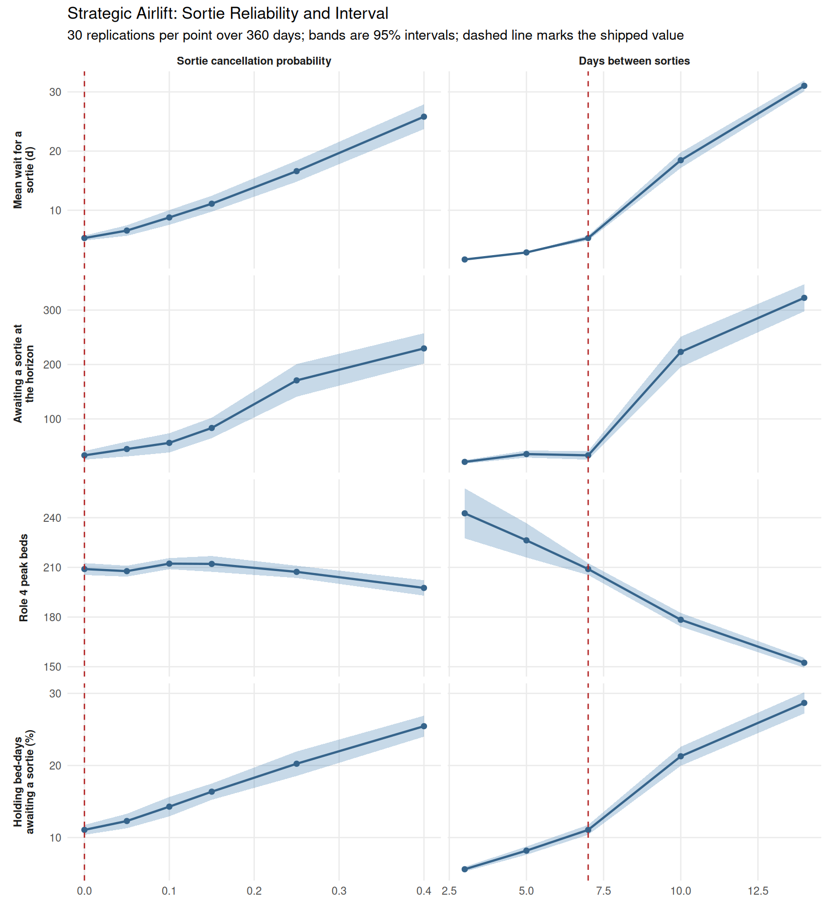

Wait for a sortie, casualties still waiting at the horizon, Role 4 peak beds and the share of holding bed-days spent awaiting a sortie against sortie cancellation probability and the interval between sorties, with the shipped value of each marked by a dashed line.

The mean wait rose from <!-- GEN cell:airlift_reliability|Mean wait (days)|0%|mean -->5.31<!-- /GEN --> days with no cancellation to <!-- GEN cell:airlift_reliability|Mean wait (days)|10%|mean -->8.79<!-- /GEN --> at 10%, <!-- GEN cell:airlift_reliability|Mean wait (days)|25%|mean -->16.61<!-- /GEN --> at 25% and <!-- GEN cell:airlift_reliability|Mean wait (days)|40%|mean -->25.81<!-- /GEN --> at 40%, as the sorties flown fell from <!-- GEN cell:airlift_reliability|Sorties flown|0%|full -->51.00<!-- /GEN --> to <!-- GEN cell:airlift_reliability|Sorties flown|40%|full -->30.33<!-- /GEN -->.

**High-intensity profile.** The same two sweeps under `high_intensity` `[high_intensity, interval 3 to 14 days and cancellation 0 to 40% · 360 d · 30 replications · campaign means]`:

<!-- GEN airlift_interval_high -->
| Response by interval between sorties | 3 days | 5 days | 7 days (shipped) | 10 days | 14 days |
|---|---|---|---|---|---|
| Sorties flown | 119.00 | 71.00 | 51.00 | 35.00 | 25.00 |
| Mean wait (days) | 13.13 [12.08, 14.18] | 37.17 [36.65, 37.68] | 43.50 [42.98, 44.02] | 53.93 [52.98, 54.88] | 70.21 [69.49, 70.94] |
| Share of R2E holding beds held by the evacuation wait | 2% [2%, 3%] | 5% [4%, 5%] | 6% [6%, 7%] | 7% [6%, 8%] | 8% [7%, 10%] |
| Ventilated pre-flight intensive care hold (hours) | 24.01 [23.92, 24.10] | 23.97 [23.88, 24.07] | 23.99 [23.89, 24.09] | 23.98 [23.90, 24.06] | 23.95 [23.85, 24.04] |
<!-- /GEN -->

At the shipped seven-day interval the mean wait was <!-- GEN cell:airlift_interval_high|Mean wait (days)|7 days (shipped)|mean -->43.50<!-- /GEN --> days. Shortening the interval to five days gave <!-- GEN cell:airlift_interval_high|Mean wait (days)|5 days|mean -->37.17<!-- /GEN --> days and to three days <!-- GEN cell:airlift_interval_high|Mean wait (days)|3 days|mean -->13.13<!-- /GEN --> days with <!-- GEN cell:airlift_interval_high|Sorties flown|3 days|mean -->119.00<!-- /GEN --> sorties flown, while lengthening it to ten and fourteen days gave <!-- GEN cell:airlift_interval_high|Mean wait (days)|10 days|mean -->53.93<!-- /GEN --> and <!-- GEN cell:airlift_interval_high|Mean wait (days)|14 days|mean -->70.21<!-- /GEN --> days.

<!-- GEN airlift_reliability_high -->
| Response by configured cancellation probability | 0% | 5% | 10% | 15% | 25% | 40% |
|---|---|---|---|---|---|---|
| Sorties flown | 51.00 | 48.27 | 46.07 | 43.23 | 39.20 | 30.43 |
| Realised cancellation rate | 0% | 5% | 10% | 15% | 23% | 40% |
| Mean wait (days) | 43.50 [42.98, 44.02] | 44.12 [43.54, 44.69] | 45.73 [44.82, 46.63] | 47.77 [46.57, 48.97] | 51.14 [49.25, 53.03] | 61.25 [59.12, 63.37] |
| Share of R2E holding beds held by the evacuation wait | 6% [6%, 7%] | 6% [5%, 7%] | 6% [5%, 7%] | 7% [6%, 8%] | 6% [6%, 7%] | 8% [7%, 9%] |
<!-- /GEN -->

The mean wait rose from <!-- GEN cell:airlift_reliability_high|Mean wait (days)|0%|mean -->43.50<!-- /GEN --> days with no cancellation to <!-- GEN cell:airlift_reliability_high|Mean wait (days)|10%|mean -->45.73<!-- /GEN --> at 10%, <!-- GEN cell:airlift_reliability_high|Mean wait (days)|25%|mean -->51.14<!-- /GEN --> at 25% and <!-- GEN cell:airlift_reliability_high|Mean wait (days)|40%|mean -->61.25<!-- /GEN --> at 40%, as the sorties flown fell from <!-- GEN cell:airlift_reliability_high|Sorties flown|0%|mean -->51.00<!-- /GEN --> to <!-- GEN cell:airlift_reliability_high|Sorties flown|40%|mean -->30.43<!-- /GEN -->.

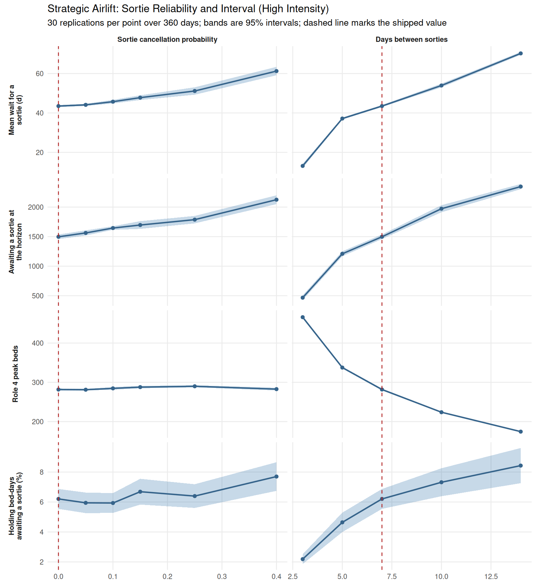

The panels of the figure above under the high-intensity profile, with the shipped value of each sweep marked by a dashed line.

**Collapse classification.** Each airlift route was classified separately, the critical and standard seat pools filling independently. A route was classified as collapsed in a campaign where the backlog of casualties awaiting a place on it was still rising over the late half of the campaign, by the late-half trend rule of [Classifying Stability](Methods.md#classifying-stability), and its late-half mean exceeded the places one sortie opens on the route; a casualty left the backlog on boarding or on dying. Utilisation is the route's demand over the campaign divided by the places its flown sorties opened. `[default, sortie cancellation 0 to 25% · 360 d · 30 replications · exact binomial]`

<!-- GEN airlift_collapse -->
| Route and sortie cancellation | Collapsed | Collapse rate (exact 95% interval) | Mean utilisation | Demand at or above places flown | Median closing backlog | Worst closing backlog |
|---|---|---|---|---|---|---|
| Critical, 0% | 1 of 30 | 3.3% [0.1%, 17.2%] | 0.84 | 0 of 30 | 21.2 | 120.7 |
| Critical, 5% | 1 of 30 | 3.3% [0.1%, 17.2%] | 0.86 | 1 of 30 | 28.7 | 171.7 |
| Critical, 10% | 4 of 30 | 13.3% [3.8%, 30.7%] | 0.92 | 3 of 30 | 47.6 | 158.8 |
| Critical, 15% | 7 of 30 | 23.3% [9.9%, 42.3%] | 0.97 | 9 of 30 | 88.8 | 177.5 |
| Critical, 20% | 12 of 30 | 40.0% [22.7%, 59.4%] | 1.06 | 20 of 30 | 105.5 | 295.3 |
| Critical, 25% | 13 of 30 | 43.3% [25.5%, 62.6%] | 1.12 | 27 of 30 | 139.2 | 292.0 |
| Standard, 0% | 0 of 30 | 0.0% [0.0%, 11.6%] | 0.30 | 0 of 30 | 6.9 | 8.6 |
| Standard, 5% | 0 of 30 | 0.0% [0.0%, 11.6%] | 0.31 | 0 of 30 | 7.5 | 16.6 |
| Standard, 10% | 0 of 30 | 0.0% [0.0%, 11.6%] | 0.34 | 0 of 30 | 9.0 | 17.4 |
| Standard, 15% | 0 of 30 | 0.0% [0.0%, 11.6%] | 0.35 | 0 of 30 | 9.3 | 12.9 |
| Standard, 20% | 0 of 30 | 0.0% [0.0%, 11.6%] | 0.38 | 0 of 30 | 9.9 | 29.2 |
| Standard, 25% | 0 of 30 | 0.0% [0.0%, 11.6%] | 0.40 | 0 of 30 | 13.2 | 23.0 |
<!-- /GEN -->

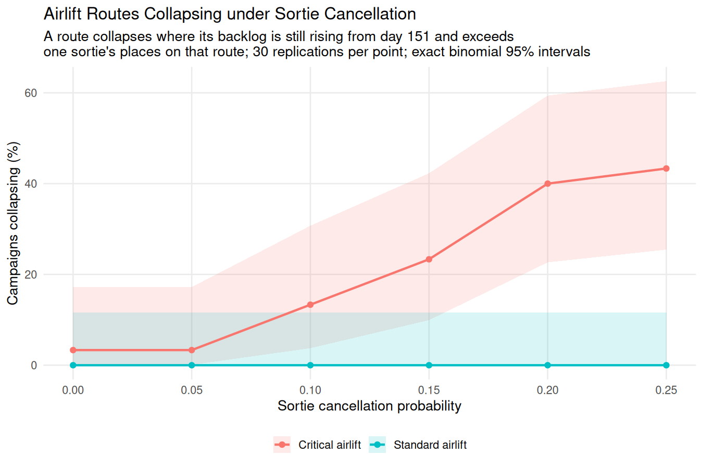

The share of campaigns in which each route was classified as collapsed against sortie cancellation probability, with exact binomial 95% confidence intervals.

The critical route collapsed in <!-- GEN cell:airlift_collapse|Critical, 0%|Collapsed|full -->1 of 30<!-- /GEN --> campaigns with no cancellation, <!-- GEN cell:airlift_collapse|Critical, 15%|Collapsed|full -->7 of 30<!-- /GEN --> at 15% and <!-- GEN cell:airlift_collapse|Critical, 25%|Collapsed|full -->13 of 30<!-- /GEN --> at 25%, its mean utilisation rising from <!-- GEN cell:airlift_collapse|Critical, 0%|Mean utilisation|full -->0.84<!-- /GEN --> to <!-- GEN cell:airlift_collapse|Critical, 25%|Mean utilisation|full -->1.12<!-- /GEN -->. Demand met or exceeded the critical places flown in <!-- GEN cell:airlift_collapse|Critical, 15%|Demand at or above places flown|full -->9 of 30<!-- /GEN --> campaigns at 15% cancellation. The standard route collapsed in <!-- GEN cell:airlift_collapse|Standard, 25%|Collapsed|full -->0 of 30<!-- /GEN --> campaigns at 25%, at a mean utilisation of <!-- GEN cell:airlift_collapse|Standard, 25%|Mean utilisation|full -->0.40<!-- /GEN -->.

**High-intensity profile.** The same classification under `high_intensity` `[high_intensity, sortie cancellation 0 to 25% · 360 d · 30 replications per arm · exact binomial interval]`:

<!-- GEN airlift_collapse_high -->
| Route and sortie cancellation | Collapsed | Collapse rate (exact 95% interval) | Mean utilisation | Demand at or above places flown | Median closing backlog | Worst closing backlog |
|---|---|---|---|---|---|---|
| Critical, 0% | 29 of 30 | 96.7% [82.8%, 99.9%] | 2.61 | 30 of 30 | 1,392.4 | 1,563.3 |
| Critical, 5% | 30 of 30 | 100.0% [88.4%, 100.0%] | 2.77 | 30 of 30 | 1,472.0 | 1,569.9 |
| Critical, 10% | 30 of 30 | 100.0% [88.4%, 100.0%] | 2.92 | 30 of 30 | 1,532.9 | 1,654.0 |
| Critical, 15% | 30 of 30 | 100.0% [88.4%, 100.0%] | 3.09 | 30 of 30 | 1,564.8 | 1,802.8 |
| Critical, 20% | 30 of 30 | 100.0% [88.4%, 100.0%] | 3.23 | 30 of 30 | 1,553.7 | 1,898.7 |
| Critical, 25% | 30 of 30 | 100.0% [88.4%, 100.0%] | 3.40 | 30 of 30 | 1,619.2 | 1,851.1 |
| Standard, 0% | 0 of 30 | 0.0% [0.0%, 11.6%] | 0.76 | 0 of 30 | 17.2 | 21.9 |
| Standard, 5% | 0 of 30 | 0.0% [0.0%, 11.6%] | 0.80 | 0 of 30 | 21.1 | 52.9 |
| Standard, 10% | 0 of 30 | 0.0% [0.0%, 11.6%] | 0.85 | 0 of 30 | 26.6 | 85.8 |
| Standard, 15% | 2 of 30 | 6.7% [0.8%, 22.1%] | 0.90 | 2 of 30 | 34.7 | 154.2 |
| Standard, 20% | 2 of 30 | 6.7% [0.8%, 22.1%] | 0.96 | 6 of 30 | 41.0 | 157.5 |
| Standard, 25% | 1 of 30 | 3.3% [0.1%, 17.2%] | 1.00 | 13 of 30 | 66.7 | 179.5 |
<!-- /GEN -->

Under `high_intensity` the critical route collapsed in <!-- GEN cell:airlift_collapse_high|Critical, 0%|Collapsed|full -->29 of 30<!-- /GEN --> campaigns with no cancellation, at a mean utilisation of <!-- GEN cell:airlift_collapse_high|Critical, 0%|Mean utilisation|full -->2.61<!-- /GEN -->, and the standard route in <!-- GEN cell:airlift_collapse_high|Standard, 0%|Collapsed|full -->0 of 30<!-- /GEN -->, at <!-- GEN cell:airlift_collapse_high|Standard, 0%|Mean utilisation|full -->0.76<!-- /GEN -->.

---

## Critical-Care Places per Sortie

<small>[Return to Top](#contents)</small>

**Question.** What do more critical-care places per sortie buy, with the airframe's total held at 90, and how does reconfiguring the aircraft compare with flying it more often? `[default and high_intensity, 36 to 72 critical places of 90 crossed with a 7-day and a 3-day interval · 360 d · 30 replications · paired, closing 90 d]`

Each arm splits the C-17A's 90 places between the critical-care and standard pools and flies at the shipped weekly interval or every three days ([Methods](Methods.md#critical-care-places-per-sortie-sweep)). A route's collapse row counts the campaigns whose backlog on that route was still rising over the second half of the year and exceeded the places that arm's sorties open on it, with the exact binomial interval on the rate. Every arm is compared with the shipped split at the weekly interval, and Holm's adjustment is taken across all of those comparisons.

<!-- GEN airlift_places -->
| Response | 36/54, 7 days (shipped) | 45/45, 7 days | 54/36, 7 days | 72/18, 7 days | 36/54, 3 days | 45/45, 3 days | 54/36, 3 days | 72/18, 3 days |
|---|---|---|---|---|---|---|---|---|
| Critical airlift closing backlog | 27.6 [20.0, 35.3] | 17.2 [14.8, 19.6] | 15.3 [13.0, 17.6] | 14.1 [12.8, 15.4] | 5.8 [5.4, 6.3] | 5.2 [4.9, 5.5] | 5.3 [5.0, 5.6] | 5.5 [5.1, 5.8] |
| Critical airlift campaigns collapsed | 1 of 30 [0%, 17%] | 0 of 30 [0%, 12%] | 0 of 30 [0%, 12%] | 0 of 30 [0%, 12%] | 0 of 30 [0%, 12%] | 0 of 30 [0%, 12%] | 0 of 30 [0%, 12%] | 0 of 30 [0%, 12%] |
| Standard airlift closing backlog | 6.9 [6.6, 7.2] | 6.9 [6.5, 7.2] | 6.9 [6.5, 7.2] | 14.1 [10.5, 17.6] | 2.4 [2.3, 2.5] | 2.3 [2.2, 2.4] | 2.3 [2.2, 2.4] | 2.4 [2.3, 2.6] |
| Standard airlift campaigns collapsed | 0 of 30 [0%, 12%] | 0 of 30 [0%, 12%] | 0 of 30 [0%, 12%] | 2 of 30 [1%, 22%] | 0 of 30 [0%, 12%] | 0 of 30 [0%, 12%] | 0 of 30 [0%, 12%] | 0 of 30 [0%, 12%] |
| Critical airlift mean wait (days) | 6.29 [5.64, 6.94] | 4.44 [4.16, 4.73] | 4.00 [3.84, 4.16] | 3.75 [3.70, 3.80] | 1.78 [1.75, 1.81] | 1.73 [1.72, 1.74] | 1.72 [1.71, 1.73] | 1.73 [1.71, 1.74] |
| Standard airlift mean wait (days) | 3.49 [3.46, 3.52] | 3.49 [3.47, 3.52] | 3.53 [3.50, 3.57] | 6.36 [5.71, 7.00] | 1.51 [1.50, 1.52] | 1.50 [1.49, 1.52] | 1.50 [1.49, 1.52] | 1.51 [1.50, 1.53] |
| Critical places departing empty per sortie | 6.3 [5.6, 6.9] | 14.7 [14.0, 15.5] | 24.3 [23.6, 25.0] | 42.8 [42.2, 43.5] | 23.2 [22.8, 23.5] | 32.3 [32.1, 32.6] | 41.3 [41.0, 41.6] | 59.3 [58.9, 59.6] |
| Standard places departing empty per sortie | 37.9 [37.6, 38.2] | 28.9 [28.6, 29.2] | 20.0 [19.6, 20.3] | 2.3 [2.0, 2.5] | 47.1 [46.9, 47.2] | 38.2 [38.0, 38.3] | 29.1 [29.0, 29.3] | 11.1 [11.0, 11.3] |
| R2E ICU occupancy (%) | 86.9 [86.1, 87.7] | 86.7 [85.8, 87.6] | 86.2 [85.3, 87.0] | 86.1 [85.2, 87.0] | 86.7 [86.1, 87.3] | 86.5 [85.6, 87.4] | 86.5 [85.6, 87.3] | 86.4 [85.6, 87.3] |
| R2E holding occupancy (%) | 99.4 [99.2, 99.5] | 99.5 [99.3, 99.6] | 99.4 [99.3, 99.5] | 99.5 [99.4, 99.6] | 99.0 [98.8, 99.3] | 99.0 [98.9, 99.2] | 99.1 [99.0, 99.3] | 99.0 [98.8, 99.2] |
| Died of wounds awaiting airlift | 1.23 [0.86, 1.61] | 0.90 [0.52, 1.28] | 0.73 [0.41, 1.06] | 0.80 [0.44, 1.16] | 0.30 [0.10, 0.50] | 0.23 [0.07, 0.39] | 0.27 [0.10, 0.43] | 0.33 [0.13, 0.54] |
| Died of wounds | 21.67 [17.68, 25.65] | 24.40 [21.39, 27.41] | 22.57 [18.19, 26.94] | 22.77 [19.09, 26.44] | 22.97 [18.58, 27.36] | 20.03 [17.82, 22.25] | 22.30 [19.42, 25.18] | 22.10 [19.36, 24.84] |
| Role 4 peak census | 209.0 [205.4, 212.6] | 230.8 [225.9, 235.8] | 237.4 [227.9, 247.0] | 236.8 [225.2, 248.4] | 242.7 [227.6, 257.8] | 233.1 [219.9, 246.2] | 233.7 [220.2, 247.2] | 241.0 [224.8, 257.2] |
<!-- /GEN -->

<!-- GEN airlift_places_paired -->
| Paired difference against the shipped split | 45/45, 7 days | 54/36, 7 days | 72/18, 7 days | 36/54, 3 days | 45/45, 3 days | 54/36, 3 days | 72/18, 3 days |
|---|---|---|---|---|---|---|---|
| Critical airlift closing backlog | −10.4 [−18.7, −2.2]† | −12.3 [−20.2, −4.4]† | −13.6 [−21.3, −5.8] | −21.8 [−29.6, −14.0] | −22.4 [−30.1, −14.8] | −22.4 [−30.1, −14.6] | −22.2 [−29.9, −14.5] |
| Standard airlift closing backlog | −0.1 [−0.5, +0.4] | −0.1 [−0.5, +0.3] | +7.1 [+3.6, +10.7] | −4.5 [−4.9, −4.2] | −4.6 [−4.9, −4.3] | −4.6 [−5.0, −4.3] | −4.5 [−4.9, −4.1] |
| Critical airlift mean wait (days) | −1.84 [−2.52, −1.17] | −2.29 [−2.92, −1.65] | −2.54 [−3.20, −1.88] | −4.51 [−5.16, −3.86] | −4.56 [−5.20, −3.91] | −4.57 [−5.21, −3.92] | −4.56 [−5.21, −3.92] |
| Standard airlift mean wait (days) | +0.00 [−0.03, +0.04] | +0.04 [+0.00, +0.09]† | +2.86 [+2.22, +3.51] | −1.98 [−2.01, −1.95] | −1.99 [−2.02, −1.95] | −1.99 [−2.02, −1.95] | −1.98 [−2.01, −1.95] |
| Critical places departing empty per sortie | +8.5 [+7.5, +9.4] | +18.0 [+17.1, +18.9] | +36.6 [+35.7, +37.5] | +16.9 [+16.1, +17.7] | +26.1 [+25.4, +26.8] | +35.0 [+34.3, +35.7] | +53.0 [+52.3, +53.7] |
| Standard places departing empty per sortie | −9.1 [−9.5, −8.6] | −17.9 [−18.4, −17.5] | −35.7 [−36.0, −35.3] | +9.1 [+8.8, +9.5] | +0.2 [−0.1, +0.6] | −8.8 [−9.1, −8.4] | −26.8 [−27.1, −26.5] |
| R2E ICU occupancy (%) | −0.2 [−1.4, +0.9] | −0.7 [−1.8, +0.4] | −0.8 [−1.9, +0.3] | −0.2 [−1.2, +0.8] | −0.4 [−1.6, +0.8] | −0.4 [−1.6, +0.8] | −0.4 [−1.8, +1.0] |
| R2E holding occupancy (%) | +0.1 [−0.1, +0.3] | +0.0 [−0.2, +0.2] | +0.1 [−0.1, +0.3] | −0.3 [−0.6, −0.0]† | −0.3 [−0.5, −0.1] | −0.2 [−0.4, −0.0]† | −0.4 [−0.6, −0.1]† |
| Died of wounds awaiting airlift | −0.33 [−0.88, +0.22] | −0.50 [−0.99, −0.01]† | −0.43 [−0.97, +0.10] | −0.93 [−1.34, −0.53] | −1.00 [−1.39, −0.61] | −0.97 [−1.38, −0.56] | −0.90 [−1.31, −0.49] |
| Died of wounds | +2.73 [−2.56, +8.02] | +0.90 [−2.47, +4.27] | +1.10 [−4.53, +6.73] | +1.30 [−5.07, +7.67] | −1.63 [−6.03, +2.76] | +0.63 [−3.95, +5.22] | +0.43 [−3.69, +4.55] |
| Role 4 peak census | +21.8 [+14.8, +28.9] | +28.4 [+18.0, +38.9] | +27.8 [+15.7, +39.9] | +33.7 [+17.7, +49.6] | +24.1 [+10.6, +37.5] | +24.7 [+10.6, +38.8] | +32.0 [+16.0, +48.1] |
<!-- /GEN -->

At the shipped split and interval the critical airlift's closing backlog was <!-- GEN cell:airlift_places|Critical airlift closing backlog|36/54, 7 days (shipped)|full -->27.6 [20.0, 35.3]<!-- /GEN -->, with <!-- GEN cell:airlift_places|Critical airlift campaigns collapsed|36/54, 7 days (shipped)|full -->1 of 30 [0%, 17%]<!-- /GEN --> campaigns collapsed on the critical route. At the weekly interval, 72 critical places of 90 changed the critical backlog by <!-- GEN cell:airlift_places_paired|Critical airlift closing backlog|72/18, 7 days|full -->−13.6 [−21.3, −5.8]<!-- /GEN --> and the standard backlog by <!-- GEN cell:airlift_places_paired|Standard airlift closing backlog|72/18, 7 days|full -->+7.1 [+3.6, +10.7]<!-- /GEN -->, with <!-- GEN cell:airlift_places|Standard airlift campaigns collapsed|72/18, 7 days|full -->2 of 30 [1%, 22%]<!-- /GEN --> campaigns collapsed on the standard route. Flying every three days at the shipped split changed the critical backlog by <!-- GEN cell:airlift_places_paired|Critical airlift closing backlog|36/54, 3 days|full -->−21.8 [−29.6, −14.0]<!-- /GEN -->, with <!-- GEN cell:airlift_places|Critical airlift campaigns collapsed|36/54, 3 days|full -->0 of 30 [0%, 12%]<!-- /GEN --> campaigns collapsed on the critical route, and at 45 critical places by <!-- GEN cell:airlift_places_paired|Critical airlift closing backlog|45/45, 3 days|full -->−22.4 [−30.1, −14.8]<!-- /GEN -->, with <!-- GEN cell:airlift_places|Critical airlift campaigns collapsed|45/45, 3 days|full -->0 of 30 [0%, 12%]<!-- /GEN -->. Deaths of wounds among casualties awaiting airlift changed by <!-- GEN cell:airlift_places_paired|Died of wounds awaiting airlift|45/45, 3 days|full -->−1.00 [−1.39, −0.61]<!-- /GEN --> at 45 places every three days, deaths of wounds in total by <!-- GEN cell:airlift_places_paired|Died of wounds|45/45, 3 days|full -->−1.63 [−6.03, +2.76]<!-- /GEN -->, and the Role 4 peak census by <!-- GEN cell:airlift_places_paired|Role 4 peak census|45/45, 3 days|full -->+24.1 [+10.6, +37.5]<!-- /GEN -->.

At high intensity the same eight arms were run under the `high_intensity` profile (30 replications, 360 days, seed 42).

<!-- GEN airlift_places_high -->
| Response | 36/54, 7 days (shipped) | 45/45, 7 days | 54/36, 7 days | 72/18, 7 days | 36/54, 3 days | 45/45, 3 days | 54/36, 3 days | 72/18, 3 days |
|---|---|---|---|---|---|---|---|---|
| Critical airlift closing backlog | 1398.4 [1365.4, 1431.4] | 1233.2 [1203.4, 1263.1] | 1099.4 [1076.1, 1122.6] | 735.2 [703.8, 766.7] | 393.9 [358.6, 429.3] | 23.3 [22.3, 24.3] | 20.6 [20.1, 21.1] | 20.7 [20.3, 21.1] |
| Critical airlift campaigns collapsed | 29 of 30 [83%, 100%] | 29 of 30 [83%, 100%] | 29 of 30 [83%, 100%] | 26 of 30 [69%, 96%] | 27 of 30 [73%, 98%] | 0 of 30 [0%, 12%] | 0 of 30 [0%, 12%] | 0 of 30 [0%, 12%] |
| Standard airlift closing backlog | 17.5 [16.9, 18.2] | 20.9 [19.4, 22.5] | 135.8 [130.2, 141.4] | 218.4 [212.9, 223.9] | 6.0 [5.8, 6.2] | 6.0 [5.9, 6.2] | 5.9 [5.8, 6.0] | 21.2 [16.9, 25.4] |
| Standard airlift campaigns collapsed | 0 of 30 [0%, 12%] | 0 of 30 [0%, 12%] | 7 of 30 [10%, 42%] | 1 of 30 [0%, 17%] | 0 of 30 [0%, 12%] | 0 of 30 [0%, 12%] | 0 of 30 [0%, 12%] | 0 of 30 [0%, 12%] |
| Critical airlift mean wait (days) | 88.57 [87.38, 89.76] | 74.11 [73.23, 74.99] | 61.67 [60.56, 62.79] | 38.67 [37.39, 39.95] | 18.79 [17.22, 20.37] | 2.17 [2.15, 2.20] | 2.00 [1.99, 2.01] | 2.00 [1.99, 2.01] |
| Standard airlift mean wait (days) | 3.58 [3.54, 3.61] | 4.29 [4.15, 4.43] | 18.46 [17.64, 19.27] | 39.57 [39.28, 39.87] | 1.50 [1.49, 1.51] | 1.50 [1.49, 1.51] | 1.50 [1.49, 1.50] | 3.76 [3.35, 4.18] |
| Critical places departing empty per sortie | 0.0 [0.0, 0.0] | 0.0 [0.0, 0.0] | 0.1 [0.0, 0.1] | 0.3 [0.2, 0.4] | 0.3 [0.2, 0.4] | 5.1 [4.8, 5.5] | 13.8 [13.3, 14.2] | 31.7 [31.4, 32.0] |
| Standard places departing empty per sortie | 13.4 [12.9, 13.8] | 4.1 [3.8, 4.4] | 0.1 [0.1, 0.2] | 0.0 [0.0, 0.0] | 36.7 [36.4, 36.9] | 27.7 [27.5, 27.9] | 18.8 [18.6, 19.0] | 0.7 [0.6, 0.8] |
| R2E ICU occupancy (%) | 97.6 [97.5, 97.7] | 97.6 [97.5, 97.6] | 97.6 [97.5, 97.7] | 97.5 [97.4, 97.6] | 97.6 [97.5, 97.7] | 97.5 [97.4, 97.6] | 97.6 [97.4, 97.7] | 97.5 [97.4, 97.6] |
| R2E holding occupancy (%) | 100.0 [100.0, 100.0] | 100.0 [100.0, 100.0] | 100.0 [100.0, 100.0] | 100.0 [100.0, 100.0] | 100.0 [100.0, 100.0] | 100.0 [100.0, 100.0] | 100.0 [100.0, 100.0] | 100.0 [100.0, 100.0] |
| Died of wounds awaiting airlift | 91.37 [87.22, 95.52] | 78.33 [75.87, 80.80] | 67.70 [63.88, 71.52] | 40.10 [37.23, 42.97] | 22.27 [19.05, 25.49] | 2.20 [1.70, 2.70] | 2.37 [1.84, 2.89] | 2.50 [1.95, 3.05] |
| Died of wounds | 637.23 [523.53, 750.93] | 585.23 [493.22, 677.25] | 540.70 [472.26, 609.14] | 566.43 [475.04, 657.82] | 536.83 [451.34, 622.33] | 411.73 [350.27, 473.20] | 452.03 [367.12, 536.94] | 448.23 [389.11, 507.36] |
| Role 4 peak census | 281.7 [279.1, 284.3] | 315.3 [314.1, 316.4] | 338.7 [337.6, 339.8] | 379.4 [378.4, 380.4] | 465.9 [462.8, 468.9] | 531.9 [527.7, 536.1] | 536.3 [532.2, 540.4] | 527.2 [523.2, 531.3] |
<!-- /GEN -->

<!-- GEN airlift_places_paired_high -->
| Paired difference against the shipped split | 45/45, 7 days | 54/36, 7 days | 72/18, 7 days | 36/54, 3 days | 45/45, 3 days | 54/36, 3 days | 72/18, 3 days |
|---|---|---|---|---|---|---|---|
| Critical airlift closing backlog | −165.2 [−206.4, −124.0] | −299.1 [−345.5, −252.7] | −663.2 [−708.1, −618.2] | −1004.5 [−1060.0, −948.9] | −1375.1 [−1408.0, −1342.2] | −1377.8 [−1410.8, −1344.8] | −1377.7 [−1410.8, −1344.6] |
| Standard airlift closing backlog | +3.4 [+1.8, +5.0] | +118.3 [+112.6, +123.9] | +200.9 [+195.1, +206.6] | −11.6 [−12.3, −10.9] | −11.5 [−12.1, −10.9] | −11.6 [−12.3, −11.0] | +3.6 [−0.7, +7.9] |
| Critical airlift mean wait (days) | −14.46 [−15.70, −13.21] | −26.89 [−28.54, −25.25] | −49.90 [−51.42, −48.38] | −69.77 [−71.76, −67.79] | −86.40 [−87.58, −85.21] | −86.57 [−87.75, −85.38] | −86.57 [−87.75, −85.38] |
| Standard airlift mean wait (days) | +0.71 [+0.57, +0.85] | +14.88 [+14.06, +15.69] | +35.99 [+35.69, +36.30] | −2.08 [−2.12, −2.04] | −2.08 [−2.11, −2.04] | −2.08 [−2.12, −2.05] | +0.18 [−0.24, +0.61] |
| Critical places departing empty per sortie | +0.0 [−0.0, +0.0] | +0.1 [+0.0, +0.1]† | +0.3 [+0.2, +0.4] | +0.3 [+0.2, +0.4] | +5.1 [+4.8, +5.5] | +13.8 [+13.3, +14.2] | +31.7 [+31.4, +32.0] |
| Standard places departing empty per sortie | −9.2 [−9.7, −8.7] | −13.2 [−13.7, −12.8] | −13.4 [−13.8, −12.9] | +23.3 [+22.7, +23.9] | +14.4 [+13.9, +14.9] | +5.4 [+5.0, +5.9] | −12.6 [−13.1, −12.2] |
| R2E ICU occupancy (%) | −0.0 [−0.1, +0.1] | +0.0 [−0.1, +0.2] | −0.1 [−0.2, +0.0] | −0.0 [−0.2, +0.1] | −0.0 [−0.2, +0.1] | −0.0 [−0.2, +0.1] | −0.0 [−0.2, +0.1] |
| R2E holding occupancy (%) | −0.0 [−0.0, +0.0] | −0.0 [−0.0, +0.0] | −0.0 [−0.0, +0.0] | −0.0 [−0.0, +0.0] | −0.0 [−0.0, −0.0]† | −0.0 [−0.0, +0.0] | −0.0 [−0.0, +0.0] |
| Died of wounds awaiting airlift | −13.03 [−18.06, −8.01] | −23.67 [−30.19, −17.15] | −51.27 [−55.81, −46.72] | −69.10 [−74.77, −63.43] | −89.17 [−93.24, −85.09] | −89.00 [−93.24, −84.76] | −88.87 [−93.12, −84.61] |
| Died of wounds | −52.00 [−215.81, +111.81] | −96.53 [−250.81, +57.74] | −70.80 [−181.56, +39.96] | −100.40 [−231.50, +30.70] | −225.50 [−345.02, −105.98] | −185.20 [−340.53, −29.87]† | −189.00 [−332.92, −45.08]† |
| Role 4 peak census | +33.6 [+30.7, +36.4] | +57.0 [+54.5, +59.5] | +97.7 [+94.7, +100.6] | +184.2 [+180.2, +188.1] | +250.2 [+245.5, +254.8] | +254.6 [+250.0, +259.2] | +245.5 [+241.2, +249.9] |
<!-- /GEN -->

At the shipped split and interval at high intensity the critical airlift's closing backlog was <!-- GEN cell:airlift_places_high|Critical airlift closing backlog|36/54, 7 days (shipped)|full -->1398.4 [1365.4, 1431.4]<!-- /GEN -->, with <!-- GEN cell:airlift_places_high|Critical airlift campaigns collapsed|36/54, 7 days (shipped)|full -->29 of 30 [83%, 100%]<!-- /GEN --> campaigns collapsed on the critical route. At the weekly interval, 72 critical places of 90 changed the critical backlog by <!-- GEN cell:airlift_places_paired_high|Critical airlift closing backlog|72/18, 7 days|full -->−663.2 [−708.1, −618.2]<!-- /GEN --> and the standard backlog by <!-- GEN cell:airlift_places_paired_high|Standard airlift closing backlog|72/18, 7 days|full -->+200.9 [+195.1, +206.6]<!-- /GEN -->, with <!-- GEN cell:airlift_places_high|Standard airlift campaigns collapsed|72/18, 7 days|full -->1 of 30 [0%, 17%]<!-- /GEN --> campaigns collapsed on the standard route. Flying every three days at the shipped split changed the critical backlog by <!-- GEN cell:airlift_places_paired_high|Critical airlift closing backlog|36/54, 3 days|full -->−1004.5 [−1060.0, −948.9]<!-- /GEN -->, with <!-- GEN cell:airlift_places_high|Critical airlift campaigns collapsed|36/54, 3 days|full -->27 of 30 [73%, 98%]<!-- /GEN --> campaigns collapsed on the critical route, and at 45 critical places by <!-- GEN cell:airlift_places_paired_high|Critical airlift closing backlog|45/45, 3 days|full -->−1375.1 [−1408.0, −1342.2]<!-- /GEN -->, with <!-- GEN cell:airlift_places_high|Critical airlift campaigns collapsed|45/45, 3 days|full -->0 of 30 [0%, 12%]<!-- /GEN -->. Deaths of wounds among casualties awaiting airlift changed by <!-- GEN cell:airlift_places_paired_high|Died of wounds awaiting airlift|45/45, 3 days|full -->−89.17 [−93.24, −85.09]<!-- /GEN --> at 45 places every three days, deaths of wounds in total by <!-- GEN cell:airlift_places_paired_high|Died of wounds|45/45, 3 days|full -->−225.50 [−345.02, −105.98]<!-- /GEN -->, and the Role 4 peak census by <!-- GEN cell:airlift_places_paired_high|Role 4 peak census|45/45, 3 days|full -->+250.2 [+245.5, +254.8]<!-- /GEN -->.

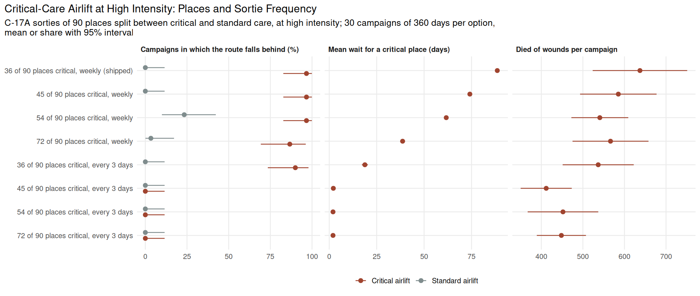

The share of campaigns in which each airlift route collapsed (left), the mean wait for a critical place (centre) and deaths of wounds per campaign (right) for the eight arms at high intensity, each with its 95% interval: exact binomial for the collapse shares, Student $t$ for the means.

The Role 4 load each arm delivers is set out below at both intensities, with the casualties still awaiting airlift on day 360 flown out after it at the arm's own interval and split ([Methods](Methods.md#critical-care-places-per-sortie-sweep)).

<!-- GEN airlift_places_role4 -->
| Role 4 | 36/54, 7 days (shipped) | 45/45, 7 days | 54/36, 7 days | 72/18, 7 days | 36/54, 3 days | 45/45, 3 days | 54/36, 3 days | 72/18, 3 days |
|---|---|---|---|---|---|---|---|---|
| Intensive care, closing 90-day mean beds | 35.5 [33.9, 37.0] | 36.2 [34.5, 37.8] | 34.8 [33.2, 36.4] | 34.1 [31.8, 36.4] | 36.0 [34.5, 37.5] | 33.9 [32.1, 35.7] | 34.5 [32.8, 36.3] | 35.2 [33.1, 37.3] |
| Holding, closing 90-day mean beds | 114.9 [111.2, 118.7] | 115.4 [110.5, 120.3] | 110.8 [106.1, 115.5] | 108.2 [103.6, 112.8] | 113.6 [109.1, 118.2] | 112.1 [107.9, 116.4] | 111.7 [107.1, 116.3] | 114.3 [108.4, 120.1] |
| Total, closing 90-day mean beds | 150.4 [145.2, 155.6] | 151.6 [145.1, 158.0] | 145.6 [139.4, 151.8] | 142.3 [135.5, 149.1] | 149.6 [143.7, 155.6] | 146.0 [140.2, 151.9] | 146.2 [140.0, 152.5] | 149.5 [141.6, 157.3] |
| Peak beds | 209.0 [205.4, 212.6] | 230.8 [225.9, 235.8] | 237.4 [227.9, 247.0] | 236.8 [225.2, 248.4] | 242.7 [227.6, 257.8] | 233.1 [219.9, 246.2] | 233.7 [220.2, 247.2] | 241.0 [224.8, 257.2] |
| Bed-days to day 360 | 50,526 [49,466, 51,585] | 51,248 [50,112, 52,384] | 50,432 [49,284, 51,581] | 49,282 [48,321, 50,242] | 51,036 [49,688, 52,384] | 50,584 [49,513, 51,655] | 50,606 [49,334, 51,877] | 50,801 [49,492, 52,110] |
| Casualties awaiting airlift on day 360 | 33.1 [25.2, 41.0] | 23.6 [19.5, 27.7] | 21.2 [17.4, 25.1] | 30.3 [24.1, 36.5] | 21.1 [17.9, 24.2] | 17.9 [14.9, 21.0] | 19.4 [15.7, 23.1] | 21.5 [18.5, 24.5] |
| Days after day 360 until the last bed empties | 47.1 [45.5, 48.7] | 44.8 [43.7, 45.8] | 44.0 [42.8, 45.2] | 45.4 [44.4, 46.4] | 44.4 [43.2, 45.6] | 43.9 [42.8, 45.1] | 43.7 [42.4, 44.9] | 43.7 [42.7, 44.8] |
| Bed-days after day 360 | 2,943 [2,656, 3,231] | 2,713 [2,519, 2,906] | 2,572 [2,364, 2,780] | 2,815 [2,543, 3,087] | 2,338 [2,091, 2,584] | 2,090 [1,913, 2,268] | 2,262 [2,017, 2,507] | 2,271 [2,037, 2,505] |
| Bed-days in all | 53,469 [52,389, 54,548] | 53,961 [52,791, 55,131] | 53,004 [51,891, 54,118] | 52,097 [51,006, 53,188] | 53,374 [52,033, 54,715] | 52,674 [51,566, 53,783] | 52,868 [51,477, 54,258] | 53,072 [51,675, 54,468] |
<!-- /GEN -->

<!-- GEN airlift_places_role4_high -->
| Role 4 | 36/54, 7 days (shipped) | 45/45, 7 days | 54/36, 7 days | 72/18, 7 days | 36/54, 3 days | 45/45, 3 days | 54/36, 3 days | 72/18, 3 days |
|---|---|---|---|---|---|---|---|---|
| Intensive care, closing 90-day mean beds | 45.6 [45.2, 46.0] | 56.5 [55.9, 57.0] | 67.5 [67.0, 68.0] | 88.3 [87.6, 89.0] | 102.7 [102.1, 103.2] | 115.6 [113.4, 117.9] | 115.3 [112.8, 117.7] | 114.5 [112.6, 116.4] |
| Holding, closing 90-day mean beds | 173.7 [171.4, 175.9] | 200.2 [198.1, 202.3] | 219.3 [218.3, 220.4] | 237.8 [236.7, 239.0] | 311.4 [309.0, 313.8] | 343.0 [337.8, 348.2] | 340.6 [334.7, 346.5] | 341.7 [337.3, 346.2] |
| Total, closing 90-day mean beds | 219.3 [217.1, 221.5] | 256.7 [254.5, 258.9] | 286.8 [285.7, 287.9] | 326.1 [325.2, 327.1] | 414.0 [411.7, 416.4] | 458.6 [451.4, 465.9] | 455.9 [447.7, 464.0] | 456.2 [450.1, 462.3] |
| Peak beds | 281.7 [279.1, 284.3] | 315.3 [314.1, 316.4] | 338.7 [337.6, 339.8] | 379.4 [378.4, 380.4] | 465.9 [462.8, 468.9] | 531.9 [527.7, 536.1] | 536.3 [532.2, 540.4] | 527.2 [523.2, 531.3] |
| Bed-days to day 360 | 75,990 [75,633, 76,348] | 88,500 [88,267, 88,733] | 97,905 [97,715, 98,096] | 111,121 [110,936, 111,306] | 141,572 [141,168, 141,977] | 154,961 [153,451, 156,472] | 155,977 [154,291, 157,663] | 156,541 [155,446, 157,636] |
| Casualties awaiting airlift on day 360 | 1,497.4 [1,458.8, 1,535.9] | 1,307.9 [1,273.8, 1,342.1] | 1,264.0 [1,240.7, 1,287.3] | 973.3 [935.0, 1,011.5] | 466.9 [427.5, 506.3] | 68.4 [64.6, 72.2] | 65.3 [62.1, 68.4] | 75.9 [69.8, 82.0] |
| Days after day 360 until the last bed empties | 319.0 [312.0, 326.0] | 236.7 [231.4, 242.1] | 185.5 [182.7, 188.4] | 118.7 [116.0, 121.4] | 80.7 [77.2, 84.3] | 47.0 [46.3, 47.7] | 45.6 [44.9, 46.4] | 46.9 [46.4, 47.4] |
| Bed-days after day 360 | 43,271 [42,197, 44,345] | 39,100 [38,122, 40,078] | 36,900 [36,290, 37,509] | 28,812 [27,744, 29,880] | 17,781 [16,686, 18,877] | 7,144 [6,893, 7,394] | 7,221 [7,060, 7,381] | 7,161 [6,943, 7,379] |
| Bed-days in all | 119,261 [118,068, 120,455] | 127,600 [126,496, 128,703] | 134,805 [134,177, 135,433] | 139,933 [138,822, 141,045] | 159,354 [158,036, 160,671] | 162,105 [160,568, 163,642] | 163,198 [161,439, 164,957] | 163,702 [162,591, 164,813] |
<!-- /GEN -->

At high intensity the shipped split and interval held <!-- GEN cell:airlift_places_role4_high|Total, closing 90-day mean beds|36/54, 7 days (shipped)|mean -->219.3<!-- /GEN --> Role 4 beds over the closing 90 days, <!-- GEN cell:airlift_places_role4_high|Intensive care, closing 90-day mean beds|36/54, 7 days (shipped)|mean -->45.6<!-- /GEN --> of them intensive care, and left <!-- GEN cell:airlift_places_role4_high|Casualties awaiting airlift on day 360|36/54, 7 days (shipped)|mean -->1,497.4<!-- /GEN --> casualties awaiting airlift on day 360; Role 4 emptied <!-- GEN cell:airlift_places_role4_high|Days after day 360 until the last bed empties|36/54, 7 days (shipped)|mean -->319.0<!-- /GEN --> days after it. At 45/45 every three days the closing mean was <!-- GEN cell:airlift_places_role4_high|Total, closing 90-day mean beds|45/45, 3 days|mean -->458.6<!-- /GEN --> beds, <!-- GEN cell:airlift_places_role4_high|Intensive care, closing 90-day mean beds|45/45, 3 days|mean -->115.6<!-- /GEN --> of them intensive care, <!-- GEN cell:airlift_places_role4_high|Casualties awaiting airlift on day 360|45/45, 3 days|mean -->68.4<!-- /GEN --> casualties were awaiting airlift on day 360, and Role 4 emptied <!-- GEN cell:airlift_places_role4_high|Days after day 360 until the last bed empties|45/45, 3 days|mean -->47.0<!-- /GEN --> days after it. The bed-days occupied during and after the campaign together were <!-- GEN cell:airlift_places_role4_high|Bed-days in all|36/54, 7 days (shipped)|mean -->119,261<!-- /GEN --> at the shipped split and interval and <!-- GEN cell:airlift_places_role4_high|Bed-days in all|45/45, 3 days|mean -->162,105<!-- /GEN --> at 45/45 every three days.

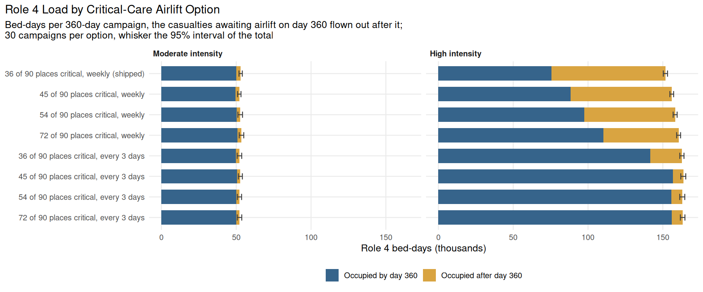

Mean Role 4 bed-days per 360-day campaign for each critical-care place and sortie interval option, at moderate intensity (left) and high intensity (right), divided into the bed-days occupied by day 360 and those occupied after it while the casualties still awaiting airlift are flown out at the option's own interval and split. The whisker is the 95% Student t interval of the total, taken within replication; the two intensities share one scale.

---

## Role 4 Bed Demand

<small>[Return to Top](#contents)</small>

**Question.** How many national support base beds does a campaign commit, what is the demand made of, has it settled by the closing window, how long does it outlast the campaign, and how do the forward evacuation levers move it? `[default, both intensities, the evacuation policy, R2E holding establishment, saturation release and sortie cancellation sweeps · 360 d · 30 replications · daily census, mean, peak and closing 90 d]`

The model gives the national support base no capacity, queue or shortfall, so every figure here is demand: the casualties in a Role 4 bed on a day, counted as the other sections count the Role 4 peak. The mean is taken over the whole campaign, the peak is the busiest day of one campaign, and the closing mean is the mean over the last 90 days. A casualty is counted by the ward phase it is in, intensive care or holding, and by its origin, battle injury, disease and non-battle injury or the reconstruction cohort.

<!-- GEN role4_census_ward -->
| Census by ward phase | Moderate intensity | High intensity |
|---|---|---|
| Total, mean beds | 140.35 [137.41, 143.29] | 211.08 [210.09, 212.08] |
| Total, peak beds | 209.00 [205.40, 212.60] | 281.70 [279.11, 284.29] |
| Total, closing 90-day mean beds | 150.39 [145.16, 155.63] | 219.27 [217.06, 221.48] |
| Intensive care, mean beds | 33.93 [33.13, 34.73] | 43.77 [43.54, 44.01] |
| Intensive care, peak beds | 64.90 [64.14, 65.66] | 68.50 [67.78, 69.22] |
| Intensive care, closing 90-day mean beds | 35.46 [33.90, 37.02] | 45.59 [45.19, 46.00] |
| Holding, mean beds | 106.42 [104.23, 108.60] | 167.31 [166.42, 168.20] |
| Holding, peak beds | 153.60 [150.25, 156.95] | 222.97 [220.06, 225.87] |
| Holding, closing 90-day mean beds | 114.93 [111.16, 118.71] | 173.68 [171.44, 175.91] |
<!-- /GEN -->

At moderate intensity the census averaged <!-- GEN cell:role4_census_ward|Total, mean beds|Moderate intensity|full -->140.35 [137.41, 143.29]<!-- /GEN --> beds over the campaign, peaked at <!-- GEN cell:role4_census_ward|Total, peak beds|Moderate intensity|full -->209.00 [205.40, 212.60]<!-- /GEN --> and averaged <!-- GEN cell:role4_census_ward|Total, closing 90-day mean beds|Moderate intensity|full -->150.39 [145.16, 155.63]<!-- /GEN --> over the closing 90 days. At high intensity the three figures were <!-- GEN cell:role4_census_ward|Total, mean beds|High intensity|full -->211.08 [210.09, 212.08]<!-- /GEN -->, <!-- GEN cell:role4_census_ward|Total, peak beds|High intensity|full -->281.70 [279.11, 284.29]<!-- /GEN --> and <!-- GEN cell:role4_census_ward|Total, closing 90-day mean beds|High intensity|full -->219.27 [217.06, 221.48]<!-- /GEN -->. The closing mean exceeded the campaign mean at both intensities. The holding phase carried <!-- GEN cell:role4_census_ward|Holding, mean beds|Moderate intensity|mean -->106.42<!-- /GEN --> of the <!-- GEN cell:role4_census_ward|Total, mean beds|Moderate intensity|mean -->140.35<!-- /GEN --> mean beds at moderate intensity and <!-- GEN cell:role4_census_ward|Holding, mean beds|High intensity|mean -->167.31<!-- /GEN --> of the <!-- GEN cell:role4_census_ward|Total, mean beds|High intensity|mean -->211.08<!-- /GEN --> at high, and the intensive care phase the remainder.

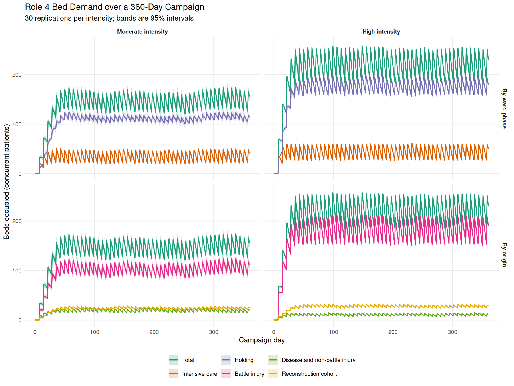

The mean daily census across replications with its 95% interval, at each casualty intensity, divided by ward phase (upper row) and by origin (lower row), each beside the total it sums to. At high intensity the census rises and falls in a regular cycle about its mean.

<!-- GEN role4_census_origin -->
| Census by origin | Moderate intensity | High intensity |
|---|---|---|
| Total, mean beds | 140.35 [137.41, 143.29] | 211.08 [210.09, 212.08] |
| Total, peak beds | 209.00 [205.40, 212.60] | 281.70 [279.11, 284.29] |
| Total, closing 90-day mean beds | 150.39 [145.16, 155.63] | 219.27 [217.06, 221.48] |
| Battle injury, mean beds | 98.76 [96.38, 101.14] | 162.10 [161.02, 163.17] |
| Battle injury, peak beds | 157.23 [153.51, 160.96] | 228.93 [225.92, 231.94] |
| Battle injury, closing 90-day mean beds | 106.07 [101.82, 110.31] | 157.39 [155.33, 159.44] |
| Disease and non-battle injury, mean beds | 18.74 [18.30, 19.19] | 9.85 [9.49, 10.21] |
| Disease and non-battle injury, peak beds | 36.13 [34.89, 37.38] | 21.40 [20.32, 22.48] |
| Disease and non-battle injury, closing 90-day mean beds | 19.62 [18.71, 20.52] | 9.78 [9.25, 10.30] |
| Reconstruction cohort, mean beds | 22.84 [22.11, 23.58] | 39.14 [38.54, 39.74] |
| Reconstruction cohort, peak beds | 38.43 [37.27, 39.59] | 67.80 [65.38, 70.22] |
| Reconstruction cohort, closing 90-day mean beds | 24.71 [23.45, 25.97] | 52.11 [50.70, 53.51] |
<!-- /GEN -->

Battle injury accounted for <!-- GEN cell:role4_census_origin|Battle injury, mean beds|Moderate intensity|mean -->98.76<!-- /GEN --> of the mean beds at moderate intensity and <!-- GEN cell:role4_census_origin|Battle injury, mean beds|High intensity|mean -->162.10<!-- /GEN --> at high. Disease and non-battle injury accounted for <!-- GEN cell:role4_census_origin|Disease and non-battle injury, mean beds|Moderate intensity|mean -->18.74<!-- /GEN --> and <!-- GEN cell:role4_census_origin|Disease and non-battle injury, mean beds|High intensity|mean -->9.85<!-- /GEN -->, and the reconstruction cohort for <!-- GEN cell:role4_census_origin|Reconstruction cohort, mean beds|Moderate intensity|mean -->22.84<!-- /GEN --> and <!-- GEN cell:role4_census_origin|Reconstruction cohort, mean beds|High intensity|mean -->39.14<!-- /GEN -->.

<!-- GEN role4_operations -->
| Demand owed alongside the census | Moderate intensity | High intensity |
|---|---|---|
| Operations owed within the 360 days | 1,199 [1,153, 1,245] | 3,005 [2,968, 3,042] |
| Definitive repairs owed within the 360 days | 129 [116, 143] | 1,106 [1,085, 1,126] |
| Debridements owed within the 360 days | 774 [745, 802] | 1,390 [1,359, 1,421] |
| Reconstructions owed within the 360 days | 296 [287, 305] | 510 [502, 517] |
| Operations owed after day 360 | 22 [18, 26] | 45 [41, 50] |
| Operations owed by casualties admitted during the campaign | 1,221 [1,175, 1,267] | 3,050 [3,014, 3,086] |
| Operations owed on the busiest day | 20.83 [19.64, 22.03] | 41.90 [41.25, 42.55] |
| Closing 90-day mean operations owed per day | 3.48 [3.24, 3.73] | 10.86 [10.65, 11.06] |
| Theatre minutes owed for definitive repairs | 15,973 [14,359, 17,587] | 136,680 [134,053, 139,307] |
<!-- /GEN -->

The operations owed alongside the census were counted three ways. <!-- GEN cell:role4_operations|Operations owed within the 360 days|Moderate intensity|mean -->1,199<!-- /GEN --> fell inside the campaign at moderate intensity and <!-- GEN cell:role4_operations|Operations owed within the 360 days|High intensity|mean -->3,005<!-- /GEN --> at high, a further <!-- GEN cell:role4_operations|Operations owed after day 360|Moderate intensity|mean -->22<!-- /GEN --> and <!-- GEN cell:role4_operations|Operations owed after day 360|High intensity|mean -->45<!-- /GEN --> fell after the campaign ended, in the reconstruction sequences of casualties admitted late, and <!-- GEN cell:role4_operations|Operations owed by casualties admitted during the campaign|Moderate intensity|mean -->1,221<!-- /GEN --> and <!-- GEN cell:role4_operations|Operations owed by casualties admitted during the campaign|High intensity|mean -->3,050<!-- /GEN --> were owed in all, the figure the other sections report as operations owed. By source, the operations inside the campaign were <!-- GEN cell:role4_operations|Definitive repairs owed within the 360 days|Moderate intensity|mean -->129<!-- /GEN --> definitive repairs, <!-- GEN cell:role4_operations|Debridements owed within the 360 days|Moderate intensity|mean -->774<!-- /GEN --> debridements and <!-- GEN cell:role4_operations|Reconstructions owed within the 360 days|Moderate intensity|mean -->296<!-- /GEN --> reconstructions at moderate intensity, and <!-- GEN cell:role4_operations|Definitive repairs owed within the 360 days|High intensity|mean -->1,106<!-- /GEN -->, <!-- GEN cell:role4_operations|Debridements owed within the 360 days|High intensity|mean -->1,390<!-- /GEN --> and <!-- GEN cell:role4_operations|Reconstructions owed within the 360 days|High intensity|mean -->510<!-- /GEN --> at high. The busiest day owed <!-- GEN cell:role4_operations|Operations owed on the busiest day|Moderate intensity|mean -->20.83<!-- /GEN --> operations at moderate intensity and <!-- GEN cell:role4_operations|Operations owed on the busiest day|High intensity|mean -->41.90<!-- /GEN --> at high. The theatre minutes cover the definitive repairs only, no source reporting the time a debridement or a flap takes.

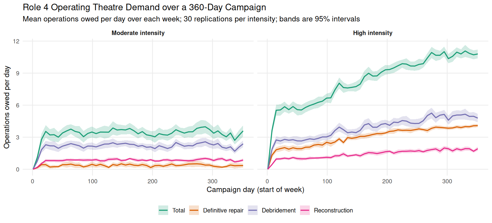

The mean operations owed per day over each week of the campaign, with the 95% interval across replications, at each casualty intensity, for the definitive repairs, the debridements and the reconstructions and for their total.

Admissions end with the campaign, so the census on its last day is a load the national support base carries afterwards without new arrivals. Each casualty in a Role 4 bed on day 360 was followed to the end of the length of stay already drawn for it, and the census after day 360 was counted from those stays alone.

<!-- GEN role4_tail -->
| Load left when the campaign ends | Moderate intensity | High intensity |
|---|---|---|
| Census on day 360 | 156.5 [149.3, 163.6] | 232.4 [228.1, 236.8] |
| Days after day 360 until the census halves | 12.8 [12.4, 13.2] | 11.5 [11.2, 11.8] |
| Days after day 360 until it falls to a tenth | 28.6 [28.0, 29.2] | 26.6 [26.2, 27.1] |
| Days after day 360 until the last bed empties | 40.1 [39.2, 41.0] | 39.8 [39.1, 40.5] |
| Bed-days occupied after day 360 | 2,117 [2,006, 2,228] | 2,840 [2,792, 2,889] |
<!-- /GEN -->

The census on day 360 halved in <!-- GEN cell:role4_tail|Days after day 360 until the census halves|Moderate intensity|mean -->12.8<!-- /GEN --> days at moderate intensity and <!-- GEN cell:role4_tail|Days after day 360 until the census halves|High intensity|mean -->11.5<!-- /GEN --> at high, fell to a tenth in <!-- GEN cell:role4_tail|Days after day 360 until it falls to a tenth|Moderate intensity|mean -->28.6<!-- /GEN --> and <!-- GEN cell:role4_tail|Days after day 360 until it falls to a tenth|High intensity|mean -->26.6<!-- /GEN -->, and emptied in <!-- GEN cell:role4_tail|Days after day 360 until the last bed empties|Moderate intensity|mean -->40.1<!-- /GEN --> and <!-- GEN cell:role4_tail|Days after day 360 until the last bed empties|High intensity|mean -->39.8<!-- /GEN -->. The beds occupied after day 360 came to <!-- GEN cell:role4_tail|Bed-days occupied after day 360|Moderate intensity|mean -->2,117<!-- /GEN --> bed-days at moderate intensity and <!-- GEN cell:role4_tail|Bed-days occupied after day 360|High intensity|mean -->2,840<!-- /GEN --> at high. The figures exclude the casualties still in theatre on day 360, who have not reached Role 4.

The casualties awaiting a strategic airlift place on day 360 were then flown out on the sorties that would have followed, at the configured interval and places, each route boarding in queue order. A casualty whose drawn death time came before the sortie that would have carried them died waiting, as during the campaign. Each casualty flown out was admitted to Role 4 on the sortie's day with a length of stay drawn as for any other. Casualties still in surgery or in a Role 2 bed on day 360, their evacuation not yet decided, are not included.

<!-- GEN role4_backlog -->
| Load once the airlift backlog is flown out | Moderate intensity | High intensity |
|---|---|---|
| Casualties awaiting airlift on day 360 | 33.1 [25.2, 41.0] | 1,497.4 [1,458.8, 1,535.9] |
| Of them, flown out after day 360 | 33.1 [25.2, 41.0] | 1,446.9 [1,411.4, 1,482.4] |
| Of them, died awaiting airlift | 0.0 [0.0, 0.0] | 50.5 [46.5, 54.4] |
| Days after day 360 until the last is flown out | 6.1 [4.7, 7.5] | 278.4 [271.7, 285.1] |
| Highest census after day 360 | 154.8 [146.4, 163.2] | 234.6 [229.9, 239.3] |
| Days after day 360 until the census halves | 18.5 [17.2, 19.9] | 220.5 [183.0, 258.1] |
| Days after day 360 until it falls to a tenth | 34.7 [33.0, 36.4] | 304.4 [297.7, 311.2] |
| Days after day 360 until the last bed empties | 47.1 [45.5, 48.7] | 319.0 [312.0, 326.0] |
| Bed-days occupied after day 360 | 2,943 [2,656, 3,231] | 43,271 [42,197, 44,345] |
<!-- /GEN -->

On day 360, <!-- GEN cell:role4_backlog|Casualties awaiting airlift on day 360|Moderate intensity|mean -->33.1<!-- /GEN --> casualties were awaiting airlift at moderate intensity and <!-- GEN cell:role4_backlog|Casualties awaiting airlift on day 360|High intensity|mean -->1,497.4<!-- /GEN --> at high. The last was flown out <!-- GEN cell:role4_backlog|Days after day 360 until the last is flown out|Moderate intensity|mean -->6.1<!-- /GEN --> days after the campaign ended at moderate intensity and <!-- GEN cell:role4_backlog|Days after day 360 until the last is flown out|High intensity|mean -->278.4<!-- /GEN --> days after at high, and <!-- GEN cell:role4_backlog|Of them, died awaiting airlift|Moderate intensity|mean -->0.0<!-- /GEN --> and <!-- GEN cell:role4_backlog|Of them, died awaiting airlift|High intensity|mean -->50.5<!-- /GEN --> died waiting. With those casualties admitted, the Role 4 census emptied <!-- GEN cell:role4_backlog|Days after day 360 until the last bed empties|Moderate intensity|mean -->47.1<!-- /GEN --> days after the campaign at moderate intensity and <!-- GEN cell:role4_backlog|Days after day 360 until the last bed empties|High intensity|mean -->319.0<!-- /GEN --> days after at high, occupying <!-- GEN cell:role4_backlog|Bed-days occupied after day 360|Moderate intensity|mean -->2,943<!-- /GEN --> and <!-- GEN cell:role4_backlog|Bed-days occupied after day 360|High intensity|mean -->43,271<!-- /GEN --> bed-days after day 360.

<!-- GEN role4_stability -->
| Census | Moderate intensity classification | Moderate intensity settles by block | Moderate intensity late mean beds | High intensity classification | High intensity settles by block | High intensity late mean beds |
|---|---|---|---|---|---|---|
| Total | converged | 3 | 149.54 | converged | 6 | 220.24 |
| Intensive care | converged | 8 | 35.33 | converged | 2 | 45.25 |
| Holding | converged | 3 | 114.22 | converged | 6 | 174.99 |
| Battle injury | converged | 3 | 105.47 | drifting | none | 162.89 |
| Disease and non-battle injury | converged | 2 | 19.68 | converged | 9 | 9.93 |
| Reconstruction cohort | converged | 3 | 24.40 | drifting | none | 47.43 |
<!-- /GEN -->

<!-- GEN role4_cma -->
| Cumulative moving average of the mean total census (beds) | Moderate intensity | High intensity |
|---|---|---|
| Day 30 | 57.00 | 106.73 |
| Day 90 | 114.28 | 182.11 |
| Day 180 | 131.54 | 201.88 |
| Day 360 | 140.35 | 211.08 |
<!-- /GEN -->

The 30-day block means of the total census were classified <!-- GEN cell:role4_stability|Total|Moderate intensity classification|full -->converged<!-- /GEN --> at moderate intensity, settling by block <!-- GEN cell:role4_stability|Total|Moderate intensity settles by block|full -->3<!-- /GEN -->, and <!-- GEN cell:role4_stability|Total|High intensity classification|full -->converged<!-- /GEN --> at high, settling by block <!-- GEN cell:role4_stability|Total|High intensity settles by block|full -->6<!-- /GEN -->. The reconstruction cohort was classified <!-- GEN cell:role4_stability|Reconstruction cohort|Moderate intensity classification|full -->converged<!-- /GEN --> at moderate intensity and <!-- GEN cell:role4_stability|Reconstruction cohort|High intensity classification|full -->drifting<!-- /GEN --> at high. The cumulative moving average of the mean total census was <!-- GEN cell:role4_cma|Day 90|Moderate intensity|full -->114.28<!-- /GEN --> beds at day 90 and <!-- GEN cell:role4_cma|Day 360|Moderate intensity|full -->140.35<!-- /GEN --> at day 360 at moderate intensity, and <!-- GEN cell:role4_cma|Day 90|High intensity|full -->182.11<!-- /GEN --> and <!-- GEN cell:role4_cma|Day 360|High intensity|full -->211.08<!-- /GEN --> at high.

**Response to the forward levers.** The three sweeps below carry the Role 4 peak, the closing 90-day mean and the operations owed by the casualties admitted in their own evidence sets, and are read from them without a further run; the sortie cancellation sweep was measured for this section, the strategic airlift evidence set carrying the peak alone. Each table's shipped column is the configuration of the census tables above at moderate intensity.

<!-- GEN role4_levers_policy -->
| Response | 15 d | 21 d (shipped) | 30 d | 45 d | 60 d |
|---|---|---|---|---|---|
| Role 4 peak beds | 230.4 [224.4, 236.4] | 209.0 [205.4, 212.6] | 197.1 [193.0, 201.2] | 176.1 [171.5, 180.6] | 155.7 [149.9, 161.5] |
| Role 4 closing 90-day mean beds | 126.7 [122.1, 131.3] | 121.2 [117.3, 125.1] | 109.6 [104.6, 114.5] | 98.5 [93.8, 103.1] | 83.2 [78.1, 88.4] |
| Role 4 operations owed | 1211 [1174, 1248] | 1221 [1175, 1267] | 1217 [1174, 1260] | 1270 [1216, 1324] | 1250 [1191, 1308] |
<!-- /GEN -->

The closing mean was <!-- GEN cell:role4_levers_policy|Role 4 closing 90-day mean beds|15 d|mean -->126.7<!-- /GEN --> beds at 15 days, <!-- GEN cell:role4_levers_policy|Role 4 closing 90-day mean beds|21 d (shipped)|mean -->121.2<!-- /GEN --> at the shipped 21 days, <!-- GEN cell:role4_levers_policy|Role 4 closing 90-day mean beds|30 d|mean -->109.6<!-- /GEN --> at 30, <!-- GEN cell:role4_levers_policy|Role 4 closing 90-day mean beds|45 d|mean -->98.5<!-- /GEN --> at 45 and <!-- GEN cell:role4_levers_policy|Role 4 closing 90-day mean beds|60 d|mean -->83.2<!-- /GEN --> at 60. The peak was <!-- GEN cell:role4_levers_policy|Role 4 peak beds|21 d (shipped)|mean -->209.0<!-- /GEN --> at 21 days and <!-- GEN cell:role4_levers_policy|Role 4 peak beds|30 d|mean -->197.1<!-- /GEN -->, <!-- GEN cell:role4_levers_policy|Role 4 peak beds|45 d|mean -->176.1<!-- /GEN --> and <!-- GEN cell:role4_levers_policy|Role 4 peak beds|60 d|mean -->155.7<!-- /GEN --> at 30, 45 and 60. The operations owed were <!-- GEN cell:role4_levers_policy|Role 4 operations owed|21 d (shipped)|mean -->1221<!-- /GEN --> at 21 days and <!-- GEN cell:role4_levers_policy|Role 4 operations owed|60 d|mean -->1250<!-- /GEN --> at 60.

<!-- GEN role4_levers_establishment -->
| Response | 30 beds (shipped) | 45 beds | 60 beds | 90 beds |
|---|---|---|---|---|
| Role 4 peak beds | 209.0 [205.4, 212.6] | 211.2 [207.0, 215.3] | 211.4 [206.3, 216.4] | 210.1 [206.0, 214.2] |
| Role 4 closing 90-day mean beds | 121.2 [117.3, 125.1] | 117.7 [113.5, 121.9] | 124.9 [120.6, 129.2] | 123.5 [119.1, 127.9] |
| Role 4 operations owed | 1221 [1175, 1267] | 1232 [1178, 1287] | 1254 [1214, 1295] | 1230 [1181, 1280] |
<!-- /GEN -->

The closing mean was <!-- GEN cell:role4_levers_establishment|Role 4 closing 90-day mean beds|30 beds (shipped)|mean -->121.2<!-- /GEN --> beds at the shipped 30 R2E holding beds and <!-- GEN cell:role4_levers_establishment|Role 4 closing 90-day mean beds|45 beds|mean -->117.7<!-- /GEN -->, <!-- GEN cell:role4_levers_establishment|Role 4 closing 90-day mean beds|60 beds|mean -->124.9<!-- /GEN --> and <!-- GEN cell:role4_levers_establishment|Role 4 closing 90-day mean beds|90 beds|mean -->123.5<!-- /GEN --> at 45, 60 and 90; the four intervals overlap. The peak was <!-- GEN cell:role4_levers_establishment|Role 4 peak beds|30 beds (shipped)|mean -->209.0<!-- /GEN --> at 30 beds and <!-- GEN cell:role4_levers_establishment|Role 4 peak beds|90 beds|mean -->210.1<!-- /GEN --> at 90.

<!-- GEN role4_levers_saturation -->
| Response | 0 (disabled) | 1 | 2 (shipped) | 3 | 5 | 8 | 12 | 16 | 24 |
|---|---|---|---|---|---|---|---|---|---|
| Role 4 peak beds | 208.4 [203.3, 213.5] | 207.7 [203.8, 211.7] | 209.0 [205.4, 212.6] | 210.5 [205.1, 215.9] | 209.3 [204.8, 213.8] | 208.8 [203.3, 214.2] | 210.4 [205.4, 215.4] | 209.9 [205.3, 214.5] | 212.4 [207.9, 216.9] |
| Role 4 closing 90-day mean beds | 116.8 [111.9, 121.6] | 119.5 [116.1, 122.8] | 121.2 [117.3, 125.1] | 119.2 [114.5, 124.0] | 118.4 [113.4, 123.4] | 120.2 [114.5, 125.9] | 121.6 [117.4, 125.9] | 119.2 [115.2, 123.1] | 117.9 [113.5, 122.4] |
| Role 4 operations owed | 1081 [1044, 1117] | 1267 [1221, 1313] | 1221 [1175, 1267] | 1217 [1167, 1267] | 1148 [1107, 1188] | 1147 [1099, 1195] | 1135 [1096, 1175] | 1115 [1079, 1151] | 1111 [1075, 1147] |
<!-- /GEN -->

The closing mean was <!-- GEN cell:role4_levers_saturation|Role 4 closing 90-day mean beds|0 (disabled)|mean -->116.8<!-- /GEN --> beds with the release disabled and <!-- GEN cell:role4_levers_saturation|Role 4 closing 90-day mean beds|2 (shipped)|mean -->121.2<!-- /GEN --> at the shipped threshold of 2, and ranged across the nine thresholds without a monotone course. The operations owed were <!-- GEN cell:role4_levers_saturation|Role 4 operations owed|0 (disabled)|mean -->1081<!-- /GEN --> with the release disabled, <!-- GEN cell:role4_levers_saturation|Role 4 operations owed|1|mean -->1267<!-- /GEN --> at a threshold of 1, <!-- GEN cell:role4_levers_saturation|Role 4 operations owed|2 (shipped)|mean -->1221<!-- /GEN --> at 2 and <!-- GEN cell:role4_levers_saturation|Role 4 operations owed|24|mean -->1111<!-- /GEN --> at 24.

<!-- GEN role4_levers_cancellation -->
| Response | 0% (shipped) | 5% | 10% | 15% | 25% | 40% |
|---|---|---|---|---|---|---|
| Role 4 peak beds | 209.0 [205.4, 212.6] | 207.7 [204.4, 211.0] | 212.3 [208.9, 215.6] | 212.1 [207.3, 216.9] | 207.3 [203.6, 211.0] | 197.6 [192.9, 202.3] |
| Role 4 closing 90-day mean beds | 150.4 [145.2, 155.6] | 143.0 [137.4, 148.6] | 145.5 [140.1, 151.0] | 146.3 [140.4, 152.2] | 129.9 [123.4, 136.3] | 116.4 [108.4, 124.3] |
| Role 4 operations owed | 1221 [1175, 1267] | 1165 [1119, 1211] | 1173 [1138, 1208] | 1159 [1108, 1209] | 1090 [1052, 1128] | 977 [937, 1016] |
<!-- /GEN -->

The closing mean was <!-- GEN cell:role4_levers_cancellation|Role 4 closing 90-day mean beds|0% (shipped)|mean -->150.4<!-- /GEN --> beds with no sortie cancelled and <!-- GEN cell:role4_levers_cancellation|Role 4 closing 90-day mean beds|10%|mean -->145.5<!-- /GEN -->, <!-- GEN cell:role4_levers_cancellation|Role 4 closing 90-day mean beds|25%|mean -->129.9<!-- /GEN --> and <!-- GEN cell:role4_levers_cancellation|Role 4 closing 90-day mean beds|40%|mean -->116.4<!-- /GEN --> at cancellation probabilities of 10%, 25% and 40%. The peak was <!-- GEN cell:role4_levers_cancellation|Role 4 peak beds|0% (shipped)|mean -->209.0<!-- /GEN --> with no cancellation and <!-- GEN cell:role4_levers_cancellation|Role 4 peak beds|40%|mean -->197.6<!-- /GEN --> at 40%, and the operations owed were <!-- GEN cell:role4_levers_cancellation|Role 4 operations owed|0% (shipped)|mean -->1221<!-- /GEN --> and <!-- GEN cell:role4_levers_cancellation|Role 4 operations owed|40%|mean -->977<!-- /GEN -->.

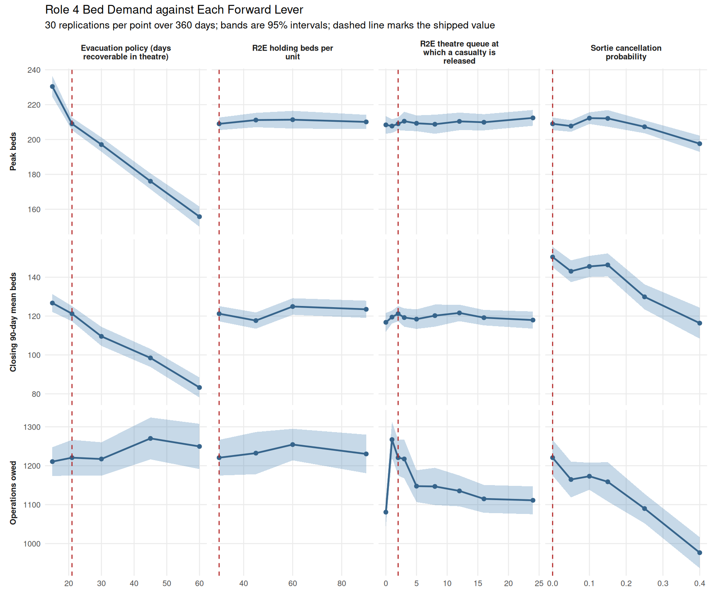

The Role 4 peak beds (upper row), closing 90-day mean beds (middle row) and operations owed (lower row), with 95% intervals across replications, against each lever, with the shipped value of each marked by a dashed line.

---

## Casualty Surge Events

<small>[Return to Top](#contents)</small>

**Question.** What changes when casualty surge events are injected into a campaign? `[default, injection off and on at 0.2 events per day · 360 d · 30 replications per arm · independent seeds, Student t]`

<!-- GEN casualty_surge -->
| Metric | No events injected | Events injected |
|---|---|---|
| Average total casualties/run | 5372.7 | 8226.7 |
| Average events/run | 0 | 75.20 (range 58–88) |
| Died-of-wounds rate, ordinary casualties | 0.40% [0.33%, 0.47%] | 0.81% [0.74%, 0.88%] |
| Died-of-wounds rate, event casualties | not applicable | 2.02% [1.91%, 2.14%] |
<!-- /GEN -->

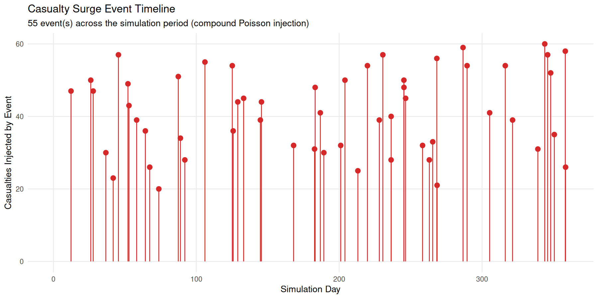

Casualty surge events reconstructed from one seed-42 campaign, each drawn as a vertical line at its simulation day with a point at its casualty count.

Events added <!-- GEN cell:casualty_surge|Average events/run|Events injected|full -->75.20 (range 58–88)<!-- /GEN --> events per campaign and raised the mean campaign total from <!-- GEN cell:casualty_surge|Average total casualties/run|No events injected|full -->5372.7<!-- /GEN --> to <!-- GEN cell:casualty_surge|Average total casualties/run|Events injected|full -->8226.7<!-- /GEN --> casualties. The died-of-wounds rate among event casualties was <!-- GEN cell:casualty_surge|Died-of-wounds rate, event casualties|Events injected|full -->2.02% [1.91%, 2.14%]<!-- /GEN -->. Among ordinary casualties it was <!-- GEN cell:casualty_surge|Died-of-wounds rate, ordinary casualties|No events injected|full -->0.40% [0.33%, 0.47%]<!-- /GEN --> without injection and <!-- GEN cell:casualty_surge|Died-of-wounds rate, ordinary casualties|Events injected|full -->0.81% [0.74%, 0.88%]<!-- /GEN --> with it.

**High-intensity profile.** The same stress test under `high_intensity` `[high_intensity, 0 and 0.2 events per day · 360 d · 30 replications · campaign totals]`:

<!-- GEN casualty_surge_high -->
| Metric | No events injected | Events injected |
|---|---|---|
| Average total casualties/run | 12543.4 | 15232.0 |
| Average events/run | 0 | 75.20 (range 58–88) |
| Died-of-wounds rate, ordinary casualties | 5.03% [4.18%, 5.89%] | 15.08% [14.39%, 15.77%] |
| Died-of-wounds rate, event casualties | not applicable | 17.51% [16.53%, 18.48%] |
<!-- /GEN -->

Event casualties died of wounds at <!-- GEN cell:casualty_surge_high|Died-of-wounds rate, event casualties|Events injected|full -->17.51% [16.53%, 18.48%]<!-- /GEN --> against <!-- GEN cell:casualty_surge_high|Died-of-wounds rate, ordinary casualties|Events injected|full -->15.08% [14.39%, 15.77%]<!-- /GEN --> for ordinary casualties in the same arm.

---

## Casualty Surge Event Size

<small>[Return to Top](#contents)</small>

**Question.** At what size do casualty surge events begin to degrade care? `[default, every event fixed at one size · 0.2 events per day · 360 d · 30 replications per size · independent seeds, Student t]`

<!-- GEN casualty_surge_size -->
| Event size | Events/run | Died of wounds, event casualties | Died of wounds, ordinary casualties | Peak R2B holding queue | Peak R2E theatre queue | Peak R2E post-operative overflow census | Peak R2E holding queue | Peak R2E staging overflow census |
|---|---|---|---|---|---|---|---|---|
| None | 0.0 | not applicable | 0.40% [0.33%, 0.47%] | 2.3 ± 0.8 | 35.6 ± 8.2 | 26.9 ± 0.7 | 54.6 ± 2.7 | 117.7 ± 10.8 |
| 10 | 75.2 | 0.72% [0.61%, 0.82%] | 0.46% [0.38%, 0.55%] | 2.1 ± 0.4 | 35.2 ± 8.8 | 27.0 ± 1.0 | 61.0 ± 3.7 | 174.1 ± 26.6 |
| 20 | 75.2 | 1.06% [0.95%, 1.17%] | 0.63% [0.50%, 0.76%] | 2.9 ± 0.6 | 48.4 ± 13.9 | 28.4 ± 0.6 | 67.5 ± 4.8 | 347.2 ± 29.8 |
| 40 | 75.2 | 2.05% [1.92%, 2.18%] | 0.79% [0.73%, 0.84%] | 2.9 ± 0.7 | 59.1 ± 6.3 | 30.5 ± 0.5 | 72.4 ± 5.5 | 631.1 ± 27.7 |
| 60 | 75.2 | 3.29% [3.08%, 3.50%] | 1.23% [1.11%, 1.35%] | 4.3 ± 0.8 | 109.0 ± 13.1 | 31.4 ± 0.5 | 75.7 ± 4.3 | 908.8 ± 43.6 |
| 90 | 75.2 | 6.49% [5.98%, 6.99%] | 2.72% [2.46%, 2.97%] | 5.5 ± 1.0 | 236.8 ± 29.7 | 31.6 ± 0.3 | 82.9 ± 4.2 | 1272.4 ± 44.3 |
| 120 | 75.2 | 12.86% [11.53%, 14.19%] | 6.44% [5.61%, 7.28%] | 6.1 ± 0.6 | 559.3 ± 71.3 | 32.3 ± 0.6 | 81.7 ± 3.1 | 1278.4 ± 51.5 |
| 180 | 75.2 | 22.64% [21.99%, 23.29%] | 12.16% [11.61%, 12.71%] | 8.2 ± 0.8 | 2082.4 ± 208.5 | 31.0 ± 0.5 | 83.8 ± 3.3 | 884.9 ± 47.7 |
<!-- /GEN -->

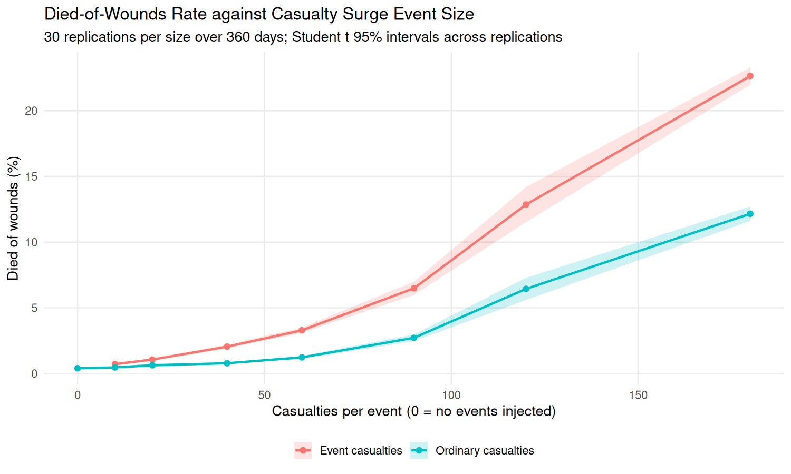

The died-of-wounds rate of event and ordinary casualties against the number of casualties per event, with Student $t$ 95% confidence intervals across replications.

Peak queues are the largest four-hour mean queue, or census for an overflow point, of each pool over the campaign, with a 95% half-width across replications. With every event fixed at 10 casualties, the died-of-wounds rate among event casualties was <!-- GEN cell:casualty_surge_size|10|Died of wounds, event casualties|full -->0.72% [0.61%, 0.82%]<!-- /GEN --> and the peak R2E post-operative overflow census <!-- GEN cell:casualty_surge_size|10|Peak R2E post-operative overflow census|full -->27.0 ± 1.0<!-- /GEN -->, against <!-- GEN cell:casualty_surge_size|None|Peak R2E post-operative overflow census|full -->26.9 ± 0.7<!-- /GEN --> with no events injected. At 20 casualties per event the post-operative overflow census peaked at <!-- GEN cell:casualty_surge_size|20|Peak R2E post-operative overflow census|full -->28.4 ± 0.6<!-- /GEN -->, and at 40 at <!-- GEN cell:casualty_surge_size|40|Peak R2E post-operative overflow census|full -->30.5 ± 0.5<!-- /GEN -->. The R2E theatre queue peaked at <!-- GEN cell:casualty_surge_size|None|Peak R2E theatre queue|full -->35.6 ± 8.2<!-- /GEN --> with no events, <!-- GEN cell:casualty_surge_size|60|Peak R2E theatre queue|full -->109.0 ± 13.1<!-- /GEN --> at 60 casualties per event, <!-- GEN cell:casualty_surge_size|90|Peak R2E theatre queue|full -->236.8 ± 29.7<!-- /GEN --> at 90 and <!-- GEN cell:casualty_surge_size|180|Peak R2E theatre queue|full -->2082.4 ± 208.5<!-- /GEN --> at 180. The event casualty died-of-wounds rate was <!-- GEN cell:casualty_surge_size|60|Died of wounds, event casualties|full -->3.29% [3.08%, 3.50%]<!-- /GEN --> at 60 casualties and <!-- GEN cell:casualty_surge_size|180|Died of wounds, event casualties|full -->22.64% [21.99%, 23.29%]<!-- /GEN --> at 180, and the rate among ordinary casualties was <!-- GEN cell:casualty_surge_size|None|Died of wounds, ordinary casualties|full -->0.40% [0.33%, 0.47%]<!-- /GEN --> with no events and <!-- GEN cell:casualty_surge_size|180|Died of wounds, ordinary casualties|full -->12.16% [11.61%, 12.71%]<!-- /GEN --> at 180.

**High-intensity profile.** The same sweep under `high_intensity` `[high_intensity, every event fixed at one size · 0.2 events per day · 360 d · 30 replications per size · independent seeds]`:

<!-- GEN casualty_surge_size_high -->
| Event size | Events/run | Died of wounds, event casualties | Died of wounds, ordinary casualties | Peak R2B holding queue | Peak R2E theatre queue | Peak R2E post-operative overflow census | Peak R2E holding queue | Peak R2E staging overflow census |
|---|---|---|---|---|---|---|---|---|
| None | 0.0 | not applicable | 5.03% [4.18%, 5.89%] | 3.7 ± 0.7 | 223.1 ± 41.6 | 31.7 ± 0.6 | 90.7 ± 2.4 | 1529.0 ± 36.9 |
| 10 | 75.2 | 7.99% [6.86%, 9.13%] | 7.52% [6.40%, 8.65%] | 3.5 ± 0.5 | 383.9 ± 66.6 | 31.6 ± 0.6 | 91.8 ± 3.4 | 1440.2 ± 61.4 |
| 20 | 75.2 | 11.65% [10.56%, 12.75%] | 10.44% [9.49%, 11.39%] | 3.9 ± 0.6 | 619.0 ± 84.7 | 31.6 ± 0.8 | 88.4 ± 2.8 | 1286.0 ± 53.3 |
| 40 | 75.2 | 16.74% [15.95%, 17.53%] | 14.62% [13.89%, 15.35%] | 4.8 ± 0.7 | 1236.4 ± 91.3 | 31.8 ± 0.6 | 86.3 ± 3.4 | 1047.0 ± 44.4 |
| 60 | 75.2 | 19.59% [18.94%, 20.24%] | 16.78% [16.25%, 17.31%] | 4.5 ± 0.5 | 1946.0 ± 98.6 | 31.3 ± 0.6 | 86.9 ± 3.6 | 920.4 ± 37.7 |
| 90 | 75.2 | 21.43% [20.96%, 21.90%] | 18.08% [17.65%, 18.52%] | 5.9 ± 0.7 | 2976.1 ± 137.4 | 30.7 ± 0.5 | 86.0 ± 3.2 | 815.7 ± 27.1 |
| 120 | 75.2 | 21.79% [21.28%, 22.29%] | 18.19% [17.83%, 18.55%] | 6.9 ± 0.5 | 3826.2 ± 165.9 | 31.2 ± 0.5 | 89.9 ± 2.9 | 778.8 ± 19.8 |
| 180 | 75.2 | 23.47% [22.93%, 24.00%] | 19.40% [19.02%, 19.79%] | 8.7 ± 1.0 | 5155.1 ± 181.2 | 31.2 ± 0.6 | 99.1 ± 4.1 | 753.6 ± 15.6 |
<!-- /GEN -->

At 20 casualties per event the peak R2E post-operative overflow census was <!-- GEN cell:casualty_surge_size_high|20|Peak R2E post-operative overflow census|full -->31.6 ± 0.8<!-- /GEN -->, against <!-- GEN cell:casualty_surge_size_high|None|Peak R2E post-operative overflow census|full -->31.7 ± 0.6<!-- /GEN --> with no events injected.

---

## Resolution of Paired Differences

<small>[Return to Top](#contents)</small>

**Question.** Which of the paired differences the experiments above sized for resolution were resolved at 30 replications, their interval excluding zero and their difference surviving Holm's adjustment within the experiment, and how many replications would each of the others need before its interval narrowed to a stated half-width? `[as each experiment above · 360 d · 30 replications · paired, Holm-adjusted, normal approximation to the interval half-width]`

<!-- GEN resolution -->
| Comparison | Paired difference | Holm-adjusted p | Half-width sought | Replications needed |
|---|---|---|---|---|
| Hold window, R2E first surgeries | −25.63 [−90.80, +39.53] | 1.000 | 2.0 | 29,251 |
| Hold window, R2E theatre entry deferred | −11.20 [−32.41, +10.01] | 1.000 | 1.0 | 12,397 |
| Hold window, diverted for a busy theatre | +13.30 [−10.75, +37.35] | 1.000 | 2.0 | 3,984 |
| Hold window, died of wounds | −1.57 [−6.17, +3.03] | 1.000 | 0.5 | 2,333 |
| Intensive care gate, died of wounds | +0.00 [−4.74, +4.74] | 1.000 | 0.5 | 2,472 |
| Policy 15 days against 21, died of wounds | +2.20 [−3.83, +8.23] | 1.000 | 1.0 | 1,002 |
| Policy 45 days against 21, died of wounds | +3.10 [−6.07, +12.27] | 1.000 | 1.0 | 2,316 |
| Policy 60 days against 21, died of wounds | +2.37 [−2.97, +7.71] | 1.000 | 1.0 | 786 |
| Saturation release at 2, died of wounds | +0.00 [−4.97, +4.97] | 1.000 | 1.0 | 680 |
| Saturation release at 2, returns to duty | −22.23 [−65.87, +21.40] | 1.000 | 10.0 | 525 |
| Saturation release at 2, R2E theatre queue | −0.46 [−0.92, +0.01] | 1.000 | 1.0 | 7 |
| Intensive care gate, intensive care utilisation (percentage points) | +1.05 [+0.04, +2.06] | 0.334 | 2.0 | 8 |
| Intensive care gate, died of wounds, high intensity | +22.20 [−137.60, +182.00] | 1.000 | 0.5 | 2,814,268 |
| Second R2B section, died of wounds | −1.30 [−6.66, +4.06] | 1.000 | 1.0 | 791 |
| Second R2B theatre at two sections, died of wounds | −3.53 [−7.16, +0.09] | 0.943 | 1.0 | 363 |
| Fourth R2E section, died of wounds | −0.07 [−8.66, +8.53] | 1.000 | 1.0 | 2,035 |
| Twelve intensive care beds in the full package, died of wounds, high intensity | −3.47 [−13.34, +6.41] | 1.000 | 1.0 | 2,686 |
| Third theatre at three sections, R2E theatre queue | +0.30 [−0.33, +0.92] | 1.000 | 1.0 | 11 |
| Third theatre at three sections, died of wounds | −0.40 [−4.56, +3.76] | 1.000 | 1.0 | 477 |
| Third theatre at six sections, died of wounds | −3.00 [−6.29, +0.29] | 1.000 | 1.0 | 300 |
| Third theatre at three sections, died of wounds, high intensity | −185.87 [−311.72, −60.01] | 0.141 | 1.0 | 436,391 |
| Twelve intensive care beds, died of wounds | −3.77 [−7.59, +0.05] | 1.000 | 1.0 | 403 |
| Twelve intensive care beds, returns to duty | +1.80 [−37.74, +41.34] | 1.000 | 10.0 | 431 |
| Six intensive care beds, died of wounds, high intensity | +5.30 [−161.08, +171.68] | 1.000 | 1.0 | 762,626 |
| Sixteen intensive care beds, died of wounds, high intensity | +50.83 [−133.88, +235.55] | 1.000 | 1.0 | 939,999 |
| Priority 1 share of 30%, died of wounds | −3.03 [−7.89, +1.82] | 1.000 | 1.0 | 651 |
| Post-definitive share of a quarter, died of wounds | −0.17 [−5.44, +5.11] | 1.000 | 1.0 | 766 |
| Post-definitive share of a quarter, died of wounds, high intensity | −23.80 [−182.28, +134.68] | 1.000 | 1.0 | 691,995 |
| 45 critical places every three days, died of wounds | −1.63 [−6.03, +2.76] | 1.000 | 1.0 | 532 |
| Six-hour evacuation delay, died of wounds, high intensity | +12.77 [−135.26, +160.79] | 1.000 | 1.0 | 603,694 |
| One-day evacuation delay, died of wounds, high intensity | +66.63 [−67.36, +200.63] | 1.000 | 1.0 | 494,654 |
| Thirty-day evacuation delay, R2E theatre queue, high intensity | −13.29 [−65.01, +38.43] | 1.000 | 1.0 | 73,706 |
<!-- /GEN -->

A comparison whose 95% interval excludes zero and whose Holm-adjusted $p$-value is within the family-wise level is listed in the second table rather than the first, the split being taken from the evidence each time the document is generated; the second table is empty where no comparison is resolved.

<!-- GEN resolved -->
| Comparison | Paired difference | Holm-adjusted p |
|---|---|---|
| Fourth R2E section with the R2B package, died of wounds, high intensity | −31.03 [−43.59, −18.47] | 0.001 |
| Third theatre at three sections, R2E theatre queue, high intensity | −59.59 [−92.08, −27.10] | 0.023 |
<!-- /GEN -->

The count for each row is $\lceil (z_{0.975}\, s_d / h)^2 \rceil$, where $s_d$ is the standard deviation of the within-replication differences observed at 30 replications and $h$ the half-width sought, chosen in the response's own units by the experiment, in its script or, for a sweep, in its module. A row marked high intensity is that experiment's high-intensity comparison. The hold window's R2E first-surgery difference was <!-- GEN cell:resolution|Hold window, R2E first surgeries|Paired difference|full -->−25.63 [−90.80, +39.53]<!-- /GEN --> against a half-width sought of <!-- GEN cell:resolution|Hold window, R2E first surgeries|Half-width sought|full -->2.0<!-- /GEN --> operations, which needs <!-- GEN cell:resolution|Hold window, R2E first surgeries|Replications needed|full -->29,251<!-- /GEN --> replications. The intensive care gate's died-of-wounds difference was <!-- GEN cell:resolution|Intensive care gate, died of wounds|Paired difference|full -->+0.00 [−4.74, +4.74]<!-- /GEN --> and needs <!-- GEN cell:resolution|Intensive care gate, died of wounds|Replications needed|full -->2,472<!-- /GEN -->. Against a half-width sought of <!-- GEN cell:resolution|Policy 15 days against 21, died of wounds|Half-width sought|full -->1.0<!-- /GEN --> death per campaign, the 15-day and 45-day policy comparisons against the shipped 21 days need <!-- GEN cell:resolution|Policy 15 days against 21, died of wounds|Replications needed|full -->1,002<!-- /GEN --> and <!-- GEN cell:resolution|Policy 45 days against 21, died of wounds|Replications needed|full -->2,316<!-- /GEN --> replications. The 60-day policy's died-of-wounds difference against 21 days was <!-- GEN cell:resolution|Policy 60 days against 21, died of wounds|Paired difference|full -->+2.37 [−2.97, +7.71]<!-- /GEN --> and needs <!-- GEN cell:resolution|Policy 60 days against 21, died of wounds|Replications needed|full -->786<!-- /GEN -->. The saturation release's died-of-wounds difference at the shipped threshold of two needs <!-- GEN cell:resolution|Saturation release at 2, died of wounds|Replications needed|full -->680<!-- /GEN -->.

---

## Sensitivity Screens

<small>[Return to Top](#contents)</small>

A Morris elementary effects screen and a Sobol variance decomposition were run at the sustained horizon, and neither is reported here as evidence. Parameters that cannot affect a response inside the simulation, among them the Role 4 length-of-stay modes, which are drawn after the run, ranked among the active parameters on the R2E operating theatre queue, so the screen did not separate most parameters from replication noise, and the decomposition did not establish the orderings it would need. Parameter influence is measured instead by the replicated sweeps reported above, each of which varies one lever across a range of settings. The design of both screens and the reason they were set aside are recorded in [Sensitivity Screens](Methods.md#sensitivity-screens), and the tracked caches remain under `data/sensitivity/` as their provenance.

---

## Annex A. Model Verification of One Seed-42 Campaign

<small>[Return to Top](#contents)</small>

This annex records the measurements of one 360-day campaign at seed 42 that verify mechanisms a replicated experiment cannot show: that each arrival stream realises its configured rate, that the triage and damage control splits realise their configured shares, that the strategic evacuation timeline closes, the surgical sections carry the load their rosters imply and the force regeneration cycle holds the pool near establishment. It reports one run, carries no interval and measures no performance; the replicated sections above do that. The measurements are tracked in `data/seed42/seed42_verification.csv`, written with the baseline by `Rscript run.R --seed 42 --days 360 --iterations 1 --refresh-baseline`.

**Casualty generation.** A stream's configured expectation is its configured daily mean per thousand personnel times its population over a thousand times the days.

<!-- GEN annex_generation -->
| Measure | Realised | Configured expectation |
|---|---|---|
| Combat wounded in action | 1,670 | 1,593 |
| Support wounded in action | 835 | 796 |
| Combat killed in action | 761 | 612 |
| Support killed in action | 283 | 306 |
| Combat disease and non-battle injury | 1,770 | 1,836 |
| Support disease and non-battle injury | 434 | 423 |
<!-- /GEN -->

**Triage.** The trauma split applies to wounded and non-battle injury casualties, and its expectation is the configured share of them. A disease casualty is Priority 1 at the configured medical emergency share, and otherwise Priority 2 if it needs emergency surgery and Priority 3 if not, so the expectations for disease are the medical emergency share of disease casualties and the disease surgical share of the rest; battle fatigue is Priority 3.

<!-- GEN annex_triage -->
| Measure | Realised | Configured expectation |
|---|---|---|
| Priority 1, wounded and non-battle injury | 1,836 | 1,869 |
| Priority 2, wounded and non-battle injury | 597 | 575 |
| Priority 3, wounded and non-battle injury | 442 | 431 |
| Priority 1, disease (medical emergency) | 72 | 64 |
| Priority 2, disease (emergency surgery) | 82 | 73 |
| Priority 3, disease | 1,131 | not applicable |
| Priority 3, battle fatigue | 548 | 548 |
| Killed in action | 1,044 | not applicable |
<!-- /GEN -->

**Damage control.** The expectation is the configured damage control rate times the casualties operated on at that priority.

<!-- GEN annex_damage_control -->
| Measure | Realised | Configured expectation |
|---|---|---|
| Priority 1 operated | 1,638 | not applicable |
| Priority 1 damage control | 903 | 901 |
| Priority 2 operated | 551 | not applicable |
| Priority 2 damage control | 113 | 110 |
<!-- /GEN -->

**Strategic evacuation.** A sortie carries the casualties queued on each seat pool when it departs, and the places nobody takes depart with it; the expectation of sorties flown is the scheduled sorties before the horizon times the probability that a sortie flies.

<!-- GEN annex_evacuation -->
| Measure | Realised | Configured expectation |
|---|---|---|
| Strategic evacuation decisions | 2,494 | not applicable |
| Boarded | 2,469 | not applicable |
| Still waiting at the close | 25 | not applicable |
| Mean wait of the casualties boarded (days) | 5.45 | not applicable |
| Sorties flown | 51 | 51 |
| Critical places departing empty per sortie (mean) | 5.3 | not applicable |
| Standard places departing empty per sortie (mean) | 36.3 | not applicable |
<!-- /GEN -->

**Admission at Role 2.** Minor casualties are Priority 3 wounded and non-battle injury casualties and disease casualties below Priority 1, who share one convalescence factor; the expectation is the share of that factor's convalescence draws exceeding the theatre evacuation policy. A casualty returned to duty while queued is one whose convalescence or restoration elapsed before a holding bed came free.

<!-- GEN annex_admission -->
| Measure | Realised | Configured expectation |
|---|---|---|
| Minor casualties evacuated strategically (% of those with a disposition) | 11.6 | 9.3 |
| Returned to duty while queued for a holding bed | 594 | not applicable |
| Battle fatigue returned to duty from Role 2 | 545 | not applicable |
<!-- /GEN -->

**Placement at Role 2.** A casualty whose care calls for a bed takes the best one free when that care begins: the bed the care calls for, otherwise a holding bed, otherwise overflow, with no bed. A stabilisation is counted where a stay was served, and the overflow census is the time-weighted mean number of casualties cared for without a bed at each point over the campaign.

<!-- GEN annex_placement -->
| Measure | Realised | Configured expectation |
|---|---|---|
| R2B reception, straight to a resuscitation bed | 2,369 | not applicable |
| R2B reception, waiting in a holding bed | 111 | not applicable |
| R2B reception, waiting in overflow | 66 | not applicable |
| R2B wait for the evacuation vehicle in intensive care | 575 | not applicable |
| R2B wait for the evacuation vehicle in a holding bed | 7 | not applicable |
| R2B wait for the evacuation vehicle in overflow | 12 | not applicable |
| R2E stabilisation in intensive care | 297 | not applicable |
| R2E stabilisation in a holding bed | 43 | not applicable |
| R2E stabilisation in overflow | 690 | not applicable |
| R2E post-definitive care in intensive care | 784 | not applicable |
| R2E post-definitive care in a holding bed | 100 | not applicable |
| R2E post-definitive care in overflow | 1,439 | not applicable |
| Evacuees staged in a holding bed | 245 | not applicable |
| Evacuees staged in overflow | 2,248 | not applicable |
| Mean overflow census, R2B reception | 0.02 | not applicable |
| Mean overflow census, R2B wait for the evacuation vehicle | 0.00 | not applicable |
| Mean overflow census, R2E post-operative stays | 6.09 | not applicable |
| Mean overflow census, R2E pre-flight care | 0.48 | not applicable |
| Mean overflow census, R2E staging | 33.22 | not applicable |
<!-- /GEN -->

**Surgical load.** Utilisation of open time is the time-weighted share of a section's rostered time during which its first surgeon was in use, and the queued share is the share of that open time with one or more casualties waiting for any role in the section.

<!-- GEN annex_surgical_load -->
| Measure | Realised | Configured expectation |
|---|---|---|
| Diverted from R2B, surgical team off shift | 1,293 | not applicable |
| Diverted from R2B, theatre busy | 252 | not applicable |
| R2B holding beds in use, both facilities (mean) | 7.87 | not applicable |
| R2E section 1 utilisation of open time (%) | 32.4 | not applicable |
| R2E section 2 utilisation of open time (%) | 48.3 | not applicable |
| R2E section 3 utilisation of open time (%) | 38.2 | not applicable |
| R2E section 1 open time with casualties waiting for a section (%) | 11.0 | not applicable |
| R2E section 2 open time with casualties waiting for a section (%) | 21.3 | not applicable |
| R2E section 3 open time with casualties waiting for a section (%) | 11.0 | not applicable |
<!-- /GEN -->

**Force regeneration.** The effective force is the combat or support pool at the day shown, under the shipped seven-day reinforcement cycle.

<!-- GEN annex_force -->
| Measure | Realised | Configured expectation |
|---|---|---|
| Combat force, day 0 | 2,500 | not applicable |
| Combat force, day 180 | 2,264 | not applicable |
| Combat force, day 360 | 2,408 | not applicable |
| Support force, day 0 | 1,250 | not applicable |
| Support force, day 180 | 1,177 | not applicable |
| Support force, day 360 | 1,216 | not applicable |
<!-- /GEN -->

The conservation of a casualty's intensive care requirement across the three post-operative routes is asserted by `tests/checks/check_icu_time_conservation.R` and the generation rates by `tests/checks/check_arrival_rate_fidelity.R`.

---

## References

<small>[Return to Top](#contents)</small>

<!-- REFERENCES START -->

[1] Blood, C. G., Zouris, J. M., & Rotblatt, D. (1997). *Using the Ground Forces Casualty Forecasting System (FORECAS) to Project Casualty Sustainment* (NHRC Report No. 97-39). Naval Health Research Center. Retrieved 21 Oct 26, from https://archive.org/details/DTIC_ADA339487

[2] Westphalen, N. (2018). Surgeon Captain Richard Tadeusz 'Rick' Jolly OBE RN Rtd. *Journal of Military and Veterans' Health*, *26*(1). Retrieved 26 Jul 26, from https://jmvh.org/article/surgeon-captain-richard-tadeusz-rick-jolly-obe-rn-rtd/

[3] Marble, S. (2025). Both joint and not: Medical support at Okinawa, 1945. *Joint Force Quarterly*, *117*, 73–80. National Defense University Press. Retrieved 30 Oct 26, from https://digitalcommons.ndu.edu/joint-force-quarterly/vol117/iss2/11/

<!-- REFERENCES END -->
