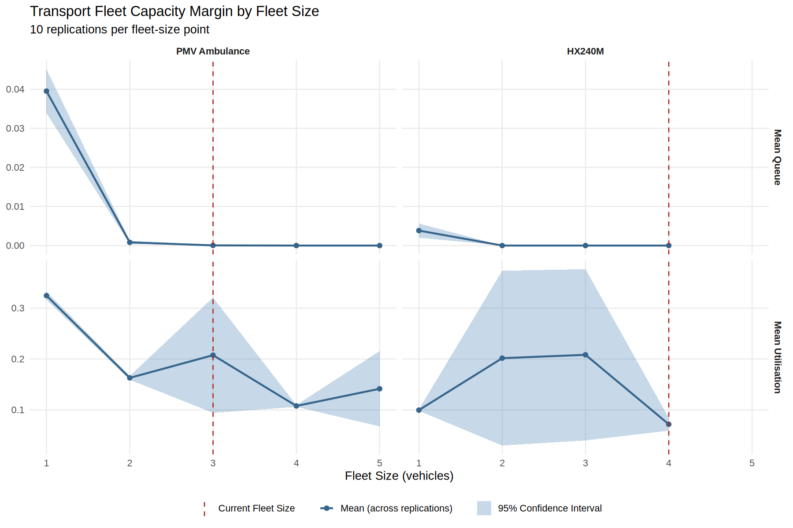
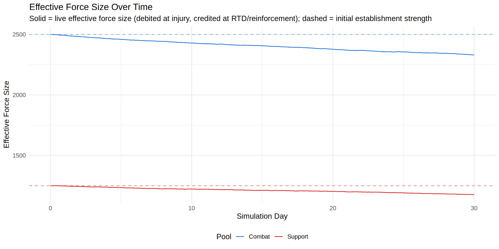
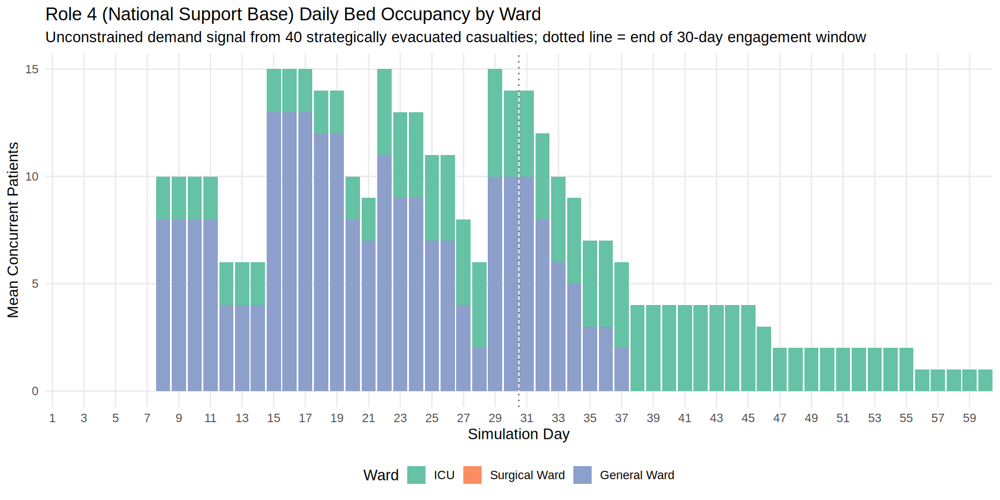
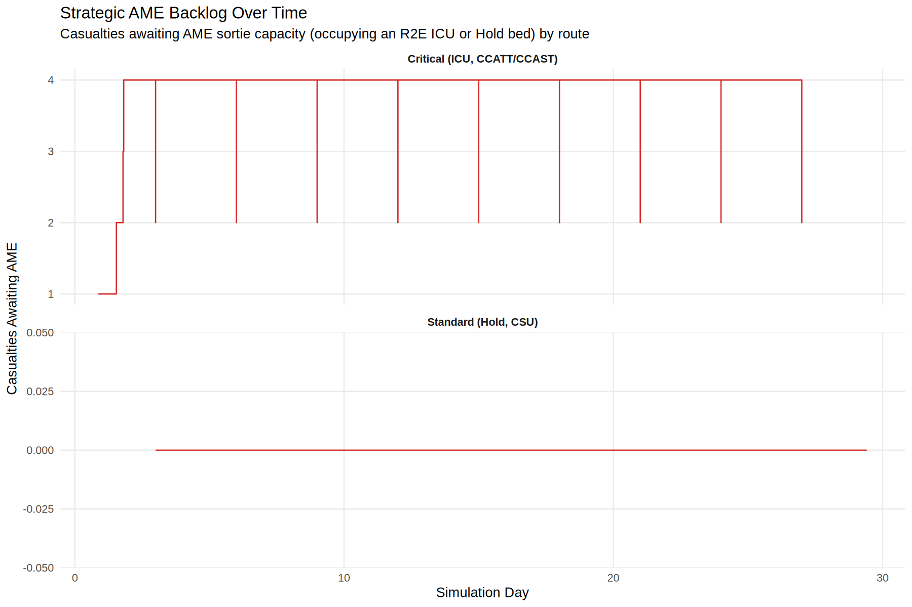
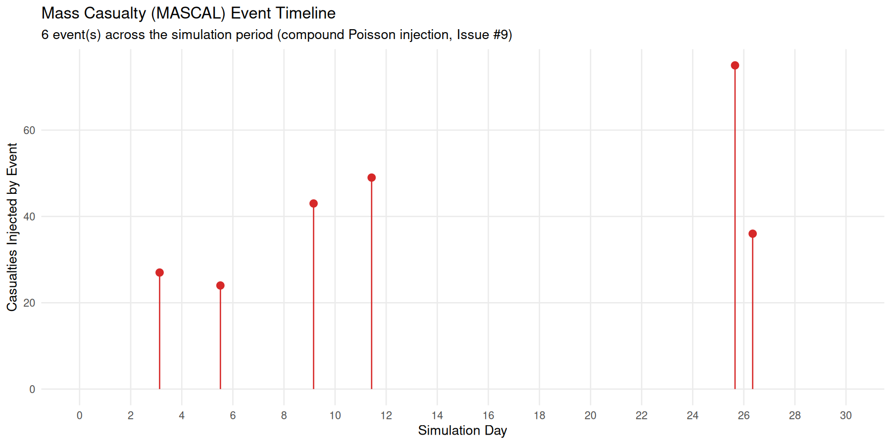

# Battlefield Casualty Handling — Single-Run Analysis

## Abstract

<small>[Return to Top](#contents)</small>

This document presents the illustrative single-run (seed 42, 30 simulated days) analysis of the Battlefield Casualty Handling discrete event simulation under the `moderate_intensity` (Falklands 1982-modified) casualty rate baseline. It is the project's original results narrative: a detailed, per-echelon walk-through of one simulated campaign, used to verify that the model behaves as designed and to identify system constraints that are then confirmed (or otherwise) at statistical scale in the companion multi-run comparison, `docs/Multi_Run_Analysis.md`. For the underlying algorithms, trajectory logic, resource model, and full citation basis for every parameter referenced below, see the [README](../README.md).

Findings demonstrate that the current system design is capable of managing moderate casualty volumes, historically represented by the Falklands conflict. Two system constraints are identified. At R2B, holding bed capacity saturates progressively over a 30-day operation, driven by disease DNBI evacuees occupying hold beds for extended durations; stream decomposition confirms a structural 55% overload (expected 15.5 concurrent hold beds against 10-bed capacity); a two-tier routing policy — an upstream occupancy threshold and an at-R2B three-stage policy — manages this, with hold bed expansion or an evacuation threshold as the indicated structural remedies. At R2E Heavy, the ICU is the primary binding constraint, with queues present for a substantial share of the run; OT capacity is not saturated at either echelon. Whether these single-run findings generalise across independent replications, and how the system responds under a materially higher casualty rate, is addressed in `docs/Multi_Run_Analysis.md`.

## Contents

<small>[Return to Top](#contents)</small>

<!-- TOC START -->
- [Abstract](#abstract)
- [Contents](#contents)
- [Simulation Casualty Generation](#simulation-casualty-generation)
- [R1 Handling](#r1-handling)
- [R2B Handling](#r2b-handling)
  - [R2B Hold Bed Saturation — Stream Decomposition and Intervention Analysis](#r2b-hold-bed-saturation-stream-decomposition-and-intervention-analysis)
- [R2E Heavy Handling](#r2e-heavy-handling)
- [Casualty Waiting Time](#casualty-waiting-time)
- [Transport Fleet Capacity Margin](#transport-fleet-capacity-margin)
- [Return to Duty](#return-to-duty)
- [Force Regeneration Feedback Loop](#force-regeneration-feedback-loop)
- [Strategic Evacuation and Role 4 Demand](#strategic-evacuation-and-role-4-demand)
- [Mass Casualty Event Stress Test](#mass-casualty-event-stress-test)
- [Conclusion](#conclusion)
- [References](#references)
<!-- TOC END -->

---

## Simulation Casualty Generation

This section presents a detailed breakdown of casualty source data captured from a single simulation run using seed 42, spanning a 30-day operational duration. The data is analyzed through the lens of deployed health system design, highlighting implications for medical resource allocation, evacuation planning, and treatment capacity across Role 1 and Role 2 facilities.

> **Note on warm-up exclusion:** No warm-up exclusion is applied. The simulation is classified as a terminating simulation; the full observation window, including campaign start-up, is retained in all outputs (`WARM_UP_DAYS = 0L`). See the [Warm-up Period Analysis](../README.md#warmup-period-analysis) section for the methodological basis.

| Casualty Type | Population Source | 1   | 2   | 3   | 4   | 5   | 6   | 7   | 8   | 9   | 10  | 11  | 12  | 13  | 14  | 15  | 16  | 17  | 18  | 19  | 20  | 21  | 22  | 23  | 24  | 25  | 26  | 27  | 28  | 29  | 30  | total |
|:------------- |:----------------- | ---:| ---:| ---:| ---:| ---:| ---:| ---:| ---:| ---:| ---:| ---:| ---:| ---:| ---:| ---:| ---:| ---:| ---:| ---:| ---:| ---:| ---:| ---:| ---:| ---:| ---:| ---:| ---:| ---:| ---:| -----:|
| dnbi          | cbt               | 4   | 5   | 5   | 4   | 5   | 5   | 4   | 5   | 5   | 5   | 4   | 5   | 5   | 4   | 5   | 5   | 5   | 4   | 5   | 5   | 5   | 4   | 5   | 5   | 5   | 4   | 5   | 5   | 5   | 4   | 141   |
| dnbi          | spt               | 1   | 1   | 1   | 1   | 1   | 2   | 1   | 1   | 1   | 1   | 1   | 2   | 1   | 1   | 1   | 1   | 1   | 2   | 1   | 1   | 1   | 1   | 1   | 2   | 1   | 1   | 1   | 1   | 1   | 2   | 35    |
| kia           | cbt               | 1   | 2   | 1   | 2   | 2   | 1   | 2   | 2   | 1   | 2   | 1   | 2   | 2   | 1   | 2   | 1   | 2   | 1   | 2   | 2   | 1   | 2   | 1   | 2   | 2   | 1   | 2   | 1   | 2   | 1   | 47    |
| kia           | spt               | 0   | 1   | 1   | 1   | 0   | 1   | 1   | 1   | 0   | 1   | 1   | 1   | 0   | 1   | 1   | 1   | 1   | 0   | 1   | 1   | 1   | 0   | 1   | 1   | 1   | 1   | 0   | 1   | 1   | 1   | 23    |
| wia           | cbt               | 3   | 3   | 4   | 4   | 3   | 3   | 4   | 3   | 4   | 3   | 3   | 4   | 3   | 3   | 4   | 3   | 4   | 3   | 4   | 3   | 4   | 3   | 4   | 3   | 4   | 3   | 4   | 3   | 4   | 3   | 103   |
| wia           | spt               | 1   | 2   | 2   | 1   | 2   | 2   | 2   | 1   | 2   | 1   | 2   | 2   | 2   | 1   | 2   | 2   | 2   | 1   | 2   | 2   | 1   | 2   | 2   | 2   | 1   | 2   | 2   | 2   | 1   | 2   | 51    |
| Total         |                   | 10  | 14  | 14  | 13  | 13  | 14  | 14  | 13  | 13  | 13  | 12  | 16  | 13  | 11  | 15  | 13  | 15  | 11  | 15  | 14  | 13  | 12  | 14  | 15  | 14  | 12  | 14  | 13  | 14  | 13  | 400   |

The table above presents a summary of the simulated casualty data generated across three primary categories Wounded in Action (WIA), Killed in Action (KIA), and Disease and Non-Battle Injury (DNBI), with their source population: combat forces and support forces. A total of 400 casualties were recorded, with combat elements accounting for the majority (291), reflecting their higher exposure to operational risk. DNBI emerged as the most frequent casualty type (176 cases), underscoring the persistent burden of non-combat medical conditions even in high-intensity environments. This aligns with historical data indicating that DNBI can rival or exceed battle injuries in terms of lost duty days and medical resource consumption.

WIA cases totaled 154, with a notable skew toward combat personnel (103 vs. 51) as a result of the force ratios present within the simulation. These casualties typically require multi-echelon care, including resuscitation, surgical intervention, and post-operative holding, placing sustained demand on Role 1 and Role 2 facilities. KIA figures were lower (70 total).

From a health system planning perspective, this data implies a need for scalable treatment capacity, robust DNBI mitigation strategies, and distributed surgical capability. The consistent casualty generation across periods suggests a steady operational tempo, requiring continuous staffing, replenishment of medical supplies, and resilient evacuation pathways.

| Population Source | 1   | 2   | 3   | 4   | 5   | 6   | 7   | 8   | 9   | 10  | 11  | 12  | 13  | 14  | 15  | 16  | 17  | 18  | 19  | 20  | 21  | 22  | 23  | 24  | 25  | 26  | 27  | 28  | 29  | 30  | total |
|:----------------- | ---:| ---:| ---:| ---:| ---:| ---:| ---:| ---:| ---:| ---:| ---:| ---:| ---:| ---:| ---:| ---:| ---:| ---:| ---:| ---:| ---:| ---:| ---:| ---:| ---:| ---:| ---:| ---:| ---:| ---:| -----:|
| cbt               | 8   | 10  | 10  | 10  | 10  | 9   | 10  | 10  | 10  | 10  | 8   | 11  | 10  | 8   | 11  | 9   | 11  | 8   | 11  | 10  | 10  | 9   | 10  | 10  | 11  | 8   | 11  | 9   | 11  | 8   | 291   |
| spt               | 2   | 4   | 4   | 3   | 3   | 5   | 4   | 3   | 3   | 3   | 4   | 5   | 3   | 3   | 4   | 4   | 4   | 3   | 4   | 4   | 3   | 3   | 4   | 5   | 3   | 4   | 3   | 4   | 3   | 5   | 109   |
| Total             | 10  | 14  | 14  | 13  | 13  | 14  | 14  | 13  | 13  | 13  | 12  | 16  | 13  | 11  | 15  | 13  | 15  | 11  | 15  | 14  | 13  | 12  | 14  | 15  | 14  | 12  | 14  | 13  | 14  | 13  | 400   |

The second table provides a breakdown of the casualty population by source: combat forces (cbt) and support forces (spt). Of the 400 total casualties generated, 291 (approximately 73%) originated from combat elements, while 109 (27%) were drawn from support units. This distribution reflects the total population breakdown of the organisation. The consistent presence of support force casualties across all periods underscores the vulnerability of rear-area personnel in LSCO environments, particularly under conditions of indirect fire, degraded situational awareness, and disrupted medical evacuation. The temporal spread of casualties shows a relatively stable operational tempo, with total casualties per period ranging from 10 to 16. 

From a health system perspective, this data reinforces the need for distributed medical coverage that includes both forward and rear-area assets. Role 1 treatment teams must be positioned to respond rapidly to combat casualties, while Role 2 facilities must be capable of absorbing and triaging support force casualties who may present with different injury profiles, including DNBI and delayed trauma. The consistent casualty burden across both populations highlights the importance of scalable capacity, flexible evacuation pathways, and robust command and control to ensure timely treatment and prevent bottlenecks in casualty flow.

| Priority | 1   | 2   | 3   | 4   | 5   | 6   | 7   | 8   | 9   | 10  | 11  | 12  | 13  | 14  | 15  | 16  | 17  | 18  | 19  | 20  | 21  | 22  | 23  | 24  | 25  | 26  | 27  | 28  | 29  | 30  | total |
|:-------- | ---:| ---:| ---:| ---:| ---:| ---:| ---:| ---:| ---:| ---:| ---:| ---:| ---:| ---:| ---:| ---:| ---:| ---:| ---:| ---:| ---:| ---:| ---:| ---:| ---:| ---:| ---:| ---:| ---:| ---:| -----:|
| Pri 1    | 5   | 7   | 9   | 2   | 8   | 10  | 10  | 7   | 4   | 7   | 7   | 9   | 8   | 5   | 8   | 8   | 8   | 6   | 9   | 7   | 8   | 8   | 7   | 8   | 9   | 7   | 7   | 8   | 7   | 6   | 219   |
| Pri 2    | 3   | 2   | 2   | 3   | 2   | 1   | 0   | 2   | 6   | 2   | 1   | 3   | 2   | 3   | 3   | 2   | 1   | 2   | 1   | 3   | 1   | 1   | 3   | 2   | 1   | 2   | 3   | 1   | 2   | 1   | 61    |
| Pri 3    | 1   | 2   | 1   | 5   | 1   | 1   | 1   | 1   | 2   | 1   | 2   | 1   | 1   | 1   | 1   | 1   | 3   | 2   | 2   | 1   | 2   | 1   | 2   | 2   | 1   | 1   | 2   | 2   | 2   | 4   | 50    |
| KIA      | 1   | 3   | 2   | 3   | 2   | 2   | 3   | 3   | 1   | 3   | 2   | 3   | 2   | 2   | 3   | 2   | 3   | 1   | 3   | 3   | 2   | 2   | 2   | 3   | 3   | 2   | 2   | 2   | 3   | 2   | 70    |
| Total    | 10  | 14  | 14  | 13  | 13  | 14  | 14  | 13  | 13  | 13  | 12  | 16  | 13  | 11  | 15  | 13  | 15  | 11  | 15  | 14  | 13  | 12  | 14  | 15  | 14  | 12  | 14  | 13  | 14  | 13  | 400   |

Of the total casualties, 219 (54.8%) were classified as Priority 1, representing patients requiring immediate life-saving intervention. This dominant category underscores the doctrinal necessity of forward-positioned Role 1 assets capable of rapid triage and stabilization. The consistent presence of Priority 1 cases across all 30 days suggests a sustained high-acuity burden, reinforcing the need for scalable throughput 

Priority 2 and Priority 3 casualties accounted for 61 (15.3%) and 50 (12.5%) cases respectively. These patients typically require delayed or routine care. The simulation also generated 70 KIA cases (17.5%), distributed evenly across the operational timeline. While these cases do not contribute to medical workload substantially, their operational implications are significant.

From a systems design perspective, the acuity profile derived from this simulation reinforces several key imperatives:

- Role 1 facilities must be optimized for high-throughput triage and stabilization, with emphasis on rapid evacuation of Priority 1 cases.
- Role 2 facilities requires flexible bed space and surgical capability to absorb cases, especially during sustained operations.
- Evacuation architecture must support continuous movement of mixed-acuity casualties, with prioritization protocols and redundancy to ensure resilience.

## R1 Handling

Role 1 facilities consistently demonstrated the ability to process casualties without delay, with all patients receiving immediate triage and treatment on arrival. The absence of queuing reflects both adequate staffing and appropriately scaled treatment capacity relative to the casualty inflow modelled. Rapid handling times ensured that Priority 1 cases could be stabilised and evacuated without degradation in clinical status, while lower‑priority cases were managed and prepared for movement in line with requirements. However, the model does not currently fully represent the limitations in availability of evacuation assets, as a result, throughput at the Role 1 was not constrained by evacuation availability, allowing continuous casualty flow to higher‑echelon care and preventing downstream bottlenecks in the system which may bear out with the introduction of more detailed modelling of evacuation. Despite this, the performance underscores the critical function of Role 1 as an agile, forward medical capability able to maintain momentum under sustained operational tempo.

## R2B Handling

The plot below outlines a summary of casualty handling at R2B. Following DNBI sub-categorisation (Issue #7), OT-bypass routing (Issue #35), and correction of OT bed scheduling (Issue #37), the R2B picture is substantially revised from earlier model iterations.

OT rooms are modelled as physical spaces available 24 hours per day. The surgical team operates on a 12-hour shift schedule and is the operative constraint on surgical access. Under seed 42 (30 days, post-Issue-43), **132 casualties reached the R2B surgical decision point**; **53 surgeries** were performed at R2B when both OT bed and team were simultaneously available, and **77 were bypassed to R2E**. R2B OT utilisation was **10.5% (T1) and 7.9% (T2) against 24-hour room time**, equivalent to approximately **21.0% and 15.9% against available team shift time**. The OT queue remained flat at zero throughout the run, confirming the bypass logic is functioning as designed.

**Bypass reason decomposition (Issue #40).** The undifferentiated bypass count above conflates two distinct causes: the surgical team being off-shift, and the OT bed itself being busy or queued. `r2b_bypass_reason` (set at the point of bypass in `r2b_treat_wia()`, `R/trajectories.R`) distinguishes them: of the 77 bypasses, **67 (87%) were because the surgical team was off-shift**, and only **10 (13%) were because the OT bed was busy or a queue existed**. This confirms the 12-hour shift window — not physical OT capacity — as the dominant constraint on forward surgical throughput at R2B: for half of each 24-hour cycle, a casualty arriving at either R2B unit cannot receive surgery there regardless of bed availability, and is routed to R2E instead.

Off-shift bypasses (blue) dominate on nearly every day of the run, while OT-busy/queued bypasses (green) appear only intermittently and never exceed 2 in a single day — indicating the shift-window gap is a persistent, day-to-day constraint rather than an occasional congestion spike.

Two candidate interventions to close this gap were scoped under Issue #40 — extending the existing team's shift hours, or fielding a second surgical team per R2B unit on the complementary shift — but neither is evaluated in this analysis. Extending shift hours cannot be meaningfully assessed without a model of clinician fatigue and associated error/complication risk, which the simulation does not represent; reporting throughput gains from longer shifts without that counterweight would overstate the intervention's net benefit. Fielding a second team is an establishment-size decision — a resourcing question for planners, not a parameter the simulation should default to testing as if cost-free. Both remain candidate follow-up scenario tests once a fatigue model exists or a second-team establishment change is directed; see Further Development.

**Holding bed queues at R2B are the primary identified system constraint.** Hold bed queues build progressively from approximately Day 10–15 onward, reaching 8–10 patients waiting at both R2B nodes by Day 20–22 and remaining elevated through Day 30. This saturation is driven by disease DNBI evacuees occupying hold beds for multi-day durations (mode 5 days), not by post-surgical patients. The five hold beds per R2B unit are structurally insufficient for the cumulative DNBI holding demand generated over a 30-day operation.

### R2B Hold Bed Saturation — Stream Decomposition and Intervention Analysis

Issue #39 adds per-stream decomposition of R2B hold bed occupancy. A `r2b_hold_start` attribute is now recorded for each patient entering the long-duration hold pathway, enabling daily concurrent occupancy to be decomposed by patient stream (disease DNBI, NBI DNBI, WIA) in the analysis pipeline. The `r2b_hold_drawn` attribute stores the drawn hold duration at the time of bed seizure, supporting optional evac-threshold logic described below.

**Battle fatigue verification.** Code inspection confirms that battle fatigue casualties (dnbi_type == 1) exit the trajectory at R1 via the "Battle Fatigue R1 Hold" branch and never reach R2B hold beds. This is enforced by a `stopifnot` assertion in the analysis pipeline.

**Structural load calculation.** Under the baseline seed 42 parameters (176 DNBI total; 97 disease, 33 NBI, 46 battle fatigue):

- Disease DNBI reaching R2B hold: ~77 evacuated (P1: 97 × 0.65 × 0.95 ≈ 60; P2: 97 × 0.20 × 0.90 ≈ 17), minus ~6% surgical candidacy ≈ **72 entering hold-bed recovery** over 30 days (≈ 2.4 per day)
- Non-surgical WIA and NBI reaching R2B hold: ~19 over 30 days (≈ 0.6 per day)
- **Total hold entry rate: ≈ 3.0 patients per day**
- Expected hold duration (triangular min=0.5d, mode=5d, max=10d): mean = (0.5 + 5 + 10) / 3 = **5.17 days**
- **Expected concurrent hold occupancy: 3.0 × 5.17 ≈ 15.5 beds** against 10 available (5 per R2B unit × 2 units)

This is a **structural 55% overload**. The saturation cannot be resolved by changes to surgical throughput; it requires an intervention at the holding pathway itself.

**Intervention Scenario A — Hold duration reduction** (`vars.r2b.holding.mode` in `env_data.json`). Reducing the hold mode from 5 days (7,200 min) to 3 days (4,320 min) reduces expected mean duration from 5.17 to (0.5 + 3 + 10) / 3 = 4.5 days. Expected concurrent occupancy falls from 15.5 to 3.0 × 4.5 = **13.5 beds** — still 35% above the 10-bed capacity. A clinically implausible mode of ≤ 1.3 days would be required to bring expected occupancy within capacity. Hold duration reduction alone is insufficient to resolve saturation. To test: change `{"var": "mode", "val": 7200}` to `{"var": "mode", "val": 4320}` in the `vars.r2b.holding` activity and re-run 10+ replications.

**Intervention Scenario B — Hold bed expansion** (`elms.r2b.beds.hold.qty` in `env_data.json`). Increasing hold beds from 5 to 10 per R2B unit provides 20 total beds against expected steady-state demand of ~15.5, yielding comfortable headroom to absorb stochastic variance. Eight beds per unit (16 total) provides marginal headroom. To test: change `{"name": "hold", "qty": 5}` to `{"name": "hold", "qty": 10}` in the `elms.r2b.beds` array and re-run 10+ replications.

**Intervention Scenario C — Evacuation threshold** (`vars.r2b.holding.evac_threshold` in `env_data.json`). The trajectory now supports an optional evac threshold (minutes): when `evac_threshold` is set and a patient's drawn hold duration exceeds it, the patient is forwarded to R2E rather than waiting for full recovery at R2B. At a threshold of 3 days (4,320 min): the triangular CDF gives P(draw > 4,320) = 1 − (4,320 − 720)² / ((14,400 − 720) × (7,200 − 720)) ≈ **85% of hold patients forwarded to R2E early**, effectively eliminating R2B hold saturation. This reduces R2B hold bed occupancy substantially but transfers a non-surgical medical load to the R2E hold and ICU pathway. To test: add `{"var": "evac_threshold", "val": 4320}` to the `vars.r2b.holding` activity vals array and re-run 10+ replications.

**Intervention Scenario D — Capacity-aware hold routing (Issue #39, implemented).** A two-tier routing policy manages hold bed allocation. The primary tier operates at R1 before transport begins; the secondary tier operates at R2B on arrival.

**Primary tier — upstream threshold routing (`vars.r2b.holding.hold_threshold`, default 0.8).** `select_r2b_for_hold()` now checks whether a R2B unit's hold occupancy is strictly below `hold_threshold × capacity` before routing a patient there. With 5 beds per unit and threshold 0.8, a unit is only selected if fewer than 4 beds (80%) are occupied, keeping at least 1 bed reserved for incoming Step 1 staging patients. If no R2B unit is below threshold, the patient is routed directly to R2E from R1 (`r2b_bypassed = 1`) without incurring transport to R2B at all. When `hold_threshold` is absent the function falls back to routing whenever any bed is free (original behaviour). This eliminates the cascade where long-duration Step 4 holders starve new Step 1 arrivals: the routing decision is made before transport, not after the patient has already consumed a hold bed. To test: set `{"var": "hold_threshold", "val": 0.6}` for more aggressive upstream routing, or remove the parameter to restore original behaviour.

**Secondary tier — at-R2B three-stage policy.** For patients who arrive at R2B (either because the upstream check passed, or a race condition occurred between routing decision and arrival):

1. **Hold capacity available** — patient seizes a hold bed immediately (Step 4 No Surgery branch).
2. **Hold full, R2E has capacity** — patient bypasses to R2E via evacuation-team transport (`r2b_hold_bypass = 1`); also the fallback when queue cap is exceeded.
3. **Both echelons full, queue within cap** — patient joins the R2B hold queue (`r2b_hold_queued = 1`). Queue cap = floor(R2B\_beds / (R2B\_beds + R2E\_beds) × R2B\_beds) = **2 patients**; above cap, fallback to stage 2.

The analysis pipeline reports all three routing outcomes: `r2b_pre_bypass_count` (upstream, at R1), `r2b_hold_bypass_count` (at R2B Step 4), and `r2b_hold_queued_count` (queued at R2B when both echelons saturated).

> **MODEL ASSUMPTION — R2B Hold Bed Structural Overload:** Five hold beds per R2B unit are insufficient to absorb the demand generated by 58% disease DNBI proportion over a 30-day operation. The overload is structural (expected demand 15.5 beds vs. 10 available) and is not resolved by hold duration reduction alone. With no-queue bypass active (Scenario D), overflowing patients transfer to R2E rather than accumulating at R2B, preserving system throughput at the cost of increased R2E medical hold load.
> **Basis:** Derived from model parameters: hold entry rate ≈ 3.0 patients/day × mean hold 5.17 days = 15.5 concurrent beds. No empirical doctrinal standard for forward medical holding capacity in LSCO contexts has been identified in open-access literature.
> **Uncertainty:** Medium — conditioned on the 58% disease DNBI proportion assumption (itself High uncertainty; see MODEL ASSUMPTION — DNBI Disease Proportion). If true disease proportion is lower, the overload reduces proportionally.
> **Consequence if wrong:** If disease DNBI proportion is substantially lower (e.g., 30%), expected concurrent hold occupancy falls to ~8 beds, within the 10-bed capacity. The saturation finding is sensitive to this assumption.

## R2E Heavy Handling

Following correction of DNBI sub-categorisation (Issue #7), OT-bypass routing (Issues #35 and #37), 24-hour OT bed availability, and the OT–ICU gating introduced by Issue #43, the R2E Heavy is the primary surgical node for the deployed health system. Under seed 42 (30 days, post-Issue-43), the R2E performed **134 first surgeries**, receiving both direct R1 bypass patients and R2B bypasses generated by off-shift, occupied, or ICU-saturated R2B OT.

**R2E OT utilisation is moderate and not saturated.** OT 1 operated at **48.7%** utilisation against 24-hour room time; OT 2 at **25.2%**. OT queues are brief and sporadic. It should be noted that the R2E trajectory currently seizes OT bed resources but does not seize the surgical team directly; the team schedule therefore has no operative effect on R2E surgical timing. Correcting this is part of the individual resource seizure refactor (Issue #4) and will likely increase true R2E OT utilisation figures when implemented.

**ICU remains the primary binding constraint at R2E Heavy, though the OT–ICU gate (Issue #43) now visibly redistributes load away from it.** Per-bed utilisation across the four ICU beds is **75.8%, 62.6%, 59.0%, and 49.6%** (seed 42, 30 days) — lower than the pre-Issue-43 baseline (80.6%, 73.6%, 64.8%, 56.9%) because 23 of the 133 patients gated at the pre-OT ICU check were rerouted to post-operative holding-bed recovery instead of queuing for ICU. ICU 1 carries a queue for **27% of the run**; ICU 2 and ICU 3 for **7% and 6%** respectively; ICU 4 is never queued. Of the 133 casualties passing through the pre-OT gate, **110 recovered in ICU** (`post_op_pathway = 1`) and **23 Priority 1 casualties recovered in a holding bed** (`post_op_pathway = 2`) because ICU was saturated at the moment of OT entry; **10 Priority 2+ casualties had OT entry deferred** (`surgery_deferred = 1`) while ICU was saturated, all subsequently proceeding once a bed freed. Neither pathway produced a post-operative DOW event in this single seed-42 run — consistent with the small per-patient probabilities involved (see [Died of Wounds — Post-Operative Checkpoint](../README.md#died-of-wounds)) and the still-small absolute DOW counts characteristic of the Falklands-calibrated baseline; a saturated-ICU stress test (ICU capacity forced to 0, 90-day run) confirmed the mechanism fires correctly, producing measurable post-operative DOW when the elevated-risk pathway dominates. With post-surgical recovery demand driven by the volume of R2E first surgeries (134 in this run) against a four-bed ICU establishment, ICU remains the single greatest throughput constraint at the R2E, but the model now represents the clinical trade-off surgical teams face rather than silently queuing patients for a bed that may never come.

`analyse_run()` now visualises exactly which casualties, and on which simulation day, received degraded care as a direct consequence of ICU saturation:

Sub-optimal care (red — surgery proceeded despite ICU saturation, Priority 1 override to holding-bed recovery) and delayed care (orange — OT entry deferred pending ICU availability, Priority 2+) cluster on the higher-arrival days from roughly Day 18 onward, consistent with cumulative ICU demand outstripping the four-bed establishment later in the run. `outputs/r2e_icu_gating_daily.csv` and `outputs/post_op_pathway_summary.csv` provide the underlying daily and pathway-level counts.

**50-replication validation (seed = NULL, 30 days) confirms the effect generalises beyond seed 42.** Comparing 50 independent replications pre- and post-Issue-43: mean R2E ICU utilisation fell from **74.1% to 60.2%** — a substantial, consistently-observed reduction in ICU load, not a seed-42 artefact. Mean DOW/run rose from **0.84 (95% CI [0.58, 1.10]) to 1.00 (95% CI [0.74, 1.26])** — the two confidence intervals overlap substantially, so this specific comparison does not reach conventional statistical significance at n = 50 (DOW remains a rare event; a properly powered before/after comparison would need a considerably larger replication count). The increase is, however, fully attributable to the new post-operative checkpoint: it contributed a mean of 0.10 DOW/run on its own (5 of 50 replications), accounting for essentially the entire point-estimate shift. Within that checkpoint, the qualitative design intent held using the real (non-stress-tested) parameters: the post-op hold pathway's realised DOW rate (2 deaths / 1,223 patients = 0.16%) was roughly **2.8× the ICU pathway's rate** (3 deaths / 5,085 patients = 0.06%) — the elevated-risk pathway is measurably, not just theoretically, riskier at baseline casualty rates, though the small absolute counts mean this ratio itself carries wide uncertainty.

When examined in system context, the combined OT capacity of two R2B elements and one R2E Heavy is adequate for a single combat brigade under Falklands-equivalent casualty rates [[1]](#References). However, if this system were applied to a deployed division, surgical and holding capacity would be grossly insufficient even if only one brigade was assumed to be in contact at any time. The modelled scenario also does not account for mass-casualty events or the elevated casualty production rates reported in FORECAS modelling of campaigns such as Okinawa or Vietnam, both of which would expose this deficit [[1]](#References).

## Casualty Waiting Time

## Transport Fleet Capacity Margin

Under seed 42 (30 days), the queue for every PMV Ambulance and HX240M unit remains at 0 throughout the run, confirming the finding from the Transport Assets — Dead-Heading Return Legs section: the current three-vehicle PMV Ambulance and four-vehicle HX240M pools are not a binding constraint at the current Falklands-derived casualty rate, even with the full round-trip dead-heading model applied. Mean utilisation (`outputs/transport_utilisation.csv`) is 11.1% for PMV Ambulance and 4.9% for HX240M — substantial headroom remains. This plot shows the current single-run margin only; the fleet-size sweep below (varying vehicle count directly, rather than only casualty rate or transport duration) characterises at what fleet size transport becomes the binding constraint.

**Fleet-size sweep (Issue #57).** `plot_transport_capacity_margin_by_fleet_size()` (`R/analysis.R`) sweeps PMV Ambulance across 1–5 vehicles and HX240M across 1–4 vehicles, holding the other fleet at its current establishment size, rebuilding the environment at each sweep point via `build_environment()` and running the replication engine (`run_replications()`, R/replication.R — the same engine the comparative scenario runner, Issue #10, uses) for `n_rep` replications per point. 10 replications × 30 days (seed 42) were run via `Rscript scripts/run_transport_sweep.R`:

| Fleet size | PMV Ambulance mean queue (95% CI) | PMV Ambulance mean utilisation | HX240M mean queue (95% CI) | HX240M mean utilisation |
|---|---|---|---|---|
| 1 | 0.0395 (0.0339–0.0452) | 32.5% | 0.0038 (0.0020–0.0056) | 10.0% |
| 2 | 0.0008 (0.0004–0.0012) | 16.3% | 0.0000 | 20.2% |
| 3 (current) | 0.00004 (0–0.0001) | 20.8% | 0.0000 | 20.8% |
| 4 (current) | 0.0000 | 10.8% | 0.0000 | 7.2% |
| 5 | 0.0000 | 14.2% | — | — |

At a single vehicle, both fleets show a materially non-zero mean queue — confirming the sweep can locate a genuine capacity boundary rather than only reproducing the current always-zero finding. Queue collapses to a negligible fraction of a casualty by two vehicles for both platforms and stays there through the current three/four-vehicle establishment and beyond, out to the top of the swept range. This demonstrates the current fleet carries margin well beyond what a single additional vehicle of headroom would provide: PMV Ambulance could in principle be reduced from three to two vehicles, and HX240M from four to two, while the mean queue at the current Falklands-derived casualty rate would remain close to zero. Mean utilisation across the swept range is noisy rather than monotonically decreasing (e.g. HX240M utilisation is higher at 2–3 vehicles than at 4) — expected at this casualty rate, since so few transport events occur per replication that the busy-time estimate at each sweep point carries wide sampling variance, visible in the correspondingly wide 95% CI ribbons on the utilisation panels of the plot above. `outputs/transport_capacity_by_fleet_size.csv` provides the full per-point results, including CI bounds omitted from the table above.

This sweep varies fleet size only, at the Falklands-derived casualty rate; it does not establish how the capacity boundary shifts under Vietnam/Okinawa-intensity rates (Issue #10) or mass casualty injection (Issue #9), where the demand side of this margin would be materially higher — see Further Development.

## Return to Duty

Under seed 42 (30 days), **148 casualties** were assigned a `return_day` attribute, decomposed as follows:

| Echelon | RTD type | Count | Rate (of 400 arrivals) |
|---|---|---|---|
| R1 | battle_fatigue | 38 | 9.5% |
| R1 | clinical | 59 | 14.8% |
| R2B | clinical | 46 | 11.5% |
| R2E | clinical | 5 | 1.3% |
| **Total** | | **148** | **37.0%** |

`bf_rtd` is 38, not 46 (the total battle fatigue casualties generated), because 8 battle fatigue entities were still within their R1 hold timeout when the 30-day simulation ended and were not assigned `return_day`. Battle fatigue RTDs are exclusively at R1, consistent with the no-R2-routing design. The majority of clinical RTDs occur at R1 (Priority 3 WIA and NBI completing R1 recovery) and R2B (disease cases discharged from hold beds). R2E clinical RTDs are low (5) because R2E hold-bed discharge is contingent on post-surgical recovery completion, which for many casualties extends beyond the 30-day window. The aggregate RTD rate of 37.0% is within the historical range for in-theatre MTF admissions (7.6–42.1% [[2]](#References)), though direct comparison requires accounting for the simulation's 30-day boundary effect.

## Force Regeneration Feedback Loop

This section demonstrates the [Force Regeneration and the Endogenous Feedback Loop](../README.md#6-force-regeneration-and-the-endogenous-feedback-loop) mechanism (Issue #18): a no-reinforcement run should show declining daily casualty volume as the effective force depletes, and an active reinforcement demand cycle should counteract that decline. Because the effect scales with how large casualty production is relative to force size, it is demonstrated here under both the `moderate_intensity` (Falklands-calibrated) baseline and the `high_intensity` (Okinawa exemplar) profile, each averaged across independent replications and fit with an ordinary least-squares trend line against simulation day. The reinforcement configuration used below is a 7-day demand submission cycle with a 7-day fulfillment lag and the shipped default triangular fill distribution (`fill_min_frac = 0.2`, `fill_mode_frac = 0.85`, `fill_max_frac = 1.1`).

`analyse_run()` (`R/analysis.R`) now always produces a `force_regeneration_plot` — `effective_force_combat`/`effective_force_support` plotted against simulation day, faceted by replication when more than one is present — written to `images/force_regeneration.png`. The seed-42 baseline (no reinforcement, the shipped default) is shown below:

Both pools decline smoothly and monotonically-in-trend (net depletion outweighing RTD regeneration for most of the run), ending the 30-day run at 2,330 of 2,500 initial combat strength (−6.8%) and 1,176 of 1,250 initial support strength (−5.9%) — small in absolute terms at Falklands-calibrated rates, exactly as the mechanically-real-but-modest effect the trend table below quantifies statistically.

| Scenario | Reinforcement | Daily volume slope | p-value | First-week mean | Last-week mean |
|---|---|---|---|---|---|
| `moderate_intensity` (15 reps) | None | −0.006/day | 0.76 | 12.9 | 12.7 |
| `moderate_intensity` (15 reps) | 7-day demand cycle, 7-day lag | +0.019/day | 0.36 | 12.9 | 13.3 |
| `high_intensity` (12 reps) | None | −0.204/day | 9.6×10⁻¹⁴ | 34.8 | 29.9 |
| `high_intensity` (12 reps) | 7-day demand cycle, 7-day lag | −0.018/day | 0.27 | 34.8 | 34.2 |

At `high_intensity` casualty rates, the mechanism is unambiguous: daily volume falls significantly with no reinforcement (a ~14% first-to-last-week decline, p = 9.6×10⁻¹⁴), and the demand-cycle reinforcement configuration reduces that decline by an order of magnitude to a slope statistically indistinguishable from flat (−0.018/day, p = 0.27; <2% first-to-last-week change) — reinforcement substantially arrests depletion *without* overshooting into net growth. This is a direct consequence of the demand-based design: because each cycle's demand is the pool's actual current shortfall rather than a fixed size, a well-sustained pool automatically asks for less on its next cycle, and the triangular fill distribution's long under-fill tail means full or over-delivery is possible but not the likely outcome. At `moderate_intensity` (the documented seed-42 baseline scenario), the same mechanism operates in the same direction — the no-reinforcement slope is negative and the reinforced slope is positive — but neither reaches significance at n = 15 replications, because Falklands-calibrated casualty rates deplete only a low single-digit percentage of either force pool over 30 days (see the regression note elsewhere in this analysis and Limitation L10). This is expected, not a defect: the `moderate_intensity` acceptance criterion for this issue is a small, mechanically-real effect, not a dramatic one, and the `high_intensity` demonstration confirms the same mechanism produces an unambiguous, statistically significant effect once casualty production is large relative to force size.

`force_regeneration.reinforcement` (`env_data.json`) remains a fully planner-tunable input — the demand cycle, fulfillment lag, and all three triangular fill parameters — and this project does not attempt to auto-balance it against a scenario's attrition rate; the 7-day/7-day configuration above is illustrative, not a recommended operational setting.

> **Reproducibility note:** the table above was produced in an ad hoc R 4.3.3 sandbox (not the project's pinned `rocker/rstudio:4.4.2` Dev Container) for this issue's verification, following the same practice and caveat used for prior unpinned-sandbox figures in this project (see the `CLAUDE.md` Key Parameters provenance caveat). It demonstrates the mechanism's direction and statistical behaviour; it is not a substitute for the seed-42 single-run baseline figures reported elsewhere in this README and in `CLAUDE.md`.

## Strategic Evacuation and Role 4 Demand

This section presents the seed-42 30-day single-run Role 4 (national support base) and strategic AME outputs, under the two-configuration AME sortie model with its wait-time DOW poll active (Issue #23 and its follow-ups; see [Role 4 (National Support Base) Demand Modelling](../README.md#role-4-national-support-base-demand-modelling)). Of the 386 total casualties generated, 133 reached the strategic evacuation decision (`r2e_evac = 1`); of those, 40 had actually boarded an AME sortie and reached Role 4 by the end of the 30-day run, with 93 still queued and occupying an R2E bed.

Daily Role 4 bed occupancy rises through the engagement window, reaching a peak of 19.0 concurrent patients (all wards combined) on day 22, and — unlike a fully-cleared run — has not yet decayed to zero within the window shown, since a substantial share of demand (the critical-route ICU population) is still backlogged at R2E rather than having reached Role 4 at all.

> **Provenance note (Issue #109):** this image was regenerated as part of Issue #109 fixing a bug in the backlog computation itself — see the Domain 7 MODEL OUTPUT — Strategic AME Backlog Over Time (by Pool) block above for what was wrong and how it was fixed. The figures in the prose below were already correct (derived from `ame_wait_time_summary`, not the broken plot), which is how the bug went unnoticed until this issue's verification. Regenerated in the same ad hoc R 4.3.3 sandbox as the rest of this section — see the reproducibility note below.

The two-pool split (see [Role 4 (National Support Base) Demand Modelling](../README.md#role-4-national-support-base-demand-modelling)) reveals a result an undifferentiated pool could not: **demand is unmet on both pools at the 7-day interval, though far more severely on the critical pool.** Of the 133 evacuation decisions, 97 route to the critical (Priority 1 surgical) pool and 36 to the standard pool. The standard pool shows a genuine, cyclical backlog (draining to near-zero right after each successful sortie before rebuilding — see the backlog plot's lower panel) rather than the near-zero wait seen at the model's original 3-day interval: 32 of 36 decisions had boarded by day 30 (4 still waiting), mean wait among those who did board was 2.1 days (p10–p90: 0.0–4.0 days). The critical pool tells a starker story: only 8 of 97 decisions had boarded by day 30 (89 still waiting), mean wait among those who did board was 12.8 days (p10–p90: 5.9–19.6 days).

The configuration-selection mechanism (see MODEL ASSUMPTION — AME Configuration Selection Rule) is directly responsible for this result, and is itself the most important finding of this follow-up: `select_ame_configuration()` chose **Configuration A (2 critical/8 standard) at every one of the 4 successful sorties** (all 4 scheduled opportunities flew this run — no cancellation was drawn at the 15% failure rate across only 4 trials), because the critical pool's backlog is persistently positive, so `unmet(A) < unmet(B)` by at least 2 on the critical term regardless of how the now-larger standard backlog compares — Configuration B (0 critical/20 standard) was never selected in this run. The practical consequence is that the critical pool's real per-sortie throughput (2) is *lower* than the fixed single-pool design this replaced (4 critical/sortie), even though the planner's Configuration A explicitly provisions critical-care lift on every flyable sortie — a genuinely realistic "one airframe, one loadout" constraint (Configuration A cannot simultaneously carry Configuration B's extra 12 standard seats) produces a *worse* critical-pool wait than the doctrinally-looser "both pools fill every sortie" design it replaced, and the longer 7-day interval (see MODEL ASSUMPTION — AME Schedule Interval, Failure Probability, and Configuration Defaults) compounds this further by giving the backlog more time to build between opportunities. The unconstrained theoretical baseline — same-day, uncapped, best-case AME at 20-casualty capacity (Configuration B's total, the larger of the two) — would have needed only 30 total sorties across the whole run; the real schedule flew 4 sorties at Configuration A's 10-seat total (40 aggregate seats) against 133 aggregate demand, a materially tighter margin than both the single-pool design's original 216-seat aggregate and the two-configuration model's own 3-day-interval aggregate (90 seats). This is the direct, intended payoff of decomposing AME by route and by configuration rather than reporting one aggregate throughput figure.

A second, non-obvious effect of the two-pool model: because critical-pool-awaiting casualties hold a real R2E ICU bed for as long as 12+ days on average, they compete directly with R2E's own post-operative ICU recovery population for the same finite bed pool (Issue #43's OT–ICU gating). At the seed-42 baseline this pushes R2E's post-operative pathway split sharply toward the hold-bed override path: `hold=104`, `icu=4` (compare to the documented pre-follow-up baseline in `CLAUDE.md`: `icu=110`, `hold=14`) — with the sustained critical-pool backlog occupying nearly all available ICU beds, almost no post-operative patient can complete the nominal ICU recovery pathway, and 17 surgeries were deferred pending ICU availability against a pre-follow-up baseline of essentially none. See the note below on why this is not a regression, and Limitation L17 for the systemic-coupling consequence.

The wait-time DOW poll ([AME Wait Checkpoint](../README.md#ame-wait-checkpoint-issue-23-third-followup)) fires correctly against this backlog: `outputs/dow_by_echelon.csv` records 1 death while awaiting AME in this seed-42 run — on the standard route, not the critical route with the much longer average wait, illustrating the single-run count's limited statistical weight (see the checkpoint's own MODEL ASSUMPTION block for why the per-poll probability is small even for long waits).

As a directional check on the acceptance criterion that Role 4 load should respond correctly to theatre medical policy, re-running the same seed-42 30-day configuration with `r2eheavy.recovery.in_theatre_rate` raised from the shipped 0.1 to 0.5 (i.e. materially more casualties recovering in theatre rather than being strategically evacuated) reduces casualties reaching Role 4 from 40 to 22 and peak Role 4 occupancy from 19.0 to 10.0 — confirming that increasing in-theatre recovery capacity reduces Role 4 load, in the expected direction, with the two-configuration AME resource and its wait-time DOW poll now in the loop. This comparison run is illustrative only and does not alter the documented `in_theatre_rate = 0.1` baseline.

> **Reproducibility note:** the figures above were produced in an ad hoc R 4.3.3 sandbox (not the project's pinned `rocker/rstudio:4.4.2` Dev Container), following the same practice and caveat used for prior unpinned-sandbox figures in this project (see the `CLAUDE.md` Key Parameters provenance caveat).
>
> Unlike the original Issue #23 attribute-capture work (RNG-stream-neutral), the AME follow-up work in this section **is not RNG-stream-neutral**: the periodic AME sortie generator (`build_ame_sortie_trajectory()`) draws a `runif()` per scheduled sortie opportunity, interleaved in event time with casualty trajectory execution, and casualties now hold R2E ICU/Hold beds for a variable AME wait rather than releasing them (or never seizing them) instantly — both change downstream RNG draw timing and resource contention for the rest of the run, and even total casualty count is affected by these shifts since Issue #18's force-regeneration feedback loop couples arrival timing to casualty-event timing. Three further AME follow-ups are each an additional, independent RNG-stream shift on top of the first: the configuration-selection redesign (`select_ame_configuration()` reads current queue sizes but draws no new random numbers itself, so its shift comes entirely from the changed *capacity values themselves* altering when and which casualties clear R2E beds); the schedule interval default change from 3 to 7 days (fewer, further-spaced `runif()` draws for the sortie-failure roll, and a materially different resource-contention timeline); and the wait-time DOW poll (`ame_dow_poll()` draws an additional `runif()` per poll interval per queued casualty — a new, previously-nonexistent source of RNG consumption for every casualty who waits at all). Every seed-42 KPI printed by this run downstream of R2E disposition differs from the documented post-Issue-18 baseline in `CLAUDE.md` (e.g. R2E post-op pathway icu=110/hold=14 → icu=4/hold=104); most pre-R2E-disposition figures are close to but not exactly the documented baseline, consistent with the RNG-stream-shift pattern already documented for prior merges (Issue #43, #73, #76, #18). A maintainer re-run in the pinned container, and a `CLAUDE.md` Key Parameters table refresh, are needed before these figures are fully authoritative — see the Post-Merge Checklist in `CLAUDE.md`.

## Mass Casualty Event Stress Test

The preceding sections analyse sustained casualty tempo (the background lognormal/exponential streams, at either Falklands or Okinawa intensity). This section tests a qualitatively different scenario: an acute, discrete casualty surge layered on top of the Falklands-calibrated background tempo, using the compound Poisson mass casualty injection implemented for Issue #9 (see [Casualty Generation — Mass Casualty Event Injection](../README.md#5-mass-casualty-event-injection)). Because the feature ships disabled by default (`mass_casualty.event.rate_per_day = 0`), this section's results were produced with that parameter temporarily set to the Issue #9 Recommended Approach value (0.2/day, mean 5-day inter-event interval) — the seed-42 baseline documented elsewhere in this README and in `CLAUDE.md` uses the shipped default and is unaffected.

**10 replications × 30 days (seed 42, `mass_casualty.event.rate_per_day = 0.2`):**

| Metric | Background-only baseline | With mass casualty injection |
|---|---|---|
| Mean total casualties/run | 400 | 685.4 |
| Mean mass casualty events/run | 0 | 6.5 |
| DOW rate — background-origin casualties | — | 0.50% (20/4,000) |
| DOW rate — mass-casualty-origin casualties | — | 1.16% (33/2,854) |

The mean 6.5 events per 30-day run is consistent with the configured 0.2/day event rate (theoretical expectation: 30 × 0.2 = 6); event count varies across replications (observed range 2–12 across the 10 replications), confirming the Poisson process is genuinely stochastic rather than deterministic. mass-casualty-origin casualties show a DOW rate 2.3× the background-origin rate (1.16% vs. 0.50%) — consistent with the intended stress-test effect of a blast-dominant priority mix arriving faster than steady-state capacity, though this is a per-casualty-origin comparison rather than a strict temporal-window comparison (see the assumption note in the analysis code, `R/analysis.R`), and DOW remains a rare event at this sample size (33 and 20 occurrences respectively), so the point estimate should be treated as illustrative of direction rather than a precise ratio.

A single seed-42 run (`mass_casualty.event.rate_per_day = 0.2`, no replication averaging) illustrates the mechanism directly: 654 total casualties (400 background + 254 mass-casualty-derived) across 6 reconstructed mass casualty events (sizes 27, 24, 43, 49, 75, 36 — the 75-casualty cluster on day 26 likely merges two closely-spaced real events, a known limitation of the gap-based event reconstruction heuristic when two events' independent Poisson-distributed inter-arrival gap happens to fall under the clustering threshold). Relative to the background-only baseline (post_op_pathway: hold=31, icu=110; surgery deferred=13), the mass casualty run shows the R2E OT–ICU gate (Issue #43) engaging far more heavily: post-operative hold-bed overrides (165) now *exceed* ICU recovery (141) — inverted from the background-only ratio — and OT-entry deferrals for ICU-saturated Priority 2+ candidates rise from 13 to 37. R2E OT utilisation over the run rises to 31.3% (vs. R2B's 3.8%), and R1 upstream pre-bypass to R2B rises from 115 to 292 casualties as the surge saturates forward capacity. This directly demonstrates the acceptance criterion that ICU and OT contention spike under mass casualty conditions, and that a single acute event can measurably shift the OT–ICU gating mix toward the sub-optimal hold-bed pathway across an entire 30-day run, not just during the event window itself.

## Conclusion

The single-run analysis, viewed in its entirety, demonstrates that the modelled deployed health system is capable of sustaining a steady operational tempo for a single brigade under baseline casualty assumptions derived from the Falklands conflict. Role 1 elements show sufficient responsiveness and throughput, and the dual-node R2B configuration absorbs surgical demand effectively through a combination of forward surgery and bypass routing to R2E.

Following correction of DNBI sub-categorisation (Issue #7), OT-bypass routing (Issues #35 and #37), and structural analysis of R2B holding capacity (Issue #39), two system constraints are identified. At R2B, holding bed capacity saturates progressively from Day 10–15 onward, driven by disease DNBI evacuees occupying hold beds for multi-day durations. Stream decomposition analysis (Issue #39) confirms disease DNBI as the dominant load: expected concurrent hold occupancy of ~15.5 beds exceeds 10-bed capacity by 55%, a structural mismatch not addressable through surgical throughput adjustment. Hold bed expansion (≥8 beds per unit) or an evacuation threshold policy are the indicated interventions. OT is not a constraint at either echelon: R2B OT operates at 5.4–8.5% against 24-hour room time (10.8–17.0% against shift time); R2E OT at 46.9% and 23.5%.

**The primary binding constraint at R2E is ICU capacity.** The four-bed ICU operates at 50–76% utilisation post-Issue-43 (down from 57–81% pre-Issue-43, reflecting the 23 casualties now rerouted to post-operative holding), with ICU bed 1 carrying a queue for 27% of the run. The R2E Heavy performs 134 first surgeries in the baseline run compared to 53 at R2B. Two distinct system levers are indicated: R2B holding bed expansion or higher evacuation threshold from R2B holding, and increased R2E ICU capacity to relieve the primary post-surgical bottleneck. The OT–ICU gate (Issue #43) does not add capacity; it makes the consequence of the existing shortfall explicit in the model's mortality output rather than absorbing it silently into ICU queue time.

This single-run analysis characterises the Falklands-modified baseline in isolation. Whether these findings generalise, and how the system responds under a materially higher casualty rate, is addressed directly and quantitatively in [Comparative Scenario Analysis](Multi_Run_Analysis.md#comparative-scenario-analysis) (`docs/Multi_Run_Analysis.md`), which compares this baseline against an Okinawa-intensity profile across n≥30 replications with 95% confidence intervals.

---

## References

<small>[Return to Top](#contents)</small>

<!-- REFERENCES START -->

[1] Blood, CG; Zouris, JM; Rotblatt, D; (1998) *Using the Ground Forces Casualty System (FORECAS) to Project Casualty Sustainment*. Retrieved 20 Jul 25, from https://ia803103.us.archive.org/18/items/DTIC_ADA339487/DTIC_ADA339487_text.pdf

[2] Izaguirre, MK; Cox, D; Lodi, PC; Giraud, RS; Murray, CK; Teyhen, DS; Capaldi, VF; Kelly, KM; Taylor, JF; Holland, JC; Laragione, VJ. (March 2025) *To Conserve Fighting Strength in Large Scale Combat Operations*. Military Review Online. Retrieved 20 Jul 25, from https://www.armyupress.army.mil/Journals/Military-Review/Online-Exclusive/2025-OLE/Conserve-Fighting-Strength-in-LSCO/

<!-- REFERENCES END -->
