# Battlefield Casualty Handling — Single-Run Analysis

## Abstract

<small>[Return to Top](#contents)</small>

This document presents the illustrative single-run (seed 42, 30 simulated days) analysis of the Battlefield Casualty Handling discrete event simulation under the `moderate_intensity` (Falklands 1982-modified) casualty rate baseline. It is the project's original results narrative: a detailed, per-echelon walk-through of one simulated campaign, used to verify that the model behaves as designed and to identify system constraints that are then confirmed (or otherwise) at statistical scale in the companion multi-run comparison, `docs/Multi_Run_Analysis.md`.

Findings demonstrate that the current system design is capable of managing moderate casualty volumes, historically represented by the Falklands conflict. Two system constraints are identified. At R2B, holding bed capacity saturates progressively over a 30-day operation, driven by disease DNBI evacuees occupying hold beds for extended durations; stream decomposition confirms a structural 55% overload (expected 15.5 concurrent hold beds against 10-bed capacity); a two-tier routing policy — an upstream occupancy threshold and an at-R2B three-stage policy — manages this, with hold bed expansion or an evacuation threshold as the indicated structural remedies. At R2E Heavy, the second-shift surgical section is the primary binding constraint, with theatres reading as occupied largely because casualties hold a room while waiting for staff; ICU is busy but no longer saturated, and R2B OT capacity is not saturated. Whether these single-run findings generalise across independent replications, and how the system responds under a materially higher casualty rate, is addressed in `docs/Multi_Run_Analysis.md`.

This analysis uses the simulation's shipped default health system configuration: a representative combat brigade served by three Role 1 (R1) treatment teams, two Role 2 Basic (R2B) facilities, and one Role 2 Enhanced Heavy (R2E Heavy) hospital. This establishment is a configurable input to the simulation, not a fixed property of the model — the number of elements, and each element's internal team and bed composition, are defined in `env_data.json`'s `elms` structure and editable directly or via the Shiny Configure panel.

## Contents

<small>[Return to Top](#contents)</small>

<!-- TOC START -->
- [Abstract](#abstract)
- [Contents](#contents)
- [Simulation Casualty Generation](#simulation-casualty-generation)
- [R1 Handling](#r1-handling)
- [R2B Handling](#r2b-handling)
  - [R2B Hold Bed Saturation — Stream Decomposition and Intervention Analysis](#r2b-hold-bed-saturation--stream-decomposition-and-intervention-analysis)
- [R2E Heavy Handling](#r2e-heavy-handling)
- [Casualty Waiting Time](#casualty-waiting-time)
- [Transport Fleet Capacity Margin](#transport-fleet-capacity-margin)
- [Forward ICU Share Decision Frontier](#forward-icu-share-decision-frontier)
- [Return to Duty](#return-to-duty)
- [Force Regeneration Feedback Loop](#force-regeneration-feedback-loop)
- [Strategic Evacuation and Role 4 Demand](#strategic-evacuation-and-role-4-demand)
- [Mass Casualty Event Stress Test](#mass-casualty-event-stress-test)
- [Conclusion](#conclusion)
- [References](#references)
<!-- TOC END -->

---

## Simulation Casualty Generation

This section presents a detailed breakdown of casualty source data captured from a single simulation run using seed 42, spanning a 30-day operational duration. The data is analyzed through the lens of deployed health system design, highlighting implications for medical resource allocation, evacuation planning, and treatment capacity across Role 1 and Role 2 facilities.

> **Note on warm-up exclusion:** No warm-up exclusion is applied. The simulation is classified as a terminating simulation — it runs for a fixed, finite campaign horizon rather than approximating an indefinite steady state — so the full observation window, including campaign start-up, is retained in all outputs (`WARM_UP_DAYS = 0L`).

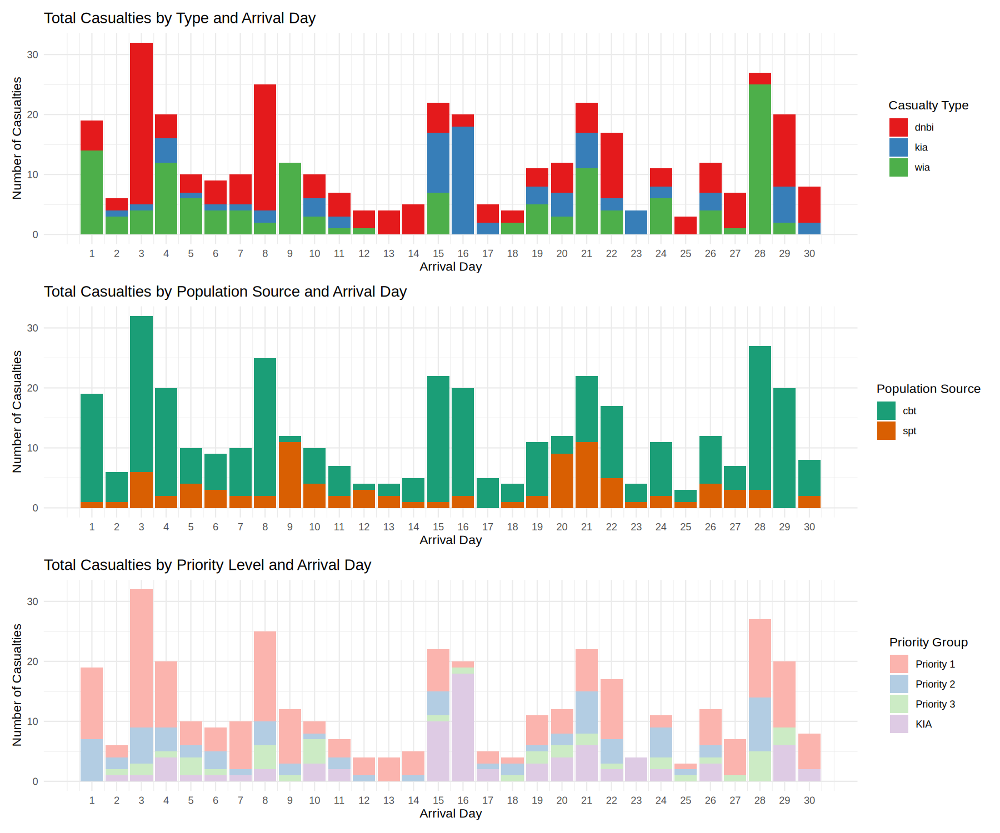

|casualty_type |population_source |  1|  2|  3|  4|  5|  6|  7|  8|  9| 10| 11| 12| 13| 14| 15| 16| 17| 18| 19| 20| 21| 22| 23| 24| 25| 26| 27| 28| 29| 30| total|
|:-------------|:-----------------|--:|--:|--:|--:|--:|--:|--:|--:|--:|--:|--:|--:|--:|--:|--:|--:|--:|--:|--:|--:|--:|--:|--:|--:|--:|--:|--:|--:|--:|--:|-----:|
|dnbi          |cbt               |  5|  4|  6|  5|  5|  5|  5|  5|  5|  5|  5|  5|  5|  5|  4|  5|  5|  5|  5|  5|  4|  5|  5|  4|  5|  5|  5|  4|  5|  5|   146|
|dnbi          |spt               |  1|  1|  1|  1|  1|  2|  1|  1|  1|  1|  1|  1|  2|  1|  1|  1|  1|  1|  1|  1|  2|  1|  1|  1|  1|  1|  1|  1|  1|  1|    33|
|kia           |cbt               |  1|  2|  2|  1|  2|  2|  1|  2|  2|  1|  2|  1|  2|  2|  1|  2|  2|  1|  2|  2|  1|  2|  1|  2|  2|  1|  2|  1|  2|  3|    50|
|kia           |spt               |  0|  1|  1|  1|  1|  1|  0|  1|  1|  1|  1|  0|  1|  1|  1|  1|  1|  0|  1|  1|  1|  1|  0|  1|  1|  1|  1|  1|  0|  1|    24|
|wia           |cbt               |  4|  4|  5|  4|  5|  4|  4|  5|  4|  4|  4|  5|  4|  4|  4|  4|  5|  4|  4|  4|  4|  4|  4|  5|  4|  4|  4|  4|  4|  5|   127|
|wia           |spt               |  2|  2|  2|  2|  2|  3|  2|  2|  2|  2|  2|  3|  2|  2|  2|  2|  2|  2|  2|  2|  2|  2|  2|  2|  3|  2|  2|  2|  2|  2|    63|
|Total         |                  | 13| 14| 17| 14| 16| 17| 13| 16| 15| 14| 15| 15| 16| 15| 13| 15| 16| 13| 15| 15| 14| 15| 13| 15| 16| 14| 15| 13| 14| 17|   443|

The table above presents a summary of the simulated casualty data generated across three primary categories Wounded in Action (WIA), Killed in Action (KIA), and Disease and Non-Battle Injury (DNBI), with their source population: combat forces and support forces. A total of 443 casualties were recorded, with combat elements accounting for the majority (323), reflecting their higher exposure to operational risk. DNBI emerged as the most frequent casualty type (179 cases), underscoring the persistent burden of non-combat medical conditions even in high-intensity environments. This aligns with historical data indicating that DNBI can rival or exceed battle injuries in terms of lost duty days and medical resource consumption.

WIA cases totalled 190, with a notable skew toward combat personnel (127 vs. 63) as a result of the force ratios present within the simulation. These casualties typically require multi-echelon care, including resuscitation, surgical intervention, and post-operative holding, placing sustained demand on Role 1 and Role 2 facilities. KIA figures were lower (74 total).

From a health system planning perspective, this data implies a need for scalable treatment capacity, robust DNBI mitigation strategies, and distributed surgical capability. The consistent casualty generation across periods suggests a steady operational tempo, requiring continuous staffing, replenishment of medical supplies, and resilient evacuation pathways.

|population_source |  1|  2|  3|  4|  5|  6|  7|  8|  9| 10| 11| 12| 13| 14| 15| 16| 17| 18| 19| 20| 21| 22| 23| 24| 25| 26| 27| 28| 29| 30| total|
|:-----------------|--:|--:|--:|--:|--:|--:|--:|--:|--:|--:|--:|--:|--:|--:|--:|--:|--:|--:|--:|--:|--:|--:|--:|--:|--:|--:|--:|--:|--:|--:|-----:|
|cbt               | 10| 10| 13| 10| 12| 11| 10| 12| 11| 10| 11| 11| 11| 11|  9| 11| 12| 10| 11| 11|  9| 11| 10| 11| 11| 10| 11|  9| 11| 13|   323|
|spt               |  3|  4|  4|  4|  4|  6|  3|  4|  4|  4|  4|  4|  5|  4|  4|  4|  4|  3|  4|  4|  5|  4|  3|  4|  5|  4|  4|  4|  3|  4|   120|
|Total             | 13| 14| 17| 14| 16| 17| 13| 16| 15| 14| 15| 15| 16| 15| 13| 15| 16| 13| 15| 15| 14| 15| 13| 15| 16| 14| 15| 13| 14| 17|   443|

The second table provides a breakdown of the casualty population by source: combat forces (cbt) and support forces (spt). Of the 443 total casualties generated, 323 (approximately 73%) originated from combat elements, while 120 (27%) were drawn from support units. This distribution reflects the total population breakdown of the organisation. The consistent presence of support force casualties across all periods underscores the vulnerability of rear-area personnel in LSCO environments, particularly under conditions of indirect fire, degraded situational awareness, and disrupted medical evacuation. The temporal spread of casualties shows a relatively stable operational tempo, with total casualties per period ranging from 13 to 17. 

From a health system perspective, this data reinforces the need for distributed medical coverage that includes both forward and rear-area assets. Role 1 treatment teams must be positioned to respond rapidly to combat casualties, while Role 2 facilities must be capable of absorbing and triaging support force casualties who may present with different injury profiles, including DNBI and delayed trauma. The consistent casualty burden across both populations highlights the importance of scalable capacity, flexible evacuation pathways, and robust command and control to ensure timely treatment and prevent bottlenecks in casualty flow.

|priority_group |  1|  2|  3|  4|  5|  6|  7|  8|  9| 10| 11| 12| 13| 14| 15| 16| 17| 18| 19| 20| 21| 22| 23| 24| 25| 26| 27| 28| 29| 30| total|
|:--------------|--:|--:|--:|--:|--:|--:|--:|--:|--:|--:|--:|--:|--:|--:|--:|--:|--:|--:|--:|--:|--:|--:|--:|--:|--:|--:|--:|--:|--:|--:|-----:|
|Priority 1     |  7|  8|  8|  6| 11|  8|  9|  9|  7|  6| 10| 12|  9|  9|  9|  7| 10|  4|  7|  6|  8|  6|  6|  8|  9|  8|  8|  7|  8|  9|   239|
|Priority 2     |  3|  2|  2|  4|  1|  3|  1|  2|  3|  5|  2|  0|  2|  3|  2|  3|  0|  3|  2|  3|  1|  2|  2|  3|  1|  2|  0|  2|  2|  2|    63|
|Priority 3     |  2|  1|  4|  2|  1|  3|  2|  2|  2|  1|  0|  2|  2|  0|  0|  2|  3|  5|  3|  3|  3|  4|  4|  1|  3|  2|  4|  2|  2|  2|    67|
|KIA            |  1|  3|  3|  2|  3|  3|  1|  3|  3|  2|  3|  1|  3|  3|  2|  3|  3|  1|  3|  3|  2|  3|  1|  3|  3|  2|  3|  2|  2|  4|    74|
|Total          | 13| 14| 17| 14| 16| 17| 13| 16| 15| 14| 15| 15| 16| 15| 13| 15| 16| 13| 15| 15| 14| 15| 13| 15| 16| 14| 15| 13| 14| 17|   443|

Of the total casualties, 239 (53.9%) were classified as Priority 1, representing patients requiring immediate life-saving intervention. This dominant category underscores the doctrinal necessity of forward-positioned Role 1 assets capable of rapid triage and stabilization. The consistent presence of Priority 1 cases across all 30 days suggests a sustained high-acuity burden, reinforcing the need for scalable throughput 

Priority 2 and Priority 3 casualties accounted for 63 (14.2%) and 67 (15.1%) cases respectively. These patients typically require delayed or routine care. The simulation also generated 74 KIA cases (16.7%), distributed evenly across the operational timeline. While these cases do not contribute to medical workload substantially, their operational implications are significant.

From a systems design perspective, the acuity profile derived from this simulation reinforces several key imperatives:

- Role 1 facilities must be optimized for high-throughput triage and stabilization, with emphasis on rapid evacuation of Priority 1 cases.
- Role 2 facilities requires flexible bed space and surgical capability to absorb cases, especially during sustained operations.
- Evacuation architecture must support continuous movement of mixed-acuity casualties, with prioritization protocols and redundancy to ensure resilience.

## R1 Handling

Role 1 facilities consistently demonstrated the ability to process casualties without delay, with all patients receiving immediate triage and treatment on arrival. The absence of queuing reflects both adequate staffing and appropriately scaled treatment capacity relative to the casualty inflow modelled. Rapid handling times ensured that Priority 1 cases could be stabilised and evacuated without degradation in clinical status, while lower‑priority cases were managed and prepared for movement in line with requirements. However, the model does not currently fully represent the limitations in availability of evacuation assets, as a result, throughput at the Role 1 was not constrained by evacuation availability, allowing continuous casualty flow to higher‑echelon care and preventing downstream bottlenecks in the system which may bear out with the introduction of more detailed modelling of evacuation. Despite this, the performance underscores the critical function of Role 1 as an agile, forward medical capability able to maintain momentum under sustained operational tempo.

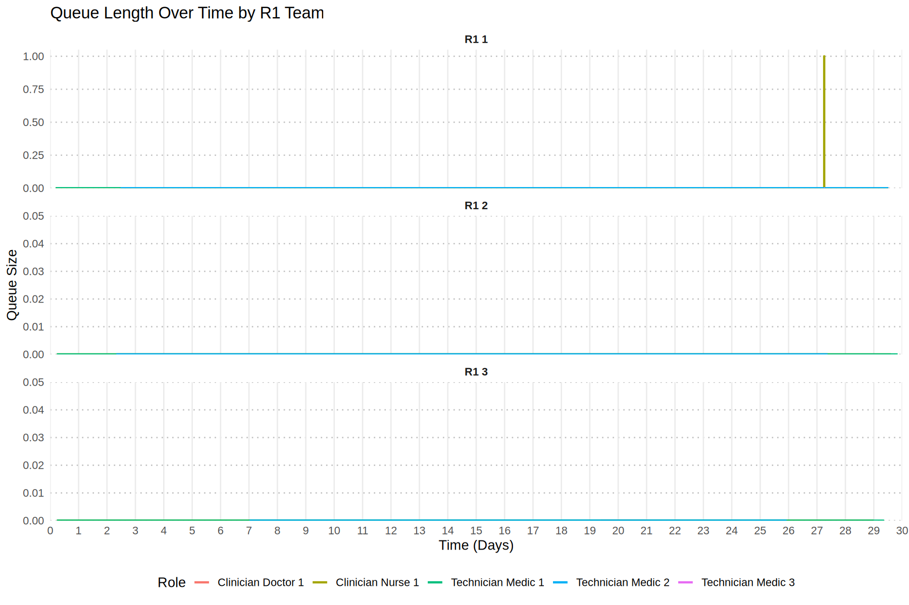

## R2B Handling

The plot below outlines a summary of casualty handling at R2B. Following DNBI sub-categorisation (Issue #7), OT-bypass routing (Issue #35), and correction of OT bed scheduling (Issue #37), the R2B picture is substantially revised from earlier model iterations.

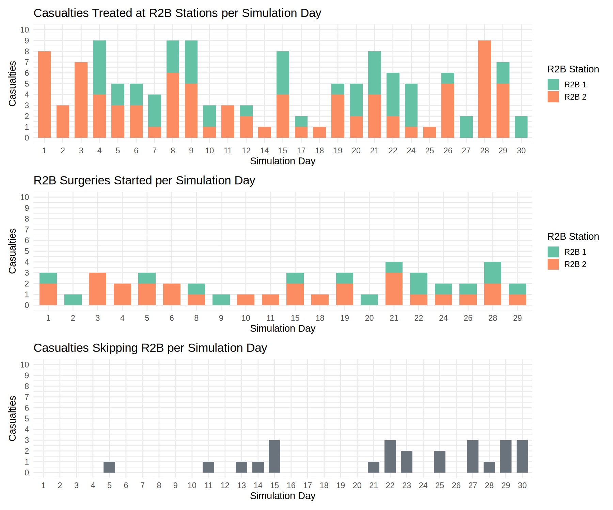

OT rooms are modelled as physical spaces available 24 hours per day. The surgical section operates on a 12-hour shift schedule and is the operative constraint on surgical access. Under seed 42 (30 days), **147 casualties reached the R2B surgical decision point**; **65 surgeries** were performed at R2B, and **82 were bypassed to R2E**. R2B OT utilisation was **9.9% (T1) and 8.4% (T2) against 24-hour room time**, and **19.8% and 16.8% against the section's own rostered time**. The OT queue remained flat at zero throughout the run, confirming the bypass logic is functioning as designed.

**Bypass reason decomposition.** The undifferentiated bypass count above conflates two distinct causes: the surgical section being off shift, and the OT bed itself being busy or queued. `r2b_bypass_reason` (set at the point of bypass in `r2b_treat_wia()`, `R/trajectories.R`) distinguishes them: of the 82 bypasses, **65 (79%) were because the surgical section was off shift**, and **17 (21%) because the OT bed was busy or a queue existed**. This confirms the 12-hour shift window, not physical OT capacity, as the dominant constraint on forward surgical throughput at R2B: for half of each 24-hour cycle, a casualty arriving at either R2B unit cannot receive surgery there regardless of bed availability, and is routed to R2E instead.

**The pre-open hold.** Not every off-shift arrival is diverted. A casualty who finds the theatre free and the section closed for no longer than `r2b.surgery.pre_open_window_min`, shipped at 60 minutes, is received into the theatre and waits there for the section to open (see [R2B Trajectory](../README.md#r2b-trajectory)). Seven casualties were held that way in this run and all seven were operated on forward, waiting a mean of 26.7 minutes and at most 48.1. That is a small share of a 30-day run, which is what a 60-minute window against a 720-minute off-shift period should produce: the hold reaches the last hour of the closed period and no more of it. The reason-1 count above is what is left after those seven, and the replicated measurement of how far the window moves it is reported in [Multi-Run Analysis](Multi_Run_Analysis.md#the-r2b-pre-open-hold-window), a single run being too coarse to separate the movement from sampling variation.

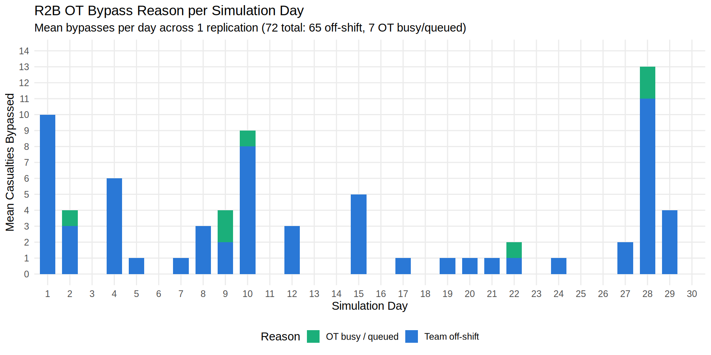

Off-shift bypasses (blue) dominate on nearly every day of the run, reaching as many as five in a single day, while OT-busy/queued bypasses (green) appear only intermittently and never exceed two in a single day. The shift-window gap is therefore a persistent, day-to-day constraint rather than an occasional congestion spike.

Two candidate interventions to close the remaining gap — extending the existing section's shift hours, or fielding a second surgical section per R2B unit on the complementary shift — are not evaluated in this analysis. Extending shift hours cannot be meaningfully assessed without a model of clinician fatigue and associated error/complication risk, which the simulation does not represent; reporting throughput gains from longer shifts without that counterweight would overstate the intervention's net benefit. Fielding a second team is an establishment-size decision — a resourcing question for planners, not a parameter the simulation should default to testing as if cost-free. Both remain candidate follow-up scenario tests once a fatigue model exists or a second-team establishment change is directed.

**Holding bed capacity at R2B is the primary identified system constraint, and the ten beds run close to full for the whole run.** Concurrent hold occupancy rises from 3 beds on Day 1 to 9 or 10 within the first five days and stays there, averaging 8.3 of the 10 available beds across the run, reaching ten or more on 13 separate days and nine or more on 20 of the 30 days. This load is driven by disease DNBI evacuees occupying hold beds for multi-day durations (mode 5 days), not by post-surgical patients.

What the run does *not* show is a sustained queue: the queue across all ten hold beds peaks at three casualties, against the cap of two per bed set out in Intervention Scenario D below. That is the capacity-aware routing policy working as designed rather than evidence of spare capacity. The upstream threshold check diverts a casualty to R2E before transport whenever no R2B unit is below 80% hold occupancy, and it did so 131 times over the run. The structural shortfall analysed in the next section is therefore real but largely exported to R2E, where it arrives as additional medical hold and ICU load, rather than accumulating as a visible queue at R2B.

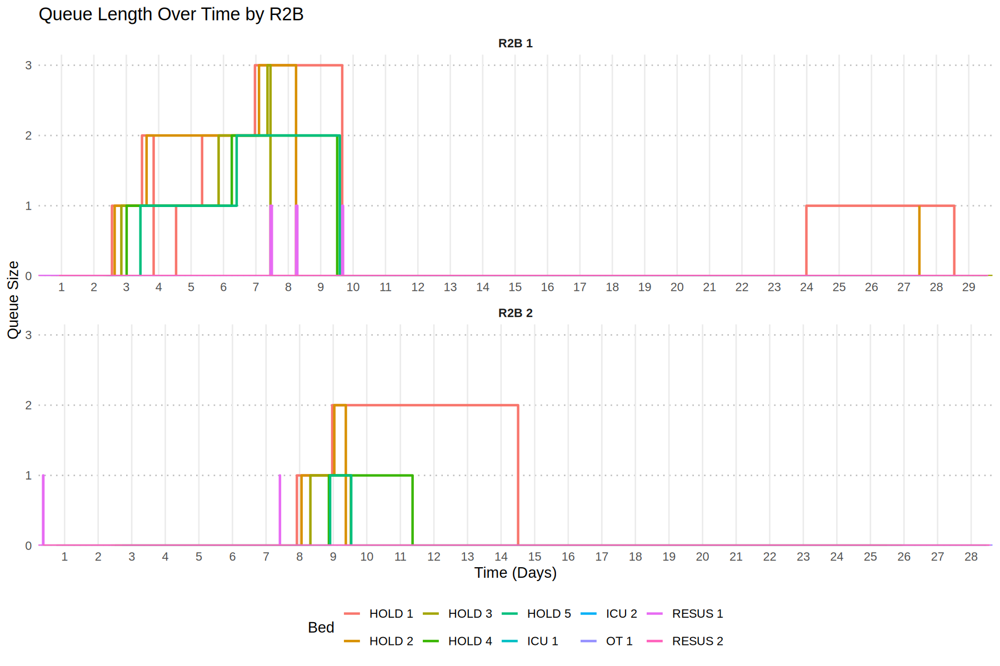

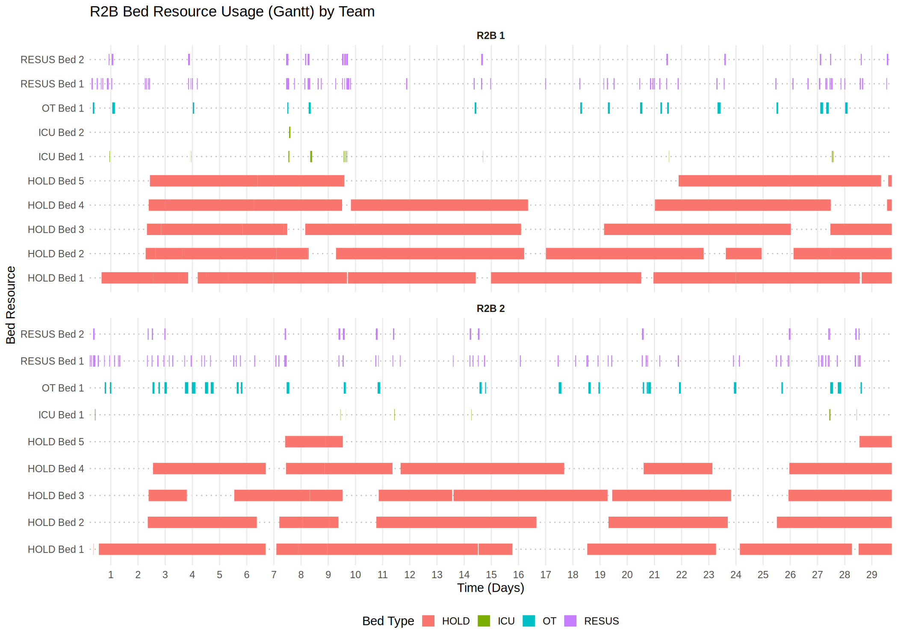

### R2B Hold Bed Saturation — Stream Decomposition and Intervention Analysis

Issue #39 adds per-stream decomposition of R2B hold bed occupancy. A `r2b_hold_start` attribute is now recorded for each patient entering the long-duration hold pathway, enabling daily concurrent occupancy to be decomposed by patient stream (disease DNBI, NBI DNBI, WIA) in the analysis pipeline. The `r2b_hold_drawn` attribute stores the drawn hold duration at the time of bed seizure, supporting optional evac-threshold logic described below.

**Battle fatigue verification.** Code inspection confirms that battle fatigue casualties (dnbi_type == 1) exit the trajectory at R1 via the "Battle Fatigue R1 Hold" branch and never reach R2B hold beds. This is enforced by a `stopifnot` assertion in the analysis pipeline.

**Structural load calculation.** Under the baseline seed 42 parameters (170 DNBI total; 109 disease, 30 NBI, 31 battle fatigue):

- Disease DNBI reaching R2B hold: ~87 evacuated (P1: 109 × 0.65 × 0.95 ≈ 67; P2: 109 × 0.20 × 0.90 ≈ 20), minus ~6% surgical candidacy ≈ **82 entering hold-bed recovery** over 30 days (≈ 2.7 per day)
- Non-surgical WIA and NBI reaching R2B hold: ~19 over 30 days (≈ 0.6 per day)
- **Total hold entry rate: ≈ 3.3 patients per day**
- Expected hold duration (triangular min=0.5d, mode=5d, max=10d): mean = (0.5 + 5 + 10) / 3 = **5.17 days**
- **Expected concurrent hold occupancy: 3.3 × 5.17 ≈ 17.1 beds** against 10 available (5 per R2B unit × 2 units)

This is a **structural 71% overload**. The saturation cannot be resolved by changes to surgical throughput; it requires an intervention at the holding pathway itself.

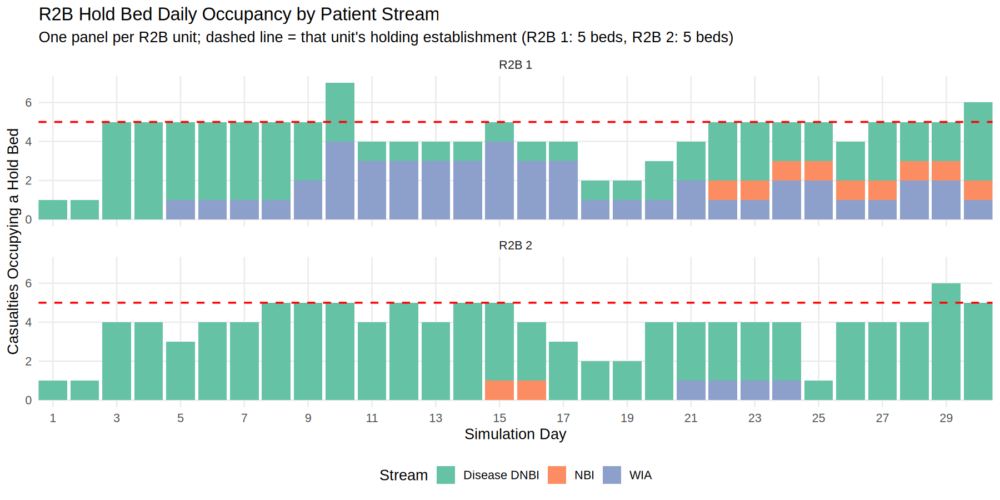

**Intervention Scenario A — Hold duration reduction** (`vars.r2b.holding.mode` in `env_data.json`). Reducing the hold mode from 5 days (7,200 min) to 3 days (4,320 min) reduces expected mean duration from 5.17 to (0.5 + 3 + 10) / 3 = 4.5 days. Expected concurrent occupancy falls from 17.1 to 3.3 × 4.5 = **14.9 beds** — still 49% above the 10-bed capacity. A clinically implausible mode of ≤ 0.9 days would be required to bring expected occupancy within capacity. Hold duration reduction alone is insufficient to resolve saturation. To test: change `{"var": "mode", "val": 7200}` to `{"var": "mode", "val": 4320}` in the `vars.r2b.holding` activity and re-run 10+ replications.

**Intervention Scenario B — Hold bed expansion** (`elms.r2b.beds.hold.qty` in `env_data.json`). Increasing hold beds from 5 to 10 per R2B unit provides 20 total beds against expected steady-state demand of ~17.1, yielding modest headroom to absorb stochastic variance. Eight beds per unit (16 total) is below expected demand. To test: change `{"name": "hold", "qty": 5}` to `{"name": "hold", "qty": 10}` in the `elms.r2b.beds` array and re-run 10+ replications.

**Intervention Scenario C — Evacuation threshold** (`vars.r2b.holding.evac_threshold` in `env_data.json`). The trajectory now supports an optional evac threshold (minutes): when `evac_threshold` is set and a patient's drawn hold duration exceeds it, the patient is forwarded to R2E rather than waiting for full recovery at R2B. At a threshold of 3 days (4,320 min): the triangular CDF gives P(draw > 4,320) = 1 − (4,320 − 720)² / ((14,400 − 720) × (7,200 − 720)) ≈ **85% of hold patients forwarded to R2E early**, effectively eliminating R2B hold saturation. This reduces R2B hold bed occupancy substantially but transfers a non-surgical medical load to the R2E hold and ICU pathway. To test: add `{"var": "evac_threshold", "val": 4320}` to the `vars.r2b.holding` activity vals array and re-run 10+ replications.

**Intervention Scenario D — Capacity-aware hold routing (Issue #39, implemented).** A two-tier routing policy manages hold bed allocation. The primary tier operates at R1 before transport begins; the secondary tier operates at R2B on arrival.

**Primary tier — upstream threshold routing (`vars.r2b.holding.hold_threshold`, default 0.8).** `select_r2b_for_hold()` now checks whether a R2B unit's hold occupancy is strictly below `hold_threshold × capacity` before routing a patient there. With 5 beds per unit and threshold 0.8, a unit is only selected if fewer than 4 beds (80%) are occupied, keeping at least 1 bed reserved for incoming Step 1 staging patients. If no R2B unit is below threshold, the patient is routed directly to R2E from R1 (`r2b_bypassed = 1`) without incurring transport to R2B at all. When `hold_threshold` is absent the function falls back to routing whenever any bed is free (original behaviour). This eliminates the cascade where long-duration Step 4 holders starve new Step 1 arrivals: the routing decision is made before transport, not after the patient has already consumed a hold bed. To test: set `{"var": "hold_threshold", "val": 0.6}` for more aggressive upstream routing, or remove the parameter to restore original behaviour.

**Secondary tier — at-R2B three-stage policy.** For patients who arrive at R2B (either because the upstream check passed, or a race condition occurred between routing decision and arrival):

1. **Hold capacity available** — patient seizes a hold bed immediately (Step 4 No Surgery branch).
2. **Hold full, R2E has capacity** — patient bypasses to R2E via evacuation-team transport (`r2b_hold_bypass = 1`); also the fallback when queue cap is exceeded.
3. **Both echelons full, queue within cap** — patient joins the R2B hold queue (`r2b_hold_queued = 1`). Queue cap = floor(R2B\_beds / (R2B\_beds + R2E\_beds) × R2B\_beds) = **2 patients**; above cap, fallback to stage 2.

The analysis pipeline reports all three routing outcomes: `r2b_pre_bypass_count` (upstream, at R1), `r2b_hold_bypass_count` (at R2B Step 4), and `r2b_hold_queued_count` (queued at R2B when both echelons saturated).

> **MODEL ASSUMPTION — R2B Hold Bed Structural Overload:** Five hold beds per R2B unit are insufficient to absorb the demand generated by the 64% disease DNBI proportion observed over a 30-day operation. The overload is structural (expected demand 17.1 beds vs. 10 available) and is not resolved by hold duration reduction alone. With no-queue bypass active (Scenario D), overflowing patients transfer to R2E rather than accumulating at R2B, preserving system throughput at the cost of increased R2E medical hold load.
> **Basis:** Derived from model parameters: hold entry rate ≈ 3.3 patients/day × mean hold 5.17 days = 17.1 concurrent beds. No empirical doctrinal standard for forward medical holding capacity in LSCO contexts has been identified in open-access literature.
> **Uncertainty:** Medium — conditioned on the disease DNBI proportion assumption (itself High uncertainty; see [DNBI Sub-Type Split](../README.md#dnbi-sub-type-split)). If true disease proportion is lower, the overload reduces proportionally.
> **Consequence if wrong:** If disease DNBI proportion is substantially lower (e.g., 30%), expected concurrent hold occupancy falls to ~9 beds, within the 10-bed capacity. The saturation finding is sensitive to this assumption.

## R2E Heavy Handling

The R2E Heavy is the primary surgical node for the deployed health system, receiving both casualties bypassed directly from R1 and those bypassed onward from an R2B whose theatre was off-shift, occupied, or ICU-saturated. Under seed 42 over 30 days, the R2E performed **116 first surgeries** and **38 second surgeries**. The second-procedure count is now a minority of the first, where it was once most of it: only a damage control casualty whose abbreviated operation was performed here returns to theatre for a definitive repair, and a single-stage casualty operated on forward at R2B needs no procedure here at all (see README [Surgical Pathway](../README.md#surgical-pathway)).

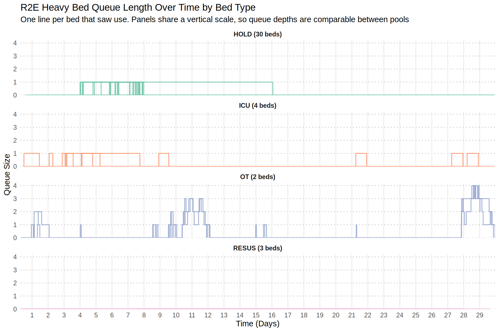

**R2E surgical throughput is bounded by rostered surgical sections as well as by theatre space.** A procedure seizes both an operating theatre and one of the three surgical sections that staff them, and a section carries a 12-hour roster while a theatre is available continuously, so the number of concurrent operations is capped at two during the first shift, when two sections are rostered on, and one during the second, when one is. Utilisation across the three sections was **19.0%, 36.7% and 26.6%** of their rostered time; the middle figure is higher because that section is the one rostered to the second shift, and so absorbs the whole of the night-time surgical load on its own. Against 24-hour room time the two theatres ran at **38.5%** and **27.8%**.

**The second-shift surgical section, not the theatres, sets the pace at R2E.** OT 1 carried a queue for **13.7%** of the run and OT 2 for **12.5%**, and the sections themselves were queued for **0.1%, 1.4%** and negligibly little of their rostered time. Because a casualty seizes a theatre before it seizes a section, a theatre reads as occupied while its casualty is still waiting for staff, so part of the theatre figure is a room held by a casualty waiting for staff rather than a room in use. The second-shift section is the specific constraint, carrying roughly twice the load of either first-shift section and a queue several times longer than either.

**R2E ICU is busy but no longer saturated.** Per-bed utilisation across the four ICU beds is **92.4%, 92.6%, 81.6% and 76.1%** (seed 42, 30 days), with a queue present for **15.0%** of the run on the first bed, **5.2%** on the second, **2.9%** on the third and not at all on the fourth. That is a materially looser picture than the effectively full ICU the model reported while every critical-route evacuee held a bed for the whole of its wait for an aircraft. Casualties awaiting strategic evacuation stage in holding beds, and only the ventilated minority of the critical pool holds an ICU bed at all, for a bounded pre-flight period: eight such holds completed within this run, at a mean of **29.1 hours** and a 90th percentile of 38 hours, against the roughly twelve-day mean the model produced several design iterations ago. The residual pressure on ICU is clinical demand plus a bed-blocking effect when the holding pool is full (see [Strategic Evacuation and Role 4 Demand](#strategic-evacuation-and-role-4-demand), and README Limitation L17).

Relieving the ICU constraint moves casualties through the pre-OT gate rather than around it. The stabilisation phase belongs to the damage control pathway alone, so the cohort passing through the gate's post-operative branch is the damage control casualties rather than every operated casualty: **46 recovered in ICU** (`post_op_pathway = 1`) and **50 Priority 1 casualties recovered in a holding bed** (`post_op_pathway = 2`) because ICU was full at the moment of theatre entry; a further **13 Priority 2 and lower casualties had theatre entry deferred** (`surgery_deferred = 1`) until a bed freed. Post-definitive care, which both pathways receive, went to an ICU bed for **48** casualties and to the degraded holding-bed fallback for **94**. Neither pathway produced a post-operative death of wounds in this single run, consistent with the small per-patient probabilities applied at that checkpoint and the small absolute counts characteristic of the Falklands-calibrated baseline; a saturated-ICU stress test (ICU capacity forced to zero over a 90-day run) confirmed the mechanism fires correctly, producing measurable post-operative deaths when the elevated-risk pathway dominates. The single-run result should not be read as evidence that the holding-bed route is clinically safe, only that 50 casualties on it is too small a sample to resolve a sub-percent mortality difference.

`analyse_run()` now visualises exactly which casualties, and on which simulation day, received degraded care as a direct consequence of ICU saturation:

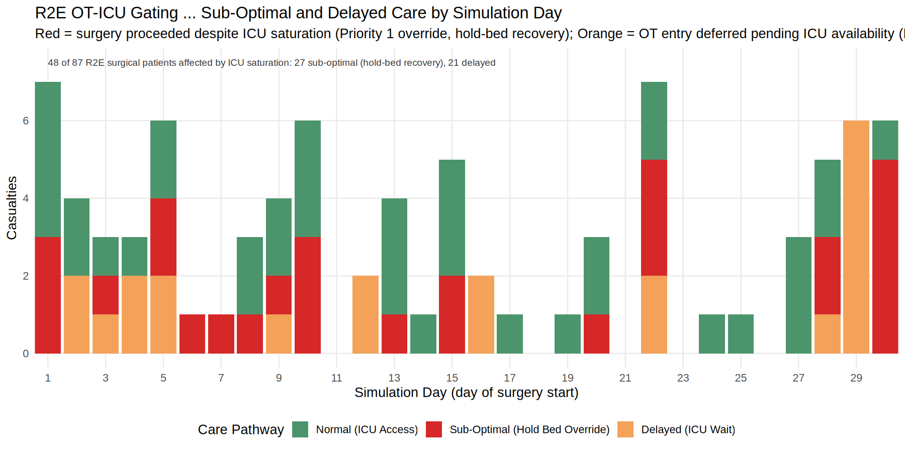

Sub-optimal care (red — surgery proceeded despite ICU saturation, Priority 1 override to holding-bed recovery) and delayed care (orange — OT entry deferred pending ICU availability, Priority 2+) cluster on the higher-arrival days later in the run, consistent with cumulative ICU demand outstripping the four-bed establishment as surgical volume accumulates. `outputs/r2e_icu_gating_daily.csv` and `outputs/post_op_pathway_summary.csv` provide the underlying daily and pathway-level counts.

**50-replication validation (seed = NULL, 30 days) confirms the effect generalises beyond seed 42.** Comparing 50 independent replications pre- and post-Issue-43: mean R2E ICU utilisation fell from **74.1% to 60.2%** — a substantial, consistently-observed reduction in ICU load, not a seed-42 artefact. Mean DOW/run rose from **0.84 (95% CI [0.58, 1.10]) to 1.00 (95% CI [0.74, 1.26])** — the two confidence intervals overlap substantially, so this specific comparison does not reach conventional statistical significance at n = 50 (DOW remains a rare event; a properly powered before/after comparison would need a considerably larger replication count). The increase is, however, fully attributable to the new post-operative checkpoint: it contributed a mean of 0.10 DOW/run on its own (5 of 50 replications), accounting for essentially the entire point-estimate shift. Within that checkpoint, the qualitative design intent held using the real (non-stress-tested) parameters: the post-op hold pathway's realised DOW rate (2 deaths / 1,223 patients = 0.16%) was roughly **2.8× the ICU pathway's rate** (3 deaths / 5,085 patients = 0.06%) — the elevated-risk pathway is measurably, not just theoretically, riskier at baseline casualty rates, though the small absolute counts mean this ratio itself carries wide uncertainty. The intervals in this paragraph alone are as originally computed, over replications that were antithetically paired while the interval divided by the replication count, which makes them narrower than the runs entitle them to be. They are not recomputed because the comparison is against a configuration that no longer exists in the codebase, so the "before" arm cannot be re-run; the paragraph's own conclusion, that the two intervals overlap and the comparison does not reach significance at n = 50, is only reinforced by intervals that should be wider. Every other interval in this document has been regenerated over independent replications.

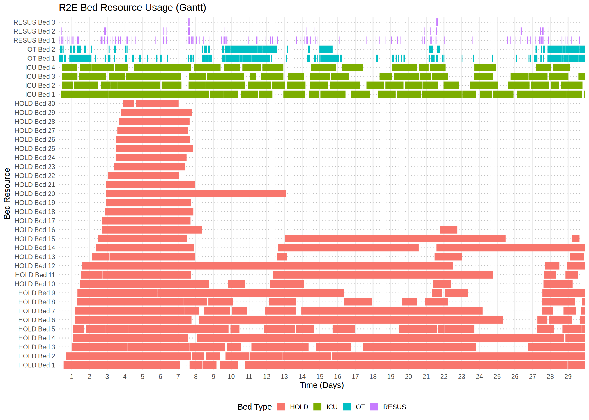

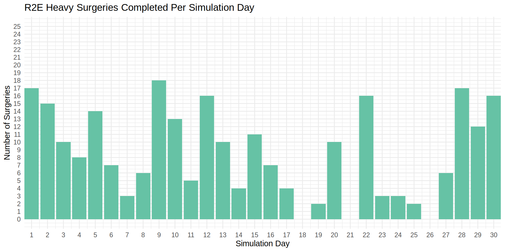

> **Reproducibility note:** the seed-42 30-day figures throughout this document were regenerated after the surgical population was split between the staged damage control pathway and a single-stage definitive procedure, in an ad hoc R 4.3.3 sandbox rather than the project's pinned `rocker/rstudio:4.4.2` Dev Container, following the same practice and caveat used for prior unpinned-sandbox figures in this project (see the `CLAUDE.md` Key Parameters provenance caveat). As a check on that sandbox, the same seed-42 run made immediately *before* the change reproduced every documented figure in `CLAUDE.md` exactly, including total casualties (385), the R2B surgical decision point and bypass counts, the first and second surgery counts, the post-operative and post-definitive pathway splits and the deferred-surgery count. The change is not random-number-stream-neutral: roughly half of operated casualties now take one theatre episode and one intensive care episode instead of two of each, so beds and theatres free sooner, and because Issue #18's force-regeneration loop couples arrival timing to casualty-event timing, even total casualty count moves (385 to 386). Setting every damage control rate to 1.0 reproduces the pre-change run bit-identically, which is what establishes the split as a generalisation of the previous model rather than a replacement for it. The 50-replication figures reported below and elsewhere in this document were not recomputed except where explicitly stated.

> **Currency note (Issue #203):** the seed-42 single-run figures throughout this document were regenerated after the arrival generators were reparameterised so that each stream realises the daily mean its configuration names, the per-minute rate cap having previously held realised generation between 78.7% and 99.2% of it (see README [Casualty Generation](../README.md#casualty-generation)). Casualty generation itself moves, not merely the draw order downstream of it: total casualties rise from 382 to 443, wounded in action from 151 to 190, killed in action from 57 to 74 and disease and non-battle injury from 174 to 179, each stream in proportion to the shortfall the cap had been imposing on it. Everything downstream rises with them. The run was made in an ad hoc R 4.3.3 sandbox rather than the project's pinned `rocker/rstudio:4.4.2` Dev Container, under the same caveat as the prior unpinned-sandbox figures in this project; as a check on the sandbox, the same seed-42 run made immediately before the change reproduced every documented figure in `CLAUDE.md` exactly, including total casualties, the R2B decision point, bypass and pre-open hold counts, the surgical pathway split, the disposition count and in-theatre share, and the Role 4 and strategic evacuation figures. Per-resource utilisation and queue figures are measured throughout by the project's own `utilisation_per_replication()` (`R/analysis.R`); the previously published per-resource figures were computed on an unstated basis that differed from it by one to three percentage points, and this refresh replaces them rather than carrying that basis forward. Multi-replication figures were not recomputed except where stated in place.

> **Currency note (Issue #189):** the multi-replication intervals in this document were subsequently regenerated over independent replications, after antithetic pairing was withdrawn from `run_replications()` (see README [Multi-run Replication Framework](../README.md#multi-run-replication-framework)). The pairing made the pair, not the replication, the unit the design supplied, while every interval divided by the replication count, so the point estimates stood and the widths did not. The transport fleet-size sweep, the forward ICU share sweep and the in-theatre share were re-measured and their figures below reflect that; `images/transport_capacity_margin_by_fleet_size.png` and `images/r2b_icu_share_frontier.png` were regenerated with them. The seed-42 single-run figures are unaffected, the correction consuming no random draws and reproducing the run bit-identically. The one exception is noted in place, at the pre- versus post-Issue-43 comparison.

When examined in system context, the combined OT capacity of two R2B elements and one R2E Heavy is adequate for a single combat brigade under Falklands-equivalent casualty rates [[1]](#references). However, if this system were applied to a deployed division, surgical and holding capacity would be grossly insufficient even if only one brigade was assumed to be in contact at any time. The modelled scenario also does not account for mass-casualty events or the elevated casualty production rates reported in FORECAS modelling of campaigns such as Okinawa or Vietnam, both of which would expose this deficit [[1]](#references).

## Casualty Waiting Time

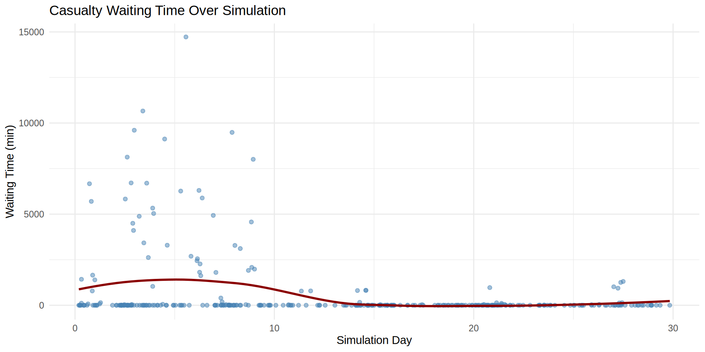

## Transport Fleet Capacity Margin

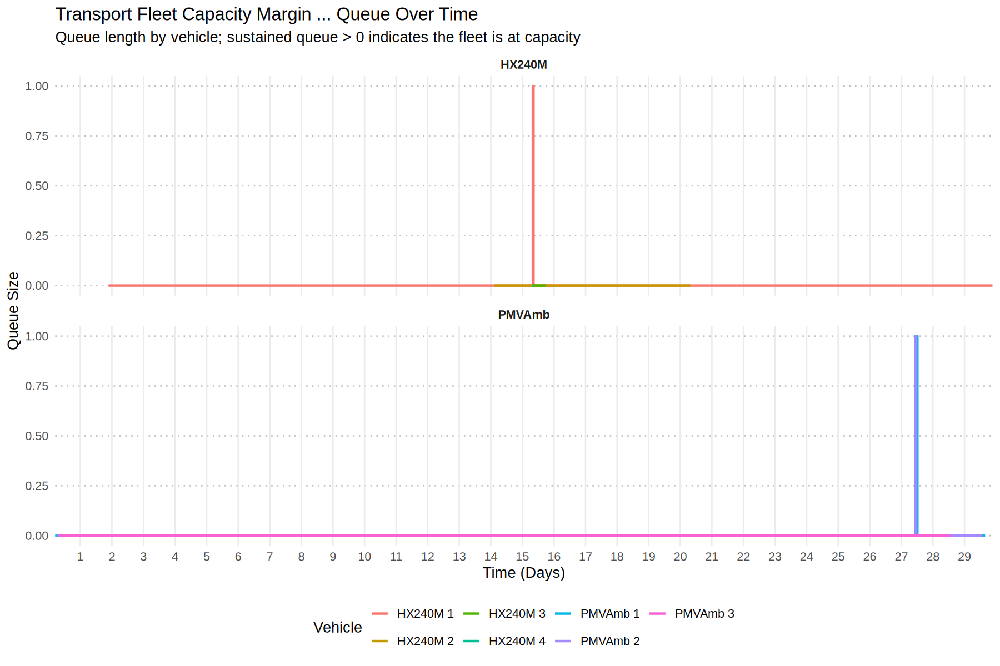

Under seed 42 (30 days), the queue for every PMV Ambulance and HX240M unit remains at 0 throughout the run: the current three-vehicle PMV Ambulance and four-vehicle HX240M pools are not a binding constraint at the current Falklands-derived casualty rate, even with the full round-trip dead-heading model applied (each vehicle is held for an unladen return leg back to its originating echelon after casualty drop-off, rather than becoming available for the next pickup immediately). Mean utilisation (`outputs/transport_utilisation.csv`) is 10.7% for PMV Ambulance and 4.7% for HX240M, so substantial headroom remains. This plot shows the current single-run margin only; the fleet-size sweep below (varying vehicle count directly, rather than only casualty rate or transport duration) characterises at what fleet size transport becomes the binding constraint.

**Seed-42 baseline (30 days, single run):** Under the current Falklands-derived casualty rate, the three-vehicle PMV Ambulance pool has sufficient spare capacity that dead-heading does not produce a persistent evacuation queue (max queue = 0, both with and without dead-heading). The effect is visible in asset utilisation instead: total PMV Ambulance busy-time rises from 6,816 to 14,376 minutes (+111%, consistent with an approximately symmetric round trip) across the 30-day run once the return leg is modelled, and a third vehicle is drawn into service that was never required under the outbound-only model. This baseline predates the Issue #73 follow-up (R2B↔R2E dead-heading) and the Issue #74 removal of the (by then unjustified) `return_leg_multiplier` parameter; see the `CLAUDE.md` Key Parameters table for the current post-#74 seed-42 figures.

**Fleet-size sweep (Issue #57).** `plot_transport_capacity_margin_by_fleet_size()` (`R/analysis.R`) sweeps PMV Ambulance across 1–5 vehicles and HX240M across 1–4 vehicles, holding the other fleet at its current establishment size, rebuilding the environment at each sweep point via `build_environment()` and running the replication engine (`run_replications()`, R/replication.R — the same engine the comparative scenario runner, Issue #10, uses) for `n_rep` replications per point. 10 replications × 30 days (seed 42) were run via `Rscript scripts/run_transport_sweep.R`:

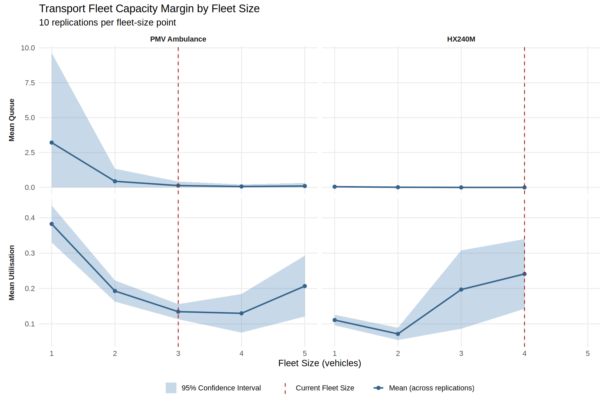

| Fleet size | PMV Ambulance mean queue (95% CI) | PMV Ambulance mean utilisation | HX240M mean queue (95% CI) | HX240M mean utilisation |
|---|---|---|---|---|
| 1 | 0.0390 (0.0308–0.0472) | 30.4% | 0.0024 (0.0013–0.0035) | 9.6% |
| 2 | 0.0009 (0.0003–0.0014) | 15.4% | 0.0000 | 5.1% |
| 3 (current) | 0.0000 | 14.9% | 0.0000 | 15.9% |
| 4 (current) | 0.0000 | 18.6% | 0.0000 | 21.0% |
| 5 | 0.0000 | 21.8% | — | — |

At a single vehicle, both fleets show a materially non-zero mean queue — confirming the sweep can locate a genuine capacity boundary rather than only reproducing the current always-zero finding. Queue collapses to a negligible fraction of a casualty by two vehicles for both platforms and stays there through the current three/four-vehicle establishment and beyond, out to the top of the swept range. This demonstrates the current fleet carries margin well beyond what a single additional vehicle of headroom would provide: PMV Ambulance could in principle be reduced from three to two vehicles, and HX240M from four to two, while the mean queue at the current Falklands-derived casualty rate would remain close to zero. Mean utilisation across the swept range is not merely noisy but runs the wrong way, rising with fleet size on both platforms where a fixed demand spread over more vehicles should lower it. That is sampling variance rather than a finding: so few transport events occur per replication that the busy-time estimate at each sweep point is barely determined, and the interval on HX240M utilisation at three vehicles spans 1.3% to 30.6%. The correspondingly wide 95% CI ribbons on the utilisation panels of the plot above show the same thing. Only the queue column, where the zeros are exact rather than estimated, carries weight at this replication count. `outputs/transport_capacity_by_fleet_size.csv` provides the full per-point results, including CI bounds omitted from the table above.

## Forward ICU Share Decision Frontier

A casualty's stabilisation requirement is a single quantity divided between R2B and R2E by the forward-holding policy, and the post-definitive care that follows their definitive repair is a separate episode served only at R2E (see README [Post-Operative Stabilisation](../README.md#post-operative-stabilisation)). Because the stabilisation total is conserved at every setting, sweeping the policy moves load between the echelons without changing how much care is delivered, which makes it a genuine planning lever rather than a way of quietly reducing treatment. `scripts/run_icu_share_sweep.R` swept it at 20 replications per point over 30 days. Only the damage control cohort has a stabilisation phase, so the population the lever acts on is roughly half of operated casualties rather than all of them (see README [Surgical Pathway](../README.md#surgical-pathway)).

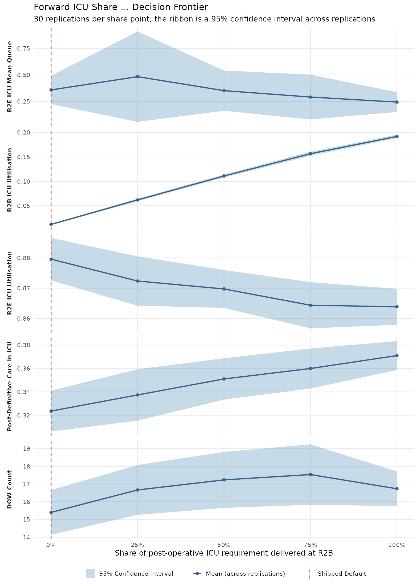

| Forward ICU share | R2E ICU mean queue (95% CI) | R2B ICU utilisation | R2E ICU utilisation | Post-definitive care in ICU (95% CI) | Mean DOW per run (95% CI) |
|---|---|---|---|---|---|
| 0% (shipped) | 0.064 (0.051–0.077) | 10.7% | 86.0% | 47.5% (45.3–49.8) | 0.85 (0.44–1.26) |
| 25% | 0.052 (0.029–0.074) | 23.8% | 85.4% | 50.1% (47.2–52.9) | 0.70 (0.27–1.13) |
| 50% | 0.075 (0.050–0.101) | 28.5% | 87.1% | 48.0% (44.9–51.2) | 1.05 (0.69–1.41) |
| 75% | 0.056 (0.042–0.069) | 24.7% | 85.7% | 47.7% (45.6–49.9) | 0.80 (0.35–1.25) |
| 100% | 0.046 (0.035–0.056) | 28.4% | 85.7% | 52.3% (50.0–54.5) | 1.05 (0.56–1.54) |

Once only the damage control cohort has a stabilisation phase to move, the lever stops earning its keep. Every quantity in the table above is now flat across the swept range. The R2E intensive care queue moves between 0.046 and 0.075 casualties with overlapping intervals and no trend; R2E utilisation sits between 85.4% and 87.1% at every setting; and the share of casualties receiving post-definitive care in an intensive care bed, which rose monotonically from 35.5% to 47.5% when every operated casualty took the staged pathway, now varies between 47.5% and 52.3% with every interval overlapping every other.

The reason is the size of the population the lever acts on. Roughly half of operated casualties take the single-stage pathway, and they have no stabilisation phase to move; of the remainder, only those operated on forward at R2B can have any of it served forward. What is left is a small enough cohort that shifting all of their stabilisation forward does not measurably relieve a unit running at 85% occupancy. R2B intensive care utilisation confirms the mechanism is still working rather than broken: it rises from 10.7% at a zero share, where the beds serve only the evacuation wait, to between 24% and 29% once forward holding is enabled, so load genuinely moves. It simply does not move enough to change the rearward picture.

The mortality column remains unresolved and is now doubly so. Mean deaths of wounds per run move 0.85, 0.70, 1.05, 0.80, 1.05 across the five points with every confidence interval overlapping every other, and the non-monotonic ordering is characteristic of sampling noise rather than of a trade-off. Deaths of wounds are rare at this casualty rate, and the capability penalty applies only to the fraction of a fraction that is operated on forward and holds there, so 20 replications cannot separate an effect of this size from noise.

The shipped default therefore stays at zero, and the case for changing it is now weaker rather than merely unproven. The earlier frontier, which appeared to show a monotonic gain in post-definitive intensive care access, was measured against a model that routed every operated casualty through the staged pathway; the gain it showed was in proportion to a cohort roughly twice the size of the real one. What the corrected frontier shows is a lever with a real mechanism and no measurable benefit at Falklands-equivalent load. It may still matter at higher casualty rates, where R2E intensive care is the binding constraint by a wider margin, and that is the experiment worth running next.

## Return to Duty

Under seed 42 (30 days), **161 casualties** were assigned a `return_day` attribute, decomposed as follows:

| Echelon | RTD type | Count | Rate (of 443 arrivals) |
|---|---|---|---|
| R1 | battle_fatigue | 39 | 8.8% |
| R1 | clinical | 71 | 16.0% |
| R2B | clinical | 39 | 8.8% |
| R2E | clinical | 12 | 2.7% |
| **Total** | | **161** | **36.3%** |

`bf_rtd` is 39, not 45 (the total battle fatigue casualties generated), because 6 battle fatigue entities were still within their R1 hold timeout when the 30-day simulation ended and were not assigned `return_day`. Battle fatigue RTDs are exclusively at R1, consistent with the no-R2-routing design. The majority of clinical RTDs occur at R1 (Priority 3 WIA and NBI completing R1 recovery) and R2B (disease cases discharged from hold beds). R2E clinical RTDs are low (12) because R2E hold-bed discharge is contingent on completing the drawn recovery-to-duty period, which for most retained casualties extends beyond the 30-day window. The aggregate RTD rate of 36.3% is within the historical range for in-theatre MTF admissions (7.6–42.1% [[2]](#references)), though direct comparison requires accounting for the simulation's 30-day boundary effect.

The share of R2E casualties retained in theatre is a separate quantity from this aggregate, and is now an output of the theatre evacuation policy rather than a fixed input (see README [R2E Heavy Trajectory](../README.md#r2e-heavy-trajectory)). Of the **162 casualties reaching R2E disposition** under seed 42, **25.3%** drew an expected recovery within the shipped 30-day policy and were retained, inside the historical range; the 50-replication figure was not recomputed for this change and stands at 26.8% (95% confidence interval 25.5% to 28.0%). Because the same drawn duration decides both the disposition and, for those retained, the holding-bed occupancy that follows it, evacuation is strictly a function of severity: sorting the 162 dispositions into quartiles by drawn recovery duration gives evacuation rates of **0%, 100%, 100% and 100%** from shortest to longest, where an unconditioned draw would have given the same rate in every quartile.

## Force Regeneration Feedback Loop

This section demonstrates the force regeneration feedback loop mechanism (Issue #18), under which casualty production is coupled to a live, time-varying effective force size rather than a fixed roll strength: a no-reinforcement run should show declining daily casualty volume as the effective force depletes, and an active reinforcement demand cycle should counteract that decline. Because the effect scales with how large casualty production is relative to force size, it is demonstrated here under both the `moderate_intensity` (Falklands-calibrated) baseline and the `high_intensity` (Okinawa exemplar) profile, each averaged across independent replications and fit with an ordinary least-squares trend line against simulation day. The reinforcement configuration used below is a 7-day demand submission cycle with a 7-day fulfillment lag and the shipped default triangular fill distribution (`fill_min_frac = 0.2`, `fill_mode_frac = 0.85`, `fill_max_frac = 1.1`).

`analyse_run()` (`R/analysis.R`) now always produces a `force_regeneration_plot` — `effective_force_combat`/`effective_force_support` plotted against simulation day, faceted by replication when more than one is present — written to `images/force_regeneration.png`. The seed-42 baseline (no reinforcement, the shipped default) is shown below:

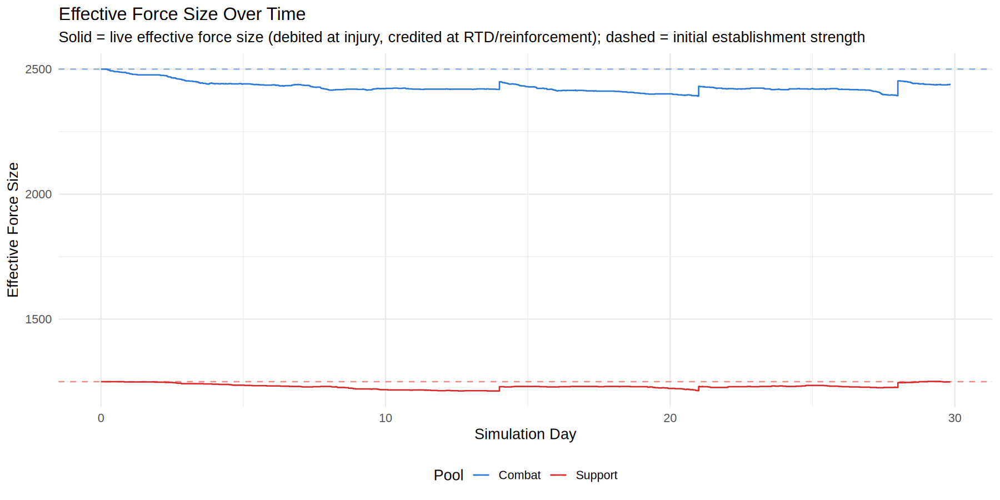

Both pools decline smoothly and monotonically-in-trend (net depletion outweighing RTD regeneration for most of the run), ending the 30-day run at 2,305 of 2,500 initial combat strength (−7.8%) and 1,164 of 1,250 initial support strength (−6.9%) — small in absolute terms at Falklands-calibrated rates, exactly as the mechanically-real-but-modest effect the trend table below quantifies statistically.

| Scenario | Reinforcement | Daily volume slope | p-value | First-week mean | Last-week mean |
|---|---|---|---|---|---|
| `moderate_intensity` (15 reps) | None | −0.006/day | 0.76 | 12.9 | 12.7 |
| `moderate_intensity` (15 reps) | 7-day demand cycle, 7-day lag | +0.019/day | 0.36 | 12.9 | 13.3 |
| `high_intensity` (12 reps) | None | −0.204/day | 9.6×10⁻¹⁴ | 34.8 | 29.9 |
| `high_intensity` (12 reps) | 7-day demand cycle, 7-day lag | −0.018/day | 0.27 | 34.8 | 34.2 |

At `high_intensity` casualty rates, the mechanism is unambiguous: daily volume falls significantly with no reinforcement (a ~14% first-to-last-week decline, p = 9.6×10⁻¹⁴), and the demand-cycle reinforcement configuration reduces that decline by an order of magnitude to a slope statistically indistinguishable from flat (−0.018/day, p = 0.27; <2% first-to-last-week change) — reinforcement substantially arrests depletion *without* overshooting into net growth. This is a direct consequence of the demand-based design: because each cycle's demand is the pool's actual current shortfall rather than a fixed size, a well-sustained pool automatically asks for less on its next cycle, and the triangular fill distribution's long under-fill tail means full or over-delivery is possible but not the likely outcome. At `moderate_intensity` (the documented seed-42 baseline scenario), the same mechanism operates in the same direction — the no-reinforcement slope is negative and the reinforced slope is positive — but neither reaches significance at n = 15 replications, because Falklands-calibrated casualty rates deplete only a low single-digit percentage of either force pool over 30 days (see the regression note elsewhere in this analysis). This is expected, not a defect: the `moderate_intensity` acceptance criterion for this issue is a small, mechanically-real effect, not a dramatic one, and the `high_intensity` demonstration confirms the same mechanism produces an unambiguous, statistically significant effect once casualty production is large relative to force size.

`force_regeneration.reinforcement` (`env_data.json`) remains a fully planner-tunable input — the demand cycle, fulfillment lag, and all three triangular fill parameters — and this project does not attempt to auto-balance it against a scenario's attrition rate; the 7-day/7-day configuration above is illustrative, not a recommended operational setting.

> **Reproducibility note:** the table above was produced in an ad hoc R 4.3.3 sandbox (not the project's pinned `rocker/rstudio:4.4.2` Dev Container) for this issue's verification, following the same practice and caveat used for prior unpinned-sandbox figures in this project (see the `CLAUDE.md` Key Parameters provenance caveat). It demonstrates the mechanism's direction and statistical behaviour; it is not a substitute for the seed-42 single-run baseline figures reported elsewhere in this document and in `CLAUDE.md`.

## Strategic Evacuation and Role 4 Demand

This section presents the seed-42 30-day single-run Role 4 (national support base) and strategic AME outputs, with the wait-time died-of-wounds poll active. Of the 443 total casualties generated, 121 reached the strategic evacuation decision (`r2e_evac = 1`); of those, 106 had boarded an AME sortie and reached Role 4 by the end of the 30-day run, with 15 still queued and occupying an R2E holding bed. The sortie carries the RAAF's published C-17A aeromedical evacuation fit of 36 high dependency and 54 ambulatory places (see README [Role 4 (National Support Base) Demand Modelling](../README.md#role-4-national-support-base-demand-modelling)), so the residual 15 is set by the sortie interval rather than by seats.

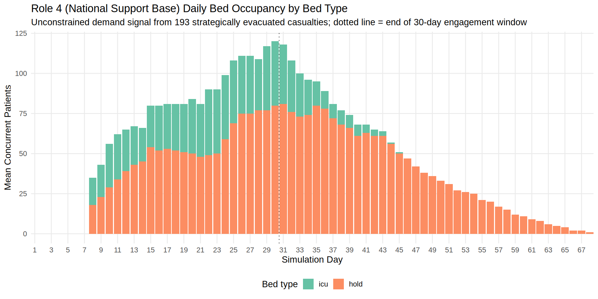

Daily Role 4 bed occupancy rises through the engagement window, reaching a peak of 68.0 concurrent patients (all wards combined) on day 18, and has not decayed to zero within the window shown, since the length-of-stay distributions extend well past the campaign horizon. The peak tracks the number of evacuation decisions rather than any change in how Role 4 itself is modelled, and it rises with them as each stream now realises the daily rate its configuration names (see README [Casualty Generation](../README.md#casualty-generation)).

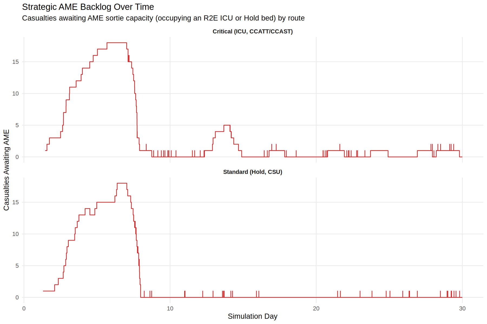

> **Provenance note (Issue #109):** this image was regenerated as part of Issue #109 fixing a bug in the backlog computation itself — see the Domain 7 MODEL OUTPUT — Strategic AME Backlog Over Time (by Pool) block above for what was wrong and how it was fixed. The figures in the prose below were already correct (derived from `ame_wait_time_summary`, not the broken plot), which is how the bug went unnoticed until this issue's verification. Regenerated in the same ad hoc R 4.3.3 sandbox as the rest of this section — see the reproducibility note below.

The two-pool split, separating critical (Priority 1 surgical) demand from standard demand, still earns its place, because the two pools clear at different rates even when neither is starved: **at the sourced airframe capacity both pools clear within days rather than accumulating across the run.** Of the 121 evacuation decisions, 85 route to the critical pool and 36 to the standard pool. All four scheduled opportunities flew in this run, none drawing the 15% cancellation, each adding 36 critical and 54 standard places. Of the critical pool, 74 of 85 decisions had boarded by day 30 (11 still waiting) at a mean wait of 1.3 days (p10 to p90: 0.0 to 4.0 days); of the standard pool, 32 of 36 had boarded (4 still waiting) at a mean wait of 1.0 days (p10 to p90: 0.0 to 3.9 days). The residual waits are now set by the 7-day sortie interval rather than by seats: a casualty reaching disposition the day after a sortie waits the better part of a week whatever the aircraft holds, which is why the p90 sits near four days while the mean sits near one.

What the sortie timeline shows is a schedule that clears its own backlog and then idles. The four sorties boarded 36, 21, 11 and 6 casualties on the critical pool and 15, 11, 5 and 1 on the standard pool against 36 and 54 places each: the first sortie fills the critical cabin exactly, clearing what it can of the accumulated backlog of the opening weeks, and every subsequent one carries a fraction of its capacity. The unconstrained theoretical baseline, same-day and uncapped at the airframe's 90-seat total, would have needed 28 sorties across the run; the real schedule flew 4 and moved 106 of the 121 casualties who needed moving. That inversion, from a schedule that could not keep pace to one with idle capacity in its final week, is the whole of what this capacity correction does, and it means the model's evacuation findings no longer say anything about airlift adequacy that is not really a statement about the sortie interval.

Where the evacuation backlog lands has changed again, and with it what the model reports as the constrained resource. Casualties awaiting a sortie hold R2E holding beds, but they now hold them for a day or two rather than for weeks, so the holding pool is no longer an evacuation queue in disguise: across a 90-day run it averages 88% occupancy with at least one casualty queued for 60% of the run, of which the evacuation wait accounts for roughly a third and in-theatre recovery to duty for the rest. The post-operative stabilisation split now reads `icu=46`, `hold=50` over the damage control cohort, and deferred surgeries stand at 13. The residual coupling into intensive care is correspondingly weaker: a ventilated critical-route casualty still cannot step down while the holding pool is full, but over 90 days that stretches its ICU occupancy from a median of 28 hours to a mean of 94 hours rather than the twelve-day tail the previous configuration produced. Limitation L17, rewritten for this change, records the systemic consequence.

The wait-time died-of-wounds poll, a periodic mortality check applied to casualties queued awaiting strategic evacuation, polls correctly against this backlog but recorded no death while awaiting AME in this seed-42 run (`outputs/dow_by_echelon.csv`), as in every run made since the poll was added. The per-poll death probability is deliberately small even for long waits, and the waits are now short, so the zero should be read as consistent with the mechanism rather than as evidence about its magnitude: a single seed-42 run cannot resolve a rare event in either direction.

Because disposition is now set by an evacuation policy rather than by a fixed rate, that policy can be swept as a planning lever, which is a question the previous formulation could not pose. Re-running the same seed-42 30-day configuration at the 15-day and 60-day policies the source cites as realistic alternatives [[3]](#references) gives:

| Policy | In-theatre share | Evacuation decisions | Reached Role 4 | Peak Role 4 occupancy |
|---|---|---|---|---|
| 15 days | 5.0% | 151 | 150 | 93.0 |
| 30 days (shipped) | 32.4% | 94 | 75 | 49.0 |
| 60 days | 76.3% | 27 | 10 | 10.0 |

Lengthening the policy moves casualties off the strategic airlift and onto R2E holding beds, and shortens the national support base's queue at the cost of theatre bed-days; shortening it does the reverse. The response is steep, and a planner reading it should note that the in-theatre share at the 15-day policy falls to 5.0%, below the 7.6% lower bound of the historical range, so the model is being pushed outside its validated envelope at that end. What has changed at the sourced airframe capacity is that almost every casualty the policy releases now actually reaches Role 4 within the run: at the 15-day policy 150 of 151 do, so the policy lever and the airlift constraint are no longer confounded. These comparison runs are illustrative and do not alter the shipped 30-day baseline.

> **Reproducibility note:** the figures above were produced in an ad hoc R 4.3.3 sandbox (not the project's pinned `rocker/rstudio:4.4.2` Dev Container), following the same practice and caveat used for prior unpinned-sandbox figures in this project (see the `CLAUDE.md` Key Parameters provenance caveat).
>
> Splitting the surgical population between the damage control and single-stage pathways **is not RNG-stream-neutral**. Roughly half of operated casualties now take one theatre episode and one intensive care episode where they previously took two of each, so beds and theatres free sooner, which changes when every later casualty seizes a resource and therefore the order in which every subsequent draw is consumed from simmer's single global stream. Because Issue #18's force-regeneration loop couples arrival timing to casualty-event timing, even total casualty count moves (385 to 386). Every seed-42 figure in this document therefore differs from the previously documented baseline, which is the same pattern documented for prior merges (Issue #43, #73, #76, #18, #156, #160). Setting every damage control rate to 1.0 reproduces the pre-change run bit-identically, because a degenerate Bernoulli rate consumes no draw. A maintainer re-run in the pinned container is needed before these figures are fully authoritative — see the Post-Merge Checklist in `CLAUDE.md`.

## Mass Casualty Event Stress Test

The preceding sections analyse sustained casualty tempo (the background lognormal/exponential streams, at either Falklands or Okinawa intensity). This section tests a qualitatively different scenario: an acute, discrete casualty surge layered on top of the Falklands-calibrated background tempo, using the compound Poisson mass casualty injection mechanism implemented for Issue #9, under which discrete mass-casualty events of stochastic size are injected on top of the sustained background arrival streams. Because the feature ships disabled by default (`mass_casualty.event.rate_per_day = 0`), this section's results were produced with that parameter temporarily set to the Issue #9 Recommended Approach value (0.2/day, mean 5-day inter-event interval) — the seed-42 baseline documented elsewhere in this document and in `CLAUDE.md` uses the shipped default and is unaffected.

> **Currency note:** the figures in this section were produced before the model changes that bound the R2E surgical roster to theatre entry and made strategic evacuation a capacity-constrained resource, and they have not been recomputed since. Both the background-only comparison column and the single-run figures below therefore reflect an earlier configuration: the background-only baseline reads 400 casualties where the current shipped configuration produces 386, and its post-operative pathway split predates both the strategic evacuation backlog and the theatre evacuation policy that now governs R2E disposition. The section is retained because the *mechanism* it demonstrates, an acute surge driving OT and ICU contention well above sustained-tempo levels, is unaffected by those changes; the absolute counts are not current and should not be compared directly against the seed-42 figures reported elsewhere in this document. Regenerating them requires re-running 10 replications under the non-default `rate_per_day = 0.2` configuration.

**10 replications × 30 days (seed 42, `mass_casualty.event.rate_per_day = 0.2`):**

| Metric | Background-only baseline | With mass casualty injection |
|---|---|---|
| Mean total casualties/run | 400 | 685.4 |
| Mean mass casualty events/run | 0 | 6.5 |
| DOW rate — background-origin casualties | — | 0.50% (20/4,000) |
| DOW rate — mass-casualty-origin casualties | — | 1.16% (33/2,854) |

The mean 6.5 events per 30-day run is consistent with the configured 0.2/day event rate (theoretical expectation: 30 × 0.2 = 6); event count varies across replications (observed range 2–12 across the 10 replications), confirming the Poisson process is genuinely stochastic rather than deterministic. mass-casualty-origin casualties show a DOW rate 2.3× the background-origin rate (1.16% vs. 0.50%) — consistent with the intended stress-test effect of a blast-dominant priority mix arriving faster than steady-state capacity, though this is a per-casualty-origin comparison rather than a strict temporal-window comparison (see the assumption note in the analysis code, `R/analysis.R`), and DOW remains a rare event at this sample size (33 and 20 occurrences respectively), so the point estimate should be treated as illustrative of direction rather than a precise ratio.

A single seed-42 run (`mass_casualty.event.rate_per_day = 0.2`, no replication averaging) illustrates the mechanism directly: 654 total casualties (400 background + 254 mass-casualty-derived) across 6 reconstructed mass casualty events (sizes 27, 24, 43, 49, 75, 36 — the 75-casualty cluster on day 26 likely merges two closely-spaced real events, a known limitation of the gap-based event reconstruction heuristic when two events' independent Poisson-distributed inter-arrival gap happens to fall under the clustering threshold). Relative to the background-only baseline (post_op_pathway: hold=31, icu=110; surgery deferred=13), the mass casualty run shows the R2E OT–ICU gate (Issue #43) engaging far more heavily: post-operative hold-bed overrides (165) now *exceed* ICU recovery (141) — inverted from the background-only ratio — and OT-entry deferrals for ICU-saturated Priority 2+ casualties rise from 13 to 37. R2E OT utilisation over the run rises to 31.3% (vs. R2B's 3.8%), and R1 upstream pre-bypass to R2B rises from 115 to 292 casualties as the surge saturates forward capacity. This directly demonstrates the acceptance criterion that ICU and OT contention spike under mass casualty conditions, and that a single acute event can measurably shift the OT–ICU gating mix toward the sub-optimal hold-bed pathway across an entire 30-day run, not just during the event window itself.

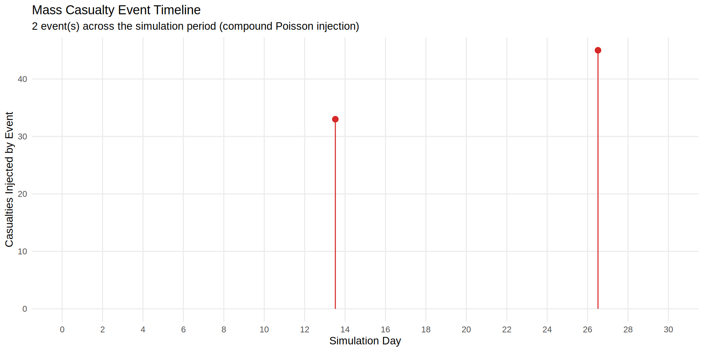

## Conclusion

The single-run analysis, viewed in its entirety, demonstrates that the modelled deployed health system is capable of sustaining a steady operational tempo for a single brigade under baseline casualty assumptions derived from the Falklands conflict. Role 1 elements show sufficient responsiveness and throughput, and the dual-node R2B configuration absorbs surgical demand effectively through a combination of forward surgery and bypass routing to R2E.

Following correction of DNBI sub-categorisation (Issue #7), OT-bypass routing (Issues #35 and #37), and structural analysis of R2B holding capacity (Issue #39), two system constraints are identified. At R2B, holding bed capacity is the binding constraint: the ten beds average 8.2 concurrent occupants and reach or exceed full capacity on 13 days of the run, driven by disease DNBI evacuees occupying hold beds for multi-day durations. Stream decomposition analysis (Issue #39) confirms disease DNBI as the dominant load: expected concurrent hold occupancy of ~17.1 beds exceeds 10-bed capacity by 71%, a structural mismatch not addressable through surgical throughput adjustment. That the shortfall does not appear as a sustained R2B queue is a consequence of the capacity-aware routing policy, which diverted 134 casualties upstream to R2E before transport; the demand is displaced rather than absorbed. Hold bed expansion (≥10 beds per unit) or an evacuation threshold policy are the indicated interventions. OT is not a constraint at R2B, which operates at 5.1–7.3% against 24-hour room time (10.2–14.6% against shift time).

**The primary binding constraint at R2E is the surgical roster, with intensive care a close second.** The four ICU beds operate at 54.2–87.2% utilisation, and the two busiest carry a queue for around a quarter of the run; the three surgical sections run at 24.8%, 53.1% and 19.7% of their rostered time, and the second-shift section is queued for 23.2% of its own roster while carrying the night-time load alone. The R2E Heavy performs 123 first surgeries and 73 second surgeries in the baseline run, compared to 46 at R2B. Strategic airlift is no longer among the constraints: at the sourced C-17A capacity the mean wait for a sortie is about a day and the evacuation backlog peaks at 13 casualties. Three system levers are indicated: R2B holding bed expansion or a higher evacuation threshold from R2B holding, a second-shift surgical section at R2E, and R2E holding beds, which carry in-theatre recovery and the residual evacuation wait on one pool (see README Limitation L17). The OT–ICU gate (Issue #43) does not add capacity; it makes the consequence of the existing shortfall explicit in the model's mortality output rather than absorbing it silently into ICU queue time.

This single-run analysis characterises the Falklands-modified baseline in isolation. Whether these findings generalise, and how the system responds under a materially higher casualty rate, is addressed directly and quantitatively in [Comparative Scenario Analysis](Multi_Run_Analysis.md#comparative-scenario-analysis) (`docs/Multi_Run_Analysis.md`), which compares this baseline against an Okinawa-intensity profile across n≥30 replications with 95% confidence intervals.

---

## References

<small>[Return to Top](#contents)</small>

<!-- REFERENCES START -->

[1] Blood, CG; Zouris, JM; Rotblatt, D; (1998) *Using the Ground Forces Casualty System (FORECAS) to Project Casualty Sustainment*. Retrieved 20 Jul 25, from https://ia803103.us.archive.org/18/items/DTIC_ADA339487/DTIC_ADA339487_text.pdf

[2] Izaguirre, MK; Cox, D; Lodi, PC; Giraud, RS; Murray, CK; Teyhen, DS; Capaldi, VF; Kelly, KM; Taylor, JF; Holland, JC; Laragione, VJ. (March 2025) *To Conserve Fighting Strength in Large Scale Combat Operations*. Military Review Online. Retrieved 20 Jul 25, from https://www.armyupress.army.mil/Journals/Military-Review/Online-Exclusive/2025-OLE/Conserve-Fighting-Strength-in-LSCO/

[3] U.S. Army Medical Department Center and School. *Health Service Support in a Theater of Operations*, Subcourse MD0002, Evacuation Policy. Retrieved 02 Aug 26, from http://armymedical.tpub.com/MD0002/Evacuation-Policy-Health-Service-Support-in-a-Theater-of-Operations-88.htm

<!-- REFERENCES END -->
